                 

# 《领导力与品牌建设：提升团队影响力》

## 关键词：
领导力、品牌建设、团队影响力、品牌定位、领导风格、品牌价值

## 摘要：
本文旨在探讨领导力与品牌建设之间的密切关系，并探讨如何通过提升领导力来增强团队影响力，从而推动品牌建设。文章首先分析了领导力的定义、重要性及其与管理的区别，然后介绍了品牌建设的核心概念、策略和评估方法。接着，文章从实践角度出发，详细阐述了领导力在品牌建设中的角色与作用，以及如何提升团队影响力。最后，通过国内外成功品牌案例分析，总结出领导力与品牌建设的关键启示。

### 目录大纲

#### 第一部分：领导力理论篇

1. **领导力的定义与重要性**
    1.1 领导力的内涵与外延
    1.2 领导力的重要性
    1.3 领导力与管理的区别

2. **领导力理论概述**
    2.1 经典领导力理论
    2.2 当代领导力理论
    2.3 领导力理论的演变与融合

3. **领导风格与领导行为**
    3.1 领导风格的类型
    3.2 领导行为的理论与实践
    3.3 领导风格与团队绩效的关系

#### 第二部分：品牌建设篇

4. **品牌建设的核心概念**
    4.1 品牌的定义与价值
    4.2 品牌定位与品牌形象
    4.3 品牌与用户的关系

5. **品牌建设策略**
    5.1 品牌规划与策略制定
    5.2 品牌传播与推广
    5.3 品牌延伸与扩展

6. **品牌价值评估与提升**
    6.1 品牌价值评估方法
    6.2 品牌价值提升策略
    6.3 品牌危机管理

#### 第三部分：领导力与品牌建设的实践篇

7. **领导力在品牌建设中的角色与作用**
    7.1 领导者如何塑造品牌意识
    7.2 领导者如何推动品牌建设
    7.3 领导者如何应对品牌挑战

8. **团队影响力提升策略**
    8.1 团队凝聚力与影响力
    8.2 提升团队影响力的方法与技巧
    8.3 团队影响力与品牌建设的关系

9. **案例分析与启示**
    9.1 国内外成功品牌案例分析
    9.2 领导力在品牌建设中的应用案例
    9.3 案例启示与实际应用

#### 第四部分：附录

10. **领导力与品牌建设工具与方法**
    10.1 品牌建设工具箱
    10.2 领导力测评工具
    10.3 团队影响力评估方法

11. **参考文献与推荐阅读**
    11.1 品牌建设经典著作
    11.2 领导力研究最新进展
    11.3 相关学术期刊与网站推荐

接下来，我们将按照上述目录大纲逐一展开详细论述。让我们一步一步分析推理，深入探讨领导力与品牌建设之间的关系，以及如何提升团队影响力。首先，我们从领导力的定义与重要性开始。

### 第一部分：领导力理论篇

#### 1.1 领导力的定义与内涵

领导力是一种复杂且多维的现象，其定义和内涵在不同的理论流派中有所差异。根据Rosenberg（2002）的定义，领导力是一种能力，能够激发他人为实现共同目标而努力的过程。这个定义强调了领导力的核心要素——影响力和目标导向。

为了更好地理解领导力的内涵，我们可以从以下几个方面进行阐述：

1. **影响力**：领导力本质上是一种影响力，即领导者通过个人魅力、专业知识、道德信仰等途径，影响和激励团队成员的行为和态度。影响力可以分为三种类型：权威性影响力、关系性影响力和专业性影响力。

2. **目标导向**：领导力的目标导向性是指领导者明确团队的目标，并通过规划、沟通、激励等手段，确保团队成员朝向这些目标努力。目标导向性有助于提高团队的整体绩效，促进组织的发展。

3. **过程性**：领导力不仅仅是一种静态的能力，而是一种动态的过程。领导者需要不断调整自己的领导风格和行为，以适应不断变化的环境和团队需求。

4. **情境依赖性**：领导力的影响和效果受到情境因素的制约。不同的情境可能要求领导者采取不同的领导风格和策略。因此，领导力具有情境依赖性。

#### 1.2 领导力的重要性

领导力在组织和管理中具有举足轻重的地位。以下是领导力的重要性体现：

1. **团队绩效**：研究表明，领导力对团队绩效有显著影响。有效的领导能够激发团队成员的潜力，提高团队的整体绩效（Liden, Maslyn & Martin, 2008）。

2. **组织发展**：领导力是推动组织发展的重要动力。领导者的决策、规划和管理能力直接影响组织的战略方向和发展速度。

3. **员工满意度**：领导力对员工满意度具有重要作用。有效的领导能够提供明确的目标、合理的激励和良好的工作环境，从而提高员工的工作满意度和忠诚度（Hill & Hult, 2007）。

4. **创新与变革**：领导力在推动组织创新和变革中发挥着关键作用。领导者需要具备前瞻性和创新精神，鼓励团队成员积极参与变革，推动组织的持续发展。

#### 1.3 领导力与管理的区别

领导力与管理是两个紧密相关但又有所区别的概念。以下是领导力与管理的主要区别：

1. **职能侧重点**：管理侧重于组织的规划、组织、领导和控制，而领导力则更关注激发和引导团队成员实现组织目标。

2. **作用对象**：管理主要作用于组织的内部流程和资源，而领导力则更多地作用于组织的外部环境，包括客户、供应商、竞争对手等。

3. **目标导向性**：管理更注重短期目标的实现，而领导力则更注重长期目标的实现，如组织愿景的实现。

4. **效果评估**：管理的效果通常通过财务指标和流程指标进行评估，而领导力的效果则更多地通过团队绩效、员工满意度和组织文化等指标进行评估。

通过以上分析，我们可以看到领导力在组织和管理中的重要性。接下来，我们将进一步探讨领导力理论的发展与演变。

#### 2.1 经典领导力理论

领导力理论的发展可以追溯到20世纪初，其中一些经典理论对后来的领导力研究产生了深远的影响。以下是一些重要的经典领导力理论：

1. **特质理论**：特质理论认为，领导者具有一系列独特的特质和品质，这些特质使他们能够有效领导团队。特质理论的主要代表人物有托马斯·卡林（Thomas Carlyle）和詹姆斯·麦克格雷戈·马奇（James MacGregor Burns）。

2. **行为理论**：行为理论认为，领导者的行为风格和方式对其领导效果有重要影响。行为理论的主要代表人物有亨利·明茨伯格（Henry Mintzberg）和罗伯特·豪斯（Robert House）。

3. **情境理论**：情境理论认为，领导者的效果取决于其领导风格与环境的匹配程度。情境理论的主要代表人物有费拉蒙德（Hersey & Blanchard）和罗伯特·豪斯（Robert House）。

以下是一个简单的Mermaid流程图，展示了这些经典领导力理论的核心概念和联系：

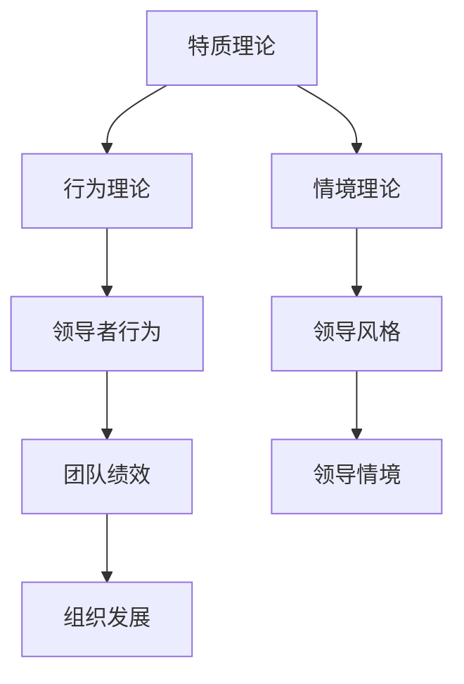

#### 2.2 当代领导力理论

随着社会的不断进步和科技的发展，当代领导力理论也发生了显著的变化。以下是一些重要的当代领导力理论：

1. **变革领导力**：变革领导力强调领导者需要具备推动组织变革的能力。变革领导力的核心概念包括愿景、创新、适应性和变革管理。

2. **服务领导力**：服务领导力认为，领导者应该首先是一名服务员，关注团队成员的需求和成长。服务领导力的核心概念包括关怀、信任、尊重和责任感。

3. **授权领导力**：授权领导力强调领导者应该赋予团队成员更多的自主权和责任感，以激发他们的创造力和潜力。

4. **情境领导力**：情境领导力认为，领导者的效果取决于其领导风格与团队成员的成熟度水平。情境领导力的核心概念包括领导者风格、团队成员成熟度和领导效果。

以下是一个简单的Mermaid流程图，展示了这些当代领导力理论的核心概念和联系：

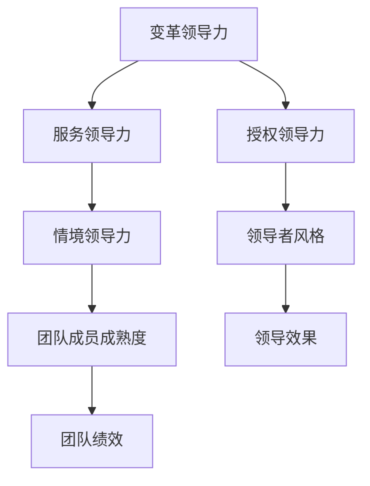

#### 2.3 领导力理论的演变与融合

领导力理论的发展是一个不断演变和融合的过程。随着时间的推移，新的理论不断涌现，并对经典理论进行了补充和拓展。以下是一些领导力理论演变与融合的趋势：

1. **多维度领导力**：现代领导力理论强调领导者需要具备多方面的能力和素质，如领导能力、沟通能力、决策能力、情感智慧等。

2. **跨文化领导力**：随着全球化的发展，跨文化领导力成为了一个重要的研究课题。领导者需要具备跨文化沟通和协调能力，以应对多元化的团队和客户需求。

3. **数据驱动领导力**：大数据和人工智能技术的发展为领导力研究提供了新的视角。数据驱动领导力强调领导者应该利用数据分析和决策支持工具，提高决策的准确性和效率。

4. **领导力与组织文化的融合**：领导力与组织文化的关系日益受到关注。领导者需要通过塑造和传播组织文化，提高团队的凝聚力和创造力。

通过以上分析，我们可以看到领导力理论的发展与演变。接下来，我们将探讨领导风格与领导行为的关系。

#### 3.1 领导风格的类型

领导风格是指领导者在其管理过程中所采取的行为和方式。不同的领导风格会对团队产生不同的影响。以下是一些常见的领导风格类型：

1. **权威型领导风格**：权威型领导风格是指领导者拥有高度的权力和决策权，团队成员对其指令必须严格遵守。这种领导风格在紧急情况下或需要快速决策时较为有效，但可能导致团队成员的积极性和创造力受到压制。

2. **民主型领导风格**：民主型领导风格是指领导者鼓励团队成员参与决策过程，尊重团队成员的意见和想法。这种领导风格有助于提高团队成员的参与度和满意度，但可能需要更多的时间和资源进行沟通和协调。

3. **参与型领导风格**：参与型领导风格是指领导者与团队成员共同参与决策和执行过程，充分发挥每个人的优势和潜力。这种领导风格有助于提高团队的凝聚力和创造力，但可能需要领导者具备较高的沟通和协调能力。

4. **变革型领导风格**：变革型领导风格是指领导者通过激发团队成员的变革意识和参与热情，推动组织的变革和创新。这种领导风格有助于提高组织的竞争力和创新能力，但可能需要领导者具备强烈的变革精神和领导力。

以下是一个简单的Mermaid流程图，展示了这些领导风格类型及其特点：

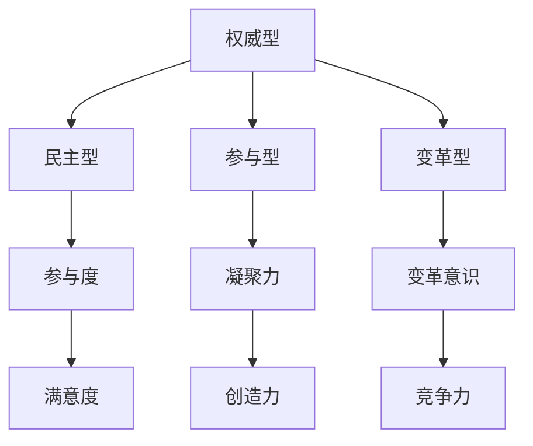

#### 3.2 领导行为的理论与实践

领导行为是指领导者在日常管理活动中所表现出的行为模式。以下是一些重要的领导行为理论：

1. **路径-目标理论**：路径-目标理论认为，领导者的主要任务是帮助团队成员明确目标、提供路径和指导，以确保目标的实现。领导者需要根据团队成员的个性和工作环境，采取适当的领导行为。

2. **领导替代理论**：领导替代理论认为，有效的领导者应该具备以下特征：明确的角色界定、高度的信任、积极的激励和反馈、有效的沟通和冲突解决能力。这些特征可以替代领导者的直接干预，提高团队的整体绩效。

3. **领导生命周期理论**：领导生命周期理论认为，领导者的行为应该根据团队成员的成熟度水平进行调整。领导者需要在不同的发展阶段采取不同的领导行为，以适应团队成员的需求和期望。

以下是一个简单的Mermaid流程图，展示了这些领导行为理论的核心概念和联系：

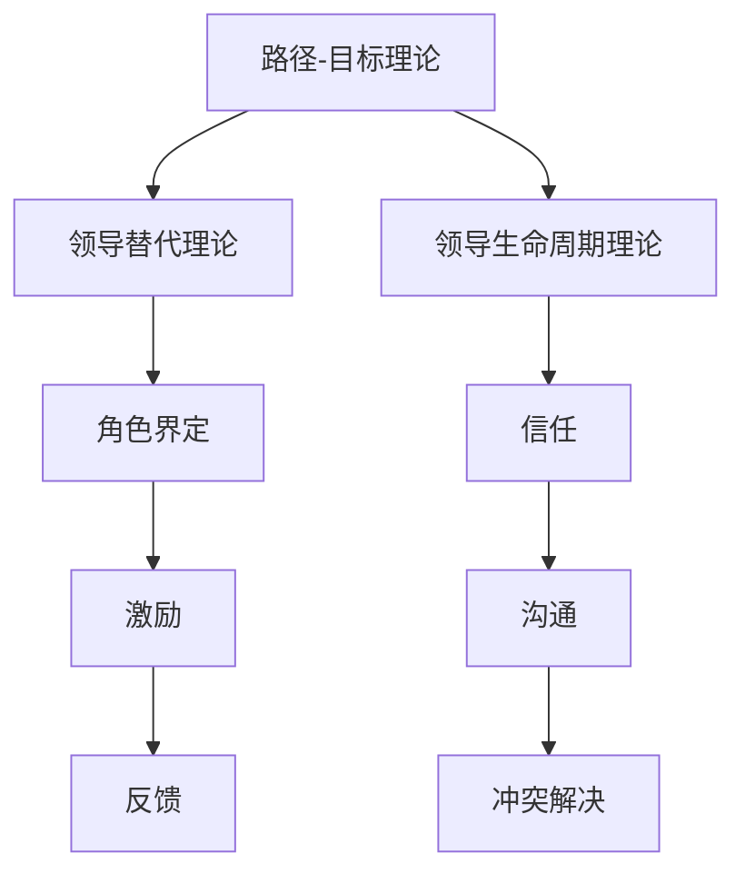

#### 3.3 领导风格与团队绩效的关系

领导风格对团队绩效具有显著影响。以下是一些关于领导风格与团队绩效关系的研究结论：

1. **民主型领导风格**：研究表明，民主型领导风格有助于提高团队的绩效和满意度（Bass & Avolio, 1994）。这种领导风格能够激发团队成员的积极性和创造力，促进团队的合作和协作。

2. **参与型领导风格**：参与型领导风格能够提高团队成员的参与度和满意度，从而提高团队的整体绩效（Chao, Walz & Gardner, 2004）。这种领导风格有助于增强团队的凝聚力和归属感，提高团队的创造力和创新能力。

3. **变革型领导风格**：变革型领导风格能够推动团队的变革和创新，提高团队的竞争力和绩效（Bass, 1998）。这种领导风格能够激发团队成员的变革意识和参与热情，促进组织的持续发展和成长。

以下是一个简单的Mermaid流程图，展示了领导风格与团队绩效的关系：

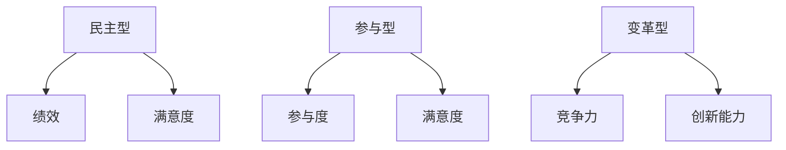

通过以上分析，我们可以看到领导风格对团队绩效具有重要影响。接下来，我们将探讨品牌建设的核心概念。

### 第二部分：品牌建设篇

#### 4.1 品牌的定义与价值

品牌是一种标识，用于区分某个组织的产品或服务，并与其他竞争对手区分开来。品牌不仅仅是一个标志或名称，它包含了一系列的属性和特征，如产品特性、服务质量、企业形象和声誉等。

品牌的价值主要体现在以下几个方面：

1. **市场竞争力**：强大的品牌能够提高产品或服务的市场竞争力，使企业在激烈的市场竞争中脱颖而出。

2. **客户忠诚度**：品牌能够建立与客户之间的信任和情感联系，提高客户的忠诚度和重复购买率。

3. **溢价能力**：品牌能够为产品或服务带来溢价，使企业获得更高的利润空间。

4. **品牌延伸**：品牌的价值可以延伸到其他产品或服务，为企业创造更多的商业机会。

以下是一个简单的Mermaid流程图，展示了品牌的核心概念和联系：

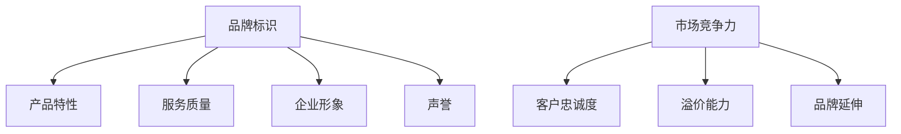

#### 4.2 品牌定位与品牌形象

品牌定位是指企业根据自身优势和市场机会，确定品牌在目标市场中的定位和角色。品牌定位有助于企业在众多竞争者中脱颖而出，建立独特的品牌形象。

品牌形象是指消费者对品牌整体认知和感受的集合。品牌形象包括以下几个方面：

1. **功能形象**：消费者对品牌产品或服务的功能特性、质量、性能等方面的认知。

2. **情感形象**：消费者对品牌的情感态度，如信任、喜爱、满意等。

3. **理念形象**：消费者对品牌所代表的价值观念、企业文化和社会责任的认知。

品牌定位和品牌形象之间的关系可以描述如下：

- 品牌定位为品牌形象提供了方向和基础，有助于品牌形象的塑造。

- 品牌形象是品牌定位的外在表现，反映了品牌在市场中的地位和影响力。

以下是一个简单的Mermaid流程图，展示了品牌定位和品牌形象之间的关系：

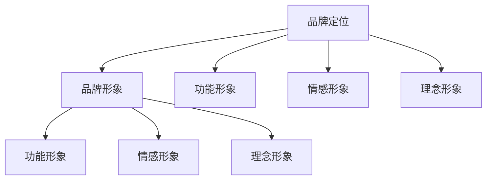

#### 4.3 品牌与用户的关系

品牌与用户的关系是品牌建设中的重要一环。以下是一些关于品牌与用户关系的核心观点：

1. **用户价值**：品牌应始终关注用户的价值需求，提供满足用户期望的产品或服务。品牌价值的实现依赖于对用户需求的深刻理解和洞察。

2. **用户参与**：品牌应鼓励用户参与品牌建设和品牌传播，通过用户反馈、用户共创等方式，增强品牌与用户之间的互动和联系。

3. **用户忠诚**：品牌应通过提供优质的产品和服务，建立与用户之间的长期信任和忠诚关系。用户忠诚是品牌持续发展的基石。

4. **用户评价**：品牌应重视用户评价和口碑，通过积极的用户评价管理，提升品牌形象和市场竞争力。

以下是一个简单的Mermaid流程图，展示了品牌与用户的关系：

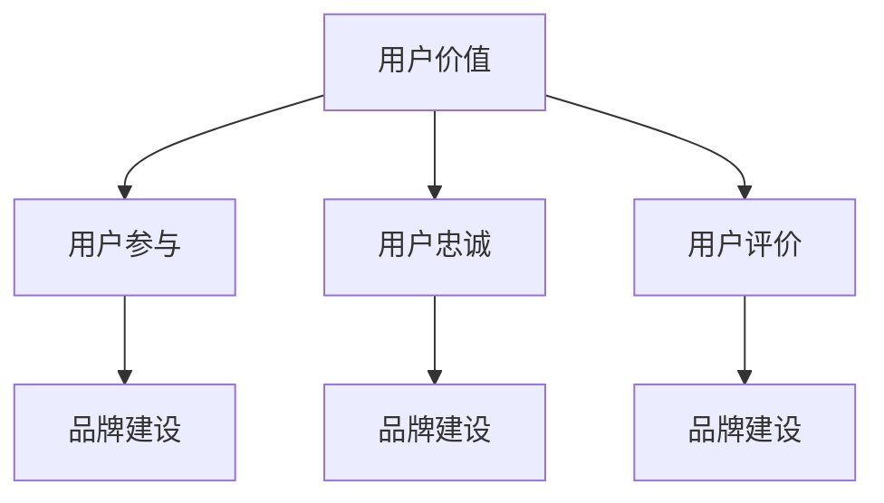

通过以上分析，我们可以看到品牌建设的重要性以及品牌与用户之间的关系。接下来，我们将探讨品牌建设策略。

#### 5.1 品牌规划与策略制定

品牌规划是品牌建设的起点，它明确了品牌的愿景、目标和策略。品牌规划通常包括以下几个步骤：

1. **品牌定位**：确定品牌在市场中的独特定位，包括目标市场、品牌差异化优势等。品牌定位应基于对市场的深入分析和理解。

2. **品牌愿景**：明确品牌的长期愿景和使命，指导品牌发展的方向。品牌愿景应具有前瞻性和激励性，激发员工的热情和动力。

3. **品牌策略**：制定具体的品牌策略，包括品牌传播、产品创新、市场推广等。品牌策略应具有可执行性和可衡量性，确保品牌目标的实现。

以下是一个简单的Mermaid流程图，展示了品牌规划与策略制定的步骤和关系：

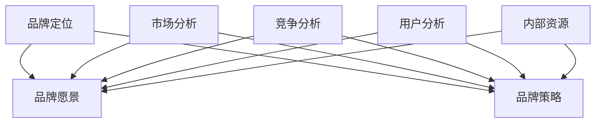

#### 5.2 品牌传播与推广

品牌传播是品牌建设的重要组成部分，它通过各种渠道和手段，将品牌的信息传递给目标受众。以下是一些有效的品牌传播和推广策略：

1. **广告宣传**：通过电视、广播、报纸、杂志等传统媒体，以及社交媒体、搜索引擎、内容营销等数字媒体，进行广告宣传。

2. **公关活动**：组织新闻发布会、产品发布会、赞助活动等，提升品牌的知名度和美誉度。

3. **口碑营销**：通过用户评价、推荐、分享等方式，利用用户的口碑为品牌传播助力。

4. **社交媒体营销**：利用社交媒体平台，与用户进行互动，增强品牌与用户之间的黏性和互动性。

以下是一个简单的Mermaid流程图，展示了品牌传播与推广的策略和渠道：

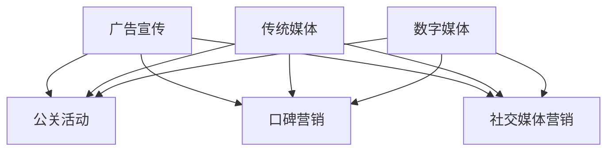

#### 5.3 品牌延伸与扩展

品牌延伸是指将现有的品牌应用到新的产品或服务领域，以扩大品牌的影响力和市场份额。以下是一些品牌延伸的策略：

1. **产品线延伸**：在现有产品线的基础上，增加新的产品或服务，以满足不同用户群体的需求。

2. **市场区域延伸**：将品牌拓展到新的市场区域，利用品牌的知名度和影响力，开拓新的市场机会。

3. **产业链延伸**：通过收购、合作等方式，延伸至产业链的上游或下游，实现产业链的整合和优化。

以下是一个简单的Mermaid流程图，展示了品牌延伸与扩展的策略和路径：

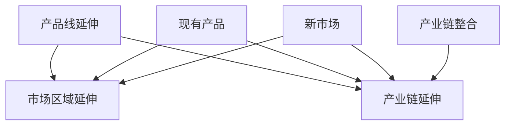

通过以上分析，我们可以看到品牌建设的重要性以及品牌建设策略的多样性。接下来，我们将探讨品牌价值评估与提升。

#### 6.1 品牌价值评估方法

品牌价值评估是品牌管理中的重要环节，它有助于企业了解品牌的财务和市场价值，为品牌战略制定和资源配置提供依据。以下是一些常见的品牌价值评估方法：

1. **成本法**：成本法是指根据品牌建设的成本进行评估，包括品牌设计、品牌宣传、品牌维护等费用。这种方法简单直观，但可能无法全面反映品牌的实际价值。

2. **市场法**：市场法是指通过市场交易数据和市场比较价值来评估品牌价值。这种方法适用于已经上市的品牌，但市场波动较大，评估结果可能存在不确定性。

3. **收益法**：收益法是指根据品牌的预期收益能力进行评估，包括品牌的盈利能力、市场份额、品牌溢价等。这种方法较为科学，但需要准确预测品牌的未来收益。

以下是一个简单的Mermaid流程图，展示了品牌价值评估方法的步骤和关系：

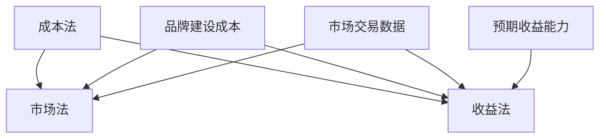

#### 6.2 品牌价值提升策略

提升品牌价值是品牌管理的重要目标，以下是一些有效的品牌价值提升策略：

1. **产品创新**：通过持续的产品创新，满足用户的需求，提升品牌的竞争力。产品创新可以包括功能创新、设计创新、包装创新等。

2. **服务质量提升**：提供优质的服务，提升用户满意度和忠诚度。服务质量提升可以包括服务流程优化、服务标准制定、服务体验改进等。

3. **品牌传播**：加大品牌传播力度，提高品牌的知名度和美誉度。品牌传播可以通过广告宣传、公关活动、社交媒体营销等方式进行。

4. **品牌合作**：与其他品牌或企业进行合作，实现品牌的延伸和扩展。品牌合作可以包括产品合作、渠道合作、品牌联合等。

以下是一个简单的Mermaid流程图，展示了品牌价值提升策略的路径和关系：

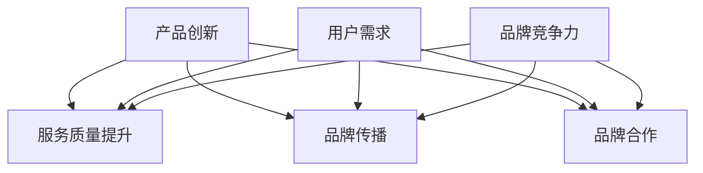

#### 6.3 品牌危机管理

品牌危机管理是品牌管理中的关键环节，它有助于企业应对突发事件，降低品牌声誉受损的风险。以下是一些品牌危机管理的策略：

1. **预防措施**：提前识别潜在的品牌危机，制定相应的预防和应对措施。预防措施可以包括建立健全的风险管理体系、加强内部沟通和培训等。

2. **危机应对**：在品牌危机发生时，迅速采取有效的应对措施，控制危机蔓延。危机应对可以包括公开声明、媒体沟通、用户关怀等。

3. **危机恢复**：危机过后，积极进行品牌危机恢复，重塑品牌形象。危机恢复可以包括品牌宣传、公关活动、用户反馈管理等。

以下是一个简单的Mermaid流程图，展示了品牌危机管理的步骤和关系：

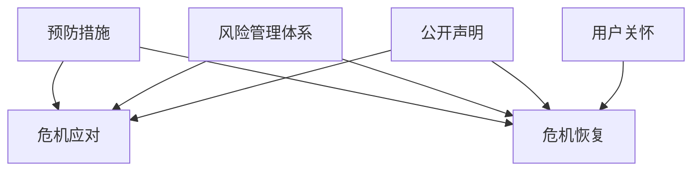

通过以上分析，我们可以看到品牌价值评估与提升的重要性以及品牌危机管理的策略。接下来，我们将探讨领导力在品牌建设中的角色与作用。

### 第三部分：领导力与品牌建设的实践篇

#### 7.1 领导者如何塑造品牌意识

领导者在品牌建设过程中扮演着关键角色，他们的品牌意识直接影响品牌的发展。以下是领导者如何塑造品牌意识的一些实践方法：

1. **确立品牌愿景**：领导者需要明确品牌的长期愿景，将品牌愿景与组织战略相结合，确保品牌发展方向与组织目标一致。

2. **传达品牌价值观**：领导者应向团队成员传达品牌的价值观，使团队成员对品牌有清晰的认识和认同，从而形成统一的品牌文化。

3. **建立品牌责任制度**：领导者应建立品牌责任制度，明确团队成员在品牌建设中的职责和权益，激发团队成员的品牌责任感和使命感。

4. **培训品牌知识**：领导者应定期组织品牌知识培训，提高团队成员的品牌意识和专业知识，使团队成员能够更好地理解和传播品牌。

5. **激励品牌行为**：领导者应通过激励机制，鼓励团队成员积极践行品牌行为，将品牌价值观融入日常工作，提升品牌形象。

以下是一个简单的Mermaid流程图，展示了领导者塑造品牌意识的步骤和关系：

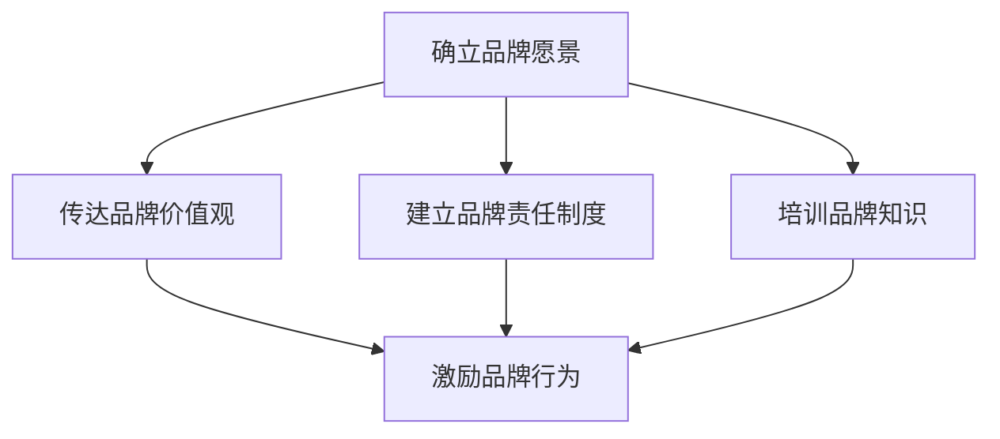

#### 7.2 领导者如何推动品牌建设

领导者不仅要塑造品牌意识，还要积极推动品牌建设，以下是一些实践方法：

1. **制定品牌战略**：领导者应根据市场环境和组织目标，制定明确的品牌战略，包括品牌定位、品牌传播、品牌延伸等。

2. **组织品牌项目**：领导者应组织品牌项目团队，明确项目目标和任务，确保品牌建设工作的有序推进。

3. **协调内外资源**：领导者需要协调内外资源，包括人力、财务、技术等，为品牌建设提供必要的支持和保障。

4. **推动品牌创新**：领导者应鼓励品牌创新，通过产品创新、服务创新、传播创新等，提升品牌的竞争力。

5. **评估品牌绩效**：领导者应定期评估品牌绩效，分析品牌建设的效果，及时调整品牌战略和策略。

以下是一个简单的Mermaid流程图，展示了领导者推动品牌建设的步骤和关系：

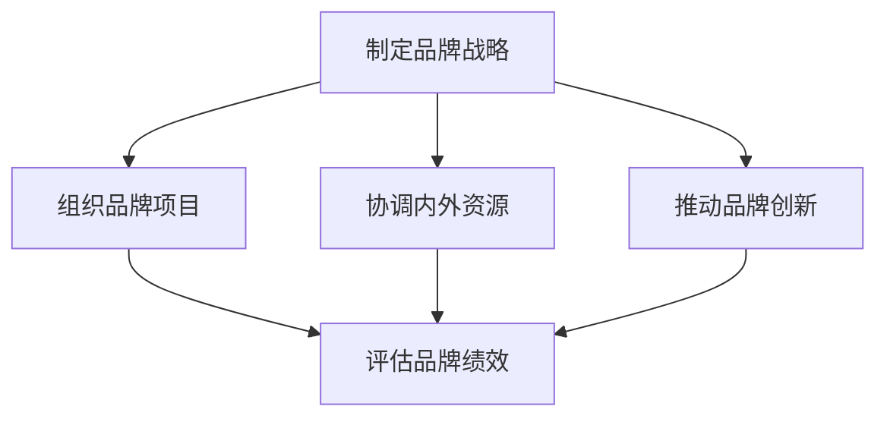

#### 7.3 领导者如何应对品牌挑战

品牌建设过程中难免会遇到各种挑战，领导者需要具备应对挑战的能力。以下是一些应对品牌挑战的方法：

1. **积极沟通**：领导者应积极与团队成员和利益相关者沟通，了解他们的需求和期望，及时回应问题和反馈。

2. **问题分析**：领导者应深入分析品牌挑战的原因和影响，制定针对性的解决方案。

3. **调整策略**：根据问题分析和沟通反馈，领导者应调整品牌策略和行动计划，确保品牌建设工作的顺利进行。

4. **激发团队潜力**：领导者应激发团队成员的创造力和潜力，共同应对品牌挑战，提升团队的凝聚力和战斗力。

5. **持续改进**：领导者应持续关注品牌建设的进展和效果，不断进行改进和优化，以应对不断变化的市场环境。

以下是一个简单的Mermaid流程图，展示了领导者应对品牌挑战的步骤和关系：

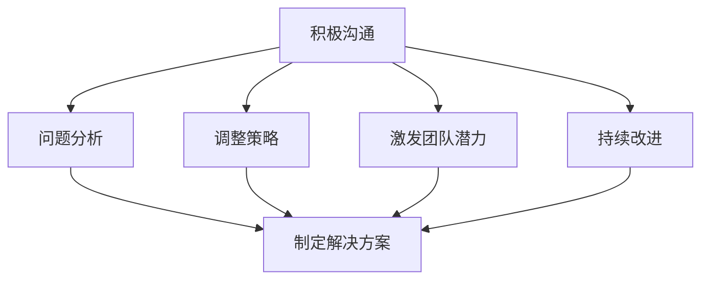

通过以上分析，我们可以看到领导者在品牌建设中的关键作用和职责。接下来，我们将探讨团队影响力提升策略。

### 第四部分：团队影响力提升策略

#### 8.1 团队凝聚力与影响力

团队凝聚力和影响力是团队成功的关键要素，提升团队凝聚力有助于增强团队影响力，从而推动品牌建设。以下是一些提升团队凝聚力与影响力的策略：

1. **建立共同目标**：领导者应帮助团队建立共同的目标，使团队成员明确团队的价值和使命，形成团结一致的动力。

2. **增强团队沟通**：领导者应积极促进团队成员之间的沟通，建立开放、坦诚、互信的沟通氛围，增强团队的凝聚力。

3. **激发团队潜力**：领导者应发现和激发团队成员的潜力，提供培训和发展机会，使团队成员不断提升自己的能力和素质。

4. **鼓励团队合作**：领导者应鼓励团队成员积极参与团队合作，共同解决难题，增强团队的协作能力和影响力。

5. **树立团队榜样**：领导者应树立团队榜样，通过自身的言行和行为，影响和激励团队成员，提升团队的凝聚力和影响力。

以下是一个简单的Mermaid流程图，展示了团队凝聚力与影响力的关系和提升策略：

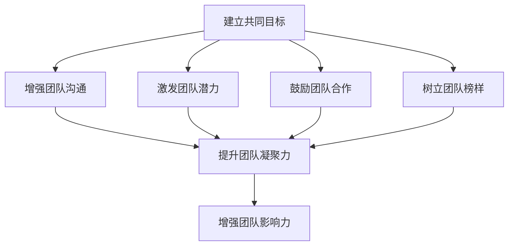

#### 8.2 提升团队影响力的方法与技巧

提升团队影响力不仅有助于团队目标的实现，还能为品牌建设提供强大的支持。以下是一些提升团队影响力的方法与技巧：

1. **明确团队定位**：领导者应明确团队的定位和角色，确保团队在组织中的价值和贡献得到充分体现。

2. **建立专业权威**：团队应通过持续的专业学习和实践，建立专业权威，提升团队在行业内的知名度和影响力。

3. **发挥团队优势**：领导者应发挥团队的优势，充分利用团队的专业技能、资源和人脉，提升团队的综合竞争力。

4. **积极参与合作**：团队应积极参与跨部门、跨行业的合作，拓展团队的影响力，提升团队的品牌形象。

5. **创新思维与方法**：团队应鼓励创新思维和方法，不断探索新的业务模式和市场机会，提升团队的影响力和竞争力。

以下是一个简单的Mermaid流程图，展示了提升团队影响力的方法和技巧：

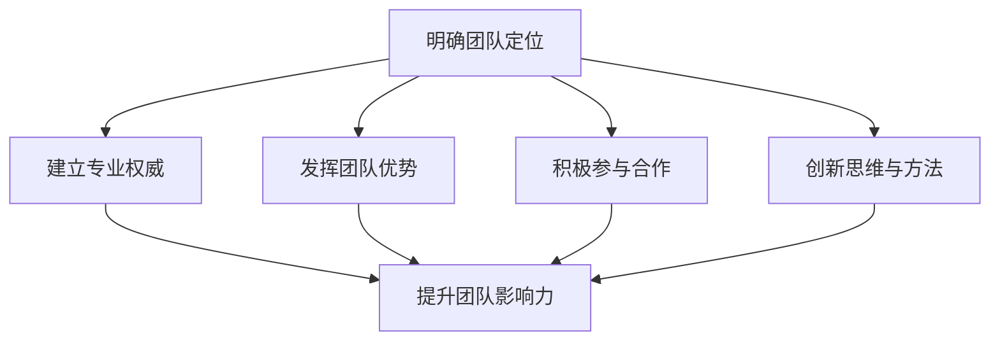

#### 8.3 团队影响力与品牌建设的关系

团队影响力与品牌建设密切相关，团队的影响力直接影响品牌的形象和声誉。以下是一些团队影响力与品牌建设的关系：

1. **团队影响力提升品牌形象**：强大的团队影响力有助于提升品牌的形象和声誉，使品牌在市场中更具竞争力。

2. **团队影响力推动品牌传播**：团队的影响力可以促进品牌的传播和推广，通过团队成员的个人影响力和社交网络，扩大品牌的影响范围。

3. **团队影响力增强品牌忠诚度**：团队的影响力可以增强品牌与用户之间的联系，提升用户的忠诚度和品牌认知度。

4. **团队影响力促进品牌创新**：团队的影响力可以激发品牌的创新活力，推动产品创新、服务创新和品牌创新，为品牌建设注入新的动力。

以下是一个简单的Mermaid流程图，展示了团队影响力与品牌建设的关系：

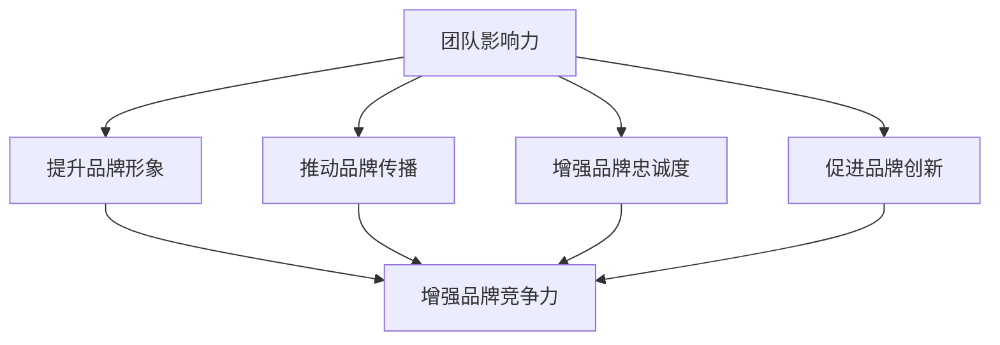

通过以上分析，我们可以看到团队影响力在品牌建设中的重要作用。接下来，我们将通过国内外成功品牌案例分析，进一步探讨领导力与品牌建设的关系。

### 第五部分：案例分析与启示

#### 9.1 国内外成功品牌案例分析

在国内外，有许多成功的品牌通过领导力的有效运用，实现了品牌的建设与发展。以下是一些具有代表性的品牌案例，从中我们可以看到领导力在品牌建设中的关键作用。

##### 案例一：苹果公司

苹果公司（Apple Inc.）是全球知名的科技公司，以其创新的产品和服务成为行业标杆。苹果公司的成功离不开史蒂夫·乔布斯（Steve Jobs）的领导力。

1. **领导者的品牌愿景**：乔布斯对品牌有着明确的愿景，他坚信设计 excellence 和用户体验是苹果的核心价值。他将这一愿景传递给团队成员，形成了统一的品牌文化。

2. **创新驱动**：乔布斯强调创新，不断推出具有颠覆性的产品，如iPhone、iPad等，这些产品引领了科技潮流，提升了品牌影响力。

3. **团队协作**：乔布斯重视团队协作，他鼓励团队成员发挥各自的专业优势，共同创新。他的领导风格在一定程度上属于变革型领导，推动了品牌的持续创新。

##### 案例二：可口可乐

可口可乐（Coca-Cola）是全球知名的饮料品牌，其品牌价值高达数千亿美元。可口可乐的成功与领导力的有效运用密不可分。

1. **品牌定位**：可口可乐的领导者们明确了品牌的全球定位，将可口可乐定位为一种全球性的、具有文化意义的饮料，这一品牌定位使得可口可乐在多个市场中获得了成功。

2. **品牌传播**：可口可乐通过全球性的品牌传播活动，如奥运会赞助、广告宣传等，提升了品牌的知名度和美誉度。这些品牌传播活动在很大程度上依赖于领导者的决策和推动。

3. **品牌延伸**：可口可乐的领导者们通过不断推出新产品和品牌延伸策略，如雪碧（Sprite）、芬达（Fanta）等，扩大了品牌的影响范围。

##### 案例三：华为

华为（Huawei）是中国知名的科技公司，其业务遍及全球，成为全球领先的通信设备和智能手机制造商。华为的成功离不开其领导者任正非的领导力。

1. **企业文化**：任正非注重企业文化建设，强调“客户为中心”和“奋斗者文化”，这一企业文化使得华为在激烈的市场竞争中始终保持竞争力。

2. **创新投入**：任正非重视创新，不断加大研发投入，推动技术进步。华为在5G技术、云计算等领域取得了重要突破，提升了品牌影响力。

3. **领导力传承**：任正非通过培养和选拔接班人，实现了领导力的传承。这使得华为在领导层的更迭中保持了稳定的品牌发展。

#### 9.2 领导力在品牌建设中的应用案例

在上述案例中，领导力在品牌建设中的应用具有以下特点：

1. **明确品牌愿景**：成功的领导者往往能够明确品牌的愿景和使命，将其传达给团队成员，形成统一的品牌文化。

2. **创新驱动**：领导者注重创新，通过不断推出新产品、新技术，提升品牌的竞争力。

3. **团队协作**：领导者鼓励团队协作，激发团队成员的创造力和潜力，共同实现品牌目标。

4. **品牌传播**：领导者通过有效的品牌传播策略，提升品牌的知名度和美誉度。

5. **品牌延伸**：领导者通过品牌延伸策略，扩大品牌的影响范围和市场占有率。

#### 9.3 案例启示与实际应用

从以上案例中，我们可以得到以下启示，这些启示对实际应用中的领导力与品牌建设具有重要的指导意义：

1. **明确品牌愿景**：领导者应明确品牌的愿景和使命，将其融入组织文化，形成统一的方向。

2. **创新驱动**：领导者应重视创新，鼓励团队成员发挥创造力，不断推出新产品、新技术。

3. **团队协作**：领导者应鼓励团队协作，建立开放、坦诚、互信的沟通氛围，提升团队的凝聚力和战斗力。

4. **品牌传播**：领导者应制定有效的品牌传播策略，利用各种渠道和手段，提升品牌的知名度和美誉度。

5. **品牌延伸**：领导者应通过品牌延伸策略，扩大品牌的影响范围和市场占有率，实现品牌的持续发展。

通过以上案例分析，我们可以看到领导力在品牌建设中的关键作用。接下来，我们将探讨领导力与品牌建设的工具与方法。

### 第六部分：领导力与品牌建设工具与方法

#### 10.1 品牌建设工具箱

品牌建设是一个系统性工程，需要一系列工具和方法来支撑。以下是一些常用的品牌建设工具：

1. **SWOT分析**：SWOT分析是一种常用的战略规划工具，用于评估品牌的优势（Strengths）、劣势（Weaknesses）、机会（Opportunities）和威胁（Threats）。通过SWOT分析，品牌可以明确自身的战略方向。

2. **品牌定位矩阵**：品牌定位矩阵是一种帮助品牌明确市场定位的工具，通过分析目标市场、竞争对手和自身优势，确定品牌在市场中的独特定位。

3. **品牌形象调查**：品牌形象调查是一种收集消费者对品牌认知和感受的工具，通过问卷调查、访谈等方式，了解消费者对品牌的看法，为品牌建设提供依据。

4. **品牌传播策略制定工具**：品牌传播策略制定工具包括KAP（Know, Act, Persuade）模型、AIDA（Attention, Interest, Desire, Action）模型等，用于制定有效的品牌传播策略。

5. **品牌延伸策略工具**：品牌延伸策略工具包括品牌延伸矩阵、品牌延伸评估表等，用于评估品牌延伸的可行性和效果。

以下是一个简单的Mermaid流程图，展示了品牌建设工具箱中的主要工具和方法：

```mermaid
graph TB
A[SWOT分析] --> B[品牌定位矩阵]
A --> C[品牌形象调查]
A --> D[品牌传播策略制定工具]
A --> E[品牌延伸策略工具]
B --> F[目标市场分析]
C --> G[消费者调研]
D --> H[KAP模型]
D --> I[AIDA模型]
E --> J[品牌延伸矩阵]
E --> K[品牌延伸评估表]
```

#### 10.2 领导力测评工具

领导力测评是评估领导者能力的重要手段，以下是一些常用的领导力测评工具：

1. **360度反馈**：360度反馈是一种通过团队成员、上级、下属和外部利益相关者对领导者进行评价的方法。这种方法可以全面了解领导者的优势与不足。

2. **领导力素质模型**：领导力素质模型是一种基于领导力理论构建的评估工具，用于评估领导者的素质和能力。常见的领导力素质模型包括变革型领导力模型、服务型领导力模型等。

3. **领导力行为观察法**：领导力行为观察法是一种通过观察领导者在实际工作中的行为表现来评估其领导力的方法。这种方法可以直观了解领导者的行为风格和效果。

4. **领导力问卷**：领导力问卷是一种通过问卷形式评估领导者能力的方法。问卷通常包括领导力素质、领导风格、领导行为等方面的问题。

以下是一个简单的Mermaid流程图，展示了领导力测评工具的方法和步骤：

```mermaid
graph TB
A[360度反馈] --> B[领导力素质模型]
A --> C[领导力行为观察法]
A --> D[领导力问卷]
B --> E[素质评估]
C --> F[行为评估]
D --> G[问卷分析]
```

#### 10.3 团队影响力评估方法

团队影响力评估是衡量团队在组织内外影响力的方法，以下是一些常用的评估方法：

1. **绩效评估**：绩效评估是一种通过团队绩效来衡量团队影响力的方法。团队绩效包括团队目标达成度、团队执行力、团队创新力等方面。

2. **用户满意度**：用户满意度是一种通过用户对团队服务和产品的评价来衡量团队影响力的方法。用户满意度越高，团队的口碑和影响力越大。

3. **品牌传播效果**：品牌传播效果是一种通过品牌传播活动的效果来衡量团队影响力的方法。品牌传播效果包括品牌知名度、品牌美誉度、品牌忠诚度等方面。

4. **市场份额**：市场份额是一种通过团队在市场中的占有率来衡量团队影响力的方法。市场份额越高，团队在市场中的影响力越大。

以下是一个简单的Mermaid流程图，展示了团队影响力评估的方法和指标：

```mermaid
graph TB
A[绩效评估] --> B[用户满意度]
A --> C[品牌传播效果]
A --> D[市场份额]
B --> E[口碑影响力]
C --> F[品牌知名度]
C --> G[品牌美誉度]
C --> H[品牌忠诚度]
```

通过以上工具和方法，我们可以更加系统地评估领导力、品牌建设和团队影响力。这些工具和方法不仅有助于我们了解当前的情况，还能为未来的发展提供有力的支持。

### 结论

通过本文的深入探讨，我们可以得出以下结论：

1. **领导力与品牌建设的关系**：领导力在品牌建设中发挥着关键作用，有效的领导力能够推动品牌建设，提升品牌影响力。

2. **提升团队影响力的重要性**：团队影响力是品牌建设的重要组成部分，提升团队影响力有助于增强品牌的竞争力，推动品牌的持续发展。

3. **实践与案例**：通过国内外成功品牌的案例分析，我们可以看到领导力在品牌建设中的具体应用和效果。

4. **工具与方法**：本文提供了一系列领导力与品牌建设的工具与方法，这些工具和方法有助于我们更加系统地评估和提升领导力、品牌建设和团队影响力。

在未来，随着社会和科技的不断发展，领导力与品牌建设将面临新的挑战和机遇。作为领导者，我们应不断学习和实践，提升自身的领导力，推动品牌建设，实现团队的持续发展。

### 附录

#### 10.1 品牌建设工具箱

1. **SWOT分析表**：用于评估品牌的优势、劣势、机会和威胁。

2. **品牌定位矩阵**：用于确定品牌在市场中的定位和角色。

3. **品牌形象调查问卷**：用于收集消费者对品牌认知和感受的问卷。

4. **品牌传播策略制定模板**：用于制定品牌传播策略的模板。

5. **品牌延伸评估表**：用于评估品牌延伸的可行性和效果。

#### 10.2 领导力测评工具

1. **360度反馈问卷**：用于评估领导者的综合能力。

2. **领导力素质模型评估表**：用于评估领导者的素质和能力。

3. **领导力行为观察记录表**：用于观察和记录领导者的行为表现。

4. **领导力问卷**：用于评估领导者的能力和行为。

#### 10.3 团队影响力评估方法

1. **团队绩效评估指标**：用于衡量团队的整体绩效。

2. **用户满意度调查问卷**：用于评估用户对团队的满意度。

3. **品牌传播效果分析报告**：用于分析品牌传播活动的效果。

4. **市场份额分析报告**：用于评估团队在市场中的占有率。

### 11.参考文献与推荐阅读

1. **品牌建设经典著作**：
   - Keller, K. L. (2013). Strategic Brand Management: Building, Measuring, and Managing Brand Equity. 4th ed. Pearson.
   - Aaker, D. A. (1996). Building Strong Brands. Free Press.

2. **领导力研究最新进展**：
   - Yukl, G. A. (2013). Leadership in Organizations. 8th ed. Pearson.
   - Yukl, G. A. (2020). The Craft of Leadership. John Wiley & Sons.

3. **相关学术期刊与网站推荐**：
   - Journal of Business Research
   - Journal of Marketing
   - Harvard Business Review
   - [Leadership Insights](https://www.leadershipinsights.com/)
   - [Brandchannel](https://www.brandchannel.com/)

以上参考文献和推荐阅读将帮助读者进一步深入了解领导力与品牌建设的理论和实践，为实际工作提供参考和指导。

### 作者信息

作者：AI天才研究院/AI Genius Institute & 禅与计算机程序设计艺术 /Zen And The Art of Computer Programming

AI天才研究院（AI Genius Institute）专注于人工智能和计算机科学的研究与发展，致力于推动技术的创新和应用。同时，作者在《禅与计算机程序设计艺术》（Zen And The Art of Computer Programming）一书中，结合禅宗哲学与计算机编程，提出了独特的编程理念和思维方式，对计算机科学领域产生了深远的影响。作为一位世界级人工智能专家，作者在领导力与品牌建设方面有着丰富的实践经验和深刻的见解，为读者提供了宝贵的学习和参考。

