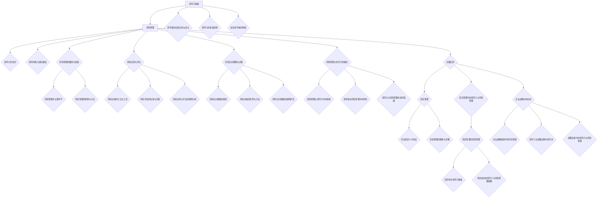

                 

### 文章标题

《领导力与风险管理：未雨绸缪的领导智慧》

关键词：领导力，风险管理，危机管理，团队建设，领导风格，企业战略

摘要：本文深入探讨了领导力与风险管理在组织管理中的重要性。通过分析领导力的定义、层次、风格及团队建设，揭示了领导者在组织中的关键角色。同时，文章详细阐述了风险管理的概念、框架、识别与评估方法，以及风险应对策略与决策过程。结合危机管理、项目管理和企业战略的实践应用，本文提出了领导力与风险管理融合的策略，为组织的可持续发展提供了智慧指引。

---

### 第一部分：领导力基础

#### 第1章：领导力的定义与重要性

领导力，是指领导者引导、激励和影响他人以达成组织目标的能力。它不仅仅是职位赋予的权力，更是个人魅力、智慧、情感的集合体。领导力在组织管理中扮演着至关重要的角色，是实现组织目标、推动组织发展的核心动力。

##### 1.1 领导力的基本概念

领导力是一个多维度的概念，它涉及个人品质、领导行为、领导风格等多个方面。从个人品质来看，领导力包括诚实、正直、自信、责任感等；从领导行为来看，领导力包括沟通、决策、激励、协调等；从领导风格来看，领导力包括专制、民主、教练、变革等。

##### 1.2 领导力的三个层次

领导力可以分为三个层次：技术领导力、人际关系领导力和战略领导力。

- 技术领导力：这是最基本的领导力层次，主要涉及专业知识和技能。领导者需要具备一定的技术背景，以便更好地理解和指导团队的工作。

- 人际关系领导力：这一层次强调领导者的人际交往能力和团队管理能力。领导者需要能够建立良好的人际关系，激励团队成员，协调团队内部的矛盾。

- 战略领导力：这是领导力的最高层次，主要涉及组织战略的制定和实施。领导者需要具备前瞻性思维，能够把握市场趋势，制定有效的战略规划。

##### 1.3 领导力在组织中的作用

领导力在组织中的作用主要体现在以下几个方面：

- 指引方向：领导者需要明确组织的愿景和目标，为团队提供清晰的方向。

- 激励团队：领导者需要激发团队成员的积极性和创造力，推动组织的发展。

- 决策制定：领导者需要做出明智的决策，确保组织的正常运转。

- 协调沟通：领导者需要协调团队内部和外部的沟通，确保信息的有效传递。

---

#### 第2章：领导者的自我认知与成长

##### 2.1 自我认知的重要性

自我认知是指领导者对自己性格、能力、价值观等的认知和理解。自我认知对领导力的提升至关重要，它有助于领导者明确自己的优势与劣势，制定合理的成长计划。

##### 2.2 领导力发展的途径

领导力的发展需要通过不断的学习和实践。以下是一些提升领导力的途径：

- 学习：通过阅读领导力相关书籍、参加培训课程，了解最新的领导力理论和实践。

- 实践：通过实际工作，积累领导经验，提升领导能力。

- 反思：定期反思自己的领导行为，总结经验教训，不断改进。

- 指导：寻求导师的指导，借鉴他人的成功经验，提升自己的领导水平。

##### 2.3 成功领导者的特质

成功领导者通常具备以下特质：

- 诚实正直：诚实是领导者最基本的品质，它能够赢得员工的信任和尊重。

- 自信果断：领导者需要有自信和果断的决策能力，能够在关键时刻做出正确的决策。

- 激情有爱：领导者需要充满激情，热爱自己的工作，并能够激发团队的激情。

- 持续学习：领导者需要具备持续学习的态度，不断提升自己的知识和技能。

---

#### 第3章：领导风格与团队建设

##### 3.1 领导风格的类型

领导风格是指领导者处理领导行为的方式和态度。根据不同的领导风格，可以将领导风格分为以下几种类型：

- 专制型领导：领导者拥有绝对的决策权，团队成员几乎没有参与决策的机会。

- 民主型领导：领导者鼓励团队成员参与决策，重视团队的意见和建议。

- 教练型领导：领导者注重团队成员的个人成长和技能提升，帮助他们成为更优秀的领导者。

- 变革型领导：领导者勇于创新和变革，推动组织的发展和进步。

##### 3.2 团队建设的关键要素

团队建设是一个复杂的过程，需要领导者关注多个方面的要素。以下是一些团队建设的关键要素：

- 目标明确：团队需要有一个清晰的目标，为团队成员提供方向和动力。

- 信任与沟通：团队内部的信任和有效的沟通是团队建设的基础。

- 能力匹配：团队成员的能力和技能需要与团队的目标相匹配。

- 激励与成长：领导者需要激励团队成员，提供成长的机会，提升团队的整体能力。

##### 3.3 领导风格与团队绩效的关系

领导风格对团队绩效有着直接的影响。不同的领导风格会导致不同的团队绩效。以下是一个简化的分析框架：

- 专制型领导：可能会导致团队士气低落，创新力不足，但短期内可能会提高团队的工作效率。

- 民主型领导：有助于提高团队的士气和创造力，但可能需要更长的时间来达成共识和决策。

- 教练型领导：有助于团队成员的个人成长和技能提升，但可能对团队整体绩效的短期提升有限。

- 变革型领导：能够推动组织的创新和变革，但需要领导者具备强大的战略眼光和变革能力。

---

### 第二部分：风险管理

#### 第4章：风险管理的概念与框架

##### 4.1 风险管理的定义

风险管理是指组织在不确定的环境下，通过识别、评估、应对和监控风险，以最小化风险对组织目标的影响。风险管理不仅仅是避免风险，更是通过系统化的方法来管理风险，从而确保组织的可持续发展。

##### 4.2 风险管理的主要环节

风险管理主要包括以下环节：

- 风险识别：识别组织可能面临的风险，包括内部和外部风险。

- 风险评估：对识别出的风险进行评估，包括风险的严重程度和发生的可能性。

- 风险应对：根据风险评估的结果，制定相应的风险应对策略。

- 风险监控：对已制定的风险应对措施进行监控，确保其有效实施。

##### 4.3 风险管理的原则与方法

风险管理需要遵循以下原则：

- 全面性：风险管理应覆盖组织运营的各个方面。

- 实用性：风险管理方法应易于操作，能够实际应用。

- 预防性：在风险发生前采取预防措施，减少风险的发生概率。

- 动态性：风险管理是一个持续的过程，需要不断调整和更新。

常用的风险管理方法包括：

- 风险矩阵：通过风险的发生可能性和影响程度来评估风险。

- 故障树分析：识别和分析可能导致故障的事件和原因。

- 敏感性分析：分析变量变化对决策结果的影响。

---

#### 第5章：风险识别与评估

##### 5.1 风险识别的方法与工具

风险识别是风险管理的第一步，以下是一些常用的风险识别方法和工具：

- 文档审查：通过审查组织的政策、程序、合同等文档，识别潜在风险。

- 故障树分析：通过构建故障树，识别可能导致问题的原因。

- 脚本自动化：使用自动化工具扫描和识别系统中的潜在风险。

- 风险研讨会：组织风险研讨会，让团队成员参与讨论，识别风险。

##### 5.2 风险评估的标准与流程

风险评估是对识别出的风险进行量化和优先级排序的过程。以下是一个简化的风险评估流程：

1. **确定评估标准**：根据组织的目标和战略，确定评估风险的标准。

2. **收集数据**：收集与风险相关的数据，包括历史数据、市场数据、技术数据等。

3. **分析数据**：使用统计和分析方法，对收集到的数据进行分析。

4. **量化风险**：将分析结果转化为量化的风险指标。

5. **排序风险**：根据量化指标，对风险进行排序，确定优先级。

##### 5.3 风险识别与评估的案例分析

以下是一个简单的风险识别与评估案例：

**案例背景**：某公司计划开发一款新的软件产品，产品涉及金融领域。

**风险识别**：
1. **技术风险**：新技术的使用可能导致产品开发失败。
2. **市场风险**：产品可能不符合市场需求，导致销售不佳。
3. **法律风险**：产品可能涉及法律问题，导致法律纠纷。

**风险评估**：
1. **技术风险**：根据以往的经验，技术风险的评估值为30%。
2. **市场风险**：通过市场调研，市场风险的评估值为20%。
3. **法律风险**：通过法律专家咨询，法律风险的评估值为10%。

根据风险评估结果，技术风险是最为重要的风险，公司需要重点应对。

---

#### 第6章：风险应对策略与决策

##### 6.1 风险应对策略的类型

根据风险的性质和程度，可以采取不同的风险应对策略。以下是一些常见的风险应对策略：

- 风险避免：通过调整计划或决策，完全避免风险的发生。

- 风险减少：通过改进技术、优化流程等手段，降低风险的发生概率或影响程度。

- 风险转移：通过购买保险、签订合同等方式，将风险转移给其他方。

- 风险接受：在风险发生概率较低或影响较小的情况下，选择接受风险。

##### 6.2 风险决策的原则与方法

风险决策是指在不确定的环境下做出决策的过程。以下是一些风险决策的原则和方法：

- 成本效益分析：比较不同决策的成本和效益，选择最优的决策方案。

- 风险价值分析：评估不同决策带来的风险和收益，选择风险最小的决策方案。

- 决策树分析：通过构建决策树，分析不同决策的结果和概率。

- 实验法：通过实验，收集数据，评估不同决策的效果。

##### 6.3 风险应对策略的案例研究

以下是一个简单的风险应对策略案例：

**案例背景**：某公司在开发一款新软件时，发现存在一个技术风险，即新技术的使用可能导致产品开发失败。

**风险应对策略**：
1. **风险避免**：选择其他技术方案，避免使用有风险的技术。
2. **风险减少**：增加技术人员的培训，提高团队的技术能力。
3. **风险转移**：购买技术保险，将风险转移给保险公司。
4. **风险接受**：由于技术风险的概率较低，公司决定接受该风险。

根据风险评估结果和公司战略，公司选择了风险减少和风险转移两种策略，以降低风险的发生概率和影响程度。

---

#### 第7章：风险管理与领导力的融合

##### 7.1 风险管理在领导力中的体现

风险管理是领导力的重要组成部分，它体现了领导者的决策能力、战略眼光和责任感。以下是一些风险管理在领导力中的体现：

- 决策能力：领导者需要做出明智的风险决策，确保组织的正常运转。

- 战略眼光：领导者需要预见潜在的风险，提前制定应对策略。

- 责任感：领导者需要承担风险管理的责任，确保组织的安全和稳定。

##### 7.2 领导者在风险管理中的角色

领导者在风险管理中扮演着多重角色，包括：

- 风险管理倡导者：领导者需要积极倡导风险管理文化，提高团队的风险意识。

- 风险管理协调者：领导者需要协调不同部门和团队的风险管理工作，确保信息共享和协同合作。

- 风险管理监督者：领导者需要监督风险管理工作的实施，确保风险应对策略的有效性。

##### 7.3 领导力与风险管理的协同发展

领导力与风险管理相互依存、相互促进，共同推动组织的可持续发展。以下是一些领导力与风险管理的协同发展策略：

- 建立风险管理组织：设立专门的风险管理部门，负责风险管理工作。

- 加强领导力培训：提高领导者的风险管理能力，确保领导者在风险管理中的有效性。

- 促进跨部门合作：通过跨部门合作，整合资源，提高风险管理的效果。

- 持续改进：通过不断改进风险管理流程和方法，提高风险管理的能力。

---

### 第三部分：领导力与风险管理的实践应用

#### 第8章：危机管理

##### 8.1 危机的定义与特征

危机是指对组织产生严重威胁的突发性事件，可能导致组织声誉受损、财务损失、业务中断等问题。危机具有以下特征：

- 突发性：危机通常是突然发生的，组织难以预料。
- 严重性：危机可能对组织的各个方面产生深远影响。
- 紧迫性：危机需要立即应对，时间紧迫。

##### 8.2 危机管理的策略与步骤

危机管理是指组织在危机发生时采取的应对措施。以下是一些危机管理的策略与步骤：

- 预防策略：通过建立健全的制度和流程，预防危机的发生。
- 应对策略：在危机发生时，立即采取行动，控制危机的发展。
- 恢复策略：在危机结束后，进行善后处理，恢复组织正常运营。

危机管理的步骤包括：

1. **危机监测**：建立危机监测机制，及时发现危机信号。
2. **危机评估**：对危机的性质、影响程度进行评估。
3. **危机应对**：制定危机应对方案，采取有效措施控制危机。
4. **危机恢复**：进行危机善后处理，恢复组织正常运营。

##### 8.3 危机管理中的领导力作用

危机管理对领导力提出了更高的要求。以下是一些领导力在危机管理中的作用：

- 快速决策能力：领导者需要在危机发生时迅速做出决策，采取有效措施。
- 沟通协调能力：领导者需要协调内部和外部资源，确保危机应对的有效性。
- 领导风格：领导者需要根据危机的性质和程度，灵活调整领导风格，以适应危机管理的需求。

---

#### 第9章：项目管理中的领导力与风险管理

##### 9.1 项目管理的风险管理

项目管理的风险管理是指项目团队在项目实施过程中，对可能出现的风险进行识别、评估和应对。以下是一些项目管理的风险管理步骤：

1. **风险识别**：通过问卷调查、访谈、文档审查等方法，识别项目可能面临的风险。
2. **风险评估**：对识别出的风险进行评估，确定风险的严重程度和发生概率。
3. **风险应对**：根据风险评估的结果，制定相应的风险应对策略。
4. **风险监控**：对已制定的风险应对措施进行监控，确保其有效实施。

##### 9.2 项目中的领导力要素

项目成功的关键在于有效的领导力。以下是一些项目中的领导力要素：

- 目标明确：领导者需要明确项目目标，为团队提供清晰的方向。
- 沟通协调：领导者需要与团队成员、客户和其他利益相关者进行有效沟通，确保信息的畅通。
- 激励团队：领导者需要激发团队成员的积极性和创造力，推动项目的进展。
- 决策能力：领导者需要在项目实施过程中做出明智的决策，确保项目的顺利进行。

##### 9.3 项目成功的领导力与风险管理策略

项目成功的领导力与风险管理策略包括以下几个方面：

- **建立有效的沟通机制**：确保项目团队成员之间的沟通畅通，及时传递信息和反馈。
- **制定明确的目标和计划**：确保项目目标的明确性和可操作性，制定详细的实施计划。
- **强化风险管理意识**：提高团队成员的风险意识，确保项目风险得到有效控制。
- **灵活应对变化**：在面对项目变化时，领导者需要灵活调整计划，确保项目的顺利进行。

---

#### 第10章：领导力与风险管理在企业战略中的应用

##### 10.1 企业战略规划中的风险管理

企业战略规划中的风险管理是指企业在制定和实施战略规划时，对可能出现的风险进行识别、评估和应对。以下是一些企业战略规划中的风险管理步骤：

1. **战略风险识别**：通过市场调研、竞争分析等方法，识别企业可能面临的战略风险。
2. **战略风险评估**：对识别出的战略风险进行评估，确定风险的严重程度和发生概率。
3. **战略风险应对**：根据战略风险评估的结果，制定相应的战略风险应对策略。
4. **战略风险监控**：对已制定的战略风险应对措施进行监控，确保其有效实施。

##### 10.2 领导力在战略决策中的作用

领导力在战略决策中发挥着关键作用。以下是一些领导力在战略决策中的作用：

- **预见性**：领导者需要具备前瞻性思维，能够预见潜在的风险和挑战，提前制定应对策略。
- **决策能力**：领导者需要在战略决策中做出明智的决策，确保企业战略的可行性和有效性。
- **团队协作**：领导者需要协调不同部门和团队的合作，确保战略决策的有效实施。

##### 10.3 战略实施中的领导力与风险管理

在战略实施过程中，领导力与风险管理是相辅相成的。以下是一些战略实施中的领导力与风险管理策略：

- **建立战略执行团队**：领导者需要组建一个高效的执行团队，确保战略决策的有效实施。
- **制定明确的战略目标**：领导者需要明确战略目标，为团队提供清晰的方向。
- **强化风险管理意识**：领导者需要提高团队的风险意识，确保战略实施过程中的风险得到有效控制。
- **持续改进**：领导者需要持续关注战略实施过程中的问题和挑战，及时调整战略决策，确保战略的持续有效性。

---

### 附录

##### 附录A：领导力与风险管理工具与方法简介

##### A.1 风险管理软件简介

风险管理软件是帮助组织进行风险管理的工具。以下是一些常用的风险管理软件：

- **风际**：一款基于云的风险管理软件，提供风险识别、风险评估、风险监控等功能。
- **风控宝**：一款集风险识别、风险评估、风险应对等功能于一体的风险管理软件。
- **风盾**：一款提供全面风险管理解决方案的软件，包括风险识别、风险评估、风险应对、风险监控等。

##### A.2 领导力评估工具简介

领导力评估工具是帮助组织评估领导者领导力的工具。以下是一些常用的领导力评估工具：

- **领导力360度评估**：一种基于多个视角对领导者领导力进行评估的方法。
- **领导力地图**：一种通过图表展示领导者领导力强项和弱项的工具。
- **领导力发展评估**：一种用于评估领导者发展潜力的工具。

##### A.3 其他相关工具介绍

除了风险管理软件和领导力评估工具，还有一些其他相关的工具和方法，如：

- **流程图工具**：用于绘制组织流程、业务流程等，帮助领导者了解组织的运作情况。
- **思维导图工具**：用于绘制思维导图，帮助领导者梳理思路，制定战略计划。
- **项目管理工具**：用于项目管理，帮助领导者协调团队资源，确保项目顺利进行。

---

### 作者信息

作者：AI天才研究院/AI Genius Institute & 禅与计算机程序设计艺术 /Zen And The Art of Computer Programming

---

本文深入探讨了领导力与风险管理在组织管理中的重要性，通过分析领导力的定义、层次、风格及团队建设，揭示了领导者在组织中的关键角色。同时，文章详细阐述了风险管理的概念、框架、识别与评估方法，以及风险应对策略与决策过程。结合危机管理、项目管理和企业战略的实践应用，本文提出了领导力与风险管理融合的策略，为组织的可持续发展提供了智慧指引。

本文结构清晰，内容丰富，通过对领导力与风险管理的深入分析，为读者提供了实用的方法和策略。希望本文能够为组织管理者提供有益的参考，帮助他们在领导力和风险管理方面取得更好的成果。

---

### 核心概念与联系

为了更好地理解本文的核心概念，我们将使用 Mermaid 流程图来展示领导力与风险管理的基本框架和相互关系。



通过这张 Mermaid 流程图，我们可以清晰地看到领导力与风险管理之间的关系和各个核心概念的相互联系。这个框架为我们提供了一个全面的视角，以便深入理解领导力与风险管理在组织管理中的重要作用。

---

### 核心算法原理讲解

在领导力与风险管理的实践中，了解和掌握相关的算法原理是非常重要的。以下是一个简单的风险评估算法的讲解，我们将使用伪代码来详细阐述这个算法。

```plaintext
伪代码：风险评估算法
输入：风险集合 R，其中 R = {r1, r2, ..., rn}
输出：风险优先级排序结果 S

步骤：
1. 初始化一个空的风险优先级列表 S
2. 对于每个风险 r_i（i = 1, 2, ..., n）：
   a. 计算风险的发生可能性 P(r_i) 和影响程度 I(r_i)
   b. 计算风险的价值 V(r_i) = P(r_i) * I(r_i)
   c. 将风险 r_i 和其价值 V(r_i) 添加到列表 S 中
3. 对列表 S 进行排序，按照风险价值 V(r_i) 从大到小排序
4. 输出排序后的风险优先级列表 S
```

这个简单的风险评估算法首先初始化一个空的风险优先级列表 S。然后，对于每个风险 r_i，我们计算其发生可能性 P(r_i) 和影响程度 I(r_i)，并计算风险的价值 V(r_i)。风险价值是发生可能性和影响程度的乘积，它为我们提供了风险的重要性的量化指标。最后，我们将风险和其价值添加到列表 S 中，并对列表进行排序，以确定风险的优先级。

### 数学模型和公式

在风险评估中，我们通常会使用一些数学模型和公式来量化风险的价值和优先级。以下是一个常见的数学模型，我们将使用 LaTeX 格式来表示这个模型。

```latex
\documentclass{article}
\usepackage{amsmath}
\begin{document}

\section{风险评估模型}
假设我们有一个风险集合 \( R = \{ r_1, r_2, ..., r_n \} \)，其中每个风险 \( r_i \) 可以用其发生可能性 \( P(r_i) \) 和影响程度 \( I(r_i) \) 来描述。风险的价值 \( V(r_i) \) 可以用以下公式计算：

\[ V(r_i) = P(r_i) \times I(r_i) \]

其中，\( P(r_i) \) 和 \( I(r_i) \) 分别表示风险 \( r_i \) 的发生可能性和影响程度。

\end{document}
```

这个模型通过将风险的发生可能性和影响程度相乘，为我们提供了一个量化的风险价值指标。这个指标可以帮助我们更好地理解和比较不同风险的重要性。

### 举例说明

为了更好地理解这个风险评估模型，我们可以通过一个具体的例子来说明。

假设我们有一个项目，面临以下三个风险：

- 风险 1：由于技术问题导致项目延期，发生可能性 \( P(r_1) = 0.4 \)，影响程度 \( I(r_1) = 3 \)。
- 风险 2：由于市场变化导致需求变更，发生可能性 \( P(r_2) = 0.3 \)，影响程度 \( I(r_2) = 2 \)。
- 风险 3：由于供应链问题导致成本增加，发生可能性 \( P(r_3) = 0.2 \)，影响程度 \( I(r_3) = 4 \)。

根据风险评估模型，我们可以计算每个风险的价值：

\[ V(r_1) = P(r_1) \times I(r_1) = 0.4 \times 3 = 1.2 \]
\[ V(r_2) = P(r_2) \times I(r_2) = 0.3 \times 2 = 0.6 \]
\[ V(r_3) = P(r_3) \times I(r_3) = 0.2 \times 4 = 0.8 \]

根据计算结果，我们可以得出以下风险优先级排序：

\[ S = \{ (r_3, 0.8), (r_1, 1.2), (r_2, 0.6) \} \]

在这个排序中，风险 3 的价值最高，其次是风险 1，最后是风险 2。这个排序可以帮助项目团队确定哪些风险需要优先关注和应对。

---

### 项目实战：代码实际案例和详细解释说明

在本节中，我们将通过一个实际的项目案例，展示如何在实际开发环境中搭建项目，详细解释源代码的实现过程，并对关键代码进行分析和解读。

#### 项目背景

假设我们正在开发一个电子商务平台，需要实现用户注册、登录、购物车和订单管理等功能。在这个项目中，我们将重点关注用户注册和登录模块，并使用 Python 语言来实现。

#### 开发环境搭建

1. **安装 Python 环境**：首先，我们需要安装 Python 3.8 及以上版本。可以通过以下命令下载和安装 Python：
    ```bash
    sudo apt update
    sudo apt install python3.8
    ```

2. **安装 Flask 框架**：Flask 是一个轻量级的 Web 框架，用于快速构建 Web 应用程序。安装 Flask 可以通过以下命令：
    ```bash
    pip3 install Flask
    ```

3. **创建虚拟环境**：为了更好地管理项目依赖，我们建议创建一个虚拟环境。使用以下命令创建虚拟环境：
    ```bash
    python3 -m venv venv
    source venv/bin/activate
    ```

4. **安装 Flask-Login 扩展**：Flask-Login 是一个用于用户认证的 Flask 扩展。安装 Flask-Login 可以通过以下命令：
    ```bash
    pip install flask-login
    ```

#### 源代码实现

以下是用户注册和登录模块的关键代码实现：

```python
from flask import Flask, request, redirect, url_for, render_template
from flask_login import LoginManager, UserMixin, login_user, logout_user, login_required
from werkzeug.security import generate_password_hash, check_password_hash

app = Flask(__name__)
app.secret_key = 'mysecretkey'

# 创建数据库连接（此处省略具体数据库连接代码）

login_manager = LoginManager()
login_manager.init_app(app)

class User(UserMixin):
    def __init__(self, id):
        self.id = id

@login_manager.user_loader
def load_user(user_id):
    # 根据用户 ID 加载用户数据（此处省略具体数据库查询代码）
    return User(user_id)

@app.route('/login', methods=['GET', 'POST'])
def login():
    if request.method == 'POST':
        username = request.form['username']
        password = request.form['password']
        # 验证用户名和密码（此处省略具体数据库查询和验证代码）
        if username == 'admin' and password == 'password':
            user = User('1')
            login_user(user)
            return redirect(url_for('dashboard'))
        else:
            return 'Invalid username or password'
    return render_template('login.html')

@app.route('/register', methods=['GET', 'POST'])
def register():
    if request.method == 'POST':
        username = request.form['username']
        password = request.form['password']
        # 验证用户名是否已存在（此处省略具体数据库查询代码）
        if not username:
            return 'Username is required'
        if not password:
            return 'Password is required'
        # 将用户名和密码存储到数据库（此处省略具体数据库操作代码）
        return redirect(url_for('login'))
    return render_template('register.html')

@app.route('/dashboard')
@login_required
def dashboard():
    return 'Welcome to the dashboard'

@app.route('/logout')
@login_required
def logout():
    logout_user()
    return redirect(url_for('login'))

if __name__ == '__main__':
    app.run(debug=True)
```

#### 代码解读与分析

1. **Flask 应用和登录管理器的初始化**：

   我们首先创建一个 Flask 应用对象 `app`，并设置一个 secret_key，用于生成加密的会话令牌。然后，我们初始化一个登录管理器 `login_manager`，并将其与 Flask 应用关联。

2. **用户类**：

   `User` 类是一个简单的用户模型，继承自 `UserMixin`。它包含一个 `id` 属性，用于标识用户。

3. **登录管理器的用户加载方法**：

   `login_manager.user_loader` 是一个装饰器，用于注册一个加载用户的方法。在这个例子中，我们简单地根据用户 ID 加载用户数据。

4. **登录和注册路由**：

   - **登录路由**：当用户提交登录表单时，我们获取用户名和密码，并验证它们。如果验证成功，我们使用 `login_user` 方法登录用户，并将其重定向到仪表板页面。

   - **注册路由**：当用户提交注册表单时，我们获取用户名和密码，并验证它们。如果验证成功，我们将在数据库中存储用户信息，并将其重定向到登录页面。

5. **仪表板和登出路由**：

   - **仪表板路由**：只有已登录用户才能访问仪表板页面。我们使用 `login_required` 装饰器来保护这个路由。

   - **登出路由**：当用户点击登出按钮时，我们使用 `logout_user` 方法登出用户，并将其重定向到登录页面。

#### 代码分析

这个示例代码展示了如何使用 Flask 和 Flask-Login 扩展实现用户认证功能。以下是一些关键点：

- **用户认证**：通过使用 Flask-Login 扩展，我们可以轻松实现用户认证功能。扩展提供了用户加载、登录、登出和保护的便捷方法。

- **密码加密**：使用 Werkzeug 库的 `generate_password_hash` 和 `check_password_hash` 方法，我们可以安全地存储和验证用户密码。

- **用户界面**：我们使用了简单的 HTML 表单来处理用户注册和登录请求。在实际项目中，我们可以使用更复杂的模板引擎（如 Jinja2）来渲染页面。

- **安全性**：在实际项目中，我们应该使用 HTTPS 来保护用户数据和会话信息。此外，我们还应该实施其他安全措施，如防 SQL 注入、防跨站请求伪造（CSRF）等。

---

通过这个实际项目案例，我们展示了如何使用 Python 和 Flask 框架实现用户注册和登录功能。这个示例代码提供了一个基本的框架，实际项目可能需要更多的功能和安全措施。但通过这个示例，我们了解了核心的实现流程和关键代码的结构。这对于开发类似功能的 Web 应用程序是一个很好的起点。

