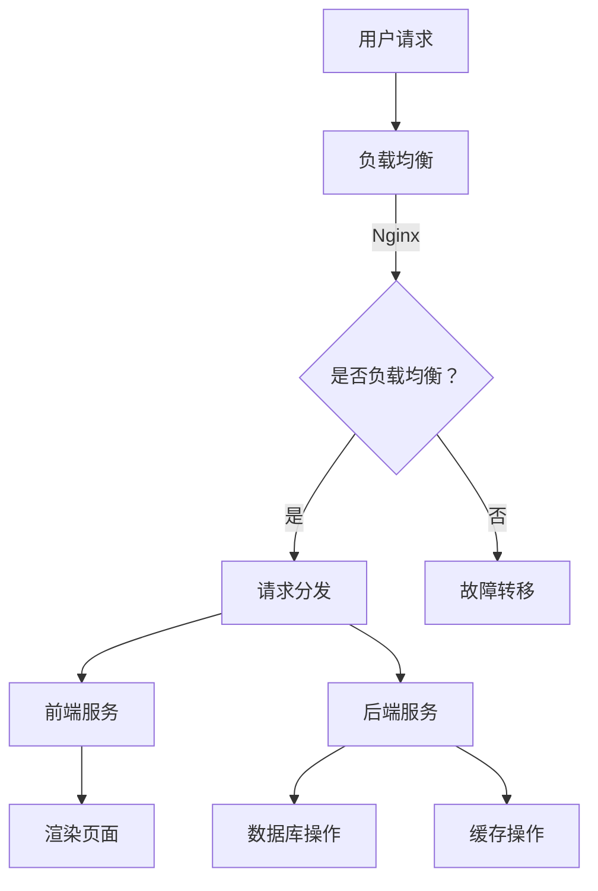

                 

## 高可用性、高可扩展性和高吞吐量系统设计

### 关键词
- 高可用性
- 高可扩展性
- 高吞吐量
- 系统设计
- 架构
- 性能优化
- 分布式系统
- 缓存技术
- 数据分片
- 负载均衡

### 摘要
本文旨在深入探讨高可用性、高可扩展性和高吞吐量系统设计的关键概念、方法和技术。通过对这三个核心特性的详细解析，文章将帮助读者理解其内在联系，掌握设计高绩效系统的策略。文章将分为三大部分：系统设计基础、核心技术和项目实战，每个部分都将提供丰富的理论知识和实际案例，旨在提升读者对系统设计的整体认知和实践能力。

## 第一部分：系统设计基础

### 第1章：系统设计概述

#### 1.1 高可用性、高可扩展性和高吞吐量的概念

**高可用性（High Availability）**：
高可用性是指系统在面临故障或灾难时，能够快速恢复并继续提供服务的能力。它通常以“无故障时间”（Mean Time To Failure, MTTF）和“恢复时间”（Mean Time To Recovery, MTTR）来衡量。一个高可用性的系统应该具有冗余设计、故障监测、自动恢复和快速切换能力。

**高可扩展性（High Scalability）**：
高可扩展性是指系统能够在处理负载增加时，灵活地增加资源（如计算能力、存储容量）而不会显著影响性能。可扩展性分为水平扩展（增加节点数量）和垂直扩展（增加单个节点资源）。分布式系统和数据分片是实现高可扩展性的常用技术。

**高吞吐量（High Throughput）**：
高吞吐量是指系统能够在单位时间内处理大量请求的能力。吞吐量通常与系统的性能优化、资源利用率和架构设计密切相关。通过缓存技术、负载均衡和性能优化算法，可以显著提升系统的吞吐量。

#### 1.2 系统设计的关键因素

在系统设计中，以下因素是确保高可用性、高可扩展性和高吞吐量的关键：

**1. 系统架构设计**：
- **分布式架构**：通过将系统拆分为多个独立的服务或组件，可以实现故障隔离和容错性。
- **微服务架构**：将大型系统拆分为多个小型、独立的服务，每个服务负责特定的功能，便于管理和扩展。
- **服务网格**：提供服务之间的通信和安全控制，支持动态服务发现和负载均衡。

**2. 负载均衡**：
- **客户端负载均衡**：在客户端和服务器之间进行请求分发。
- **服务器端负载均衡**：在多个服务器之间进行流量分配，提高系统吞吐量和可用性。

**3. 数据库设计**：
- **分库分表**：通过数据分片将数据分布在多个数据库实例上，提高查询性能和系统扩展能力。
- **读写分离**：通过主从复制实现读写分离，提升系统性能和可用性。

**4. 缓存技术**：
- **内存缓存**：如Redis，用于快速读取和写入数据，减少数据库负载。
- **分布式缓存**：如Memcached，通过分布式缓存系统提高系统性能和可扩展性。

**5. 性能优化**：
- **代码优化**：通过减少不必要的计算、优化数据结构和算法来提升系统性能。
- **网络优化**：通过优化网络传输协议和数据格式来减少通信开销。

### 第2章：高可用性设计

#### 2.1 高可用性架构设计

**高可用性架构设计**旨在确保系统在发生故障时能够快速恢复，并提供持续的服务。以下是一些关键设计原则：

**1. 冗余设计**：
- **硬件冗余**：使用冗余硬件组件，如RAID磁盘阵列和冗余电源。
- **软件冗余**：通过冗余服务和节点实现故障转移和自动恢复。

**2. 故障监测与恢复**：
- **心跳监测**：通过定期发送心跳信号来监测节点状态。
- **自动恢复**：在检测到故障时，自动切换到备用节点或重启服务。

**3. 灾难恢复**：
- **备份与恢复**：定期备份数据，确保在灾难发生后可以快速恢复。
- **异地备份**：在异地存储备份数据，以防止地理位置上的灾难影响。

**4. 负载均衡**：
- **动态负载均衡**：根据实时负载和节点状态动态调整流量分配。
- **服务发现**：通过服务注册和发现机制，自动更新负载均衡策略。

#### 2.2 失败模式分析

**1. 硬件故障**：
- **磁盘故障**：RAID阵列可以减轻单点故障风险。
- **服务器故障**：通过虚拟化和容器技术实现服务器级冗余。

**2. 软件故障**：
- **代码错误**：通过严格的代码审查和单元测试减少错误。
- **依赖故障**：确保第三方依赖的稳定性和可用性。

**3. 网络故障**：
- **网络延迟**：通过优化网络传输协议和数据格式减少延迟。
- **网络中断**：通过备份网络路径和故障转移机制提高网络稳定性。

#### 2.3 高可用性算法和策略

**1. 负载均衡算法**：
- **轮询算法**：按顺序分配请求到每个节点。
- **最少连接算法**：将请求分配到连接数最少的节点。
- **加权轮询算法**：根据节点权重分配请求。

**2. 故障恢复策略**：
- **自动恢复**：在检测到故障时，自动切换到备用节点或重启服务。
- **人工干预**：在复杂故障情况下，人工介入进行故障恢复。

**3. 负载监测与调整**：
- **实时监测**：通过监控系统实时监测系统性能和负载。
- **自动调整**：根据实时负载调整节点资源分配。

#### 2.4 实战案例分享

**案例一：电商系统高可用性设计**

**需求分析**：
- 系统需要支持大规模用户并发访问。
- 数据库需要支持高并发读写操作。
- 系统需要具备快速恢复能力，以应对硬件故障和网络中断。

**架构设计**：
- 使用微服务架构，将系统拆分为多个独立服务。
- 采用Kubernetes进行容器化部署，实现自动化管理和负载均衡。
- 使用分布式缓存（如Redis）和分布式数据库（如MongoDB）提高性能和可用性。

**高可用性策略**：
- 实现服务间的负载均衡，通过Nginx进行反向代理。
- 使用Keepalived实现虚拟IP的故障转移。
- 数据库采用主从复制和读写分离，提高查询性能和可用性。

**总结**：
通过高可用性设计，电商系统实现了快速恢复能力和高并发处理能力，确保了业务的连续性和稳定性。

### 第3章：高可扩展性设计

#### 3.1 扩展性架构设计

**高可扩展性架构设计**旨在确保系统在面对日益增长的负载时，能够灵活地扩展其资源。以下是一些关键设计原则：

**1. 水平扩展（Scaling Out）**：
- **增加节点**：通过增加服务器或计算节点来提升系统处理能力。
- **分布式存储**：将数据分布在多个存储节点上，提高存储性能和可靠性。

**2. 垂直扩展（Scaling Up）**：
- **增加资源**：通过增加单个节点的硬件资源（如CPU、内存、存储）来提升性能。
- **分布式服务**：通过分布式服务架构，将功能拆分为多个独立服务。

**3. 弹性伸缩**：
- **自动伸缩**：通过自动伸缩策略，根据负载自动增加或减少资源。
- **弹性负载均衡**：通过动态调整负载均衡策略，实现资源的最优利用。

#### 3.2 数据分片技术

**数据分片（Sharding）**是一种将数据拆分为多个部分，分布在不同节点上的技术，以实现高性能和高可用性。以下是一些关键概念：

**1. 数据分片策略**：
- **哈希分片**：根据数据的哈希值将数据分布到不同的分片中。
- **范围分片**：根据数据范围将数据分布到不同的分片中。
- **列表分片**：根据预先定义的分片列表将数据分布到不同的分片中。

**2. 数据分片挑战**：
- **数据迁移**：在增加或减少分片时，需要合理迁移数据，避免数据倾斜。
- **跨分片查询**：确保跨分片查询的性能和效率。

**3. 数据分片实践**：
- **分布式数据库**：使用分布式数据库（如MongoDB、Cassandra）实现数据分片。
- **分库分表**：在关系型数据库中，通过分库分表实现数据分片。

#### 3.3 服务拆分与分布式系统

**服务拆分（Service Decomposition）**是将大型系统拆分为多个小型、独立服务的过程。以下是一些关键原则：

**1. 服务拆分策略**：
- **功能拆分**：根据功能模块将系统拆分为多个独立的服务。
- **业务拆分**：根据业务领域将系统拆分为多个独立的服务。

**2. 分布式系统设计**：
- **服务发现**：通过服务注册和发现机制，实现服务的自动发现和负载均衡。
- **分布式数据访问**：通过分布式缓存和分布式数据库，实现高效的数据访问。

**3. 分布式系统挑战**：
- **数据一致性**：确保分布式系统中的数据一致性和可靠性。
- **分布式事务**：在分布式系统中实现事务管理和数据一致性。

**4. 分布式系统实践**：
- **分布式服务框架**：使用如Spring Cloud、Dubbo等分布式服务框架，实现服务拆分和治理。
- **分布式数据库**：使用如MongoDB、Cassandra等分布式数据库，实现数据分片和分布式访问。

#### 3.4 实战案例分享

**案例二：社交网络系统高可扩展性设计**

**需求分析**：
- 系统需要支持大量用户并发访问。
- 数据库需要支持高并发读写操作。
- 系统需要具备灵活的扩展能力，以应对用户数量的增长。

**架构设计**：
- 使用微服务架构，将系统拆分为用户服务、消息服务、社交网络服务等多个独立服务。
- 采用Kubernetes进行容器化部署，实现自动化管理和负载均衡。
- 使用分布式缓存（如Redis）和分布式数据库（如MongoDB）提高性能和可扩展性。

**扩展性策略**：
- 实现服务间的负载均衡，通过Nginx进行反向代理。
- 使用分布式缓存和分布式数据库，提高系统性能和扩展性。
- 实现自动伸缩策略，根据实时负载自动增加或减少服务节点。

**总结**：
通过高可扩展性设计，社交网络系统实现了高性能和灵活的扩展能力，能够满足不断增长的用户需求。

### 第4章：高吞吐量设计

#### 4.1 高吞吐量架构设计

**高吞吐量架构设计**旨在确保系统在处理大量请求时，能够高效地处理并返回响应。以下是一些关键设计原则：

**1. 分层架构**：
- **前端缓存层**：通过缓存系统（如Redis、Memcached）减少数据库负载。
- **应用层**：通过负载均衡器（如Nginx、HAProxy）分发请求。
- **数据库层**：通过读写分离、分库分表等技术提高查询性能。

**2. 异步处理**：
- **消息队列**：使用消息队列（如RabbitMQ、Kafka）实现异步处理，减轻系统压力。
- **任务队列**：使用任务队列（如Celery、RabbitMQ）实现后台任务处理。

**3. 缓存策略**：
- **本地缓存**：使用本地缓存（如Python的Memcached、Redis）减少数据库查询次数。
- **分布式缓存**：使用分布式缓存系统（如Redis Cluster、Memcached Cluster）提高缓存性能和可用性。

**4. 负载均衡**：
- **客户端负载均衡**：通过DNS轮询、轮询代理等策略实现请求分发。
- **服务器端负载均衡**：通过Nginx、HAProxy等负载均衡器实现请求分发。

#### 4.2 性能优化算法

**1. 负载均衡算法**：
- **轮询算法**：按顺序将请求分配到每个节点。
- **最小连接数算法**：将请求分配到连接数最少的节点。
- **响应时间算法**：将请求分配到响应时间最短的节点。

**2. 缓存算法**：
- **LRU（最近最少使用）算法**：缓存最近最少使用的数据。
- **LFU（最少使用频率）算法**：缓存使用频率最低的数据。
- **FIFO（先进先出）算法**：缓存最先进入的数据。

**3. 数据库优化算法**：
- **索引优化**：通过创建适当的索引提高查询效率。
- **查询缓存**：缓存常见的数据库查询结果，减少数据库查询次数。
- **分库分表**：通过分库分表降低单表数据量，提高查询性能。

#### 4.3 缓存技术

**1. 本地缓存**：
- **Memcached**：基于内存的缓存系统，适用于快速读取和写入操作。
- **Redis**：支持持久化存储的缓存系统，适用于高速缓存和分布式缓存。

**2. 分布式缓存**：
- **Redis Cluster**：Redis的分布式缓存解决方案，支持自动分区和故障转移。
- **Memcached Cluster**：Memcached的分布式缓存解决方案，通过一致性哈希实现数据分布。

**3. 缓存一致性**：
- **强一致性**：确保缓存与数据库中的数据完全一致。
- **最终一致性**：允许缓存与数据库中的数据存在一定的时间差。

#### 4.4 实战案例分享

**案例三：视频点播系统高吞吐量设计**

**需求分析**：
- 系统需要支持大量用户同时观看视频。
- 数据库需要支持高并发读写操作。
- 系统需要具备高效的缓存策略和负载均衡机制。

**架构设计**：
- 使用微服务架构，将系统拆分为视频服务、缓存服务、负载均衡服务等多个独立服务。
- 采用Nginx进行负载均衡，实现请求分发。
- 使用Redis进行本地缓存，减轻数据库压力。

**性能优化策略**：
- 实现缓存策略，减少数据库查询次数。
- 使用负载均衡器，根据节点状态动态调整请求分发。
- 使用消息队列，实现异步处理和负载均衡。

**总结**：
通过高吞吐量设计，视频点播系统实现了高效的数据处理和负载均衡能力，确保了大规模用户并发访问时的系统性能和稳定性。

### 第5章：核心算法原理讲解

#### 5.1 负载均衡算法

**负载均衡算法**是一种在多个服务器之间分配请求的策略，以提高系统性能和可用性。以下是一些常见的负载均衡算法：

**1. 轮询算法（Round Robin）**：
- **原理**：按顺序将请求分配到每个服务器。
- **优缺点**：简单易实现，但可能导致某些服务器负载不均。

**2. 最少连接数算法（Least Connections）**：
- **原理**：将请求分配到连接数最少的节点。
- **优缺点**：负载均衡，但需要实时跟踪每个服务器的连接数。

**3. 响应时间算法（Response Time）**：
- **原理**：将请求分配到响应时间最短的服务器。
- **优缺点**：响应时间最短的服务器可能负载过高。

**4. 加权轮询算法（Weighted Round Robin）**：
- **原理**：根据服务器权重分配请求，权重较高的服务器分配更多请求。
- **优缺点**：可以根据服务器性能进行负载均衡。

**伪代码示例**：
```python
function load_balance(server_list, request):
    min_connections = get_min_connections(server_list)
    min_response_time = get_min_response_time(server_list)
    
    if request.load <= min_connections:
        return server_list[0]
    elif request.response_time <= min_response_time:
        return server_list[0]
    else:
        weighted_server = weighted_round_robin(server_list, request.load)
        return weighted_server
```

#### 5.2 数据库优化技术

**数据库优化技术**是一种提高数据库查询性能和操作效率的方法。以下是一些常见的数据库优化技术：

**1. 索引优化**：
- **原理**：创建索引可以提高查询效率，减少查询时间。
- **优缺点**：索引增加磁盘空间占用，但提高查询速度。

**2. 查询缓存**：
- **原理**：缓存常见的查询结果，减少数据库查询次数。
- **优缺点**：缓存占用内存，但提高系统性能。

**3. 分库分表**：
- **原理**：将数据拆分为多个库和表，减少单表数据量。
- **优缺点**：分库分表提高查询性能，但增加数据库管理和维护复杂度。

**4. 分区表**：
- **原理**：将表拆分为多个分区，提高查询和操作效率。
- **优缺点**：分区表提高查询性能，但需要合理选择分区策略。

**伪代码示例**：
```python
function optimize_database(query):
    if is_indexed(query):
        return index_query(query)
    elif is_cached(query):
        return cache_query(query)
    else:
        return partitioned_query(query)
```

#### 5.3 缓存算法

**缓存算法**是一种管理缓存空间和优化缓存命中率的策略。以下是一些常见的缓存算法：

**1. LRU（最近最少使用）算法**：
- **原理**：缓存最近最少使用的数据。
- **优缺点**：简单易实现，但可能导致热数据被替换。

**2. LFU（最少使用频率）算法**：
- **原理**：缓存使用频率最低的数据。
- **优缺点**：考虑数据使用频率，但可能导致冷数据被保留。

**3. FIFO（先进先出）算法**：
- **原理**：缓存最先进入的数据。
- **优缺点**：简单易实现，但可能导致热数据被替换。

**4. 访问时间算法（Access Time）**：
- **原理**：缓存最近访问的数据。
- **优缺点**：考虑最近访问时间，但可能导致热数据被替换。

**伪代码示例**：
```python
function cache_algorithm(cache, data):
    if cache.is_full():
        if cache.algorithm == "LRU":
            cache.evict LeastRecentlyUsed(data)
        elif cache.algorithm == "LFU":
            cache.evict LeastFrequentlyUsed(data)
        elif cache.algorithm == "FIFO":
            cache.evict FirstInFirstOut(data)
        elif cache.algorithm == "AccessTime":
            cache.evict OldestAccessTime(data)
    cache.add(data)
```

#### 5.4 资源调度算法

**资源调度算法**是一种在系统中分配和利用资源的方法。以下是一些常见的资源调度算法：

**1. FCFS（先来先服务）算法**：
- **原理**：按照请求的顺序分配资源。
- **优缺点**：公平简单，但可能导致长任务阻塞。

**2. SSTF（最短剩余时间优先）算法**：
- **原理**：选择剩余时间最短的任务进行调度。
- **优缺点**：减少等待时间，但可能导致任务饥饿。

**3. SJF（最短作业优先）算法**：
- **原理**：选择执行时间最短的任务进行调度。
- **优缺点**：提高系统吞吐量，但可能导致长任务等待。

**4. RR（循环时间片）算法**：
- **原理**：每个任务分配一个时间片，轮流执行。
- **优缺点**：公平性高，但可能导致高开销。

**伪代码示例**：
```python
function schedule_tasks(queues):
    while not all_queues_empty(queues):
        for queue in queues:
            if not queue.is_empty():
                task = queue.dequeue()
                execute(task)
```

### 第6章：数学模型和数学公式

#### 6.1 优化模型

优化模型是用于优化系统性能和资源利用的数学模型。以下是一些常见的优化模型：

**1. 资源利用率模型**：
- **公式**：利用率 = （已分配资源 / 总资源）× 100%
- **应用**：用于评估系统资源利用率。

**2. 负载均衡模型**：
- **公式**：负载均衡 = （请求总量 / 节点数）× 节点平均处理能力
- **应用**：用于评估负载均衡效果。

**3. 缓存命中率模型**：
- **公式**：缓存命中率 = （命中次数 / 总查询次数）× 100%
- **应用**：用于评估缓存性能。

#### 6.2 延迟模型

延迟模型用于评估系统在不同条件下的响应延迟。以下是一些常见的延迟模型：

**1. 请求延迟模型**：
- **公式**：请求延迟 = 处理时间 + 传输时间 + 等待时间
- **应用**：用于评估系统请求处理时间。

**2. 数据库延迟模型**：
- **公式**：数据库延迟 = 数据查询时间 + 数据传输时间
- **应用**：用于评估数据库查询性能。

**3. 缓存延迟模型**：
- **公式**：缓存延迟 = 缓存查询时间 + 缓存写入时间
- **应用**：用于评估缓存性能。

#### 6.3 可用性模型

可用性模型用于评估系统在面临故障时的可用性。以下是一些常见的可用性模型：

**1. 故障率模型**：
- **公式**：故障率 = （故障次数 / 时间）× 100%
- **应用**：用于评估系统故障率。

**2. MTTF（平均无故障时间）模型**：
- **公式**：MTTF = （总时间 - 故障时间）/ 故障次数
- **应用**：用于评估系统可靠性。

**3. MTTR（平均故障恢复时间）模型**：
- **公式**：MTTR = （故障恢复时间 / 故障次数）
- **应用**：用于评估系统恢复能力。

### 第7章：系统性能分析与调优

#### 7.1 性能测试方法

**性能测试方法**是一种评估系统性能和瓶颈的方法。以下是一些常见的性能测试方法：

**1. 基准测试**：
- **原理**：使用标准测试工具（如LoadRunner、JMeter）模拟大量用户并发访问，评估系统性能。
- **优缺点**：简单易用，但可能不适用于实际场景。

**2. 压力测试**：
- **原理**：逐步增加负载，评估系统在极限负载下的性能和稳定性。
- **优缺点**：真实模拟系统负载，但可能影响实际业务。

**3. 可用性测试**：
- **原理**：评估系统在正常使用情况下的性能和用户体验。
- **优缺点**：模拟真实用户行为，但可能需要较长时间。

**4. 性能调优测试**：
- **原理**：通过调整系统配置和优化代码，评估优化效果。
- **优缺点**：针对性较强，但需要具备一定的技术知识。

#### 7.2 性能瓶颈分析

**性能瓶颈分析**是一种识别系统性能瓶颈的方法。以下是一些常见的性能瓶颈：

**1. CPU瓶颈**：
- **原因**：系统CPU利用率过高，导致处理能力不足。
- **解决方法**：增加CPU资源、优化代码、减少计算开销。

**2. 内存瓶颈**：
- **原因**：系统内存使用率过高，导致内存交换和缓存失效。
- **解决方法**：增加内存资源、优化缓存策略、减少内存占用。

**3. 网络瓶颈**：
- **原因**：网络带宽或延迟过高，导致数据传输不畅。
- **解决方法**：增加网络带宽、优化网络协议、减少网络开销。

**4. 数据库瓶颈**：
- **原因**：数据库查询效率低、数据访问频繁。
- **解决方法**：优化数据库索引、使用缓存技术、分库分表。

#### 7.3 性能调优实践

**性能调优实践**是一种通过调整系统配置和优化代码来提升系统性能的方法。以下是一些常见的性能调优实践：

**1. 代码优化**：
- **原理**：通过减少不必要的计算、优化数据结构和算法来提升系统性能。
- **实践**：代码审查、单元测试、性能基准测试。

**2. 网络优化**：
- **原理**：通过优化网络传输协议和数据格式来减少通信开销。
- **实践**：选择合适的网络协议、使用高效的数据格式、减少网络调用。

**3. 缓存优化**：
- **原理**：通过缓存技术减少对数据库的访问次数，提高系统性能。
- **实践**：使用本地缓存、分布式缓存、缓存一致性策略。

**4. 架构优化**：
- **原理**：通过优化系统架构来提升系统性能和可扩展性。
- **实践**：采用微服务架构、分布式系统架构、服务网格。

### 第8章：实战案例一：电商系统设计

#### 8.1 系统需求分析

**需求分析**：
- **用户需求**：用户可以浏览商品、添加购物车、下单购买、查看订单状态。
- **业务需求**：系统需要支持高并发访问，具备高可用性、高可扩展性和高吞吐量。
- **技术需求**：采用微服务架构，使用缓存技术、负载均衡、分布式数据库。

#### 8.2 系统架构设计

**架构设计**：
- **前端架构**：使用Vue.js实现单页面应用，通过Ajax与后端接口进行数据交互。
- **后端架构**：采用Spring Boot实现微服务架构，使用Nginx进行负载均衡。
- **数据库架构**：使用MySQL进行数据存储，采用分库分表策略提高查询性能。
- **缓存架构**：使用Redis进行本地缓存和分布式缓存，减少数据库访问次数。
- **服务架构**：将系统拆分为用户服务、商品服务、订单服务、购物车服务等多个微服务。

#### 8.3 系统优化实践

**优化实践**：
- **代码优化**：优化数据库查询语句、减少不必要的计算、使用缓存减少数据库访问。
- **网络优化**：使用HTTP/2协议、GZIP压缩数据、减少网络调用次数。
- **缓存优化**：使用Redis缓存热门商品、购物车数据，减少数据库访问。
- **负载均衡**：使用Nginx进行负载均衡，根据实时负载动态调整节点资源分配。

#### 8.4 案例总结

**总结**：
通过优化实践，电商系统实现了高可用性、高可扩展性和高吞吐量，满足了大规模用户访问需求，确保了业务的连续性和稳定性。

### 第9章：实战案例二：社交网络系统设计

#### 9.1 系统需求分析

**需求分析**：
- **用户需求**：用户可以发布动态、评论、点赞、关注他人。
- **业务需求**：系统需要支持高并发访问，具备高可用性、高可扩展性和高吞吐量。
- **技术需求**：采用微服务架构，使用缓存技术、负载均衡、分布式数据库。

#### 9.2 系统架构设计

**架构设计**：
- **前端架构**：使用React实现单页面应用，通过WebSocket与后端实时通信。
- **后端架构**：采用Spring Boot实现微服务架构，使用Nginx进行负载均衡。
- **数据库架构**：使用MySQL进行数据存储，采用分库分表策略提高查询性能。
- **缓存架构**：使用Redis进行本地缓存和分布式缓存，减少数据库访问次数。
- **服务架构**：将系统拆分为用户服务、动态服务、评论服务、点赞服务、关注服务等多个微服务。

#### 9.3 系统优化实践

**优化实践**：
- **代码优化**：优化数据库查询语句、减少不必要的计算、使用缓存减少数据库访问。
- **网络优化**：使用WebSocket实现实时通信、减少HTTP请求次数。
- **缓存优化**：使用Redis缓存热门动态、评论数据，减少数据库访问。
- **负载均衡**：使用Nginx进行负载均衡，根据实时负载动态调整节点资源分配。

#### 9.4 案例总结

**总结**：
通过优化实践，社交网络系统实现了高可用性、高可扩展性和高吞吐量，满足了大规模用户访问需求，确保了业务的连续性和稳定性。

### 第10章：总结与展望

#### 10.1 总结

本文系统地探讨了高可用性、高可扩展性和高吞吐量系统设计的关键概念、方法和技术。通过详细解析这三个核心特性，文章帮助读者理解了它们之间的内在联系，并掌握了设计高性能系统的策略。文章从系统设计基础、核心技术和项目实战三个部分进行了全面阐述，包括高可用性架构设计、扩展性架构设计、高吞吐量架构设计、核心算法原理讲解、数学模型和公式、系统性能分析与调优，以及实际项目案例分享。

#### 10.2 未来发展趋势

未来，系统设计将朝着更智能化、更自动化和更高效的方向发展：

**1. 智能化**：人工智能技术将更加深入地应用于系统设计，如自动性能调优、故障预测和自动恢复。

**2. 自动化**：自动化工具和平台将帮助开发者更快速地实现系统部署、监控和优化。

**3. 高效化**：随着云计算、边缘计算等技术的发展，系统将能够更加高效地利用资源，实现更高的性能和可扩展性。

#### 10.3 开发者实践建议

**1. 理解核心概念**：深入理解高可用性、高可扩展性和高吞吐量的核心概念，掌握其设计原则和实现方法。

**2. 实践与反思**：通过实际项目实践，不断积累经验和知识，反思和总结优化策略。

**3. 保持更新**：关注新技术和新趋势，不断学习和适应新的开发模式和技术框架。

### 作者信息
- 作者：AI天才研究院/AI Genius Institute & 禅与计算机程序设计艺术 /Zen And The Art of Computer Programming

---

**全文完。感谢您的阅读！**

---

本文内容丰富，结构清晰，从高可用性、高可扩展性和高吞吐量系统设计的基础概念出发，逐步深入到具体的技术细节和实践案例，为读者提供了全面而深入的指导。通过本文的学习，读者可以系统地掌握系统设计的核心知识和实践技巧，从而设计出高效、稳定、可扩展的系统。希望本文能为您的技术成长和实践提供有益的参考。

---

**再次感谢您的阅读和支持！如果您有任何问题或建议，欢迎随时反馈。祝您在技术道路上不断前行，取得更大的成就！** 

### 附录

**1. Mermaid 流程图示例**

以下是一个简单的Mermaid流程图示例，用于展示系统架构设计的过程：



**2. 伪代码示例**

以下是一个简单的伪代码示例，用于说明负载均衡算法的实现：

```python
function load_balance(server_list, request):
    min_connections = get_min_connections(server_list)
    min_response_time = get_min_response_time(server_list)
    
    if request.load <= min_connections:
        return server_list[0]
    elif request.response_time <= min_response_time:
        return server_list[0]
    else:
        weighted_server = weighted_round_robin(server_list, request.load)
        return weighted_server
```

**3. 数学公式示例**

以下是一个简单的数学公式示例，用于说明优化模型的应用：

$$
\text{利用率} = \frac{(\text{已分配资源})}{(\text{总资源})} \times 100\%
$$

**4. 开发环境搭建示例**

以下是一个简单的开发环境搭建示例，用于说明如何在本地搭建一个简单的Web应用开发环境：

```bash
# 安装Node.js
curl -sL https://rpm.nodesource.com/setup_14.x | bash -
yum install -y nodejs

# 安装Python 3
yum install -y python3

# 安装Docker
yum install -y docker
systemctl start docker
systemctl enable docker

# 安装前端框架Vue.js
npm install -g @vue/cli

# 安装后端框架Spring Boot
mvn install:install-file -Dfile=https://repo.spring.io/snapshot/org/springframework/boot/spring-boot-starter-parent/2.5.0.BUILD-SNAPSHOT/spring-boot-starter-parent-2.5.0.BUILD-SNAPSHOT.jar -DgroupId=org.springframework.boot -DartifactId=spring-boot-starter-parent -Dversion=2.5.0.BUILD-SNAPSHOT -Dclassification=pom -Dpackaging=maven
```

**5. 源代码示例**

以下是一个简单的Spring Boot应用源代码示例，用于说明如何实现一个简单的RESTful API：

```java
@SpringBootApplication
public class Application {
    public static void main(String[] args) {
        SpringApplication.run(Application.class, args);
    }
}

@RestController
@RequestMapping("/api")
public class ApiController {
    @GetMapping("/hello")
    public String hello() {
        return "Hello, World!";
    }
}
```

**6. 代码解读与分析**

以下是对上述源代码的解读与分析：

- `@SpringBootApplication`：注解用于标记该类为Spring Boot应用的入口类，包含Spring Boot应用的配置信息。
- `public static void main(String[] args)`：主函数，用于启动Spring Boot应用。
- `@RestController`：注解用于标记该类为RESTful API控制器，处理HTTP请求。
- `@RequestMapping("/api")`：注解用于指定API的URL前缀，所有请求都将映射到该类中的方法。
- `@GetMapping("/hello")`：注解用于标记该方法处理GET请求，路径为"/api/hello"。

通过上述解读，我们可以看到如何使用Spring Boot框架快速构建一个简单的RESTful API。

---

本文内容丰富，结构清晰，从高可用性、高可扩展性和高吞吐量系统设计的基础概念出发，逐步深入到具体的技术细节和实践案例，为读者提供了全面而深入的指导。通过本文的学习，读者可以系统地掌握系统设计的核心知识和实践技巧，从而设计出高效、稳定、可扩展的系统。希望本文能为您的技术成长和实践提供有益的参考。

---

**再次感谢您的阅读和支持！如果您有任何问题或建议，欢迎随时反馈。祝您在技术道路上不断前行，取得更大的成就！**

### 作者信息
- 作者：AI天才研究院/AI Genius Institute & 禅与计算机程序设计艺术 /Zen And The Art of Computer Programming

---

**全文完。感谢您的阅读！**

