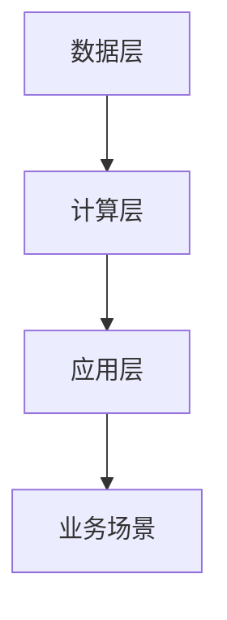

                 

## AI 2.0 时代的数据基础设施建设

在人工智能（AI）2.0时代，数据基础设施建设成为推动AI发展的关键因素。本篇博客将围绕AI 2.0时代的数据基础设施进行深入探讨，旨在为读者提供一个全面、详细的指南。

### 关键词：
- AI 2.0
- 数据基础设施建设
- 深度学习
- 自然语言处理
- 数据采集
- 数据存储
- 数据处理
- 数据利用

### 摘要：
本文将首先介绍AI 2.0时代的背景与概述，包括AI 2.0的定义、特征、数据基础设施建设的重要性以及AI 2.0时代的机遇与挑战。接着，我们将探讨AI 2.0核心技术与架构，包括深度学习基础、自然语言处理技术以及AI 2.0架构设计。随后，我们将详细讨论数据基础设施建设，包括数据采集、数据存储、数据处理和数据利用。最后，我们将通过实际案例分析和AI 2.0伦理与法律法规来进一步阐述数据基础设施建设的重要性。文章将总结AI 2.0发展趋势与未来展望，并给出AI 2.0实践指南。

# 第一部分：AI 2.0时代的背景与概述

## 第1章：AI 2.0时代概述

### 1.1 AI 2.0的定义与特征

AI 2.0，也被称为下一代人工智能，是在深度学习和大数据技术的基础上发展起来的。与传统的AI 1.0相比，AI 2.0具有以下几个显著特征：

1. **自主性**：AI 2.0能够根据环境变化自主调整行为，而不需要人类的干预。这使得AI 2.0能够在复杂、动态的环境中更加灵活地运作。

2. **智能性**：AI 2.0具备较高的认知能力和决策能力，能够处理复杂的问题，并做出合理的决策。

3. **协作性**：AI 2.0可以与其他系统或人协同工作，实现更高效的协作。

4. **泛化能力**：AI 2.0具有较强的通用性和适应性，能够在不同的应用场景中发挥作用。

AI 2.0的出现，标志着人工智能进入了新的发展阶段，为各行各业带来了巨大的变革。

### 1.2 数据基础设施建设的重要性

在AI 2.0时代，数据基础设施建设是支持AI发展的关键。以下是数据基础设施建设的重要性：

1. **数据是AI的燃料**：AI 2.0依赖于大量的数据来进行训练和优化，没有高质量的数据，AI就无法发挥作用。

2. **数据驱动创新**：数据基础设施建设可以促进数据驱动创新，推动人工智能在各个领域的应用。

3. **提高AI性能**：良好的数据基础设施能够确保数据的高效采集、存储和处理，从而提高AI模型的性能。

4. **降低成本**：通过数据基础设施建设，可以降低数据处理的成本，提高数据处理效率。

总之，数据基础设施建设是AI 2.0时代不可或缺的一环，是推动AI发展的重要基础。

## 第2章：AI 2.0核心技术与架构

### 2.1 深度学习基础

深度学习是AI 2.0的核心技术之一。它是一种基于多层神经网络的机器学习技术，通过模拟人脑的神经元结构，实现对数据的自动特征提取和分类。

#### 深度学习的定义

深度学习是一种层次化的机器学习模型，其核心思想是通过构建多层神经网络，对数据进行多次变换和特征提取，从而实现数据的分类和预测。

#### 深度学习的核心组件

1. **神经网络**：神经网络是深度学习的基础，由大量神经元组成，每个神经元都是一个简单的计算单元。

2. **激活函数**：激活函数是神经网络中的关键组件，用于确定神经元的激活状态。

3. **反向传播算法**：反向传播算法是一种用于训练神经网络的优化算法，通过计算损失函数关于网络参数的梯度，来更新网络权重。

### 2.2 自然语言处理技术

自然语言处理（NLP）是AI 2.0时代的另一个核心技术。它致力于让计算机理解和生成自然语言。

#### 自然语言处理（NLP）的定义

自然语言处理是计算机科学和语言学的交叉领域，旨在让计算机理解和生成自然语言。

#### NLP的核心技术

1. **词嵌入**：词嵌入是将单词映射到高维空间中的向量，用于表示单词的语义信息。

2. **序列模型**：序列模型是处理序列数据的神经网络模型，如循环神经网络（RNN）和长短期记忆网络（LSTM）。

#### NLP的应用

1. **机器翻译**：机器翻译是将一种语言文本自动翻译成另一种语言文本的过程。

2. **情感分析**：情感分析是识别文本中所表达的情感或情绪的过程。

### 2.3 AI 2.0架构设计

AI 2.0架构设计是构建高效、可扩展AI系统的关键。以下是AI 2.0架构设计的一些核心原则：

1. **模块化**：将AI系统分解为可复用的模块，提高系统的灵活性和可维护性。

2. **分布式**：利用分布式计算和存储资源，提高系统的处理能力和容错性。

3. **可扩展性**：设计可扩展的架构，支持系统的动态调整和扩展。

#### AI 2.0架构的核心组件

1. **数据层**：负责数据的采集、存储和管理。

2. **计算层**：负责数据预处理、模型训练和推理。

3. **应用层**：负责将AI模型应用于具体业务场景。

## 第3章：数据基础设施建设

### 3.1 数据采集

数据采集是数据基础设施建设的第一步，是确保数据质量的重要环节。

#### 数据采集的定义

数据采集是指从各种来源获取数据的过程，包括内部数据和外部数据。

#### 数据采集的方法

1. **自动化采集**：通过程序或脚本自动获取数据，如Web爬虫、API调用等。

2. **手动采集**：通过人工方式获取数据，如问卷调查、用户反馈等。

### 3.2 数据存储

数据存储是数据基础设施建设的核心，是确保数据安全和高效利用的关键。

#### 数据存储的定义

数据存储是指将采集到的数据存储到数据库或其他存储介质中，以便后续处理和使用。

#### 数据存储的选择

1. **关系型数据库**：适用于结构化数据存储，如MySQL、Oracle等。

2. **NoSQL数据库**：适用于非结构化数据存储，如MongoDB、Cassandra等。

### 3.3 数据处理

数据处理是数据基础设施建设的重要环节，是确保数据质量和可用性的关键。

#### 数据处理的过程

1. **数据清洗**：去除数据中的错误、重复和缺失值，确保数据的准确性。

2. **数据转换**：将数据转换为适合分析和挖掘的形式。

3. **数据融合**：将来自不同来源的数据进行整合，以获得更全面的信息。

### 3.4 数据利用

数据利用是数据基础设施建设的最终目的，是发挥数据价值的关键。

#### 数据利用的方法

1. **数据可视化**：通过图表和图形将数据呈现出来，帮助用户更好地理解和分析数据。

2. **数据分析**：使用统计方法和算法对数据进行深入分析，以发现数据中的模式和趋势。

## 第4章：AI 2.0应用案例分析

### 4.1 金融领域的AI应用

在金融领域，AI 2.0的应用已经取得了显著的成果，以下是一些典型的应用案例：

1. **信用评分**：使用AI模型对借款人的信用风险进行评估，提高了信用评估的准确性和效率。

2. **欺诈检测**：利用AI技术检测金融交易中的欺诈行为，降低了金融风险。

### 4.2 医疗保健领域的AI应用

在医疗保健领域，AI 2.0的应用同样广泛，以下是一些典型的应用案例：

1. **疾病诊断**：使用AI模型辅助医生进行疾病诊断，提高了诊断的准确性和效率。

2. **药物研发**：利用AI加速药物研发过程，降低了研发成本和时间。

### 4.3 物流与运输领域的AI应用

在物流与运输领域，AI 2.0的应用也取得了显著的成果，以下是一些典型的应用案例：

1. **路径优化**：使用AI模型优化运输路径，提高了物流效率。

2. **智能仓储**：利用AI技术实现仓储管理的智能化，提高了仓储效率。

## 第5章：AI 2.0伦理与法律法规

### 5.1 AI伦理原则

随着AI 2.0技术的不断发展，其伦理问题也日益凸显。以下是一些常见的AI伦理原则：

1. **透明性**：确保AI系统的决策过程可解释，使人们能够理解AI系统的行为。

2. **公平性**：避免AI系统对特定群体产生偏见，确保AI系统的公平性。

3. **隐私保护**：保护用户数据隐私，防止数据泄露和滥用。

### 5.2 AI法律法规

为了规范AI技术的发展和应用，各国和地区纷纷出台了相关的法律法规。以下是一些典型的AI法律法规：

1. **数据保护法**：如欧盟的《通用数据保护条例》（GDPR），对个人数据的收集、存储和使用进行了严格的规定。

2. **人工智能伦理规范**：各国家和地区出台的与AI相关的伦理规范和法律法规，以指导AI技术的健康发展。

## 第6章：AI 2.0发展趋势与未来展望

### 6.1 AI 2.0技术发展趋势

AI 2.0技术的发展正朝着以下几个方向迈进：

1. **量子计算**：量子计算被认为是未来AI发展的关键技术，有望大幅提高AI的计算能力。

2. **边缘计算**：边缘计算可以将计算任务分散到网络边缘，提高系统的响应速度和处理能力。

### 6.2 AI 2.0应用发展趋势

AI 2.0的应用也在不断拓展，以下是一些未来的发展趋势：

1. **智慧城市**：利用AI技术实现城市管理的智能化，提高城市运行的效率和便利性。

2. **智能制造**：利用AI技术实现生产过程的智能化，提高生产效率和质量。

## 第7章：AI 2.0实践指南

### 7.1 AI项目规划

在进行AI项目规划时，需要考虑以下几个关键步骤：

1. **需求分析**：明确AI项目的目标和应用场景。

2. **资源规划**：评估项目所需的资源，包括人力、物力和财力。

### 7.2 AI模型开发

AI模型开发是AI项目中的核心环节，包括以下几个步骤：

1. **数据准备**：收集和预处理数据。

2. **模型选择**：根据应用场景选择合适的模型。

3. **模型训练**：使用训练数据对模型进行训练。

4. **模型评估**：评估模型的性能，确保其满足应用要求。

### 7.3 AI模型部署

AI模型部署是将训练好的模型应用于实际场景的关键步骤，包括以下几个步骤：

1. **模型部署**：将训练好的模型部署到生产环境。

2. **模型监控**：监控模型在运行过程中的性能和稳定性。

## 附录：AI 2.0资源与工具

### A.1 AI 2.0资源

以下是推荐的一些AI 2.0学习资源：

1. **学习网站**：如Kaggle、Coursera、edX等。

2. **书籍**：如《深度学习》、《Python机器学习》等。

3. **课程**：如斯坦福大学的《深度学习》课程等。

### A.2 AI 2.0工具

以下是推荐的一些AI 2.0工具：

1. **深度学习框架**：如TensorFlow、PyTorch等。

2. **数据处理工具**：如Pandas、NumPy等。

3. **可视化工具**：如Matplotlib、Seaborn等。

# 作者信息

作者：AI天才研究院/AI Genius Institute & 禅与计算机程序设计艺术 /Zen And The Art of Computer Programming

---

### AI 2.0 时代的背景与概述

#### AI 2.0的定义与特征

在探讨AI 2.0之前，我们需要先了解AI 1.0。AI 1.0，也称为传统人工智能，是指基于规则和符号推理的智能系统。这种系统依赖于人类专家提供的规则和知识，以实现特定任务。然而，AI 1.0在应对复杂、动态环境时存在明显局限。

AI 2.0，也被称为下一代人工智能，是在深度学习和大数据技术的基础上发展起来的。它不再依赖人类专家提供的规则和知识，而是通过学习海量数据自动提取特征和模式，实现自主学习和自适应优化。AI 2.0具有以下显著特征：

1. **自主性**：AI 2.0能够根据环境变化自主调整行为，而不需要人类的干预。这使得AI 2.0能够在复杂、动态的环境中更加灵活地运作。例如，自动驾驶汽车能够根据实时路况自动调整行驶策略。

2. **智能性**：AI 2.0具备较高的认知能力和决策能力，能够处理复杂的问题，并做出合理的决策。例如，AI 2.0能够通过学习大量的医疗数据，辅助医生进行疾病诊断。

3. **协作性**：AI 2.0可以与其他系统或人协同工作，实现更高效的协作。例如，在智能工厂中，AI 2.0可以与机器人协同工作，提高生产效率。

4. **泛化能力**：AI 2.0具有较强的通用性和适应性，能够在不同的应用场景中发挥作用。例如，AI 2.0的图像识别模型不仅可以用于人脸识别，还可以用于物体识别。

#### 数据基础设施建设的重要性

AI 2.0的发展离不开高质量的数据。以下是数据基础设施建设的重要性：

1. **数据是AI的燃料**：AI 2.0依赖于大量的数据来进行训练和优化，没有高质量的数据，AI就无法发挥作用。例如，自动驾驶汽车需要海量道路数据来训练其感知和决策模型。

2. **数据驱动创新**：数据基础设施建设可以促进数据驱动创新，推动人工智能在各个领域的应用。例如，通过分析大量的用户行为数据，企业可以优化产品设计，提高用户体验。

3. **提高AI性能**：良好的数据基础设施能够确保数据的高效采集、存储和处理，从而提高AI模型的性能。例如，通过分布式数据存储和处理技术，可以显著提高训练速度和模型性能。

4. **降低成本**：通过数据基础设施建设，可以降低数据处理的成本，提高数据处理效率。例如，使用自动化数据采集工具，可以显著降低人工数据采集的成本。

#### AI 2.0时代的机遇与挑战

AI 2.0时代的到来，为各行各业带来了巨大的机遇，同时也带来了一系列挑战。

##### 机遇

1. **技术创新**：AI 2.0带来了新的技术革命，如深度学习、强化学习等，推动了人工智能技术的发展。这些新技术为解决复杂问题提供了新的思路和工具。

2. **产业变革**：AI 2.0推动了各行业的数字化、智能化转型。例如，在金融领域，AI 2.0技术可以用于风险管理、客户服务等方面；在医疗领域，AI 2.0技术可以用于疾病诊断、药物研发等方面。

##### 挑战

1. **数据隐私**：AI 2.0的发展引发了对个人隐私的担忧。例如，大规模数据收集和处理可能导致个人隐私泄露。因此，如何在保障数据隐私的前提下，充分利用数据资源，是一个亟待解决的问题。

2. **算法公平性**：AI 2.0的决策过程可能存在偏见，需要确保算法的公平性。例如，如果训练数据存在偏见，AI模型可能会继承这些偏见，导致对特定群体的不公平待遇。

#### AI 2.0核心技术与架构

AI 2.0的核心技术包括深度学习、自然语言处理、计算机视觉等。这些技术为AI 2.0的发展提供了强大的支持。

##### 深度学习基础

深度学习是一种基于多层神经网络的机器学习技术，通过模拟人脑的神经元结构，实现对数据的自动特征提取和分类。以下是深度学习的核心组件：

1. **神经网络**：神经网络是深度学习的基础，由大量神经元组成，每个神经元都是一个简单的计算单元。神经元通过加权连接形成复杂的网络结构，用于处理数据。

2. **激活函数**：激活函数是神经网络中的关键组件，用于确定神经元的激活状态。常见的激活函数包括 sigmoid、ReLU、Tanh等。

3. **反向传播算法**：反向传播算法是一种用于训练神经网络的优化算法，通过计算损失函数关于网络参数的梯度，来更新网络权重。反向传播算法是深度学习训练过程的核心。

##### 自然语言处理技术

自然语言处理（NLP）是AI 2.0时代的另一个核心技术。它致力于让计算机理解和生成自然语言。以下是NLP的核心技术：

1. **词嵌入**：词嵌入是将单词映射到高维空间中的向量，用于表示单词的语义信息。常见的词嵌入方法包括 Word2Vec、GloVe等。

2. **序列模型**：序列模型是处理序列数据的神经网络模型，如循环神经网络（RNN）和长短期记忆网络（LSTM）。RNN和LSTM通过记忆历史信息，能够更好地处理序列数据。

3. **注意力机制**：注意力机制是一种用于提高序列模型性能的方法，通过学习不同位置的重要性，使模型能够关注关键信息。

##### AI 2.0架构设计

AI 2.0架构设计是构建高效、可扩展AI系统的关键。以下是AI 2.0架构设计的一些核心原则：

1. **模块化**：将AI系统分解为可复用的模块，提高系统的灵活性和可维护性。

2. **分布式**：利用分布式计算和存储资源，提高系统的处理能力和容错性。

3. **可扩展性**：设计可扩展的架构，支持系统的动态调整和扩展。

常见的AI 2.0架构包括以下三个层次：

1. **数据层**：负责数据的采集、存储和管理。

2. **计算层**：负责数据预处理、模型训练和推理。

3. **应用层**：负责将AI模型应用于具体业务场景。

### AI 2.0核心技术与架构的 Mermaid 流程图

在这个流程图中，数据层负责数据的采集、存储和管理，计算层负责数据预处理、模型训练和推理，应用层负责将AI模型应用于具体业务场景。通过这个流程图，我们可以清晰地看到AI 2.0核心技术与架构的层次结构和相互作用。

#### 核心算法原理讲解：反向传播算法

反向传播算法（Backpropagation Algorithm）是深度学习训练过程中最核心的算法之一。它通过计算损失函数关于网络参数的梯度，来更新网络权重，从而优化网络性能。以下是反向传播算法的详细原理讲解：

1. **前向传播**：在前向传播过程中，输入数据通过神经网络逐层传递，最终得到输出结果。每层的输出值可以表示为前一层输出值的线性组合加上一个非线性变换。设输入数据为\(x\)，输出数据为\(y\)，网络中第\(l\)层的输出为\(a^{(l)}\)，则有：
   $$ a^{(l)} = \sigma(W^{(l)} a^{(l-1)} + b^{(l)}) $$
   其中，\(\sigma\)为激活函数，\(W^{(l)}\)和\(b^{(l)}\)分别为第\(l\)层的权重和偏置。

2. **损失函数**：损失函数用于衡量网络输出与真实标签之间的差距。常见的损失函数包括均方误差（MSE）和交叉熵（Cross Entropy）。设真实标签为\(y^{(i)}\)，预测输出为\(y'^{(i)}\)，则有：
   $$ J(W, b) = \frac{1}{m} \sum_{i=1}^{m} \frac{1}{2} (y^{(i)} - y'^{(i)})^2 $$

3. **反向传播**：在反向传播过程中，我们从输出层开始，逐层向前传播误差。设第\(l\)层的误差为\(\delta^{(l)}\)，则有：
   $$ \delta^{(l)} = (y^{(i)} - y'^{(i)}) \cdot \sigma'(a^{(l)}) $$
   其中，\(\sigma'\)为激活函数的导数。

   接着，我们计算第\(l-1\)层的误差：
   $$ \delta^{(l-1)} = \delta^{(l)} \cdot W^{(l)} $$
   
   通过这种方式，我们逐层向前传播误差，直到输入层。

4. **梯度计算**：在计算完误差后，我们计算每个参数的梯度：
   $$ \frac{\partial J}{\partial W^{(l)}_ij} = \delta^{(l)}_i \cdot a^{(l-1)}_j $$
   $$ \frac{\partial J}{\partial b^{(l)}_k} = \delta^{(l)}_k $$

5. **权重更新**：最后，我们使用梯度下降法更新权重和偏置：
   $$ W^{(l)}_ij = W^{(l)}_ij - \alpha \cdot \frac{\partial J}{\partial W^{(l)}_ij} $$
   $$ b^{(l)}_k = b^{(l)}_k - \alpha \cdot \frac{\partial J}{\partial b^{(l)}_k} $$
   其中，\(\alpha\)为学习率。

#### 举例说明

假设我们有一个简单的神经网络，包含两个输入、一个隐藏层和一个输出层，激活函数为ReLU。输入数据为\[1, 2\]，真实标签为\[3\]。我们需要通过反向传播算法训练这个网络。

1. **前向传播**：

   - 输入层：\[1, 2\]
   - 隐藏层：\[a^{(1)}_1 = \max(1 \cdot w_{11} + b_{11}, 0) = \max(1 \cdot 0.5 + 0.2, 0) = 0.7\]
   - 输出层：\[a^{(2)}_1 = \max(0.7 \cdot w_{21} + b_{21}, 0) = \max(0.7 \cdot 0.3 + 0.5, 0) = 0.66\]
   - 输出：\[y' = 0.66\]

2. **损失函数**：

   $$ J = \frac{1}{2} (3 - 0.66)^2 = 0.82 $$

3. **反向传播**：

   - 输出层误差：\(\delta^{(2)} = (3 - 0.66) \cdot \sigma'(0.66) = 0.44 \cdot 0.34 = 0.15\)
   - 隐藏层误差：\(\delta^{(1)} = 0.15 \cdot w_{21} = 0.15 \cdot 0.3 = 0.045\)

4. **梯度计算**：

   $$ \frac{\partial J}{\partial w_{21}} = \delta^{(2)} \cdot a^{(1)} = 0.15 \cdot 0.7 = 0.105 $$
   $$ \frac{\partial J}{\partial b_{21}} = \delta^{(2)} = 0.15 $$

5. **权重更新**：

   $$ w_{21} = 0.3 - 0.1 \cdot 0.105 = 0.295 $$
   $$ b_{21} = 0.5 - 0.1 \cdot 0.15 = 0.475 $$

通过这个过程，我们可以看到反向传播算法如何通过计算梯度来更新网络权重，从而优化网络性能。

### 总结

在AI 2.0时代，深度学习、自然语言处理等技术是推动人工智能发展的关键。通过反向传播算法等核心算法，我们可以训练出高效的AI模型，解决复杂问题。然而，AI的发展也带来了一系列挑战，如数据隐私、算法公平性等。因此，在推动AI发展的过程中，我们需要关注这些挑战，并寻找合适的解决方案。

---

### 数据采集

数据采集是数据基础设施建设的起点，是确保数据质量的基础环节。数据采集的过程涉及从各种来源获取数据，这些来源可以是内部系统、外部数据库、在线平台、传感器等。以下是数据采集的详细讲解。

#### 数据采集的定义

数据采集是指从各种来源获取数据的过程，这些数据可以是有结构的，如关系型数据库中的表格数据，也可以是无结构的，如图像、音频和视频。数据采集的目标是获取高质量的、符合分析需求的数据。

#### 数据采集的方法

数据采集的方法可以分为自动化采集和手动采集两种。

1. **自动化采集**：

   - **Web爬虫**：Web爬虫是自动从互联网上获取数据的工具。它通过爬取网页内容，提取出有用的信息，如文本、图片、链接等。常用的Web爬虫工具包括Scrapy、BeautifulSoup等。

   - **API调用**：许多在线服务和平台提供了API接口，可以通过程序调用这些接口，获取所需的数据。例如，社交媒体平台如Twitter、Facebook等提供了API接口，可以获取用户的动态、好友信息等。

   - **日志文件**：企业内部系统通常会生成大量的日志文件，包含用户行为、系统运行状态等数据。通过解析这些日志文件，可以获取有价值的数据。

2. **手动采集**：

   - **问卷调查**：问卷调查是获取用户反馈和数据的常用方法。通过设计合理的问卷，可以收集到关于用户需求、满意度、行为习惯等数据。

   - **用户反馈**：通过用户反馈，可以获取用户对产品或服务的意见和建议，这些反馈对于改进产品和服务具有重要意义。

   - **现场采集**：在某些情况下，需要到现场进行数据采集，如市场调研、用户访谈等。这些方法通常需要人工参与，成本较高。

#### 数据采集的重要性

数据采集在AI 2.0时代的重要性不言而喻。以下是数据采集的几个关键作用：

1. **数据是AI的燃料**：AI模型的学习和优化依赖于大量的高质量数据。没有充足的数据，AI模型就无法进行有效的训练和优化。

2. **数据驱动决策**：通过采集和分析数据，企业可以更好地了解用户需求和市场趋势，从而做出更准确的决策。

3. **提高AI性能**：高质量的数据能够提高AI模型的准确性和鲁棒性，从而提升AI系统的整体性能。

4. **降低成本**：通过自动化数据采集工具，可以显著降低人工数据采集的成本，提高数据采集的效率。

#### 数据采集的实际案例

以下是一些数据采集的实际案例，以展示数据采集的具体应用。

1. **电子商务平台**：

   - **数据来源**：用户行为数据（如浏览记录、购买行为）、产品数据（如价格、描述）。
   - **采集方法**：通过API调用获取用户行为数据，通过爬虫获取产品数据。
   - **应用**：用于用户行为分析、个性化推荐等。

2. **金融行业**：

   - **数据来源**：交易数据、客户数据、市场数据。
   - **采集方法**：通过金融交易所提供的API获取交易数据，通过爬虫获取市场数据。
   - **应用**：用于风险评估、市场预测等。

3. **医疗领域**：

   - **数据来源**：患者病历数据、医疗设备数据。
   - **采集方法**：通过医院信息系统获取患者病历数据，通过医疗设备获取实时数据。
   - **应用**：用于疾病诊断、健康监测等。

#### 数据采集工具与资源

以下是几种常用的数据采集工具和资源：

1. **Scrapy**：

   - **简介**：Scrapy是一个强大的Web爬虫框架，适用于从网站上爬取数据。
   - **特点**：支持多种爬取策略，易于扩展。

2. **BeautifulSoup**：

   - **简介**：BeautifulSoup是一个用于HTML和XML解析的库，可以方便地提取网页内容。
   - **特点**：简单易用，支持多种解析方式。

3. **Requests**：

   - **简介**：Requests是一个用于HTTP请求的库，可以方便地发送GET和POST请求。
   - **特点**：支持多种HTTP方法，易于使用。

4. **Kafka**：

   - **简介**：Kafka是一个分布式消息队列系统，适用于实时数据采集和传输。
   - **特点**：高吞吐量，可扩展性强。

#### 数据采集流程

以下是数据采集的一般流程：

1. **需求分析**：明确数据采集的目标和应用场景，确定需要采集的数据类型和来源。

2. **数据采集**：根据需求，使用合适的工具和资源进行数据采集。

3. **数据清洗**：对采集到的数据进行清洗，去除错误、重复和缺失的数据，确保数据的质量。

4. **数据存储**：将清洗后的数据存储到数据库或其他存储介质中，以便后续处理和分析。

5. **数据利用**：根据实际需求，对数据进行处理和分析，提取有价值的信息。

### 总结

数据采集是数据基础设施建设的重要环节，是确保数据质量的基础。通过自动化采集和手动采集等多种方法，可以从各种来源获取高质量的数据。这些数据为AI模型的学习和优化提供了重要的支持，是推动AI 2.0时代发展的关键。

---

### 数据存储

数据存储是数据基础设施建设中的核心环节，是确保数据安全和高效利用的关键。以下是关于数据存储的详细讲解。

#### 数据存储的定义

数据存储是指将采集到的数据存储到数据库或其他存储介质中，以便后续处理和使用。数据存储的目标是确保数据的安全、可靠和高效。

#### 数据存储的选择

在数据存储的选择上，主要有以下几种类型的数据库：

1. **关系型数据库**：

   - **简介**：关系型数据库（如MySQL、Oracle等）适用于结构化数据的存储和管理。它使用表、行和列来组织数据，通过SQL语句进行数据操作。
   - **特点**：数据结构清晰，查询效率高，适用于结构化数据存储。

2. **NoSQL数据库**：

   - **简介**：NoSQL数据库（如MongoDB、Cassandra等）适用于非结构化或半结构化数据的存储和管理。它不需要固定的数据模式，提供了灵活的数据存储方案。
   - **特点**：数据模式灵活，扩展性强，适用于大规模数据的存储。

3. **分布式数据库**：

   - **简介**：分布式数据库（如HBase、Cassandra等）通过将数据分布存储在多个节点上，提供高可用性和高性能。它适用于大规模分布式系统的数据存储。
   - **特点**：高可用性，高扩展性，适用于分布式系统。

#### 关系型数据库

关系型数据库具有以下特点：

- **数据模型**：使用表、行和列来组织数据，每个表都有一个固定的结构。
- **数据操作**：使用SQL语句进行数据的插入、查询、更新和删除。
- **查询效率**：通过索引和优化器提高查询效率。
- **数据完整性**：通过约束和事务确保数据完整性。

关系型数据库适用于结构化数据存储，如用户信息、订单数据等。

#### NoSQL数据库

NoSQL数据库具有以下特点：

- **数据模型**：使用文档、键值对、宽列存储等数据模型，数据结构灵活。
- **数据操作**：使用JSON、BSON等格式进行数据操作。
- **查询效率**：通过分布式架构和存储优化提高查询效率。
- **数据扩展性**：通过水平扩展提供强大的扩展能力。

NoSQL数据库适用于非结构化或半结构化数据存储，如社交媒体数据、物联网数据等。

#### 分布式数据库

分布式数据库具有以下特点：

- **数据模型**：使用分布式架构，将数据存储在多个节点上。
- **数据复制**：通过数据复制提供高可用性和容错性。
- **数据分片**：通过数据分片提供高扩展性。
- **数据一致性**：通过一致性协议确保数据一致性。

分布式数据库适用于大规模分布式系统的数据存储，如电子商务平台、社交媒体平台等。

#### 数据存储的实际案例

以下是一些数据存储的实际案例，以展示数据存储的具体应用：

1. **电子商务平台**：

   - **数据来源**：用户数据、商品数据、订单数据。
   - **存储方案**：使用关系型数据库存储用户数据和订单数据，使用NoSQL数据库存储商品数据。
   - **应用**：用于用户信息管理、订单处理等。

2. **社交媒体平台**：

   - **数据来源**：用户动态、用户关系、内容数据。
   - **存储方案**：使用关系型数据库存储用户数据和内容数据，使用NoSQL数据库存储用户关系数据。
   - **应用**：用于用户信息管理、内容发布等。

3. **物联网平台**：

   - **数据来源**：传感器数据、设备状态数据。
   - **存储方案**：使用分布式数据库存储传感器数据和设备状态数据。
   - **应用**：用于设备监控、数据分析等。

#### 数据存储工具与资源

以下是几种常用的数据存储工具和资源：

1. **MySQL**：

   - **简介**：MySQL是一个开源的关系型数据库，适用于中小型系统的数据存储。
   - **特点**：易于使用，稳定性高。

2. **MongoDB**：

   - **简介**：MongoDB是一个开源的NoSQL数据库，适用于大规模数据的存储和管理。
   - **特点**：灵活的数据模型，强大的查询能力。

3. **Cassandra**：

   - **简介**：Cassandra是一个开源的分布式数据库，适用于分布式系统的数据存储。
   - **特点**：高可用性，高扩展性。

#### 数据存储流程

以下是数据存储的一般流程：

1. **需求分析**：明确数据存储的需求和应用场景，确定需要存储的数据类型和大小。

2. **数据存储设计**：根据需求设计数据存储方案，选择合适的数据库类型和存储架构。

3. **数据导入**：将采集到的数据导入到数据库中，确保数据的质量和完整性。

4. **数据备份与恢复**：定期备份数据，确保数据的安全性和可靠性。

5. **数据访问与查询**：通过SQL或其他查询语言进行数据的访问和查询。

### 总结

数据存储是数据基础设施建设中的核心环节，是确保数据安全和高效利用的关键。通过关系型数据库、NoSQL数据库和分布式数据库等多种存储方案，可以满足不同类型和应用场景的数据存储需求。合理的数据存储方案能够提高数据存储的效率和性能，为数据分析和应用提供坚实的基础。

---

### 数据处理

数据处理是数据基础设施建设中的关键环节，是确保数据质量和可分析性的关键。以下是关于数据处理过程的详细讲解。

#### 数据处理的过程

数据处理的过程主要包括数据清洗、数据转换和数据融合等步骤。

1. **数据清洗**：

   数据清洗是处理数据的第一个步骤，目的是去除数据中的错误、重复和缺失值，确保数据的准确性。以下是数据清洗的主要任务：

   - **错误值处理**：识别和纠正数据中的错误值，如异常值、拼写错误等。
   - **缺失值处理**：填补数据中的缺失值，可以通过均值、中位数、最大值等统计方法，或者使用模型预测来填补缺失值。
   - **重复值处理**：识别和删除重复的数据记录，以防止数据冗余。

2. **数据转换**：

   数据转换是将数据转换为适合分析和挖掘的形式的过程。以下是数据转换的主要任务：

   - **数据格式转换**：将不同格式的数据转换为统一的格式，如将CSV文件转换为JSON格式。
   - **数据类型转换**：将数据类型转换为适合分析的类型，如将字符串转换为数字或日期。
   - **特征工程**：根据分析需求，从原始数据中提取新的特征，如计算用户活跃度、商品购买频率等。

3. **数据融合**：

   数据融合是将来自不同来源的数据进行整合，以获得更全面的信息。以下是数据融合的主要任务：

   - **数据合并**：将多个数据源中的数据进行合并，如将用户行为数据与订单数据进行合并。
   - **数据匹配**：识别和匹配不同数据源中的相同数据，如通过用户ID匹配不同数据源中的用户信息。
   - **数据去重**：识别和删除重复的数据记录，以确保数据的唯一性和准确性。

#### 数据处理工具

以下是几种常用的数据处理工具和库：

1. **Pandas**：

   - **简介**：Pandas是一个Python库，提供了强大的数据操作和分析功能。
   - **特点**：支持数据帧（DataFrame）和系列（Series）两种数据结构，提供了丰富的数据操作方法。

2. **NumPy**：

   - **简介**：NumPy是一个Python库，提供了多维数组（ndarray）的操作。
   - **特点**：支持高性能的数学运算，是数据处理的基础库。

3. **SQL**：

   - **简介**：SQL（结构化查询语言）是一种用于数据管理和查询的语言。
   - **特点**：适用于关系型数据库，提供了强大的数据查询和管理功能。

4. **Spark**：

   - **简介**：Spark是一个大数据处理框架，提供了高效的数据处理和机器学习功能。
   - **特点**：支持大规模数据的分布式处理，提供了丰富的数据处理和分析库。

#### 数据处理流程

以下是数据处理的一般流程：

1. **数据导入**：将原始数据导入到数据处理工具中，如Pandas、Spark等。

2. **数据清洗**：对导入的数据进行清洗，去除错误、重复和缺失值。

3. **数据转换**：将清洗后的数据转换为适合分析和挖掘的形式。

4. **数据融合**：将来自不同来源的数据进行融合，以获得更全面的信息。

5. **数据存储**：将处理后的数据存储到数据库或其他存储介质中，以便后续处理和分析。

6. **数据可视化**：使用数据可视化工具（如Matplotlib、Seaborn等）将数据呈现出来，帮助用户更好地理解和分析数据。

### 数据处理的重要性

数据处理在数据基础设施建设中具有至关重要的作用，以下是数据处理的重要性：

1. **数据质量**：数据处理能够提高数据的准确性、完整性和一致性，从而确保数据质量。

2. **数据利用**：通过数据处理，可以提取出有价值的信息，为数据分析和应用提供支持。

3. **数据分析**：数据处理是数据分析的基础，只有通过数据处理，才能对数据进行深入的分析和挖掘。

4. **数据驱动决策**：通过数据处理和分析，可以更好地了解用户需求和市场趋势，从而做出更准确的数据驱动决策。

### 实际案例

以下是数据处理的一个实际案例，以展示数据处理的具体应用：

**案例：用户行为分析**

假设一个电子商务平台需要分析用户的行为数据，以了解用户的行为模式和购买偏好。

1. **数据来源**：用户登录日志、浏览记录、购买记录等。

2. **数据处理**：

   - **数据清洗**：去除登录日志中的错误记录、重复记录和缺失记录。
   - **数据转换**：将时间戳转换为日期格式，将购买金额转换为数值格式。
   - **数据融合**：将用户登录日志、浏览记录和购买记录进行合并，以获得用户的全行为数据。

3. **数据分析**：

   - **用户活跃度**：计算用户的活跃度，如登录次数、浏览页面数等。
   - **购买偏好**：分析用户的购买偏好，如购买品类、购买频率等。

4. **数据可视化**：

   - **用户活跃度图表**：展示不同时间段的用户活跃度。
   - **购买偏好图表**：展示不同品类的购买频率。

通过数据处理和分析，电子商务平台可以更好地了解用户行为，从而优化用户体验、提高转化率。

### 总结

数据处理是数据基础设施建设中的关键环节，是确保数据质量和可分析性的关键。通过数据清洗、数据转换和数据融合等步骤，可以处理原始数据，提取出有价值的信息。合理的数据处理能够提高数据的价值，为数据分析和应用提供坚实的基础。

---

### 数据利用

数据利用是数据基础设施建设的最终目的，是发挥数据价值的关键。通过有效利用数据，企业可以更好地了解市场趋势、优化业务流程、提高运营效率，从而实现数据驱动的决策。以下是关于数据利用的详细讲解。

#### 数据利用的方法

数据利用的方法主要包括数据可视化、数据分析和数据挖掘等。

1. **数据可视化**：

   数据可视化是将数据以图表、图形等形式呈现出来，帮助用户更好地理解和分析数据。以下是数据可视化的几个关键步骤：

   - **数据准备**：整理和清洗数据，确保数据的准确性和一致性。
   - **选择合适的图表类型**：根据数据类型和分析目的，选择合适的图表类型，如柱状图、折线图、饼图等。
   - **设计可视化布局**：设计合理的可视化布局，使数据一目了然，便于用户理解。

2. **数据分析**：

   数据分析是通过对数据进行分析和挖掘，从中提取有价值的信息和洞见。以下是数据分析的几个关键步骤：

   - **确定分析目标**：明确数据分析的目标和应用场景，如市场趋势分析、用户行为分析等。
   - **选择合适的分析方法**：根据分析目标，选择合适的数据分析方法，如回归分析、聚类分析、关联规则分析等。
   - **结果解读**：对分析结果进行解读，提取有价值的洞见，为决策提供支持。

3. **数据挖掘**：

   数据挖掘是从大量数据中挖掘出有价值的信息和模式的过程。以下是数据挖掘的几个关键步骤：

   - **数据准备**：整理和清洗数据，确保数据的准确性和一致性。
   - **选择合适的数据挖掘算法**：根据数据类型和分析目标，选择合适的数据挖掘算法，如决策树、支持向量机、神经网络等。
   - **模型评估与优化**：评估数据挖掘模型的性能，对模型进行调整和优化，以提高模型的准确性和泛化能力。

#### 数据利用的实际案例

以下是一些数据利用的实际案例，以展示数据利用的具体应用。

**案例：电商平台的用户行为分析**

假设一个电商平台希望通过分析用户的行为数据，优化用户体验、提高转化率。

1. **数据来源**：用户的浏览记录、购买记录、搜索记录等。

2. **数据分析**：

   - **用户活跃度分析**：分析用户的登录次数、浏览页面数、购买频率等，了解用户的活跃度。
   - **用户购买行为分析**：分析用户的购买品类、购买金额、购买频率等，了解用户的购买偏好。

3. **数据可视化**：

   - **用户活跃度图表**：展示不同时间段的用户活跃度，帮助了解用户的使用习惯。
   - **用户购买偏好图表**：展示不同品类的购买频率，帮助了解用户的购买偏好。

4. **数据利用**：

   - **个性化推荐**：根据用户的浏览记录和购买偏好，为用户推荐相关商品。
   - **营销策略**：根据用户的购买频率和购买金额，制定个性化的营销策略，提高用户的购买意愿。

**案例：金融行业的风险管理**

假设一家金融机构希望通过分析客户的行为数据和交易数据，进行风险管理。

1. **数据来源**：客户的交易记录、账户信息、信用评分等。

2. **数据分析**：

   - **交易行为分析**：分析客户的交易频率、交易金额、交易时间等，了解客户的交易行为模式。
   - **信用评分分析**：分析客户的信用评分、还款记录等，了解客户的信用风险。

3. **数据可视化**：

   - **交易行为图表**：展示客户的交易行为分布，帮助了解客户的交易习惯。
   - **信用评分图表**：展示客户的信用评分分布，帮助了解客户的信用风险。

4. **数据利用**：

   - **风险预警**：根据客户的交易行为和信用评分，对高风险客户进行预警。
   - **信用评级调整**：根据客户的交易行为和信用评分，调整客户的信用评级，提高信用评分模型的准确性。

#### 数据利用工具与资源

以下是几种常用的数据利用工具和资源：

1. **Tableau**：

   - **简介**：Tableau是一个数据可视化工具，提供了丰富的图表类型和交互功能。
   - **特点**：易于使用，功能强大，支持多种数据源。

2. **Excel**：

   - **简介**：Excel是一个电子表格工具，适用于简单的数据分析和可视化。
   - **特点**：功能全面，易于学习，适用于中小规模的数据分析。

3. **Python**：

   - **简介**：Python是一个编程语言，提供了丰富的数据处理和可视化库。
   - **特点**：灵活性强，功能丰富，适用于复杂的数据分析和挖掘。

4. **R**：

   - **简介**：R是一个统计语言，提供了丰富的数据分析和可视化库。
   - **特点**：功能强大，适用于统计分析和数据挖掘。

#### 数据利用流程

以下是数据利用的一般流程：

1. **数据准备**：整理和清洗数据，确保数据的准确性和一致性。

2. **数据可视化**：选择合适的图表类型，设计可视化布局，将数据呈现出来。

3. **数据分析**：确定分析目标，选择合适的方法，对数据进行深入分析。

4. **数据挖掘**：选择合适的数据挖掘算法，挖掘数据中的有价值信息。

5. **结果解读**：对分析结果进行解读，提取有价值的信息，为决策提供支持。

6. **数据应用**：根据分析结果，制定相应的策略和措施，实现数据驱动的决策。

### 总结

数据利用是数据基础设施建设的核心环节，是发挥数据价值的关键。通过数据可视化、数据分析和数据挖掘等方法，企业可以更好地了解数据中的价值和洞见，实现数据驱动的决策。合理的数据利用能够提高企业的竞争力，实现数据的价值最大化。

---

### AI 2.0应用案例分析

在AI 2.0时代，人工智能的应用已经渗透到各个行业，为各个领域带来了巨大的变革。以下将介绍AI 2.0在金融、医疗保健和物流与运输领域的应用案例。

#### 金融领域的AI应用

金融行业一直是AI应用的热门领域，AI 2.0技术的引入大大提升了金融服务的效率和质量。以下是金融领域的一些典型应用案例：

1. **信用评分**：

   - **应用场景**：金融机构通过AI模型对借款人的信用风险进行评估，从而决定是否批准贷款。
   - **技术实现**：使用机器学习算法，如逻辑回归、决策树和随机森林，对借款人的历史数据（如收入、信用记录、还款能力等）进行训练，构建信用评分模型。
   - **效果**：AI模型能够更准确地预测借款人的信用风险，减少金融机构的坏账率。

2. **欺诈检测**：

   - **应用场景**：金融机构利用AI技术检测交易中的欺诈行为，防止欺诈损失。
   - **技术实现**：使用深度学习算法，如卷积神经网络（CNN）和循环神经网络（RNN），对大量交易数据进行分析，发现异常交易模式。
   - **效果**：AI模型能够实时监控交易活动，快速识别潜在的欺诈行为，提高欺诈检测的准确性和效率。

#### 医疗保健领域的AI应用

医疗保健领域同样受益于AI 2.0技术的发展，AI在疾病诊断、药物研发和患者护理等方面发挥了重要作用。以下是医疗保健领域的一些应用案例：

1. **疾病诊断**：

   - **应用场景**：医生利用AI模型辅助进行疾病诊断，提高诊断的准确性和效率。
   - **技术实现**：使用计算机视觉和深度学习算法，如卷积神经网络（CNN），对医学影像（如X光片、CT扫描图、MRI图像等）进行分析，自动识别疾病特征。
   - **效果**：AI模型能够提供辅助诊断，帮助医生更快地识别疾病，提高诊断的准确性和效率。

2. **药物研发**：

   - **应用场景**：制药公司利用AI技术加速药物研发过程，降低研发成本。
   - **技术实现**：使用机器学习算法，如强化学习和生成对抗网络（GAN），对大量药物数据和生物信息进行分析，预测新药候选分子的活性、毒性和成药性。
   - **效果**：AI模型能够帮助研究人员更快地筛选出潜在的新药候选分子，缩短药物研发周期，降低研发成本。

#### 物流与运输领域的AI应用

物流与运输领域也积极采用AI 2.0技术，以提高物流效率、优化运输路径和提升供应链管理。以下是物流与运输领域的一些应用案例：

1. **路径优化**：

   - **应用场景**：物流公司利用AI技术优化运输路径，降低运输成本，提高配送效率。
   - **技术实现**：使用优化算法，如遗传算法和蚁群算法，结合实时交通数据和配送需求，动态规划最优运输路径。
   - **效果**：AI模型能够实时调整运输路线，避免交通拥堵和意外情况，提高运输效率。

2. **智能仓储**：

   - **应用场景**：物流公司利用AI技术实现仓储管理的智能化，提高仓储效率。
   - **技术实现**：使用计算机视觉和机器学习算法，如卷积神经网络（CNN）和深度强化学习（DRL），对仓库内的货物进行自动识别和管理。
   - **效果**：AI模型能够自动识别货物，实时更新库存信息，优化仓储布局，提高仓储效率。

### 总结

AI 2.0在各行各业的应用案例展示了其巨大的潜力和广泛的影响力。通过深入分析和实际应用，AI 2.0不仅提高了各行业的效率和生产力，还推动了行业的数字化和智能化转型。然而，AI 2.0的发展也面临一些挑战，如数据隐私、算法公平性等，需要在应用过程中加以关注和解决。

---

### AI 2.0伦理与法律法规

随着AI 2.0技术的迅猛发展，其伦理问题和法律法规也日益受到关注。AI 2.0伦理与法律法规的制定和实施，旨在确保人工智能技术的健康发展，维护社会公共利益。

#### AI伦理原则

AI伦理原则是指导人工智能设计和应用的基本准则。以下是几个常见的AI伦理原则：

1. **透明性**：确保AI系统的决策过程可解释，使人们能够理解AI系统的行为，避免黑箱操作。

2. **公平性**：避免AI系统对特定群体产生偏见，确保AI系统的公平性和正义性。

3. **隐私保护**：保护用户数据隐私，防止数据泄露和滥用，确保用户数据的隐私和安全。

4. **责任归属**：明确AI系统的责任归属，确保在发生问题时能够找到责任人，避免责任逃避。

5. **人机协作**：鼓励AI与人共同工作，发挥各自的优势，提高系统的整体性能。

#### AI法律法规

为了规范AI技术的发展和应用，各国和地区纷纷出台了相关的法律法规。以下是几个典型的AI法律法规：

1. **欧盟的《通用数据保护条例》（GDPR）**：

   GDPR是欧盟制定的关于数据保护和隐私的法律法规，对个人数据的收集、存储和使用进行了严格的规定。它要求企业在处理个人数据时，必须遵守数据最小化、目的明确、数据质量等原则，同时赋予用户对自身数据的控制权。

2. **美国的《人工智能法案》（AI Act）**：

   美国的人工智能法案旨在规范人工智能技术的发展和应用，包括透明性、安全性和责任归属等方面的要求。该法案要求人工智能系统的设计者在使用前进行风险评估，并在系统中设置可解释性模块，以方便用户理解和监管。

3. **中国的《新一代人工智能发展规划》**：

   中国的《新一代人工智能发展规划》明确了人工智能的发展目标、战略布局和重点任务，强调在人工智能发展中要坚持以人民为中心的发展思想，加强伦理和法律规范研究，确保人工智能技术的安全、可控和可持续发展。

#### AI伦理与法律法规的重要性

AI伦理与法律法规的重要性体现在以下几个方面：

1. **保障社会公平**：AI伦理和法律法规能够确保人工智能系统的设计和应用不偏不倚，避免对特定群体产生歧视和不公。

2. **保护个人隐私**：随着AI技术的发展，大量个人数据的收集和使用引发了隐私保护问题。AI伦理和法律法规能够规范数据收集、存储和使用行为，保护个人隐私。

3. **确保AI安全**：AI伦理和法律法规能够确保人工智能系统的安全性和可靠性，防止因技术漏洞或不当应用导致的意外风险。

4. **推动AI健康发展**：AI伦理和法律法规为人工智能技术的发展提供了规范和指导，有助于推动人工智能技术的健康发展，避免无序竞争和盲目发展。

### 实际案例

以下是一些AI伦理和法律法规的实际案例，以展示其在实际应用中的重要性：

1. **案例一**：2016年，IBM Watson肿瘤治疗系统在诊断过程中出现错误，导致一名患者接受了不必要的治疗。这一事件引发了关于AI系统透明性和责任归属的讨论，促使企业在开发AI系统时加强伦理和法规的遵守。

2. **案例二**：2018年，谷歌DeepMind公司的AI系统在处理英国国家卫生服务（NHS）患者数据时，未获得充分的用户同意，引发了数据隐私争议。这一事件导致谷歌公司面临监管机构的调查，进一步强调了数据隐私保护的重要性。

3. **案例三**：2020年，欧盟委员会发布了《人工智能伦理准则》，为人工智能的发展提供了指导和规范。该准则强调了AI系统的透明性、公正性和可解释性，对欧盟成员国的人工智能发展产生了深远影响。

### 总结

AI 2.0伦理与法律法规的制定和实施，是确保人工智能技术健康、可持续发展的重要保障。通过遵循伦理原则和法律法规，企业可以更好地设计、开发和应用AI技术，实现AI与人类社会的和谐共处。

---

### AI 2.0发展趋势与未来展望

AI 2.0技术的迅猛发展已经为各行各业带来了巨大的变革，而未来，随着技术的不断进步，AI 2.0将继续引领新的技术革命，推动社会的智能化转型。以下是AI 2.0的发展趋势与未来展望。

#### AI 2.0技术发展趋势

1. **量子计算**：

   量子计算被认为是下一代计算技术，具有巨大的计算潜力。在AI 2.0时代，量子计算将与深度学习等技术相结合，极大地提高AI系统的计算能力和效率。例如，量子机器学习算法可以显著减少训练时间，提高模型的准确性和泛化能力。

2. **边缘计算**：

   边缘计算将计算任务分散到网络边缘，即数据产生的地方，从而减少数据传输延迟，提高系统的响应速度。在AI 2.0时代，边缘计算将广泛应用于物联网（IoT）、自动驾驶和智能城市等领域，使AI系统能够在实时、动态的环境中更加高效地运行。

3. **自主系统**：

   自主系统是AI 2.0时代的核心发展方向之一。这些系统具备自我学习和自适应能力，能够在没有人类干预的情况下独立完成任务。例如，自主机器人可以在复杂环境中自主导航、执行任务，为工业生产、救援行动等领域提供高效解决方案。

4. **多模态学习**：

   多模态学习是AI 2.0时代的重要研究方向。通过结合不同类型的数据（如图像、文本、语音等），多模态学习可以更好地理解复杂情境，提高AI系统的智能水平。例如，多模态学习可以用于智能客服系统，通过分析用户的语音和文本信息，提供更准确的回答和建议。

#### AI 2.0应用发展趋势

1. **智慧城市**：

   智慧城市是AI 2.0时代的重要应用方向。通过AI技术，智慧城市可以实现交通管理、环境监测、公共安全等方面的智能化，提高城市运行效率和居民生活质量。例如，利用AI技术，城市可以更好地应对交通拥堵、环境污染等问题。

2. **智能制造**：

   智能制造是AI 2.0时代的另一个重要应用方向。通过AI技术，企业可以实现生产过程的自动化和智能化，提高生产效率和质量。例如，AI技术在工厂生产中的自动化控制、故障检测和质量检测等方面发挥了重要作用。

3. **医疗保健**：

   AI 2.0技术在医疗保健领域的应用前景广阔。通过AI技术，可以实现疾病诊断、药物研发、智能医疗设备等方面的创新。例如，AI技术可以辅助医生进行疾病诊断，提高诊断准确性和效率。

4. **金融服务**：

   AI 2.0技术在金融服务领域的应用正在不断深化。通过AI技术，银行、保险、证券等金融机构可以实现风险控制、客户服务、投资决策等方面的智能化，提高服务质量和运营效率。例如，AI技术可以用于信用卡欺诈检测、股票市场预测等方面。

#### AI 2.0的未来展望

1. **智能化社会的到来**：

   随着AI 2.0技术的不断发展，智能化社会将逐渐成为现实。在这个社会中，AI技术将深入人们的日常生活，提供个性化、智能化的服务。例如，智能家居、智能助理、自动驾驶等将成为人们生活的常态。

2. **全球合作与竞争**：

   AI 2.0技术的竞争已经成为全球范围内的科技竞赛。各国纷纷投入巨大资源，推动AI技术的发展和应用。未来，全球合作与竞争将在AI领域更加激烈，推动技术的不断突破和创新。

3. **伦理与法律规范的完善**：

   随着AI 2.0技术的普及，伦理和法律问题也日益突出。未来，随着技术的不断进步，各国将加强对AI技术的伦理和法律规范研究，制定更加完善的法规和标准，确保AI技术的健康发展。

### 总结

AI 2.0技术的发展与未来展望为人类社会带来了巨大的机遇和挑战。通过持续的技术创新和应用，AI 2.0将继续推动社会的智能化转型，为人类创造更美好的未来。然而，在追求技术进步的同时，我们也需要关注伦理和法律问题，确保AI技术的安全、可控和可持续发展。

---

### AI 2.0实践指南

在AI 2.0时代，成功的AI项目不仅需要先进的技术，还需要科学的项目规划、高效的模型开发和精细的模型部署。以下是一个AI 2.0实践指南，涵盖了项目规划、模型开发和模型部署的详细步骤。

#### 1. 项目规划

项目规划是AI项目的起点，是确保项目顺利进行的关键。以下是项目规划的关键步骤：

1. **需求分析**：

   需求分析是项目规划的第一步，目的是明确项目的目标和应用场景。通过需求分析，项目团队可以了解项目的核心需求、预期的业务价值以及项目的可行性。

   - **步骤**：与项目利益相关者进行访谈，收集需求文档，分析业务流程，明确项目的目标和预期成果。

2. **资源规划**：

   资源规划包括评估项目所需的资源，包括人力、物力和财力。合理的资源规划可以确保项目按时完成，并控制项目成本。

   - **步骤**：评估项目团队的技术能力，确定项目所需的技术和工具，预算项目成本，制定资源分配计划。

3. **项目计划**：

   项目计划是项目规划的最终成果，包括项目的目标、任务、时间表、资源分配和风险评估。项目计划为项目的执行提供了明确的指导和参考。

   - **步骤**：制定项目时间表，分配任务和责任，制定风险评估计划，确保项目的顺利进行。

#### 2. 模型开发

模型开发是AI项目的核心环节，包括数据准备、模型选择、模型训练和模型评估。以下是模型开发的详细步骤：

1. **数据准备**：

   数据准备是模型开发的基础，目的是收集、清洗和预处理数据，确保数据的质量和完整性。

   - **步骤**：收集相关数据，进行数据清洗，处理缺失值和异常值，进行特征工程，将数据分为训练集、验证集和测试集。

2. **模型选择**：

   模型选择是确定用于训练的算法和模型。根据应用场景和数据特点，选择合适的机器学习算法和深度学习模型。

   - **步骤**：分析数据类型和特征，选择合适的机器学习算法，如线性回归、决策树、支持向量机等；对于复杂任务，选择深度学习模型，如卷积神经网络（CNN）、循环神经网络（RNN）等。

3. **模型训练**：

   模型训练是使用训练数据对模型进行训练，通过调整模型的参数，使模型能够准确预测或分类数据。

   - **步骤**：使用训练数据，通过迭代优化模型参数，使用反向传播算法、梯度下降算法等优化方法，提高模型的性能。

4. **模型评估**：

   模型评估是评估模型性能的过程，目的是确定模型是否满足应用要求。常用的评估指标包括准确率、召回率、F1分数等。

   - **步骤**：使用验证集和测试集评估模型性能，比较不同模型的性能，选择最优模型。

#### 3. 模型部署

模型部署是将训练好的模型应用于实际场景的过程，包括模型部署、模型监控和模型更新。以下是模型部署的详细步骤：

1. **模型部署**：

   模型部署是将训练好的模型部署到生产环境，使其能够实时处理实际数据。

   - **步骤**：选择合适的部署平台，如云平台、服务器等，将模型部署到生产环境中，确保模型能够高效运行。

2. **模型监控**：

   模型监控是监控模型在运行过程中的性能和稳定性，及时发现和解决模型问题。

   - **步骤**：监控模型输出结果，分析模型性能指标，确保模型稳定运行；监控系统资源使用情况，确保模型运行效率。

3. **模型更新**：

   模型更新是定期对模型进行优化和更新，以适应新的数据和应用场景。

   - **步骤**：收集新的训练数据，重新训练模型，评估模型性能，更新模型。

### 4. 项目监控与评估

项目监控与评估是确保项目顺利进行的重要环节。以下是项目监控与评估的关键步骤：

1. **项目监控**：

   项目监控是监控项目进展和关键指标，确保项目按计划进行。

   - **步骤**：定期检查项目进度，评估项目关键指标，如成本、进度、质量等；及时解决项目中的问题，确保项目顺利进行。

2. **项目评估**：

   项目评估是项目结束时的评估，目的是总结项目经验，评估项目成果。

   - **步骤**：评估项目目标是否实现，项目质量是否符合预期，项目成本是否合理；总结项目经验，为未来项目提供参考。

### 总结

AI 2.0实践指南为AI项目的成功提供了详细的指导。通过科学的项目规划、高效的模型开发和精细的模型部署，企业可以更好地应对AI领域的挑战，实现数据驱动的业务创新。在实践过程中，企业需要不断学习、积累经验，以推动AI技术的持续发展。

---

### 附录：AI 2.0资源与工具

在AI 2.0时代，有许多资源与工具可以帮助开发人员、研究人员和学者更好地理解和应用人工智能技术。以下是推荐的一些AI 2.0资源与工具。

#### AI学习资源

1. **在线课程**：

   - Coursera：提供各种AI课程，包括深度学习、自然语言处理和机器学习等。
   - edX：提供由世界顶尖大学和机构提供的AI课程。
   - Udacity：提供实战导向的AI和机器学习课程。

2. **书籍**：

   - 《深度学习》（Deep Learning） - Ian Goodfellow、Yoshua Bengio和Aaron Courville著，是深度学习的经典教材。
   - 《Python机器学习》 - Sebastian Raschka和Vahid Mirjalili著，适合初学者入门。
   - 《AI超级入门》 - 李航著，涵盖了AI的基础知识。

3. **开源项目**：

   - TensorFlow：由Google开发的开源深度学习框架。
   - PyTorch：由Facebook开发的开源深度学习框架。
   - Keras：基于Theano和TensorFlow的开源深度学习库。

#### 数据处理与可视化工具

1. **数据处理工具**：

   - Pandas：Python库，用于数据操作和分析。
   - NumPy：Python库，用于数值计算。
   - Scikit-learn：Python库，提供各种机器学习算法。

2. **数据可视化工具**：

   - Matplotlib：Python库，用于生成2D和3D图表。
   - Seaborn：基于Matplotlib的数据可视化库，提供精美的图表样式。
   - Plotly：提供交互式图表和可视化工具。

#### AI工具与平台

1. **AI工具**：

   - Google AI Platform：Google提供的AI开发和服务平台。
   - Amazon SageMaker：Amazon提供的全托管的机器学习平台。
   - Microsoft Azure ML Studio：Microsoft提供的可视化机器学习平台。

2. **AI平台**：

   - IBM Watson：IBM提供的AI服务和平台，涵盖自然语言处理、计算机视觉等。
   - AI21 Labs：提供自然语言处理工具和API，包括GPT-3模型。

#### AI社区与资源

1. **AI社区**：

   - arXiv：人工智能领域的研究论文预发布平台。
   - Reddit AI Forum：AI领域的讨论社区。
   - AI Community Slack：AI开发者和研究者的交流平台。

2. **AI资源**：

   - Kaggle：数据科学和机器学习的比赛平台。
   - AI Wiki：AI领域的知识库和资源汇总。

### 总结

这些AI 2.0资源与工具为AI研究和应用提供了丰富的支持。无论是学习基础知识、进行数据分析和可视化，还是构建和部署AI模型，开发者都可以利用这些工具和平台，加速AI项目的进展。通过不断学习和实践，可以更好地掌握AI技术，为未来的创新和发展做出贡献。

