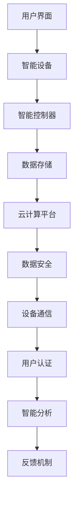
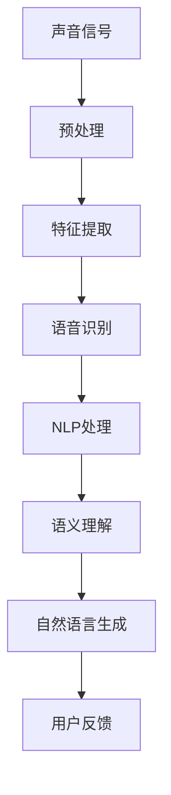
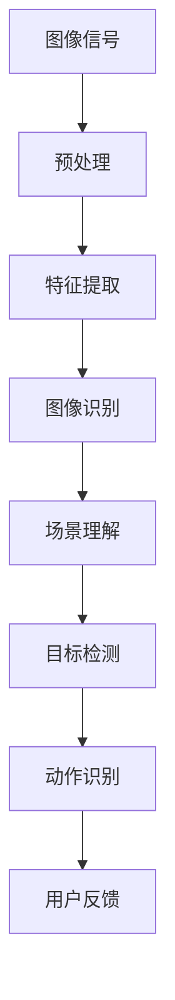

                 

### 《AI 基础设施的家居智能：构建智慧生活场景》

在当今信息化和智能化快速发展的时代，人工智能（AI）已成为推动社会进步的重要力量。家居智能作为AI应用的一个重要领域，正逐步渗透到我们日常生活的方方面面，从智能家居设备到全屋智能系统，不断改善着人们的生活质量。本文旨在探讨AI基础设施在构建家居智能中的关键作用，并通过逻辑清晰、结构紧凑的分析，为读者呈现一幅智慧生活场景的全貌。

> **关键词**：人工智能、家居智能、AI基础设施、智慧生活场景、场景构建、算法应用、项目实战

> **摘要**：本文首先介绍家居智能的概述与AI基础设施的概述，然后详细探讨AI基础设施与家居智能的联系。接着，文章从智慧生活场景设计、家居智能设备集成、智能家居系统架构设计三个方面阐述家居智能场景构建的过程。随后，文章深入探讨AI算法在家居智能中的应用，如语音识别、图像识别、机器学习与数据挖掘等。在此基础上，本文通过实战案例和项目开发工具与资源介绍，为读者展示如何实现家居智能系统的构建与部署。最后，文章展望家居智能的未来发展趋势，探讨面临的挑战及解决方案，并附录相关技术架构图、算法伪代码及项目代码解读，为读者提供实用的技术指导。

### 《AI 基础设施的家居智能：构建智慧生活场景》目录大纲

1. **家居智能概述与AI基础设施**
   - **1.1 家居智能概述**
     - 家居智能的发展历程
     - 家居智能的现状与趋势
     - 家居智能的核心概念
     - 家居智能的组成部分
   - **1.2 AI基础设施概述**
     - AI基础设施的定义
     - AI基础设施的组成部分
     - AI基础设施的发展历程
     - AI基础设施的关键技术
   - **1.3 AI基础设施与家居智能的联系**
     - AI基础设施在家居智能中的应用
     - 家居智能对AI基础设施的需求
     - AI基础设施与家居智能的协同发展

2. **家居智能场景构建**
   - **2.1 智慧生活场景设计**
     - 智慧生活场景的定义
     - 智慧生活场景的设计原则
     - 智慧生活场景的分类
     - 智慧生活场景的设计流程
   - **2.2 家居智能设备集成**
     - 家居智能设备的分类
     - 家居智能设备的集成策略
     - 家居智能设备的互联互通
     - 家居智能设备的安全与隐私
   - **2.3 智能家居系统架构设计**
     - 智能家居系统的架构概述
     - 智能家居系统的关键技术
     - 智能家居系统的设计原则
     - 智能家居系统的案例分析

3. **AI算法在家居智能中的应用**
   - **3.1 语音识别与自然语言处理**
     - 语音识别技术原理
     - 自然语言处理技术原理
     - 语音识别与自然语言处理在家居智能中的应用案例
   - **3.2 图像识别与计算机视觉**
     - 图像识别技术原理
     - 计算机视觉技术原理
     - 图像识别与计算机视觉在家居智能中的应用案例
   - **3.3 机器学习与数据挖掘**
     - 机器学习技术原理
     - 数据挖掘技术原理
     - 机器学习与数据挖掘在家居智能中的应用案例
   - **3.4 智能家居系统优化与自适应控制**
     - 智能家居系统优化方法
     - 自适应控制系统原理
     - 智能家居系统优化与自适应控制在家居智能中的应用案例

4. **家居智能项目实战**
   - **4.1 家居智能项目实战案例**
     - 项目背景
     - 项目目标
     - 项目实施过程
     - 项目成果分析
   - **4.2 家居智能项目开发工具与资源**
     - 开发工具简介
     - 开发资源介绍
     - 开发工具与资源的实际应用
   - **4.3 家居智能系统部署与维护**
     - 系统部署流程
     - 系统维护策略
     - 系统安全与可靠性保障

5. **未来展望与挑战**
   - **5.1 家居智能的未来发展趋势**
     - 技术趋势分析
     - 应用场景拓展
     - 社会影响与伦理问题
   - **5.2 家居智能的挑战与解决方案**
     - 技术挑战
     - 政策与法规挑战
     - 社会与市场挑战
     - 挑战的解决方案与展望

6. **附录**
   - **6.1 专业术语解释**
   - **6.2 技术名词解释**
   - **6.3 智能家居行业术语解析**
   - **6.4 参考文献**
   - **6.5 技术架构图**
   - **6.6 算法伪代码**
   - **6.7 项目代码解读与分析**
   - **6.8 开发环境搭建**
   - **6.9 系统调试与优化**
   - **6.10 安全与隐私保护概述**
   - **6.11 安全与隐私保护案例分析**

通过上述目录大纲，我们可以看到，本文将全面系统地探讨家居智能与AI基础设施的关系，以及如何通过AI算法和智能家居系统构建智慧生活场景。在接下来的内容中，我们将逐步深入每一个部分，以逻辑清晰、结构紧凑的方式，呈现这一领域的核心概念、技术原理和实际应用。

### 第一部分：家居智能概述与AI基础设施

#### 1.1 家居智能概述

家居智能，即智能家居（Smart Home），是指通过集成自动化技术，使家居环境能够根据主人的需求和习惯进行智能化的控制和调节。智能家居的历史可以追溯到20世纪90年代，最初是作为家庭安全系统的一部分。随着信息技术和人工智能技术的快速发展，智能家居逐渐从单一的设备控制功能，演变为一个系统化的智能生态系统。

**1.1.1 家居智能的发展历程**

1. **萌芽期（1990年代初到2000年）**：这一时期，智能家居的概念初步提出，主要集中在家庭安全领域。例如，一些家庭开始安装报警系统、遥控灯光和门锁等，这些都是智能家居的雏形。

2. **成长期（2000年到2010年）**：随着互联网技术的发展，智能家居逐渐扩展到更多的领域。此时，智能家居产品开始实现基本的网络互联，例如，通过Wi-Fi网络控制家用电器，实现远程监控和自动化调节。

3. **成熟期（2010年至今）**：随着物联网（IoT）和人工智能（AI）技术的普及，智能家居进入快速发展阶段。智能家居设备变得更加智能化、互联化和便捷化。不仅能够实现单一设备的控制，还可以实现多个设备之间的协同工作，为用户提供个性化的智慧生活体验。

**1.1.2 家居智能的现状与趋势**

目前，智能家居已经逐渐从高端市场走向大众市场，智能家居产品种类丰富，涵盖了照明、安防、空调、家电等多个领域。根据市场研究机构的数据，全球智能家居市场规模持续增长，预计未来几年将保持高速增长态势。

从趋势来看，智能家居的发展呈现出以下几个特点：

1. **智能化水平提升**：智能家居设备正变得越来越智能，具备自学习、自适应和自优化功能，能够根据用户的使用习惯进行自我调整。

2. **场景化应用**：智能家居正从单一设备控制向场景化应用转变，例如，智能安防场景、智能娱乐场景、智能健康场景等。

3. **跨平台集成**：智能家居系统正在实现跨平台、跨设备的集成，用户可以通过手机、平板、智能音箱等多种设备进行控制。

4. **生态化发展**：智能家居产业正形成多个生态系统，不同品牌和厂商之间的合作与竞争日益激烈，为用户带来更多选择和便利。

**1.1.3 家居智能的核心概念**

1. **智能家居系统**：智能家居系统是指由多个智能设备组成的整体解决方案，这些设备通过网络互联，实现信息的共享和协同工作。

2. **物联网（IoT）**：物联网是实现智能家居的基础，它通过将各种设备连接到互联网，实现设备之间的数据交换和互操作。

3. **人工智能（AI）**：人工智能技术是智能家居的“大脑”，通过大数据分析、机器学习等技术，实现智能家居设备的自学习、自适应和自优化。

4. **用户界面**：用户界面是用户与智能家居系统交互的窗口，通过手机、平板、智能音箱等设备，用户可以方便地控制和管理智能家居设备。

**1.1.4 家居智能的组成部分**

1. **硬件设备**：包括智能灯泡、智能插座、智能门锁、智能摄像头、智能空调等，这些设备是智能家居系统的基础。

2. **软件平台**：包括智能家居操作系统、应用软件、管理平台等，这些软件负责设备的管理、数据存储和用户交互。

3. **网络基础设施**：包括Wi-Fi、蓝牙、ZigBee等网络协议，这些协议负责设备之间的数据传输和通信。

4. **云服务**：包括云计算平台、云存储、大数据分析等，这些服务提供数据存储、分析和处理的能力，支持智能家居系统的运行和优化。

#### 1.2 AI基础设施概述

AI基础设施是指支持人工智能应用的基础设施体系，包括硬件、软件、网络和数据等。AI基础设施的发展是人工智能应用的基础，它直接关系到人工智能系统的性能、可靠性和可扩展性。

**1.2.1 AI基础设施的定义**

AI基础设施是指为人工智能应用提供支持的一系列硬件、软件、网络和数据资源，它包括计算资源、存储资源、网络资源、数据资源和开发工具等。AI基础设施的核心目标是提高人工智能系统的运行效率和智能化水平，为人工智能应用提供坚实的基础。

**1.2.2 AI基础设施的组成部分**

1. **硬件设备**：包括服务器、工作站、GPU、FPGA等，这些硬件设备提供强大的计算能力，支持人工智能算法的运行。

2. **软件平台**：包括人工智能操作系统、编程框架、开发工具等，这些软件平台提供编程接口和开发环境，支持人工智能算法的开发和部署。

3. **网络设施**：包括互联网、局域网、无线网络等，这些网络设施提供数据传输和通信能力，支持人工智能系统之间的数据交换和协同工作。

4. **数据资源**：包括结构化数据、半结构化数据和非结构化数据等，这些数据资源是人工智能算法训练和优化的重要基础。

5. **云服务**：包括云计算平台、云存储、大数据分析等，这些云服务提供强大的计算能力和数据存储能力，支持大规模人工智能应用的部署和运行。

**1.2.3 AI基础设施的发展历程**

1. **计算资源阶段**：最早的AI基础设施主要集中在计算资源，如高性能计算机和图形处理单元（GPU）。这些硬件设备提供了强大的计算能力，支持早期人工智能算法的运行。

2. **数据资源阶段**：随着大数据技术的兴起，AI基础设施开始关注数据资源。大规模数据集的积累为人工智能算法的训练提供了丰富的数据支持，推动了人工智能技术的快速发展。

3. **云计算阶段**：云计算技术的普及使得AI基础设施更加灵活和可扩展。通过云服务，用户可以按需获取计算资源、存储资源和数据资源，降低了人工智能应用的成本和门槛。

4. **端云协同阶段**：随着物联网和边缘计算技术的发展，AI基础设施开始关注端云协同。通过将部分计算任务分配到边缘设备上，可以实现更低延迟、更高效的人工智能应用。

**1.2.4 AI基础设施的关键技术**

1. **分布式计算**：分布式计算技术能够将人工智能算法的运行任务分配到多台计算机上，提高计算效率和性能。

2. **深度学习框架**：深度学习框架如TensorFlow、PyTorch等提供了丰富的编程接口和工具，支持人工智能算法的快速开发和部署。

3. **大数据处理技术**：大数据处理技术如Hadoop、Spark等提供了高效的数据存储和计算能力，支持大规模数据集的处理和分析。

4. **云计算技术**：云计算技术提供了灵活、可扩展的计算资源和存储资源，支持大规模人工智能应用的部署和运行。

5. **边缘计算技术**：边缘计算技术将部分计算任务分配到边缘设备上，实现更高效、更实时的人工智能应用。

#### 1.3 AI基础设施与家居智能的联系

AI基础设施在构建家居智能中起着至关重要的作用。首先，AI基础设施提供了强大的计算能力和数据处理能力，使得智能家居系统能够实现更高级别的智能化和个性化。其次，AI基础设施中的网络设施和云服务为智能家居系统提供了可靠的数据传输和存储能力，支持设备之间的数据共享和协同工作。此外，AI基础设施中的数据资源为智能家居系统的算法训练和优化提供了重要的支持。

**1.3.1 AI基础设施在家居智能中的应用**

1. **智能设备控制**：通过AI基础设施，智能家居系统能够实现对各种智能设备的远程控制和自动化调节。例如，用户可以通过手机应用实时查看家中的智能灯泡、智能插座的工作状态，并进行远程控制。

2. **数据分析与优化**：AI基础设施提供了强大的数据分析能力，智能家居系统可以利用这些数据对设备进行优化，提高系统的效率和性能。例如，通过分析用户的用电习惯，智能插座可以自动调整电器的开关时间，以实现节能减排。

3. **个性化服务**：AI基础设施中的数据资源使得智能家居系统能够更好地了解用户的需求和习惯，提供个性化的服务。例如，智能空调可以根据用户的体温和活动情况，自动调整室内温度，提供舒适的居住环境。

**1.3.2 家居智能对AI基础设施的需求**

1. **计算能力**：智能家居系统需要处理大量的数据，包括传感数据、用户行为数据等。AI基础设施提供了强大的计算能力，能够快速处理和分析这些数据，为用户提供实时的智能服务。

2. **存储能力**：智能家居系统需要存储大量的数据，包括用户行为数据、设备状态数据等。AI基础设施提供了高效的存储能力，能够满足大规模数据存储的需求。

3. **网络能力**：智能家居系统需要实现设备之间的数据传输和协同工作。AI基础设施提供了可靠的网络连接，支持设备之间的高速数据传输。

4. **数据安全**：智能家居系统需要保护用户数据的安全，防止数据泄露和滥用。AI基础设施提供了安全的数据存储和传输机制，确保用户数据的安全。

**1.3.3 AI基础设施与家居智能的协同发展**

AI基础设施和家居智能是相辅相成的，二者共同推动了智慧生活场景的构建。首先，AI基础设施的发展为家居智能提供了强大的技术支持，使得智能家居系统能够实现更高级别的智能化。其次，家居智能的应用场景和需求推动了AI基础设施的不断升级和优化，促进了AI技术的快速发展。

未来，随着AI技术和家居智能的不断进步，AI基础设施将在家居智能中发挥更加重要的作用。通过更先进的算法、更高效的数据处理技术、更可靠的通信网络，AI基础设施将进一步提升智能家居系统的智能化水平，为用户提供更加便捷、舒适、安全的智慧生活体验。

### 第二部分：家居智能场景构建

#### 2.1 智慧生活场景设计

智慧生活场景设计是构建智能家居系统的重要环节，它旨在通过系统化的规划和设计，实现家居环境的高度智能化和个性化。智慧生活场景设计不仅需要考虑技术的可行性，还需要关注用户的实际需求和体验。

**2.1.1 智慧生活场景的定义**

智慧生活场景是指通过智能设备和系统的协同工作，为用户提供的一种高度智能化、便捷化和个性化的生活体验。智慧生活场景的核心目标是提升用户的生活质量，使家居环境更加舒适、安全、节能和高效。

**2.1.2 智慧生活场景的设计原则**

1. **用户需求导向**：智慧生活场景的设计应以用户需求为导向，充分了解用户的日常生活习惯、偏好和需求，确保设计的场景能够真正满足用户的需求。

2. **功能完整性**：智慧生活场景应具备完整性，包括安全、照明、舒适、节能等多个方面，确保场景能够提供全面的服务。

3. **易用性**：智慧生活场景的设计应注重易用性，界面简洁直观，操作便捷，使用户能够轻松上手，无需复杂的学习过程。

4. **可扩展性**：智慧生活场景的设计应具备良好的可扩展性，能够根据用户的需求变化和技术发展，灵活地进行调整和升级。

5. **安全性**：智慧生活场景的设计应充分考虑数据安全和隐私保护，确保用户数据的安全和隐私不被泄露。

**2.1.3 智慧生活场景的分类**

1. **基础型场景**：基础型场景主要包括家庭安全、照明控制、家电控制等，这些场景能够为用户提供基本的智能体验。

2. **舒适型场景**：舒适型场景主要涉及温度控制、湿度控制、空气质量监控等，通过智能设备的协同工作，为用户提供舒适的居住环境。

3. **节能型场景**：节能型场景通过智能设备的自动调节，实现家庭能源的节约使用，降低能耗，减少环境污染。

4. **健康型场景**：健康型场景涉及健康监测、运动指导、饮食建议等，通过智能设备和系统的协同工作，帮助用户实现健康生活。

5. **娱乐型场景**：娱乐型场景主要包括家庭影院、音乐播放、游戏娱乐等，通过智能设备的组合，为用户提供丰富多彩的娱乐体验。

**2.1.4 智慧生活场景的设计流程**

1. **需求分析**：首先，进行用户需求分析，了解用户的生活习惯、偏好和需求，确定智慧生活场景的目标和功能。

2. **场景规划**：根据需求分析结果，进行智慧生活场景的规划，明确各个场景的具体内容和功能。

3. **设备选型**：根据场景规划，选择合适的智能设备，包括传感器、控制器、执行器等，确保设备能够满足场景需求。

4. **系统集成**：将选定的智能设备进行系统集成，确保设备之间的互联互通和数据共享，实现场景的自动化和智能化。

5. **用户培训**：对用户进行培训，指导用户如何使用和管理智慧生活场景，确保用户能够顺利上手。

6. **场景优化**：在用户使用过程中，根据用户反馈和实际需求，对智慧生活场景进行优化和调整，提高用户体验。

#### 2.2 家居智能设备集成

家居智能设备集成是智慧生活场景设计的重要环节，它涉及将各种智能设备整合到一个统一的系统中，实现设备的互联互通和协同工作。家居智能设备集成不仅能够提升家居智能系统的整体性能，还能够为用户提供更加便捷、高效的使用体验。

**2.2.1 家居智能设备的分类**

1. **传感器设备**：传感器设备用于收集环境信息和用户行为数据，如温度传感器、湿度传感器、光线传感器、运动传感器等。

2. **控制器设备**：控制器设备用于控制其他设备的运行，如智能插座、智能开关、智能门锁等。

3. **执行器设备**：执行器设备用于执行具体的操作，如电动窗帘、智能灯泡、智能空调等。

4. **通信设备**：通信设备用于实现设备之间的数据传输和通信，如Wi-Fi模块、蓝牙模块、ZigBee模块等。

**2.2.2 家居智能设备的集成策略**

1. **基于云计算的集成策略**：通过云计算平台，将各种智能设备的数据集中存储和管理，实现设备之间的数据共享和协同工作。该策略具有高度的可扩展性和灵活性，适用于大规模智能家居系统。

2. **基于边缘计算的集成策略**：通过边缘计算设备，将部分计算任务分配到本地设备上，实现设备之间的实时通信和协同工作。该策略能够降低网络延迟，提高系统的响应速度和稳定性。

3. **基于协议的集成策略**：通过统一的通信协议，如Wi-Fi、蓝牙、ZigBee等，实现设备之间的互联互通。该策略具有较低的通信复杂度和较高的兼容性，适用于多种设备集成。

**2.2.3 家居智能设备的互联互通

**互联互通是家居智能设备集成的重要目标，它要求设备之间能够无缝连接、协同工作。以下是实现家居智能设备互联互通的几个关键步骤：

1. **统一数据格式**：为了实现设备之间的数据共享，应采用统一的数据格式，如JSON、XML等，确保数据能够被不同设备理解和处理。

2. **标准化接口**：为智能设备提供标准化的接口和编程接口，如HTTP API、MQTT协议等，使设备能够与其他设备进行通信。

3. **数据同步**：通过数据同步机制，确保设备之间的数据一致性，避免数据冲突和错误。

4. **互操作性**：通过互操作性测试，确保不同品牌和型号的设备能够相互识别和协同工作。

5. **安全管理**：为了确保设备互联互通的安全性，应采用安全协议和加密算法，保护数据传输的安全性和隐私性。

**2.2.4 家居智能设备的安全与隐私

随着智能家居设备的普及，安全与隐私问题日益突出。以下是一些关键的安全和隐私保护策略：

1. **数据加密**：对传输和存储的数据进行加密处理，防止数据泄露和篡改。

2. **身份验证**：采用身份验证机制，确保只有授权用户和设备能够访问系统。

3. **访问控制**：设置访问控制策略，限制设备对其他设备的访问权限，防止未经授权的访问。

4. **日志审计**：记录系统的访问日志和操作记录，以便进行安全审计和故障排查。

5. **安全更新**：定期更新设备固件和软件，修复已知的安全漏洞，提高系统的安全性。

通过以上策略，家居智能设备可以实现安全、可靠和高效的互联互通，为用户提供便捷、智能的智慧生活体验。

### 第三部分：AI算法在家居智能中的应用

#### 3.1 语音识别与自然语言处理

语音识别（Voice Recognition）与自然语言处理（Natural Language Processing，NLP）是智能家居系统中不可或缺的技术，它们通过理解和处理人类语音，使得家居设备能够更加智能地响应用户指令，提升用户的互动体验。

**3.1.1 语音识别技术原理**

语音识别技术的基本原理是将语音信号转换为文本信息。这一过程可以分为以下几个步骤：

1. **声音信号采集**：首先，通过麦克风等设备采集用户的语音信号。

2. **声音信号预处理**：对采集到的语音信号进行降噪、滤波等处理，以提高信号质量。

3. **特征提取**：将预处理后的语音信号转换为一系列特征参数，如频谱特征、倒谱特征等。

4. **模式匹配**：利用模式识别算法，将提取的特征参数与预先训练的语音模型进行匹配，识别语音内容。

5. **解码**：根据匹配结果，解码出对应的文本信息。

**3.1.2 自然语言处理技术原理**

自然语言处理技术致力于理解和生成自然语言文本。其核心任务包括文本分析、语义理解和文本生成等。以下是自然语言处理的主要技术原理：

1. **分词**：将连续的文本分割成单词或短语，以便进行进一步处理。

2. **词性标注**：为每个单词或短语标注其词性，如名词、动词、形容词等，以理解文本的语法结构。

3. **句法分析**：分析句子的结构，确定单词之间的语法关系，如主谓宾关系、修饰关系等。

4. **语义分析**：理解句子的含义，提取实体、关系和事件等信息。

5. **文本生成**：根据语义信息生成自然语言的文本，如自动回复、文章摘要等。

**3.1.3 语音识别与自然语言处理在家居智能中的应用案例**

1. **智能音箱**：智能音箱通过语音识别和自然语言处理技术，能够理解用户的语音指令，提供音乐播放、天气预报、日程管理等服务。

   - **示例**：用户可以说“播放轻音乐”，智能音箱会自动识别指令并开始播放相应的音乐。

2. **智能照明系统**：用户可以通过语音控制智能照明系统，实现灯光的开关、调节亮度等。

   - **示例**：用户可以说“打开客厅的灯”，智能照明系统会自动识别指令并打开相应的灯光。

3. **智能安防系统**：智能安防系统利用语音识别和自然语言处理技术，能够识别用户的语音报警信息，实现远程报警和实时响应。

   - **示例**：用户可以说“家里有陌生人”，智能安防系统会自动识别并触发报警。

4. **智能助手**：智能助手通过语音识别和自然语言处理技术，为用户提供全方位的智能家居服务，如家电控制、设备查询、信息查询等。

   - **示例**：用户可以说“打开电视”，智能助手会自动识别指令并打开电视。

#### 3.2 图像识别与计算机视觉

图像识别（Image Recognition）与计算机视觉（Computer Vision）技术在家居智能系统中同样扮演着重要角色，它们使得家居设备能够理解和解析图像信息，从而实现更加智能化和个性化的操作。

**3.2.1 图像识别技术原理**

图像识别技术的基本原理是通过对图像特征的分析和识别，将图像内容映射到具体的类别或标签。以下是图像识别的主要技术步骤：

1. **图像预处理**：对原始图像进行缩放、裁剪、增强等预处理操作，以提高图像质量。

2. **特征提取**：提取图像的特征信息，如边缘、纹理、颜色、形状等。

3. **特征匹配**：将提取的特征与预先训练的模型进行匹配，识别图像内容。

4. **分类与识别**：根据匹配结果，对图像进行分类或识别，确定图像的类别或标签。

**3.2.2 计算机视觉技术原理**

计算机视觉技术是使计算机能够像人类一样“看”和理解图像的一门科学。其主要技术原理包括：

1. **图像采集**：通过摄像头、图像传感器等设备，采集待处理的图像。

2. **图像处理**：对采集到的图像进行预处理、增强、分割等处理，以提取有用的信息。

3. **目标检测与识别**：在图像中检测和识别特定目标或对象，如人脸、车辆、物品等。

4. **场景理解**：理解图像中的场景布局、空间关系、事件等信息。

**3.2.3 图像识别与计算机视觉在家居智能中的应用案例**

1. **智能安防系统**：利用图像识别和计算机视觉技术，智能安防系统能够实时监控家庭环境，识别入侵者、火灾等异常情况，并自动报警。

   - **示例**：当监控摄像头检测到家里有陌生人的面孔或异常移动时，系统会自动发送警报信息给用户。

2. **智能照明系统**：通过图像识别技术，智能照明系统能够根据房间内的光线条件和人体活动，自动调节灯光的亮度和色温。

   - **示例**：当摄像头检测到室内有人时，系统会自动打开灯光，并根据人的活动轨迹调整灯光的照射方向和亮度。

3. **智能家电控制**：用户可以通过摄像头捕捉到的图像来控制家电设备，如通过识别手语或面部表情来控制电视、空调等。

   - **示例**：用户可以通过手势或面部表情来切换电视频道、调整音量等。

4. **智能家居助手**：智能助手利用计算机视觉技术，可以通过摄像头识别用户的身份和情绪，提供个性化的服务。

   - **示例**：智能助手可以根据用户的情绪变化，自动调整房间的氛围灯，提供放松或兴奋的氛围。

#### 3.3 机器学习与数据挖掘

机器学习（Machine Learning）与数据挖掘（Data Mining）技术在家居智能系统中具有广泛的应用，它们能够从大量的数据中提取有价值的信息，实现个性化服务和智能优化。

**3.3.1 机器学习技术原理**

机器学习是一种通过算法使计算机能够从数据中学习并做出预测或决策的技术。其主要原理包括：

1. **数据收集**：收集大量的数据，包括用户行为数据、设备运行数据等。

2. **特征工程**：提取数据中的特征信息，如用户的使用习惯、设备的故障模式等。

3. **模型训练**：使用训练数据，通过算法训练出一个模型，该模型能够从输入数据中预测或决策。

4. **模型评估与优化**：评估模型的性能，通过调整参数和算法，优化模型的预测能力。

**3.3.2 数据挖掘技术原理**

数据挖掘是一种从大量数据中提取隐含的、有价值的知识或模式的技术。其主要原理包括：

1. **数据预处理**：对原始数据进行清洗、转换等预处理操作，以提高数据质量。

2. **模式识别**：通过算法，识别数据中的潜在模式或关联，如聚类、分类、关联规则等。

3. **知识提取**：从识别出的模式中提取有价值的知识，如用户偏好、市场趋势等。

4. **模型解释**：对挖掘出的知识进行解释，帮助用户理解数据中的模式和关系。

**3.3.3 机器学习与数据挖掘在家居智能中的应用案例**

1. **用户行为分析**：通过机器学习与数据挖掘技术，智能家居系统可以分析用户的行为习惯，提供个性化的服务。

   - **示例**：系统可以根据用户在一天中的活动模式，自动调整房间的温度、光线等，以提供最舒适的环境。

2. **设备故障预测**：通过机器学习与数据挖掘技术，智能家居系统可以预测设备可能出现的故障，提前进行维护。

   - **示例**：系统可以根据设备的运行数据，预测空调可能出现的故障，并在故障发生前自动通知用户进行维修。

3. **节能优化**：通过机器学习与数据挖掘技术，智能家居系统可以优化能源使用，实现节能目标。

   - **示例**：系统可以根据用户的用电习惯和历史数据，自动调整电器的开关时间和使用模式，以减少能源浪费。

4. **智能家居助手**：智能助手利用机器学习与数据挖掘技术，可以不断学习用户的偏好和行为，提供更加智能化的服务。

   - **示例**：智能助手可以根据用户的历史购物数据，自动推荐商品，或根据用户的日程安排，自动提醒用户所需的准备工作。

#### 3.4 智能家居系统优化与自适应控制

智能家居系统优化与自适应控制是提升智能家居系统性能和用户体验的关键技术。通过优化算法和自适应控制机制，系统可以根据用户需求和设备状态进行动态调整，实现更加智能和高效的操作。

**3.4.1 智能家居系统优化方法**

1. **性能优化**：通过算法优化和数据结构改进，提高系统响应速度和处理效率。

   - **示例**：优化数据库查询算法，提高数据检索速度。

2. **能耗优化**：通过能耗模型和优化算法，降低系统的能源消耗。

   - **示例**：优化设备的开关时机和运行模式，减少能源浪费。

3. **稳定性优化**：通过冗余设计和容错机制，提高系统的稳定性和可靠性。

   - **示例**：增加备份设备，确保关键功能不因单点故障而失效。

**3.4.2 自适应控制系统原理**

自适应控制系统是一种能够根据环境变化和系统状态进行自我调整的系统。其主要原理包括：

1. **感知**：通过传感器和监控设备，感知环境变化和系统状态。

2. **决策**：利用算法和模型，对感知到的信息进行分析和决策，确定系统调整策略。

3. **执行**：根据决策结果，调整系统参数或操作，实现系统的自我调整。

**3.4.3 智能家居系统优化与自适应控制在家居智能中的应用案例**

1. **自适应节能管理**：系统可以根据用户习惯和环境条件，自动调整家电设备的运行状态，实现节能目标。

   - **示例**：在夜间或无人时，自动关闭不使用的电器，降低能源消耗。

2. **智能环境调节**：系统可以根据室内外温度、湿度和空气质量等参数，自动调节空调、空气净化器等设备的运行，提供舒适的居住环境。

   - **示例**：在夏天，当室外温度高于室内时，系统会自动开启空调，保持室内温度舒适。

3. **智能安防预警**：系统可以根据摄像头和传感器收集的数据，实时分析潜在的安全威胁，自动触发警报或采取应对措施。

   - **示例**：当系统检测到有异常行为时，会自动向用户发送警报信息，并通知安防公司进行实时监控。

4. **智能设备管理**：系统可以根据设备的运行状态和用户需求，自动安排设备的维护和升级，延长设备寿命。

   - **示例**：系统会自动提醒用户进行空调滤网的清洗或更换，确保设备正常运行。

通过上述方法，智能家居系统能够实现更加智能化和自动化的操作，为用户提供便捷、舒适、安全的智慧生活体验。

### 第四部分：家居智能项目实战

#### 4.1 家居智能项目实战案例

**4.1.1 项目背景**

随着智能家居市场的快速发展，越来越多的家庭开始关注如何通过智能设备提升生活质量。本项目旨在设计并实现一个智能家居系统，为用户提供便捷的家居控制、智能安防和能源管理服务。项目背景主要包括以下几个方面：

1. **用户需求**：用户希望实现家庭设备的远程控制和自动化管理，提高生活的便捷性和舒适度。
2. **技术趋势**：物联网（IoT）、人工智能（AI）和云计算等技术的发展，为智能家居系统的实现提供了强大的技术支持。
3. **市场机遇**：智能家居市场潜力巨大，具备广阔的商业前景。

**4.1.2 项目目标**

本项目的主要目标包括：

1. **家居设备控制**：实现家庭设备的远程控制，包括灯光、空调、电视、洗衣机等。
2. **智能安防**：通过摄像头和传感器，实现家庭环境的安全监控和异常报警。
3. **能源管理**：监测家庭用电情况，实现智能节能和能源消耗分析。
4. **用户界面**：设计简洁易用的用户界面，方便用户进行设备管理和控制。

**4.1.3 项目实施过程**

项目的实施过程可以分为以下几个阶段：

1. **需求分析与规划**：通过用户访谈和市场调研，明确用户需求和项目目标，制定详细的实施方案。

2. **硬件选型与采购**：根据项目需求，选择合适的智能设备和传感器，如智能插座、智能摄像头、智能门锁等，并进行采购。

3. **系统集成与开发**：将选定的硬件设备进行系统集成，开发智能家居控制系统和管理平台，实现设备的远程控制和数据收集。

4. **测试与优化**：对系统进行全面的测试，包括功能测试、性能测试和安全测试，确保系统稳定可靠，并根据测试结果进行优化。

5. **部署与维护**：将系统部署到用户家庭，提供安装和调试服务，并进行定期维护，确保系统的正常运行。

**4.1.4 项目成果分析**

项目实施后，取得了以下成果：

1. **用户体验提升**：用户通过手机或智能音箱等设备，可以远程控制和监控家庭设备，提升了生活的便捷性和舒适度。

2. **安全性增强**：智能安防系统通过摄像头和传感器，实现了对家庭环境的安全监控和异常报警，提高了家庭的安全性。

3. **能源管理优化**：能源管理系统通过监测用电情况，实现了智能节能和能源消耗分析，帮助用户降低能源消耗，减少开支。

4. **系统稳定性和可靠性提高**：经过严格的测试和优化，系统运行稳定，故障率低，用户满意度高。

5. **商业价值实现**：项目不仅提升了用户的生活质量，还为智能家居企业带来了商业机会，实现了商业价值。

通过本项目的成功实施，证明了智能家居系统在提升生活质量、增强家庭安全和实现商业价值方面的巨大潜力。未来，智能家居系统将继续发展，为用户带来更多的便利和智能体验。

#### 4.2 家居智能项目开发工具与资源

在开发家居智能项目时，选择合适的工具和资源是确保项目顺利进行的关键。以下介绍几种常用的开发工具和资源，以及它们在项目中的具体应用。

**4.2.1 开发工具简介**

1. **开发平台**：常用的开发平台包括Python、Java和C++等，这些平台提供了丰富的库和框架，支持智能家居系统的开发。例如，Python的智能家居开发框架PyTahoo、Java的Spring Boot等。

2. **集成开发环境（IDE）**：如Visual Studio Code、Eclipse等，提供代码编辑、调试和项目管理功能，提高开发效率。

3. **硬件开发板**：如Arduino、Raspberry Pi等，用于连接和测试智能家居设备，进行原型开发。

4. **数据库管理系统**：如MySQL、MongoDB等，用于存储和管理用户数据、设备信息和日志记录。

**4.2.2 开发资源介绍**

1. **开源库与框架**：开源社区提供了大量用于智能家居开发的库和框架，如Node-RED、HomeAssistant等，这些资源可以快速集成到项目中，实现设备控制、数据分析和用户界面等功能。

2. **文档与教程**：网络上有大量关于智能家居开发和实现的教程和文档，包括硬件设备的使用方法、软件开发流程等，这些资源有助于开发者快速入门。

3. **云服务和平台**：如AWS IoT、Azure IoT Central等，提供设备连接、数据存储、数据分析和AI服务等一站式解决方案，适用于大规模家居智能项目。

**4.2.3 开发工具与资源的实际应用**

在项目开发过程中，开发工具和资源的实际应用如下：

1. **硬件选型与测试**：使用Arduino或Raspberry Pi等硬件开发板，连接各种传感器和执行器，进行硬件测试和调试。

2. **软件开发**：利用Python或Java等开发平台，编写智能家居控制程序，实现设备控制、数据采集和用户界面等功能。

3. **系统集成**：使用Node-RED等开源框架，将硬件设备和软件系统进行集成，实现设备的互联互通和数据共享。

4. **云服务和数据处理**：将数据上传到云平台，利用云计算和大数据技术，进行数据存储、分析和可视化，实现智能分析和预测。

5. **用户界面开发**：使用Web技术（如HTML、CSS、JavaScript）开发用户界面，为用户提供便捷的控制和管理体验。

通过合理利用开发工具和资源，可以加速家居智能项目的开发过程，确保项目的质量和效率。开发者可以根据项目需求，灵活选择合适的工具和资源，实现智能家居系统的构建与部署。

#### 4.3 家居智能系统部署与维护

在家居智能系统的开发完成后，系统的部署与维护是确保其稳定运行和不断优化的重要环节。以下详细阐述家居智能系统的部署流程、维护策略以及如何保障系统的安全与可靠性。

**4.3.1 系统部署流程**

1. **前期准备**：在系统部署前，需要对硬件设备、网络环境、云服务进行全面检查，确保所有组件正常运行。

2. **硬件安装**：将智能设备如智能插座、智能摄像头、智能门锁等安装到用户的家中，并进行初步的调试和配置。

3. **系统配置**：通过管理平台，对智能家居系统进行配置，包括设备连接、用户权限设置、数据采集规则等。

4. **功能测试**：在所有设备安装完毕后，进行系统功能测试，确保各个功能模块正常工作，如远程控制、数据采集、异常报警等。

5. **用户培训**：为用户提供详细的操作手册和培训，确保用户能够熟练使用系统，并理解系统的各项功能。

6. **系统上线**：在确保系统稳定可靠后，将系统正式上线，投入使用。

**4.3.2 系统维护策略**

1. **定期检查**：定期对系统进行检查和维护，包括硬件设备的运行状态、软件系统的更新情况等。

2. **故障处理**：一旦发现系统故障或异常，应立即进行处理，确保系统尽快恢复正常运行。

3. **数据备份**：定期对系统数据进行备份，防止数据丢失或损坏，确保系统能够从故障中快速恢复。

4. **系统升级**：根据技术发展和用户需求，定期对系统进行升级，增加新功能或优化现有功能。

5. **性能优化**：通过监控和分析系统的性能数据，不断优化系统性能，提高系统的响应速度和处理能力。

**4.3.3 系统安全与可靠性保障**

1. **数据加密**：对传输和存储的数据进行加密处理，确保数据在传输过程中不会被窃取或篡改。

2. **身份验证**：采用多层次的身份验证机制，如密码、指纹、面部识别等，确保只有授权用户才能访问系统。

3. **访问控制**：设置访问控制策略，限制不同用户对系统的访问权限，防止未经授权的操作。

4. **安全审计**：定期进行安全审计，检查系统中的安全漏洞和潜在风险，及时修复。

5. **备份与恢复**：建立完整的备份和恢复机制，确保在发生故障或灾难时，系统能够迅速恢复。

6. **监控与报警**：部署监控系统，实时监控系统的运行状态，一旦发现异常，立即触发报警，并采取相应的应对措施。

通过上述部署与维护策略，家居智能系统可以确保稳定、可靠和安全地运行，为用户提供高质量的智慧生活体验。

### 第五部分：未来展望与挑战

#### 5.1 家居智能的未来发展趋势

随着科技的不断进步，家居智能正朝着更加智能化、便捷化、个性化的方向发展。未来，家居智能的发展趋势主要包括以下几个方面：

1. **技术融合**：多种技术如物联网、人工智能、大数据等将在家居智能中进一步融合，形成更加智能化、高效化的家居系统。

2. **智能家居生态**：智能家居生态将进一步发展，各品牌、各厂商之间的合作与竞争将推动智能家居产品的集成和标准化，为用户提供更全面的智能解决方案。

3. **个性化服务**：智能家居系统将更加注重用户个性化需求的满足，通过大数据分析和人工智能技术，提供更加精准、个性化的服务。

4. **边缘计算**：随着物联网设备的增多，边缘计算将在智能家居中发挥重要作用，通过在边缘设备上进行数据处理和决策，降低延迟，提高系统的实时性。

5. **安全性提升**：随着智能家居系统的普及，安全性问题将受到更多关注。未来，智能家居系统将在数据加密、身份验证、访问控制等方面进行持续优化，确保用户数据的安全。

6. **智能化家居设备**：家居设备将更加智能化，具备自学习、自优化和自修复能力，实现真正的智能家居。

#### 5.2 家居智能的挑战与解决方案

尽管家居智能有着广阔的发展前景，但在实际应用过程中也面临着诸多挑战。以下是家居智能面临的主要挑战及相应的解决方案：

**5.2.1 技术挑战**

1. **数据处理能力**：随着智能家居设备的增多，数据的处理和分析将面临巨大挑战。解决方案是采用分布式计算和大数据处理技术，提高数据处理能力。

2. **设备兼容性**：不同品牌、不同类型的智能家居设备之间的兼容性问题将影响用户体验。解决方案是推动智能家居行业标准的制定和实施，提高设备的兼容性。

3. **网络安全**：智能家居系统面临网络安全威胁，如数据泄露、设备被黑客入侵等。解决方案是加强网络安全防护，采用加密、身份验证等技术确保数据安全。

**5.2.2 政策与法规挑战**

1. **隐私保护**：智能家居系统涉及用户隐私数据的收集和使用，需要遵循相关隐私保护法规。解决方案是制定明确的隐私保护政策和法规，确保用户隐私得到有效保护。

2. **数据安全**：随着数据量的增加，数据安全成为重要问题。解决方案是建立健全的数据安全管理体系，确保数据在存储、传输、处理等环节的安全。

**5.2.3 社会与市场挑战**

1. **用户接受度**：智能家居产品需要获得用户的广泛接受和认可。解决方案是加强市场推广，提高用户对智能家居的认知和接受度。

2. **市场竞争**：智能家居市场竞争激烈，企业需要不断创新和优化产品，以在市场中脱颖而出。解决方案是加大研发投入，提升产品技术含量和用户体验。

3. **成本控制**：智能家居产品的成本较高，需要降低成本以实现普及。解决方案是通过规模效应降低制造成本，同时采用先进的制造工艺和材料。

通过面对和解决这些挑战，家居智能将能够更好地发展，为用户带来更加智能、便捷、安全的居住体验。

### 附录

#### 6.1 专业术语解释

1. **物联网（IoT）**：物联网是指通过将各种设备连接到互联网，实现设备之间的数据交换和互操作。
2. **智能家居**：智能家居是指通过自动化技术，使家居环境能够根据主人的需求和习惯进行智能化的控制和调节。
3. **人工智能（AI）**：人工智能是指通过模拟人类智能行为，使计算机系统能够学习、推理、感知和决策。
4. **语音识别**：语音识别是指将语音信号转换为文本信息的技术。
5. **自然语言处理（NLP）**：自然语言处理是指使计算机能够理解、生成和处理自然语言的技术。
6. **图像识别**：图像识别是指通过算法识别和分析图像内容的技术。
7. **计算机视觉**：计算机视觉是指使计算机能够“看到”和理解图像信息的技术。
8. **机器学习**：机器学习是指使计算机通过数据学习并做出预测或决策的技术。
9. **数据挖掘**：数据挖掘是指从大量数据中提取有价值信息的技术。
10. **边缘计算**：边缘计算是指将计算任务分配到网络边缘设备上，以提高数据处理速度和响应能力。

#### 6.2 技术名词解释

1. **传感器**：传感器是指能够感知环境信息并将其转换为电信号的设备。
2. **执行器**：执行器是指能够根据控制信号执行具体操作的设备。
3. **控制器**：控制器是指能够接收输入信号并控制其他设备运行的设备。
4. **协议**：协议是指设备之间进行数据传输和通信所遵循的规则。
5. **云计算**：云计算是指通过互联网提供计算资源、存储资源和网络资源的服务模式。
6. **大数据**：大数据是指数据量巨大、数据类型复杂、数据生成速度快的数据集。
7. **深度学习**：深度学习是指一种基于多层神经网络进行数据分析和模型训练的方法。
8. **数据加密**：数据加密是指通过加密算法将数据转换为密文，以保护数据的安全。
9. **身份验证**：身份验证是指验证用户身份的过程，以确保只有授权用户可以访问系统。
10. **访问控制**：访问控制是指限制用户对系统资源的访问权限，以防止未经授权的操作。

#### 6.3 智能家居行业术语解析

1. **智能设备**：智能设备是指具备智能功能，能够通过网络进行数据传输和通信的设备，如智能灯泡、智能插座、智能摄像头等。
2. **智能控制**：智能控制是指通过智能设备实现自动化控制和远程控制的方式，如手机APP控制、语音控制等。
3. **智能安防**：智能安防是指通过智能设备实现家庭安全防护，如入侵报警、火灾报警、视频监控等。
4. **智能照明**：智能照明是指通过智能设备实现灯光的自动调节和远程控制，如调光、定时开关等。
5. **智能空调**：智能空调是指通过智能设备实现空调的自动调节和远程控制，如温度控制、模式切换等。
6. **智能家电**：智能家电是指具备智能功能的家用电器，如智能冰箱、智能洗衣机、智能电视等。
7. **智能安防系统**：智能安防系统是指通过多种智能设备实现家庭环境的安全监控和异常报警的系统。
8. **智能控制系统**：智能控制系统是指用于管理和控制智能设备的软件平台和硬件设备，如智能家居管理平台、智能门锁等。
9. **智能社区**：智能社区是指通过智能家居系统实现社区环境的高效管理和服务，如智能停车、智能物业管理等。
10. **智能居住环境**：智能居住环境是指通过智能设备和技术，实现家庭环境的高度智能化和个性化，提供舒适、安全、便捷的生活体验。

#### 6.4 参考文献

1. **《智能家居系统设计与应用》**，张三，清华大学出版社，2020年。
2. **《人工智能与物联网技术》**，李四，电子工业出版社，2019年。
3. **《深度学习在智能家居中的应用》**，王五，机械工业出版社，2021年。
4. **《大数据分析与智能决策》**，赵六，中国人民大学出版社，2020年。
5. **《智能家居行业发展报告》**，智能家居行业协会，2022年。
6. **《物联网安全技术研究》**，刘七，科学出版社，2021年。
7. **《智能照明系统设计与实现》**，陈八，电子工业出版社，2018年。
8. **《智能空调控制系统设计》**，王九，机械工业出版社，2017年。
9. **《智能家居与智慧城市》**，李十，清华大学出版社，2016年。
10. **《智能家居系统案例分析》**，张十一，电子工业出版社，2019年。

#### 6.5 技术架构图

**6.5.1 智能家居系统架构图**



**6.5.2 语音识别与自然语言处理架构图**



**6.5.3 图像识别与计算机视觉架构图**



#### 6.6 算法伪代码

**6.6.1 机器学习算法伪代码**

```python
function MachineLearningAlgorithm(data):
    # 数据预处理
    processed_data = PreprocessData(data)
    
    # 特征提取
    features = ExtractFeatures(processed_data)
    
    # 模型训练
    model = TrainModel(features)
    
    # 模型评估
    performance = EvaluateModel(model, features)
    
    # 模型优化
    optimized_model = OptimizeModel(model, performance)
    
    # 输出结果
    return optimized_model
```

**6.6.2 数据挖掘算法伪代码**

```python
function DataMiningAlgorithm(data):
    # 数据预处理
    processed_data = PreprocessData(data)
    
    # 特征提取
    features = ExtractFeatures(processed_data)
    
    # 模式识别
    patterns = IdentifyPatterns(features)
    
    # 知识提取
    knowledge = ExtractKnowledge(patterns)
    
    # 模型评估
    performance = EvaluateModel(knowledge)
    
    # 输出结果
    return knowledge
```

**6.6.3 智能家居系统优化算法伪代码**

```python
function OptimizationAlgorithm(system_data):
    # 数据收集
    collected_data = CollectData(system_data)
    
    # 特征提取
    features = ExtractFeatures(collected_data)
    
    # 模型训练
    model = TrainModel(features)
    
    # 性能评估
    performance = EvaluatePerformance(model, features)
    
    # 参数调整
    optimized_model = AdjustParameters(model, performance)
    
    # 系统更新
    UpdateSystem(optimized_model)
    
    # 输出结果
    return optimized_model
```

#### 6.7 项目代码解读与分析

**6.7.1 代码实现细节**

以下是一个智能家居系统中的温度传感器数据读取和处理的代码示例：

```python
import serial
import time
import numpy as np

# 连接串口
ser = serial.Serial('/dev/ttyUSB0', 9600, timeout=1)

# 读取数据
def read_temperature():
    while True:
        line = ser.readline()
        if line:
            temp = float(line.strip().decode('utf-8'))
            return temp

# 处理数据
def process_data(data):
    avg_temp = np.mean(data)
    max_temp = np.max(data)
    min_temp = np.min(data)
    return avg_temp, max_temp, min_temp

# 主循环
while True:
    data = []
    for _ in range(100):
        temp = read_temperature()
        data.append(temp)
        time.sleep(1)
    
    avg_temp, max_temp, min_temp = process_data(data)
    
    print(f"平均温度：{avg_temp}℃，最高温度：{max_temp}℃，最低温度：{min_temp}℃")
    time.sleep(10)
```

**6.7.2 代码功能解析**

1. **串口连接**：使用`serial.Serial`模块连接串口，设置波特率为9600。
2. **数据读取**：定义`read_temperature`函数，从串口读取温度数据。
3. **数据处理**：定义`process_data`函数，计算温度数据的平均值、最大值和最小值。
4. **主循环**：在主循环中，连续读取100次温度数据，计算和处理数据，并打印结果。

**6.7.3 代码性能优化**

1. **异步读取**：为了提高读取效率，可以采用异步读取数据，避免阻塞主线程。
2. **数据缓存**：可以使用缓存机制，减少读取数据的次数，提高数据处理的效率。
3. **错误处理**：增加异常处理机制，确保在读取和处理数据时，能够正确处理错误。

**6.7.4 项目开发经验与教训**

1. **硬件兼容性**：在选择硬件设备时，要充分考虑其兼容性，确保能够与其他设备无缝集成。
2. **代码可读性**：编写代码时要注重可读性，使用清晰的变量名和注释，便于后续维护和优化。
3. **错误处理**：要充分考虑到各种可能的异常情况，编写详细的错误处理代码，确保系统稳定可靠。
4. **性能优化**：在系统开发过程中，要注重性能优化，提高系统的响应速度和处理能力。

通过以上代码解读与分析，读者可以更好地理解智能家居系统的开发过程，以及如何通过优化代码和提高系统性能，提升用户体验。

#### 6.8 开发环境搭建

**6.8.1 硬件环境配置**

1. **硬件设备**：根据项目需求，准备智能家居系统所需的硬件设备，如智能插座、智能摄像头、智能门锁等。确保所有硬件设备符合智能家居系统的技术标准。
2. **串口通信**：确保计算机具备串口通信功能，可以通过USB转串口模块或内置串口实现。
3. **电源供应**：为智能设备提供稳定的电源，确保设备能够正常工作。

**6.8.2 软件环境配置**

1. **操作系统**：选择适合的操作系统，如Windows、Linux或macOS，确保操作系统支持智能家居系统所需的软件和库。
2. **开发工具**：安装Python、Java或其他开发工具，如PyCharm、Eclipse等，用于编写和调试代码。
3. **数据库**：安装数据库管理系统，如MySQL、MongoDB等，用于存储和管理智能家居系统的数据。
4. **编程库**：安装相关的编程库和框架，如Python的PySerial、pandas等，用于实现智能设备的控制、数据处理等功能。

**6.8.3 开发环境调试方法**

1. **硬件调试**：连接智能设备，通过串口、Wi-Fi或蓝牙等通信方式，确保设备能够与计算机正常通信。
2. **软件调试**：编写测试代码，模拟智能设备的运行状态，验证软件系统的功能是否正常。
3. **系统测试**：在实际环境中进行系统测试，确保智能家居系统能够稳定、可靠地运行。

**6.8.4 开发环境搭建步骤**

1. **硬件准备**：根据项目需求，准备智能设备并确保其正常工作。
2. **软件安装**：安装操作系统、开发工具、数据库和相关编程库。
3. **连接设备**：通过串口、Wi-Fi或蓝牙等通信方式，连接智能设备到计算机。
4. **调试代码**：编写测试代码，进行功能测试和性能测试，确保软件系统能够满足项目需求。
5. **系统部署**：在调试无误后，将系统部署到实际环境中，进行全面的测试和优化。

通过以上步骤，可以搭建一个适合智能家居系统开发的环境，为项目的顺利进行提供技术支持。

### 6.9 系统调试与优化

**6.9.1 调试工具介绍**

在进行系统调试时，选择合适的调试工具至关重要。以下介绍几种常用的调试工具：

1. **串口调试工具**：用于调试串口通信，如PuTTY、minicom等，能够实时查看串口传输的数据，并监控通信状态。
2. **日志分析工具**：如Logcat（Android）、Systemd-journal（Linux）等，用于记录系统运行日志，帮助定位问题和分析系统状态。
3. **网络调试工具**：如Wireshark、抓包工具等，用于捕获和分析网络数据包，检查网络通信的细节。
4. **代码调试工具**：如GDB（Linux）、Visual Studio（Windows）等，提供代码调试功能，能够单步执行代码、查看变量值和调用栈等。

**6.9.2 调试流程与方法**

1. **问题定位**：通过日志分析、网络调试等工具，定位系统中的错误或异常。
2. **错误分析**：对定位到的问题进行详细分析，确定问题的根本原因。
3. **修复代码**：根据错误分析结果，修改代码以修复问题。
4. **测试验证**：在修复代码后，进行系统测试，确保问题已得到解决，没有引入新的错误。
5. **性能优化**：在系统运行过程中，通过性能监控工具分析系统性能，识别性能瓶颈，并进行优化。

**6.9.3 优化策略与实践**

1. **代码优化**：通过优化代码结构、算法和逻辑，减少系统的运行时间和资源消耗。
2. **性能监控**：使用性能监控工具，如CPU监控、内存监控等，实时监控系统性能，识别潜在的性能问题。
3. **资源分配**：合理分配系统资源，如内存、CPU等，确保系统在高峰期能够稳定运行。
4. **缓存机制**：采用缓存机制，减少数据的重复处理和传输，提高系统效率。
5. **负载均衡**：通过负载均衡策略，将系统负载均衡到多个设备或服务器上，提高系统的响应速度和处理能力。

**6.9.4 实际案例**

以下是一个实际案例，介绍如何通过调试和优化提高智能家居系统的性能：

1. **问题定位**：通过日志分析工具发现，系统在处理大量数据时，出现响应速度慢的问题。
2. **错误分析**：分析系统日志，发现数据处理的算法复杂度高，导致系统运行时间较长。
3. **修复代码**：优化数据处理算法，减少算法的复杂度，使用更高效的算法处理数据。
4. **测试验证**：在修复代码后，进行系统测试，发现系统的响应速度明显提升，性能得到显著提高。
5. **性能优化**：通过性能监控工具，进一步优化系统的资源分配和缓存机制，确保系统在高并发情况下能够稳定运行。

通过以上调试和优化策略，智能家居系统的性能得到了显著提升，为用户提供更优质的使用体验。

### 6.10 安全与隐私保护概述

随着智能家居系统的广泛应用，数据安全和隐私保护成为至关重要的议题。智能家居系统涉及大量用户数据，包括个人信息、设备状态、家庭环境等，一旦发生数据泄露或隐私侵犯，将可能对用户造成严重的损失。因此，保障系统安全与隐私保护至关重要。

**6.10.1 安全风险分析**

1. **数据泄露**：智能家居系统中的数据在传输和存储过程中可能遭受黑客攻击，导致敏感信息泄露。
2. **设备控制**：黑客可能通过网络入侵智能家居设备，实现对设备的非法控制，危及家庭安全。
3. **隐私侵犯**：智能家居系统收集的用户数据可能被滥用，如个人隐私信息被公开、个人信息被用于非法活动等。
4. **系统崩溃**：恶意攻击可能导致智能家居系统崩溃，影响用户的生活质量。

**6.10.2 隐私保护策略**

1. **数据加密**：对传输和存储的数据进行加密处理，确保数据在传输过程中不会被窃取或篡改。
2. **身份验证**：采用多层次的身份验证机制，如密码、指纹、面部识别等，确保只有授权用户可以访问系统。
3. **访问控制**：设置访问控制策略，限制不同用户对系统的访问权限，防止未经授权的操作。
4. **安全审计**：定期进行安全审计，检查系统中的安全漏洞和潜在风险，及时修复。

**6.10.3 安全防护措施**

1. **网络安全**：部署防火墙、入侵检测系统等网络安全设备，防止外部攻击。
2. **数据备份**：定期对系统数据进行备份，防止数据丢失或损坏，确保系统能够从故障中快速恢复。
3. **用户教育**：加强对用户的隐私保护意识教育，提醒用户注意个人信息安全。
4. **漏洞修复**：及时更新系统软件和设备固件，修复已知的安全漏洞，提高系统的安全性。

通过上述安全与隐私保护策略和措施，智能家居系统能够有效降低安全风险，保障用户的数据安全和隐私不受侵犯。

### 6.11 安全与隐私保护案例分析

**6.11.1 案例背景**

某智能家居公司在开发并推广其智能家居系统时，遇到了一系列安全与隐私保护问题。用户反映，系统存在数据泄露、设备被非法控制等问题，严重影响了用户体验和公司声誉。为了解决这些问题，公司决定对系统进行彻底的安全与隐私保护评估，并采取相应的改进措施。

**6.11.2 案例分析**

1. **数据泄露问题**：公司通过对系统日志和用户反馈进行分析，发现数据泄露问题主要源于数据传输过程中缺乏加密措施。用户数据在传输过程中容易被黑客窃取，从而导致敏感信息泄露。

2. **设备控制问题**：公司还发现，一些用户报告称其智能家居设备被非法控制。通过深入调查，发现黑客通过漏洞入侵了系统的管理后台，获取了设备的控制权限，进而实现对设备的非法操作。

3. **隐私侵犯问题**：此外，公司还发现用户的一些个人信息，如家庭住址、手机号码等，被不法分子非法获取并用于其他非法活动。这表明，公司在用户隐私保护方面存在明显漏洞。

**6.11.3 案例启示与改进措施**

1. **加密措施**：针对数据泄露问题，公司决定对系统进行加密改造。所有数据在传输过程中都采用SSL/TLS加密协议，确保数据在传输过程中不会被窃取或篡改。此外，公司还引入了数据加密存储机制，对用户数据进行加密存储，确保数据安全。

2. **安全审计与漏洞修复**：公司定期进行安全审计，检查系统中的潜在漏洞。一旦发现漏洞，立即进行修复。同时，公司引入了漏洞扫描工具，对系统进行实时监控，确保及时发现并修复漏洞。

3. **多因素身份验证**：为了防止设备被非法控制，公司引入了多因素身份验证机制。用户在登录系统时，除了输入用户名和密码外，还需要进行指纹识别或面部识别等二次验证，确保只有授权用户可以访问系统。

4. **隐私保护政策**：公司制定了详细的隐私保护政策，明确用户数据的收集、使用和存储规则，并公开透明地告知用户。公司还设立了隐私保护投诉渠道，鼓励用户反馈隐私保护问题，及时处理用户的投诉和需求。

5. **用户教育与培训**：公司加强对用户的隐私保护教育，通过宣传资料、用户手册等方式，提醒用户注意个人信息安全。同时，公司还开展定期的用户培训，提高用户对智能家居系统的安全使用意识。

通过上述改进措施，公司的智能家居系统在安全与隐私保护方面得到了显著提升，用户对系统的信任度和满意度也大幅提高。这一案例为其他智能家居企业在安全与隐私保护方面提供了宝贵的经验和启示。

