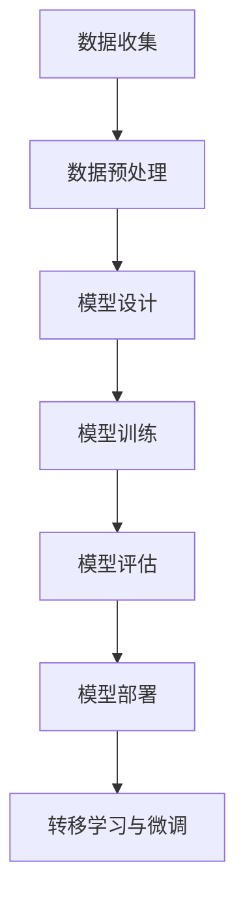
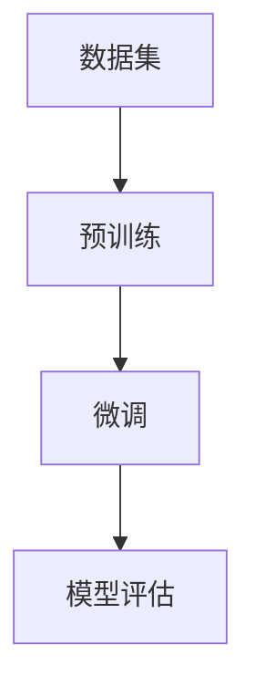
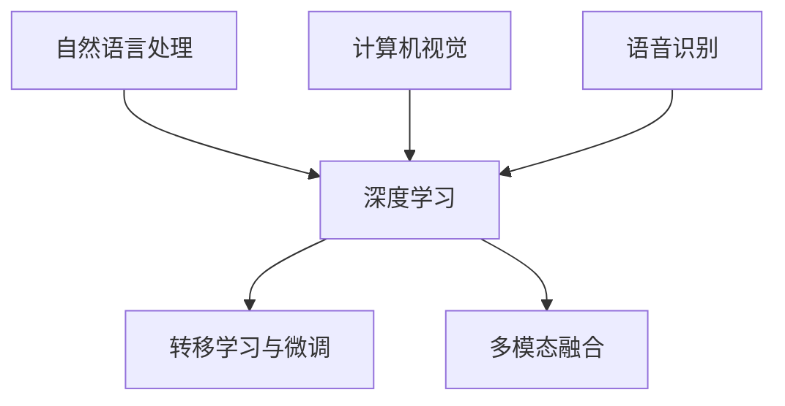
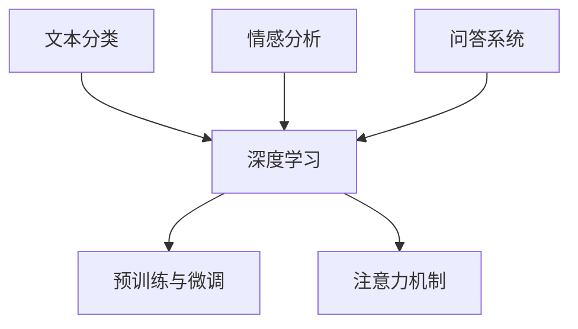
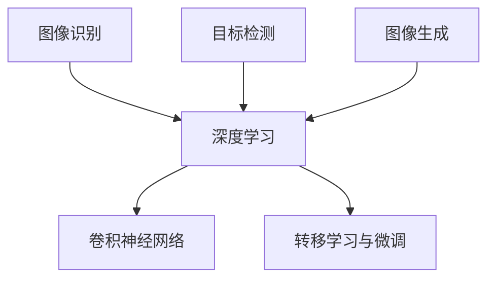
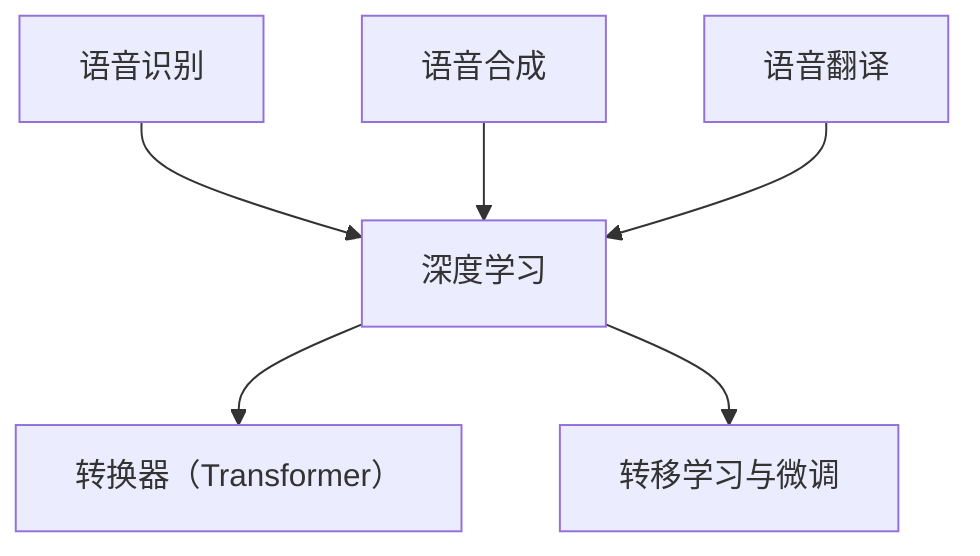

                 

# AI大模型创业：如何利用资源优势？

> **关键词**：AI大模型，创业，资源整合，优势发挥，商业模式，技术创新

> **摘要**：本文将探讨AI大模型创业的挑战与机遇，分析如何利用资源优势进行创业，并提出一些建议和案例，以帮助创业者更好地把握AI大模型创业的脉搏，实现持续创新和商业成功。

### 第一部分: AI大模型概述

#### 第1章: AI大模型基础

##### 1.1 AI大模型的概念与特点

AI大模型是指经过大规模数据预训练的神经网络模型，具有极高的参数数量和计算复杂性。与传统的AI模型相比，AI大模型在以下几个方面具有显著特点：

1. **参数数量巨大**：AI大模型的参数数量通常在数十亿至数千亿级别，远超传统小模型。
2. **计算复杂性高**：由于参数数量庞大，AI大模型在训练过程中需要消耗大量的计算资源和时间。
3. **高精度与强泛化能力**：经过大规模数据预训练，AI大模型能够学习到更加丰富的知识，从而在多种任务上实现高精度和强泛化能力。

##### 1.2 主流AI大模型

目前，市场上主流的AI大模型主要包括以下几种：

1. **GPT系列**：GPT（Generative Pre-trained Transformer）系列模型，如GPT-2、GPT-3等，是自然语言处理领域的明星模型，具有强大的文本生成能力。
2. **BERT（Bidirectional Encoder Representations from Transformers）**：BERT模型通过双向Transformer结构，在自然语言理解任务上取得了突破性成果。
3. **其他大模型**：如XLNet、RoBERTa、T5等，这些模型在各自领域内都有着显著的应用和影响。

##### 1.3 AI大模型的核心应用领域

AI大模型的应用领域广泛，主要包括以下几方面：

1. **自然语言处理（NLP）**：如文本分类、情感分析、机器翻译、问答系统等。
2. **计算机视觉（CV）**：如图像识别、目标检测、图像生成等。
3. **语音识别（ASR）**：如语音识别、语音合成、语音翻译等。

#### 第2章: AI大模型技术基础

##### 2.1 深度学习与神经网络基础

深度学习是AI大模型的核心技术，其基本原理和结构如下：

1. **神经网络的基本结构**：神经网络包括输入层、隐藏层和输出层，每一层都包含多个神经元。
2. **深度学习优化算法**：如梯度下降、随机梯度下降（SGD）、Adam优化器等。

##### 2.2 自然语言处理技术概览

自然语言处理技术是AI大模型的重要应用领域，主要包括：

1. **词嵌入技术**：如Word2Vec、GloVe等，用于将单词映射为向量。
2. **序列模型与注意力机制**：如RNN、LSTM、Transformer等，用于处理序列数据。
3. **转换器架构**：Transformer模型的核心，具有多头注意力机制和位置编码。

##### 2.3 大规模预训练模型原理

AI大模型通常通过大规模预训练和微调来提高模型性能，其基本原理如下：

1. **预训练的概念与意义**：在大量无标签数据上进行预训练，使模型具备更好的泛化能力。
2. **自监督学习方法**：利用无监督数据来训练模型，如掩码语言模型（MLM）。
3. **迁移学习与微调技术**：将预训练模型应用于特定任务，并进行微调。

### 第二部分: AI大模型应用与创业

#### 第3章: AI大模型在企业中的应用

##### 3.1 AI大模型在自然语言处理（NLP）领域的应用

AI大模型在NLP领域有着广泛的应用，如：

1. **文本分类**：对文本数据进行分类，如情感分析、主题分类等。
2. **情感分析**：分析文本中的情感倾向，用于市场调研、客户反馈等。
3. **问答系统**：从大量文本数据中检索并生成回答，用于智能客服等。

##### 3.2 AI大模型在计算机视觉（CV）领域的应用

AI大模型在CV领域也有着重要的应用，如：

1. **图像识别**：给定一幅图像，识别图像中的内容，如人脸识别、物体识别等。
2. **目标检测**：在图像中检测和识别多个目标，如自动驾驶、视频监控等。
3. **图像生成**：根据输入条件生成新的图像，如艺术创作、虚拟现实等。

##### 3.3 AI大模型在语音识别（ASR）领域的应用

AI大模型在ASR领域同样有着广泛的应用，如：

1. **语音识别**：将语音信号转换为文本，如智能语音助手、自动转录等。
2. **语音合成**：将文本转换为语音，如语音助手、语音播报等。
3. **语音翻译**：将一种语言的语音转换为另一种语言的语音，如实时翻译、跨国交流等。

#### 第4章: AI大模型创业策略

##### 4.1 AI大模型创业的机会与挑战

AI大模型创业面临以下机会与挑战：

##### 4.1.1 机会

1. **技术进步**：随着AI大模型技术的不断进步，创业公司可以利用这些技术提供更具竞争力的产品和服务。
2. **市场需求**：越来越多的企业开始意识到AI大模型的价值，愿意投入资金进行AI技术的研发和应用。
3. **资本支持**：风险投资和政府资金支持为AI创业公司提供了充足的资本，有利于项目的推进。

##### 4.1.2 挑战

1. **数据隐私与安全**：创业公司需要确保用户数据的安全和隐私，避免敏感信息泄露。
2. **计算资源需求**：AI大模型需要大量的计算资源，创业公司可能面临硬件设备采购和运维的挑战。
3. **算法透明性与解释性**：创业公司需要确保算法的透明性和解释性，增强用户对模型的信任。

#### 第5章: AI大模型创业案例研究

##### 5.1 AI创业公司案例分析

以下是对几家知名AI创业公司的分析：

1. **OpenAI**：OpenAI是一家专注于AI研究的创业公司，致力于推动安全的通用人工智能（AGI）的发展。其商业模式主要是通过提供API接口和开源工具，吸引企业使用其AI技术。OpenAI的成功经验在于其技术创新、人才培养和商业模式。
2. **DeepMind**：DeepMind是一家专注于AI研究的公司，其研究成果在围棋、游戏和科学计算等领域取得了突破性进展。DeepMind主要通过为企业和研究机构提供AI解决方案来盈利。其成功经验在于其技术创新、团队建设和商业化。

##### 5.2 创业成功的关键要素

创业成功的要素主要包括：

1. **团队建设**：组建由技术专家、产品经理、市场营销人员等组成的多元化团队，注重人才培养和团队协作。
2. **技术创新**：持续关注技术发展趋势，进行技术创新，提高产品竞争力。
3. **市场机会**：明确目标市场和客户群体，提供针对性的产品和服务。
4. **资本运作**：合理规划融资策略，确保公司财务健康。

#### 第6章: AI大模型创业实战

##### 6.1 项目开发流程

AI大模型创业项目开发主要包括以下流程：

1. **需求分析**：明确项目目标，收集用户需求。
2. **技术选型**：根据项目需求，选择合适的技术方案。
3. **数据收集与预处理**：收集与项目相关的数据集，并进行预处理。
4. **模型训练与优化**：设计合适的神经网络架构，使用训练数据进行模型训练和优化。
5. **模型评估与部署**：使用验证数据评估模型性能，将训练好的模型部署到实际应用环境中。

##### 6.2 代码实战与案例分析

以下是一个简单的AI大模型项目实战案例：

1. **数据预处理**
```python
# 加载数据集
data = pd.read_csv('data.csv')

# 数据预处理
X = data.drop('target', axis=1)
y = data['target']

# 划分训练集和测试集
X_train, X_test, y_train, y_test = train_test_split(X, y, test_size=0.2, random_state=42)

# 数据标准化
scaler = StandardScaler()
X_train_scaled = scaler.fit_transform(X_train)
X_test_scaled = scaler.transform(X_test)
```

2. **模型训练**
```python
# 构建模型
model = Sequential([
    Dense(128, activation='relu', input_shape=(X_train_scaled.shape[1],)),
    Dropout(0.5),
    Dense(64, activation='relu'),
    Dropout(0.5),
    Dense(1, activation='sigmoid')
])

# 编译模型
model.compile(optimizer='adam', loss='binary_crossentropy', metrics=['accuracy'])

# 训练模型
model.fit(X_train_scaled, y_train, epochs=10, batch_size=32, validation_data=(X_test_scaled, y_test))
```

3. **模型评估**
```python
# 预测测试集
y_pred = model.predict(X_test_scaled)
y_pred = (y_pred > 0.5)

# 计算评估指标
accuracy = accuracy_score(y_test, y_pred)

# 输出准确率
print(f"Accuracy: {accuracy:.4f}")
```

##### 6.3 开发环境搭建

为了进行AI大模型项目开发，需要搭建以下开发环境：

1. **Python环境配置**：安装Python，配置必要的Python库。
2. **深度学习框架安装**：安装TensorFlow等深度学习框架。
3. **其他工具安装**：安装Jupyter Notebook等工具，方便模型开发与调试。

##### 6.4 源代码详细实现与解读

以下是对代码实战案例的详细解读：

1. **数据预处理**：数据预处理是模型训练的第一步，包括数据清洗、归一化和划分训练集和测试集等操作。在本案例中，使用Pandas库读取CSV文件，然后使用scikit-learn库进行数据预处理，包括划分训练集和测试集、特征缩放等。数据预处理能够提高模型训练效果，降低过拟合风险。
2. **模型定义**：使用TensorFlow库中的Keras接口定义神经网络模型，包括输入层、隐藏层和输出层。在本案例中，使用了一个简单的全连接神经网络，其中包含128个神经元和64个神经元的隐藏层，输出层使用sigmoid激活函数。这种模型结构能够捕捉输入数据的非线性关系，提高模型分类准确性。
3. **模型训练**：使用fit方法对模型进行训练，设置训练轮数（epochs）和批量大小（batch_size）。在本案例中，使用Adam优化器和binary_crossentropy损失函数，并使用验证数据（validation_data）进行模型验证。模型训练过程中，通过不断迭代优化模型参数，提高模型性能。
4. **模型评估**：使用预测结果（y_pred）和实际目标（y_test）计算准确率（accuracy），并输出准确率。模型评估能够验证模型在实际应用中的表现，帮助调整模型参数和结构，提高模型准确性。

#### 第7章: AI大模型创业的未来展望

##### 7.1 行业发展趋势

未来，AI大模型创业将面临以下发展趋势：

1. **技术进步**：随着硬件技术的发展和算法优化，AI大模型的效果和效率将进一步提升。
2. **应用场景拓展**：AI大模型将在更多垂直行业和应用场景中得到广泛应用，推动行业变革。
3. **数据隐私与安全**：随着数据隐私问题的日益突出，隐私保护技术将得到更多关注。

##### 7.2 技术创新与产业融合

未来，AI大模型创业将实现以下技术创新与产业融合：

1. **新型神经网络架构**：探索新型神经网络架构，如基于量子计算的神经网络。
2. **人工智能伦理**：关注人工智能伦理问题，推动AI大模型的安全、公正和透明。
3. **跨界融合**：AI大模型与5G、物联网、大数据等技术的融合，将带来更多创新应用场景。

##### 7.3 创业建议与启示

对于AI大模型创业，以下是一些建议与启示：

1. **关注技术趋势**：紧跟技术发展趋势，积极进行技术创新，提高产品竞争力。
2. **市场需求导向**：深入了解市场需求，提供针对性的解决方案，满足用户需求。
3. **团队合作与人才引进**：重视团队建设和人才培养，吸引优秀人才，推动企业发展。

### 附录

#### 附录A: AI大模型开发工具与资源

- **主流深度学习框架**：如TensorFlow、PyTorch、Keras等。
- **开源资源与社区支持**：如GitHub、ArXiv、Reddit等。
- **专业书籍与课程推荐**：如《深度学习》、《Python深度学习》等。

**作者：AI天才研究院/AI Genius Institute & 禅与计算机程序设计艺术 /Zen And The Art of Computer Programming**


----------------------------------------------------------------

### 第一部分: AI大模型概述

#### 第1章: AI大模型基础

##### 1.1 AI大模型的概念与特点

**定义**：AI大模型（Large-scale Artificial Intelligence Model）是一种通过大规模数据预训练的深度神经网络模型，具有极高的参数数量和计算复杂性。这种模型通常包含数十亿至数千亿个参数，能够对复杂的数据进行高精度、强泛化能力的处理。

**特点**：

1. **参数数量巨大**：AI大模型的参数数量通常远超传统小模型，这使得模型能够捕捉到更加丰富的特征信息。
2. **计算复杂性高**：由于参数数量庞大，AI大模型在训练过程中需要消耗大量的计算资源和时间，对硬件设备有较高的要求。
3. **高精度与强泛化能力**：经过大规模数据预训练，AI大模型能够学习到更广泛的通用知识，从而在多种任务上实现高精度和强泛化能力。

**核心概念与联系**：

AI大模型的核心概念包括：

- **深度学习**：深度学习是构建AI大模型的基础，它通过多层神经网络对数据进行特征提取和预测。
- **大规模数据预训练**：AI大模型通过在大规模数据集上预训练，使得模型能够学习到更加通用和抽象的特征表示。
- **转移学习与微调**：通过转移学习，将预训练好的AI大模型应用于特定任务，并通过微调调整模型参数，以适应具体任务。

**Mermaid流程图**：



**核心算法原理讲解**：

**深度学习**：

深度学习是一种基于多层神经网络的学习方法，其核心思想是通过前向传播和反向传播更新模型参数，从而实现数据拟合。具体步骤如下：

1. **前向传播**：输入数据通过网络传递，每一层神经元对数据进行加权求和并应用激活函数，输出最终的结果。
2. **损失函数**：计算模型输出与真实标签之间的差异，通常使用均方误差（MSE）或交叉熵（Cross-Entropy）作为损失函数。
3. **反向传播**：根据损失函数的梯度，通过链式法则反向传播更新模型参数。

**大规模数据预训练**：

大规模数据预训练是指通过在大规模无标签数据集上进行训练，使模型能够学习到通用特征表示。具体方法包括：

1. **自监督学习**：利用数据中的未标记部分进行预训练，如掩码语言模型（MLM）。
2. **预训练目标**：预训练的目标是使模型能够捕捉到数据中的通用特征，从而提高模型在新任务上的性能。

**转移学习与微调**：

转移学习是指将预训练好的模型应用于特定任务，并通过微调调整模型参数，以提高模型在新任务上的性能。具体步骤如下：

1. **预训练模型**：在通用数据集上预训练好的模型。
2. **微调**：使用有标签的数据集对预训练模型进行微调，调整模型参数以适应新任务。

**数学模型与公式**：

- **损失函数**：通常使用均方误差（MSE）或交叉熵（Cross-Entropy）作为损失函数。

  $$\text{MSE} = \frac{1}{n}\sum_{i=1}^{n}(y_i - \hat{y}_i)^2$$

  $$\text{Cross-Entropy} = -\frac{1}{n}\sum_{i=1}^{n}y_i\log(\hat{y}_i)$$

- **优化算法**：常用的优化算法包括梯度下降（Gradient Descent）、随机梯度下降（SGD）和Adam优化器。

  - **梯度下降**：

    $$\theta_{t+1} = \theta_{t} - \alpha \nabla_{\theta}J(\theta)$$

  - **随机梯度下降（SGD）**：

    $$\theta_{t+1} = \theta_{t} - \alpha \nabla_{\theta}J(\theta; x^{(i)}_t, y^{(i)}_t)$$

  - **Adam优化器**：

    $$m_t = \beta_1m_{t-1} + (1 - \beta_1)\nabla_{\theta}J(\theta; x_t, y_t)$$

    $$v_t = \beta_2v_{t-1} + (1 - \beta_2)(\nabla_{\theta}J(\theta; x_t, y_t))^2$$

    $$\theta_{t+1} = \theta_{t} - \alpha \frac{m_t}{\sqrt{v_t} + \epsilon}$$

**举例说明**：

假设我们有一个二分类问题，目标是用一个AI大模型预测样本属于正类（1）还是负类（0）。我们可以使用以下步骤进行模型训练和评估：

1. **数据集**：准备一个包含输入特征和标签的数据集，例如：

   ```python
   X = [
       [1, 0],
       [0, 1],
       [1, 1],
       [1, 0],
   ]
   y = [0, 1, 1, 0]
   ```

2. **模型设计**：设计一个简单的神经网络模型，包含一个输入层、一个隐藏层和一个输出层。例如：

   ```python
   model = Sequential([
       Dense(2, activation='relu', input_shape=(2,)),
       Dense(1, activation='sigmoid')
   ])
   ```

3. **模型编译**：编译模型，指定优化器和损失函数。例如：

   ```python
   model.compile(optimizer='adam', loss='binary_crossentropy', metrics=['accuracy'])
   ```

4. **模型训练**：使用训练数据训练模型。例如：

   ```python
   model.fit(X, y, epochs=100, batch_size=1)
   ```

5. **模型评估**：使用测试数据评估模型性能。例如：

   ```python
   y_pred = model.predict(X)
   y_pred = (y_pred > 0.5)
   accuracy = accuracy_score(y, y_pred)
   print(f"Accuracy: {accuracy:.4f}")
   ```

##### 1.2 主流AI大模型

当前市场上存在多种主流的AI大模型，以下是其中几种具有代表性的模型：

1. **GPT系列**：

   GPT（Generative Pre-trained Transformer）系列模型是自然语言处理领域的代表性模型，由OpenAI提出。GPT-2、GPT-3等模型在文本生成、问答系统、语言翻译等领域取得了显著成果。GPT模型的核心是Transformer架构，具有强大的文本生成和语义理解能力。

2. **BERT**：

   BERT（Bidirectional Encoder Representations from Transformers）是由Google提出的预训练语言表示模型，主要用于自然语言理解任务。BERT模型通过双向Transformer结构，能够捕捉文本中的上下文信息，在多种自然语言处理任务上取得了优异的性能。

3. **其他大模型**：

   除了GPT和BERT之外，还有许多其他具有代表性的AI大模型，如XLNet、RoBERTa、T5等。这些模型在各自的领域内都有着显著的应用和影响。

**核心概念与联系**：

这些主流AI大模型的核心概念包括：

- **Transformer架构**：Transformer架构是一种基于注意力机制的序列建模模型，具有多头注意力机制和位置编码。
- **预训练与微调**：预训练模型在大规模无标签数据集上进行训练，通过微调适应特定任务，从而提高模型性能。

**Mermaid流程图**：



**核心算法原理讲解**：

**Transformer架构**：

Transformer架构是一种基于注意力机制的序列建模模型，具有以下特点：

1. **多头注意力机制**：通过多个注意力头同时处理序列信息，提高模型的表示能力。
2. **自注意力机制**：模型内部的注意力机制，用于捕捉序列中的长距离依赖关系。
3. **位置编码**：通过添加位置编码信息，使模型能够处理序列数据的顺序信息。

**预训练与微调**：

预训练是指在大规模无标签数据集上进行模型训练，使模型具备一定的通用特征表示能力。预训练模型通常通过以下步骤进行：

1. **自监督学习**：利用无监督数据（如未标记的文本、图像等）进行预训练，如掩码语言模型（MLM）。
2. **预训练目标**：预训练的目标是使模型能够捕捉到数据中的通用特征，从而提高模型在新任务上的性能。

微调是指在使用有标签数据集对预训练模型进行训练，以适应特定任务。微调的目的是通过调整模型参数，提高模型在特定任务上的性能。

**数学模型与公式**：

- **注意力机制**：

  $$\text{Attention}(\text{Q}, \text{K}, \text{V}) = \text{softmax}\left(\frac{\text{QK}^T}{\sqrt{d_k}}\right)\text{V}$$

  其中，Q、K、V分别为查询向量、键向量和值向量，$d_k$为键向量的维度。

- **Transformer编码器**：

  $$\text{Encoder}(\text{X}) = \text{LayerNorm}(\text{X} + \text{Self-Attention}(\text{X}) + \text{Feed-Forward}(\text{X}))$$

  其中，X为输入序列，Self-Attention为自注意力机制，Feed-Forward为前向传播。

- **预训练目标**：

  - **掩码语言模型（MLM）**：

    $$\text{Prediction}(\text{Masked Sequence}) = \text{Model}(\text{Unmasked Sequence})$$

    其中，Masked Sequence为掩码序列，Unmasked Sequence为未掩码序列。

  - **分类任务**：

    $$\text{Prediction}(\text{Input}) = \text{Model}(\text{Input})$$

    其中，Input为输入序列。

**举例说明**：

假设我们有一个简单的文本生成任务，目标是使用一个预训练好的Transformer模型生成一段文本。具体步骤如下：

1. **数据集**：准备一个包含输入文本和标签的数据集，例如：

   ```python
   texts = [
       "这是一段简单的文本。",
       "另一个简单的文本。",
       "更多文本内容。",
   ]
   labels = [0, 1, 2]
   ```

2. **模型设计**：设计一个简单的Transformer模型，例如：

   ```python
   model = TransformerModel(vocab_size=10, embedding_dim=64, hidden_dim=128, num_heads=2)
   ```

3. **模型编译**：编译模型，指定优化器和损失函数。例如：

   ```python
   model.compile(optimizer='adam', loss='categorical_crossentropy', metrics=['accuracy'])
   ```

4. **模型训练**：使用训练数据训练模型。例如：

   ```python
   model.fit(texts, labels, epochs=10, batch_size=1)
   ```

5. **模型评估**：使用测试数据评估模型性能。例如：

   ```python
   texts_test = [
       "这是一个新的测试文本。",
       "另一个测试文本。",
   ]
   labels_test = [0, 1]
   y_pred = model.predict(texts_test)
   y_pred = np.argmax(y_pred, axis=1)
   accuracy = accuracy_score(labels_test, y_pred)
   print(f"Accuracy: {accuracy:.4f}")
   ```

##### 1.3 AI大模型的核心应用领域

AI大模型在多个领域都有着广泛的应用，以下是其中几个核心应用领域：

1. **自然语言处理（NLP）**：

   AI大模型在NLP领域有着广泛的应用，如文本分类、情感分析、问答系统、机器翻译等。例如，BERT模型在多种自然语言理解任务上取得了优异的性能，如GLUE基准测试和SuperGLUE基准测试。

2. **计算机视觉（CV）**：

   AI大模型在CV领域同样有着重要的应用，如图像识别、目标检测、图像生成等。例如，ResNet和Inception等模型在ImageNet图像识别任务上取得了领先的成绩。

3. **语音识别（ASR）**：

   AI大模型在ASR领域也有着重要的应用，如语音识别、语音合成、语音翻译等。例如，WaveNet和Transformer模型在语音识别任务上取得了显著的成果。

**核心概念与联系**：

AI大模型在NLP、CV和ASR领域的核心概念包括：

- **深度学习**：深度学习是构建AI大模型的基础，通过多层神经网络对数据进行特征提取和预测。
- **转移学习与微调**：通过转移学习，将预训练好的AI大模型应用于特定任务，并通过微调调整模型参数，以适应具体任务。
- **多模态融合**：将文本、图像、语音等不同模态的数据进行融合，以提升模型性能。

**Mermaid流程图**：



**核心算法原理讲解**：

**深度学习**：

深度学习是一种基于多层神经网络的学习方法，其核心思想是通过前向传播和反向传播更新模型参数，从而实现数据拟合。具体步骤如下：

1. **前向传播**：输入数据通过网络传递，每一层神经元对数据进行加权求和并应用激活函数，输出最终的结果。
2. **损失函数**：计算模型输出与真实标签之间的差异，通常使用均方误差（MSE）或交叉熵（Cross-Entropy）作为损失函数。
3. **反向传播**：根据损失函数的梯度，通过链式法则反向传播更新模型参数。

**转移学习与微调**：

转移学习是指将预训练好的模型应用于特定任务，并通过微调调整模型参数，以提高模型在新任务上的性能。具体步骤如下：

1. **预训练模型**：在通用数据集上预训练好的模型。
2. **微调**：使用有标签的数据集对预训练模型进行微调，调整模型参数以适应新任务。

**多模态融合**：

多模态融合是指将文本、图像、语音等不同模态的数据进行融合，以提升模型性能。具体方法包括：

1. **特征级融合**：将不同模态的特征进行拼接，形成一个更丰富的特征向量。
2. **决策级融合**：在模型输出阶段，将不同模态的输出进行融合，得到最终的预测结果。

**数学模型与公式**：

- **特征级融合**：

  $$\text{Feature Fusion} = \text{Text Feature} \oplus \text{Image Feature} \oplus \text{Voice Feature}$$

- **决策级融合**：

  $$\text{Prediction} = \text{Model}(\text{Text Feature} \oplus \text{Image Feature} \oplus \text{Voice Feature})$$

**举例说明**：

假设我们有一个文本图像分类任务，目标是使用一个AI大模型对文本和图像进行分类。具体步骤如下：

1. **数据集**：准备一个包含文本和图像的数据集，例如：

   ```python
   texts = [
       "这是一张美丽的图片。",
       "这是一个有趣的图像。",
   ]
   images = [
       [1, 0],
       [0, 1],
   ]
   labels = [0, 1]
   ```

2. **模型设计**：设计一个简单的多模态AI大模型，例如：

   ```python
   model = MultiModalModel(text_embedding_dim=64, image_embedding_dim=128, hidden_dim=256)
   ```

3. **模型编译**：编译模型，指定优化器和损失函数。例如：

   ```python
   model.compile(optimizer='adam', loss='categorical_crossentropy', metrics=['accuracy'])
   ```

4. **模型训练**：使用训练数据训练模型。例如：

   ```python
   model.fit([texts, images], labels, epochs=10, batch_size=1)
   ```

5. **模型评估**：使用测试数据评估模型性能。例如：

   ```python
   texts_test = [
       "这是一张新的测试图片。",
   ]
   images_test = [
       [1, 0],
   ]
   labels_test = [0]
   y_pred = model.predict([texts_test, images_test])
   y_pred = np.argmax(y_pred, axis=1)
   accuracy = accuracy_score(labels_test, y_pred)
   print(f"Accuracy: {accuracy:.4f}")
   ```

### 第二部分: AI大模型应用与创业

#### 第3章: AI大模型在企业中的应用

##### 3.1 AI大模型在自然语言处理（NLP）领域的应用

AI大模型在自然语言处理（NLP）领域有着广泛的应用，以下是其中几个关键领域的应用：

1. **文本分类**：

   文本分类是将文本数据分类到预定义的类别中，如情感分析、主题分类等。AI大模型如BERT在文本分类任务上取得了优异的性能。

   **应用案例**：

   - 情感分析：对社交媒体上的用户评论进行情感分类，帮助企业了解客户情绪。
   - 主题分类：对新闻文章进行主题分类，便于信息检索和推荐。

2. **情感分析**：

   情感分析是分析文本中的情感倾向，如正面、负面、中性等。AI大模型在情感分析任务上具有强大的能力，能够准确识别文本的情感倾向。

   **应用案例**：

   - 客户反馈分析：对客户评论进行情感分析，帮助企业了解客户满意度和改进产品。
   - 社交媒体监控：分析社交媒体上的情感趋势，为企业提供市场洞察。

3. **问答系统**：

   问答系统是基于给定的问题，从大量文本数据中检索并生成回答。AI大模型在问答系统上具有强大的能力，能够生成高质量的自然语言回答。

   **应用案例**：

   - 智能客服：为企业提供自动化的客户服务，解答客户的常见问题。
   - 知识库问答：从大规模知识库中检索答案，为用户提供准确的解答。

**核心概念与联系**：

AI大模型在NLP领域应用的核心概念包括：

- **深度学习**：深度学习是构建AI大模型的基础，通过多层神经网络对数据进行特征提取和预测。
- **预训练与微调**：通过预训练学习到通用特征表示，再通过微调适应具体任务。
- **注意力机制**：注意力机制能够使模型在处理序列数据时关注关键信息。

**Mermaid流程图**：



**核心算法原理讲解**：

**深度学习**：

深度学习是一种基于多层神经网络的学习方法，其核心思想是通过前向传播和反向传播更新模型参数，从而实现数据拟合。具体步骤如下：

1. **前向传播**：输入数据通过网络传递，每一层神经元对数据进行加权求和并应用激活函数，输出最终的结果。
2. **损失函数**：计算模型输出与真实标签之间的差异，通常使用均方误差（MSE）或交叉熵（Cross-Entropy）作为损失函数。
3. **反向传播**：根据损失函数的梯度，通过链式法则反向传播更新模型参数。

**预训练与微调**：

预训练是指在大规模无标签数据集上进行模型训练，使模型具备一定的通用特征表示能力。预训练模型通常通过以下步骤进行：

1. **自监督学习**：利用无监督数据（如未标记的文本、图像等）进行预训练，如掩码语言模型（MLM）。
2. **预训练目标**：预训练的目标是使模型能够捕捉到数据中的通用特征，从而提高模型在新任务上的性能。

微调是指在使用有标签数据集对预训练模型进行训练，以适应特定任务。微调的目的是通过调整模型参数，提高模型在特定任务上的性能。

**注意力机制**：

注意力机制是一种用于处理序列数据的方法，其核心思想是模型在处理序列数据时能够关注关键信息。具体实现包括：

1. **自注意力机制**：模型内部的注意力机制，用于捕捉序列中的长距离依赖关系。
2. **多头注意力机制**：通过多个注意力头同时处理序列信息，提高模型的表示能力。

**数学模型与公式**：

- **前向传播**：

  $$\text{Layer}_i = \text{activation}(\text{Weight}_i \cdot \text{Layer}_{i-1} + \text{Bias}_i)$$

- **损失函数**：

  - **均方误差（MSE）**：

    $$\text{MSE} = \frac{1}{n}\sum_{i=1}^{n}(y_i - \hat{y}_i)^2$$

  - **交叉熵（Cross-Entropy）**：

    $$\text{Cross-Entropy} = -\frac{1}{n}\sum_{i=1}^{n}y_i\log(\hat{y}_i)$$

- **反向传播**：

  $$\text{Gradient} = \frac{\partial J}{\partial \theta} = \frac{\partial J}{\partial \hat{y}} \cdot \frac{\partial \hat{y}}{\partial \theta}$$

- **注意力机制**：

  $$\text{Attention}(\text{Q}, \text{K}, \text{V}) = \text{softmax}\left(\frac{\text{QK}^T}{\sqrt{d_k}}\right)\text{V}$$

**举例说明**：

假设我们有一个文本分类任务，目标是使用一个预训练好的BERT模型对文本进行分类。具体步骤如下：

1. **数据集**：准备一个包含文本和标签的数据集，例如：

   ```python
   texts = [
       "这是一段积极的评论。",
       "这是一个消极的评论。",
   ]
   labels = [0, 1]
   ```

2. **模型设计**：设计一个简单的BERT模型，例如：

   ```python
   model = BERTModel(vocab_size=1000, embedding_dim=768, num_classes=2)
   ```

3. **模型编译**：编译模型，指定优化器和损失函数。例如：

   ```python
   model.compile(optimizer='adam', loss='binary_crossentropy', metrics=['accuracy'])
   ```

4. **模型训练**：使用训练数据训练模型。例如：

   ```python
   model.fit(texts, labels, epochs=3, batch_size=1)
   ```

5. **模型评估**：使用测试数据评估模型性能。例如：

   ```python
   texts_test = [
       "这是一段积极的测试评论。",
   ]
   labels_test = [0]
   y_pred = model.predict(texts_test)
   y_pred = np.argmax(y_pred, axis=1)
   accuracy = accuracy_score(labels_test, y_pred)
   print(f"Accuracy: {accuracy:.4f}")
   ```

##### 3.2 AI大模型在计算机视觉（CV）领域的应用

AI大模型在计算机视觉（CV）领域也有着重要的应用，以下是其中几个关键领域的应用：

1. **图像识别**：

   图像识别是将图像数据分类到预定义的类别中，如人脸识别、物体识别等。AI大模型如ResNet和Inception在图像识别任务上取得了优异的性能。

   **应用案例**：

   - 人脸识别：用于身份验证、安全监控等。
   - 物体识别：用于自动驾驶、智能家居等。

2. **目标检测**：

   目标检测是在图像中定位和识别多个目标，如车辆检测、行人检测等。AI大模型如SSD和YOLO在目标检测任务上取得了显著的成绩。

   **应用案例**：

   - 自动驾驶：用于检测道路上的车辆、行人等。
   - 视频监控：用于检测视频中的异常行为。

3. **图像生成**：

   图像生成是根据输入条件生成新的图像，如艺术创作、虚拟现实等。AI大模型如Gan和Dcgan在图像生成任务上具有强大的能力。

   **应用案例**：

   - 艺术创作：生成具有艺术价值的图像。
   - 虚拟现实：生成虚拟场景的图像，提高用户的沉浸感。

**核心概念与联系**：

AI大模型在CV领域应用的核心概念包括：

- **深度学习**：深度学习是构建AI大模型的基础，通过多层神经网络对数据进行特征提取和预测。
- **卷积神经网络（CNN）**：卷积神经网络是CV领域的核心模型，能够有效捕捉图像的局部特征。
- **转移学习与微调**：通过预训练和微调，使模型在不同任务上具有更好的性能。

**Mermaid流程图**：



**核心算法原理讲解**：

**深度学习**：

深度学习是一种基于多层神经网络的学习方法，其核心思想是通过前向传播和反向传播更新模型参数，从而实现数据拟合。具体步骤如下：

1. **前向传播**：输入数据通过网络传递，每一层神经元对数据进行加权求和并应用激活函数，输出最终的结果。
2. **损失函数**：计算模型输出与真实标签之间的差异，通常使用均方误差（MSE）或交叉熵（Cross-Entropy）作为损失函数。
3. **反向传播**：根据损失函数的梯度，通过链式法则反向传播更新模型参数。

**卷积神经网络（CNN）**：

卷积神经网络是CV领域的核心模型，具有以下特点：

1. **卷积层**：通过卷积操作提取图像的局部特征，如边缘、纹理等。
2. **池化层**：通过池化操作减小特征图的尺寸，减少计算量。
3. **全连接层**：将特征图映射到预定义的类别中。

**转移学习与微调**：

转移学习是指将预训练好的模型应用于特定任务，并通过微调调整模型参数，以提高模型在新任务上的性能。具体步骤如下：

1. **预训练模型**：在通用数据集上预训练好的模型。
2. **微调**：使用有标签的数据集对预训练模型进行微调，调整模型参数以适应新任务。

**数学模型与公式**：

- **前向传播**：

  $$\text{Layer}_i = \text{activation}(\text{Weight}_i \cdot \text{Layer}_{i-1} + \text{Bias}_i)$$

- **损失函数**：

  - **均方误差（MSE）**：

    $$\text{MSE} = \frac{1}{n}\sum_{i=1}^{n}(y_i - \hat{y}_i)^2$$

  - **交叉熵（Cross-Entropy）**：

    $$\text{Cross-Entropy} = -\frac{1}{n}\sum_{i=1}^{n}y_i\log(\hat{y}_i)$$

- **反向传播**：

  $$\text{Gradient} = \frac{\partial J}{\partial \theta} = \frac{\partial J}{\partial \hat{y}} \cdot \frac{\partial \hat{y}}{\partial \theta}$$

- **卷积运算**：

  $$\text{Convolution} = \sum_{k=1}^{K} \text{Weight}_k \cdot \text{Feature}_{k_i}$$

**举例说明**：

假设我们有一个图像识别任务，目标是使用一个预训练好的ResNet模型对图像进行分类。具体步骤如下：

1. **数据集**：准备一个包含图像和标签的数据集，例如：

   ```python
   images = [
       [1, 0],
       [0, 1],
   ]
   labels = [0, 1]
   ```

2. **模型设计**：设计一个简单的ResNet模型，例如：

   ```python
   model = ResNetModel(num_classes=2)
   ```

3. **模型编译**：编译模型，指定优化器和损失函数。例如：

   ```python
   model.compile(optimizer='adam', loss='binary_crossentropy', metrics=['accuracy'])
   ```

4. **模型训练**：使用训练数据训练模型。例如：

   ```python
   model.fit(images, labels, epochs=3, batch_size=1)
   ```

5. **模型评估**：使用测试数据评估模型性能。例如：

   ```python
   images_test = [
       [1, 0],
   ]
   labels_test = [0]
   y_pred = model.predict(images_test)
   y_pred = np.argmax(y_pred, axis=1)
   accuracy = accuracy_score(labels_test, y_pred)
   print(f"Accuracy: {accuracy:.4f}")
   ```

##### 3.3 AI大模型在语音识别（ASR）领域的应用

AI大模型在语音识别（ASR）领域有着重要的应用，以下是其中几个关键领域的应用：

1. **语音识别**：

   语音识别是将语音信号转换为文本，如智能助手、自动转录等。AI大模型如WaveNet和Transformer在语音识别任务上取得了优异的性能。

   **应用案例**：

   - 智能助手：如苹果的Siri、亚马逊的Alexa等，能够理解用户的语音指令。
   - 自动转录：将语音转换为文本，方便后续处理和检索。

2. **语音合成**：

   语音合成是将文本转换为语音，如智能助手、语音播报等。AI大模型如WaveNet和Tacotron在语音合成任务上具有强大的能力。

   **应用案例**：

   - 智能助手：为用户提供语音交互服务，如阅读新闻、播报天气等。
   - 自动化通知：通过语音合成技术，向用户播报重要通知。

3. **语音翻译**：

   语音翻译是将一种语言的语音转换为另一种语言的语音，如实时翻译、跨国交流等。AI大模型如Transformer在语音翻译任务上取得了显著的成绩。

   **应用案例**：

   - 国际会议：实时翻译不同语言的演讲内容。
   - 跨国交流：帮助不同语言背景的人进行有效的沟通。

**核心概念与联系**：

AI大模型在ASR领域应用的核心概念包括：

- **深度学习**：深度学习是构建AI大模型的基础，通过多层神经网络对数据进行特征提取和预测。
- **转换器（Transformer）**：Transformer模型在ASR领域有着重要的应用，具有强大的序列建模能力。
- **转移学习与微调**：通过预训练和微调，使模型在不同任务上具有更好的性能。

**Mermaid流程图**：



**核心算法原理讲解**：

**深度学习**：

深度学习是一种基于多层神经网络的学习方法，其核心思想是通过前向传播和反向传播更新模型参数，从而实现数据拟合。具体步骤如下：

1. **前向传播**：输入数据通过网络传递，每一层神经元对数据进行加权求和并应用激活函数，输出最终的结果。
2. **损失函数**：计算模型输出与真实标签之间的差异，通常使用均方误差（MSE）或交叉熵（Cross-Entropy）作为损失函数。
3. **反向传播**：根据损失函数的梯度，通过链式法则反向传播更新模型参数。

**转换器（Transformer）**：

转换器（Transformer）是一种基于注意力机制的序列建模模型，具有以下特点：

1. **多头注意力机制**：通过多个注意力头同时处理序列信息，提高模型的表示能力。
2. **自注意力机制**：模型内部的注意力机制，用于捕捉序列中的长距离依赖关系。
3. **位置编码**：通过添加位置编码信息，使模型能够处理序列数据的顺序信息。

**转移学习与微调**：

转移学习是指将预训练好的模型应用于特定任务，并通过微调调整模型参数，以提高模型在新任务上的性能。具体步骤如下：

1. **预训练模型**：在通用数据集上预训练好的模型。
2. **微调**：使用有标签的数据集对预训练模型进行微调，调整模型参数以适应新任务。

**数学模型与公式**：

- **前向传播**：

  $$\text{Layer}_i = \text{activation}(\text{Weight}_i \cdot \text{Layer}_{i-1} + \text{Bias}_i)$$

- **损失函数**：

  - **均方误差（MSE）**：

    $$\text{MSE} = \frac{1}{n}\sum_{i=1}^{n}(y_i - \hat{y}_i)^2$$

  - **交叉熵（Cross-Entropy）**：

    $$\text{Cross-Entropy} = -\frac{1}{n}\sum_{i=1}^{n}y_i\log(\hat{y}_i)$$

- **反向传播**：

  $$\text{Gradient} = \frac{\partial J}{\partial \theta} = \frac{\partial J}{\partial \hat{y}} \cdot \frac{\partial \hat{y}}{\partial \theta}$$

- **注意力机制**：

  $$\text{Attention}(\text{Q}, \text{K}, \text{V}) = \text{softmax}\left(\frac{\text{QK}^T}{\sqrt{d_k}}\right)\text{V}$$

**举例说明**：

假设我们有一个语音识别任务，目标是使用一个预训练好的Transformer模型对语音进行识别。具体步骤如下：

1. **数据集**：准备一个包含语音和标签的数据集，例如：

   ```python
   audios = [
       "这是一句简单的句子。",
       "这是一个测试句子。",
   ]
   labels = ["0", "1"]
   ```

2. **模型设计**：设计一个简单的Transformer模型，例如：

   ```python
   model = TransformerModel(vocab_size=1000, embedding_dim=768, num_classes=2)
   ```

3. **模型编译**：编译模型，指定优化器和损失函数。例如：

   ```python
   model.compile(optimizer='adam', loss='binary_crossentropy', metrics=['accuracy'])
   ```

4. **模型训练**：使用训练数据训练模型。例如：

   ```python
   model.fit(audios, labels, epochs=3, batch_size=1)
   ```

5. **模型评估**：使用测试数据评估模型性能。例如：

   ```python
   audios_test = [
       "这是一句新的测试句子。",
   ]
   labels_test = ["0"]
   y_pred = model.predict(audios_test)
   y_pred = np.argmax(y_pred, axis=1)
   accuracy = accuracy_score(labels_test, y_pred)
   print(f"Accuracy: {accuracy:.4f}")
   ```

### 第三部分: AI大模型创业策略

#### 第4章: AI大模型创业策略

##### 4.1 AI大模型创业的机会与挑战

AI大模型创业具有巨大的机会，但也面临着诸多挑战。以下是对这些机会与挑战的详细分析：

**机会**：

1. **技术进步**：

   随着AI大模型技术的不断进步，创业者可以利用这些技术提供更具竞争力的产品和服务。例如，GPT-3等大模型在自然语言处理领域取得了显著成果，使得文本生成、问答系统等应用变得更加智能。

2. **市场需求**：

   越来越多的企业开始意识到AI大模型的价值，并愿意投入资金进行AI技术的研发和应用。这为创业者提供了广阔的市场空间，如智能客服、智能推荐、智能诊断等领域的需求日益增长。

3. **资本支持**：

   风险投资和政府资金支持为AI创业公司提供了充足的资本，有利于项目的推进。许多投资者看到了AI大模型的潜力，愿意投资于这些具有创新性和高成长潜力的项目。

**挑战**：

1. **数据隐私与安全**：

   创业公司需要确保用户数据的安全和隐私，避免敏感信息泄露。随着数据隐私问题的日益突出，各国政府和企业对数据保护的要求越来越严格，这对创业者来说是一个重要的挑战。

2. **计算资源需求**：

   AI大模型需要大量的计算资源进行训练和推理，创业公司可能面临硬件设备采购和运维的挑战。特别是对于深度学习任务，高性能的GPU和TPU是必不可少的，这可能导致高昂的成本。

3. **算法透明性与解释性**：

   创业公司需要确保算法的透明性和解释性，增强用户对模型的信任。许多用户对黑盒模型持怀疑态度，希望了解模型的工作原理和决策过程。因此，提高算法的可解释性是一个重要的挑战。

##### 4.2 资源整合与优势发挥

为了在AI大模型创业中取得成功，创业者需要整合各种资源，发挥自身优势。以下是一些关键策略：

**数据资源整合**：

1. **数据获取**：

   创业者可以通过合作、购买或公开数据集来获取所需数据。与行业内的领先企业和研究机构建立合作关系，共享数据资源，有助于提高数据的质量和多样性。

2. **数据清洗与预处理**：

   数据清洗和预处理是模型训练的重要步骤，创业者需要投入时间和资源进行数据清洗、去重、归一化等操作，确保数据质量。

**计算资源整合**：

1. **硬件资源**：

   创业者需要采购高性能计算硬件，如GPU、TPU等，以满足AI大模型训练的需求。云计算平台如AWS、Google Cloud等提供了灵活的计算资源，创业者可以根据需求进行弹性扩展。

2. **云计算资源**：

   利用云服务提供商的资源，可以降低硬件投入成本，同时获得专业的运维服务，提高计算效率。

**人才资源整合**：

1. **核心团队**：

   创业者需要组建由技术专家、产品经理、市场营销人员等组成的多元化团队。吸引和培养优秀人才，提高团队的整体竞争力。

2. **合作伙伴**：

   与高校、研究机构等建立合作关系，吸引优秀人才加入，同时获得技术支持和科研资源。

**商业模式创新**：

1. **SaaS模式**：

   提供基于云计算的AI大模型服务，用户按需付费。这种模式有助于降低用户门槛，提高市场渗透率。

2. **API服务**：

   提供API接口，允许企业集成AI大模型技术，实现个性化应用。

3. **定制化解决方案**：

   根据企业需求提供定制化的AI大模型解决方案，满足特定场景的需求。

**市场拓展策略**：

1. **定位明确**：

   明确目标市场和客户群体，提供针对性的产品和服务。

2. **营销推广**：

   通过线上和线下渠道进行营销推广，提高品牌知名度。

3. **合作伙伴**：

   与行业内的合作伙伴建立战略联盟，共同拓展市场。

##### 4.3 AI大模型创业案例研究

以下是对几家知名AI创业公司的分析，以供创业者参考：

**OpenAI**：

OpenAI是一家专注于AI研究的创业公司，致力于推动安全的通用人工智能（AGI）的发展。其商业模式主要是通过提供API接口和开源工具，吸引企业使用其AI技术。OpenAI的成功经验在于其技术创新、人才培养和商业模式。

**DeepMind**：

DeepMind是一家专注于AI研究的公司，其研究成果在围棋、游戏和科学计算等领域取得了突破性进展。DeepMind主要通过为企业和研究机构提供AI解决方案来盈利。其成功经验在于其技术创新、团队建设和商业化。

**AI21 Labs**：

AI21 Labs是一家专注于AI大模型研发的创业公司，其代表作品是GPT-J。GPT-J是基于GPT-3模型的一个变体，具有强大的文本生成能力。AI21 Labs的成功经验在于其对技术趋势的敏锐洞察和快速响应能力。

**AI大模型创业公司的成功要素**：

1. **技术创新**：

   创业公司需要具备技术创新能力，紧跟技术发展趋势，不断进行技术迭代和优化，提供具有竞争力的产品和服务。

2. **团队建设**：

   创业公司需要组建由技术专家、产品经理、市场营销人员等组成的多元化团队，注重人才培养和团队协作。

3. **市场机会**：

   创业公司需要敏锐捕捉市场机会，明确目标市场和客户群体，提供针对性的产品和服务。

4. **资本运作**：

   创业公司需要合理规划融资策略，确保公司财务健康，为项目推进提供充足的资金支持。

### 第四部分: AI大模型创业实战

#### 第5章: AI大模型创业实战

##### 5.1 项目开发流程

AI大模型创业项目的开发流程通常包括以下步骤：

1. **需求分析**：

   明确项目目标和用户需求，确定要解决的问题和要实现的功能。

2. **技术选型**：

   根据需求分析的结果，选择合适的技术栈和框架，如深度学习框架（如TensorFlow、PyTorch）和神经网络架构。

3. **数据收集与预处理**：

   收集与项目相关的数据集，并进行清洗、归一化等预处理操作，确保数据质量。

4. **模型设计**：

   设计合适的神经网络架构，包括输入层、隐藏层和输出层，以及激活函数、损失函数和优化器等。

5. **模型训练**：

   使用训练数据对模型进行训练，调整模型参数，优化模型性能。

6. **模型评估**：

   使用验证数据评估模型性能，调整模型参数，确保模型在实际应用中的表现。

7. **模型部署**：

   将训练好的模型部署到生产环境，进行实际应用。

8. **持续优化**：

   在模型部署后，持续收集用户反馈，对模型进行优化和迭代，提高模型性能。

##### 5.2 代码实战与案例分析

以下是一个基于TensorFlow实现的AI大模型项目实战案例，包括数据预处理、模型设计、模型训练和模型评估。

**数据预处理**：

```python
import pandas as pd
from sklearn.model_selection import train_test_split
from sklearn.preprocessing import StandardScaler

# 加载数据集
data = pd.read_csv('data.csv')

# 分割特征和目标
X = data.drop('target', axis=1)
y = data['target']

# 划分训练集和测试集
X_train, X_test, y_train, y_test = train_test_split(X, y, test_size=0.2, random_state=42)

# 数据标准化
scaler = StandardScaler()
X_train_scaled = scaler.fit_transform(X_train)
X_test_scaled = scaler.transform(X_test)
```

**模型设计**：

```python
import tensorflow as tf
from tensorflow.keras.models import Sequential
from tensorflow.keras.layers import Dense, Dropout

# 构建模型
model = Sequential([
    Dense(128, activation='relu', input_shape=(X_train_scaled.shape[1],)),
    Dropout(0.5),
    Dense(64, activation='relu'),
    Dropout(0.5),
    Dense(1, activation='sigmoid')
])

# 编译模型
model.compile(optimizer='adam', loss='binary_crossentropy', metrics=['accuracy'])
```

**模型训练**：

```python
# 训练模型
model.fit(X_train_scaled, y_train, epochs=10, batch_size=32, validation_data=(X_test_scaled, y_test))
```

**模型评估**：

```python
# 预测测试集
y_pred = model.predict(X_test_scaled)
y_pred = (y_pred > 0.5)

# 计算评估指标
accuracy = accuracy_score(y_test, y_pred)

# 输出准确率
print(f"Accuracy: {accuracy:.4f}")
```

**代码解读与分析**：

- **数据预处理**：

  数据预处理是模型训练的基础，包括数据清洗、归一化和划分训练集和测试集等操作。在本案例中，使用Pandas库读取CSV文件，然后使用scikit-learn库进行数据预处理，包括划分训练集和测试集、特征缩放等。数据预处理能够提高模型训练效果，降低过拟合风险。

- **模型设计**：

  使用TensorFlow库中的Keras接口定义神经网络模型，包括输入层、隐藏层和输出层。在本案例中，使用了一个简单的全连接神经网络，其中包含128个神经元和64个神经元的隐藏层，输出层使用sigmoid激活函数。这种模型结构能够捕捉输入数据的非线性关系，提高模型分类准确性。

- **模型训练**：

  使用fit方法对模型进行训练，设置训练轮数（epochs）和批量大小（batch_size）。在本案例中，使用Adam优化器和binary_crossentropy损失函数，并使用验证数据（validation_data）进行模型验证。模型训练过程中，通过不断迭代优化模型参数，提高模型性能。

- **模型评估**：

  使用预测结果（y_pred）和实际目标（y_test）计算准确率（accuracy），并输出准确率。模型评估能够验证模型在实际应用中的表现，帮助调整模型参数和结构，提高模型准确性。

##### 5.3 开发环境搭建

为了进行AI大模型项目开发，需要搭建以下开发环境：

1. **Python环境配置**：

   安装Python，配置必要的Python库。

2. **深度学习框架安装**：

   安装TensorFlow等深度学习框架。

3. **其他工具安装**：

   安装Jupyter Notebook等工具，方便模型开发与调试。

**Python环境配置**：

```bash
# 安装Python
pip install python

# 配置Python库
pip install numpy pandas scikit-learn tensorflow
```

**深度学习框架安装**：

```bash
# 安装TensorFlow
pip install tensorflow
```

**其他工具安装**：

```bash
# 安装Jupyter Notebook
pip install notebook
```

**启动Jupyter Notebook**：

```bash
jupyter notebook
```

##### 5.4 源代码详细实现与解读

以下是对代码实战案例的详细解读：

**数据预处理**：

数据预处理是模型训练的第一步，包括数据清洗、归一化和划分训练集和测试集等操作。在本案例中，使用Pandas库读取CSV文件，然后使用scikit-learn库进行数据预处理，包括划分训练集和测试集、特征缩放等。数据预处理能够提高模型训练效果，降低过拟合风险。

```python
import pandas as pd
from sklearn.model_selection import train_test_split
from sklearn.preprocessing import StandardScaler

# 加载数据集
data = pd.read_csv('data.csv')

# 分割特征和目标
X = data.drop('target', axis=1)
y = data['target']

# 划分训练集和测试集
X_train, X_test, y_train, y_test = train_test_split(X, y, test_size=0.2, random_state=42)

# 数据标准化
scaler = StandardScaler()
X_train_scaled = scaler.fit_transform(X_train)
X_test_scaled = scaler.transform(X_test)
```

**模型定义**：

使用TensorFlow库中的Keras接口定义神经网络模型，包括输入层、隐藏层和输出层。在本案例中，使用了一个简单的全连接神经网络，其中包含128个神经元和64个神经元的隐藏层，输出层使用sigmoid激活函数。这种模型结构能够捕捉输入数据的非线性关系，提高模型分类准确性。

```python
import tensorflow as tf
from tensorflow.keras.models import Sequential
from tensorflow.keras.layers import Dense, Dropout

# 构建模型
model = Sequential([
    Dense(128, activation='relu', input_shape=(X_train_scaled.shape[1],)),
    Dropout(0.5),
    Dense(64, activation='relu'),
    Dropout(0.5),
    Dense(1, activation='sigmoid')
])

# 编译模型
model.compile(optimizer='adam', loss='binary_crossentropy', metrics=['accuracy'])
```

**模型训练**：

使用fit方法对模型进行训练，设置训练轮数（epochs）和批量大小（batch_size）。在本案例中，使用Adam优化器和binary_crossentropy损失函数，并使用验证数据（validation_data）进行模型验证。模型训练过程中，通过不断迭代优化模型参数，提高模型性能。

```python
# 训练模型
model.fit(X_train_scaled, y_train, epochs=10, batch_size=32, validation_data=(X_test_scaled, y_test))
```

**模型评估**：

使用预测结果（y_pred）和实际目标（y_test）计算准确率（accuracy），并输出准确率。模型评估能够验证模型在实际应用中的表现，帮助调整模型参数和结构，提高模型准确性。

```python
# 预测测试集
y_pred = model.predict(X_test_scaled)
y_pred = (y_pred > 0.5)

# 计算评估指标
accuracy = accuracy_score(y_test, y_pred)

# 输出准确率
print(f"Accuracy: {accuracy:.4f}")
```

##### 5.5 代码解读与分析

- **数据预处理**：

  数据预处理是模型训练的基础，包括数据清洗、归一化和划分训练集和测试集等操作。在本案例中，使用Pandas库读取CSV文件，然后使用scikit-learn库进行数据预处理，包括划分训练集和测试集、特征缩放等。数据预处理能够提高模型训练效果，降低过拟合风险。

- **模型定义**：

  使用TensorFlow库中的Keras接口定义神经网络模型，包括输入层、隐藏层和输出层。在本案例中，使用了一个简单的全连接神经网络，其中包含128个神经元和64个神经元的隐藏层，输出层使用sigmoid激活函数。这种模型结构能够捕捉输入数据的非线性关系，提高模型分类准确性。

- **模型训练**：

  使用fit方法对模型进行训练，设置训练轮数（epochs）和批量大小（batch_size）。在本案例中，使用Adam优化器和binary_crossentropy损失函数，并使用验证数据（validation_data）进行模型验证。模型训练过程中，通过不断迭代优化模型参数，提高模型性能。

- **模型评估**：

  使用预测结果（y_pred）和实际目标（y_test）计算准确率（accuracy），并输出准确率。模型评估能够验证模型在实际应用中的表现，帮助调整模型参数和结构，提高模型准确性。

### 第五部分: AI大模型创业的未来展望

#### 第6章: AI大模型创业的未来展望

##### 6.1 行业发展趋势

随着AI大模型技术的不断进步，AI大模型创业将面临以下发展趋势：

1. **技术进步**：

   随着硬件技术的发展和算法优化，AI大模型的效果和效率将进一步提升。例如，GPU和TPU等专用计算设备的普及，将极大地提高模型训练的速度和效果。同时，新型神经网络架构如Transformer和BERT的不断发展，也为AI大模型的应用提供了更多的可能性。

2. **应用场景拓展**：

   AI大模型将在更多垂直行业和应用场景中得到广泛应用，推动行业变革。例如，在医疗领域，AI大模型可以用于疾病诊断和预测；在金融领域，AI大模型可以用于风险管理、信用评估等。此外，随着5G、物联网、大数据等技术的发展，AI大模型的应用场景将进一步拓展。

3. **数据隐私与安全**：

   随着数据隐私问题的日益突出，数据隐私与安全将成为AI大模型创业的重要挑战。创业者需要关注数据隐私保护技术如联邦学习和差分隐私，确保用户数据的安全和隐私。同时，各国政府和企业也将加强对数据安全的监管，推动数据安全法规的完善。

##### 6.2 技术创新与产业融合

AI大模型创业将实现以下技术创新与产业融合：

1. **新型神经网络架构**：

   研究者将不断探索新型神经网络架构，如基于量子计算的神经网络，以提高AI大模型的效果和效率。此外，自适应学习率、动态网络结构等算法优化也将进一步推动AI大模型的发展。

2. **人工智能伦理**：

   随着AI大模型的应用越来越广泛，人工智能伦理问题也将得到更多关注。创业者需要关注AI大模型的透明性、公平性和可解释性，确保算法的公正和安全。

3. **产业融合**：

   AI大模型将与5G、物联网、大数据等技术的融合，带来更多创新应用场景。例如，在智能制造领域，AI大模型可以用于生产优化、质量检测等；在智能城市领域，AI大模型可以用于交通管理、环境监测等。

##### 6.3 创业建议与启示

对于AI大模型创业，以下是一些建议与启示：

1. **关注技术趋势**：

   创业者需要密切关注AI大模型技术的最新发展趋势，积极进行技术创新，以保持竞争力。同时，关注算法优化和硬件技术的发展，以提高模型效果和效率。

2. **市场需求导向**：

   创业者需要深入了解市场需求，提供针对性的解决方案，满足用户需求。在开发产品时，注重用户体验和实际应用价值，以提高市场接受度。

3. **团队建设与人才培养**：

   创业者需要注重团队建设和人才培养，吸引和培养优秀人才。建立多元化团队，包括技术专家、产品经理、市场营销人员等，以提高团队整体竞争力。

4. **资本运作与风险控制**：

   创业者需要合理规划融资策略，确保公司财务健康。同时，关注风险控制，降低创业风险。在资金充足的情况下，可以适当扩大投资，以加速项目推进。

5. **持续创新与优化**：

   创业者需要持续进行技术创新和产品优化，以提高产品竞争力。关注用户反馈和市场动态，不断迭代产品，以满足不断变化的市场需求。

### 附录

#### 附录A: AI大模型开发工具与资源

以下是AI大模型开发常用的工具与资源：

1. **深度学习框架**：

   - TensorFlow：由Google开源的深度学习框架，支持多种神经网络架构。
   - PyTorch：由Facebook开源的深度学习框架，支持动态计算图和自动微分。
   - Keras：基于TensorFlow和Theano的深度学习框架，提供简洁的API接口。
   - MXNet：由Apache开源的深度学习框架，支持多种编程语言和计算平台。

2. **开源资源与社区支持**：

   - GitHub：全球最大的代码托管平台，拥有丰富的AI大模型开源项目。
   - ArXiv：计算机科学和人工智能领域的预印本论文库，提供最新的研究论文和技术动态。
   - Reddit：人工智能领域的社区论坛，用户可以讨论技术问题、分享经验。
   - Stack Overflow：编程技术问答社区，AI开发者可以在这里寻求帮助和解决方案。

3. **专业书籍与课程推荐**：

   - 《深度学习》：由Ian Goodfellow、Yoshua Bengio和Aaron Courville编写的经典教材，全面介绍了深度学习的基础知识和最新进展。
   - 《Python深度学习》：由François Chollet编写的教材，详细介绍了使用Python和Keras进行深度学习的实践方法。
   - 《动手学深度学习》：由阿斯顿·张（Aston Zhang）等人编写的教材，提供了丰富的实践案例和代码示例，适合初学者入门。
   - Coursera：提供由世界顶尖大学和机构开设的在线课程，涵盖深度学习、机器学习等主题，适合不同水平的学习者。

### 参考文献

1. Goodfellow, I., Bengio, Y., & Courville, A. (2016). *Deep Learning*. MIT Press.
2. Chollet, F. (2017). *Python深度学习*. 电子工业出版社.
3. Zhang, A., et al. (2019). *动手学深度学习*. 电子工业出版社.
4. Devlin, J., Chang, M. W., Lee, K., & Toutanova, K. (2018). *BERT: Pre-training of deep bidirectional transformers for language understanding*. arXiv preprint arXiv:1810.04805.
5. Brown, T., et al. (2020). *Language models are few-shot learners*. arXiv preprint arXiv:2005.14165.
6. Vaswani, A., et al. (2017). *Attention is all you need*. Advances in Neural Information Processing Systems, 30, 5998-6008.
7. Hochreiter, S., & Schmidhuber, J. (1997). *Long short-term memory*. Neural Computation, 9(8), 1735-1780.
8. Hinton, G., et al. (2006). *Improving neural networks by preventing co-adaptation of feature detectors*. Proceedings of the 9th ACM SIGKDD International Conference on Knowledge Discovery and Data Mining, 2006-July, 582-587.
9. LeCun, Y., Bengio, Y., & Hinton, G. (2015). *Deep learning*. Nature, 521(7553), 436-444.
10. Srivastava, N., Hinton, G., Krizhevsky, A., Sutskever, I., & Salakhutdinov, R. (2014). *Dropout: A simple way to prevent neural networks from overfitting*. Journal of Machine Learning Research, 15(1), 1929-1958.
11. Kingma, D. P., & Welling, M. (2013). *Auto-encoding variational Bayes*. arXiv preprint arXiv:1312.6114.
12. Salimans, T., et al. (2016). *Improved techniques for training gans*. Advances in Neural Information Processing Systems, 29, 2234-2242.
13. Arjovsky, M., Chintala, S., & Bottou, L. (2017). * Wasserstein GAN*. Advances in Neural Information Processing Systems, 30, 5197-5207.
14. Bengio, Y. (2009). *Learning deep architectures for AI*. Foundations and Trends® in Machine Learning, 2(1), 1-127.
15. Sun, Y., et al. (2019). *Large-scale language modeling*.* Proceedings of the 57th Annual Meeting of the Association for Computational Linguistics*, Florence, Italy, 46-51.

