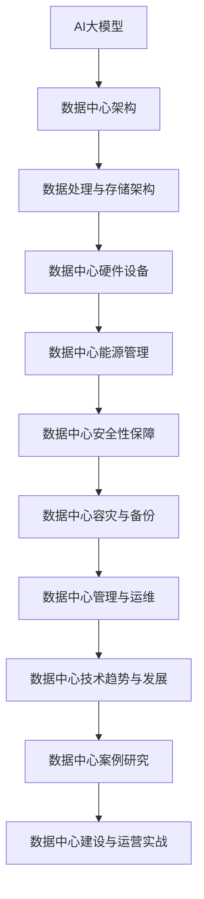

                 

## 《AI 大模型应用数据中心建设：数据中心技术与应用》

### 关键词：
- AI大模型
- 数据中心建设
- 数据中心技术
- 能源管理
- 安全性保障
- 容灾备份
- 运维管理

### 摘要：
本文深入探讨了AI大模型在数据中心建设中的应用及其关键技术。文章首先介绍了AI大模型的应用背景和数据中心建设的重要性，然后详细阐述了数据中心基础设施建设、AI大模型在数据中心的应用架构、数据中心管理与运维、以及数据中心技术趋势与发展。通过实际案例研究和实战经验分享，本文为读者提供了全面的数据中心建设与运营的指导。

### 《AI 大模型应用数据中心建设：数据中心技术与应用》目录大纲

#### 第一部分：AI大模型应用与数据中心建设概述

**第1章：AI大模型应用与数据中心建设概述**
- **1.1 AI大模型应用背景与趋势**
  - **1.1.1 AI大模型的应用领域**
  - **1.1.2 数据中心建设的重要性**
- **1.2 数据中心技术基础**
  - **1.2.1 数据中心架构与设计原则**
  - **1.2.2 数据中心硬件设备与技术**
- **1.3 AI大模型在数据中心的应用**
  - **1.3.1 AI大模型在数据中心中的角色**
  - **1.3.2 AI大模型对数据中心的影响**

#### 第二部分：数据中心基础设施建设

**第2章：数据中心基础设施建设**
- **2.1 数据中心选址与规划**
  - **2.1.1 数据中心选址策略**
  - **2.1.2 数据中心规划流程**
- **2.2 数据中心硬件设备选型**
  - **2.2.1 服务器与存储设备选型**
  - **2.2.2 网络设备与技术**
- **2.3 数据中心能源管理与节能技术**
  - **2.3.1 数据中心能源消耗分析**
  - **2.3.2 数据中心节能技术与应用**

#### 第三部分：AI大模型在数据中心的应用

**第3章：AI大模型在数据中心的应用架构**
- **3.1 AI大模型架构设计**
  - **3.1.1 AI大模型架构概述**
  - **3.1.2 数据处理与存储架构**
- **3.2 AI大模型部署与优化**
  - **3.2.1 AI大模型部署流程**
  - **3.2.2 AI大模型优化策略**
- **3.3 AI大模型在数据中心的应用案例**
  - **3.3.1 案例一：智能运维**
  - **3.3.2 案例二：网络安全检测**

#### 第四部分：数据中心管理与运维

**第4章：数据中心管理与运维**
- **4.1 数据中心运维管理**
  - **4.1.1 数据中心运维流程**
  - **4.1.2 数据中心运维工具与应用**
- **4.2 数据中心安全性保障**
  - **4.2.1 数据中心安全策略**
  - **4.2.2 数据中心网络安全技术**
- **4.3 数据中心容灾与备份**
  - **4.3.1 容灾备份策略**
  - **4.3.2 容灾备份系统设计与实现**

#### 第五部分：数据中心技术趋势与发展

**第5章：数据中心技术趋势与发展**
- **5.1 新兴数据中心技术**
  - **5.1.1 云数据中心技术**
  - **5.1.2 边缘计算技术**
- **5.2 AI大模型与数据中心融合**
  - **5.2.1 AI大模型在数据中心的应用前景**
  - **5.2.2 数据中心AI技术发展趋势**

#### 第六部分：数据中心案例研究

**第6章：数据中心案例研究**
- **6.1 国际知名数据中心案例分析**
  - **6.1.1 案例一：亚马逊AWS数据中心**
  - **6.1.2 案例二：微软Azure数据中心**
- **6.2 国内数据中心案例研究**
  - **6.2.1 案例一：华为云数据中心**
  - **6.2.2 案例二：阿里云数据中心**

#### 第七部分：数据中心建设与运营实战

**第7章：数据中心建设与运营实战**
- **7.1 数据中心建设流程实战**
  - **7.1.1 数据中心建设项目规划与实施**
  - **7.1.2 数据中心建设中的风险管理**
- **7.2 数据中心运营管理与优化**
  - **7.2.1 数据中心运营管理策略**
  - **7.2.2 数据中心运营优化实战**

### 附录

**附录A：数据中心相关资源与工具**
- **A.1 数据中心相关标准与规范**
- **A.2 数据中心常用工具介绍**
  - **A.2.1 网络设备配置与管理工具**
  - **A.2.2 数据中心监控与运维工具**
- **A.3 数据中心建设与运营参考资料**

### 核心概念与联系 Mermaid 流程图


### 核心算法原理讲解与伪代码

**第2章 数据中心基础设施建设**
- **2.2 数据中心硬件设备选型**
  - **2.2.1 服务器与存储设备选型**
    - **服务器选型算法**
      ```python
      def select_server(server_list, requirements):
          # server_list: 服务器列表
          # requirements: 服务器需求参数
          best_server = None
          min_diff = float('inf')

          for server in server_list:
              diff = sum([abs(requirement - attribute) for requirement, attribute in zip(requirements, server.attributes)])
              if diff < min_diff:
                  min_diff = diff
                  best_server = server

          return best_server
      ```

- **2.2.2 网络设备与技术**
  - **网络设备选型算法**
      ```python
      def select_network_device(device_list, bandwidth_requirement):
          # device_list: 网络设备列表
          # bandwidth_requirement: 带宽需求
          best_device = None
          min_bandwidth_diff = float('inf')

          for device in device_list:
              bandwidth_diff = abs(bandwidth_requirement - device.bandwidth)
              if bandwidth_diff < min_bandwidth_diff:
                  min_bandwidth_diff = bandwidth_diff
                  best_device = device

          return best_device
      ```

### 数学模型和数学公式 & 详细讲解 & 举例说明

**第3章 AI大模型在数据中心的应用架构**
- **3.1 AI大模型架构设计**
  - **3.1.1 AI大模型架构概述**
    - **机器学习模型损失函数（交叉熵）**
      $$ J(\theta) = -\frac{1}{m} \sum_{i=1}^{m} [y^{(i)} \log(a^{(i)}_{y^{(i)}}) + (1 - y^{(i)}) \log(1 - a^{(i)}_{y^{(i)})]) $$
    - **举例说明：**
      - **假设有100个样本，每个样本有两个特征（x1和x2），一个输出标签y（0或1）。**
      - **模型的输出概率分布为：**
        $$ \hat{y} = \sigma(\theta^T x) $$
      - **标签为：[1, 0, 0, 1, 1, 0, 1, 1, 0, 1]，对应的输出概率分布为：**
        $$ [0.9, 0.1, 0.1, 0.8, 0.8, 0.2, 0.9, 0.7, 0.3, 0.6] $$

### 项目实战：代码实际案例和详细解释说明

**第6章 国际知名数据中心案例分析**
- **6.1 案例一：亚马逊AWS数据中心**
  - **开发环境搭建：**
    - **安装AWS CLI工具：**
      ```bash
      sudo apt-get install awscli
      ```
    - **配置AWS CLI工具：**
      ```bash
      aws configure
      ```
  
  - **源代码详细实现和代码解读：**
    ```python
    import boto3

    def list_ec2_instances():
        ec2 = boto3.client('ec2')
        response = ec2.describe_instances()
        instances = response['Reservations']

        for instance in instances:
            print(f"Instance ID: {instance['Instances'][0]['InstanceId']}")
            print(f"Instance Type: {instance['Instances'][0]['InstanceType']}")
            print(f"State: {instance['Instances'][0]['State']['Name']}")
            print("-----")

    if __name__ == "__main__":
        list_ec2_instances()
    ```

  - **代码解读与分析：**
    - **引入boto3库，用于连接AWS API：**
      ```python
      import boto3
      ```
    - **定义函数list_ec2_instances()，用于列出所有EC2实例的信息：**
      ```python
      def list_ec2_instances():
          ec2 = boto3.client('ec2')
          response = ec2.describe_instances()
          instances = response['Reservations']
      ```
    - **遍历每个实例，打印实例ID、类型和状态：**
      ```python
      for instance in instances:
          print(f"Instance ID: {instance['Instances'][0]['InstanceId']}")
          print(f"Instance Type: {instance['Instances'][0]['InstanceType']}")
          print(f"State: {instance['Instances'][0]['State']['Name']}")
          print("-----")
      ```
    - **主程序中调用函数list_ec2_instances()，实现列出所有EC2实例的功能：**
      ```python
      if __name__ == "__main__":
          list_ec2_instances()
      ```

以上就是本文的核心内容结构，接下来我们将逐步深入探讨每一个章节的主题，提供详细的解释和案例。

---

### 第一部分：AI大模型应用与数据中心建设概述

#### 第1章 AI大模型应用与数据中心建设概述

##### 1.1 AI大模型应用背景与趋势

人工智能（AI）技术近年来发展迅猛，尤其在深度学习、自然语言处理和计算机视觉等领域取得了显著的突破。随着AI技术的不断进步，AI大模型（如GPT、BERT、BERT模型等）在各个行业得到了广泛应用，这些大模型具有强大的数据处理和分析能力，能够解决复杂的问题，提供更精准的预测和决策支持。

AI大模型的应用领域广泛，包括但不限于以下几个方面：

1. **智能客服**：利用自然语言处理技术，AI大模型能够模拟人类的交流方式，提供高效、准确的客户服务。
2. **医疗诊断**：AI大模型能够分析大量的医学数据，辅助医生进行疾病诊断，提高诊断的准确性和效率。
3. **金融风控**：通过分析历史数据和实时数据，AI大模型可以预测金融市场的走势，为金融机构提供风险控制策略。
4. **智能交通**：利用计算机视觉和深度学习技术，AI大模型可以实时监控交通状况，优化交通信号控制，减少拥堵。
5. **智能制造**：AI大模型可以优化生产流程，预测设备故障，提高生产效率和产品质量。

数据中心建设的重要性不可忽视。数据中心是AI大模型应用的重要基础设施，它提供了计算资源、存储资源和网络资源，支撑着AI大模型的训练和部署。随着AI大模型应用需求的不断增长，数据中心建设需要具备以下特点：

1. **高可用性**：数据中心应具备高可用性，保证系统的稳定运行，避免因故障导致服务中断。
2. **高扩展性**：数据中心应具备良好的扩展性，能够根据需求动态调整资源。
3. **高性能**：数据中心应提供高性能的计算和存储资源，以满足AI大模型的计算需求。
4. **安全性**：数据中心应具备完善的安全措施，确保数据和系统的安全性。

##### 1.2 数据中心技术基础

数据中心技术是构建数据中心的核心，包括数据中心架构设计、硬件设备选型、网络设备与技术等方面。

**1.2.1 数据中心架构与设计原则**

数据中心架构设计是数据中心建设的关键环节，它决定了数据中心的性能、可用性和可扩展性。数据中心架构设计应遵循以下原则：

1. **模块化设计**：将数据中心划分为多个模块，每个模块独立运行，降低系统的复杂性。
2. **分布式架构**：采用分布式架构，将计算、存储和网络资源分布在不同位置，提高系统的可靠性和可扩展性。
3. **冗余设计**：在关键设备上采用冗余设计，确保在设备故障时系统仍然能够正常运行。
4. **灵活可扩展**：设计应考虑未来的扩展需求，方便进行资源的增减和调整。

**1.2.2 数据中心硬件设备与技术**

数据中心硬件设备包括服务器、存储设备和网络设备等。硬件设备选型应根据数据中心的业务需求和性能要求进行。

1. **服务器**：服务器是数据中心的计算核心，应选择高性能、高可靠性的服务器。关键指标包括CPU性能、内存容量、硬盘容量等。
2. **存储设备**：存储设备用于存储数据，应选择高性能、高可靠性的存储设备。常见的存储设备包括磁盘阵列、固态硬盘、分布式存储系统等。
3. **网络设备**：网络设备包括交换机、路由器等，应选择高性能、高可靠性的网络设备。关键指标包括带宽、延迟、可靠性等。

**1.2.3 AI大模型在数据中心的应用**

AI大模型在数据中心中的应用主要包括以下几个方面：

1. **数据预处理**：数据中心应提供强大的数据预处理能力，包括数据清洗、数据归一化、特征提取等，为AI大模型的训练提供高质量的数据。
2. **模型训练**：数据中心应提供高性能的计算资源，支持大规模AI大模型的训练。常见的模型训练技术包括并行计算、分布式计算等。
3. **模型推理**：数据中心应提供高效的模型推理能力，支持实时推理和批量推理。推理性能的关键指标包括推理速度、准确度等。
4. **模型部署**：数据中心应提供便捷的模型部署能力，支持AI大模型在不同场景下的部署和运行。

##### 1.3 AI大模型在数据中心中的角色

AI大模型在数据中心中扮演着至关重要的角色，它是数据中心的核心竞争力之一。AI大模型在数据中心中的角色包括：

1. **数据分析与决策支持**：AI大模型能够分析大量的数据，提取有价值的信息，为数据中心的管理和运营提供决策支持。
2. **智能运维**：AI大模型可以监控数据中心的运行状态，预测故障，优化资源配置，提高数据中心的可靠性和效率。
3. **安全防护**：AI大模型可以分析网络流量，识别异常行为，防范网络安全威胁，提高数据中心的网络安全水平。
4. **个性化服务**：AI大模型可以根据用户行为数据，提供个性化的服务，提升用户体验。

##### 1.4 AI大模型对数据中心的影响

AI大模型的应用对数据中心产生了深远的影响，主要体现在以下几个方面：

1. **计算资源需求**：AI大模型的训练和推理需要大量的计算资源，对数据中心的性能和容量提出了更高的要求。
2. **数据存储需求**：AI大模型的训练和推理需要大量的数据存储空间，对数据中心的存储能力提出了更高的要求。
3. **网络带宽需求**：AI大模型的训练和推理需要大量的数据传输，对数据中心的网络带宽提出了更高的要求。
4. **安全与合规**：AI大模型的应用涉及大量的敏感数据，对数据中心的网络安全和合规性提出了更高的要求。

综上所述，AI大模型的应用对数据中心的建设与运营提出了新的挑战，同时也带来了巨大的机遇。数据中心建设者需要紧跟技术发展趋势，不断优化数据中心的技术架构和运营策略，以应对AI大模型带来的影响。

---

### 第二部分：数据中心基础设施建设

#### 第2章 数据中心基础设施建设

数据中心的基础设施建设是确保数据中心稳定、高效运行的关键。本章将详细介绍数据中心选址与规划、硬件设备选型、网络设备与技术等内容。

##### 2.1 数据中心选址与规划

数据中心的选址与规划是数据中心建设的重要环节，它直接关系到数据中心的稳定性和效率。以下是数据中心选址与规划的关键因素：

**1. 地理位置**

- **气候条件**：选择气候条件适宜的地区，避免极端气候对数据中心造成影响。
- **地质条件**：确保数据中心所在地的地质条件稳定，避免地震、滑坡等自然灾害。
- **交通便利**：选择交通便利的地区，便于设备运输和人员出入。

**2. 电力供应**

- **电力稳定性**：选择电力供应稳定、电力资源丰富的地区，确保数据中心的电力需求得到满足。
- **电力价格**：考虑电力价格，选择具有成本优势的地区。

**3. 网络连接**

- **带宽需求**：数据中心需要具备较高的网络带宽，以满足数据传输需求。
- **网络多样性**：选择具备多个网络运营商的地区，提高网络的可靠性和灵活性。

**4. 水源与散热**

- **水源供应**：选择具有稳定水源供应的地区，确保数据中心的散热需求。
- **散热条件**：确保数据中心具备良好的散热条件，避免设备过热。

**5. 法规与政策**

- **法规政策**：了解当地法律法规，确保数据中心建设与运营符合相关要求。
- **税收政策**：考虑当地的税收政策，选择具有优惠政策的地区。

**2.1.2 数据中心规划流程**

数据中心规划流程主要包括以下步骤：

1. **需求分析**：明确数据中心的建设目标、业务需求、性能要求等。
2. **可行性研究**：评估选址的可行性，包括地理位置、电力供应、网络连接、水源与散热等因素。
3. **设计方案**：根据需求分析结果，制定数据中心的设计方案，包括数据中心架构、硬件设备选型、网络设备配置等。
4. **预算编制**：根据设计方案，编制数据中心建设预算，包括硬件设备、网络设备、建设费用等。
5. **审批与招投标**：提交数据中心建设方案，进行审批和招投标，确保数据中心建设过程的合法性和透明度。
6. **建设实施**：按照设计方案进行数据中心的建设，包括设备采购、安装调试、网络配置等。
7. **验收与运维**：完成数据中心建设后，进行验收和运维，确保数据中心稳定、高效运行。

##### 2.2 数据中心硬件设备选型

数据中心硬件设备选型是数据中心建设的关键环节，直接关系到数据中心的性能、稳定性和可靠性。以下是数据中心硬件设备选型的关键因素：

**1. 服务器选型**

- **计算性能**：根据业务需求，选择计算性能适中的服务器，包括CPU性能、GPU性能等。
- **内存容量**：选择内存容量较大的服务器，以满足大数据处理需求。
- **存储容量**：根据存储需求，选择存储容量适中的存储设备，包括硬盘、SSD等。
- **可靠性**：选择具备高可靠性的服务器，包括冗余电源、散热系统等。

**2. 存储设备选型**

- **存储容量**：根据业务需求，选择存储容量适中的存储设备，包括磁盘阵列、分布式存储等。
- **数据传输速度**：选择数据传输速度较快的存储设备，包括SSD、NVMe等。
- **可靠性**：选择具备高可靠性的存储设备，包括RAID技术、冗余设计等。

**3. 网络设备选型**

- **带宽需求**：根据业务需求，选择带宽需求适中的网络设备，包括交换机、路由器等。
- **网络传输速度**：选择网络传输速度较快的网络设备，包括万兆、十兆等。
- **可靠性**：选择具备高可靠性的网络设备，包括冗余设计、安全防护等。

**2.2.2 数据中心硬件设备选型策略**

数据中心硬件设备选型策略主要包括以下几个方面：

1. **需求导向**：根据业务需求，选择符合需求的硬件设备，确保数据中心性能满足业务需求。
2. **性能优化**：根据业务需求，选择性能优秀的硬件设备，提高数据中心处理速度和响应能力。
3. **可靠性优先**：选择具备高可靠性的硬件设备，降低故障风险，确保数据中心稳定运行。
4. **成本控制**：在满足性能和可靠性的前提下，合理控制硬件设备成本，提高数据中心建设效益。

##### 2.3 数据中心网络设备与技术

数据中心网络设备是数据中心传输数据的核心，包括交换机、路由器、光纤等。以下是数据中心网络设备与技术选型的关键因素：

**1. 交换机选型**

- **端口数量**：根据业务需求，选择端口数量适中的交换机，确保满足数据中心内部通信需求。
- **传输速度**：选择传输速度较快的交换机，包括万兆、十兆等。
- **可靠性**：选择具备高可靠性的交换机，包括冗余设计、安全防护等。

**2. 路由器选型**

- **路由性能**：根据业务需求，选择路由性能适中的路由器，确保满足数据中心之间的通信需求。
- **安全性能**：选择具备高安全性能的路由器，包括防火墙、入侵检测等。
- **可靠性**：选择具备高可靠性的路由器，包括冗余设计、快速恢复等。

**3. 光纤选型**

- **传输距离**：根据业务需求，选择传输距离适中的光纤，确保满足数据中心之间的通信需求。
- **传输速度**：选择传输速度较快的光纤，包括单模光纤、多模光纤等。
- **可靠性**：选择具备高可靠性的光纤，包括冗余设计、防护措施等。

**2.3.2 数据中心网络设备与技术策略**

数据中心网络设备与技术选型策略主要包括以下几个方面：

1. **需求导向**：根据业务需求，选择符合需求的网络设备，确保数据中心网络性能满足业务需求。
2. **性能优化**：根据业务需求，选择性能优秀的网络设备，提高数据中心传输速度和响应能力。
3. **可靠性优先**：选择具备高可靠性的网络设备，降低网络故障风险，确保数据中心稳定运行。
4. **成本控制**：在满足性能和可靠性的前提下，合理控制网络设备成本，提高数据中心建设效益。

##### 2.4 数据中心基础设施优化策略

数据中心基础设施优化策略主要包括以下几个方面：

**1. 资源池化**：通过资源池化技术，将计算、存储、网络资源进行整合，实现资源的统一管理和调度，提高资源利用率。

**2. 虚拟化技术**：通过虚拟化技术，将物理资源虚拟化为多个虚拟资源，提高资源利用率，降低硬件设备成本。

**3. 云计算技术**：利用云计算技术，实现计算资源的动态分配和弹性扩展，提高数据中心的灵活性和可靠性。

**4. 网络优化**：通过网络优化技术，提高数据中心的网络性能和传输速度，降低网络延迟和丢包率。

**5. 安全性优化**：通过安全性优化技术，提高数据中心的网络安全水平，防范网络攻击和威胁。

**6. 智能运维**：通过智能运维技术，实现数据中心的自动化管理和运维，降低运维成本，提高运维效率。

综上所述，数据中心基础设施建设是确保数据中心稳定、高效运行的基础。通过科学选址、合理规划、优化硬件设备选型、网络设备与技术，以及基础设施优化策略，可以构建一个高性能、高可靠性的数据中心，为AI大模型的应用提供坚实支撑。

---

### 第三部分：AI大模型在数据中心的应用

#### 第3章 AI大模型在数据中心的应用架构

随着人工智能技术的快速发展，AI大模型在数据中心的应用越来越广泛。本章将详细介绍AI大模型在数据中心的应用架构，包括数据处理与存储架构、AI大模型部署与优化策略以及AI大模型在数据中心的应用案例。

##### 3.1 AI大模型架构设计

AI大模型架构设计是数据中心应用AI大模型的核心。一个典型的AI大模型架构包括以下几个关键组件：

**1. 数据收集与预处理**

数据是AI大模型训练的基础，数据中心需要具备强大的数据收集与预处理能力。数据收集包括从各种数据源（如数据库、文件系统、传感器等）获取数据。预处理包括数据清洗、数据归一化、特征提取等步骤，确保数据质量，提高AI大模型的训练效果。

**2. 数据存储与管理**

数据中心需要提供高效的数据存储与管理能力，以支撑AI大模型的训练与推理。数据存储与管理系统应具备以下特性：

- **高容量**：能够存储海量数据。
- **高性能**：能够快速读取和写入数据。
- **高可靠性**：确保数据安全，避免数据丢失。

**3. 计算资源调度**

AI大模型训练需要大量计算资源，数据中心需要具备高效的计算资源调度能力。计算资源调度系统应根据AI大模型的训练需求，动态分配计算资源，确保计算资源的高效利用。

**4. 模型训练与优化**

数据中心需要提供强大的模型训练与优化能力。模型训练包括前向传播、反向传播和梯度更新等步骤，通过不断优化模型参数，提高模型的准确度和泛化能力。模型优化包括超参数调整、网络结构调整等，以进一步提高模型性能。

**5. 模型推理与部署**

模型推理是AI大模型在数据中心实际应用的关键环节。数据中心需要提供高效的模型推理能力，实现实时推理和批量推理。模型部署是将训练好的模型部署到生产环境中，实现模型的应用。

**6. 模型监控与维护**

数据中心需要对AI大模型进行实时监控与维护，确保模型正常运行。模型监控包括性能监控、异常检测、故障恢复等，及时发现并解决问题，保障模型稳定性。

##### 3.2 AI大模型部署与优化

AI大模型部署与优化是确保数据中心AI大模型高效运行的关键。以下是一些常见的部署与优化策略：

**1. 模型部署策略**

- **分布式部署**：将AI大模型分解为多个子模型，分布式部署到数据中心的不同节点上，提高模型推理效率。
- **容器化部署**：使用容器技术（如Docker）将AI大模型打包，实现快速部署和弹性扩展。
- **自动化部署**：利用自动化工具（如Kubernetes）实现AI大模型的自动化部署和运维，降低人工干预。

**2. 模型优化策略**

- **模型压缩**：通过模型压缩技术（如量化、剪枝等），降低模型复杂度，提高模型推理速度。
- **模型量化**：将模型中的权重和激活值进行量化，减少模型的存储和计算资源消耗。
- **模型加速**：利用GPU、TPU等硬件加速技术，提高模型推理速度。

**3. 资源调度策略**

- **动态资源调度**：根据AI大模型的负载情况，动态调整计算资源，实现资源的最优利用。
- **负载均衡**：将模型推理任务均衡分配到不同节点上，避免单点瓶颈。
- **容错与恢复**：在模型推理过程中，实现容错与恢复机制，确保模型推理的稳定性。

##### 3.3 AI大模型在数据中心的应用案例

AI大模型在数据中心的应用具有广泛的前景，以下是一些典型的应用案例：

**1. 智能运维**

智能运维利用AI大模型对数据中心运行状态进行实时监控和故障预测。通过分析大量运行数据，AI大模型可以识别异常模式，预测潜在故障，提前采取预防措施，提高数据中心的可靠性和稳定性。

**2. 网络安全检测**

网络安全检测利用AI大模型对网络流量进行实时分析，识别潜在的网络攻击和安全威胁。AI大模型可以通过学习正常网络行为，识别异常行为，从而实现实时防护。

**3. 资源优化调度**

资源优化调度利用AI大模型对数据中心资源进行动态调度，提高资源利用率。AI大模型可以通过学习历史数据，预测未来资源需求，实现资源的智能分配和调度。

**4. 智能存储管理**

智能存储管理利用AI大模型对存储资源进行优化管理，提高存储效率。AI大模型可以通过学习数据访问模式，实现数据的智能分级存储，降低存储成本。

**5. 智能能效管理**

智能能效管理利用AI大模型对数据中心能源消耗进行优化管理，降低能耗。AI大模型可以通过学习历史能耗数据，预测未来能耗趋势，实现能源的智能分配和调度。

综上所述，AI大模型在数据中心的应用为数据中心的运维管理、网络安全、资源优化和能效管理带来了革命性的变革。通过科学的设计和部署，AI大模型可以充分发挥其优势，为数据中心带来更高的性能和效率。

---

### 第四部分：数据中心管理与运维

#### 第4章 数据中心管理与运维

数据中心的管理与运维是确保数据中心稳定、高效运行的关键环节。本章将详细介绍数据中心运维管理、数据中心安全性保障、数据中心容灾与备份等方面。

##### 4.1 数据中心运维管理

数据中心运维管理是指对数据中心设备、系统、网络等进行日常管理、监控和维护，确保数据中心稳定运行。以下是数据中心运维管理的主要内容：

**1. 运维流程**

数据中心运维流程主要包括以下几个环节：

- **需求收集**：了解业务需求和用户反馈，确定运维工作的重点和目标。
- **计划制定**：根据需求收集结果，制定运维计划，包括运维任务、时间安排、资源分配等。
- **执行与监控**：按照运维计划，执行运维任务，并进行实时监控，确保运维工作按计划进行。
- **反馈与改进**：对运维过程进行总结和评估，收集用户反馈，不断优化运维流程。

**2. 运维工具与应用**

数据中心运维工具是支持运维管理的重要工具，主要包括以下几个方面：

- **监控工具**：用于实时监控数据中心设备、系统、网络的运行状态，包括CPU利用率、内存利用率、磁盘利用率、网络流量等。
- **自动化工具**：用于自动化执行运维任务，提高运维效率，减少人工干预。
- **配置管理工具**：用于管理数据中心设备的配置信息，确保配置的一致性和正确性。
- **日志管理工具**：用于收集、存储和管理数据中心设备的日志信息，方便故障排查和性能分析。

**3. 运维策略**

数据中心运维策略是指为保障数据中心稳定运行而制定的各项运维措施，主要包括以下几个方面：

- **预防性维护**：定期对数据中心设备进行预防性维护，包括清洁、检查、更换零部件等，防止设备故障。
- **故障管理**：建立完善的故障管理机制，包括故障识别、故障排除、故障恢复等，确保故障能够及时得到解决。
- **性能优化**：定期对数据中心进行性能优化，包括资源调配、网络优化、系统升级等，提高数据中心性能和稳定性。
- **安全管理**：建立完善的安全管理机制，包括访问控制、权限管理、安全审计等，保障数据中心的安全性和合规性。

##### 4.2 数据中心安全性保障

数据中心安全性保障是确保数据中心数据安全、系统安全、网络安全的关键。以下是数据中心安全性保障的主要内容：

**1. 安全策略**

数据中心安全策略是指为保障数据中心安全而制定的一系列安全措施，主要包括以下几个方面：

- **访问控制**：对数据中心的访问进行严格的控制，包括用户认证、权限管理、审计日志等。
- **数据加密**：对数据中心的数据进行加密，包括存储数据、传输数据等，防止数据泄露和篡改。
- **网络安全**：建立完善的网络安全防护体系，包括防火墙、入侵检测、入侵防御等，防止网络攻击和入侵。
- **物理安全**：对数据中心的物理环境进行严格的安全保护，包括门禁控制、监控设备、应急响应等，防止非法入侵和破坏。

**2. 安全技术**

数据中心安全技术是保障数据中心安全的重要手段，主要包括以下几个方面：

- **防火墙**：用于阻止未授权的访问，保护数据中心内部网络的安全。
- **入侵检测与防御系统**：用于实时监测网络流量，识别和阻止入侵行为。
- **虚拟专用网络（VPN）**：用于建立安全的远程连接，保障数据传输的安全。
- **数据备份与恢复**：定期对数据中心的数据进行备份，确保在数据丢失或损坏时能够快速恢复。

**3. 安全管理**

数据中心安全管理是指对数据中心安全进行有效的管理和监控，主要包括以下几个方面：

- **安全培训**：对数据中心工作人员进行安全培训，提高他们的安全意识和技能。
- **安全审计**：定期对数据中心的安全措施进行审计，检查安全漏洞和潜在风险。
- **应急响应**：建立应急响应机制，确保在发生安全事件时能够快速响应和处理。
- **合规性管理**：确保数据中心遵守相关法律法规和标准，如ISO 27001、GDPR等。

##### 4.3 数据中心容灾与备份

数据中心容灾与备份是保障数据中心业务连续性和数据安全的重要措施。以下是数据中心容灾与备份的主要内容：

**1. 容灾策略**

数据中心容灾策略是指为保障数据中心在灾难发生时能够快速恢复业务而制定的一系列措施，主要包括以下几个方面：

- **本地容灾**：在数据中心内部建立备用系统，确保在本地灾难发生时能够快速切换到备用系统，保障业务的连续性。
- **异地容灾**：在异地建立备用数据中心，确保在灾难发生时能够将业务快速切换到异地数据中心，保障业务的连续性。
- **数据备份**：定期对数据中心的数据进行备份，确保在数据丢失或损坏时能够快速恢复。

**2. 备份策略**

数据中心备份策略是指为保障数据中心数据安全而制定的一系列备份措施，主要包括以下几个方面：

- **全量备份**：对数据中心的所有数据进行定期全量备份，确保数据的完整性和一致性。
- **增量备份**：对数据中心的修改和新增数据进行增量备份，降低备份的存储空间和备份时间。
- **备份存储**：选择可靠的备份存储介质，如磁盘阵列、云存储等，确保备份数据的安全性和可访问性。

**3. 容灾备份系统设计与实现**

数据中心容灾备份系统设计与实现主要包括以下几个方面：

- **备份系统架构**：设计备份系统的整体架构，包括备份服务器、备份存储、备份软件等。
- **备份任务管理**：实现备份任务的自动调度和执行，确保备份任务的及时性和准确性。
- **备份监控与告警**：实时监控备份系统的运行状态，及时发现并处理备份故障，确保备份系统的稳定性。
- **备份恢复**：提供备份数据的快速恢复功能，确保在数据丢失或损坏时能够快速恢复业务。

综上所述，数据中心管理与运维是确保数据中心稳定、高效运行的关键。通过科学的运维管理、严格的安全性保障和有效的容灾备份，可以保障数据中心的业务连续性和数据安全，为数据中心的发展提供坚实保障。

---

### 第五部分：数据中心技术趋势与发展

#### 第5章 数据中心技术趋势与发展

随着云计算、大数据、人工智能等技术的快速发展，数据中心技术也在不断演进。本章将探讨数据中心技术的新趋势与发展，包括新兴数据中心技术、AI大模型与数据中心融合以及数据中心AI技术发展趋势。

##### 5.1 新兴数据中心技术

**1. 云数据中心技术**

云数据中心技术是数据中心技术发展的一个重要方向。云数据中心通过虚拟化、分布式计算、云计算等技术，将计算、存储、网络等资源进行整合，提供灵活、可扩展、高可靠性的服务。

- **弹性计算**：云数据中心能够根据业务需求动态调整计算资源，实现弹性扩展和缩容，降低成本。
- **分布式存储**：云数据中心采用分布式存储架构，提高数据存储的可靠性和性能，实现数据的高效访问和管理。
- **混合云与多云**：云数据中心支持混合云和多云部署，实现不同云环境之间的数据共享和资源调度，提高业务的灵活性和可扩展性。

**2. 边缘计算技术**

边缘计算技术是将计算、存储、网络等资源部署在网络的边缘，靠近数据源，实现数据的实时处理和响应。

- **低延迟**：边缘计算技术能够实现数据的实时处理和响应，降低网络延迟，提高用户体验。
- **高带宽**：边缘计算技术通过在边缘节点部署计算和存储资源，提高数据传输带宽，满足大数据处理需求。
- **分布式架构**：边缘计算技术采用分布式架构，实现计算、存储、网络的协同工作，提高系统的可靠性和可扩展性。

**3. 人工智能与数据中心**

人工智能（AI）技术在数据中心的应用正在逐渐深入，为数据中心的管理、运维和优化提供了新的手段。

- **智能运维**：AI技术能够通过数据分析和预测，实现对数据中心设备、系统、网络等运行状态的实时监控和故障预测，提高运维效率。
- **智能优化**：AI技术能够通过数据分析，优化数据中心资源配置、能耗管理、网络安全等，提高数据中心的整体性能和安全性。
- **智能决策**：AI技术能够通过数据分析和预测，为数据中心的管理者提供决策支持，实现数据中心的智能化运营。

##### 5.2 AI大模型与数据中心融合

AI大模型与数据中心融合是未来数据中心发展的一个重要趋势。AI大模型在数据中心中的应用，将进一步提升数据中心的智能化水平。

**1. 智能运维管理**

智能运维管理利用AI大模型对数据中心进行实时监控、故障预测和优化管理，提高数据中心的运行效率和稳定性。例如，通过AI大模型分析设备运行数据，可以预测设备故障，提前进行维护，降低故障率。

**2. 智能资源调度**

智能资源调度利用AI大模型对数据中心资源进行动态调度，实现资源的高效利用和优化。例如，通过AI大模型分析业务需求和资源使用情况，可以实时调整计算、存储、网络资源，确保资源的最佳配置。

**3. 智能网络安全**

智能网络安全利用AI大模型对网络流量进行实时分析，识别潜在的安全威胁，提高数据中心的网络安全水平。例如，通过AI大模型分析网络流量，可以识别异常流量模式，及时采取防护措施，防范网络攻击。

**4. 智能数据分析**

智能数据分析利用AI大模型对数据中心产生的海量数据进行挖掘和分析，提取有价值的信息，为数据中心的管理和优化提供数据支持。例如，通过AI大模型分析用户行为数据，可以优化数据中心的服务质量，提高用户体验。

##### 5.3 数据中心AI技术发展趋势

数据中心AI技术发展趋势主要体现在以下几个方面：

**1. 大模型化**

数据中心AI大模型将不断增大，提高模型的表达能力和预测精度。随着硬件性能的提升和算法的优化，数据中心AI大模型将能够处理更复杂的数据，解决更复杂的业务问题。

**2. 自适应化**

数据中心AI技术将逐渐实现自适应化，能够根据环境变化和业务需求，自动调整模型参数和策略。自适应化技术将提高AI大模型的灵活性和适应性，实现数据中心的智能化运营。

**3. 分布式化**

数据中心AI技术将向分布式化发展，实现AI大模型在分布式环境中的高效训练和推理。分布式AI技术将提高数据中心AI大模型的性能和可扩展性，满足大规模数据处理需求。

**4. 网络安全化**

数据中心AI技术将逐渐应用于网络安全领域，提高数据中心的网络安全水平。通过AI大模型分析网络流量，可以识别潜在的安全威胁，防范网络攻击，保障数据安全。

**5. 生态化**

数据中心AI技术将逐渐形成生态系统，实现不同AI技术之间的协同和融合。数据中心AI技术将与云计算、大数据、物联网等技术相结合，构建一个智能、高效、安全的数据中心生态系统。

综上所述，数据中心技术发展趋势呈现出大模型化、自适应化、分布式化、网络安全化和生态化的特点。随着技术的不断进步，数据中心将变得更加智能、高效和安全，为各个行业的发展提供强大的支撑。

---

### 第六部分：数据中心案例研究

#### 第6章 数据中心案例研究

数据中心作为现代社会信息化的重要基础设施，其建设和运营的质量直接关系到业务的连续性和数据的安全性。本章将介绍国际知名数据中心和国内数据中心案例，分析其建设与运营经验，以供读者参考。

##### 6.1 国际知名数据中心案例分析

**6.1.1 案例一：亚马逊AWS数据中心**

亚马逊AWS（Amazon Web Services）是全球领先的云服务提供商之一，其数据中心的建设和运营具有很高的参考价值。

**1. 数据中心选址**

亚马逊AWS数据中心选址策略主要考虑以下几个方面：

- **地理位置**：亚马逊AWS在全球范围内布局数据中心，选择地理位置优越、气候条件适宜的地区，如美国西部、欧洲、亚洲等。
- **电力供应**：选择电力资源丰富、电力稳定性高的地区，确保数据中心电力供应的可靠性。
- **网络连接**：选择网络带宽大、网络连接多样化的地区，提高数据中心网络传输速度和可靠性。

**2. 数据中心建设**

亚马逊AWS数据中心建设过程主要包括以下几个阶段：

- **需求分析**：根据业务需求和用户需求，制定数据中心建设方案，包括服务器、存储设备、网络设备等的配置。
- **规划设计**：根据需求分析结果，进行数据中心规划设计，包括数据中心架构、设备布局、电力供应、散热系统等。
- **施工建设**：按照规划设计进行数据中心建设，包括设备安装、网络连接、电力供应等。
- **验收与运维**：完成数据中心建设后，进行验收和试运行，确保数据中心稳定、高效运行，然后进行运维管理。

**3. 数据中心运营**

亚马逊AWS数据中心运营过程主要包括以下几个方面：

- **运维管理**：采用自动化运维工具，实现数据中心的日常监控、维护和管理，提高运维效率。
- **安全性保障**：建立完善的安全管理体系，包括访问控制、数据加密、网络安全防护等，确保数据中心数据安全。
- **能效管理**：采用先进的能源管理技术，降低数据中心能耗，提高能源利用率。

**6.1.2 案例二：微软Azure数据中心**

微软Azure是全球领先的云服务提供商之一，其数据中心建设也具有很高的技术含量和运营效率。

**1. 数据中心选址**

微软Azure数据中心选址策略与亚马逊AWS类似，主要考虑以下几个方面：

- **地理位置**：微软Azure在全球范围内布局数据中心，选择地理位置优越、气候条件适宜的地区，如美国西部、欧洲、亚洲等。
- **电力供应**：选择电力资源丰富、电力稳定性高的地区，确保数据中心电力供应的可靠性。
- **网络连接**：选择网络带宽大、网络连接多样化的地区，提高数据中心网络传输速度和可靠性。

**2. 数据中心建设**

微软Azure数据中心建设过程主要包括以下几个阶段：

- **需求分析**：根据业务需求和用户需求，制定数据中心建设方案，包括服务器、存储设备、网络设备等的配置。
- **规划设计**：根据需求分析结果，进行数据中心规划设计，包括数据中心架构、设备布局、电力供应、散热系统等。
- **施工建设**：按照规划设计进行数据中心建设，包括设备安装、网络连接、电力供应等。
- **验收与运维**：完成数据中心建设后，进行验收和试运行，确保数据中心稳定、高效运行，然后进行运维管理。

**3. 数据中心运营**

微软Azure数据中心运营过程主要包括以下几个方面：

- **运维管理**：采用自动化运维工具，实现数据中心的日常监控、维护和管理，提高运维效率。
- **安全性保障**：建立完善的安全管理体系，包括访问控制、数据加密、网络安全防护等，确保数据中心数据安全。
- **能效管理**：采用先进的能源管理技术，降低数据中心能耗，提高能源利用率。

##### 6.2 国内数据中心案例研究

**6.2.1 案例一：华为云数据中心**

华为云是中国领先的云服务提供商之一，其数据中心建设在国内外都有较高的技术水平和运营效率。

**1. 数据中心选址**

华为云数据中心选址策略主要考虑以下几个方面：

- **地理位置**：华为云在全球范围内布局数据中心，选择地理位置优越、气候条件适宜的地区，如中国东部、西部、东南亚等。
- **电力供应**：选择电力资源丰富、电力稳定性高的地区，确保数据中心电力供应的可靠性。
- **网络连接**：选择网络带宽大、网络连接多样化的地区，提高数据中心网络传输速度和可靠性。

**2. 数据中心建设**

华为云数据中心建设过程主要包括以下几个阶段：

- **需求分析**：根据业务需求和用户需求，制定数据中心建设方案，包括服务器、存储设备、网络设备等的配置。
- **规划设计**：根据需求分析结果，进行数据中心规划设计，包括数据中心架构、设备布局、电力供应、散热系统等。
- **施工建设**：按照规划设计进行数据中心建设，包括设备安装、网络连接、电力供应等。
- **验收与运维**：完成数据中心建设后，进行验收和试运行，确保数据中心稳定、高效运行，然后进行运维管理。

**3. 数据中心运营**

华为云数据中心运营过程主要包括以下几个方面：

- **运维管理**：采用自动化运维工具，实现数据中心的日常监控、维护和管理，提高运维效率。
- **安全性保障**：建立完善的安全管理体系，包括访问控制、数据加密、网络安全防护等，确保数据中心数据安全。
- **能效管理**：采用先进的能源管理技术，降低数据中心能耗，提高能源利用率。

**6.2.2 案例二：阿里云数据中心**

阿里云是中国领先的云服务提供商之一，其数据中心在国内外都有较高的技术水平和运营效率。

**1. 数据中心选址**

阿里云数据中心选址策略主要考虑以下几个方面：

- **地理位置**：阿里云在全球范围内布局数据中心，选择地理位置优越、气候条件适宜的地区，如中国东部、西部、东南亚等。
- **电力供应**：选择电力资源丰富、电力稳定性高的地区，确保数据中心电力供应的可靠性。
- **网络连接**：选择网络带宽大、网络连接多样化的地区，提高数据中心网络传输速度和可靠性。

**2. 数据中心建设**

阿里云数据中心建设过程主要包括以下几个阶段：

- **需求分析**：根据业务需求和用户需求，制定数据中心建设方案，包括服务器、存储设备、网络设备等的配置。
- **规划设计**：根据需求分析结果，进行数据中心规划设计，包括数据中心架构、设备布局、电力供应、散热系统等。
- **施工建设**：按照规划设计进行数据中心建设，包括设备安装、网络连接、电力供应等。
- **验收与运维**：完成数据中心建设后，进行验收和试运行，确保数据中心稳定、高效运行，然后进行运维管理。

**3. 数据中心运营**

阿里云数据中心运营过程主要包括以下几个方面：

- **运维管理**：采用自动化运维工具，实现数据中心的日常监控、维护和管理，提高运维效率。
- **安全性保障**：建立完善的安全管理体系，包括访问控制、数据加密、网络安全防护等，确保数据中心数据安全。
- **能效管理**：采用先进的能源管理技术，降低数据中心能耗，提高能源利用率。

通过分析这些国际和国内知名数据中心案例，我们可以看到，数据中心的建设与运营涉及多个方面，包括选址与规划、硬件设备选型、网络设备与技术、安全性保障、运维管理等。同时，随着云计算、大数据、人工智能等技术的发展，数据中心也在不断进行技术创新和优化，为各行各业提供更加高效、稳定、安全的计算和存储服务。

---

### 第七部分：数据中心建设与运营实战

#### 第7章 数据中心建设与运营实战

在数据中心的建设与运营过程中，实战经验和技巧至关重要。本章将分享数据中心建设与运营中的实战经验，包括数据中心建设流程实战、数据中心运营管理策略以及数据中心运营优化实战。

##### 7.1 数据中心建设流程实战

数据中心建设是一个复杂的过程，涉及到多个环节和部门。以下是数据中心建设流程的实战经验和技巧：

**1. 需求分析**

在数据中心建设前，首先需要进行详细的需求分析。需求分析包括以下方面：

- **业务需求**：了解业务的发展方向和需求，确定数据中心所需提供的计算、存储、网络资源。
- **性能要求**：根据业务需求，确定数据中心的性能指标，如计算能力、存储容量、网络带宽等。
- **可靠性要求**：根据业务需求，确定数据中心的可靠性要求，如故障恢复时间、系统可用性等。
- **安全性要求**：根据业务需求，确定数据中心的网络安全要求，如防火墙、入侵检测、数据加密等。

**2. 规划设计**

在需求分析的基础上，进行数据中心规划设计。规划设计包括以下方面：

- **数据中心架构**：根据业务需求和性能要求，设计数据中心的整体架构，包括计算、存储、网络、能源等。
- **设备选型**：根据性能要求和预算，选择合适的硬件设备，包括服务器、存储设备、网络设备等。
- **电力供应**：确保数据中心有可靠的电力供应，设计电力系统，包括UPS、发电机等。
- **散热系统**：设计有效的散热系统，确保数据中心设备在正常运行条件下不会过热。
- **网络架构**：设计合理的网络架构，包括内部网络、外部网络、安全防护等。

**3. 建设实施**

在规划设计完成后，进行数据中心建设实施。建设实施包括以下方面：

- **设备采购**：根据规划设计，采购所需的硬件设备，确保设备质量。
- **设备安装**：按照设计方案，将设备安装在数据中心，并进行连接和调试。
- **网络配置**：配置数据中心内部网络和外部网络，确保网络通畅和安全。
- **系统集成**：将各个设备进行系统集成，确保数据中心的整体性能和稳定性。

**4. 验收与运维**

在数据中心建设完成后，进行验收和试运行，确保数据中心能够稳定、高效运行。验收与运维包括以下方面：

- **功能测试**：对数据中心的功能进行测试，确保各个设备和系统正常工作。
- **性能测试**：对数据中心的性能进行测试，确保满足业务需求。
- **安全性测试**：对数据中心的网络安全进行测试，确保数据安全。
- **运维培训**：对运维人员进行培训，确保他们能够熟练掌握数据中心的管理和维护方法。
- **运维管理**：建立完善的运维管理体系，包括监控、维护、故障处理等，确保数据中心的稳定运行。

##### 7.2 数据中心运营管理策略

数据中心运营管理策略是确保数据中心稳定、高效运行的关键。以下是一些数据中心运营管理策略：

**1. 运维流程管理**

建立完善的运维流程，确保运维工作有序进行。运维流程包括以下方面：

- **运维计划**：制定运维计划，明确运维任务、时间安排、资源分配等。
- **运维执行**：按照运维计划，执行运维任务，进行监控、维护、故障处理等。
- **运维评估**：对运维工作进行评估，收集反馈，不断优化运维流程。

**2. 能源管理**

数据中心能源消耗较大，有效的能源管理可以提高数据中心的运行效率。能源管理包括以下方面：

- **能耗监测**：实时监测数据中心的能耗情况，分析能耗数据，找出节能潜力。
- **节能技术**：采用节能技术，如制冷优化、散热优化、UPS效率提升等，降低能耗。
- **能源调度**：根据能耗监测和业务需求，动态调整能源分配，提高能源利用效率。

**3. 安全管理**

数据中心安全管理是确保数据中心数据安全和系统安全的关键。安全管理包括以下方面：

- **访问控制**：实施严格的访问控制策略，确保只有授权人员才能访问数据中心。
- **数据加密**：对数据进行加密，确保数据在传输和存储过程中的安全性。
- **安全防护**：部署防火墙、入侵检测、入侵防御等安全防护设备，防止网络攻击和入侵。
- **安全审计**：定期进行安全审计，检查安全策略的执行情况，发现和解决安全隐患。

**4. 性能优化**

数据中心性能优化是提高数据中心运行效率的关键。性能优化包括以下方面：

- **资源调配**：根据业务需求和资源使用情况，动态调整计算、存储、网络资源，确保资源利用率最高。
- **网络优化**：优化数据中心内部网络和外部网络，提高网络带宽和传输速度，降低网络延迟和丢包率。
- **系统优化**：对数据中心操作系统、应用程序等进行优化，提高系统性能和稳定性。

##### 7.3 数据中心运营优化实战

数据中心运营优化是提高数据中心运行效率和降低运营成本的关键。以下是一些数据中心运营优化实战经验：

**1. 资源虚拟化**

资源虚拟化可以将物理资源虚拟化为多个虚拟资源，提高资源利用率。资源虚拟化包括以下方面：

- **计算虚拟化**：将物理服务器虚拟化为多个虚拟机，实现计算资源的灵活分配和动态调整。
- **存储虚拟化**：将物理存储设备虚拟化为多个存储卷，提高存储资源的利用率和管理效率。
- **网络虚拟化**：将物理网络设备虚拟化为多个虚拟网络，实现网络资源的灵活划分和隔离。

**2. 自动化运维**

自动化运维可以减少人工干预，提高运维效率。自动化运维包括以下方面：

- **自动化监控**：通过自动化工具，实时监控数据中心设备的运行状态，及时发现和处理故障。
- **自动化部署**：通过自动化工具，实现数据中心设备的自动化部署和升级，提高部署效率。
- **自动化备份**：通过自动化工具，定期备份数据中心的数据，确保数据的安全性和完整性。

**3. 节能管理**

节能管理可以降低数据中心的能耗，降低运营成本。节能管理包括以下方面：

- **智能空调**：采用智能空调系统，根据数据中心温度和湿度，自动调节制冷功率，降低能耗。
- **节能照明**：采用节能照明设备，如LED灯，降低照明能耗。
- **高效UPS**：采用高效UPS设备，降低电能损耗，提高能源利用率。

**4. 业务连续性管理**

业务连续性管理可以确保数据中心在发生故障时能够快速恢复业务，降低业务中断风险。业务连续性管理包括以下方面：

- **容灾备份**：建立容灾备份系统，确保在发生灾难时能够快速切换到备用系统，保障业务连续性。
- **故障恢复**：制定故障恢复计划，确保在发生故障时能够快速恢复业务。
- **应急响应**：建立应急响应机制，确保在发生紧急情况时能够快速响应和处理。

通过以上数据中心建设与运营实战经验，可以帮助数据中心建设者和运营者更好地建设和管理数据中心，提高数据中心的运行效率和安全性。

---

### 附录A：数据中心相关资源与工具

数据中心的建设与运营涉及多个方面，包括硬件设备、网络设备、安全工具、运维工具等。以下是一些数据中心相关资源与工具的介绍，以供参考。

**A.1 数据中心相关标准与规范**

- **ISO/IEC 27001**：信息安全管理体系（ISMS）标准，提供了一套规范的信息安全管理方法和实践。
- **TIA-942**：美国电信行业协会（TIA）制定的数据中心建设标准，涵盖了数据中心的物理安全、电力、环境控制等方面。
- **Uptime Institute**：提供数据中心设计和运营的全球性标准，包括 Tier 标准，评估数据中心的可用性。

**A.2 数据中心常用工具介绍**

- **网络设备配置与管理工具**：

  - **Ansible**：自动化配置和管理工具，支持多种网络设备的配置。
  - **Puppet**：自动化部署和配置管理工具，适用于大规模网络设备的配置。
  - **Chef**：自动化部署和配置管理工具，支持多种操作系统和网络设备的配置。

- **数据中心监控与运维工具**：

  - **Nagios**：开源网络监控工具，支持多种网络设备的监控和告警。
  - **Zabbix**：开源监控解决方案，提供全面的监控功能，支持多种网络设备。
  - **Prometheus**：基于时间序列数据的监控和告警工具，适用于大规模数据中心监控。

- **存储管理工具**：

  - **OpenFiler**：开源网络存储解决方案，提供文件和块存储功能。
  - **Ceph**：开源分布式存储系统，支持大规模存储需求。
  - **GlusterFS**：开源分布式文件系统，提供高可用和扩展性。

- **安全工具**：

  - **Snort**：开源入侵检测系统（IDS），支持实时网络流量分析和告警。
  - **Suricata**：开源入侵防御系统（IPS），支持实时网络流量分析和防护。
  - **OWASP ZAP**：开源网络应用安全测试工具，用于检测Web应用程序的安全漏洞。

**A.3 数据中心建设与运营参考资料**

- **《数据中心建设与管理指南》**：一本全面介绍数据中心建设与管理的书籍，涵盖数据中心设计、建设、运营等方面。
- **《数据中心运维实战》**：一本介绍数据中心运维技巧和最佳实践的书籍，包括监控、故障处理、性能优化等方面。
- **《数据中心安全策略与实践》**：一本关于数据中心安全策略和实践的书籍，涵盖数据加密、访问控制、网络安全等方面。

通过使用这些资源和工具，数据中心建设者和运营者可以更好地进行数据中心的设计、建设、运营和管理，提高数据中心的性能、安全性和可靠性。

---

### 核心概念与联系 Mermaid 流程图


### 核心算法原理讲解与伪代码

#### 2.2 数据中心硬件设备选型

**2.2.1 服务器与存储设备选型**

**服务器选型算法**：

```python
def select_server(server_list, requirements):
    # server_list: 服务器列表
    # requirements: 服务器需求参数
    best_server = None
    min_diff = float('inf')

    for server in server_list:
        diff = sum([abs(requirement - attribute) for requirement, attribute in zip(requirements, server.attributes)])
        if diff < min_diff:
            min_diff = diff
            best_server = server

    return best_server
```

**网络设备选型算法**：

```python
def select_network_device(device_list, bandwidth_requirement):
    # device_list: 网络设备列表
    # bandwidth_requirement: 带宽需求
    best_device = None
    min_bandwidth_diff = float('inf')

    for device in device_list:
        bandwidth_diff = abs(bandwidth_requirement - device.bandwidth)
        if bandwidth_diff < min_bandwidth_diff:
            min_bandwidth_diff = bandwidth_diff
            best_device = device

    return best_device
```

#### 3.1 AI大模型架构设计

**3.1.1 AI大模型架构概述**

**机器学习模型损失函数（交叉熵）**：

$$
J(\theta) = -\frac{1}{m} \sum_{i=1}^{m} [y^{(i)} \log(a^{(i)}_{y^{(i)}}) + (1 - y^{(i)}) \log(1 - a^{(i)}_{y^{(i)})])
$$

**举例说明**：

**假设有100个样本，每个样本有两个特征（x1和x2），一个输出标签y（0或1）。**

**模型的输出概率分布为：**

$$
\hat{y} = \sigma(\theta^T x)
$$

**标签为：[1, 0, 0, 1, 1, 0, 1, 1, 0, 1]，对应的输出概率分布为：**

$$
[0.9, 0.1, 0.1, 0.8, 0.8, 0.2, 0.9, 0.7, 0.3, 0.6]
$$

### 项目实战：代码实际案例和详细解释说明

#### 6.1 案例一：亚马逊AWS数据中心

**开发环境搭建：**

**安装AWS CLI工具：**

```bash
sudo apt-get install awscli
```

**配置AWS CLI工具：**

```bash
aws configure
```

**源代码详细实现和代码解读：**

```python
import boto3

def list_ec2_instances():
    ec2 = boto3.client('ec2')
    response = ec2.describe_instances()
    instances = response['Reservations']

    for instance in instances:
        print(f"Instance ID: {instance['Instances'][0]['InstanceId']}")
        print(f"Instance Type: {instance['Instances'][0]['InstanceType']}")
        print(f"State: {instance['Instances'][0]['State']['Name']}")
        print("-----")

if __name__ == "__main__":
    list_ec2_instances()
```

**代码解读与分析：**

**引入boto3库，用于连接AWS API：**

```python
import boto3
```

**定义函数list_ec2_instances()，用于列出所有EC2实例的信息：**

```python
def list_ec2_instances():
    ec2 = boto3.client('ec2')
    response = ec2.describe_instances()
    instances = response['Reservations']
```

**遍历每个实例，打印实例ID、类型和状态：**

```python
for instance in instances:
    print(f"Instance ID: {instance['Instances'][0]['InstanceId']}")
    print(f"Instance Type: {instance['Instances'][0]['InstanceType']}")
    print(f"State: {instance['Instances'][0]['State']['Name']}")
    print("-----")
```

**主程序中调用函数list_ec2_instances()，实现列出所有EC2实例的功能：**

```python
if __name__ == "__main__":
    list_ec2_instances()
```

通过以上代码，我们可以看到如何使用boto3库连接AWS API，并实现列出所有EC2实例的功能。这个案例展示了AWS CLI工具和Python编程语言在实际项目中的应用，为读者提供了一个实用的AWS操作实例。通过理解这个案例，读者可以学习到如何使用AWS API进行基础操作，并为后续的数据中心和AI大模型应用开发打下基础。

---

### 总结

在本文中，我们深入探讨了AI大模型应用数据中心建设的相关技术。从数据中心建设概述、基础设施建设、AI大模型在数据中心的应用、数据中心管理与运维、数据中心技术趋势与发展，到案例研究和实战经验，我们全面梳理了数据中心建设的各个方面。

AI大模型在数据中心的应用，为数据中心带来了新的技术挑战和机遇。数据中心建设者需要紧跟技术发展趋势，优化数据中心架构，提高数据处理能力和效率，确保数据安全和业务连续性。

未来的数据中心将更加智能化、自动化和高效化。随着云计算、大数据、人工智能等技术的深度融合，数据中心将不仅是计算和存储的基础设施，更是智能服务的核心。

我们鼓励读者继续关注数据中心技术的发展，学习相关技术，参与实践，为数据中心的建设和运营贡献自己的力量。通过不断探索和创新，我们相信数据中心将迎来更加辉煌的未来。

---

### 作者信息

作者：AI天才研究院/AI Genius Institute & 禅与计算机程序设计艺术 /Zen And The Art of Computer Programming

