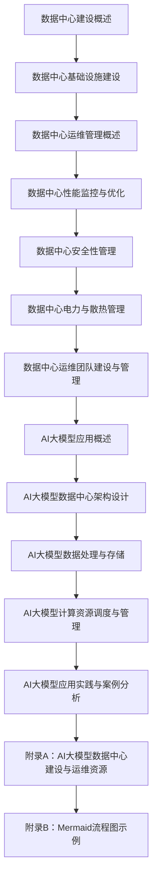

                 

### 《AI 大模型应用数据中心建设：数据中心运维与管理》

> **关键词：** AI大模型、数据中心建设、运维管理、性能优化、安全性、电力与散热管理

> **摘要：** 本文章全面探讨了AI大模型应用数据中心的建设与运维管理。从数据中心建设概述、基础设施建设、运维管理、性能监控与优化、安全性管理、电力与散热管理，到运维团队建设与管理，以及AI大模型应用实践与案例分析，全方位解析了AI大模型数据中心的建设与运维之道，为IT从业者提供了实用的指导和参考。

## 第一部分：数据中心建设概述

数据中心作为信息技术基础设施的重要组成部分，承载着海量数据存储、处理和传输的任务。随着人工智能技术的发展，特别是大模型的兴起，数据中心建设迎来了新的挑战和机遇。本部分将首先介绍数据中心的定义、分类和发展历程，然后探讨数据中心在AI应用中的重要性。

### 1.1 数据中心的定义与分类

**数据中心的定义：** 数据中心（Data Center）是指为组织机构提供数据存储、数据处理、数据交换和信息服务等功能的重要设施。它通常由计算机设备、存储设备、网络设备、制冷设备、供电设备和安全设备等组成。

**数据中心的分类：** 数据中心可以根据其规模、功能和应用场景进行分类。常见的分类方法包括：

- **按规模分类：**
  - **大型数据中心：** 具有庞大的计算和存储能力，通常为云计算服务提供商所有。
  - **中型数据中心：** 具有较高的计算和存储能力，通常为企业或政府机构所有。
  - **小型数据中心：** 计算和存储能力相对较小，通常为小型企业或个人所有。

- **按功能分类：**
  - **企业数据中心：** 主要为企业内部提供数据存储和处理服务。
  - **公有云数据中心：** 主要为公众提供云计算服务。
  - **混合云数据中心：** 结合公有云和私有云的功能，提供灵活的数据存储和处理服务。

- **按应用场景分类：**
  - **互联网数据中心：** 主要为互联网服务提供商提供服务器托管和带宽接入服务。
  - **金融数据中心：** 主要为金融机构提供数据处理和安全存储服务。
  - **政府数据中心：** 主要为政府部门提供数据存储和管理服务。

### 1.2 数据中心的发展历程

数据中心的演变历程可以分为几个阶段：

- **早期阶段：** 20世纪50年代至70年代，数据中心的雏形开始出现，主要采用主机和终端设备进行数据处理。
- **集中化阶段：** 20世纪80年代至90年代，随着计算机技术的快速发展，数据中心逐渐向集中化、大型化发展。
- **虚拟化阶段：** 21世纪初，虚拟化技术的兴起使得数据中心资源得以高效利用，资源池化和动态分配成为可能。
- **云计算阶段：** 2010年后，云计算技术成为数据中心建设的新趋势，数据中心逐渐向弹性、高效、安全方向发展。
- **AI时代：** 随着人工智能技术的发展，数据中心在AI大模型训练和应用中扮演着越来越重要的角色。

### 1.3 数据中心建设的必要性

数据中心建设对于组织机构具有以下必要性：

- **数据存储与处理能力：** 数据中心提供了强大的计算和存储能力，能够满足海量数据的存储和处理需求。
- **数据安全与可靠性：** 数据中心通过冗余设计和安全防护措施，确保了数据的安全性和可靠性。
- **业务连续性：** 数据中心能够实现数据备份和灾难恢复，保证业务连续性。
- **资源高效利用：** 数据中心通过虚拟化和自动化技术，实现了资源的优化利用和成本节约。
- **支持新业务发展：** 数据中心为新兴业务提供了计算和存储资源支持，促进了企业的创新发展。

### 1.4 数据中心在AI应用中的重要性

随着人工智能技术的快速发展，数据中心在AI应用中扮演着至关重要的角色：

- **计算资源支持：** AI大模型训练需要大量的计算资源，数据中心提供了强大的计算能力，能够支持大规模模型的训练。
- **数据存储与管理：** AI应用依赖于大量高质量的数据，数据中心提供了高效的数据存储和管理服务，确保数据的可获取性和可管理性。
- **实时数据处理：** 数据中心通过高速网络和先进的存储技术，实现了实时数据处理和响应，为AI应用提供了良好的数据支持和计算能力。
- **安全保障：** 数据中心通过完善的安全措施和防护手段，确保了AI应用的数据安全和系统安全。
- **技术创新：** 数据中心在AI应用中不断推动技术创新，为AI技术的发展和应用提供了强大的支持。

## 第二部分：数据中心基础设施建设

数据中心基础设施是数据中心正常运行的核心，包括服务器与存储设备、数据中心网络架构、物理环境建设、电源与配电系统等方面。本部分将详细探讨这些基础设施的建设和配置。

### 2.1 服务器与存储设备的选择

服务器与存储设备是数据中心基础设施的核心组成部分，其选择直接影响到数据中心的性能和可靠性。

- **服务器选择：**
  - **计算性能：** 服务器应具备强大的计算能力，能够满足高性能计算的需求。
  - **存储扩展性：** 服务器应具备良好的存储扩展性，能够支持大规模数据的存储需求。
  - **稳定性与可靠性：** 服务器应具备高可靠性，能够在长时间运行中保持稳定性能。
  - **安全性：** 服务器应具备完善的安全措施，如防火墙、入侵检测等。

- **存储设备选择：**
  - **存储容量：** 存储设备应具备足够的存储容量，能够满足数据存储的需求。
  - **读写速度：** 存储设备应具备较高的读写速度，以保证数据传输的效率。
  - **可靠性：** 存储设备应具备高可靠性，能够保证数据的完整性和安全性。
  - **可扩展性：** 存储设备应具备良好的可扩展性，能够支持存储规模的动态调整。

### 2.2 数据中心网络架构设计

数据中心网络架构是数据中心正常运行的重要保障，其设计应考虑以下几个方面：

- **网络拓扑：**
  - **双核心架构：** 采用双核心架构，提高网络的可靠性和负载均衡能力。
  - **多层架构：** 采用多层架构，实现网络分层管理和负载均衡。

- **网络设备选择：**
  - **交换机：** 选择高性能、高可靠性的交换机，支持虚拟局域网（VLAN）和多层交换（MPLS）等功能。
  - **路由器：** 选择功能强大、支持多种协议的路由器，实现不同网络之间的互联。

- **网络优化：**
  - **带宽优化：** 通过带宽优化技术，提高网络传输效率。
  - **QoS策略：** 实施服务质量（QoS）策略，确保关键业务的网络质量。

### 2.3 数据中心物理环境建设

数据中心物理环境建设是确保数据中心正常运行的基础，包括以下几个方面：

- **建筑结构：**
  - **坚固性：** 选择坚固的建筑结构，能够抵御地震、风灾等自然灾害。
  - **防震措施：** 实施防震措施，如基础加固、设备固定等，确保设备的稳定性。

- **散热系统：**
  - **散热方式：** 采用高效散热方式，如空气冷却、水冷等，确保设备运行在适宜的温度范围内。
  - **通风系统：** 设置完善的通风系统，确保数据中心内部空气流通。

- **监控系统：**
  - **环境监测：** 实施环境监测系统，实时监测温度、湿度、漏水等指标。
  - **安全监控：** 安装监控摄像头，实时监控数据中心内部情况。

### 2.4 电源与配电系统设计

电源与配电系统是数据中心稳定运行的重要保障，其设计应考虑以下几个方面：

- **电源类型：**
  - **市电电源：** 采用市电电源作为主要电源，确保数据中心的正常运行。
  - **备用电源：** 配备备用电源，如发电机、UPS（不间断电源）等，以应对市电故障。

- **配电系统：**
  - **冗余设计：** 实施冗余设计，确保电源供应的可靠性。
  - **配电方式：** 采用模块化配电方式，便于维护和扩展。

- **电力监控：**
  - **实时监控：** 实施电力监控系统，实时监测电力质量、电流、电压等指标。
  - **报警系统：** 配备报警系统，及时发现电力故障并进行处理。

## 第三部分：数据中心运维管理

数据中心运维管理是确保数据中心稳定运行和高效运行的重要环节。本部分将介绍数据中心运维管理的重要性、目标、流程与方法，以及运维管理面临的挑战和应对策略。

### 3.1 数据中心运维管理的重要性

数据中心运维管理对于数据中心的稳定运行和高效运营具有以下重要性：

- **保障业务连续性：** 通过有效的运维管理，确保数据中心能够持续、稳定地提供业务服务。
- **提高资源利用率：** 通过自动化和优化技术，提高数据中心的资源利用率，降低运营成本。
- **保障数据安全：** 通过完善的安全措施和监控手段，确保数据中心的数据安全。
- **提升服务质量：** 通过精细化的运维管理，提高数据中心的整体服务质量。
- **降低运维风险：** 通过有效的运维管理，降低数据中心发生故障和故障处理的风险。

### 3.2 数据中心运维管理的目标

数据中心运维管理的目标主要包括以下几个方面：

- **稳定性：** 确保数据中心能够稳定运行，减少故障和中断次数。
- **可靠性：** 提高数据中心的可靠性，确保数据和服务不丢失。
- **效率：** 提高运维效率和资源利用率，降低运维成本。
- **安全性：** 保障数据安全和系统安全，防止安全事件的发生。
- **可扩展性：** 确保数据中心能够灵活扩展，适应业务发展的需求。

### 3.3 数据中心运维管理的流程与方法

数据中心运维管理通常包括以下几个流程和方法：

- **需求分析：** 分析业务需求，确定数据中心的规模、性能、安全等要求。
- **规划设计：** 根据需求分析结果，进行数据中心的设计规划，包括硬件、网络、存储等。
- **采购与安装：** 根据规划设计，进行设备的采购、安装和调试。
- **配置与管理：** 对数据中心设备进行配置和管理，包括网络配置、存储配置、安全配置等。
- **监控与优化：** 通过监控工具，实时监控数据中心的运行状态，进行性能优化和故障处理。
- **维护与升级：** 定期对数据中心设备进行维护和升级，确保设备的正常运行。
- **应急预案：** 制定应急预案，确保在发生故障时能够迅速响应和处理。

### 3.4 数据中心运维管理的挑战与应对策略

数据中心运维管理面临以下挑战：

- **规模庞大：** 数据中心规模庞大，设备数量繁多，运维管理复杂。
- **动态变化：** 数据中心业务需求不断变化，运维管理需要适应动态变化。
- **安全性：** 数据中心数据安全至关重要，需要采取多种安全措施。
- **能耗管理：** 数据中心能耗高，需要采取节能措施降低运营成本。

应对策略包括：

- **自动化运维：** 通过自动化工具，实现运维任务的自动化，提高运维效率。
- **流程优化：** 优化运维流程，减少人为干预，降低运维风险。
- **监控与预警：** 建立完善的监控体系，实时监测数据中心的运行状态，及时发现和预警潜在问题。
- **安全防护：** 加强数据中心的安全防护措施，确保数据安全。
- **节能措施：** 采取节能措施，降低数据中心能耗，提高能源利用率。

## 第四部分：数据中心性能监控与优化

数据中心性能监控与优化是确保数据中心高效运行的重要环节。本部分将详细介绍数据中心性能监控指标体系、监控工具与技术、性能优化策略，以及实际案例：某大型数据中心性能优化实践。

### 4.1 性能监控指标体系

数据中心性能监控指标体系是评估数据中心运行状态和性能的基础。常见的性能监控指标包括：

- **服务器性能指标：**
  - CPU使用率：衡量CPU的利用率。
  - 内存使用率：衡量内存的利用率。
  - 硬盘使用率：衡量硬盘的利用率。
  - 网络带宽：衡量网络带宽的利用率。

- **存储性能指标：**
  - 存储容量：衡量存储设备的总容量。
  - 磁盘I/O性能：衡量存储设备的读写速度。
  - 网络I/O性能：衡量存储网络的数据传输速度。

- **网络性能指标：**
  - 网络吞吐量：衡量网络的传输速度。
  - 网络延迟：衡量数据在网络中的传输延迟。
  - 网络丢包率：衡量数据在网络中的丢失率。

- **电力与散热性能指标：**
  - 电力使用效率：衡量数据中心电力的利用效率。
  - 散热效率：衡量数据中心散热系统的效率。

### 4.2 性能监控工具与技术

数据中心性能监控工具是监控数据中心运行状态和性能的重要手段。常见的性能监控工具包括：

- **Zabbix：**一款开源的性能监控工具，支持多种监控指标和告警机制。
- **Nagios：**一款开源的性能监控工具，具有强大的监控能力和灵活的插件体系。
- **Prometheus：**一款开源的监控工具，基于时间序列数据，支持自动发现、告警等功能。
- **Grafana：**一款开源的数据可视化工具，可以与Prometheus等监控工具集成，提供直观的数据可视化界面。

性能监控技术包括：

- **SNMP（Simple Network Management Protocol）：**一种网络管理协议，用于监控网络设备的性能和状态。
- **WMI（Windows Management Instrumentation）：**一种Windows系统自带的监控工具，用于监控系统的性能和状态。
- **自定义脚本：**通过编写自定义脚本，实现针对特定监控指标的监控。

### 4.3 数据中心性能优化策略

数据中心性能优化策略包括以下几个方面：

- **硬件升级：**提高服务器的CPU、内存、硬盘等硬件配置，提升数据中心的整体性能。
- **负载均衡：**通过负载均衡技术，将业务负载分配到多台服务器，避免单点过载。
- **存储优化：**优化存储设备的配置，提高存储I/O性能，如使用SSD、RAID等技术。
- **网络优化：**优化数据中心网络架构，提高网络带宽和传输速度，如使用高速网络设备、优化路由策略等。
- **能耗管理：**优化数据中心的能耗管理，降低能耗，提高能源利用效率。

### 4.4 实际案例：某大型数据中心性能优化实践

某大型数据中心在运行过程中，发现性能存在瓶颈，需要进行优化。以下是该数据中心性能优化实践：

1. **硬件升级：**
   - 提升服务器CPU、内存、硬盘等硬件配置，提高服务器的处理能力。
   - 更换存储设备，使用SSD存储，提高存储I/O性能。

2. **负载均衡：**
   - 引入负载均衡设备，将业务流量分配到多台服务器，避免单点过载。
   - 优化负载均衡策略，根据服务器性能动态调整流量分配。

3. **存储优化：**
   - 优化存储网络架构，使用高速网络设备，提高存储网络传输速度。
   - 实施存储分层策略，将热数据和冷数据分别存储，提高存储效率。

4. **网络优化：**
   - 优化数据中心网络架构，使用多层架构，提高网络的可靠性和负载均衡能力。
   - 实施QoS策略，确保关键业务的网络质量。

5. **能耗管理：**
   - 引入能耗管理工具，实时监控数据中心能耗，优化能耗管理。
   - 采用节能技术，如空调优化、UPS高效运行等，降低能耗。

经过一系列性能优化措施，该大型数据中心性能显著提升，达到了预期的优化效果。

## 第五部分：数据中心安全性管理

数据中心安全性管理是确保数据中心运行安全、数据安全的重要环节。本部分将详细介绍数据中心安全风险分析、安全防护措施、安全事件响应，以及实际案例：数据中心安全事件应急处理。

### 5.1 数据中心安全风险分析

数据中心安全风险分析是识别和评估数据中心安全风险的过程。常见的安全风险包括：

- **网络攻击：** 包括DDoS攻击、SQL注入、XSS攻击等，可能导致数据中心服务中断、数据泄露等。
- **设备故障：** 包括服务器、存储设备、网络设备等硬件故障，可能导致数据丢失、业务中断。
- **数据泄露：** 包括敏感数据泄露、用户信息泄露等，可能导致商业损失、法律纠纷。
- **内部威胁：** 包括员工滥用权限、恶意操作等，可能导致数据泄露、系统损坏。
- **自然灾害：** 包括地震、火灾、洪水等自然灾害，可能导致数据中心损坏、数据丢失。

### 5.2 数据中心安全防护措施

数据中心安全防护措施包括以下几个方面：

- **网络安全防护：**
  - 防火墙：设置防火墙，过滤非法访问，防止网络攻击。
  - 入侵检测系统（IDS）：实时监控网络流量，检测入侵行为。
  - 虚拟专用网络（VPN）：加密网络传输，确保数据安全。
- **设备安全防护：**
  - 设备加固：加强对服务器、存储设备、网络设备等硬件的安全防护。
  - 设备监控：实时监控设备运行状态，及时发现和处理故障。
- **数据安全防护：**
  - 加密存储：对敏感数据实施加密存储，防止数据泄露。
  - 数据备份：定期进行数据备份，确保数据不丢失。
  - 访问控制：设置访问控制策略，限制用户权限，防止内部威胁。
- **安全事件响应：**
  - 安全事件监控：实时监控安全事件，及时发现和处理。
  - 应急预案：制定应急预案，确保在发生安全事件时能够迅速响应和处理。

### 5.3 数据中心安全事件响应

数据中心安全事件响应是处理安全事件的过程，包括以下几个步骤：

- **事件识别：** 及时识别安全事件，如通过监控工具发现异常流量、系统报警等。
- **事件评估：** 评估安全事件的影响范围和严重程度，决定是否启动应急预案。
- **应急处理：** 根据应急预案，迅速采取应对措施，如隔离受影响的设备、修复漏洞等。
- **事件报告：** 及时报告安全事件，包括事件原因、影响范围、处理措施等。
- **事件总结：** 对安全事件进行总结，分析原因、改进措施，预防类似事件再次发生。

### 5.4 实际案例：数据中心安全事件应急处理

某大型数据中心在一次安全事件中，发现部分服务器受到DDoS攻击，导致网络流量异常增加，部分业务受到影响。以下是该数据中心安全事件应急处理过程：

1. **事件识别：** 通过入侵检测系统（IDS）发现网络流量异常增加，疑似DDoS攻击。
2. **事件评估：** 评估事件影响范围和严重程度，决定启动应急预案。
3. **应急处理：**
   - 启用防火墙策略，阻止非法流量进入数据中心。
   - 与DDoS防御服务商合作，进行流量清洗，降低攻击流量。
   - 对受影响的服务器进行安全检查，修复潜在漏洞。
4. **事件报告：** 及时向相关部门报告安全事件，包括事件原因、影响范围、处理措施等。
5. **事件总结：** 对事件原因进行分析，改进网络安全防护措施，预防类似事件再次发生。

通过有效的安全事件应急处理，该数据中心成功应对了DDoS攻击，恢复了正常运营。

## 第六部分：数据中心电力与散热管理

数据中心电力与散热管理是确保数据中心正常运行的重要环节。本部分将详细介绍数据中心电力系统管理、散热系统设计、电力与散热系统优化策略，以及实际案例：数据中心电力与散热管理优化实践。

### 6.1 数据中心电力系统管理

数据中心电力系统管理包括以下几个方面：

- **电力供应：** 确保数据中心拥有稳定可靠的电力供应，包括市电电源和备用电源（如发电机、UPS等）。
- **电力分配：** 对电力进行合理分配，确保设备能够获得足够的电力供应，同时避免电力过载。
- **电力监控：** 通过电力监控系统，实时监控电力质量、电流、电压等指标，及时发现和处理电力故障。
- **电力节能：** 采取节能措施，降低数据中心电力消耗，提高能源利用效率。

### 6.2 数据中心散热系统设计

数据中心散热系统设计是确保设备运行在适宜温度范围内的关键。散热系统设计包括以下几个方面：

- **散热方式：** 选择合适的散热方式，如空气冷却、水冷等。空气冷却适用于小型数据中心，水冷适用于大型数据中心。
- **冷却系统：** 设计完善的冷却系统，包括冷却塔、水泵、冷却管道等，确保冷却系统的稳定运行。
- **通风系统：** 设计良好的通风系统，确保数据中心内部空气流通，降低温度。
- **温度监控：** 通过温度监控系统，实时监控设备温度和数据中心温度，及时发现和处理过热问题。

### 6.3 电力与散热系统优化策略

数据中心电力与散热系统优化策略包括以下几个方面：

- **设备选型：** 选择高效、节能的设备，降低电力消耗和散热需求。
- **能源管理：** 引入智能能源管理系统，实时监控电力和散热系统的运行状态，优化能源使用。
- **冷却优化：** 采用先进的冷却技术，如冷热通道分离、热管技术等，提高冷却效率。
- **机房布局：** 合理规划机房布局，减少设备散热障碍，提高散热效率。
- **维护保养：** 定期对电力和散热系统进行维护保养，确保系统稳定运行。

### 6.4 实际案例：数据中心电力与散热管理优化实践

某大型数据中心在运行过程中，发现电力消耗较高，散热效率较低，需要进行优化。以下是该数据中心电力与散热管理优化实践：

1. **设备选型：**
   - 更换高效节能的服务器和存储设备，降低电力消耗。
   - 引入高性能的制冷设备，提高冷却效率。

2. **能源管理：**
   - 引入智能能源管理系统，实时监控电力和散热系统的运行状态，优化能源使用。
   - 实施电力需求侧管理，根据负载变化调整电力供应。

3. **冷却优化：**
   - 采用冷热通道分离技术，减少设备散热障碍，提高散热效率。
   - 引入热管技术，将热量迅速转移到冷却系统，提高冷却效率。

4. **机房布局：**
   - 合理规划机房布局，减少设备散热障碍，提高散热效率。
   - 实施地板送风技术，提高空气流通，降低温度。

5. **维护保养：**
   - 定期对电力和散热系统进行维护保养，确保系统稳定运行。
   - 及时清理散热设备中的灰尘和污垢，提高散热效率。

通过一系列优化措施，该大型数据中心实现了电力消耗的降低和散热效率的提高，达到了预期的优化效果。

## 第七部分：数据中心运维团队建设与管理

数据中心运维团队是确保数据中心稳定运行和高效管理的关键。本部分将详细介绍数据中心运维团队角色与职责、组织架构、绩效评估，以及运维团队培养与发展。

### 7.1 数据中心运维团队角色与职责

数据中心运维团队通常包括以下角色和职责：

- **运维经理：** 负责整体运维工作的规划和执行，协调各部门的工作，确保数据中心的稳定运行。
- **网络管理员：** 负责数据中心的网络维护和管理，包括网络架构设计、网络设备配置、网络安全等。
- **服务器管理员：** 负责服务器的维护和管理，包括服务器安装、配置、监控、故障处理等。
- **存储管理员：** 负责存储设备的维护和管理，包括存储架构设计、存储设备配置、数据备份等。
- **安全管理员：** 负责数据中心的网络安全管理，包括安全策略制定、安全设备配置、安全事件响应等。
- **运维工程师：** 负责具体的运维工作，包括系统监控、性能优化、故障处理等。

### 7.2 数据中心运维团队组织架构

数据中心运维团队组织架构通常包括以下层次：

- **运维部门：** 运维部门是数据中心运维的核心组织，负责整体运维工作的规划和执行。
- **团队：** 运维团队按照职能分工，包括网络、服务器、存储、安全等小组，负责具体运维工作。
- **个人：** 运维人员按照角色分工，负责特定领域的运维工作。

### 7.3 数据中心运维团队绩效评估

数据中心运维团队绩效评估是评估运维团队工作质量和效率的重要手段。绩效评估通常包括以下几个方面：

- **工作质量：** 评估运维工作的完成情况，包括任务完成率、故障处理速度等。
- **工作效率：** 评估运维工作的效率，包括工作效率、资源利用率等。
- **团队合作：** 评估团队成员之间的协作情况，包括沟通效率、团队合作精神等。
- **个人能力：** 评估团队成员的个人能力，包括技术能力、学习进步等。

### 7.4 数据中心运维团队培养与发展

数据中心运维团队的培养与发展是提高运维团队整体素质和竞争力的关键。培养与发展措施包括：

- **技术培训：** 定期为运维团队提供技术培训，提高团队成员的技术能力和专业水平。
- **知识共享：** 建立知识共享平台，促进团队成员之间的经验交流和学习。
- **人才选拔：** 建立人才选拔机制，选拔优秀人才担任重要岗位，提升团队整体素质。
- **激励机制：** 建立激励机制，鼓励团队成员积极参与工作、提高工作效率。
- **职业规划：** 为运维团队成员制定职业规划，提供职业发展通道，激发团队成员的工作热情。

通过有效的培养与发展措施，数据中心运维团队能够不断提升自身素质，为数据中心的稳定运行和高效管理提供有力支持。

## 第八部分：AI 大模型应用概述

随着人工智能技术的快速发展，AI大模型在各个领域得到了广泛应用，成为推动技术创新和产业变革的重要力量。本部分将介绍AI大模型的发展与应用趋势，数据中心在AI大模型应用中的关键角色，以及AI大模型应用的技术挑战与解决方案。

### 8.1 AI 大模型的发展与应用趋势

AI大模型是指具备强大计算能力和海量数据处理能力的人工智能模型，能够实现高度复杂的任务。AI大模型的发展经历了以下几个阶段：

- **早期阶段：** 以浅层神经网络为主，如感知机、反向传播算法等，主要用于简单的模式识别和分类任务。
- **快速发展阶段：** 深度学习技术的出现，使得神经网络层数增加，模型复杂度提高，AI大模型的应用领域逐渐扩大，如图像识别、语音识别、自然语言处理等。
- **大规模应用阶段：** 随着计算资源和数据资源的不断丰富，AI大模型开始应用于更复杂的领域，如自动驾驶、智能医疗、金融科技等。

AI大模型的应用趋势体现在以下几个方面：

- **应用领域广泛：** AI大模型在各个领域都得到了广泛应用，成为推动技术创新和产业变革的重要力量。
- **计算需求巨大：** AI大模型训练和推理过程需要大量的计算资源，对数据中心提出了更高的要求。
- **数据依赖性强：** AI大模型对数据质量、数据量和数据多样性有较高要求，数据中心在数据存储和管理方面发挥着关键作用。

### 8.2 数据中心在 AI 大模型应用中的关键角色

数据中心在AI大模型应用中扮演着关键角色，主要体现在以下几个方面：

- **计算资源提供：** 数据中心提供了强大的计算资源，能够支持AI大模型的训练和推理过程，提高模型性能。
- **数据存储与管理：** 数据中心提供了高效的数据存储和管理服务，确保AI大模型训练所需的海量数据能够快速访问和处理。
- **稳定性保障：** 数据中心通过冗余设计和高效运维管理，保障了AI大模型训练和推理过程的稳定性，避免了因硬件故障或运维失误导致的模型训练中断。
- **安全性保障：** 数据中心通过完善的安全措施和防护手段，确保了AI大模型训练和推理过程中数据的安全性和系统安全。

### 8.3 AI 大模型应用的技术挑战与解决方案

AI大模型应用面临以下技术挑战：

- **计算资源需求大：** AI大模型训练和推理过程需要大量的计算资源，对数据中心的计算能力和存储容量提出了高要求。
- **数据存储与管理复杂：** AI大模型训练需要处理海量数据，数据存储和管理复杂，需要高效的存储技术和数据管理策略。
- **能耗问题：** 数据中心在支持AI大模型训练和推理过程中，能耗问题日益突出，需要采取节能措施降低能耗。
- **安全性问题：** AI大模型应用过程中涉及大量敏感数据，需要采取严格的安全措施，防止数据泄露和系统攻击。

解决方案包括：

- **提升计算能力：** 引入高性能计算设备，如GPU、TPU等，提高数据中心的计算能力。
- **优化数据存储与管理：** 采用分布式存储技术，提高数据存储和管理的效率，如Hadoop、Spark等。
- **节能措施：** 采用节能技术，如冷热通道分离、热管技术等，降低数据中心能耗。
- **安全防护措施：** 建立完善的安全防护体系，采取加密、防火墙、入侵检测等技术，确保数据安全和系统安全。

通过解决这些技术挑战，数据中心能够更好地支持AI大模型应用，推动人工智能技术的发展。

## 第九部分：AI 大模型数据中心架构设计

AI大模型数据中心架构设计是确保AI大模型高效训练和推理的关键。本部分将详细介绍AI大模型数据中心架构设计原则、硬件选型、网络架构设计和存储架构设计。

### 9.1 AI 大模型数据中心架构设计原则

AI大模型数据中心架构设计应遵循以下原则：

- **高可用性：** 确保数据中心能够持续稳定运行，避免因硬件故障或运维失误导致的模型训练中断。
- **高性能：** 提供强大的计算能力和存储能力，支持大规模模型的训练和推理。
- **可扩展性：** 确保数据中心能够灵活扩展，适应业务发展的需求。
- **安全性：** 保障数据安全和系统安全，防止数据泄露和系统攻击。
- **节能性：** 降低数据中心的能耗，提高能源利用效率。

### 9.2 AI 大模型数据中心硬件选型

AI大模型数据中心硬件选型主要包括以下几个方面：

- **服务器：** 选择高性能的服务器，如搭载GPU、TPU等加速卡的服务器，提高计算能力。
- **存储设备：** 选择高效的存储设备，如SSD、分布式存储系统等，提高数据存储和读取速度。
- **网络设备：** 选择高性能的网络设备，如交换机、路由器等，确保网络传输速度和稳定性。
- **冷却设备：** 选择高效的冷却设备，如空调、冷水机组等，确保设备运行在适宜的温度范围内。

### 9.3 AI 大模型数据中心网络架构设计

AI大模型数据中心网络架构设计应考虑以下几个方面：

- **双核心架构：** 采用双核心架构，提高网络的可靠性和负载均衡能力。
- **多层架构：** 采用多层架构，实现网络分层管理和负载均衡。
- **高带宽网络：** 设计高带宽网络，满足大规模数据传输需求。
- **冗余设计：** 实施网络冗余设计，确保网络的高可用性和稳定性。

### 9.4 AI 大模型数据中心存储架构设计

AI大模型数据中心存储架构设计应考虑以下几个方面：

- **分布式存储：** 采用分布式存储技术，提高数据存储和读取速度，确保数据的高可用性。
- **数据分层存储：** 根据数据的重要性和访问频率，将数据分层存储，提高数据存储效率。
- **数据备份与容灾：** 设计数据备份和容灾方案，确保数据的安全性和可靠性。
- **智能数据管理：** 采用智能数据管理技术，实现数据的高效管理和优化。

通过遵循这些架构设计原则和硬件选型策略，AI大模型数据中心能够提供高效、稳定、安全的训练和推理环境，支持大规模模型的训练和应用。

## 第十部分：AI 大模型数据处理与存储

在AI大模型的应用中，数据处理与存储是至关重要的环节。本部分将详细介绍AI大模型数据处理流程、大规模数据处理技术、数据存储策略与优化，以及实际案例：AI大模型数据中心数据处理与存储优化实践。

### 10.1 AI 大模型数据处理流程

AI大模型数据处理流程包括以下几个主要步骤：

- **数据采集：** 从各种数据源（如传感器、数据库、网络接口等）采集数据。
- **数据预处理：** 清洗、转换和规范化数据，确保数据质量。
- **数据增强：** 对数据集进行扩展和增强，提高模型的泛化能力。
- **数据存储：** 将处理后的数据存储到数据库或分布式文件系统中。
- **模型训练：** 使用处理后的数据训练AI大模型，优化模型参数。
- **模型评估：** 对训练好的模型进行评估，验证其性能和准确性。
- **模型部署：** 将经过评估的模型部署到生产环境中，进行实际应用。

### 10.2 大规模数据处理技术

在AI大模型训练过程中，处理大规模数据是技术挑战之一。以下是一些常用的技术：

- **分布式计算：** 利用分布式计算框架（如Hadoop、Spark等），将数据处理任务分布在多台计算机上进行并行处理，提高数据处理效率。
- **批处理：** 将数据处理任务划分为多个批次，依次处理，适用于处理大量数据的情况。
- **流处理：** 对实时数据流进行处理，适用于需要实时分析的场景。
- **图计算：** 利用图计算框架（如GraphX、Neo4j等），处理复杂的数据关系和图结构。

### 10.3 数据存储策略与优化

数据存储策略与优化对于AI大模型训练至关重要。以下是一些关键策略：

- **分布式存储：** 采用分布式存储系统（如HDFS、Cassandra等），提高数据存储和读取速度，确保数据的高可用性。
- **数据分层存储：** 根据数据的重要性和访问频率，将数据分层存储，将热数据存储在SSD上，冷数据存储在HDD上。
- **数据压缩：** 采用数据压缩技术，降低数据存储空间需求，提高存储效率。
- **数据备份与容灾：** 设计数据备份和容灾方案，确保数据的安全性和可靠性。
- **智能数据管理：** 采用智能数据管理技术，实现数据的高效管理和优化，如数据索引、数据分片等。

### 10.4 实际案例：AI 大模型数据中心数据处理与存储优化实践

以下是一个实际案例，展示如何优化AI大模型数据中心的数据处理与存储：

某大型数据中心在训练一个大型自然语言处理模型时，面临着数据量大、处理速度快、存储需求高的挑战。为了优化数据处理与存储，数据中心采取了以下措施：

1. **分布式计算：** 引入Spark分布式计算框架，将数据处理任务分布在多台服务器上进行并行处理，提高数据处理效率。
2. **批处理与流处理：** 结合批处理和流处理技术，实现数据的高效处理。对于实时性要求较高的数据，采用流处理技术；对于历史数据，采用批处理技术。
3. **分布式存储：** 采用HDFS分布式文件系统，将处理后的数据存储在分布式存储系统中，提高数据存储和读取速度。
4. **数据分层存储：** 将热数据存储在SSD上，冷数据存储在HDD上，根据数据的重要性和访问频率进行分层存储，提高存储效率。
5. **数据压缩与备份：** 采用数据压缩技术，降低数据存储空间需求，并设计数据备份方案，确保数据的安全性和可靠性。
6. **智能数据管理：** 引入智能数据管理技术，如数据索引、数据分片等，实现数据的高效管理和优化。

通过以上优化措施，该大型数据中心成功提高了数据处理与存储的效率，支持了大规模AI大模型的训练和应用。

## 第十一部分：AI 大模型计算资源调度与管理

在AI大模型训练和应用中，计算资源的调度与管理是关键环节。本部分将详细介绍AI大模型计算资源调度策略、计算资源管理工具与技术、资源调度系统设计与实现，以及实际案例：AI大模型数据中心计算资源调度优化实践。

### 11.1 AI 大模型计算资源调度策略

AI大模型计算资源调度策略旨在优化计算资源的分配和利用，提高模型训练和推理的效率。以下是一些常见的计算资源调度策略：

- **负载均衡：** 根据计算任务的负载情况，动态地将任务分配到不同计算节点上，确保计算资源充分利用。
- **优先级调度：** 根据任务的优先级，优先调度优先级高的任务，确保关键任务的及时完成。
- **动态资源分配：** 根据任务的执行情况和资源状态，动态调整资源的分配，提高资源利用率。
- **资源预留：** 在高峰期预留部分计算资源，以应对突发任务的需求，确保系统的稳定运行。
- **资源回收：** 在任务完成后，及时回收释放的计算资源，为后续任务提供更多可用资源。

### 11.2 计算资源管理工具与技术

计算资源管理工具和技术是调度与管理计算资源的重要手段。以下是一些常见的工具和技术：

- **资源监控工具：** 监控计算节点的资源使用情况，包括CPU使用率、内存使用率、网络带宽等。
- **调度器：** 负责计算任务的调度和资源分配，如Hadoop的YARN、Kubernetes等。
- **虚拟化技术：** 通过虚拟化技术，将物理资源虚拟化为多个虚拟资源，实现资源的灵活调度和动态分配。
- **容器化技术：** 通过容器化技术，如Docker和Kubernetes，实现计算任务的轻量级部署和快速调度。
- **资源隔离技术：** 通过资源隔离技术，确保不同任务之间不会相互干扰，提高系统的稳定性和安全性。

### 11.3 资源调度系统设计与实现

资源调度系统的设计与实现包括以下几个关键部分：

- **资源监控模块：** 负责实时监控计算节点的资源使用情况，包括CPU使用率、内存使用率、网络带宽等。
- **调度策略模块：** 根据调度策略，决定如何分配计算资源，包括负载均衡、优先级调度、动态资源分配等。
- **任务调度模块：** 负责调度计算任务，将任务分配到合适的计算节点上，确保任务的及时完成。
- **资源分配模块：** 负责根据调度策略和任务需求，动态分配计算资源，包括CPU、内存、网络等。
- **资源回收模块：** 在任务完成后，及时回收释放的计算资源，为后续任务提供更多可用资源。

### 11.4 实际案例：AI 大模型数据中心计算资源调度优化实践

以下是一个实际案例，展示如何优化AI大模型数据中心计算资源调度：

某大型数据中心在训练一个大型图像识别模型时，面临着计算资源紧张、任务调度效率低的问题。为了优化计算资源调度，数据中心采取了以下措施：

1. **引入调度器：** 引入Kubernetes作为调度器，实现计算任务的自动化调度和资源分配。
2. **动态资源分配：** 采用动态资源分配策略，根据计算节点的资源使用情况，动态调整任务分配，确保计算资源充分利用。
3. **优先级调度：** 根据任务的优先级，优先调度优先级高的任务，确保关键任务的及时完成。
4. **负载均衡：** 采用负载均衡策略，将任务分配到负载较低的节点，避免单点过载。
5. **资源预留与回收：** 在高峰期预留部分计算资源，以应对突发任务的需求；在任务完成后，及时回收释放的计算资源。

通过以上优化措施，该大型数据中心成功提高了计算资源的利用效率，缩短了任务完成时间，提升了整体调度效率。

## 第十二部分：AI 大模型应用实践与案例分析

AI大模型在各个领域有着广泛的应用，为行业带来了巨大的变革和创新。本部分将介绍AI大模型的应用场景分析、实际案例：某企业AI大模型应用实践、案例分析：AI大模型数据中心建设与运维优化，以及AI大模型数据中心建设与运维的未来展望。

### 12.1 AI 大模型应用场景分析

AI大模型在以下领域具有广泛的应用场景：

- **金融领域：** 风险管理、信用评估、欺诈检测、投资策略等。
- **医疗领域：** 疾病预测、诊断辅助、药物研发、医学图像分析等。
- **零售领域：** 客户行为分析、个性化推荐、库存管理、供应链优化等。
- **制造业：** 生产优化、设备维护、质量检测、智能工厂等。
- **交通领域：** 交通运输规划、智能交通管理、自动驾驶等。
- **能源领域：** 能源需求预测、能源调度、可再生能源管理、节能优化等。

### 12.2 实际案例：某企业AI大模型应用实践

以下是一个实际案例，展示某企业在金融领域应用AI大模型的具体实践：

**案例背景：** 某知名银行希望利用AI大模型提升信用评估能力，提高贷款审批效率。

**解决方案：**
1. **数据采集：** 收集大量客户数据，包括财务数据、信用记录、社会关系等。
2. **数据预处理：** 清洗、转换和规范化数据，确保数据质量。
3. **模型训练：** 利用训练集，训练一个大型深度学习模型，如循环神经网络（RNN）或卷积神经网络（CNN），用于信用评估。
4. **模型评估：** 对模型进行评估，验证其性能和准确性。
5. **模型部署：** 将训练好的模型部署到生产环境中，实现自动化信用评估。
6. **实际应用：** 通过AI大模型，银行能够快速、准确地对客户信用进行评估，提高贷款审批效率。

### 12.3 案例分析：AI 大模型数据中心建设与运维优化

以下是一个案例分析，展示如何优化AI大模型数据中心的建设与运维：

**案例分析背景：** 某互联网公司在其数据中心部署了一个大型AI模型用于用户行为预测，但发现数据中心资源利用率低、性能不稳定。

**优化措施：**
1. **资源调度优化：** 引入Kubernetes作为资源调度器，实现自动化资源分配和调度，提高资源利用率。
2. **存储优化：** 采用分布式存储系统，提高数据存储和读取速度，确保模型训练所需的数据能够快速访问。
3. **计算优化：** 引入GPU加速卡，提高计算能力，加快模型训练速度。
4. **能耗管理：** 引入能耗管理系统，实时监控数据中心能耗，优化能耗管理，降低运营成本。
5. **运维团队优化：** 加强运维团队培训，提高运维人员的技术能力和应急处理能力。

通过以上优化措施，该互联网公司成功提升了数据中心资源利用率、性能稳定性，降低了运营成本。

### 12.4 AI 大模型数据中心建设与运维的未来展望

随着AI技术的不断发展和数据中心的不断创新，AI大模型数据中心建设与运维的未来展望如下：

- **智能化运维：** 利用人工智能技术，实现数据中心的智能化运维，提高运维效率和自动化水平。
- **边缘计算与中心计算结合：** 结合边缘计算和中心计算，实现计算资源的优化分配，提高整体计算效率。
- **可持续性发展：** 关注数据中心的能源消耗和环境影响，推动绿色数据中心建设，实现可持续性发展。
- **安全性与隐私保护：** 加强数据安全和隐私保护，建立完善的安全防护体系，确保AI大模型数据中心的安全运行。
- **创新与应用拓展：** 持续推动AI大模型技术在各个领域的创新和应用拓展，为行业带来更多的变革和机遇。

总之，AI大模型数据中心建设与运维面临着诸多挑战和机遇，未来将不断发展壮大，成为推动人工智能技术发展的重要基础设施。

## 附录A：AI 大模型数据中心建设与运维资源

为了帮助读者更好地理解和实践AI大模型数据中心建设与运维，以下列举了一些常用工具、软件、开源框架和平台，以及相关的书籍和文献资源：

### A.1 常用工具与软件介绍

- **Zabbix：** 一款开源的性能监控工具，支持多种监控指标和告警机制。
- **Nagios：** 一款开源的性能监控工具，具有强大的监控能力和灵活的插件体系。
- **Prometheus：** 一款开源的监控工具，基于时间序列数据，支持自动发现、告警等功能。
- **Grafana：** 一款开源的数据可视化工具，可以与Prometheus等监控工具集成，提供直观的数据可视化界面。
- **Kubernetes：** 一款开源的容器编排工具，用于自动化部署、扩展和管理容器化应用。
- **Docker：** 一款开源的应用容器引擎，用于打包、交付和运行应用。
- **HDFS：** Hadoop分布式文件系统，用于大数据存储和处理。
- **Spark：** 一款开源的分布式计算框架，用于大规模数据处理。

### A.2 开源框架与平台推荐

- **TensorFlow：** Google开源的深度学习框架，广泛应用于AI大模型训练。
- **PyTorch：** Facebook开源的深度学习框架，具有灵活的动态计算图功能。
- **Keras：** 高级神经网络API，可以与TensorFlow和Theano等框架结合使用。
- **Apache MXNet：** Apache基金会开源的深度学习框架，支持多种编程语言和平台。
- **Hadoop：** Apache基金会开源的大数据处理框架，支持海量数据的存储和处理。
- **Cassandra：** Apache基金会开源的分布式NoSQL数据库，用于大规模数据存储。

### A.3 数据集与模型资源获取

- **Kaggle：** Kaggle是一个数据科学竞赛平台，提供大量数据集和比赛项目。
- **UCI Machine Learning Repository：** 提供大量公开的数据集，适用于各种机器学习任务。
- **Google Dataset Search：** Google提供的一个数据集搜索引擎，搜索和发现各种领域的公开数据集。
- **GitHub：** GitHub上有很多开源的AI项目，包括预训练模型和数据集。

### A.4 相关书籍与文献推荐

- **《深度学习》：** Goodfellow、Bengio和Courville著，深入介绍了深度学习的基本概念和技术。
- **《Python机器学习》：** Müller和Guido著，涵盖了Python在机器学习中的应用和实践。
- **《大数据技术导论》：** 李航著，系统介绍了大数据技术的基本概念和关键技术。
- **《分布式系统概念与设计》：** George Coulouris、Jean Dollimore、Tim Kindberg和Goran Pass引用，介绍了分布式系统的基本概念和设计方法。
- **《数据中心基础设施管理》：** R. Robert Russell、Christopher Steffen和Peter A. Binkley著，详细介绍了数据中心基础设施管理的各个方面。

通过使用这些资源和工具，读者可以更好地了解和掌握AI大模型数据中心建设与运维的实践方法，为实际应用提供有力支持。

## 附录B：Mermaid 流程图示例

以下是使用Mermaid绘制的AI大模型数据中心建设与运维的流程图：

这个流程图展示了AI大模型数据中心建设与运维的主要环节和它们之间的关联，有助于读者更好地理解和掌握整个流程。通过这种方式，读者可以更清晰地了解每个部分的内容和作用，从而更好地应用到实际工作中。

