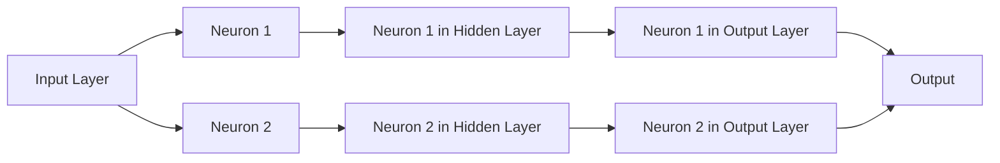
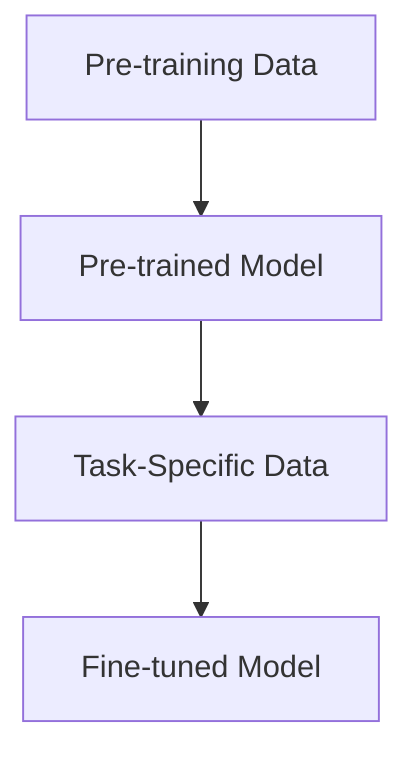
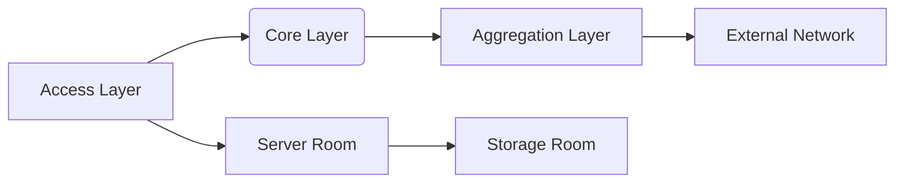
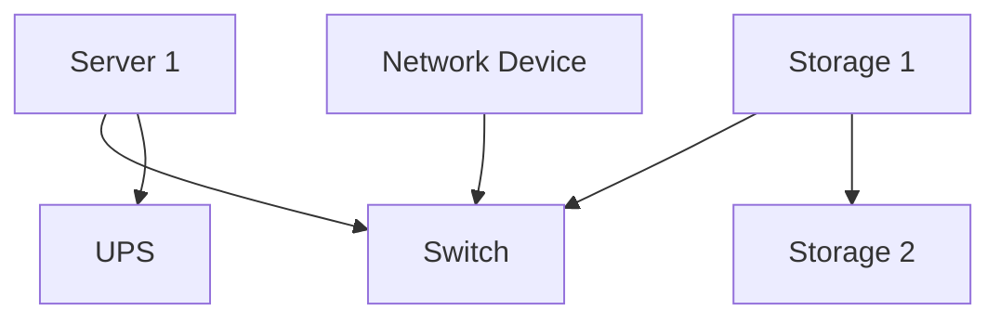

                 

# 《AI大模型应用数据中心建设：数据中心运营与管理》

## 引言

随着人工智能（AI）技术的飞速发展，AI大模型已经成为推动各个行业变革的重要力量。从自然语言处理、计算机视觉到推荐系统，AI大模型的应用场景无处不在。而数据中心作为AI大模型训练和部署的核心基础设施，其建设与运营管理的优劣直接影响着AI大模型的应用效果和业务效益。因此，深入探讨AI大模型应用数据中心的建设与运营管理，对于提升数据中心整体性能和效率具有重要意义。

本文将围绕以下核心关键词展开讨论：“AI大模型”、“数据中心建设”、“数据中心运营管理”、“能耗管理”和“安全管理”。文章将从AI大模型基础与应用、数据中心基础、AI大模型应用场景、数据中心运营策略、数据中心安全管理、数据中心能耗管理、数据中心运维自动化与智能化以及案例分析与最佳实践等方面，系统性地阐述AI大模型应用数据中心的建设与运营管理。

## 摘要

本文旨在探讨AI大模型应用数据中心的建设与运营管理。首先，我们将介绍AI大模型的基本概念、分类及其核心技术。随后，我们将阐述数据中心的基础设施和结构，并分析AI大模型在数据中心中的应用场景。在此基础上，本文将深入探讨数据中心运营策略、安全管理、能耗管理和运维自动化与智能化，通过具体案例和最佳实践分享，为数据中心建设者和运营者提供有价值的参考。最终，本文将对未来数据中心运维发展趋势进行展望，为AI大模型应用数据中心的建设与运营管理提供新的思路。

## 第一部分：AI大模型基础与应用

### 第1章：AI大模型概述

#### 1.1 AI大模型的概念与分类

AI大模型（Large-scale AI Models）是指具有海量参数和广泛适用性的深度学习模型，能够在多个领域实现卓越的性能。AI大模型通常基于神经网络架构，通过大规模数据预训练和迁移学习，实现高层次的抽象和泛化能力。根据应用领域和功能特点，AI大模型可以大致分为以下几类：

1. **自然语言处理（NLP）大模型**：如GPT-3、BERT等，主要用于文本生成、语义理解、机器翻译等任务。

2. **计算机视觉（CV）大模型**：如ResNet、EfficientNet等，广泛应用于图像分类、目标检测、人脸识别等领域。

3. **推荐系统大模型**：如深度学习推荐模型，能够有效提高推荐系统的准确性和用户满意度。

4. **音频处理大模型**：如WaveNet、Tacotron等，用于语音合成、语音识别、音乐生成等领域。

#### 1.2 AI大模型的核心技术

AI大模型的核心技术包括深度学习基础和大规模预训练模型。

##### 1.2.1 深度学习基础

深度学习（Deep Learning）是AI大模型的基础，通过多层神经网络对数据进行分析和建模。其关键组成部分包括：

1. **神经网络原理**：神经网络由多个神经元（节点）组成，通过层层传递和激活函数，实现数据的特征提取和分类。

2. **深度学习框架**：如TensorFlow、PyTorch等，提供了丰富的API和工具，简化了深度学习模型的开发、训练和部署过程。

##### 1.2.2 大规模预训练模型

大规模预训练模型（Pre-trained Models）通过在大量数据上进行预训练，实现模型的高层次抽象和泛化能力。其核心技术包括：

1. **预训练概念**：预训练是指在大规模数据集上训练模型，使其具备初步的语义理解能力。

2. **迁移学习**：迁移学习（Transfer Learning）是将预训练模型应用于新任务，通过少量数据进一步微调，提高模型在新任务上的性能。

#### 1.3 AI大模型的发展历程

AI大模型的发展历程可以追溯到20世纪80年代的神经网络研究。从早期的简单神经网络（如感知机、BP网络）到后来的深度神经网络（如CNN、RNN），再到如今的大规模预训练模型（如GPT-3、BERT），AI大模型在技术、应用和性能上不断取得突破。

随着计算能力的提升、大数据的普及和深度学习技术的成熟，AI大模型的应用范围越来越广泛，从学术界到工业界，从理论研究到实际应用，都取得了显著的成果。未来，AI大模型将继续在计算机视觉、自然语言处理、推荐系统等领域发挥重要作用，推动人工智能技术的进一步发展。

### 第2章：数据中心基础

#### 2.1 数据中心概述

数据中心（Data Center）是指用于存储、处理、传输和管理数据的建筑设施。数据中心在现代信息社会中扮演着至关重要的角色，是互联网、云计算和大数据的核心支撑。一个典型的数据中心通常包括以下几个关键组成部分：

1. **服务器房**：用于部署服务器和存储设备，是数据中心的核心区域。

2. **网络设备**：包括交换机、路由器、防火墙等，用于实现数据的传输和安全管理。

3. **存储设备**：用于存储大量数据，包括磁盘阵列、固态硬盘等。

4. **电源设备**：包括不间断电源（UPS）、电池组等，用于保障数据中心的电力供应。

5. **冷却设备**：包括空调、制冷设备等，用于维持数据中心的适宜温度和湿度。

#### 2.2 数据中心基础设施

数据中心的基础设施是实现高效、可靠数据存储和处理的关键。以下分别介绍数据中心的主要硬件设施和网络设施：

##### 2.2.1 硬件设施

1. **服务器**：服务器是数据中心的核心设备，用于运行应用程序、存储数据和处理任务。根据性能和应用场景，服务器可以分为以下几类：

   - **高性能计算（HPC）服务器**：用于处理大规模科学计算和复杂任务。
   - **企业级服务器**：用于企业内部的应用部署和管理。
   - **云计算服务器**：用于云计算平台，提供计算资源和服务。

2. **存储**：存储设备用于存储大量数据，包括以下几种类型：

   - **磁盘阵列**：通过多个磁盘组合，提高数据存储的容量和可靠性。
   - **固态硬盘（SSD）**：具有更快的读写速度，适合存储热数据和日志数据。
   - **分布式存储**：通过分布式架构实现海量数据的存储和管理。

##### 2.2.2 网络设施

1. **网络架构**：数据中心的网络架构分为以下几层：

   - **接入层**：连接终端设备（如服务器、工作站）和核心网络。
   - **核心层**：实现不同接入层之间的数据交换和路由。
   - **汇聚层**：将接入层的数据流量汇聚到核心层，并进行策略控制。

2. **网络设备**：网络设备是实现数据中心网络通信的关键，包括以下几种类型：

   - **交换机**：用于实现数据流量的转发和交换。
   - **路由器**：用于实现不同网络之间的数据传输和路由。
   - **防火墙**：用于保护数据中心的安全，防止恶意攻击和入侵。

#### 2.3 数据中心的分类与结构

数据中心可以根据应用场景、规模和性能要求进行分类。以下介绍几种常见的数据中心类型及其结构：

1. **企业级数据中心**：为大型企业或组织提供高性能、高可靠的计算和存储资源。企业级数据中心通常分为以下几个区域：

   - **核心区域**：用于部署关键业务系统和数据。
   - **边缘区域**：用于部署非关键业务系统和数据。
   - **备用区域**：用于备份关键数据和系统。

2. **云计算数据中心**：为云服务提供商提供计算、存储和网络资源，供用户按需使用。云计算数据中心通常具有以下几个特点：

   - **弹性扩展**：可根据用户需求动态调整计算和存储资源。
   - **高可用性**：通过冗余设计和负载均衡，确保服务的高可用性。
   - **安全性**：采用严格的安全措施，保障用户数据的安全和隐私。

3. **边缘数据中心**：位于网络边缘，用于处理本地数据和提供本地化服务。边缘数据中心通常具有以下几个特点：

   - **低延迟**：靠近用户，降低数据传输延迟。
   - **高带宽**：提供高带宽的接入，满足大量数据的传输需求。
   - **灵活性**：支持多种业务场景和应用。

总之，数据中心作为现代信息社会的基础设施，其建设和运营管理对于保障数据的安全、可靠和高效传输具有重要意义。通过深入了解数据中心的分类和结构，可以为数据中心的建设和运营提供科学指导和有力支持。

### 第3章：AI大模型应用场景

#### 3.1 AI大模型在数据中心的应用

AI大模型在数据中心的应用涵盖了从智能运维、资源调度与优化到能耗管理等多个方面，显著提升了数据中心的整体性能和效率。

##### 3.1.1 智能运维

智能运维是指通过AI大模型对数据中心的各种运行数据进行实时监测和分析，以实现自动化管理和优化。以下是AI大模型在智能运维中的具体应用：

1. **数据分析**：AI大模型可以分析服务器、存储设备、网络设备等的运行数据，识别潜在的故障和性能瓶颈，提前预警，防止故障发生。

2. **预测维护**：基于历史数据和实时监控，AI大模型可以预测设备的使用寿命和故障风险，从而实现预维护，减少设备故障率和停机时间。

3. **性能优化**：通过分析系统运行数据，AI大模型可以优化数据中心的资源配置，提高整体性能。例如，根据服务器负载情况动态调整虚拟机部署和资源分配，实现资源利用率的最大化。

##### 3.1.2 资源调度与优化

资源调度与优化是数据中心运营中的重要环节，AI大模型在这方面具有显著优势：

1. **虚拟机调度**：通过分析服务器负载、内存使用率、网络带宽等数据，AI大模型可以智能调度虚拟机，实现负载均衡，提高资源利用率。

2. **存储资源优化**：AI大模型可以分析数据访问模式和存储资源使用情况，动态调整存储策略，优化存储资源分配，提高数据存取速度。

3. **网络资源优化**：通过分析网络流量、带宽利用率和传输延迟等数据，AI大模型可以智能调整网络拓扑和流量分配策略，提高网络传输效率和稳定性。

##### 3.1.3 数据中心能耗管理

数据中心能耗管理是数据中心运营中的一个重要问题，AI大模型在能耗管理中发挥着关键作用：

1. **能耗监测**：AI大模型可以实时监测数据中心的能耗数据，包括服务器、存储设备、空调等能耗情况，识别能源浪费的环节。

2. **节能策略**：基于能耗监测数据，AI大模型可以制定和实施节能策略，如智能调度设备运行时间、优化制冷系统等，降低能耗。

3. **需求预测**：通过分析历史能耗数据，AI大模型可以预测未来能耗需求，为数据中心建设和设备选型提供参考，实现能耗的提前控制和优化。

总之，AI大模型在数据中心中的应用，不仅提升了数据中心的管理效率和运行性能，还为能耗管理和资源优化提供了有力支持。随着AI技术的不断进步，AI大模型在数据中心领域的应用前景将更加广阔。

#### 3.2 数据中心管理挑战与AI大模型应对策略

数据中心管理面临着诸多挑战，其中包括能耗管理、系统安全与监控等方面。AI大模型在应对这些挑战中展现出显著的优势和潜力。

##### 3.2.1 数据中心能耗管理

1. **能耗问题分析**

数据中心能耗问题主要包括以下几个方面：

- **设备能耗**：服务器、存储设备和网络设备等硬件设施在运行过程中消耗大量电力。
- **冷却能耗**：为了维持设备正常运行，数据中心需要大量使用冷却设备，如空调和水冷系统，这也带来了额外的能耗。
- **照明与办公能耗**：数据中心内的照明、办公设备和基础设施也会消耗电力。

2. **AI大模型节能策略**

AI大模型在数据中心能耗管理中的应用主要体现在以下几个方面：

- **能耗监测与预测**：通过实时监测数据中心的能耗数据，AI大模型可以识别能耗异常和浪费，预测未来能耗需求，为能耗管理提供数据支持。
- **智能调度**：AI大模型可以根据设备负载情况动态调整设备的运行时间和功率，优化能耗分配。例如，在负载较低时减少服务器和存储设备的运行功率。
- **制冷系统优化**：AI大模型可以分析冷却系统的运行状态和能耗数据，优化制冷系统的配置和运行策略，降低冷却能耗。

##### 3.2.2 系统安全与监控

1. **安全威胁分析**

数据中心面临的常见安全威胁包括：

- **网络攻击**：包括DDoS攻击、SQL注入、跨站脚本攻击等，可能导致数据泄露、系统瘫痪。
- **数据泄露**：由于数据中心的敏感数据量巨大，数据泄露事件可能导致严重后果，如经济损失和信誉损害。
- **设备故障**：由于设备老化或管理不当，可能导致设备故障，影响数据中心的正常运行。

2. **AI大模型安全防护**

AI大模型在数据中心安全防护中的应用主要体现在以下几个方面：

- **异常检测与预警**：AI大模型可以通过对网络流量、日志数据等进行分析，识别异常行为和潜在威胁，及时发出预警，防范攻击。
- **安全策略优化**：基于历史攻击数据和威胁情报，AI大模型可以优化安全策略，提高数据中心的防护能力。
- **漏洞扫描与修复**：AI大模型可以自动扫描系统的漏洞，定位潜在的安全风险，并提供修复建议，降低漏洞利用风险。

总之，AI大模型在数据中心管理中具有巨大的应用潜力，通过智能化的能耗管理和安全防护，可以有效应对数据中心面临的挑战，提升数据中心的运行效率和安全性。随着AI技术的不断进步，AI大模型在数据中心管理中的应用将更加深入和广泛。

## 第二部分：数据中心运营与管理

### 第4章：数据中心运营策略

#### 4.1 运营流程与体系

数据中心运营是一个复杂且系统化的过程，涉及多个环节和流程。为了确保数据中心的稳定运行和高效管理，建立健全的运营流程和体系至关重要。以下是数据中心运营流程和体系的概述：

1. **需求分析**：在数据中心建设初期，需要对业务需求、数据规模、性能要求等进行全面分析，为数据中心的设计和建设提供依据。

2. **规划设计**：根据需求分析结果，制定数据中心的建设方案，包括机房布局、硬件设备选型、网络架构设计等。

3. **设备采购**：根据设计方案，采购所需的硬件设备，如服务器、存储设备、网络设备、电源设备等。

4. **设备安装与调试**：完成设备采购后，进行设备的安装和调试，确保设备能够正常运行。

5. **系统部署**：安装操作系统、数据库、中间件等软件系统，并进行配置和调试，确保系统的稳定性和性能。

6. **数据迁移**：将现有业务数据迁移到新数据中心，确保数据的一致性和完整性。

7. **试运行与优化**：在数据中心上线前进行试运行，对系统的性能、稳定性、安全性进行全面评估和优化。

8. **上线与运营**：数据中心正式上线后，进入运营阶段，包括日常运维、性能监控、故障处理、数据备份等。

9. **升级与扩展**：随着业务的发展和需求的变化，数据中心需要进行定期升级和扩展，确保其能够持续满足业务需求。

#### 4.2 运营管理体系

数据中心运营管理体系是确保数据中心稳定运行和高效管理的关键。以下是数据中心运营管理体系的概述：

1. **组织架构**：建立合理的组织架构，明确各部门的职责和权限，确保运营管理的顺利进行。

2. **流程管理**：制定详细的运营流程，明确各个环节的操作规范和责任人，确保流程的标准化和高效性。

3. **运维团队建设**：培养专业的运维团队，提高团队的技术水平和业务能力，确保运维工作的高效和质量。

4. **运维工具与平台**：选用合适的运维工具和平台，实现运维工作的自动化和智能化，提高运维效率和降低成本。

5. **培训与知识管理**：定期对运维团队进行培训，提高团队的专业知识和技能水平，建立知识管理体系，积累和分享运维经验。

6. **风险管理**：建立风险管理体系，识别和评估运营过程中的风险，制定相应的风险应对措施，确保数据中心的稳定运行。

7. **绩效评估与反馈**：对运营过程进行绩效评估，分析存在的问题和不足，及时进行调整和改进，提升运营管理水平。

#### 4.3 运营流程设计与实施

数据中心运营流程的设计和实施是确保数据中心稳定运行和高效管理的重要环节。以下是运营流程设计与实施的具体步骤：

1. **需求调研**：通过访谈、调查问卷等方式，了解业务需求和用户需求，为流程设计提供依据。

2. **流程设计**：根据需求调研结果，设计数据中心的运营流程，包括各个环节的职责、操作规范和标准。

3. **流程评审**：组织相关部门和人员对流程设计进行评审，确保流程的合理性和可行性。

4. **流程实施**：将设计好的流程文档化，制定具体的实施计划，包括培训、试运行和正式上线等阶段。

5. **流程优化**：在流程实施过程中，根据反馈和实际情况，不断优化和改进流程，提高流程的执行效果。

6. **流程监控**：建立流程监控机制，实时监控流程执行情况，确保流程的规范性和高效性。

7. **流程评估**：定期对流程进行评估，分析流程的执行效果，发现存在的问题和不足，制定改进措施。

通过科学的运营流程设计和实施，可以确保数据中心的高效运行和持续优化，提高业务质量和用户满意度。未来，随着AI技术的不断进步，数据中心运营流程的设计和实施将更加智能化和自动化，进一步推动数据中心运营管理的升级和变革。

### 第5章：数据中心安全管理

#### 5.1 安全管理概述

数据中心作为存放大量敏感数据和应用的核心设施，其安全性至关重要。安全管理是数据中心运营中的关键环节，旨在保障数据中心的安全运行和数据保护。以下是数据中心安全管理的概述：

1. **安全管理体系**：数据中心需要建立完善的安全管理体系，包括安全策略、规范、流程和标准等。安全管理体系应涵盖物理安全、网络安全、应用安全、数据安全等多个方面，确保数据中心的全面防护。

2. **安全策略与规范**：安全策略是制定数据中心安全政策和措施的基础。数据中心应制定详细的安全策略，包括访问控制、数据加密、安全审计、应急响应等。安全规范是实施安全策略的具体指导，应明确各类安全操作的规范和要求。

3. **安全风险评估**：定期对数据中心进行安全风险评估，识别潜在的安全威胁和风险，制定相应的风险应对措施。安全风险评估应包括资产识别、威胁分析、脆弱性评估和风险分析等步骤。

4. **安全培训与意识教育**：定期对数据中心员工进行安全培训，提高员工的安全意识和安全操作技能。安全意识教育是预防安全事故的重要手段，应通过多种形式进行，如内部培训、安全宣传、案例分析等。

5. **安全监控与审计**：建立实时安全监控和审计机制，对数据中心的各类安全事件进行监控和记录，确保及时发现和处理安全威胁。安全监控应涵盖网络流量、系统日志、用户行为等多个方面。

#### 5.2 安全威胁与防护措施

数据中心面临的安全威胁多种多样，以下介绍几种常见的安全威胁及其防护措施：

1. **网络攻击**：包括DDoS攻击、SQL注入、跨站脚本攻击等，可能导致数据泄露、系统瘫痪等严重后果。防护措施：

   - **DDoS攻击防护**：采用流量清洗设备、云防护服务等技术，识别和过滤恶意流量，确保网络服务的连续性和稳定性。
   - **Web应用防火墙（WAF）**：通过检测和阻止恶意请求，防止Web应用受到攻击。
   - **网络隔离与访问控制**：通过防火墙、虚拟专用网（VPN）等技术，实现网络隔离和访问控制，防止未授权访问和攻击。

2. **数据泄露**：由于数据中心存储了大量敏感数据，数据泄露事件可能导致严重后果。防护措施：

   - **数据加密**：采用数据加密技术，对存储和传输的数据进行加密，确保数据在泄露时无法被未授权者读取。
   - **访问控制**：通过访问控制机制，限制用户对数据的访问权限，确保数据的安全。
   - **数据备份与恢复**：定期备份数据，并确保备份数据的安全，以便在数据泄露或丢失时能够及时恢复。

3. **设备故障**：设备故障可能导致数据中心的业务中断和服务中断。防护措施：

   - **设备监控**：通过实时监控设备运行状态，及时发现和处理设备故障。
   - **设备冗余**：通过设备冗余和负载均衡技术，确保设备故障时能够自动切换到备用设备，保证业务的连续性。
   - **设备维护**：定期对设备进行维护和升级，确保设备正常运行。

4. **内部威胁**：内部人员可能因疏忽或恶意行为导致数据泄露或系统瘫痪。防护措施：

   - **权限管理**：通过严格的权限管理，限制内部人员的访问权限，确保敏感数据的访问受到控制。
   - **审计与监控**：对内部人员的行为进行审计和监控，及时发现和处理异常行为。
   - **安全教育**：加强内部安全教育，提高员工的安全意识和安全操作技能，减少因疏忽导致的内部威胁。

通过采取上述防护措施，数据中心可以有效应对各种安全威胁，确保数据的安全和业务的连续性。未来，随着安全威胁的不断变化，数据中心的安全管理策略和防护措施也需要不断更新和优化，以应对新的安全挑战。

#### 5.3 数据中心安全策略与规范

制定和实施科学、合理的数据中心安全策略与规范，是确保数据中心安全运行的重要保障。以下是数据中心安全策略与规范的主要内容：

1. **访问控制策略**：

   - **用户身份验证**：采用强密码策略、双因素身份验证等技术，确保用户身份的合法性。
   - **最小权限原则**：为用户分配最小必要的权限，防止权限滥用和未授权访问。
   - **访问审计**：对用户访问行为进行审计和记录，以便在出现安全事件时进行追溯和调查。

2. **网络安全策略**：

   - **防火墙策略**：配置防火墙规则，控制进出数据中心的网络流量，防止恶意攻击。
   - **入侵检测和防御系统**：部署入侵检测系统（IDS）和入侵防御系统（IPS），实时监控和阻止恶意攻击。
   - **数据加密传输**：采用SSL/TLS等加密协议，确保数据在传输过程中的安全性。

3. **数据安全策略**：

   - **数据加密存储**：采用数据加密技术，对存储的数据进行加密，防止未授权访问。
   - **数据备份与恢复**：制定数据备份策略，定期备份数据，确保数据在意外情况下能够及时恢复。
   - **数据访问控制**：通过访问控制机制，限制用户对数据的访问权限，防止数据泄露和滥用。

4. **物理安全策略**：

   - **访问控制**：设置门禁系统和监控系统，确保只有授权人员可以进入数据中心。
   - **监控与报警**：部署视频监控和入侵报警系统，实时监控数据中心的运行状态和安全情况。
   - **环境控制**：确保数据中心的温度、湿度、空气质量等环境条件符合设备正常运行的要求。

5. **安全规范**：

   - **安全配置管理**：制定设备配置规范，确保设备的配置符合安全要求。
   - **安全操作流程**：制定安全操作流程，明确各类安全操作的具体步骤和注意事项。
   - **应急响应**：制定应急响应计划，明确应急响应的组织结构、职责分工和响应流程，确保在安全事件发生时能够迅速响应和处理。

通过制定和实施上述安全策略与规范，数据中心可以有效地防范各类安全威胁，确保数据的安全和业务的连续性。同时，数据中心应定期对安全策略与规范进行审查和更新，以适应不断变化的安全威胁和技术发展。

#### 5.4 数据中心安全管理中的常见问题及解决方法

数据中心安全管理是一个复杂而持续的过程，涉及多个方面和环节。在实施过程中，常常会遇到一些常见的问题，以下列举几种常见问题及解决方法：

1. **安全意识不足**：

   - **问题原因**：数据中心员工对安全意识不足，容易忽视安全操作规范，导致安全事件发生。
   - **解决方法**：加强员工安全培训，提高安全意识和操作技能。定期组织安全培训、安全演习和安全知识竞赛，增强员工对安全问题的认识和重视程度。

2. **安全策略不完善**：

   - **问题原因**：安全策略制定不完善，缺乏针对性，导致安全防护措施无法有效执行。
   - **解决方法**：根据数据中心的实际情况，制定全面、科学的安全策略。定期对安全策略进行审查和更新，确保其与业务需求和技术发展相适应。

3. **安全资源配置不足**：

   - **问题原因**：数据中心在安全资源配置上投入不足，导致安全防护措施无法有效执行。
   - **解决方法**：合理规划安全资源配置，确保在预算范围内满足安全需求。采购高性能、可靠的安全设备和软件，提高数据中心的整体安全防护能力。

4. **安全监控不力**：

   - **问题原因**：安全监控机制不完善，无法及时发现和处理安全威胁。
   - **解决方法**：建立实时安全监控体系，采用先进的监控工具和技术，实时监测数据中心的运行状态和安全情况。定期进行安全审计，发现和解决安全隐患。

5. **应急响应不力**：

   - **问题原因**：应急响应计划不完善，缺乏有效的应急响应机制。
   - **解决方法**：制定详细的应急响应计划，明确应急响应的组织结构、职责分工和响应流程。定期进行应急响应演练，提高应急响应的效率和有效性。

通过解决上述问题，数据中心可以有效地提高安全管理水平，确保数据的安全和业务的连续性。同时，数据中心应持续关注安全管理领域的新技术和新趋势，不断优化和改进安全管理策略和措施。

### 第6章：数据中心能耗管理

#### 6.1 能耗管理概述

数据中心能耗管理是数据中心运营中的关键环节，直接关系到数据中心的成本和环保效益。能耗管理的主要目标是降低数据中心的能耗，提高能源利用效率。以下是数据中心能耗管理的基本概念和目标：

1. **数据中心能耗分类**：

   - **设备能耗**：包括服务器、存储设备、网络设备等硬件设施的能耗。
   - **制冷能耗**：包括空调、水冷系统等制冷设备的能耗。
   - **基础设施能耗**：包括照明、办公设备、备用电源系统等基础设施的能耗。

2. **能耗管理目标**：

   - **降低能耗**：通过优化设备和系统运行，降低数据中心的总体能耗。
   - **提高能源利用效率**：通过改进设备和系统设计，提高能源利用效率，减少能源浪费。
   - **保障设备运行**：通过合理的能耗管理，确保数据中心设备和系统的稳定运行。

#### 6.2 能耗管理方法

为了实现能耗管理目标，数据中心可以采取以下几种方法：

1. **能耗监测与数据分析**：

   - **能耗监测系统**：安装能耗监测设备，实时采集数据中心的能耗数据，包括设备能耗、制冷能耗和基础设施能耗等。
   - **数据采集与存储**：将采集到的能耗数据存储在数据库中，以便进行进一步分析和处理。
   - **数据分析**：利用数据分析工具，对能耗数据进行处理和分析，识别能耗异常和浪费环节。

2. **设备优化与节能改造**：

   - **设备升级**：采用高性能、低能耗的设备，如服务器、存储设备、网络设备等，提高设备的能效比。
   - **系统优化**：优化数据中心系统配置和运行策略，如虚拟化技术、分布式存储技术等，提高系统的能源利用效率。
   - **节能改造**：对老旧设备和系统进行节能改造，降低能耗。

3. **制冷系统优化**：

   - **冷却效率提升**：通过改进冷却系统设计，提高冷却效率，降低制冷能耗。
   - **智能控制**：采用智能控制系统，根据实时负载和温度变化，动态调整制冷系统的运行状态，实现能耗的精细管理。

4. **能源回收与利用**：

   - **热能回收**：将数据中心产生的废热进行回收和利用，如用于供暖、制冷或发电等，降低能源消耗。
   - **可再生能源利用**：采用太阳能、风能等可再生能源，减少对传统能源的依赖，降低碳排放。

#### 6.3 节能技术与应用

数据中心可以采用多种节能技术，以提高能源利用效率和降低能耗。以下介绍几种常见的节能技术：

1. **服务器节能技术**：

   - **动态电源管理**：通过实时监测服务器的负载情况，动态调整服务器的电源供应，降低能耗。
   - **虚拟化技术**：通过虚拟化技术，提高服务器资源利用率，减少服务器数量，降低能耗。

2. **存储节能技术**：

   - **存储系统优化**：优化存储系统的配置和运行策略，如数据去重、压缩等，减少存储容量需求，降低能耗。
   - **固态硬盘（SSD）**：采用固态硬盘，提高数据存取速度，减少能耗。

3. **网络节能技术**：

   - **网络优化**：优化网络架构和拓扑，减少网络传输距离和传输时间，降低能耗。
   - **动态带宽管理**：根据网络流量变化，动态调整带宽资源，减少不必要的带宽消耗。

4. **冷却系统节能技术**：

   - **热管技术**：利用热管技术，将热量迅速传递到冷却设备，提高冷却效率。
   - **间接蒸发冷却**：采用间接蒸发冷却系统，利用外部空气进行蒸发冷却，降低制冷能耗。

通过采用上述节能技术，数据中心可以在保证性能和安全的前提下，显著降低能耗，提高能源利用效率，实现可持续发展。

### 第7章：数据中心运维自动化与智能化

#### 7.1 运维自动化概述

数据中心运维自动化（Automated Data Center Operations，ACO）是指利用自动化工具和流程，提高数据中心运维效率和可靠性的技术。运维自动化通过减少手动操作、降低人为错误和加快响应时间，显著提升了数据中心的运维水平。

#### 7.1.1 自动化运维的概念

自动化运维是一种通过自动化工具和脚本实现日常运维任务的方法。其核心目标是减少运维工作量和提高运维效率，具体包括以下几个方面：

- **任务自动化**：将重复性高、耗时长的运维任务（如服务器部署、系统监控、日志分析等）自动化，减少手动操作。
- **流程自动化**：将多个运维任务整合成一个自动化流程，实现自动化操作和任务调度。
- **监控与告警**：通过自动化工具实时监控数据中心状态，自动发现和告警潜在问题，提高故障响应速度。

#### 7.1.2 自动化运维的优势

自动化运维相比传统手工运维具有以下优势：

- **提高效率**：自动化工具可以大幅减少手动操作时间，提高运维任务的处理速度。
- **降低成本**：通过减少人力投入，降低运维成本。
- **减少错误**：自动化工具可以避免人为错误，提高运维质量。
- **弹性扩展**：自动化运维能够快速适应业务变化，支持弹性扩展。
- **持续优化**：自动化运维可以不断收集数据，用于优化运维流程和策略。

#### 7.1.3 自动化运维的实现路径

实现数据中心运维自动化需要以下步骤：

1. **需求分析与规划**：分析数据中心运维需求和现有运维流程，确定自动化目标和优先级。
2. **工具选型与集成**：选择合适的自动化工具，如Ansible、Terraform、Kubernetes等，并确保工具之间的集成和兼容性。
3. **脚本开发与测试**：编写自动化脚本，实现运维任务自动化，并进行测试和验证。
4. **流程设计与优化**：设计自动化运维流程，优化流程效率和可靠性，确保自动化工具和流程的有效执行。
5. **培训与推广**：对运维团队进行自动化工具和流程的培训，确保团队成员能够熟练操作和使用自动化工具。

#### 7.2 智能化运维

智能化运维（Intelligent Data Center Operations，IDCO）是在自动化运维的基础上，引入人工智能（AI）和机器学习（ML）技术，进一步提升运维效率和智能化水平。智能化运维通过数据分析和预测，实现运维操作的自动化和智能化，从而更好地应对复杂的运维挑战。

#### 7.2.1 智能化运维的实现路径

实现数据中心智能化运维需要以下步骤：

1. **数据收集与存储**：收集数据中心的各种运行数据，如服务器性能、网络流量、能耗数据等，并将其存储在数据仓库中。
2. **数据处理与分析**：利用大数据技术和分析工具，对收集到的数据进行分析和处理，提取有用信息和模式。
3. **机器学习模型训练**：基于处理后的数据，训练机器学习模型，实现数据预测和异常检测。
4. **智能化应用开发**：将训练好的机器学习模型应用到实际的运维场景中，实现智能化运维功能，如自动化故障诊断、预测性维护等。
5. **系统集成与优化**：将智能化运维功能与现有的自动化工具和流程集成，优化运维流程和策略，确保智能化运维系统的稳定性和高效性。

#### 7.2.2 AI大模型在运维中的应用

AI大模型在数据中心运维中的应用主要集中在以下几个方面：

1. **自动化故障诊断**：利用AI大模型对监控数据进行实时分析，自动识别故障原因，提供故障诊断和修复建议。
2. **预测性维护**：通过历史数据和实时监控，AI大模型可以预测设备的故障风险，提前进行维护，减少意外停机和维修成本。
3. **性能优化**：AI大模型可以根据负载情况和历史数据，动态调整资源分配和系统配置，优化数据中心性能。
4. **安全管理**：AI大模型可以分析网络流量和用户行为，识别潜在的安全威胁，提供安全防护建议。

通过智能化运维，数据中心可以实现更高效、更可靠的运维管理，提高业务连续性和用户体验。随着AI技术的不断发展，智能化运维将越来越成为数据中心运营管理的重要方向。

### 第8章：案例分析与最佳实践

#### 8.1 成功案例介绍

在本章节中，我们将介绍两个在数据中心建设与运营管理方面具有代表性的成功案例，分别是阿里云数据中心和谷歌数据中心。

##### 8.1.1 阿里云数据中心

阿里云是中国领先的云计算服务提供商，其数据中心的建设和运营管理在行业内具有很高的知名度和影响力。以下是阿里云数据中心的一些成功经验：

1. **大规模分布式架构**：阿里云数据中心采用大规模分布式架构，通过分布式存储和计算技术，实现了高可用性和高性能。这种架构能够有效应对大规模业务需求和突发流量。

2. **智能调度系统**：阿里云数据中心引入了智能调度系统，通过实时监控和数据分析，动态调整资源分配，实现负载均衡和资源优化。

3. **绿色节能设计**：在能耗管理方面，阿里云数据中心采用了先进的冷却技术和节能设备，如间接蒸发冷却系统、高效节能服务器等，显著降低了能耗。

4. **自动化运维平台**：阿里云数据中心构建了自动化运维平台，通过自动化工具和AI大模型，实现了运维流程的自动化和智能化，提高了运维效率和稳定性。

##### 8.1.2 谷歌数据中心

谷歌是全球领先的互联网公司，其数据中心在规模、性能和能耗管理方面都处于行业领先地位。以下是谷歌数据中心的一些成功经验：

1. **模块化设计**：谷歌数据中心采用了模块化设计，每个模块都能独立运行，提高了数据中心的可靠性和可扩展性。

2. **冷却系统创新**：谷歌数据中心采用了定制化的冷却系统，通过液体冷却和直接接触式冷却技术，实现了高效的冷却效果，降低了能耗。

3. **高效能源利用**：谷歌数据中心采用了可再生能源（如风能和太阳能）供电，大幅降低了碳排放和能源成本。

4. **智能监控系统**：谷歌数据中心建立了智能监控系统，通过实时监控和数据分析，实现了能耗的精细管理和优化。

#### 8.2 最佳实践分享

基于上述成功案例，以下是数据中心建设和运营管理的一些最佳实践：

1. **规划设计**：在数据中心建设初期，应进行详细的需求分析，制定科学的规划和设计方案，确保数据中心能够满足未来业务需求。

2. **技术创新**：采用先进的硬件设备和技术，如分布式存储、虚拟化技术、智能监控系统等，提高数据中心的性能和可靠性。

3. **节能管理**：在能耗管理方面，应采用绿色节能技术和设备，如高效节能服务器、间接蒸发冷却系统、可再生能源等，降低能耗和碳排放。

4. **自动化与智能化**：构建自动化运维平台和智能监控系统，实现运维流程的自动化和智能化，提高运维效率和稳定性。

5. **安全防护**：建立完善的安全管理体系，采用先进的网络安全技术，确保数据的安全和业务的连续性。

6. **持续优化**：定期对数据中心进行性能评估和优化，根据业务需求和技术发展，不断改进数据中心的设计和运营管理。

通过学习和借鉴这些成功经验和最佳实践，数据中心建设者和运营者可以更好地应对挑战，提高数据中心的整体性能和运营效率。

### 第9章：数据中心建设流程

#### 9.1 数据中心规划

数据中心规划是数据中心建设的第一步，其目标是在建设之前就对数据中心的各项需求、功能和性能进行详细规划和设计，以确保数据中心能够满足业务需求，并具备良好的可扩展性和可靠性。以下是数据中心规划的主要内容：

1. **需求分析**：

   - **业务需求**：分析业务类型、业务规模、预期增长等，确定数据中心所需的服务类型和性能要求。
   - **数据规模**：根据数据存储、处理和传输的需求，估算数据中心所需的数据存储容量和带宽。
   - **安全性**：根据业务敏感度和法律法规，确定数据中心所需的安全标准和防护措施。

2. **性能规划**：

   - **计算性能**：确定服务器配置和数量，以满足计算需求。
   - **存储性能**：选择合适的存储设备和存储方案，确保数据存储的可靠性和高效性。
   - **网络性能**：设计合理的网络架构和带宽分配，确保数据传输的稳定性和速度。

3. **能耗规划**：

   - **硬件能耗**：评估服务器、存储设备和其他硬件设施的能耗，选择能效比高的设备。
   - **制冷能耗**：设计合理的冷却系统，如间接蒸发冷却、液体冷却等，降低制冷能耗。
   - **基础设施能耗**：考虑数据中心照明、办公设备等基础设施的能耗，采用节能设备。

4. **可靠性规划**：

   - **冗余设计**：确保关键设备和系统的冗余，如电力系统、网络连接、冷却系统等，提高数据中心的可靠性。
   - **故障恢复**：制定详细的故障恢复计划，确保在设备或系统发生故障时能够快速恢复服务。

5. **扩展性规划**：

   - **模块化设计**：采用模块化设计，确保数据中心在扩展时能够方便地增加设备或扩展网络。
   - **预留扩展空间**：为未来的设备增加和业务扩展预留足够的空间和资源。

#### 9.2 数据中心建设

数据中心建设是在规划阶段确定的设计方案的基础上，进行具体实施和建设的过程。以下是数据中心建设的主要内容：

1. **硬件设施建设**：

   - **服务器和存储设备**：根据规划选择合适的服务器和存储设备，进行安装和调试。
   - **网络设备**：安装和配置网络设备，如交换机、路由器、防火墙等，确保网络连接的稳定性和安全性。
   - **电力系统**：建设可靠的电力系统，包括不间断电源（UPS）、电池组、配电柜等，确保电力供应的稳定性和安全性。
   - **冷却系统**：安装和配置冷却设备，如空调、水冷系统等，确保数据中心的温度和湿度在合适范围内。

2. **软件设施建设**：

   - **操作系统**：安装和配置服务器操作系统，确保操作系统稳定性和安全性。
   - **数据库和中间件**：安装和配置数据库、Web服务器、应用服务器等中间件，确保数据存储和应用服务的正常运行。
   - **监控和日志系统**：部署监控和日志系统，实时监控数据中心运行状态，记录系统和应用日志。

3. **系统集成与测试**：

   - **系统集成**：将各个硬件和软件设施集成到一起，确保各个系统之间能够正常通信和协作。
   - **系统测试**：对数据中心进行全面的测试，包括功能测试、性能测试、安全测试等，确保数据中心能够满足预期性能和安全要求。

4. **试运行与优化**：

   - **试运行**：在正式上线前，进行试运行，验证数据中心的各项功能和性能，确保数据中心能够稳定运行。
   - **优化调整**：根据试运行结果，对数据中心进行优化和调整，解决发现的问题，确保数据中心的最佳性能和可靠性。

#### 9.3 建设流程与质量控制

数据中心建设是一个复杂的过程，需要严格的质量控制和管理。以下是数据中心建设的主要流程和质量控制措施：

1. **项目立项**：

   - **需求确认**：与客户确认数据中心建设的需求，确保项目目标明确。
   - **预算和计划**：制定项目预算和建设计划，明确项目时间表和关键节点。

2. **设计阶段**：

   - **需求分析**：进行详细的需求分析，确保设计方案的合理性和可行性。
   - **方案评审**：组织专家对设计方案进行评审，确保设计方案满足业务需求和性能要求。

3. **采购阶段**：

   - **设备选型**：根据设计方案，选择合适的设备和供应商。
   - **采购审批**：对采购清单和预算进行审批，确保采购过程的规范和透明。

4. **建设阶段**：

   - **施工管理**：对施工现场进行严格管理，确保施工质量和进度。
   - **质量控制**：对建设过程中的关键节点进行质量控制，确保设备安装和系统配置符合设计要求。

5. **测试阶段**：

   - **系统集成测试**：对数据中心进行全面的系统集成测试，确保各个系统之间的正常通信和协作。
   - **性能测试**：对数据中心进行性能测试，确保其能够满足预期性能要求。

6. **验收阶段**：

   - **验收测试**：对数据中心进行验收测试，确保各项功能和性能指标符合要求。
   - **交付使用**：完成验收后，将数据中心交付给客户，并进行试运行，确保数据中心的稳定运行。

通过严格的项目管理和质量控制，数据中心建设可以确保项目的顺利进行，并满足业务需求和性能要求。同时，数据中心建设过程中积累的经验和最佳实践，也为后续的运维和管理提供了宝贵的参考。

### 第10章：数据中心运维挑战与趋势

#### 10.1 运维挑战

数据中心运维面临着多种挑战，这些挑战直接影响数据中心的稳定运行和业务连续性。以下是数据中心运维中常见的几个挑战：

1. **设备故障与维护**：

   - **故障频发**：数据中心设备（如服务器、存储设备、网络设备等）在长时间运行过程中可能出现故障，导致业务中断。
   - **维护难度大**：数据中心设备种类繁多，维护过程复杂，需要专业的技术和经验。

2. **数据安全与隐私**：

   - **数据泄露风险**：数据中心存储了大量敏感数据，如果管理不善，可能发生数据泄露，导致严重后果。
   - **安全威胁**：数据中心可能面临网络攻击、恶意软件等安全威胁，需要持续的安全防护措施。

3. **能耗与成本管理**：

   - **能耗问题**：数据中心的能耗巨大，如何降低能耗、提高能源利用效率是一个长期挑战。
   - **成本控制**：数据中心的建设和运营成本较高，需要优化资源配置，实现成本控制。

4. **业务增长与扩展**：

   - **扩展性**：随着业务增长，数据中心需要能够快速扩展，以应对更高的计算和存储需求。
   - **资源调度**：在业务高峰期，如何高效地调度资源，满足业务需求，是一个挑战。

5. **人员与技术能力**：

   - **人员短缺**：数据中心运维需要专业人才，但招聘和培养专业人才是一个长期难题。
   - **技术更新**：随着新技术的发展，数据中心需要不断更新技术和设备，以保持竞争力。

#### 10.2 AI大模型在解决运维挑战中的作用

AI大模型在数据中心运维中发挥着重要作用，可以有效解决上述挑战，提升运维效率和稳定性。以下是AI大模型在解决运维挑战中的作用：

1. **设备故障预测与维护**：

   - **故障预测**：AI大模型可以通过分析设备运行数据，预测设备的故障风险，提前进行维护，减少故障率和停机时间。
   - **智能维护**：AI大模型可以优化维护计划，根据设备运行状态和故障预测结果，动态调整维护策略。

2. **数据安全与隐私保护**：

   - **异常检测**：AI大模型可以实时监控网络流量和用户行为，识别异常行为和潜在的安全威胁，及时发出预警。
   - **隐私保护**：AI大模型可以通过数据分析，识别和隔离敏感数据，采取相应的隐私保护措施，确保数据安全。

3. **能耗管理与成本优化**：

   - **能耗优化**：AI大模型可以通过分析能耗数据，优化设备和系统的运行状态，降低能耗，提高能源利用效率。
   - **成本控制**：AI大模型可以分析业务需求和资源使用情况，动态调整资源分配，实现成本优化。

4. **业务增长与扩展**：

   - **资源调度**：AI大模型可以实时分析业务负载和资源使用情况，动态调整资源分配，满足业务增长需求。
   - **扩展预测**：AI大模型可以通过分析业务增长趋势，预测未来的资源需求，提前进行扩展规划。

5. **人员培训与技术能力提升**：

   - **智能培训**：AI大模型可以分析运维人员的技能水平和业务需求，提供个性化的培训建议，提高运维人员的技能。
   - **技术支持**：AI大模型可以实时监控技术和设备状态，为运维人员提供技术支持和故障诊断，降低运维难度。

通过AI大模型在数据中心运维中的应用，可以大幅提升数据中心的运维效率和稳定性，解决传统运维中面临的诸多挑战。未来，随着AI技术的不断发展，AI大模型在数据中心运维中的应用将更加广泛和深入，为数据中心的建设和运营提供更加智能和高效的解决方案。

#### 10.3 数据中心运维发展趋势

数据中心运维正面临着前所未有的变革，随着技术的不断进步和业务需求的日益增长，数据中心运维将呈现以下几个重要发展趋势：

1. **智能化与自动化**：

   - **自动化运维**：随着AI大模型和自动化工具的发展，数据中心运维将更加自动化。通过自动化脚本和工具，运维人员可以减少手动操作，降低错误率，提高工作效率。
   - **智能化运维**：AI大模型的应用将使数据中心运维更加智能化。通过实时数据分析和预测，智能运维系统可以自动识别和响应潜在问题，提供故障诊断和优化建议，实现自主运维。

2. **云原生与分布式**：

   - **云原生**：数据中心将逐步采用云原生技术，如容器化（Docker、Kubernetes）和微服务架构，实现更灵活、可扩展和高效的运维。云原生技术将简化运维流程，提高运维效率。
   - **分布式**：数据中心将向分布式架构发展，通过分布式存储和计算，实现数据中心的弹性扩展和负载均衡。分布式架构将提高数据中心的可靠性和可用性，降低单点故障的风险。

3. **边缘计算与云计算融合**：

   - **边缘计算**：随着物联网和5G技术的发展，边缘计算将在数据中心运维中发挥重要作用。边缘计算可以将计算和存储资源分布到网络边缘，实现低延迟、高带宽和高效的数据处理。
   - **云计算融合**：数据中心将逐步实现云计算和边缘计算的融合，通过统一的管理平台和资源调度，实现计算和存储资源的灵活配置和高效利用。

4. **绿色节能与可持续发展**：

   - **绿色节能**：数据中心将采用更多的绿色节能技术和设备，如高效能服务器、间接蒸发冷却系统、可再生能源等，降低能耗和碳排放。
   - **可持续发展**：数据中心将注重可持续发展，通过优化资源利用、减少废物排放和资源回收等手段，实现环境友好和可持续发展的目标。

5. **安全性与合规性**：

   - **安全性提升**：数据中心将进一步加强安全性建设，通过AI大模型和自动化工具，实现实时监控和威胁检测，提高数据安全和系统稳定性。
   - **合规性要求**：随着数据保护法规的不断完善，数据中心需要满足越来越严格的合规性要求，如GDPR、CCPA等。合规性要求将推动数据中心在数据安全和管理方面的不断优化。

总之，未来数据中心运维将朝着智能化、自动化、绿色化、分布式和安全化的方向发展。随着AI大模型等新技术的不断应用，数据中心运维将变得更加高效、可靠和可持续，为企业和用户带来更高的价值。

## 结尾

在AI大模型时代，数据中心的建设与运营管理已经成为各行各业关注的焦点。本文从AI大模型基础与应用、数据中心基础、数据中心运营策略、安全管理、能耗管理、运维自动化与智能化等多个方面，系统地探讨了数据中心建设与运营管理的核心内容和关键问题。通过案例分析、最佳实践分享以及未来发展趋势的分析，我们希望为读者提供有益的参考和启示。

随着AI技术的不断进步，数据中心运维管理将面临更多挑战和机遇。智能运维、自动化工具和AI大模型的应用将成为数据中心运营管理的重要方向。同时，绿色节能、可持续发展和安全合规也将是数据中心建设和运营的重要目标。

未来，数据中心建设者和运营者需要持续关注技术发展趋势，积极引入和探索新技术，优化数据中心设计和运营管理，提升数据中心的性能和可靠性。通过不断提升数据中心建设与运营管理水平，我们能够更好地应对AI时代的挑战，为各行业的数字化、智能化转型提供坚实的支撑。

作者：AI天才研究院/AI Genius Institute & 禅与计算机程序设计艺术 /Zen And The Art of Computer Programming

---

### 附录：技术细节与核心算法解析

#### 1. AI大模型的核心算法解析

**深度学习基础：**

**神经网络原理：**
神经网络是一种模拟人脑神经元之间连接的计算模型。基本的神经网络由输入层、隐藏层和输出层组成。每个神经元通过权重和偏置与相邻层神经元相连，并通过激活函数实现非线性变换。



**深度学习框架：**
深度学习框架如TensorFlow和PyTorch提供了丰富的API和工具，简化了深度学习模型的开发、训练和部署。

**大规模预训练模型：**
预训练是指在大规模数据集上训练模型，使其具备初步的语义理解能力。迁移学习是将预训练模型应用于新任务，通过少量数据进一步微调，提高模型在新任务上的性能。



#### 2. 数据中心基础设施的Mermaid流程图

**网络架构：**
数据中心网络架构分为接入层、核心层和汇聚层。



**硬件设施：**
服务器和存储设备的配置和连接。



#### 3. 核心算法原理讲解与伪代码

**能耗优化算法：**
使用遗传算法优化数据中心能耗。

```python
# Genetic Algorithm for Energy Optimization
def fitness_function(energy_config):
    # Calculate fitness based on energy consumption and performance
    return 1 / (energy_config['power_consumption'] + 0.1 * performance_score)

def selection(population, fitness_scores):
    # Selection based on fitness scores
    selected = random.choices(population, weights=fitness_scores, k=len(population))
    return selected

def crossover(parent1, parent2):
    # Crossover to generate new offspring
    crossover_point = random.randint(1, len(parent1) - 1)
    child = parent1[:crossover_point] + parent2[crossover_point:]
    return child

def mutate(individual):
    # Mutation to introduce random changes
    for i in range(len(individual)):
        if random.random() < mutation_rate:
            individual[i] = random.choice([0, 1])

def genetic_algorithm(population_size, generations, mutation_rate):
    population = initialize_population(population_size)
    for generation in range(generations):
        fitness_scores = [fitness_function(individual) for individual in population]
        selected = selection(population, fitness_scores)
        offspring = []
        for _ in range(len(population) // 2):
            parent1, parent2 = random.sample(selected, 2)
            child1 = crossover(parent1, parent2)
            child2 = crossover(parent1, parent2)
            mutate(child1)
            mutate(child2)
            offspring.extend([child1, child2])
        population = offspring
        best_individual = max(population, key=fitness_function)
        print(f"Generation {generation}: Best Fitness = {fitness_function(best_individual)}")
    return best_individual
```

#### 4. 项目实战：代码实现与解读

**示例：服务器负载均衡算法**

```python
import heapq
from collections import deque

class LoadBalancer:
    def __init__(self, num_servers):
        self.servers = [deque() for _ in range(num_servers)]
        self.server_queue = []

    def add_request(self, request_id, request_weight):
        # Add a new request to the load balancer
        heapq.heappush(self.server_queue, (request_weight, request_id))
        self.allocate_request()

    def allocate_request(self):
        # Allocate the next request with the least load
        if self.server_queue:
            request_weight, request_id = heapq.heappop(self.server_queue)
            server_index = min(self.servers.index(min(self.servers, key=len)), len(self.servers) - 1)
            self.servers[server_index].append((request_id, request_weight))
            self.servers[server_index].appendleft((request_id, request_weight))

    def process_requests(self):
        # Process all requests and return the response times
        response_times = []
        for server in self.servers:
            while server:
                request_id, request_weight = server.popleft()
                response_time = process_request(request_weight)
                response_times.append((request_id, response_time))
        return response_times

def process_request(request_weight):
    # Simulate processing a request
    time_to_process = request_weight * 10  # Assume processing time is proportional to request weight
    time.sleep(time_to_process)
    return time_to_process

# Example usage
lb = LoadBalancer(num_servers=3)
lb.add_request(request_id=1, request_weight=5)
lb.add_request(request_id=2, request_weight=3)
lb.add_request(request_id=3, request_weight=7)

response_times = lb.process_requests()
print(response_times)
```

**代码解读：**
- `LoadBalancer` 类：初始化负载均衡器，包含服务器队列和请求队列。
- `add_request` 方法：添加新请求，并分配给当前负载最小的服务器。
- `allocate_request` 方法：从请求队列中获取请求，分配给负载最小的服务器。
- `process_requests` 方法：处理所有请求，返回每个请求的处理时间。

通过上述技术细节和核心算法解析，我们不仅了解了AI大模型和数据中心的基础知识，还学习了如何使用伪代码实现相关算法。这些技术细节和实战代码有助于深入理解数据中心建设和运营管理的本质，为实际项目提供坚实的理论基础和实践指导。

