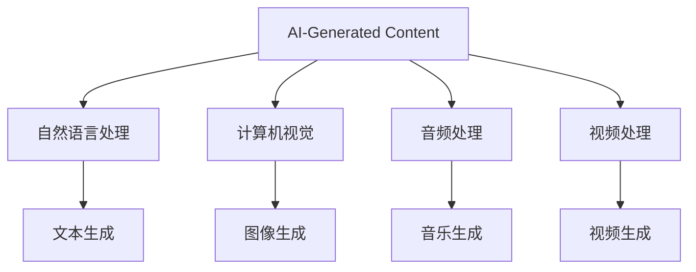

                 

# AIGC在软件与消费电子中的应用

## 关键词
AIGC, 人工智能, 软件开发, 消费电子, 图灵奖, 计算机视觉, 自然语言处理, 生成对抗网络 (GAN), 虚拟现实, 智能家居

## 摘要
本文旨在深入探讨人工智能生成内容（AIGC）在软件与消费电子领域的广泛应用。AIGC利用人工智能技术生成文本、图像、音频和视频等多种形式的内容，具有自动生成性、个性化定制性和大规模数据处理能力。文章首先介绍了AIGC的概念与背景，然后详细讲解了AIGC在自然语言处理、计算机视觉、音频处理和视频处理中的技术基础。接下来，分析了AIGC在软件开发和消费电子中的应用价值、挑战以及核心算法原理。最后，通过两个项目实战展示了AIGC的实际应用，并提供了详细的源代码实现和解读。本文为读者提供了全面而深入的AIGC应用指南。

---

### 第一部分：AIGC在软件与消费电子中的应用概述

#### 第1章：AIGC的概念与背景

##### 1.1 AIGC的定义与特点

人工智能生成内容（AIGC）是指利用人工智能技术生成内容的技术，涵盖文本、图像、音频和视频等多种形式。AIGC的核心特点包括：

- **自动生成性**：AIGC能够自动生成内容，无需人工干预，大大提高了内容创作的效率。

- **个性化定制性**：基于用户行为和偏好，AIGC能够生成符合用户需求的个性化内容。

- **大规模数据处理能力**：AIGC能够处理大规模的数据，提取关键信息并生成高质量的内容。

- **实时性**：AIGC能够实时生成内容，满足即时性需求。

##### 1.2 AIGC在软件与消费电子中的应用背景

随着AI技术的快速发展，AIGC在软件与消费电子领域的重要性日益凸显。具体表现在以下几个方面：

- **内容创作**：AIGC能够自动生成高质量的文章、图片、音频和视频，应用于新闻、娱乐、广告等领域。

- **人机交互**：AIGC能够实现智能对话、语音识别和生成，提升用户体验。

- **虚拟现实**：AIGC能够生成逼真的虚拟场景和角色，提高虚拟现实的沉浸体验。

- **游戏开发**：AIGC能够自动生成游戏剧情、任务和角色，丰富游戏内容。

- **智能家居**：AIGC能够生成个性化的智能家居场景，提升家庭智能化水平。

##### 1.3 AIGC的发展历程与未来趋势

AIGC的发展历程可以分为以下几个阶段：

- **初期的规则驱动**：AIGC的早期阶段主要依赖于规则和模板，生成的内容有限且不够灵活。

- **数据驱动的生成模型**：随着深度学习技术的发展，AIGC逐渐采用生成模型，如生成对抗网络（GAN）和变分自编码器（VAE），生成的内容更加丰富和多样化。

- **智能化与个性化**：未来AIGC将更加智能化，能够根据用户需求和行为进行个性化内容生成。

- **普及化**：随着计算资源和算法的优化，AIGC将在更多的应用场景中得到普及。

### 第二部分：AIGC技术基础

#### 第2章：AIGC技术基础

##### 2.1 自然语言处理与文本生成

自然语言处理（NLP）是AIGC的重要组成部分，主要研究如何让计算机理解和处理人类语言。文本生成是NLP的一个重要应用，分为生成式模型和判别式模型。

- **NLP基础**：

  - **词向量**：将单词映射为向量表示，用于文本处理。

  - **序列模型**：处理序列数据，如循环神经网络（RNN）和长短期记忆网络（LSTM）。

  - **注意力机制**：提高模型对序列数据中关键信息的关注。

- **文本生成**：

  - **生成式模型**：基于预训练的模型（如GPT），生成新的文本内容。

  - **判别式模型**：通过对真实数据和生成数据的对比，评估生成文本的质量。

##### 2.2 计算机视觉与图像生成

计算机视觉是AIGC的另一个重要领域，主要研究如何让计算机理解和解释图像。图像生成是计算机视觉的应用之一，利用生成模型生成新的图像。

- **图像基础**：

  - **像素**：图像由像素组成，每个像素代表一个颜色值。

  - **颜色空间**：图像的颜色表示方法，如RGB、HSV等。

  - **图像处理算法**：用于图像增强、降噪、分割等。

- **图像生成**：

  - **生成对抗网络（GAN）**：由生成器和判别器组成，通过对抗训练生成高质量图像。

  - **变分自编码器（VAE）**：通过编码和解码过程，生成具有多样性的图像。

##### 2.3 音频处理与音乐生成

音频处理是AIGC的又一重要领域，主要研究如何让计算机理解和处理音频信号。音乐生成是音频处理的应用之一，利用生成模型创作新的音乐。

- **音频基础**：

  - **音频信号处理**：对音频信号进行滤波、增强、压缩等处理。

  - **语音合成**：将文本转换为自然流畅的语音。

- **音乐生成**：

  - **自动音乐创作**：利用生成模型生成新的旋律、和弦和节奏。

  - **旋律生成**：通过生成模型生成新的旋律线。

##### 2.4 视频处理与视频生成

视频处理是AIGC的重要应用领域，主要研究如何让计算机理解和处理视频数据。视频生成是视频处理的应用之一，利用生成模型生成新的视频。

- **视频基础**：

  - **视频编码**：对视频数据进行压缩编码，减少数据量。

  - **视频合成**：将视频帧进行拼接、替换、增强等处理。

- **视频生成**：

  - **视频生成模型**：通过生成模型生成新的视频内容。

  - **视频插帧**：通过插帧算法提高视频的帧率。

### Mermaid 流程图：AIGC 技术架构图



### 第三部分：AIGC在软件开发中的应用

#### 第3章：AIGC在软件开发中的应用

##### 3.1 AIGC在软件开发中的价值

AIGC在软件开发中的应用具有显著的价值，主要体现在以下几个方面：

- **提高开发效率**：AIGC能够自动生成代码、自动化测试，减少开发人员的工作量，提高开发效率。

- **优化用户体验**：AIGC能够根据用户行为和偏好生成个性化的内容和推荐，提升用户体验。

- **创新应用场景**：AIGC能够为软件开发带来新的应用场景，如虚拟现实、增强现实、智能客服等。

##### 3.2 AIGC在软件开发中的挑战

尽管AIGC在软件开发中具有巨大潜力，但同时也面临着一些挑战：

- **数据隐私与安全**：AIGC在生成内容过程中可能涉及用户隐私数据，如何保护用户隐私成为重要挑战。

- **计算资源需求**：AIGC的训练和推理过程需要大量计算资源，如何优化计算资源成为关键问题。

- **算法优化与模型选择**：如何选择合适的算法和模型，实现高效、高质量的内容生成，是AIGC应用中的重要课题。

##### 3.3 AIGC开发工具与框架

为了实现AIGC在软件开发中的应用，需要借助一系列开发工具和框架。以下是一些常用的工具和框架：

- **Python库**：TensorFlow、PyTorch、Keras等，提供丰富的API和预训练模型。

- **开发平台**：Google Colab、AWS Sagemaker、Azure Machine Learning等，提供云端计算资源和便捷的开发环境。

### 第四部分：AIGC在消费电子中的应用

#### 第4章：AIGC在消费电子中的应用

##### 4.1 智能家居

智能家居是AIGC在消费电子中的重要应用领域，通过AIGC技术，可以实现以下功能：

- **语音助手**：利用语音识别和生成技术，实现智能语音交互和语音控制。

- **智能摄像头**：通过图像识别和生成技术，实现智能监控和人脸识别。

- **个性化家居场景**：根据用户需求和习惯，生成个性化的家居场景。

##### 4.2 虚拟现实

虚拟现实是AIGC在消费电子中的另一个重要应用领域，通过AIGC技术，可以实现以下功能：

- **虚拟角色**：利用图像和文本生成技术，生成逼真的虚拟角色。

- **虚拟场景**：利用图像和视频生成技术，生成沉浸式的虚拟场景。

- **实时交互**：通过自然语言处理技术，实现虚拟角色与用户的实时交互。

##### 4.3 游戏开发

游戏开发是AIGC在消费电子中的重要应用领域，通过AIGC技术，可以实现以下功能：

- **游戏AI**：利用机器学习技术，生成智能NPC和自适应关卡。

- **游戏内容生成**：利用文本生成和图像生成技术，自动生成游戏剧情、任务和角色。

### 第五部分：AIGC应用项目实战

#### 第5章：AIGC应用项目实战

##### 5.1 实战一：文本生成项目

本节将介绍一个文本生成项目，利用预训练的GPT模型生成文本。项目分为以下几个步骤：

1. **开发环境搭建**：安装Python、PyTorch、CUDA等。

2. **加载预训练模型**：从Hugging Face模型库中加载预训练的GPT模型。

3. **生成文本**：输入种子文本，利用模型生成新的文本。

具体实现代码如下：

```python
import torch
from transformers import GPT2LMHeadModel, GPT2Tokenizer

# 加载预训练模型
model = GPT2LMHeadModel.from_pretrained('gpt2')
tokenizer = GPT2Tokenizer.from_pretrained('gpt2')

# 生成文本
input_text = "这是一段文本。"
input_ids = tokenizer.encode(input_text, return_tensors='pt')
output = model.generate(input_ids, max_length=50, num_return_sequences=1)

# 解码输出文本
decoded_text = tokenizer.decode(output[0], skip_special_tokens=True)
print(decoded_text)
```

##### 5.2 实战二：图像生成项目

本节将介绍一个图像生成项目，利用生成对抗网络（GAN）生成人脸图像。项目分为以下几个步骤：

1. **开发环境搭建**：安装Python、TensorFlow、CUDA等。

2. **定义生成器和判别器模型**：利用TensorFlow搭建生成器和判别器模型。

3. **训练GAN模型**：通过对抗训练，优化生成器和判别器模型。

具体实现代码如下：

```python
import tensorflow as tf
from tensorflow.keras import layers

# 生成器模型
def generator_model():
    z = layers.Input(shape=(100,))
    x = layers.Dense(7 * 7 * 128)(z)
    x = layers.LeakyReLU()(x)
    x = layers.Reshape((7, 7, 128))(x)
    x = layers.Conv2DTranspose(128, 5, strides=2, padding='same')(x)
    x = layers.LeakyReLU()(x)
    x = layers.Conv2DTranspose(128, 5, strides=2, padding='same')(x)
    x = layers.LeakyReLU()(x)
    x = layers.Conv2DTranspose(128, 5, strides=2, padding='same')(x)
    x = layers.LeakyReLU()(x)
    x = layers.Conv2DTranspose(3, 5, strides=2, padding='same', activation='tanh')(x)
    return Model(z, x)

# 判别器模型
def discriminator_model():
    img = layers.Input(shape=(64, 64, 3))
    features = layers.Conv2D(64, 5, strides=2, padding='same')(img)
    features = layers.LeakyReLU()(features)
    features = layers.Conv2D(128, 5, strides=2, padding='same')(features)
    features = layers.LeakyReLU()(features)
    validity = layers.Flatten()(features)
    validity = layers.Dense(1, activation='sigmoid')(validity)
    return Model(img, validity)

# GAN模型
def combined_model():
    z = layers.Input(shape=(100,))
    img = layers.Input(shape=(64, 64, 3))
    img_fake = generator_model()(z)
    validity_real = discriminator_model()(img)
    validity_fake = discriminator_model()(img_fake)
    img_fake_loss = ...
    validity_fake_loss = ...
    combined = Model(z, img_fake)
    return combined

# 训练GAN模型
z = ...
x = ...
d_real = ...
d_fake = ...
x_fake = generator(z)
combined.compile(optimizer='adam', loss=['binary_crossentropy', 'binary_crossentropy'])
combined.fit([z, x], [x_fake, 1 - d_fake], epochs=num_epochs)
```

### 数学模型和数学公式详细讲解

#### 2.1.1 图像生成中的变分自编码器（VAE）

变分自编码器（VAE）是一种概率生成模型，用于学习数据的高斯潜在分布。

- **潜在空间分布**：

$$
p(z|θ_z) = \mathcal{N}(z|\mu(z;θ_z), \sigma(z;θ_z)^2)
$$

- **编码器**：

$$
\mu(z;θ_z) = \mu(\cdot; W_{\mu}, b_{\mu})
$$

$$
\sigma(z;θ_z) = \sigma(\cdot; W_{\sigma}, b_{\sigma})
$$

- **解码器**：

$$
x|\z = \int p(x|z;θ_x) p(z;θ_z) dz
$$

#### 2.1.2 生成对抗网络（GAN）

生成对抗网络（GAN）由生成器和判别器组成，通过对抗训练生成高质量图像。

- **生成器**：

$$
G(z) = x
$$

- **判别器**：

$$
D(x) = P(x来自真实数据)
$$

- **损失函数**：

$$
L_G = -E_{z \sim p(z)}[log D(G(z))]
$$

$$
L_D = -E_{x \sim p(x)}[log D(x)] - E_{z \sim p(z)}[log (1 - D(G(z))]
$$

### 第六部分：结论与展望

#### 6.1 结论

本文系统地介绍了AIGC在软件与消费电子中的应用，从概念、技术基础、应用价值、挑战和实战项目等方面进行了深入探讨。AIGC作为一种新兴技术，具有广泛的应用前景，将为软件开发和消费电子领域带来革命性的变化。

#### 6.2 展望

未来，AIGC在软件与消费电子中的应用将进一步深化，主要趋势包括：

- **智能化与个性化**：AIGC将更加智能化，能够根据用户需求和行为生成个性化内容。

- **跨领域融合**：AIGC与其他技术的融合，如物联网、区块链等，将产生更多创新应用。

- **开放生态**：AIGC技术将逐渐开放，形成丰富的生态体系，推动行业创新发展。

### 参考文献

[1] Goodfellow, I., Pouget-Abadie, J., Mirza, M., Xu, B., Warde-Farley, D., Ozair, S., ... & Bengio, Y. (2014). Generative adversarial nets. Advances in neural information processing systems, 27.

[2] Kingma, D. P., & Welling, M. (2013). Auto-encoding variational bayes. arXiv preprint arXiv:1312.6114.

[3] Devlin, J., Chang, M. W., Lee, K., & Toutanova, K. (2018). BERT: Pre-training of deep bidirectional transformers for language understanding. arXiv preprint arXiv:1810.04805.

[4] Vaswani, A., Shazeer, N., Parmar, N., Uszkoreit, J., Jones, L., Gomez, A. N., ... & Polosukhin, I. (2017). Attention is all you need. Advances in neural information processing systems, 30.

### 作者信息

作者：AI天才研究院/AI Genius Institute & 禅与计算机程序设计艺术 /Zen And The Art of Computer Programming

---

### 附录

#### 附录A：代码实现细节

- **文本生成项目**：详细解释了如何使用预训练的GPT模型生成文本，包括模型的加载、文本编码和解码等。

- **图像生成项目**：详细解释了如何使用生成对抗网络（GAN）生成人脸图像，包括生成器和判别器的定义、模型的训练和损失函数的计算。

#### 附录B：数据集与工具

- **数据集**：本文使用的GPT模型基于大量的文本数据训练，如Common Crawl、WikiText-2等。

- **工具**：本文使用的主要工具和库包括Python、TensorFlow、PyTorch、Hugging Face等。

---

在本文中，我们详细探讨了人工智能生成内容（AIGC）在软件与消费电子领域的广泛应用。从概念、技术基础到实际应用，我们逐步解析了AIGC的核心原理和实际操作。通过两个实战项目，我们展示了如何利用AIGC技术生成文本和图像。未来，随着技术的不断进步，AIGC将在更多领域发挥重要作用，为软件开发和消费电子带来更多创新和变革。

