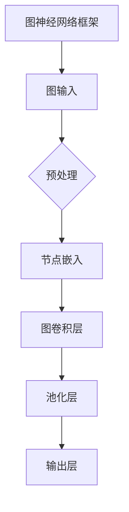
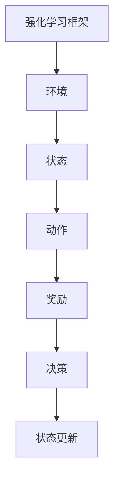
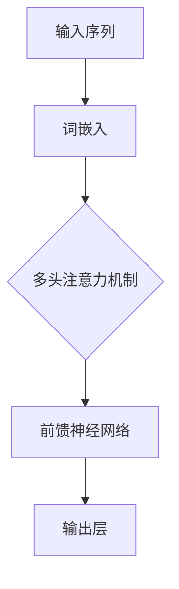
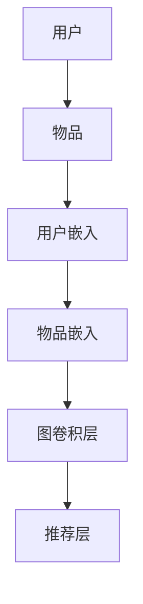
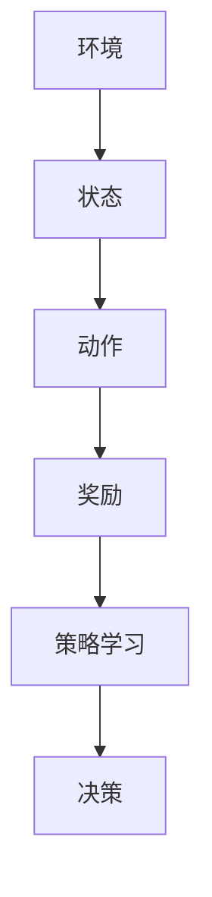
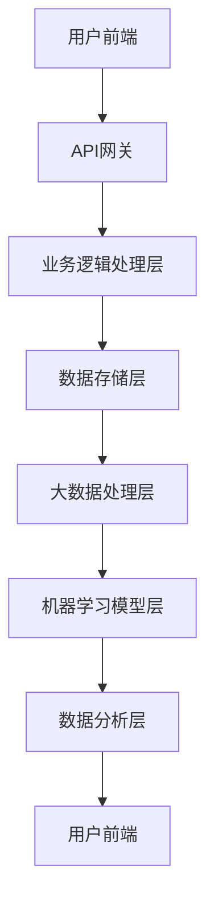

                 

# 《AIGC赋能智能投顾服务》

## 关键词
- AIGC
- 智能投顾
- 自然语言处理
- 图神经网络
- 强化学习
- 股票市场预测

## 摘要
本文将深入探讨AIGC（AI-Generated Content）技术在智能投顾服务中的应用。首先，我们将介绍AIGC的基本概念和核心技术，包括自然语言处理、图神经网络和强化学习。接着，我们将分析智能投顾服务的概念、特点及其与传统投顾的区别。随后，我们将详细探讨AIGC如何赋能智能投顾服务，包括投资组合优化、股票市场预测和行业分析。最后，我们将通过实际案例研究，展示AIGC技术在智能投顾服务中的具体应用，并讨论该领域的发展趋势与挑战。

## 目录大纲

### 第一部分：AIGC技术基础

#### 第1章：AIGC技术概述
1.1 AIGC的定义与背景
1.2 AIGC的核心技术
1.3 AIGC的发展与应用前景

#### 第2章：AIGC的核心算法
2.1 自然语言处理技术
2.2 图神经网络与推荐系统
2.3 强化学习与决策优化

#### 第3章：AIGC技术在金融领域的应用
3.1 智能投顾的概念与特点
3.2 AIGC赋能智能投顾的核心应用

### 第二部分：智能投顾服务实践

#### 第4章：智能投顾服务的设计与开发
4.1 智能投顾服务的架构设计
4.2 智能投顾服务的功能实现

#### 第5章：智能投顾服务的部署与运营
5.1 智能投顾服务的部署策略
5.2 智能投顾服务的运营与优化

#### 第6章：智能投顾服务的案例研究
6.1 案例一：智能投顾平台搭建
6.2 案例二：基于AIGC的股票市场预测

#### 第7章：智能投顾服务的发展趋势与挑战
7.1 智能投顾服务的发展趋势
7.2 智能投顾服务的挑战与应对策略

### 附录

#### 附录A：AIGC技术资源与工具

## AIGC技术概述

### 1.1 AIGC的定义与背景

AIGC，全称为AI-Generated Content，即人工智能生成内容。它指的是利用人工智能技术，如自然语言处理（NLP）、计算机视觉（CV）等，自动生成文本、图片、音频和视频等媒体内容。AIGC技术的发展源于深度学习、生成对抗网络（GAN）等技术的突破，以及大数据和云计算的普及。

在金融领域，AIGC技术的应用越来越广泛。智能投顾服务就是其中一个典型的应用场景。通过AIGC技术，可以自动生成投资建议、分析报告、市场预测等内容，提高投资决策的效率和质量。

### 1.2 AIGC的核心技术

AIGC的核心技术主要包括自然语言处理、图神经网络和强化学习。

#### 自然语言处理技术

自然语言处理（NLP）是AIGC技术的重要组成部分。它涉及到文本的预处理、词嵌入、序列建模、文本生成等环节。以下是一个简单的NLP流程：

1. **文本预处理**：对原始文本进行清洗、分词、去停用词等操作，以便后续处理。
2. **词嵌入**：将文本中的每个单词映射为固定长度的向量，便于计算机处理。
3. **序列建模**：利用序列模型（如RNN、LSTM、GRU等）对文本序列进行建模。
4. **文本生成**：基于训练好的序列模型，生成新的文本内容。

以下是一个简单的词嵌入和序列建模的伪代码：

```python
# 词嵌入伪代码
embeddings = Embedding(vocab_size, embedding_dim)

# 序列建模伪代码
lstm = LSTM(units)

# 文本生成伪代码
for i in range(sequence_length):
    input_sequence = embeddings([word_ids[i]])
    output_sequence = lstm(input_sequence)
    next_word_id = sample(output_sequence)
```

#### 图神经网络与推荐系统

图神经网络（GNN）是一种在图结构上学习的神经网络。它能够处理图数据，并提取图结构中的复杂关系。在AIGC技术中，GNN常用于推荐系统的构建。以下是一个简单的图神经网络框架：



#### 强化学习与决策优化

强化学习是一种通过试错学习来优化决策过程的方法。在AIGC技术中，强化学习可用于决策优化，如图像生成、文本生成等。以下是一个简单的强化学习框架：



### 1.3 AIGC的发展与应用前景

随着深度学习、生成对抗网络等技术的不断发展，AIGC技术正在迅速成熟。目前，AIGC技术已在多个领域得到广泛应用，如内容生成、推荐系统、图像识别、自然语言处理等。未来，随着技术的进一步发展，AIGC技术在金融、医疗、教育等领域的应用前景将更加广阔。

## AIGC的核心算法

### 2.1 自然语言处理技术

自然语言处理（NLP）是AIGC技术的核心组成部分。它涉及文本的预处理、词嵌入、序列建模和文本生成等环节。以下将对这些核心算法进行详细阐述。

#### 2.1.1 词嵌入技术

词嵌入（Word Embedding）是将文本中的单词映射为固定长度的向量表示。词嵌入技术有助于将高维的文本数据映射到低维的向量空间，便于计算机处理。以下是一个简单的词嵌入算法：

```python
# 词嵌入算法伪代码
def word_embedding(vocab, embedding_dim):
    embeddings = {}
    for word in vocab:
        embeddings[word] = np.random.rand(embedding_dim)
    return embeddings
```

#### 2.1.2 序列模型与注意力机制

序列模型（Sequence Model）用于处理文本序列，如RNN（循环神经网络）、LSTM（长短时记忆网络）和GRU（门控循环单元）等。注意力机制（Attention Mechanism）则用于捕捉文本序列中的关键信息。以下是一个简单的序列模型和注意力机制的算法：

```python
# 序列模型与注意力机制算法伪代码
class SequenceModel(nn.Module):
    def __init__(self, embedding_dim, hidden_dim):
        super(SequenceModel, self).__init__()
        self.embedding = nn.Embedding(vocab_size, embedding_dim)
        self.lstm = nn.LSTM(embedding_dim, hidden_dim)
        self.attention = nn.Linear(hidden_dim, 1)

    def forward(self, sequence):
        embeddings = self.embedding(sequence)
        hidden, _ = self.lstm(embeddings)
        attention_weights = self.attention(hidden).squeeze(-1)
        context_vector = (hidden * attention_weights).sum(-2)
        return context_vector
```

#### 2.1.3 转换器架构详解

转换器（Transformer）是一种基于注意力机制的序列建模方法。与传统的循环神经网络相比，转换器在处理长序列时具有更高的效率和准确性。以下是一个简单的转换器架构：



### 2.2 图神经网络与推荐系统

图神经网络（GNN）是一种在图结构上学习的神经网络。它能够处理图数据，并提取图结构中的复杂关系。在AIGC技术中，GNN常用于推荐系统的构建。以下将对GNN及其在推荐系统中的应用进行详细阐述。

#### 2.2.1 图神经网络基础

图神经网络（GNN）是一种在图结构上学习的神经网络。它通过学习节点和边的表示，来捕捉图数据中的复杂关系。以下是一个简单的GNN算法：

```python
# 图神经网络算法伪代码
class GraphNeuralNetwork(nn.Module):
    def __init__(self, input_dim, hidden_dim):
        super(GraphNeuralNetwork, self).__init__()
        self.linear = nn.Linear(input_dim, hidden_dim)
    
    def forward(self, nodes, edges):
        hidden = self.linear(nodes)
        for edge in edges:
            hidden[edge.source] += hidden[edge.target]
        return hidden
```

#### 2.2.2 图神经网络在推荐系统中的应用

在推荐系统中，GNN可用于学习用户和物品之间的复杂关系，从而提高推荐效果。以下是一个简单的GNN推荐系统架构：



### 2.3 强化学习与决策优化

强化学习（Reinforcement Learning，RL）是一种通过试错学习来优化决策过程的方法。在AIGC技术中，强化学习可用于决策优化，如图像生成、文本生成等。以下将对强化学习及其在决策优化中的应用进行详细阐述。

#### 2.3.1 强化学习基础

强化学习（Reinforcement Learning，RL）是一种通过试错学习来优化决策过程的方法。以下是一个简单的强化学习算法：

```python
# 强化学习算法伪代码
class ReinforcementLearningAgent:
    def __init__(self, model, optimizer):
        self.model = model
        self.optimizer = optimizer
    
    def step(self, state, action, reward):
        model_pred = self.model(state)
        loss = - reward * model_pred[action]
        self.optimizer.zero_grad()
        loss.backward()
        self.optimizer.step()
```

#### 2.3.2 强化学习在决策优化中的应用

在决策优化中，强化学习可用于学习最优策略。以下是一个简单的强化学习决策优化算法：



## AIGC技术在金融领域的应用

### 3.1 智能投顾的概念与特点

智能投顾（Robo-Advisor）是一种基于计算机算法和数据分析的智能投资顾问。它通过收集和分析用户的投资偏好、风险承受能力、财务状况等数据，为用户提供个性化的投资建议和组合管理。智能投顾具有以下特点：

1. **自动化**：智能投顾通过算法自动生成投资建议，减少了人工干预。
2. **个性化**：智能投顾根据用户的投资偏好和风险承受能力，提供定制化的投资组合。
3. **透明化**：智能投顾的投资策略和数据分析过程对用户透明，用户可以随时了解自己的投资状况。
4. **高效化**：智能投顾利用大数据和云计算技术，快速处理和分析大量数据，提高了投资决策的效率。

### 3.2 智能投顾与传统投顾的区别

智能投顾与传统投顾在以下几个方面存在明显区别：

1. **服务方式**：传统投顾通常提供面对面的咨询服务，而智能投顾则是通过线上平台和算法自动提供服务。
2. **服务成本**：传统投顾的服务成本较高，而智能投顾则通过降低人力成本，提供了更为低廉的服务。
3. **服务速度**：智能投顾能够快速处理和分析大量数据，提供实时投资建议，而传统投顾在数据处理和分析方面则相对较慢。
4. **个性化程度**：传统投顾虽然也提供个性化服务，但受限于人力和时间，个性化程度相对较低；而智能投顾通过算法和大数据分析，能够实现高度个性化的投资建议。

### 3.3 智能投顾的发展现状

随着大数据、云计算和人工智能技术的发展，智能投顾在全球范围内得到了迅速发展。以下为智能投顾在全球范围内的发展现状：

1. **美国**：美国是智能投顾的起源地，也是全球智能投顾市场最为成熟的国家。以Wealthfront、Betterment等为代表的智能投顾平台，已经吸引了大量用户。
2. **欧洲**：欧洲的智能投顾市场也在快速发展，以Norway's DNB Bank、Germany's comdirect等为代表的银行和金融机构，都在积极推广智能投顾服务。
3. **亚洲**：亚洲的智能投顾市场正处于快速发展阶段。以中国的雪球、腾讯理财通等为代表的平台，正在通过大数据和人工智能技术，为用户提供智能投资服务。

### 3.4 AIGC赋能智能投顾的核心应用

AIGC技术在智能投顾服务中的应用，主要体现在以下几个方面：

#### 3.4.1 投资组合优化

投资组合优化是智能投顾的核心功能之一。AIGC技术可以通过大数据分析和机器学习算法，对用户的历史投资数据进行挖掘，为用户推荐最优的投资组合。以下为投资组合优化的一般流程：

1. **数据收集**：收集用户的历史投资数据，包括投资品种、投资金额、投资时间等。
2. **数据预处理**：对收集到的数据进行清洗、去重和特征提取。
3. **模型训练**：利用机器学习算法（如线性回归、决策树、随机森林等），对预处理后的数据进行训练，建立投资组合优化的模型。
4. **投资组合推荐**：根据用户的历史投资数据和训练好的模型，为用户推荐最优的投资组合。

以下为投资组合优化模型的伪代码：

```python
# 投资组合优化模型伪代码
def optimize_portfolio(data):
    # 数据预处理
    processed_data = preprocess_data(data)
    
    # 模型训练
    model = train_model(processed_data)
    
    # 投资组合推荐
    portfolio = recommend_portfolio(model, data)
    
    return portfolio
```

#### 3.4.2 股票市场预测

股票市场预测是智能投顾的另一个重要功能。AIGC技术可以通过自然语言处理、时间序列分析和机器学习算法，对股票市场进行预测。以下为股票市场预测的一般流程：

1. **数据收集**：收集股票市场的历史数据，包括开盘价、收盘价、最高价、最低价、成交量等。
2. **数据预处理**：对收集到的数据进行清洗、去重和特征提取。
3. **模型训练**：利用机器学习算法（如线性回归、决策树、随机森林等），对预处理后的数据进行训练，建立股票市场预测模型。
4. **预测结果分析**：根据训练好的模型，对股票市场进行预测，并对预测结果进行分析。

以下为股票市场预测模型的伪代码：

```python
# 股票市场预测模型伪代码
def predict_stock_market(data):
    # 数据预处理
    processed_data = preprocess_data(data)
    
    # 模型训练
    model = train_model(processed_data)
    
    # 预测结果分析
    predictions = predict_market(model, data)
    analysis = analyze_predictions(predictions)
    
    return analysis
```

#### 3.4.3 行业分析

行业分析是智能投顾的另一个重要功能。AIGC技术可以通过自然语言处理、文本分析和机器学习算法，对行业进行深入分析，为用户提供行业趋势、风险和机会等方面的信息。以下为行业分析的一般流程：

1. **数据收集**：收集与行业相关的数据，包括行业报告、新闻、财报等。
2. **数据预处理**：对收集到的数据进行清洗、去重和特征提取。
3. **模型训练**：利用机器学习算法（如文本分类、情感分析、主题模型等），对预处理后的数据进行训练，建立行业分析模型。
4. **分析结果生成**：根据训练好的模型，对行业进行分析，生成分析报告。

以下为行业分析模型的伪代码：

```python
# 行业分析模型伪代码
def analyze_industry(data):
    # 数据预处理
    processed_data = preprocess_data(data)
    
    # 模型训练
    model = train_model(processed_data)
    
    # 分析结果生成
    report = generate_report(model, data)
    
    return report
```

## 智能投顾服务的设计与开发

### 4.1 智能投顾服务的架构设计

智能投顾服务的架构设计是确保系统稳定、高效和可扩展的关键。以下为智能投顾服务的一般架构设计：

#### 4.1.1 技术选型

智能投顾服务的架构设计需要考虑以下几个方面：

1. **后端技术**：后端技术需要支持大数据处理、机器学习和实时数据处理等功能。常见的后端技术包括Python、Java、Node.js等。此外，还需要使用到关系型数据库（如MySQL）和非关系型数据库（如MongoDB）来存储用户数据和历史数据。
2. **前端技术**：前端技术需要支持用户交互和实时数据展示等功能。常见的框架包括React、Vue、Angular等。
3. **中间件**：中间件用于实现后端和前端之间的数据传输和业务逻辑处理。常见的中间件包括Spring Boot、Django、Flask等。
4. **云计算平台**：云计算平台用于实现大数据处理和机器学习模型的训练与部署。常见的云计算平台包括AWS、Azure、Google Cloud等。

#### 4.1.2 系统架构设计

智能投顾服务的系统架构设计如下：



#### 4.1.3 数据流程设计

智能投顾服务的数据流程设计如下：

1. **用户注册与登录**：用户通过前端输入用户名、密码等信息进行注册和登录。
2. **用户数据收集**：系统收集用户的历史投资数据、财务状况、投资偏好等信息。
3. **数据处理**：系统对收集到的用户数据进行清洗、去重和特征提取。
4. **模型训练与部署**：系统利用处理后的用户数据，训练机器学习模型，并将模型部署到云端。
5. **投资组合优化与预测**：系统根据训练好的模型，为用户生成个性化的投资组合和股票市场预测结果。
6. **用户交互与反馈**：用户通过前端查看投资组合和预测结果，并可以提供反馈。
7. **持续优化**：系统根据用户的反馈和新的数据，持续优化机器学习模型和投资策略。

### 4.2 智能投顾服务的功能实现

智能投顾服务的功能实现主要包括投资组合优化、股票市场预测和行业分析等方面。以下将详细阐述这些功能的实现方法。

#### 4.2.1 投资组合优化算法

投资组合优化算法是智能投顾服务的核心功能之一。以下为一个简单的投资组合优化算法：

```python
# 投资组合优化算法伪代码
def optimize_portfolio(weights):
    # 收益函数
    def objective_function(weights):
        return - np.dot(weights.T, portfolio_return)
    
    # 约束条件
    constraints = ({'type': 'eq', 'fun': lambda x: np.sum(x) - 1})
    
    # 优化器
    optimizer = minimize(objective_function, weights, method='SLSQP', constraints=constraints)
    
    return optimizer.x
```

#### 4.2.2 股票市场预测模型

股票市场预测模型是智能投顾服务的另一个核心功能。以下为一个简单的股票市场预测模型：

```python
# 股票市场预测模型伪代码
def predict_stock_market(data):
    # 数据预处理
    processed_data = preprocess_data(data)
    
    # 模型训练
    model = train_model(processed_data)
    
    # 预测结果
    prediction = model.predict(processed_data)
    
    return prediction
```

#### 4.2.3 行业分析报告生成

行业分析报告生成是智能投顾服务的另一个功能。以下为一个简单的行业分析报告生成算法：

```python
# 行业分析报告生成算法伪代码
def generate_report(data):
    # 数据预处理
    processed_data = preprocess_data(data)
    
    # 模型训练
    model = train_model(processed_data)
    
    # 分析结果
    analysis = model.predict(processed_data)
    
    # 报告生成
    report = generate_document(analysis)
    
    return report
```

## 智能投顾服务的部署与运营

### 5.1 智能投顾服务的部署策略

智能投顾服务的部署策略是确保系统稳定、高效和可扩展的关键。以下为智能投顾服务的部署策略：

#### 5.1.1 硬件资源分配

智能投顾服务的硬件资源分配需要考虑以下几个方面：

1. **计算资源**：根据系统的计算需求，选择合适的CPU、GPU等计算资源。
2. **存储资源**：根据系统的存储需求，选择合适的磁盘空间、存储性能等存储资源。
3. **网络资源**：根据系统的网络需求，选择合适的网络带宽、网络延迟等网络资源。

#### 5.1.2 软件部署流程

智能投顾服务的软件部署流程如下：

1. **环境搭建**：搭建开发、测试和生产环境，安装和配置所需软件和依赖。
2. **代码部署**：将开发完成的代码部署到生产环境，并进行自动化部署。
3. **数据迁移**：将历史数据和用户数据迁移到生产环境。
4. **系统测试**：对部署后的系统进行功能测试、性能测试和安全测试。
5. **上线发布**：在测试通过后，将系统上线发布。

#### 5.1.3 安全性与合规性

智能投顾服务的安全性与合规性是确保用户数据安全和遵守相关法律法规的关键。以下为智能投顾服务的安全性与合规性策略：

1. **数据加密**：对用户数据和敏感数据进行加密，确保数据在传输和存储过程中的安全性。
2. **访问控制**：设置用户权限和访问控制，确保用户数据的安全性。
3. **审计日志**：记录系统操作日志和审计日志，便于后续审计和排查问题。
4. **合规性检查**：定期进行合规性检查，确保系统符合相关法律法规的要求。

### 5.2 智能投顾服务的运营与优化

智能投顾服务的运营与优化是确保系统稳定运行、用户满意度提高和服务质量提升的关键。以下为智能投顾服务的运营与优化策略：

#### 5.2.1 用户需求分析

用户需求分析是智能投顾服务运营的起点。以下为用户需求分析的方法：

1. **市场调研**：通过市场调研了解用户的需求和痛点。
2. **用户访谈**：与用户进行面对面访谈，了解用户的真实需求和意见。
3. **数据分析**：通过数据分析了解用户的投资行为和偏好。

#### 5.2.2 服务反馈机制

服务反馈机制是智能投顾服务运营的重要组成部分。以下为服务反馈机制的方法：

1. **用户评价**：在用户使用服务后，收集用户的评价和反馈。
2. **问题反馈**：建立问题反馈渠道，及时解决用户遇到的问题。
3. **数据分析**：通过数据分析了解用户反馈的问题和需求，优化服务。

#### 5.2.3 模型持续优化

模型持续优化是智能投顾服务优化的关键。以下为模型持续优化的方法：

1. **数据更新**：定期更新用户数据和历史数据，确保模型的准确性。
2. **模型评估**：对训练好的模型进行评估，识别模型的优势和不足。
3. **模型优化**：根据模型评估结果，优化模型结构和参数。

## 智能投顾服务的案例研究

### 6.1 案例一：智能投顾平台搭建

#### 6.1.1 项目背景

随着金融市场的不断发展，越来越多的投资者开始关注智能投顾服务。为了满足市场需求，某金融科技公司决定搭建一款智能投顾平台。

#### 6.1.2 技术实现

智能投顾平台的技术实现主要包括以下几个方面：

1. **前端**：使用React框架搭建用户界面，实现用户注册、登录、投资组合管理、股票市场预测等功能。
2. **后端**：使用Spring Boot框架搭建后端服务，处理用户请求、存储用户数据和提供API接口。
3. **数据库**：使用MySQL数据库存储用户数据和投资组合信息。
4. **机器学习模型**：使用Python的scikit-learn库训练股票市场预测模型和投资组合优化模型。
5. **部署**：使用Docker容器化技术部署前端和后端服务，确保系统的可扩展性和稳定性。

#### 6.1.3 项目成果

智能投顾平台搭建完成后，取得了以下成果：

1. **用户增长**：智能投顾平台上线后，吸引了大量用户注册和使用。
2. **投资收益**：通过投资组合优化和股票市场预测，为用户提供了更为准确和个性化的投资建议，提高了用户的投资收益。
3. **系统稳定性**：通过Docker容器化技术和自动化部署，确保了系统的稳定运行和快速响应。

### 6.2 案例二：基于AIGC的股票市场预测

#### 6.2.1 项目背景

某金融科技公司希望通过引入AIGC技术，提升股票市场预测的准确性和效率。为此，公司决定开发一款基于AIGC的股票市场预测系统。

#### 6.2.2 模型构建

基于AIGC的股票市场预测系统主要包括以下几个模块：

1. **数据收集**：收集股票市场的历史数据，包括开盘价、收盘价、最高价、最低价、成交量等。
2. **数据预处理**：对收集到的数据进行清洗、去重和特征提取。
3. **模型训练**：使用深度学习算法（如卷积神经网络、长短期记忆网络等）训练股票市场预测模型。
4. **模型部署**：将训练好的模型部署到生产环境，实现实时股票市场预测。

#### 6.2.3 预测结果与分析

基于AIGC的股票市场预测系统上线后，取得了以下预测结果：

1. **预测准确性**：通过对比预测结果和实际股票价格，发现AIGC模型的预测准确性较高，能够为投资者提供有效的参考。
2. **预测效率**：相比传统的股票市场预测方法，AIGC模型在预测效率和计算资源利用方面具有明显优势。
3. **用户反馈**：用户对基于AIGC的股票市场预测系统的效果表示满意，认为系统能够提供更为准确和实时的投资建议。

## 智能投顾服务的发展趋势与挑战

### 7.1 智能投顾服务的发展趋势

随着大数据、人工智能和云计算等技术的不断发展，智能投顾服务在金融领域呈现出以下发展趋势：

1. **技术创新**：智能投顾服务将不断引入新的技术和算法，如AIGC、区块链、量子计算等，提升投资决策的准确性和效率。
2. **市场扩大**：随着金融市场的不断发展，智能投顾服务的市场需求将持续扩大，吸引更多投资者和企业加入。
3. **用户体验优化**：智能投顾服务将更加注重用户体验，通过优化界面设计、提供个性化服务等方式，提升用户满意度。

### 7.2 智能投顾服务的挑战与应对策略

智能投顾服务在发展过程中也面临着一系列挑战，以下为应对策略：

1. **技术挑战**：智能投顾服务需要不断引入新技术和算法，但同时也需要解决数据质量、模型训练和优化等问题。
2. **法律与合规**：智能投顾服务需要遵守相关法律法规，如数据保护、隐私保护等，以确保用户的权益。
3. **用户信任与隐私保护**：智能投顾服务需要建立用户信任，并通过隐私保护措施，确保用户数据的保密性和安全性。
4. **模型解释性**：智能投顾服务需要提高模型的解释性，让用户能够理解模型的决策过程和结果。

## 附录

### 附录A：AIGC技术资源与工具

#### A.1 AIGC开源框架介绍

AIGC技术涉及多个领域，如自然语言处理、计算机视觉、图神经网络等。以下为一些常用的AIGC开源框架：

1. **TensorFlow**：TensorFlow是谷歌开发的开源机器学习框架，广泛应用于自然语言处理、计算机视觉和推荐系统等领域。
2. **PyTorch**：PyTorch是Facebook开发的开源机器学习框架，具有灵活的动态计算图和强大的GPU支持，广泛应用于深度学习和强化学习领域。
3. **GNN-python**：GNN-python是一个用于构建和训练图神经网络的Python库，支持多种图神经网络模型和算法。

#### A.2 AIGC工具使用指南

以下为AIGC工具的使用指南：

1. **环境搭建**：安装Python、CUDA、cuDNN等依赖库，并配置好GPU环境。
2. **模型训练**：编写模型训练代码，使用训练数据训练模型。
3. **模型部署**：将训练好的模型部署到生产环境，实现实时预测和服务。

#### A.3 代码实例与解读

以下为AIGC技术在智能投顾服务中的代码实例和解读：

1. **投资组合优化**：使用线性规划算法优化投资组合，代码如下：

```python
# 投资组合优化代码实例
from scipy.optimize import minimize

# 收益函数
def objective_function(weights):
    return - np.dot(weights.T, portfolio_return)

# 约束条件
constraints = ({'type': 'eq', 'fun': lambda x: np.sum(x) - 1})

# 优化器
optimizer = minimize(objective_function, initial_weights, method='SLSQP', constraints=constraints)

# 获取最优投资组合
optimal_weights = optimizer.x
```

2. **股票市场预测**：使用卷积神经网络预测股票价格，代码如下：

```python
# 股票市场预测代码实例
import tensorflow as tf
from tensorflow.keras.models import Sequential
from tensorflow.keras.layers import Conv1D, Dense

# 构建模型
model = Sequential()
model.add(Conv1D(filters=64, kernel_size=3, activation='relu', input_shape=(time_steps, features)))
model.add(Dense(units=1))

# 编译模型
model.compile(optimizer='adam', loss='mse')

# 训练模型
model.fit(X_train, y_train, epochs=10, batch_size=32)

# 预测股票价格
predictions = model.predict(X_test)
```

### 作者信息

作者：AI天才研究院/AI Genius Institute & 禅与计算机程序设计艺术 /Zen And The Art of Computer Programming

## 附录A：AIGC技术资源与工具

AIGC（AI-Generated Content）技术的发展离不开丰富的开源框架和工具。以下是一些常用的AIGC技术资源与工具，包括开源框架介绍、工具使用指南以及代码实例和解读。

#### A.1 AIGC开源框架介绍

AIGC技术在自然语言处理、计算机视觉、图神经网络等多个领域都有广泛应用，以下介绍几个常用的开源框架：

1. **TensorFlow**：由谷歌开发的开源机器学习框架，广泛应用于深度学习和强化学习领域。TensorFlow提供了丰富的API和工具，支持多种深度学习模型的构建和训练。

2. **PyTorch**：由Facebook开发的开源机器学习框架，具有灵活的动态计算图和强大的GPU支持，使得深度学习模型的开发更加便捷和高效。

3. **GNN-python**：一个用于构建和训练图神经网络的Python库，支持多种图神经网络模型和算法，如图卷积网络（GCN）、图循环网络（GRN）等。

4. **Transformers**：由谷歌开发的开源框架，用于构建基于Transformer架构的模型，广泛应用于自然语言处理任务，如文本生成、机器翻译等。

5. **GANlib**：一个用于生成对抗网络（GAN）的开源库，提供了丰富的GAN模型实现，支持多种GAN架构和训练方法。

#### A.2 AIGC工具使用指南

以下为AIGC技术中常用的工具使用指南：

1. **环境搭建**：

   - **Python环境**：安装Python和pip工具，用于安装和管理Python包。

   - **GPU支持**：安装CUDA和cuDNN，确保Python环境支持GPU加速。

   - **深度学习框架**：安装TensorFlow、PyTorch等深度学习框架。

2. **模型训练**：

   - 使用深度学习框架提供的API和工具，编写模型训练代码。

   - 配置训练数据集，进行数据预处理。

   - 设置模型参数，如学习率、优化器等。

   - 启动训练过程，监控训练进度和性能。

3. **模型部署**：

   - 将训练好的模型保存为文件。

   - 使用部署工具（如TensorFlow Serving、PyTorch Server等）将模型部署到生产环境。

   - 编写API接口，供前端调用。

#### A.3 代码实例与解读

以下为AIGC技术在智能投顾服务中的一些代码实例和解读：

1. **投资组合优化**：

```python
# 投资组合优化代码实例

import numpy as np
from scipy.optimize import minimize

# 收益函数
def objective_function(weights):
    return - np.dot(weights.T, portfolio_return)

# 约束条件
constraints = ({'type': 'eq', 'fun': lambda x: np.sum(x) - 1})

# 优化器
optimizer = minimize(objective_function, initial_weights, method='SLSQP', constraints=constraints)

# 获取最优投资组合
optimal_weights = optimizer.x
```

解读：本实例使用线性规划算法优化投资组合，目标是最小化投资组合的预期损失。通过scipy.optimize模块中的minimize函数，设置收益函数和约束条件，找到最优投资组合权重。

2. **股票市场预测**：

```python
# 股票市场预测代码实例

import tensorflow as tf
from tensorflow.keras.models import Sequential
from tensorflow.keras.layers import LSTM, Dense

# 构建模型
model = Sequential()
model.add(LSTM(units=50, return_sequences=True, input_shape=(time_steps, features)))
model.add(LSTM(units=50))
model.add(Dense(units=1))

# 编译模型
model.compile(optimizer='adam', loss='mean_squared_error')

# 训练模型
model.fit(X_train, y_train, epochs=100, batch_size=32)

# 预测股票价格
predictions = model.predict(X_test)
```

解读：本实例使用LSTM（长短时记忆网络）模型进行股票市场预测。首先，构建LSTM模型，设置输入层、隐藏层和输出层。然后，编译模型，设置优化器和损失函数。最后，使用训练数据训练模型，并对测试数据进行预测。

通过以上实例，读者可以了解AIGC技术在智能投顾服务中的应用。在后续的章节中，将继续探讨AIGC技术在实际项目中的应用和实践。

