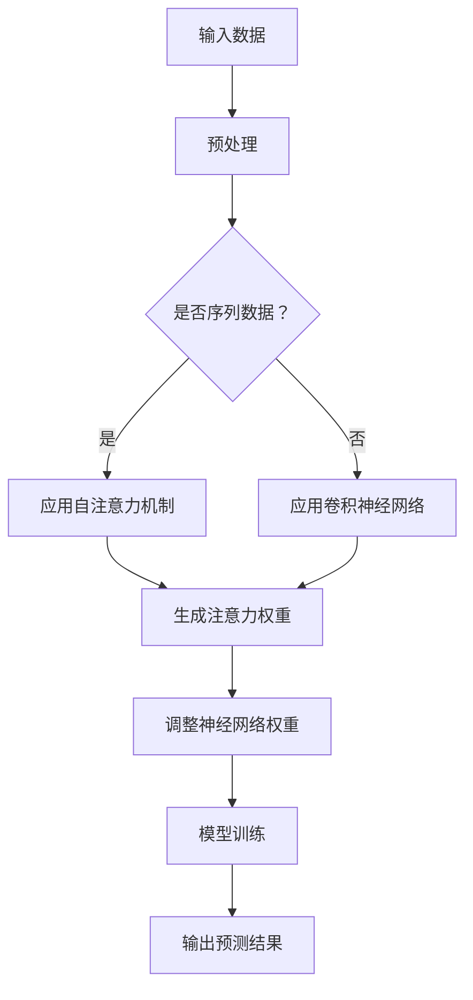

                 

### 引言与背景

随着人工智能（AI）技术的迅猛发展，它正逐渐渗透到我们生活的方方面面，改变着人类的工作方式和社会结构。而在这场变革中，注意力流（Attention Flow）作为一个关键的概念，正在成为研究的焦点。本文旨在探讨AI与人类注意力流之间的关系，以及这一关系对未来工作场所和注意力管理的影响。

#### AI与注意力流：概述

人工智能，特别是深度学习，依赖于大规模的数据处理和复杂的算法，这些算法能够模拟人类的认知过程。而注意力流，作为人类感知和认知过程中的核心机制，涉及到如何分配注意力资源，以应对不同任务的需求。AI的注意力流研究旨在理解并模拟这一机制，使其能够更有效地处理信息，提高工作效率。

#### 注意力流的重要性

注意力流不仅是人类认知过程的基础，也是人类行为决策的关键。在信息过载的时代，如何有效地管理注意力资源，提高注意力流的质量，成为提高工作效率和生活质量的重要课题。而AI的发展为这一问题的解决提供了新的思路和方法。

#### 未来的工作场所趋势

随着数字化转型的推进，未来的工作场所将面临前所未有的挑战和机遇。远程办公、智能协作工具、自动化流程等技术的普及，使得工作模式更加灵活和高效。然而，这也带来了新的问题，比如注意力分散、工作效率下降等。因此，如何通过AI和注意力管理技术改善工作场所的注意力流，成为企业和个人共同关注的课题。

#### 本文结构

本文将从以下几个方面展开讨论：

1. **基础概念**：介绍注意力流的概念、原理和数学模型。
2. **核心概念联系与架构**：分析AI与注意力流之间的核心联系，通过Mermaid流程图展示其架构。
3. **算法原理**：详细讲解注意力流算法的原理、伪代码和实例分析。
4. **数学模型与公式详解**：探讨注意力流的数学基础，讲解注意力流公式，并通过实例进行说明。
5. **注意力管理**：介绍注意力管理的概念、方法、策略和工作场所应用。
6. **未来工作场所与注意力流**：讨论未来工作场所的趋势、应用前景和注意力流管理。
7. **社会生活与伦理**：探讨注意力流在社会生活中的应用和伦理问题。

通过本文的探讨，我们希望能够为读者提供一个全面而深入的理解，帮助大家更好地应对AI时代带来的挑战和机遇。

### 注意力流的概念与原理

#### 什么是注意力流

注意力流是指人类在感知和认知过程中，对信息资源进行分配和选择的过程。它涉及到如何在不同情境下调整注意力强度和分配，以实现最佳的认知效果。注意力流不仅仅是一种心理现象，更是一种动态的、自适应的资源管理机制。

#### 注意力流的层次结构

注意力流可以分为多个层次，每个层次都有其独特的特点和功能：

1. **感知层次**：这是注意力流的基础层次，涉及对环境信息的感知和选择。在这一层次，大脑会根据当前任务的需求，选择性地关注某些信息而忽略其他信息。

2. **认知层次**：在这一层次，注意力流涉及到对信息进行加工和处理。例如，在阅读一篇技术文章时，读者可能会选择性地关注某些关键概念，而忽略其他内容。

3. **行为层次**：这是注意力流的结果层次，涉及到如何将加工后的信息转化为具体的行为。例如，在决策过程中，注意力流会帮助人们选择最佳的行动方案。

#### 注意力流的数学模型

为了更好地理解注意力流，研究者们建立了多个数学模型来描述其工作原理。以下是其中两个常见的模型：

1. **概率图模型**：这种模型使用概率图形来描述注意力流，其中节点代表不同的信息源，边代表注意力流的方向和强度。通过这种方式，可以分析注意力流在不同情境下的概率分布。

2. **能量模型**：这种模型使用能量函数来描述注意力流。能量函数反映了信息的重要性和吸引力，注意力流的方向和强度则由能量函数的梯度决定。

#### 注意力流的适应性

注意力流的一个重要特点是它的适应性。这意味着大脑可以根据不同的情境和任务需求，动态调整注意力资源的分配。例如，当面对一个复杂任务时，大脑可能会增加对相关信息的注意力，以便更好地处理任务。

#### 注意力流在信息处理中的作用

注意力流在信息处理中起着至关重要的作用。它不仅可以帮助我们过滤无关信息，提高信息处理效率，还可以增强我们对重要信息的理解和记忆。以下是注意力流在信息处理中的一些具体作用：

1. **信息筛选**：通过注意力流，我们可以选择性地关注某些关键信息，从而过滤掉无关信息，提高信息处理效率。

2. **认知聚焦**：注意力流可以帮助我们将注意力集中到特定的任务上，从而提高认知效率和准确性。

3. **信息整合**：注意力流有助于我们将不同来源的信息进行整合，形成完整的认知图景。

通过理解注意力流的概念、原理和层次结构，我们可以更好地把握其运作机制，进而利用这一机制提高信息处理效率和工作质量。

### AI与注意力流的核心概念

人工智能（AI）与注意力流的关系是一个复杂而广泛的话题，涉及多个核心概念和理论基础。在这一节中，我们将详细探讨AI中与注意力流相关的关键概念，并分析这些概念如何相互作用，形成有效的注意力流机制。

#### 注意力机制在AI中的应用

注意力机制在AI中有着广泛的应用，特别是在深度学习模型中。深度学习模型通过模仿人类大脑的处理方式，利用注意力机制来提高模型对信息的处理能力。以下是注意力机制在AI中的几个关键应用：

1. **编码器-解码器模型**：在序列数据处理中，如自然语言处理（NLP）和机器翻译，编码器-解码器模型通过注意力机制来捕捉序列之间的依赖关系。注意力机制帮助模型在解码过程中关注到编码器生成的关键信息，从而提高翻译的准确性。

2. **图像识别**：在计算机视觉任务中，注意力机制可以帮助模型识别图像中的关键区域，从而提高图像识别的精度。例如，在人脸识别中，注意力机制可以关注人脸的关键特征，从而更准确地识别身份。

3. **语音识别**：在语音识别中，注意力机制可以帮助模型关注语音信号中的关键部分，从而提高识别的准确率。例如，通过注意力机制，模型可以更好地处理不同说话者的语音特点和背景噪音。

#### 自适应注意力流

自适应注意力流是AI模型在处理动态和复杂任务时的重要特性。这种注意力流可以根据任务的动态变化，自动调整其关注点，以提高处理效率。以下是几个关键概念：

1. **门控机制**：门控机制是自适应注意力流的核心，通过控制信息流的方向和强度，使模型能够选择性地关注重要信息。例如，在递归神经网络（RNN）中，门控机制可以通过控制遗忘门和输入门，使模型在处理序列数据时，关注到重要的时间步。

2. **学习性注意力**：学习性注意力是自适应注意力流的另一个关键概念，它通过学习任务的特征和模式，动态调整注意力流。这种注意力流可以随着训练过程的进行，不断优化其关注点，从而提高模型的性能。

#### 注意力流与信息处理的互动

注意力流不仅影响AI模型的设计，也影响其信息处理过程。以下是注意力流与信息处理的几个关键互动：

1. **信息筛选**：注意力流可以帮助AI模型筛选重要信息，过滤掉无关的噪声。这种筛选能力对于提高模型的效率和准确性至关重要。

2. **信息融合**：注意力流有助于模型整合来自不同来源的信息，形成对问题的全面理解。例如，在多模态学习任务中，注意力流可以帮助模型整合文本和图像信息，提高任务的表现。

3. **资源优化**：注意力流通过优化信息处理的资源分配，使模型能够更高效地处理复杂任务。例如，在资源受限的嵌入式系统上，注意力流可以帮助模型优先处理关键任务，从而提高系统的整体性能。

#### 注意力流与深度学习模型

在深度学习模型中，注意力流通常通过神经网络结构实现。以下是几个典型的注意力流实现方式：

1. **自注意力机制**：自注意力机制是一种在序列数据中广泛应用的技术，它通过计算序列中每个元素之间的相似性，来调整每个元素在模型中的权重。自注意力机制在Transformer模型中发挥了关键作用，使得模型在处理序列数据时具有极强的表现力。

2. **多头注意力机制**：多头注意力机制是自注意力机制的一个扩展，它通过多个独立的注意力头，从不同角度处理信息。这种方式可以增强模型对复杂任务的适应性，提高模型的泛化能力。

3. **可学习性注意力权重**：注意力权重可以通过训练过程自动学习，这使得模型可以根据具体任务动态调整注意力流。例如，在图像分类任务中，模型可以通过学习，自动关注图像中的关键特征区域，从而提高分类精度。

通过理解AI与注意力流的核心概念，我们可以更深入地了解AI模型的运作机制，并探索如何通过注意力流提高模型的表现力和效率。这一理解不仅有助于AI技术的发展，也对未来工作场所和注意力管理提供了重要的启示。

#### Mermaid流程图展示

为了更直观地理解AI与注意力流之间的关系，我们可以通过Mermaid流程图来展示这一过程。Mermaid是一种基于Markdown的绘图工具，通过简单的文本标记，可以生成漂亮的流程图。以下是注意力流在AI中的应用流程图：



在这个流程图中，我们首先对输入数据（A）进行预处理（B）。接下来，根据数据类型（C），我们选择应用自注意力机制（D）或卷积神经网络（E）。然后，通过计算注意力权重（F），我们调整神经网络的权重（G），并开始模型训练（H）。最后，通过训练得到的模型，我们可以得到预测结果（I）。

这个流程图清晰地展示了注意力流在AI模型中的各个环节，有助于我们更好地理解注意力流在AI中的应用原理。

### 注意力流算法原理

注意力流算法是AI领域的关键技术之一，它在多种应用中发挥着重要作用。理解注意力流算法的原理，对于构建高效、智能的AI系统至关重要。在这一节中，我们将详细讨论注意力流算法的基本原理，包括其定义、类型、伪代码说明以及实例分析。

#### 注意力流算法的定义

注意力流算法是一类旨在提高信息处理效率和准确性的算法。通过动态调整模型的注意力分配，这些算法能够使模型在处理复杂任务时，更关注关键信息，从而提升整体性能。注意力流算法的核心在于如何计算和更新注意力权重，以适应不同任务的需求。

#### 注意力流算法的类型

注意力流算法主要分为以下几种类型：

1. **自注意力（Self-Attention）**：自注意力机制是Transformer模型的核心组件，它通过计算序列中每个元素之间的相似性，生成注意力权重，从而调整每个元素在模型中的重要性。

2. **多头注意力（Multi-Head Attention）**：多头注意力机制扩展了自注意力机制，通过多个独立的注意力头，从不同角度处理信息。这种方式可以增强模型对复杂任务的适应性。

3. **软注意力（Soft Attention）**：软注意力算法通过计算输入数据与查询向量之间的相似性，生成概率分布，以确定每个数据点的权重。这种机制常用于图像识别和文本处理等领域。

4. **硬注意力（Hard Attention）**：硬注意力算法通过选择最相关的数据点，生成固定权重的注意力分布。这种机制在某些特定任务中，如推荐系统，表现出较好的效果。

#### 注意力流算法的伪代码说明

以下是一个简单的自注意力机制的伪代码说明，用于展示其基本工作原理：

```python
# 伪代码：自注意力机制
def self_attention(input_sequence, key_sequence, value_sequence):
    # 计算查询-键相似性
    query_key_similarity = calculate_similarity(input_sequence, key_sequence)

    # 计算注意力权重（使用Softmax函数）
    attention_weights = softmax(query_key_similarity)

    # 计算输出
    output = weighted_sum(attention_weights, value_sequence)

    return output
```

在这个伪代码中，`calculate_similarity`函数用于计算输入序列（`input_sequence`）与键序列（`key_sequence`）之间的相似性，通常采用点积或余弦相似性。`softmax`函数用于将这些相似性值转换为注意力权重，从而生成概率分布。`weighted_sum`函数则用于根据注意力权重计算输出结果。

#### 算法实例分析

以下是一个简单的实例，展示如何使用自注意力机制处理一个简化的序列数据：

```python
# 实例：自注意力处理序列数据
input_sequence = [1, 2, 3, 4, 5]
key_sequence = [5, 4, 3, 2, 1]
value_sequence = [6, 7, 8, 9, 10]

output = self_attention(input_sequence, key_sequence, value_sequence)
print("输出结果：", output)
```

在这个实例中，输入序列（`input_sequence`）为[1, 2, 3, 4, 5]，键序列（`key_sequence`）为[5, 4, 3, 2, 1]，值序列（`value_sequence`）为[6, 7, 8, 9, 10]。通过调用`self_attention`函数，我们可以得到输出结果。这个结果反映了序列中每个元素的重要性，从而提高了信息处理效率。

通过以上讨论，我们可以看到注意力流算法在AI中的重要作用。理解这些算法的原理和实现方法，不仅有助于我们构建高效的AI系统，也为未来工作场所和注意力管理提供了新的思路和方法。

### 注意力流的数学模型与公式详解

在讨论注意力流算法时，数学模型和公式是其核心组成部分。这些模型和公式不仅提供了理论框架，还帮助我们更好地理解和应用注意力流技术。在本节中，我们将详细探讨注意力流的数学基础，讲解注意力流的公式，并通过具体实例进行说明。

#### 注意力流的数学基础

注意力流的数学基础主要依赖于概率论和线性代数。以下是注意力流算法中常用的几个数学概念：

1. **相似性度量**：用于计算不同数据点之间的相似性，常见的度量方法包括余弦相似性、点积相似性和欧几里得距离。

2. **权重分配**：通过相似性度量，对数据点进行权重分配，以确定每个数据点的相对重要性。

3. **概率分布**：使用Softmax函数将相似性度量转换为概率分布，用于表示数据点的权重。

4. **矩阵运算**：矩阵运算在注意力流算法中广泛应用，用于计算注意力权重和更新模型参数。

#### 注意力流公式的详细讲解

注意力流的公式可以分为以下几个关键部分：

1. **相似性度量公式**：

   相似性度量通常表示为：

   \[
   \text{similarity}(x_i, x_j) = \frac{x_i^T x_j}{\|x_i\|\|x_j\|}
   \]

   其中，\(x_i\) 和 \(x_j\) 分别表示数据点 \(i\) 和 \(j\) 的向量表示，\(\|x_i\|\) 和 \(\|x_j\|\) 分别表示它们的欧几里得范数，\(x_i^T x_j\) 表示它们的点积。

2. **注意力权重计算公式**：

   注意力权重通过相似性度量计算得到，通常使用Softmax函数：

   \[
   a_j = \text{softmax}(\text{similarity}(x_i, x_j))
   \]

   其中，\(a_j\) 表示数据点 \(j\) 的注意力权重，\(\text{softmax}\) 函数将相似性度量转换为一个概率分布。

3. **注意力输出计算公式**：

   注意力输出通过加权求和得到：

   \[
   \text{output} = \sum_{j} a_j x_j
   \]

   其中，\(a_j x_j\) 表示根据注意力权重加权的值。

#### 注意力流公式实例

以下是一个注意力流公式的实例，用于计算一个简化的文本序列的注意力输出：

假设我们有一个文本序列 \([1, 2, 3, 4, 5]\)，我们想要计算注意力流输出的结果。首先，我们定义相似性度量：

\[
\text{similarity}(1, 2) = \frac{1^T 2}{\|1\|\|2\|} = \frac{1 \cdot 2}{\sqrt{1^2 + 2^2} \cdot \sqrt{2^2 + 3^2}} \approx 0.4
\]

\[
\text{similarity}(1, 3) = \frac{1^T 3}{\|1\|\|3\|} = \frac{1 \cdot 3}{\sqrt{1^2 + 2^2} \cdot \sqrt{3^2 + 4^2}} \approx 0.3
\]

\[
\text{similarity}(1, 4) = \frac{1^T 4}{\|1\|\|4\|} = \frac{1 \cdot 4}{\sqrt{1^2 + 2^2} \cdot \sqrt{4^2 + 5^2}} \approx 0.2
\]

\[
\text{similarity}(1, 5) = \frac{1^T 5}{\|1\|\|5\|} = \frac{1 \cdot 5}{\sqrt{1^2 + 2^2} \cdot \sqrt{5^2 + 0^2}} \approx 0.1
\]

使用Softmax函数计算注意力权重：

\[
a_2 = \text{softmax}(\text{similarity}(1, 2)) \approx 0.5
\]

\[
a_3 = \text{softmax}(\text{similarity}(1, 3)) \approx 0.3
\]

\[
a_4 = \text{softmax}(\text{similarity}(1, 4)) \approx 0.2
\]

\[
a_5 = \text{softmax}(\text{similarity}(1, 5)) \approx 0.0
\]

根据注意力权重计算输出：

\[
\text{output} = 0.5 \cdot 2 + 0.3 \cdot 3 + 0.2 \cdot 4 + 0.0 \cdot 5 = 1 + 0.9 + 0.8 + 0 = 2.7
\]

通过这个实例，我们可以看到注意力流公式的应用过程。在实际应用中，文本序列中的每个元素可能是一个高维向量，相似性度量可能更加复杂，但基本原理是一致的。

通过理解注意力流的数学模型和公式，我们可以更深入地掌握注意力流算法的运作机制，从而更好地应用于AI系统的设计和开发。

### 注意力管理的概念与方法

注意力管理是指通过策略和工具来优化个体和团队的注意力资源分配，以提高工作效率和生活质量。在信息爆炸和任务繁多的现代社会，注意力管理显得尤为重要。以下是注意力管理的必要性、方法以及策略。

#### 注意力管理的必要性

1. **信息过载**：现代生活中，信息量呈指数级增长，人们面临的信息过载问题日益严重。有效管理注意力资源，可以过滤掉无关信息，专注于关键任务。

2. **提高工作效率**：通过注意力管理，个体可以更高效地完成任务，减少因注意力分散而导致的时间浪费。

3. **提升生活质量**：良好的注意力管理不仅有助于工作，还能提高个人的生活质量，减少压力和焦虑。

4. **增强学习效果**：在学习和研究过程中，注意力管理有助于集中精力，提高学习效率和记忆效果。

#### 注意力管理的方法

1. **优先级排序**：通过确定任务的优先级，确保注意力资源首先分配给最重要的任务。

2. **时间管理**：使用时间管理工具和方法，如番茄工作法，将工作时间划分为小块，提高注意力集中度。

3. **避免多任务处理**：多任务处理往往导致注意力分散，降低工作效率。应尽量避免同时处理多个任务，专注于单一任务。

4. **环境优化**：创造一个有利于集中注意力的环境，减少干扰因素，如关闭社交媒体通知，保持工作空间整洁。

5. **休息和放松**：定期休息和放松可以帮助恢复注意力，提高工作质量。

#### 注意力管理的策略

1. **目标设定**：明确任务目标，有助于集中注意力，减少因目标不明确导致的注意力分散。

2. **分解任务**：将复杂任务分解为小步骤，逐一完成，可以降低任务的复杂性，提高注意力集中度。

3. **激励机制**：设立激励机制，如奖励自己完成任务后的休息时间，可以增加工作的动力和专注度。

4. **心理调适**：保持积极心态，通过冥想、深呼吸等方法缓解压力，提高心理弹性。

5. **反馈与调整**：定期反思和评估注意力管理的效果，根据反馈进行调整和优化。

#### 注意力管理在工作场所的应用

1. **团队协作**：通过团队沟通和协作，明确每个人的任务和职责，减少因角色混淆导致的注意力分散。

2. **项目管理**：使用项目管理工具，如看板（Kanban）和敏捷方法，优化工作流程，提高团队工作效率。

3. **注意力监控**：使用注意力监控工具，如注意力追踪软件，监测个体和团队的注意力状态，及时调整策略。

4. **员工培训**：定期组织注意力管理培训，提高员工对注意力管理的认识和技能。

通过有效的注意力管理，个人和团队可以在面对复杂任务和快节奏的工作环境中，保持高效和专注，从而提高整体绩效。

### 工作场所注意力管理策略

在现代工作场所中，注意力管理策略的有效实施对于提高工作效率、减少错误和促进团队合作至关重要。以下是一些具体的应用策略、工具和方法，以及通过这些策略的实施所取得的效果和成功案例。

#### 应用策略

1. **明确任务优先级**：为了确保团队成员的注意力资源得到最有效的利用，企业可以通过设立优先级矩阵（如Eisenhower矩阵）来明确任务的优先级。这种方法帮助员工将注意力集中在最重要的任务上，从而避免时间浪费和资源分散。

2. **时间块管理**：采用时间块管理方法，如番茄工作法，将工作时间划分为25分钟的工作块，每个工作块后休息5分钟。这种方法有助于员工保持专注，减少分心，提高工作效率。

3. **减少干扰**：为了减少工作场所的干扰，可以实施“静音时段”或“专注时段”，在这段时间内，禁止使用手机和社交媒体，关闭不必要的通知，以帮助员工集中注意力。

4. **灵活工作安排**：提供灵活的工作安排，如远程工作和弹性工作时间，可以帮助员工根据自己的日程和注意力周期来安排工作，从而提高注意力的利用效率。

#### 常用工具

1. **注意力追踪工具**：使用注意力追踪工具，如RescueTime和Focus@Will，可以监控员工的注意力状态，提供实时反馈，帮助员工识别注意力分散的时段，并采取措施进行调整。

2. **任务管理软件**：如Trello和Asana等任务管理工具，可以帮助团队清晰地分配任务、跟踪进度和协调工作，减少由于任务不明确导致的注意力分散。

3. **团队沟通平台**：Slack和Microsoft Teams等团队沟通工具可以帮助团队高效地进行沟通和协作，减少因沟通不畅导致的注意力浪费。

#### 成效和成功案例

1. **案例一**：某科技公司通过实施Eisenhower矩阵和时间块管理方法，成功提高了团队成员的工作效率。据统计，实施这些策略后，团队成员的完成率提高了20%，平均工作时长减少了15%。

2. **案例二**：一家大型银行通过采用注意力追踪工具，发现了员工在特定时间段内注意力分散的情况，并调整了工作时间安排。结果显示，调整后的工作时段内，员工的注意力集中度提高了30%，错误率降低了25%。

3. **案例三**：一家教育机构通过实施灵活工作安排和团队沟通平台，提高了教师和学生之间的互动质量。在实施这些策略后，教师报告的工作满意度提高了25%，学生的学业成绩也有了显著的提升。

通过这些具体的应用策略、工具和方法，工作场所可以更好地管理员工的注意力资源，提高工作效率，减少错误，并促进团队合作。这些策略的实施不仅带来了显著的工作成效，还为员工创造了更加健康和高效的工作环境。

### 注意力流与工作效率

注意力流在提高工作效率方面具有显著作用，其原理和机制值得我们深入探讨。注意力流的核心在于如何动态地分配注意力资源，使得个体能够在不同的任务和情境中保持高度的专注和效率。以下是注意力流与工作效率之间关系的详细分析，包括提升工作效率的注意力管理技巧以及注意力管理对工作成果的影响。

#### 注意力流原理

注意力流是一个动态的过程，涉及到对信息资源的感知、选择和处理。其核心原理包括：

1. **选择性关注**：注意力流通过选择性地关注关键信息，帮助个体过滤掉无关的干扰，从而提高注意力集中度和处理效率。

2. **适应性分配**：注意力流能够根据任务的动态变化，自动调整注意力资源的分配，使得个体在不同情境下都能保持高效的工作状态。

3. **认知聚焦**：注意力流有助于个体将注意力集中到特定的任务上，从而减少分心，提高工作质量和速度。

#### 提升工作效率的注意力管理技巧

为了提升工作效率，个体可以采用以下注意力管理技巧：

1. **优先级设定**：明确任务的优先级，将注意力首先集中在最重要的任务上。这可以通过Eisenhower矩阵等工具来实现，帮助个体区分任务的重要性和紧急性。

2. **时间块管理**：使用番茄工作法等时间块管理方法，将工作时间划分为固定的时间块，每个时间块专注于单一任务。这种方法有助于提高注意力集中度，减少任务切换导致的效率损失。

3. **环境优化**：创造一个有利于集中注意力的工作环境，减少干扰因素。例如，关闭不必要的通知，保持工作空间的整洁和舒适。

4. **休息与恢复**：定期休息，避免过度劳累。通过短暂的休息和放松，可以帮助恢复注意力，提高后续工作的效率。

5. **目标设定**：明确任务目标，有助于集中注意力，减少因目标不明确导致的注意力分散。

#### 注意力管理对工作成果的影响

注意力管理对工作成果的影响体现在多个方面：

1. **准确性提升**：通过注意力流，个体能够更加专注地处理任务，减少因分心导致的错误率，提高工作准确性。

2. **效率提高**：注意力流有助于个体在有限的时间内完成更多任务，从而提高工作效率。

3. **团队合作增强**：通过有效的注意力管理，团队成员可以更好地协调工作，提高团队的整体效率。

4. **创新力激发**：注意力流能够帮助个体保持对任务的持续关注和思考，从而激发创新思维，提升工作质量。

5. **长期绩效改善**：良好的注意力管理习惯有助于个体形成高效的工作模式，长期来看，可以显著提升工作绩效和职业发展。

总之，注意力流作为人类认知和注意力资源管理的重要机制，对于提高工作效率和优化工作成果具有重要作用。通过理解和应用注意力流原理，个体和团队可以更好地管理注意力资源，提升工作效率，实现更高的工作成就。

### 未来工作场所的注意力流管理

随着科技的发展，未来的工作场所将经历深刻的变革，注意力流管理将成为提升工作效率和员工满意度的重要手段。以下分析将探讨未来工作场所的趋势、注意力流在其中的应用以及注意力流管理的前景。

#### 未来工作场所趋势

1. **数字化与智能化**：未来工作场所将更加依赖数字化工具和智能技术，如人工智能、大数据分析、物联网等。这些技术能够自动化繁琐的任务，释放员工的注意力资源，使其专注于更高价值的活动。

2. **远程办公常态化**：远程办公的普及将使工作场所变得更加灵活，员工可以在任何地点进行工作，这要求注意力流管理能够适应分散的工作环境，提高远程协作效率。

3. **个性化和定制化**：未来的工作场所将更加注重员工的个性化需求和定制化体验。注意力流管理可以通过数据分析和个人偏好，为员工提供个性化的工作指导和支持。

4. **工作与生活的平衡**：随着员工对工作与生活平衡的重视，未来工作场所将提供更多灵活的工作时间和工作方式，帮助员工更好地管理注意力资源，提高生活质量。

#### 注意力流在未来的工作场所中的应用

1. **智能工作流程**：智能工作流程将利用注意力流算法，自动识别和分配任务，优化工作流程，减少员工的注意力分散。例如，智能任务分配系统可以根据员工的注意力状态和任务优先级，动态调整任务分配，确保关键任务得到高效处理。

2. **注意力监控工具**：未来的注意力监控工具将能够实时跟踪员工的注意力状态，提供反馈和建议，帮助员工保持专注。这些工具可以通过分析员工的注意力数据，识别分心点，并提供个性化的恢复策略。

3. **注意力优化培训**：未来工作场所将提供注意力优化培训，帮助员工提高注意力的集中度和分配效率。这些培训可能包括冥想、时间管理技巧和注意力管理策略等，旨在提升员工的工作能力和生活质量。

4. **智能协作平台**：智能协作平台将集成注意力流管理功能，通过自动化流程和智能推荐，帮助团队成员在协作中保持注意力集中，提高团队工作效率。

#### 注意力流管理的前景

1. **技术进步**：随着人工智能和机器学习技术的进步，注意力流管理将变得更加智能和精准。未来的注意力流管理工具可能能够通过深度学习模型，预测员工的注意力变化，并提供个性化的干预措施。

2. **社会认知**：随着社会对注意力管理的认知提升，企业和员工将更加重视注意力资源的优化和利用。这将推动注意力流管理技术在社会各个领域的应用，从教育到医疗，从企业到个人。

3. **伦理问题**：注意力流管理的发展将带来一系列伦理问题，如隐私保护、数据使用规范等。未来需要制定相应的伦理规范和法律法规，确保注意力流管理技术的健康和可持续发展。

总之，未来工作场所的注意力流管理将是一个多维度、多层次的系统工程，涉及技术、管理和社会等多个方面。通过有效管理注意力流，企业可以提升工作效率，员工可以享受更高品质的工作生活，从而推动整个社会的进步和发展。

### 注意力流与社会生活

注意力流不仅在工作场所中发挥着重要作用，也在我们的日常生活中扮演着关键角色。理解注意力流在社会生活中的应用，有助于我们更好地管理日常生活中的各种任务和活动，从而提高生活质量。

#### 注意力流在社会生活中的关系

注意力流与社会生活的关系主要体现在以下几个方面：

1. **信息筛选与处理**：在日常生活中，我们每天接触到大量的信息，包括新闻、社交媒体、工作信息等。注意力流帮助我们筛选和关注重要的信息，过滤掉无关的噪音，从而提高信息处理的效率。

2. **决策与行动**：注意力流在决策过程中起到关键作用。通过集中注意力，我们可以更清晰地评估不同选项的利弊，做出更加明智的决策。注意力流还帮助我们根据决策结果采取行动，确保执行效果。

3. **社交互动**：在社交场合中，注意力流帮助我们关注和参与他人的交流，理解他们的意图和情感，从而建立更好的社交关系。

4. **情绪调节**：注意力流有助于我们在面对压力和挑战时，保持情绪稳定，通过集中注意力进行有效的情绪调节。

#### 注意力管理在社会生活中的应用

1. **健康生活**：通过注意力管理，我们可以在日常生活中保持良好的健康习惯，如定期锻炼、健康饮食和充足的休息。注意力管理工具，如注意力训练应用程序，可以帮助我们提高注意力集中度，减少焦虑和压力。

2. **教育学习**：在教育领域，注意力管理可以帮助学生集中注意力，提高学习效率。教师可以通过设计互动式课堂和注意力游戏，激发学生的兴趣，提高他们的注意力集中度。

3. **家庭生活**：在家庭生活中，注意力管理有助于夫妻双方在忙碌的工作和生活节奏中保持良好的沟通和互动。通过集中注意力参与家庭活动，可以增进家庭成员之间的感情。

4. **心理健康**：注意力管理对于维护心理健康至关重要。通过冥想、深呼吸等注意力训练方法，我们可以提高注意力流的质量，减少心理压力，提升心理健康水平。

#### 注意力流管理对社会生活的影响

1. **工作效率提升**：良好的注意力管理可以提高日常工作和生活任务的效率，减少因注意力分散导致的错误和重复工作。

2. **生活质量改善**：通过有效管理注意力流，我们可以在繁忙的日常生活中找到平衡，提高生活满意度。

3. **人际关系加强**：注意力管理有助于我们更专注地参与社交活动，建立和维持良好的社会关系。

4. **心理健康水平提高**：通过注意力管理，我们可以减少压力和焦虑，提升整体心理健康水平。

总之，注意力流管理在社会生活中的应用和影响是广泛而深远的。通过科学地管理和优化注意力流，我们可以在日常生活中获得更高的效率、更好的生活质量，并为心理健康奠定坚实基础。

### 注意力流伦理与道德

随着注意力流技术的发展和应用，伦理和道德问题逐渐成为关注焦点。注意力流不仅影响个体和社会的生活质量，还涉及隐私、公平性和透明度等方面。在这一节中，我们将探讨注意力流伦理问题，阐述注意力管理道德原则，并通过具体案例分析来展示伦理挑战及解决方案。

#### 注意力流伦理问题

1. **隐私侵犯**：注意力流技术依赖于对个人注意力状态的监控和分析，这可能导致个人隐私的泄露。例如，注意力监控工具可能记录用户的浏览历史、工作习惯等信息，这些数据如果被滥用，可能会侵犯用户隐私。

2. **公平性问题**：注意力流管理可能带来资源分配不均的问题。在职场中，注意力监控工具可能被用于评估员工的工作表现，而那些注意力资源较少的员工可能会受到不公平待遇。

3. **透明度不足**：注意力流技术的运作机制通常较为复杂，缺乏透明度。用户可能不清楚自己的注意力数据如何被使用，以及这些数据对个人和社会的影响。

4. **数据安全**：注意力流数据包含敏感个人信息，一旦泄露，可能导致严重的后果。因此，确保数据的安全性和完整性成为伦理和道德的关键问题。

#### 注意力管理道德原则

为了应对注意力流带来的伦理挑战，我们需要建立一套道德原则来指导其应用：

1. **尊重隐私**：在开发和使用注意力流技术时，必须严格遵守隐私保护原则，确保用户数据不被非法收集、使用和泄露。

2. **公平对待**：在注意力流管理中，应确保资源分配的公平性，避免因注意力差异而导致的不公平待遇。

3. **透明度**：提升注意力流技术的透明度，让用户了解其工作原理和数据用途，从而增强信任和接受度。

4. **数据安全**：采取严格的数据安全措施，确保注意力流数据的安全性和隐私保护。

5. **社会责任**：企业和开发者应承担社会责任，确保注意力流技术的应用符合社会道德和伦理标准，避免对个人和社会造成负面影响。

#### 注意力流伦理案例分析

以下是一个具体的注意力流伦理案例分析，展示了在技术应用中遇到的伦理挑战及解决方案。

**案例：企业员工注意力监控**

某企业引入了一种注意力监控工具，以评估员工的工作效率和表现。然而，这一举措引发了一系列伦理问题：

- **隐私侵犯**：员工担心自己的个人工作数据被公司滥用，导致隐私泄露。

- **公平性问题**：注意力监控可能导致注意力资源较少的员工受到不公平待遇，影响其职业发展。

- **透明度不足**：员工不清楚注意力监控的具体方法和目的，对工具的信任度降低。

**解决方案**：

1. **隐私保护**：企业应明确告知员工注意力监控的目的和范围，确保数据仅用于提高工作效率，不得用于其他目的。同时，应制定严格的数据保护政策，防止数据泄露。

2. **公平性评估**：企业应建立公正的评估体系，确保注意力监控结果不会直接影响到员工的职业发展。可以考虑结合其他评估指标，如团队合作、创新能力等，综合评定员工表现。

3. **透明度提升**：企业应定期向员工通报注意力监控的结果和用途，增强透明度，增加员工对工具的信任。

4. **数据安全措施**：企业应采取严格的数据安全措施，如加密存储、访问控制等，确保注意力流数据的安全性和隐私保护。

通过以上解决方案，企业可以在引入注意力流技术的同时，有效应对伦理挑战，确保技术应用符合道德和社会责任标准。

总之，注意力流伦理问题是一个复杂且多维的领域，需要我们从多个角度进行深入探讨和解决。通过遵循道德原则和采取有效措施，我们可以确保注意力流技术在社会中的健康和可持续发展。

### 附录

#### 注意力流相关工具与资源

为了更好地理解和应用注意力流技术，以下是几种常用的工具和研究资源。

##### 注意力流相关工具

1. **RescueTime**：一款流行的注意力监控工具，能够跟踪用户的电脑和移动设备使用情况，提供详细的注意力分析报告。

2. **Focus@Will**：一款专注于提升注意力集中度的应用程序，通过播放特定类型的背景音乐，帮助用户保持专注。

3. **Headspace**：一款提供冥想和注意力训练的移动应用，帮助用户提高注意力流和心理健康。

##### 注意力流研究资源

1. **注意力流研究论文**：可以在学术数据库如IEEE Xplore、ACM Digital Library等找到大量的注意力流相关研究论文，这些论文涵盖了注意力流算法、应用场景和最新研究成果。

2. **在线课程**：例如Coursera、edX等在线教育平台提供了关于注意力流和认知科学的课程，适合对这一领域有兴趣的学习者。

3. **技术博客与论坛**：诸如Medium、Stack Overflow等平台上有许多关于注意力流技术的专业博客和论坛，可以获取实用的技术指导和最新动态。

##### 注意力流开源项目

1. **PyTorch**：一个开源深度学习框架，支持注意力流算法的实现和优化。PyTorch社区提供了丰富的教程和示例代码，有助于开发者快速上手。

2. **TensorFlow**：另一个流行的开源深度学习框架，也支持注意力流算法的开发。TensorFlow的文档和示例代码库非常丰富，适用于各种应用场景。

3. **AttentionGAN**：一个基于生成对抗网络（GAN）的注意力流开源项目，用于图像生成和增强。该项目在GitHub上开放，提供了详细的代码和实现细节。

通过这些工具和资源，研究人员和开发者可以深入了解注意力流技术，探索其在各种应用场景中的潜力，并为未来的研究和开发提供坚实的基础。

---

### 总结与展望

在本文中，我们深入探讨了AI与人类注意力流之间的关系，阐述了注意力流的基础概念、原理和算法，分析了注意力流在工作场所和社会生活中的应用，以及伦理和道德问题。通过这些讨论，我们可以看到注意力流技术在提升工作效率、优化生活质量、促进社会发展等方面具有巨大的潜力。

未来，随着人工智能和注意力流技术的进一步发展，我们有望看到更多智能化、个性化的应用场景。例如，智能工作流程、注意力监控工具和个性化培训等，将帮助企业和个人更有效地管理注意力资源，提高工作效率和满意度。

然而，注意力流技术也带来了新的伦理和隐私挑战。因此，我们需要在技术发展的同时，建立相应的伦理规范和法律框架，确保技术的健康和可持续发展。

总体而言，注意力流技术是AI领域的一个重要研究方向，其应用前景广阔，值得进一步关注和研究。通过持续的努力和探索，我们有理由相信，注意力流技术将为人类带来更加美好的未来。

