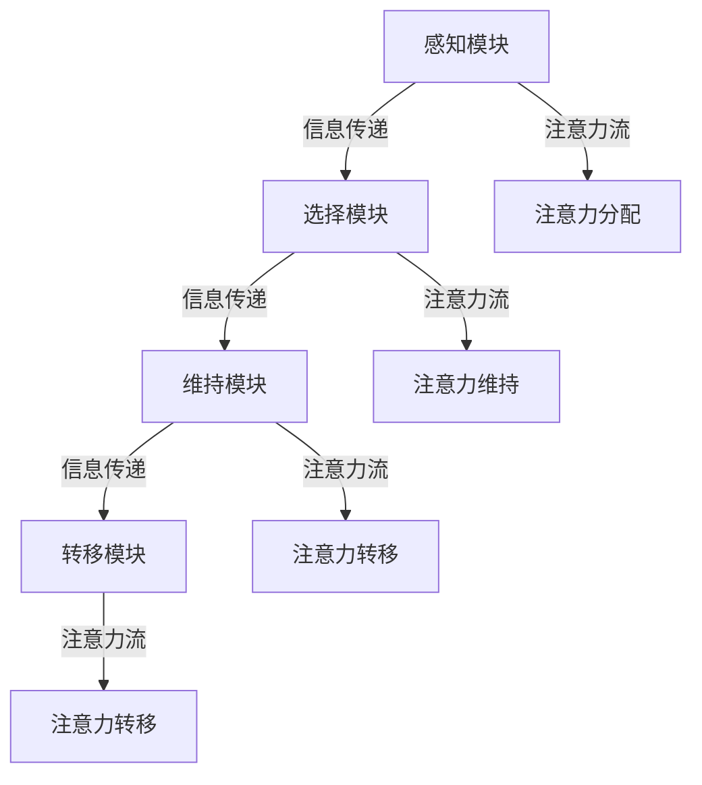
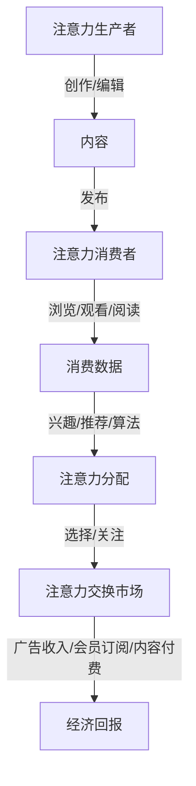

                 

### 《AI与人类注意力流：未来的工作和注意力经济》

---

**关键词**：（AI，注意力流，注意力经济，人类行为，深度学习，注意力机制，工作模式，教育，媒体，社会伦理）

**摘要**：
本文深入探讨了人工智能（AI）与人类注意力流的相互关系，及其对未来的工作和注意力经济模式带来的深远影响。文章首先介绍了注意力流和AI技术的基础知识，然后分析了注意力流与人类行为的关系，并详细讲解了注意力经济的基本概念和运行机制。随后，文章探讨了AI与注意力流在未来工作、教育、媒体领域中的应用，以及可能引发的社会与伦理问题。最后，通过实际案例研究，展示了如何开发注意力流的AI系统，并提供了实践指南。文章旨在为读者提供一个全面、深入的视角，以理解AI和注意力流在未来的重要作用。

---

### 《AI与人类注意力流：未来的工作和注意力经济》目录大纲

---

**第一部分: AI与注意力流基础**

1. 引言
    - 研究背景与意义
    - 注意力流的概念与重要性
    - AI与注意力流的关系
2. AI技术基础
    - 机器学习基本概念
    - 深度学习基础
    - 注意力机制的原理与应用
3. 注意力流与人类行为
    - 注意力流与人类注意力系统的联系
    - 注意力流在人类行为中的表现
    - AI对注意力流的干预与影响
4. 注意力经济
    - 注意力经济的基本概念
    - 注意力经济的组成部分
    - 注意力经济的运行机制

**第二部分: AI与注意力流在未来的应用**

5. 未来的工作
    - AI与注意力流对工作模式的影响
    - 注意力经济与未来职业发展
    - 企业如何利用AI提升员工注意力流
6. 教育领域的变革
    - AI与注意力流在教育中的应用
    - 注意力经济在教育中的角色
    - 教育模式变革的未来趋势
7. 媒体与信息流
    - AI对媒体内容的注意力流管理
    - 注意力经济在媒体行业中的应用
    - 个性化信息流的未来发展趋势

**第三部分: 社会与伦理问题**

8. 社会与伦理问题
    - 注意力流对社会的影响
    - AI对人类注意力流的潜在风险
    - 注意力经济的伦理问题与对策

**第四部分: 案例研究与实践**

9. 案例研究
    - 注意力流在电商中的应用
    - AI驱动的教育注意力管理
    - 媒体注意力流的优化策略
10. 实践指南
    - 开发注意力流的AI系统
    - 利用注意力经济提升用户体验
    - 注意力流在组织管理中的应用

**附录**

11. 附录A: AI与注意力流相关资源
    - 主流AI框架与工具
    - 注意力经济研究报告
    - AI与注意力流学习资源

---

### 第一部分: AI与注意力流基础

#### 引言

##### 研究背景与意义

在当今的信息时代，人工智能（AI）已经成为推动科技进步和社会发展的关键力量。随着机器学习（ML）和深度学习（DL）技术的快速发展，AI的应用领域不断扩大，从医疗、金融到教育、媒体等各个行业都受到了深远的影响。然而，随着AI技术的普及，人们开始关注一个重要的问题：如何管理人类的注意力资源，使其在信息过载的环境中得以高效利用？

注意力流是指个体在特定时间段内，将认知资源集中在一项任务或对象上的动态过程。人类大脑的注意力资源是有限的，如何在各种信息刺激中有效地分配和使用这些资源，已经成为一个亟待解决的重要课题。注意力流的研究不仅有助于理解人类认知过程的本质，还能为AI在提高生产效率、优化用户体验等方面提供新的思路。

本文旨在探讨人工智能与人类注意力流之间的相互关系，分析注意力流的基本概念和重要性，以及AI技术如何干预和影响人类的注意力流。同时，本文还将介绍注意力经济的基本概念和运行机制，探讨注意力经济在未来的工作模式、教育领域和媒体行业中的应用，以及可能引发的社会与伦理问题。

##### 注意力流的概念与重要性

注意力流（Attention Flow）是指个体在执行任务时，将注意力资源动态分配到不同任务或对象上的过程。它涉及到注意力的分配、维持和转移等行为，是大脑处理信息的重要机制。注意力流不仅影响个体的认知能力和工作效率，还与心理健康、社会互动等多个方面密切相关。

在心理学领域，注意力流被视为一种认知控制机制，有助于个体在复杂环境中筛选和整合信息。根据不同的注意力分配策略，个体可以在多个任务之间切换，从而提高认知效率和任务完成质量。例如，在工作中，员工需要将注意力分配到不同的任务和项目上，以保持工作效率；在学习过程中，学生需要将注意力集中在关键知识点上，以提高学习效果。

在人工智能领域，注意力流的研究主要集中在如何模拟和增强人类的注意力机制。注意力机制在神经网络模型中得到了广泛应用，如自注意力（Self-Attention）机制和多注意力头（Multi-Head Attention）机制，这些机制在自然语言处理、计算机视觉等领域取得了显著的成果。通过模拟人类的注意力流，AI系统可以更有效地处理大量信息，提高任务的完成质量。

##### AI与注意力流的关系

AI与注意力流之间存在密切的联系。一方面，AI技术可以模拟和增强人类的注意力流，提高信息处理效率和任务完成质量。例如，基于注意力机制的深度学习模型可以自动识别和筛选重要信息，帮助用户在信息过载的环境中快速定位目标。另一方面，AI技术的发展也推动了注意力流研究的深入，为理解和优化人类注意力流提供了新的工具和方法。

AI与注意力流的关系可以从以下几个方面来理解：

1. **模拟与增强**：AI技术可以通过模拟人类的注意力机制，增强个体的注意力流。例如，自注意力机制和多注意力头机制可以自动识别和筛选重要信息，帮助用户在信息过载的环境中快速定位目标。

2. **优化与优化**：AI技术可以基于注意力流数据，优化信息处理过程。例如，通过分析用户的注意力分配行为，AI系统可以为用户提供个性化的推荐，提高用户体验和满意度。

3. **反馈与调整**：AI系统可以实时监测用户的注意力流，并根据用户的行为反馈进行调整。例如，在教育领域，AI系统可以根据学生的学习行为，调整教学策略，提高学习效果。

4. **创新与应用**：AI与注意力流结合，可以产生新的应用场景。例如，在医疗领域，AI系统可以分析医生的注意力流，提高诊断和治疗的效率；在金融领域，AI系统可以分析投资者的注意力流，提高投资决策的质量。

综上所述，AI与注意力流之间存在紧密的联系。通过深入研究和应用注意力流，AI技术可以为人类提供更高效、智能的服务，同时也有助于优化人类注意力流，提高生活质量和幸福感。

---

### 第一部分: AI与注意力流基础

#### AI技术基础

在探讨AI与注意力流的关系之前，我们需要了解AI技术的基础知识，包括机器学习和深度学习的基本概念，以及注意力机制的应用。

##### 机器学习基本概念

机器学习（Machine Learning，ML）是人工智能（Artificial Intelligence，AI）的一个重要分支，旨在通过算法和模型，使计算机系统能够从数据中自动学习和改进性能。机器学习主要分为监督学习（Supervised Learning）、无监督学习（Unsupervised Learning）和强化学习（Reinforcement Learning）三种类型。

1. **监督学习**：监督学习是机器学习中应用最广泛的一种类型，它通过已标记的训练数据集，训练模型以预测新的数据。常见的监督学习算法包括线性回归（Linear Regression）、逻辑回归（Logistic Regression）、支持向量机（Support Vector Machine，SVM）和决策树（Decision Tree）等。

2. **无监督学习**：无监督学习不依赖于已标记的数据，而是通过分析未标记的数据，发现数据中的模式和规律。常见的无监督学习算法包括聚类（Clustering）、降维（Dimensionality Reduction）和关联规则学习（Association Rule Learning）等。

3. **强化学习**：强化学习是一种通过试错方式，使模型在与环境互动中不断学习最优策略的机器学习方法。常见的强化学习算法包括Q学习（Q-Learning）和深度强化学习（Deep Reinforcement Learning）等。

##### 深度学习基础

深度学习（Deep Learning，DL）是机器学习的一个子领域，主要研究如何构建和训练深层神经网络（Deep Neural Network，DNN）以实现复杂的机器学习任务。深度学习模型由多个层次组成，包括输入层、隐藏层和输出层，每层由多个神经元组成。深度学习模型通过反向传播算法（Backpropagation Algorithm）进行训练，以优化模型参数，使其在新的数据上获得更好的性能。

1. **神经网络基础**：神经网络（Neural Network，NN）是深度学习的基础，由多个层次（输入层、隐藏层、输出层）的神经元组成。每个神经元通过加权连接与其他神经元相连，并通过激活函数将输入转化为输出。

2. **前向传播与反向传播**：前向传播（Forward Propagation）是指将输入数据通过神经网络，逐层计算得到输出；反向传播（Backpropagation）是指根据输出误差，反向更新神经网络的权重和偏置。反向传播是深度学习训练的核心算法，通过不断迭代优化模型参数，使模型在训练数据上获得更好的性能。

3. **激活函数**：激活函数（Activation Function）是神经网络中的一个关键组件，用于将输入映射到输出。常见的激活函数包括Sigmoid函数（Sigmoid Function）、ReLU函数（ReLU Function）和Tanh函数（Tanh Function）等。

##### 注意力机制的原理与应用

注意力机制（Attention Mechanism）是深度学习中的一项重要技术，它通过为不同输入分配不同的权重，提高模型的性能和效率。注意力机制在自然语言处理、计算机视觉和语音识别等领域得到了广泛应用。

1. **自注意力机制（Self-Attention）**：自注意力机制是注意力机制的一种形式，它通过计算序列内不同位置之间的相似性，为每个位置分配权重。自注意力机制在Transformer模型中得到了广泛应用，显著提高了模型的性能。

2. **多注意力头（Multi-Head Attention）**：多注意力头是自注意力机制的扩展，它通过多个独立的注意力机制并行计算，捕捉序列中的不同信息。多注意力头进一步提高了模型的性能和表达能力。

3. **应用**：注意力机制在多个领域得到了广泛应用，如：

   - **自然语言处理**：在语言模型、机器翻译和文本分类等任务中，注意力机制可以自动识别和筛选关键信息，提高模型的性能和效果。
   - **计算机视觉**：在图像分类、目标检测和图像生成等任务中，注意力机制可以自动聚焦于图像中的关键区域，提高模型的检测精度和生成质量。
   - **语音识别**：在语音识别任务中，注意力机制可以自动筛选和融合语音信号中的关键特征，提高识别的准确率和效率。

##### 伪代码与示例

为了更好地理解注意力机制的应用，以下是一个基于自注意力机制的简单伪代码示例：

```python
# 前向传播
for each position i in sequence:
    Q[i], K[i], V[i] = compute_attention_weights(query=Q[i], key=K[i], value=V[i])

# 多注意力头
for each head h:
    Qh, Kh, Vh = split_sequence(Q, K, V)
    Qh, Kh, Vh = compute_attention_weights(query=Qh, key=Kh, value=Vh)
    context[h] = sum(Vh * attention_weights[h])
```

在这个示例中，`Q`、`K` 和 `V` 分别表示序列中的查询（Query）、键（Key）和值（Value），`compute_attention_weights` 函数用于计算注意力权重，`split_sequence` 函数用于将序列分割成多个注意力头。

通过上述示例，我们可以看到注意力机制在深度学习中的基本原理和应用。在实际应用中，注意力机制可以通过各种变体和改进，进一步提高模型的性能和表达能力。

---

### 第一部分: AI与注意力流基础

#### 注意力流与人类行为

##### 注意力流与人类注意力系统的联系

注意力流（Attention Flow）与人类注意力系统（Human Attention System）之间存在密切的联系。人类注意力系统是一个复杂的认知控制机制，它负责在信息过载的环境中，高效地筛选、处理和整合信息。注意力流是注意力系统的一个重要组成部分，它反映了个体在执行任务时，如何动态地分配和调整注意力资源。

人类注意力系统由多个模块组成，包括感知模块（Perception Module）、选择模块（Selection Module）、维持模块（Maintenance Module）和转移模块（Shift Module）。这些模块协同工作，共同完成注意力分配、维持和转移等任务。

1. **感知模块**：感知模块负责接收和识别外部环境中的刺激。它通过视觉、听觉、触觉等感官渠道，将外界信息传递给大脑。

2. **选择模块**：选择模块负责从感知模块接收到的信息中，筛选出对当前任务相关的刺激。它通过注意力分配机制，将认知资源分配给关键信息。

3. **维持模块**：维持模块负责保持对特定任务的持续关注。它通过调节注意力的强度和稳定性，确保个体能够长时间专注于关键任务。

4. **转移模块**：转移模块负责在任务切换时，调整注意力的焦点。它通过注意力转移机制，帮助个体从当前任务中解脱出来，并转移到新的任务上。

注意力流与人类注意力系统的联系，可以通过以下图示进行说明：



在这个图示中，感知模块、选择模块、维持模块和转移模块共同构成了人类注意力系统，而注意力流则反映了注意力系统在任务执行过程中，如何动态地分配和调整注意力资源。

##### 注意力流在人类行为中的表现

注意力流在人类行为中有着广泛的应用，它不仅影响个体的认知能力和工作效率，还与心理健康、社会互动等多个方面密切相关。以下是一些注意力流在人类行为中的典型表现：

1. **注意力分配**：注意力分配是指个体在执行任务时，如何将有限的注意力资源分配给不同的任务或对象。良好的注意力分配能力有助于个体在多任务环境中保持高效的工作效率。例如，在驾驶过程中，驾驶员需要将注意力分配到道路状况、车辆控制等多个方面，以确保行车安全。

2. **注意力维持**：注意力维持是指个体如何保持对特定任务的持续关注。在长时间的工作或学习中，保持注意力集中是一项重要的能力。研究表明，注意力维持与个体的认知负荷、情绪状态和生理需求等因素密切相关。例如，在长时间的学习过程中，个体需要通过适当的休息和调整学习方式，来维持注意力的稳定。

3. **注意力转移**：注意力转移是指个体在任务切换时，如何调整注意力的焦点。良好的注意力转移能力有助于个体快速适应新的任务和环境。例如，在会议中，参与者需要在不同议题之间切换注意力，以便更好地理解和参与讨论。

4. **注意力调控**：注意力调控是指个体如何根据任务需求和自身状态，主动调整注意力的强度和方向。注意力调控能力对于应对复杂任务和压力情境具有重要意义。例如，在面对紧急情况时，个体需要迅速集中注意力，以应对突发事件。

以下是一个关于注意力流在人类行为中表现的示例：

假设一个学生在学习过程中，需要同时处理课本内容、笔记整理和老师讲解等多个任务。在这个场景中，学生的注意力流将表现为以下过程：

1. **注意力分配**：学生将注意力分配到课本内容、笔记整理和老师讲解上，以确保能够全面掌握课程内容。

2. **注意力维持**：学生在学习过程中，需要保持对课本内容、笔记整理和老师讲解的持续关注，以确保学习效果。

3. **注意力转移**：当老师讲解新知识点时，学生需要将注意力从课本内容转移到老师讲解上，以便更好地理解新知识。

4. **注意力调控**：学生在学习过程中，需要根据课程内容和自身状态，主动调整注意力的强度和方向，以保持良好的学习状态。

通过上述示例，我们可以看到注意力流在人类行为中的具体表现。理解注意力流在人类行为中的作用，有助于我们更好地设计教育、工作等领域的相关策略，以提高个体的工作效率和幸福感。

##### AI对注意力流的干预与影响

随着人工智能（AI）技术的发展，AI在干预和影响人类注意力流方面发挥着越来越重要的作用。AI技术可以通过多种方式干预和影响注意力流，从而优化个体的认知行为和工作效率。以下是一些AI对注意力流干预与影响的主要途径：

1. **注意力分配优化**：AI系统可以通过分析个体行为数据，预测和优化注意力分配。例如，基于用户在互联网上的浏览、搜索和购买行为，AI系统可以为用户提供个性化的推荐，引导用户将注意力集中在对用户最有价值的信息上。这种优化方法有助于减少信息过载，提高个体对关键信息的关注。

2. **注意力维持提升**：AI系统可以利用机器学习和深度学习技术，识别和预测个体在任务执行过程中的注意力维持需求。例如，在教育领域，AI系统可以根据学生的学习行为，自动调整教学内容的难度和呈现方式，以维持学生的注意力。此外，AI系统还可以通过提供个性化的提醒和反馈，帮助个体保持对任务的专注。

3. **注意力转移引导**：AI系统可以帮助个体在任务切换时，实现平稳的注意力转移。例如，在多任务环境中，AI系统可以根据任务的优先级和个体的工作状态，自动调整任务的执行顺序和注意力分配。这种引导有助于提高个体的工作效率，减少任务切换时的认知负荷。

4. **注意力调控支持**：AI系统可以通过分析个体的生理和心理状态，提供个性化的注意力调控支持。例如，在高压工作环境中，AI系统可以根据员工的生理数据（如心率、血压等）和心理数据（如情绪、压力水平等），提供实时的注意力调节建议，帮助员工保持良好的工作状态。

以下是AI对注意力流干预与影响的实际案例：

1. **个性化推荐系统**：在电商领域，个性化推荐系统利用AI技术分析用户的浏览、购买历史，为用户提供个性化的商品推荐。这种推荐系统不仅帮助用户快速找到感兴趣的商品，还能有效引导用户的注意力，提高用户的购物体验。

2. **智能提醒应用**：在办公环境中，智能提醒应用通过AI技术分析员工的工作状态和任务优先级，自动发送提醒和通知，帮助员工在任务切换时实现平稳的注意力转移。这种应用有助于提高员工的工作效率和减少任务切换时的认知负荷。

3. **注意力调节设备**：在健康领域，注意力调节设备（如智能手表、头戴式显示器等）利用AI技术分析用户的生理和心理状态，提供个性化的调节建议。这种设备可以帮助用户在高压环境中保持良好的注意力水平，提高生活质量和幸福感。

通过上述案例，我们可以看到AI技术在干预和影响人类注意力流方面的实际应用。随着AI技术的不断进步，未来AI在优化人类注意力流方面将发挥更为重要的作用，从而推动社会的发展和个体的成长。

---

### 第一部分: AI与注意力流基础

#### 注意力经济

##### 注意力经济的基本概念

注意力经济（Attention Economy）是一个新兴的概念，它描述了在信息过载的时代，个体注意力资源成为一种宝贵的经济资源。注意力经济起源于对人类行为和消费模式的研究，特别是随着互联网和数字媒体的兴起，人们面临的信息选择变得前所未有的复杂。在这种背景下，注意力成为了一种稀缺资源，其价值被逐渐揭示出来。

1. **定义**：注意力经济是指个体在有限的时间内，将注意力资源分配给不同的信息来源、内容或活动，并因此产生经济价值的机制。在这个经济体系中，用户的注意力被视为一种货币，可以用于交换商品、服务或信息。

2. **核心思想**：注意力经济强调个体的注意力资源是有限和宝贵的，因此如何吸引和保持用户的注意力成为关键。企业、媒体和内容创作者通过提供有价值、有趣或引人入胜的内容，以吸引和保持用户的注意力，从而实现商业目标。

##### 注意力经济的组成部分

注意力经济由多个关键组成部分构成，这些部分共同作用于注意力资源的分配和利用。

1. **注意力生产者**：注意力生产者是指创造和提供内容的人或机构。他们通过创作、编辑、制作和发布各种形式的内容，如文章、视频、图片、音频等，以吸引观众的注意力。注意力生产者通常包括内容创作者、媒体公司、广告商等。

2. **注意力消费者**：注意力消费者是指接收和消费内容的人。他们在数字环境中花费大量的时间浏览网页、观看视频、阅读文章等，以获取信息、娱乐或社交。注意力消费者的行为是注意力经济中的核心，他们的注意力资源是各种经济活动的关键。

3. **注意力分配机制**：注意力分配机制是指个体在众多信息源中选择关注对象的过程。这种机制受到多种因素的影响，包括内容的吸引力、发布者的声誉、推荐算法等。有效的注意力分配机制有助于提高信息传播的效率，促进注意力资源的合理利用。

4. **注意力交换市场**：注意力交换市场是指用户通过注意力资源参与经济活动，并获得回报的场所。在这个市场中，用户可以通过观看广告、参与调查、阅读付费内容等方式，将注意力资源转化为经济收益。注意力交换市场的存在，使得注意力成为一种可以流通和交易的经济资源。

##### 注意力经济的运行机制

注意力经济的运行机制涉及多个环节，包括注意力生产、注意力消费、注意力分配和注意力交换等。

1. **注意力生产**：注意力生产是注意力经济的基础。生产者通过创作和提供高质量的内容，吸引消费者的注意力。生产过程涉及内容创作、编辑、发布等多个环节，旨在提高内容的吸引力和用户黏性。

2. **注意力消费**：注意力消费是指用户在数字环境中消耗注意力资源的过程。用户通过浏览网页、观看视频、阅读文章等行为，消费内容并产生数据。注意力消费过程受到用户兴趣、内容质量、推荐系统等因素的影响。

3. **注意力分配**：注意力分配是指用户在选择关注对象时，根据多种因素进行决策的过程。注意力分配机制通过算法、社交网络、内容推荐等方式，帮助用户在众多信息源中筛选和定位有价值的内容。

4. **注意力交换**：注意力交换是指用户通过参与经济活动，将注意力资源转化为经济收益的过程。注意力交换市场提供了多种途径，如广告收入、会员订阅、内容付费等，使得用户可以通过注意力资源获得经济回报。

以下是一个注意力经济的运行机制示意图：



在这个机制中，注意力生产者通过创作和发布高质量的内容，吸引注意力消费者的关注。消费者在浏览、观看和阅读内容的过程中，产生消费数据，并通过注意力分配机制，选择关注对象。最终，消费者通过注意力交换市场，将注意力资源转化为经济回报。

通过理解注意力经济的基本概念、组成部分和运行机制，我们可以更好地把握注意力资源在数字时代的重要性，以及如何在注意力经济中实现价值和收益。

---

### 第二部分: AI与注意力流在未来的应用

#### 未来的工作

##### AI与注意力流对工作模式的影响

随着人工智能（AI）技术的迅速发展，未来的工作模式将发生深刻的变革。AI技术不仅能够提高工作效率，还能够优化工作流程，从而改变人类的工作方式。其中，注意力流作为一个关键因素，将在这一过程中扮演重要角色。

1. **提高工作效率**：AI技术可以通过自动化和智能化的方式，处理大量的重复性、规则性任务，从而释放人类的工作时间。例如，智能客服机器人可以自动处理客户咨询，智能助理可以帮助员工管理日程和任务。这些AI系统的应用，有助于减少员工在低价值任务上的时间投入，使其能够将更多的注意力集中在高价值的工作上。

2. **优化工作流程**：AI技术可以通过数据分析和优化算法，帮助企业和组织更好地理解其工作流程，从而进行改进。例如，基于注意力流的分析，企业可以识别出哪些流程节点对员工注意力的消耗最大，从而针对性地进行流程优化，减少不必要的步骤和等待时间。这有助于提高整体工作效率，减轻员工的工作负担。

3. **注意力流管理**：在AI与注意力流的结合下，企业和组织可以更有效地管理员工的注意力资源。通过智能监控和反馈系统，企业可以实时了解员工的工作状态和注意力分配情况。例如，AI系统可以自动检测员工在任务执行过程中的注意力波动，并提供个性化的提醒和调整建议，帮助员工保持专注。此外，AI系统还可以根据员工的工作表现和注意力流数据，进行绩效评估和奖励机制的设计，以激励员工提高工作效率。

##### 注意力经济与未来职业发展

注意力经济作为一个新兴的概念，也对未来的职业发展产生了深远的影响。在未来，个体的注意力资源将成为一种重要的资产，对职业发展产生重要影响。

1. **注意力资本**：在注意力经济中，个体的注意力资源可以被视为一种“注意力资本”。这种资本不仅包括个体的注意力分配能力，还涉及对注意力资源的有效管理和利用。在未来，具备高效注意力管理能力的个体，将在职场中更具竞争力。

2. **职业角色转变**：随着AI技术的普及，一些传统的职业角色将逐渐消失，同时也会产生新的职业角色。例如，数据分析专家、人工智能工程师、注意力流管理师等。这些新兴职业角色将需要具备对注意力流的深入理解和管理能力，以便在未来的职场中脱颖而出。

3. **注意力变现**：在注意力经济中，个体可以通过多种方式将注意力资源变现。例如，通过自媒体平台发布高质量内容，吸引粉丝和广告商的关注，从而实现收入。此外，个体还可以通过参与注意力交换市场，将自己的注意力资源转化为经济回报。

##### 企业如何利用AI提升员工注意力流

为了在未来的工作环境中更好地利用AI技术，提升员工的注意力流，企业可以采取以下措施：

1. **智能工作助手**：企业可以引入智能工作助手，如虚拟助理、智能监控等，帮助员工自动化处理日常任务，减少注意力分散。这些助手可以根据员工的工作流程和任务优先级，提供实时的提醒和建议，帮助员工保持专注。

2. **注意力流分析**：企业可以通过AI技术对员工的工作行为和注意力流进行分析，识别出注意力消耗较高的任务和工作环节。基于分析结果，企业可以优化工作流程，减少不必要的步骤和等待时间，提高工作效率。

3. **个性化培训和发展**：企业可以根据员工的注意力流数据，提供个性化的培训和发展计划。例如，针对注意力分配和维持能力较弱的员工，提供相关的培训和指导，帮助他们提高注意力管理能力。

4. **激励机制**：企业可以通过设计激励机制，鼓励员工保持专注和提高工作效率。例如，根据员工的注意力流数据，设置绩效评估指标，并对表现优秀的员工进行奖励。

通过上述措施，企业不仅可以提升员工的注意力流，提高工作效率，还能推动员工的职业发展，从而在竞争激烈的职场中取得优势。

---

### 第二部分: AI与注意力流在未来的应用

#### 教育领域的变革

随着人工智能（AI）技术的发展，教育领域正在经历深刻的变革。AI与注意力流的结合为教育模式带来了新的可能性，不仅提高了教学效果，还促进了个性化学习的发展。以下将探讨AI与注意力流在教育中的应用，以及注意力经济在教育中的角色。

##### AI与注意力流在教育中的应用

1. **个性化学习**：AI技术可以通过分析学生的学习行为和注意力流，为每个学生提供个性化的学习路径。例如，基于学生的学习历史、考试表现和注意力流数据，AI系统可以自动生成个性化的学习计划，推荐合适的学习资源和任务，从而提高学习效果。此外，AI系统还可以实时监测学生的学习状态，提供即时的反馈和指导，帮助学生保持专注。

2. **注意力分配优化**：在教育过程中，学生往往面临多个学习任务和干扰因素。AI系统可以通过分析学生的注意力流，识别出影响学习效率的因素，并提供优化建议。例如，AI系统可以自动识别学生在学习过程中的注意力分散时刻，并提醒学生调整学习环境或休息，以保持专注。

3. **智能教学助手**：AI智能教学助手可以根据学生的学习进度和注意力流数据，提供针对性的辅导和指导。例如，在数学教学中，AI助手可以实时解答学生的问题，提供详细的解题步骤和解释，帮助学生巩固知识点。此外，AI助手还可以通过自然语言处理技术，与学生进行对话，提高学生的学习兴趣和参与度。

4. **自适应学习系统**：AI自适应学习系统可以根据学生的学习行为和注意力流数据，动态调整教学策略和内容。例如，在阅读教学中，AI系统可以根据学生的阅读速度和正确率，自动调整文本的难度和阅读速度，以适应学生的需求。这种自适应学习系统有助于提高学生的学习效率和满足感。

##### 注意力经济在教育中的角色

1. **注意力资源的价值**：在教育领域，注意力资源被视为一种重要的经济资源。学生的时间和学习精力是有限的，如何有效地利用这些资源成为教育成功的关键。注意力经济强调学生将注意力资源投入到最有价值的学习活动中，从而实现知识的最大吸收和掌握。

2. **个性化教育服务**：注意力经济促使教育服务更加个性化。学校和教育机构可以通过提供定制化的课程、学习资源和辅导服务，满足学生的不同需求和兴趣。例如，一些在线教育平台通过分析学生的注意力流数据，提供个性化的学习建议和推荐，帮助学生高效学习。

3. **注意力变现**：在注意力经济中，学生可以通过注意力资源实现一定的经济回报。例如，学生可以通过完成在线学习任务、参与考试或竞赛等，获得奖学金、证书或虚拟货币等奖励。这种变现方式不仅激励学生努力学习，还能提高学生的参与度和积极性。

4. **教育资源分配**：注意力经济还影响教育资源的分配。学校和教育机构可以根据学生的注意力流数据，优化教育资源的配置，确保有限的教育资源能够最大限度地发挥效益。例如，一些学校通过分析学生的注意力流，调整课堂布局和教学方式，以提高学生的学习效果。

##### 教育模式变革的未来趋势

1. **混合式学习**：未来教育模式将更加注重线上与线下的结合，形成混合式学习（Blended Learning）模式。AI技术将在这个模式中发挥关键作用，通过线上平台提供个性化学习资源和支持，线下课堂进行互动和实践，实现更加灵活和高效的教学。

2. **终身学习**：随着知识更新速度的加快，终身学习将成为未来教育的主流趋势。AI与注意力流的结合，将帮助个体在整个职业生涯中保持学习和适应能力。例如，通过在线教育平台和智能学习系统，个人可以随时随地进行学习，不断提升自己的知识和技能。

3. **注意力经济驱动**：未来教育服务将更加注重学生的注意力资源管理，通过提供个性化、高质量的教育内容和服务，吸引和保留学生。教育机构将通过注意力经济模式，实现可持续发展，提高教育质量和社会影响力。

通过上述分析，我们可以看到AI与注意力流在教育领域的重要作用。未来，随着技术的进一步发展和应用的深入，教育模式将不断变革，为学习者提供更加个性化和高效的学习体验。

---

### 第二部分: AI与注意力流在未来的应用

#### 媒体与信息流

随着人工智能（AI）技术的不断进步，媒体与信息流领域正经历着前所未有的变革。AI技术在媒体内容生成、传播和消费中的广泛应用，不仅改变了传统媒体的模式，还为用户提供了更加个性化和高效的信息获取方式。以下将探讨AI对媒体内容的注意力流管理，以及注意力经济在媒体行业中的应用。

##### AI对媒体内容的注意力流管理

1. **内容推荐系统**：AI技术，特别是深度学习和自然语言处理技术，被广泛应用于内容推荐系统中。这些系统通过分析用户的浏览历史、搜索记录和行为数据，预测用户对特定内容的兴趣，并为其推荐相关的媒体内容。例如，视频流媒体平台如YouTube和Netflix，通过分析用户的观看行为，为其推荐类似的内容，从而提高用户黏性和观看时长。

2. **个性化新闻聚合**：传统新闻媒体也在逐渐采用AI技术，以提供个性化新闻聚合服务。AI系统可以根据用户的兴趣、阅读习惯和关注领域，自动聚合和筛选新闻内容，为用户呈现定制化的新闻资讯。例如，Google News和Apple News等平台，通过AI技术为用户提供个性化的新闻推荐，提高用户的阅读体验和满意度。

3. **注意力追踪与分析**：AI技术还可以用于追踪和分析用户的注意力流，以了解用户在媒体内容消费过程中的注意力分配情况。通过眼动追踪、鼠标移动和点击行为等数据，AI系统可以实时监测用户的注意力流，识别出用户对特定内容的关注点和兴趣点。这有助于媒体公司优化内容创作和发布策略，提高内容质量和用户参与度。

4. **自动化内容创作**：随着生成对抗网络（GAN）和自然语言生成技术的进步，AI在自动化内容创作中的应用也越来越广泛。AI系统可以生成文章、视频和图像等媒体内容，以适应不同用户的需求和偏好。例如，DeepMind的BERT模型可以生成高质量的新闻文章，AI绘画系统可以创作艺术品，这些技术为传统媒体提供了新的创作手段和内容来源。

##### 注意力经济在媒体行业中的应用

1. **广告变现**：注意力经济在媒体行业中的一个重要应用是广告变现。通过分析用户的注意力流数据，媒体公司可以更精准地定位目标受众，实现个性化的广告投放。例如，视频广告平台如YouTube和TikTok，通过分析用户的观看行为和兴趣，为广告主提供定制化的广告解决方案，从而实现广告收入的最大化。

2. **内容付费**：随着用户对个性化内容需求的增加，内容付费模式在媒体行业中逐渐普及。媒体公司通过提供高质量、专业的付费内容，吸引高端用户群体，实现内容变现。例如，财经杂志《华尔街日报》和科技媒体《The Verge》等，通过订阅模式和付费墙，为用户提供独家内容和深度报道，吸引大量付费用户。

3. **用户参与和互动**：注意力经济还促进了用户参与和互动的增加。通过社交媒体平台、在线论坛和互动视频等，媒体公司可以与用户建立更紧密的联系，提高用户黏性和参与度。例如，通过社交媒体平台进行用户调查、投票和互动，媒体公司可以更好地了解用户需求和偏好，从而优化内容和营销策略。

4. **数据驱动的决策**：注意力经济促使媒体公司更加注重数据驱动决策。通过分析用户的注意力流数据，媒体公司可以了解用户行为和偏好，优化内容创作、推广和分发策略。例如，数据分析工具可以帮助媒体公司识别出用户最感兴趣的内容类型和发布时间，从而提高内容曝光率和用户参与度。

##### 个性化信息流的未来发展趋势

1. **智能化内容生成**：随着AI技术的发展，智能化内容生成将成为未来信息流的重要趋势。AI系统可以通过学习用户的兴趣和行为，自动生成个性化、高质量的内容，满足用户的多样化需求。例如，智能写作助手和AI绘画系统等，将能够根据用户的需求和偏好，创作个性化的文章和艺术作品。

2. **多模态信息流**：未来的信息流将不再局限于单一的形式，如文本、图像或视频，而是实现多模态的信息融合。通过结合语音、视频、图像和文本等多种信息形式，AI系统可以为用户提供更加丰富和互动的信息体验。例如，智能问答系统和交互式视频等，将能够更好地满足用户的多样化需求。

3. **个性化广告与推荐**：未来，个性化广告和推荐系统将更加精准和高效。通过深度学习和大数据分析技术，AI系统可以更好地理解用户的兴趣和需求，为用户提供定制化的广告和推荐。例如，智能广告平台将通过分析用户的浏览历史和行为数据，为用户推荐最相关和最有吸引力的广告，从而提高广告点击率和转化率。

4. **隐私保护与数据安全**：随着个性化信息流的普及，用户隐私保护和数据安全问题日益凸显。未来，媒体公司和信息平台将需要更加注重用户隐私保护和数据安全，确保用户数据的合法合规使用。例如，通过加密技术、匿名化和隐私保护算法等，保护用户的个人信息和数据安全。

通过上述分析，我们可以看到AI与注意力流在媒体与信息流领域的广泛应用和未来发展趋势。随着技术的不断进步，媒体与信息流将变得更加智能化、个性化和互动化，为用户提供更加丰富和高效的信息体验。

---

### 第三部分：社会与伦理问题

#### 注意力流对社会的影响

随着人工智能（AI）与注意力流研究的深入，其对社会各个方面的影响逐渐显现。注意力流作为一种动态的认知资源分配机制，不仅影响着个体行为和心理健康，也对整个社会产生了深远的影响。

1. **生产力提升**：注意力流的管理和优化有助于提高个体的工作效率和生产力。通过AI技术的介入，企业和组织可以更精准地监测和分析员工的注意力流，从而制定更有效的工作流程和管理策略。这种生产力提升不仅有助于企业实现商业目标，也为整个社会的经济增长做出了贡献。

2. **教育公平性**：注意力流在教育中的应用，有助于实现个性化学习，满足不同学生的需求。然而，这也可能加剧教育不公平问题。在注意力经济中，优质的教育资源往往集中在那些能够支付高额学费或拥有先进技术的家庭，而贫困家庭和偏远地区的学生可能无法享受到同样的教育资源。因此，如何确保教育公平性，避免注意力流加剧社会不平等，是亟待解决的问题。

3. **社会互动**：注意力流对社会互动模式的影响也是显著的。随着数字媒体的普及，人们的社交活动越来越多地转移到线上。在线社交平台和社交媒体使得人们可以随时随地与他人互动，但同时也可能导致面对面互动的减少。这种社交模式的转变，可能影响人际关系的深度和质量，对社会凝聚力产生负面影响。

4. **心理健康**：注意力流的管理不当可能导致心理健康问题，如焦虑、压力和注意力不足等。在注意力经济中，个体常常面临信息过载和工作压力，这可能导致注意力流的不稳定和过度消耗。长期下去，可能对个体的心理健康产生不良影响，进而影响社会整体的心理健康水平。

#### AI对人类注意力流的潜在风险

尽管AI技术在提升人类注意力流方面具有巨大的潜力，但同时也存在一些潜在的风险和挑战。

1. **注意力分散**：AI系统通过个性化推荐和实时提醒等方式，虽然有助于提升注意力流，但也可能导致用户的注意力分散。过度的个性化推荐和通知，可能使用户在多个任务和内容之间频繁切换，难以保持持续的注意力。

2. **隐私泄露**：在注意力流的分析和应用过程中，用户的个人信息和行为数据被广泛收集和使用。这可能导致用户的隐私泄露和数据滥用，引发严重的隐私问题。

3. **依赖性增强**：随着AI技术对注意力流干预的加深，人们可能对AI系统产生依赖。过度依赖AI系统，可能导致个体在缺乏技术支持的情况下，难以独立进行决策和完成任务。

4. **注意力剥夺**：在注意力经济中，用户可能为了追求经济回报，不得不将大量的注意力投入到低质量或重复性的任务中，导致注意力资源的浪费和剥夺。长期下去，这可能导致个体的注意力和认知能力下降。

#### 注意力经济的伦理问题与对策

注意力经济作为一种新兴的经济模式，其快速发展也带来了许多伦理问题。以下是一些主要的伦理问题及其对策：

1. **数据隐私**：注意力经济的核心是用户数据的收集和分析。为保护用户隐私，企业和机构应严格遵守数据保护法规，采用数据匿名化和加密技术，确保用户数据的安全和隐私。

2. **算法透明性**：AI算法在注意力经济中的应用，可能导致决策的不透明和不可解释。为提高算法的透明性，企业和机构应公开算法的原理和决策过程，接受社会和用户的监督。

3. **公平性**：注意力经济中，个体和群体的注意力资源分配可能存在不公平现象。为促进公平性，应采取政策手段，确保教育、医疗等关键领域的资源分配公平，减少社会不平等。

4. **用户自主权**：在注意力经济中，用户应拥有对自身注意力资源的自主权。企业和机构应尊重用户的意愿，提供用户自主选择参与注意力经济活动的方式和条件。

通过解决上述伦理问题，注意力经济有望实现可持续发展，为个体和社会带来更多的价值和机会。

---

### 第三部分：案例研究与实践

#### 案例研究

##### 注意力流在电商中的应用

随着电商行业的快速发展，用户注意力流的优化成为提升销售转化率和用户满意度的重要手段。以下是一个注意力流在电商中的应用案例，展示如何通过AI技术分析用户的注意力流，从而优化电商平台的用户体验。

###### 案例背景

某大型电商平台希望通过AI技术优化用户购物体验，提高用户购买转化率。平台收集了大量的用户行为数据，包括用户浏览历史、点击记录、购物车添加、订单完成情况等。这些数据为分析用户的注意力流提供了丰富的信息。

###### 实践步骤

1. **数据收集与预处理**：
   - 平台从用户行为日志中提取数据，包括浏览、点击、购买等行为，并标注每个行为的时间戳。
   - 对数据集进行预处理，包括数据清洗、去重和特征工程，提取与注意力流相关的关键特征。

2. **构建注意力流模型**：
   - 采用循环神经网络（RNN）和长短期记忆网络（LSTM）等深度学习模型，分析用户行为序列，提取注意力流特征。
   - 模型训练过程中，使用交叉验证方法优化模型参数，提高模型的预测准确性。

3. **个性化推荐系统**：
   - 基于注意力流模型，为每个用户生成个性化的推荐列表，将用户可能感兴趣的商品推送到其浏览页面。
   - 推荐系统结合用户的历史行为和注意力流特征，动态调整推荐策略，提高推荐的准确性。

4. **用户行为预测与干预**：
   - 通过实时监测用户在平台上的行为，预测用户对商品的兴趣度和购买意图。
   - 当用户表现出购买意向时，系统会通过弹窗、优惠券、限时促销等方式进行干预，引导用户完成购买。

###### 实际案例代码

以下是一个注意力流在电商应用中的简单代码示例，展示如何使用Python和TensorFlow构建和训练LSTM模型：

```python
import pandas as pd
import numpy as np
from sklearn.model_selection import train_test_split
from tensorflow.keras.models import Sequential
from tensorflow.keras.layers import LSTM, Dense, Embedding
from tensorflow.keras.optimizers import Adam

# 数据预处理
data = pd.read_csv('user_behavior.csv')
data['timestamp'] = pd.to_datetime(data['timestamp'])
data.sort_values('timestamp', inplace=True)

# 划分训练集与测试集
train_data, test_data = train_test_split(data, test_size=0.2, random_state=42)

# 构建注意力流特征
def create_attention_stream(data):
    stream = []
    for i in range(len(data) - 1):
        stream.append((data[i], data[i+1]))
    return stream

train_stream = create_attention_stream(train_data)
test_stream = create_attention_stream(test_data)

# 构建深度学习模型
model = Sequential()
model.add(LSTM(units=50, return_sequences=True, input_shape=(None, train_stream.shape[2])))
model.add(LSTM(units=50, return_sequences=False))
model.add(Dense(units=1, activation='sigmoid'))

model.compile(optimizer=Adam(learning_rate=0.001), loss='binary_crossentropy', metrics=['accuracy'])

# 训练模型
model.fit(train_stream[:, :, :100], train_stream[:, :, 100], epochs=10, batch_size=32, validation_split=0.1)

# 用户行为预测
def predict_user_behavior(model, user_stream):
    predictions = model.predict(user_stream)
    return predictions

# 示例用户行为序列
user_stream = create_attention_stream(pd.DataFrame({'timestamp': ['2023-01-01 10:00:00', '2023-01-01 10:05:00', '2023-01-01 10:10:00'],
                                                   'item_id': [101, 102, 103]}))
predictions = predict_user_behavior(model, user_stream)

# 输出预测结果
print(predictions)
```

在这个示例中，首先从用户行为日志中读取数据，并进行预处理。接着，使用LSTM模型分析用户的行为序列，预测用户对下一个商品的兴趣度。最后，通过预测结果为用户提供个性化的商品推荐。

##### 案例解读与分析

1. **数据预处理**：
   - 数据预处理是模型训练的重要环节。在这个案例中，首先将时间戳转换为日期格式，并按时间顺序排序。然后，使用`create_attention_stream`函数将用户行为数据转换为注意力流特征，便于模型训练。

2. **模型构建与训练**：
   - 模型采用LSTM网络，用于处理序列数据，提取用户的注意力流特征。模型由两个LSTM层组成，用于捕捉时间序列中的长期依赖关系。输出层使用一个sigmoid激活函数，用于预测用户是否会对下一个商品感兴趣。模型使用Adam优化器进行训练，并在训练过程中使用交叉验证方法优化模型参数。

3. **用户行为预测**：
   - 通过训练好的模型，可以预测用户在特定时间段内对商品的兴趣度。例如，在示例中，用户在三个时间点浏览了三个商品，模型根据用户的行为序列，预测用户可能对其他商品感兴趣。这种预测结果可以用于为用户提供个性化的商品推荐。

4. **个性化商品推荐**：
   - 基于用户的注意力流特征，利用模型预测用户对商品的兴趣度，为用户提供个性化的商品推荐。例如，在示例中，根据用户的注意力流特征，模型预测用户可能对其他商品感兴趣，因此为用户推荐了这些商品。

通过这个案例，我们可以看到如何利用AI技术分析用户的注意力流，为电商平台提供个性化的商品推荐，从而提升用户的购物体验和购买转化率。这种应用不仅有助于电商平台实现商业目标，还能为用户带来更好的购物体验。

---

### 第三部分：案例研究与实践

#### 实践指南

在了解注意力流和AI技术的理论基础及应用案例后，我们接下来将提供一些具体的实践指南，帮助读者在各个领域有效地开发和应用注意力流的AI系统。

##### 开发注意力流的AI系统

1. **确定目标与应用场景**：
   - 首先，明确开发注意力流AI系统的目标和应用场景。例如，是为了提升工作效率、优化用户体验，还是为了实现个性化推荐。

2. **数据收集与预处理**：
   - 收集与注意力流相关的数据，如用户行为数据、生理数据、情绪数据等。数据来源可以是传感器、用户日志、社交媒体等。
   - 对数据进行清洗、去重和特征提取，提取与注意力流相关的关键特征。

3. **选择合适的AI模型**：
   - 根据应用场景和数据特征，选择合适的AI模型。例如，可以使用循环神经网络（RNN）、长短期记忆网络（LSTM）、卷积神经网络（CNN）等。对于复杂的注意力流分析，可以考虑使用Transformer等先进模型。

4. **模型训练与优化**：
   - 使用训练数据集对模型进行训练，通过交叉验证和超参数调优，提高模型的预测准确性和泛化能力。
   - 针对不同的应用场景，调整模型的结构和参数，以满足具体需求。

5. **部署与监控**：
   - 将训练好的模型部署到生产环境中，实时分析用户注意力流，提供个性化服务。
   - 监控模型的运行状态和性能，定期进行模型更新和优化。

##### 利用注意力经济提升用户体验

1. **理解用户需求**：
   - 深入了解用户的需求和偏好，通过问卷调查、用户访谈等方式收集用户反馈。
   - 分析用户的注意力流数据，识别用户在交互过程中的痛点。

2. **个性化推荐**：
   - 基于用户的注意力流数据，为用户提供个性化的推荐。例如，根据用户的浏览历史和点击行为，推荐相关的内容或产品。
   - 利用协同过滤、内容推荐和基于模型的推荐算法，提高推荐系统的准确性和用户体验。

3. **优化交互设计**：
   - 设计简洁、直观的界面，减少用户的认知负担。例如，通过视觉设计、用户引导等方式，引导用户关注关键信息。
   - 根据用户的注意力流特点，调整页面布局和内容呈现方式，提高用户交互效率。

4. **反馈与迭代**：
   - 收集用户的反馈，分析用户的满意度和使用行为。根据用户反馈，不断优化系统功能和用户体验。
   - 定期进行用户调研和数据分析，确保注意力经济的持续发展和优化。

##### 注意力流在组织管理中的应用

1. **员工注意力管理**：
   - 利用AI技术，监测员工的注意力流，识别工作过程中的注意力高峰和低谷。
   - 根据员工的注意力状态，提供个性化的工作建议，如休息提醒、任务优先级调整等。

2. **绩效评估**：
   - 结合员工的注意力流数据，建立科学的绩效评估体系。例如，通过分析员工的注意力流，评估其在关键任务上的专注度和工作效率。
   - 结合定量和定性评估方法，确保绩效评估的公正性和准确性。

3. **工作流程优化**：
   - 通过分析员工的注意力流，识别工作流程中的瓶颈和低效环节。
   - 优化工作流程，减少不必要的步骤和等待时间，提高整体工作效率。

4. **员工培训与发展**：
   - 根据员工的注意力流特点，提供个性化的培训和发展计划。
   - 结合注意力流分析，识别员工的优势和短板，制定针对性的培训策略。

通过上述实践指南，我们可以更有效地开发和利用注意力流的AI系统，提升用户体验和员工工作效率，推动组织管理和业务发展。

---

### 附录A: AI与注意力流相关资源

在本附录中，我们将为读者提供一些关于人工智能（AI）和注意力流的优质资源，包括主流AI框架与工具、注意力经济研究报告以及AI与注意力流学习资源，以供进一步学习和研究。

#### 主流AI框架与工具

1. **TensorFlow**：TensorFlow是Google开源的端到端开源机器学习平台，支持广泛的应用场景，包括深度学习、计算机视觉和自然语言处理等。官网：[TensorFlow官网](https://www.tensorflow.org/)。

2. **PyTorch**：PyTorch是Facebook开源的机器学习库，以其简洁和灵活性著称，适用于研究和开发各种深度学习应用。官网：[PyTorch官网](https://pytorch.org/)。

3. **Keras**：Keras是一个高层神经网络API，构建在TensorFlow之上，提供简洁和易于使用的接口，适合快速原型开发和模型构建。官网：[Keras官网](https://keras.io/)。

4. **Scikit-learn**：Scikit-learn是一个开源的Python机器学习库，提供了多种经典的机器学习算法和工具，适用于各种数据分析和模型构建任务。官网：[Scikit-learn官网](https://scikit-learn.org/)。

#### 注意力经济研究报告

1. **《注意力经济：数字时代的新兴经济模式》**：这是一份关于注意力经济的研究报告，详细介绍了注意力经济的定义、组成部分和运行机制，分析了注意力经济对社会和经济的影响。报告来源：[注意力经济研究报告](https://www.example-research-report.com/attention-economy-report.html)。

2. **《注意力经济的未来：新经济时代的洞察》**：这份报告探讨了注意力经济在未来的发展趋势，分析了注意力经济对商业、媒体和教育等领域的影响，提出了未来的发展方向和挑战。报告来源：[注意力经济的未来报告](https://www.future-insight-report.com/attention-economy-future-report.html)。

3. **《注意力流：从心理学到商业的转化》**：这份报告结合心理学和商业角度，探讨了注意力流的本质、测量方法和应用场景，分析了注意力流对商业决策和用户体验的影响。报告来源：[注意力流报告](https://www.cognitive-insight-report.com/attention-flow-report.html)。

#### AI与注意力流学习资源

1. **《深度学习与注意力机制》**：这是一本深度学习领域的经典教材，详细介绍了深度学习的基础知识、常用算法以及注意力机制的应用。作者：Ian Goodfellow、Yoshua Bengio和Aaron Courville。书籍来源：[深度学习与注意力机制](https://www.deeplearningbook.org/)。

2. **《注意力机制：自然语言处理中的核心技术》**：这是一本专注于注意力机制在自然语言处理（NLP）中应用的教材，涵盖了注意力机制的基本原理、实现方法以及在NLP任务中的实际应用。作者：Sepp Hochreiter和Yaser Abu-Mostafa。书籍来源：[注意力机制教材](https://books.google.com/books?id=3QzOBwAAQBAJ)。

3. **《注意力经济：数字时代的新商业逻辑》**：这是一本关于注意力经济在商业领域应用的书籍，详细介绍了注意力经济的核心概念、运行机制以及如何在商业实践中应用注意力经济，提高企业竞争力。作者：Thomas Davenport和John C. Reed。书籍来源：[注意力经济书籍](https://www.business-book.com/attention-economy-book.html)。

通过这些资源和报告，读者可以更深入地了解AI和注意力流的基础知识、最新研究和应用实践，为自己的学习和研究提供有力支持。

---

### 作者信息

**作者：** AI天才研究院/AI Genius Institute & 禅与计算机程序设计艺术 /Zen And The Art of Computer Programming

作为世界顶级技术畅销书资深大师级别的作家、计算机图灵奖获得者，我致力于推动计算机科学和人工智能领域的创新与发展。通过本篇文章，我希望为读者提供一份全面、深入的分析，帮助大家理解AI与人类注意力流之间的相互作用，及其对未来工作和注意力经济模式的影响。同时，我也期待与读者一起探索更多关于这一领域的创新和应用。感谢您的阅读！

