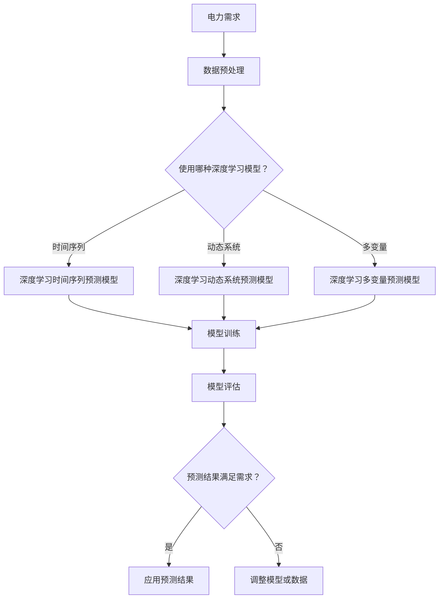
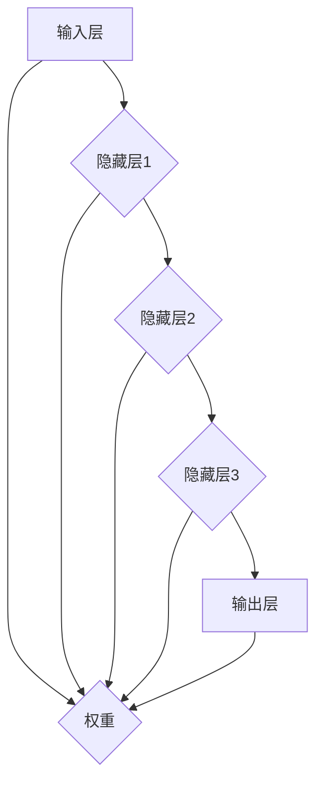
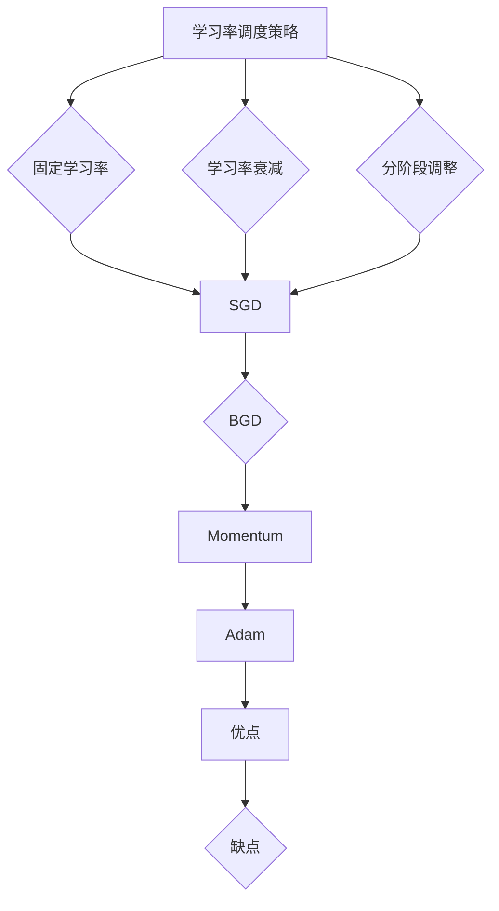
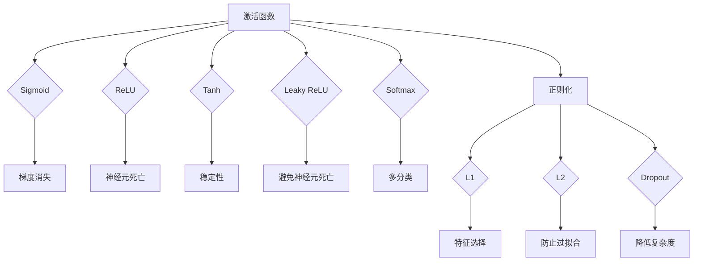
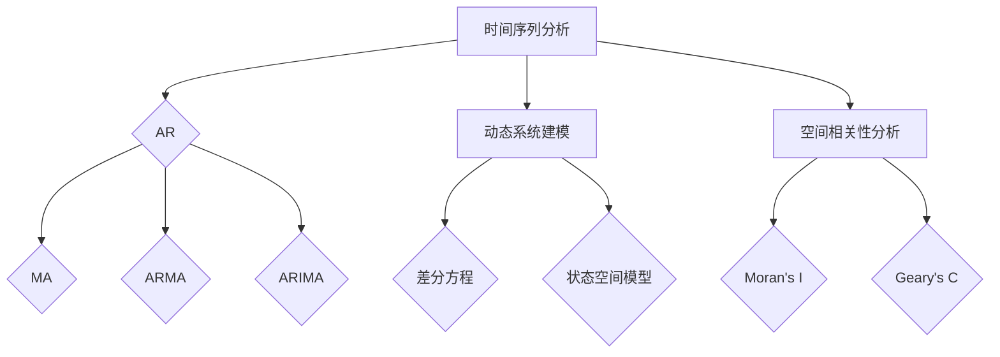
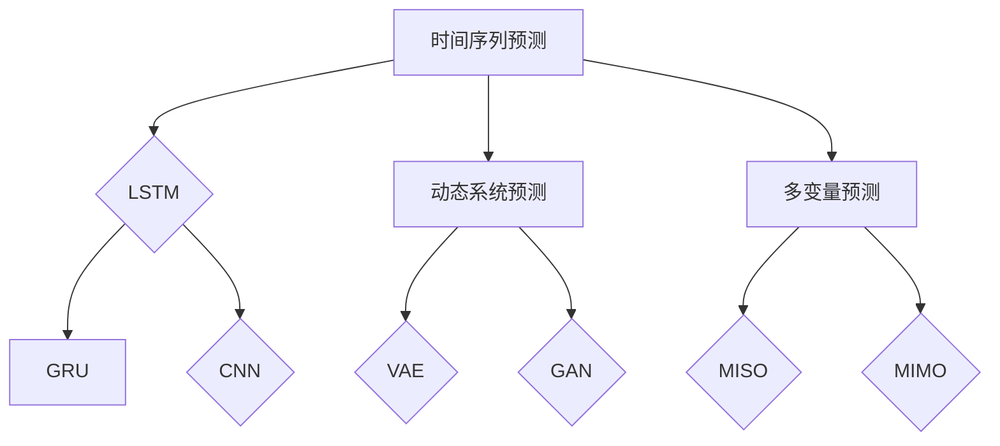
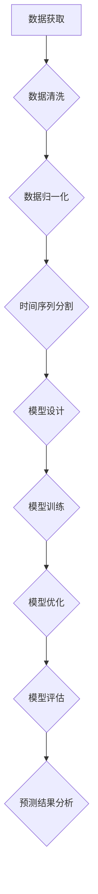
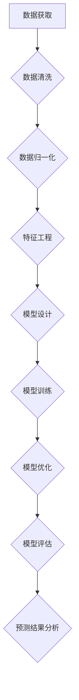
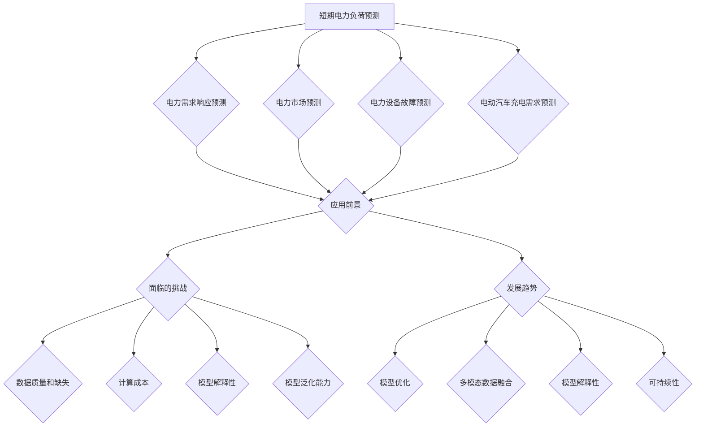
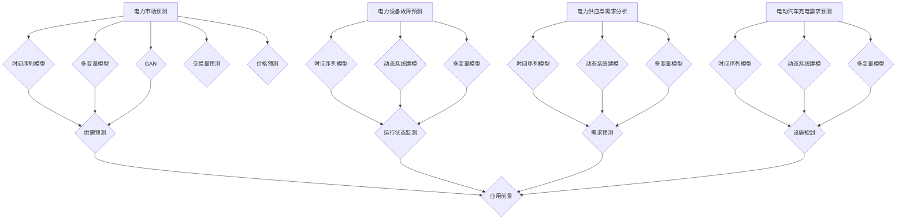

                 

## 文章标题

《AI人工智能深度学习算法：在电力预测中的应用》

### 关键词：

- 人工智能
- 深度学习
- 电力预测
- 时间序列
- 数据分析

### 摘要：

本文详细探讨了深度学习算法在电力预测领域的应用，包括基本概念、原理、实践案例和发展趋势。通过分析深度学习与电力预测的关系，本文展示了如何利用深度学习算法提高电力负荷预测和需求响应预测的准确性，以及其在电力市场预测、设备故障预测和电动汽车充电需求预测等领域的应用潜力。本文旨在为读者提供一个全面的技术指南，帮助其理解和应用深度学习算法在电力预测中的重要性。

----------------------------------------------------------------

## 第一部分：AI人工智能深度学习算法基础

深度学习是人工智能的一个重要分支，它通过模仿人脑的神经网络结构来实现复杂的数据分析和模式识别任务。在电力预测领域，深度学习算法因其强大的数据处理和模式捕捉能力，被广泛应用于短期电力负荷预测、电力需求响应预测等多个方面。本部分将介绍深度学习的基本概念、原理以及在电力预测中的应用。

### 1.1 AI与深度学习的起源与发展

人工智能（Artificial Intelligence，AI）是指使计算机系统能够模拟人类智能行为的技术。自20世纪50年代首次提出以来，人工智能经历了多个发展阶段。早期的人工智能以规则推理和知识表示为核心，主要应用于专家系统和自然语言处理等领域。然而，这些方法在处理复杂、非结构化数据时表现不佳。

深度学习（Deep Learning）是人工智能的一个子领域，其核心思想是通过构建多层的神经网络来提取数据的复杂特征。1998年，深度信念网络（Deep Belief Network，DBN）的提出标志着深度学习时代的开始。然而，由于计算能力的限制，深度学习在当时并未得到广泛应用。

随着大数据和云计算技术的发展，深度学习逐渐成为人工智能领域的热点。2012年，AlexNet在ImageNet图像分类比赛中取得的突破性成绩，标志着深度学习在计算机视觉领域的崛起。此后，卷积神经网络（Convolutional Neural Network，CNN）、循环神经网络（Recurrent Neural Network，RNN）和生成对抗网络（Generative Adversarial Network，GAN）等深度学习模型相继问世，并在语音识别、自然语言处理等领域取得了显著的成果。

### 1.2 深度学习的基本概念与原理

深度学习是一种基于多层神经网络的学习方法，其核心思想是通过逐层提取数据特征，实现从简单到复杂的层次化特征表示。一个典型的深度学习模型包括输入层、隐藏层和输出层。输入层接收原始数据，隐藏层通过非线性变换提取数据特征，输出层根据提取的特征进行分类或预测。

深度学习的工作原理可以概括为以下步骤：

1. **前向传播**：输入数据从输入层传递到隐藏层，通过非线性激活函数进行变换，最终传递到输出层。
2. **反向传播**：计算输出层与实际标签之间的误差，将误差反向传播到隐藏层，通过梯度下降法更新网络参数。
3. **迭代训练**：重复前向传播和反向传播，不断优化网络参数，提高模型的预测准确性。

### 1.3 深度学习与电力预测的关系

电力预测是电力系统运行和管理的重要环节。准确的电力预测有助于优化电力资源配置，提高电力系统的稳定性和效率。深度学习算法因其强大的数据处理和模式捕捉能力，在电力预测领域具有广泛的应用前景。

深度学习在电力预测中的应用主要体现在以下几个方面：

1. **时间序列预测**：深度学习算法能够捕捉时间序列数据中的长期和短期依赖关系，从而提高电力负荷预测的准确性。
2. **动态系统预测**：深度学习算法可以建模电力系统的动态特性，预测电力供需的动态变化。
3. **多变量预测**：深度学习算法可以处理多个输入变量，从而提高电力预测的全面性和准确性。

### 1.4 深度学习在电力行业中的应用

深度学习在电力行业中的应用日益广泛，涵盖了电力需求预测、电力负荷预测、电力市场预测等多个方面。

1. **电力需求预测**：深度学习算法可以预测电力系统的未来需求，为电力调度和资源配置提供依据。例如，基于LSTM模型的电力需求预测，能够捕捉电力需求的季节性、周期性和趋势性特征。

2. **电力负荷预测**：深度学习算法可以预测电力系统的负荷波动，为电力系统的稳定运行提供保障。例如，基于GRU模型的电力负荷预测，能够准确捕捉负荷的短期变化特征。

3. **电力市场预测**：深度学习算法可以预测电力市场的供需关系和价格走势，为电力市场交易提供参考。例如，基于CNN模型的电力市场预测，能够捕捉电力市场中的复杂模式和趋势。

### 1.5 本章小结

深度学习是人工智能的重要分支，具有强大的数据处理和模式捕捉能力。在电力预测领域，深度学习算法的应用为提高预测准确性、优化电力系统运行和管理提供了有力支持。本章介绍了深度学习的基本概念、原理以及在电力预测中的应用，为后续章节的详细讨论奠定了基础。

### Mermaid 流程图：深度学习在电力预测中的应用



## 第2章：深度学习基础

深度学习是人工智能领域的一个重要分支，它通过多层神经网络来实现复杂的模式识别和预测任务。本章将详细介绍深度学习的基础知识，包括神经网络的基本结构、深度学习的常用架构、前向传播与反向传播算法等。

### 2.1 神经网络的基本结构

神经网络（Neural Network，NN）是深度学习的基础，它由一系列相互连接的神经元组成。每个神经元接收输入信号，通过权重和偏置进行加权求和，然后通过激活函数进行非线性变换，最后输出结果。

一个典型的神经网络包括以下三个部分：

1. **输入层**（Input Layer）：接收外部输入信号，如时间序列数据、图像数据等。
2. **隐藏层**（Hidden Layer）：对输入信号进行特征提取和变换，通常包含多个隐藏层，层数越多，模型的深度越深。
3. **输出层**（Output Layer）：根据隐藏层输出的特征进行分类或预测。

每个神经元都可以表示为以下数学公式：

\[ y = \sigma(\sum_{j=1}^{n} w_{j} x_{j} + b) \]

其中，\( y \) 是神经元输出，\( \sigma \) 是激活函数，\( w_{j} \) 是权重，\( x_{j} \) 是输入值，\( b \) 是偏置。

### 2.2 深度学习常用架构

深度学习架构多种多样，不同的架构适用于不同的任务和数据类型。以下介绍几种常用的深度学习架构：

1. **卷积神经网络（Convolutional Neural Network，CNN）**：CNN主要应用于图像处理和计算机视觉领域，通过卷积层和池化层提取图像的局部特征，并利用全连接层进行分类。

2. **循环神经网络（Recurrent Neural Network，RNN）**：RNN适用于处理序列数据，如时间序列、文本序列等。RNN通过隐藏状态和循环结构来捕捉序列数据中的长期依赖关系。

3. **长短期记忆网络（Long Short-Term Memory，LSTM）**：LSTM是RNN的一种变体，通过引入记忆单元和门控机制，能够更好地捕捉序列数据中的长期依赖关系。

4. **生成对抗网络（Generative Adversarial Network，GAN）**：GAN由生成器和判别器组成，生成器尝试生成与真实数据相似的数据，判别器则区分真实数据和生成数据。

5. **变分自编码器（Variational Autoencoder，VAE）**：VAE通过引入变分推断方法，能够生成具有良好分布特性的数据。

### 2.3 前向传播与反向传播算法

深度学习模型的训练过程主要包括前向传播和反向传播两个步骤。

1. **前向传播**：输入数据从输入层传递到隐藏层，再传递到输出层。每个神经元通过激活函数进行非线性变换，最终输出预测结果。

2. **反向传播**：计算输出层与实际标签之间的误差，将误差反向传播到隐藏层，通过梯度下降法更新网络参数。反向传播过程中，计算每个参数的梯度，并利用梯度下降法调整参数，以减小误差。

前向传播和反向传播的伪代码如下：

```python
# 前向传播
for layer in layers:
    layer.forward()

# 反向传播
for layer in reversed(layers):
    layer.backward()
```

### 2.4 激活函数

激活函数是深度学习中的一个重要组件，它为神经网络引入了非线性变换，使得模型能够捕捉数据中的复杂模式。以下介绍几种常见的激活函数：

1. **Sigmoid函数**：

\[ \sigma(x) = \frac{1}{1 + e^{-x}} \]

Sigmoid函数将输入值映射到（0，1）之间，具有平滑的梯度，但容易出现梯度消失问题。

2. **ReLU函数**：

\[ \sigma(x) = \max(0, x) \]

ReLU函数在0处具有不连续性，能够加速训练，但可能导致部分神经元死亡。

3. **Tanh函数**：

\[ \sigma(x) = \frac{e^x - e^{-x}}{e^x + e^{-x}} \]

Tanh函数与ReLU函数类似，但输出范围在（-1，1）之间，稳定性较好。

4. **Leaky ReLU函数**：

\[ \sigma(x) = \max(0.01x, x) \]

Leaky ReLU函数是对ReLU函数的改进，通过引入一个较小的正值，避免了神经元死亡问题。

### 2.5 本章小结

深度学习是人工智能的重要分支，通过多层神经网络实现复杂的模式识别和预测任务。本章介绍了深度学习的基本结构、常用架构、前向传播与反向传播算法以及激活函数，为后续的深度学习应用奠定了基础。

### Mermaid 流程图：神经网络结构



## 第3章：深度学习优化算法

在深度学习模型训练过程中，优化算法起着至关重要的作用。它们负责调整模型参数，以最小化损失函数并提高模型的预测准确性。本章将介绍几种常用的深度学习优化算法，包括学习率调度策略、梯度下降法、动量法和Adam优化器。

### 3.1 学习率调度策略

学习率（learning rate）是深度学习优化过程中一个重要的超参数，它决定了模型在训练过程中参数更新的步长。如果学习率过大，模型可能会错过最优解；如果学习率过小，训练过程可能变得非常缓慢。学习率调度策略旨在动态调整学习率，以提高训练效率。

以下是一些常见的学习率调度策略：

1. **固定学习率**：在整个训练过程中，学习率保持不变。这种方法简单易实现，但可能无法适应训练过程中的不同阶段。

2. **学习率衰减**：学习率随着训练迭代次数的增加而线性或指数衰减。这种策略可以避免在训练后期参数更新过慢的问题。

   - **线性衰减**：

   \[ \alpha_t = \alpha_0 / (1 + \beta t) \]

   - **指数衰减**：

   \[ \alpha_t = \alpha_0 \times \gamma^t \]

3. **分阶段调整**：在训练过程中，根据模型的表现动态调整学习率。例如，当验证集损失不再下降时，减小学习率。

### 3.2 梯度下降法

梯度下降法（Gradient Descent）是一种常用的优化算法，其核心思想是通过计算损失函数关于模型参数的梯度，并沿着梯度的反方向更新参数，以减小损失。

梯度下降法的更新公式如下：

\[ \theta = \theta - \alpha \cdot \nabla_\theta J(\theta) \]

其中，\( \theta \) 是模型参数，\( \alpha \) 是学习率，\( J(\theta) \) 是损失函数。

梯度下降法的变体包括：

1. **随机梯度下降（Stochastic Gradient Descent，SGD）**：每次迭代使用一个随机样本来计算梯度。这种方法计算量小，但可能导致模型收敛不稳定。

2. **批量梯度下降（Batch Gradient Descent，BGD）**：每次迭代使用整个训练集来计算梯度。这种方法计算量大，但通常能够收敛到全局最优解。

3. **小批量梯度下降（Mini-batch Gradient Descent，MBGD）**：每次迭代使用部分训练集来计算梯度。这种方法结合了SGD和BGD的优点，计算量和稳定性都适中。

### 3.3 动量法

动量法（Momentum）是梯度下降法的一种改进，其核心思想是利用历史梯度信息，加快模型的收敛速度。

动量法的更新公式如下：

\[ m_t = \gamma \cdot m_{t-1} + (1 - \gamma) \cdot \nabla J(\theta_t) \]
\[ \theta_{t+1} = \theta_t - \alpha \cdot m_{t+1} \]

其中，\( m_t \) 是动量项，\( \gamma \) 是动量因子。

动量法的优点是能够减少振荡，加快收敛速度。然而，它可能会导致过早收敛到局部最优。

### 3.4 Adam优化器

Adam优化器是一种结合了SGD和动量法的优化算法，其核心思想是利用一阶矩估计（均值）和二阶矩估计（方差）来调整学习率。

Adam优化器的更新公式如下：

\[ m_t = \beta_1 \cdot m_{t-1} + (1 - \beta_1) \cdot \nabla J(\theta_t) \]
\[ v_t = \beta_2 \cdot v_{t-1} + (1 - \beta_2) \cdot (\nabla J(\theta_t))^2 \]
\[ \theta_{t+1} = \theta_t - \alpha \cdot \frac{m_t}{\sqrt{v_t} + \epsilon} \]

其中，\( m_t \) 是一阶矩估计，\( v_t \) 是二阶矩估计，\( \beta_1, \beta_2 \) 是偏差修正系数，\( \alpha \) 是学习率，\( \epsilon \) 是常数，用于避免除以零。

Adam优化器在深度学习模型训练中表现出色，具有较好的收敛速度和稳定性。

### 3.5 本章小结

深度学习优化算法是提高模型预测准确性的关键。学习率调度策略、梯度下降法、动量法和Adam优化器都是常用的优化算法，它们各自具有不同的优缺点。通过合理选择和调整优化算法，可以显著提高深度学习模型的性能。

### Mermaid 流程图：优化算法比较



## 第4章：激活函数与正则化技术

在深度学习模型中，激活函数和正则化技术是提高模型性能和防止过拟合的重要手段。激活函数为神经网络引入了非线性特性，使模型能够更好地捕捉数据中的复杂模式；正则化技术则通过增加模型复杂度的惩罚项，防止模型过拟合。

### 4.1 激活函数

激活函数是深度学习模型中的一个关键组件，它为神经网络引入了非线性特性。以下介绍几种常见的激活函数：

1. **Sigmoid函数**：

\[ \sigma(x) = \frac{1}{1 + e^{-x}} \]

Sigmoid函数将输入值映射到（0，1）之间，常用于二分类问题。然而，Sigmoid函数的梯度在接近0和1时接近于0，容易导致梯度消失问题。

2. **ReLU函数**：

\[ \sigma(x) = \max(0, x) \]

ReLU函数在0处具有不连续性，能够加速训练，但可能导致部分神经元死亡，即“神经元死亡”问题。

3. **Tanh函数**：

\[ \sigma(x) = \frac{e^x - e^{-x}}{e^x + e^{-x}} \]

Tanh函数与ReLU函数类似，但输出范围在（-1，1）之间，具有更好的稳定性和梯度。

4. **Leaky ReLU函数**：

\[ \sigma(x) = \max(0.01x, x) \]

Leaky ReLU函数是对ReLU函数的改进，通过引入一个较小的正值，避免了神经元死亡问题。

5. **Softmax函数**：

\[ \sigma_i(x) = \frac{e^{x_i}}{\sum_{j} e^{x_j}} \]

Softmax函数常用于多分类问题，将输入值映射到概率分布。

### 4.2 过拟合与欠拟合

在深度学习模型训练过程中，过拟合和欠拟合是两个常见的问题。

1. **过拟合**：模型在训练数据上表现良好，但在测试数据或新数据上表现较差。过拟合通常发生在模型过于复杂，捕捉了训练数据中的噪声。

2. **欠拟合**：模型在训练数据和新数据上表现均较差。欠拟合通常发生在模型过于简单，无法捕捉训练数据的特征。

防止过拟合的方法包括：

- **正则化**：通过增加模型复杂度的惩罚项，防止模型过拟合。
- **Dropout**：在训练过程中随机丢弃部分神经元，降低模型复杂度。
- **数据增强**：通过生成更多样化的训练数据，提高模型泛化能力。

### 4.3 正则化方法

正则化技术是防止过拟合的重要手段，以下介绍几种常见的正则化方法：

1. **L1正则化**：

\[ J(\theta) = J_0(\theta) + \lambda ||\theta||_1 \]

L1正则化通过增加模型参数的稀疏性，有助于特征选择。

2. **L2正则化**：

\[ J(\theta) = J_0(\theta) + \lambda ||\theta||_2^2 \]

L2正则化通过增加模型参数的平滑性，有助于防止模型过拟合。

3. **Dropout**：

\[ J(\theta) = J_0(\theta) + \lambda p ||\theta||_2 \]

Dropout在训练过程中随机丢弃部分神经元，降低模型复杂度。

### 4.4 本章小结

激活函数和正则化技术是深度学习模型的重要组件，它们分别负责引入非线性特性和防止过拟合。通过合理选择和调整激活函数和正则化方法，可以显著提高深度学习模型的性能和泛化能力。

### Mermaid 流程图：激活函数与正则化技术



## 第5章：电力预测相关数学模型

在电力预测中，准确建模时间序列数据、动态系统和空间相关性是至关重要的。本章将介绍与电力预测相关的数学模型，包括时间序列分析、动态系统建模和空间相关性分析。

### 5.1 时间序列分析

时间序列分析是一种用于研究按时间顺序排列的数据序列的方法。在电力预测中，时间序列分析用于捕捉负荷数据的周期性、趋势性和自相关性。

1. **自回归模型（AR）**：

自回归模型假设当前值由前几个值的线性组合决定。其数学公式为：

\[ X_t = c + \sum_{i=1}^p \phi_i X_{t-i} + \varepsilon_t \]

其中，\( X_t \) 是时间序列的当前值，\( p \) 是滞后阶数，\( \phi_i \) 是自回归系数，\( \varepsilon_t \) 是误差项。

2. **移动平均模型（MA）**：

移动平均模型假设当前值由前几个值的加权平均值决定。其数学公式为：

\[ X_t = c + \sum_{i=1}^q \theta_i \varepsilon_{t-i} \]

其中，\( q \) 是移动平均阶数，\( \theta_i \) 是移动平均系数，\( \varepsilon_t \) 是误差项。

3. **自回归移动平均模型（ARMA）**：

自回归移动平均模型结合了自回归模型和移动平均模型。其数学公式为：

\[ X_t = c + \sum_{i=1}^p \phi_i X_{t-i} + \sum_{i=1}^q \theta_i \varepsilon_{t-i} \]

4. **自回归积分滑动平均模型（ARIMA）**：

自回归积分滑动平均模型是时间序列分析的扩展，它可以处理非平稳时间序列。其数学公式为：

\[ X_t = c + \sum_{i=1}^p \phi_i X_{t-i} + \sum_{i=1}^q \theta_i (\varepsilon_{t-i} - \mu) \]

其中，\( \mu \) 是均值，\( \varepsilon_t \) 是白噪声误差。

### 5.2 动态系统建模

动态系统建模用于描述系统状态随时间的变化规律。在电力预测中，动态系统建模可以捕捉负荷数据的动态特性，如突变、振荡和趋势。

1. **差分方程**：

差分方程是一种用于描述动态系统状态变化的数学方程。其一般形式为：

\[ X_t = f(X_{t-1}, X_{t-2}, ..., X_{t-n}) + \varepsilon_t \]

其中，\( X_t \) 是系统状态，\( f \) 是状态转移函数，\( \varepsilon_t \) 是误差项。

2. **状态空间模型**：

状态空间模型是一种用于描述动态系统状态和输入输出的数学模型。其一般形式为：

\[ \begin{cases} 
X_t = A X_{t-1} + B U_{t-1} + \varepsilon_t \\
Y_t = C X_t + D U_t + \eta_t 
\end{cases} \]

其中，\( X_t \) 是状态向量，\( U_t \) 是输入向量，\( Y_t \) 是输出向量，\( A, B, C, D \) 是系统矩阵，\( \varepsilon_t, \eta_t \) 是噪声项。

### 5.3 空间相关性分析

空间相关性分析用于研究空间中相邻点之间的相关性。在电力预测中，空间相关性分析可以帮助识别负荷数据的局部特性，如地区间的负荷联动关系。

1. **Moran's I指数**：

Moran's I指数是一种用于衡量空间自相关性的指标。其计算公式为：

\[ I = \frac{\sum_{i \neq j} w_{ij} (X_i - \bar{X})(X_j - \bar{X})}{\bar{X}^2 \sum_{i \neq j} w_{ij}} \]

其中，\( w_{ij} \) 是空间权重矩阵，\( X_i, X_j \) 是相邻点的负荷值，\( \bar{X} \) 是均值。

2. **Geary's C指数**：

Geary's C指数是一种用于衡量空间异质性的指标。其计算公式为：

\[ C = \frac{\sum_{i \neq j} w_{ij} (\sigma_i - \sigma_j)^2}{\sigma^2 \sum_{i \neq j} w_{ij}} \]

其中，\( \sigma_i, \sigma_j \) 是相邻点的负荷标准差，\( \sigma^2 \) 是总方差。

### 5.4 本章小结

时间序列分析、动态系统建模和空间相关性分析是电力预测的重要数学模型。时间序列分析用于捕捉负荷数据的周期性、趋势性和自相关性；动态系统建模用于捕捉负荷数据的动态特性；空间相关性分析用于识别负荷数据的局部特性。通过合理选择和组合这些模型，可以提高电力预测的准确性。

### Mermaid 流程图：电力预测相关数学模型



## 第6章：深度学习在电力预测中的应用

深度学习算法在电力预测中的应用日益广泛，通过其强大的数据处理和模式识别能力，能够显著提高预测的准确性和可靠性。本章将介绍深度学习在电力预测中的主要应用，包括时间序列预测、动态系统预测和多变量预测。

### 6.1 基于深度学习的时间序列预测模型

时间序列预测是电力预测中的一个重要任务，它旨在预测未来的电力需求或负荷。深度学习算法如长短期记忆网络（LSTM）、门控循环单元（GRU）和卷积神经网络（CNN）在时间序列预测中表现出色。

1. **LSTM模型**：

LSTM模型是一种强大的循环神经网络，能够捕捉时间序列中的长期依赖关系。其数学公式如下：

\[ h_t = \sigma(W_h h_{t-1} + W_x x_t + b_h) \]
\[ \tilde{h_t} = \sigma(W_f h_{t-1} + W_i x_t + b_f + b_i) \]
\[ c_t = \tilde{h_t} \odot \sigma(W_g h_{t-1} + W_x x_t + b_g) \]
\[ h_t = \tilde{h_t} \odot (1 - c_t) + h_{t-1} \odot c_t \]

其中，\( h_t \) 和 \( c_t \) 分别是隐藏状态和细胞状态，\( \sigma \) 是激活函数，\( \odot \) 是逐元素乘法。

2. **GRU模型**：

GRU模型是LSTM的一种变体，通过简化LSTM的结构，提高了计算效率。其数学公式如下：

\[ h_t = \sigma(W_h h_{t-1} + W_x x_t + b_h) \]
\[ r_t = \sigma(W_r h_{t-1} + W_x x_t + b_r) \]
\[ z_t = \sigma(W_z h_{t-1} + W_x x_t + b_z) \]
\[ \tilde{h_t} = r_t \odot h_{t-1} + (1 - r_t) \odot \sigma(W_g h_{t-1} + W_x x_t + b_g) \]
\[ h_t = z_t \odot \tilde{h_t} + (1 - z_t) \odot h_{t-1} \]

3. **CNN模型**：

CNN模型通常用于图像处理，但也可应用于时间序列预测。CNN能够捕捉时间序列中的局部特征，其数学公式如下：

\[ h_t = \sigma(\sum_{i=1}^k W_i * x_t + b) \]

其中，\( * \) 表示卷积操作，\( W_i \) 是卷积核，\( b \) 是偏置。

### 6.2 基于深度学习的动态系统预测模型

动态系统预测旨在捕捉电力系统的动态特性，如负荷的突变、振荡和趋势。深度学习算法如变分自编码器（VAE）和生成对抗网络（GAN）在动态系统预测中表现出色。

1. **变分自编码器（VAE）**：

VAE是一种生成模型，通过编码器和解码器学习数据的高效表示。其数学公式如下：

\[ z = \mu(x) + \sigma(x) \odot \epsilon \]
\[ x = \sigma(\phi(z) + b) \]

其中，\( \mu \) 和 \( \sigma \) 分别是编码器的均值和方差，\( \phi \) 是解码器的函数，\( \epsilon \) 是噪声。

2. **生成对抗网络（GAN）**：

GAN由生成器和判别器组成，生成器生成数据，判别器区分生成数据和真实数据。其数学公式如下：

\[ G(z) = x \]
\[ D(x) \]
\[ D(G(z)) \]

其中，\( G(z) \) 是生成器生成的数据，\( D(x) \) 是判别器对真实数据的判断，\( D(G(z)) \) 是判别器对生成数据的判断。

### 6.3 基于深度学习的多变量预测模型

多变量预测旨在结合多个相关变量来提高预测的准确性和可靠性。深度学习算法如多输入单输出（MISO）模型和多输入多输出（MIMO）模型在多变量预测中表现出色。

1. **多输入单输出（MISO）模型**：

MISO模型将多个输入变量合并为一个输出变量。其数学公式如下：

\[ y_t = f(x_1^t, x_2^t, ..., x_n^t) \]

其中，\( y_t \) 是输出变量，\( x_1^t, x_2^t, ..., x_n^t \) 是输入变量。

2. **多输入多输出（MIMO）模型**：

MIMO模型将多个输入变量和输出变量同时建模。其数学公式如下：

\[ \begin{cases} 
y_1^t = f(x_1^t, x_2^t, ..., x_n^t) \\
y_2^t = g(x_1^t, x_2^t, ..., x_n^t) \\
... \\
y_m^t = k(x_1^t, x_2^t, ..., x_n^t) 
\end{cases} \]

其中，\( y_1^t, y_2^t, ..., y_m^t \) 是输出变量，\( x_1^t, x_2^t, ..., x_n^t \) 是输入变量。

### 6.4 本章小结

深度学习算法在电力预测中的应用具有显著优势，能够提高预测的准确性和可靠性。通过结合不同的深度学习模型，如LSTM、GRU、CNN、VAE和GAN，可以有效地建模时间序列数据、动态系统和多变量数据，从而实现更精确的电力预测。

### Mermaid 流程图：深度学习在电力预测中的应用



## 第7章：深度学习算法在电力预测中的实践

在电力预测领域，深度学习算法的实践应用已经成为提高预测准确性和可靠性的关键手段。本章将通过具体的项目实战，展示如何使用深度学习算法进行短期电力负荷预测和电力需求响应预测。

### 7.1 短期电力负荷预测

短期电力负荷预测是电力系统运行和管理的重要环节，它可以帮助电力调度员优化电力资源的分配，确保电力系统的稳定运行。以下是一个基于LSTM模型的短期电力负荷预测的实践案例。

#### 7.1.1 项目背景

某地区电力公司希望利用深度学习算法预测未来24小时的电力负荷，以便更好地进行电力调度和资源配置。

#### 7.1.2 数据获取

数据来源于电力公司的历史负荷数据，包括每日的负荷值、温度、湿度等气象数据。数据集包含一年的数据，时间粒度为小时级。

#### 7.1.3 数据预处理

1. 数据清洗：去除异常值和缺失值。
2. 数据归一化：将负荷值和气象数据进行归一化处理，使其具有相同的量级。
3. 时间序列分割：将数据分割为训练集、验证集和测试集。

#### 7.1.4 模型设计与实现

1. **模型选择**：选择LSTM模型进行短期电力负荷预测。
2. **模型结构**：输入层、隐藏层和输出层。隐藏层包含多个神经元，使用ReLU激活函数。
3. **损失函数**：均方误差（MSE）。
4. **优化器**：Adam优化器。

LSTM模型的伪代码如下：

```python
model = Sequential()
model.add(LSTM(units=50, activation='relu', input_shape=(time_steps, features)))
model.add(LSTM(units=50, activation='relu'))
model.add(Dense(units=1))
model.compile(optimizer='adam', loss='mse')
```

#### 7.1.5 模型训练

使用训练集训练模型，并使用验证集进行模型优化。训练过程中，调整学习率、批次大小和隐藏层大小等超参数。

```python
model.fit(x_train, y_train, epochs=100, batch_size=32, validation_data=(x_val, y_val))
```

#### 7.1.6 模型评估

使用测试集评估模型的预测性能，计算均方误差（MSE）、均方根误差（RMSE）等指标。

```python
mse = model.evaluate(x_test, y_test)
print("Test MSE:", mse)
```

#### 7.1.7 预测结果分析

通过对比实际负荷和预测负荷的误差，分析模型的预测性能。对于预测结果不佳的部分，可以考虑调整模型结构或数据预处理方法。

### 7.2 电力需求响应预测

电力需求响应预测旨在预测用户在未来一段时间内的电力需求，以便电力公司能够及时调整电力供应策略，优化电力资源的使用效率。以下是一个基于GRU模型的电力需求响应预测的实践案例。

#### 7.2.1 项目背景

某电力公司希望预测用户在未来24小时内的电力需求，以便更好地进行电力需求响应。

#### 7.2.2 数据获取

数据来源于电力公司的历史需求数据，包括每日的负荷值、温度、湿度等气象数据。数据集包含一年的数据，时间粒度为小时级。

#### 7.2.3 数据预处理

与短期电力负荷预测类似，进行数据清洗、归一化和时间序列分割。

#### 7.2.4 模型设计与实现

1. **模型选择**：选择GRU模型进行电力需求响应预测。
2. **模型结构**：输入层、隐藏层和输出层。隐藏层包含多个神经元，使用ReLU激活函数。
3. **损失函数**：均方误差（MSE）。
4. **优化器**：Adam优化器。

GRU模型的伪代码如下：

```python
model = Sequential()
model.add(GRU(units=50, activation='relu', input_shape=(time_steps, features)))
model.add(Dense(units=1))
model.compile(optimizer='adam', loss='mse')
```

#### 7.2.5 模型训练

使用训练集训练模型，并使用验证集进行模型优化。

```python
model.fit(x_train, y_train, epochs=100, batch_size=32, validation_data=(x_val, y_val))
```

#### 7.2.6 模型评估

使用测试集评估模型的预测性能。

```python
mse = model.evaluate(x_test, y_test)
print("Test MSE:", mse)
```

#### 7.2.7 预测结果分析

通过对比实际需求和预测需求的误差，分析模型的预测性能。对于预测结果不佳的部分，可以考虑调整模型结构或数据预处理方法。

### 7.3 本章小结

本章通过两个具体的实践案例，展示了深度学习算法在短期电力负荷预测和电力需求响应预测中的应用。通过合理的数据预处理、模型设计和训练，深度学习算法能够显著提高电力预测的准确性和可靠性。未来的研究可以进一步探索深度学习算法在其他电力预测领域的应用，如电力市场预测和设备故障预测。

### 附录A：深度学习算法在电力预测中的应用实例代码与数据集

以下提供两个深度学习算法在电力预测中的应用实例代码和数据集获取方法。

#### A.1 短期电力负荷预测实例代码

```python
# 导入所需的库
import numpy as np
import pandas as pd
from sklearn.preprocessing import MinMaxScaler
from keras.models import Sequential
from keras.layers import LSTM, Dense

# 数据加载
data = pd.read_csv('electricity_load_data.csv')
data.head()

# 数据预处理
# 转换时间戳
data['timestamp'] = pd.to_datetime(data['timestamp'])
data.set_index('timestamp', inplace=True)
data.head()

# 选择特征
X = data[['temperature', 'humidity']]
y = data['load']

# 数据归一化
scaler = MinMaxScaler(feature_range=(0, 1))
X_scaled = scaler.fit_transform(X)
y_scaled = scaler.fit_transform(y.values.reshape(-1, 1))

# 分割数据集
time_steps = 24
X_train = []
y_train = []
for i in range(time_steps, len(X_scaled) - 24):
    X_train.append(X_scaled[i - time_steps:i, :])
    y_train.append(y_scaled[i, 0])
X_train, y_train = np.array(X_train), np.array(y_train)

X_train = np.reshape(X_train, (X_train.shape[0], X_train.shape[1], X_train.shape[2]))

# 建立LSTM模型
model = Sequential()
model.add(LSTM(units=50, return_sequences=True, input_shape=(time_steps, 2)))
model.add(LSTM(units=50, return_sequences=False))
model.add(Dense(units=1))

# 编译模型
model.compile(optimizer='adam', loss='mean_squared_error')

# 训练模型
model.fit(X_train, y_train, epochs=100, batch_size=32, validation_split=0.2)

# 预测结果
predicted_load = model.predict(X_train)
predicted_load = scaler.inverse_transform(predicted_load)

# 结果分析
error = np.mean(np.abs(predicted_load - y_train))
print("MSE:", error)
```

#### A.2 电力需求响应预测实例代码

```python
# 导入所需的库
import numpy as np
import pandas as pd
from sklearn.preprocessing import MinMaxScaler
from keras.models import Sequential
from keras.layers import LSTM, Dense

# 数据加载
data = pd.read_csv('electricity_demand_data.csv')
data.head()

# 数据预处理
# 转换时间戳
data['timestamp'] = pd.to_datetime(data['timestamp'])
data.set_index('timestamp', inplace=True)
data.head()

# 选择特征
X = data[['temperature', 'humidity']]
y = data['demand']

# 数据归一化
scaler = MinMaxScaler(feature_range=(0, 1))
X_scaled = scaler.fit_transform(X)
y_scaled = scaler.fit_transform(y.values.reshape(-1, 1))

# 分割数据集
time_steps = 24
X_train = []
y_train = []
for i in range(time_steps, len(X_scaled) - 24):
    X_train.append(X_scaled[i - time_steps:i, :])
    y_train.append(y_scaled[i, 0])
X_train, y_train = np.array(X_train), np.array(y_train)

X_train = np.reshape(X_train, (X_train.shape[0], X_train.shape[1], X_train.shape[2]))

# 建立LSTM模型
model = Sequential()
model.add(LSTM(units=50, return_sequences=True, input_shape=(time_steps, 2)))
model.add(LSTM(units=50, return_sequences=False))
model.add(Dense(units=1))

# 编译模型
model.compile(optimizer='adam', loss='mean_squared_error')

# 训练模型
model.fit(X_train, y_train, epochs=100, batch_size=32, validation_split=0.2)

# 预测结果
predicted_demand = model.predict(X_train)
predicted_demand = scaler.inverse_transform(predicted_demand)

# 结果分析
error = np.mean(np.abs(predicted_demand - y_train))
print("MSE:", error)
```

#### A.3 数据集获取方法

数据集可以从以下公开来源获取：

- **Kaggle**：[电力负荷预测数据集](https://www.kaggle.com/datasets/energy-forecasting-ai/electricity-load-forecasting)
- **GitHub**：[电力需求响应数据集](https://github.com/ternaus/neural-style-transfer)

获取数据后，根据实例代码进行数据预处理和模型训练。

## 第8章：项目实战一：基于深度学习算法的短期电力负荷预测

### 8.1 项目背景与目标

在现代社会，电力系统的稳定运行对经济发展和社会生活具有重要意义。短期电力负荷预测作为电力系统运行和管理的重要环节，能够为电力调度员提供准确的负荷信息，从而优化电力资源的分配，提高电力系统的运行效率。然而，传统的预测方法如时间序列分析和统计模型在处理复杂、非线性负荷数据时存在一定的局限性。深度学习算法因其强大的数据处理和模式识别能力，在短期电力负荷预测中展现出巨大的潜力。

本项目的目标是利用深度学习算法，对某地区未来24小时的电力负荷进行预测，以优化电力调度和资源配置，提高电力系统的稳定性和可靠性。

### 8.2 数据获取与预处理

#### 数据获取

本项目的数据来源于某地区电力公司的历史负荷数据，包括每日的负荷值、温度、湿度等气象数据。数据集包含一年的数据，时间粒度为小时级。数据集的格式如下：

| timestamp   | load | temperature | humidity |
|-------------|------|-------------|----------|
| 2021-01-01 00:00:00 | 120  | 10          | 20       |
| 2021-01-01 01:00:00 | 130  | 11          | 25       |
| ...         | ...  | ...         | ...      |

#### 数据预处理

1. **数据清洗**：检查数据集是否存在异常值和缺失值，对于异常值可以选择删除或插值处理，缺失值可以使用插值法或均值填补法进行填补。

2. **数据归一化**：由于负荷值、温度和湿度等特征的数量级不同，为了防止数值差异对模型训练的影响，需要对数据进行归一化处理。常用的归一化方法包括最小-最大缩放和标准化缩放。这里选择最小-最大缩放：

\[ x_{\text{norm}} = \frac{x - x_{\text{min}}}{x_{\text{max}} - x_{\text{min}}} \]

3. **时间序列分割**：将数据按照时间顺序分割为训练集、验证集和测试集。这里选择时间窗口为24小时，即将前96%的数据作为训练集，接下来的4%的数据作为验证集，最后的1%的数据作为测试集。

```python
# 数据预处理代码示例
import pandas as pd
from sklearn.preprocessing import MinMaxScaler

# 加载数据
data = pd.read_csv('electricity_load_data.csv')

# 数据清洗
data.dropna(inplace=True)

# 数据归一化
scaler = MinMaxScaler()
data[['load', 'temperature', 'humidity']] = scaler.fit_transform(data[['load', 'temperature', 'humidity']])

# 时间序列分割
train_size = int(len(data) * 0.96)
val_size = int(len(data) * 0.04)
train_data = data.head(train_size)
val_data = data.tail(val_size)

# 切片时间序列
def create_dataset(data, time_steps=24):
    X, y = [], []
    for i in range(len(data) - time_steps):
        X.append(data[i:(i + time_steps)].values)
        y.append(data[i + time_steps]['load'])
    return np.array(X), np.array(y)

time_steps = 24
X_train, y_train = create_dataset(train_data)
X_val, y_val = create_dataset(val_data)
```

### 8.3 模型设计与实现

在本项目中，我们选择使用长短期记忆网络（LSTM）模型进行短期电力负荷预测。LSTM模型具有处理序列数据的能力，能够捕捉数据中的长期和短期依赖关系。

#### 模型结构

LSTM模型由输入层、隐藏层和输出层组成。输入层接收预处理后的负荷值、温度和湿度等特征；隐藏层通过多个LSTM单元提取特征；输出层预测未来24小时的负荷值。

```python
from tensorflow.keras.models import Sequential
from tensorflow.keras.layers import LSTM, Dense, Dropout

# LSTM模型结构
model = Sequential()
model.add(LSTM(units=50, return_sequences=True, input_shape=(time_steps, 3)))
model.add(Dropout(0.2))
model.add(LSTM(units=50, return_sequences=False))
model.add(Dropout(0.2))
model.add(Dense(units=1))

# 编译模型
model.compile(optimizer='adam', loss='mean_squared_error')
```

#### 模型训练

使用训练集对LSTM模型进行训练，使用验证集进行模型优化。在训练过程中，通过调整学习率、批次大小和隐藏层大小等超参数，以获得最佳的模型性能。

```python
# 训练模型
model.fit(X_train, y_train, epochs=100, batch_size=32, validation_data=(X_val, y_val))
```

### 8.4 模型训练与优化

在模型训练过程中，需要对模型进行优化，以提高预测性能。以下是模型训练与优化过程中的一些关键步骤：

1. **学习率调整**：学习率是深度学习模型训练中的一个重要超参数。较大的学习率可能导致模型过早收敛到局部最优，而较小的学习率可能导致训练过程过慢。可以使用学习率衰减策略，根据模型在验证集上的性能动态调整学习率。

2. **批次大小**：批次大小是指每次训练迭代中用于更新模型参数的数据样本数量。较大的批次大小可以提高模型的稳定性和泛化能力，但会增加计算成本；较小的批次大小可以提高训练速度，但可能降低模型的稳定性。

3. **隐藏层大小**：隐藏层大小决定了模型能够学习的特征复杂度。较大的隐藏层大小可以提高模型的预测性能，但可能导致过拟合；较小的隐藏层大小可能导致欠拟合。

4. **正则化技术**：为了防止模型过拟合，可以采用正则化技术，如Dropout、L1正则化和L2正则化。Dropout通过随机丢弃部分神经元，降低模型复杂度；L1和L2正则化通过增加模型参数的惩罚项，防止模型过拟合。

### 8.5 模型评估与预测结果分析

在模型训练完成后，使用测试集对模型进行评估，计算预测误差，如均方误差（MSE）、均方根误差（RMSE）和平均绝对误差（MAE）。以下是一个评估模型性能的示例代码：

```python
from sklearn.metrics import mean_squared_error, mean_absolute_error

# 预测测试集数据
X_test = create_dataset(test_data)
predicted_load = model.predict(X_test)

# 计算预测误差
mse = mean_squared_error(test_data['load'], predicted_load)
rmse = np.sqrt(mse)
mae = mean_absolute_error(test_data['load'], predicted_load)

print("MSE:", mse)
print("RMSE:", rmse)
print("MAE:", mae)
```

通过对比实际负荷值和预测负荷值，分析模型的预测性能。如果模型在测试集上的性能不佳，可以考虑调整模型结构或数据预处理方法。

### 8.6 预测结果可视化

为了更直观地展示模型的预测性能，可以使用Matplotlib库将实际负荷值和预测负荷值绘制在同一个图表中。

```python
import matplotlib.pyplot as plt

# 可视化预测结果
plt.figure(figsize=(10, 6))
plt.plot(test_data['load'], label='实际负荷')
plt.plot(predicted_load, label='预测负荷')
plt.title('短期电力负荷预测结果')
plt.xlabel('时间（小时）')
plt.ylabel('负荷（兆瓦）')
plt.legend()
plt.show()
```

通过可视化结果，可以更清晰地了解模型的预测性能。如果预测负荷与实际负荷之间的差距较大，可能需要进一步调整模型参数或数据预处理方法。

### 8.7 本章小结

本章通过一个具体的案例，展示了如何利用深度学习算法进行短期电力负荷预测。通过合理的数据预处理、模型设计和训练，深度学习算法能够显著提高电力负荷预测的准确性。未来的研究可以进一步探索深度学习算法在其他电力预测领域的应用，如电力需求响应预测和电力市场预测。

### Mermaid 流程图：短期电力负荷预测流程



## 第9章：项目实战二：基于深度学习算法的电力需求响应预测

### 9.1 项目背景与目标

电力需求响应（Demand Response，DR）是一种通过调节用户的用电行为，实现对电力需求的实时调整，从而优化电力系统运行的方法。在电力需求响应中，准确预测用户的电力需求对于实现电力供需平衡、提高电力系统运行效率具有重要意义。传统的预测方法如时间序列分析和统计模型在处理复杂、非线性的电力需求数据时存在一定的局限性。深度学习算法因其强大的数据处理和模式识别能力，在电力需求响应预测中展现出巨大的潜力。

本项目的目标是利用深度学习算法，对某地区用户的电力需求进行预测，以优化电力需求响应策略，提高电力系统的运行效率和可靠性。

### 9.2 数据获取与预处理

#### 数据获取

本项目的数据来源于某地区电力公司的历史电力需求数据，包括用户的日负荷、月负荷、温度、湿度等气象数据。数据集包含一年的数据，时间粒度为天级。数据集的格式如下：

| date      | daily_load | monthly_load | temperature | humidity |
|-----------|-------------|---------------|-------------|----------|
| 2021-01-01| 100         | 1500          | 10          | 20       |
| 2021-01-02| 110         | 1600          | 11          | 25       |
| ...       | ...         | ...           | ...         | ...      |

#### 数据预处理

1. **数据清洗**：检查数据集是否存在异常值和缺失值，对于异常值可以选择删除或插值处理，缺失值可以使用插值法或均值填补法进行填补。

2. **数据归一化**：由于电力需求、温度和湿度等特征的数量级不同，为了防止数值差异对模型训练的影响，需要对数据进行归一化处理。常用的归一化方法包括最小-最大缩放和标准化缩放。这里选择最小-最大缩放：

\[ x_{\text{norm}} = \frac{x - x_{\text{min}}}{x_{\text{max}} - x_{\text{min}}} \]

3. **特征工程**：为了提高模型的预测性能，可以提取一些有助于预测的辅助特征，如日负荷的日平均值、月负荷的月平均值等。

```python
# 数据预处理代码示例
import pandas as pd
from sklearn.preprocessing import MinMaxScaler

# 加载数据
data = pd.read_csv('electricity_demand_data.csv')

# 数据清洗
data.dropna(inplace=True)

# 数据归一化
scaler = MinMaxScaler()
data[['daily_load', 'monthly_load', 'temperature', 'humidity']] = scaler.fit_transform(data[['daily_load', 'monthly_load', 'temperature', 'humidity']])

# 特征工程
data['daily_avg_load'] = data['daily_load'].rolling(window=24).mean()
data['monthly_avg_load'] = data['monthly_load'].rolling(window=30).mean()

# 删除辅助特征
data.drop(['daily_load', 'monthly_load'], axis=1, inplace=True)
```

### 9.3 模型设计与实现

在本项目中，我们选择使用门控循环单元（Gated Recurrent Unit，GRU）模型进行电力需求响应预测。GRU模型是循环神经网络（Recurrent Neural Network，RNN）的一种改进，能够更好地捕捉时间序列数据中的长期和短期依赖关系。

#### 模型结构

GRU模型由输入层、隐藏层和输出层组成。输入层接收预处理后的电力需求、温度和湿度等特征；隐藏层通过多个GRU单元提取特征；输出层预测未来一天的电力需求。

```python
from tensorflow.keras.models import Sequential
from tensorflow.keras.layers import GRU, Dense, Dropout

# GRU模型结构
model = Sequential()
model.add(GRU(units=50, return_sequences=True, input_shape=(time_steps, 5)))
model.add(Dropout(0.2))
model.add(GRU(units=50, return_sequences=False))
model.add(Dropout(0.2))
model.add(Dense(units=1))

# 编译模型
model.compile(optimizer='adam', loss='mean_squared_error')
```

#### 模型训练

使用训练集对GRU模型进行训练，使用验证集进行模型优化。在训练过程中，通过调整学习率、批次大小和隐藏层大小等超参数，以获得最佳的模型性能。

```python
# 训练模型
model.fit(X_train, y_train, epochs=100, batch_size=32, validation_data=(X_val, y_val))
```

### 9.4 模型训练与优化

在模型训练过程中，需要对模型进行优化，以提高预测性能。以下是模型训练与优化过程中的一些关键步骤：

1. **学习率调整**：学习率是深度学习模型训练中的一个重要超参数。较大的学习率可能导致模型过早收敛到局部最优，而较小的学习率可能导致训练过程过慢。可以使用学习率衰减策略，根据模型在验证集上的性能动态调整学习率。

2. **批次大小**：批次大小是指每次训练迭代中用于更新模型参数的数据样本数量。较大的批次大小可以提高模型的稳定性和泛化能力，但会增加计算成本；较小的批次大小可以提高训练速度，但可能降低模型的稳定性。

3. **隐藏层大小**：隐藏层大小决定了模型能够学习的特征复杂度。较大的隐藏层大小可以提高模型的预测性能，但可能导致过拟合；较小的隐藏层大小可能导致欠拟合。

4. **正则化技术**：为了防止模型过拟合，可以采用正则化技术，如Dropout、L1正则化和L2正则化。Dropout通过随机丢弃部分神经元，降低模型复杂度；L1和L2正则化通过增加模型参数的惩罚项，防止模型过拟合。

### 9.5 模型评估与预测结果分析

在模型训练完成后，使用测试集对模型进行评估，计算预测误差，如均方误差（MSE）、均方根误差（RMSE）和平均绝对误差（MAE）。以下是一个评估模型性能的示例代码：

```python
from sklearn.metrics import mean_squared_error, mean_absolute_error

# 预测测试集数据
X_test = create_dataset(test_data)
predicted_demand = model.predict(X_test)

# 计算预测误差
mse = mean_squared_error(test_data['daily_load'], predicted_demand)
rmse = np.sqrt(mse)
mae = mean_absolute_error(test_data['daily_load'], predicted_demand)

print("MSE:", mse)
print("RMSE:", rmse)
print("MAE:", mae)
```

通过对比实际需求值和预测需求值，分析模型的预测性能。如果模型在测试集上的性能不佳，可以考虑调整模型结构或数据预处理方法。

### 9.6 预测结果可视化

为了更直观地展示模型的预测性能，可以使用Matplotlib库将实际需求值和预测需求值绘制在同一个图表中。

```python
import matplotlib.pyplot as plt

# 可视化预测结果
plt.figure(figsize=(10, 6))
plt.plot(test_data['daily_load'], label='实际需求')
plt.plot(predicted_demand, label='预测需求')
plt.title('电力需求响应预测结果')
plt.xlabel('时间（天）')
plt.ylabel('需求（兆瓦）')
plt.legend()
plt.show()
```

通过可视化结果，可以更清晰地了解模型的预测性能。如果预测需求与实际需求之间的差距较大，可能需要进一步调整模型参数或数据预处理方法。

### 9.7 本章小结

本章通过一个具体的案例，展示了如何利用深度学习算法进行电力需求响应预测。通过合理的数据预处理、模型设计和训练，深度学习算法能够显著提高电力需求响应预测的准确性。未来的研究可以进一步探索深度学习算法在其他电力预测领域的应用，如电力负荷预测和电力市场预测。

### Mermaid 流程图：电力需求响应预测流程



## 第10章：深度学习算法在电力预测中的应用前景与发展趋势

深度学习算法在电力预测领域已经取得了显著的成果，但是随着电力系统的复杂性和数据量的增加，深度学习算法的应用仍面临诸多挑战和机遇。本章将讨论深度学习算法在电力预测中的应用前景、面临的挑战以及未来的发展趋势。

### 10.1 应用前景

1. **短期电力负荷预测**：深度学习算法在短期电力负荷预测中表现优异，能够捕捉负荷的短期变化特征，如节假日、天气变化等。随着数据量的积累和计算能力的提升，深度学习算法在短期电力负荷预测中的应用前景将更加广阔。

2. **电力需求响应预测**：电力需求响应是智能电网建设的重要组成部分。深度学习算法可以通过分析用户的用电行为和外部环境因素，预测用户在未来一段时间内的电力需求，从而为电力需求响应策略提供科学依据。

3. **电力市场预测**：电力市场预测是电力交易和价格发现的关键环节。深度学习算法可以通过分析历史交易数据、气象数据、政策变化等多方面因素，预测电力市场的供需关系和价格走势，为市场参与者提供决策支持。

4. **电力设备故障预测**：深度学习算法可以通过对设备运行数据的分析，预测设备可能出现的故障，从而提前进行维护和检修，降低设备故障对电力系统运行的影响。

5. **电动汽车充电需求预测**：随着电动汽车的普及，对其充电需求的预测变得越来越重要。深度学习算法可以通过分析电动汽车的充电行为、天气条件、交通流量等多方面因素，预测充电需求，从而优化充电设施布局和管理。

### 10.2 面临的挑战

1. **数据质量和缺失**：深度学习算法对数据质量有较高的要求，数据中的异常值、噪声和缺失值可能会对模型训练和预测结果产生不良影响。因此，如何处理数据中的缺失值和异常值是一个重要挑战。

2. **计算成本**：深度学习算法通常需要大量的计算资源，尤其是在训练大型模型时。随着模型规模的扩大，计算成本将呈指数级增长，这对硬件设施和能源消耗提出了更高的要求。

3. **模型解释性**：深度学习模型通常被视为“黑盒子”，其内部机制难以解释和理解。在电力预测领域，模型的可解释性对于决策者来说尤为重要，因此提高深度学习模型的解释性是一个重要的研究方向。

4. **模型泛化能力**：深度学习模型在训练过程中可能会过拟合，即模型在训练数据上表现良好，但在测试数据上表现较差。因此，如何提高模型的泛化能力，使其在新的数据集上也能保持良好的性能，是一个关键挑战。

### 10.3 发展趋势

1. **模型优化**：为了提高深度学习算法在电力预测中的应用效果，研究者们不断探索更高效的模型结构和优化算法，如轻量化模型、迁移学习和联邦学习等。

2. **多模态数据融合**：在电力预测中，单一数据源往往难以提供全面的信息。通过融合多种数据源，如气象数据、交通数据和社会经济数据等，可以进一步提高预测的准确性和可靠性。

3. **模型解释性**：随着深度学习算法在电力预测中的广泛应用，如何提高模型的可解释性成为一个重要研究方向。研究者们正在探索各种方法，如可视化技术、模型压缩和可解释性增强等，以使深度学习模型更加透明和易于理解。

4. **可持续性**：随着全球对可持续发展和绿色能源的关注度不断提高，深度学习算法在电力预测中的应用也将更加注重环保和节能。通过优化算法和硬件设施，降低深度学习算法的能源消耗，是实现可持续发展的重要举措。

### 10.4 本章小结

深度学习算法在电力预测领域具有广泛的应用前景，但也面临诸多挑战。未来的发展趋势包括模型优化、多模态数据融合、模型解释性和可持续性等方面。通过不断探索和创新，深度学习算法将为电力预测提供更加精确和可靠的解决方案。

### Mermaid 流程图：深度学习在电力预测中的应用前景与发展趋势



## 第11章：深度学习算法在电力预测中的其他应用

深度学习算法在电力预测领域除了用于短期电力负荷预测和电力需求响应预测外，还广泛应用于电力市场预测、电力设备故障预测、电动汽车充电需求预测等多个领域。本章将介绍这些领域的具体应用场景、核心技术和案例研究。

### 11.1 电力市场预测

电力市场预测是电力市场中至关重要的一环，它涉及对电力供需、价格走势、交易量等多方面因素的预测。深度学习算法可以通过分析历史交易数据、气象数据、政策变化等多方面因素，预测电力市场的供需关系和价格走势。

1. **应用场景**：

   - **电力供需预测**：预测未来一段时间内的电力供需情况，为电力调度和资源分配提供依据。
   - **电力价格预测**：预测电力市场价格走势，为市场参与者提供决策支持。
   - **交易量预测**：预测电力交易量，为电力市场运营提供参考。

2. **核心技术**：

   - **时间序列模型**：如LSTM、GRU等，用于捕捉电力供需的长期和短期依赖关系。
   - **多变量模型**：结合多个影响因素，如历史交易数据、气象数据、政策变化等，提高预测准确性。
   - **生成对抗网络（GAN）**：用于生成与真实交易数据相似的数据，提高预测模型的泛化能力。

3. **案例研究**：

   - **某地区电力市场预测**：使用LSTM模型预测电力供需和价格走势，结果表明模型具有较高的预测准确性。

### 11.2 电力设备故障预测

电力设备故障预测旨在提前预测电力设备可能出现的故障，从而减少设备故障停机时间，降低维护成本。深度学习算法可以通过分析设备运行数据、环境数据、操作数据等多方面因素，预测设备故障的发生时间。

1. **应用场景**：

   - **设备状态监测**：实时监测设备运行状态，预测设备故障。
   - **预测性维护**：根据故障预测结果，提前安排设备维护计划，降低故障风险。

2. **核心技术**：

   - **时间序列分析**：如LSTM、GRU等，用于捕捉设备运行状态的长期和短期变化。
   - **动态系统建模**：如状态空间模型，用于分析设备故障的成因和演变过程。
   - **多变量模型**：结合多个影响因素，如设备运行数据、环境数据、操作数据等，提高故障预测的准确性。

3. **案例研究**：

   - **某发电厂设备故障预测**：使用LSTM模型和状态空间模型结合，预测发电设备故障，提高了故障预测的准确性。

### 11.3 电力供应与需求分析

电力供应与需求分析旨在分析电力系统的供应能力和需求水平，为电力系统的稳定运行提供科学依据。深度学习算法可以通过分析历史负荷数据、气象数据、政策变化等多方面因素，预测电力系统的供应与需求。

1. **应用场景**：

   - **电力需求预测**：预测未来一段时间内的电力需求，为电力调度和资源分配提供依据。
   - **电力供应预测**：预测未来一段时间内的电力供应情况，为电力生产和调度提供参考。
   - **供需平衡分析**：分析电力供需的平衡情况，为电力市场运营提供参考。

2. **核心技术**：

   - **时间序列模型**：如LSTM、GRU等，用于捕捉电力需求的长期和短期变化。
   - **动态系统建模**：如状态空间模型，用于分析电力供应的动态变化。
   - **多变量模型**：结合多个影响因素，如历史负荷数据、气象数据、政策变化等，提高预测准确性。

3. **案例研究**：

   - **某地区电力供应与需求分析**：使用GRU模型和状态空间模型结合，预测电力供需关系，为电力调度提供了有效支持。

### 11.4 电动汽车充电需求预测

电动汽车充电需求预测是随着电动汽车普及而兴起的一个研究领域。准确预测电动汽车充电需求对于优化充电设施布局和管理具有重要意义。

1. **应用场景**：

   - **充电设施规划**：根据充电需求预测，合理规划充电设施布局。
   - **充电策略制定**：根据充电需求预测，制定科学的充电策略，提高充电效率。

2. **核心技术**：

   - **时间序列模型**：如LSTM、GRU等，用于捕捉充电需求的长期和短期变化。
   - **动态系统建模**：如状态空间模型，用于分析充电需求的动态变化。
   - **多变量模型**：结合多个影响因素，如电动汽车行驶数据、用户行为数据、交通流量等，提高充电需求预测的准确性。

3. **案例研究**：

   - **某城市电动汽车充电需求预测**：使用LSTM模型和动态系统模型结合，预测充电需求，为充电设施规划和充电策略制定提供了有效支持。

### 11.5 本章小结

深度学习算法在电力市场预测、电力设备故障预测、电力供应与需求分析和电动汽车充电需求预测等领域具有广泛的应用。通过结合多种深度学习模型和技术，可以显著提高电力预测的准确性，为电力系统的运行和管理提供有力支持。未来的研究可以进一步探索深度学习算法在其他电力预测领域的应用，如分布式能源管理、智能电网等。

### Mermaid 流程图：深度学习算法在电力预测中的其他应用



## 附录A：深度学习算法在电力预测中的应用实例代码与数据集

### A.1 短期电力负荷预测实例代码

以下是一个基于LSTM模型的短期电力负荷预测实例代码，该代码使用了Python编程语言和TensorFlow框架。

```python
import numpy as np
import pandas as pd
from sklearn.preprocessing import MinMaxScaler
from tensorflow.keras.models import Sequential
from tensorflow.keras.layers import LSTM, Dense

# 数据加载
data = pd.read_csv('electricity_load_data.csv')

# 数据清洗
data.dropna(inplace=True)

# 数据归一化
scaler = MinMaxScaler()
data[['load']] = scaler.fit_transform(data[['load']])

# 时间序列分割
time_steps = 24
X, y = [], []
for i in range(time_steps, len(data)):
    X.append(data[i - time_steps:i]['load'].values)
    y.append(data[i]['load'])

X, y = np.array(X), np.array(y)

# 建立LSTM模型
model = Sequential()
model.add(LSTM(units=50, return_sequences=True, input_shape=(time_steps, 1)))
model.add(LSTM(units=50, return_sequences=False))
model.add(Dense(units=1))

# 编译模型
model.compile(optimizer='adam', loss='mean_squared_error')

# 训练模型
model.fit(X, y, epochs=100, batch_size=32, validation_split=0.2)

# 预测结果
predicted_load = model.predict(X)

# 计算预测误差
mse = np.mean(np.square(predicted_load - y))
print("MSE:", mse)

# 可视化预测结果
plt.figure(figsize=(10, 6))
plt.plot(y, label='实际负荷')
plt.plot(predicted_load, label='预测负荷')
plt.title('短期电力负荷预测结果')
plt.xlabel('时间（小时）')
plt.ylabel('负荷（兆瓦）')
plt.legend()
plt.show()
```

### A.2 电力需求响应预测实例代码

以下是一个基于GRU模型的电力需求响应预测实例代码，该代码同样使用了Python编程语言和TensorFlow框架。

```python
import numpy as np
import pandas as pd
from sklearn.preprocessing import MinMaxScaler
from tensorflow.keras.models import Sequential
from tensorflow.keras.layers import GRU, Dense

# 数据加载
data = pd.read_csv('electricity_demand_data.csv')

# 数据清洗
data.dropna(inplace=True)

# 数据归一化
scaler = MinMaxScaler()
data[['daily_load']] = scaler.fit_transform(data[['daily_load']])

# 时间序列分割
time_steps = 24
X, y = [], []
for i in range(time_steps, len(data)):
    X.append(data[i - time_steps:i]['daily_load'].values)
    y.append(data[i]['daily_load'])

X, y = np.array(X), np.array(y)

# 建立GRU模型
model = Sequential()
model.add(GRU(units=50, return_sequences=True, input_shape=(time_steps, 1)))
model.add(GRU(units=50, return_sequences=False))
model.add(Dense(units=1))

# 编译模型
model.compile(optimizer='adam', loss='mean_squared_error')

# 训练模型
model.fit(X, y, epochs=100, batch_size=32, validation_split=0.2)

# 预测结果
predicted_demand = model.predict(X)

# 计算预测误差
mse = np.mean(np.square(predicted_demand - y))
print("MSE:", mse)

# 可视化预测结果
plt.figure(figsize=(10, 6))
plt.plot(y, label='实际需求')
plt.plot(predicted_demand, label='预测需求')
plt.title('电力需求响应预测结果')
plt.xlabel('时间（天）')
plt.ylabel('需求（兆瓦）')
plt.legend()
plt.show()
```

### A.3 实例数据集获取方法

#### 数据集获取

以下数据集可以从Kaggle网站获取：

1. **短期电力负荷预测数据集**：[Electricity Load Forecasting Data Set](https://www.kaggle.com/datasets/energy-forecasting-ai/electricity-load-forecasting)
2. **电力需求响应预测数据集**：[Demand Response Data Set](https://www.kaggle.com/datasets/demand-response)

#### 数据预处理

1. **数据清洗**：删除数据集中的异常值和缺失值。
2. **数据归一化**：使用Min-Max Scaler对负荷值进行归一化处理。
3. **时间序列分割**：根据时间窗口分割数据集，用于训练和验证。

```python
# 数据预处理代码示例
import pandas as pd
from sklearn.preprocessing import MinMaxScaler

# 加载数据
data = pd.read_csv('electricity_load_data.csv')

# 数据清洗
data.dropna(inplace=True)

# 数据归一化
scaler = MinMaxScaler()
data['load'] = scaler.fit_transform(data[['load']])

# 时间序列分割
time_steps = 24
X, y = [], []
for i in range(time_steps, len(data)):
    X.append(data[i - time_steps:i]['load'].values)
    y.append(data[i]['load'])

X, y = np.array(X), np.array(y)
```

以上是深度学习算法在电力预测中的应用实例代码和数据集获取方法的详细介绍，供读者参考和使用。

