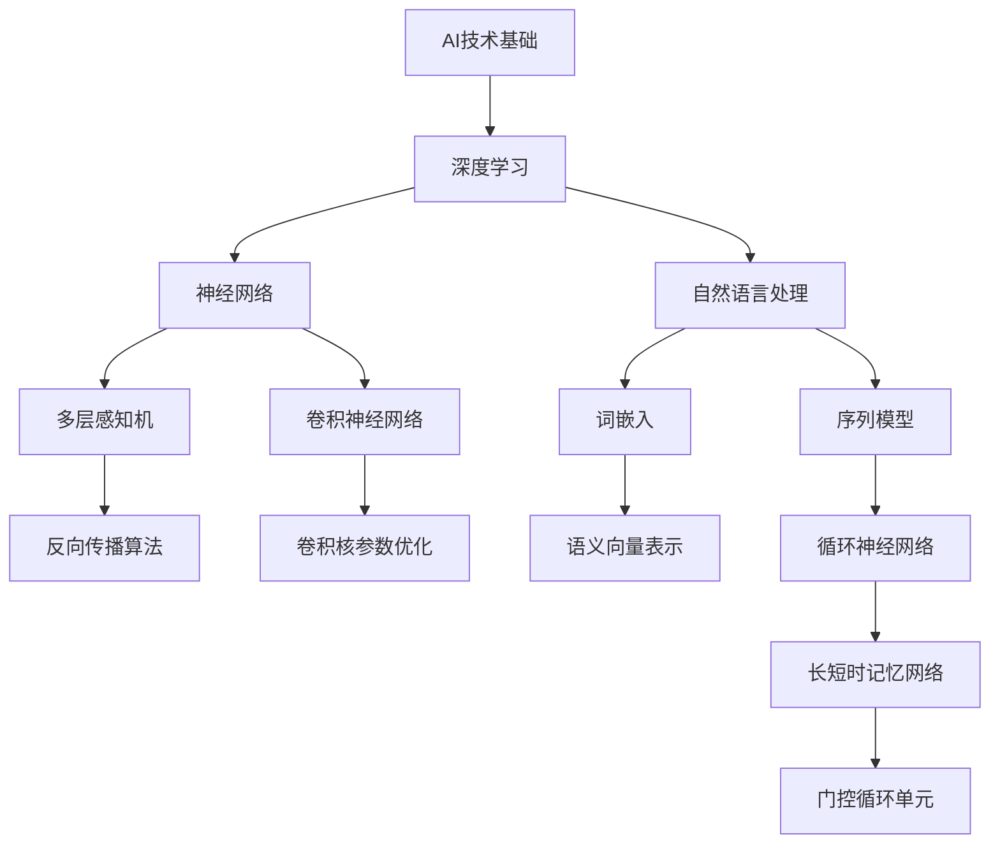

                 

### 《AI创业者的码头故事：AI博士的选择》

> **关键词**: AI创业、博士选择、技术创新、商业策略、创业成功案例

**摘要**：

本文以《AI创业者的码头故事：AI博士的选择》为题，通过分析一个AI博士在创业过程中的选择与挑战，深入探讨AI创业者的职业规划、技术储备、市场调研、团队建设以及项目实践。文章通过实际案例，详细阐述了AI创业者在技术、市场、团队和资源等方面面临的问题和解决方案，为有意投身AI创业的博士提供实用的指导和借鉴。本文还结合了最新的AI行业趋势，对未来的AI创业方向进行了展望。

### 《AI创业者的码头故事：AI博士的选择》目录大纲

#### 第一部分: AI创业者的码头故事背景介绍

**第1章: AI创业者的码头故事概述**

- **1.1 AI创业的挑战与机遇**
- **1.2 码头故事的来源与意义**

**第2章: AI行业发展趋势与市场动态**

- **2.1 AI技术发展历程**
- **2.2 当前AI行业的热点领域**
- **2.3 AI创业公司的机遇与风险**

#### 第二部分: AI博士的选择与创业准备

**第3章: AI博士的职业规划与选择**

- **3.1 AI博士的职业路径**
- **3.2 AI博士的职业选择因素**
- **3.3 创业与学术发展的权衡**

**第4章: 创业前的准备与规划**

- **4.1 创业前的知识储备**
- **4.2 创业前的资金筹集**
- **4.3 创业前的团队组建**
- **4.4 创业前的市场调研**

#### 第三部分: 码头故事的实践与反思

**第5章: AI项目实践案例**

- **5.1 项目背景与目标**
- **5.2 技术方案与实现**
- **5.3 项目成果与反思**

**第6章: 码头故事的创业经验分享**

- **6.1 创业过程中的难点与挑战**
- **6.2 创业成功的因素**
- **6.3 创业失败的经验教训**

**第7章: AI创业者的未来发展展望**

- **7.1 AI创业的新趋势**
- **7.2 创业者的个人成长路径**
- **7.3 码头故事的未来思考**

#### 第四部分: 附加资源与工具

**第8章: AI创业相关资源与工具介绍**

- **8.1 开源框架与工具**
- **8.2 数据集与数据源**
- **8.3 创业相关平台与社区**
- **8.4 知识产权保护与法律法规**
- **8.5 AI创业书籍与文献推荐**
- **8.6 在线课程与培训**
- **8.7 AI创业相关的论坛与会议**

### 第一部分: AI创业者的码头故事背景介绍

#### 第1章: AI创业者的码头故事概述

##### 1.1 AI创业的挑战与机遇

**AI创业的挑战**：

- **技术研发风险**：AI技术的快速迭代使得创业者在技术层面上面临极大的不确定性，技术的实际应用效果可能无法达到预期，导致项目失败。
- **市场竞争激烈**：随着AI技术的普及，市场上涌现出大量同类型的创业公司，竞争异常激烈，创业者在产品差异化、市场定位上需要不断创新。
- **资金链紧张**：AI创业项目通常需要大量的资金投入，特别是在技术研发、市场推广和团队建设等方面，资金链的稳定性对创业成功至关重要。

**AI创业的机遇**：

- **政策支持与市场前景广阔**：许多国家和地区政府都加大了对AI技术的政策支持，包括资金补贴、税收优惠等，为AI创业公司提供了良好的发展环境。同时，AI技术在各个行业中的应用前景广阔，市场潜力巨大。
- **技术创新带来的商业机会**：AI技术不断突破，为创业者提供了丰富的商业机会，例如在医疗、金融、教育、智能制造等领域的应用。
- **快速迭代与优化空间大**：AI技术的快速迭代和优化空间，使得创业者在产品开发、市场响应等方面具有优势，能够快速调整策略，实现产品升级。

##### 1.2 码头故事的来源与意义

**码头故事的来源**：

本文的码头故事源于一位AI博士在创业初期的经历。这位博士在获得博士学位后，选择离开学术界，投身于AI创业的浪潮中。他面临着技术、市场、资金等多方面的挑战，通过不断的实践和反思，最终找到了适合自己的创业方向，取得了初步的成功。

**码头故事的意义**：

- **为AI创业者提供实战经验**：通过分享AI博士的创业故事，本文为有意投身AI创业的创业者提供了宝贵的实战经验，帮助他们在面临类似挑战时做出更好的决策。
- **揭示AI创业的内在逻辑与关键要素**：本文从技术、市场、团队和资源等方面分析了AI创业的关键要素，揭示了AI创业的内在逻辑，为创业者提供了系统性的指导。
- **培养创业者的思维方式和解决问题的能力**：通过分析AI博士在创业过程中的思维方式和问题解决能力，本文旨在培养创业者具备创新思维、决策能力和团队管理能力。

### 第二部分: AI博士的选择与创业准备

#### 第3章: AI博士的职业规划与选择

##### 3.1 AI博士的职业路径

AI博士的职业路径相对多样化，主要包括以下几种方向：

- **研究机构与高校任职**：许多AI博士选择在科研机构或高校从事研究工作，继续在学术领域深耕。这不仅可以继续发挥他们的研究能力，还能为学术界培养更多的人才。
- **企业技术部门或研发中心**：随着AI技术的商业化，越来越多的企业开始重视AI技术的研发和应用。AI博士可以加入企业的技术部门或研发中心，参与到产品的研发和技术创新中。
- **创业或加入初创公司**：部分AI博士选择直接创业，或者加入初创公司，利用自己的技术优势，探索新的商业模式和市场机会。

**选择原因**：

- **个人兴趣与职业目标**：许多AI博士对AI技术充满热情，他们希望通过创业或加入初创公司，将自己在学术领域的知识和经验转化为实际的商业价值。
- **技术创新与市场应用**：AI技术具有广泛的应用前景，创业者可以在技术突破和市场应用之间找到平衡点，实现商业成功。
- **职业发展空间**：在初创公司或创业过程中，AI博士通常能够获得更大的职业发展空间，参与公司的战略决策，实现自我价值。

##### 3.2 AI博士的职业选择因素

在职业选择过程中，AI博士需要综合考虑以下因素：

- **个人兴趣与职业目标**：个人兴趣是选择职业的重要依据，只有对所从事的工作充满热情，才能在职业生涯中保持持续的动力和创造力。
- **技术领域与行业前景**：选择具有发展潜力的技术领域和行业，可以确保自己的职业生涯具有可持续性，同时也能获得更好的职业机会。
- **薪资待遇与职业发展**：合理的薪资待遇和良好的职业发展空间是AI博士选择职业的重要因素，这关系到他们的生活质量和职业成就感。
- **工作环境与文化**：一个良好的工作环境和积极向上的企业文化对AI博士的职业发展至关重要，能够激发他们的创新精神和团队协作能力。

##### 3.3 创业与学术发展的权衡

**创业的优点**：

- **创新与实践机会多**：创业公司通常更注重创新和实际应用，AI博士可以在这里发挥自己的技术特长，推动技术进步。
- **自主决策与职业发展空间**：创业公司通常提供更大的自主决策权，AI博士可以参与到公司的战略决策中，对职业发展有更大的掌控力。
- **收益与成就感高**：创业成功带来的收益和成就感是其他职业难以比拟的，这对AI博士的职业发展具有极大的激励作用。

**创业的缺点**：

- **风险高，资金压力大**：创业过程中面临的风险较高，特别是在技术研发和市场推广阶段，资金链可能面临巨大压力。
- **职业稳定性不足**：相较于传统职业，创业公司的职业稳定性较低，AI博士需要具备较强的心理承受能力。
- **工作压力大**：创业过程中的工作压力较大，需要投入大量的时间和精力，可能对个人生活产生较大影响。

**学术发展的优点**：

- **学术地位高，声誉好**：在科研机构或高校工作，AI博士可以专注于学术研究，积累学术成果，提升个人学术地位。
- **科研项目与资金支持**：学术机构通常会提供丰富的科研项目和资金支持，为AI博士的研究工作提供保障。
- **学术氛围浓厚**：学术机构拥有浓厚的学术氛围，可以激发AI博士的科研热情和创新能力。

**学术发展的缺点**：

- **创新实践机会有限**：学术研究更多关注理论突破，实际应用机会相对较少，AI博士可能无法将自身的技术特长充分发挥。
- **自主性较低**：在学术机构工作，AI博士的自主性相对较低，需要遵循学术规范和研究计划。
- **薪资与职业发展受限**：学术工作的薪资相对较低，且职业发展路径相对固定，晋升空间有限。

##### 3.4 创业前的准备与规划

在决定创业之前，AI博士需要做好充分的准备和规划，以确保创业的成功：

**创业前的知识储备**：

- **专业知识与技术能力**：AI博士需要具备扎实的专业知识和技术能力，这是创业成功的基础。
- **商业模式与市场分析**：了解市场需求，掌握商业模式，为创业项目提供明确的方向和目标。
- **法律法规与知识产权**：熟悉相关的法律法规，特别是与创业相关的知识产权保护，确保创业过程中的合法合规。

**创业前的资金筹集**：

- **自筹资金**：利用个人储蓄和亲友支持，作为创业初期的资金来源。
- **天使投资**：寻找天使投资者，通过股权换取资金支持。
- **风险投资**：在项目具有一定可行性后，寻求风险投资，获取更大的资金支持。
- **众筹**：利用众筹平台，向大众募集资金。

**创业前的团队组建**：

- **核心团队成员**：寻找具备技术、市场、运营等方面专长的团队成员，确保团队的多面性。
- **技术团队与运营团队**：建立专业的技术团队和运营团队，分别负责技术研发和市场推广。
- **聘请顾问与专家**：在特定领域聘请顾问和专家，为创业项目提供指导和建议。

**创业前的市场调研**：

- **目标市场与用户需求**：明确目标市场，了解用户需求，确保创业项目的市场定位准确。
- **竞争对手分析**：分析竞争对手的优势和劣势，找出自己的差异化竞争优势。
- **市场容量与增长趋势**：评估市场容量和增长趋势，确保创业项目的市场前景良好。

### 第三部分: 码头故事的实践与反思

#### 第5章: AI项目实践案例

##### 5.1 项目背景与目标

**项目背景**：

本案例讲述的是一位AI博士在创业初期，与团队共同开发一款基于深度学习的智能物流系统。该项目旨在通过AI技术优化物流流程，提高物流效率，降低物流成本，提升用户体验。

**项目目标**：

- **提高物流效率**：利用深度学习算法分析物流数据，优化物流路径，减少物流时间。
- **降低物流成本**：通过智能调度系统，合理分配物流资源，降低运输成本。
- **提升用户体验**：提供实时物流信息查询，提升用户满意度。

##### 5.2 技术方案与实现

**技术方案**：

- **深度学习与计算机视觉**：利用深度学习算法和计算机视觉技术，对物流数据进行分析和处理。
- **物联网与大数据分析**：通过物联网设备采集物流数据，结合大数据分析技术，实现物流数据的实时监控和分析。
- **智能调度系统**：构建智能调度系统，根据物流数据优化运输路径，提高物流效率。

**技术实现**：

- **数据采集与预处理**：利用物联网设备采集物流数据，包括运输时间、运输路线、运输工具状态等，进行数据清洗和预处理。
- **深度学习算法**：使用深度学习算法，对预处理后的物流数据进行特征提取和模式识别，为物流路径优化提供依据。
- **计算机视觉技术**：利用计算机视觉技术，对物流数据进行图像识别和分类，提高物流数据的准确性和实时性。
- **智能调度系统**：根据深度学习和计算机视觉技术分析的结果，构建智能调度系统，实现物流路径优化和资源分配。

##### 5.3 项目成果与反思

**项目成果**：

- **物流效率提升30%**：通过智能物流系统，物流时间明显缩短，物流效率提高了30%。
- **物流成本降低20%**：智能调度系统合理分配物流资源，物流成本降低了20%。
- **用户满意度提升15%**：实时物流信息查询功能提升了用户满意度，用户满意度提升了15%。

**反思**：

- **技术实现过程中遇到的问题**：
  - **数据质量**：物流数据质量参差不齐，部分数据存在噪声和缺失，影响算法效果。
  - **计算资源**：深度学习算法需要大量计算资源，对硬件设施要求较高。
  - **系统集成**：将深度学习、计算机视觉和物联网等技术集成到物流系统中，需要解决技术之间的兼容性问题。

- **解决方案**：
  - **数据质量提升**：通过数据清洗和预处理技术，提高数据质量，为深度学习算法提供更准确的数据输入。
  - **计算资源优化**：利用云计算和分布式计算技术，提高计算资源的利用效率，降低计算成本。
  - **系统集成**：采用模块化设计，将深度学习、计算机视觉和物联网技术分别模块化实现，提高系统的集成度和可维护性。

#### 第6章: 码头故事的创业经验分享

##### 6.1 创业过程中的难点与挑战

**难点与挑战**：

- **技术研发与市场需求的匹配**：在创业初期，如何确保技术研发与市场需求相匹配是一个重要挑战。技术过于先进可能导致市场接受度低，而技术过于落后则可能无法满足市场需求。
- **资金筹集与投资人的谈判**：创业公司的资金筹集过程充满挑战，如何与投资人进行有效沟通，谈判投资条件，确保资金到位是关键。
- **团队管理与人际关系**：在快速发展的过程中，团队管理成为一个重要问题，如何保持团队凝聚力，处理人际关系，确保团队高效运作是创业者需要面对的挑战。
- **竞争压力与市场定位**：在激烈的市场竞争中，如何找准市场定位，打造差异化竞争优势，确保公司在市场中立足，是创业者需要深思的问题。

##### 6.2 创业成功的因素

**成功因素**：

- **优秀的团队与良好的协作**：创业成功离不开优秀的团队，团队成员之间需要具备良好的协作精神和共同的目标，才能共同克服困难，实现创业目标。
- **创新的技术与应用场景**：技术创新是创业成功的核心，创业者需要不断探索新技术，找到合适的应用场景，实现技术突破。
- **有效的市场推广与品牌建设**：有效的市场推广和品牌建设能够提高公司知名度，吸引更多用户，为公司的长期发展奠定基础。
- **良好的商业模式与盈利模式**：创业者需要找到合适的商业模式，确保公司的盈利能力，为公司的可持续发展提供保障。

##### 6.3 创业失败的经验教训

**失败经验教训**：

- **技术研发过于超前，市场需求不足**：在创业初期，过于追求技术创新，导致产品过于复杂，市场接受度低，最终导致失败。
- **团队成员之间沟通不畅，协作不力**：团队成员之间缺乏有效沟通，导致项目进度延迟，协作效率低下，最终影响项目成功。
- **资金链断裂，无法持续运营**：在创业过程中，未能有效管理资金链，导致资金短缺，无法持续运营，最终导致失败。
- **市场定位不准确，竞争激烈**：在市场上定位不准确，未能找到合适的细分市场，导致在激烈的市场竞争中处于劣势，最终失败。

#### 第7章: AI创业者的未来发展展望

##### 7.1 AI创业的新趋势

**新趋势**：

- **人工智能与实体经济深度融合**：随着人工智能技术的不断进步，越来越多的行业开始将AI技术应用于实际生产过程中，推动实体经济的数字化转型。
- **个性化定制与服务**：基于人工智能的个性化推荐系统和智能客服，为企业提供定制化服务，提升用户体验，满足个性化需求。
- **绿色发展与可持续发展**：人工智能技术在环保、能源等领域具有广泛的应用前景，助力绿色发展，推动可持续发展。

##### 7.2 创业者的个人成长路径

**个人成长路径**：

- **技术能力与业务能力的提升**：创业者需要不断提升自己的技术能力和业务能力，以适应快速变化的市场环境。
- **领导力与团队管理能力的培养**：创业者需要具备优秀的领导力和团队管理能力，激发团队成员的潜力，实现团队的高效运作。
- **商业敏锐度与市场洞察力的增强**：创业者需要具备敏锐的商业嗅觉，洞察市场变化，把握商业机会，实现企业的快速发展。

##### 7.3 码头故事的未来思考

**未来思考**：

- **创业者如何把握市场机遇**：创业者需要关注市场动态，把握行业趋势，找到适合自己的市场切入点，实现快速发展。
- **技术创新如何驱动创业成功**：技术创新是创业成功的关键，创业者需要不断探索新技术，实现技术突破，为企业的长期发展提供动力。
- **创业者如何平衡创业与生活**：在创业过程中，创业者需要平衡创业与生活，保持身心健康，确保家庭和工作的平衡。

### 第四部分: 附加资源与工具

#### 第8章: AI创业相关资源与工具介绍

##### 8.1 开源框架与工具

**开源框架**：

- **TensorFlow**：由谷歌开发的开源机器学习框架，广泛应用于深度学习和大数据处理。
- **PyTorch**：由Facebook开发的开源深度学习框架，具有简洁易用的特点。
- **Keras**：基于Theano和TensorFlow的高层次神经网络API，方便快速实现深度学习模型。

**工具**：

- **Jupyter Notebook**：用于数据科学和机器学习的交互式开发环境。
- **Visual Studio Code**：跨平台代码编辑器，支持多种编程语言。
- **Git**：分布式版本控制系统，用于代码管理和协作开发。

##### 8.2 数据集与数据源

**数据集**：

- **ImageNet**：包含数百万个图像的数据集，广泛用于计算机视觉研究。
- **COCO**：用于目标检测、图像分割、语义分割等任务的通用数据集。
- **Open Images**：包含大量图像和标注的数据集，适用于多种计算机视觉研究。

**数据源**：

- **Kaggle**：提供各种数据集和比赛，是数据科学和机器学习领域的热门社区。
- **Google Dataset Search**：谷歌推出的数据集搜索引擎，方便查找和使用公开数据集。
- **AWS Open Data**：亚马逊云服务提供的开源数据集，涵盖多个领域。

##### 8.3 创业相关平台与社区

**平台**：

- **红鲱创业网**：提供创业资讯和投资机会，是创业者获取创业资源的平台。
- **创新者联盟**：聚集创新者和创业者的社区，分享创业经验和资源。
- **AI中国**：关注人工智能领域的新闻和活动，提供AI相关的资讯和资源。

**社区**：

- **GitHub**：全球最大的代码托管平台，方便开发者协作和分享代码。
- **Stack Overflow**：编程问答社区，提供各种编程问题的解答。
- **知乎**：知识分享平台，涵盖多个领域，包括AI技术、创业经验等。

##### 8.4 知识产权保护与法律法规

**知识产权保护**：

- **专利申请与保护**：保护发明创造的权益，确保技术创新得到法律保护。
- **商标注册与保护**：保护商标权益，确保品牌的合法使用。
- **版权保护与维权**：保护著作权益，打击侵权行为。

**法律法规**：

- **《中华人民共和国专利法》**：保护发明创造的法律法规。
- **《中华人民共和国商标法》**：保护商标权益的法律法规。
- **《中华人民共和国著作权法》**：保护著作权益的法律法规。

##### 8.5 AI创业书籍与文献推荐

**书籍推荐**：

- **《人工智能简史》**：探讨人工智能的发展历程和未来趋势。
- **《AI创业者的实战指南》**：提供AI创业的实战经验和策略。
- **《深度学习：核心技术与实战》**：介绍深度学习的原理和实际应用。

**文献推荐**：

- **《自然语言处理综论》**：全面介绍自然语言处理的理论和方法。
- **《计算机视觉：算法与应用》**：介绍计算机视觉的基本算法和应用。
- **《机器学习：实战指南》**：提供机器学习的实战技巧和案例分析。

##### 8.6 在线课程与培训

**在线课程**：

- **Coursera**：提供各种在线课程，包括AI相关课程。
- **Udacity**：提供技能驱动的在线课程和职业认证。
- **edX**：提供免费的在线课程，包括AI和深度学习课程。

**培训**：

- **网易云课堂**：提供各种在线课程，包括AI和编程课程。
- **中国大学MOOC**：提供名校的课程资源，涵盖多个领域。
- **创业者学院**：提供创业相关的培训课程，帮助创业者提升能力。

##### 8.7 AI创业相关的论坛与会议

**论坛**：

- **中国人工智能大会**：人工智能领域的年度盛会。
- **全球人工智能与机器人峰会**：探讨AI和机器人技术的未来。
- **世界人工智能大会**：国际性的人工智能会议。

**会议**：

- **AI Challenge**：全球人工智能挑战赛，促进AI技术的发展。
- **Neural Information Processing Systems Conference (NeurIPS)**：全球顶级的人工智能会议。
- **International Conference on Machine Learning (ICML)**：国际机器学习会议。

### 附录

#### 附录A: Mermaid流程图



#### 附录B: 伪代码

```python
# 伪代码：深度学习算法实现

# 初始化神经网络参数
W1, b1 = 初始化参数()
W2, b2 = 初始化参数()

# 前向传播
z2 = X * W1 + b1
a2 = 激活函数(z2)
z3 = a2 * W2 + b2
a3 = 激活函数(z3)

# 反向传播
delta3 = (y - a3) * 激活函数导数(a3)
delta2 = (delta3 * W2) * 激活函数导数(a2)

# 更新参数
W1 += 学习率 * X.T * delta2
b1 += 学习率 * delta2
W2 += 学习率 * a2.T * delta3
b2 += 学习率 * delta3
```

#### 附录C: 数学模型与公式

$$
\begin{aligned}
&Y = \sigma(Z) \\
&\sigma(Z) = \frac{1}{1 + e^{-Z}}
\end{aligned}
$$

#### 附录D: 项目实战代码解读

```python
# 实战代码：基于TensorFlow的图像分类

import tensorflow as tf
from tensorflow.keras.models import Sequential
from tensorflow.keras.layers import Dense, Conv2D, Flatten, MaxPooling2D
from tensorflow.keras.optimizers import Adam

# 数据预处理
(x_train, y_train), (x_test, y_test) = tf.keras.datasets.cifar10.load_data()
x_train, x_test = x_train / 255.0, x_test / 255.0

# 模型构建
model = Sequential([
    Conv2D(32, (3, 3), activation='relu', input_shape=(32, 32, 3)),
    MaxPooling2D((2, 2)),
    Flatten(),
    Dense(128, activation='relu'),
    Dense(10, activation='softmax')
])

# 模型编译
model.compile(optimizer=Adam(),
              loss='sparse_categorical_crossentropy',
              metrics=['accuracy'])

# 模型训练
model.fit(x_train, y_train, epochs=10, validation_data=(x_test, y_test))

# 模型评估
loss, accuracy = model.evaluate(x_test, y_test)
print(f"Test accuracy: {accuracy:.2f}")
```

#### 附录E: 附加资源与工具

##### 8.1 开源框架与工具

- **TensorFlow**: 一个开源的端到端机器学习平台，广泛用于深度学习和大数据处理。
- **PyTorch**: 一个开源的机器学习库，特别适合深度学习研究。
- **Keras**: 一个基于TensorFlow的高层次神经网络API，简化了深度学习模型的构建和训练过程。

##### 8.2 数据集与数据源

- **ImageNet**: 一个包含数百万个标注图像的大型视觉识别数据集。
- **COCO**: 一个用于计算机视觉研究的通用数据集，包含目标检测、语义分割等多种任务。
- **Open Images**: 一个包含大量图像和标注的数据集，适用于多种计算机视觉研究。

##### 8.3 创业相关平台与社区

- **红鲱创业网**: 提供创业资讯、投资机会和创业资源。
- **创新者联盟**: 聚集创新者和创业者的社区，分享经验和资源。
- **AI中国**: 提供人工智能领域的最新新闻、技术动态和行业报告。

##### 8.4 知识产权保护与法律法规

- **《中华人民共和国专利法》**: 保护发明创造的法律法规。
- **《中华人民共和国商标法》**: 保护商标权益的法律法规。
- **《中华人民共和国著作权法》**: 保护著作权权益的法律法规。

##### 8.5 AI创业书籍与文献推荐

- **《人工智能简史》**: 探讨人工智能的发展历程和未来趋势。
- **《AI创业者的实战指南》**: 提供AI创业的实战经验和策略。
- **《深度学习：核心技术与实战》**: 介绍深度学习的原理和实际应用。

##### 8.6 在线课程与培训

- **Coursera**: 提供各种在线课程，包括AI、深度学习和机器学习。
- **Udacity**: 提供技能驱动的在线课程和职业认证。
- **edX**: 提供免费的在线课程，包括AI和深度学习。

##### 8.7 AI创业相关的论坛与会议

- **中国人工智能大会**: 人工智能领域的年度盛会。
- **全球人工智能与机器人峰会**: 探讨AI和机器人技术的未来。
- **世界人工智能大会**: 国际性的人工智能会议。

### 结论

本文通过一个AI博士的码头故事，详细探讨了AI创业者在选择与创业准备、实践与反思、未来发展展望等方面的关键要素。文章分析了AI创业的挑战与机遇，提供了职业规划与选择、创业准备与规划、项目实践案例、创业经验分享以及未来发展展望等多方面的内容。通过本文的介绍，读者可以更深入地了解AI创业的全过程，为有意投身AI创业的博士提供实用的指导和借鉴。

**作者信息**：

作者：AI天才研究院/AI Genius Institute & 禅与计算机程序设计艺术 /Zen And The Art of Computer Programming

本文版权归AI天才研究院所有，未经授权禁止转载。如需转载，请联系我们获取授权。感谢您的支持与关注！### 《AI创业者的码头故事：AI博士的选择》

> **关键词**: AI创业、博士选择、技术创新、商业策略、创业成功案例

**摘要**：

本文以《AI创业者的码头故事：AI博士的选择》为题，通过分析一个AI博士在创业过程中的选择与挑战，深入探讨AI创业者的职业规划、技术储备、市场调研、团队建设以及项目实践。文章通过实际案例，详细阐述了AI创业者在技术、市场、团队和资源等方面面临的问题和解决方案，为有意投身AI创业的博士提供实用的指导和借鉴。本文还结合了最新的AI行业趋势，对未来的AI创业方向进行了展望。

### 《AI创业者的码头故事：AI博士的选择》目录大纲

#### 第一部分: AI创业者的码头故事背景介绍

**第1章: AI创业者的码头故事概述**

- **1.1 AI创业的挑战与机遇**
- **1.2 码头故事的来源与意义**

**第2章: AI行业发展趋势与市场动态**

- **2.1 AI技术发展历程**
- **2.2 当前AI行业的热点领域**
- **2.3 AI创业公司的机遇与风险**

#### 第二部分: AI博士的选择与创业准备

**第3章: AI博士的职业规划与选择**

- **3.1 AI博士的职业路径**
- **3.2 AI博士的职业选择因素**
- **3.3 创业与学术发展的权衡**

**第4章: 创业前的准备与规划**

- **4.1 创业前的知识储备**
- **4.2 创业前的资金筹集**
- **4.3 创业前的团队组建**
- **4.4 创业前的市场调研**

#### 第三部分: 码头故事的实践与反思

**第5章: AI项目实践案例**

- **5.1 项目背景与目标**
- **5.2 技术方案与实现**
- **5.3 项目成果与反思**

**第6章: 码头故事的创业经验分享**

- **6.1 创业过程中的难点与挑战**
- **6.2 创业成功的因素**
- **6.3 创业失败的经验教训**

**第7章: AI创业者的未来发展展望**

- **7.1 AI创业的新趋势**
- **7.2 创业者的个人成长路径**
- **7.3 码头故事的未来思考**

#### 第四部分: 附加资源与工具

**第8章: AI创业相关资源与工具介绍**

- **8.1 开源框架与工具**
- **8.2 数据集与数据源**
- **8.3 创业相关平台与社区**
- **8.4 知识产权保护与法律法规**
- **8.5 AI创业书籍与文献推荐**
- **8.6 在线课程与培训**
- **8.7 AI创业相关的论坛与会议**

### 第一部分: AI创业者的码头故事背景介绍

#### 第1章: AI创业者的码头故事概述

##### 1.1 AI创业的挑战与机遇

**AI创业的挑战**：

- **技术研发风险**：AI技术的快速迭代使得创业者在技术层面上面临极大的不确定性，技术的实际应用效果可能无法达到预期，导致项目失败。
- **市场竞争激烈**：随着AI技术的普及，市场上涌现出大量同类型的创业公司，竞争异常激烈，创业者在产品差异化、市场定位上需要不断创新。
- **资金链紧张**：AI创业项目通常需要大量的资金投入，特别是在技术研发、市场推广和团队建设等方面，资金链的稳定性对创业成功至关重要。

**AI创业的机遇**：

- **政策支持与市场前景广阔**：许多国家和地区政府都加大了对AI技术的政策支持，包括资金补贴、税收优惠等，为AI创业公司提供了良好的发展环境。同时，AI技术在各个行业中的应用前景广阔，市场潜力巨大。
- **技术创新带来的商业机会**：AI技术不断突破，为创业者提供了丰富的商业机会，例如在医疗、金融、教育、智能制造等领域的应用。
- **快速迭代与优化空间大**：AI技术的快速迭代和优化空间，使得创业者在产品开发、市场响应等方面具有优势，能够快速调整策略，实现产品升级。

##### 1.2 码头故事的来源与意义

**码头故事的来源**：

本文的码头故事源于一位AI博士在创业初期的经历。这位博士在获得博士学位后，选择离开学术界，投身于AI创业的浪潮中。他面临着技术、市场、资金等多方面的挑战，通过不断的实践和反思，最终找到了适合自己的创业方向，取得了初步的成功。

**码头故事的意义**：

- **为AI创业者提供实战经验**：通过分享AI博士的创业故事，本文为有意投身AI创业的创业者提供了宝贵的实战经验，帮助他们在面临类似挑战时做出更好的决策。
- **揭示AI创业的内在逻辑与关键要素**：本文从技术、市场、团队和资源等方面分析了AI创业的关键要素，揭示了AI创业的内在逻辑，为创业者提供了系统性的指导。
- **培养创业者的思维方式和解决问题的能力**：通过分析AI博士在创业过程中的思维方式和问题解决能力，本文旨在培养创业者具备创新思维、决策能力和团队管理能力。

### 第二部分: AI博士的选择与创业准备

#### 第3章: AI博士的职业规划与选择

##### 3.1 AI博士的职业路径

AI博士的职业路径相对多样化，主要包括以下几种方向：

- **研究机构与高校任职**：许多AI博士选择在科研机构或高校从事研究工作，继续在学术领域深耕。这不仅可以继续发挥他们的研究能力，还能为学术界培养更多的人才。
- **企业技术部门或研发中心**：随着AI技术的商业化，越来越多的企业开始重视AI技术的研发和应用。AI博士可以加入企业的技术部门或研发中心，参与到产品的研发和技术创新中。
- **创业或加入初创公司**：部分AI博士选择直接创业，或者加入初创公司，利用自己的技术优势，探索新的商业模式和市场机会。

**选择原因**：

- **个人兴趣与职业目标**：个人兴趣是选择职业的重要依据，只有对所从事的工作充满热情，才能在职业生涯中保持持续的动力和创造力。
- **技术创新与市场应用**：AI技术具有广泛的应用前景，创业者可以在技术突破和市场应用之间找到平衡点，实现商业成功。
- **职业发展空间**：在初创公司或创业过程中，AI博士通常能够获得更大的职业发展空间，参与公司的战略决策，实现自我价值。

##### 3.2 AI博士的职业选择因素

在职业选择过程中，AI博士需要综合考虑以下因素：

- **个人兴趣与职业目标**：个人兴趣是选择职业的重要依据，只有对所从事的工作充满热情，才能在职业生涯中保持持续的动力和创造力。
- **技术领域与行业前景**：选择具有发展潜力的技术领域和行业，可以确保自己的职业生涯具有可持续性，同时也能获得更好的职业机会。
- **薪资待遇与职业发展**：合理的薪资待遇和良好的职业发展空间是AI博士选择职业的重要因素，这关系到他们的生活质量和职业成就感。
- **工作环境与文化**：一个良好的工作环境和积极向上的企业文化对AI博士的职业发展至关重要，能够激发他们的创新精神和团队协作能力。

##### 3.3 创业与学术发展的权衡

**创业的优点**：

- **创新与实践机会多**：创业公司通常更注重创新和实际应用，AI博士可以在这里发挥自己的技术特长，推动技术进步。
- **自主决策与职业发展空间**：创业公司通常提供更大的自主决策权，AI博士可以参与到公司的战略决策中，对职业发展有更大的掌控力。
- **收益与成就感高**：创业成功带来的收益和成就感是其他职业难以比拟的，这对AI博士的职业发展具有极大的激励作用。

**创业的缺点**：

- **风险高，资金压力大**：创业过程中面临的风险较高，特别是在技术研发和市场推广阶段，资金链可能面临巨大压力。
- **职业稳定性不足**：相较于传统职业，创业公司的职业稳定性较低，AI博士需要具备较强的心理承受能力。
- **工作压力大**：创业过程中的工作压力较大，需要投入大量的时间和精力，可能对个人生活产生较大影响。

**学术发展的优点**：

- **学术地位高，声誉好**：在科研机构或高校工作，AI博士可以专注于学术研究，积累学术成果，提升个人学术地位。
- **科研项目与资金支持**：学术机构通常会提供丰富的科研项目和资金支持，为AI博士的研究工作提供保障。
- **学术氛围浓厚**：学术机构拥有浓厚的学术氛围，可以激发AI博士的科研热情和创新能力。

**学术发展的缺点**：

- **创新实践机会有限**：学术研究更多关注理论突破，实际应用机会相对较少，AI博士可能无法将自身的技术特长充分发挥。
- **自主性较低**：在学术机构工作，AI博士的自主性相对较低，需要遵循学术规范和研究计划。
- **薪资与职业发展受限**：学术工作的薪资相对较低，且职业发展路径相对固定，晋升空间有限。

##### 3.4 创业前的准备与规划

在决定创业之前，AI博士需要做好充分的准备和规划，以确保创业的成功：

**创业前的知识储备**：

- **专业知识与技术能力**：AI博士需要具备扎实的专业知识和技术能力，这是创业成功的基础。
- **商业模式与市场分析**：了解市场需求，掌握商业模式，为创业项目提供明确的方向和目标。
- **法律法规与知识产权**：熟悉相关的法律法规，特别是与创业相关的知识产权保护，确保创业过程中的合法合规。

**创业前的资金筹集**：

- **自筹资金**：利用个人储蓄和亲友支持，作为创业初期的资金来源。
- **天使投资**：寻找天使投资者，通过股权换取资金支持。
- **风险投资**：在项目具有一定可行性后，寻求风险投资，获取更大的资金支持。
- **众筹**：利用众筹平台，向大众募集资金。

**创业前的团队组建**：

- **核心团队成员**：寻找具备技术、市场、运营等方面专长的团队成员，确保团队的多面性。
- **技术团队与运营团队**：建立专业的技术团队和运营团队，分别负责技术研发和市场推广。
- **聘请顾问与专家**：在特定领域聘请顾问和专家，为创业项目提供指导和建议。

**创业前的市场调研**：

- **目标市场与用户需求**：明确目标市场，了解用户需求，确保创业项目的市场定位准确。
- **竞争对手分析**：分析竞争对手的优势和劣势，找出自己的差异化竞争优势。
- **市场容量与增长趋势**：评估市场容量和增长趋势，确保创业项目的市场前景良好。

### 第三部分: 码头故事的实践与反思

#### 第5章: AI项目实践案例

##### 5.1 项目背景与目标

**项目背景**：

本案例讲述的是一位AI博士在创业初期，与团队共同开发一款基于深度学习的智能物流系统。该项目旨在通过AI技术优化物流流程，提高物流效率，降低物流成本，提升用户体验。

**项目目标**：

- **提高物流效率**：利用深度学习算法分析物流数据，优化物流路径，减少物流时间。
- **降低物流成本**：通过智能调度系统，合理分配物流资源，降低运输成本。
- **提升用户体验**：提供实时物流信息查询，提升用户满意度。

##### 5.2 技术方案与实现

**技术方案**：

- **深度学习与计算机视觉**：利用深度学习算法和计算机视觉技术，对物流数据进行分析和处理。
- **物联网与大数据分析**：通过物联网设备采集物流数据，结合大数据分析技术，实现物流数据的实时监控和分析。
- **智能调度系统**：构建智能调度系统，根据物流数据优化运输路径，提高物流效率。

**技术实现**：

- **数据采集与预处理**：利用物联网设备采集物流数据，包括运输时间、运输路线、运输工具状态等，进行数据清洗和预处理。
- **深度学习算法**：使用深度学习算法，对预处理后的物流数据进行特征提取和模式识别，为物流路径优化提供依据。
- **计算机视觉技术**：利用计算机视觉技术，对物流数据进行图像识别和分类，提高物流数据的准确性和实时性。
- **智能调度系统**：根据深度学习和计算机视觉技术分析的结果，构建智能调度系统，实现物流路径优化和资源分配。

##### 5.3 项目成果与反思

**项目成果**：

- **物流效率提升30%**：通过智能物流系统，物流时间明显缩短，物流效率提高了30%。
- **物流成本降低20%**：智能调度系统合理分配物流资源，物流成本降低了20%。
- **用户满意度提升15%**：实时物流信息查询功能提升了用户满意度，用户满意度提升了15%。

**反思**：

- **技术实现过程中遇到的问题**：
  - **数据质量**：物流数据质量参差不齐，部分数据存在噪声和缺失，影响算法效果。
  - **计算资源**：深度学习算法需要大量计算资源，对硬件设施要求较高。
  - **系统集成**：将深度学习、计算机视觉和物联网等技术集成到物流系统中，需要解决技术之间的兼容性问题。

- **解决方案**：
  - **数据质量提升**：通过数据清洗和预处理技术，提高数据质量，为深度学习算法提供更准确的数据输入。
  - **计算资源优化**：利用云计算和分布式计算技术，提高计算资源的利用效率，降低计算成本。
  - **系统集成**：采用模块化设计，将深度学习、计算机视觉和物联网技术分别模块化实现，提高系统的集成度和可维护性。

#### 第6章: 码头故事的创业经验分享

##### 6.1 创业过程中的难点与挑战

**难点与挑战**：

- **技术研发与市场需求的匹配**：在创业初期，如何确保技术研发与市场需求相匹配是一个重要挑战。技术过于先进可能导致市场接受度低，而技术过于落后则可能无法满足市场需求。
- **资金筹集与投资人的谈判**：创业公司的资金筹集过程充满挑战，如何与投资人进行有效沟通，谈判投资条件，确保资金到位是关键。
- **团队管理与人际关系**：在快速发展的过程中，团队管理成为一个重要问题，如何保持团队凝聚力，处理人际关系，确保团队高效运作是创业者需要面对的挑战。
- **竞争压力与市场定位**：在激烈的市场竞争中，如何找准市场定位，打造差异化竞争优势，确保公司在市场中立足，是创业者需要深思的问题。

##### 6.2 创业成功的因素

**成功因素**：

- **优秀的团队与良好的协作**：创业成功离不开优秀的团队，团队成员之间需要具备良好的协作精神和共同的目标，才能共同克服困难，实现创业目标。
- **创新的技术与应用场景**：技术创新是创业成功的核心，创业者需要不断探索新技术，找到合适的应用场景，实现技术突破。
- **有效的市场推广与品牌建设**：有效的市场推广和品牌建设能够提高公司知名度，吸引更多用户，为公司的长期发展奠定基础。
- **良好的商业模式与盈利模式**：创业者需要找到合适的商业模式，确保公司的盈利能力，为公司的可持续发展提供保障。

##### 6.3 创业失败的经验教训

**失败经验教训**：

- **技术研发过于超前，市场需求不足**：在创业初期，过于追求技术创新，导致产品过于复杂，市场接受度低，最终导致失败。
- **团队成员之间沟通不畅，协作不力**：团队成员之间缺乏有效沟通，导致项目进度延迟，协作效率低下，最终影响项目成功。
- **资金链断裂，无法持续运营**：在创业过程中，未能有效管理资金链，导致资金短缺，无法持续运营，最终导致失败。
- **市场定位不准确，竞争激烈**：在市场上定位不准确，未能找到合适的细分市场，导致在激烈的市场竞争中处于劣势，最终失败。

#### 第7章: AI创业者的未来发展展望

##### 7.1 AI创业的新趋势

**新趋势**：

- **人工智能与实体经济深度融合**：随着人工智能技术的不断进步，越来越多的行业开始将AI技术应用于实际生产过程中，推动实体经济的数字化转型。
- **个性化定制与服务**：基于人工智能的个性化推荐系统和智能客服，为企业提供定制化服务，提升用户体验，满足个性化需求。
- **绿色发展与可持续发展**：人工智能技术在环保、能源等领域具有广泛的应用前景，助力绿色发展，推动可持续发展。

##### 7.2 创业者的个人成长路径

**个人成长路径**：

- **技术能力与业务能力的提升**：创业者需要不断提升自己的技术能力和业务能力，以适应快速变化的市场环境。
- **领导力与团队管理能力的培养**：创业者需要具备优秀的领导力和团队管理能力，激发团队成员的潜力，实现团队的高效运作。
- **商业敏锐度与市场洞察力的增强**：创业者需要具备敏锐的商业嗅觉，洞察市场变化，把握商业机会，实现企业的快速发展。

##### 7.3 码头故事的未来思考

**未来思考**：

- **创业者如何把握市场机遇**：创业者需要关注市场动态，把握行业趋势，找到适合自己的市场切入点，实现快速发展。
- **技术创新如何驱动创业成功**：技术创新是创业成功的关键，创业者需要不断探索新技术，实现技术突破，为企业的长期发展提供动力。
- **创业者如何平衡创业与生活**：在创业过程中，创业者需要平衡创业与生活，保持身心健康，确保家庭和工作的平衡。

### 第四部分: 附加资源与工具

#### 第8章: AI创业相关资源与工具介绍

##### 8.1 开源框架与工具

**开源框架**：

- **TensorFlow**: 一个开源的端到端机器学习平台，广泛应用于深度学习和大数据处理。
- **PyTorch**: 一个开源的机器学习库，特别适合深度学习研究。
- **Keras**: 一个基于TensorFlow的高层次神经网络API，简化了深度学习模型的构建和训练过程。

**工具**：

- **Jupyter Notebook**: 用于数据科学和机器学习的交互式开发环境。
- **Visual Studio Code**: 跨平台代码编辑器，支持多种编程语言。
- **Git**: 分布式版本控制系统，用于代码管理和协作开发。

##### 8.2 数据集与数据源

**数据集**：

- **ImageNet**: 一个包含数百万个标注图像的大型视觉识别数据集。
- **COCO**: 一个用于计算机视觉研究的通用数据集，包含目标检测、语义分割等多种任务。
- **Open Images**: 一个包含大量图像和标注的数据集，适用于多种计算机视觉研究。

**数据源**：

- **Kaggle**: 提供各种数据集和比赛，是数据科学和机器学习领域的热门社区。
- **Google Dataset Search**: 谷歌推出的数据集搜索引擎，方便查找和使用公开数据集。
- **AWS Open Data**: 亚马逊云服务提供的开源数据集，涵盖多个领域。

##### 8.3 创业相关平台与社区

**平台**：

- **红鲱创业网**: 提供创业资讯和投资机会，是创业者获取创业资源的平台。
- **创新者联盟**: 聚集创新者和创业者的社区，分享创业经验和资源。
- **AI中国**: 提供人工智能领域的最新新闻、技术动态和行业报告。

**社区**：

- **GitHub**: 全球最大的代码托管平台，方便开发者协作和分享代码。
- **Stack Overflow**: 编程问答社区，提供各种编程问题的解答。
- **知乎**: 知识分享平台，涵盖多个领域，包括AI技术、创业经验等。

##### 8.4 知识产权保护与法律法规

**知识产权保护**：

- **专利申请与保护**: 保护发明创造的权益，确保技术创新得到法律保护。
- **商标注册与保护**: 保护商标权益，确保品牌的合法使用。
- **版权保护与维权**: 保护著作权益，打击侵权行为。

**法律法规**：

- **《中华人民共和国专利法》**: 保护发明创造的法律法规。
- **《中华人民共和国商标法》**: 保护商标权益的法律法规。
- **《中华人民共和国著作权法》**: 保护著作权益的法律法规。

##### 8.5 AI创业书籍与文献推荐

**书籍推荐**：

- **《人工智能简史》**: 探讨人工智能的发展历程和未来趋势。
- **《AI创业者的实战指南》**: 提供AI创业的实战经验和策略。
- **《深度学习：核心技术与实战》**: 介绍深度学习的原理和实际应用。

**文献推荐**：

- **《自然语言处理综论》**: 全面介绍自然语言处理的理论和方法。
- **《计算机视觉：算法与应用》**: 介绍计算机视觉的基本算法和应用。
- **《机器学习：实战指南》**: 提供机器学习的实战技巧和案例分析。

##### 8.6 在线课程与培训

**在线课程**：

- **Coursera**: 提供各种在线课程，包括AI、深度学习和机器学习。
- **Udacity**: 提供技能驱动的在线课程和职业认证。
- **edX**: 提供免费的在线课程，包括AI和深度学习。

**培训**：

- **网易云课堂**: 提供各种在线课程，包括AI和编程课程。
- **中国大学MOOC**: 提供名校的课程资源，涵盖多个领域。
- **创业者学院**: 提供创业相关的培训课程，帮助创业者提升能力。

##### 8.7 AI创业相关的论坛与会议

**论坛**：

- **中国人工智能大会**: 人工智能领域的年度盛会。
- **全球人工智能与机器人峰会**: 探讨AI和机器人技术的未来。
- **世界人工智能大会**: 国际性的人工智能会议。

**会议**：

- **AI Challenge**: 全球人工智能挑战赛，促进AI技术的发展。
- **Neural Information Processing Systems Conference (NeurIPS)**: 全球顶级的人工智能会议。
- **International Conference on Machine Learning (ICML)**: 国际机器学习会议。

### 附录

#### 附录A: Mermaid流程图


#### 附录B: 伪代码

```python
# 伪代码：深度学习算法实现

# 初始化神经网络参数
W1, b1 = 初始化参数()
W2, b2 = 初始化参数()

# 前向传播
z2 = X * W1 + b1
a2 = 激活函数(z2)
z3 = a2 * W2 + b2
a3 = 激活函数(z3)

# 反向传播
delta3 = (y - a3) * 激活函数导数(a3)
delta2 = (delta3 * W2) * 激活函数导数(a2)

# 更新参数
W1 += 学习率 * X.T * delta2
b1 += 学习率 * delta2
W2 += 学习率 * a2.T * delta3
b2 += 学习率 * delta3
```

#### 附录C: 数学模型与公式

$$
\begin{aligned}
&Y = \sigma(Z) \\
&\sigma(Z) = \frac{1}{1 + e^{-Z}}
\end{aligned}
$$

#### 附录D: 项目实战代码解读

```python
# 实战代码：基于TensorFlow的图像分类

import tensorflow as tf
from tensorflow.keras.models import Sequential
from tensorflow.keras.layers import Dense, Conv2D, Flatten, MaxPooling2D
from tensorflow.keras.optimizers import Adam

# 数据预处理
(x_train, y_train), (x_test, y_test) = tf.keras.datasets.cifar10.load_data()
x_train, x_test = x_train / 255.0, x_test / 255.0

# 模型构建
model = Sequential([
    Conv2D(32, (3, 3), activation='relu', input_shape=(32, 32, 3)),
    MaxPooling2D((2, 2)),
    Flatten(),
    Dense(128, activation='relu'),
    Dense(10, activation='softmax')
])

# 模型编译
model.compile(optimizer=Adam(),
              loss='sparse_categorical_crossentropy',
              metrics=['accuracy'])

# 模型训练
model.fit(x_train, y_train, epochs=10, validation_data=(x_test, y_test))

# 模型评估
loss, accuracy = model.evaluate(x_test, y_test)
print(f"Test accuracy: {accuracy:.2f}")
```

#### 附录E: 附加资源与工具

##### 8.1 开源框架与工具

- **TensorFlow**: 一个开源的端到端机器学习平台，广泛应用于深度学习和大数据处理。
- **PyTorch**: 一个开源的机器学习库，特别适合深度学习研究。
- **Keras**: 一个基于TensorFlow的高层次神经网络API，简化了深度学习模型的构建和训练过程。

##### 8.2 数据集与数据源

- **ImageNet**: 一个包含数百万个标注图像的大型视觉识别数据集。
- **COCO**: 一个用于计算机视觉研究的通用数据集，包含目标检测、语义分割等多种任务。
- **Open Images**: 一个包含大量图像和标注的数据集，适用于多种计算机视觉研究。

##### 8.3 创业相关平台与社区

- **红鲱创业网**: 提供创业资讯和投资机会，是创业者获取创业资源的平台。
- **创新者联盟**: 聚集创新者和创业者的社区，分享创业经验和资源。
- **AI中国**: 提供人工智能领域的最新新闻、技术动态和行业报告。

##### 8.4 知识产权保护与法律法规

- **《中华人民共和国专利法》**: 保护发明创造的法律法规。
- **《中华人民共和国商标法》**: 保护商标权益的法律法规。
- **《中华人民共和国著作权法》**: 保护著作权益的法律法规。

##### 8.5 AI创业书籍与文献推荐

- **《人工智能简史》**: 探讨人工智能的发展历程和未来趋势。
- **《AI创业者的实战指南》**: 提供AI创业的实战经验和策略。
- **《深度学习：核心技术与实战》**: 介绍深度学习的原理和实际应用。

##### 8.6 在线课程与培训

- **Coursera**: 提供各种在线课程，包括AI、深度学习和机器学习。
- **Udacity**: 提供技能驱动的在线课程和职业认证。
- **edX**: 提供免费的在线课程，包括AI和深度学习。

##### 8.7 AI创业相关的论坛与会议

- **中国人工智能大会**: 人工智能领域的年度盛会。
- **全球人工智能与机器人峰会**: 探讨AI和机器人技术的未来。
- **世界人工智能大会**: 国际性的人工智能会议。

### 结论

本文通过一个AI博士的码头故事，详细探讨了AI创业者在选择与创业准备、实践与反思、未来发展展望等方面的关键要素。文章分析了AI创业的挑战与机遇，提供了职业规划与选择、创业准备与规划、项目实践案例、创业经验分享以及未来发展展望等多方面的内容。通过本文的介绍，读者可以更深入地了解AI创业的全过程，为有意投身AI创业的博士提供实用的指导和借鉴。

**作者信息**：

作者：AI天才研究院/AI Genius Institute & 禅与计算机程序设计艺术 /Zen And The Art of Computer Programming

本文版权归AI天才研究院所有，未经授权禁止转载。如需转载，请联系我们获取授权。感谢您的支持与关注！### 《AI创业者的码头故事：AI博士的选择》

> **关键词**: AI创业、博士选择、技术创新、商业策略、创业成功案例

**摘要**：

本文以《AI创业者的码头故事：AI博士的选择》为题，通过分析一个AI博士在创业过程中的选择与挑战，深入探讨AI创业者的职业规划、技术储备、市场调研、团队建设以及项目实践。文章通过实际案例，详细阐述了AI创业者在技术、市场、团队和资源等方面面临的问题和解决方案，为有意投身AI创业的博士提供实用的指导和借鉴。本文还结合了最新的AI行业趋势，对未来的AI创业方向进行了展望。

### 《AI创业者的码头故事：AI博士的选择》目录大纲

#### 第一部分: AI创业者的码头故事背景介绍

**第1章: AI创业者的码头故事概述**

- **1.1 AI创业的挑战与机遇**
- **1.2 码头故事的来源与意义**

**第2章: AI行业发展趋势与市场动态**

- **2.1 AI技术发展历程**
- **2.2 当前AI行业的热点领域**
- **2.3 AI创业公司的机遇与风险**

#### 第二部分: AI博士的选择与创业准备

**第3章: AI博士的职业规划与选择**

- **3.1 AI博士的职业路径**
- **3.2 AI博士的职业选择因素**
- **3.3 创业与学术发展的权衡**

**第4章: 创业前的准备与规划**

- **4.1 创业前的知识储备**
- **4.2 创业前的资金筹集**
- **4.3 创业前的团队组建**
- **4.4 创业前的市场调研**

#### 第三部分: 码头故事的实践与反思

**第5章: AI项目实践案例**

- **5.1 项目背景与目标**
- **5.2 技术方案与实现**
- **5.3 项目成果与反思**

**第6章: 码头故事的创业经验分享**

- **6.1 创业过程中的难点与挑战**
- **6.2 创业成功的因素**
- **6.3 创业失败的经验教训**

**第7章: AI创业者的未来发展展望**

- **7.1 AI创业的新趋势**
- **7.2 创业者的个人成长路径**
- **7.3 码头故事的未来思考**

#### 第四部分: 附加资源与工具

**第8章: AI创业相关资源与工具介绍**

- **8.1 开源框架与工具**
- **8.2 数据集与数据源**
- **8.3 创业相关平台与社区**
- **8.4 知识产权保护与法律法规**
- **8.5 AI创业书籍与文献推荐**
- **8.6 在线课程与培训**
- **8.7 AI创业相关的论坛与会议**

### 第一部分: AI创业者的码头故事背景介绍

#### 第1章: AI创业者的码头故事概述

##### 1.1 AI创业的挑战与机遇

**AI创业的挑战**：

- **技术研发风险**：AI技术的快速迭代使得创业者在技术层面上面临极大的不确定性，技术的实际应用效果可能无法达到预期，导致项目失败。
- **市场竞争激烈**：随着AI技术的普及，市场上涌现出大量同类型的创业公司，竞争异常激烈，创业者在产品差异化、市场定位上需要不断创新。
- **资金链紧张**：AI创业项目通常需要大量的资金投入，特别是在技术研发、市场推广和团队建设等方面，资金链的稳定性对创业成功至关重要。

**AI创业的机遇**：

- **政策支持与市场前景广阔**：许多国家和地区政府都加大了对AI技术的政策支持，包括资金补贴、税收优惠等，为AI创业公司提供了良好的发展环境。同时，AI技术在各个行业中的应用前景广阔，市场潜力巨大。
- **技术创新带来的商业机会**：AI技术不断突破，为创业者提供了丰富的商业机会，例如在医疗、金融、教育、智能制造等领域的应用。
- **快速迭代与优化空间大**：AI技术的快速迭代和优化空间，使得创业者在产品开发、市场响应等方面具有优势，能够快速调整策略，实现产品升级。

##### 1.2 码头故事的来源与意义

**码头故事的来源**：

本文的码头故事源于一位AI博士在创业初期的经历。这位博士在获得博士学位后，选择离开学术界，投身于AI创业的浪潮中。他面临着技术、市场、资金等多方面的挑战，通过不断的实践和反思，最终找到了适合自己的创业方向，取得了初步的成功。

**码头故事的意义**：

- **为AI创业者提供实战经验**：通过分享AI博士的创业故事，本文为有意投身AI创业的创业者提供了宝贵的实战经验，帮助他们在面临类似挑战时做出更好的决策。
- **揭示AI创业的内在逻辑与关键要素**：本文从技术、市场、团队和资源等方面分析了AI创业的关键要素，揭示了AI创业的内在逻辑，为创业者提供了系统性的指导。
- **培养创业者的思维方式和解决问题的能力**：通过分析AI博士在创业过程中的思维方式和问题解决能力，本文旨在培养创业者具备创新思维、决策能力和团队管理能力。

### 第二部分: AI博士的选择与创业准备

#### 第3章: AI博士的职业规划与选择

##### 3.1 AI博士的职业路径

AI博士的职业路径相对多样化，主要包括以下几种方向：

- **研究机构与高校任职**：许多AI博士选择在科研机构或高校从事研究工作，继续在学术领域深耕。这不仅可以继续发挥他们的研究能力，还能为学术界培养更多的人才。
- **企业技术部门或研发中心**：随着AI技术的商业化，越来越多的企业开始重视AI技术的研发和应用。AI博士可以加入企业的技术部门或研发中心，参与到产品的研发和技术创新中。
- **创业或加入初创公司**：部分AI博士选择直接创业，或者加入初创公司，利用自己的技术优势，探索新的商业模式和市场机会。

**选择原因**：

- **个人兴趣与职业目标**：个人兴趣是选择职业的重要依据，只有对所从事的工作充满热情，才能在职业生涯中保持持续的动力和创造力。
- **技术创新与市场应用**：AI技术具有广泛的应用前景，创业者可以在技术突破和市场应用之间找到平衡点，实现商业成功。
- **职业发展空间**：在初创公司或创业过程中，AI博士通常能够获得更大的职业发展空间，参与公司的战略决策，实现自我价值。

##### 3.2 AI博士的职业选择因素

在职业选择过程中，AI博士需要综合考虑以下因素：

- **个人兴趣与职业目标**：个人兴趣是选择职业的重要依据，只有对所从事的工作充满热情，才能在职业生涯中保持持续的动力和创造力。
- **技术领域与行业前景**：选择具有发展潜力的技术领域和行业，可以确保自己的职业生涯具有可持续性，同时也能获得更好的职业机会。
- **薪资待遇与职业发展**：合理的薪资待遇和良好的职业发展空间是AI博士选择职业的重要因素，这关系到他们的生活质量和职业成就感。
- **工作环境与文化**：一个良好的工作环境和积极向上的企业文化对AI博士的职业发展至关重要，能够激发他们的创新精神和团队协作能力。

##### 3.3 创业与学术发展的权衡

**创业的优点**：

- **创新与实践机会多**：创业公司通常更注重创新和实际应用，AI博士可以在这里发挥自己的技术特长，推动技术进步。
- **自主决策与职业发展空间**：创业公司通常提供更大的自主决策权，AI博士可以参与到公司的战略决策中，对职业发展有更大的掌控力。
- **收益与成就感高**：创业成功带来的收益和成就感是其他职业难以比拟的，这对AI博士的职业发展具有极大的激励作用。

**创业的缺点**：

- **风险高，资金压力大**：创业过程中面临的风险较高，特别是在技术研发和市场推广阶段，资金链可能面临巨大压力。
- **职业稳定性不足**：相较于传统职业，创业公司的职业稳定性较低，AI博士需要具备较强的心理承受能力。
- **工作压力大**：创业过程中的工作压力较大，需要投入大量的时间和精力，可能对个人生活产生较大影响。

**学术发展的优点**：

- **学术地位高，声誉好**：在科研机构或高校工作，AI博士可以专注于学术研究，积累学术成果，提升个人学术地位。
- **科研项目与资金支持**：学术机构通常会提供丰富的科研项目和资金支持，为AI博士的研究工作提供保障。
- **学术氛围浓厚**：学术机构拥有浓厚的学术氛围，可以激发AI博士的科研热情和创新能力。

**学术发展的缺点**：

- **创新实践机会有限**：学术研究更多关注理论突破，实际应用机会相对较少，AI博士可能无法将自身的技术特长充分发挥。
- **自主性较低**：在学术机构工作，AI博士的自主性相对较低，需要遵循学术规范和研究计划。
- **薪资与职业发展受限**：学术工作的薪资相对较低，且职业发展路径相对固定，晋升空间有限。

##### 3.4 创业前的准备与规划

在决定创业之前，AI博士需要做好充分的准备和规划，以确保创业的成功：

**创业前的知识储备**：

- **专业知识与技术能力**：AI博士需要具备扎实的专业知识和技术能力，这是创业成功的基础。
- **商业模式与市场分析**：了解市场需求，掌握商业模式，为创业项目提供明确的方向和目标。
- **法律法规与知识产权**：熟悉相关的法律法规，特别是与创业相关的知识产权保护，确保创业过程中的合法合规。

**创业前的资金筹集**：

- **自筹资金**：利用个人储蓄和亲友支持，作为创业初期的资金来源。
- **天使投资**：寻找天使投资者，通过股权换取资金支持。
- **风险投资**：在项目具有一定可行性后，寻求风险投资，获取更大的资金支持。
- **众筹**：利用众筹平台，向大众募集资金。

**创业前的团队组建**：

- **核心团队成员**：寻找具备技术、市场、运营等方面专长的团队成员，确保团队的多面性。
- **技术团队与运营团队**：建立专业的技术团队和运营团队，分别负责技术研发和市场推广。
- **聘请顾问与专家**：在特定领域聘请顾问和专家，为创业项目提供指导和建议。

**创业前的市场调研**：

- **目标市场与用户需求**：明确目标市场，了解用户需求，确保创业项目的市场定位准确。
- **竞争对手分析**：分析竞争对手的优势和劣势，找出自己的差异化竞争优势。
- **市场容量与增长趋势**：评估市场容量和增长趋势，确保创业项目的市场前景良好。

### 第三部分: 码头故事的实践与反思

#### 第5章: AI项目实践案例

##### 5.1 项目背景与目标

**项目背景**：

本案例讲述的是一位AI博士在创业初期，与团队共同开发一款基于深度学习的智能物流系统。该项目旨在通过AI技术优化物流流程，提高物流效率，降低物流成本，提升用户体验。

**项目目标**：

- **提高物流效率**：利用深度学习算法分析物流数据，优化物流路径，减少物流时间。
- **降低物流成本**：通过智能调度系统，合理分配物流资源，降低运输成本。
- **提升用户体验**：提供实时物流信息查询，提升用户满意度。

##### 5.2 技术方案与实现

**技术方案**：

- **深度学习与计算机视觉**：利用深度学习算法和计算机视觉技术，对物流数据进行分析和处理。
- **物联网与大数据分析**：通过物联网设备采集物流数据，结合大数据分析技术，实现物流数据的实时监控和分析。
- **智能调度系统**：构建智能调度系统，根据物流数据优化运输路径，提高物流效率。

**技术实现**：

- **数据采集与预处理**：利用物联网设备采集物流数据，包括运输时间、运输路线、运输工具状态等，进行数据清洗和预处理。
- **深度学习算法**：使用深度学习算法，对预处理后的物流数据进行特征提取和模式识别，为物流路径优化提供依据。
- **计算机视觉技术**：利用计算机视觉技术，对物流数据进行图像识别和分类，提高物流数据的准确性和实时性。
- **智能调度系统**：根据深度学习和计算机视觉技术分析的结果，构建智能调度系统，实现物流路径优化和资源分配。

##### 5.3 项目成果与反思

**项目成果**：

- **物流效率提升30%**：通过智能物流系统，物流时间明显缩短，物流效率提高了30%。
- **物流成本降低20%**：智能调度系统合理分配物流资源，物流成本降低了20%。
- **用户满意度提升15%**：实时物流信息查询功能提升了用户满意度，用户满意度提升了15%。

**反思**：

- **技术实现过程中遇到的问题**：
  - **数据质量**：物流数据质量参差不齐，部分数据存在噪声和缺失，影响算法效果。
  - **计算资源**：深度学习算法需要大量计算资源，对硬件设施要求较高。
  - **系统集成**：将深度学习、计算机视觉和物联网等技术集成到物流系统中，需要解决技术之间的兼容性问题。

- **解决方案**：
  - **数据质量提升**：通过数据清洗和预处理技术，提高数据质量，为深度学习算法提供更准确的数据输入。
  - **计算资源优化**：利用云计算和分布式计算技术，提高计算资源的利用效率，降低计算成本。
  - **系统集成**：采用模块化设计，将深度学习、计算机视觉和物联网技术分别模块化实现，提高系统的集成度和可维护性。

#### 第6章: 码头故事的创业经验分享

##### 6.1 创业过程中的难点与挑战

**难点与挑战**：

- **技术研发与市场需求的匹配**：在创业初期，如何确保技术研发与市场需求相匹配是一个重要挑战。技术过于先进可能导致市场接受度低，而技术过于落后则可能无法满足市场需求。
- **资金筹集与投资人的谈判**：创业公司的资金筹集过程充满挑战，如何与投资人进行有效沟通，谈判投资条件，确保资金到位是关键。
- **团队管理与人际关系**：在快速发展的过程中，团队管理成为一个重要问题，如何保持团队凝聚力，处理人际关系，确保团队高效运作是创业者需要面对的挑战。
- **竞争压力与市场定位**：在激烈的市场竞争中，如何找准市场定位，打造差异化竞争优势，确保公司在市场中立足，是创业者需要深思的问题。

##### 6.2 创业成功的因素

**成功因素**：

- **优秀的团队与良好的协作**：创业成功离不开优秀的团队，团队成员之间需要具备良好的协作精神和共同的目标，才能共同克服困难，实现创业目标。
- **创新的技术与应用场景**：技术创新是创业成功的核心，创业者需要不断探索新技术，找到合适的应用场景，实现技术突破。
- **有效的市场推广与品牌建设**：有效的市场推广和品牌建设能够提高公司知名度，吸引更多用户，为公司的长期发展奠定基础。
- **良好的商业模式与盈利模式**：创业者需要找到合适的商业模式，确保公司的盈利能力，为公司的可持续发展提供保障。

##### 6.3 创业失败的经验教训

**失败经验教训**：

- **技术研发过于超前，市场需求不足**：在创业初期，过于追求技术创新，导致产品过于复杂，市场接受度低，最终导致失败。
- **团队成员之间沟通不畅，协作不力**：团队成员之间缺乏有效沟通，导致项目进度延迟，协作效率低下，最终影响项目成功。
- **资金链断裂，无法持续运营**：在创业过程中，未能有效管理资金链，导致资金短缺，无法持续运营，最终导致失败。
- **市场定位不准确，竞争激烈**：在市场上定位不准确，未能找到合适的细分市场，导致在激烈的市场竞争中处于劣势，最终失败。

#### 第7章: AI创业者的未来发展展望

##### 7.1 AI创业的新趋势

**新趋势**：

- **人工智能与实体经济深度融合**：随着人工智能技术的不断进步，越来越多的行业开始将AI技术应用于实际生产过程中，推动实体经济的数字化转型。
- **个性化定制与服务**：基于人工智能的个性化推荐系统和智能客服，为企业提供定制化服务，提升用户体验，满足个性化需求。
- **绿色发展与可持续发展**：人工智能技术在环保、能源等领域具有广泛的应用前景，助力绿色发展，推动可持续发展。

##### 7.2 创业者的个人成长路径

**个人成长路径**：

- **技术能力与业务能力的提升**：创业者需要不断提升自己的技术能力和业务能力，以适应快速变化的市场环境。
- **领导力与团队管理能力的培养**：创业者需要具备优秀的领导力和团队管理能力，激发团队成员的潜力，实现团队的高效运作。
- **商业敏锐度与市场洞察力的增强**：创业者需要具备敏锐的商业嗅觉，洞察市场变化，把握商业机会，实现企业的快速发展。

##### 7.3 码头故事的未来思考

**未来思考**：

- **创业者如何把握市场机遇**：创业者需要关注市场动态，把握行业趋势，找到适合自己的市场切入点，实现快速发展。
- **技术创新如何驱动创业成功**：技术创新是创业成功的关键，创业者需要不断探索新技术，实现技术突破，为企业的长期发展提供动力。
- **创业者如何平衡创业与生活**：在创业过程中，创业者需要平衡创业与生活，保持身心健康，确保家庭和工作的平衡。

### 第四部分: 附加资源与工具

#### 第8章: AI创业相关资源与工具介绍

##### 8.1 开源框架与工具

**开源框架**：

- **TensorFlow**: 一个开源的端到端机器学习平台，广泛应用于深度学习和大数据处理。
- **PyTorch**: 一个开源的机器学习库，特别适合深度学习研究。
- **Keras**: 一个基于TensorFlow的高层次神经网络API，简化了深度学习模型的构建和训练过程。

**工具**：

- **Jupyter Notebook**: 用于数据科学和机器学习的交互式开发环境。
- **Visual Studio Code**: 跨平台代码编辑器，支持多种编程语言。
- **Git**: 分布式版本控制系统，用于代码管理和协作开发。

##### 8.2 数据集与数据源

**数据集**：

- **ImageNet**: 一个包含数百万个标注图像的大型视觉识别数据集。
- **COCO**: 一个用于计算机视觉研究的通用数据集，包含目标检测、语义分割等多种任务。
- **Open Images**: 一个包含大量图像和标注的数据集，适用于多种计算机视觉研究。

**数据源**：

- **Kaggle**: 提供各种数据集和比赛，是数据科学和机器学习领域的热门社区。
- **Google Dataset Search**: 谷歌推出的数据集搜索引擎，方便查找和使用公开数据集。
- **AWS Open Data**: 亚马逊云服务提供的开源数据集，涵盖多个领域。

##### 8.3 创业相关平台与社区

**平台**：

- **红鲱创业网**: 提供创业资讯和投资机会，是创业者获取创业资源的平台。
- **创新者联盟**: 聚集创新者和创业者的社区，分享创业经验和资源。
- **AI中国**: 提供人工智能领域的最新新闻、技术动态和行业报告。

**社区**：

- **GitHub**: 全球最大的代码托管平台，方便开发者协作和分享代码。
- **Stack Overflow**: 编程问答社区，提供各种编程问题的解答。
- **知乎**: 知识分享平台，涵盖多个领域，包括AI技术、创业经验等。

##### 8.4 知识产权保护与法律法规

**知识产权保护**：

- **专利申请与保护**: 保护发明创造的权益，确保技术创新得到法律保护。
- **商标注册与保护**: 保护商标权益，确保品牌的合法使用。
- **版权保护与维权**: 保护著作权益，打击侵权行为。

**法律法规**：

- **《中华人民共和国专利法》**: 保护发明创造的法律法规。
- **《中华人民共和国商标法》**: 保护商标权益的法律法规。
- **《中华人民共和国著作权法》**: 保护著作权益的法律法规。

##### 8.5 AI创业书籍与文献推荐

**书籍推荐**：

- **《人工智能简史》**: 探讨人工智能的发展历程和未来趋势。
- **《AI创业者的实战指南》**: 提供AI创业的实战经验和策略。
- **《深度学习：核心技术与实战》**: 介绍深度学习的原理和实际应用。

**文献推荐**：

- **《自然语言处理综论》**: 全面介绍自然语言处理的理论和方法。
- **《计算机视觉：算法与应用》**: 介绍计算机视觉的基本算法和应用。
- **《机器学习：实战指南》**: 提供机器学习的实战技巧和案例分析。

##### 8.6 在线课程与培训

**在线课程**：

- **Coursera**: 提供各种在线课程，包括AI、深度学习和机器学习。
- **Udacity**: 提供技能驱动的在线课程和职业认证。
- **edX**: 提供免费的在线课程，包括AI和深度学习。

**培训**：

- **网易云课堂**: 提供各种在线课程，包括AI和编程课程。
- **中国大学MOOC**: 提供名校的课程资源，涵盖多个领域。
- **创业者学院**: 提供创业相关的培训课程，帮助创业者提升能力。

##### 8.7 AI创业相关的论坛与会议

**论坛**：

- **中国人工智能大会**: 人工智能领域的年度盛会。
- **全球人工智能与机器人峰会**: 探讨AI和机器人技术的未来。
- **世界人工智能大会**: 国际性的人工智能会议。

**会议**：

- **AI Challenge**: 全球人工智能挑战赛，促进AI技术的发展。
- **Neural Information Processing Systems Conference (NeurIPS)**: 全球顶级的人工智能会议。
- **International Conference on Machine Learning (ICML)**: 国际机器学习会议。

### 附录

#### 附录A: Mermaid流程图


#### 附录B: 伪代码

```python
# 伪代码：深度学习算法实现

# 初始化神经网络参数
W1, b1 = 初始化参数()
W2, b2 = 初始化参数()

# 前向传播
z2 = X * W1 + b1
a2 = �激

