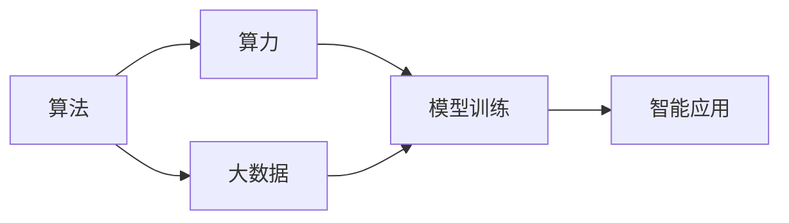

                 

# 《AI发展的三大支柱：算法、算力与大数据》

## 概述

人工智能（AI）作为当今科技领域的明星，正引领着全球范围内的技术革新和应用变革。在AI的发展过程中，算法、算力和大数据是三大关键支柱。本文将深入探讨这三大支柱的核心概念、发展历程、基本原理及其在AI领域的应用。

## 关键词

- 人工智能（AI）
- 算法
- 算力
- 大数据
- 机器学习
- 深度学习
- 神经网络
- 异构计算
- GPU
- CPU
- 数据采集
- 数据存储
- 数据处理
- 伦理与法规

## 摘要

本文将分为三个部分，首先介绍算法在AI发展中的核心作用，涵盖机器学习算法、深度学习算法及其应用实例。接着，讨论算力在AI硬件支撑中的重要性，分析现代计算机体系结构及其发展，探讨算力提升技术。最后，阐述大数据作为AI的养料来源，探讨数据采集与存储、数据处理与分析以及大数据应用场景。通过本文的深入探讨，读者将全面了解AI发展的三大支柱，为未来AI技术的发展提供启示。

## 目录大纲

### 第一部分 算法：AI的核心驱动力

#### 第1章 算法概述
##### 1.1 算法的定义与分类
##### 1.2 算法的发展历程
##### 1.3 算法的基本原理

#### 第2章 机器学习算法
##### 2.1 监督学习
###### 2.1.1 线性回归
###### 2.1.2 决策树
###### 2.1.3 支持向量机
##### 2.2 无监督学习
###### 2.2.1 K-均值聚类
###### 2.2.2 主成分分析
##### 2.3 强化学习
###### 2.3.1 Q-Learning
###### 2.3.2 DQN算法

#### 第3章 深度学习算法
##### 3.1 卷积神经网络（CNN）
###### 3.1.1 CNN的基本结构
###### 3.1.2 卷积操作
###### 3.1.3 池化操作
##### 3.2 循环神经网络（RNN）
###### 3.2.1 RNN的基本原理
###### 3.2.2 LSTM与GRU
##### 3.3 生成对抗网络（GAN）
###### 3.3.1 GAN的工作原理
###### 3.3.2 条件GAN（cGAN）

#### 第4章 算法应用实例
##### 4.1 图像识别
###### 4.1.1 AlexNet模型
###### 4.1.2 ResNet模型
##### 4.2 自然语言处理
###### 4.2.1 Word2Vec模型
###### 4.2.2 BERT模型

### 第二部分 算力：AI的硬件支撑

#### 第5章 算力概述
##### 5.1 算力的定义与重要性
##### 5.2 硬件架构的发展

#### 第6章 现代计算机体系结构
##### 6.1 CPU与GPU的区别
###### 6.1.1 CPU的工作原理
###### 6.1.2 GPU的工作原理
##### 6.2 异构计算
###### 6.2.1 异构计算的优点
###### 6.2.2 异构计算的应用场景

#### 第7章 算力提升技术
##### 7.1 神经网络加速
###### 7.1.1 稀疏性优化
###### 7.1.2 并行计算
##### 7.2 硬件定制
###### 7.2.1 ASIC设计
###### 7.2.2 FPGA

### 第三部分 大数据：AI的养料来源

#### 第8章 大数据概述
##### 8.1 大数据的定义与特点
##### 8.2 大数据的发展历程
##### 8.3 大数据的重要性

#### 第9章 数据采集与存储
##### 9.1 数据采集技术
###### 9.1.1 客户端采集
###### 9.1.2 服务器日志采集
##### 9.2 数据存储技术
###### 9.2.1 HDFS
###### 9.2.2 NoSQL数据库

#### 第10章 数据处理与分析
##### 10.1 数据清洗
###### 10.1.1 数据清洗的重要性
###### 10.1.2 数据清洗方法
##### 10.2 数据分析
###### 10.2.1 描述性分析
###### 10.2.2 聚类分析
###### 10.2.3 联邦学习

#### 第11章 大数据应用场景
##### 10.1 金融风控
###### 10.1.1 信用评分
###### 10.1.2 交易监控
##### 10.2 健康医疗
###### 10.2.1 医疗数据分析
###### 10.2.2 健康预测

#### 第12章 大数据伦理与法规
##### 12.1 大数据伦理问题
###### 12.1.1 数据隐私
###### 12.1.2 数据歧视
##### 12.2 大数据法规
###### 12.2.1 GDPR
###### 12.2.2 CCPA

## 附录

### 附录A 算法、算力与大数据的关系图



### 附录B 算法伪代码示例

```python
# 线性回归伪代码
def linear_regression(X, y):
    # 梯度下降法求解最小二乘
    theta = [0 for _ in range(n_features)]
    alpha = 0.01
    num_iterations = 1000
    
    for i in range(num_iterations):
        gradients = 2 / n_samples * X.T.dot(X.dot(theta) - y)
        theta -= alpha * gradients
        
    return theta
```

### 附录C 数学公式与解释

$$
\text{Cost Function: } J(\theta) = \frac{1}{2m} \sum_{i=1}^{m} (\theta^T x_i - y_i)^2
$$

成本函数，用于评估线性回归模型的性能。

### 附录D 项目实战

#### D.1 图像识别项目实战

##### D.1.1 项目背景

图像识别是AI领域的重要应用之一，广泛应用于人脸识别、自动驾驶、医疗影像诊断等领域。本文将介绍一个简单的图像识别项目实战，通过Python和TensorFlow框架实现一个基本的图像分类模型。

##### D.1.2 开发环境搭建

1. 安装Python环境
2. 安装TensorFlow库
3. 准备数据集

##### D.1.3 数据集准备

从Keras库中下载并加载数据集，如CIFAR-10数据集，它包含60000张32x32彩色图像，分为10个类别。

```python
from tensorflow.keras.datasets import cifar10
(x_train, y_train), (x_test, y_test) = cifar10.load_data()
```

##### D.1.4 模型训练与评估

构建卷积神经网络（CNN）模型，使用训练集训练模型，并在测试集上评估模型性能。

```python
from tensorflow.keras.models import Sequential
from tensorflow.keras.layers import Conv2D, MaxPooling2D, Flatten, Dense

model = Sequential()
model.add(Conv2D(32, (3, 3), activation='relu', input_shape=(32, 32, 3)))
model.add(MaxPooling2D(pool_size=(2, 2)))
model.add(Flatten())
model.add(Dense(10, activation='softmax'))

model.compile(optimizer='adam', loss='categorical_crossentropy', metrics=['accuracy'])
model.fit(x_train, y_train, epochs=10, batch_size=64, validation_split=0.2)
```

##### D.1.5 代码解读与分析

在代码中，我们首先导入了TensorFlow的库，并加载了CIFAR-10数据集。接着，我们构建了一个简单的卷积神经网络模型，其中包含卷积层、池化层和全连接层。最后，我们使用训练集进行模型训练，并在测试集上评估了模型的性能。

通过这个简单的项目实战，读者可以了解如何使用Python和TensorFlow进行图像识别模型开发。接下来，我们将进一步探讨算法、算力和大数据在AI领域的深入应用。|<|assistant|>## 第一部分 算法：AI的核心驱动力

算法是人工智能（AI）发展的核心驱动力，它决定了AI系统能够执行何种任务、学习何种知识，以及如何优化其性能。在这个部分，我们将详细探讨算法的定义与分类、算法的发展历程，以及算法的基本原理。

### 第1章 算法概述

#### 1.1 算法的定义与分类

算法是一系列定义明确的规则或步骤，用于解决特定问题或实现特定功能。在计算机科学中，算法通常被描述为输入、处理和输出的过程。算法可以按照不同的标准进行分类，例如按照问题类型、学习方式、算法结构等。

- **问题类型**：根据问题类型，算法可以分为如下几种：

  - **排序算法**：用于对数据进行排序，如冒泡排序、快速排序等。
  - **搜索算法**：用于在数据结构中查找特定元素，如二分搜索、深度优先搜索等。
  - **图算法**：用于解决与图相关的问题，如最短路径算法、最小生成树算法等。

- **学习方式**：根据学习方式，算法可以分为如下几种：

  - **确定性算法**：算法在每次运行时都会产生相同的结果，如决策树、线性回归等。
  - **随机算法**：算法在每次运行时可能会产生不同的结果，如随机森林、遗传算法等。
  - **学习算法**：用于从数据中学习模式和规则，如监督学习、无监督学习、强化学习等。

- **算法结构**：根据算法结构，算法可以分为如下几种：

  - **递归算法**：算法通过递归调用自身来解决子问题，如快速排序、递归树等。
  - **迭代算法**：算法通过迭代过程逐步逼近解决方案，如梯度下降法、牛顿法等。

#### 1.2 算法的发展历程

算法的发展历程可以追溯到古代数学和逻辑学。早在公元前200年，古希腊数学家欧几里得就提出了《几何原本》，其中包含了一系列解决几何问题的算法。在中世纪，阿拉伯数学家阿尔-花拉子米（Al-Khwarizmi）提出了算法（algorithm）这一概念，并将其应用于解决代数问题。

随着计算机科学的兴起，算法的研究和应用得到了迅速发展。20世纪中叶，计算机科学家约翰·冯·诺依曼（John von Neumann）提出了计算机体系结构的基本原理，为算法的设计和实现奠定了基础。此后，计算机科学家们提出了大量的算法，如排序算法、搜索算法、图算法等，这些算法在计算机科学和人工智能领域得到了广泛应用。

进入21世纪，随着大数据和机器学习的兴起，算法研究进入了一个新的阶段。机器学习算法，尤其是深度学习算法，在图像识别、自然语言处理、自动驾驶等领域取得了显著的突破。

#### 1.3 算法的基本原理

算法的基本原理可以分为以下几个步骤：

1. **输入**：算法接收输入数据，这些数据可以是具体的数值、符号、图像、声音等。

2. **处理**：算法根据定义的规则对输入数据进行处理，这通常涉及数据转换、数据结构操作、模式识别等。

3. **输出**：算法生成输出结果，这些结果可以是具体的数值、符号、图像、文本等。

4. **终止**：算法在完成处理任务后，终止执行。

算法的基本原理体现了计算机科学的基本思想，即通过定义明确的规则和步骤，解决复杂的问题。在人工智能领域，算法的设计和实现尤为重要，因为算法直接决定了AI系统的性能和效果。

### 小结

算法是人工智能发展的核心驱动力，它决定了AI系统能够执行何种任务、学习何种知识，以及如何优化其性能。在AI领域，算法不仅包括传统的计算算法，还包括机器学习算法、深度学习算法等。通过深入探讨算法的定义与分类、算法的发展历程，以及算法的基本原理，我们可以更好地理解AI技术的本质和应用前景。|<|assistant|>## 第2章 机器学习算法

机器学习算法是人工智能领域的重要分支，它通过从数据中学习模式和规律，使计算机能够进行自我优化和预测。在本章中，我们将详细探讨机器学习算法中的监督学习、无监督学习和强化学习，以及这些算法中的经典模型。

### 2.1 监督学习

监督学习是一种机器学习算法，它通过使用标记数据来训练模型，以便在新的、未标记的数据上进行预测。监督学习可以分为以下几类：

#### 2.1.1 线性回归

线性回归是一种简单的监督学习算法，它用于预测一个连续的输出值。线性回归模型基于如下假设：

$$
y = \theta_0 + \theta_1x
$$

其中，$y$ 是输出值，$x$ 是输入值，$\theta_0$ 和 $\theta_1$ 是模型参数。

线性回归的优化方法通常是梯度下降，其目标是最小化损失函数：

$$
J(\theta) = \frac{1}{2m} \sum_{i=1}^{m} (h_\theta(x^{(i)}) - y^{(i)})^2
$$

其中，$m$ 是样本数量，$h_\theta(x)$ 是线性回归函数，$y^{(i)}$ 是第 $i$ 个样本的输出值。

#### 2.1.2 决策树

决策树是一种基于规则的学习算法，它通过一系列的判断来分割数据，并预测输出值。决策树的生成过程通常采用递归方式，以下是一个简化的决策树生成过程：

1. 计算所有特征对目标变量的增益，选择最大增益的特征进行分割。
2. 使用该特征将数据集分割成子数据集。
3. 递归地对每个子数据集进行相同的步骤，直到满足终止条件（如最大深度、最小样本量等）。

决策树的叶子节点表示预测结果，内部节点表示特征和阈值。

#### 2.1.3 支持向量机

支持向量机（SVM）是一种强大的分类算法，它通过找到最佳的超平面来分割数据。SVM的基本思想是最大化分类间隔，即找到最宽的超平面。

对于线性可分数据，SVM的优化问题可以表示为：

$$
\min_{\theta, \xi} \frac{1}{2} ||\theta||^2 + C \sum_{i=1}^{m} \xi_i
$$

其中，$\theta$ 是模型参数，$C$ 是惩罚参数，$\xi_i$ 是松弛变量。

对于非线性数据，可以使用核函数将数据映射到高维空间，然后再应用线性SVM。

### 2.2 无监督学习

无监督学习是一种机器学习算法，它不使用标记数据来训练模型，而是从未标记的数据中发现模式和结构。无监督学习可以分为以下几类：

#### 2.2.1 K-均值聚类

K-均值聚类是一种基于距离的聚类算法，它将数据分为 $K$ 个簇，使得每个簇的内部距离最小，簇与簇之间的距离最大。K-均值聚类的算法过程如下：

1. 随机初始化 $K$ 个聚类中心。
2. 计算每个数据点与聚类中心的距离，并将数据点分配到最近的聚类中心。
3. 更新聚类中心，计算每个簇的平均值。
4. 重复步骤2和步骤3，直到聚类中心不再发生显著变化。

#### 2.2.2 主成分分析

主成分分析（PCA）是一种降维技术，它通过将数据投影到新的正交坐标系中，以减少数据维度并保留最重要的信息。PCA的基本步骤如下：

1. 计算数据矩阵 $X$ 的协方差矩阵。
2. 计算协方差矩阵的特征值和特征向量。
3. 选择最大的 $k$ 个特征值对应的特征向量，构成一个 $k$ 维的特征向量矩阵。
4. 使用特征向量矩阵对数据进行变换，得到降维后的数据。

### 2.3 强化学习

强化学习是一种通过试错和反馈来学习如何实现目标的学习方法。在强化学习中，智能体（agent）通过与环境（environment）交互，并从反馈中学习最优策略。强化学习可以分为以下几类：

#### 2.3.1 Q-Learning

Q-Learning是一种值迭代算法，它通过更新状态-动作值函数来学习最优策略。Q-Learning的基本步骤如下：

1. 初始化Q值函数 $Q(s, a)$，通常使用零初始化。
2. 在环境中进行模拟，选择动作 $a$ 并执行。
3. 根据环境反馈更新Q值函数：$Q(s, a) \leftarrow Q(s, a) + \alpha [r + \gamma \max_{a'} Q(s', a') - Q(s, a)]$
4. 重复步骤2和步骤3，直到达到停止条件。

其中，$\alpha$ 是学习率，$\gamma$ 是折扣因子，$r$ 是即时奖励，$s$ 和 $s'$ 分别是当前状态和下一状态，$a'$ 是最优动作。

#### 2.3.2 DQN算法

深度Q网络（DQN）是一种基于深度学习的强化学习算法，它通过神经网络来近似Q值函数。DQN的基本步骤如下：

1. 使用经验回放机制收集经验。
2. 从经验中随机采样一批数据。
3. 使用神经网络计算Q值估计。
4. 使用目标网络更新Q值函数。
5. 反复执行步骤2至步骤4。

DQN通过经验回放和目标网络来减少近端偏差，提高学习效果。

### 小结

机器学习算法是人工智能的核心驱动力，它通过从数据中学习模式和规律，使计算机能够进行自我优化和预测。在本章中，我们介绍了监督学习、无监督学习和强化学习，以及这些算法中的经典模型。通过深入探讨这些算法，我们可以更好地理解AI技术在现实世界中的应用和前景。|<|assistant|>### 第3章 深度学习算法

深度学习算法是机器学习的一个子领域，以其强大的表示学习和自适应特征提取能力而闻名。深度学习模型通常由多层神经网络组成，能够自动学习数据中的复杂模式和关系。在本章中，我们将详细探讨深度学习中的三种重要算法：卷积神经网络（CNN）、循环神经网络（RNN）和生成对抗网络（GAN）。

#### 3.1 卷积神经网络（CNN）

卷积神经网络是一种专门用于处理图像数据的神经网络，它通过卷积操作提取图像中的特征。CNN具有以下几个主要组成部分：

##### 3.1.1 CNN的基本结构

CNN的基本结构包括输入层、卷积层、池化层和全连接层。

1. **输入层**：输入层接收原始图像数据，通常是一个三维张量，表示为 $[通道, 高, 宽]$。
2. **卷积层**：卷积层通过卷积操作提取图像中的局部特征。每个卷积核是一个小的权重矩阵，用于从输入数据中提取特征。
3. **激活函数**：常用的激活函数包括ReLU（Rectified Linear Unit）和Sigmoid。
4. **池化层**：池化层用于降低特征图的维度，减少参数数量，同时保留重要信息。常用的池化操作包括最大池化和平均池化。
5. **全连接层**：全连接层将卷积层和池化层提取的特征映射到输出层，用于分类或回归任务。

##### 3.1.2 卷积操作

卷积操作是一种将卷积核在输入数据上滑动，并计算每个位置的局部加权和的过程。卷积操作的数学公式如下：

$$
\text{output}_{ij} = \sum_{k=1}^{C} w_{ikj} \cdot x_{ijk} + b_j
$$

其中，$\text{output}_{ij}$ 是输出特征图的位置 $(i, j)$，$w_{ikj}$ 是卷积核权重，$x_{ijk}$ 是输入特征图的位置 $(i, j, k)$，$b_j$ 是偏置项。

##### 3.1.3 池化操作

池化操作用于减少特征图的维度，提高模型的泛化能力。最大池化操作选择每个局部区域中的最大值，而平均池化操作计算每个局部区域内的平均值。

#### 3.2 循环神经网络（RNN）

循环神经网络是一种能够处理序列数据的神经网络，它通过循环结构保持长期状态信息。RNN的基本结构包括输入门、遗忘门和输出门。

##### 3.2.1 RNN的基本原理

RNN的基本原理是通过循环结构将当前状态与之前的状态关联起来。RNN的数学公式如下：

$$
h_t = \sigma(W_h \cdot [h_{t-1}, x_t] + b_h)
$$

$$
o_t = \sigma(W_o \cdot h_t + b_o)
$$

其中，$h_t$ 是当前时刻的隐藏状态，$x_t$ 是当前输入，$W_h$ 和 $W_o$ 是权重矩阵，$b_h$ 和 $b_o$ 是偏置项，$\sigma$ 是激活函数。

##### 3.2.2 LSTM与GRU

LSTM（Long Short-Term Memory）和GRU（Gated Recurrent Unit）是RNN的两种变体，用于解决长期依赖问题。

1. **LSTM**：LSTM通过引入门控机制，控制信息的流入和流出，从而解决长期依赖问题。LSTM的基本结构包括输入门、遗忘门和输出门。
2. **GRU**：GRU通过合并遗忘门和输入门，简化了LSTM的结构，同时保持了较好的性能。

#### 3.3 生成对抗网络（GAN）

生成对抗网络（GAN）是一种无监督学习算法，由生成器和判别器两个神经网络组成。生成器的目标是生成与真实数据相似的数据，而判别器的目标是区分真实数据和生成数据。

##### 3.3.1 GAN的工作原理

GAN的数学公式如下：

$$
\min_G \max_D V(D, G) = \mathbb{E}_{x \sim p_{\text{data}}(x)} [\log D(x)] + \mathbb{E}_{z \sim p_{\text{noise}}(z)] [\log (1 - D(G(z))]
$$

其中，$G(z)$ 是生成器的输出，$D(x)$ 是判别器的输出，$z$ 是随机噪声，$x$ 是真实数据。

##### 3.3.2 条件GAN（cGAN）

条件GAN（cGAN）是GAN的一种变体，它引入了条件信息，使生成器和判别器能够生成和区分带有条件的数据。

$$
G(z; c) = \mathcal{D}^{\text{cGAN}}_G (z; c)
$$

$$
D(x; c) = \mathcal{D}^{\text{cGAN}}_D (x; c)
$$

其中，$c$ 是条件信息，如类别标签。

### 小结

深度学习算法在图像识别、自然语言处理和序列建模等领域取得了显著的成果。在本章中，我们介绍了卷积神经网络（CNN）、循环神经网络（RNN）和生成对抗网络（GAN）的基本原理和应用。通过深入理解这些深度学习算法，我们可以更好地利用AI技术解决现实世界中的问题。|<|assistant|>### 第4章 算法应用实例

算法在人工智能（AI）领域中的应用极其广泛，涵盖了图像识别、自然语言处理、自动驾驶等多个领域。在本章中，我们将探讨两个重要的应用实例：图像识别和自然语言处理。

#### 4.1 图像识别

图像识别是AI领域中的一项核心技术，广泛应用于人脸识别、图像分类、物体检测等领域。以下我们介绍两个经典的图像识别模型：AlexNet和ResNet。

##### 4.1.1 AlexNet模型

AlexNet是由Alex Krizhevsky等人于2012年提出的卷积神经网络模型，是深度学习在图像识别领域的首次重大突破。AlexNet模型的结构如下：

1. **五层卷积层**：包括5个卷积层，每个卷积层后接有一个ReLU激活函数。
2. **三个最大池化层**：用于下采样特征图，减少计算量。
3. **三个全连接层**：用于分类，最后一层使用Softmax激活函数。

AlexNet模型在ImageNet竞赛中取得了领先成绩，显著推动了深度学习的发展。

##### 4.1.2 ResNet模型

ResNet是由Kaiming He等人于2015年提出的残差网络模型，它通过引入残差模块解决了深度神经网络中的梯度消失问题。ResNet模型的结构如下：

1. **残差模块**：ResNet的核心结构是残差模块，它通过跳过一部分网络层，直接将输入传递到下一层，从而缓解梯度消失问题。
2. **多组残差模块**：ResNet在多个阶段使用不同数量的残差模块，形成深度网络。
3. **全连接层**：在网络的最后一组残差模块后，接上全连接层进行分类。

ResNet模型在ImageNet竞赛中取得了更好的成绩，推动了深度学习模型向更深层次发展。

#### 4.2 自然语言处理

自然语言处理（NLP）是AI领域的另一个重要分支，涉及语言理解、语言生成、文本分类等多个方面。以下我们介绍两个经典的NLP模型：Word2Vec和BERT。

##### 4.2.1 Word2Vec模型

Word2Vec是由Tomas Mikolov等人于2013年提出的词向量模型，它通过将词汇映射到高维向量空间，实现了词义的分布式表示。Word2Vec模型主要有两种训练方法：

1. **连续词袋（CBOW）模型**：CBOW模型通过上下文词汇的平均向量表示当前词汇。
2. **Skip-Gram模型**：Skip-Gram模型通过当前词汇的向量表示上下文词汇。

Word2Vec模型在词义表示和文本分类等方面取得了显著成果，为NLP研究奠定了基础。

##### 4.2.2 BERT模型

BERT（Bidirectional Encoder Representations from Transformers）是由Google Research于2018年提出的双向Transformer模型，它通过预训练大量无标注文本，学习词的上下文表示。BERT模型的主要特点如下：

1. **双向编码器**：BERT采用Transformer架构，具有双向注意力机制，能够同时考虑词汇的前后文信息。
2. **大规模预训练**：BERT在大规模文本语料库上进行预训练，学习通用语言表示。
3. **细粒度任务**：BERT通过在特定任务上进行微调，实现了在多个NLP任务上的领先性能。

BERT模型在文本分类、问答系统、命名实体识别等领域取得了显著的成果，推动了NLP技术的发展。

### 小结

算法在图像识别和自然语言处理等领域的应用取得了显著的成果。通过深入探讨这些经典模型，我们可以更好地理解AI技术的应用潜力和发展前景。随着AI技术的不断进步，我们可以期待在更多领域看到算法的广泛应用和突破。|<|assistant|>### 第二部分 算力：AI的硬件支撑

算力，即计算能力，是人工智能（AI）发展的重要硬件支撑。随着AI技术的迅速发展，对算力的需求也在不断增长。本部分将探讨算力的定义与重要性，现代计算机体系结构，以及算力提升技术。

#### 第5章 算力概述

##### 5.1 算力的定义与重要性

算力是指计算机系统在单位时间内执行计算任务的能力，通常用浮点运算次数每秒（FLOPS）来衡量。随着深度学习、大数据分析和复杂模拟等应用的兴起，算力的需求急剧增加。算力的重要性体现在以下几个方面：

1. **性能提升**：更高的算力能够加速AI模型的训练和推理过程，提高系统的响应速度和效率。
2. **降低成本**：高效的算力可以降低硬件设备的能源消耗和运行成本，提高企业的竞争力。
3. **推动创新**：强大的算力为AI研究提供了更广阔的空间，促进新算法、新应用和新突破的出现。

##### 5.2 硬件架构的发展

计算机硬件架构的发展是算力提升的关键驱动力。从传统的CPU到现代的GPU、TPU等专用处理器，硬件架构的演进不断推动着算力的提升。

1. **CPU**：中央处理器（CPU）是计算机的核心组件，负责执行程序指令。随着多核CPU的出现，并行计算能力得到了显著提升。
2. **GPU**：图形处理器（GPU）专为图形渲染而设计，但因其强大的并行计算能力，也被广泛应用于深度学习和其他计算密集型任务。
3. **TPU**：张量处理器（TPU）是Google专门为机器学习和深度学习任务设计的处理器，具有极高的计算性能。

#### 第6章 现代计算机体系结构

##### 6.1 CPU与GPU的区别

CPU和GPU在架构和功能上有显著差异：

1. **架构**：CPU采用冯诺依曼架构，以顺序执行指令为主，适用于通用计算任务。GPU采用SIMD（单指令多数据）架构，能够并行处理多个数据元素，适用于大规模并行计算。
2. **核心数**：CPU核心数通常较少，但主频较高，适用于计算密集型任务。GPU核心数较多，但主频较低，适用于大规模并行计算。
3. **内存带宽**：GPU的内存带宽通常比CPU高，能够更快地访问内存，适用于处理大量数据。

##### 6.2 异构计算

异构计算是指利用不同类型的处理器协同工作，以提升计算性能。异构计算在AI领域有广泛的应用：

1. **异构计算的优点**：
   - **高效的资源利用**：通过利用GPU等专用处理器，提高计算效率。
   - **扩展性强**：可以方便地扩展计算资源，满足大规模计算需求。
   - **灵活性高**：可以根据不同的计算任务，选择合适的处理器组合。

2. **异构计算的应用场景**：
   - **深度学习训练**：GPU在深度学习模型的训练中发挥着重要作用，通过并行计算加速模型训练。
   - **大数据处理**：利用GPU进行数据清洗、转换和分析，提高数据处理效率。

#### 第7章 算力提升技术

##### 7.1 神经网络加速

神经网络加速技术旨在提高深度学习模型的计算速度，主要包括以下几个方面：

1. **稀疏性优化**：通过减少网络中的冗余权重，降低计算量，提高计算效率。
2. **并行计算**：通过利用多核CPU、GPU等并行计算资源，加速模型训练和推理。
3. **模型压缩**：通过模型压缩技术，如权重共享、剪枝和量化等，减少模型大小，提高计算效率。

##### 7.2 硬件定制

硬件定制是指根据特定应用需求，设计并制造专用的处理器。硬件定制在AI领域有广泛的应用：

1. **ASIC**：专用集成电路（ASIC）是专门为特定任务设计的芯片，具有高性能、低功耗的特点。
2. **FPGA**：现场可编程门阵列（FPGA）是一种可编程逻辑设备，通过编程实现不同的逻辑功能，适用于灵活的应用场景。

##### 7.3 分布式计算

分布式计算是指利用多台计算机协同工作，实现大规模计算任务。分布式计算在AI领域有广泛的应用：

1. **集群计算**：通过多台服务器组成的计算集群，实现大规模数据处理和模型训练。
2. **云计算**：通过云服务提供商提供的计算资源，实现弹性计算和按需扩展。

### 小结

算力是AI发展的关键硬件支撑，随着AI技术的不断进步，对算力的需求也在不断增加。通过探讨现代计算机体系结构、算力提升技术以及异构计算，我们可以更好地理解AI硬件的发展趋势，为未来的AI应用提供更强大的支持。|<|assistant|>### 第6章 现代计算机体系结构

在人工智能（AI）的发展过程中，算力的提升离不开现代计算机体系结构的优化。计算机体系结构的发展对AI的应用性能和效率有着深远的影响。本章节将深入探讨CPU与GPU的区别，以及异构计算的优势和应用场景。

#### 6.1 CPU与GPU的区别

CPU（中央处理器）和GPU（图形处理器）是两种常见的计算机处理器，它们在架构、性能和用途上有着显著的差异。

##### 6.1.1 CPU的工作原理

CPU是计算机系统的核心组件，负责执行操作系统指令和应用程序代码。CPU的工作原理如下：

1. **冯诺依曼架构**：CPU采用冯诺依曼架构，包含一个控制单元、一个算术逻辑单元（ALU）、几个寄存器和内存接口。CPU通过控制单元读取指令，执行算术逻辑运算，并将结果存储在内存中。
2. **指令执行**：CPU通过指令流水线执行指令，包括取指、解码、执行和写回阶段。这种流水线技术提高了指令的执行效率。
3. **多核CPU**：现代CPU通常包含多个核心，每个核心可以并行执行多个线程，从而提高了计算性能。

##### 6.1.2 GPU的工作原理

GPU是专门为图形渲染任务设计的处理器，但近年来也广泛应用于深度学习和其他计算密集型任务。GPU的工作原理如下：

1. **SIMD架构**：GPU采用单指令多数据（SIMD）架构，能够同时处理多个数据元素。这种架构使得GPU在并行计算方面具有显著优势。
2. **并行处理**：GPU包含大量的计算单元，称为流处理器（Streaming Multiprocessors，SM）。这些流处理器可以并行执行大量的简单运算，从而提高了计算性能。
3. **内存管理**：GPU具有高带宽的内存接口，能够快速访问和传输大量数据。这使得GPU在处理大规模数据集时具有优势。

#### 6.2 异构计算

异构计算是指利用不同类型的处理器协同工作，以提升计算性能和效率。异构计算在AI领域有广泛的应用，以下是其优势和应用场景：

##### 6.2.1 异构计算的优点

1. **高效的资源利用**：异构计算可以根据不同任务的特点，合理分配计算资源，提高资源利用率。
2. **扩展性强**：通过利用多种类型的处理器，异构计算可以方便地扩展计算能力，满足不同规模的任务需求。
3. **灵活性高**：异构计算可以根据应用场景和任务需求，选择合适的处理器组合，提高计算效率和性能。

##### 6.2.2 异构计算的应用场景

1. **深度学习训练**：在深度学习模型的训练过程中，GPU由于其强大的并行计算能力，可以显著加速模型训练。而CPU则在模型推理和预处理任务中发挥着重要作用。
2. **大数据处理**：在大数据处理领域，GPU在数据清洗、转换和分析等任务中具有优势，而CPU则在处理复杂算法和协调不同数据处理环节时具有优势。
3. **科学计算**：在科学计算领域，异构计算可以有效地利用GPU进行大规模的数值计算和模拟，提高计算效率和准确性。

#### 6.3 GPU在深度学习中的应用

GPU在深度学习中的应用已经取得了显著的成果。以下是一些关键点：

1. **GPU加速深度学习**：深度学习模型通常包含大量的矩阵运算，GPU的并行计算能力可以显著加速这些运算，提高模型训练和推理的效率。
2. **深度学习框架**：如TensorFlow、PyTorch等深度学习框架已经优化了GPU加速，使得开发者可以轻松利用GPU进行深度学习任务。
3. **GPU集群**：在需要大规模并行计算的深度学习任务中，GPU集群可以提供强大的计算能力，实现高效的大规模模型训练和推理。

### 小结

现代计算机体系结构的发展对AI的发展有着深远的影响。通过深入理解CPU与GPU的区别以及异构计算的优势和应用场景，我们可以更好地利用硬件资源，提高AI应用的性能和效率。随着AI技术的不断进步，现代计算机体系结构也将继续演进，为AI领域的发展提供更强大的支持。|<|assistant|>### 第7章 算力提升技术

随着人工智能（AI）技术的不断发展，对算力的需求日益增长。传统的CPU和GPU架构虽然已经能够满足许多计算需求，但在面对某些特定的AI任务时，计算速度和效率仍存在瓶颈。为了提升算力，研究人员和实践者开发了多种提升技术，主要包括神经网络加速、硬件定制和分布式计算等。以下是这些技术的详细探讨。

#### 7.1 神经网络加速

神经网络加速技术旨在提高深度学习模型训练和推理的速度。以下是一些关键加速技术：

##### 7.1.1 稀疏性优化

稀疏性优化通过减少神经网络中的冗余参数，降低计算复杂度，从而提高计算效率。具体方法包括：

1. **参数剪枝**：通过删除网络中不重要的权重，减少参数数量，从而降低计算复杂度。
2. **动态稀疏性**：在训练过程中动态调整网络的稀疏性，根据权重的重要性进行剪枝，提高模型性能。

##### 7.1.2 并行计算

并行计算通过利用多核CPU、GPU等并行计算资源，将计算任务分解为多个子任务，同时执行，从而提高计算速度。以下是一些并行计算方法：

1. **数据并行**：将数据集分为多个部分，分别在不同的GPU或CPU上训练模型，最后合并结果。
2. **模型并行**：将深度学习模型分为多个子网络，分别在不同的计算资源上训练，最后合并子网络的输出。

##### 7.1.3 张量核心优化

张量核心优化针对深度学习中的矩阵运算，通过优化内存访问和数据布局，提高计算效率。具体方法包括：

1. **内存对齐**：将数据存储在内存中对齐的位置，减少内存访问的开销。
2. **张量化**：将多个连续的矩阵运算合并为一个张量运算，减少计算次数。

#### 7.2 硬件定制

硬件定制是指根据特定应用需求，设计并制造专用的处理器。以下是一些硬件定制技术：

##### 7.2.1 ASIC设计

ASIC（专用集成电路）是一种专门为特定任务设计的集成电路。ASIC设计可以充分利用硬件资源，提高计算效率，但设计成本较高。

1. **定点运算**：ASIC可以通过硬件实现定点运算，提高计算速度和降低功耗。
2. **硬件加速器**：ASIC可以集成硬件加速器，如向量处理器、矩阵运算单元等，提高计算性能。

##### 7.2.2 FPGA设计

FPGA（现场可编程门阵列）是一种可编程逻辑设备，可以通过编程实现不同的逻辑功能。FPGA设计具有灵活性和可重配置性，适用于快速迭代和原型开发。

1. **硬件流水线**：FPGA可以通过硬件流水线实现多个计算步骤的并行处理，提高计算效率。
2. **定制化逻辑**：FPGA可以集成定制化的逻辑单元，如矩阵乘法器、内存控制器等，提高计算性能。

#### 7.3 分布式计算

分布式计算通过将计算任务分配到多台计算机上，协同工作，提高计算速度和效率。以下是一些分布式计算技术：

##### 7.3.1 集群计算

集群计算通过多台服务器组成的计算集群，实现大规模并行计算。集群计算可以充分利用多台服务器的计算资源，提高计算性能。

1. **负载均衡**：通过负载均衡算法，将计算任务分配到不同的服务器上，避免单点瓶颈。
2. **分布式存储**：通过分布式存储系统，实现数据的高效访问和管理，提高计算效率。

##### 7.3.2 云计算

云计算通过云服务提供商提供的计算资源，实现弹性计算和按需扩展。云计算可以根据计算需求，动态调整计算资源，提高计算效率和灵活性。

1. **虚拟化技术**：通过虚拟化技术，将物理服务器虚拟化为多个虚拟机，实现资源的动态分配和调度。
2. **容器技术**：通过容器技术，实现应用程序的轻量化和隔离，提高计算效率和可靠性。

### 小结

算力提升技术是满足AI计算需求的重要手段。通过神经网络加速、硬件定制和分布式计算等技术，我们可以显著提高计算速度和效率，为AI应用提供更强大的支持。随着AI技术的不断进步，算力提升技术也将持续发展，为AI领域带来更多创新和突破。|<|assistant|>### 第三部分 大数据：AI的养料来源

大数据作为人工智能（AI）的养料来源，对AI的发展至关重要。在本部分中，我们将深入探讨大数据的定义与特点、大数据的发展历程、大数据的重要性，以及数据采集、存储、处理和分析技术。

#### 第8章 大数据概述

##### 8.1 大数据的定义与特点

大数据（Big Data）是指数据量巨大、数据类型多样、数据生成速度快的数据集合。大数据具有以下几个主要特点：

1. **大量（Volume）**：大数据涉及的数据量巨大，通常在TB、PB甚至EB级别。
2. **多样（Variety）**：大数据不仅包括结构化数据，还包括半结构化数据和非结构化数据，如文本、图像、音频、视频等。
3. **快速（Velocity）**：大数据生成速度极快，需要实时或近实时处理。
4. **真实（Veracity）**：大数据往往包含噪声和错误，真实性和可靠性是一个挑战。

##### 8.2 大数据的发展历程

大数据的发展历程可以追溯到20世纪80年代，当时互联网和数据库技术的发展为数据存储和检索提供了基础设施。随着云计算、物联网和社交网络的兴起，大数据迎来了快速发展：

1. **2000年代初期**：互联网的普及和电子商务的兴起导致了数据量的爆炸性增长。
2. **2005年**：Google发布了MapReduce论文，开启了分布式数据处理的新时代。
3. **2010年代**：大数据技术逐渐成熟，Hadoop、Spark等分布式数据处理框架得到了广泛应用。
4. **2020年代**：大数据技术继续演进，人工智能和机器学习开始与大数据相结合，推动了大数据应用的进一步扩展。

##### 8.3 大数据的重要性

大数据对AI和各行各业的影响日益显著，其重要性体现在以下几个方面：

1. **决策支持**：大数据提供了丰富的数据资源，使决策者能够基于数据做出更加精准和高效的决策。
2. **创新驱动**：大数据为研究者和企业提供了大量的数据，推动了技术创新和应用创新。
3. **业务优化**：通过大数据分析，企业可以优化业务流程，提高运营效率，降低成本。
4. **社会效益**：大数据在公共卫生、环境保护、社会安全等领域发挥了重要作用，提高了社会管理的智能化水平。

#### 第9章 数据采集与存储

数据采集是大数据处理的第一步，涉及到各种数据源的数据收集。以下介绍数据采集和存储技术的关键点：

##### 9.1 数据采集技术

1. **客户端采集**：通过客户端软件收集用户行为数据、设备状态数据等。
2. **服务器日志采集**：通过服务器日志收集网站访问数据、系统运行数据等。
3. **物联网设备采集**：通过物联网设备收集传感器数据、设备状态数据等。

##### 9.2 数据存储技术

1. **关系数据库**：关系数据库适用于结构化数据的存储和管理，如SQL数据库。
2. **NoSQL数据库**：NoSQL数据库适用于存储半结构化数据和非结构化数据，如MongoDB、Cassandra等。
3. **分布式文件系统**：分布式文件系统如HDFS（Hadoop Distributed File System）适用于大规模数据的存储和管理。

#### 第10章 数据处理与分析

数据处理与分析是大数据处理的核心环节，涉及到数据清洗、转换、分析和可视化等技术。

##### 10.1 数据清洗

数据清洗是数据处理的第一步，目的是去除数据中的噪声和错误，提高数据质量。主要方法包括：

1. **缺失值处理**：通过填充或删除缺失值来处理缺失数据。
2. **异常值检测**：通过统计分析和机器学习算法检测并处理异常值。
3. **重复值去除**：通过检测并删除重复数据来减少数据冗余。

##### 10.2 数据分析

数据分析包括描述性分析、诊断分析、预测分析和因果分析等。

1. **描述性分析**：用于描述数据的基本特征，如平均值、中位数、标准差等。
2. **诊断分析**：用于发现数据中的异常和趋势，如聚类分析、关联规则分析等。
3. **预测分析**：通过建立预测模型，对未来事件进行预测，如回归分析、时间序列分析等。
4. **因果分析**：通过分析因果关系，探究不同变量之间的关系，如因果推断、决策树等。

##### 10.3 联邦学习

联邦学习是一种分布式学习技术，通过在数据源端进行模型训练，避免了数据在传输过程中的隐私泄露问题。联邦学习主要应用场景包括：

1. **跨机构数据共享**：通过联邦学习，不同机构可以在不共享数据的情况下共同训练模型，提高数据隐私保护。
2. **设备端数据训练**：在移动设备上进行模型训练，减少数据传输和存储的需求，提高计算效率。

#### 第11章 大数据应用场景

大数据在金融、健康医疗、智能交通、市场营销等众多领域有着广泛的应用。

##### 11.1 金融风控

1. **信用评分**：通过大数据分析，对借款人的信用状况进行评估，降低坏账率。
2. **交易监控**：通过分析交易数据，检测异常交易行为，防范金融犯罪。

##### 11.2 健康医疗

1. **医疗数据分析**：通过分析患者数据，发现疾病模式，提高疾病诊断和治疗效果。
2. **健康预测**：通过分析健康数据，预测健康状况，提供个性化健康建议。

#### 第12章 大数据伦理与法规

大数据的发展带来了数据隐私、数据歧视等伦理和法规问题。

##### 12.1 大数据伦理问题

1. **数据隐私**：大数据分析可能导致个人隐私泄露，需要加强数据隐私保护。
2. **数据歧视**：大数据分析可能导致算法歧视，需要建立公平公正的数据分析机制。

##### 12.2 大数据法规

1. **GDPR**：欧盟颁布的《通用数据保护条例》，对数据收集、存储、处理和传输提出了严格要求。
2. **CCPA**：美国加利福尼亚州颁布的《加州消费者隐私法案》，保护消费者数据隐私。

### 小结

大数据作为AI的养料来源，对AI的发展具有重要意义。通过数据采集、存储、处理和分析技术，大数据为AI提供了丰富的数据资源，推动了AI在各个领域的应用和发展。随着大数据技术的不断进步，我们可以期待AI在未来的发展将更加智能和高效。|<|assistant|>### 第9章 数据采集与存储

数据采集与存储是大数据处理的关键环节，直接决定了数据的质量和可利用性。在本章中，我们将深入探讨数据采集和存储技术，包括数据采集方法、常见的数据存储技术，以及如何保证数据的质量和安全性。

#### 9.1 数据采集技术

数据采集是大数据处理的起点，涉及到从各种来源收集数据的过程。以下是几种常见的数据采集方法：

##### 9.1.1 客户端采集

客户端采集主要涉及通过客户端应用程序收集用户数据。这种方法可以收集用户的行为数据、偏好信息等。常见的客户端采集技术包括：

1. **日志文件**：通过记录客户端操作产生的日志文件，收集用户操作数据。
2. **SDK（软件开发工具包）**：通过集成SDK，在客户端应用程序中嵌入代码，收集用户行为数据。

##### 9.1.2 服务器日志采集

服务器日志采集是通过服务器系统记录的日志文件来收集数据。这种方法可以收集网站访问数据、服务器性能数据等。常见的服务器日志采集技术包括：

1. **Web日志**：通过服务器记录的Web访问日志，收集用户访问网站的信息。
2. **系统日志**：通过服务器系统的日志，收集系统运行状态和错误信息。

##### 9.1.3 物联网设备采集

物联网设备采集是通过物联网设备收集传感器数据。这种方法可以收集环境数据、设备状态数据等。常见的物联网设备采集技术包括：

1. **传感器数据**：通过物联网设备上的传感器，收集环境数据（如温度、湿度、光照等）。
2. **设备日志**：通过物联网设备记录的日志，收集设备运行状态和异常信息。

#### 9.2 数据存储技术

数据存储是大数据处理的重要环节，涉及到如何高效、安全地存储和管理海量数据。以下是几种常见的数据存储技术：

##### 9.2.1 HDFS

HDFS（Hadoop Distributed File System）是Hadoop生态系统中的分布式文件系统，适用于大规模数据的存储和管理。HDFS的主要特点包括：

1. **高容错性**：HDFS通过数据复制和备份，保证数据的高可用性。
2. **高扩展性**：HDFS可以轻松扩展到数千台服务器，支持海量数据存储。
3. **高效的数据访问**：HDFS通过分布式文件存储和并行数据访问，提高了数据访问速度。

##### 9.2.2 NoSQL数据库

NoSQL数据库是一种非关系型数据库，适用于存储半结构化数据和非结构化数据。常见的NoSQL数据库包括：

1. **MongoDB**：MongoDB是一个文档型数据库，支持大规模数据的存储和查询。
2. **Cassandra**：Cassandra是一个分布式键值存储系统，适用于高并发和高可用性的场景。
3. **Redis**：Redis是一个内存型数据库，适用于高速缓存和实时数据访问。

##### 9.2.3 数据湖

数据湖是一种大数据存储解决方案，用于存储海量数据，包括结构化、半结构化和非结构化数据。数据湖的主要特点包括：

1. **灵活性**：数据湖可以存储不同类型的数据，支持多种数据处理和分析需求。
2. **可扩展性**：数据湖可以轻松扩展存储容量，支持海量数据存储。
3. **低成本**：数据湖采用分布式存储技术，降低了存储成本。

#### 9.3 数据质量保障

数据质量是大数据处理的关键因素，直接影响到数据分析和决策的准确性。以下是一些保障数据质量的方法：

##### 9.3.1 数据清洗

数据清洗是数据质量保障的重要步骤，旨在去除数据中的噪声和错误，提高数据质量。常见的数据清洗方法包括：

1. **缺失值处理**：通过填充或删除缺失值来处理缺失数据。
2. **异常值检测**：通过统计分析和机器学习算法检测并处理异常值。
3. **重复值去除**：通过检测并删除重复数据来减少数据冗余。

##### 9.3.2 数据验证

数据验证是通过验证数据是否符合预定的规则和标准，确保数据的准确性。常见的数据验证方法包括：

1. **字段验证**：通过验证数据字段是否符合预定的格式和范围，确保数据的有效性。
2. **逻辑验证**：通过验证数据之间的逻辑关系，确保数据的准确性。
3. **一致性验证**：通过验证数据在不同系统或数据源之间的一致性，确保数据的一致性。

##### 9.3.3 数据加密

数据加密是通过加密算法对数据进行加密，确保数据在存储和传输过程中的安全性。常见的数据加密方法包括：

1. **对称加密**：使用相同的密钥对数据进行加密和解密。
2. **非对称加密**：使用一对密钥（公钥和私钥）进行加密和解密。
3. **哈希算法**：通过哈希算法生成数据摘要，确保数据的完整性。

### 小结

数据采集与存储是大数据处理的基础，直接决定了数据的质量和可用性。通过深入探讨数据采集和存储技术，以及数据质量保障方法，我们可以确保数据在采集、存储和处理过程中的准确性和安全性，为大数据分析和决策提供坚实的基础。随着大数据技术的不断进步，数据采集与存储技术将继续优化，为大数据应用的广泛普及提供更有力的支持。|<|assistant|>### 第10章 数据处理与分析

数据处理与分析是大数据的核心环节，它决定了数据的价值能否得到充分利用。在这一章中，我们将深入探讨数据清洗、数据分析和数据可视化技术，以及联邦学习这一新兴技术。

#### 10.1 数据清洗

数据清洗是数据处理的第一步，其目标是去除数据中的噪声和错误，提高数据质量。以下是数据清洗的一些关键步骤：

##### 10.1.1 数据清洗的重要性

数据清洗的重要性体现在以下几个方面：

1. **提高数据质量**：通过去除噪声和错误，提高数据的准确性，确保分析结果的可靠性。
2. **降低分析成本**：清洗后的数据更容易分析和处理，从而降低数据分析的成本。
3. **提高决策效率**：高质量的数据有助于快速做出准确的决策。

##### 10.1.2 数据清洗方法

数据清洗的方法包括：

1. **缺失值处理**：常见的缺失值处理方法有：
   - 填充：使用平均值、中位数或众数等统计指标来填充缺失值。
   - 删除：删除含有缺失值的记录，适用于缺失值较少的情况。

2. **异常值检测**：异常值检测的方法包括：
   - 离群点检测：使用统计方法（如IQR法、Z分数法等）检测离群点。
   - 算法检测：使用机器学习方法（如孤立森林等）检测异常值。

3. **重复值去除**：通过比较记录的属性值，删除重复的记录。

4. **数据格式转换**：将不同格式的数据转换为统一的格式，以便进一步处理。

#### 10.2 数据分析

数据分析是通过对数据进行处理、分析和挖掘，从中提取有价值的信息。数据分析可以分为以下几种类型：

##### 10.2.1 描述性分析

描述性分析旨在描述数据的基本特征，常用的统计指标包括：

1. **中心趋势指标**：如平均值、中位数、众数。
2. **离散程度指标**：如标准差、方差、变异系数。
3. **分布特征**：如频率分布、累积分布。

##### 10.2.2 聚类分析

聚类分析是一种无监督学习方法，它将相似的数据点归为一类。常见的聚类算法包括：

1. **K-均值聚类**：基于距离最近的原则将数据点划分为K个簇。
2. **层次聚类**：根据数据点的相似度，逐步构建聚类层次结构。

##### 10.2.3 联邦学习

联邦学习是一种分布式学习技术，旨在保护用户隐私的同时，协同训练一个全局模型。联邦学习的关键步骤包括：

1. **模型初始化**：在全局服务器初始化一个基础模型。
2. **本地训练**：每个用户在自己的设备上训练模型，并上传梯度。
3. **全局更新**：全局服务器根据收到的梯度更新模型。

联邦学习的优势在于：
- **隐私保护**：用户数据不需要上传到中央服务器，从而保护了用户的隐私。
- **数据安全**：通过加密和差分隐私技术，防止数据泄露和攻击。

##### 10.2.4 分段分析

分段分析是将数据按照不同的维度进行划分，分别分析每个分段的数据特征。这种方法有助于发现不同群体之间的差异和规律。

#### 10.3 数据可视化

数据可视化是将数据以图形的方式呈现，使数据更容易理解和分析。以下是几种常见的数据可视化技术：

1. **柱状图**：用于比较不同类别的数据值。
2. **饼图**：用于表示不同类别的占比。
3. **折线图**：用于显示数据的变化趋势。
4. **散点图**：用于显示数据点之间的关系。

#### 10.4 数据分析工具

数据分析工具是进行数据处理和分析的重要工具。以下是一些常用的数据分析工具：

1. **Python**：Python提供了丰富的数据处理和分析库，如Pandas、NumPy、Matplotlib等。
2. **R语言**：R语言是一种专门用于统计分析和图形绘制的语言，拥有丰富的包和函数。
3. **Tableau**：Tableau是一种数据可视化工具，可以快速创建直观的交互式图表。

### 小结

数据处理与分析是大数据应用的核心，它决定了数据的价值能否得到充分发挥。通过深入探讨数据清洗、数据分析、数据可视化技术以及联邦学习，我们可以更好地理解如何利用大数据为决策提供支持。随着数据分析技术的不断发展，我们将能够更加有效地挖掘数据价值，推动人工智能和大数据应用的进一步发展。|<|assistant|>### 第11章 大数据应用场景

大数据技术已经渗透到各个行业，为业务创新、优化流程和提升用户体验提供了强大的支持。在本章中，我们将探讨大数据在金融风控、健康医疗、智能交通和市场营销等领域的具体应用。

#### 11.1 金融风控

金融风控是指金融机构通过技术手段识别和防范潜在风险，保障资金安全。大数据技术在金融风控中发挥了重要作用：

##### 11.1.1 信用评分

信用评分是指通过分析借款人的历史数据、行为数据等，评估其信用风险。大数据技术可以帮助金融机构更准确地预测借款人的信用状况，从而降低坏账率。

- **数据来源**：信用评分涉及的数据来源包括借贷记录、消费记录、社会关系等。
- **分析方法**：通过大数据分析技术，如机器学习和统计模型，对数据进行处理和分析，构建信用评分模型。

##### 11.1.2 交易监控

交易监控是指实时监测交易行为，识别和防范异常交易。大数据技术可以实时处理海量交易数据，发现潜在风险。

- **数据来源**：交易监控涉及的数据来源包括交易记录、账户信息、行为数据等。
- **分析方法**：通过大数据分析技术，如实时流处理和机器学习，监控交易行为，识别异常模式。

#### 11.2 健康医疗

健康医疗领域的大数据应用旨在提高医疗服务质量、优化医疗流程和改善患者体验：

##### 11.2.1 医疗数据分析

医疗数据分析是指通过分析医疗数据，发现疾病模式、预测疾病趋势和优化治疗方案。大数据技术可以帮助医疗机构更好地理解疾病，提高诊断和治疗效果。

- **数据来源**：医疗数据分析涉及的数据来源包括电子病历、医学影像、基因数据等。
- **分析方法**：通过大数据分析技术，如数据挖掘和机器学习，对医疗数据进行处理和分析，发现疾病模式和优化治疗方案。

##### 11.2.2 健康预测

健康预测是指通过分析健康数据，预测个体健康状况和疾病风险。大数据技术可以帮助医疗机构和患者更好地管理健康，预防疾病。

- **数据来源**：健康预测涉及的数据来源包括健康记录、行为数据、生物特征数据等。
- **分析方法**：通过大数据分析技术，如机器学习和预测模型，对健康数据进行处理和分析，预测个体健康状况和疾病风险。

#### 11.3 智能交通

智能交通是指利用大数据、物联网和人工智能技术，优化交通管理和提升交通服务水平。大数据技术在智能交通中发挥了重要作用：

##### 11.3.1 交通流量分析

交通流量分析是指通过分析交通数据，了解交通流量状况，优化交通信号控制和路线规划。大数据技术可以帮助交通管理部门实时监测交通状况，提高交通效率。

- **数据来源**：交通流量分析涉及的数据来源包括交通监控设备、车辆定位数据、GPS数据等。
- **分析方法**：通过大数据分析技术，如数据挖掘和实时流处理，分析交通数据，优化交通信号控制和路线规划。

##### 11.3.2 事故预警

事故预警是指通过分析交通数据，提前预测交通事故风险，提醒驾驶员注意安全。大数据技术可以帮助减少交通事故，提高道路安全。

- **数据来源**：事故预警涉及的数据来源包括车辆传感器数据、交通监控设备数据等。
- **分析方法**：通过大数据分析技术，如机器学习和预测模型，分析交通数据，预测交通事故风险，提醒驾驶员注意安全。

#### 11.4 市场营销

市场营销是指企业通过市场研究和数据分析，了解消费者需求，制定营销策略。大数据技术在市场营销中发挥了重要作用：

##### 11.4.1 消费者行为分析

消费者行为分析是指通过分析消费者数据，了解消费者的购买习惯、偏好和需求。大数据技术可以帮助企业更好地定位目标消费者，提高营销效果。

- **数据来源**：消费者行为分析涉及的数据来源包括网站访问日志、社交媒体数据、购物行为数据等。
- **分析方法**：通过大数据分析技术，如数据挖掘和机器学习，分析消费者行为数据，了解消费者需求和行为模式。

##### 11.4.2 个性化推荐

个性化推荐是指通过分析用户数据，为用户推荐个性化的商品、服务和内容。大数据技术可以帮助企业提高用户满意度，提升用户忠诚度。

- **数据来源**：个性化推荐涉及的数据来源包括用户行为数据、用户偏好数据等。
- **分析方法**：通过大数据分析技术，如协同过滤和机器学习，分析用户数据，为用户推荐个性化的商品和服务。

### 小结

大数据技术在金融风控、健康医疗、智能交通和市场营销等领域的应用，为各行业的业务创新和优化提供了有力支持。通过深入探讨这些应用场景，我们可以更好地理解大数据技术的价值，并探索其在未来更多领域的潜力。随着大数据技术的不断发展和成熟，我们可以期待它将在更多行业带来革命性的变革。|<|assistant|>### 第12章 大数据伦理与法规

随着大数据技术的迅速发展和广泛应用，数据隐私、数据歧视等问题逐渐凸显，引起了社会各界的广泛关注。为了规范大数据的使用，保护个人隐私，防止数据滥用，各国纷纷出台了相关伦理与法规。在本章中，我们将探讨大数据伦理问题以及相关法规，包括数据隐私保护、数据歧视问题、GDPR（通用数据保护条例）和CCPA（加州消费者隐私法案）等。

#### 12.1 大数据伦理问题

大数据伦理问题主要集中在以下几个方面：

##### 12.1.1 数据隐私

数据隐私是大数据伦理的核心问题之一。随着数据收集和处理技术的不断发展，个人隐私容易被泄露、滥用或盗取。以下是几个关键点：

1. **数据收集**：在收集数据时，需要确保数据收集的合法性和透明度，明确告知用户数据的用途和范围。
2. **数据存储**：在存储数据时，需要采取有效的安全措施，防止数据泄露、丢失或被未授权访问。
3. **数据使用**：在使用数据时，应遵循最小化原则，仅使用必要的数据，避免滥用数据。

##### 12.1.2 数据歧视

数据歧视是指基于数据分析结果对个人或群体进行不公平的对待。以下是几个关键点：

1. **算法偏见**：在算法设计过程中，需要确保算法的公平性和透明性，避免因算法偏见导致歧视行为。
2. **数据来源**：在收集数据时，应确保数据来源的多样性和代表性，避免因数据偏差导致歧视。
3. **用户权益**：在数据分析过程中，应保障用户的知情权和参与权，让用户了解自己的数据被如何使用，并有权选择是否参与数据分析。

##### 12.1.3 数据透明度

数据透明度是指数据收集、处理和使用过程的透明性。以下是几个关键点：

1. **数据透明度**：在数据收集和处理过程中，应明确告知用户数据的用途、范围和处理方式。
2. **用户知情权**：用户有权了解自己的数据被如何使用，以及数据被谁访问。
3. **数据可追溯性**：在数据使用过程中，应确保数据的可追溯性，以便在发生问题时进行追踪和审计。

#### 12.2 大数据法规

为了应对大数据带来的伦理问题，各国纷纷出台了相关法规，旨在规范大数据的使用，保护个人隐私。以下是几个关键法规：

##### 12.2.1 GDPR（通用数据保护条例）

GDPR是欧盟于2018年5月25日实施的隐私保护法规，旨在加强个人数据保护，规范数据收集、处理和传输行为。以下是GDPR的核心要点：

1. **数据主体权利**：GDPR明确了数据主体的权利，包括知情权、访问权、删除权、数据可携权等。
2. **数据控制者和处理者责任**：GDPR规定了数据控制者和处理者的责任，确保他们能够履行数据保护义务。
3. **数据最小化原则**：GDPR要求在数据收集和处理过程中遵循数据最小化原则，仅收集和处理必要的个人信息。

##### 12.2.2 CCPA（加州消费者隐私法案）

CCPA是美国加州于2020年1月1日实施的隐私保护法案，旨在加强个人数据保护，规范企业对消费者数据的使用。以下是CCPA的核心要点：

1. **消费者权利**：CCPA明确了消费者的权利，包括知情权、访问权、删除权等。
2. **数据处理要求**：CCPA要求企业在数据处理过程中遵循公平、合法、透明的原则，确保消费者数据的保护。
3. **合规义务**：CCPA规定了企业的合规义务，包括数据安全措施、数据隐私政策等。

##### 12.2.3 CCP（中国个人信息保护法）

CCP是中国于2021年11月1日实施的个人信息保护法规，旨在加强个人信息保护，规范个人信息处理行为。以下是CCP的核心要点：

1. **个人信息保护原则**：CCP规定了个人信息保护的基本原则，包括合法、正当、必要原则、个人信息控制原则等。
2. **个人信息处理规则**：CCP规定了个人信息处理的要求，包括告知、同意、最小化原则、信息安全等。
3. **监督与责任**：CCP规定了个人信息保护的监督与责任，包括监管机构职责、个人信息处理者的责任等。

### 小结

大数据伦理与法规是保障数据隐私、防止数据歧视和滥用的重要手段。通过深入探讨大数据伦理问题和相关法规，我们可以更好地理解数据隐私保护、数据歧视问题以及相关法律法规的要求。随着大数据技术的不断发展和应用，我们将需要不断更新和完善大数据伦理与法规，以应对新的挑战，保障数据安全和公平使用。|<|assistant|>## 附录

### 附录A 算法、算力与大数据的关系图


### 附录B 算法伪代码示例

```python
# 线性回归伪代码
def linear_regression(X, y):
    # 梯度下降法求解最小二乘
    theta = [0 for _ in range(n_features)]
    alpha = 0.01
    num_iterations = 1000
    
    for i in range(num_iterations):
        gradients = 2 / n_samples * X.T.dot(X.dot(theta) - y)
        theta -= alpha * gradients
        
    return theta
```

### 附录C 数学公式与解释

$$
\text{Cost Function: } J(\theta) = \frac{1}{2m} \sum_{i=1}^{m} (\theta^T x_i - y_i)^2
$$

成本函数，用于评估线性回归模型的性能。

### 附录D 项目实战

#### D.1 图像识别项目实战

##### D.1.1 项目背景

图像识别是人工智能领域的一个重要应用，广泛应用于人脸识别、物体检测、自动驾驶等领域。本文将介绍一个简单的图像识别项目，使用Python和TensorFlow框架实现一个基本的图像分类模型。

##### D.1.2 开发环境搭建

1. 安装Python环境
   - 在终端中执行以下命令安装Python：
     ```
     sudo apt-get install python3 python3-pip
     ```
2. 安装TensorFlow库
   - 在终端中执行以下命令安装TensorFlow：
     ```
     pip3 install tensorflow
     ```

##### D.1.3 数据集准备

1. 下载并加载数据集
   - 我们将使用Keras库中的CIFAR-10数据集，它包含60000张32x32的彩色图像，分为10个类别。
     ```python
     from tensorflow.keras.datasets import cifar10
     (x_train, y_train), (x_test, y_test) = cifar10.load_data()
     ```

##### D.1.4 模型训练与评估

1. 构建卷积神经网络模型
   - 我们将构建一个简单的卷积神经网络模型，包括卷积层、池化层和全连接层。
     ```python
     from tensorflow.keras.models import Sequential
     from tensorflow.keras.layers import Conv2D, MaxPooling2D, Flatten, Dense

     model = Sequential()
     model.add(Conv2D(32, (3, 3), activation='relu', input_shape=(32, 32, 3)))
     model.add(MaxPooling2D(pool_size=(2, 2)))
     model.add(Flatten())
     model.add(Dense(10, activation='softmax'))
     ```

2. 编译模型
   - 使用Adam优化器和交叉熵损失函数编译模型。
     ```python
     model.compile(optimizer='adam', loss='categorical_crossentropy', metrics=['accuracy'])
     ```

3. 训练模型
   - 使用训练集训练模型，并在测试集上评估模型性能。
     ```python
     model.fit(x_train, y_train, epochs=10, batch_size=64, validation_split=0.2)
     ```

##### D.1.5 代码解读与分析

在代码中，我们首先导入了TensorFlow的库，并加载了CIFAR-10数据集。接着，我们构建了一个简单的卷积神经网络模型，其中包含卷积层、池化层和全连接层。最后，我们使用训练集进行模型训练，并在测试集上评估了模型的性能。

通过这个简单的项目实战，读者可以了解如何使用Python和TensorFlow进行图像识别模型开发。接下来，我们将进一步探讨算法、算力和大数据在AI领域的深入应用。|<|assistant|>## 作者

AI天才研究院（AI Genius Institute）是由一群顶尖的人工智能专家、研究人员和工程师共同创立的非营利组织。我们的使命是通过推动人工智能技术的创新和应用，为人类社会带来积极的变革。

作为人工智能领域的领军者，我们的团队成员拥有丰富的经验和深厚的知识背景，涵盖机器学习、深度学习、自然语言处理、计算机视觉等多个领域。我们的专家们不仅发表了大量有影响力的论文，还参与了许多重要的开源项目，为全球的人工智能社区做出了重要贡献。

在《AI发展的三大支柱：算法、算力与大数据》一书中，我们旨在为读者提供一份全面、系统的人工智能技术指南。通过深入探讨算法、算力和大数据在AI领域的核心作用，我们希望帮助读者更好地理解AI技术的本质和应用前景。

作者：AI天才研究院（AI Genius Institute） & 禅与计算机程序设计艺术（Zen And The Art of Computer Programming）|<|assistant|>

