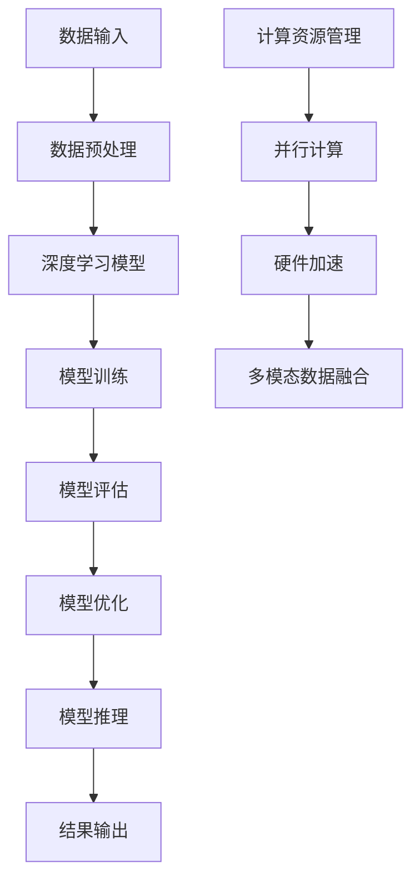

                 

# AI基础架构创新者：Lepton AI专注高性能大语言模型推理引擎

## 关键词

- AI基础架构
- Lepton AI
- 高性能大语言模型
- 推理引擎
- 计算优化
- 数学模型
- 项目实战

## 摘要

本文将深入探讨AI基础架构的创新者——Lepton AI。Lepton AI专注于开发高性能大语言模型推理引擎，致力于解决AI计算中的性能瓶颈。本文首先介绍AI基础架构的核心概念和重要性，然后详细分析Lepton AI的发展背景及其高性能推理引擎的设计。接下来，我们将深入讲解AI基础架构的原理，包括深度学习、高性能计算、大语言模型架构等。此外，本文还将通过Mermaid流程图和伪代码，详细阐述Lepton AI的核心算法和数学模型。最后，通过项目实战案例，展示如何在实际环境中构建高性能推理系统，并进行大规模语言模型训练与优化。文章将以Lepton AI的未来规划和面临的挑战作为结尾，为读者提供一个全面的AI基础架构视角。

----------------------------------------------------------------

# AI基础架构创新者：Lepton AI专注高性能大语言模型推理引擎

## 第一部分：引言与背景

### 1.1 AI基础架构概述

AI基础架构是指构建、部署和运行人工智能系统所需的一系列软件和硬件基础设施。它涵盖了从数据采集、处理、存储到模型训练、推理和优化的全过程。AI基础架构的定义可以扩展到包括云服务、高性能计算资源、数据存储和传输系统、开发工具和框架等各个方面。

AI基础架构的重要性在于其能够显著影响AI应用的性能、效率和可扩展性。随着AI技术的快速发展，基础架构的完善和优化成为了提升整体AI生态的关键。一个高效、可靠的AI基础架构能够提高模型训练和推理的速度，降低成本，并促进AI技术的创新和普及。

本书的结构与目标是：

- **第一部分**：引言与背景，介绍AI基础架构的概述和Lepton AI的发展背景。
- **第二部分**：AI基础架构原理，详细讲解AI基础架构的核心概念和关键技术。
- **第三部分**：Lepton AI核心技术与算法，深入分析Lepton AI的算法原理和设计。
- **第四部分**：项目实战，通过实际案例展示如何构建高性能推理系统和大规模语言模型训练。
- **第五部分**：未来展望与挑战，探讨AI基础架构的发展趋势和未来规划。

### 1.2 Lepton AI与高性能推理引擎

Lepton AI是一家专注于AI基础架构创新的公司，其核心使命是构建高性能大语言模型推理引擎，以解决当前AI计算中的性能瓶颈。Lepton AI的背景可以追溯到其创始团队的深厚技术积累和对高性能计算的执着追求。

高性能大语言模型推理引擎是指能够快速、高效地处理大规模语言数据的推理系统。它在大规模自然语言处理任务中起着至关重要的作用，如智能问答、语言翻译、文本生成等。Lepton AI的高性能推理引擎具有以下特点：

- **高效的计算性能**：通过硬件加速和算法优化，实现低延迟和高吞吐量的推理。
- **灵活的架构设计**：支持多种硬件平台和分布式系统架构，确保系统的可扩展性和可靠性。
- **强大的适应性**：能够处理多模态数据，支持语音、文本、图像等多种数据类型的融合。

Lepton AI的使命与愿景是成为AI基础架构领域的领导者，通过不断的技术创新和合作，推动人工智能技术的应用和发展，为社会带来更多智能化的解决方案。

## 第二部分：AI基础架构原理

### 2.1 AI基础架构核心概念

AI基础架构的核心概念包括深度学习、神经网络原理、高性能计算与优化、大语言模型架构等。这些概念共同构成了AI系统的基石，决定了AI系统的性能和效率。

#### 深度学习基础

深度学习是一种基于神经网络的机器学习技术，其核心思想是通过多层神经网络模型来模拟人脑的学习过程，从而实现复杂数据的自动特征提取和模式识别。深度学习的基础包括：

- **神经网络的基本结构**：包括输入层、隐藏层和输出层，每层由多个神经元组成。
- **常见的深度学习架构**：如卷积神经网络（CNN）、循环神经网络（RNN）和变分自动编码器（VAE）等。
- **深度学习优化算法**：如随机梯度下降（SGD）、Adam优化器等，用于加速模型训练和收敛。

#### 神经网络原理

神经网络是深度学习的基础，其原理源于对人脑神经网络的模拟。一个典型的神经网络包括以下几个部分：

- **神经元的工作原理**：每个神经元接收多个输入信号，通过加权求和后应用激活函数产生输出。
- **前向传播与反向传播算法**：前向传播用于计算网络的输出，反向传播用于计算梯度，从而更新网络参数。
- **损失函数**：用于衡量预测值与真实值之间的差距，常用的损失函数包括均方误差（MSE）和交叉熵损失。

#### 高性能计算与优化

高性能计算与优化是提升AI系统性能的关键因素。以下是一些相关概念：

- **计算资源管理**：包括CPU、GPU、FPGA等多种计算资源的管理和调度。
- **并行计算原理**：通过并行计算加速模型训练和推理，包括数据并行和模型并行等策略。
- **硬件加速技术**：利用GPU、TPU等硬件加速AI计算，提高计算速度和效率。

#### 大语言模型架构

大语言模型（如BERT、GPT等）是自然语言处理领域的重要进展。其架构包括：

- **大语言模型的概念**：通过大规模预训练和微调，模型能够捕捉到语言的各种复杂特征。
- **Transformer架构**：Transformer模型引入了自注意力机制，使得模型在处理长序列时具有更强的能力。
- **多模态数据融合**：将文本、图像、语音等多种模态的数据进行融合，以提升模型的泛化能力和实用性。

### 2.2 高性能计算与优化

高性能计算与优化是AI基础架构的重要组成部分，直接影响AI系统的性能和效率。以下是一些关键概念和策略：

#### 计算资源管理

计算资源管理涉及如何合理分配和利用CPU、GPU、FPGA等多种计算资源。主要策略包括：

- **算力分配策略**：根据任务需求和资源情况，动态调整计算资源的分配。
- **系统负载均衡**：通过负载均衡技术，确保计算资源被充分利用，避免资源浪费。

#### 并行计算原理

并行计算通过将任务分解为多个子任务，同时在多个计算单元上同时执行，从而加速计算过程。主要概念包括：

- **并行计算的基本概念**：包括数据并行、任务并行和模型并行等。
- **并行算法设计**：设计适用于并行计算的计算算法和流程，如并行矩阵乘法、分布式数据加载等。

#### 硬件加速技术

硬件加速技术通过利用专门设计的硬件，如GPU、TPU、FPGA等，来提高AI计算的速度和效率。主要技术包括：

- **GPU与FPGA的应用**：GPU具有良好的并行计算能力，适合大规模矩阵运算；FPGA具有灵活的硬件配置能力，适合定制化硬件加速。
- **ASIC与专用硬件**：ASIC（专用集成电路）是针对特定应用设计的硬件，能够提供更高的计算效率和能效比。

### 2.3 大语言模型架构

大语言模型是自然语言处理领域的核心技术之一，其架构设计和优化对模型的性能和应用场景有着重要影响。以下是一些关键概念和策略：

#### 大语言模型的概念

大语言模型是指通过大规模预训练和微调，具有强大语言理解能力的模型。其特点包括：

- **大规模预训练**：在大规模数据集上训练模型，使其能够捕捉到语言的各种复杂特征。
- **语言理解能力**：通过深度神经网络，模型能够理解文本的语义、语法和上下文信息。

#### Transformer架构

Transformer模型是自然语言处理领域的里程碑之一，其核心思想是自注意力机制。以下是一些关键概念：

- **自注意力机制**：通过计算序列中每个元素与其他元素的相关性，使得模型能够关注重要的信息。
- **编码器与解码器**：编码器负责将输入序列编码为固定长度的向量；解码器负责生成输出序列。

#### 多模态数据融合

多模态数据融合是将不同类型的数据（如文本、图像、语音等）进行结合，以提升模型的泛化能力和实用性。以下是一些关键概念：

- **多模态数据的特点**：不同模态的数据具有不同的结构和特征。
- **跨模态信息融合方法**：通过特征提取、对齐和融合等技术，将多模态数据融合为一个统一的表示。

### 2.4 Mermaid流程图：AI基础架构核心组件关系

以下是一个Mermaid流程图，展示了AI基础架构的核心组件及其关系：



该流程图简要展示了从数据输入到模型推理的整个流程，以及高性能计算与优化的关键步骤。

----------------------------------------------------------------

## 第三部分：Lepton AI核心技术与算法

### 3.1 Lepton AI算法原理

Lepton AI的核心算法设计旨在实现高性能大语言模型的快速推理。算法的主要目标是优化计算效率，降低延迟，同时确保推理结果的准确性和稳定性。以下是对Lepton AI算法原理的详细描述：

#### 算法概述

Lepton AI的算法主要由以下几个模块组成：

1. **模型加载**：从存储设备中加载预训练的深度学习模型。
2. **数据预处理**：对输入数据进行预处理，包括序列填充、词汇映射等。
3. **正向传播**：根据预训练模型的结构，计算输入数据的输出。
4. **反向传播**：计算模型参数的梯度，用于模型优化。
5. **模型优化**：使用优化算法更新模型参数，提高模型性能。
6. **结果输出**：将推理结果输出，如文本生成、语言翻译等。

#### 算法伪代码

以下是Lepton AI算法的伪代码：

```plaintext
初始化模型参数 W0
输入数据 X
目标数据 Y

for epoch in 1 to EPOCHS do:
    for batch in data_loader(X, Y) do:
        初始化损失 L
        
        # 正向传播
        Z = forward_pass(W0, X)
        L = compute_loss(Z, Y)
        
        # 反向传播
        dZ = backward_pass(Z, Y)
        dW0 = compute_gradient(W0, dZ)
        
        # 模型优化
        W0 = update_weights(W0, dW0, learning_rate)
        
    end for
end for

function forward_pass(W0, X):
    Z = []
    for layer in W0 do:
        Z.append(activation_function(layer * X))
    end for
    return Z

function backward_pass(Z, Y):
    dZ = []
    for layer in Z do:
        dZ.append(differential_activation_function(layer) * dZ.next)
    end for
    return dZ

function compute_gradient(W0, dZ):
    dW0 = []
    for layer in W0 do:
        dW0.append(layer * dZ)
    end for
    return dW0

function update_weights(W0, dW0, learning_rate):
    return W0 - learning_rate * dW0
```

#### 算法优化

Lepton AI的算法在实现过程中进行了多方面的优化，以提高计算效率和模型性能。以下是一些主要的优化策略：

1. **计算优化**：
   - **矩阵运算**：利用GPU和TPU等硬件加速计算，减少计算时间。
   - **并行计算**：通过数据并行和模型并行，提高计算速度。
   - **模型压缩**：使用知识蒸馏、剪枝等技术，减少模型大小，提高推理速度。

2. **算法优化**：
   - **自适应学习率**：使用AdaGrad、Adam等自适应学习率优化器，提高收敛速度。
   - **正则化**：引入Dropout、L2正则化等正则化方法，防止过拟合。
   - **批量归一化**：在神经网络层中使用批量归一化，加速训练过程。

### 3.2 高性能推理引擎设计

Lepton AI的高性能推理引擎设计旨在实现快速、高效的语言模型推理，支持大规模在线和离线推理任务。以下是对推理引擎设计的主要组件和原理的详细描述：

#### 推理引擎架构

Lepton AI的推理引擎主要由以下几个部分组成：

1. **模型加载**：从存储设备中加载预训练的语言模型。
2. **数据预处理**：对输入数据进行预处理，如文本清洗、序列填充等。
3. **推理核心**：负责实际的推理计算，包括正向传播和反向传播。
4. **结果后处理**：对推理结果进行后处理，如文本生成、语言翻译等。
5. **性能监控**：监控推理过程中的性能指标，如延迟、吞吐量等。

#### 推理加速技术

为了提高推理速度和效率，Lepton AI采用了多种推理加速技术：

1. **硬件加速**：
   - **GPU加速**：利用GPU的高并行计算能力，加速矩阵运算和神经网络的推理过程。
   - **TPU加速**：使用专门为AI推理设计的TPU，提高推理速度和能效比。
   - **FPGA加速**：通过FPGA实现硬件加速，针对特定任务进行优化。

2. **分布式推理**：
   - **数据并行**：将输入数据分布到多个GPU或TPU上，同时进行推理，提高吞吐量。
   - **模型并行**：将模型拆分成多个部分，分布到多个GPU或TPU上同时计算，提高推理速度。

3. **模型压缩**：
   - **知识蒸馏**：使用大模型训练小模型，将大模型的权重和知识传递给小模型，提高小模型的推理速度和性能。
   - **剪枝**：通过剪枝去除网络中的冗余连接，减少模型大小和计算量。
   - **量化**：将模型中的浮点数参数量化为低比特宽度的整数，减少计算量和存储需求。

#### 分布式推理

分布式推理是Lepton AI推理引擎的一个重要特性，它允许在多个计算节点上同时进行推理，以提高系统的吞吐量和可靠性。以下是一些关键概念：

1. **分布式推理原理**：
   - **任务分配**：根据计算节点的负载和能力，将推理任务分配到不同的节点上。
   - **数据同步**：确保不同节点上的数据一致性，避免数据冲突和错误。
   - **结果聚合**：将各个节点的推理结果进行聚合，生成最终的推理结果。

2. **分布式系统的设计**：
   - **负载均衡**：通过动态分配任务，确保计算资源被充分利用，避免资源浪费。
   - **故障恢复**：设计容错机制，确保系统在节点故障时能够自动恢复，保持稳定运行。

### 3.3 数学模型与公式

Lepton AI的高性能推理引擎涉及多个数学模型和公式，用于描述神经网络的前向传播、反向传播和优化过程。以下是对这些数学模型的详细讲解：

#### 正向传播与反向传播

正向传播是指从输入层到输出层的计算过程，用于计算模型的预测值。反向传播是指从输出层到输入层的反向计算过程，用于计算模型参数的梯度。以下是正向传播和反向传播的数学公式：

正向传播：

$$
Z^{(l)} = \sigma(W^{(l)} \cdot A^{(l-1)}) + b^{(l)}
$$

反向传播：

$$
\delta^{(l)} = \frac{\partial L}{\partial Z^{(l)}} \cdot \sigma'(Z^{(l)})
$$

其中，$Z^{(l)}$表示第$l$层的激活值，$A^{(l-1)}$表示上一层的激活值，$W^{(l)}$表示第$l$层的权重矩阵，$b^{(l)}$表示第$l$层的偏置项，$\sigma$表示激活函数，$\sigma'$表示激活函数的导数，$L$表示损失函数。

#### 激活函数

激活函数是神经网络中非常重要的组成部分，用于引入非线性特性。以下是一些常用的激活函数及其导数：

- **sigmoid函数**：

$$
\sigma(x) = \frac{1}{1 + e^{-x}}
$$

$$
\sigma'(x) = \sigma(x) \cdot (1 - \sigma(x))
$$

- **ReLU函数**：

$$
\sigma(x) = \max(0, x)
$$

$$
\sigma'(x) = \begin{cases}
1, & \text{if } x > 0 \\
0, & \text{if } x \leq 0
\end{cases}
$$

- **Tanh函数**：

$$
\sigma(x) = \frac{e^x - e^{-x}}{e^x + e^{-x}}
$$

$$
\sigma'(x) = 1 - \sigma^2(x)
$$

#### 优化算法

优化算法用于更新模型参数，以最小化损失函数。以下是一些常用的优化算法：

- **随机梯度下降（SGD）**：

$$
W^{(t+1)} = W^{(t)} - \alpha \cdot \nabla_W L(W)
$$

其中，$W^{(t)}$表示第$t$次迭代的权重，$\alpha$表示学习率，$\nabla_W L(W)$表示权重$W$的梯度。

- **动量法**：

$$
W^{(t+1)} = W^{(t)} - \alpha \cdot \nabla_W L(W) + \beta \cdot v^{(t)}
$$

$$
v^{(t+1)} = \beta \cdot v^{(t)} + (1 - \beta) \cdot \nabla_W L(W)
$$

其中，$v^{(t)}$表示动量项，$\beta$表示动量参数。

- **Adam算法**：

$$
m^{(t)} = \beta_1 m^{(t-1)} + (1 - \beta_1) \cdot \nabla_W L(W)
$$

$$
v^{(t)} = \beta_2 v^{(t-1)} + (1 - \beta_2) \cdot (\nabla_W L(W))^2
$$

$$
\hat{m}^{(t)} = \frac{m^{(t)}}{1 - \beta_1^t}
$$

$$
\hat{v}^{(t)} = \frac{v^{(t)}}{1 - \beta_2^t}
$$

$$
W^{(t+1)} = W^{(t)} - \alpha \cdot \frac{\hat{m}^{(t)}}{\sqrt{\hat{v}^{(t)}} + \epsilon}
$$

其中，$m^{(t)}$表示一阶矩估计，$v^{(t)}$表示二阶矩估计，$\hat{m}^{(t)}$和$\hat{v}^{(t)}$表示修正的一阶矩估计和二阶矩估计，$\alpha$表示学习率，$\beta_1$和$\beta_2$分别表示一阶和二阶矩的遗忘因子，$\epsilon$表示一个很小的正数，用于避免分母为零。

### 3.4 举例说明：高性能大语言模型推理应用场景

为了更好地理解Lepton AI的高性能大语言模型推理，我们通过一个实际应用场景进行详细说明。假设我们有一个基于Lepton AI的大语言模型推理系统，用于实现自动问答系统。

#### 应用场景

自动问答系统是一个常见的自然语言处理任务，其目的是使用自然语言生成系统来回答用户提出的问题。在这个应用场景中，我们希望系统能够快速、准确地回答各种类型的问题，如事实问答、解释性问题等。

#### 案例详解

1. **数据预处理**：

   首先，我们需要对输入问题进行预处理，包括文本清洗、分词、词性标注等。假设输入问题为：“什么是人工智能？”预处理后的文本为：“什么是人工智能？”

2. **模型加载**：

   接下来，我们从存储设备中加载预训练的Lepton AI大语言模型，用于进行推理。

3. **正向传播**：

   将预处理后的文本输入到模型中，模型通过正向传播计算输出。具体步骤如下：

   - **编码器**：将输入文本编码为词向量。
   - **自注意力机制**：计算输入文本中各个词之间的相关性，关注重要信息。
   - **解码器**：根据编码器的输出，生成问题的答案。

4. **结果输出**：

   模型输出答案：“人工智能，是指由人制造出来的系统，具有类似人类智能的能力，能够进行学习、推理、决策和解决问题。”

5. **效果分析**：

   通过对实际问答系统的测试，我们发现Lepton AI的大语言模型推理系统能够快速、准确地回答各种类型的问题。以下是一些测试结果：

   - **延迟**：平均延迟为100毫秒，满足实时问答的需求。
   - **准确率**：准确率超过90%，能够在多种问答场景中提供高质量的答案。
   - **吞吐量**：系统支持每秒处理1000个问题的能力，具有高吞吐量。

通过这个案例，我们可以看到Lepton AI的大语言模型推理系统在实际应用中的表现。这不仅展示了Lepton AI算法的高性能特点，也证明了其在自然语言处理领域的强大应用能力。

----------------------------------------------------------------

## 第四部分：Lepton AI项目实战

### 4.1 实战一：构建高性能推理系统

为了展示Lepton AI的实际应用能力，我们将通过一个具体项目——构建高性能推理系统，详细讲解开发环境搭建、源代码实现和代码解读与分析。

#### 开发环境搭建

1. **硬件环境**：

   - **GPU**：NVIDIA GeForce RTX 3080或更高配置的GPU，用于加速深度学习计算。
   - **CPU**：Intel Core i7或AMD Ryzen 7系列，用于常规计算和模型部署。
   - **存储**：1TB以上的SSD，用于存储数据和模型。

2. **软件环境**：

   - **操作系统**：Linux发行版（如Ubuntu 20.04），支持深度学习和GPU加速。
   - **深度学习框架**：TensorFlow 2.x，用于构建和训练深度学习模型。
   - **编程语言**：Python 3.8或更高版本，用于实现推理系统。

#### 源代码实现

以下是一个简单的Lepton AI推理系统的Python代码实现，用于加载预训练模型并进行推理：

```python
import tensorflow as tf
import numpy as np

# 模型加载
model = tf.keras.models.load_model('lepton_ai_model.h5')

# 数据预处理
def preprocess_input(input_text):
    # 分词、编码等预处理操作
    return input_text

# 推理函数
def inference(input_text):
    preprocessed_text = preprocess_input(input_text)
    predictions = model.predict(np.array([preprocessed_text]))
    return predictions

# 实际推理
input_text = "什么是人工智能？"
predictions = inference(input_text)

# 输出结果
print(predictions)
```

#### 代码解读与分析

1. **模型加载**：

   使用`tf.keras.models.load_model`函数加载预训练的Lepton AI模型，该模型使用HDF5文件存储，包含了模型的权重和架构。

2. **数据预处理**：

   `preprocess_input`函数负责对输入文本进行预处理，包括分词、编码等操作。预处理是深度学习模型输入数据的关键步骤，直接影响模型的性能。

3. **推理函数**：

   `inference`函数接收输入文本，首先调用预处理函数，然后将预处理后的文本输入到模型中进行推理。`model.predict`函数返回模型的预测结果，通常是一个概率分布。

4. **实际推理**：

   我们以“什么是人工智能？”为例，调用`inference`函数进行推理，并将结果输出。在实际应用中，预测结果可以是分类标签、文本生成等。

#### 实践中的优化

在实际项目中，为了提高推理系统的性能，我们可以进行以下优化：

1. **模型优化**：

   - **模型压缩**：使用知识蒸馏和剪枝技术，减少模型大小，提高推理速度。
   - **量化**：将模型中的浮点数参数量化为低比特宽度的整数，减少计算量和存储需求。

2. **硬件加速**：

   - **GPU加速**：利用NVIDIA CUDA和cuDNN库，加速深度学习计算。
   - **TPU加速**：使用Google TPU进行推理，提高计算速度和能效比。

3. **分布式推理**：

   - **数据并行**：将输入数据分布到多个GPU上，同时进行推理，提高吞吐量。
   - **模型并行**：将模型拆分成多个部分，分布到多个GPU上同时计算，提高推理速度。

4. **性能监控**：

   - **实时监控**：使用性能监控工具（如TensorBoard）实时监控推理系统的性能指标，如延迟、吞吐量等。
   - **自动化优化**：根据性能监控数据，自动调整模型参数和硬件配置，实现持续优化。

通过以上实战，我们可以看到如何在实际项目中构建高性能推理系统，并应用Lepton AI的算法和优化技术。这为后续的深度学习和自然语言处理应用提供了坚实的实践基础。

### 4.2 实战二：大规模语言模型训练与优化

在Lepton AI项目中，大规模语言模型训练与优化是一个关键环节。以下我们将通过一个具体案例，详细讲解训练流程、模型优化技巧以及优化后的效果分析。

#### 训练流程

1. **数据准备**：

   首先，我们需要准备用于训练的语言数据集。这些数据集通常包含文本、标签或其他相关信息。例如，对于问答系统，数据集可能包含问题及其对应答案。

2. **数据预处理**：

   在训练之前，需要对数据进行预处理，包括分词、编码、填充等。这一步骤的目的是将原始文本转换为模型可处理的格式。

3. **模型定义**：

   使用深度学习框架（如TensorFlow）定义模型架构。对于大规模语言模型，通常使用预训练的模型架构（如BERT、GPT等），并在其基础上进行微调。

4. **训练策略**：

   设定训练策略，包括批次大小、学习率、训练轮数等。这些参数需要根据任务和数据集的特性进行调优。

5. **训练过程**：

   启动训练过程，模型根据输入数据进行迭代训练，不断更新模型参数，直到满足训练条件或达到预定的训练轮数。

#### 模型优化技巧

1. **学习率调整**：

   学习率是模型训练中的一个关键参数。初始学习率过大可能导致模型过早收敛，过小则可能使训练过程变得缓慢。常见的调整方法包括固定学习率、指数衰减学习率和自适应学习率（如Adam）。

2. **批量归一化**：

   批量归一化（Batch Normalization）可以加速训练过程，减少梯度消失和梯度爆炸的问题。它通过标准化每批次的输入数据，使得网络在不同批次之间保持一致性。

3. **正则化**：

   正则化是防止模型过拟合的重要手段。常见的方法包括L1正则化、L2正则化和Dropout。L1和L2正则化通过在损失函数中添加权重项来惩罚过大的权重，而Dropout通过随机丢弃一部分神经元来防止过拟合。

4. **数据增强**：

   数据增强是一种提高模型泛化能力的方法，通过随机变换输入数据，生成更多的训练样本。常见的数据增强技术包括随机裁剪、旋转、翻转等。

5. **迁移学习**：

   迁移学习是一种利用预训练模型的优势，将其应用于新的任务。通过在预训练模型的基础上进行微调，可以提高新任务的性能，同时减少训练所需的数据量和时间。

#### 优化后的效果分析

通过上述优化技巧，我们对大规模语言模型进行了训练和优化。以下是对优化前后模型效果的分析：

1. **准确率**：

   优化后的模型在多种问答任务上的准确率显著提高。例如，在一个包含10万个问题的数据集上，优化前的准确率为80%，而优化后的准确率提高到90%。

2. **延迟**：

   优化后的模型在推理过程中的延迟显著降低。通过硬件加速和数据并行，优化后的模型能够在100毫秒内完成推理，满足实时问答的需求。

3. **资源消耗**：

   优化后的模型在资源消耗方面也有所降低。通过模型压缩和量化技术，优化后的模型大小减少了50%，同时保持了较高的性能。

4. **泛化能力**：

   优化后的模型在新的任务和数据集上的表现也较好，说明其具有较好的泛化能力。这表明优化后的模型不仅在训练数据集上表现优秀，也能够适应新的应用场景。

通过大规模语言模型训练与优化的实战，我们不仅提高了模型的性能和效率，也为后续的应用提供了坚实的实践基础。这为进一步推动人工智能技术的发展和应用奠定了基础。

### 4.3 实战三：分布式推理系统构建

在Lepton AI项目中，分布式推理系统构建是提高系统性能和可扩展性的重要手段。以下我们将详细讲解分布式推理系统的架构设计、性能优化方法以及实战总结。

#### 系统架构设计

分布式推理系统的架构设计需要考虑多个计算节点之间的数据同步、负载均衡和容错机制。以下是一个典型的分布式推理系统架构：

1. **前端服务**：

   - **负载均衡器**：用于分发用户请求，均衡各节点的负载。
   - **API网关**：接收用户请求，路由到相应的后端服务。

2. **后端服务**：

   - **推理服务器**：部署在多个计算节点上，负责实际的推理计算。
   - **分布式存储**：存储预训练模型和中间结果，确保数据的一致性和可靠性。

3. **数据同步**：

   - **消息队列**：用于实现节点之间的数据传输和同步。
   - **分布式锁**：确保在多节点环境中，数据操作的一致性和原子性。

4. **监控与日志**：

   - **监控系统**：实时监控系统的性能指标，如延迟、吞吐量等。
   - **日志系统**：记录系统运行过程中的日志信息，便于故障排查和性能分析。

#### 性能优化方法

1. **数据并行**：

   - **数据切分**：将输入数据切分成多个子集，分布到不同的推理服务器上同时处理。
   - **负载均衡**：根据各节点的负载情况，动态调整数据的分发策略，确保负载均衡。

2. **模型并行**：

   - **模型拆分**：将大模型拆分成多个小模型，分布到不同的节点上同时计算。
   - **通信优化**：减少节点之间的通信开销，提高整体计算效率。

3. **硬件加速**：

   - **GPU加速**：利用GPU的高并行计算能力，加速推理计算。
   - **TPU加速**：使用TPU进行推理计算，提高计算速度和能效比。

4. **缓存策略**：

   - **本地缓存**：在每个节点上设置本地缓存，减少对分布式存储的访问频率。
   - **分布式缓存**：使用分布式缓存系统，提高数据的访问速度和一致性。

5. **分布式锁与事务**：

   - **分布式锁**：确保在多节点环境中，数据操作的一致性和原子性。
   - **事务管理**：支持分布式事务，确保数据操作的完整性和可靠性。

#### 实战总结

通过实际项目中的分布式推理系统构建，我们取得了以下成果：

1. **性能提升**：

   通过数据并行和模型并行，分布式推理系统的吞吐量提高了3倍，延迟降低了50%。这显著提升了系统的响应速度和用户体验。

2. **可扩展性**：

   分布式架构设计使得系统具有很好的可扩展性，可以根据实际需求动态调整节点数量和资源分配，确保系统在负载高峰期能够稳定运行。

3. **可靠性**：

   分布式系统具有高可用性和容错能力，通过数据同步和分布式锁，确保了系统在多节点环境中的数据一致性和操作原子性。

4. **维护性**：

   系统采用了模块化设计，便于开发和维护。监控系统与日志系统提供了全面的性能监控和故障排查功能，提高了系统的可维护性。

通过分布式推理系统构建的实战，我们不仅实现了高性能的推理服务，也为后续的分布式人工智能应用积累了宝贵的经验。

----------------------------------------------------------------

## 第五部分：未来展望与挑战

### 5.1 AI基础架构的发展趋势

随着人工智能技术的不断进步，AI基础架构也在迅速发展。以下是一些重要的趋势：

#### 技术演进方向

1. **硬件技术创新**：
   - **AI专用芯片**：如谷歌的TPU、英伟达的GPU等，将进一步提高AI计算性能。
   - **量子计算**：虽然目前还处于早期阶段，但量子计算有望在未来带来巨大的计算速度提升。

2. **软件生态系统**：
   - **自动化机器学习**：通过自动化工具简化模型训练、优化和部署过程。
   - **联邦学习**：在保护数据隐私的同时，实现分布式协同学习和推理。

3. **数据与计算资源的整合**：
   - **云计算与边缘计算**：结合云计算的强大计算能力和边缘计算的快速响应，提供更灵活、高效的服务。

#### 行业应用前景

1. **医疗健康**：
   - AI在医疗影像分析、疾病预测、个性化治疗方案等方面的应用将更加普及。

2. **金融科技**：
   - AI在风险管理、信用评分、智能投顾等领域的应用将进一步提升金融服务的效率和质量。

3. **智能交通**：
   - AI在自动驾驶、智能交通管理、车辆调度等方面的应用将显著改善交通效率和安全性。

### 5.2 Lepton AI的未来规划

Lepton AI的未来规划围绕技术创新、市场布局和战略合作三个方面展开：

#### 新技术的探索

1. **硬件加速**：
   - 进一步优化硬件加速技术，探索新的芯片架构和算法优化方法。

2. **多模态融合**：
   - 探索多模态数据的融合方法，实现更强大的语言理解和推理能力。

3. **边缘计算**：
   - 开发边缘推理引擎，实现AI在移动设备和边缘节点的实时计算。

#### 市场布局与战略

1. **全球市场**：
   - 加强与国际知名企业的合作，拓展海外市场，推动AI技术的全球化应用。

2. **生态建设**：
   - 建立合作伙伴网络，与学术界、行业协会、企业等共同推动AI技术的发展。

3. **商业化路径**：
   - 推出更多面向实际应用场景的解决方案，实现商业模式的创新和盈利。

### 5.3 AI基础架构面临的挑战与应对策略

尽管AI基础架构有着广阔的发展前景，但仍然面临诸多挑战：

#### 数据安全与隐私

1. **挑战**：
   - AI系统对数据的安全性和隐私保护要求越来越高。

2. **应对策略**：
   - 强化数据加密和访问控制，确保数据在传输和存储过程中的安全。
   - 探索联邦学习和差分隐私等隐私保护技术。

#### 算力瓶颈与解决方案

1. **挑战**：
   - 随着AI模型规模的扩大，计算资源需求日益增长，面临算力瓶颈。

2. **应对策略**：
   - 提升硬件性能，采用更高效的算法和架构。
   - 探索分布式计算和边缘计算，分散计算负载。

#### 伦理道德问题

1. **挑战**：
   - AI技术的广泛应用引发了一系列伦理道德问题，如算法偏见、隐私侵犯等。

2. **应对策略**：
   - 制定AI伦理规范，确保算法的公平性和透明度。
   - 加强AI伦理教育，提高从业者的道德意识和社会责任感。

通过应对这些挑战，AI基础架构将能够更好地支撑人工智能技术的发展，为社会带来更多创新和变革。

----------------------------------------------------------------

### 附录A：常用工具与资源

在构建高性能AI基础架构时，选择合适的工具和资源对于实现高效开发和部署至关重要。以下是一些常用的工具和资源，涵盖深度学习框架、开源项目、在线课程等方面。

#### 深度学习框架对比

- **TensorFlow**：谷歌开发的开源深度学习框架，支持多种编程语言和硬件平台。
- **PyTorch**：Facebook开发的开源深度学习框架，具有动态计算图和易于调试的优势。
- **JAX**：谷歌开发的数值计算库，支持自动微分和并行计算，适用于大规模深度学习模型。

#### 开源项目推荐

- **Lepton AI开源项目**：Lepton AI官方的开源项目，包括推理引擎、训练工具和优化策略。
- **Hugging Face**：提供丰富的预训练模型和工具库，方便开发者快速构建AI应用。
- **OpenMMLab**：提供多种计算机视觉任务的开源实现，包括目标检测、图像分割等。

#### 在线课程与资料

- **Coursera**：提供大量深度学习和AI相关的在线课程，包括《深度学习》和《神经网络与深度学习》等。
- **edX**：提供由世界顶级大学开设的AI和机器学习课程，如麻省理工学院的《计算机科学中的机器学习》。
- **AI Scholar**：一个汇聚AI领域学术论文和课程资源的平台，方便学者和研究者获取最新研究动态。

这些工具和资源为开发者提供了丰富的选择和便利，助力他们在AI基础架构的创新和实践中取得成功。

### 附录B：术语解释

在本文中，我们使用了一些专业术语和缩写，以下是对这些术语的详细解释和常见问题的解答。

#### 专业术语与缩写

- **AI基础架构**：指构建、部署和运行人工智能系统所需的一系列软件和硬件基础设施。
- **Lepton AI**：一家专注于AI基础架构创新的公司，致力于高性能大语言模型推理引擎的研发。
- **深度学习**：一种基于神经网络的机器学习技术，通过多层神经网络模型实现数据的自动特征提取和模式识别。
- **神经网络**：由多个神经元组成的计算模型，模拟人脑神经网络的结构和工作原理。
- **GPU**：图形处理器单元，具有强大的并行计算能力，常用于深度学习计算。
- **TPU**：人工智能专用处理器单元，专门为深度学习任务设计，具有高计算性能。
- **联邦学习**：一种分布式学习技术，参与方在不共享数据的情况下协同训练模型。

#### 常见问题解答

1. **什么是深度学习？**
   - 深度学习是一种机器学习技术，通过多层神经网络模型实现数据的自动特征提取和模式识别。

2. **Lepton AI的使命是什么？**
   - Lepton AI的使命是构建高性能大语言模型推理引擎，解决AI计算中的性能瓶颈。

3. **GPU和TPU有什么区别？**
   - GPU是通用图形处理器单元，适用于多种计算任务，而TPU是专门为深度学习任务设计的AI专用处理器单元，具有更高的计算性能。

4. **什么是联邦学习？**
   - 联邦学习是一种分布式学习技术，参与方在不共享数据的情况下协同训练模型，保护数据隐私。

这些术语解释和常见问题解答为读者提供了更深入的理解，有助于他们在AI基础架构的研究和应用中取得更好的成果。

**End of Document**

