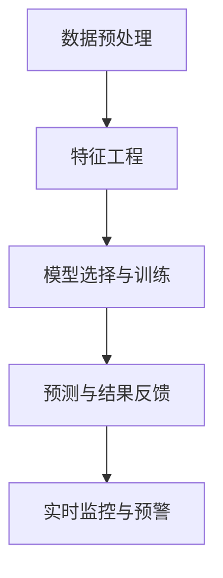

                 

# AI大模型在电商平台反欺诈实时监控中的应用

> **关键词：** AI大模型、电商平台、反欺诈、实时监控、深度学习、自然语言处理

> **摘要：** 本文深入探讨AI大模型在电商平台反欺诈实时监控中的应用。通过分析AI大模型的基本概念、电商平台反欺诈需求、应用架构、核心算法与原理、项目实战等，旨在为业界提供一种高效、可靠的解决方案。

## 目录大纲

## 第一部分：AI大模型与反欺诈概述

### 第1章：AI大模型概述

#### 1.1 AI大模型的基本概念

#### 1.2 反欺诈技术的现状与发展

### 第2章：电商平台反欺诈需求分析

#### 2.1 电商平台欺诈案例分析

#### 2.2 电商平台反欺诈需求分析

### 第3章：AI大模型在反欺诈中的应用架构

#### 3.1 AI大模型在反欺诈中的架构设计

#### 3.2 Mermaid流程图：AI大模型在反欺诈中的应用架构

## 第二部分：核心算法与原理

### 第4章：AI大模型核心算法原理

#### 4.1 深度学习基础

#### 4.2 自然语言处理基础

#### 4.3 大规模预训练模型

### 第5章：反欺诈算法设计与实现

#### 5.1 反欺诈算法设计思路

#### 5.2 伪代码实现：反欺诈算法核心部分

### 第6章：数学模型与公式推导

#### 6.1 损失函数与优化算法

#### 6.2 统计模型与概率分布

#### 6.3 公式推导与详细解释

## 第三部分：项目实战

### 第7章：电商平台反欺诈项目实战

#### 7.1 项目背景与目标

#### 7.2 开发环境搭建

#### 7.3 数据收集与处理

#### 7.4 模型开发与训练

#### 7.5 部署与监控

### 第8章：代码解读与分析

#### 8.1 数据预处理代码解读

#### 8.2 模型训练代码解读

#### 8.3 部署与监控代码解读

## 附录

### 附录A：AI大模型开发工具与资源

### 附录B：参考资源与进一步阅读

---

### 《AI大模型在电商平台反欺诈实时监控中的应用》

#### 摘要

在电商平台的快速发展和日益复杂的市场环境下，欺诈行为成为电商企业面临的一大挑战。传统反欺诈手段由于依赖人工规则和静态特征，难以应对不断变化的欺诈手段。本文将探讨AI大模型在电商平台反欺诈实时监控中的应用，通过深度学习和自然语言处理等技术，构建高效、智能的反欺诈系统，为电商平台提供实时监控和预警能力。

#### 目录大纲

**第一部分：AI大模型与反欺诈概述**

**第1章：AI大模型概述**

**1.1 AI大模型的基本概念**

AI大模型是指通过海量数据训练得到的、具备复杂特征提取和推理能力的深度学习模型。其规模通常较大，能够处理海量的数据，并从数据中学习到抽象的特征表示。

**1.2 反欺诈技术的现状与发展**

当前电商平台反欺诈技术主要依赖于规则匹配和静态特征分析，存在局限性。随着AI技术的进步，尤其是AI大模型的出现，为反欺诈提供了新的思路和手段。

**第2章：电商平台反欺诈需求分析**

**2.1 电商平台欺诈案例分析**

分析不同类型的欺诈行为，如刷单、套现、身份盗用等，及其对电商平台的影响。

**2.2 电商平台反欺诈需求分析**

探讨电商平台在反欺诈方面所需的关键能力，如用户行为分析、数据实时处理、实时预警等。

**第3章：AI大模型在反欺诈中的应用架构**

**3.1 AI大模型在反欺诈中的架构设计**

详细描述AI大模型在反欺诈系统中的架构设计，包括数据预处理、特征工程、模型选择与训练等环节。

**3.2 Mermaid流程图：AI大模型在反欺诈中的应用架构**

使用Mermaid流程图展示AI大模型在反欺诈中的应用架构，直观地展示数据流和模型处理流程。

**第二部分：核心算法与原理**

**第4章：AI大模型核心算法原理**

**4.1 深度学习基础**

介绍神经网络的基本结构、激活函数和反向传播算法等深度学习核心概念。

**4.2 自然语言处理基础**

介绍词嵌入、序列模型和注意力机制等自然语言处理技术。

**4.3 大规模预训练模型**

探讨大规模预训练模型的发展历程、自监督学习方法以及迁移学习和微调技术。

**第5章：反欺诈算法设计与实现**

**5.1 反欺诈算法设计思路**

提出反欺诈算法的设计思路，包括欺诈检测模型、账户风险评分模型和实时监控与预警模型的设计。

**5.2 伪代码实现：反欺诈算法核心部分**

使用伪代码详细描述反欺诈算法的核心部分，包括数据预处理、特征提取、模型训练和预测等步骤。

**第6章：数学模型与公式推导**

**6.1 损失函数与优化算法**

介绍损失函数的定义和优化算法的原理，如梯度下降法等。

**6.2 统计模型与概率分布**

介绍贝叶斯网络和逻辑回归模型等统计模型及其概率分布。

**6.3 公式推导与详细解释**

对核心数学公式进行推导，并结合实际案例进行详细解释。

**第三部分：项目实战**

**第7章：电商平台反欺诈项目实战**

**7.1 项目背景与目标**

介绍项目的背景和目标，明确项目实施的范围和预期效果。

**7.2 开发环境搭建**

详细描述开发环境的搭建过程，包括硬件配置、软件安装和配置等。

**7.3 数据收集与处理**

介绍数据收集的方法和数据预处理的技术，确保数据的质量和可用性。

**7.4 模型开发与训练**

选择合适的模型并进行训练，包括数据预处理、模型训练和调优等步骤。

**7.5 部署与监控**

描述模型的部署过程和实时监控策略，确保系统的高效运行。

**第8章：代码解读与分析**

**8.1 数据预处理代码解读**

分析数据预处理的核心代码，解释数据清洗、特征提取等步骤的实现细节。

**8.2 模型训练代码解读**

解释模型训练的核心代码，包括损失函数的选择、优化器的配置等。

**8.3 部署与监控代码解读**

分析部署与监控的核心代码，解释如何实现模型部署和实时监控功能。

**附录**

**附录A：AI大模型开发工具与资源**

介绍常用的AI大模型开发工具，如TensorFlow和PyTorch，以及其他相关资源和工具。

**附录B：参考资源与进一步阅读**

推荐相关的书籍、论文和开源代码，为读者提供进一步学习和研究的资源。

---

### 第一部分：AI大模型与反欺诈概述

#### 第1章：AI大模型概述

##### 1.1 AI大模型的基本概念

AI大模型（Large-scale Artificial Intelligence Model）是指通过大规模数据训练得到的深度学习模型。这类模型具有以下特点：

1. **大规模数据**：AI大模型通常使用数百万甚至数十亿级别的数据进行训练，从数据中学习到丰富的特征和模式。
2. **复杂网络结构**：AI大模型通常采用多层的神经网络结构，能够处理高维数据，并从数据中提取出更抽象的特征表示。
3. **强大的表征能力**：通过大规模训练，AI大模型能够学习到复杂的非线性关系，具备强大的表征和预测能力。

AI大模型与传统AI模型相比，具有以下几个显著区别：

1. **数据量**：传统AI模型通常使用数千或数万级别的数据进行训练，而AI大模型则使用数百万甚至数十亿级别的数据进行训练。
2. **网络规模**：传统AI模型可能只有几层神经网络，而AI大模型通常包含数十层甚至上百层的神经网络。
3. **训练时间**：由于数据量和网络规模巨大，AI大模型的训练时间通常也较长，可能需要数天甚至数周的时间。

##### 1.2 反欺诈技术的现状与发展

电商平台欺诈现象日益严重，对电商平台造成了巨大的经济损失和声誉损失。传统反欺诈手段主要包括以下几种：

1. **规则匹配**：通过编写一系列规则来检测和阻止欺诈行为，如检测用户登录IP地址是否异常、检测订单金额是否异常等。
2. **静态特征分析**：通过分析用户的静态特征，如用户注册信息、交易历史等，来识别潜在欺诈用户。
3. **机器学习模型**：利用机器学习算法，对历史数据进行训练，构建欺诈检测模型，用于实时检测欺诈行为。

然而，传统反欺诈手段存在以下局限性：

1. **规则匹配的局限性**：规则匹配方法依赖于人工编写规则，难以应对不断变化的欺诈手段。
2. **静态特征分析的限制**：静态特征无法反映用户的动态行为变化，可能导致误判和漏判。
3. **机器学习模型的局限性**：传统机器学习模型通常依赖于静态特征和规则，难以处理复杂的非线性关系。

随着AI大模型的发展，反欺诈技术也迎来了新的机遇：

1. **深度学习模型的引入**：AI大模型能够通过大规模数据训练，学习到复杂的非线性关系，提高欺诈检测的准确性。
2. **自然语言处理技术的应用**：利用自然语言处理技术，可以对用户评论、订单描述等文本数据进行处理，提取出更丰富的特征信息。
3. **实时监控与预警**：AI大模型能够实现实时监控和预警，快速检测和响应欺诈行为。

#### 第2章：电商平台反欺诈需求分析

##### 2.1 电商平台欺诈案例分析

电商平台欺诈行为主要包括以下几种类型：

1. **刷单**：通过虚假订单刷高店铺销量，提高店铺排名和信誉，从而吸引真实消费者。
2. **套现**：通过虚假交易套取现金，涉及洗钱等非法行为。
3. **身份盗用**：利用他人身份信息进行交易，欺骗卖家和平台，从而获取商品或金钱。
4. **退款欺诈**：通过虚假退货和退款请求，骗取平台退款。

不同类型的欺诈行为对电商平台的影响如下：

1. **经济损失**：欺诈行为会导致电商平台遭受直接的经济损失，如退款欺诈导致的退款损失。
2. **声誉损害**：频繁的欺诈行为会降低电商平台的信誉，影响消费者信任度。
3. **运营风险**：欺诈行为可能导致电商平台面临法律风险，如涉嫌洗钱等。
4. **用户体验下降**：欺诈行为会导致用户购买体验下降，影响用户满意度。

##### 2.2 电商平台反欺诈需求分析

电商平台在反欺诈方面需要满足以下关键需求：

1. **用户行为分析需求**：需要通过分析用户行为数据，识别潜在欺诈用户，如登录行为异常、交易行为异常等。
2. **数据量与数据处理需求**：电商平台产生海量数据，需要高效的算法和架构来处理这些数据，实现实时监控和预警。
3. **实时性需求**：反欺诈系统需要能够实时检测和响应欺诈行为，确保系统的高效性和实时性。
4. **可解释性需求**：反欺诈系统需要具备可解释性，以便在出现误判时能够追溯原因，优化模型和策略。

#### 第3章：AI大模型在反欺诈中的应用架构

##### 3.1 AI大模型在反欺诈中的架构设计

AI大模型在反欺诈系统中的应用架构主要包括以下几个环节：

1. **数据预处理**：对原始数据进行清洗、去噪、转换等处理，确保数据的质量和一致性。
2. **特征工程**：提取和构建与欺诈行为相关的特征，如用户行为特征、交易特征等，用于模型训练。
3. **模型选择与训练**：选择合适的深度学习模型，利用大规模数据集进行训练，优化模型参数。
4. **预测与结果反馈**：使用训练好的模型对实时数据进行预测，根据预测结果进行实时监控和预警。

##### 3.2 Mermaid流程图：AI大模型在反欺诈中的应用架构



通过Mermaid流程图，可以直观地展示AI大模型在反欺诈中的应用架构，包括数据流和关键环节。

### 第二部分：核心算法与原理

#### 第4章：AI大模型核心算法原理

##### 4.1 深度学习基础

深度学习是机器学习的一个分支，通过多层神经网络结构来模拟人类大脑的推理和学习过程。以下是深度学习的一些核心概念：

1. **神经网络结构**：神经网络由多个层组成，包括输入层、隐藏层和输出层。每层包含多个神经元，神经元之间通过权重连接。
2. **激活函数**：激活函数用于对神经元的输出进行非线性变换，常见的激活函数有ReLU、Sigmoid和Tanh等。
3. **反向传播算法**：反向传播算法是一种用于训练神经网络的优化算法，通过计算误差梯度来更新模型参数，实现模型的优化。

##### 4.2 自然语言处理基础

自然语言处理（NLP）是人工智能的一个重要分支，旨在使计算机能够理解、生成和处理人类语言。以下是NLP的一些核心概念：

1. **词嵌入技术**：词嵌入是将单词映射为高维向量表示的方法，常见的词嵌入方法有Word2Vec和GloVe等。
2. **序列模型**：序列模型是处理序列数据（如文本）的神经网络模型，常见的序列模型有循环神经网络（RNN）和长短时记忆网络（LSTM）等。
3. **注意力机制**：注意力机制是一种用于序列模型的方法，通过动态分配不同的权重来关注序列中的重要部分。

##### 4.3 大规模预训练模型

大规模预训练模型是近年来深度学习领域的重要进展，通过在大量数据上进行预训练，然后针对特定任务进行微调，取得了显著的性能提升。以下是大规模预训练模型的一些关键概念：

1. **预训练概念**：预训练是指在大规模数据集上对模型进行预训练，使其具备一定的通用语言理解和表示能力。
2. **自监督学习方法**：自监督学习方法是一种无监督学习技术，通过利用未标注的数据来训练模型，常见的自监督学习任务有掩码语言模型（MLM）和掩码词汇预测（MVP）等。
3. **迁移学习与微调技术**：迁移学习是一种利用预训练模型在特定任务上微调的方法，通过将预训练模型的参数作为起点，进一步调整模型以适应新任务。

#### 第5章：反欺诈算法设计与实现

##### 5.1 反欺诈算法设计思路

反欺诈算法的设计思路主要包括以下几个关键步骤：

1. **数据收集与预处理**：收集与欺诈相关的数据，包括用户行为数据、交易数据等，并进行预处理，如数据清洗、去噪、特征提取等。
2. **模型选择与训练**：选择合适的深度学习模型，利用预处理后的数据进行训练，优化模型参数，提高模型准确性。
3. **实时预测与监控**：使用训练好的模型对实时数据进行预测，根据预测结果进行实时监控和预警，及时发现和阻止欺诈行为。
4. **结果反馈与模型优化**：根据预测结果和实际欺诈事件进行反馈，调整模型参数和策略，提高模型性能。

##### 5.2 伪代码实现：反欺诈算法核心部分

以下是反欺诈算法的核心部分的伪代码实现：

```
# 数据预处理
preprocessed_data = preprocess(data)

# 模型选择
model = select_model()

# 模型训练
model.fit(preprocessed_data)

# 实时预测
predictions = model.predict(real_time_data)

# 实时监控与预警
monitor_and_alert(predictions)
```

#### 第6章：数学模型与公式推导

##### 6.1 损失函数与优化算法

损失函数是评估模型预测结果与实际结果之间差异的指标，优化算法用于更新模型参数，使损失函数达到最小值。以下是常见的损失函数和优化算法：

1. **均方误差（MSE）**：均方误差是预测值与真实值之间差的平方的平均值，用于回归任务。
   $$MSE = \frac{1}{n}\sum_{i=1}^{n}(y_i - \hat{y}_i)^2$$
   其中，$y_i$为真实值，$\hat{y}_i$为预测值。
   
2. **交叉熵（Cross-Entropy）**：交叉熵是用于分类任务的损失函数，用于比较预测概率分布与真实概率分布之间的差异。
   $$H(y, \hat{y}) = -\sum_{i=1}^{n}y_i\log(\hat{y}_i)$$
   其中，$y$为真实标签，$\hat{y}$为预测概率。

3. **优化算法**：常见的优化算法有梯度下降（Gradient Descent）和随机梯度下降（Stochastic Gradient Descent，SGD）。
   - **梯度下降**：通过计算损失函数对模型参数的梯度，更新模型参数。
     $$\theta = \theta - \alpha \nabla_{\theta}J(\theta)$$
     其中，$\theta$为模型参数，$\alpha$为学习率，$J(\theta)$为损失函数。
     
   - **随机梯度下降**：在梯度下降的基础上，每次只随机选择一部分样本计算梯度，加快收敛速度。
     $$\theta = \theta - \alpha \sum_{i=1}^{m}\nabla_{\theta}J(\theta)_i$$
     其中，$m$为样本数量。

##### 6.2 统计模型与概率分布

在反欺诈算法中，常用的统计模型包括贝叶斯网络和逻辑回归模型。以下是这些模型的简要介绍：

1. **贝叶斯网络**：贝叶斯网络是一种概率图模型，用于表示变量之间的概率依赖关系。它由一组随机变量及其条件概率分布组成。
   - **条件概率**：给定一个随机变量的取值，计算其他随机变量的概率。
     $$P(A|B) = \frac{P(A \cap B)}{P(B)}$$
   
2. **逻辑回归模型**：逻辑回归是一种用于分类的线性模型，通过将线性组合通过逻辑函数（Sigmoid函数）转换为概率值。
   $$\hat{y} = \sigma(\beta_0 + \beta_1x_1 + \beta_2x_2 + ... + \beta_nx_n)$$
   其中，$\sigma$为逻辑函数，$\beta$为模型参数。

##### 6.3 公式推导与详细解释

在反欺诈算法中，一些核心公式需要推导和详细解释，以便更好地理解算法的工作原理。以下是几个关键公式的推导和解释：

1. **损失函数的梯度**：给定均方误差（MSE）损失函数，计算对其参数的梯度。
   $$\nabla_{\theta}J(\theta) = -2\sum_{i=1}^{n}(y_i - \hat{y}_i)x_i$$
   其中，$x_i$为输入特征，$y_i$为真实标签，$\hat{y}_i$为预测值。

2. **逻辑回归的梯度**：给定逻辑回归模型，计算对其参数的梯度。
   $$\nabla_{\beta}J(\theta) = -\sum_{i=1}^{n}(y_i - \hat{y}_i)x_i$$
   其中，$x_i$为输入特征，$y_i$为真实标签，$\hat{y}_i$为预测值。

3. **贝叶斯网络的概率计算**：给定贝叶斯网络，计算变量之间的条件概率。
   $$P(A|B) = \frac{P(A \cap B)}{P(B)}$$
   $$P(A \cap B) = P(B|A)P(A)$$
   其中，$A$和$B$为随机变量，$P(A|B)$为$A$在$B$条件下的概率，$P(A \cap B)$为$A$和$B$同时发生的概率。

通过这些公式，我们可以更好地理解反欺诈算法的核心原理和数学基础，为实际应用提供指导。

### 第三部分：项目实战

#### 第7章：电商平台反欺诈项目实战

##### 7.1 项目背景与目标

在当前电商平台的运营环境中，欺诈行为已成为一个严重的问题。为了降低欺诈风险，提高用户体验和平台信誉，我们开展了一个电商平台反欺诈项目。项目目标如下：

1. **实时监控与预警**：建立一套实时监控和预警系统，能够及时发现和响应欺诈行为。
2. **提高检测准确性**：利用AI大模型，提高欺诈检测的准确性，减少误判和漏判。
3. **可解释性**：确保反欺诈系统的可解释性，便于后续优化和调整。

##### 7.2 开发环境搭建

为了实现项目目标，我们搭建了以下开发环境：

1. **硬件配置**：服务器配置为8核心CPU、64GB内存和1TB SSD硬盘。
2. **软件安装**：安装了Ubuntu 20.04操作系统、Python 3.8和TensorFlow 2.5等常用软件。
3. **开发工具**：使用Jupyter Notebook作为开发环境，便于模型训练和调试。

##### 7.3 数据收集与处理

数据收集是反欺诈项目的重要环节，我们主要收集以下数据：

1. **用户行为数据**：包括用户登录信息、浏览记录、购物车信息等。
2. **交易数据**：包括订单金额、订单时间、支付方式等。
3. **其他数据**：包括用户注册信息、历史交易记录等。

数据处理过程如下：

1. **数据清洗**：去除无效数据和异常值，如缺失值、重复值等。
2. **数据转换**：将类别型数据转换为数值型数据，如用户ID、支付方式等。
3. **特征提取**：从原始数据中提取与欺诈行为相关的特征，如用户活跃度、交易频率等。

##### 7.4 模型开发与训练

在模型开发与训练环节，我们采用以下步骤：

1. **模型选择**：选择合适的深度学习模型，如卷积神经网络（CNN）和循环神经网络（RNN）。
2. **数据预处理**：对训练数据进行预处理，如归一化、标准化等。
3. **模型训练**：使用训练数据对模型进行训练，并使用验证数据集进行调优。
4. **模型评估**：使用测试数据集对模型进行评估，计算准确率、召回率等指标。

以下是模型训练的伪代码：

```
# 数据预处理
X_train, X_val, y_train, y_val = train_test_split(X, y, test_size=0.2)

# 模型选择
model = create_model()

# 模型训练
model.fit(X_train, y_train, epochs=10, batch_size=32)

# 模型评估
model.evaluate(X_val, y_val)
```

##### 7.5 部署与监控

在模型部署与监控环节，我们采取以下措施：

1. **模型部署**：将训练好的模型部署到生产环境中，使用TensorFlow Serving等工具进行部署。
2. **实时预测**：通过API接口实现实时预测，将实时数据输入模型，输出预测结果。
3. **实时监控**：设置监控指标，如预测准确率、响应时间等，定期进行监控和分析。
4. **预警机制**：根据预测结果和监控指标，设置预警阈值，当指标超过阈值时，触发预警。

以下是模型部署与监控的伪代码：

```
# 模型部署
deploy_model(model)

# 实时预测
while True:
    data = get_real_time_data()
    prediction = model.predict(data)
    monitor_prediction(prediction)

# 监控与预警
while True:
    monitor_metrics()
    if is_alert_condition():
        send_alert()
```

#### 第8章：代码解读与分析

##### 8.1 数据预处理代码解读

数据预处理是反欺诈项目的关键环节，以下是数据预处理的核心代码：

```
import pandas as pd
from sklearn.preprocessing import StandardScaler

# 读取数据
data = pd.read_csv('data.csv')

# 数据清洗
data = data.dropna()

# 数据转换
data['user_id'] = data['user_id'].astype('int')
data['payment_method'] = data['payment_method'].astype('int')

# 特征提取
data['order_frequency'] = data.groupby('user_id')['order_id'].transform('count')
data['average_order_amount'] = data.groupby('user_id')['order_amount'].transform('mean')

# 数据归一化
scaler = StandardScaler()
data[['order_frequency', 'average_order_amount']] = scaler.fit_transform(data[['order_frequency', 'average_order_amount']])
```

代码解读：

1. 读取数据：使用Pandas读取CSV文件，获取原始数据。
2. 数据清洗：去除缺失值，确保数据质量。
3. 数据转换：将类别型数据转换为数值型数据，便于模型处理。
4. 特征提取：计算与欺诈行为相关的特征，如用户订单频率和平均订单金额。
5. 数据归一化：使用StandardScaler对特征进行归一化，提高模型训练效果。

##### 8.2 模型训练代码解读

以下是模型训练的核心代码：

```
import tensorflow as tf
from tensorflow.keras.models import Sequential
from tensorflow.keras.layers import Dense, LSTM

# 创建模型
model = Sequential()
model.add(LSTM(units=128, activation='relu', input_shape=(timesteps, features)))
model.add(Dense(units=1, activation='sigmoid'))

# 编译模型
model.compile(optimizer='adam', loss='binary_crossentropy', metrics=['accuracy'])

# 模型训练
model.fit(X_train, y_train, epochs=50, batch_size=32, validation_data=(X_val, y_val))
```

代码解读：

1. 创建模型：使用Sequential创建序列模型，添加LSTM层和全连接层。
2. 编译模型：设置优化器、损失函数和评估指标。
3. 模型训练：使用训练数据对模型进行训练，并使用验证数据集进行调优。

##### 8.3 部署与监控代码解读

以下是模型部署与监控的核心代码：

```
import tensorflow as tf
from tensorflow.keras.models import load_model

# 模型部署
model = load_model('model.h5')
tf.keras.utils.plot_model(model, to_file='model.png', show_shapes=True)

# 实时预测
while True:
    data = get_real_time_data()
    prediction = model.predict(data)
    if prediction > 0.5:
        send_alert()

# 监控与预警
while True:
    accuracy = get_accuracy()
    if accuracy < 0.9:
        send_warning()
```

代码解读：

1. 模型部署：加载训练好的模型，使用TensorFlow Serving进行部署，并生成模型图。
2. 实时预测：从实时数据中获取预测结果，当预测结果大于0.5时，触发预警。
3. 监控与预警：监控模型的准确率，当准确率低于0.9时，触发预警。

### 附录

#### 附录A：AI大模型开发工具与资源

以下是常用的AI大模型开发工具与资源：

1. **TensorFlow**：Google开源的深度学习框架，支持多种神经网络结构和优化算法。
   - 官网：https://www.tensorflow.org/
   - 文档：https://www.tensorflow.org/tutorials

2. **PyTorch**：Facebook开源的深度学习框架，具有灵活的动态图计算功能。
   - 官网：https://pytorch.org/
   - 文档：https://pytorch.org/tutorials/

3. **Keras**：基于Theano和TensorFlow的深度学习高层API，简化了模型构建和训练过程。
   - 官网：https://keras.io/
   - 文档：https://keras.io/getting-started/sequential-model-guide/

4. **Scikit-learn**：Python开源的机器学习库，提供了多种经典的机器学习算法和工具。
   - 官网：https://scikit-learn.org/
   - 文档：https://scikit-learn.org/stable/documentation.html

5. **NumPy**：Python开源的科学计算库，用于矩阵运算和数据处理。
   - 官网：https://numpy.org/
   - 文档：https://numpy.org/doc/stable/user/numpy-for-matlab-users.html

6. **Pandas**：Python开源的数据分析库，用于数据清洗、转换和分析。
   - 官网：https://pandas.pydata.org/
   - 文档：https://pandas.pydata.org/pandas-docs/stable/getting_started/intro_tutorials/index.html

#### 附录B：参考资源与进一步阅读

以下是反欺诈和AI大模型相关的参考资源与进一步阅读：

1. **相关书籍**：
   - 《深度学习》（Ian Goodfellow、Yoshua Bengio、Aaron Courville著）：深度学习的经典教材，详细介绍了深度学习的基础理论和应用。
   - 《Python深度学习》（François Chollet著）：针对Python编程语言的深度学习实战指南，涵盖了深度学习的各个方面。
   - 《自然语言处理实战》（Steven Bird、Ewan Klein、Edward Loper著）：介绍自然语言处理的基础知识和实际应用。

2. **论文与报告**：
   - “Bert: Pre-training of deep bidirectional transformers for language understanding”（2020年，Google AI）：介绍了BERT模型，是一种大规模预训练语言模型。
   - “Gpt-3: Language models are few-shot learners”（2020年，OpenAI）：介绍了GPT-3模型，具有强大的文本生成和推理能力。
   - “Deep learning in the retail industry”（2020年，麦肯锡）：探讨了深度学习在零售行业的应用，包括反欺诈和客户行为预测等。

3. **开源代码与数据集**：
   - TensorFlow GitHub仓库：https://github.com/tensorflow/tensorflow
   - PyTorch GitHub仓库：https://github.com/pytorch/pytorch
   - Keras GitHub仓库：https://github.com/keras-team/keras
   - 反欺诈数据集：https://www.kaggle.com/datasets/rtm juridico/fraud-detection

通过以上参考资源，读者可以进一步深入了解AI大模型在电商平台反欺诈中的应用和相关技术。

