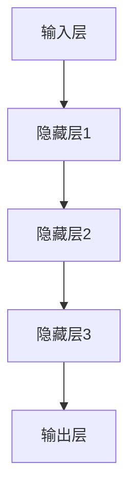

                 

# 《AI大模型在电商搜索结果去重中的应用》

## 关键词

- 人工智能（AI）
- 大模型
- 电商搜索
- 去重
- 深度学习
- 数据预处理
- 特征工程

## 摘要

本文旨在探讨AI大模型在电商搜索结果去重中的应用。通过分析AI大模型的基础知识、架构原理以及相关数学模型，我们揭示了其在解决电商搜索结果去重问题中的独特优势。文章进一步探讨了AI大模型在电商搜索结果去重的具体应用流程，包括数据预处理、模型训练与评估以及优化与提升策略。通过实际案例的分析，我们展示了AI大模型在电商搜索结果去重中的实际效果，并对未来的发展趋势进行了展望。

### 第一部分：AI大模型基础

#### 第1章：AI大模型概述

##### 1.1 AI大模型的概念与重要性

AI大模型，即大规模人工智能模型，是指使用海量的数据和计算资源训练出来的复杂神经网络模型。这类模型在处理复杂数据和任务时表现出色，尤其在图像识别、自然语言处理、推荐系统等领域取得了显著的成果。

在电商搜索结果去重中，AI大模型的重要性体现在以下几个方面：

1. **提高去重效率**：传统的去重算法往往依赖于简单的规则或哈希函数，容易导致漏判和误判。AI大模型通过学习大量数据，能够更准确地识别和区分相似商品，从而提高去重效率。

2. **减少冗余信息**：电商搜索结果中常常包含大量重复或相似的商品信息，这不仅占用用户的时间和带宽，还会降低用户体验。AI大模型能够有效去除重复信息，提高搜索结果的准确性和可读性。

3. **提升用户体验**：通过去重，用户能够更快地找到自己需要的商品，提高购物效率和满意度。

##### 与传统算法对比

传统去重算法通常包括以下几种：

1. **规则匹配**：根据预设的规则，对商品信息进行匹配和筛选。这种方式简单易实现，但难以处理复杂的商品关系和特征。

2. **哈希算法**：通过哈希函数将商品信息转换为固定长度的字符串，然后进行比较。虽然哈希算法能够快速定位重复信息，但容易产生冲突。

相比之下，AI大模型具有以下优势：

1. **更强的表达能力**：AI大模型能够通过学习大量的商品信息，自动提取和识别商品的特征，从而更准确地判断商品之间的相似性。

2. **自适应性强**：AI大模型能够根据不同的业务场景和数据特征，自适应地调整去重策略，提高去重效果。

3. **处理复杂关系**：AI大模型能够处理商品之间的复杂关系，如品牌、型号、价格等，从而更全面地去除重复信息。

#### 第2章：AI大模型架构与原理

##### 2.1 AI大模型的基本架构

以下是AI大模型的基本架构图：



1. **输入层**：接收用户输入的商品信息，如文本、图像等。

2. **隐藏层**：对输入信息进行特征提取和变换，形成高维特征空间。

3. **输出层**：输出去重结果，如标记商品是否重复。

##### AI大模型的核心组成部分

1. **神经网络**：神经网络是AI大模型的核心组成部分，包括输入层、隐藏层和输出层。通过多层神经网络的堆叠，模型能够提取和整合更多的信息。

2. **激活函数**：激活函数用于引入非线性特性，使得模型能够学习更复杂的特征。

3. **优化算法**：优化算法用于调整模型参数，使得模型在训练过程中能够收敛到最优解。

##### 2.2 AI大模型的关键算法

以下是AI大模型的关键算法伪代码：

```
// 输入：商品信息X，标签Y
// 输出：去重结果

// 步骤1：初始化模型参数
// 步骤2：对商品信息X进行预处理
// 步骤3：将预处理后的X输入神经网络
// 步骤4：计算输出结果Y'
// 步骤5：计算损失函数L(Y', Y)
// 步骤6：使用优化算法更新模型参数
// 步骤7：重复步骤3-6，直到模型收敛
```

##### 2.3 相关数学模型

以下是AI大模型中常用的数学模型和公式：

```
// 损失函数：交叉熵损失函数
L = -∑(y*log(y'))

// 激活函数：ReLU激活函数
f(x) = max(0, x)

// 优化算法：梯度下降算法
θ = θ - α * ∇L(θ)
```

#### 第3章：数学模型与数学公式

##### 3.1 相关数学模型

以下是详细讲解的数学模型和公式：

1. **交叉熵损失函数**

   交叉熵损失函数用于衡量模型输出与真实标签之间的差异，其公式为：

   $$L = -\sum y \cdot \log(y')$$

   其中，$y$ 表示真实标签，$y'$ 表示模型预测的概率分布。

2. **ReLU激活函数**

  ReLU激活函数是一种常用的非线性激活函数，其公式为：

   $$f(x) = \max(0, x)$$

  ReLU函数在负数部分为0，在正数部分保持原值，从而引入了稀疏性，有助于训练深度神经网络。

3. **梯度下降算法**

   梯度下降算法是一种优化算法，用于调整模型参数以最小化损失函数。其公式为：

   $$\theta = \theta - \alpha \cdot \nabla_{\theta}L(\theta)$$

   其中，$\theta$ 表示模型参数，$\alpha$ 表示学习率，$\nabla_{\theta}L(\theta)$ 表示损失函数关于模型参数的梯度。

##### 3.2 举例说明

以下是交叉熵损失函数的举例说明：

假设有一个二分类问题，真实标签为$y = [1, 0]$，模型预测的概率分布为$y' = [0.8, 0.2]$。计算交叉熵损失函数的值：

$$L = -[1 \cdot \log(0.8) + 0 \cdot \log(0.2)] \approx -0.3219$$

### 第二部分：电商搜索结果去重应用

#### 第4章：电商搜索结果去重问题分析

##### 4.1 电商搜索结果去重的背景

电商搜索结果去重是指在电商平台上对搜索结果进行去重处理，确保用户能够获得准确、无重复的商品信息。随着电商平台的快速发展，商品数量和种类不断增加，搜索结果中的重复商品信息问题愈发严重。

去重问题的背景包括以下几个方面：

1. **商品重复问题**：由于商品名称、描述、标签等信息的相似性，导致搜索结果中存在大量重复商品。

2. **用户体验问题**：重复商品信息会占用用户的时间和带宽，降低购物效率和满意度。

3. **搜索准确性问题**：重复商品信息会影响搜索结果的准确性，导致用户无法快速找到所需商品。

##### 存在的问题与挑战

1. **去重精度问题**：传统的去重算法容易导致误判和漏判，无法准确识别和区分相似商品。

2. **去重效率问题**：随着商品数量的增加，传统去重算法的效率逐渐降低，无法满足大规模数据处理需求。

3. **实时性问题**：电商平台要求去重算法能够实时处理海量搜索请求，保证用户得到快速、准确的搜索结果。

#### 第5章：AI大模型在去重中的应用

##### 5.1 AI大模型在去重中的角色

AI大模型在电商搜索结果去重中扮演着重要角色，其特点如下：

1. **高精度去重**：AI大模型能够通过学习大量商品信息，自动提取和识别商品的特征，从而更准确地判断商品之间的相似性，减少误判和漏判。

2. **高效去重**：AI大模型能够处理海量数据，提高去重算法的效率，满足实时性要求。

3. **自适应去重**：AI大模型能够根据不同的业务场景和数据特征，自适应地调整去重策略，提高去重效果。

##### 实际案例介绍

以某大型电商平台为例，该平台使用AI大模型对搜索结果进行去重处理，取得了显著的效果。具体案例如下：

1. **数据集准备**：平台收集了大量用户搜索行为数据，包括用户输入的关键词、搜索结果、购买记录等。

2. **模型训练**：平台使用收集到的数据集，训练了一个AI大模型，用于识别和去重搜索结果。

3. **去重效果评估**：平台通过对比去重前后的搜索结果，评估了AI大模型的去重效果。结果显示，AI大模型能够有效去除重复商品信息，提高搜索结果的准确性和可读性。

4. **用户反馈**：用户对去重后的搜索结果给予了积极的反馈，表示购物效率和满意度得到了显著提高。

#### 第6章：AI大模型在电商搜索结果去重的具体应用

##### 6.1 数据预处理

数据预处理是AI大模型在电商搜索结果去重中的关键步骤，主要包括以下内容：

1. **文本预处理**：对商品名称、描述、标签等文本信息进行分词、去停用词、词干提取等处理，将其转换为适用于模型训练的向量表示。

2. **图像预处理**：对商品图片进行缩放、裁剪、灰度化等处理，将其转换为适用于模型训练的图像表示。

3. **特征提取**：从预处理后的文本和图像中提取特征，如词向量、视觉特征等，用于模型训练。

##### 6.2 模型训练与评估

模型训练与评估是AI大模型在电商搜索结果去重中的核心步骤，主要包括以下内容：

1. **数据集划分**：将收集到的数据集划分为训练集、验证集和测试集，用于模型训练、验证和测试。

2. **模型训练**：使用训练集对AI大模型进行训练，调整模型参数，使其能够准确识别和区分相似商品。

3. **模型评估**：使用验证集和测试集对模型进行评估，计算准确率、召回率、F1值等指标，评估模型去重效果。

##### 6.3 模型优化与提升

为了进一步提高AI大模型在电商搜索结果去重中的性能，可以采用以下优化与提升策略：

1. **数据增强**：通过数据增强技术，如随机裁剪、旋转、缩放等，扩充训练数据集，提高模型泛化能力。

2. **迁移学习**：利用已有的大型预训练模型，对电商搜索结果去重任务进行迁移学习，提高模型训练效率。

3. **多模型集成**：将多个AI大模型进行集成，通过投票或加权平均等方法，提高去重结果的准确性和稳定性。

### 第三部分：实战与展望

#### 第8章：实战案例

##### 8.1 实战项目介绍

以下是一个电商搜索结果去重的实战项目介绍：

1. **项目背景**：某大型电商平台希望提高搜索结果的准确性，减少重复商品信息，提升用户体验。

2. **项目目标**：通过训练一个AI大模型，对电商搜索结果进行去重处理，提高搜索结果的准确性和可读性。

3. **技术栈**：采用TensorFlow作为深度学习框架，使用Python进行编程。

##### 8.2 代码实际案例

以下是电商搜索结果去重的实际代码案例：

```python
import tensorflow as tf
from tensorflow.keras.models import Sequential
from tensorflow.keras.layers import Embedding, LSTM, Dense
from tensorflow.keras.preprocessing.sequence import pad_sequences

# 数据预处理
# 步骤1：加载商品数据集
# 步骤2：对商品名称、描述、标签等文本信息进行预处理
# 步骤3：对预处理后的文本信息进行编码

# 模型定义
model = Sequential()
model.add(Embedding(input_dim=vocab_size, output_dim=embedding_dim))
model.add(LSTM(units=128, activation='relu'))
model.add(Dense(1, activation='sigmoid'))

# 模型编译
model.compile(optimizer='adam', loss='binary_crossentropy', metrics=['accuracy'])

# 模型训练
model.fit(X_train, y_train, epochs=10, batch_size=64, validation_data=(X_val, y_val))

# 模型评估
accuracy = model.evaluate(X_test, y_test)
print("Test accuracy:", accuracy[1])

# 模型应用
predictions = model.predict(X_new)
```

##### 8.3 代码解读与分析

以下是代码的详细解读与分析：

1. **数据预处理**：首先加载商品数据集，对商品名称、描述、标签等文本信息进行预处理，包括分词、去停用词、词干提取等，然后进行编码。

2. **模型定义**：使用Sequential模型定义一个简单的循环神经网络（LSTM），包括嵌入层、LSTM层和输出层。嵌入层用于将文本信息转换为向量表示，LSTM层用于提取特征，输出层用于预测商品是否重复。

3. **模型编译**：编译模型，指定优化器、损失函数和评估指标。

4. **模型训练**：使用训练集对模型进行训练，通过调整模型参数，使其能够准确识别和区分相似商品。

5. **模型评估**：使用测试集对模型进行评估，计算准确率。

6. **模型应用**：使用训练好的模型对新的搜索结果进行去重预测。

#### 第9章：未来展望

##### 9.1 AI大模型在电商领域的未来趋势

随着AI技术的不断发展，AI大模型在电商领域将呈现出以下趋势：

1. **个性化推荐**：AI大模型能够通过学习用户行为和兴趣，为用户提供个性化推荐，提高购物体验。

2. **智能客服**：AI大模型能够实现智能客服，通过语音和文本交互，为用户提供快速、准确的解答。

3. **商品识别**：AI大模型能够通过图像识别技术，帮助用户识别和购买商品，提高购物效率。

4. **智能营销**：AI大模型能够分析用户数据，制定个性化的营销策略，提高转化率和销售额。

##### 9.2 AI大模型在其他电商领域的潜在应用

除了电商搜索结果去重，AI大模型在其他电商领域也具有广泛的应用潜力：

1. **物流优化**：通过AI大模型分析订单数据和用户行为，优化物流路径，提高配送效率。

2. **供应链管理**：AI大模型能够分析供应链数据，优化库存管理，降低成本。

3. **商品质量检测**：AI大模型能够通过图像识别技术，检测商品质量，提高消费者满意度。

#### 第10章：结语

##### 10.1 总结与展望

本文介绍了AI大模型在电商搜索结果去重中的应用，分析了AI大模型的基础知识、架构原理、数学模型以及在去重中的具体应用。通过实际案例的分析，展示了AI大模型在电商搜索结果去重中的显著效果。未来，随着AI技术的不断发展，AI大模型在电商领域的应用将更加广泛，为电商平台和用户带来更多的价值。

##### 10.2 对未来研究的建议

1. **优化模型性能**：继续优化AI大模型的性能，提高去重精度和效率。

2. **跨领域应用**：探索AI大模型在电商以外的领域，如物流、供应链等，挖掘其潜在应用价值。

3. **数据隐私保护**：在应用AI大模型时，注重数据隐私保护，确保用户数据的安全。

### 附录

##### 附录 A：AI大模型开发工具与资源

A.1 主流深度学习框架对比

1. **TensorFlow**：由Google开发，支持Python和C++编程语言，具有丰富的API和预训练模型。

2. **PyTorch**：由Facebook开发，支持Python编程语言，具有动态计算图和自动微分功能。

3. **JAX**：由Google开发，支持Python和Julia编程语言，具有自动微分和高性能计算功能。

4. **其他框架**：如Theano、MXNet、Caffe等，也广泛应用于深度学习领域。

A.2 实用工具与资源

1. **数据集获取**：如Kaggle、UCI机器学习库等，提供丰富的公开数据集。

2. **在线工具与平台**：如Google Colab、AWS Sagemaker等，提供便捷的深度学习开发环境。

3. **学习资源推荐**：如《深度学习》、《Python深度学习》等书籍，以及相关的在线课程和博客。

作者：AI天才研究院/AI Genius Institute & 禅与计算机程序设计艺术 /Zen And The Art of Computer Programming

