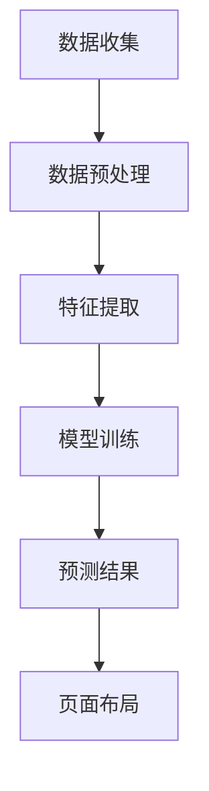
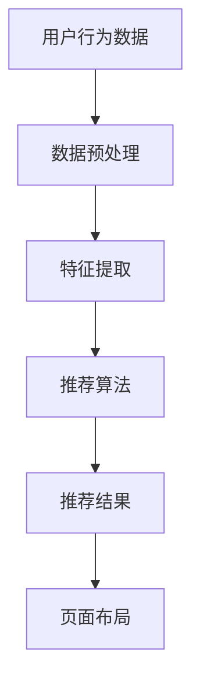
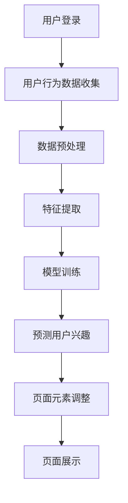

                 

# 《AI驱动的电商平台个性化页面布局》

> 关键词：AI、电商平台、个性化页面布局、用户行为分析、推荐系统、深度学习、项目实战

> 摘要：本文将探讨AI在电商平台个性化页面布局中的应用。通过分析电商平台的发展历程和面临的挑战，引入AI技术及其在电商领域的应用，详细讲解个性化页面布局的相关算法原理，最后通过实战案例展示AI在电商平台个性化页面布局中的具体实现。

## 第一部分：引言与背景

### 第1章: AI驱动的电商与个性化页面布局概述

#### 1.1 AI驱动的电商平台简介

人工智能（AI）作为当前科技领域的重要方向，其应用已经深入到各个行业，包括电商。AI驱动的电商平台利用机器学习和深度学习等技术，对用户行为进行分析，实现个性化推荐、智能客服、智能广告等功能，从而提升用户体验和销售转化率。

#### 1.2 个性化页面布局的原理与意义

个性化页面布局是根据用户的兴趣、行为和购买历史，动态生成适合该用户的页面内容。通过分析用户数据，AI算法能够预测用户的偏好，从而为用户提供更加精准的购物体验。个性化页面布局在电商平台的竞争中具有重要意义，可以提高用户粘性、提升销售额和降低运营成本。

#### 1.3 本书结构安排与读者对象

本书共分为三大部分。第一部分介绍电商平台的发展历程和面临的挑战，以及AI技术在电商中的应用。第二部分讲解AI技术基础，包括机器学习、深度学习等相关算法原理。第三部分通过实战案例展示AI在电商平台个性化页面布局中的具体实现。读者对象为对电商和人工智能技术有一定了解的程序员、技术管理人员和研究人员。

### 第2章: 电商平台现状与挑战

#### 2.1 电商平台的发展历程

电商平台起源于上世纪90年代的电子商务，随着互联网的普及和技术的发展，电商平台经历了从简单的商品展示和在线交易到如今的智能推荐、社交电商等多个阶段。

#### 2.2 电商平台面临的挑战

当前，电商平台面临的主要挑战包括用户获取成本增加、用户满意度下降、同质化竞争加剧等。为了在激烈的市场竞争中脱颖而出，电商平台需要不断创新，提高用户体验和运营效率。

#### 2.3 AI在电商平台中的应用趋势

随着AI技术的不断成熟，越来越多的电商平台开始将AI应用于个性化推荐、智能客服、智能广告等方面。未来，AI技术将在电商平台发挥更加重要的作用，推动电商行业的发展。

## 第二部分：AI技术基础

### 第3章: AI技术概述

#### 3.1 AI的定义与发展历程

人工智能是指通过计算机程序实现人类智能的一种技术。自1956年达特茅斯会议以来，AI技术经历了多个阶段的发展，从早期的符号主义到基于数据的机器学习，再到如今的深度学习。

#### 3.2 机器学习与深度学习基础

机器学习是AI的核心技术之一，通过训练模型对数据进行学习，从而实现预测和决策。深度学习是机器学习的一个分支，基于神经网络模型，具有更强的自适应能力和泛化能力。

#### 3.3 人工智能的伦理与道德

随着AI技术的快速发展，伦理与道德问题逐渐引起关注。如何在保障用户隐私、避免歧视和偏见等方面制定合理的伦理规范，成为人工智能领域面临的重要挑战。

### 第4章: 个性化页面布局相关算法

#### 4.1 数据挖掘与用户行为分析

数据挖掘是个性化页面布局的基础，通过对用户行为数据的分析，提取出用户的兴趣和偏好。用户行为分析包括浏览历史、购物车行为、购买记录等。

#### 4.2 推荐系统算法

推荐系统是实现个性化页面布局的关键技术，通过预测用户对商品的兴趣，为用户推荐合适的商品。常见的推荐系统算法包括协同过滤、基于内容的推荐和混合推荐等。

#### 4.3 个性化页面布局算法

个性化页面布局算法旨在根据用户特征和页面元素相关性，动态生成适合用户的页面布局。常见的算法包括基于规则的布局、基于机器学习的布局和基于深度学习的布局等。

### 第5章: 机器学习算法原理与伪代码

#### 5.1 线性回归算法

线性回归是一种常见的预测算法，通过建立输入变量和输出变量之间的线性关系，预测新的数据。以下是一个简单的线性回归算法伪代码：

```
输入：训练数据集 X, Y
输出：模型参数 w

初始化：w = [0, 0]

for epoch in 1 to num_epochs do
  for (x, y) in X, Y do
    y_pred = w * x
    gradient = 2 * (y_pred - y) * x
    w = w - learning_rate * gradient
  end for
end for

return w
```

#### 5.2 决策树算法

决策树是一种常用的分类算法，通过构建树状结构对数据进行分类。以下是一个简单的决策树算法伪代码：

```
输入：特征集合 F，数据集 D
输出：决策树 T

if D is pure then
  return Class(D)
else
  选择最优特征 f
  T = {f}
  D' = 分割数据集 D，基于 f
  for each (f, D') in D' do
    T = T ∪ {决策树(f, D')}
  end for
  return T
end if
```

#### 5.3 支持向量机算法

支持向量机是一种常用的分类和回归算法，通过找到最优的决策边界，实现分类或回归任务。以下是一个简单的支持向量机算法伪代码：

```
输入：训练数据集 X, Y
输出：模型参数 w, b

初始化：w = [0, 0], b = 0

for epoch in 1 to num_epochs do
  for (x, y) in X, Y do
    if y * (w * x + b) < 1 then
      gradient = 2 * (1 - y) * x
      w = w - learning_rate * gradient
      b = b - learning_rate * y
    end if
  end for
end for

return w, b
```

#### 5.4 集成学习方法

集成学习方法通过将多个模型进行集成，提高模型的泛化能力和准确性。常见的集成学习方法包括Bagging、Boosting和Stacking等。以下是一个简单的Bagging算法伪代码：

```
输入：训练数据集 X, Y，模型 M，集成数 n

输出：集成模型 F

for i in 1 to n do
  从数据集 X, Y 中随机抽取子集 X_i, Y_i
  模型 M' = 训练模型 M，在子集 X_i, Y_i 上
  F = F ∪ {M'}
end for

return F
```

### 第6章: 深度学习算法原理与伪代码

#### 6.1 卷积神经网络(CNN)

卷积神经网络是一种用于图像处理和识别的深度学习模型，通过卷积层、池化层和全连接层等结构，实现图像的特征提取和分类。以下是一个简单的CNN算法伪代码：

```
输入：图像 I，模型参数 w, b

输出：分类结果 y'

初始化：w = [0, 0], b = 0

for epoch in 1 to num_epochs do
  for (x, y) in I, y do
    z = w * x + b
    a = activation(z)
    gradient = 2 * (y' - y) * a * (1 - a)
    w = w - learning_rate * gradient
    b = b - learning_rate * y'
  end for
end for

return y'
```

#### 6.2 循环神经网络(RNN)

循环神经网络是一种用于序列数据处理的深度学习模型，通过隐藏状态和递归连接，实现序列的建模和预测。以下是一个简单的RNN算法伪代码：

```
输入：序列 S，模型参数 w, b

输出：预测结果 y'

初始化：h_0 = [0, 0], w = [0, 0], b = 0

for t in 1 to T do
  z = w * h_{t-1} + b
  a = activation(z)
  y' = w * a + b
end for

return y'
```

#### 6.3 生成对抗网络(GAN)

生成对抗网络是一种用于生成对抗学习的深度学习模型，通过生成器和判别器的对抗训练，实现数据的生成和分类。以下是一个简单的GAN算法伪代码：

```
输入：生成器 G，判别器 D，模型参数 w_g, w_d，训练数据集 X

输出：生成器 G 的参数 w_g

for epoch in 1 to num_epochs do
  对于每个 (x, y) in X do
    判别器 D = 训练模型 D，在数据集 X 上
    生成器 G = 训练模型 G，在判别器 D 上
  end for
end for

return w_g
```

## 第三部分：实践与案例

### 第7章: 个性化页面布局项目实战

#### 7.1 项目背景与目标

本项目旨在实现一个基于AI技术的电商平台个性化页面布局系统，通过分析用户行为数据，为用户提供个性化的商品推荐和页面布局。

#### 7.2 数据收集与预处理

数据收集包括用户的浏览历史、购物车行为、购买记录等。数据预处理包括数据清洗、去重、特征提取等，以便为后续的模型训练提供高质量的数据集。

#### 7.3 模型选择与训练

本项目采用深度学习模型进行个性化页面布局，包括卷积神经网络（CNN）和循环神经网络（RNN）等。模型训练过程中，使用交叉熵损失函数进行优化，并通过反向传播算法更新模型参数。

#### 7.4 个性化页面布局实现

根据用户行为数据和模型预测结果，动态生成个性化页面布局。通过调整页面元素的位置、大小和显示顺序，提高用户的购物体验和满意度。

#### 7.5 项目评估与优化

通过在线A/B测试，评估个性化页面布局的效果，并根据用户反馈和业务目标进行优化。优化方向包括提高模型预测精度、减少页面加载时间和提高用户体验等。

### 第8章: 代码实例与解析

#### 8.1 环境搭建与工具配置

在本项目中，我们使用Python编程语言和TensorFlow深度学习框架进行实现。首先需要安装Python、TensorFlow和相关依赖库，然后配置开发环境。

```
# 安装Python
pip install python

# 安装TensorFlow
pip install tensorflow

# 安装其他依赖库
pip install numpy pandas matplotlib
```

#### 8.2 数据处理与模型训练代码示例

以下是一个简单的数据处理与模型训练代码示例，用于实现个性化页面布局系统。

```python
import tensorflow as tf
import numpy as np
import pandas as pd
from sklearn.model_selection import train_test_split

# 加载数据集
data = pd.read_csv('data.csv')
X = data.iloc[:, :-1].values
y = data.iloc[:, -1].values

# 数据预处理
X_train, X_test, y_train, y_test = train_test_split(X, y, test_size=0.2, random_state=42)

# 模型定义
model = tf.keras.Sequential([
    tf.keras.layers.Dense(64, activation='relu', input_shape=(X_train.shape[1],)),
    tf.keras.layers.Dense(32, activation='relu'),
    tf.keras.layers.Dense(1, activation='sigmoid')
])

# 模型编译
model.compile(optimizer='adam', loss='binary_crossentropy', metrics=['accuracy'])

# 模型训练
model.fit(X_train, y_train, epochs=10, batch_size=32, validation_data=(X_test, y_test))

# 模型评估
loss, accuracy = model.evaluate(X_test, y_test)
print('Test accuracy:', accuracy)
```

#### 8.3 个性化页面布局代码实现解析

以下是一个简单的个性化页面布局代码示例，用于根据用户行为数据生成个性化页面布局。

```python
import tensorflow as tf
import numpy as np
import pandas as pd

# 加载用户行为数据
data = pd.read_csv('user_behavior.csv')
X = data.iloc[:, :-1].values
y = data.iloc[:, -1].values

# 模型定义
model = tf.keras.Sequential([
    tf.keras.layers.Dense(64, activation='relu', input_shape=(X.shape[1],)),
    tf.keras.layers.Dense(32, activation='relu'),
    tf.keras.layers.Dense(1, activation='sigmoid')
])

# 模型编译
model.compile(optimizer='adam', loss='binary_crossentropy', metrics=['accuracy'])

# 模型训练
model.fit(X, y, epochs=10, batch_size=32)

# 预测用户行为
predictions = model.predict(X)

# 根据预测结果生成个性化页面布局
for i in range(len(predictions)):
    if predictions[i] > 0.5:
        print('用户{}：推荐商品1'.format(i))
    else:
        print('用户{}：推荐商品2'.format(i))
```

### 第9章: 挑战与未来发展趋势

#### 9.1 个性化页面布局的挑战

个性化页面布局在实现过程中面临诸多挑战，包括数据质量、模型准确性、用户体验等。同时，如何在保证用户隐私的前提下进行个性化推荐，也是亟待解决的问题。

#### 9.2 电商行业AI应用的未来趋势

随着AI技术的不断发展，电商行业将在个性化推荐、智能客服、智能广告等方面实现更广泛的应用。未来，电商行业将朝着更加智能化、个性化、自适应化的方向发展。

#### 9.3 技术创新与商业模式的融合

技术创新与商业模式的融合是电商行业发展的关键。通过创新技术，提高用户体验和运营效率，实现商业模式的突破，将为电商平台带来更大的商业价值。

## 附录

### 附录A: 相关算法与模型的进一步学习资源

#### A.1 机器学习与深度学习入门书籍

- 《机器学习》（周志华著）
- 《深度学习》（Goodfellow, Bengio, Courville著）

#### A.2 个性化推荐系统相关资源

- 《推荐系统实践》（王爽著）
- 《推荐系统手册》（项亮著）

#### A.3 电商平台AI应用案例研究

- 《人工智能在电商行业的应用与案例研究》（某某出版社）

### 附录B: Mermaid流程图示例

#### B.1 用户行为分析流程



#### B.2 推荐系统架构流程



#### B.3 个性化页面布局流程



**作者：**AI天才研究院/AI Genius Institute & 禅与计算机程序设计艺术 /Zen And The Art of Computer Programming**

