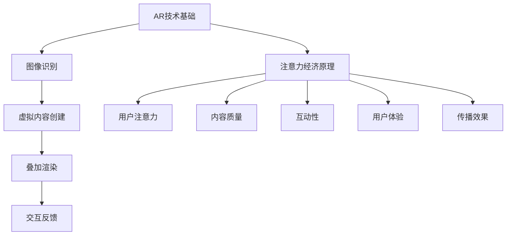
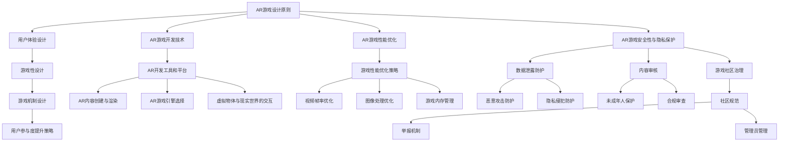
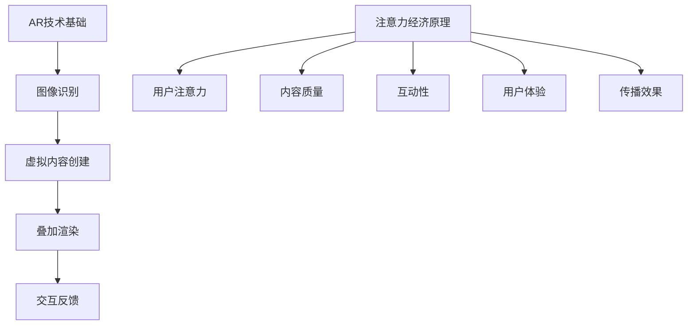

                 

# AR游戏：注意力经济的新形式

> **关键词**：AR游戏、注意力经济、设计原则、开发技术、案例分析、产业发展

> **摘要**：随着科技的发展，增强现实（AR）游戏已经成为娱乐领域的一股新势力。本文将深入探讨AR游戏的基本概念、技术原理、设计原则、开发技术、安全性与隐私保护以及案例分析，并展望AR游戏产业的发展趋势。本文旨在为读者提供关于AR游戏在注意力经济时代下的全面理解和思考。

### 目录大纲

1. **第一部分：AR游戏概述**
   1.1 什么是AR技术
   1.2 AR技术的工作原理
   1.3 AR技术的分类及应用领域
   1.4 AR游戏的发展历程
   2. **注意力经济原理**
   2.1 注意力经济的定义
   2.2 注意力经济的关键因素
   2.3 注意力经济的商业模式
   2.4 注意力经济与AR游戏的结合

2. **第二部分：AR游戏设计与开发**
   3. **AR游戏设计原则**
   3.1 用户体验设计
   3.2 游戏性设计
   3.3 游戏机制设计
   3.4 用户参与度提升策略
   4. **AR游戏开发技术**
   4.1 AR开发工具和平台
   4.2 AR内容创建与渲染
   4.3 AR游戏引擎选择
   4.4 虚拟物体与现实世界的交互
   5. **AR游戏性能优化**
   5.1 游戏性能优化策略
   5.2 视频帧率优化
   5.3 图像处理优化
   5.4 游戏内存管理
   6. **AR游戏安全性与隐私保护**
   6.1 AR游戏中的安全问题
   6.2 用户隐私保护措施
   6.3 游戏内容监管与合规
   6.4 游戏社区的治理

3. **第三部分：AR游戏案例分析**
   7. **成功的AR游戏案例**
   7.1 《Ingress》案例分析
   7.2 《Pokémon GO》案例分析
   7.3 《The Machines》案例分析
   7.4 其他成功AR游戏介绍
   8. **AR游戏产业发展趋势**
   8.1 AR游戏市场现状与预测
   8.2 新技术对AR游戏发展的影响
   8.3 AR游戏行业面临的挑战与机遇
   8.4 未来AR游戏的创新方向

4. **附录**
   4.1 **AR游戏开发资源指南**
   4.2 **Mermaid流程图**

---

### 第一部分：AR游戏概述

#### 1.1 什么是AR技术

增强现实（Augmented Reality，简称AR）是一种将虚拟信息与现实世界结合的技术。与虚拟现实（Virtual Reality，简称VR）不同，AR技术不是将用户完全沉浸在一个虚拟环境中，而是通过计算机生成的图像、音频、视频等信息增强用户的现实感知。AR技术通过摄像头捕捉现实世界的图像，并在这些图像上叠加虚拟信息，使用户能够同时看到现实世界和虚拟内容。

#### 1.2 AR技术的工作原理

AR技术的工作原理主要包括以下几个步骤：

1. **图像识别**：通过摄像头捕捉现实世界的图像，并利用图像识别技术对图像中的物体进行识别和定位。

2. **虚拟内容创建**：根据识别和定位的结果，生成相应的虚拟内容，如文字、图像、三维模型等。

3. **叠加渲染**：将虚拟内容叠加到现实世界的图像上，并通过屏幕或投影设备显示出来。

4. **交互反馈**：用户可以通过触摸屏、手势等方式与虚拟内容进行交互，从而实现对现实世界的操作。

#### 1.3 AR技术的分类及应用领域

AR技术根据应用场景和目标用户的不同，可以分为以下几个类别：

1. **移动AR**：通过移动设备（如智能手机、平板电脑）实现的AR应用，用户可以随时随地体验AR内容。

2. **眼镜AR**：通过AR眼镜实现的AR应用，如微软的HoloLens、谷歌的Google Glass等，提供更为沉浸式的体验。

3. **投影AR**：通过投影设备将AR内容投射到现实世界的物体上，如商场展示、舞台表演等。

4. **头戴显示器AR**：通过头戴显示器实现的AR应用，如虚拟现实头盔等。

AR技术的应用领域非常广泛，包括但不限于以下几个方面：

1. **游戏娱乐**：AR游戏是AR技术最典型的应用之一，通过将虚拟角色、场景与现实世界结合，为用户带来全新的游戏体验。

2. **教育培训**：AR技术可以增强教学效果，通过虚拟实验、互动教学等方式提高学生的学习兴趣和参与度。

3. **医疗健康**：AR技术可以用于医学影像分析、手术辅助等，提高医疗诊断和治疗的准确性和效率。

4. **工业制造**：AR技术可以用于设备维修、生产流程优化等，提高工业生产效率和质量。

5. **旅游导航**：AR技术可以为用户提供实时的旅游信息、导航指引等，提高旅游体验。

#### 1.4 AR游戏的发展历程

AR游戏的发展历程可以追溯到2000年初期，当时一些简单的AR游戏开始出现。然而，直到智能手机和移动互联网的兴起，AR游戏才真正开始蓬勃发展。以下是AR游戏的发展历程：

1. **2000年代初**：一些简单的AR游戏出现，如《AR Invaders》和《AAR Soldier》等。

2. **2010年代初**：随着智能手机和AR技术的发展，一些经典的AR游戏问世，如《AR Zone》和《AR Defense》等。

3. **2016年**：AR游戏《Pokémon GO》问世，引发全球热潮，标志着AR游戏市场的崛起。

4. **2017年**：AR游戏市场继续扩大，出现了更多高质量、创新的AR游戏，如《The Machines》和《Ingress》等。

5. **至今**：AR游戏市场持续增长，游戏类型和内容更加丰富多样，涵盖了各类题材和玩法。

### 第二部分：注意力经济原理

#### 2.1 注意力经济的定义

注意力经济（Attention Economy）是指在一个信息爆炸的时代，用户的注意力成为一种稀缺资源，围绕用户注意力产生的经济现象。在这个经济模式中，企业和个人通过吸引和保持用户的注意力来创造价值。

#### 2.2 注意力经济的关键因素

1. **用户注意力**：注意力经济的基础是用户的注意力，用户愿意将注意力投入到哪些内容或产品中，决定了这些内容或产品的价值。

2. **内容质量**：高质量的内容更容易吸引和保持用户的注意力，从而提高其价值。

3. **互动性**：互动性可以增加用户参与度，提高用户对内容的兴趣和投入度。

4. **用户体验**：良好的用户体验可以增加用户对内容的满意度，从而提高其忠诚度和粘性。

5. **传播效果**：优质内容的传播效果决定了其能够吸引多少新的用户，进而影响其价值。

#### 2.3 注意力经济的商业模式

1. **广告模式**：通过吸引用户注意力，将广告内容展示给用户，从而实现广告主与用户之间的信息交换。

2. **订阅模式**：用户为获取特定内容或服务支付费用，如在线课程、电子书、会员制等。

3. **付费模式**：用户为特定内容或服务支付费用，如应用内购买、付费游戏等。

4. **平台模式**：通过搭建平台，连接内容提供者与用户，实现流量变现。

#### 2.4 注意力经济与AR游戏的结合

1. **用户体验增强**：AR游戏通过增强现实技术，将虚拟内容与现实世界结合，提供独特的游戏体验，从而吸引和保持用户的注意力。

2. **互动性提高**：AR游戏通常具有高度互动性，用户可以通过触摸、手势等方式与游戏内容进行互动，增加参与度。

3. **广告收益**：AR游戏可以结合广告模式，通过展示广告来获取收益，同时提升用户体验。

4. **社交传播**：AR游戏具有很强的社交性，用户可以通过游戏社交网络分享游戏内容，扩大传播效果。

5. **付费内容**：AR游戏可以通过付费内容（如游戏道具、装备等）来获取收益，同时提高用户体验。

### 第三部分：AR游戏设计与开发

#### 3.1 AR游戏设计原则

1. **用户体验设计**：以用户为中心，关注用户的使用习惯、需求和心理，设计易于操作、舒适、美观的用户界面。

2. **游戏性设计**：注重游戏机制、玩法、故事情节等设计，提高游戏的趣味性和挑战性。

3. **游戏机制设计**：设计合理的游戏规则和机制，确保游戏的公平性和可玩性。

4. **用户参与度提升策略**：通过增加互动性、竞争性、社交性等元素，提高用户的参与度和粘性。

#### 3.2 AR游戏开发技术

1. **AR开发工具和平台**：选择合适的AR开发工具和平台，如Unity、Unreal Engine、ARKit、ARCore等。

2. **AR内容创建与渲染**：利用3D建模、动画、音效等技术，创建高质量的AR内容，并通过渲染技术实现逼真的效果。

3. **AR游戏引擎选择**：选择合适的AR游戏引擎，如Unity、Unreal Engine等，以提高开发效率和游戏性能。

4. **虚拟物体与现实世界的交互**：设计虚拟物体与现实世界的交互方式，如触摸、手势、语音等，提高用户体验。

#### 3.3 AR游戏性能优化

1. **游戏性能优化策略**：通过优化游戏代码、图像、音频等资源，提高游戏性能和流畅度。

2. **视频帧率优化**：优化渲染过程，确保游戏运行在合适的帧率范围内，提高用户体验。

3. **图像处理优化**：利用图像处理算法，优化图像质量和渲染速度。

4. **游戏内存管理**：合理管理游戏内存，避免内存泄漏和性能下降。

### 第四部分：AR游戏安全性与隐私保护

#### 4.1 AR游戏中的安全问题

1. **数据泄露**：游戏数据（如用户信息、游戏进度等）可能被非法获取或泄露。

2. **恶意攻击**：黑客可能通过游戏系统进行恶意攻击，如DDoS攻击、病毒传播等。

3. **隐私侵犯**：游戏可能侵犯用户的隐私，如收集和分析用户行为数据等。

#### 4.2 用户隐私保护措施

1. **数据加密**：对用户数据进行加密处理，确保数据在传输和存储过程中的安全性。

2. **隐私政策**：明确告知用户游戏收集和使用用户数据的目的、范围和方式，并获取用户的同意。

3. **数据匿名化**：对用户数据进行匿名化处理，避免直接关联到特定用户。

4. **安全审计**：定期进行安全审计，发现和修复潜在的安全漏洞。

#### 4.3 游戏内容监管与合规

1. **内容审核**：对游戏内容进行审核，确保符合相关法规和道德标准。

2. **未成年人保护**：对未成年用户进行保护，如限制游戏时间、过滤不良内容等。

3. **合规审查**：确保游戏符合当地法律法规，如网络游戏防沉迷系统等。

#### 4.4 游戏社区的治理

1. **社区规范**：制定社区规范，引导用户文明游戏，禁止恶意行为。

2. **举报机制**：建立举报机制，鼓励用户举报违规行为，维护社区秩序。

3. **管理员管理**：设立专业的社区管理员，负责处理违规行为和用户纠纷。

### 第五部分：AR游戏案例分析

#### 5.1 《Ingress》案例分析

《Ingress》是由谷歌开发的AR游戏，玩家需要在现实世界中寻找和占领“热点”位置，以实现各自的战略目标。以下是对《Ingress》的案例分析：

1. **用户体验设计**：《Ingress》提供了直观的操作界面和清晰的地图导航，让玩家轻松找到目标地点。

2. **游戏性设计**：游戏机制丰富多样，包括占领、守护、挑战等，提高了游戏的趣味性和挑战性。

3. **开发技术**：《Ingress》采用谷歌的AR开发框架，实现了高质量的AR效果。

4. **安全性与隐私保护**：《Ingress》在数据安全和隐私保护方面做得较好，用户数据加密存储，且用户可以控制数据共享范围。

5. **效果与影响**：《Ingress》在全球范围内吸引了大量用户，促进了AR技术的普及和应用。

#### 5.2 《Pokémon GO》案例分析

《Pokémon GO》是由Niantic开发的AR游戏，玩家在现实世界中捕捉虚拟的宝可梦。以下是对《Pokémon GO》的案例分析：

1. **用户体验设计**：《Pokémon GO》提供了简单易用的界面和丰富的交互方式，如捕捉、交换、战斗等。

2. **游戏性设计**：游戏机制新颖有趣，玩家可以根据自己的兴趣和需求选择不同的游戏玩法。

3. **开发技术**：《Pokémon GO》采用Unity引擎开发，实现了高质量的AR效果。

4. **安全性与隐私保护**：《Pokémon GO》在数据安全和隐私保护方面存在一定的争议，如用户数据的收集和使用等。

5. **效果与影响**：《Pokémon GO》在全球范围内取得了巨大成功，激发了人们对AR游戏和移动设备的兴趣，推动了AR技术的发展。

#### 5.3 《The Machines》案例分析

《The Machines》是由Niantic开发的AR游戏，玩家需要在现实世界中建造和维护机器，与敌人战斗。以下是对《The Machines》的案例分析：

1. **用户体验设计**：《The Machines》提供了丰富的操作界面和清晰的地图导航，让玩家轻松掌握游戏机制。

2. **游戏性设计**：游戏机制丰富多样，包括建造、维修、战斗等，提高了游戏的趣味性和挑战性。

3. **开发技术**：《The Machines》采用Unity引擎开发，实现了高质量的AR效果。

4. **安全性与隐私保护**：《The Machines》在数据安全和隐私保护方面做得较好，用户数据加密存储，且用户可以控制数据共享范围。

5. **效果与影响**：《The Machines》在全球范围内吸引了大量用户，推动了AR游戏市场的发展。

#### 5.4 其他成功AR游戏介绍

除了上述三个案例，还有许多其他成功的AR游戏，如《Journey to Mars》、《AR斋月》等。这些游戏在用户体验、游戏性、开发技术、安全性与隐私保护等方面都有各自的特点和优势。

### 第六部分：AR游戏产业发展趋势

#### 6.1 AR游戏市场现状与预测

随着智能手机和移动互联网的普及，AR游戏市场呈现出快速增长的趋势。根据市场调研数据显示，全球AR游戏市场规模将从2020年的46.4亿美元增长到2025年的240.8亿美元，年复合增长率达到41.3%。

#### 6.2 新技术对AR游戏发展的影响

1. **5G技术**：5G技术的普及将提高AR游戏的网络速度和流畅度，为用户提供更优质的体验。

2. **人工智能**：人工智能技术可以用于游戏开发中的场景识别、目标跟踪等，提高游戏的智能化水平。

3. **云计算**：云计算技术可以为AR游戏提供强大的计算支持，降低开发成本，提高游戏性能。

4. **边缘计算**：边缘计算可以将计算和存储资源分布到网络边缘，提高AR游戏的响应速度和用户体验。

#### 6.3 AR游戏行业面临的挑战与机遇

1. **技术创新**：AR游戏需要不断创新，以满足用户的需求和市场的变化。

2. **市场推广**：AR游戏需要有效的市场推广策略，以提高知名度和用户数量。

3. **商业模式**：AR游戏需要探索新的商业模式，以实现盈利和可持续发展。

4. **安全性与隐私保护**：AR游戏需要加强对安全性和隐私保护的关注，避免用户数据泄露和隐私侵犯。

#### 6.4 未来AR游戏的创新方向

1. **社交AR游戏**：结合社交元素，提高用户的参与度和互动性。

2. **教育AR游戏**：利用AR技术，提高教育效果，推动教育改革。

3. **医疗AR游戏**：利用AR技术，提高医疗诊断和治疗的效率。

4. **智能家居AR游戏**：结合智能家居技术，提高家庭生活的品质。

### 第七部分：附录

#### 7.1 AR游戏开发资源指南

1. **开发工具与平台**：Unity、Unreal Engine、ARKit、ARCore等。

2. **开发资源与教程**：官方文档、在线教程、开源项目等。

3. **社区与论坛**：Stack Overflow、Unity社区、ARCore社区等。

#### 7.2 Mermaid流程图

以下是AR技术和注意力经济的一些核心流程图：

### 结束语

AR游戏作为注意力经济的新形式，具有巨大的发展潜力。本文从AR技术基础、注意力经济原理、AR游戏设计与开发、安全性与隐私保护以及案例分析等方面进行了深入探讨，希望为读者提供关于AR游戏在注意力经济时代下的全面理解和思考。未来，随着技术的不断进步和市场的发展，AR游戏将会带来更多创新和机遇。

### 作者信息

作者：AI天才研究院/AI Genius Institute & 禅与计算机程序设计艺术 /Zen And The Art of Computer Programming

---

### 附录A：AR游戏开发资源指南

#### A.1 开发工具与平台

1. **Unity**：一款广泛使用的游戏开发引擎，支持AR游戏开发。
2. **Unreal Engine**：一款功能强大的游戏开发引擎，提供高质量的AR效果。
3. **ARKit**：苹果公司开发的AR开发框架，适用于iOS设备。
4. **ARCore**：谷歌公司开发的AR开发框架，适用于Android设备。

#### A.2 开发资源与教程

1. **官方文档**：各开发工具和平台的官方文档，提供详细的技术指南和API参考。
2. **在线教程**：许多在线平台提供AR游戏开发的教程，适合初学者和进阶者。
3. **开源项目**：GitHub等平台上有许多AR游戏开发的开源项目，可供学习和参考。

#### A.3 社区与论坛

1. **Stack Overflow**：编程问题解答社区，涵盖AR游戏开发相关问题。
2. **Unity社区**：Unity官方社区，提供技术支持和学习资源。
3. **ARKit社区**：专门针对ARKit开发的社区，分享经验和技巧。
4. **ARCore社区**：专门针对ARCore开发的社区，提供技术支持和学习资源。

---

### 附录B：Mermaid流程图

以下是AR技术和注意力经济的核心流程图：

以下是AR游戏设计、开发、性能优化、安全性与隐私保护的流程图：

```mermaid
graph TD
    A[AR游戏设计原则]
    B[用户体验设计]
    C[游戏性设计]
    D[游戏机制设计]
    E[用户参与度提升策略]
    F[AR游戏开发技术]
    G[AR开发工具和平台]
    H[AR内容创建与渲染]
    I[AR游戏引擎选择]
    J[虚拟物体与现实世界的交互]
    K[AR游戏性能优化]
    L[游戏性能优化策略]
    M[视频帧率优化]
    N[图像处理优化]
    O[游戏内存管理]
    P[AR游戏安全性与隐私保护]
    Q[数据泄露防护]
    R[恶意攻击防护]
    S[隐私侵犯防护]
    T[内容审核]
    U[未成年人保护]
    V[合规审查]
    W[游戏社区治理]
    X[社区规范]
    Y[举报机制]
    Z[管理员管理]
    A-->B
    A-->C
    A-->D
    A-->E
    F-->G
    F-->H
    F-->I
    F-->J
    K-->L
    K-->M
    K-->N
    K-->O
    P-->Q
    P-->R
    P-->S
    P-->T
    P-->U
    P-->V
    W-->X
    W-->Y
    W-->Z
```

---

通过这些流程图，读者可以更直观地了解AR技术和注意力经济的基本原理，以及AR游戏的设计、开发、性能优化、安全性与隐私保护等方面的重要步骤。希望这些资源能够为读者提供有价值的参考和指导。

