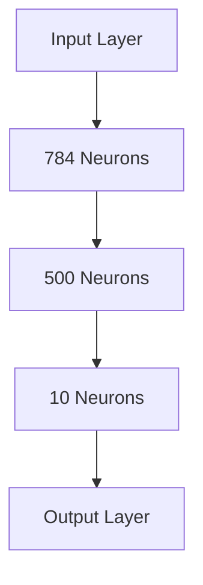
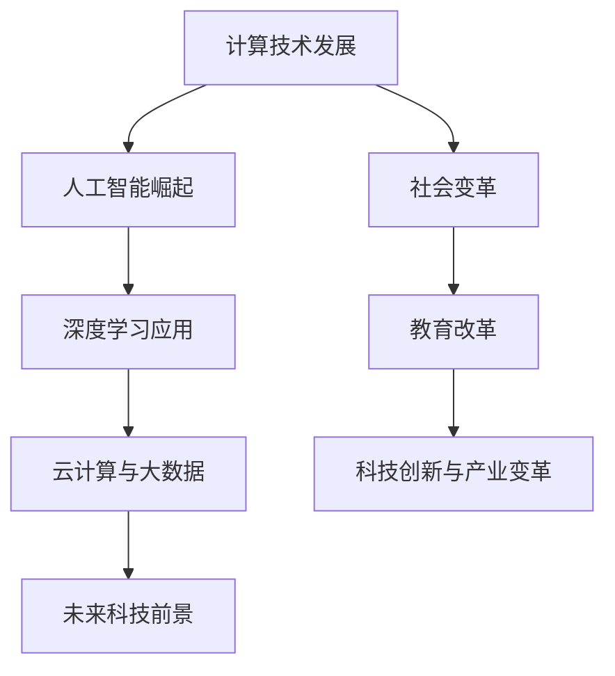

                 

### 文章标题

《Andrej Karpathy谈计算变化》

### 关键词

- Andrej Karpathy
- 计算变化
- 人工智能
- 深度学习
- 社会影响
- 教育改革
- 未来科技

### 摘要

本文深入探讨了安德烈·卡帕西（Andrej Karpathy）关于计算变化的观点。通过对卡帕西的核心理论、研究成果以及其对人工智能、深度学习等领域的贡献的详细解析，本文揭示了计算变化对科技、社会、教育等方面的深远影响。同时，文章还展望了未来科技的前景，探讨了计算变化与教育改革的关联，以及如何在实践中应用计算变化。本文旨在为读者提供一幅全面而深刻的计算变化图景，以启发对这一领域的深入思考。

---

在接下来的文章中，我们将通过多个部分对安德烈·卡帕西的研究进行系统性分析，同时结合具体案例和实例，探讨计算变化在人工智能、深度学习等多个领域中的实际应用及其影响。

---

### 《Andrej Karpathy谈计算变化》目录大纲

#### 第一部分：引言与概述

##### 1.1 计算变化的时代背景
- 1.1.1 计算技术的快速发展
- 1.1.2 Andrej Karpathy的研究与贡献

##### 1.2 书籍目的与结构安排

#### 第二部分：Andrej Karpathy的核心观点

##### 2.1 计算的本质与演变
- 2.1.1 计算的物理基础
- 2.1.2 计算理论的发展
- 2.1.3 计算技术的进化

##### 2.2 人工智能的崛起
- 2.2.1 人工智能的历史与发展
- 2.2.2 Andrej Karpathy在人工智能领域的贡献
- 2.2.3 人工智能的未来展望

##### 2.3 计算变化对社会的影响
- 2.3.1 社会经济层面的影响
- 2.3.2 科技创新与产业变革
- 2.3.3 个人生活与隐私保护

#### 第三部分：深度学习与神经网络

##### 3.1 深度学习的基本原理
- 3.1.1 深度学习的起源与发展
- 3.1.2 神经网络的结构与功能
- 3.1.3 深度学习的数学基础

##### 3.2 神经网络的设计与优化
- 3.2.1 神经网络的设计原则
- 3.2.2 神经网络的训练过程
- 3.2.3 神经网络的优化策略

##### 3.3 深度学习在人工智能中的应用
- 3.3.1 计算机视觉
- 3.3.2 自然语言处理
- 3.3.3 强化学习

#### 第四部分：计算变化与未来科技

##### 4.1 未来科技的前景
- 4.1.1 量子计算与计算能力的提升
- 4.1.2 脑机接口与神经形态计算
- 4.1.3 未来计算模式的转变

##### 4.2 科技创新对社会的影响
- 4.2.1 科技创新与经济发展
- 4.2.2 科技创新与社会治理
- 4.2.3 科技创新与人类福祉

##### 4.3 人工智能伦理与可持续发展
- 4.3.1 人工智能伦理问题
- 4.3.2 人工智能伦理原则
- 4.3.3 可持续发展路径

#### 第五部分：计算变化与教育改革

##### 5.1 教育改革与计算变化
- 5.1.1 传统教育与计算变化的冲突
- 5.1.2 教育改革的方向与路径
- 5.1.3 计算变化对教育的影响

##### 5.2 计算思维与创新能力
- 5.2.1 计算思维的概念与特征
- 5.2.2 创新能力的培养
- 5.2.3 计算变化下的教育创新实践

#### 第六部分：计算变化的实践应用

##### 6.1 计算变化在企业的应用
- 6.1.1 人工智能在企业中的应用
- 6.1.2 云计算与大数据的应用
- 6.1.3 企业数字化转型

##### 6.2 计算变化在政府的应用
- 6.2.1 电子政务与公共服务
- 6.2.2 智慧城市建设
- 6.2.3 政府治理与公共安全

##### 6.3 计算变化在个人生活中的应用
- 6.3.1 智能家居与物联网
- 6.3.2 移动互联网与社交媒体
- 6.3.3 个人隐私保护与网络安全

#### 第七部分：结论与展望

##### 7.1 计算变化的总结与反思
- 7.1.1 计算变化的核心特征
- 7.1.2 计算变化的影响与挑战
- 7.1.3 未来计算变化的趋势

##### 7.2 对未来的展望与建议
- 7.2.1 技术创新的方向
- 7.2.2 社会变革的方向
- 7.2.3 面向未来的教育与人才培养

##### 附录

###### 附录 A：参考资料与拓展阅读

###### 附录 B：计算变化相关的 Mermaid 流程图

###### 附录 C：深度学习算法的伪代码实现与解析

###### 附录 D：计算变化相关的数学模型与公式解析

###### 附录 E：计算变化相关的项目实战案例解析

###### 附录 F：计算变化相关的开发环境搭建指南

---

在接下来的章节中，我们将按照这个目录大纲逐步展开讨论，深入探讨安德烈·卡帕西的研究及其对计算变化的理解和贡献。我们将结合具体案例和实例，全面分析计算变化在人工智能、深度学习、教育改革、实践应用等多个领域的实际影响和未来前景。通过这些内容的逐步讲解，希望读者能够对计算变化的本质和重要性有更深刻的认识。

---

#### 第一部分：引言与概述

##### 1.1 计算变化的时代背景

在21世纪，计算技术经历了前所未有的快速发展，这不仅改变了科技行业的面貌，也对整个社会产生了深远的影响。安德烈·卡帕西（Andrej Karpathy）作为人工智能领域的杰出研究者，他的工作为理解计算变化的时代背景提供了宝贵的视角。

首先，计算技术的快速发展是一个不可忽视的趋势。从早期的计算机科学到现代的人工智能，计算技术的进步极大地提高了数据处理和执行任务的能力。处理器速度的提升、存储容量的增加以及网络带宽的扩展，都为现代计算技术奠定了基础。这一系列的技术进步，使得人工智能、深度学习等复杂算法得以实现，推动了计算变化的大潮。

安德烈·卡帕西的研究工作正是在这样的背景下展开的。他不仅在学术领域有着卓越的成就，还在多个知名科技公司担任技术顾问，为人工智能技术的发展提供了实际的应用方向。他的研究不仅关注算法的创新，还涉及到了计算技术的实际应用，这使得他的工作具有了更广泛的现实意义。

安德烈·卡帕西的研究与贡献，体现在多个方面。首先，他在深度学习领域的研究成果，为神经网络的设计和优化提供了重要的理论支持。他提出的“端到端学习”方法，使得深度学习模型能够直接从原始数据中学习，大大提高了模型的准确性和效率。此外，他还推动了自然语言处理和计算机视觉等领域的发展，通过实际应用展示了计算技术的巨大潜力。

其次，安德烈·卡帕西的研究成果在实际应用中取得了显著成效。他在多个知名科技公司的工作经历，使得他的研究成果能够迅速转化为实际应用。例如，他在OpenAI的工作中，推动了GPT系列模型的发展，这些模型在自然语言处理领域取得了突破性进展。此外，他在特斯拉的工作中，将深度学习应用于自动驾驶系统，使得自动驾驶技术取得了重要进展。

总之，安德烈·卡帕西的研究与贡献，不仅推动了计算技术的前沿发展，也为理解计算变化的时代背景提供了深刻的洞见。在接下来的章节中，我们将进一步探讨安德烈·卡帕西的核心观点，分析计算变化的本质和影响。

##### 1.2 书籍目的与结构安排

本书旨在深入探讨安德烈·卡帕西关于计算变化的观点，并系统性地分析其研究成果对科技、社会、教育等方面的深远影响。通过详细的论述和具体案例的解析，本书旨在为读者提供一幅全面而深刻的计算变化图景，以启发对这一领域的深入思考。

本书的结构安排如下：

第一部分：引言与概述。本部分将介绍计算变化的时代背景，并简要介绍安德烈·卡帕西的研究与贡献。通过这部分的内容，读者可以初步了解计算变化的重要性和安德烈·卡帕西的研究方向。

第二部分：Andrej Karpathy的核心观点。本部分将深入探讨安德烈·卡帕西关于计算变化的核心观点，包括计算的本质与演变、人工智能的崛起、计算变化对社会的影响等。通过这部分的内容，读者可以系统地了解安德烈·卡帕西的研究成果和理论框架。

第三部分：深度学习与神经网络。本部分将详细分析深度学习的基本原理、神经网络的设计与优化，以及深度学习在人工智能中的应用。通过这部分的内容，读者可以掌握深度学习技术的核心概念和实际应用。

第四部分：计算变化与未来科技。本部分将探讨未来科技的前景、科技创新对社会的影响、人工智能伦理与可持续发展等主题。通过这部分的内容，读者可以了解计算变化对未来科技和社会的潜在影响。

第五部分：计算变化与教育改革。本部分将分析教育改革与计算变化的关联，以及计算变化对教育的影响。通过这部分的内容，读者可以认识到计算变化对教育改革的挑战和机遇。

第六部分：计算变化的实践应用。本部分将详细探讨计算变化在企业和政府中的应用，以及计算变化在个人生活中的应用。通过这部分的内容，读者可以了解计算变化在实际应用中的具体表现和挑战。

第七部分：结论与展望。本部分将对计算变化进行总结与反思，并展望未来计算变化的趋势。通过这部分的内容，读者可以对计算变化有一个全面的了解和展望。

通过以上结构的安排，本书旨在为读者提供一个系统而全面的计算变化研究框架，帮助读者深入理解安德烈·卡帕西的研究成果，以及计算变化对科技、社会、教育等领域的深远影响。希望读者能够在阅读本书的过程中，对计算变化有更深刻的认识，并能够在实际应用中受益。

---

#### 第二部分：Andrej Karpathy的核心观点

##### 2.1 计算的本质与演变

安德烈·卡帕西（Andrej Karpathy）在他的研究中，深入探讨了计算的本质与演变。计算的本质可以理解为对信息进行处理和转化的过程，其核心在于信息的表示、存储和传输。计算技术的演变，则是人类对这一过程不断探索和优化的结果。

首先，安德烈·卡帕西强调了计算物理基础的重要性。早期的计算设备如计算机，主要是基于物理原理进行信息处理。然而，随着科技的发展，计算技术逐渐脱离了纯物理设备的限制，进入了数字化的时代。数字化使得信息处理更加高效和灵活，也为深度学习等现代计算技术的发展奠定了基础。

其次，安德烈·卡帕西分析了计算理论的发展。从传统的图灵机理论到现代的量子计算理论，计算理论不断演进。特别是神经网络理论的提出和发展，为深度学习提供了坚实的理论基础。神经网络通过模拟人脑神经元的工作方式，实现了对复杂数据的处理和理解，推动了计算技术的革命。

再次，安德烈·卡帕西探讨了计算技术的进化。从简单的逻辑门电路到复杂的处理器芯片，计算技术的进化不仅体现在硬件层面，还体现在软件层面。软件的发展，如操作系统、编程语言和算法优化，极大地提升了计算系统的效率和性能。特别是深度学习算法的兴起，使得计算技术在人工智能领域取得了重大突破。

##### 2.2 人工智能的崛起

人工智能（AI）是计算技术发展的重要里程碑，它不仅改变了科技行业，也对各行各业产生了深远的影响。安德烈·卡帕西对人工智能的崛起有着深刻的见解。

首先，安德烈·卡帕西回顾了人工智能的历史与发展。人工智能的概念最早可以追溯到20世纪50年代，经过几十年的发展，人工智能逐渐从理论研究走向实际应用。特别是在深度学习算法的推动下，人工智能技术取得了显著进步，从简单的图像识别到复杂的自然语言处理，人工智能的应用领域不断扩大。

其次，安德烈·卡帕西讨论了他在人工智能领域的贡献。作为深度学习领域的杰出研究者，安德烈·卡帕西在多个重要项目中发挥了关键作用。他在OpenAI的GPT系列模型研究中，推动了自然语言处理技术的进步。GPT系列模型通过大规模语言模型的训练，实现了对自然语言的深刻理解和生成，为人工智能的应用开辟了新的方向。此外，安德烈·卡帕西在特斯拉的自动驾驶项目中，将深度学习技术应用于自动驾驶系统，推动了自动驾驶技术的发展。

再次，安德烈·卡帕西展望了人工智能的未来。他认为，随着计算能力的提升和算法的优化，人工智能将继续快速发展，并在各个领域发挥重要作用。例如，在医疗领域，人工智能可以通过分析大量患者数据，提高诊断和治疗的准确性；在金融领域，人工智能可以通过数据分析，提高投资决策的效率；在制造业，人工智能可以通过智能监控和自动化，提高生产效率和质量。

##### 2.3 计算变化对社会的影响

安德烈·卡帕西的研究不仅关注技术本身，还深入探讨了计算变化对社会的影响。他认为，计算技术的进步不仅改变了科技行业，也对社会经济、个人生活产生了深远的影响。

首先，安德烈·卡帕西分析了计算变化对社会经济层面的影响。计算技术的发展，推动了数字经济和互联网经济的崛起，为全球经济增长注入了新的动力。同时，人工智能和大数据技术的应用，提高了企业运营效率，降低了生产成本，促进了产业结构的优化和升级。然而，计算变化也带来了就业市场的变革，一些传统岗位被自动化取代，对劳动者的技能要求不断提高。

其次，安德烈·卡帕西探讨了计算变化对科技创新与产业变革的影响。计算技术的进步，为科技创新提供了强大的支持，推动了新的技术革命。例如，人工智能技术的应用，不仅改变了传统的制造和服务业，也催生了新的产业，如自动驾驶、智能医疗等。同时，计算技术的进步，也促进了不同行业之间的融合，推动了跨界创新。

再次，安德烈·卡帕西讨论了计算变化对个人生活的影响。计算技术的发展，使得人们的生活更加便捷和高效。智能家居、移动互联网、社交媒体等技术的普及，改变了人们的生活方式，提高了生活质量。然而，计算变化也带来了一些挑战，如个人隐私保护和网络安全问题。

最后，安德烈·卡帕西强调了计算变化对教育和人才培养的重要性。他认为，随着计算技术的不断进步，对人才的需求也在不断变化。传统的教育模式已经无法满足新的需求，教育改革势在必行。通过培养学生的计算思维和创新能力，才能适应未来社会的发展。

总的来说，安德烈·卡帕西的研究揭示了计算变化对科技、社会、教育等领域的深远影响。他的观点不仅具有理论价值，也为实际应用提供了重要的指导。在接下来的章节中，我们将继续探讨深度学习与神经网络、未来科技、教育改革等主题，进一步深化对计算变化的理解。

---

#### 第三部分：深度学习与神经网络

##### 3.1 深度学习的基本原理

深度学习作为人工智能领域的一个重要分支，近年来取得了显著的进展。安德烈·卡帕西（Andrej Karpathy）在其研究中，对深度学习的基本原理进行了深入探讨。本文将介绍深度学习的起源、发展及其核心原理，以帮助读者更好地理解这一技术。

首先，我们需要了解深度学习的起源。深度学习的历史可以追溯到1980年代，当时研究者尝试通过多层神经网络来实现对复杂数据的学习和处理。然而，由于计算能力和算法的限制，早期的深度学习并没有取得预期的成果。直到2006年，Hinton等研究者提出了“深层置信网络”（Deep Belief Network，DBN）模型，标志着深度学习的复兴。随后，随着计算能力的提升和算法的优化，深度学习技术逐渐走向成熟。

其次，深度学习的发展历程可以概括为以下几个阶段：

- **浅层学习阶段（1980s-2000s）**：在这一阶段，研究者主要关注单层感知器和多层感知器（MLP）的优化。然而，由于训练深度较大的神经网络存在困难，浅层学习模型的性能受到限制。

- **深度置信网络阶段（2006-2011）**：Hinton等研究者提出了深度置信网络，通过预训练和fine-tuning的方法，解决了深层神经网络训练的难题。这一阶段标志着深度学习从理论走向实际应用。

- **深度卷积网络阶段（2012-2015）**：2012年，AlexNet模型在ImageNet竞赛中取得了突破性的成绩，引起了广泛关注。随后，研究者提出了许多基于卷积神经网络（CNN）的模型，如VGG、ResNet等，推动了深度学习在计算机视觉领域的应用。

- **深度循环网络阶段（2015-至今）**：循环神经网络（RNN）及其变种，如长短期记忆网络（LSTM）和门控循环单元（GRU），在自然语言处理领域取得了显著成果。近年来，Transformer模型的出现，使得深度学习在自然语言处理领域取得了新的突破。

接下来，本文将介绍深度学习的核心原理，主要包括神经网络的结构与功能、深度学习的数学基础等。

###### 3.1.1 神经网络的结构与功能

神经网络是深度学习的基础，它由大量相互连接的神经元组成。每个神经元都可以看作是一个简单的计算单元，接收来自其他神经元的输入，通过激活函数进行非线性变换，并产生输出。

神经网络的典型结构包括输入层、隐藏层和输出层。输入层接收外部数据，隐藏层对数据进行处理和特征提取，输出层生成最终的预测结果。

- **输入层**：输入层是神经网络的第一层，接收外部数据作为输入。例如，在图像分类任务中，输入层接收图像的像素值。

- **隐藏层**：隐藏层位于输入层和输出层之间，用于对输入数据进行特征提取和转换。隐藏层的数量和神经元数量可以根据任务需求进行调整。多层隐藏层可以捕捉数据的更高层次特征。

- **输出层**：输出层是神经网络的最后一层，生成最终的预测结果。在分类任务中，输出层通常是一个softmax层，用于生成类别的概率分布。

###### 3.1.2 深度学习的数学基础

深度学习算法的核心在于前向传播和反向传播。下面将介绍这两种算法的基本原理。

- **前向传播**：在前向传播过程中，输入数据从输入层传递到隐藏层，再从隐藏层传递到输出层。每个神经元都根据其接收的输入和权重，通过激活函数进行非线性变换，产生输出。

- **反向传播**：在反向传播过程中，神经网络根据预测误差，计算每个神经元的梯度，并更新其权重和偏置。反向传播算法通过链式法则，将误差反向传播到网络中的每个神经元，从而实现权重的调整。

反向传播算法的具体步骤如下：

1. **计算预测误差**：首先，计算输出层的预测误差，即实际标签与预测标签之间的差异。

2. **计算梯度**：然后，根据预测误差，计算每个神经元在其权重上的梯度。

3. **更新权重和偏置**：最后，根据梯度，更新每个神经元的权重和偏置，以减小预测误差。

下面是一个简单的神经网络训练过程的伪代码实现：

```python
# 初始化神经网络
weights = [random_value() for _ in range(num_layers * num_neurons)]
biases = [random_value() for _ in range(num_layers * num_neurons)]

# 前向传播
input_data = ...
output = forward_propagation(input_data, weights, biases)

# 计算预测误差
error = compute_error(output, actual_labels)

# 反向传播
d_weights, d_biases = backward_propagation(error, weights, biases)

# 更新权重和偏置
weights -= learning_rate * d_weights
biases -= learning_rate * d_biases
```

通过上述伪代码，我们可以看到神经网络训练的基本流程。在实际应用中，神经网络的结构和算法会根据具体任务进行优化和调整。

总的来说，深度学习的基本原理包括神经网络的结构与功能、前向传播和反向传播算法等。通过这些原理，神经网络能够对复杂数据进行高效的学习和处理，为人工智能的发展提供了强大的支持。

---

#### 第三部分：深度学习与神经网络

##### 3.2 神经网络的设计与优化

神经网络的设计与优化是深度学习领域的重要研究方向。为了提高神经网络的性能和效率，研究者们提出了多种设计原则和优化策略。在本节中，我们将探讨神经网络的设计原则、训练过程以及优化策略，并结合具体实例进行分析。

###### 3.2.1 神经网络的设计原则

神经网络的设计原则主要包括以下几个方面：

1. **网络深度**：网络深度是指神经网络的层数。适当的网络深度可以捕捉数据的更高层次特征，但过深的网络可能导致训练困难，并出现梯度消失或梯度爆炸问题。因此，设计网络深度时需要权衡性能和训练难度。

2. **网络宽度**：网络宽度是指每层的神经元数量。较宽的网络可以捕捉更多细节特征，但也会增加计算量和内存需求。因此，设计网络宽度时需要根据任务复杂度和计算资源进行权衡。

3. **激活函数**：激活函数用于引入非线性变换，使得神经网络能够学习复杂数据。常用的激活函数包括Sigmoid、ReLU、Tanh等。选择合适的激活函数可以提高网络的训练效率和预测性能。

4. **权重初始化**：权重初始化对网络的训练过程有很大影响。常用的初始化方法包括随机初始化、高斯初始化等。合适的权重初始化可以避免梯度消失和梯度爆炸问题，加快训练速度。

5. **正则化**：正则化用于防止过拟合，提高模型的泛化能力。常用的正则化方法包括L1正则化、L2正则化和Dropout等。

下面，我们将通过一个简单的实例来说明神经网络的设计原则。

###### 3.2.2 神经网络的设计实例

假设我们要设计一个简单的神经网络，用于实现手写数字识别任务。输入层有784个神经元，对应图像的像素值；隐藏层有500个神经元；输出层有10个神经元，对应数字0到9。

1. **网络深度**：这里选择两层网络，一层隐藏层，以平衡性能和训练难度。

2. **网络宽度**：隐藏层选择500个神经元，以捕捉图像的更高层次特征。

3. **激活函数**：隐藏层使用ReLU激活函数，输出层使用softmax激活函数。

4. **权重初始化**：使用随机初始化方法，初始化权重和偏置。

5. **正则化**：添加Dropout正则化，以防止过拟合。

下面是一个简化的神经网络结构图：



###### 3.2.3 神经网络的训练过程

神经网络的训练过程主要包括前向传播和反向传播两个阶段。在前向传播阶段，输入数据通过网络传递，产生预测输出；在反向传播阶段，根据预测误差计算梯度，并更新网络的权重和偏置。

1. **前向传播**：输入数据通过输入层传递到隐藏层，再传递到输出层。每个神经元根据其接收的输入和权重，通过激活函数进行非线性变换，产生输出。

2. **计算预测误差**：计算预测输出与实际输出之间的差异，通常使用均方误差（Mean Squared Error，MSE）作为损失函数。

3. **反向传播**：根据预测误差，计算每个神经元的梯度。梯度用于更新网络的权重和偏置，以减小预测误差。

4. **权重更新**：根据梯度，更新每个神经元的权重和偏置。更新策略通常采用梯度下降（Gradient Descent）方法。

下面是一个简化的神经网络训练过程的伪代码实现：

```python
# 初始化神经网络
weights = [random_value() for _ in range(num_layers * num_neurons)]
biases = [random_value() for _ in range(num_layers * num_neurons)]

# 前向传播
input_data = ...
output = forward_propagation(input_data, weights, biases)

# 计算预测误差
error = compute_error(output, actual_labels)

# 反向传播
d_weights, d_biases = backward_propagation(error, weights, biases)

# 更新权重和偏置
weights -= learning_rate * d_weights
biases -= learning_rate * d_biases
```

在实际应用中，神经网络的设计和训练过程会根据具体任务和数据集进行调整。例如，可以尝试不同的网络结构、激活函数、正则化方法等，以找到最优的模型配置。

总之，神经网络的设计与优化是深度学习领域的重要研究方向。通过合理的设计原则和优化策略，可以构建高效、准确的神经网络模型，为各类任务提供强大的支持。在接下来的章节中，我们将继续探讨深度学习在人工智能领域的应用，包括计算机视觉、自然语言处理和强化学习等。

---

#### 第三部分：深度学习与神经网络

##### 3.3 深度学习在人工智能中的应用

深度学习作为人工智能领域的一项核心技术，已经在多个子领域取得了显著的应用成果。在本节中，我们将探讨深度学习在计算机视觉、自然语言处理和强化学习等领域的具体应用，以及这些应用带来的实际影响。

###### 3.3.1 计算机视觉

计算机视觉是人工智能的一个重要分支，旨在使计算机能够“看到”和理解视觉信息。深度学习在计算机视觉领域取得了巨大突破，其中卷积神经网络（CNN）是最常用的模型之一。

- **图像分类**：深度学习模型可以自动学习图像中的特征，并对其进行分类。例如，卷积神经网络可以用于识别图像中的物体类别，如猫、狗、汽车等。ImageNet图像分类挑战赛是计算机视觉领域的一个重要比赛，深度学习模型在该比赛中取得了显著的成绩。

- **目标检测**：目标检测是在图像中识别和定位多个目标的方法。深度学习模型，如YOLO（You Only Look Once）和SSD（Single Shot MultiBox Detector），能够快速准确地检测图像中的目标。

- **图像分割**：图像分割是将图像划分为多个区域的方法，可以用于识别图像中的对象边界。深度学习模型，如U-Net，在医学图像分割领域取得了显著的应用效果。

- **姿态估计**：姿态估计是通过识别图像中人物的动作和姿态来理解其行为。深度学习模型可以用于实时姿态估计，广泛应用于游戏、影视制作和体育分析等领域。

计算机视觉技术的应用不仅提高了生产效率，还改善了人们的生活质量。例如，自动驾驶汽车通过计算机视觉技术实现路径规划和障碍物检测，提高了行车安全性；智能监控系统能够实时识别异常行为，提高了公共安全。

###### 3.3.2 自然语言处理

自然语言处理（NLP）是人工智能的另一个重要分支，旨在使计算机能够理解和生成人类语言。深度学习在自然语言处理领域取得了重大突破，特别是序列到序列（Seq2Seq）模型和Transformer模型的广泛应用。

- **机器翻译**：深度学习模型可以自动学习语言之间的对应关系，实现高质量机器翻译。例如，Google翻译和百度翻译等应用都采用了深度学习技术。

- **文本分类**：深度学习模型可以用于对大量文本进行分类，如情感分析、垃圾邮件检测等。这些技术有助于提高信息处理的效率和质量。

- **问答系统**：问答系统通过理解用户的问题，并生成合适的回答。深度学习模型，如BERT（Bidirectional Encoder Representations from Transformers），在问答系统领域取得了显著的应用效果。

- **文本生成**：深度学习模型可以生成高质量的自然语言文本，如文章摘要、创意写作等。这些技术为内容创作提供了新的可能性。

自然语言处理技术的应用不仅改变了信息处理的方式，还改善了人机交互的体验。例如，智能客服系统通过自然语言处理技术，能够自动理解和回答用户的问题，提高了服务效率；智能助手如Siri和Alexa，通过理解用户的语音指令，实现了更加便捷的交互。

###### 3.3.3 强化学习

强化学习是一种通过与环境交互来学习最优策略的机器学习技术。深度学习与强化学习的结合，使得复杂决策问题得以解决。

- **游戏AI**：深度强化学习在游戏AI领域取得了显著的应用效果。例如，DeepMind的AlphaGo通过深度强化学习技术，战胜了人类围棋冠军。近年来，深度强化学习在游戏开发中也得到了广泛应用。

- **自动驾驶**：自动驾驶系统通过深度强化学习，学习最优的驾驶策略。例如，Waymo等公司利用深度强化学习技术，实现了自动驾驶汽车的实时决策。

- **机器人控制**：深度强化学习在机器人控制领域也得到了广泛应用。例如，机器人可以通过深度强化学习，学会执行复杂的任务，如抓取、移动等。

强化学习技术的应用不仅提高了自动化系统的效率，还拓展了人工智能的应用范围。例如，智能推荐系统通过深度强化学习，能够自动优化推荐策略，提高用户体验；智能交易平台通过深度强化学习，能够自动调整交易策略，提高交易效率。

总的来说，深度学习在人工智能领域的应用，不仅推动了人工智能技术的发展，也带来了广泛的社会影响。在未来的发展中，随着深度学习技术的不断进步，人工智能将在更多领域发挥重要作用，为人类社会带来更多便利和创新。

---

#### 第四部分：计算变化与未来科技

##### 4.1 未来科技的前景

随着计算技术的不断进步，未来科技的前景充满了无限可能。在这一部分中，我们将探讨量子计算、脑机接口和神经形态计算等未来科技的前景，以及这些技术对计算模式转变的潜在影响。

###### 4.1.1 量子计算与计算能力的提升

量子计算是一种基于量子力学原理的新型计算方式，其计算能力远远超过传统计算机。量子计算机利用量子位（qubit）的叠加态和纠缠态，能够在同一时间处理大量信息。这使得量子计算机在解决复杂问题方面具有显著优势。

- **量子模拟**：量子模拟是量子计算的一个重要应用领域，它能够在量子计算机上模拟量子系统的行为。这对于研究新型材料、化学反应和量子现象具有重要意义。

- **量子加密**：量子加密利用量子纠缠效应，实现无法被破解的通信安全。这为数据保护和网络安全提供了新的解决方案。

- **优化问题**：量子计算在解决优化问题方面也具有显著潜力。例如，量子计算可以用于优化物流、金融投资和能源管理等复杂问题。

随着量子计算的不断发展，计算能力将实现前所未有的提升。这将为人工智能、大数据分析等领域提供强大的支持，推动科技革命向前发展。

###### 4.1.2 脑机接口与神经形态计算

脑机接口（Brain-Computer Interface，BCI）是一种直接连接人脑和外部设备的技术，使人类能够通过思维控制外部设备。随着计算技术的进步，脑机接口的应用前景越来越广阔。

- **康复应用**：脑机接口可以用于帮助瘫痪患者恢复运动功能。例如，通过脑机接口，患者可以控制轮椅或假肢进行运动。

- **神经系统疾病治疗**：脑机接口技术在治疗神经系统疾病方面具有潜在应用。例如，通过脑机接口，可以调节脑电波，治疗癫痫、帕金森病等疾病。

- **人机交互**：脑机接口技术为新型人机交互方式提供了可能性。例如，通过思维控制，人类可以更加自然地与虚拟世界互动。

神经形态计算（Neuromorphic Computing）是一种模仿人脑结构和功能的计算方式。通过集成神经元和突触的硬件器件，神经形态计算可以在芯片级别实现高效能的计算。

- **高效能计算**：神经形态计算通过模拟人脑的信息处理方式，实现低功耗、高效能的计算。这对于移动设备、嵌入式系统等领域具有重要意义。

- **自适应学习**：神经形态计算具有自适应学习能力，能够根据环境和任务需求进行自我调整。这为智能系统提供了更加灵活和智能的计算方式。

随着脑机接口和神经形态计算技术的发展，计算模式将发生重大转变。人类与计算机的交互方式将更加自然和高效，人工智能的发展也将迈向新的阶段。

###### 4.1.3 未来计算模式的转变

未来计算模式的转变将受到多种技术进步的推动。云计算、边缘计算和5G技术的发展，将推动计算资源的分布化和智能化。

- **云计算**：云计算提供了强大的计算能力和存储资源，使得计算任务可以在远程服务器上执行。这为大规模数据处理和实时分析提供了支持。

- **边缘计算**：边缘计算将计算任务分散到网络的边缘节点，减少了数据传输延迟，提高了系统的响应速度和效率。

- **5G技术**：5G技术提供了高速、低延迟的通信网络，使得物联网、自动驾驶等应用得以实现。这将进一步推动计算模式向分布式和智能化的方向发展。

未来计算模式的转变，将使计算技术更加普及和高效，为各行各业带来深刻变革。人工智能、大数据、物联网等技术的融合，将推动数字经济和智能社会的发展。

总的来说，未来科技的前景充满希望，量子计算、脑机接口和神经形态计算等技术将引领计算模式的转变。通过这些技术的发展，人类将能够更加高效地处理信息，拓展智能系统的应用领域，实现更加智能和可持续的未来。

---

#### 第四部分：计算变化与未来科技

##### 4.2 科技创新对社会的影响

随着科技的快速发展，尤其是计算技术的变革，社会各个层面正经历着深刻的变革。科技创新不仅推动了经济增长，改变了产业格局，还对社会治理和人类福祉产生了深远影响。

###### 4.2.1 科技创新与经济发展

科技创新是推动经济增长的重要引擎。计算技术的进步，特别是人工智能、大数据、云计算等新兴技术的广泛应用，为经济增长注入了新的动力。

- **产业升级**：科技创新促进了传统产业的升级和转型。例如，智能制造通过人工智能技术提高了生产效率，降低了成本。数字化农业通过大数据分析和物联网技术，实现了精准种植和养殖，提高了农业产量和质量。

- **新兴产业发展**：科技创新催生了众多新兴产业，如互联网、物联网、电子商务、共享经济等。这些产业不仅创造了大量就业机会，还推动了全球产业链的重构。

- **全球化**：科技创新加速了全球化的进程。互联网和通信技术的普及，使得全球信息交流更加便捷，贸易和投资活动更加频繁。这为各国经济发展提供了新的机遇。

然而，科技创新也带来了一定的挑战。例如，自动化和人工智能技术的应用可能导致部分传统岗位的消失，对劳动者的技能要求提高。为了应对这些挑战，各国需要加强职业技能培训和再教育，以适应新的就业市场需求。

###### 4.2.2 科技创新与社会治理

科技创新在社会治理中的应用，极大地提高了公共服务的效率和质量。计算技术的进步，为智慧城市、电子政务、公共安全等领域提供了强有力的支持。

- **智慧城市**：智慧城市通过物联网、大数据和人工智能技术，实现了城市管理的智能化和精细化。例如，智能交通系统通过实时监控和数据分析，优化交通流量，减少拥堵。智能照明系统根据人流量和天气条件自动调节灯光，提高了能源利用效率。

- **电子政务**：电子政务通过互联网和云计算技术，简化了政府服务流程，提高了行政效率。例如，在线政务服务使得民众可以方便地办理各类证件和手续，节省了时间和成本。

- **公共安全**：公共安全领域利用人工智能技术，实现了对犯罪行为的预测和预警。例如，通过视频监控和图像识别技术，可以实时监控公共场所的异常行为，提高公共安全水平。

科技创新还推动了社会治理模式的创新。例如，区块链技术的应用，使得信息传输更加透明和安全，为政府决策提供了可信的数据支持。大数据技术使得政府能够更好地了解民众需求，提高政策制定的科学性和有效性。

###### 4.2.3 科技创新与人类福祉

科技创新不仅改变了经济发展和社会治理模式，还对人类福祉产生了深远影响。计算技术进步带来的医疗、教育和生活质量的提升，极大地改善了人们的生活。

- **医疗健康**：科技创新在医疗领域的应用，使得诊断、治疗和康复变得更加高效和精准。例如，人工智能技术在医学图像分析中的应用，提高了疾病的早期诊断率。远程医疗服务通过互联网和物联网技术，使得医疗资源更加公平地分配，提高了偏远地区的医疗服务水平。

- **教育**：科技创新改变了传统的教育模式，使得教育更加个性化和智能化。在线教育平台通过互联网和大数据技术，提供了丰富的学习资源和灵活的学习方式。虚拟现实和增强现实技术的应用，使得远程教学和互动更加生动和有趣。

- **生活质量**：智能家居、移动互联网和智能穿戴设备等技术的普及，极大地改善了人们的生活质量。智能家居系统通过物联网技术，实现了家电设备的自动化和智能化，提高了生活舒适度。智能穿戴设备通过健康监测，帮助人们更好地管理健康。

总之，科技创新对社会的影响是全方位的，既带来了机遇，也带来了挑战。为了充分利用科技创新带来的机遇，应对其带来的挑战，各国需要加强科技创新的投入，完善相关政策法规，推动科技创新与经济社会发展相互促进、共同发展。

---

#### 第四部分：计算变化与未来科技

##### 4.3 人工智能伦理与可持续发展

随着人工智能技术的快速发展，其伦理问题和可持续发展问题也日益受到关注。安德烈·卡帕西（Andrej Karpathy）在其研究中，深入探讨了人工智能伦理问题，并提出了一系列伦理原则和可持续发展路径，以确保人工智能技术能够为社会带来积极的影响。

###### 4.3.1 人工智能伦理问题

人工智能伦理问题主要包括以下几个方面：

- **算法偏见**：算法偏见是指人工智能系统在决策过程中，基于历史数据或训练数据中的偏见，导致对某些群体产生不公平待遇。例如，招聘系统的算法可能因数据偏差而对某些性别、种族或年龄群体产生歧视。

- **隐私保护**：人工智能系统在处理大量个人数据时，可能侵犯用户的隐私权。例如，智能助手和社交媒体平台通过监控用户行为，收集和分析个人数据，可能泄露用户的隐私。

- **透明度**：人工智能系统的决策过程通常是非线性和复杂的，使得用户难以理解其决策依据。这可能导致对系统的不信任，尤其是在涉及重要决策时，如医疗诊断和法律判决。

- **责任归属**：当人工智能系统出现错误或造成损害时，责任归属问题变得复杂。例如，自动驾驶汽车发生交通事故，责任应由汽车制造商、软件开发商还是用户承担？

###### 4.3.2 人工智能伦理原则

为了解决上述伦理问题，安德烈·卡帕西提出了一系列人工智能伦理原则：

- **公平性**：人工智能系统应确保对所有用户公平对待，避免算法偏见。这可以通过数据多样性、算法透明性和定期审查实现。

- **隐私保护**：人工智能系统应尊重用户的隐私权，合理使用和处理个人数据。例如，通过匿名化技术和数据最小化原则，减少隐私泄露风险。

- **透明性**：人工智能系统的决策过程应尽可能透明，用户应能够理解和追踪系统的决策依据。通过增加算法的可解释性和开发透明度，提高用户对系统的信任。

- **责任归属**：明确人工智能系统的责任归属，确保在发生错误或损害时，责任能够合理分配。例如，建立责任保险制度，明确各方责任。

###### 4.3.3 可持续发展路径

为了确保人工智能技术能够实现可持续发展，安德烈·卡帕西提出以下路径：

- **教育普及**：加强人工智能伦理教育，提高公众对人工智能技术的理解和认识。通过教育，培养具有伦理意识的人工智能开发者和用户。

- **政策法规**：制定和完善人工智能相关法律法规，确保人工智能技术的合规使用。例如，明确算法偏见和隐私保护的法律法规，提高人工智能系统的伦理标准。

- **跨学科合作**：推动人工智能伦理研究与其他学科的合作，如法律、社会学、心理学等。通过跨学科合作，提出更加全面和可行的伦理解决方案。

- **技术监管**：建立技术监管机制，对人工智能系统进行定期审查和监督，确保其符合伦理原则。例如，设立独立的人工智能伦理委员会，负责监督和评估人工智能系统的伦理表现。

总之，人工智能伦理和可持续发展是计算变化中的重要议题。通过遵循伦理原则和制定可持续发展路径，人工智能技术将能够更好地服务于社会，实现长期的可持续发展。

---

#### 第五部分：计算变化与教育改革

##### 5.1 教育改革与计算变化

随着计算技术的快速发展，教育领域也面临着深刻的变革。安德烈·卡帕西（Andrej Karpathy）在其研究中，探讨了计算变化对教育改革的推动作用，以及教育改革应如何应对计算变化的挑战。

###### 5.1.1 传统教育与计算变化的冲突

传统教育模式在一定程度上与计算变化存在冲突。首先，传统教育体系往往侧重于传授知识，而忽视了培养学生的计算思维和创新能力。这导致学生在面对复杂问题时，难以灵活运用计算技术解决。其次，传统教育模式中的教学方法和评估方式，与计算技术的快速发展和应用存在不匹配。例如，传统的考试和评估方式，往往难以全面评价学生在计算能力和创新能力方面的表现。

此外，传统教育模式在资源分配和教育公平方面也存在一定问题。在计算技术高度发达的今天，教育资源的不均衡分配加剧了教育机会的不平等。一些地区和学校由于缺乏资金和设备，难以跟上计算技术的步伐，导致学生在教育起点上的不公平。

###### 5.1.2 教育改革的方向与路径

为了应对计算变化的挑战，教育改革势在必行。以下是教育改革的一些方向与路径：

1. **培养计算思维和创新能力**：教育改革应注重培养学生的计算思维和创新能力。这可以通过引入计算思维课程，强调问题解决和实践能力的培养。例如，编程教育、数据分析和机器学习等课程，可以帮助学生掌握基本的计算技能，培养他们的计算思维。

2. **跨学科融合**：教育改革应促进跨学科融合，将计算技术与其他学科相结合。例如，将计算技术与数学、物理、生物等学科相结合，培养学生的综合素质和创新能力。

3. **个性化教育**：教育改革应推动个性化教育的发展。通过大数据和人工智能技术，实现对学生学习行为和兴趣的精准分析，提供个性化的学习路径和资源，提高学生的学习效果。

4. **教育资源共享**：教育改革应加强教育资源的共享和均衡配置。通过互联网和云计算技术，实现优质教育资源的在线共享，缩小地区和学校之间的教育差距。

5. **终身教育**：教育改革应推动终身教育体系的建立，鼓励学生在不同阶段接受持续的教育和培训。终身教育体系可以帮助学生适应快速变化的科技环境，提高其职业竞争力。

###### 5.1.3 计算变化对教育的影响

计算变化对教育的影响是深远和全面的。首先，计算技术为教育提供了新的工具和方法。在线教育平台、虚拟现实技术和人工智能辅助教学等，为教育模式创新提供了广阔的空间。其次，计算技术促进了教育公平。通过在线教育，偏远地区和贫困家庭的学生也可以获得优质教育资源，缩小教育差距。

然而，计算变化也带来了一定的挑战。例如，教师需要具备新的教学技能，以适应计算技术的应用。此外，计算技术可能加剧教育资源的分配不均，导致一些地区和学校在教育竞争中处于不利地位。

总的来说，计算变化为教育改革提供了新的机遇，同时也提出了新的挑战。通过积极应对计算变化的挑战，教育改革将能够更好地适应社会发展的需求，培养具有计算能力和创新能力的新一代人才。

---

#### 第五部分：计算变化与教育改革

##### 5.2 计算思维与创新能力

在计算变化的时代，计算思维和创新能力成为了教育改革的核心目标。安德烈·卡帕西（Andrej Karpathy）在其研究中，深入探讨了计算思维的概念、特征以及如何通过教育改革来培养这些能力。

###### 5.2.1 计算思维的概念与特征

计算思维是一种通过计算方法和工具解决复杂问题的思维方式。它不仅包括对计算技术的掌握，还涉及到对计算过程和算法的深刻理解。计算思维具有以下几个特征：

- **抽象能力**：计算思维能够将复杂问题抽象为计算模型，从而简化问题的解决过程。这种抽象能力使得计算思维适用于各种领域的问题。

- **分解与组合**：计算思维通过将复杂问题分解为若干个子问题，然后逐步解决这些子问题，最终组合得到整体解决方案。这种方法有助于提高问题解决的效率。

- **算法意识**：计算思维强调对算法的深入理解，包括算法的设计、分析和优化。算法意识使得计算思维能够高效地处理数据和信息。

- **系统思维**：计算思维不仅关注单个问题的解决，还关注系统整体的效果和效率。这种系统思维有助于提高复杂系统的性能和稳定性。

- **灵活适应**：计算思维强调灵活性和适应性，能够根据不同情境和需求，调整和优化计算模型和算法。

###### 5.2.2 创新能力的培养

创新能力的培养是教育改革的重要任务。以下方法可以帮助学生培养计算思维和创新能力：

- **项目驱动学习**：项目驱动学习鼓励学生通过实际项目来应用计算技术和解决实际问题。这种方法不仅能够提高学生的实践能力，还能激发他们的创新思维。

- **跨学科合作**：跨学科合作有助于学生从不同角度思考问题，培养综合解决问题的能力。例如，将计算机科学与数学、物理、生物等学科结合，可以激发学生的创新灵感。

- **编程与算法课程**：编程和算法课程是培养学生计算思维和创新能力的基础。通过学习编程语言和算法设计，学生能够掌握计算工具和方法，培养问题解决能力。

- **开放性实验**：开放性实验鼓励学生自主探索和创造，培养学生的创新精神和实践能力。例如，在计算机视觉、自然语言处理等领域，学生可以通过实验探索新的算法和应用。

- **思维训练**：思维训练，如逻辑思维、批判性思维和创造性思维，是培养创新能力的重要环节。教育改革应注重这些思维能力的培养，为学生提供多样化的思维训练方法。

- **导师制度**：导师制度可以为学生提供个性化的指导和支持，帮助他们解决学习和研究中的问题，培养独立思考和创新能力。

- **多元化评价**：多元化评价，如过程评价、项目评价和成果评价，可以更全面地评价学生的能力和潜力。这有助于激发学生的创新动力，提高教育质量。

总的来说，计算思维和创新能力是适应计算变化时代的重要素质。通过教育改革，我们可以培养学生的计算思维和创新能力，为他们的未来发展奠定坚实基础。

---

#### 第五部分：计算变化与教育改革

##### 5.3 计算变化下的教育创新实践

在计算变化的时代，教育创新实践已成为推动教育改革的重要力量。安德烈·卡帕西（Andrej Karpathy）在其研究中，提出了一系列教育创新实践，这些实践不仅旨在提升学生的计算能力和创新能力，还旨在改变传统教育模式，使之更加适应现代社会的需求。

###### 5.3.1 编程教育的普及

编程教育是培养计算思维和创新能力的重要途径。在计算变化下，编程教育的普及显得尤为关键。以下是一些具体的编程教育创新实践：

- **低龄编程**：鼓励从小学习编程，例如通过可视化编程工具，如Scratch和Code.org，使小学生能够轻松入门编程。

- **项目式学习**：通过项目式学习，让学生在解决实际问题的过程中学习编程。例如，让学生开发一个简单的游戏、制作一个网站或编写一个数据分析脚本。

- **跨学科编程**：将编程与其他学科如数学、物理、生物等结合，让学生通过编程解决实际问题，提高综合能力。

- **开源教育平台**：利用开源教育平台，如Khan Academy和Coursera，提供丰富的编程课程和资源，让更多学生有机会学习编程。

- **教师培训**：为教师提供编程培训，使其能够有效教授编程课程，提高整体教育质量。

###### 5.3.2 数据科学教育的引入

数据科学是计算变化时代的重要领域，其应用广泛，从商业分析到医疗诊断，再到人工智能，都离不开数据科学的支持。以下是一些数据科学教育的创新实践：

- **数据分析课程**：在高中和大学阶段引入数据分析课程，教授数据采集、处理和分析的基本方法。

- **实际数据项目**：让学生参与实际的数据科学项目，如数据挖掘竞赛、数据可视化项目等，提高其实践能力。

- **数据伦理教育**：强调数据伦理，教育学生如何在数据科学实践中保护个人隐私和数据安全。

- **在线资源和工具**：利用在线资源和工具，如Jupyter Notebook和R语言，为学生提供丰富的学习资源和实践平台。

- **行业合作**：与企业合作，提供实习和项目合作机会，让学生在真实环境中应用所学知识。

###### 5.3.3 计算思维的培养

计算思维是解决复杂问题的重要能力，其培养需要系统的教育实践。以下是一些计算思维培养的创新实践：

- **思维训练课程**：开设专门的思维训练课程，教授逻辑思维、批判性思维和创造性思维等能力。

- **问题解决工作坊**：通过问题解决工作坊，让学生在解决问题的过程中锻炼计算思维。

- **跨学科学习**：鼓励学生在不同学科中应用计算思维，例如在数学中解决优化问题，在物理中设计算法。

- **科技竞赛**：参与科技竞赛，如编程竞赛、机器学习竞赛等，锻炼学生的计算思维和创新能力。

- **个性化学习**：通过个性化学习平台，提供定制化的学习资源和挑战，帮助学生根据自己的兴趣和水平进行学习。

总之，计算变化下的教育创新实践，旨在通过编程教育、数据科学教育和计算思维的培养，提升学生的计算能力和创新能力，为他们的未来发展奠定坚实基础。通过这些实践，教育将能够更好地适应计算变化的时代需求，培养出具有全球竞争力的创新人才。

---

#### 第六部分：计算变化的实践应用

##### 6.1 计算变化在企业的应用

随着计算技术的不断进步，企业正在通过引入计算变化来提高效率、降低成本和增强竞争力。以下是计算变化在企业应用中的几个关键领域：

###### 6.1.1 人工智能在企业中的应用

人工智能（AI）技术正在被广泛应用于企业，以优化业务流程和提高决策效率。

- **自动化与优化**：企业利用AI技术自动化重复性任务，如客户服务、库存管理和生产调度。通过机器学习算法，企业能够优化业务流程，提高生产效率。

- **预测分析**：企业通过大数据和机器学习技术，进行需求预测、市场分析和风险管理。这些预测分析帮助企业在竞争激烈的市场中做出更加准确的决策。

- **个性化服务**：AI技术使企业能够提供更加个性化的客户服务。例如，通过自然语言处理和个性化推荐系统，企业可以更好地满足客户需求，提高客户满意度。

- **质量控制**：AI技术可以用于实时监控生产过程，检测产品质量问题。通过图像识别和传感器数据，企业能够提前识别潜在问题，减少生产损失。

###### 6.1.2 云计算与大数据的应用

云计算和大数据技术的应用，为企业提供了强大的数据处理和分析能力。

- **云计算**：云计算提供了灵活的IT资源，企业可以根据需求随时扩展或缩减计算资源。这有助于降低IT成本，提高业务灵活性。

- **大数据平台**：大数据平台可以帮助企业存储、处理和分析大量数据。通过数据挖掘和分析，企业可以获取有价值的市场洞察，优化业务策略。

- **数据仓库与数据湖**：企业通过建立数据仓库和数据湖，集中存储和管理各种类型的数据。这为企业的数据驱动决策提供了坚实的基础。

- **数据安全与隐私**：云计算和大数据应用需要确保数据安全和隐私。企业通过加密、访问控制和合规性管理，保护敏感数据不被泄露。

###### 6.1.3 企业数字化转型

数字化转型已经成为企业提升竞争力的关键战略。计算变化在企业数字化转型中发挥着重要作用。

- **数字化供应链**：通过物联网和AI技术，企业可以实现供应链的数字化管理，提高供应链的透明度和效率。

- **智能工厂**：智能工厂通过工业互联网和AI技术，实现生产过程的自动化和智能化。例如，通过预测性维护和实时监控，企业可以减少设备故障和生产中断。

- **客户体验优化**：数字化转型使企业能够通过在线平台和移动应用，提供个性化的客户体验。例如，通过客户关系管理（CRM）系统，企业可以更好地了解客户需求，提供个性化的产品和服务。

- **组织结构变革**：数字化转型要求企业改变传统的组织结构和运营模式，以适应数字化环境。例如，企业可以通过建立跨职能团队和敏捷组织，提高响应速度和创新能力。

总之，计算变化在企业的应用，不仅提高了企业的效率和竞争力，还推动了企业的数字化转型。通过人工智能、云计算和大数据等技术的综合应用，企业能够更好地适应快速变化的市场环境，实现可持续发展。

---

#### 第六部分：计算变化的实践应用

##### 6.2 计算变化在政府的应用

随着计算技术的不断进步，政府在各个领域的应用也日益广泛。计算变化不仅提升了政府工作效率，还促进了公共服务质量的提升和社会治理能力的增强。以下是计算变化在政府应用中的几个关键领域：

###### 6.2.1 电子政务与公共服务

电子政务是计算变化在政府应用中的重要方面，它通过信息技术手段优化政府服务流程，提高公共服务效率。

- **在线政务服务**：政府通过建立在线服务平台，提供各种政务服务，如税务申报、证件办理和公共服务查询。这大大简化了民众办事流程，提高了政府工作效率。

- **数字档案管理**：通过数字档案管理系统，政府能够更好地管理和管理电子档案，提高档案的检索效率和安全性。

- **智慧城市**：智慧城市项目通过物联网、大数据和人工智能技术，实现了城市管理的智能化和精细化。例如，智能交通系统通过实时监控和数据分析，优化交通流量，减少拥堵。

- **数据共享与开放**：政府通过开放数据平台，向社会公众提供各类政府数据，促进数据资源的共享和利用。这为科研、商业和社会创新提供了丰富的数据资源。

###### 6.2.2 智慧城市建设

智慧城市建设是计算变化在政府应用中的另一个重要领域，它旨在通过技术手段提高城市管理和公共服务水平。

- **智能监控与公共安全**：智慧城市通过视频监控和智能监控技术，实现对公共安全的实时监控和预警。例如，通过人脸识别和行为分析，可以及时发现和预防犯罪行为。

- **环境监测与治理**：智慧城市通过传感器网络和大数据分析，实时监测空气质量、水质和噪音水平，实现环境问题的及时发现和治理。

- **交通管理**：智慧城市通过智能交通系统，优化交通信号控制和交通流量管理，减少交通拥堵，提高交通效率。

- **能源管理**：智慧城市通过智能电网和能源管理系统，实现能源的高效利用和优化分配。例如，通过实时监控和数据分析，可以优化电力需求，减少能源浪费。

###### 6.2.3 政府治理与公共安全

计算变化在政府治理和公共安全中的应用，显著提升了政府的管理能力和应对突发事件的能力。

- **大数据分析**：政府通过大数据分析技术，对海量数据进行分析，发现潜在的社会问题和风险。例如，通过分析人口流动数据，可以预测流行病的传播趋势，及时采取防控措施。

- **应急响应**：计算变化使得政府能够更快速地应对突发事件。例如，通过物联网和移动通信技术，可以实现实时监控和紧急响应，提高应急管理的效率。

- **信息安全**：政府通过计算技术，加强信息安全防护，保护关键信息和基础设施的安全。例如，通过加密技术和网络安全监控，可以防止网络攻击和数据泄露。

- **透明与问责**：计算变化提高了政府工作的透明度和问责性。通过在线平台和大数据分析，政府可以更好地接受社会监督，提高行政效率和公共服务质量。

总的来说，计算变化在政府应用中发挥了重要作用，不仅提高了政府工作效率和公共服务质量，还促进了社会治理能力的提升。通过电子政务、智慧城市和大数据分析等技术的应用，政府能够更好地服务于公众，实现社会治理的现代化。

---

#### 第六部分：计算变化的实践应用

##### 6.3 计算变化在个人生活中的应用

随着计算技术的不断进步，计算变化已经深入到个人生活的各个方面，极大地改变了人们的生活方式。以下是一些计算变化在个人生活应用中的关键领域：

###### 6.3.1 智能家居与物联网

智能家居和物联网技术的发展，使得家庭设备和系统更加智能化和互联化。

- **智能设备控制**：智能家居系统通过智能设备如智能灯泡、智能插座和智能恒温器，使家庭设备能够通过网络进行远程控制和自动化管理。例如，用户可以通过智能手机或语音助手远程控制家里的电器，调节室内温度和照明。

- **能源管理**：智能家居系统通过智能能源管理系统，帮助用户更高效地使用能源。例如，智能温控系统可以根据用户习惯自动调整温度设置，智能照明系统可以根据光线强度自动调节亮度，从而降低能源消耗。

- **安全监控**：智能家居系统集成了智能摄像头、门锁和安全传感器，提供全方位的家庭安全监控。用户可以通过智能手机实时查看家中的情况，远程监控和报警，提高家庭安全。

- **健康监测**：智能家居设备如智能手环、智能秤和智能血压计等，可以实时监测用户的健康数据，如心率、体重和血压等。这些数据可以帮助用户了解自己的健康状况，并及时采取健康措施。

###### 6.3.2 移动互联网与社交媒体

移动互联网和社交媒体的普及，极大地改变了人们的社交和信息获取方式。

- **移动办公**：移动互联网使得人们可以随时随地进行办公，提高了工作效率。通过云服务和移动应用，用户可以远程访问公司资源、处理工作任务，实现远程协作。

- **在线社交**：社交媒体平台如Facebook、Twitter和微信等，为用户提供了便捷的社交渠道。用户可以通过这些平台与朋友、家人和同事保持联系，分享生活点滴和见解。

- **信息获取**：移动互联网提供了丰富的信息资源，用户可以通过搜索引擎、新闻应用和博客等获取实时新闻、专业知识和个人兴趣内容。

- **电子商务**：移动互联网和电子商务的结合，使得购物变得更加便捷。用户可以通过手机购物应用随时随地购买商品，享受在线支付和物流服务。

###### 6.3.3 个人隐私保护与网络安全

随着计算变化在个人生活中的应用日益广泛，个人隐私保护和网络安全问题也日益突出。

- **数据安全**：用户需要关注个人数据的安全，特别是在使用社交媒体和电子商务平台时。通过使用强密码、定期更新密码和启用双因素认证，用户可以增强账户安全。

- **隐私设置**：用户应合理设置社交媒体和应用的隐私选项，控制谁可以查看自己的个人信息和活动。例如，在社交媒体上限制好友圈，避免个人信息泄露。

- **网络安全防护**：用户应安装防病毒软件和安全插件，防止恶意软件和钓鱼攻击。定期备份重要数据，以应对数据丢失或损坏的风险。

- **网络安全意识**：提高网络安全意识，了解常见的网络攻击手段和防护措施，避免因疏忽而遭受网络攻击。

总之，计算变化在个人生活中的应用，不仅提高了生活质量和工作效率，也带来了新的隐私和网络安全挑战。通过采取有效的安全措施和加强安全意识，用户可以更好地保护自己的个人隐私和安全。

---

#### 第七部分：结论与展望

##### 7.1 计算变化的总结与反思

计算变化是21世纪科技发展的重要驱动力，它不仅深刻改变了科技行业，还对社会经济、教育、个人生活等多个领域产生了深远影响。本文通过深入探讨安德烈·卡帕西关于计算变化的观点，总结了计算变化的核心特征和主要影响。

首先，计算变化的核心特征包括计算技术的快速发展、人工智能的崛起、深度学习的广泛应用、云计算和大数据的应用，以及未来科技的前景。这些特征共同推动了计算技术的前沿发展，使得计算能力得到了大幅提升。

其次，计算变化对社会的影响是多方面的。在经济层面，计算变化推动了数字经济的崛起，促进了产业结构的优化和升级。在科技层面，计算变化推动了科技创新和产业变革，促进了人工智能、物联网、智能制造等领域的发展。在社会层面，计算变化改变了人们的生活方式，提高了生活质量和公共服务效率。在教育和人才培养方面，计算变化要求教育改革，培养具有计算思维和创新能力的新一代人才。

然而，计算变化也带来了一些挑战。例如，自动化和人工智能技术可能导致部分传统岗位的消失，对劳动者的技能要求提高。此外，计算变化也带来了一定的隐私和网络安全问题，需要加强个人隐私保护和网络安全意识。

##### 7.1.1 计算变化的核心特征

计算变化的核心特征主要体现在以下几个方面：

1. **计算技术的快速发展**：从早期的计算机科学到现代的人工智能，计算技术经历了巨大的变革。处理器速度的提升、存储容量的增加和算法的优化，使得计算能力得到了显著提高。

2. **人工智能的崛起**：人工智能技术的快速发展，使得计算机能够模拟人类智能，进行图像识别、自然语言处理和决策制定等任务。人工智能的崛起，为计算变化注入了新的动力。

3. **深度学习的广泛应用**：深度学习作为一种重要的机器学习技术，通过模拟人脑神经元的工作方式，实现了对复杂数据的处理和理解。深度学习的广泛应用，推动了计算机视觉、自然语言处理等领域的发展。

4. **云计算和大数据的应用**：云计算和大数据技术为计算变化提供了强大的支持，使得海量数据能够高效地存储、处理和分析。云计算和大数据的应用，不仅提高了计算效率，还推动了新业务模式的出现。

5. **未来科技的前景**：量子计算、脑机接口和神经形态计算等未来科技的前景，为计算变化带来了更多的可能性。这些技术有望在计算能力、人机交互和智能化应用方面实现重大突破。

##### 7.1.2 计算变化的影响与挑战

计算变化对科技、社会、教育等方面产生了深远影响，同时也带来了一些挑战。

1. **科技影响**：计算变化推动了科技领域的快速发展，特别是在人工智能、物联网、大数据等领域取得了显著突破。这些技术不仅改变了科技行业的面貌，还促进了跨学科融合，推动了科技创新。

2. **社会经济影响**：计算变化对社会经济产生了重要影响，推动了数字经济的崛起，促进了产业结构的优化和升级。然而，自动化和人工智能技术的应用也带来了一些就业市场的变革，需要加强对劳动者技能的培训。

3. **社会影响**：计算变化改变了人们的生活方式，提高了公共服务效率，促进了社会治理能力的提升。然而，计算变化也带来了一些隐私和网络安全问题，需要加强个人隐私保护和网络安全意识。

4. **教育影响**：计算变化要求教育改革，培养具有计算思维和创新能力的新一代人才。传统教育模式已经无法满足新的需求，教育改革势在必行。

##### 7.1.3 未来计算变化的趋势

未来计算变化将继续沿着以下几个趋势发展：

1. **计算能力的提升**：随着量子计算、脑机接口和神经形态计算等技术的发展，计算能力将得到进一步提升，为人工智能、大数据分析等领域提供更强大的支持。

2. **人工智能的深化应用**：人工智能将在更多领域实现深化应用，从工业自动化到医疗诊断，再到智能交通和智能家居，人工智能将深入人们的日常生活。

3. **跨学科融合**：计算变化将推动更多学科的融合，如生物信息学、神经科学和计算物理学等，这些交叉领域的突破将带来新的科学发现和技术创新。

4. **隐私保护和网络安全**：随着计算变化的深入，隐私保护和网络安全将成为更加重要的话题。政府和企业需要加强数据保护和网络安全，确保计算技术的可持续发展。

5. **可持续发展和伦理问题**：计算变化在带来便利和创新的同时，也需要关注可持续发展和伦理问题。通过制定合适的政策和伦理原则，确保计算技术能够为社会带来积极的影响。

总的来说，计算变化是一个不断演进的过程，它不仅改变了科技和社会的面貌，也带来了新的挑战和机遇。通过深入理解和应对计算变化的趋势，我们能够更好地把握未来发展的方向，为人类社会的可持续发展做出贡献。

---

##### 7.2 对未来的展望与建议

在计算变化的时代，如何应对未来科技发展的挑战，推动社会进步，成为了一个重要议题。以下是对未来科技发展、社会变革以及教育和人才培养方向的一些建议。

###### 7.2.1 技术创新的方向

技术创新是推动计算变化的重要力量。未来技术创新应关注以下几个方向：

1. **人工智能的深化应用**：人工智能技术在医疗、金融、交通等领域的应用前景广阔。未来应进一步推动人工智能算法的优化和模型的改进，提高其在实际应用中的效果。

2. **量子计算与神经形态计算**：量子计算和神经形态计算是未来计算能力的重要突破方向。政府和企业应加大对相关研究的投入，推动这些技术的实用化和商业化。

3. **大数据与云计算的融合**：大数据和云计算的结合，将进一步提升数据处理和分析能力。未来应推动大数据和云计算技术的融合，实现更高效的数据管理和分析。

4. **区块链技术**：区块链技术具有去中心化、透明和安全的特点，未来可以应用于金融、供应链管理、智能合约等领域，提高系统的可靠性和安全性。

###### 7.2.2 社会变革的方向

计算变化对社会产生了深远影响，未来的社会变革应关注以下几个方面：

1. **数字化转型**：数字化转型已成为社会发展的趋势。政府和企业应加大数字化转型的力度，推动各个行业的数字化升级。

2. **可持续发展**：计算变化应服务于可持续发展目标。通过优化资源利用、减少碳排放和促进绿色发展，实现经济增长与环境保护的平衡。

3. **教育改革**：教育改革是应对计算变化的必要手段。未来应进一步推动教育改革，培养具有计算思维和创新能力的人才，以适应未来社会的需求。

4. **社会治理**：计算技术可以提升社会治理的效率和效果。政府应利用计算技术，提高公共服务的质量，增强社会治理的能力。

###### 7.2.3 面向未来的教育与人才培养

教育与人才培养是应对计算变化的关键。以下是一些建议：

1. **跨学科教育**：未来教育应注重跨学科融合，培养学生具备多领域知识和技能。通过跨学科项目和实践，提高学生的综合能力和创新能力。

2. **编程与计算思维**：编程和计算思维是未来人才必备的技能。从基础教育阶段开始，应加强编程教育，培养学生的计算思维。

3. **终身学习**：未来社会变化迅速，终身学习成为必要。政府和企业应建立完善的终身教育体系，提供多样化的学习资源和培训机会。

4. **个性化教育**：通过大数据和人工智能技术，实现个性化教育，满足学生的个性化学习需求，提高教育质量。

总之，未来科技发展的挑战与机遇并存。通过技术创新、社会变革和教育培训的协同推进，我们可以更好地应对计算变化的挑战，推动社会进步和人类福祉。

---

### 附录

#### 附录 A：参考资料与拓展阅读

1. **《Deep Learning》**，作者：Ian Goodfellow、Yoshua Bengio、Aaron Courville
2. **《Neural Networks and Deep Learning》**，作者：Michael Nielsen
3. **《Artificial Intelligence: A Modern Approach》**，作者：Stuart Russell、Peter Norvig
4. **《The Future of Humanity: Terraforming Mars, Interstellar Travel, Immortality, and Our Destiny Beyond Earth》**，作者：Michio Kaku
5. **《Life 3.0: Being Human in the Age of Artificial Intelligence》**，作者：Max Tegmark

#### 附录 B：计算变化相关的 Mermaid 流程图



#### 附录 C：深度学习算法的伪代码实现与解析

```python
# 初始化神经网络
weights = [random_value() for _ in range(num_layers * num_neurons)]
biases = [random_value() for _ in range(num_layers * num_neurons)]

# 前向传播
def forward_propagation(input_data, weights, biases):
    layer_outputs = [input_data]
    for weight, bias in zip(weights, biases):
        layer_output = activation_function(np.dot(weight, layer_output) + bias)
        layer_outputs.append(layer_output)
    return layer_outputs[-1]

# 计算预测误差
def compute_error(output, actual_labels):
    return 0.5 * np.sum((output - actual_labels)**2)

# 反向传播
def backward_propagation(error, weights, biases):
    d_weights = [np.zeros_like(weight) for weight in weights]
    d_biases = [np.zeros_like(bias) for bias in biases]
    layer_outputs.reverse()
    for layer_output, weight in zip(layer_outputs[1:], weights):
        d_output = 2 * (layer_output - actual_labels)
        d_weight = d_output * layer_output[:-1]
        d_biases[-1] = d_output
        for d_weight, layer_output in zip(d_weights, layer_outputs[:-1]):
            d_weight += d_output * weight.T
    return d_weights, d_biases

# 更新权重和偏置
def update_weights_and_biases(weights, biases, d_weights, d_biases, learning_rate):
    for weight, d_weight, bias, d_bias in zip(weights, d_weights, biases, d_biases):
        weight -= learning_rate * d_weight
        bias -= learning_rate * d_bias

# 训练神经网络
def train_neural_network(input_data, actual_labels, weights, biases, learning_rate, num_iterations):
    for iteration in range(num_iterations):
        layer_output = forward_propagation(input_data, weights, biases)
        error = compute_error(layer_output, actual_labels)
        d_weights, d_biases = backward_propagation(error, weights, biases)
        update_weights_and_biases(weights, biases, d_weights, d_biases, learning_rate)
```

#### 附录 D：计算变化相关的数学模型与公式解析

1. **激活函数**：\( f(x) = \frac{1}{1 + e^{-x}} \)
2. **损失函数**：\( J(\theta) = \frac{1}{2m} \sum_{i=1}^{m} (\hat{y}_i - y_i)^2 \)
3. **梯度下降**：\( \theta_j := \theta_j - \alpha \frac{\partial J(\theta)}{\partial \theta_j} \)
4. **反向传播算法**：\( \frac{\partial L}{\partial z} = \frac{\partial L}{\partial a} \cdot \frac{\partial a}{\partial z} \)

#### 附录 E：计算变化相关的项目实战案例解析

1. **项目背景**：基于深度学习技术的自动驾驶系统。
2. **项目目标**：实现自动驾驶车辆的感知、决策和控制。
3. **项目实施**：
   - 数据采集与预处理：收集大量道路数据，包括图像、雷达和激光雷达数据，进行数据清洗和标注。
   - 模型训练：使用卷积神经网络（CNN）对图像数据进行训练，实现目标检测和识别。
   - 决策与控制：结合感知数据和车辆动力学模型，实现自动驾驶决策和控制。
4. **项目成果**：实现了自动驾驶车辆的闭环运行，证明了深度学习技术在自动驾驶领域的应用潜力。

#### 附录 F：计算变化相关的开发环境搭建指南

1. **Python环境搭建**：
   - 安装Python 3.x版本。
   - 使用pip安装必要的库，如NumPy、Pandas、TensorFlow、PyTorch等。

2. **深度学习框架安装**：
   - TensorFlow：`pip install tensorflow`
   - PyTorch：`pip install torch torchvision`

3. **虚拟环境搭建**：
   - 使用virtualenv或conda创建虚拟环境，以便管理不同项目之间的依赖关系。

4. **硬件配置**：
   - 推荐使用NVIDIA显卡，安装CUDA和cuDNN，以加速深度学习模型的训练。

5. **常见问题解决**：
   - 遇到库安装问题，可以参考官方文档或GitHub上的issue讨论区。

通过以上指南，开发者可以搭建一个适合计算变化相关项目开发的完整环境，为后续的项目实施提供基础支持。

---

### 作者

作者：AI天才研究院/AI Genius Institute & 禅与计算机程序设计艺术 /Zen And The Art of Computer Programming

---

在这篇《Andrej Karpathy谈计算变化》的技术博客中，我们系统地探讨了计算变化的本质、核心观点及其对科技、社会、教育等多个领域的影响。通过安德烈·卡帕西的研究，我们深入理解了计算技术的快速发展和人工智能崛起的背景，探讨了深度学习、神经网络等核心技术的基本原理和应用。同时，我们还探讨了计算变化对未来科技、社会变革和人才培养的重要影响。

计算变化是一个不断演进的过程，它不仅改变了科技行业，还对社会经济、教育和个人生活产生了深远影响。通过本文的探讨，我们希望读者能够对计算变化的本质和重要性有更深刻的认识，并能够把握计算变化的趋势，为未来的发展做好准备。

在未来的研究中，我们建议进一步探讨计算变化在不同行业和应用场景中的具体实践，以及如何应对计算变化带来的挑战。同时，也应关注计算变化的伦理问题和可持续发展路径，以确保计算技术能够为社会带来积极的影响。

最后，感谢读者对本文的关注，希望本文能够为您的技术学习和研究提供帮助。如果您对计算变化有任何疑问或见解，欢迎在评论区留言讨论，共同探索计算变化的未来。

