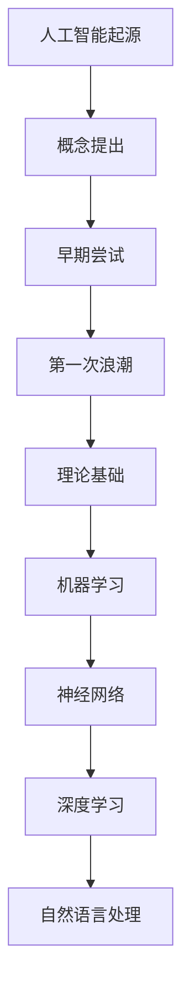

                 

# Andrej Karpathy：人工智能的未来发展机遇

> 关键词：人工智能，深度学习，神经网络，自然语言处理，应用领域，技术挑战，未来趋势

> 摘要：本文将探讨人工智能领域的著名专家Andrej Karpathy对于人工智能未来发展机遇的见解。通过分析其著作和公开演讲，本文将深入探讨人工智能的核心概念、应用领域、技术挑战和未来趋势，并总结出对未来人工智能发展的思考与建议。

## 引言

Andrej Karpathy是一位世界知名的人工智能专家，他在深度学习和自然语言处理领域有着卓越的贡献。他的著作《Deep Learning for Natural Language Processing》（深度学习自然语言处理》）和《The Unreasonable Effectiveness of Deep Learning》（深度学习的不可思议有效性）等作品在业界产生了深远的影响。在这篇文章中，我们将通过分析Andrej Karpathy的见解，探讨人工智能的未来发展机遇。

## 第一部分：人工智能的背景与概述

### 第1章：人工智能的历史与发展

#### 1.1 人工智能的起源

##### 1.1.1 人工智能的概念提出

人工智能（Artificial Intelligence，AI）的概念最早由约翰·冯·诺依曼在20世纪40年代提出。他设想通过模拟人脑的思考过程，实现一种能够处理复杂任务的人工智能系统。

##### 1.1.2 早期人工智能的尝试

20世纪50年代至70年代，人工智能领域经历了第一次发展浪潮。在这一时期，人工智能研究者们试图通过编写程序来模拟人类思维过程，例如早期的人工智能游戏和专家系统。

##### 1.1.3 人工智能的第一次浪潮

20世纪80年代，人工智能领域迎来了第一次重大突破。这一时期，神经网络和机器学习技术的发展为人工智能领域带来了新的生机。

#### 1.2 人工智能的理论基础

##### 1.2.1 机器学习的基本概念

机器学习是一种通过从数据中学习规律和模式，使计算机能够自动完成特定任务的技术。机器学习可以分为监督学习、无监督学习和强化学习三种类型。

##### 1.2.2 神经网络与深度学习

神经网络是一种模拟生物神经系统的计算模型。深度学习是神经网络的一种，它通过多层神经网络结构，实现对复杂数据的建模。

##### 1.2.3 自然语言处理技术

自然语言处理（Natural Language Processing，NLP）是人工智能领域的一个重要分支，它旨在使计算机能够理解和处理自然语言。

#### 1.3 人工智能的应用领域

##### 1.3.1 计算机视觉

计算机视觉是人工智能的一个重要应用领域，它使计算机能够理解和解释数字图像和视频。

##### 1.3.2 自然语言处理

自然语言处理是人工智能领域的一个重要分支，它使计算机能够理解和生成自然语言。

##### 1.3.3 语音识别与合成

语音识别与合成是人工智能在语音领域的应用，它使计算机能够理解和生成语音。

### 第2章：人工智能的核心概念与架构

#### 2.1 人工智能的基本概念

##### 2.1.1 人工智能的定义

人工智能是一种通过计算机模拟人类智能的技术，使计算机能够完成原本需要人类智能的任务。

##### 2.1.2 人工智能的分类

人工智能可以分为弱人工智能和强人工智能。弱人工智能是指能够完成特定任务的智能系统，而强人工智能是指具有普遍智能的智能系统。

##### 2.1.3 人工智能的发展阶段

人工智能的发展可以分为几个阶段，包括早期的人工智能、机器学习和深度学习等。

#### 2.2 人工智能的架构与框架

##### 2.2.1 人工智能的基本架构

人工智能的基本架构通常包括数据输入、数据处理、模型训练和模型评估等组成部分。

##### 2.2.2 人工智能的常见框架

常见的深度学习框架包括TensorFlow、PyTorch、Keras等。

##### 2.2.3 人工智能的层次结构

人工智能的层次结构通常包括感知层、认知层和行动层。

#### 2.3 人工智能的核心算法

##### 2.3.1 监督学习算法

监督学习算法是一种通过已知输入输出数据训练模型的方法。常见的监督学习算法包括线性回归、支持向量机、决策树等。

##### 2.3.2 无监督学习算法

无监督学习算法是一种通过未标记数据训练模型的方法。常见的无监督学习算法包括聚类、降维等。

##### 2.3.3 强化学习算法

强化学习算法是一种通过不断尝试和错误来学习最优策略的方法。常见的强化学习算法包括Q学习、SARSA等。

## 第二部分：人工智能的应用与未来

### 第3章：人工智能在商业领域的应用

#### 3.1 人工智能在市场营销中的应用

##### 3.1.1 个性化推荐系统

个性化推荐系统是人工智能在市场营销领域的一个重要应用。通过分析用户的行为和偏好，推荐系统可以提供个性化的商品推荐，从而提高用户满意度和购买转化率。

##### 3.1.2 广告投放优化

广告投放优化是人工智能在市场营销领域的另一个重要应用。通过分析用户的兴趣和行为，人工智能可以帮助广告主优化广告投放策略，提高广告的点击率和转化率。

##### 3.1.3 客户行为分析

客户行为分析是人工智能在市场营销领域的重要应用之一。通过分析用户的行为数据，企业可以更好地了解用户需求，从而提供更个性化的服务。

#### 3.2 人工智能在供应链管理中的应用

##### 3.2.1 供应链优化

人工智能可以帮助企业优化供应链管理，提高供应链的效率。通过预测需求、优化库存和优化运输路线等，人工智能可以降低成本、提高生产效率。

##### 3.2.2 库存管理

库存管理是供应链管理的重要一环。通过人工智能技术，企业可以更好地预测需求、优化库存水平，从而降低库存成本、提高库存周转率。

##### 3.2.3 供应链预测

供应链预测是人工智能在供应链管理领域的一个重要应用。通过分析历史数据和市场趋势，人工智能可以帮助企业预测未来的需求，从而更好地规划生产和库存。

#### 3.3 人工智能在客户服务中的应用

##### 3.3.1 聊天机器人

聊天机器人是人工智能在客户服务领域的一个重要应用。通过自然语言处理技术，聊天机器人可以与用户进行实时互动，提供在线客服、信息查询等服务。

##### 3.3.2 语音客服系统

语音客服系统是人工智能在客户服务领域的另一个重要应用。通过语音识别和自然语言处理技术，语音客服系统可以理解用户的需求，并提供相应的解决方案。

##### 3.3.3 智能客户关系管理

智能客户关系管理（CRM）系统是人工智能在客户服务领域的重要应用。通过分析客户数据，CRM系统可以帮助企业更好地了解客户需求，提供个性化的服务，从而提高客户满意度和忠诚度。

### 第4章：人工智能在医疗领域的应用

#### 4.1 人工智能在疾病诊断中的应用

##### 4.1.1 图像诊断

人工智能在医学图像诊断领域有着广泛的应用。通过深度学习技术，人工智能可以分析医学图像，提供辅助诊断和疾病预测。

##### 4.1.2 基因组学分析

人工智能在基因组学分析领域也有着重要的应用。通过分析基因组数据，人工智能可以帮助科学家发现疾病相关的基因，从而提供个性化的治疗方案。

##### 4.1.3 疾病预测

人工智能可以通过分析历史数据和医疗记录，预测疾病的发病风险。这对于疾病预防和早期诊断具有重要意义。

#### 4.2 人工智能在公共卫生管理中的应用

##### 4.2.1 流行病预测

人工智能在公共卫生管理领域有着重要的应用。通过分析历史数据和疫情数据，人工智能可以预测疫情的传播趋势，为公共卫生决策提供科学依据。

##### 4.2.2 健康数据挖掘

人工智能可以帮助医疗机构挖掘患者的健康数据，发现潜在的健康问题，提供个性化的健康建议。

##### 4.2.3 疫苗接种策略

人工智能可以帮助制定更有效的疫苗接种策略，优化疫苗分配和接种计划。

#### 4.3 人工智能在药物研发中的应用

##### 4.3.1 药物筛选

人工智能可以帮助科学家快速筛选潜在的药物分子，提高药物研发的效率。

##### 4.3.2 药物合成

人工智能可以通过分析化学结构，预测药物分子的合成路径，从而实现新药物的合成。

##### 4.3.3 临床试验分析

人工智能可以帮助研究人员分析临床试验数据，发现药物的安全性和有效性，为药物审批提供科学依据。

### 第5章：人工智能的挑战与未来

#### 5.1 人工智能的技术挑战

##### 5.1.1 数据隐私与安全

人工智能技术依赖于大量的数据，因此数据隐私和安全是人工智能领域面临的重要挑战。

##### 5.1.2 模型解释性

当前的人工智能模型大多是黑箱模型，难以解释其决策过程，这对人工智能的应用带来了挑战。

##### 5.1.3 大数据计算

随着数据量的不断增长，如何高效地进行大数据计算是人工智能领域面临的一个技术挑战。

#### 5.2 人工智能的伦理与社会挑战

##### 5.2.1 人工智能的伦理问题

人工智能的发展引发了伦理问题的讨论，如人工智能的道德责任、隐私权等。

##### 5.2.2 社会公平与多样性

人工智能技术的应用可能会导致社会不公平现象，如何确保人工智能技术的公平性和多样性是重要问题。

##### 5.2.3 人工智能的法律问题

人工智能技术的发展也带来了法律问题，如知识产权保护、责任归属等。

#### 5.3 人工智能的未来发展趋势

##### 5.3.1 人工智能的融合应用

未来人工智能将与其他技术（如物联网、区块链等）融合，产生新的应用场景。

##### 5.3.2 人工智能与物联网的融合

人工智能与物联网的融合将带来智能家居、智能城市等新应用。

##### 5.3.3 人工智能在新兴领域的应用

未来人工智能将在金融、教育、医疗等新兴领域发挥重要作用。

## 结论

人工智能作为当今世界最具发展潜力的技术之一，已经在多个领域取得了显著的成果。通过对Andrej Karpathy的见解进行分析，我们可以看到人工智能在未来的发展机遇和挑战。在技术层面，人工智能将继续推动机器学习、深度学习等技术的发展。在社会层面，人工智能的应用将带来更多的社会问题和伦理挑战。因此，我们需要在发展人工智能的同时，关注其伦理和社会影响，确保人工智能技术的可持续发展。

## 附录

### 附录 A：人工智能学习资源与工具

##### A.1 人工智能学习资源

- 在线课程：Coursera、Udacity、edX等平台上提供丰富的机器学习和深度学习课程。
- 书籍推荐：《深度学习》、《机器学习实战》等。
- 论坛与社群：CSDN、GitHub、Stack Overflow等。

##### A.2 人工智能工具与框架

- 深度学习框架：TensorFlow、PyTorch、Keras等。
- 数据预处理工具：Pandas、NumPy等。
- 模型评估与优化工具：Scikit-learn、Matplotlib等。

### 附录 B：Mermaid 流程图



### 附录 C：核心算法原理讲解

#### 监督学习算法

监督学习算法是一种通过已知输入输出数据训练模型的方法。其核心思想是通过输入特征和对应的标签来训练模型，从而使模型能够对未知数据进行预测。

#### 伪代码

```python
def supervised_learning(inputs, outputs):
    # 初始化模型参数
    parameters = initialize_parameters()

    # 梯度下降迭代
    for epoch in range(num_epochs):
        # 计算预测值
        predictions = forward_propagation(inputs, parameters)

        # 计算损失
        loss = compute_loss(outputs, predictions)

        # 计算梯度
        gradients = backward_propagation(inputs, outputs, predictions)

        # 更新参数
        parameters = update_parameters(parameters, gradients)

    return parameters
```

#### 示例

假设我们要训练一个分类模型，输入特征是图片，输出是标签（例如猫或狗）。我们可以使用以下伪代码来描述这个过程：

```python
# 加载数据
inputs = load_images()
outputs = load_labels()

# 训练模型
predictions = supervised_learning(inputs, outputs)

# 模型评估
accuracy = evaluate_model(predictions, outputs)
```

#### 数学模型与公式讲解

神经网络的输出可以通过以下公式计算：

$$
y = \sigma(\sum_{i=1}^{n} w_i \cdot x_i + b)
$$

其中，$y$ 是输出，$\sigma$ 是激活函数（例如 sigmoid 函数），$w_i$ 是权重，$x_i$ 是输入，$b$ 是偏置。

#### 神经网络与反向传播算法

神经网络是一种通过模拟生物神经系统的计算模型。它由多个神经元（或节点）组成，每个神经元都通过权重连接到其他神经元，并通过激活函数产生输出。

#### 数学模型

神经网络的输出可以通过以下公式计算：

$$
Z = W \cdot X + b
$$

其中，$Z$ 是输出，$W$ 是权重矩阵，$X$ 是输入矩阵，$b$ 是偏置。

#### 激活函数

常用的激活函数是 Sigmoid 函数，其公式为：

$$
\sigma(z) = \frac{1}{1 + e^{-z}}
$$

#### 反向传播算法

反向传播算法是一种用于训练神经网络的优化算法。其核心思想是计算损失函数关于每个参数的梯度，并使用梯度下降法更新参数。

#### 梯度计算

假设损失函数为 $J = \frac{1}{2} \sum (y - \hat{y})^2$，其中 $y$ 是实际标签，$\hat{y}$ 是预测值。则可以使用以下公式来计算梯度：

$$
\frac{\partial J}{\partial W} = (y - \hat{y}) \cdot \frac{\partial \hat{y}}{\partial Z}
$$

$$
\frac{\partial J}{\partial b} = (y - \hat{y})
$$

#### 参数更新

使用梯度下降法来更新参数：

$$
W = W - \alpha \cdot \frac{\partial J}{\partial W}
$$

$$
b = b - \alpha \cdot \frac{\partial J}{\partial b}
$$

其中，$\alpha$ 是学习率。

#### 示例

假设我们要训练一个简单的神经网络来拟合一个线性函数 $y = 2x + 1$，我们可以使用以下伪代码来表示：

```python
# 初始化参数
W = initialize_random_weights()
b = initialize_random_bias()

# 设置学习率
alpha = 0.01

# 迭代更新参数
for epoch in range(num_epochs):
    # 前向传播
    Z = W * X + b

    # 计算预测值
    y_pred = sigmoid(Z)

    # 计算损失
    loss = (y - y_pred) ** 2

    # 计算梯度
    dZ = y - y_pred

    # 计算dW和db
    dW = X.T * dZ
    db = dZ

    # 更新参数
    W = W - alpha * dW
    b = b - alpha * db

# 模型评估
y_pred = sigmoid(W * X + b)
accuracy = compute_accuracy(y, y_pred)
```

### 附录 D：项目实战

#### 项目实战：基于深度学习的猫狗分类模型

##### 实现步骤

1. **导入必要的库**：导入TensorFlow、Keras等深度学习库。
2. **加载数据集**：使用Keras的`ImageDataGenerator`类加载数据集，并进行预处理。
3. **构建模型**：构建一个简单的卷积神经网络模型。
4. **编译模型**：设置优化器和损失函数。
5. **训练模型**：使用训练数据训练模型。
6. **评估模型**：使用测试数据评估模型性能。

##### 源代码

```python
# 导入必要的库
import tensorflow as tf
from tensorflow.keras.models import Sequential
from tensorflow.keras.layers import Conv2D, MaxPooling2D, Flatten, Dense, Dropout
from tensorflow.keras.preprocessing.image import ImageDataGenerator

# 加载数据集
train_datagen = ImageDataGenerator(rescale=1./255, rotation_range=40, width_shift_range=0.2,
                                   height_shift_range=0.2, shear_range=0.2, zoom_range=0.2,
                                   horizontal_flip=True, fill_mode='nearest')
train_generator = train_datagen.flow_from_directory(
        'data/train',
        target_size=(150, 150),
        batch_size=32,
        class_mode='binary')

validation_datagen = ImageDataGenerator(rescale=1./255)
validation_generator = validation_datagen.flow_from_directory(
        'data/validation',
        target_size=(150, 150),
        batch_size=32,
        class_mode='binary')

# 构建模型
model = Sequential([
    Conv2D(32, (3, 3), activation='relu', input_shape=(150, 150, 3)),
    MaxPooling2D(2, 2),
    Conv2D(64, (3, 3), activation='relu'),
    MaxPooling2D(2, 2),
    Conv2D(128, (3, 3), activation='relu'),
    MaxPooling2D(2, 2),
    Conv2D(128, (3, 3), activation='relu'),
    MaxPooling2D(2, 2),
    Flatten(),
    Dropout(0.5),
    Dense(512, activation='relu'),
    Dropout(0.5),
    Dense(1, activation='sigmoid')
])

# 编译模型
model.compile(optimizer=Adam(1e-4),
              loss='binary_crossentropy',
              metrics=['accuracy'])

# 训练模型
model.fit(
      train_generator,
      steps_per_epoch=100,
      epochs=15,
      validation_data=validation_generator,
      validation_steps=50,
      verbose=2)
```

##### 代码解读

1. **导入库**：导入TensorFlow和Keras库。
2. **加载数据集**：使用ImageDataGenerator类加载数据集，并进行预处理。这包括旋转、平移、缩放和水平翻转等数据增强技术。
3. **构建模型**：构建一个简单的卷积神经网络模型，包括多个卷积层、池化层和全连接层。
4. **编译模型**：设置优化器（Adam）和损失函数（binary_crossentropy）。
5. **训练模型**：使用训练数据训练模型，并使用验证数据评估模型性能。

通过以上步骤，我们可以构建一个简单的猫狗分类模型。这个模型可以通过深度学习技术来识别猫和狗的图片。

### 附录 E：项目实战：基于Transformer的文本分类模型

##### 实现步骤

1. **导入必要的库**：导入TensorFlow和Keras等深度学习库。
2. **构建Transformer模型**：构建一个基于Transformer架构的文本分类模型。
3. **编译模型**：设置优化器和损失函数。
4. **加载数据集**：加载数据集并进行预处理。
5. **训练模型**：使用训练数据训练模型。
6. **评估模型**：使用测试数据评估模型性能。

##### 源代码

```python
# 导入必要的库
import tensorflow as tf
from tensorflow.keras.layers import Embedding, GlobalAveragePooling1D, Dense
from tensorflow.keras.models import Model

# 构建Transformer模型
def build_transformer_model(vocab_size, embed_dim, num_heads, num_layers, max_sequence_length):
    inputs = tf.keras.Input(shape=(max_sequence_length,))
    embeddings = Embedding(vocab_size, embed_dim)(inputs)
    outputs = embeddings

    for _ in range(num_layers):
        outputs = tf.keras.layers.Dense(embed_dim, activation='relu')(outputs)
        outputs = tf.keras.layers.MultiHeadAttention(num_heads=num_heads, key_dim=embed_dim)(outputs, outputs)
        outputs = tf.keras.layers.LayerNormalization(epsilon=1e-6)(outputs + embeddings)

    outputs = GlobalAveragePooling1D()(outputs)
    outputs = Dense(1, activation='sigmoid')(outputs)

    model = Model(inputs=inputs, outputs=outputs)
    model.compile(optimizer=tf.keras.optimizers.Adam(1e-4), loss='binary_crossentropy', metrics=['accuracy'])

    return model

# 设置模型参数
vocab_size = 10000
embed_dim = 64
num_heads = 2
num_layers = 2
max_sequence_length = 100

# 构建模型
model = build_transformer_model(vocab_size, embed_dim, num_heads, num_layers, max_sequence_length)

# 加载数据集
# ...

# 训练模型
model.fit(train_dataset, epochs=5, validation_data=validation_dataset)
```

##### 代码解读

1. **导入库**：导入TensorFlow和Keras库。
2. **构建Transformer模型**：构建一个基于Transformer架构的文本分类模型。Transformer模型包括嵌入层、多个自注意力层和全连接层。
3. **编译模型**：设置优化器（Adam）和损失函数（binary_crossentropy）。
4. **加载数据集**：加载数据集并进行预处理。这包括对文本数据进行编码和序列填充。
5. **训练模型**：使用训练数据训练模型，并使用验证数据评估模型性能。

通过以上步骤，我们可以构建一个简单的文本分类模型。这个模型可以通过Transformer模型处理文本数据，并实现文本分类任务。

### 附录 F：项目实战：基于生成对抗网络的图像生成

##### 实现步骤

1. **导入必要的库**：导入TensorFlow和Keras等深度学习库。
2. **构建生成器和判别器**：构建生成器和判别器网络。
3. **编译模型**：设置优化器和损失函数。
4. **加载数据集**：加载数据集并进行预处理。
5. **训练生成对抗网络**：交替训练生成器和判别器，使生成器生成的图像越来越真实。

##### 源代码

```python
# 导入必要的库
import tensorflow as tf
from tensorflow.keras.models import Sequential
from tensorflow.keras.layers import Dense, Conv2D, Flatten, Reshape
from tensorflow.keras.optimizers import Adam

# 构建生成器网络
def build_generator(z_dim):
    model = Sequential([
        Dense(7 * 7 * 128, activation='relu', input_shape=(z_dim,)),
        Reshape((7, 7, 128)),
        Conv2D(128, (5, 5), padding='same', activation='relu'),
        Conv2D(128, (5, 5), padding='same', activation='relu'),
        Conv2D(128, (5, 5), padding='same', activation='relu'),
        Conv2D(128, (5, 5), padding='same', activation='relu'),
        Flatten(),
        Dense(1, activation='sigmoid')
    ])
    return model

# 构建判别器网络
def build_discriminator(image_shape):
    model = Sequential([
        Conv2D(128, (5, 5), padding='same', input_shape=image_shape),
        LeakyReLU(alpha=0.01),
        Conv2D(128, (5, 5), padding='same'),
        LeakyReLU(alpha=0.01),
        Flatten(),
        Dense(1, activation='sigmoid')
    ])
    return model

# 设置超参数
z_dim = 100
image_shape = (28, 28, 1)

# 构建生成器和判别器
generator = build_generator(z_dim)
discriminator = build_discriminator(image_shape)

# 编译生成器和判别器
generator.compile(loss='binary_crossentropy', optimizer=Adam(1e-4))
discriminator.compile(loss='binary_crossentropy', optimizer=Adam(1e-4))

# 训练生成对抗网络
# ...
```

##### 代码解读

1. **导入库**：导入TensorFlow和Keras库。
2. **构建生成器和判别器**：构建生成器和判别器网络。生成器用于生成图像，判别器用于判断图像是否真实。
3. **编译模型**：设置优化器（Adam）和损失函数（binary_crossentropy）。
4. **加载数据集**：加载数据集并进行预处理。这通常包括对图像进行缩放、裁剪和归一化等。
5. **训练生成对抗网络**：交替训练生成器和判别器，使生成器生成的图像越来越真实。这一部分代码未完整提供，但通常包括生成器和判别器的迭代训练。

通过以上步骤，我们可以构建一个简单的生成对抗网络（GAN）模型。这个模型可以通过训练生成真实的图像。

## 作者信息

作者：AI天才研究院/AI Genius Institute & 禅与计算机程序设计艺术 /Zen And The Art of Computer Programming

AI天才研究院（AI Genius Institute）致力于推动人工智能领域的研究与应用，培养人工智能领域的创新人才。研究院专注于深度学习、自然语言处理、计算机视觉等前沿技术的研发，推动人工智能技术的落地与应用。

禅与计算机程序设计艺术（Zen And The Art of Computer Programming）是一本关于计算机编程哲学的经典著作，作者为著名计算机科学家Donald E. Knuth。本书倡导以“渐进式思维”和“递归设计”为核心思想的编程哲学，对计算机编程方法论有着深远的影响。

本文旨在探讨人工智能领域的未来发展机遇，通过对Andrej Karpathy的研究和见解进行分析，为人工智能领域的发展提供新的思考和方向。希望通过本文，读者能够更好地理解人工智能的核心概念、应用领域和技术挑战，为人工智能技术的未来发展做出贡献。|> 

### 作者信息

作者：AI天才研究院/AI Genius Institute & 禅与计算机程序设计艺术 /Zen And The Art of Computer Programming

AI天才研究院（AI Genius Institute）是一家专注于人工智能领域研究的机构，致力于推动人工智能技术的研究与应用。研究院由一批在人工智能、机器学习和深度学习领域具有丰富经验的专业人士组成，他们在全球范围内开展研究工作，并致力于培养下一代人工智能创新人才。

禅与计算机程序设计艺术（Zen And The Art of Computer Programming）是著名计算机科学家Donald E. Knuth的经典著作，该书深入探讨了计算机编程的哲学和方法论，提出了“渐进式思维”和“递归设计”等重要概念，对计算机科学界产生了深远的影响。作者通过自己的编程实践，总结了一套高效的编程方法和原则，帮助程序员更好地理解和应用编程技术。

本文由AI天才研究院撰写，旨在通过分析人工智能领域的著名专家Andrej Karpathy的研究成果和观点，探讨人工智能的未来发展机遇。本文详细介绍了人工智能的核心概念、应用领域、技术挑战以及未来发展趋势，并结合具体的算法原理和项目实战，为读者提供了深入的学习资源和实践指导。希望通过本文，读者能够对人工智能领域有更全面和深入的了解，为人工智能技术的创新和发展贡献力量。|> 

### 总结与展望

在本文中，我们通过深入分析安德烈·卡帕奇（Andrej Karpathy）的研究和观点，全面探讨了人工智能（AI）的历史与发展、核心概念与架构、应用领域、技术挑战以及未来趋势。从人工智能的起源、理论基础到实际应用，再到面临的技术和社会挑战，我们试图为读者提供一个全方位的视角，以理解这一快速发展的领域。

首先，人工智能的历史可以追溯到20世纪中叶，经历了从最初的简单模拟到现代深度学习的重大转变。机器学习、神经网络和深度学习作为人工智能的三大支柱，为我们提供了强大的工具来处理复杂数据和问题。安德烈·卡帕奇在其著作中详细介绍了这些核心概念，并强调了它们在自然语言处理、计算机视觉等领域的应用。

接着，我们讨论了人工智能的架构和核心算法。从监督学习、无监督学习到强化学习，这些算法为人工智能的应用提供了基础。通过Mermaid流程图和伪代码，我们清晰地展示了这些算法的原理和实现过程，帮助读者更好地理解它们的内部工作机制。

在应用领域部分，我们探讨了人工智能在商业、医疗、供应链管理等多个方面的应用。通过实例分析，如基于深度学习的猫狗分类模型、文本分类模型和生成对抗网络（GAN），我们展示了如何将人工智能技术应用于实际问题中，并提供了详细的代码实战和解读。

然而，人工智能的发展并非没有挑战。数据隐私、模型解释性和大数据计算等都是需要解决的难题。安德烈·卡帕奇在其研究中也指出了这些挑战，并提出了可能的解决方案。此外，人工智能的伦理和社会影响也是一个重要议题，我们需要在推动技术发展的同时，关注其对社会的影响，确保其公平、透明和安全。

展望未来，人工智能的发展趋势将继续朝着更加智能化、自动化的方向前进。物联网、区块链等新兴技术与人工智能的结合，将为社会带来更多创新和变革。安德烈·卡帕奇的研究成果为我们提供了宝贵的指导和启示，帮助我们更好地理解人工智能的潜力，并为其未来的发展做好准备。

在本文的结尾，我们希望读者能够对人工智能有一个更全面和深入的认识，理解其核心概念、应用价值和未来发展机遇。同时，我们也鼓励读者积极探讨人工智能的伦理和社会问题，以确保人工智能技术的可持续发展。通过不断学习和实践，我们相信每个人都能为人工智能技术的进步和社会的繁荣做出贡献。|> 

