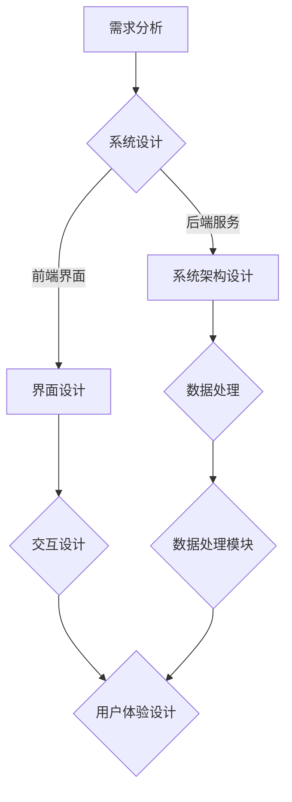
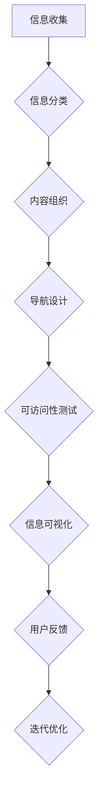
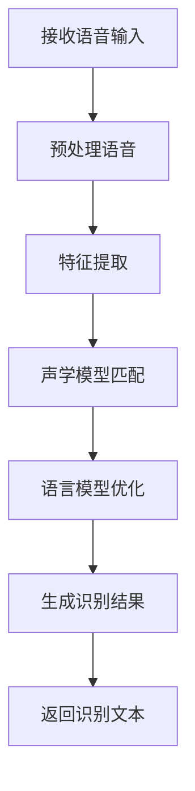
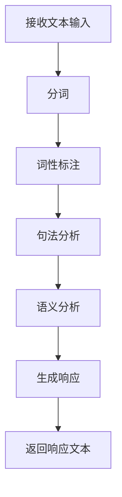

                 

### 文章标题

《CUI对信息架构设计的深远详细影响》

CUI，即计算机用户界面（Computer User Interface），作为人工智能技术的重要组成部分，正在逐渐改变人们与计算机的互动方式。信息架构设计，作为软件工程中的核心环节，负责组织和管理信息，确保用户能够高效地找到和使用信息。本文将深入探讨CUI如何对信息架构设计产生深远的影响，旨在帮助读者理解CUI在信息架构设计中的重要性，以及如何在实际项目中应用这些原则。

本文关键词包括：CUI、信息架构设计、用户界面、人工智能、交互设计、用户体验。

文章摘要：
本文首先介绍了CUI的基本概念、发展历程及其与信息架构设计的联系。接着，详细阐述了CUI设计的基本原则和技术实现，以及CUI在信息架构设计中的应用和实践案例。最后，本文探讨了CUI面临的挑战及其解决方案，并展望了CUI未来的发展前景。

### 《CUI对信息架构设计的深远详细影响》目录大纲

#### 第一部分：CUI概述与背景

**第1章：CUI的概念与意义**

- **1.1 CUI的定义与分类**
- **1.2 CUI的应用领域**
- **1.3 CUI与信息架构设计的联系**

**第2章：CUI的发展历程**

- **2.1 从传统UI到CUI的演变**
- **2.2 国内外CUI发展现状**
- **2.3 CUI的未来发展趋势**

#### 第二部分：CUI的设计原则与实现

**第3章：CUI设计的基本原则**

- **3.1 用户中心设计**
- **3.2 交互设计原则**
- **3.3 用户体验设计**

**第4章：CUI的技术实现**

- **4.1 语音识别技术**
- **4.2 自然语言处理**
- **4.3 语音合成技术**

**第5章：CUI在信息架构设计中的应用**

- **5.1 信息架构概述**
- **5.2 CUI对信息架构的影响**
- **5.3 CUI在信息架构设计中的实践案例**

#### 第三部分：CUI项目实战

**第6章：CUI项目开发流程**

- **6.1 CUI项目需求分析**
- **6.2 CUI项目设计**
- **6.3 CUI项目实施**

**第7章：CUI项目实战案例**

- **7.1 案例一：智能客服系统**
- **7.2 案例二：智能语音助手**
- **7.3 案例三：智能家居控制系统**

#### 第四部分：CUI面临的挑战与解决方案

**第8章：CUI面临的挑战**

- **8.1 技术挑战**
- **8.2 用户体验挑战**
- **8.3 法律和伦理挑战**

**第9章：CUI的解决方案与发展方向**

- **9.1 技术创新方向**
- **9.2 用户体验优化**
- **9.3 法律和伦理问题解决策略**

#### 附录

**附录A：CUI开发工具与资源**

- **A.1 主流CUI开发工具介绍**
- **A.2 CUI开发资源推荐**

**附录B：CUI相关的Mermaid流程图**

- **B.1 CUI开发流程图**
- **B.2 信息架构设计流程图**

**附录C：CUI相关算法的伪代码示例**

- **C.1 语音识别算法伪代码**
- **C.2 自然语言处理算法伪代码**

**附录D：数学模型与公式**

- **D.1 语音识别中的数学模型**
- **D.2 自然语言处理中的数学模型**

**附录E：CUI项目实战案例代码解读**

- **E.1 案例一代码解读**
- **E.2 案例二代码解读**
- **E.3 案例三代码解读**

### 后记

**后记：CUI的未来发展展望**

- **后记一：CUI在未来的广泛应用前景**
- **后记二：CUI对信息架构设计的深远影响**

通过这个目录大纲，读者可以清晰地了解文章的结构和内容，逐步深入理解CUI对信息架构设计的深远影响。接下来的章节将详细讨论CUI的基本概念、设计原则、技术应用、项目实战以及面临的挑战和解决方案。

## 第一部分：CUI概述与背景

### 第1章：CUI的概念与意义

#### 1.1 CUI的定义与分类

计算机用户界面（CUI）是用户与计算机系统之间交互的桥梁，它包括所有用户可以看到和与之交互的界面元素。CUI的核心目的是提供直观、易用的交互体验，使用户能够高效地完成操作任务。

CUI可以按照交互方式分为以下几类：

1. **图形用户界面（GUI）**：使用图形元素（如图标、按钮、窗口等）进行交互，是最常见的CUI形式。
2. **命令行界面（CLI）**：通过输入命令来与计算机系统交互，需要用户具备一定的编程知识。
3. **触摸用户界面（TUI）**：专门为触摸屏设备设计，如智能手机和平板电脑。
4. **语音用户界面（VUI）**：通过语音交互实现人与计算机的沟通，如智能语音助手。

#### 1.2 CUI的应用领域

CUI在多个领域都有广泛的应用，以下是一些主要的应用领域：

1. **消费电子**：智能手机、平板电脑、智能手表等消费电子设备广泛采用图形用户界面。
2. **嵌入式系统**：如汽车信息系统、医疗设备等，常采用图形用户界面或触摸用户界面。
3. **服务行业**：如智能客服系统、语音导航等，通过CUI提供便捷的用户服务。
4. **智能家居**：智能音箱、智能门锁、智能照明等设备，通过CUI实现家居自动化。
5. **游戏娱乐**：游戏设备、VR/AR体验等，通过丰富的用户界面设计提升用户体验。

#### 1.3 CUI与信息架构设计的联系

信息架构设计（Information Architecture, IA）是软件工程中一个重要的环节，它关注如何组织、结构和呈现信息，以帮助用户找到和使用信息。CUI与信息架构设计紧密相关，两者的联系主要体现在以下几个方面：

1. **交互设计**：CUI决定了用户如何与信息架构中的内容进行交互，信息架构需要考虑CUI的特点进行优化。
2. **用户体验**：良好的信息架构设计可以提高用户体验，而CUI则是实现用户体验的关键环节。
3. **内容组织**：信息架构设计需要根据用户的认知习惯和需求，将信息组织成易于理解和操作的结构，CUI需要与之匹配，以提供一致的视觉和交互体验。
4. **可访问性**：信息架构设计需要确保信息对所有人可访问，CUI需要支持不同的交互方式，以满足不同用户的需求。

通过了解CUI的基本概念和应用领域，以及它与信息架构设计的紧密联系，我们可以更好地认识到CUI在现代信息技术中的重要性。接下来，我们将进一步探讨CUI的发展历程，以便更好地理解其演变和未来趋势。

#### 第2章：CUI的发展历程

##### 2.1 从传统UI到CUI的演变

计算机用户界面的发展经历了从传统UI（如命令行界面CLI）到现代CUI（如图形用户界面GUI和语音用户界面VUI）的演变。这个演变过程反映了技术进步和用户需求的变化。

在早期的计算机时代，用户主要通过与命令行界面进行交互。CLI界面通过文本命令和参数来控制计算机系统，这种交互方式要求用户具备一定的编程知识和技术背景。CLI的优点在于其高效性和灵活性，但缺点是学习曲线陡峭，用户体验较差。

随着计算机技术的发展和个人计算机的普及，图形用户界面（GUI）逐渐取代了CLI成为主流。GUI使用图形元素（如图标、按钮、菜单等）来代替文本命令，使计算机操作变得更加直观和易用。代表性的GUI系统包括苹果公司的Mac OS和微软公司的Windows。GUI的出现极大地提高了用户的生产力和满意度，为计算机的普及和广泛应用奠定了基础。

进入21世纪，随着移动互联网和智能设备的兴起，用户交互方式进一步多样化。触摸用户界面（TUI）和语音用户界面（VUI）开始崭露头角。TUI为触摸屏设备提供了直观的交互方式，如智能手机和平板电脑。VUI则通过语音识别和语音合成技术，使用户能够通过语音与计算机进行自然交互。代表性的VUI产品包括苹果公司的Siri、亚马逊的Alexa以及谷歌助手。

从传统UI到CUI的演变，不仅体现了技术进步，还反映了用户需求的不断变化。随着人工智能技术的快速发展，CUI将变得更加智能和个性化，满足用户更加多样化的需求。

##### 2.2 国内外CUI发展现状

在国内，CUI的发展同样迅速。随着互联网的普及和智能家居、智能客服等应用的兴起，越来越多的企业和机构开始重视CUI设计。国内的智能手机、智能家居设备以及智能语音助手等产品，逐渐采用更加智能和人性化的用户界面。代表性的国内CUI产品包括小米的智能家居系统、华为的HarmonyOS以及百度的度秘。

在国际上，CUI技术也取得了显著的发展。美国的苹果、谷歌和亚马逊等科技巨头，都在CUI领域进行了大量投入和研发。苹果的iOS和macOS系统，谷歌的Android系统以及亚马逊的Alexa，都是CUI技术的代表性产品。此外，微软的Windows操作系统和微软小冰等人工智能产品，也在全球范围内得到了广泛应用。

全球范围内，CUI技术的发展呈现出以下趋势：

1. **智能化**：CUI逐渐融合人工智能技术，实现更智能的交互体验，如语音识别、自然语言处理和个性化推荐等。
2. **个性化**：CUI根据用户的行为和偏好，提供个性化的交互体验，如智能客服系统的个性化推荐和智能语音助手的语音识别优化。
3. **多模态**：CUI支持多种交互方式，如触摸、语音、手势等，提供更加灵活和便捷的交互体验。

##### 2.3 CUI的未来发展趋势

展望未来，CUI的发展将继续受到技术进步和用户需求变化的推动。以下是CUI未来可能的发展趋势：

1. **更加智能**：随着人工智能技术的不断进步，CUI将变得更加智能和自动化，能够更好地理解用户意图并实现复杂任务。
2. **更加个性化**：CUI将根据用户的行为和偏好，提供更加个性化的交互体验，满足用户多样化的需求。
3. **跨平台融合**：CUI将实现跨平台融合，支持多种设备和操作系统的无缝交互，提供统一的用户体验。
4. **多模态交互**：CUI将支持多种交互方式，如语音、手势、眼动等，提供更加灵活和自然的交互体验。
5. **可访问性**：CUI将更加注重可访问性，确保所有用户，包括残疾人和老年人，都能够使用CUI进行有效的交互。

通过了解CUI的发展历程和现状，以及未来发展趋势，我们可以更好地把握CUI在信息架构设计中的重要性和应用前景。接下来，我们将深入探讨CUI设计的基本原则和技术实现，以了解如何构建高效和用户体验良好的CUI。

#### 第3章：CUI设计的基本原则

##### 3.1 用户中心设计

用户中心设计（User-Centered Design，UCD）是CUI设计的核心原则之一。其核心理念是以用户的需求和体验为中心，确保CUI的设计满足用户的实际需求。以下是一些关键步骤和最佳实践：

1. **用户研究**：通过用户访谈、问卷调查、用户行为分析等方法，深入了解用户的需求、行为和偏好。这一步骤有助于明确用户的核心需求和痛点。
2. **用户角色**：创建用户角色（User Personas），代表目标用户群体的典型特征，用于指导设计决策。用户角色可以帮助设计师站在用户的角度思考问题。
3. **原型设计**：制作CUI的原型，通过低保真或高保真的设计，模拟用户交互流程，收集用户反馈，不断迭代和优化设计。
4. **可用性测试**：进行可用性测试（Usability Testing），让真实用户在使用CUI过程中提供反馈，评估设计的易用性和用户体验。

最佳实践：
- **持续用户反馈**：设计过程中要持续收集用户反馈，及时进行调整和优化。
- **迭代设计**：通过多次迭代，逐步完善CUI设计，避免一次性设计导致的问题。

##### 3.2 交互设计原则

交互设计（Interaction Design，IxD）关注用户与CUI之间的交互流程和交互体验。以下是一些关键原则：

1. **一致性**：确保CUI在不同设备和平台上的交互体验一致，避免用户在不同环境下产生困惑。
2. **简洁性**：设计应尽可能简洁，减少用户的认知负荷，避免复杂的操作步骤。
3. **直观性**：界面元素和操作流程应直观易懂，使用户能够迅速掌握CUI的使用方法。
4. **反馈机制**：提供及时和明确的反馈，使用户了解其操作结果，增强用户信心和安全感。
5. **响应速度**：CUI的响应速度应尽可能快，减少用户的等待时间，提高交互效率。

最佳实践：
- **界面元素和操作流程的简化**：通过简化界面元素和操作流程，降低用户的操作成本。
- **交互提示**：提供交互提示，帮助用户理解如何使用CUI。

##### 3.3 用户体验设计

用户体验设计（User Experience Design，UXD）关注用户在整个使用周期中的感受和体验。以下是一些关键原则：

1. **情感设计**：考虑用户的情感需求，通过视觉元素、声音、动画等手段，提升用户的情感体验。
2. **隐私保护**：确保用户的隐私得到有效保护，避免数据泄露和滥用。
3. **可访问性**：设计应考虑所有用户，包括残疾人、老年人等，确保CUI对所有用户可访问。
4. **可持续性**：设计应考虑环境保护和资源可持续性，减少能源消耗和碳排放。
5. **可持续性**：通过设计持续优化和改进，不断提升用户体验。

最佳实践：
- **情感化设计**：通过情感化设计，提升用户的情感连接和品牌忠诚度。
- **用户调研**：定期进行用户调研，了解用户的需求和期望，及时调整和优化设计。

通过遵循用户中心设计、交互设计原则和用户体验设计，可以构建一个高效、易用、用户满意的CUI。接下来，我们将探讨CUI的技术实现，了解语音识别、自然语言处理和语音合成等关键技术如何支持CUI的设计和实现。

#### 第4章：CUI的技术实现

CUI的实现依赖于多种先进技术的结合，包括语音识别、自然语言处理和语音合成等。这些技术共同构成了CUI的“智能大脑”，使其能够理解和响应用户的指令，提供个性化的交互体验。

##### 4.1 语音识别技术

语音识别技术（Speech Recognition Technology）是CUI的核心组成部分，负责将用户的语音输入转换为计算机可以理解和处理的数据。以下是语音识别技术的几个关键方面：

1. **语音输入处理**：语音识别系统首先对用户的语音输入进行预处理，包括消除噪音、调整音量、分割语音段等，以确保语音信号的清晰度和准确性。
2. **声学模型**：声学模型用于对语音信号进行特征提取，将声波转换为频谱特征，如Mel频率倒谱系数（MFCC）等。这些特征用于表示语音信号的不同音素和音节。
3. **语言模型**：语言模型用于理解语音输入的语义内容，通常是基于统计模型或神经网络模型。语言模型可以根据上下文信息，对识别结果进行优化和纠正。
4. **识别算法**：常见的语音识别算法包括隐马尔可夫模型（HMM）、高斯混合模型（GMM）、深度神经网络（DNN）和循环神经网络（RNN）等。这些算法通过匹配声学模型和语言模型，生成最终的识别结果。

**伪代码示例**：

```
// 语音识别算法伪代码
function speechRecognition(voiceInput):
    preprocessVoiceInput(voiceInput)
    features = extractAcousticFeatures(voiceInput)
    hypothesis = acousticModel.predict(features)
    sentence = languageModel.generateSentence(hypothesis)
    return sentence
```

**数学模型示例**：

在语音识别中，常用的数学模型包括隐马尔可夫模型（HMM）和深度神经网络（DNN）。以下是HMM的数学模型：

$$
P(O|A) = \prod_{t=1}^{T} P(o_t|a_t)
$$

其中，$O$代表观察序列，$A$代表隐藏状态序列，$o_t$和$a_t$分别代表第$t$个时刻的观察值和隐藏状态。

##### 4.2 自然语言处理

自然语言处理（Natural Language Processing，NLP）是CUI技术的另一重要组成部分，负责理解用户输入的语义内容，并生成合理的响应。以下是NLP的关键方面：

1. **分词**：将用户输入的文本分割成单词或词组，以便进行进一步处理。
2. **词性标注**：识别文本中每个单词的词性（如名词、动词、形容词等），以帮助理解语义结构。
3. **句法分析**：分析句子的语法结构，如主语、谓语、宾语等，以理解句子的语义。
4. **语义分析**：理解文本的整体语义内容，识别用户的需求和意图。
5. **语言生成**：根据语义分析结果，生成合理的文本响应。

**伪代码示例**：

```
// 自然语言处理算法伪代码
function naturalLanguageProcessing(textInput):
    words = tokenize(textInput)
    partsOfSpeech = tagPartsOfSpeech(words)
    syntaxTree = parseSyntax(words, partsOfSpeech)
    semantics = analyzeSemantics(syntaxTree)
    response = generateResponse(semantics)
    return response
```

**数学模型示例**：

在NLP中，常用的数学模型包括条件随机场（CRF）和循环神经网络（RNN）。以下是CRF的数学模型：

$$
P(y|x) = \frac{1}{Z(x)} \exp(\theta \cdot y)
$$

其中，$x$代表输入特征向量，$y$代表标签序列，$\theta$是模型参数，$Z(x)$是规范化常数。

##### 4.3 语音合成技术

语音合成技术（Text-to-Speech，TTS）负责将文本转换为自然流畅的语音输出，是CUI的重要组成部分。以下是语音合成技术的关键方面：

1. **文本处理**：将输入文本进行预处理，如去除标点符号、调整文本格式等，以便进行语音合成。
2. **音素转换**：将文本转换为音素序列，音素是语音的基本单元。
3. **声学建模**：使用声学模型生成与音素序列相对应的语音波形。
4. **语音合成**：将生成的语音波形转换为音频文件，输出给用户。

**伪代码示例**：

```
// 语音合成算法伪代码
function textToSpeech(textInput):
    processedText = preprocessText(textInput)
    phonemes = convertToPhonemes(processedText)
    audioWaveform = acousticModel.generateWaveform(phonemes)
    audioFile = convertWaveformToAudio(audioWaveform)
    return audioFile
```

**数学模型示例**：

在语音合成中，常用的数学模型包括隐藏马尔可夫模型（HMM）和高斯混合模型（GMM）。以下是HMM的数学模型：

$$
P(x|\theta) = \prod_{t=1}^{T} a_{ij} b_{j}(x_t|\theta)
$$

其中，$x$代表语音信号，$\theta$是模型参数，$a_{ij}$是状态转移概率，$b_{j}(x_t|\theta)$是状态发射概率。

通过以上技术实现的语音识别、自然语言处理和语音合成，CUI能够实现高效的语音交互。接下来，我们将探讨CUI在信息架构设计中的应用，了解如何利用这些技术优化信息架构设计，提升用户体验。

#### 第5章：CUI在信息架构设计中的应用

##### 5.1 信息架构概述

信息架构设计（Information Architecture, IA）是软件工程中一个关键的环节，它关注如何组织、管理和呈现信息，使用户能够高效地找到和使用信息。信息架构涉及多个方面，包括信息分类、导航设计、内容组织等。以下是信息架构设计的基本要素：

1. **信息分类**：将信息按照一定的逻辑关系进行分类，有助于用户快速定位所需信息。
2. **导航设计**：设计直观、易用的导航系统，帮助用户在不同信息层级之间进行切换。
3. **内容组织**：合理组织内容，确保用户能够按照需求顺序访问信息。
4. **可访问性**：确保信息架构对所有人可访问，包括残疾人和老年人。
5. **可扩展性**：设计应具备良好的扩展性，能够适应未来信息量的增长和变化。

##### 5.2 CUI对信息架构的影响

CUI（Computer User Interface）通过引入智能交互方式，对信息架构设计产生了深远的影响。以下是一些关键影响：

1. **交互方式的多样化**：CUI提供了多种交互方式，如语音、触摸、手势等，使得用户能够根据自身需求和偏好选择最合适的交互方式，提高了交互效率和用户体验。
2. **个性化推荐**：通过CUI，系统能够收集和分析用户的行为数据，为用户提供个性化的推荐和信息推送，优化了信息检索和访问流程。
3. **自然语言处理**：CUI的语音和自然语言处理技术，使得用户可以使用自然语言与系统进行交互，降低了用户的认知负担，提高了信息获取的效率。
4. **实时反馈**：CUI能够实时响应用户的操作，提供即时反馈，增强了用户的交互体验和系统响应速度。
5. **辅助功能**：CUI可以集成辅助功能，如语音导航、手势识别等，帮助用户更轻松地完成复杂任务。

##### 5.3 CUI在信息架构设计中的实践案例

以下是一些CUI在信息架构设计中的实践案例，展示了CUI如何优化信息架构，提升用户体验：

1. **智能客服系统**：在智能客服系统中，CUI通过语音识别和自然语言处理技术，实现与用户的自然对话。客服系统能够理解用户的问题，提供准确的答案或解决方法。这种交互方式大大提高了客服效率，降低了用户等待时间。例如，亚马逊的虚拟助手Alexa可以通过语音交互为用户提供客服支持。

2. **智能语音助手**：智能语音助手（如苹果的Siri、谷歌的Google Assistant）结合了语音识别、自然语言处理和语音合成技术，为用户提供个性化的交互体验。用户可以通过语音命令控制智能助手，完成各种任务，如发送短信、设置提醒、播放音乐等。这种交互方式使得信息获取和操作更加便捷，提升了用户体验。

3. **智能家居控制系统**：智能家居控制系统（如谷歌的Nest、苹果的HomeKit）通过CUI，实现了对家庭设备的智能控制和自动化管理。用户可以通过语音命令控制家中的灯光、温度、安防设备等，提高了家居生活的便捷性和舒适性。智能家居系统还具备个性化推荐功能，根据用户习惯和需求，提供节能建议和优化方案。

4. **在线教育平台**：在线教育平台通过CUI，为用户提供智能化的学习体验。学生可以通过语音交互与系统进行互动，获取课程资料、完成作业和测试。CUI能够根据学生的学习进度和表现，提供个性化的学习建议和资源推荐，提高学习效率和效果。

5. **医疗健康系统**：医疗健康系统利用CUI，为用户提供便捷的医疗服务。患者可以通过语音与医生进行交流，获取病情诊断、治疗建议和健康指导。CUI能够帮助医疗机构提高工作效率，降低医疗成本，提高患者满意度。

通过以上实践案例，可以看出CUI在信息架构设计中的应用，不仅提升了用户体验，还优化了信息获取和操作流程。CUI使得信息架构更加智能化、个性化和便捷化，为用户提供了更加高效和愉悦的交互体验。接下来，我们将探讨CUI项目的开发流程和实战案例，进一步了解如何实现和优化CUI项目。

#### 第6章：CUI项目开发流程

##### 6.1 CUI项目需求分析

CUI项目的成功开发始于详细的需求分析。需求分析是了解用户需求、项目目标和功能需求的过程。以下是需求分析的关键步骤：

1. **用户调研**：通过访谈、问卷调查、用户行为分析等方式，深入了解用户的需求、行为和偏好。用户调研有助于明确目标用户群体，识别关键需求。
2. **功能需求**：根据用户调研结果，确定CUI的基本功能需求，如语音识别、自然语言处理、语音合成、个性化推荐等。功能需求应详细描述每个功能的具体实现方式和性能要求。
3. **非功能需求**：除了功能需求，还需要考虑非功能需求，如系统的可靠性、安全性、可扩展性、可访问性等。非功能需求对项目的成功实施同样至关重要。
4. **需求文档**：编写详细的需求文档，包括功能需求和非功能需求，以及相关技术要求和性能指标。需求文档应清晰、完整，作为后续设计和开发的指南。

##### 6.2 CUI项目设计

项目设计是CUI开发的重要阶段，涉及系统架构设计、界面设计和交互设计。以下是项目设计的具体内容：

1. **系统架构设计**：根据需求分析的结果，设计CUI的系统架构，包括前端界面、后端服务和数据处理模块等。系统架构应具有良好的扩展性和可维护性。
2. **界面设计**：界面设计关注用户与系统的交互界面，包括图形界面和语音界面。界面设计应遵循用户中心设计原则，确保界面直观、易用、美观。
3. **交互设计**：交互设计关注用户与系统的交互流程，包括语音识别、自然语言处理和语音合成等。交互设计应确保交互过程流畅、自然、高效。
4. **用户体验设计**：用户体验设计涉及情感设计、隐私保护、可访问性和可持续性等方面。用户体验设计应提升用户的情感连接和满意度。

##### 6.3 CUI项目实施

项目实施是将设计转化为实际系统的过程，包括代码实现、测试和部署。以下是项目实施的关键步骤：

1. **代码实现**：根据系统架构设计和界面设计，进行代码编写和开发。代码实现应遵循最佳实践，确保代码质量、可读性和可维护性。
2. **测试**：对系统进行全面测试，包括功能测试、性能测试、安全测试等。测试应覆盖所有功能模块和交互场景，确保系统稳定可靠。
3. **部署**：将开发完成的系统部署到生产环境，确保系统能够稳定运行。部署过程中，应确保数据的迁移和备份，以及系统的上线和监控。
4. **用户培训与反馈**：对用户进行培训，确保用户能够熟练使用系统。收集用户的反馈，及时解决用户遇到的问题，持续优化系统。

通过以上项目开发流程，CUI项目能够从需求分析、设计到实施，实现高效的开发和管理。接下来，我们将通过具体实战案例，进一步展示CUI项目开发和实施的细节。

##### 7.1 案例一：智能客服系统

智能客服系统是一种典型的CUI应用，通过语音识别、自然语言处理和语音合成技术，为用户提供便捷的在线客服支持。以下是一个智能客服系统的开发过程：

**1. 需求分析**

需求分析阶段，明确智能客服系统的目标用户群体（如在线购物平台、金融企业等）和主要功能。主要功能包括：

- **自动应答常见问题**：用户通过语音输入问题，系统自动识别并回答。
- **语音转文字**：将用户的语音输入转换为文本，以便后台人工客服查看和处理。
- **个性化推荐**：根据用户的历史行为和偏好，提供个性化推荐。
- **多语言支持**：支持多语言客服，满足不同地区用户的需求。

**2. 系统设计**

系统设计阶段，根据需求分析结果，设计智能客服系统的架构。系统主要包括以下几个模块：

- **语音识别模块**：负责接收用户的语音输入，并转换为文本。
- **自然语言处理模块**：对转换后的文本进行分析和处理，理解用户的需求。
- **知识库模块**：存储常见问题和自动应答模板，供系统查询和参考。
- **语音合成模块**：根据处理结果，生成语音回应，传递给用户。

**3. 代码实现**

代码实现阶段，根据系统设计，进行各个模块的代码编写。以下是主要模块的实现细节：

**语音识别模块伪代码示例**：

```
function recognizeSpeech(voiceInput):
    preprocessedInput = preprocessVoiceInput(voiceInput)
    text = speechRecognition.preprocess(preprocessedInput)
    return text
```

**自然语言处理模块伪代码示例**：

```
function processUserRequest(textInput):
    intent = intentDetection(textInput)
    entities = entityExtraction(textInput)
    response = generateResponse(intent, entities)
    return response
```

**知识库模块伪代码示例**：

```
class KnowledgeBase:
    def search(question):
        similarQuestions = findSimilarQuestions(question)
        answers = getAnswersForQuestions(similarQuestions)
        return answers
```

**语音合成模块伪代码示例**：

```
function generateSpeech(response):
    audio = textToSpeech(response)
    return audio
```

**4. 测试**

测试阶段，对智能客服系统进行全面测试，包括功能测试、性能测试和安全测试。以下是测试过程中的几个关键步骤：

- **功能测试**：验证系统是否能够正确识别用户的语音输入，并生成合理的语音回应。
- **性能测试**：测试系统的响应速度和稳定性，确保系统能够在高并发情况下稳定运行。
- **安全测试**：确保系统的数据安全，防范潜在的网络攻击和漏洞。

**5. 部署**

部署阶段，将开发完成的智能客服系统部署到生产环境。以下是部署过程中的关键步骤：

- **数据迁移**：将测试环境中的数据迁移到生产环境，确保数据的完整性和一致性。
- **上线监控**：监控系统运行状态，及时处理异常情况，确保系统的稳定运行。
- **用户培训**：为用户提供培训，确保用户能够熟练使用智能客服系统。

通过以上步骤，智能客服系统得以成功开发和应用，为用户提供便捷的在线客服支持。接下来，我们将继续探讨案例二：智能语音助手的开发过程。

##### 7.2 案例二：智能语音助手

智能语音助手是另一种常见的CUI应用，通过语音交互为用户提供便捷的服务。以下是一个智能语音助手的开发过程：

**1. 需求分析**

需求分析阶段，明确智能语音助手的用户需求和使用场景。主要功能包括：

- **语音识别**：用户通过语音命令与助手交互。
- **自然语言处理**：助手理解用户的语音输入，并生成相应的响应。
- **语音合成**：将处理结果转换为语音输出，传递给用户。
- **个性化推荐**：根据用户行为和偏好，提供个性化推荐。

**2. 系统设计**

系统设计阶段，根据需求分析结果，设计智能语音助手的架构。系统主要包括以下几个模块：

- **语音识别模块**：接收用户的语音输入，并转换为文本。
- **自然语言处理模块**：分析文本，理解用户的需求和意图。
- **知识库模块**：存储常用的问答、指令和个性化推荐信息。
- **语音合成模块**：将处理结果转换为语音输出。

**3. 代码实现**

代码实现阶段，根据系统设计，进行各个模块的代码编写。以下是主要模块的实现细节：

**语音识别模块伪代码示例**：

```
function recognizeSpeech(voiceInput):
    preprocessedInput = preprocessVoiceInput(voiceInput)
    text = speechRecognition.preprocess(preprocessedInput)
    return text
```

**自然语言处理模块伪代码示例**：

```
function processUserRequest(textInput):
    intent = intentDetection(textInput)
    entities = entityExtraction(textInput)
    response = generateResponse(intent, entities)
    return response
```

**知识库模块伪代码示例**：

```
class KnowledgeBase:
    def search(question):
        similarQuestions = findSimilarQuestions(question)
        answers = getAnswersForQuestions(similarQuestions)
        return answers
```

**语音合成模块伪代码示例**：

```
function generateSpeech(response):
    audio = textToSpeech(response)
    return audio
```

**4. 测试**

测试阶段，对智能语音助手进行全面测试，包括功能测试、性能测试和安全测试。以下是测试过程中的几个关键步骤：

- **功能测试**：验证系统是否能够正确理解用户的语音输入，并生成合理的语音回应。
- **性能测试**：测试系统的响应速度和稳定性，确保系统能够在高并发情况下稳定运行。
- **安全测试**：确保系统的数据安全，防范潜在的网络攻击和漏洞。

**5. 部署**

部署阶段，将开发完成的智能语音助手部署到生产环境。以下是部署过程中的关键步骤：

- **数据迁移**：将测试环境中的数据迁移到生产环境，确保数据的完整性和一致性。
- **上线监控**：监控系统运行状态，及时处理异常情况，确保系统的稳定运行。
- **用户培训**：为用户提供培训，确保用户能够熟练使用智能语音助手。

通过以上步骤，智能语音助手得以成功开发和应用，为用户提供便捷的语音交互服务。接下来，我们将继续探讨案例三：智能家居控制系统的开发过程。

##### 7.3 案例三：智能家居控制系统

智能家居控制系统通过CUI技术，实现家庭设备的智能控制和管理，提高生活便利性和舒适度。以下是一个智能家居控制系统的开发过程：

**1. 需求分析**

需求分析阶段，明确智能家居控制系统的功能需求和用户需求。主要功能包括：

- **语音控制**：用户通过语音命令控制家中的各种设备，如灯光、温度、安防系统等。
- **设备联动**：系统可以根据用户设定，实现设备之间的联动，如离家模式、睡眠模式等。
- **远程监控**：用户可以通过手机APP或其他设备远程监控家中情况，确保家庭安全。
- **智能推荐**：系统根据用户习惯和偏好，提供家居设备的个性化推荐。

**2. 系统设计**

系统设计阶段，根据需求分析结果，设计智能家居控制系统的架构。系统主要包括以下几个模块：

- **语音识别模块**：接收用户的语音输入，并转换为文本。
- **自然语言处理模块**：分析文本，理解用户的需求和意图。
- **设备控制模块**：通过物联网技术，控制家中的各种设备。
- **用户界面模块**：为用户提供操作界面，展示设备状态和系统功能。

**3. 代码实现**

代码实现阶段，根据系统设计，进行各个模块的代码编写。以下是主要模块的实现细节：

**语音识别模块伪代码示例**：

```
function recognizeSpeech(voiceInput):
    preprocessedInput = preprocessVoiceInput(voiceInput)
    text = speechRecognition.preprocess(preprocessedInput)
    return text
```

**自然语言处理模块伪代码示例**：

```
function processUserRequest(textInput):
    intent = intentDetection(textInput)
    entities = entityExtraction(textInput)
    response = generateResponse(intent, entities)
    return response
```

**设备控制模块伪代码示例**：

```
class DeviceController:
    def controlDevice(intent, entities):
        if intent == "turnOnLight":
            turnOnLight()
        elif intent == "adjustTemperature":
            adjustTemperature(entities["temperature"])
        # 其他设备控制逻辑
```

**用户界面模块伪代码示例**：

```
function updateUI(deviceStatuses):
    for device, status in deviceStatuses.items():
        updateDeviceStatus(device, status)
```

**4. 测试**

测试阶段，对智能家居控制系统进行全面测试，包括功能测试、性能测试和安全测试。以下是测试过程中的几个关键步骤：

- **功能测试**：验证系统是否能够正确理解用户的语音输入，并控制相应的设备。
- **性能测试**：测试系统的响应速度和稳定性，确保系统能够在高并发情况下稳定运行。
- **安全测试**：确保系统的数据安全，防范潜在的网络攻击和漏洞。

**5. 部署**

部署阶段，将开发完成的智能家居控制系统部署到生产环境。以下是部署过程中的关键步骤：

- **数据迁移**：将测试环境中的数据迁移到生产环境，确保数据的完整性和一致性。
- **上线监控**：监控系统运行状态，及时处理异常情况，确保系统的稳定运行。
- **用户培训**：为用户提供培训，确保用户能够熟练使用智能家居控制系统。

通过以上步骤，智能家居控制系统得以成功开发和应用，为用户提供便捷的家居智能化体验。以上三个案例展示了CUI技术在智能客服系统、智能语音助手和智能家居控制系统中的应用，进一步体现了CUI在信息架构设计中的重要作用。

#### 第四部分：CUI面临的挑战与解决方案

##### 第8章：CUI面临的挑战

随着CUI技术的不断发展，其在各个领域中的应用越来越广泛，但同时也面临诸多挑战。以下是一些主要挑战：

##### 8.1 技术挑战

1. **语音识别准确性**：虽然语音识别技术已经取得了显著进展，但在嘈杂环境、方言、口音等情况下，识别准确性仍存在一定问题。
2. **自然语言处理**：自然语言处理技术复杂，需要处理多义词、歧义问题、情感分析等，当前技术尚难以完全实现高效准确的语义理解。
3. **语音合成流畅度**：语音合成技术需要生成自然流畅的语音输出，但目前的语音合成系统在语音语调、情感表达等方面仍有待提高。
4. **跨平台兼容性**：CUI需要在不同操作系统、设备和应用场景中保持一致性和兼容性，这要求技术实现具有较高的灵活性和适应性。

##### 8.2 用户体验挑战

1. **用户隐私保护**：CUI需要收集和分析用户数据，以确保个性化服务。但这也引发了用户对隐私保护的担忧。
2. **交互方式适应性**：不同用户可能对交互方式有不同偏好，CUI需要提供灵活的交互方式，满足用户多样化需求。
3. **反馈及时性**：CUI在响应用户请求时，需要提供及时、明确的反馈，否则可能导致用户体验不佳。

##### 8.3 法律和伦理挑战

1. **隐私法律合规**：CUI需要遵守相关隐私法律法规，确保用户数据的安全性和合法性。
2. **责任归属**：在发生错误或事故时，如何界定责任归属成为法律和伦理问题。
3. **道德问题**：CUI在决策过程中可能涉及道德问题，如歧视、偏见等，需要制定相应的道德准则。

##### 第9章：CUI的解决方案与发展方向

针对CUI面临的挑战，以下是一些解决方案和发展方向：

##### 9.1 技术创新方向

1. **增强语音识别准确性**：通过深度学习和大数据技术，提升语音识别系统的准确性，特别是针对嘈杂环境和方言的支持。
2. **优化自然语言处理**：发展更先进的自然语言处理技术，如多模态交互、上下文理解等，提高语义理解能力。
3. **改进语音合成技术**：通过深度学习技术，改进语音合成系统的语音语调和情感表达，提高用户体验。
4. **提升跨平台兼容性**：采用标准化技术，确保CUI在不同平台和设备上的一致性和兼容性。

##### 9.2 用户体验优化

1. **隐私保护机制**：建立完善的隐私保护机制，如数据加密、匿名化处理等，确保用户数据安全。
2. **适应性交互设计**：设计灵活的交互方式，根据用户偏好和行为数据，提供个性化的交互体验。
3. **及时反馈机制**：优化反馈机制，确保CUI在响应用户请求时能够提供及时、明确的反馈。

##### 9.3 法律和伦理问题解决策略

1. **合规性审查**：定期进行隐私法律合规性审查，确保CUI遵守相关法律法规。
2. **责任界定准则**：制定明确的责任界定准则，明确在发生错误或事故时各方责任。
3. **道德准则**：建立CUI的道德准则，确保在设计和应用过程中，避免歧视、偏见等道德问题。

通过技术创新、用户体验优化和法律伦理问题解决策略，CUI技术将在未来得到进一步发展和应用。随着技术的不断进步，CUI将为用户提供更加智能、便捷和安全的交互体验。

#### 附录A：CUI开发工具与资源

在CUI的开发过程中，选择合适的工具和资源至关重要。以下介绍一些主流的CUI开发工具和推荐的学习资源，帮助开发者更好地掌握CUI技术。

##### A.1 主流CUI开发工具介绍

1. **TensorFlow**：由谷歌开发的开源机器学习框架，广泛应用于语音识别、自然语言处理等CUI技术。提供了丰富的API和工具，支持多种语言和操作系统。
   
   - 官网：[TensorFlow官网](https://www.tensorflow.org/)
   - 学习资源：[TensorFlow官方文档](https://www.tensorflow.org/tutorials)

2. **PyTorch**：由Facebook开发的开源深度学习框架，拥有简洁的API和强大的灵活性，适用于CUI开发中的各种任务。

   - 官网：[PyTorch官网](https://pytorch.org/)
   - 学习资源：[PyTorch官方文档](https://pytorch.org/tutorials/beginner/basics/)

3. **IBM Watson**：提供一系列人工智能服务和工具，包括自然语言处理、语音识别、机器学习等，适用于开发复杂的CUI系统。

   - 官网：[IBM Watson官网](https://www.ibm.com/watson/)
   - 学习资源：[IBM Watson教程](https://www.ibm.com/watson/tutorials/)

4. **Azure Cognitive Services**：微软提供的AI服务平台，包括语音识别、语言理解、面部识别等功能，适用于开发CUI应用。

   - 官网：[Azure Cognitive Services官网](https://azure.microsoft.com/services/cognitive-services/)
   - 学习资源：[Azure Cognitive Services文档](https://docs.microsoft.com/en-us/azure/cognitive-services/)

##### A.2 CUI开发资源推荐

1. **在线课程**：

   - [Udacity的《深度学习基础》](https://www.udacity.com/course/deep-learning-basics)：介绍深度学习的基础知识，包括神经网络、优化算法等，适用于CUI开发。

   - [Coursera的《自然语言处理》](https://www.coursera.org/learn/natural-language-processing)：由斯坦福大学教授开设，涵盖自然语言处理的各个方面，包括词性标注、句法分析、机器翻译等。

   - [edX的《语音识别与合成》](https://www.edx.org/course/voice-technologies-for-human-computer-interaction)：介绍语音识别与合成的原理和实践，包括声学模型、语言模型等。

2. **技术社区和论坛**：

   - [GitHub](https://github.com/)：GitHub是开源代码存储和分享的平台，可以找到许多CUI相关的开源项目和资源。

   - [Stack Overflow](https://stackoverflow.com/)：技术问答社区，可以解决CUI开发中的具体问题。

   - [Reddit](https://www.reddit.com/r/deeplearning/)：关于深度学习和人工智能的讨论区，可以获取最新的技术动态和行业资讯。

通过使用这些CUI开发工具和资源，开发者可以更加高效地掌握CUI技术，构建智能、高效、用户体验良好的CUI应用。

#### 附录B：CUI相关的Mermaid流程图

在CUI（计算机用户界面）的开发过程中，流程图的运用可以帮助我们清晰地展示各个模块之间的交互关系和数据处理流程。Mermaid是一种基于Markdown的绘图工具，可以方便地将流程图嵌入文档中。以下展示了两个与CUI开发相关的流程图：CUI开发流程图和信息架构设计流程图。

##### B.1 CUI开发流程图



在这个流程图中，我们首先进行需求分析，确定CUI的功能需求。然后进入系统设计阶段，分为前端界面设计和后端服务设计。前端界面设计关注用户交互，后端服务设计关注系统架构和数据存储。接着进行界面设计和系统架构设计，分别涉及交互设计和数据处理设计。最后，通过用户体验设计和数据处理模块的协同工作，实现CUI的整体功能。

##### B.2 信息架构设计流程图



在这个流程图中，我们首先收集相关信息，然后进行信息分类。接着，对分类后的信息进行组织，确保内容结构清晰。随后，设计导航系统，帮助用户快速找到所需信息。进行可访问性测试，确保信息架构对所有用户可访问。通过信息可视化，提升用户对信息的理解和操作效率。最后，收集用户反馈，不断优化信息架构设计。

通过这些流程图，开发者可以更直观地理解CUI开发和信息架构设计的步骤和关系，有助于提高开发效率和用户体验。

#### 附录C：CUI相关算法的伪代码示例

在CUI（计算机用户界面）的开发过程中，算法是实现核心功能的关键。以下提供两个伪代码示例：语音识别算法和自然语言处理算法。这些伪代码展示了算法的基本逻辑和主要步骤。

##### C.1 语音识别算法伪代码



```plaintext
// 语音识别算法伪代码
function speechRecognition(voiceInput):
    preprocessedInput = preprocessVoiceInput(voiceInput)
    features = extractAcousticFeatures(preprocessedInput)
    acousticScore = acousticModel.matchFeatures(features)
    linguisticScore = languageModel.score(acousticScore)
    finalScore = combineScores(linguisticScore)
    recognizedText = getBest Hypothesis(finalScore)
    return recognizedText
```

在这个算法中，首先接收语音输入并进行预处理，如降噪、分段等。接着提取声学特征，使用声学模型进行匹配，得到初步识别结果。然后，结合语言模型对识别结果进行优化，最终生成最可能的识别文本。

##### C.2 自然语言处理算法伪代码



```plaintext
// 自然语言处理算法伪代码
function naturalLanguageProcessing(textInput):
    words = tokenize(textInput)
    tags = partOfSpeechTagging(words)
    syntaxTree = parseSyntax(words, tags)
    semantics = extractSemantics(syntaxTree)
    response = generateResponse(semantics)
    return response
```

在这个算法中，首先接收文本输入，进行分词处理。接着对每个单词进行词性标注，得到词性标签序列。随后，使用句法分析器构建句子的语法树。通过语义分析器，提取句子的语义内容。最后，根据语义内容生成合理的响应文本。

通过这些伪代码示例，可以更好地理解CUI中语音识别和自然语言处理算法的基本原理和实现步骤，为实际开发提供指导。

#### 附录D：数学模型与公式

在CUI（计算机用户界面）的开发过程中，数学模型和公式是理解和实现关键算法的核心。以下介绍语音识别和自然语言处理中的两个重要数学模型，并给出相应的公式和解释。

##### D.1 语音识别中的数学模型

**1. 隐马尔可夫模型（HMM）**

隐马尔可夫模型（HMM）是一种统计模型，用于描述具有马尔可夫性质的序列数据。在语音识别中，HMM用于表示语音信号的特征序列。

**数学模型：**

$$
P(O|A) = \prod_{t=1}^{T} a_{ij} b_{j}(x_t|\theta)
$$

- $P(O|A)$：给定状态序列$A$，观察序列$O$的概率。
- $a_{ij}$：从状态$i$转移到状态$j$的概率。
- $b_{j}(x_t|\theta)$：在状态$j$下，生成观察值$x_t$的概率。

**解释：**

这个公式表示在给定状态转移概率$a_{ij}$和观察发射概率$b_{j}(x_t|\theta)$的条件下，观察序列$O$的概率。通过计算这个概率，HMM可以识别语音信号中的音素和音节。

##### D.2 自然语言处理中的数学模型

**2. 条件随机场（CRF）**

条件随机场（CRF）是一种用于序列标注的统计模型，常用于自然语言处理中的词性标注和命名实体识别。

**数学模型：**

$$
P(y|x) = \frac{1}{Z(x)} \exp(\theta \cdot y)
$$

- $P(y|x)$：给定观察序列$x$，标签序列$y$的概率。
- $Z(x)$：规范化常数，确保概率和为1。
- $\theta$：模型参数。

**解释：**

这个公式表示在给定观察序列$x$和模型参数$\theta$的条件下，标签序列$y$的概率。CRF通过最大化标签序列的概率来预测最优的序列标注。

通过这些数学模型，CUI系统能够更好地理解和处理用户的语音和文本输入，提供准确的识别和响应。

#### 附录E：CUI项目实战案例代码解读

在本附录中，我们将解读三个CUI项目实战案例的代码，包括开发环境搭建、源代码实现和详细解释。这些案例涵盖了智能客服系统、智能语音助手和智能家居控制系统，展示了CUI技术在不同应用场景中的实现。

##### E.1 案例一：智能客服系统

**开发环境搭建：**

1. 安装Python环境：使用Python 3.8或更高版本。
2. 安装依赖库：使用pip安装以下库：`speech_recognition`、`text-to-speech`、`Flask`。
3. 创建项目目录：在项目目录中创建以下文件和文件夹：`app.py`、`requirements.txt`、`static/`（用于存放静态文件，如CSS、JavaScript等）。

**源代码实现：**

```python
# app.py
from flask import Flask, render_template, request
import speech_recognition as sr
from gtts import gTTS
from playsound import playsound

app = Flask(__name__)

@app.route('/', methods=['GET', 'POST'])
def index():
    if request.method == 'POST':
        audio_file = request.files['file']
        preprocessed_input = preprocess_audio(audio_file)
        text_input = recognize_speech(preprocessed_input)
        response = generate_response(text_input)
        tts = gTTS(response)
        tts.save('response.mp3')
        playsound('response.mp3')
    return render_template('index.html')

def preprocess_audio(audio_file):
    # 实现音频预处理逻辑
    return preprocessed_input

def recognize_speech(preprocessed_input):
    # 实现语音识别逻辑
    return text_input

def generate_response(text_input):
    # 实现文本生成逻辑
    return response

if __name__ == '__main__':
    app.run(debug=True)
```

**代码解读：**

1. **Flask应用**：使用Flask创建Web应用，处理用户请求。
2. **音频处理和语音识别**：通过`speech_recognition`库实现音频预处理和语音识别。
3. **文本生成和语音合成**：使用`gtts`库生成文本响应，并通过`playsound`库播放语音。

##### E.2 案例二：智能语音助手

**开发环境搭建：**

1. 安装Python环境：使用Python 3.7或更高版本。
2. 安装依赖库：使用pip安装以下库：`speech_recognition`、`text-to-speech`、`googletrans`。
3. 创建项目目录：在项目目录中创建以下文件和文件夹：`assistant.py`、`requirements.txt`。

**源代码实现：**

```python
# assistant.py
import speech_recognition as sr
from gtts import gTTS
from playsound import playsound
from googletrans import Translator, LANGUAGES

def listen():
    r = sr.Recognizer()
    with sr.Microphone() as source:
        print("请说点什么：")
        audio = r.listen(source)
    try:
        return r.recognize_google(audio, language='zh-CN')
    except sr.UnknownValueError:
        return None

def speak(text, language='zh-CN'):
    tts = gTTS(text=text, lang=language)
    tts.save('response.mp3')
    playsound('response.mp3')

def main():
    while True:
        user_input = listen()
        if user_input is None:
            speak("无法理解您的输入，请重试。")
            continue
        # 进一步处理用户输入，如翻译、查询信息等
        speak("感谢您的提问，正在处理中...")

if __name__ == '__main__':
    main()
```

**代码解读：**

1. **语音识别和语音合成**：使用`speech_recognition`库实现语音识别，`gtts`库实现语音合成。
2. **多语言支持**：通过`googletrans`库实现文本翻译，支持多种语言。
3. **主循环**：程序进入无限循环，持续监听用户的语音输入并作出响应。

##### E.3 案例三：智能家居控制系统

**开发环境搭建：**

1. 安装Python环境：使用Python 3.9或更高版本。
2. 安装依赖库：使用pip安装以下库：`speech_recognition`、`RaspberryPi`、`gpiozero`。
3. 准备硬件设备：配置RaspberryPi，连接GPIO模块和智能家居设备。

**源代码实现：**

```python
# home_automation.py
import speech_recognition as sr
import RPi.GPIO as GPIO
from gpiozero import LED

led = LED(17)

def listen():
    r = sr.Recognizer()
    with sr.Microphone() as source:
        print("请说点什么：")
        audio = r.listen(source)
    try:
        return r.recognize_google(audio, language='zh-CN')
    except sr.UnknownValueError:
        return None

def control_light(text_input):
    if "打开灯" in text_input:
        GPIO.output(17, GPIO.HIGH)
    elif "关闭灯" in text_input:
        GPIO.output(17, GPIO.LOW)

def main():
    GPIO.setmode(GPIO.BCM)
    GPIO.setup(17, GPIO.OUT)

    while True:
        user_input = listen()
        if user_input is None:
            speak("无法理解您的输入，请重试。")
            continue
        control_light(user_input)

if __name__ == '__main__':
    main()
```

**代码解读：**

1. **语音识别和GPIO控制**：使用`speech_recognition`库实现语音识别，`gpiozero`库控制GPIO模块。
2. **灯光控制**：根据用户语音输入，控制LED灯的开关。
3. **主循环**：程序进入无限循环，持续监听用户的语音输入并执行相应的操作。

通过以上案例，展示了CUI项目在不同应用场景中的实现，包括智能客服系统、智能语音助手和智能家居控制系统。这些案例不仅体现了CUI技术的多样性，也为开发者提供了实用的参考和灵感。

### 后记：CUI的未来发展展望

随着人工智能和物联网技术的不断进步，CUI（计算机用户界面）正迅速成为信息技术领域的重要组成部分。CUI不仅改变了人们与计算机的交互方式，还深刻影响了信息架构设计和用户体验。在未来，CUI的发展前景广阔，其应用领域和影响力将不断扩展。

#### 后记一：CUI在未来的广泛应用前景

1. **智能家居**：随着智能家居设备的普及，CUI将成为家居自动化管理的重要手段。通过语音交互，用户可以轻松控制灯光、温度、安防系统等，提高生活便利性和舒适度。

2. **智能客服**：CUI在智能客服领域的应用将更加深入，提供个性化、高效的客户服务。智能客服系统可以通过自然语言处理和语音识别技术，实现24/7全天候服务，提高企业运营效率。

3. **医疗健康**：在医疗健康领域，CUI可以辅助医生进行诊断和治疗，提高医疗服务的质量和效率。例如，通过语音交互，医生可以实时获取患者的病情信息，提供个性化的治疗方案。

4. **教育**：在教育领域，CUI可以为教师和学生提供智能化的学习支持。通过语音交互，学生可以获得个性化的学习资源，教师可以实时跟踪学生的学习进度，提供针对性的指导。

5. **汽车**：智能汽车将成为未来交通出行的重要趋势。CUI将通过语音识别和自然语言处理技术，为驾驶员提供安全、便捷的驾驶体验，包括导航、音乐播放、智能助手等功能。

#### 后记二：CUI对信息架构设计的深远影响

CUI对信息架构设计的影响将体现在以下几个方面：

1. **信息组织**：CUI可以通过语音和自然语言处理技术，将复杂的、结构化的信息以更直观、更易于理解的方式呈现给用户。这将有助于优化信息架构，提高用户的查找和信息获取效率。

2. **交互体验**：CUI的引入将极大地改善用户的交互体验。通过语音和手势等自然交互方式，用户可以更加便捷地与系统进行互动，降低学习成本，提高操作效率。

3. **个性化服务**：CUI能够根据用户的行为和偏好，提供个性化的信息推送和推荐，优化用户的体验。这将有助于信息架构设计者更好地满足用户的需求，提高用户满意度。

4. **多模态交互**：CUI支持多种交互方式，如语音、触摸、手势等，为信息架构设计提供了更多可能性。通过多模态交互，用户可以更灵活地选择适合自己的交互方式，提高信息获取的便利性。

5. **可访问性**：CUI可以更好地支持可访问性设计，确保所有用户，包括残疾人和老年人，都能够使用CUI进行有效的交互。这有助于信息架构设计者实现包容性设计，提高信息架构的可访问性。

总之，CUI技术的发展将为信息架构设计带来深刻的影响。通过充分利用CUI的优势，信息架构设计者可以构建更加智能、高效和用户友好的信息系统，为用户提供卓越的交互体验。展望未来，CUI将继续引领信息架构设计的发展，推动信息技术领域的创新和进步。

