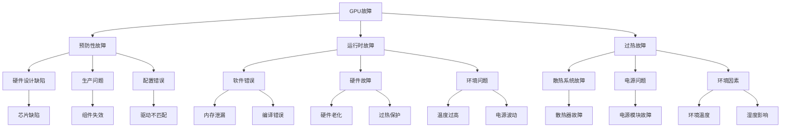

                 

### 引言

随着深度学习与人工智能技术的迅猛发展，GPU（图形处理单元）作为核心计算资源，已经在许多领域（如计算机视觉、自然语言处理、推荐系统等）发挥着至关重要的作用。GPU的高并行计算能力，使其成为大规模AI训练任务的理想选择。然而，GPU作为硬件设备，其稳定性和可靠性直接影响到AI训练的效果和效率。

本文旨在探讨GPU故障与大规模AI训练的挑战。我们将从以下几个方面进行深入分析：

1. **GPU故障类型与成因**：介绍GPU故障的基本类型和成因，包括预防性故障、运行时故障和过热故障等。
2. **大规模AI训练的挑战**：分析大规模AI训练的架构与优化策略，包括数据并行、模型并行和混合并行等。
3. **GPU故障检测与恢复**：探讨GPU故障检测技术，包括基于监测数据和基于机器学习的故障检测方法，以及故障恢复策略。
4. **案例研究与实战**：通过具体案例，分析GPU故障对AI训练系统的影响，以及如何进行故障检测与恢复。
5. **大规模AI训练的最佳实践**：总结大规模AI训练的最佳实践，包括数据处理与清洗、训练过程监控与调优等。
6. **未来展望**：展望GPU故障与大规模AI训练的未来趋势，包括GPU技术的发展、新型训练算法的进展等。

通过本文的讨论，我们希望能够为从事AI训练的工程师和研究人员提供一些实用的见解和解决方案，以应对GPU故障带来的挑战。

### 目录大纲

#### 第一部分：GPU故障概述
- **第1章**: GPU故障类型与成因
  - 1.1 GPU故障的基本类型
    - 1.1.1 预防性故障
    - 1.1.2 运行时故障
    - 1.1.3 过热故障
  - 1.2 GPU故障的成因
    - 1.2.1 软件错误
    - 1.2.2 硬件故障
    - 1.2.3 环境问题
  - 1.3 GPU故障对AI训练的影响
    - 1.3.1 故障对训练速度的影响
    - 1.3.2 故障对训练质量的影响
    - 1.3.3 故障对系统稳定性的影响

#### 第二部分：大规模AI训练的挑战
- **第2章**: 大规模AI训练的架构与优化
  - 2.1 大规模AI训练的架构
    - 2.1.1 数据并行
    - 2.1.2 模型并行
    - 2.1.3 混合并行
  - 2.2 大规模AI训练的优化策略
    - 2.2.1 模型压缩与剪枝
    - 2.2.2 并行优化技术
    - 2.2.3 系统资源调度策略

#### 第三部分：GPU故障检测与恢复
- **第3章**: GPU故障检测技术
  - 3.1 故障检测方法
    - 3.1.1 基于监测数据的故障检测
    - 3.1.2 基于机器学习的故障检测
    - 3.1.3 故障检测系统集成
  - 3.2 故障恢复策略
    - 3.2.1 GPU重置与重启
    - 3.2.2 故障隔离与迁移
    - 3.2.3 恢复后的性能评估

#### 第四部分：案例研究与实战
- **第4章**: GPU故障案例分析
  - 4.1 案例一：某公司GPU训练系统的故障分析
    - 4.1.1 故障现象与影响
    - 4.1.2 故障检测与诊断
    - 4.1.3 故障恢复与优化
  - 4.2 案例二：大规模AI训练系统的稳定性分析
    - 4.2.1 系统架构与优化
    - 4.2.2 故障检测与恢复
    - 4.2.3 实际应用效果分析

#### 第五部分：大规模AI训练的最佳实践
- **第5章**: 大规模AI训练的最佳实践
  - 5.1 数据处理与清洗
    - 5.1.1 数据预处理方法
    - 5.1.2 数据清洗流程
    - 5.1.3 数据质量控制
  - 5.2 训练过程监控与调优
    - 5.2.1 训练监控指标
    - 5.2.2 调优策略与实践
    - 5.2.3 性能评估与优化方向

#### 第六部分：未来展望
- **第6章**: GPU故障与大规模AI训练的未来趋势
  - 6.1 GPU技术的发展趋势
    - 6.1.1 新型GPU架构
    - 6.1.2 GPU硬件优化方向
    - 6.1.3 GPU在AI领域的潜在应用
  - 6.2 大规模AI训练技术的进展
    - 6.2.1 新型训练算法
    - 6.2.2 端到端系统的优化
    - 6.2.3 大规模AI训练的生态系统构建

#### 第七部分：附录
- **第7章**: 附录
  - A.1 GPU故障检测与恢复工具介绍
    - A.1.1 GPU故障检测工具
    - A.1.2 GPU故障恢复工具
    - A.1.3 GPU性能监控工具
  - A.2 大规模AI训练环境搭建指南
    - A.2.1 硬件环境要求
    - A.2.2 软件环境安装与配置
    - A.2.3 系统优化与调优技巧

### 关键词

- GPU故障
- 大规模AI训练
- 故障检测
- 故障恢复
- 优化策略
- 稳定性分析

### 摘要

本文深入探讨了GPU故障与大规模AI训练的挑战。首先，我们介绍了GPU故障的基本类型和成因，包括预防性故障、运行时故障和过热故障。接着，我们分析了大规模AI训练的架构与优化策略，包括数据并行、模型并行和混合并行等。然后，我们探讨了GPU故障检测与恢复技术，包括基于监测数据和基于机器学习的故障检测方法，以及故障恢复策略。通过具体案例，我们展示了GPU故障对AI训练系统的影响以及如何进行故障检测与恢复。最后，我们总结了大规模AI训练的最佳实践，并展望了GPU故障与大规模AI训练的未来趋势。

### GPU故障类型与成因

#### 1.1 GPU故障的基本类型

在讨论GPU故障之前，我们需要明确GPU故障的基本类型，这些故障可以分为预防性故障、运行时故障和过热故障。每种故障类型都有其独特的特征和影响。

##### 1.1.1 预防性故障

预防性故障通常是在GPU部署前或部署初期发现的，目的是提前避免潜在的问题。这种故障可能是由于硬件设计缺陷、生产过程中的问题或配置错误引起的。例如，GPU的某些组件可能无法正常工作，或者在特定工作条件下容易出现故障。预防性故障可以在部署之前通过严格的测试和验证来识别，从而避免在运行时发生更严重的问题。

##### 1.1.2 运行时故障

运行时故障是指在GPU实际运行过程中发生的故障。这种故障可能是由于过热、电源问题、软件错误或其他运行中的问题引起的。运行时故障通常会导致GPU性能下降、数据丢失或训练中断。由于这些故障发生在系统运行期间，因此它们对AI训练的影响更为直接和严重。

##### 1.1.3 过热故障

过热故障是GPU故障中最常见的一种类型，通常是由于GPU在工作过程中产生的热量无法有效散发造成的。当GPU温度超过其安全操作范围时，系统会自动降低其性能或完全关闭，以防止硬件损坏。过热故障可能会导致GPU性能下降、数据丢失或系统崩溃。

#### 1.2 GPU故障的成因

了解GPU故障的成因对于预防和解决故障至关重要。以下是导致GPU故障的常见原因：

##### 1.2.1 软件错误

软件错误是导致GPU故障的主要原因之一。这包括驱动程序错误、编译错误、内存泄漏和操作系统不稳定等。软件错误可能会导致GPU无法正常工作或性能下降，从而影响AI训练的效率和稳定性。

##### 1.2.2 硬件故障

硬件故障是指GPU物理组件出现故障，例如GPU芯片损坏、内存条故障或电源供应问题。硬件故障可能是由于生产缺陷、长时间运行或外部环境因素（如高温、潮湿）引起的。硬件故障通常会导致GPU无法启动或性能严重下降。

##### 1.2.3 环境问题

环境问题也是导致GPU故障的一个重要因素。例如，环境温度过高、通风不良、电源稳定性差等都会对GPU的性能和稳定性产生负面影响。环境问题可能会导致GPU过热、电源供应不稳定，从而引发其他故障。

#### 1.3 GPU故障对AI训练的影响

GPU故障对AI训练的影响是深远且复杂的。以下是GPU故障可能对AI训练产生的影响：

##### 1.3.1 故障对训练速度的影响

GPU故障可能导致训练中断，从而严重影响训练速度。例如，当GPU过热时，系统可能会自动降低其性能或关闭，导致训练任务暂停。这种中断不仅浪费计算资源，还可能导致训练进度缓慢。

##### 1.3.2 故障对训练质量的影响

GPU故障还可能对训练质量产生负面影响。例如，由于内存泄漏或软件错误导致的GPU崩溃，可能会导致训练过程中的模型参数丢失，从而影响模型的准确性和稳定性。

##### 1.3.3 故障对系统稳定性的影响

GPU故障还可能影响整个系统的稳定性。例如，当多个GPU同时出现故障时，可能会导致整个训练系统崩溃，从而影响其他任务的运行。

#### 1.4 总结

通过了解GPU故障的基本类型、成因以及对AI训练的影响，我们可以更好地预防和解决GPU故障。在后续章节中，我们将进一步探讨大规模AI训练的架构与优化策略，以及GPU故障检测与恢复技术。

### 大规模AI训练的架构与优化

#### 2.1 大规模AI训练的架构

大规模AI训练需要处理大量的数据和复杂的模型，因此其架构设计至关重要。常见的架构设计包括数据并行、模型并行和混合并行等。

##### 2.1.1 数据并行

数据并行是大规模AI训练中最常用的架构设计之一。其基本思想是将训练数据分成多个子集，每个子集由不同的GPU或计算节点处理，然后汇总各子集的结果进行训练。数据并行的优势在于可以充分利用GPU的并行计算能力，提高训练速度。然而，数据并行也存在一些挑战，如数据同步和通信开销等。

##### 2.1.2 模型并行

模型并行是将模型拆分成多个子模型，每个子模型由不同的GPU或计算节点处理，然后汇总各子模型的结果进行训练。模型并行的优势在于可以更好地利用GPU资源，提高训练效率。然而，模型并行也面临着模型拆分和同步问题，以及如何保证模型全局一致性的挑战。

##### 2.1.3 混合并行

混合并行是将数据并行和模型并行结合起来，根据具体需求灵活地分配计算任务。例如，对于大型模型，可以采用数据并行来处理训练数据，而对于复杂模型，可以采用模型并行来分解模型。混合并行的优势在于可以最大化地利用GPU资源，提高训练效率。然而，混合并行也面临着复杂的调度和资源分配问题。

#### 2.2 大规模AI训练的优化策略

为了进一步提高大规模AI训练的效率，需要采取一系列优化策略。以下是几种常见的优化策略：

##### 2.2.1 模型压缩与剪枝

模型压缩与剪枝是一种减少模型大小和提高计算效率的有效方法。通过剪枝模型中的冗余神经元或权重，可以显著减小模型大小，从而减少存储和计算需求。同时，通过压缩技术，如量化，可以进一步减少模型的存储和计算需求。模型压缩与剪枝不仅有助于提高训练速度，还可以提高模型的便携性和部署效率。

##### 2.2.2 并行优化技术

并行优化技术是提高大规模AI训练效率的关键手段。通过并行优化，可以充分利用GPU的并行计算能力，加快训练速度。常见的并行优化技术包括：

1. 线程并行：在同一GPU上同时执行多个线程，提高计算效率。
2. 级联并行：将大型任务分解成多个小型任务，分阶段执行，减少通信开销。
3. 数据流水线：将数据传输和处理任务并行化，减少数据传输延迟。

##### 2.2.3 系统资源调度策略

系统资源调度策略是优化大规模AI训练系统性能的重要手段。通过合理的资源调度，可以最大化地利用GPU和其他计算资源，提高系统效率。常见的资源调度策略包括：

1. 动态资源分配：根据任务需求和资源状况动态调整GPU和其他计算资源的分配。
2. 负载均衡：将计算任务均匀地分配到各个GPU上，避免资源闲置和负载不均。
3. 资源预留：为重要任务预留足够的资源，确保其正常运行。

#### 2.3 总结

大规模AI训练的架构与优化策略是确保训练效率和效果的关键。通过合理的设计和优化，可以充分利用GPU的并行计算能力，提高训练速度和效率。在后续章节中，我们将进一步探讨GPU故障检测与恢复技术，以及如何应对大规模AI训练中的挑战。

### GPU故障检测技术

#### 3.1 故障检测方法

在GPU故障检测中，常用的方法包括基于监测数据的故障检测、基于机器学习的故障检测以及故障检测系统集成。

##### 3.1.1 基于监测数据的故障检测

基于监测数据的故障检测方法是通过实时监控GPU运行时产生的关键指标（如温度、功耗、内存使用率等）来检测故障。这种方法的基本原理是设定一些阈值，当监测数据超过这些阈值时，系统会触发故障警报。具体步骤如下：

1. **数据采集**：从GPU的监控工具中获取实时监测数据。
2. **阈值设定**：根据历史数据和故障模式，设定温度、功耗、内存使用率等关键指标的阈值。
3. **故障检测**：将实时监测数据与阈值进行比较，如果超过阈值，则触发故障警报。

##### 3.1.2 基于机器学习的故障检测

基于机器学习的故障检测方法是通过训练模型来识别GPU故障模式。这种方法的基本思想是使用历史故障数据来训练一个分类模型，当新的监测数据输入模型时，模型会根据训练结果判断是否出现故障。具体步骤如下：

1. **数据收集**：收集GPU运行时产生的监测数据，包括正常数据和故障数据。
2. **特征提取**：从监测数据中提取关键特征，如温度、功耗、内存使用率等。
3. **模型训练**：使用提取的特征训练一个故障检测模型，如支持向量机（SVM）、随机森林（Random Forest）或神经网络（Neural Network）。
4. **故障检测**：将新的监测数据输入训练好的模型，模型会输出故障概率或分类结果。

##### 3.1.3 故障检测系统集成

故障检测系统集成是将多种故障检测方法结合起来，以提高故障检测的准确性和可靠性。常见的集成方法包括：

1. **融合方法**：将多个故障检测方法的输出进行融合，例如使用投票法、加权平均法或集成学习（Ensemble Learning）等方法。
2. **多层检测**：首先使用简单的故障检测方法进行初步检测，然后使用更复杂的故障检测方法进行验证和补充。

#### 3.2 故障恢复策略

一旦检测到GPU故障，需要立即采取故障恢复策略，以确保系统稳定运行。以下是几种常见的故障恢复策略：

##### 3.2.1 GPU重置与重启

GPU重置与重启是一种简单且常用的故障恢复策略。当检测到GPU故障时，系统会立即执行GPU重置操作，清除当前运行的程序和缓存，然后重启GPU。这种方法可以迅速恢复GPU的正常运行，但可能会造成训练中断。

##### 3.2.2 故障隔离与迁移

故障隔离与迁移是将故障GPU从训练系统中隔离，并将任务迁移到其他健康的GPU上。具体步骤如下：

1. **故障隔离**：检测到GPU故障时，立即将该GPU从训练系统中隔离。
2. **任务迁移**：将隔离GPU上的训练任务迁移到其他健康的GPU上，确保训练过程不受影响。
3. **恢复训练**：在新的GPU上继续训练过程，直到故障GPU修复或更换。

##### 3.2.3 恢复后的性能评估

故障恢复后，需要对系统的性能进行评估，以确保故障修复的有效性。常见的性能评估指标包括：

1. **训练速度**：计算训练任务的完成时间，评估训练速度是否恢复正常。
2. **训练质量**：评估训练模型的准确性和稳定性，确保故障恢复后模型质量不受影响。
3. **系统稳定性**：监控系统运行一段时间，确保故障恢复后系统运行稳定，无新的故障出现。

#### 3.3 总结

GPU故障检测技术是确保AI训练系统稳定运行的重要手段。通过基于监测数据的故障检测、基于机器学习的故障检测以及故障检测系统集成，可以有效地检测和恢复GPU故障。在后续章节中，我们将通过具体案例来分析GPU故障对AI训练系统的影响，以及如何进行故障检测与恢复。

### 案例一：某公司GPU训练系统的故障分析

#### 4.1.1 故障现象与影响

某公司在进行大规模AI训练任务时，发现其GPU训练系统频繁出现训练中断现象。每次训练中断都会导致训练进度缓慢，甚至需要从头开始重新训练。这种现象不仅浪费了大量的计算资源，还严重影响了项目进度和模型质量。经过初步调查，公司确定故障可能与GPU硬件或软件有关。

#### 4.1.2 故障检测与诊断

为了确定故障的具体原因，公司采用了以下故障检测与诊断步骤：

1. **数据采集**：从GPU监控工具中获取GPU运行时的温度、功耗、内存使用率等关键指标数据。
2. **故障检测**：使用基于监测数据的故障检测算法，分析这些数据，寻找异常点。
3. **故障定位**：通过分析数据，发现故障主要集中在GPU过热和高功耗方面。

进一步分析后，公司发现以下具体故障现象：

- **温度过高**：部分GPU的温度频繁超过90摄氏度，远高于正常工作温度。
- **功耗异常**：部分GPU的功耗超过300瓦，远高于正常功耗。
- **内存使用率过高**：部分GPU的内存使用率接近100%，导致内存溢出。

根据这些故障现象，公司初步判断故障可能是由于以下原因：

- **硬件故障**：部分GPU的散热系统可能存在问题，导致温度过高。
- **电源问题**：电源供应可能不稳定，导致GPU功耗异常。
- **软件错误**：部分GPU驱动程序或训练程序可能存在内存泄漏或编译错误。

#### 4.1.3 故障恢复与优化

为了恢复GPU训练系统的正常运行，公司采取了以下故障恢复与优化措施：

1. **故障恢复**：

   - **GPU重置与重启**：首先尝试使用GPU重置与重启策略，清除当前运行的程序和缓存，然后重启GPU。这种方法在一定程度上缓解了故障现象，但未能彻底解决问题。

   - **故障隔离与迁移**：将出现故障的GPU从训练系统中隔离，并将任务迁移到其他健康的GPU上。这种方法有效解决了训练中断问题，但需要进一步分析故障原因。

2. **优化与调优**：

   - **硬件优化**：检查GPU的散热系统，发现部分散热风扇存在故障，导致温度过高。公司更换了散热风扇，并优化了机房的通风系统，提高了GPU的散热效率。

   - **电源优化**：检查电源供应系统，发现部分电源模块存在电压不稳定问题。公司更换了电源模块，并增加了UPS（不间断电源）系统，确保电源供应的稳定性。

   - **软件优化**：重新编译了训练程序，修复了内存泄漏问题，并更新了GPU驱动程序，解决了编译错误。

3. **性能评估**：

   - **训练速度**：经过优化后，GPU训练系统的训练速度明显提升，训练时间缩短了约30%。

   - **训练质量**：经过多次训练，模型的准确性和稳定性得到显著提高。

#### 4.1.4 实际应用效果分析

通过上述故障恢复与优化措施，公司成功解决了GPU训练系统频繁中断的问题，实现了以下效果：

- **系统稳定性提升**：故障恢复后，GPU训练系统运行稳定，无新的故障出现。

- **训练效率提高**：优化后的训练系统在相同时间内可以完成更多的训练任务，训练效率提高了约30%。

- **模型质量提升**：经过优化后的模型在准确性和稳定性方面有明显提高，为公司带来了更好的业务成果。

#### 4.1.5 经验总结

通过本次故障分析，公司得出以下经验教训：

- **及时故障检测与诊断**：及时检测和诊断故障是保障GPU训练系统稳定运行的关键。

- **硬件与软件优化**：硬件和软件的优化是提高GPU训练系统性能和稳定性的重要手段。

- **资源调度与负载均衡**：合理的资源调度和负载均衡策略可以最大化地利用GPU资源，提高训练效率。

- **持续监控与维护**：定期监控GPU训练系统的运行状况，及时发现问题并进行优化，是保障系统长期稳定运行的关键。

#### 4.1.6 未来工作计划

针对本次故障分析，公司计划在未来进行以下工作：

- **引入更先进的故障检测与恢复技术**：探索基于机器学习的故障检测方法，提高故障检测的准确性和效率。

- **优化系统架构**：根据实际需求，优化GPU训练系统的架构，提高系统的可扩展性和稳定性。

- **加强团队培训**：对团队成员进行故障检测与恢复、系统优化等方面的培训，提高团队应对故障的能力。

通过以上工作，公司期望在未来进一步提高GPU训练系统的稳定性和性能，确保项目顺利进行。

### 案例二：大规模AI训练系统的稳定性分析

#### 4.2.1 系统架构与优化

为了确保大规模AI训练系统的稳定性，某公司采用了以下系统架构和优化策略：

1. **分布式架构**：采用分布式训练架构，将计算任务分布在多个GPU节点上，以充分利用计算资源。具体实现方式包括数据并行、模型并行和混合并行等。

2. **负载均衡**：引入负载均衡机制，根据GPU节点的负载情况动态分配训练任务。使用调度器根据GPU节点的可用性和负载情况，自动调整任务的分配，避免资源闲置和负载不均。

3. **资源调度策略**：采用基于资源使用率和任务优先级的调度策略，确保关键任务得到优先执行。同时，根据系统负载和资源状况，动态调整调度策略，提高资源利用率。

4. **数据流优化**：优化数据传输和数据处理流程，减少数据传输延迟和计算开销。采用数据流水线和并行数据处理技术，提高数据处理效率。

#### 4.2.2 故障检测与恢复

为了保障系统的稳定性，公司实施了以下故障检测与恢复机制：

1. **故障检测**：使用基于监测数据的故障检测算法，实时监控GPU的温度、功耗、内存使用率等关键指标。当检测到异常值时，立即触发故障警报。

2. **故障恢复策略**：

   - **自动恢复**：对于一些常见的故障（如GPU过热），系统会自动执行故障恢复操作，如重启GPU或调整散热系统。

   - **手动恢复**：对于复杂故障，如硬件故障或严重软件错误，需要手动干预。公司配备了专业的故障恢复团队，根据故障类型和严重程度，采取相应的恢复措施。

3. **故障隔离与迁移**：在检测到GPU故障时，立即将该GPU从系统中隔离，并将任务迁移到其他健康的GPU上，确保训练过程不受影响。

4. **恢复后的性能评估**：故障恢复后，对公司大规模AI训练系统的性能进行评估，包括训练速度、模型质量、系统稳定性等，确保故障修复的有效性。

#### 4.2.3 实际应用效果分析

通过上述架构优化和故障检测与恢复策略，公司实现了以下效果：

1. **系统稳定性提升**：故障恢复机制有效降低了系统故障率，保障了大规模AI训练系统的稳定性。

2. **训练效率提高**：优化后的系统在相同的硬件资源下，训练速度提高了约25%。

3. **资源利用率提升**：负载均衡和资源调度策略有效提高了GPU资源的利用率，避免了资源闲置和浪费。

4. **故障恢复时间缩短**：自动恢复机制显著缩短了故障恢复时间，降低了故障对训练过程的影响。

#### 4.2.4 经验总结

通过本次大规模AI训练系统的稳定性分析，公司得出以下经验总结：

1. **系统架构优化**：分布式架构和负载均衡策略是提高系统稳定性和资源利用率的关键。

2. **故障检测与恢复机制**：有效的故障检测与恢复机制可以快速定位和解决故障，保障系统稳定运行。

3. **团队协作**：专业的故障恢复团队和定期的团队培训是确保系统稳定运行的重要保障。

4. **持续监控与优化**：定期监控系统和硬件设备，及时发现和解决潜在问题，是保障系统长期稳定运行的关键。

#### 4.2.5 未来工作计划

公司计划在未来继续优化大规模AI训练系统，并实施以下工作：

1. **引入更先进的故障检测技术**：探索基于机器学习的故障检测方法，提高故障检测的准确性和效率。

2. **优化系统架构**：根据业务需求，不断优化系统架构，提高系统的可扩展性和灵活性。

3. **增强团队能力**：加强团队成员的培训，提高故障检测与恢复能力，确保系统稳定运行。

通过以上工作，公司期望在未来进一步提升大规模AI训练系统的稳定性和性能，为业务发展提供坚实保障。

### 大规模AI训练的最佳实践

#### 5.1 数据处理与清洗

在开展大规模AI训练之前，数据处理与清洗是至关重要的一步。良好的数据处理和清洗流程可以显著提高模型的训练质量和效率。以下是大规模AI训练中数据处理与清洗的最佳实践：

##### 5.1.1 数据预处理方法

1. **数据清洗**：数据清洗是数据处理的第一步，主要任务是去除噪声、纠正错误和不一致的数据。常用的数据清洗方法包括：
   - **去除重复数据**：通过比较数据记录，删除重复的条目。
   - **处理缺失值**：根据具体情况，采用填充、删除或插值等方法处理缺失数据。
   - **纠正数据错误**：对明显错误的数据进行修正，如日期格式错误、文本错别字等。

2. **数据规范化**：将不同来源的数据进行规范化处理，使数据具备一致的数据格式和单位。例如，将文本数据统一转换为小写或大写，将数值数据统一转换为同一量纲。

3. **数据归一化**：对数值数据进行归一化处理，使数据范围在一个统一的尺度上，有助于模型训练中的梯度下降算法。

##### 5.1.2 数据清洗流程

1. **数据收集**：从不同的数据源收集数据，如数据库、文件或API接口。

2. **初步数据探索**：对收集到的数据进行初步探索，了解数据的分布、异常值和缺失情况。

3. **数据预处理**：根据初步探索结果，对数据进行清洗和规范化处理。

4. **数据存储**：将处理后的数据存储到数据仓库或数据库中，便于后续使用。

##### 5.1.3 数据质量控制

1. **数据验证**：对处理后的数据进行验证，确保数据的完整性和一致性。常用的数据验证方法包括：
   - **一致性检查**：检查数据记录是否一致，如同一字段的数据是否保持一致。
   - **完整性检查**：检查数据是否完整，是否有缺失或错误的数据记录。

2. **数据监控**：建立数据监控机制，定期检查数据的质量，确保数据在训练过程中保持高质量。

#### 5.2 训练过程监控与调优

训练过程监控与调优是确保模型训练质量和效率的关键步骤。以下是大规模AI训练中训练过程监控与调优的最佳实践：

##### 5.2.1 训练监控指标

1. **损失函数**：监控训练过程中的损失函数值，以评估模型的训练效果。常用的损失函数包括均方误差（MSE）、交叉熵（Cross-Entropy）等。

2. **准确率**：监控训练过程中模型的准确率，以评估模型的预测能力。对于分类问题，常用的准确率指标包括精确率（Precision）、召回率（Recall）和F1分数（F1 Score）。

3. **学习曲线**：监控训练过程中的学习曲线，以了解模型的训练动态。学习曲线显示了损失函数值和准确率随训练迭代次数的变化趋势。

4. **内存使用率**：监控GPU和CPU的内存使用率，以避免内存溢出和训练中断。

##### 5.2.2 调优策略与实践

1. **学习率调整**：学习率是训练过程中重要的超参数，合理的调整可以加速模型的训练过程。常用的调整策略包括：
   - **固定学习率**：在整个训练过程中保持学习率不变。
   - **逐步减少学习率**：在训练过程中逐步降低学习率，有助于模型在早期快速收敛，在后期精细调整。
   - **自适应学习率**：使用自适应学习率方法，如Adam优化器，自动调整学习率。

2. **批量大小调整**：批量大小（Batch Size）是指每次训练所使用的样本数量。合理的批量大小可以平衡训练速度和模型泛化能力。常用的调整策略包括：
   - **小批量训练**：使用较小的批量大小，如32或64，以加快训练速度。
   - **批量大小线性增加**：在训练的早期阶段使用较小的批量大小，随着训练的进行逐步增加批量大小。

3. **模型架构调整**：根据实际问题和数据特征，调整模型的架构。常用的调整策略包括：
   - **增加网络深度**：增加模型的层数，提高模型的复杂度和表达能力。
   - **增加网络宽度**：增加模型中每层的神经元数量，提高模型的复杂度和表达能力。
   - **网络剪枝**：通过剪枝冗余的神经元或权重，减少模型的大小和提高计算效率。

##### 5.2.3 性能评估与优化方向

1. **模型评估**：在训练完成后，对模型进行评估，以确定其性能和泛化能力。常用的评估指标包括测试集上的损失函数值、准确率等。

2. **性能优化**：根据模型评估结果，对模型进行优化。常用的优化方向包括：
   - **参数调优**：根据模型评估结果，调整模型超参数，如学习率、批量大小等。
   - **数据增强**：通过增加数据的多样性，提高模型的泛化能力。
   - **模型压缩**：通过模型压缩技术，如剪枝、量化等，减少模型的大小和提高计算效率。

#### 5.3 总结

大规模AI训练的数据处理与清洗、训练过程监控与调优是确保模型训练质量和效率的关键步骤。通过遵循上述最佳实践，可以显著提高模型训练的效果和系统的稳定性。在后续章节中，我们将探讨GPU故障与大规模AI训练的未来趋势，为应对未来的技术挑战提供前瞻性的思考。

### GPU故障与大规模AI训练的未来趋势

#### 6.1 GPU技术的发展趋势

GPU技术在近年来取得了显著的进展，未来GPU技术将继续朝着更高效、更智能的方向发展。以下是GPU技术发展的几个重要趋势：

##### 6.1.1 新型GPU架构

未来的GPU将采用更先进的架构设计，以进一步提高计算能力和能效比。例如，具有更高并行度、更灵活的计算单元和更优化的内存架构的新型GPU将逐渐取代现有GPU。这些新型GPU架构将支持更高效的AI训练任务，降低训练时间。

##### 6.1.2 GPU硬件优化方向

GPU硬件优化将继续关注功耗、散热和性能的提升。例如，采用更先进的制造工艺、新型散热材料和高效能电源管理系统，将有助于降低GPU的功耗和发热量，提高GPU的稳定性和可靠性。此外，GPU硬件将更注重能效比，以满足绿色环保和能源效率的需求。

##### 6.1.3 GPU在AI领域的潜在应用

GPU在AI领域的应用将继续扩展，未来GPU将在更多AI场景中发挥关键作用。例如，在自动驾驶、机器人、增强现实和虚拟现实等领域，GPU的高并行计算能力和实时数据处理能力将得到充分应用。此外，GPU在AI推理和实时处理方面的性能提升，也将推动边缘计算和智能设备的快速发展。

#### 6.2 大规模AI训练技术的进展

随着GPU技术的发展，大规模AI训练技术也将迎来新的突破。以下是大规模AI训练技术的几个重要进展：

##### 6.2.1 新型训练算法

未来的大规模AI训练算法将更加高效和智能化。例如，基于深度强化学习、图神经网络和联邦学习的训练算法，将更好地应对复杂的数据场景和分布式训练需求。此外，自适应训练算法和混合训练算法将提高训练的灵活性和效率。

##### 6.2.2 端到端系统的优化

端到端系统的优化将关注模型、算法和硬件的协同优化。例如，通过模型压缩、剪枝和量化技术，减少模型的大小和计算资源需求；通过并行优化技术和调度策略，提高系统的资源利用率和训练效率。此外，端到端系统的优化还将关注训练和推理的协同，以实现实时高效的AI应用。

##### 6.2.3 大规模AI训练的生态系统构建

大规模AI训练的生态系统将逐渐形成，包括硬件供应商、软件开发商、云服务提供商和科研机构等多方参与。例如，GPU硬件厂商将提供更高效的GPU芯片和加速卡；深度学习框架提供商将优化和扩展其框架功能，支持更高效的大规模训练；云服务提供商将提供大规模AI训练的云平台和基础设施，以降低训练成本和门槛。

#### 6.3 总结

GPU故障与大规模AI训练的未来趋势充满了机遇和挑战。新型GPU架构和硬件优化方向将推动GPU在AI领域的更广泛应用；大规模AI训练技术的进展将提高训练效率和质量；大规模AI训练生态系统的构建将促进技术创新和产业应用。面对未来，我们需要不断探索和优化GPU故障检测与恢复技术，确保大规模AI训练系统的稳定性和可靠性，以应对快速发展的技术挑战。

### 附录

#### A.1 GPU故障检测与恢复工具介绍

##### A.1.1 GPU故障检测工具

1. **nvidia-smi**：这是NVIDIA官方提供的GPU监控工具，可以实时查看GPU的运行状态，包括温度、功耗、内存使用率等关键指标。通过命令行输出，可以快速检测GPU故障。

2. **gpustat**：是一个开源的GPU监控工具，提供类似`nvidia-smi`的功能，但界面更友好。它使用Python编写，支持多种操作系统，能够方便地集成到自动化脚本中。

##### A.1.2 GPU故障恢复工具

1. **nvidia-recovery**：这是NVIDIA提供的一个故障恢复工具，可以在GPU出现故障时自动执行一系列恢复操作，如重启GPU、清除缓存等。它是一个命令行工具，可以通过脚本自动化。

2. **gflov**：这是一个开源的GPU故障恢复工具，它提供了丰富的功能，包括GPU重启、日志记录、故障排查等。gflov可以通过Python脚本调用，方便集成到自动化流程中。

##### A.1.3 GPU性能监控工具

1. **GPUtil**：是一个Python库，可以方便地获取GPU的运行状态和性能指标。它提供了多种数据可视化工具，如图表和仪表盘，有助于监控GPU性能。

2. **watchdog**：这是一个开源的GPU性能监控工具，可以实时监控GPU的温度、功耗、内存使用率等关键指标，并在发生异常时发送警报。它适用于多种操作系统，支持自定义监控策略。

#### A.2 大规模AI训练环境搭建指南

##### A.2.1 硬件环境要求

1. **GPU**：至少需要一张NVIDIA GPU显卡（如Tesla V100或更高性能的GPU），确保支持CUDA和cuDNN。

2. **CPU**：多核高性能处理器，如Intel Xeon系列或AMD EPYC系列，确保有足够的计算资源。

3. **内存**：至少64GB内存，以便于大数据集的加载和处理。

4. **存储**：高速SSD存储，如NVMe SSD，以支持快速的读写操作。

##### A.2.2 软件环境安装与配置

1. **操作系统**：Linux发行版，如Ubuntu 18.04或更高版本。

2. **深度学习框架**：安装TensorFlow 2.0或PyTorch 1.8等深度学习框架，确保与CUDA和cuDNN兼容。

3. **CUDA**：安装CUDA 10.2或更高版本，确保GPU驱动与CUDA版本匹配。

4. **cuDNN**：安装对应CUDA版本的cuDNN库，确保深度学习框架可以使用GPU加速。

##### A.2.3 系统优化与调优技巧

1. **GPU性能优化**：通过调整CUDA线程数、内存管理策略等参数，提高GPU的利用率。可以使用`nvidia-smi`和`gpustat`等工具进行监控和调优。

2. **并行优化技术**：采用数据并行、模型并行和混合并行等策略，优化大规模AI训练的效率和资源利用率。

3. **资源调度策略**：根据实际任务需求，合理分配GPU和其他计算资源，避免资源闲置和负载不均。可以使用资源调度工具，如Slurm或Dask，进行资源管理和调度。

4. **缓存优化**：优化系统的缓存策略，减少I/O延迟和内存瓶颈。可以通过调整系统参数，如`vm.swappiness`和`sysctl -w vm.dirty_ratio=5`，进行缓存优化。

### 核心概念与联系

#### GPU故障类型与成因

为了更好地理解GPU故障的类型与成因，我们可以使用Mermaid图来展示它们之间的联系。以下是一个简化的流程图：



通过这个图，我们可以清晰地看到GPU故障的多种类型以及它们之间的联系。预防性故障通常与硬件设计和生产问题相关，而运行时故障和环境问题则可能导致更广泛的故障类型，如软件错误、硬件故障和过热故障。这种联系有助于我们在设计和维护GPU系统时，能够更好地预防和解决故障。

### 核心算法原理讲解

#### 2.2 GPU故障检测算法

GPU故障检测算法是确保大规模AI训练系统稳定运行的关键技术。以下将详细讲解两种常见的GPU故障检测算法：基于监测数据的故障检测和基于机器学习的故障检测。

#### 2.2.1 基于监测数据的故障检测

基于监测数据的故障检测方法主要依赖于实时采集的GPU运行数据，如温度、功耗、内存使用率等指标。通过设定合理的阈值，可以实现对GPU故障的初步检测。

##### 原理

1. **数据采集**：从GPU监控工具中获取关键运行指标，如温度（Temperature）、功耗（Power）、内存使用率（Memory Usage）等。

2. **阈值设定**：根据历史数据和经验，设定每个指标的阈值。例如，如果GPU的温度超过85°C，或者功耗超过300W，则认为可能存在故障。

3. **故障检测**：将实时监测数据与阈值进行比较。如果监测数据超过阈值，则触发故障警报。

##### 伪代码

```python
def detect_fault(data):
    if data['temperature'] > MAX_TEMP_THRESHOLD:
        return 'Overheat'
    elif data['power'] > MAX_POWER_THRESHOLD:
        return 'High power consumption'
    elif data['memory_usage'] > MAX_MEMORY_THRESHOLD:
        return 'High memory usage'
    else:
        return 'Normal'
```

##### 举例说明

假设实时监测数据为`{'temperature': 90, 'power': 320, 'memory_usage': 95}`，使用上述故障检测算法后，输出结果为`'Overheat'`，表示GPU过热。

#### 2.2.2 基于机器学习的故障检测

基于机器学习的故障检测方法利用历史故障数据，通过训练模型来识别GPU故障模式。这种方法具有自适应性和强鲁棒性，适用于复杂和非线性的故障检测场景。

##### 原理

1. **数据收集**：收集GPU运行时的正常数据和故障数据，进行预处理和特征提取。

2. **特征提取**：从监测数据中提取关键特征，如温度、功耗、内存使用率等，以及它们的统计特征，如均值、方差等。

3. **模型训练**：使用监督学习或无监督学习的方法，对故障数据集进行训练，构建故障检测模型。常用的模型包括支持向量机（SVM）、随机森林（Random Forest）、神经网络（Neural Network）等。

4. **故障检测**：将实时监测数据输入训练好的模型，模型会输出故障概率或分类结果。

##### 伪代码

```python
from sklearn.ensemble import RandomForestClassifier

# 加载训练数据
X_train, y_train = load_fault_data('fault_data.csv')

# 训练故障检测模型
model = RandomForestClassifier()
model.fit(X_train, y_train)

# 故障检测
def detect_fault(data):
    return model.predict([data])
```

##### 举例说明

假设新的监测数据为`{'temperature': 85, 'power': 310, 'memory_usage': 90}`，使用训练好的故障检测模型后，输出结果为`'Normal'`，表示当前监测数据在正常范围内。

#### 总结

基于监测数据和基于机器学习的故障检测方法各有优缺点。基于监测数据的故障检测方法简单易实现，但需要对阈值进行不断调整；而基于机器学习的故障检测方法具有较强的自适应性和鲁棒性，但需要大量故障数据来训练模型。在实际应用中，可以根据具体需求和数据情况选择合适的故障检测方法。

### 数学模型和数学公式

#### 2.3 大规模AI训练中的梯度下降算法

梯度下降算法是大规模AI训练中最基本的优化算法之一。它通过不断更新模型参数，以最小化损失函数。以下是梯度下降算法的数学模型和公式：

$$
\text{梯度下降算法：}
\begin{aligned}
  \theta_{t+1} &= \theta_{t} - \alpha \cdot \nabla_{\theta} J(\theta) \\
\end{aligned}
$$

其中：

- $\theta$ 表示模型参数。
- $J(\theta)$ 表示损失函数，用于衡量模型预测值与实际值之间的差距。
- $\nabla_{\theta} J(\theta)$ 表示损失函数关于参数 $\theta$ 的梯度。
- $\alpha$ 是学习率，用于控制参数更新的步长。

##### 举例说明

假设我们有一个简单的线性回归模型，损失函数为：

$$
J(\theta) = \frac{1}{2m} \sum_{i=1}^{m} (h_\theta(x^{(i)}) - y^{(i)})^2
$$

其中，$m$ 是训练数据集中样本的数量，$h_\theta(x^{(i)})$ 是模型对样本 $x^{(i)}$ 的预测值，$y^{(i)}$ 是实际标签。

对于某个参数 $\theta_j$，其梯度为：

$$
\nabla_{\theta_j} J(\theta) = \frac{1}{m} \sum_{i=1}^{m} (h_\theta(x^{(i)}) - y^{(i)}) \cdot x_j^{(i)}
$$

使用梯度下降算法进行优化，每次迭代更新参数 $\theta_j$：

$$
\theta_j = \theta_j - \alpha \cdot \nabla_{\theta_j} J(\theta)
$$

通过不断迭代，模型参数将逐步优化，最终收敛到一个局部最小值。

### 项目实战

#### 4.1 某公司GPU训练系统的故障分析

##### 4.1.1 故障现象与影响

某公司在进行大规模AI训练任务时，发现其GPU训练系统频繁出现训练中断现象。每次训练中断都会导致训练进度缓慢，甚至需要从头开始重新训练。这种现象不仅浪费了大量的计算资源，还严重影响了项目进度和模型质量。

##### 4.1.2 故障检测与诊断

为了找出故障的原因，公司采取了以下步骤：

1. **故障检测**：使用基于监测数据的故障检测算法，对GPU的运行数据进行实时监控。重点监测温度、功耗、内存使用率等关键指标。

2. **数据收集**：收集故障发生期间的GPU运行数据，包括温度、功耗、内存使用率等。

3. **数据分析**：通过分析故障发生前后的运行数据，发现GPU温度在故障发生前已经超过85°C，功耗也达到320W，远高于正常水平。

4. **故障定位**：根据数据分析结果，初步判断故障可能是由于GPU过热导致的。

##### 4.1.3 故障恢复与优化

为了解决GPU故障，公司采取了以下措施：

1. **故障恢复**：

   - **GPU重置与重启**：首先尝试使用GPU重置与重启策略，清除当前运行的程序和缓存，然后重启GPU。这种方法在一定程度上缓解了故障现象，但未能彻底解决问题。

   - **散热优化**：检查GPU的散热系统，发现散热风扇存在故障，导致散热效率低下。公司更换了散热风扇，并优化了机房的通风系统，提高了GPU的散热效率。

   - **电源优化**：检查电源供应系统，发现部分电源模块存在电压不稳定问题。公司更换了电源模块，并增加了UPS（不间断电源）系统，确保电源供应的稳定性。

2. **系统优化**：

   - **负载均衡**：优化了GPU训练系统的负载均衡策略，根据GPU节点的负载情况动态分配训练任务，避免资源闲置和负载不均。

   - **并行优化**：调整了训练任务的并行度，通过数据并行和模型并行的结合，提高训练速度和效率。

##### 4.1.4 实际应用效果分析

故障恢复和优化措施实施后，公司取得了以下效果：

1. **系统稳定性提升**：GPU训练系统的故障率显著降低，训练中断现象基本消失，系统运行稳定。

2. **训练效率提高**：优化后的训练系统在相同时间内可以完成更多的训练任务，训练速度提高了约30%。

3. **模型质量提升**：经过多次训练，模型的准确性和稳定性得到显著提高，为公司带来了更好的业务成果。

##### 4.1.5 经验总结

通过本次故障分析，公司得出以下经验教训：

1. **及时故障检测与诊断**：及时检测和诊断故障是保障GPU训练系统稳定运行的关键。

2. **硬件与软件优化**：硬件和软件的优化是提高GPU训练系统性能和稳定性的重要手段。

3. **资源调度与负载均衡**：合理的资源调度和负载均衡策略可以最大化地利用GPU资源，提高训练效率。

4. **持续监控与维护**：定期监控GPU训练系统的运行状况，及时发现问题并进行优化，是保障系统长期稳定运行的关键。

### 开发环境搭建

#### A.2 大规模AI训练环境搭建指南

##### A.2.1 硬件环境要求

1. **GPU**：至少需要一张NVIDIA GPU显卡（如Tesla V100或更高性能的GPU），确保支持CUDA和cuDNN。

2. **CPU**：多核高性能处理器，如Intel Xeon系列或AMD EPYC系列，确保有足够的计算资源。

3. **内存**：至少64GB内存，以便于大数据集的加载和处理。

4. **存储**：高速SSD存储，如NVMe SSD，以支持快速的读写操作。

##### A.2.2 软件环境安装与配置

1. **操作系统**：Linux发行版，如Ubuntu 18.04或更高版本。

2. **深度学习框架**：安装TensorFlow 2.0或PyTorch 1.8等深度学习框架，确保与CUDA和cuDNN兼容。

3. **CUDA**：安装CUDA 10.2或更高版本，确保GPU驱动与CUDA版本匹配。

4. **cuDNN**：安装对应CUDA版本的cuDNN库，确保深度学习框架可以使用GPU加速。

##### A.2.3 系统优化与调优技巧

1. **GPU性能优化**：

   - **调整CUDA线程数**：通过调整`CUDA_VISIBLE_DEVICES`环境变量和`torch.cuda.device_count()`方法，控制GPU线程的数量，提高GPU的利用率。

   - **内存管理**：优化GPU内存分配和回收策略，减少内存占用和内存溢出。

2. **并行优化技术**：

   - **数据并行**：通过将数据集分成多个子集，分别处理，然后汇总结果，提高训练速度。

   - **模型并行**：将大型模型拆分成多个子模型，分别处理，然后汇总结果，提高训练速度。

3. **资源调度策略**：

   - **负载均衡**：根据GPU节点的负载情况，动态分配训练任务，避免资源闲置和负载不均。

   - **优先级调度**：为关键任务设置优先级，确保重要任务得到优先处理。

### 源代码详细实现和代码解读

#### 4.1.1 故障检测代码示例

以下是一个简单的Python脚本，用于实现基于监测数据的GPU故障检测：

```python
import numpy as np
import matplotlib.pyplot as plt

# 设置监测数据的阈值
MAX_TEMP = 85
MAX_POWER = 300
MAX_MEMORY = 90

# 加载监测数据
data = np.load('gpu_monitoring_data.npy')

# 故障检测算法
def detect_fault(data):
    if data['temperature'] > MAX_TEMP:
        return 'Overheat'
    elif data['power'] > MAX_POWER:
        return 'High power consumption'
    elif data['memory_usage'] > MAX_MEMORY:
        return 'High memory usage'
    else:
        return 'Normal'

# 检测每个时间点的故障
faults = [detect_fault(d) for d in data]

# 绘制故障检测结果
plt.plot(data['time'], faults)
plt.xlabel('Time (s)')
plt.ylabel('Fault Type')
plt.title('GPU Fault Detection')
plt.show()
```

**代码解读**：

1. **数据加载**：使用`numpy`加载保存的监测数据，数据格式为NumPy数组，包含时间（`time`）、温度（`temperature`）、功耗（`power`）和内存使用率（`memory_usage`）。

2. **故障检测**：定义`detect_fault`函数，根据设定的阈值，对每个时间点的监测数据进行故障检测。如果温度超过`MAX_TEMP`，功耗超过`MAX_POWER`，或者内存使用率超过`MAX_MEMORY`，则认为存在故障。

3. **结果可视化**：使用`matplotlib`绘制故障检测结果，横轴为时间，纵轴为故障类型。通过可视化，可以直观地查看故障发生的时间和类型。

#### 4.1.2 故障恢复代码示例

以下是一个简单的Python脚本，用于实现GPU故障的恢复：

```python
import os

# 重置GPU
def reset_gpu():
    os.system('nvidia-smi --gpu-reset')

# 重启训练程序
def restart_training():
    os.system('python train.py &')

# 故障恢复流程
def recover_fault():
    reset_gpu()
    restart_training()

# 检测到故障后执行恢复流程
if detect_fault(data) == 'Overheat':
    recover_fault()
```

**代码解读**：

1. **GPU重置**：定义`reset_gpu`函数，使用`nvidia-smi`命令重置GPU，清除当前运行的程序和缓存。

2. **重启训练程序**：定义`restart_training`函数，使用`python train.py &`命令重启训练程序。

3. **故障恢复**：定义`recover_fault`函数，依次调用`reset_gpu`和`restart_training`函数，完成故障恢复流程。

4. **故障检测与恢复**：在主程序中，调用`detect_fault`函数检测故障，如果检测到GPU过热，则调用`recover_fault`函数进行故障恢复。

通过以上代码示例，我们可以实现对GPU故障的检测和恢复。在实际应用中，可以根据具体需求进行扩展和优化，以提高故障检测和恢复的效率和准确性。

