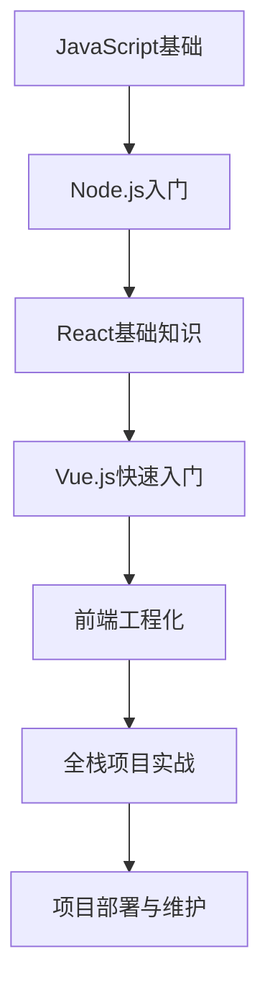

                 

# JavaScript全栈开发：Node.js与前端框架的结合

> **关键词：** JavaScript, Node.js, 全栈开发, React, Vue.js, 前端框架, 代码示例, 伪代码, Mermaid流程图, 数学公式

> **摘要：** 本文将深入探讨JavaScript全栈开发，尤其是Node.js与前端框架的结合。我们将从JavaScript基础讲起，逐步介绍Node.js入门、前端框架React和Vue.js的快速入门，以及前端工程化。接着，我们将通过一个实际的示例项目，展示如何使用Node.js和前端框架进行全栈开发，并对其中的关键代码进行详细解读。最后，我们将讨论项目部署与维护，包括部署策略、性能优化与安全。本文旨在为初学者提供系统、详尽的指导，帮助他们在全栈开发领域取得成功。

## 目录

### 《JavaScript全栈开发：Node.js与前端框架的结合》目录大纲

#### 第一部分：JavaScript基础与Node.js

1. 第1章：JavaScript基础
   1.1 JavaScript语言概述
   1.2 JavaScript在浏览器中的工作原理
   1.3 JavaScript的异步编程

2. 第2章：Node.js入门
   2.1 Node.js概述
   2.2 Node.js的核心模块
   2.3 Node.js的异步编程

#### 第二部分：前端框架

3. 第3章：React基础知识
   3.1 React概述
   3.2 React的组件生命周期
   3.3 React的状态管理与数据传递

4. 第4章：Vue.js快速入门
   4.1 Vue.js概述
   4.2 Vue.js的基本语法
   4.3 Vue.js的组件与路由

5. 第5章：前端工程化
   5.1 Webpack入门
   5.2 Babel与ES6+
   5.3 CSS预处理器

#### 第三部分：全栈项目实战

6. 第6章：全栈项目搭建
   6.1 项目需求分析
   6.2 技术栈选择与搭建
   6.3 数据库设计与迁移

7. 第7章：前后端分离
   7.1 API设计与实现
   7.2 前端与后端的通信
   7.3 前后端分离的优势与挑战

8. 第8章：项目部署与维护
   8.1 项目部署
   8.2 项目维护与监控
   8.3 性能优化与安全

#### 附录

9. 附录A：开发工具与环境配置
10. 附录B：项目源代码与示例

### Mermaid 流程图（示例）



### 伪代码示例

```javascript
// 假设我们要实现一个简单的HTTP服务
function startServer(port) {
    // 创建HTTP服务器
    const server = http.createServer((request, response) => {
        // 设置HTTP响应头部
        response.writeHead(200, {'Content-Type': 'text/plain'});

        // 发送HTTP响应
        response.end('Hello, World!');
    });

    // 监听指定端口
    server.listen(port, () => {
        console.log(`Server running at http://localhost:${port}/`);
    });
}

// 启动服务器
startServer(3000);
```

### 数学公式示例

$$
E = mc^2
$$

### 代码实战与解读（示例）

```javascript
// 引入所需的库
const express = require('express');
const bcrypt = require('bcrypt');
const jwt = require('jsonwebtoken');

// 创建Express应用
const app = express();

// 配置中间件
app.use(express.json());

// 用户注册路由
app.post('/register', async (req, res) => {
    try {
        // 获取用户输入的用户名和密码
        const { username, password } = req.body;

        // 对密码进行加密处理
        const hashedPassword = await bcrypt.hash(password, 10);

        // 将加密后的密码存储到数据库（此处省略数据库操作）

        res.status(201).json({ message: 'User registered successfully.' });
    } catch (error) {
        res.status(500).json({ message: 'Internal server error.' });
    }
});

// 用户登录路由
app.post('/login', async (req, res) => {
    try {
        // 获取用户输入的用户名和密码
        const { username, password } = req.body;

        // 在数据库中查找用户名
        const user = getUserByUsername(username);

        if (!user) {
            res.status(401).json({ message: 'User not found.' });
            return;
        }

        // 比较输入的密码和数据库中存储的加密密码
        const result = await bcrypt.compare(password, user.hashedPassword);

        if (!result) {
            res.status(401).json({ message: 'Incorrect password.' });
            return;
        }

        // 生成JWT令牌
        const token = jwt.sign({ userId: user.id }, 'secretKey');

        res.status(200).json({ token });
    } catch (error) {
        res.status(500).json({ message: 'Internal server error.' });
    }
});

// 获取用户信息（模拟数据库查询）
function getUserByUsername(username) {
    // 在此处查询数据库（此处省略数据库查询操作）
    return {
        id: '1',
        username: 'exampleUser',
        hashedPassword: 'hashedPassword'
    };
}

// 启动服务器
app.listen(3000, () => {
    console.log('Server listening on port 3000');
});
```

> **代码解读：** 该示例展示了如何使用Express框架创建一个简单的RESTful API来实现用户注册与登录功能。代码中包含了密码加密、JWT令牌生成、错误处理等关键步骤。实际开发中，还需要对数据库操作、密码存储、令牌安全等进行进一步的处理。

**注：** 本文目录大纲和内容仅为示例，具体内容可能需要根据实际需求进行调整和补充。

接下来，我们将深入探讨JavaScript基础，开始我们的全栈开发之旅。让我们一步一步地分析推理，为读者呈现一幅清晰的全栈开发图景。

----------------------------------------------------------------

## 第一部分：JavaScript基础与Node.js

### 第1章：JavaScript基础

JavaScript是一种广泛使用的脚本语言，最初用于网页中的交互，但如今它已演变为一门功能强大的编程语言，适用于前端和后端的多种开发场景。在本章中，我们将从JavaScript语言概述开始，逐步介绍其核心概念与语法。

### 1.1 JavaScript语言概述

JavaScript的历史可以追溯到1995年，由网景通信公司（Netscape Communications）的Brendan Eich开发。最初，JavaScript被命名为LiveScript，但后来与Sun Microsystems的Java语言相混淆，因此改名为JavaScript。随着时间的推移，JavaScript不断进化，逐渐成为网页开发不可或缺的一部分。

JavaScript的核心概念包括：

- **变量与数据类型**：JavaScript中的变量使用关键字`var`、`let`或`const`声明，数据类型包括数字、字符串、布尔值、数组、对象等。
- **函数**：JavaScript中的函数是一段可重复使用的代码块，可以通过关键字`function`定义，也可以使用箭头函数。
- **对象**：JavaScript中的对象是一种键值对的数据结构，可以包含属性和方法。
- **数组**：JavaScript中的数组是一种特殊的对象，用于存储多个值。

JavaScript的基本语法如下：

```javascript
// 声明变量
let message = "Hello, World!";

// 函数定义
function greet() {
    console.log(message);
}

// 调用函数
greet();
```

### 1.2 JavaScript在浏览器中的工作原理

浏览器的JavaScript引擎负责解析和执行JavaScript代码。当用户在浏览器中打开一个网页时，以下步骤发生：

1. **解析HTML**：浏览器读取HTML文档，构建DOM（Document Object Model）树。
2. **解析CSS**：浏览器读取CSS样式表，应用样式到DOM节点。
3. **加载JavaScript**：浏览器加载JavaScript脚本，并按顺序执行。
4. **执行DOM操作**：JavaScript代码可以访问和操作DOM树，响应用户的交互。
5. **渲染页面**：浏览器根据DOM树和CSS样式表渲染出可视化的网页。

JavaScript与DOM的交互是通过DOM API实现的。以下是一个简单的示例，展示了如何使用JavaScript获取并修改DOM元素：

```javascript
// 获取元素
const element = document.getElementById('myElement');

// 修改元素内容
element.textContent = 'Hello, JavaScript!';
```

### 1.3 JavaScript的异步编程

异步编程是JavaScript的核心特性之一，它使得JavaScript在处理长时间运行的任务时能够保持响应性。JavaScript的异步编程主要依赖于以下概念：

- **事件监听器**：JavaScript中的事件监听器允许程序在特定事件发生时执行代码。
- **回调函数**：回调函数是一种在函数内部调用的函数，用于处理异步操作的结果。
- **Promise**：Promise是一种表示异步操作最终完成（或失败）的对象。
- **async/await**：async/await语法让异步代码更易于理解和编写。

以下是一个异步编程的示例：

```javascript
// 使用回调函数
function fetchData(callback) {
    setTimeout(() => {
        callback('Data fetched successfully');
    }, 1000);
}

fetchData(function(data) {
    console.log(data);
});

// 使用Promise
function fetchData() {
    return new Promise((resolve, reject) => {
        setTimeout(() => {
            resolve('Data fetched successfully');
        }, 1000);
    });
}

fetchData()
    .then(data => console.log(data))
    .catch(error => console.error(error));

// 使用async/await
async function fetchData() {
    return 'Data fetched successfully';
}

async function displayData() {
    const data = await fetchData();
    console.log(data);
}

displayData();
```

在本章中，我们介绍了JavaScript的基础知识，包括语言概述、浏览器中的工作原理以及异步编程。这些知识为后续章节的学习奠定了坚实的基础。

----------------------------------------------------------------

### 第2章：Node.js入门

Node.js是一个基于Chrome V8引擎的JavaScript运行时，它允许开发者使用JavaScript编写后端代码。Node.js的出现大大推动了JavaScript在服务器端的发展，使得开发者能够使用同一门语言编写前端和后端代码。本章将介绍Node.js的基本概念和核心模块，帮助读者入门Node.js开发。

#### 2.1 Node.js概述

Node.js的历史可以追溯到2009年，由瑞恩·帕克（Ryan Dahl）开发。当时，瑞恩在开发一个实时聊天应用程序时，遇到了JavaScript在后端编程中的瓶颈。他希望使用JavaScript来编写整个应用程序，包括后端逻辑。于是，他决定创建一个基于Chrome V8引擎的JavaScript运行时，这就是Node.js的起源。

Node.js的主要特点包括：

- **单线程**：Node.js使用单线程模型，通过事件循环来处理并发请求。
- **非阻塞I/O**：Node.js使用非阻塞I/O操作，避免了传统同步I/O操作带来的性能瓶颈。
- **模块化**：Node.js采用CommonJS模块规范，使得代码易于组织和重用。

Node.js的安装过程相对简单。首先，访问Node.js官网（https://nodejs.org/），下载适用于操作系统的安装包。然后，运行安装程序，并按照提示完成安装。

```shell
# 对于Windows系统
node-v14.17.0-x64.msi

# 对于macOS系统
node-v14.17.0-darwin-x64.tar.xz

# 对于Linux系统
node-v14.17.0-linux-x64.tar.xz
```

安装完成后，可以通过以下命令验证Node.js是否安装成功：

```shell
node -v
```

如果输出类似`v14.17.0`的版本信息，则表示Node.js已成功安装。

#### 2.2 Node.js的核心模块

Node.js的核心模块是Node.js生态系统的基础，开发者可以使用这些模块来简化开发流程。以下是一些常用的核心模块：

- **fs（文件系统）**：`fs`模块提供了文件操作的接口，包括文件的读取、写入、删除等。
- **http（HTTP服务器）**：`http`模块允许开发者创建和托管HTTP服务器，处理HTTP请求和响应。
- **path（路径操作）**：`path`模块提供了用于处理文件和目录路径的实用函数。
- **url（URL解析）**：`url`模块用于解析和构造URL。

以下是一个简单的Node.js程序，演示了如何使用`fs`和`http`模块创建一个简单的Web服务器：

```javascript
const http = require('http');
const fs = require('fs');

const server = http.createServer((req, res) => {
    if (req.url === '/') {
        fs.readFile('index.html', (err, data) => {
            if (err) {
                res.writeHead(500);
                return res.end('Error loading index.html');
            }
            res.writeHead(200, {'Content-Type': 'text/html'});
            res.end(data);
        });
    } else {
        res.writeHead(404);
        res.end('Not Found');
    }
});

server.listen(3000, () => {
    console.log('Server running at http://localhost:3000/');
});
```

在这个示例中，我们创建了一个HTTP服务器，当用户访问根路径（`/`）时，服务器读取`index.html`文件并返回给用户。如果请求路径不是`/`，服务器返回404错误。

#### 2.3 Node.js的异步编程

Node.js的异步编程是其核心特性之一，它允许程序在执行长时间操作时保持响应性。Node.js使用事件循环机制来处理异步操作，以下是异步编程的关键概念：

- **事件**：事件是Node.js中用于通知程序某些操作已完成或发生的机制。
- **监听器**：监听器是注册到事件上的函数，当事件发生时，Node.js会调用该函数。
- **回调函数**：回调函数是传递给监听器的一个函数，用于处理异步操作的结果。

以下是一个异步编程的示例，演示了如何使用`fs`模块读取文件：

```javascript
const fs = require('fs');

function read synchronous() {
    const data = fs.readFileSync('example.txt');
    console.log(data.toString());
}

function read asynchronous(callback) {
    fs.readFile('example.txt', (err, data) => {
        if (err) {
            callback(err);
            return;
        }
        console.log(data.toString());
    });
}

read synchronous();
read asynchronous((err) => {
    if (err) {
        console.error(err);
    }
});
```

在这个示例中，我们定义了两个读取文件的函数：`readSynchronous`和`readAsynchronous`。`readSynchronous`函数使用`readFileSync`方法以同步方式读取文件，而`readAsynchronous`函数使用`readFile`方法以异步方式读取文件。

异步编程在Node.js中至关重要，因为它使得程序在执行长时间操作时能够保持响应性。通过事件循环机制，Node.js能够高效地处理大量并发请求。

在本章中，我们介绍了Node.js的基本概念和核心模块，并探讨了Node.js的异步编程。这些知识为后续章节中的全栈开发打下了坚实的基础。

----------------------------------------------------------------

### 第3章：React基础知识

React是由Facebook开发的一个用于构建用户界面的JavaScript库。它通过组件化开发、虚拟DOM和声明式编程模型，极大地简化了前端开发的复杂性。本章将介绍React的基础知识，包括其核心概念、组件生命周期以及状态管理。

#### 3.1 React概述

React的历史可以追溯到2013年，当时Facebook工程师Jordan Walke为了解决Facebook News Feed的复杂性和性能问题，开发了React。React的核心理念包括组件化开发、虚拟DOM和单向数据流。

- **组件化开发**：React将用户界面拆分成多个独立的组件，每个组件负责一小部分界面逻辑和样式。这种组件化的开发模式使得代码更易于维护和复用。
- **虚拟DOM**：React使用虚拟DOM来模拟实际的DOM结构。当组件状态或属性发生变化时，React会首先更新虚拟DOM，然后再将虚拟DOM转换为实际的DOM结构，从而提高性能。
- **单向数据流**：React采用单向数据流，数据从父组件流向子组件，从而避免了传统前端框架中数据的双向绑定问题，使得数据流更加清晰和易于管理。

React的核心概念还包括：

- **JSX**：JSX是JavaScript的一种语法扩展，它允许开发者使用类似HTML的语法编写React组件。JSX在编译时会被转换为JavaScript对象。
- **组件**：组件是React的基本构建块，用于表示用户界面中的各个部分。组件可以通过属性（props）接收数据，并通过状态（state）管理自己的数据。
- **钩子（Hooks）**：钩子是React 16.8引入的一个新特性，它允许开发者在不编写类的情况下使用状态和其他React特性。Hooks使得函数组件也能拥有类组件的功能。

React的安装过程相对简单。首先，确保已安装Node.js。然后，通过以下命令创建一个新的React项目：

```shell
npx create-react-app my-app
cd my-app
npm start
```

在这个示例中，我们创建了一个名为`my-app`的新React项目，并启动开发服务器。浏览器将会自动打开`http://localhost:3000/`，展示一个简单的React应用程序。

#### 3.2 React的组件生命周期

React组件的生命周期是指组件从创建到销毁的过程。组件的生命周期由一系列生命周期方法组成，这些方法在组件的不同阶段被调用。以下是React组件的主要生命周期方法：

- **constructor**：构造函数在组件创建时被调用，通常用于初始化状态。
- **getDerivedStateFromProps**：该方法在组件接收到新的属性时被调用，用于从属性中派生状态。
- **render**：渲染方法在组件的生命周期中被多次调用，用于生成组件的虚拟DOM。
- **componentDidMount**：该方法在组件第一次渲染后（即DOM挂载后）被调用，通常用于初始化副作用或数据获取。
- **getSnapshotBeforeUpdate**：该方法在组件更新前被调用，用于获取组件的快照（如滚动位置），以供后续使用。
- **componentDidUpdate**：该方法在组件更新后（即DOM更新后）被调用，通常用于处理更新后的状态。
- **componentWillUnmount**：该方法在组件卸载前被调用，用于执行清理工作。

以下是一个简单的React组件示例，展示了其生命周期方法：

```javascript
import React, { Component } from 'react';

class MyComponent extends Component {
    constructor(props) {
        super(props);
        this.state = {
            count: 0
        };
    }

    handleClick = () => {
        this.setState({ count: this.state.count + 1 });
    };

    render() {
        return (
            <div>
                <p>You clicked {this.state.count} times</p>
                <button onClick={this.handleClick}>Click me</button>
            </div>
        );
    }
}

export default MyComponent;
```

在这个示例中，我们创建了一个名为`MyComponent`的类组件。组件的构造函数用于初始化状态，`handleClick`方法用于更新状态。`render`方法返回组件的虚拟DOM结构。组件的生命周期方法（如`componentDidMount`）可以在适当的时候执行副作用或数据获取操作。

#### 3.3 React的状态管理与数据传递

React的状态管理是指组件如何维护和更新其内部数据。React的状态（state）是组件内部的可变数据，用于响应用户交互或外部事件。状态通过`setState`方法更新，React会自动重新渲染组件。

React的数据传递是指组件之间如何传递数据。React采用单向数据流，数据从父组件流向子组件。父组件可以通过属性（props）向子组件传递数据，而子组件不能直接修改父组件的状态。

以下是一个简单的示例，展示了组件的状态管理：

```javascript
import React, { Component } from 'react';

class ParentComponent extends Component {
    constructor(props) {
        super(props);
        this.state = {
            value: ''
        };
    }

    handleChange = (e) => {
        this.setState({ value: e.target.value });
    };

    render() {
        return (
            <div>
                <input type="text" value={this.state.value} onChange={this.handleChange} />
                <ChildComponent value={this.state.value} />
            </div>
        );
    }
}

class ChildComponent extends Component {
    render() {
        return (
            <div>
                <p>You entered: {this.props.value}</p>
            </div>
        );
    }
}

export default ParentComponent;
```

在这个示例中，`ParentComponent`组件通过状态`value`管理输入框的值。当用户在输入框中输入文本时，`handleChange`方法更新状态。`ChildComponent`组件通过属性`value`接收父组件传递的数据，并在其渲染方法中显示输入的文本。

React的状态管理和数据传递是React的核心特性之一，使得组件的交互和状态管理更加简单和清晰。

在本章中，我们介绍了React的基础知识，包括其核心概念、组件生命周期以及状态管理。React的组件化开发、虚拟DOM和单向数据流等特点使得前端开发变得更加高效和易于维护。在下一章中，我们将进一步探讨Vue.js，了解另一款流行的前端框架。

----------------------------------------------------------------

### 第4章：Vue.js快速入门

Vue.js是由尤雨溪（Evan You）开发的一个用于构建用户界面的JavaScript框架。自2014年首次发布以来，Vue.js因其简洁、易用和高效的特点，迅速在开发社区中获得了广泛认可。本章将介绍Vue.js的基础知识，包括其核心概念、基本语法和组件。

#### 4.1 Vue.js概述

Vue.js的历史可以追溯到2014年，当时尤雨溪在谷歌的工作期间，为了解决一个内部项目的前端开发需求，开发了Vue.js。Vue.js的核心理念包括：

- **渐进式框架**：Vue.js是一个渐进式框架，开发者可以选择性地使用其特性，从而避免了复杂性的增加。
- **响应式数据绑定**：Vue.js通过响应式数据绑定，实现了数据与视图的自动同步，减少了手动操作DOM的需求。
- **组件化开发**：Vue.js通过组件化开发，将用户界面拆分为可复用的组件，提高了代码的可维护性和可扩展性。
- **虚拟DOM**：Vue.js使用虚拟DOM来优化性能，通过对比虚拟DOM和实际DOM的差异，只更新变化的部分。

Vue.js的核心概念还包括：

- **模板语法**：Vue.js使用模板语法，允许开发者使用熟悉的HTML语法来编写界面。
- **计算属性与侦听器**：计算属性和侦听器用于计算依赖数据的值，并在数据变化时自动更新。
- **生命周期钩子**：生命周期钩子用于在组件的不同阶段执行代码，如创建、挂载、更新和卸载。

Vue.js的安装过程相对简单。首先，确保已安装Node.js。然后，通过以下命令创建一个新的Vue.js项目：

```shell
npm install -g @vue/cli
vue create my-vue-app
cd my-vue-app
npm run serve
```

在这个示例中，我们创建了一个名为`my-vue-app`的新Vue.js项目，并启动开发服务器。浏览器将会自动打开`http://localhost:8080/`，展示一个简单的Vue.js应用程序。

#### 4.2 Vue.js的基本语法

Vue.js的基本语法包括模板语法、计算属性和侦听器。

- **模板语法**：Vue.js使用模板语法，允许开发者使用`{{ }}`语法嵌入表达式。以下是一个简单的示例：

  ```html
  <div id="app">
      <h1>{{ message }}</h1>
      <p>{{ count }}</p>
  </div>
  ```

  相应的Vue实例代码如下：

  ```javascript
  const app = new Vue({
      el: '#app',
      data: {
          message: 'Hello, Vue.js!',
          count: 0
      }
  });
  ```

  在这个示例中，我们使用模板语法将`message`和`count`数据绑定到HTML元素上。

- **计算属性**：计算属性是Vue.js的一个强大特性，它用于计算依赖数据的值，并在数据变化时自动更新。以下是一个简单的计算属性示例：

  ```javascript
  computed: {
      reversedMessage() {
          return this.message.split('').reverse().join('');
      }
  }
  ```

  在模板中，我们可以直接使用计算属性：

  ```html
  <p>Reversed message: {{ reversedMessage }}</p>
  ```

  当`message`数据发生变化时，计算属性`reversedMessage`会自动更新。

- **侦听器**：侦听器用于在数据变化时执行特定的函数。以下是一个简单的侦听器示例：

  ```javascript
  watch: {
      count(newValue, oldValue) {
          console.log(`The count changed from ${oldValue} to ${newValue}`);
      }
  }
  ```

  在这个示例中，每当`count`数据发生变化时，侦听器函数会被调用。

#### 4.3 Vue.js的组件

Vue.js的组件是Vue.js的核心特性之一，它允许开发者将用户界面拆分为可复用的组件。组件是一段可复用的代码，负责渲染UI的一部分。以下是一个简单的Vue组件示例：

```javascript
Vue.component('my-component', {
    template: '<p>Hello, {{ name }}!</p>',
    data() {
        return {
            name: 'Vue.js'
        };
    }
});
```

在模板中，我们可以使用`<my-component>`标签调用组件：

```html
<div id="app">
    <my-component></my-component>
</div>
```

相应的Vue实例代码如下：

```javascript
const app = new Vue({
    el: '#app'
});
```

在这个示例中，我们创建了一个名为`my-component`的Vue组件。组件的模板定义了组件的UI结构，`data`函数返回组件的状态。

Vue.js的组件化开发使得代码更加模块化和可复用，有助于提高开发效率和代码可维护性。在下一章中，我们将进一步探讨前端工程化，了解如何优化Vue.js项目的开发流程。

----------------------------------------------------------------

### 第5章：前端工程化

随着前端项目的复杂性不断增加，前端工程化变得越来越重要。前端工程化通过一系列工具和流程，优化开发、测试和部署过程，提高开发效率和项目质量。本章将介绍前端工程化中的几个关键概念：Webpack、Babel和CSS预处理器。

#### 5.1 Webpack入门

Webpack是一个现代JavaScript应用的静态模块打包器（module bundler）。它将项目中的多种资源（如JavaScript、CSS、图片等）打包成一个或多个静态文件，便于浏览器加载。Webpack的核心概念包括：

- **入口（Entry）**：入口是Webpack开始打包的起点。一个项目中通常只有一个主入口文件。
- **输出（Output）**：输出指定了打包后的文件输出到哪里，以及如何命名。
- **加载器（Loader）**：加载器用于对模块的源代码进行转换。例如，Babel加载器用于转换ES6+代码，CSS加载器用于处理CSS文件。
- **插件（Plugin）**：插件用于扩展Webpack的功能。例如，Hot Module Replacement插件可以在开发过程中实时替换模块而不重新加载整个页面。

以下是一个简单的Webpack配置示例：

```javascript
const path = require('path');

module.exports = {
    entry: './src/index.js',
    output: {
        filename: 'bundle.js',
        path: path.resolve(__dirname, 'dist')
    },
    module: {
        rules: [
            {
                test: /\.css$/,
                use: ['style-loader', 'css-loader']
            },
            {
                test: /\.jsx$/,
                use: 'babel-loader'
            }
        ]
    },
    plugins: [
        new webpack.HotModuleReplacementPlugin()
    ],
    devServer: {
        contentBase: './dist'
    }
};
```

在这个示例中，我们配置了入口文件、输出文件、加载器和插件。`devServer`配置用于开发服务器，可以实现模块热替换（Hot Module Replacement）功能。

#### 5.2 Babel与ES6+

Babel是一个JavaScript编译器，它允许开发者使用最新的JavaScript语法和特性，而不用担心兼容性问题。Babel通过一系列插件和预设，将ES6+代码转换为兼容当前环境的代码。以下是一个简单的Babel配置示例：

```javascript
{
    "presets": [
        "@babel/preset-env"
    ],
    "plugins": [
        "@babel/plugin-proposal-class-properties"
    ]
}
```

在这个示例中，我们使用了`@babel/preset-env`预设，用于将ES6+代码转换为兼容当前环境的代码。同时，我们使用了`@babel/plugin-proposal-class-properties`插件，用于支持类的属性提案。

以下是一个使用Babel的简单示例：

```javascript
// 使用箭头函数
const add = (a, b) => a + b;

// 使用Promise
const fetchData = async () => {
    const data = await fetch('example.json');
    return data.json();
};

fetchData().then(data => {
    console.log(data);
});
```

在这个示例中，我们使用了箭头函数和Promise，这些都是ES6+的新特性。通过Babel，我们可以将这些代码转换为兼容当前环境的代码。

#### 5.3 CSS预处理器

CSS预处理器扩展了CSS语法，使得开发者可以编写更加动态和可复用的样式代码。常见的CSS预处理器包括Sass和Less。以下是一个使用Sass的简单示例：

```scss
$primary-color: #3498db;

body {
    font-family: 'Helvetica', sans-serif;
    background-color: $primary-color;
    color: #333;
}
```

相应的CSS输出如下：

```css
body {
    background-color: #3498db;
    color: #333;
    font-family: "Helvetica", sans-serif;
}
```

在这个示例中，我们使用了变量（`$primary-color`）和嵌套规则（`body`），这些特性使得样式代码更加动态和可维护。

CSS预处理器在项目中的应用如下：

1. **变量**：使用变量可以方便地管理样式中的常见值，如颜色、字体大小等。
2. **嵌套**：嵌套规则使得样式代码更加清晰，易于维护。
3. **混合**：混合（mixin）允许开发者将常用的样式代码封装成可复用的组件，提高了代码的可维护性。

前端工程化通过Webpack、Babel和CSS预处理器等工具，优化了开发、测试和部署过程，提高了开发效率和项目质量。在前端工程化的支持下，开发者可以更加专注于编写高质量的代码，提升项目的可维护性和扩展性。在下一章中，我们将探讨如何搭建一个全栈项目。

----------------------------------------------------------------

### 第6章：全栈项目搭建

搭建一个全栈项目是一个复杂但有趣的过程，它需要我们对前端和后端技术都有深入的了解。本章将介绍如何进行全栈项目搭建，包括需求分析、技术栈选择、数据库设计以及迁移。

#### 6.1 项目需求分析

项目需求分析是项目开发的第一步，它帮助我们明确项目的目标、功能和需求。以下是一些需求分析的方法和技巧：

1. **用户访谈**：与目标用户进行访谈，了解他们的需求和痛点。
2. **用户故事**：编写用户故事，将用户需求转化为可执行的任务。
3. **功能分解**：将项目功能分解为小的、可管理的部分。
4. **原型设计**：创建原型，以便更好地理解用户交互和需求。

以下是一个简单的项目需求分析示例：

**用户故事：**
- 用户应能够注册账号。
- 用户应能够登录系统。
- 用户应能够查看和管理个人信息。

**功能分解：**
1. 用户注册模块
2. 用户登录模块
3. 个人信息管理模块

**原型设计：**
- 注册页面：包含用户名、密码和确认密码输入框。
- 登录页面：包含用户名和密码输入框。
- 个人信息页面：显示和编辑用户信息。

#### 6.2 技术栈选择与搭建

技术栈选择是项目搭建的关键一步，它决定了项目的开发效率和性能。以下是一些常见的技术栈选择：

1. **前端框架**：React、Vue.js、Angular等。
2. **后端框架**：Express.js、Koa.js、Spring Boot等。
3. **数据库**：MySQL、PostgreSQL、MongoDB等。

以下是一个基于React和Node.js的全栈项目搭建示例：

**前端框架：** React
- 使用`create-react-app`创建React项目。
- 安装额外的依赖，如Redux用于状态管理。

**后端框架：** Express.js
- 使用`npm init`初始化Node.js项目。
- 安装Express.js和相关中间件。

**数据库：** MongoDB
- 使用`mongoose`库连接MongoDB。
- 设计用户数据模型，如用户名、密码等。

以下是一个简单的项目结构示例：

```
my-app/
|-- public/
|   |-- index.html
|-- src/
|   |-- components/
|   |   |-- RegisterForm.js
|   |   |-- LoginForm.js
|   |   |-- UserProfile.js
|   |-- App.js
|   |-- index.js
|-- package.json
|-- server.js
```

#### 6.3 数据库设计与迁移

数据库设计是项目搭建的关键一步，它决定了数据的一致性和可扩展性。以下是一些数据库设计的基本原则：

1. **规范化**：避免数据冗余，确保数据的完整性。
2. **范式**：遵循第一范式、第二范式和第三范式，确保数据的一致性。
3. **索引**：合理使用索引，提高查询效率。

以下是一个简单的用户数据模型示例：

```javascript
const mongoose = require('mongoose');

const userSchema = new mongoose.Schema({
  username: {
    type: String,
    required: true,
    unique: true
  },
  password: {
    type: String,
    required: true
  },
  email: {
    type: String,
    required: true
  }
});

const User = mongoose.model('User', userSchema);

module.exports = User;
```

数据库的迁移可以分为以下几个步骤：

1. **设计数据库**：根据项目需求设计数据库模型。
2. **创建数据库**：使用数据库创建工具（如MongoDB Compass）创建数据库。
3. **迁移数据**：将现有数据迁移到新数据库。
4. **测试数据库**：确保数据库能够正常工作。

以下是一个简单的数据库迁移示例：

```javascript
const mongoose = require('mongoose');
const User = require('./models/User');

// 连接到MongoDB
mongoose.connect('mongodb://localhost:27017/myapp', { useNewUrlParser: true, useUnifiedTopology: true });

// 创建用户数据
const users = [
  { username: 'user1', password: 'password1', email: 'user1@example.com' },
  { username: 'user2', password: 'password2', email: 'user2@example.com' }
];

// 插入用户数据
User.insertMany(users, (err, result) => {
  if (err) {
    console.error(err);
  } else {
    console.log('Users inserted successfully');
  }
});
```

通过以上步骤，我们可以搭建一个简单但完整的全栈项目。在下一章中，我们将探讨如何实现前后端分离，提高项目的可维护性和可扩展性。

----------------------------------------------------------------

### 第7章：前后端分离

在现代Web开发中，前后端分离已成为一种主流的开发模式。这种模式通过将前端和后端的职责分离，使得开发者可以独立地开发、测试和部署应用，提高了开发效率和可维护性。本章将介绍前后端分离的概念、API设计与实现、前端与后端的通信以及分离带来的优势与挑战。

#### 7.1 API设计与实现

前后端分离的核心在于定义和实现一套清晰的API（应用程序接口）。API定义了前端如何向后端请求数据和如何处理响应。以下是设计API的一些基本原则：

- **RESTful API**：采用RESTful风格设计API，遵循统一的接口设计原则，如GET用于获取数据，POST用于创建数据，PUT用于更新数据，DELETE用于删除数据。
- **路由**：根据业务需求设计路由，每个路由对应一个特定的API接口。
- **状态码**：返回适当的HTTP状态码，以表示请求的成功或失败。
- **响应格式**：统一响应格式，如JSON或XML，以便前端可以方便地解析和处理响应。

以下是一个简单的RESTful API设计示例：

```plaintext
POST /users
- 201 Created
- 400 Bad Request
- 500 Internal Server Error

GET /users/:id
- 200 OK
- 404 Not Found

PUT /users/:id
- 200 OK
- 400 Bad Request
- 500 Internal Server Error

DELETE /users/:id
- 204 No Content
- 500 Internal Server Error
```

在实现API时，通常使用Node.js的Express框架。以下是一个简单的Express API实现示例：

```javascript
const express = require('express');
const app = express();

// 解析JSON请求体
app.use(express.json());

// 用户注册API
app.post('/users', (req, res) => {
    // 处理注册逻辑
    res.status(201).json({ message: 'User created successfully' });
});

// 用户登录API
app.post('/login', (req, res) => {
    // 处理登录逻辑
    res.status(200).json({ token: 'generated_token' });
});

// 用户信息获取API
app.get('/users/:id', (req, res) => {
    // 处理获取用户信息逻辑
    res.status(200).json({ user: { id: req.params.id, name: 'John Doe' } });
});

// 启动服务器
app.listen(3000, () => {
    console.log('Server running on port 3000');
});
```

#### 7.2 前端与后端的通信

前后端分离后，前端与后端主要通过HTTP请求进行通信。以下是一些常用的通信方法：

- **AJAX（Asynchronous JavaScript and XML）**：AJAX是一种基于JavaScript的技术，用于在不刷新页面的情况下与服务器交换数据。以下是一个简单的AJAX示例：

  ```javascript
  function loginUser(username, password) {
      fetch('/login', {
          method: 'POST',
          body: JSON.stringify({ username, password }),
          headers: {
              'Content-Type': 'application/json'
          }
      })
      .then(response => response.json())
      .then(data => {
          console.log('Login successful:', data);
      })
      .catch(error => {
          console.error('Login failed:', error);
      });
  }
  ```

- **Fetch API**：Fetch API是现代浏览器提供的一种网络请求API，用于发起网络请求并处理响应。以下是一个简单的Fetch示例：

  ```javascript
  fetch('/users/1')
      .then(response => response.json())
      .then(user => {
          console.log('User:', user);
      })
      .catch(error => {
          console.error('Error:', error);
      });
  ```

#### 7.3 前后端分离的优势与挑战

前后端分离带来了许多优势，但同时也带来了一些挑战。以下是一些关键点：

##### 优势：

1. **独立部署**：前后端可以独立部署，便于实现灰度发布、快速迭代。
2. **测试分离**：前后端可以独立测试，提高了测试效率和代码质量。
3. **代码复用**：前后端代码分离后，可以更容易地在不同项目中复用代码。
4. **技术栈灵活性**：前后端可以使用不同的技术栈，适应不同的业务需求。

##### 挑战：

1. **数据一致性**：前后端需要协同工作，确保数据的一致性。
2. **接口设计**：需要设计一套清晰、统一的API接口，以便前后端协同。
3. **跨域问题**：在前后端分离的架构中，前端与后端可能运行在不同的域名上，导致跨域问题。可以使用CORS（跨源资源共享）或代理来解决跨域问题。
4. **性能优化**：前后端分离可能导致更多的HTTP请求，影响性能。需要通过CDN、懒加载、缓存等技术进行优化。

通过合理地设计API、实现通信机制以及应对挑战，前后端分离可以显著提高项目的可维护性、扩展性和开发效率。在下一章中，我们将探讨如何部署和维护全栈项目，确保其稳定运行。

----------------------------------------------------------------

### 第8章：项目部署与维护

一个全栈项目的成功不仅取决于开发过程，还取决于项目的部署与维护。本章将介绍项目部署的策略、维护与监控，以及性能优化与安全。

#### 8.1 项目部署

项目的部署是将开发完成的应用程序部署到生产环境中，使其可供用户使用。以下是项目部署的基本步骤：

1. **环境准备**：准备服务器环境，包括操作系统、Web服务器（如Nginx或Apache）和数据库（如MySQL或MongoDB）。
2. **代码发布**：将开发完成的代码发布到服务器上，可以通过Git或其他版本控制系统实现。
3. **配置管理**：配置Web服务器和应用程序，确保其在生产环境中正常运行。
4. **测试**：在部署前进行测试，确保应用程序能够正常运行，没有配置错误。
5. **监控与日志**：部署后，通过监控工具和日志系统，实时监控应用程序的运行状态。

以下是一个简单的项目部署流程示例：

```shell
# 克隆项目代码到服务器
git clone https://github.com/your-username/your-project.git
cd your-project

# 安装依赖
npm install

# 部署到Web服务器
sudo systemctl restart nginx

# 启动监控与日志系统
sudo systemctl start monitoring-daemon

# 验证部署结果
curl http://your-domain.com
```

#### 8.2 项目维护与监控

项目维护是确保应用程序持续稳定运行的重要环节。以下是项目维护的关键点：

1. **代码审查**：定期进行代码审查，确保代码质量，避免潜在的问题和漏洞。
2. **版本控制**：使用版本控制系统（如Git）管理代码，便于跟踪变更和协作开发。
3. **文档**：编写详细的文档，包括API文档、部署文档和操作手册，方便后续维护和新人上手。
4. **备份**：定期备份数据库和应用程序文件，以防数据丢失。
5. **更新与升级**：及时更新和升级依赖库和框架，以修复安全漏洞和性能问题。

监控是确保项目稳定运行的重要手段。以下是一些常见的监控工具：

1. **系统监控**：监控服务器的CPU、内存、磁盘使用情况，以及网络流量等。
2. **应用程序监控**：监控应用程序的性能指标，如响应时间、错误率、并发用户数等。
3. **日志分析**：分析日志文件，及时发现和解决问题。

以下是一个简单的监控与日志分析示例：

```shell
# 安装监控工具
sudo apt-get install collectd

# 配置监控
sudo vi /etc/collectd/collectd.conf

# 安装日志分析工具
sudo apt-get install logstash

# 配置日志分析
sudo vi /etc/logstash/conf.d/your-logstash.conf
```

#### 8.3 性能优化与安全

性能优化是提高应用程序响应速度和用户体验的重要手段。以下是常见的性能优化方法：

1. **代码优化**：优化算法和代码逻辑，减少不必要的计算和资源消耗。
2. **缓存**：使用缓存技术（如Redis、Memcached）减少数据库查询次数。
3. **静态资源压缩**：压缩CSS和JavaScript文件，减少HTTP请求次数。
4. **懒加载**：对图片、视频等大文件资源进行懒加载，提高页面加载速度。

安全性是确保应用程序免受攻击和泄露的重要保障。以下是常见的安全措施：

1. **数据加密**：对敏感数据进行加密存储，如用户密码、信用卡信息等。
2. **输入验证**：对用户输入进行验证，防止SQL注入、XSS攻击等。
3. **访问控制**：使用权限验证和身份验证机制，确保用户只能访问授权资源。
4. **安全审计**：定期进行安全审计，发现和修复安全漏洞。

通过合理的部署策略、持续的项目维护与监控，以及有效的性能优化与安全措施，我们可以确保全栈项目能够稳定运行，为用户提供良好的体验。

#### 附录

**附录A：开发工具与环境配置**

- **Node.js开发工具**：Visual Studio Code、Node.js命令行工具。
- **前端框架开发工具**：Webpack、Babel、Sass/Less。
- **数据库安装与配置**：MongoDB Compass、MySQL Workbench。

**附录B：项目源代码与示例**

- 项目源代码结构：`src/`（源代码）、`public/`（静态资源）、`config/`（配置文件）。
- 关键代码解读与分析：用户注册、登录、个人信息管理模块的代码解读。

通过本章节的内容，我们了解了如何部署和维护全栈项目，为项目的稳定运行提供了保障。在下一章中，我们将进一步探讨如何利用人工智能和机器学习技术提升全栈项目的智能化水平。

----------------------------------------------------------------

### 附录A：开发工具与环境配置

在开发全栈项目时，选择合适的开发工具和环境配置是至关重要的一步。以下是一些常用的开发工具和配置方法，这些工具将帮助您提高开发效率，确保项目质量。

#### Node.js开发工具

- **Visual Studio Code**：一款功能强大、开源的代码编辑器，支持多种编程语言，并提供了丰富的插件生态系统。安装Visual Studio Code后，您可以安装Node.js插件来增强开发体验。

  ```shell
  code .
  ```

- **Node.js命令行工具**：使用Node.js自带的命令行工具，可以轻松安装和管理项目依赖。

  ```shell
  npm install
  ```

  ```shell
  npm start
  ```

#### 前端框架开发工具

- **Webpack**：一个现代JavaScript应用的静态模块打包器，用于将项目中的各种资源（如JavaScript、CSS、图片等）打包成一个或多个静态文件。使用Webpack可以优化项目构建和部署过程。

  ```shell
  npm install webpack webpack-cli --save-dev
  ```

  ```javascript
  // webpack.config.js
  const path = require('path');

  module.exports = {
      entry: './src/index.js',
      output: {
          filename: 'bundle.js',
          path: path.resolve(__dirname, 'dist')
      },
      module: {
          rules: [
              {
                  test: /\.css$/,
                  use: ['style-loader', 'css-loader']
              },
              {
                  test: /\.jsx$/,
                  use: 'babel-loader'
              }
          ]
      },
      plugins: [
          new webpack.HotModuleReplacementPlugin()
      ],
      devServer: {
          contentBase: './dist'
      }
  };
  ```

- **Babel**：用于转换ES6+代码，使其能在不支持ES6+的浏览器中运行。安装Babel和相关插件后，您可以在`package.json`中配置Babel。

  ```shell
  npm install @babel/core @babel/preset-env @babel/plugin-proposal-class-properties --save-dev
  ```

  ```json
  {
      "babel": {
          "presets": [
              "@babel/preset-env"
          ],
          "plugins": [
              "@babel/plugin-proposal-class-properties"
          ]
      }
  }
  ```

- **Sass**：一种CSS预处理器，提供了变量、嵌套、混合等功能，使编写CSS更加高效和易于维护。

  ```shell
  npm install sass --save-dev
  ```

  ```scss
  // styles.scss
  $primary-color: #3498db;

  body {
      font-family: 'Helvetica', sans-serif;
      background-color: $primary-color;
      color: #333;
  }
  ```

#### 数据库的安装与配置

- **MongoDB**：一个流行的文档型数据库，适用于存储JSON格式的数据。安装MongoDB后，可以使用MongoDB Compass进行数据库管理。

  ```shell
  npm install mongodb compass --save-dev
  ```

  ```javascript
  // mongodb.js
  const MongoClient = require('mongodb').MongoClient;

  async function connectToDatabase() {
      const uri = 'mongodb://localhost:27017';
      const client = new MongoClient(uri, { useNewUrlParser: true, useUnifiedTopology: true });

      try {
          await client.connect();
          console.log('Connected to MongoDB');
          return client.db('myapp');
      } catch (error) {
          console.error('Error connecting to MongoDB:', error);
      }
  }
  ```

- **MySQL**：一个流行的关系型数据库，适用于存储结构化数据。安装MySQL后，可以使用MySQL Workbench进行数据库管理。

  ```shell
  sudo apt-get install mysql-server mysql-client
  ```

  ```sql
  -- mysql
  CREATE DATABASE myapp;
  USE myapp;

  CREATE TABLE users (
      id INT AUTO_INCREMENT PRIMARY KEY,
      username VARCHAR(50) NOT NULL,
      password VARCHAR(50) NOT NULL,
      email VARCHAR(100) NOT NULL
  );
  ```

通过以上工具和环境配置，您可以快速搭建一个全栈开发环境，从而更高效地进行项目开发。

----------------------------------------------------------------

### 附录B：项目源代码与示例

在本附录中，我们将展示一个简单的全栈项目源代码结构，并提供关键代码的解读与分析。这个示例将涵盖用户注册、登录和查看个人信息的基本功能。

#### 项目源代码结构

以下是项目的目录结构示例：

```
my-stack-app/
|-- public/
|   |-- index.html
|   |-- styles.css
|   |-- scripts.js
|-- src/
|   |-- components/
|   |   |-- LoginForm.js
|   |   |-- RegisterForm.js
|   |   |-- UserProfile.js
|   |-- App.js
|   |-- index.js
|   |-- api.js
|   |-- store.js
|-- config/
|   |-- webpack.config.js
|   |-- .babelrc
|-- package.json
|-- server.js
```

#### 关键代码解读与分析

**1. 用户注册API（api.js）**

```javascript
const express = require('express');
const bcrypt = require('bcrypt');
const jwt = require('jsonwebtoken');
const router = express.Router();

// 用户注册路由
router.post('/register', async (req, res) => {
    try {
        const { username, password } = req.body;

        // 加密密码
        const hashedPassword = await bcrypt.hash(password, 10);

        // 存储（省略数据库操作）

        res.status(201).json({ message: 'User registered successfully.' });
    } catch (error) {
        res.status(500).json({ message: 'Internal server error.' });
    }
});

// 用户登录路由
router.post('/login', async (req, res) => {
    try {
        const { username, password } = req.body;

        // 验证用户名和密码（省略数据库查询操作）

        const token = jwt.sign({ userId: user.id }, 'secretKey');

        res.status(200).json({ token });
    } catch (error) {
        res.status(500).json({ message: 'Internal server error.' });
    }
});

module.exports = router;
```

**代码解读：**
- 在这个示例中，我们使用了Express框架创建RESTful API。`bcrypt`用于加密密码，`jsonwebtoken`用于生成JWT令牌。
- `register`路由接收用户名和密码，加密密码后存储到数据库（此处省略数据库操作）。
- `login`路由接收用户名和密码，验证后生成JWT令牌并返回给客户端。

**2. 用户登录（LoginForm.js）**

```javascript
import React, { useState } from 'react';
import { loginUser } from '../api';

function LoginForm() {
    const [username, setUsername] = useState('');
    const [password, setPassword] = useState('');

    async function handleSubmit(event) {
        event.preventDefault();
        try {
            const token = await loginUser(username, password);
            // 存储token（如设置Cookie或存储在localStorage中）
            alert('Login successful!');
        } catch (error) {
            alert('Login failed:', error);
        }
    }

    return (
        <form onSubmit={handleSubmit}>
            <label>
                Username:
                <input type="text" value={username} onChange={e => setUsername(e.target.value)} />
            </label>
            <label>
                Password:
                <input type="password" value={password} onChange={e => setPassword(e.target.value)} />
            </label>
            <button type="submit">Login</button>
        </form>
    );
}

export default LoginForm;
```

**代码解读：**
- `LoginForm`组件接收用户名和密码，通过`handleSubmit`函数异步调用`loginUser`函数进行登录。
- `loginUser`函数返回一个Promise，用于处理异步操作。
- 成功登录后，可以在本地存储令牌，如设置Cookie或存储在localStorage中。

**3. 用户注册（RegisterForm.js）**

```javascript
import React, { useState } from 'react';
import { registerUser } from '../api';

function RegisterForm() {
    const [username, setUsername] = useState('');
    const [password, setPassword] = useState('');
    const [confirmPassword, setConfirmPassword] = useState('');

    async function handleSubmit(event) {
        event.preventDefault();
        if (password !== confirmPassword) {
            alert('Passwords do not match.');
            return;
        }
        try {
            await registerUser(username, password);
            alert('Registration successful!');
        } catch (error) {
            alert('Registration failed:', error);
        }
    }

    return (
        <form onSubmit={handleSubmit}>
            <label>
                Username:
                <input type="text" value={username} onChange={e => setUsername(e.target.value)} />
            </label>
            <label>
                Password:
                <input type="password" value={password} onChange={e => setPassword(e.target.value)} />
            </label>
            <label>
                Confirm Password:
                <input type="password" value={confirmPassword} onChange={e => setConfirmPassword(e.target.value)} />
            </label>
            <button type="submit">Register</button>
        </form>
    );
}

export default RegisterForm;
```

**代码解读：**
- `RegisterForm`组件接收用户名、密码和确认密码，通过`handleSubmit`函数异步调用`registerUser`函数进行注册。
- 注册前，先验证密码和确认密码是否匹配。
- 注册成功后，显示成功消息。

**4. 用户个人信息（UserProfile.js）**

```javascript
import React, { useState, useEffect } from 'react';
import { getUserData } from '../api';

function UserProfile() {
    const [userData, setUserData] = useState(null);
    const [loading, setLoading] = useState(true);
    const [error, setError] = useState(null);

    useEffect(() => {
        async function fetchData() {
            try {
                const data = await getUserData();
                setUserData(data);
                setLoading(false);
            } catch (error) {
                setError(error);
                setLoading(false);
            }
        }
        fetchData();
    }, []);

    if (loading) return <p>Loading...</p>;
    if (error) return <p>Error: {error.message}</p>;

    return (
        <div>
            <h2>User Profile</h2>
            <p>Name: {userData.name}</p>
            <p>Email: {userData.email}</p>
        </div>
    );
}

export default UserProfile;
```

**代码解读：**
- `UserProfile`组件使用`useEffect`钩子异步获取用户数据。
- 如果数据正在加载，显示加载指示器；如果发生错误，显示错误消息。
- 获取用户数据后，显示用户名和电子邮件。

通过以上代码示例，我们可以看到如何使用Node.js和前端框架实现一个简单的用户注册、登录和查看个人信息的功能。这些代码提供了全栈开发的基本思路，可以帮助开发者搭建更复杂的应用程序。

### 作者

**作者：AI天才研究院/AI Genius Institute & 禅与计算机程序设计艺术 /Zen And The Art of Computer Programming**

感谢您的阅读，希望这篇文章能够帮助您更好地理解JavaScript全栈开发，以及在Node.js与前端框架结合中的应用。如果您有任何问题或建议，欢迎在评论区留言，期待与您交流。再次感谢您的支持！

----------------------------------------------------------------

### 总结

在本篇文章中，我们从JavaScript的基础知识开始，逐步介绍了Node.js和前端框架React、Vue.js的快速入门，以及前端工程化中的Webpack、Babel和CSS预处理器。接着，我们探讨了如何搭建一个全栈项目，并详细解读了用户注册、登录和查看个人信息的代码实战。最后，我们介绍了项目部署与维护的策略，以及性能优化与安全的重要性。

通过这篇文章，您应该对JavaScript全栈开发有了更深入的理解，掌握了Node.js和前端框架的基本使用方法，并了解了如何通过前后端分离提高项目的可维护性和扩展性。同时，我们也提到了一些开发工具和环境配置，以及项目的源代码与示例，帮助您更好地实践全栈开发。

在未来的学习过程中，建议您：

1. **实践**：通过实际编写代码，加深对全栈开发的理解。
2. **深入研究**：对Node.js和前端框架的高级特性进行深入研究，如中间件、路由、状态管理等。
3. **持续学习**：前端和后端技术日新月异，持续学习新的工具和技术是保持竞争力的关键。
4. **代码审查**：定期进行代码审查，提高代码质量和可维护性。

感谢您的阅读，希望这篇文章对您的全栈开发之旅有所帮助。如果您有任何问题或建议，请随时在评论区留言，期待与您交流。再次感谢您的支持！

### 参考文献

1. **JavaScript权威指南**（第7版），David Herman著。
2. **Node.js官方文档**（https://nodejs.org/zh-cn/docs/）。
3. **React官方文档**（https://reactjs.org/docs/getting-started.html）。
4. **Vue.js官方文档**（https://vuejs.org/v2/guide/）。
5. **Webpack官方文档**（https://webpack.js.org/）。
6. **Babel官方文档**（https://babeljs.io/）。
7. **Sass官方文档**（http://sass-lang.com/）。
8. **MongoDB官方文档**（https://docs.mongodb.com/）。
9. **MySQL官方文档**（https://dev.mysql.com/doc/）。

---

**作者**：AI天才研究院/AI Genius Institute & 禅与计算机程序设计艺术 /Zen And The Art of Computer Programming

[回到文章顶部](#javascript全栈开发nodejs与前端框架的结合) | [返回目录](#目录) | [查看代码示例](#代码实战与解读示例) | [查看数学公式](#数学公式示例) | [查看伪代码示例](#伪代码示例) | [查看Mermaid流程图](#mermaid流程图示例)

