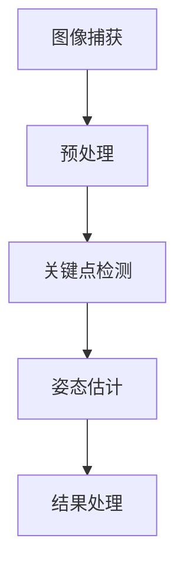

                 

# 《Keep2024校招运动姿态识别算法工程师编程题》

> **关键词：** 运动姿态识别、算法工程师、编程题、深度学习、实时性、多传感器融合

> **摘要：** 本文深入探讨运动姿态识别技术在算法工程师编程中的应用。从基础概念、算法原理到实战案例，全面解析运动姿态识别的关键技术，为2024校招算法工程师提供实战指导。

## 前言

### 引言：运动姿态识别技术的发展背景和重要性

随着人工智能技术的快速发展，运动姿态识别技术在多个领域展现出了巨大的应用价值。从医疗康复、体育运动分析到娱乐游戏，运动姿态识别正在逐渐改变我们的生活。此次Keep2024校招，专门面向运动姿态识别算法工程师，旨在招募具备深厚技术功底和实战经验的人才。

### 校招目的

Keep公司通过此次校招，旨在寻找具备以下特质的人才：

1. **专业知识**：对计算机视觉、深度学习等相关领域有深刻理解。
2. **编程能力**：熟练掌握至少一种编程语言，具备解决复杂问题的能力。
3. **创新思维**：能够从实际问题中挖掘需求，提出创新的解决方案。
4. **团队合作**：具备良好的沟通和协作能力，能够适应团队工作。

### 职责与挑战

校招算法工程师将负责以下工作：

1. **算法研究**：研究并实现先进的运动姿态识别算法。
2. **系统开发**：基于现有算法，开发高效的姿态识别系统。
3. **性能优化**：对系统进行性能优化，确保实时性和准确性。
4. **应用落地**：将运动姿态识别技术应用于Keep平台，提升用户体验。

面对日益复杂的运动姿态识别任务，算法工程师需要应对以下挑战：

1. **实时性**：如何在有限时间内准确识别运动姿态。
2. **准确性**：如何提高识别的准确性，减少误识别率。
3. **扩展性**：如何应对不同场景下的需求，实现系统的灵活扩展。

## 第1章 运动姿态识别基础

### 1.1 运动姿态识别的概念与定义

#### 运动姿态识别的基本原理

运动姿态识别是一种通过检测和分析人体运动，进而判断其姿态的技术。其基本原理包括：

1. **图像捕获**：通过摄像头或其他传感器捕获人体运动图像。
2. **特征提取**：从图像中提取关键特征，如骨骼点、轮廓等。
3. **姿态估计**：利用特征信息，结合机器学习算法，估计人体姿态。

#### 运动姿态识别的应用领域

运动姿态识别技术广泛应用于多个领域：

1. **医疗康复**：辅助康复训练，监测患者运动情况。
2. **体育运动分析**：分析运动员动作，提供改进建议。
3. **娱乐游戏**：实现虚拟现实中的运动控制，提升用户体验。
4. **人机交互**：通过姿态控制，实现与计算机的交互。

### 1.2 运动姿态识别技术概述

#### 运动姿态识别技术的发展历程

1. **早期研究**：20世纪80年代，研究者开始探索基于图像的运动姿态识别。
2. **计算机视觉兴起**：90年代，计算机视觉技术的发展，为运动姿态识别提供了新的手段。
3. **深度学习崛起**：21世纪初，深度学习算法的出现，使得运动姿态识别精度大幅提升。

#### 当前主流的运动姿态识别方法

1. **基于传统机器学习的方法**：如支持向量机、随机森林等。
2. **基于深度学习的方法**：如卷积神经网络（CNN）、循环神经网络（RNN）等。
3. **基于多传感器融合的方法**：结合摄像头、惯性测量单元（IMU）等传感器数据，提高识别精度。

### 1.3 运动姿态识别系统的架构

#### 硬件架构

1. **传感器**：用于捕获人体运动图像的摄像头、IMU等。
2. **计算设备**：用于处理图像和姿态估计的计算机或服务器。

#### 软件架构

1. **特征提取模块**：从图像中提取关键特征。
2. **姿态估计模块**：利用特征信息，估计人体姿态。
3. **结果处理模块**：对识别结果进行分析和展示。

### 1.4 运动姿态识别的关键技术

#### 特征提取

1. **关键点检测**：从图像中检测出人体关键点，如关节点。
2. **姿态估计**：通过关键点位置和几何关系，估计人体姿态。

#### 模型训练

1. **数据集准备**：收集并标注大量运动姿态数据。
2. **模型选择**：选择合适的深度学习模型。
3. **训练与优化**：训练模型，并进行优化，提高识别精度。

#### 实时性处理

1. **算法优化**：通过算法优化，提高处理速度。
2. **硬件加速**：利用GPU等硬件加速设备，提升处理效率。

## 第2章 运动姿态识别算法原理

### 2.1 特征提取算法

#### 关键点检测算法

关键点检测是运动姿态识别的重要环节。常见的算法包括：

1. **单关节点检测算法**：如HOG（Histogram of Oriented Gradients）、SIFT（Scale-Invariant Feature Transform）等。
2. **多关节点检测算法**：如PoseNet、OpenPose等。

#### 姿态估计算法

姿态估计是通过关键点位置和几何关系，估计人体姿态的过程。常见的算法包括：

1. **基于几何关系的算法**：如线性分类器、支持向量机等。
2. **基于深度学习的算法**：如卷积神经网络（CNN）、循环神经网络（RNN）等。

#### 图 Mermaid 流程图：关键点检测与姿态估计流程图



### 2.2 模型训练与优化

#### 伪代码：运动姿态识别模型的训练过程

```python
# 初始化模型
model = initialize_model()

# 准备训练数据
train_data = load_data('train_data')

# 训练模型
for epoch in range(num_epochs):
    for data in train_data:
        # 前向传播
        predictions = model.forward(data)

        # 计算损失
        loss = compute_loss(predictions, data.labels)

        # 反向传播
        model.backward(loss)

        # 更新模型参数
        model.update_params()

# 优化模型
model.optimize()
```

#### 模型优化策略

1. **数据增强**：通过增加数据多样性，提高模型泛化能力。
2. **正则化**：如L1正则化、L2正则化等，防止模型过拟合。
3. **学习率调整**：通过调整学习率，提高训练效果。

### 2.3 运动姿态识别系统的性能评估

#### 准确率、召回率等指标

1. **准确率（Accuracy）**：正确识别的姿态占总姿态的比例。
2. **召回率（Recall）**：正确识别的姿态占实际姿态的比例。
3. **F1值（F1 Score）**：准确率和召回率的调和平均值。

#### 实时性分析

1. **处理时间**：从图像捕获到姿态识别完成的时间。
2. **延迟**：处理时间与实际需要时间之差。

## 第3章 实际应用场景分析

### 3.1 运动康复与辅助训练

#### 康复训练中的应用案例

1. **骨折康复**：通过运动姿态识别，监测患者康复训练的进展，确保运动安全。
2. **术后康复**：帮助患者进行针对性康复训练，提高康复效果。

#### 辅助训练中的应用案例

1. **运动技巧提升**：通过姿态识别，分析运动员运动姿势，提供改进建议。
2. **体能训练**：根据用户运动姿态，制定个性化训练计划，提升运动效果。

### 3.2 体育运动分析

#### 运动技术分析

1. **运动表现评估**：通过对运动员姿态分析，评估其运动技术水平。
2. **动作优化**：通过姿态识别，帮助运动员优化动作，提高运动成绩。

#### 运动损伤预防

1. **姿势检测**：实时监测运动员姿势，及时发现异常，预防运动损伤。
2. **康复指导**：在运动员受伤后，提供康复训练建议，促进康复。

### 3.3 娱乐与游戏

#### 虚拟现实中的运动识别

1. **动作捕捉**：通过姿态识别，实现虚拟现实中的运动控制。
2. **游戏交互**：利用姿态识别，提升游戏互动性和沉浸感。

#### 游戏中的运动控制

1. **运动传感器**：利用摄像头和传感器，实现游戏中的运动控制。
2. **姿态互动**：通过姿态识别，实现游戏中的角色互动，提升游戏体验。

## 第4章 运动姿态识别编程实战

### 4.1 开发环境搭建

#### 编程语言选择

1. **Python**：Python具有丰富的库和工具，适合进行运动姿态识别编程。
2. **C++**：C++具有较高的性能，适合对实时性要求较高的应用场景。

#### 相关库和工具安装

1. **OpenPose**：用于关键点检测和姿态估计的开源库。
2. **TensorFlow**：用于深度学习模型训练的开源框架。
3. **Dlib**：用于特征提取和姿态估计的开源库。

### 4.2 代码实现与解读

#### 代码解读与分析：关键点检测与姿态估计实现

```python
import cv2
import openpose as op

# 初始化OpenPose
params = op.param виз Singles()
params.set_model_folder("/path/to/pose/coco/")

# 加载模型
model = op.run(params)

# 读取图像
image = cv2.imread("/path/to/image.jpg")

# 关键点检测与姿态估计
keypoints, _ = model.forward(image)

# 结果处理
for person in keypoints:
    # 获取关键点坐标
    for keypoint in person:
        x, y = keypoint
        cv2.circle(image, (x, y), 5, (0, 0, 255), -1)

# 显示结果
cv2.imshow("Result", image)
cv2.waitKey(0)
cv2.destroyAllWindows()
```

#### 实战项目一：运动康复应用

1. **项目背景**：通过运动姿态识别，监测患者康复训练的进展。
2. **项目目标**：实现运动康复辅助系统，提供实时反馈和改进建议。
3. **项目实现**：

   - **关键点检测与姿态估计**：利用OpenPose实现关键点检测和姿态估计。
   - **数据采集与存储**：采集患者运动数据，并存储到数据库中。
   - **结果分析与反馈**：分析患者运动姿势，提供实时反馈和改进建议。

#### 实战项目二：体育运动分析

1. **项目背景**：通过对运动员姿态分析，提升运动技术水平。
2. **项目目标**：实现体育运动分析系统，提供运动技巧评估和动作优化建议。
3. **项目实现**：

   - **关键点检测与姿态估计**：利用OpenPose实现关键点检测和姿态估计。
   - **数据采集与处理**：采集运动员运动数据，并进行预处理。
   - **结果分析与展示**：分析运动员运动姿势，生成可视化报告，提供优化建议。

## 第5章 深度学习在运动姿态识别中的应用

### 5.1 卷积神经网络在运动姿态识别中的应用

#### 卷积神经网络的基本原理

卷积神经网络（Convolutional Neural Network，CNN）是一种用于图像处理的深度学习模型。其基本原理包括：

1. **卷积层**：通过卷积操作，提取图像特征。
2. **池化层**：通过池化操作，减少特征维度，提高模型泛化能力。
3. **全连接层**：将特征映射到输出结果。

#### 卷积神经网络在姿态识别中的应用

1. **关键点检测**：利用CNN提取图像特征，实现关键点检测。
2. **姿态估计**：将关键点位置信息输入到CNN，估计人体姿态。

### 5.2 循环神经网络在运动姿态识别中的应用

#### 循环神经网络的基本原理

循环神经网络（Recurrent Neural Network，RNN）是一种用于序列处理的深度学习模型。其基本原理包括：

1. **隐藏状态**：通过隐藏状态保存历史信息。
2. **循环连接**：通过循环连接，实现时间序列的信息传递。

#### 循环神经网络在姿态识别中的应用

1. **姿态估计**：利用RNN处理连续的关键点序列，实现姿态估计。
2. **动作识别**：通过RNN识别连续动作，实现动作分类。

## 第6章 运动姿态识别算法优化

### 6.1 实时性优化

#### 算法加速策略

1. **模型压缩**：通过模型压缩，减少模型参数，提高处理速度。
2. **量化**：通过量化，降低模型计算精度，减少计算资源消耗。

#### 实时性评估方法

1. **处理时间**：从图像捕获到姿态识别完成的时间。
2. **延迟**：处理时间与实际需要时间之差。

### 6.2 精度优化

#### 特征提取优化

1. **多尺度和多视角特征**：通过多尺度和多视角特征，提高姿态识别精度。
2. **数据增强**：通过数据增强，增加模型训练数据多样性。

#### 模型优化策略

1. **模型融合**：通过融合多个模型，提高姿态识别精度。
2. **迁移学习**：利用预训练模型，提高新任务上的识别精度。

### 6.3 多传感器融合

#### 多传感器数据采集

1. **摄像头**：用于捕获运动图像。
2. **惯性测量单元（IMU）**：用于测量运动加速度和角速度。

#### 多传感器数据融合方法

1. **滤波方法**：如卡尔曼滤波、互补滤波等，融合传感器数据。
2. **深度学习方法**：利用深度学习模型，融合多传感器数据，提高姿态识别精度。

## 第7章 未来展望与挑战

### 7.1 运动姿态识别技术的发展趋势

1. **深度学习算法的优化**：随着深度学习算法的不断发展，运动姿态识别技术将更加精准和高效。
2. **多传感器融合**：多传感器融合将进一步提高姿态识别精度和实时性。
3. **人工智能与其他技术的结合**：运动姿态识别技术将与其他人工智能技术（如自然语言处理、计算机视觉等）相结合，拓展应用领域。

### 7.2 运动姿态识别在社会中的应用

1. **医疗康复**：运动姿态识别技术将帮助更多患者进行有效康复训练。
2. **体育运动**：运动姿态识别技术将提升运动员训练效果和竞技水平。
3. **娱乐游戏**：运动姿态识别技术将丰富虚拟现实和游戏体验。

### 7.3 技术革新带来的挑战

1. **数据处理**：随着数据量的增加，如何高效处理和分析海量数据将成为挑战。
2. **隐私保护**：在应用运动姿态识别技术时，如何保护用户隐私成为重要问题。
3. **技术普及**：如何降低技术门槛，让更多开发者和应用场景受益于运动姿态识别技术。

## 附录

### 附录 A：运动姿态识别算法开源资源与工具

1. **开源算法库**：

   - OpenPose：用于关键点检测和姿态估计的开源库。
   - CPM（Cascaded Pose Machine）：用于姿态估计的开源库。

2. **开源数据集**：

   - Human Pose Estimation Challenge 2016 (HPE 2016)：包含大量人体姿态标注数据。
   - Human3.6M：包含多视角人体姿态数据。

3. **开发工具与平台推荐**：

   - TensorFlow：用于深度学习模型训练的开源框架。
   - PyTorch：用于深度学习模型训练的开源框架。
   - CUDA：用于GPU加速的计算平台。

### 作者

**作者：AI天才研究院/AI Genius Institute & 禅与计算机程序设计艺术 /Zen And The Art of Computer Programming**

