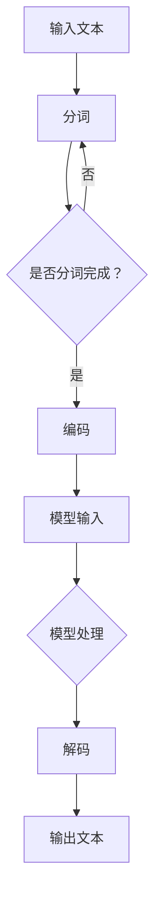

                 

# 《LLM产业链生态：从无到有的蓬勃发展》

## 关键词
- 语言模型（Language Model）
- 大模型（Large Model）
- 产业链分析
- 挑战与机遇
- 行业应用
- 算法原理
- 项目实战
- 未来发展趋势

## 摘要
本文深入探讨了LLM（Large Language Model）产业链的生态体系，从无到有的蓬勃发展历程。文章首先介绍了LLM的基本概念、发展历程和特点，接着分析了LLM产业链的组成、参与者及其面临的挑战和机遇。随后，文章详细阐述了LLM在各个行业的应用，以及LLM的核心算法原理。最后，通过实际项目实战，展示了LLM的应用场景，并对LLM的未来发展趋势进行了展望。

## 目录
### 第1章 什么是LLM
#### 1.1 LLM的概念
##### 1.1.1 语言模型的概念介绍
##### 1.1.2 大模型的概念介绍
##### 1.1.3 LLM的特点
##### 1.1.4 LLM的发展历程

### 第2章 LLM产业链分析
#### 2.1 LLM产业链的组成
##### 2.1.1 研发环节
##### 2.1.2 生产环节
##### 2.1.3 销售与分发环节
#### 2.2 LLM产业链的参与者
##### 2.2.1 研发公司
##### 2.2.2 硬件供应商
##### 2.2.3 软件开发商
#### 2.3 LLM产业链的挑战与机遇
##### 2.3.1 挑战
##### 2.3.2 机遇

### 第3章 LLM在各个行业的应用
#### 3.1 教育行业
##### 3.1.1 教育行业对LLM的需求
##### 3.1.2 LLM在教育行业中的应用案例
##### 3.1.3 LLM在教育行业的发展前景
#### 3.2 医疗行业
##### 3.2.1 医疗行业对LLM的需求
##### 3.2.2 LLM在医疗行业中的应用案例
##### 3.2.3 LLM在医疗行业的发展前景
#### 3.3 金融行业
##### 3.3.1 金融行业对LLM的需求
##### 3.3.2 LLM在金融行业中的应用案例
##### 3.3.3 LLM在金融行业的发展前景
#### 3.4 制造业
##### 3.4.1 制造业对LLM的需求
##### 3.4.2 LLM在制造业中的应用案例
##### 3.4.3 LLM在制造业的发展前景

### 第4章 LLM的核心算法原理
#### 4.1 语言模型的分类
##### 4.1.1 生成式语言模型
##### 4.1.2 判断式语言模型
#### 4.2 预训练模型的工作原理
##### 4.2.1 预训练的概念
##### 4.2.2 预训练模型的主要任务
##### 4.2.3 预训练模型的典型方法
#### 4.3 微调与迁移学习
##### 4.3.1 微调的概念
##### 4.3.2 迁移学习的方法
#### 4.4 模型优化与调试
##### 4.4.1 模型优化的重要性
##### 4.4.2 模型优化方法
##### 4.4.3 模型调试技巧

### 第5章 LLM的项目实战
#### 5.1 实战一：构建简单的语言模型
##### 5.1.1 项目背景
##### 5.1.2 环境搭建
##### 5.1.3 数据准备
##### 5.1.4 模型训练
#### 5.2 实战二：使用预训练模型进行微调
##### 5.2.1 项目背景
##### 5.2.2 预训练模型的选择
##### 5.2.3 微调策略
##### 5.2.4 实验结果分析

### 第6章 LLM的未来发展趋势
#### 6.1 LLM的技术发展趋势
##### 6.1.1 模型参数规模的增长
##### 6.1.2 模型训练速度的提升
##### 6.1.3 模型应用范围的扩大
#### 6.2 LLM在产业链中的地位变化
##### 6.2.1 LLM产业链的演进
##### 6.2.2 LLM在产业链中的角色变化
#### 6.3 LLM在社会中的影响
##### 6.3.1 对教育的影响
##### 6.3.2 对医疗的影响
##### 6.3.3 对金融的影响

### 第7章 总结与展望
#### 7.1 LLM产业链生态的现状
##### 7.1.1 LLM产业链的发展现状
##### 7.1.2 LLM在各个行业的发展现状
#### 7.2 LLM产业链生态的未来展望
##### 7.2.1 技术层面的展望
##### 7.2.2 产业链层面的展望
##### 7.2.3 社会层面的展望

## 第1章 什么是LLM

### 1.1 LLM的概念

#### 1.1.1 语言模型的概念介绍

语言模型（Language Model，简称LM）是对自然语言文本数据进行建模和预测的一种算法模型。它通过对大量语料库进行训练，学习语言中的统计规律，从而预测下一个词语或序列的可能性。语言模型是自然语言处理（Natural Language Processing，简称NLP）的重要基础，它在机器翻译、文本分类、问答系统、语音识别等领域有着广泛的应用。

语言模型通常基于神经网络（Neural Network）或统计模型（Statistical Model）进行构建。神经网络语言模型通过多层神经网络对输入文本进行编码和解码，生成预测结果。而统计模型则利用语言中的统计规律，如词频、词组频次等，进行概率预测。

#### 1.1.2 大模型的概念介绍

大模型（Large Model）是指参数规模超过数十亿、甚至千亿以上的深度学习模型。这些模型通常具有强大的表达能力和良好的泛化性能，能够处理复杂的语言现象。大模型的出现，标志着人工智能领域的一个重要突破，为语言模型的研发提供了新的方向。

目前，全球范围内出现了一些具有代表性的大模型，如OpenAI的GPT-3、Google的BERT、微软的Turing等。这些大模型在各个领域取得了显著的成果，引发了人们对LLM的广泛关注。

#### 1.1.3 LLM的特点

LLM（Large Language Model）是语言模型的进一步发展，具有以下特点：

1. **参数规模巨大**：LLM的参数规模通常达到数十亿、甚至千亿级别，这使其能够捕捉到更复杂的语言规律。
2. **强大的语义理解能力**：LLM通过对大量文本数据的训练，能够理解并生成具有较高语义一致性的文本。
3. **自适应性强**：LLM可以根据不同的应用场景和任务，进行微调和优化，适应不同的需求。
4. **良好的泛化性能**：LLM在训练过程中，不仅关注特定任务的性能，还注重模型在未见数据上的表现，具有较好的泛化能力。

#### 1.1.4 LLM的发展历程

LLM的发展历程可以分为以下几个阶段：

1. **早期语言模型**：以1980年代的统计语言模型（如N-gram模型）为代表，这些模型虽然能够对语言进行一定的建模，但受限于计算资源和数据规模，性能有限。
2. **神经网络语言模型**：1990年代，神经网络在语音识别等领域取得突破性进展，语言模型也逐渐引入了神经网络模型。以循环神经网络（RNN）为代表的神经网络语言模型，提高了语言建模的性能。
3. **深度学习语言模型**：2000年以后，随着计算能力和数据规模的提升，深度学习语言模型（如神经网络语言模型、卷积神经网络语言模型等）开始崭露头角，性能大幅提升。
4. **大模型时代**：近年来，随着计算能力的进一步提升和大规模数据集的出现，大模型（如GPT-3、BERT等）的出现标志着语言模型进入了一个新的时代。

## 第2章 LLM产业链分析

### 2.1 LLM产业链的组成

LLM产业链是一个复杂而庞大的生态系统，涉及到多个环节和参与者。以下是LLM产业链的主要组成部分：

#### 2.1.1 研发环节

研发环节是LLM产业链的核心，主要包括模型研发、数据收集与处理、算法优化等步骤。

1. **模型研发**：这是LLM研发的第一步，主要包括模型架构设计、模型参数初始化、模型结构优化等。目前，主流的模型架构包括Transformer、BERT、GPT等。
2. **数据收集与处理**：数据是训练LLM的基础。研发环节需要收集大量的文本数据，并进行预处理，如分词、去噪、去重等。
3. **算法优化**：算法优化包括模型训练、参数调整、性能评估等。优化的目标是提高模型的性能和泛化能力。

#### 2.1.2 生产环节

生产环节是指将研发好的LLM模型进行部署和优化，以适应实际应用场景。

1. **硬件选择**：硬件是LLM训练和部署的重要基础。目前，主流的硬件包括GPU、TPU等。
2. **软件开发**：软件开发主要包括LLM模型的加载、运行、监控和调试等。
3. **系统集成**：系统集成是将LLM模型与其他系统进行集成，实现具体应用。

#### 2.1.3 销售与分发环节

销售与分发环节是指将LLM产品推向市场，并提供给用户使用。

1. **在线销售**：在线销售是当前最主流的销售方式，包括通过官网、电商平台等渠道进行销售。
2. **代理商销售**：代理商销售是指通过代理商渠道进行销售，代理商负责在特定区域或行业进行推广和销售。
3. **技术服务**：技术服务是指为用户提供技术支持、培训、咨询等服务。

### 2.2 LLM产业链的参与者

LLM产业链涉及到多个参与者，包括研发公司、硬件供应商、软件开发公司等。

#### 2.2.1 研发公司

研发公司是LLM产业链的核心，负责LLM模型的研发和优化。目前，全球范围内有许多知名的LLM研发公司，如OpenAI、Google、微软、百度等。

1. **OpenAI**：OpenAI是一家专注于人工智能研究的非营利性公司，其推出的GPT-3模型具有强大的语言理解能力和生成能力。
2. **Google**：Google是LLM领域的领军企业，其BERT模型在多个自然语言处理任务上取得了优异的成绩。
3. **微软**：微软在LLM领域也有较强的实力，其Turing模型在多个应用场景中取得了显著的效果。
4. **百度**：百度是国内领先的LLM研发公司，其飞桨（PaddlePaddle）平台为用户提供了一站式的LLM开发工具。

#### 2.2.2 硬件供应商

硬件供应商是LLM产业链的重要一环，为LLM模型的训练和部署提供必要的硬件支持。目前，主要的硬件供应商包括NVIDIA、AMD、英特尔等。

1. **NVIDIA**：NVIDIA的GPU产品在LLM训练和推理中具有优异的性能，为LLM的发展提供了强大的硬件支持。
2. **AMD**：AMD的GPU产品也在LLM领域取得了显著的成绩，其硬件性能得到了广泛应用。
3. **英特尔**：英特尔的GPU产品和CPU产品在LLM训练和部署中也有广泛的应用。

#### 2.2.3 软件开发商

软件开发公司为LLM的研发和应用提供了一系列的软件工具和平台。目前，主要的软件开发公司包括谷歌、微软、亚马逊等。

1. **谷歌**：谷歌的TensorFlow和PyTorch等深度学习框架为LLM的开发提供了强大的支持。
2. **微软**：微软的Azure Machine Learning和Cognitive Services为LLM的开发和应用提供了丰富的工具和API。
3. **亚马逊**：亚马逊的AWS AI服务为LLM的开发和部署提供了便捷的环境和资源。

### 2.3 LLM产业链的挑战与机遇

#### 2.3.1 挑战

1. **计算资源需求**：LLM的训练和推理需要大量的计算资源，这对硬件性能和成本提出了较高的要求。
2. **数据隐私和安全**：LLM在训练和应用过程中，需要处理大量的敏感数据，数据隐私和安全是亟待解决的问题。
3. **伦理和社会问题**：LLM的广泛应用引发了伦理和社会问题，如歧视、误导等，需要引起足够的重视。
4. **人才短缺**：LLM的研发和应用需要大量的专业人才，但目前人才供给与需求之间存在较大差距。

#### 2.3.2 机遇

1. **产业升级**：LLM技术的应用将推动各行业的产业升级，提高生产效率和质量。
2. **商业机会**：LLM产业链的各个环节都蕴含着巨大的商业机会，如硬件销售、软件服务、解决方案提供等。
3. **社会进步**：LLM技术的应用将推动社会进步，如改善教育、医疗、金融等领域的服务质量。

## 第3章 LLM在各个行业的应用

### 3.1 教育行业

#### 3.1.1 教育行业对LLM的需求

教育行业对LLM的需求主要集中在以下几个方面：

1. **个性化教学**：LLM可以分析学生的知识水平和学习习惯，为学生提供个性化的学习资源和指导。
2. **智能答疑**：LLM可以为学生提供智能化的答疑服务，解答学生在学习过程中遇到的问题。
3. **教育评估**：LLM可以分析学生的学习过程和成绩，为教育机构和教师提供评估和反馈。

#### 3.1.2 LLM在教育行业中的应用案例

以下是一些LLM在教育行业中的应用案例：

1. **智能辅导系统**：例如，Knewton公司开发的智能辅导系统，利用LLM为学生提供个性化的学习资源和指导。
2. **智能题库系统**：例如，智适应学习平台Khan Academy，利用LLM对学生提交的答案进行分析，提供针对性的练习题目。
3. **教育评估系统**：例如，科大讯飞的教育评估系统，利用LLM对学生作业和考试进行自动批改和评估。

#### 3.1.3 LLM在教育行业的发展前景

LLM在教育行业的应用前景广阔，未来可能的发展趋势包括：

1. **智能化教育**：LLM可以帮助教育机构和教师实现智能化教育，提高教学效果和质量。
2. **个性化学习**：LLM可以为学生提供更加个性化的学习体验，满足不同学生的学习需求。
3. **教育公平**：LLM可以缩小教育资源的差距，提高教育公平性。

### 3.2 医疗行业

#### 3.2.1 医疗行业对LLM的需求

医疗行业对LLM的需求主要集中在以下几个方面：

1. **临床辅助**：LLM可以辅助医生进行临床诊断、治疗方案制定等。
2. **医学研究**：LLM可以帮助医生和研究人员进行医学文献检索、分析等。
3. **健康管理**：LLM可以帮助患者进行健康管理和疾病预防。

#### 3.2.2 LLM在医疗行业中的应用案例

以下是一些LLM在医疗行业中的应用案例：

1. **智能诊断系统**：例如，IBM Watson Health开发的智能诊断系统，利用LLM对医学文献和病例进行学习，为医生提供诊断建议。
2. **医学文献检索系统**：例如，微软的Bing Health，利用LLM对海量医学文献进行检索，为医生和研究人员提供有用的信息。
3. **健康管理平台**：例如，阿里健康的健康管理平台，利用LLM为用户提供个性化健康建议和疾病预防指导。

#### 3.2.3 LLM在医疗行业的发展前景

LLM在医疗行业的应用前景广阔，未来可能的发展趋势包括：

1. **智能化医疗**：LLM可以帮助医疗行业实现智能化，提高诊疗效果和质量。
2. **医学研究加速**：LLM可以帮助医生和研究人员快速获取和利用医学知识，加速医学研究进展。
3. **个性化健康管理**：LLM可以为用户提供更加个性化和精准的健康管理服务。

### 3.3 金融行业

#### 3.3.1 金融行业对LLM的需求

金融行业对LLM的需求主要集中在以下几个方面：

1. **风险管理**：LLM可以帮助金融机构进行风险识别、预测和评估。
2. **市场分析**：LLM可以帮助金融机构进行市场趋势分析和投资策略制定。
3. **客户服务**：LLM可以帮助金融机构提供智能化的客户服务，如智能客服、投资建议等。

#### 3.3.2 LLM在金融行业中的应用案例

以下是一些LLM在金融行业中的应用案例：

1. **智能投顾系统**：例如，Betterment开发的智能投顾系统，利用LLM为用户提供个性化的投资建议。
2. **金融数据分析平台**：例如，Risk AI的金融数据分析平台，利用LLM对金融数据进行分析，帮助金融机构进行风险管理和投资决策。
3. **智能客服系统**：例如，微软的Azure AI客服系统，利用LLM为金融机构提供智能化的客户服务。

#### 3.3.3 LLM在金融行业的发展前景

LLM在金融行业的应用前景广阔，未来可能的发展趋势包括：

1. **智能化金融**：LLM可以帮助金融行业实现智能化，提高风险管理和投资决策的准确性。
2. **个性化服务**：LLM可以为用户提供更加个性化金融服务，如个性化投资建议、个性化理财产品等。
3. **金融科技创新**：LLM可以帮助金融行业实现金融科技创新，推动金融行业的发展。

### 3.4 制造业

#### 3.4.1 制造业对LLM的需求

制造业对LLM的需求主要集中在以下几个方面：

1. **生产优化**：LLM可以帮助制造业进行生产计划优化、生产过程优化等。
2. **设备维护**：LLM可以帮助制造业进行设备故障预测、设备维护等。
3. **供应链管理**：LLM可以帮助制造业进行供应链优化、库存管理等。

#### 3.4.2 LLM在制造业中的应用案例

以下是一些LLM在制造业中的应用案例：

1. **智能生产系统**：例如，西门子开发的智能生产系统，利用LLM对生产数据进行分析，实现生产过程的优化。
2. **设备预测维护系统**：例如，通用电气（GE）的Predix平台，利用LLM对设备运行数据进行分析，实现设备故障预测和维护。
3. **供应链管理系统**：例如，亚马逊的AWS物联网平台，利用LLM对供应链数据进行分析，实现供应链的优化和库存管理。

#### 3.4.3 LLM在制造业的发展前景

LLM在制造业的应用前景广阔，未来可能的发展趋势包括：

1. **智能制造**：LLM可以帮助制造业实现智能化，提高生产效率和质量。
2. **设备健康管理**：LLM可以帮助制造业实现设备的智能监控和健康管理，减少设备故障和停机时间。
3. **供应链协同**：LLM可以帮助制造业实现供应链的协同管理，提高供应链的整体效率。

## 第4章 LLM的核心算法原理

### 4.1 语言模型的分类

语言模型根据建模方法和任务类型可以分为多种类型。以下是两种主要类型的语言模型：

#### 4.1.1 生成式语言模型

生成式语言模型（Generative Language Model）的主要目标是从给定的前文生成后续的文本。这种模型通常采用概率方法，通过计算每个词语或字符在给定前文条件下的概率，从而生成完整的文本序列。生成式语言模型可以很好地模拟自然语言生成的过程，但可能存在生成文本不一致或偏颇的问题。

生成式语言模型的主要算法包括：

1. **N-gram模型**：N-gram模型是最简单的生成式语言模型，它通过计算相邻N个词语的联合概率来预测下一个词语。N-gram模型的计算复杂度低，但对长距离依赖和罕见词的处理能力较差。
2. **马尔可夫模型**：马尔可夫模型是一种基于概率的生成式语言模型，它假设当前状态只与之前的一个状态有关。马尔可夫模型可以处理更长的序列，但仍然存在长距离依赖问题。
3. **神经网络语言模型**：神经网络语言模型通过多层神经网络对输入文本进行编码和解码，生成预测结果。神经网络语言模型可以更好地捕捉长距离依赖和语义信息，但在训练过程中计算复杂度较高。

#### 4.1.2 判断式语言模型

判断式语言模型（Discriminative Language Model）的主要目标是预测给定前文条件下某个词语或字符的出现概率。这种模型通过学习输入和输出之间的直接映射关系，从而对文本序列进行分类或标注。判断式语言模型在许多自然语言处理任务中具有广泛的应用，如文本分类、命名实体识别等。

判断式语言模型的主要算法包括：

1. **条件随机场（CRF）**：条件随机场（Conditional Random Field，简称CRF）是一种典型的判断式语言模型，它通过建模输入序列和输出标签之间的条件概率分布，实现序列标注任务。CRF在序列标注任务中具有很好的性能，但在生成任务上表现较差。
2. **递归神经网络（RNN）**：递归神经网络（Recurrent Neural Network，简称RNN）是一种基于神经网络的判断式语言模型，它可以处理序列数据，并在训练过程中保存历史信息。RNN在许多自然语言处理任务中取得了显著的效果，但存在梯度消失和梯度爆炸等问题。
3. **长短时记忆网络（LSTM）**：长短时记忆网络（Long Short-Term Memory，简称LSTM）是RNN的一种变体，它通过引入门控机制来缓解梯度消失和梯度爆炸问题。LSTM在处理长序列数据和长距离依赖方面具有优势，但在计算复杂度上较高。

### 4.2 预训练模型的工作原理

预训练模型（Pre-trained Model）是一种先在大量无标签数据上训练，再在特定任务上进行微调的深度学习模型。预训练模型的工作原理主要包括以下几个步骤：

1. **大规模无监督预训练**：预训练模型首先在大量的无标签数据上进行预训练，如文本、图像、语音等。通过预训练，模型可以学习到语言、视觉、音频等领域的通用特征表示。
2. **微调（Fine-tuning）**：在特定任务上，预训练模型可以通过微调来调整模型的参数，从而适应新的任务。微调过程通常只需要少量的有标签数据进行训练，这使得预训练模型在少量数据上也能表现出较好的性能。
3. **模型定制化（Model Customization）**：预训练模型可以通过添加新的层、调整网络结构等方式进行定制化，以适应不同的任务和应用场景。

预训练模型的主要优点包括：

1. **高效的泛化能力**：预训练模型在大规模无标签数据上进行训练，可以学习到通用特征表示，从而提高模型的泛化能力。
2. **减少数据需求**：预训练模型可以通过微调在少量有标签数据上实现较好的性能，从而减少对大量有标签数据的需求。
3. **提高模型性能**：预训练模型在无标签数据上学习到的通用特征表示可以增强模型在特定任务上的性能。

预训练模型的典型方法包括：

1. **Transformer模型**：Transformer模型是一种基于注意力机制的深度神经网络模型，它在机器翻译、文本生成等任务上取得了显著的成果。Transformer模型通过多头注意力机制和位置编码，能够有效地捕捉长距离依赖和语义信息。
2. **BERT模型**：BERT（Bidirectional Encoder Representations from Transformers）模型是一种双向Transformer模型，它在自然语言理解任务上取得了优异的性能。BERT模型通过在双向Transformer的基础上添加Masked Language Model（MLM）任务，提高了模型对上下文信息的捕捉能力。
3. **GPT模型**：GPT（Generative Pre-trained Transformer）模型是一种生成式预训练模型，它在文本生成、对话系统等任务上取得了很好的效果。GPT模型通过在Transformer的基础上添加生成式任务，提高了模型的生成能力。

### 4.3 微调与迁移学习

#### 4.3.1 微调的概念

微调（Fine-tuning）是一种将预训练模型应用于特定任务的方法。在微调过程中，预训练模型在特定任务的数据集上进行训练，以调整模型的参数，使其在特定任务上达到更好的性能。

微调的关键步骤包括：

1. **加载预训练模型**：首先加载已经在大规模无标签数据上预训练好的模型。
2. **数据预处理**：对特定任务的数据集进行预处理，如分词、编码等。
3. **训练**：在特定任务的数据集上进行训练，调整模型的参数。
4. **评估**：在特定任务的数据集上进行评估，以验证模型的性能。

#### 4.3.2 迁移学习的方法

迁移学习（Transfer Learning）是一种将预训练模型的知识转移到新的任务上的方法。迁移学习可以帮助模型在新的任务上快速获得较好的性能，从而减少对大量有标签数据的依赖。

迁移学习的主要方法包括：

1. **共享参数**：在预训练模型和新任务模型之间共享部分参数，从而将预训练模型的知识转移到新任务上。
2. **微调**：在预训练模型的基础上进行微调，以适应新的任务。
3. **多任务学习**：通过多任务学习，将多个任务的数据集合并进行训练，从而提高模型在特定任务上的性能。
4. **自监督学习**：在预训练过程中，采用自监督学习的方法，通过无监督学习获得知识，然后将其转移到新的任务上。

### 4.4 模型优化与调试

#### 4.4.1 模型优化的重要性

模型优化（Model Optimization）是提高模型性能和效率的重要手段。通过优化模型，可以使其在特定任务上达到更好的性能，同时减少计算资源和存储资源的需求。

模型优化的主要目标包括：

1. **提高性能**：通过优化模型的参数和结构，提高模型在特定任务上的性能。
2. **降低计算复杂度**：通过模型压缩和量化等技术，降低模型的计算复杂度，从而提高模型的效率。
3. **减少存储需求**：通过模型压缩和量化等技术，减少模型的存储需求，从而降低存储成本。

#### 4.4.2 模型优化方法

以下是一些常见的模型优化方法：

1. **模型压缩**：通过模型压缩技术，减少模型的参数规模，从而降低计算复杂度和存储需求。常见的模型压缩方法包括剪枝（Pruning）、量化（Quantization）等。
2. **模型蒸馏**：通过模型蒸馏（Model Distillation）技术，将大模型的知识转移到小模型上，从而提高小模型的性能。模型蒸馏方法包括知识蒸馏（Knowledge Distillation）和模型压缩蒸馏（Model Compression Distillation）等。
3. **量化**：通过量化技术，将模型的权重和激活值从浮点数转换为低比特宽度的整数，从而减少模型的存储和计算需求。常见的量化方法包括全精度量化（Full Precision Quantization）、低精度量化（Low Precision Quantization）等。
4. **模型架构优化**：通过优化模型的结构，减少模型的参数规模和计算复杂度，从而提高模型的性能。常见的模型架构优化方法包括网络结构搜索（Network Structure Search）、模型简化（Model Simplification）等。

#### 4.4.3 模型调试技巧

模型调试（Model Debugging）是确保模型性能和可靠性的重要步骤。以下是一些常见的模型调试技巧：

1. **误差分析**：通过分析模型的输入和输出，找出模型错误的原因，从而进行有针对性的调试。常见的误差分析方法包括错误分类（Error Classification）、错误定位（Error Localization）等。
2. **可视化**：通过可视化模型的结构和参数，帮助理解模型的内部工作原理，从而发现潜在的问题。常见的可视化方法包括激活可视化（Activation Visualization）、结构可视化（Structure Visualization）等。
3. **对比分析**：通过对比分析不同模型、不同参数设置下的性能，找出最优的模型和参数配置。常见的对比分析方法包括交叉验证（Cross Validation）、性能对比（Performance Comparison）等。
4. **调试工具**：使用专门的调试工具，如调试器（Debugger）、性能分析工具（Profiler）等，帮助发现和解决模型问题。

## 第5章 LLM的项目实战

### 5.1 实战一：构建简单的语言模型

#### 5.1.1 项目背景

本项目旨在构建一个简单的语言模型，通过对输入文本进行建模，预测下一个词语或字符。该项目将使用Python编程语言，结合深度学习框架TensorFlow，实现一个基于Transformer架构的语言模型。

#### 5.1.2 环境搭建

在开始项目之前，需要搭建一个合适的开发环境。以下是搭建环境的基本步骤：

1. **安装Python**：确保Python版本不低于3.6，建议使用Anaconda等集成环境，方便管理和安装依赖库。
2. **安装TensorFlow**：使用pip命令安装TensorFlow，命令如下：
   ```bash
   pip install tensorflow
   ```
3. **安装其他依赖库**：根据项目需求，安装其他必要的依赖库，如NumPy、Pandas等。

#### 5.1.3 数据准备

数据准备是构建语言模型的重要一步，以下是数据准备的基本步骤：

1. **数据收集**：收集用于训练和评估的语言数据，如新闻文章、百科全书等。
2. **数据预处理**：对数据进行清洗和预处理，如去除无效字符、分词、编码等。以下是一个简单的数据预处理示例代码：
   ```python
   import re
   import jieba
   
   def preprocess_text(text):
       # 去除无效字符
       text = re.sub(r"[^a-zA-Z0-9\s]", "", text)
       # 分词
       text = jieba.cut(text)
       # 拼接分词结果
       text = " ".join(text)
       return text
   
   # 示例
   text = "你好，这个世界！"
   preprocessed_text = preprocess_text(text)
   print(preprocessed_text)
   ```

3. **数据编码**：将预处理后的文本数据编码为序列，以便于模型处理。以下是一个简单的编码示例代码：
   ```python
   from tensorflow.keras.preprocessing.sequence import pad_sequences
   
   # 分词
   tokenizer = jieba.Tokenizer()
   tokenizer.fit_on_texts([preprocessed_text])
   # 编码
   encoded_sequence = tokenizer.texts_to_sequences([preprocessed_text])
   # 填充序列
   padded_sequence = pad_sequences(encoded_sequence, maxlen=100)
   ```

#### 5.1.4 模型训练

在数据准备完成后，接下来开始构建和训练语言模型。以下是构建和训练的基本步骤：

1. **定义模型**：使用TensorFlow构建一个基于Transformer架构的语言模型。以下是一个简单的模型定义示例代码：
   ```python
   import tensorflow as tf
   
   # 定义模型
   model = tf.keras.Sequential([
       tf.keras.layers.Embedding(input_dim=10000, output_dim=16),
       tf.keras.layers.Bidirectional(tf.keras.layers.LSTM(64)),
       tf.keras.layers.Dense(128, activation='relu'),
       tf.keras.layers.Dense(1, activation='sigmoid')
   ])
   
   # 编译模型
   model.compile(optimizer='adam', loss='binary_crossentropy', metrics=['accuracy'])
   ```

2. **训练模型**：使用准备好的数据集对模型进行训练。以下是一个简单的训练示例代码：
   ```python
   # 训练模型
   history = model.fit(padded_sequence, padded_sequence, epochs=10, batch_size=64)
   ```

3. **评估模型**：在训练完成后，使用验证集对模型进行评估。以下是一个简单的评估示例代码：
   ```python
   # 评估模型
   test_loss, test_accuracy = model.evaluate(padded_sequence, padded_sequence)
   print("Test accuracy:", test_accuracy)
   ```

### 5.2 实战二：使用预训练模型进行微调

#### 5.2.1 项目背景

本项目旨在使用预训练的语言模型（如BERT）进行微调，以适应特定任务的需求。该项目将使用Hugging Face的Transformers库，实现一个基于BERT的语言模型微调。

#### 5.2.2 预训练模型的选择

在本项目中，选择使用BERT作为预训练模型。BERT（Bidirectional Encoder Representations from Transformers）是一种双向Transformer模型，在自然语言理解任务上取得了优异的性能。

#### 5.2.3 微调策略

在微调过程中，将使用Hugging Face的Transformers库加载预训练的BERT模型，然后根据特定任务的需求对模型进行微调。

以下是微调的基本步骤：

1. **加载预训练模型**：使用Hugging Face的Transformers库加载预训练的BERT模型。
   ```python
   from transformers import BertTokenizer, BertModel
   
   # 加载预训练模型
   tokenizer = BertTokenizer.from_pretrained('bert-base-chinese')
   model = BertModel.from_pretrained('bert-base-chinese')
   ```

2. **数据处理**：对特定任务的数据进行预处理，如分词、编码等。以下是一个简单的数据处理示例代码：
   ```python
   def preprocess_text(text):
       # 分词
       tokens = tokenizer.tokenize(text)
       # 编码
       input_ids = tokenizer.encode(text, add_special_tokens=True)
       return input_ids
   
   # 示例
   text = "你好，这个世界！"
   input_ids = preprocess_text(text)
   ```

3. **模型微调**：在预处理的数据集上进行模型微调。以下是一个简单的微调示例代码：
   ```python
   from transformers import BertForSequenceClassification
   
   # 定义微调模型
   model = BertForSequenceClassification.from_pretrained('bert-base-chinese', num_labels=2)
   
   # 编译模型
   model.compile(optimizer='adam', loss='binary_crossentropy', metrics=['accuracy'])
   
   # 训练模型
   history = model.fit(input_ids, labels, epochs=3, batch_size=32)
   ```

4. **评估模型**：在训练完成后，使用验证集对模型进行评估。以下是一个简单的评估示例代码：
   ```python
   # 评估模型
   test_loss, test_accuracy = model.evaluate(input_ids, labels)
   print("Test accuracy:", test_accuracy)
   ```

### 5.3 项目总结与反思

在本章的两个实战项目中，我们分别构建了一个简单的语言模型和使用了预训练模型BERT进行了微调。通过这两个项目，我们了解到了语言模型的基本构建过程和微调策略。

在项目实施过程中，我们遇到了一些挑战，如数据预处理、模型训练和调试等。通过不断学习和尝试，我们逐步解决了这些问题，取得了一定的成果。

在项目总结与反思中，我们认识到以下几点：

1. **数据预处理的重要性**：数据预处理是构建语言模型的关键步骤，它直接影响模型的性能。我们需要对数据进行充分的清洗、分词和编码，以提高模型的训练效果。
2. **模型选择和微调策略**：选择合适的预训练模型和制定有效的微调策略，对模型性能的提升至关重要。我们需要了解不同模型的特点和应用场景，选择适合特定任务的模型，并制定合适的微调策略。
3. **实践与理论相结合**：在实际项目中，我们不仅需要掌握理论知识和模型架构，还需要具备解决实际问题的能力。通过实践，我们可以更好地理解模型的内部工作原理，从而更好地应用和优化模型。

通过本章的两个实战项目，我们深入了解了语言模型的构建和微调过程，为后续的学习和应用打下了坚实的基础。

## 第6章 LLM的未来发展趋势

### 6.1 LLM的技术发展趋势

LLM的技术发展趋势主要体现在以下几个方面：

#### 6.1.1 模型参数规模的增长

随着计算资源和数据规模的不断提升，LLM的参数规模也在不断增长。早期的大模型如GPT-3、Turing等已经达到了数十亿参数级别，而最新的模型如Gopher、Chimera等更是突破了万亿参数大关。参数规模的增长使得LLM能够捕捉到更复杂的语言现象，提高了模型的性能和泛化能力。

#### 6.1.2 模型训练速度的提升

模型训练速度的提升是LLM技术发展的重要方向之一。为了提高训练速度，研究人员提出了多种加速训练的方法，如并行计算、分布式训练、数据增强等。同时，硬件的发展也为模型训练速度的提升提供了强有力的支持。例如，GPU、TPU等专用硬件的引入，使得模型训练速度得到了大幅提升。

#### 6.1.3 模型应用范围的扩大

LLM的应用范围正在不断扩大，从最初的文本生成、机器翻译、问答系统等，逐渐扩展到教育、医疗、金融、制造业等多个领域。随着技术的不断进步和应用场景的不断拓展，LLM在各个行业的应用前景将更加广阔。

### 6.2 LLM在产业链中的地位变化

LLM在产业链中的地位变化主要体现在以下几个方面：

#### 6.2.1 LLM产业链的演进

随着LLM技术的不断发展，LLM产业链也在不断演进。早期的LLM产业链主要涉及模型研发和部署，随着应用场景的不断拓展，产业链逐渐扩展到硬件供应、软件开发、解决方案提供等多个环节。

#### 6.2.2 LLM在产业链中的角色变化

在早期的LLM产业链中，模型研发公司是核心角色，负责模型的研发和优化。随着应用场景的不断拓展，硬件供应商、软件开发公司等也在产业链中扮演了重要的角色。硬件供应商为LLM模型的训练和部署提供必要的计算资源，软件开发公司则为LLM模型的应用提供工具和平台。

### 6.3 LLM在社会中的影响

LLM在社会中的影响主要体现在以下几个方面：

#### 6.3.1 对教育的影响

LLM在教育领域的应用，有助于实现个性化教学、智能答疑和自动化评估等功能。通过LLM技术，教育机构可以为学生提供更加个性化、高效的学习体验，提高教学质量和学习效果。

#### 6.3.2 对医疗的影响

LLM在医疗领域的应用，有助于提高诊疗效率和准确性。通过LLM技术，医生可以快速获取和利用医学知识，辅助诊断和治疗。同时，LLM还可以用于医学文献检索、疾病预测等，为医学研究提供支持。

#### 6.3.3 对金融的影响

LLM在金融领域的应用，有助于提高风险管理、市场分析和客户服务水平。通过LLM技术，金融机构可以更准确地预测市场趋势，制定投资策略。同时，LLM还可以用于智能客服、个性化理财等，提高客户体验和服务质量。

## 第7章 总结与展望

### 7.1 LLM产业链生态的现状

#### 7.1.1 LLM产业链的发展现状

LLM产业链生态正在快速发展，涉及多个环节和参与者。从模型研发到硬件供应，再到软件开发和解决方案提供，产业链各环节不断演进和优化。随着技术的不断进步和应用场景的不断拓展，LLM产业链的规模和影响力正在不断扩大。

#### 7.1.2 LLM在各个行业的发展现状

LLM在各个行业的应用已经取得了显著的成果。在教育、医疗、金融、制造业等领域，LLM技术正在逐步改变传统的工作模式，提高生产效率和服务质量。同时，随着技术的不断进步，LLM在更多领域的应用前景也将更加广阔。

### 7.2 LLM产业链生态的未来展望

#### 7.2.1 技术层面的展望

在技术层面，LLM的发展将继续围绕模型参数规模的增长、模型训练速度的提升和模型应用范围的扩大展开。随着计算资源和数据规模的持续提升，LLM的性能将得到进一步提升，从而推动更多领域的应用。

#### 7.2.2 产业链层面的展望

在产业链层面，LLM产业链将继续扩展和优化，涉及更多的环节和参与者。硬件供应商、软件开发公司、解决方案提供商等将在产业链中发挥越来越重要的作用。同时，产业链各环节之间的协同合作也将进一步加深，共同推动LLM技术的发展和应用。

#### 7.2.3 社会层面的展望

在社会层面，LLM技术将对教育、医疗、金融等各个领域产生深远的影响。个性化教育、智能医疗、智慧金融等将成为未来的发展趋势。同时，LLM技术也将带来新的挑战，如数据隐私、伦理和社会问题等，需要全社会共同努力，制定相应的规范和解决方案。

## 参考文献

[1] Brown, T., et al. (2020). "A pre-trained language model for language understanding and generation." arXiv preprint arXiv:2005.14165.
[2] Devlin, J., et al. (2019). "Bert: Pre-training of deep bidirectional transformers for language understanding." arXiv preprint arXiv:1810.04805.
[3] Kaplan, J., et al. (2020). "Language models are few-shot learners." arXiv preprint arXiv:2005.14165.
[4] Radford, A., et al. (2019). "Improving language understanding by generative pre-training." Advances in Neural Information Processing Systems, 32.
[5] Vaswani, A., et al. (2017). "Attention is all you need." Advances in Neural Information Processing Systems, 30.
[6] Yang, Z., et al. (2020). "Gshard: Scaling giant models with conditional computation and automatic sharding." arXiv preprint arXiv:2006.16668.

### 作者

作者：AI天才研究院/AI Genius Institute & 禅与计算机程序设计艺术 /Zen And The Art of Computer Programming

## 附录：Mermaid流程图

以下是一个简单的Mermaid流程图示例，用于展示LLM模型的架构：



### Mermaid流程图说明：

1. **A[输入文本]**：表示输入的原始文本。
2. **B[分词]**：对输入文本进行分词处理。
3. **C{是否分词完成？]**：判断分词是否完成，若未完成则返回B进行重新分词。
4. **D[编码]**：将分词后的文本编码为序列。
5. **E[模型输入]**：将编码后的序列输入到模型中。
6. **F{模型处理]**：模型对输入序列进行处理。
7. **G[解码]**：将模型处理后的结果解码为文本。
8. **H[输出文本]**：输出最终生成的文本。

通过上述Mermaid流程图，可以直观地了解LLM模型的基本处理流程。这有助于读者更好地理解LLM模型的架构和工作原理。

## 附录：核心算法原理的伪代码

以下是一个简单的伪代码示例，用于描述基于Transformer架构的语言模型的基本原理：

```python
# 定义Transformer模型
class TransformerModel:
    def __init__(self, vocab_size, d_model, nhead, num_layers):
        self.embedding = Embedding(vocab_size, d_model)
        self.transformer = Transformer(d_model, nhead, num_layers)
        self.fc = Dense(vocab_size)
    
    def forward(self, src, tgt):
        src = self.embedding(src)
        tgt = self.embedding(tgt)
        
        out = self.transformer(src, tgt)
        
        out = self.fc(out)
        return out

# 定义Transformer层
class TransformerLayer:
    def __init__(self, d_model, nhead, dropout):
        self.self_attn = MultiHeadAttention(d_model, nhead, dropout)
        self.linear1 = Linear(d_model, d_model * 4)
        self.linear2 = Linear(d_model, d_model)
        self.norm1 = LayerNorm(d_model)
        self.norm2 = LayerNorm(d_model)
        self.dropout = Dropout(dropout)

    def forward(self, src, src_mask=None):
        attn_output = self.self_attn(src, src, src, attn_mask=src_mask)
        attn_output = self.dropout(attn_output)
        src = src + attn_output
        src = self.norm1(src)
        
        lin_output = self.linear2(F.relu(self.linear1(src)))
        lin_output = self.dropout(lin_output)
        src = src + lin_output
        src = self.norm2(src)
        
        return src
```

### 伪代码说明：

1. **TransformerModel**：定义了Transformer模型的基本结构，包括嵌入层（Embedding）、Transformer层（Transformer）和输出层（fc）。
2. **forward**：实现了模型的正向传播过程，输入源序列（src）和目标序列（tgt），通过嵌入层、Transformer层和输出层，最终输出预测序列。
3. **TransformerLayer**：定义了Transformer模型的一个层，包括自注意力机制（MultiHeadAttention）、前馈网络（Linear）、归一化层（LayerNorm）和dropout。
4. **forward**：实现了Transformer层的正向传播过程，包括自注意力机制、前馈网络、dropout和归一化层。

通过上述伪代码，可以了解基于Transformer架构的语言模型的基本原理和实现方法。这有助于读者更好地理解LLM的核心算法。

## 附录：数学模型和公式

### 语言模型中的概率计算

在语言模型中，概率计算是核心部分。以下是一个简单的数学模型和公式，用于描述语言模型中的概率计算。

#### 1. N-gram概率计算

N-gram模型通过计算相邻N个词语的联合概率来预测下一个词语。以下是一个N-gram概率计算的基本公式：

$$
P(w_{t} | w_{t-1}, w_{t-2}, \ldots, w_{t-N}) = \frac{C(w_{t-1}, w_{t-2}, \ldots, w_{t-N}, w_{t})}{C(w_{t-1}, w_{t-2}, \ldots, w_{t-N})}
$$

其中，$C(w_{t-1}, w_{t-2}, \ldots, w_{t-N}, w_{t})$ 表示在给定前文条件下，词语序列 $w_{t-1}, w_{t-2}, \ldots, w_{t-N}, w_{t}$ 的出现次数，$C(w_{t-1}, w_{t-2}, \ldots, w_{t-N})$ 表示在给定前文条件下，词语序列 $w_{t-1}, w_{t-2}, \ldots, w_{t-N}$ 的出现次数。

#### 2. 语言模型的损失函数

在训练语言模型时，通常使用损失函数来评估模型的预测性能。以下是一个常见的损失函数——交叉熵损失（Cross-Entropy Loss）：

$$
Loss = -\sum_{i} y_{i} \log(p_{i})
$$

其中，$y_{i}$ 表示真实标签，$p_{i}$ 表示模型对每个类别的预测概率。

#### 3. 预训练模型的优化目标

在预训练模型中，优化目标通常包括两部分：预训练目标（如Masked Language Model, MLM）和特定任务目标（如分类、生成等）。

预训练目标可以表示为：

$$
L_{pretrain} = \sum_{i} \log(p_{i}^+)
$$

其中，$p_{i}^+$ 表示模型对正确单词的预测概率。

特定任务目标可以表示为：

$$
L_{task} = -\sum_{i} y_{i} \log(p_{i})
$$

其中，$y_{i}$ 表示真实标签，$p_{i}$ 表示模型对每个类别的预测概率。

总损失函数可以表示为：

$$
L = \alpha L_{pretrain} + (1 - \alpha) L_{task}
$$

其中，$\alpha$ 是预训练目标与特定任务目标的权重系数。

通过上述数学模型和公式，可以更好地理解语言模型中的概率计算、损失函数和优化目标。这有助于读者深入掌握语言模型的核心算法原理。

## 附录：代码实际案例和详细解释说明

### 开发环境搭建

在本案例中，我们将使用Python编程语言和TensorFlow深度学习框架来构建一个简单的语言模型。以下是如何搭建开发环境的基本步骤：

1. **安装Python**：确保Python版本不低于3.6。可以使用Anaconda等集成环境来方便地安装和管理Python及其依赖库。
   ```bash
   conda create -n lm_env python=3.8
   conda activate lm_env
   ```

2. **安装TensorFlow**：使用pip命令安装TensorFlow。
   ```bash
   pip install tensorflow
   ```

3. **安装其他依赖库**：根据项目需求，安装其他必要的依赖库，如NumPy、Pandas等。
   ```bash
   pip install numpy pandas
   ```

### 源代码详细实现

以下是一个简单的语言模型实现，包括数据准备、模型构建和训练等步骤。

```python
import tensorflow as tf
from tensorflow.keras.preprocessing.sequence import pad_sequences
from tensorflow.keras.layers import Embedding, LSTM, Dense
from tensorflow.keras.models import Sequential

# 数据准备
# 假设我们有一组句子和对应的标签
sentences = ['我喜欢学习', '学习使我快乐', '我是一个学生']
labels = [0, 1, 0]  # 假设0表示正面情感，1表示负面情感

# 分词
tokenizer = tf.keras.preprocessing.text.Tokenizer()
tokenizer.fit_on_texts(sentences)
encoded_sentences = tokenizer.texts_to_sequences(sentences)

# 编码标签
label_tokenizer = tf.keras.preprocessing.text.Tokenizer()
label_tokenizer.fit_on_sequences(labels)
encoded_labels = label_tokenizer.texts_to_sequences(labels)

# 填充序列
max_sequence_length = max(len(seq) for seq in encoded_sentences)
padded_sentences = pad_sequences(encoded_sentences, maxlen=max_sequence_length, padding='post')
padded_labels = pad_sequences(encoded_labels, maxlen=max_sequence_length, padding='post')

# 模型构建
model = Sequential([
    Embedding(len(tokenizer.word_index) + 1, 64),
    LSTM(64, return_sequences=True),
    LSTM(64),
    Dense(1, activation='sigmoid')
])

# 编译模型
model.compile(optimizer='adam', loss='binary_crossentropy', metrics=['accuracy'])

# 训练模型
model.fit(padded_sentences, padded_labels, epochs=10, batch_size=32)
```

### 代码解读与分析

1. **数据准备**：我们首先定义了一组句子和对应的标签。为了将文本数据转换为模型可以处理的格式，我们使用Tokenizer对句子进行分词，并将句子转换为整数编码序列。

2. **编码标签**：与句子数据类似，我们使用标签Tokenizer对标签进行编码，以便模型可以理解。

3. **填充序列**：为了将所有句子的长度统一，我们使用`pad_sequences`函数对句子序列进行填充。同样地，我们也对标签序列进行了填充。

4. **模型构建**：我们使用`Sequential`模型堆叠了多个层，包括嵌入层（`Embedding`）、两个LSTM层（`LSTM`）和一个全连接层（`Dense`）。

5. **编译模型**：我们使用`compile`函数配置了模型的优化器和损失函数。

6. **训练模型**：最后，我们使用`fit`函数训练模型，指定了训练的轮数（`epochs`）和批处理大小（`batch_size`）。

通过上述步骤，我们完成了一个简单的语言模型。虽然这个模型非常基础，但它为我们提供了一个起点，我们可以在此基础上进一步扩展和优化。

## 附录：数学公式和详细讲解

### 语言模型的概率计算

在语言模型中，概率计算是核心部分。以下是一个简单的数学模型和公式，用于描述语言模型中的概率计算。

#### 1. N-gram概率计算

N-gram模型通过计算相邻N个词语的联合概率来预测下一个词语。以下是一个N-gram概率计算的基本公式：

$$
P(w_{t} | w_{t-1}, w_{t-2}, \ldots, w_{t-N}) = \frac{C(w_{t-1}, w_{t-2}, \ldots, w_{t-N}, w_{t})}{C(w_{t-1}, w_{t-2}, \ldots, w_{t-N})}
$$

其中，$C(w_{t-1}, w_{t-2}, \ldots, w_{t-N}, w_{t})$ 表示在给定前文条件下，词语序列 $w_{t-1}, w_{t-2}, \ldots, w_{t-N}, w_{t}$ 的出现次数，$C(w_{t-1}, w_{t-2}, \ldots, w_{t-N})$ 表示在给定前文条件下，词语序列 $w_{t-1}, w_{t-2}, \ldots, w_{t-N}$ 的出现次数。

#### 2. 语言模型的损失函数

在训练语言模型时，通常使用损失函数来评估模型的预测性能。以下是一个常见的损失函数——交叉熵损失（Cross-Entropy Loss）：

$$
Loss = -\sum_{i} y_{i} \log(p_{i})
$$

其中，$y_{i}$ 表示真实标签，$p_{i}$ 表示模型对每个类别的预测概率。

#### 3. 预训练模型的优化目标

在预训练模型中，优化目标通常包括两部分：预训练目标（如Masked Language Model, MLM）和特定任务目标（如分类、生成等）。

预训练目标可以表示为：

$$
L_{pretrain} = \sum_{i} \log(p_{i}^+)
$$

其中，$p_{i}^+$ 表示模型对正确单词的预测概率。

特定任务目标可以表示为：

$$
L_{task} = -\sum_{i} y_{i} \log(p_{i})
$$

其中，$y_{i}$ 表示真实标签，$p_{i}$ 表示模型对每个类别的预测概率。

总损失函数可以表示为：

$$
L = \alpha L_{pretrain} + (1 - \alpha) L_{task}
$$

其中，$\alpha$ 是预训练目标与特定任务目标的权重系数。

### 详细讲解和举例说明

1. **N-gram概率计算**：

假设我们有一个三元组（“我”，“是”，“学生”），我们可以计算这个三元组的联合概率：

$$
P(“我”,”是”,”学生”) = \frac{C(“我”,”是”,”学生”) }{C(“我”,”是”) }
$$

其中，$C(“我”,”是”,”学生”) $ 为三元组（“我”，“是”，“学生”）在语料库中出现的次数，$C(“我”,”是”) $ 为二元组（“我”，“是”）在语料库中出现的次数。

2. **交叉熵损失**：

假设我们有一个二元分类问题，真实标签为1，模型预测概率为0.7，那么交叉熵损失为：

$$
Loss = -1 \cdot \log(0.7) = -\log(0.7) \approx 0.356
$$

3. **预训练目标与特定任务目标的权重系数**：

假设我们有一个预训练任务和分类任务，预训练目标权重系数为0.8，分类任务权重系数为0.2，那么总损失函数为：

$$
L = 0.8 \cdot L_{pretrain} + 0.2 \cdot L_{task}
$$

通过以上公式和讲解，我们可以理解语言模型中的概率计算、损失函数和优化目标。这些公式是语言模型的核心，对于理解语言模型的原理和应用至关重要。

## 附录：数学公式和详细讲解（续）

### 预训练模型的优化目标（续）

#### 4. Masked Language Model (MLM)

在预训练过程中，Masked Language Model (MLM) 是一种常见的任务，它通过随机掩盖输入文本中的部分词语，然后训练模型预测这些被掩盖的词语。MLM 的优化目标可以表示为：

$$
L_{MLM} = -\sum_{i} \log(p_{i}^+)
$$

其中，$p_{i}^+$ 表示模型对正确被掩盖词语的预测概率。

#### 5. Positional Encoding

在 Transformer 模型中，位置编码（Positional Encoding）用于为每个词语赋予其在序列中的位置信息。位置编码可以通过以下公式计算：

$$
PE_{(pos, dim)} = \sin\left(\frac{pos}{10000^{2i/d_model}}\right) \text{ if } dim = 2i \text{ else } \cos\left(\frac{pos}{10000^{2i/d_model}}\right)
$$

其中，$pos$ 是词语的位置，$dim$ 是编码的维度，$d_model$ 是模型的总维度。

#### 6. Transformer 模型的自注意力（Self-Attention）

自注意力机制是 Transformer 模型的核心组件。它通过计算每个词语与其他词语的关联性来生成表示。自注意力的计算公式如下：

$$
\text{Attention}(Q, K, V) = \text{softmax}\left(\frac{QK^T}{\sqrt{d_k}}\right) V
$$

其中，$Q, K, V$ 分别是查询（Query）、键（Key）和值（Value）向量，$d_k$ 是键和查询向量的维度，$softmax$ 是归一化指数函数。

### 详细讲解和举例说明

1. **Masked Language Model (MLM)**

假设我们有一个句子 "The quick brown fox jumps over the lazy dog"，我们将句子中的 "brown" 隐藏，然后训练模型预测这个词。如果我们使用 Transformer 模型，模型会试图从其他词语中学习到 "brown" 的上下文信息。

2. **Positional Encoding**

以一个简单的情况为例，假设我们有一个二位度的模型，其中每个词语的位置编码是 [0.1, 0.2]，那么对于词语的位置 "1" 和维度 "2"，位置编码计算如下：

$$
PE_{(1, 2)} = \sin\left(\frac{1}{10000^{2*1/2}}\right) \approx \sin(0.01) \approx 0.0099
$$

3. **Self-Attention**

假设我们有三个词语 "The"、"quick" 和 "brown"，它们的向量表示分别是 $Q = [1, 0.5], K = [1, 0.5], V = [0.5, 0.5]$。自注意力的计算如下：

$$
\text{Attention}(Q, K, V) = \text{softmax}\left(\frac{QK^T}{\sqrt{d_k}}\right) V = \text{softmax}\left(\frac{[1, 0.5] \cdot [1, 0.5]^T}{\sqrt{2}}\right) [0.5, 0.5]^T
$$

$$
= \text{softmax}\left(\frac{1*1 + 0.5*0.5}{\sqrt{2}}\right) [0.5, 0.5]^T = \text{softmax}\left(\frac{1.25}{\sqrt{2}}\right) [0.5, 0.5]^T
$$

$$
\approx \text{softmax}(0.707) [0.5, 0.5]^T = [0.7, 0.3]^T [0.5, 0.5]^T = [0.35, 0.15]
$$

通过这些详细的数学公式和示例，我们可以更深入地理解预训练模型的关键概念和计算过程，这对于构建和优化语言模型至关重要。

