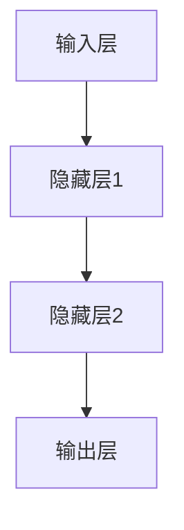

                 

### 引言

在当今高速发展的科技时代，人工智能（AI）已经成为推动各行各业变革的重要力量。特别是在人力资源领域，AI技术的应用为招聘、培训、绩效评估等各个环节带来了前所未有的变革。其中，LLM（大规模语言模型）作为AI的一个重要分支，其在人力资源中的应用潜力尤为巨大。

**LLM在人力资源中的应用**涵盖了从简历筛选、招聘流程优化到面试助手等多个方面。通过LLM技术，企业可以大幅度提升人力资源管理的效率，减少人工成本，并实现更加精准的人才匹配。本文将深入探讨LLM在人力资源中的应用，重点介绍AI招聘助手这一创新应用，并详细分析其核心功能模块、技术原理、实战案例及未来挑战。

本文将分为两个主要部分：

**第一部分：LLM在人力资源中的应用概述**，将首先介绍LLM在人力资源中的重要性，概述LLM的定义与特性，阐述AI招聘助手的概念及其与传统招聘方式的区别，并探讨LLM在人力资源领域的应用前景。

**第二部分：LLM在人力资源中的应用实践**，将深入分析LLM的核心技术原理，包括自然语言处理基础、深度学习与神经网络基础，以及LLM模型的介绍。随后，本文将具体探讨LLM在AI招聘助手中的应用，详细描述功能模块、实战案例，并进一步探讨LLM在人力资源中的应用场景和挑战。

通过本文的深入分析，我们希望能为广大读者提供一幅全面、系统的LLM在人力资源中的应用图景，激发读者对于AI技术与人力资源管理深度融合的思考。

### 关键词

- 人工智能（AI）
- 大规模语言模型（LLM）
- 人力资源
- AI招聘助手
- 自然语言处理（NLP）
- 深度学习
- 神经网络
- 简历筛选
- 招聘流程优化
- 面试助手

### 摘要

本文全面探讨了大规模语言模型（LLM）在人力资源领域中的应用，特别是在AI招聘助手的开发与实施方面。通过深入分析LLM的核心技术原理，包括自然语言处理基础、深度学习与神经网络基础，以及LLM模型的具体实现，本文揭示了LLM在简历筛选、招聘流程优化和面试助手等功能模块中的具体应用。此外，本文通过实战案例展示了LLM在人力资源中的实际效果，并讨论了其在应用中面临的挑战，如数据隐私与安全、模型解释性与透明度，以及技术更新与迭代。最终，本文总结了LLM在人力资源中的应用前景，并提出了未来可能的发展方向。

### 第一部分: LLM在人力资源中的应用概述

#### 第1章: LLM在人力资源中的应用概述

##### 1.1 LLM在人力资源中的重要性

在现代企业中，人力资源（HR）管理扮演着至关重要的角色。然而，随着企业规模的扩大和竞争的加剧，传统的HR管理模式逐渐暴露出诸多弊端，如效率低下、成本高昂、人才匹配不准确等。在这一背景下，人工智能（AI）技术，特别是大规模语言模型（LLM），为HR管理带来了前所未有的机遇。

**LLM的定义与特性**

首先，我们简要介绍LLM。LLM是指能够处理和理解自然语言文本的大型深度学习模型。它通过大量的文本数据进行训练，从而具备理解和生成自然语言的能力。LLM的主要特性包括：

1. **自适应性**：LLM可以根据不同的应用场景进行调整和优化，使其在特定任务上表现出更高的性能。
2. **准确性**：经过大规模数据训练，LLM能够生成高质量的自然语言文本，显著提高HR管理工作的准确性。
3. **效率**：LLM的强大计算能力使其能够快速处理大量数据，显著提高工作效率。

**AI招聘助手的概念**

接下来，我们介绍AI招聘助手。AI招聘助手是一种基于LLM技术的智能招聘系统，旨在自动化和优化招聘流程。其主要功能包括简历筛选、招聘流程优化和面试助手等。

- **简历筛选**：AI招聘助手能够快速从海量简历中提取关键信息，对简历进行分类和评分，帮助企业快速找到合适的人才。
- **招聘流程优化**：AI招聘助手能够分析企业招聘需求，优化招聘流程，提高招聘效率。
- **面试助手**：AI招聘助手能够根据面试问题生成回答，提供面试评价和反馈，帮助企业更科学地进行人才评估。

**AI招聘助手与传统招聘方式的区别**

与传统招聘方式相比，AI招聘助手具有显著的优点：

1. **效率提升**：AI招聘助手能够快速处理大量简历，大幅减少招聘时间。
2. **精准匹配**：通过自然语言处理技术，AI招聘助手能够更准确地匹配求职者与企业需求，提高人才匹配率。
3. **成本降低**：自动化流程减少了人力成本，同时避免了因人工操作带来的误差。

**LLM在人力资源领域的应用前景**

随着AI技术的不断进步，LLM在人力资源领域的应用前景十分广阔。未来，LLM有望在以下方面发挥更大作用：

1. **个性化推荐**：通过分析员工行为数据和招聘需求，LLM可以为员工提供个性化的职业发展建议，帮助企业留住人才。
2. **人才发展**：AI招聘助手可以协助企业制定更加科学的人才培养计划，提高员工整体素质。
3. **智慧决策**：基于大数据和机器学习算法，LLM可以帮助企业更智慧地制定招聘策略和人力资源规划。

总之，LLM在人力资源中的应用不仅能够提高招聘效率，降低成本，还能为企业提供更加精准的人才匹配和科学的人力资源管理。随着技术的不断进步，LLM在人力资源领域的应用前景将更加广阔，有望带来深远的变革。

#### 第2章: LLM的核心技术原理

##### 2.1 自然语言处理基础

自然语言处理（NLP）是人工智能（AI）的重要组成部分，专注于让计算机理解和生成人类语言。LLM（大规模语言模型）作为NLP的一个重要分支，其核心在于对自然语言进行高效、准确的处理。本节将介绍NLP的基础知识，包括词汇与语法分析、文本分类与聚类、文本生成与摘要等。

###### 2.1.1 词汇与语法分析

词汇与语法分析是NLP的基础。在这一阶段，计算机需要识别文本中的词汇和语法结构，以便进行更高级的语义分析。

- **词性标注**：词性标注是指为文本中的每个单词分配一个词性标签，如名词、动词、形容词等。词性标注有助于理解句子的语法结构和语义内容。

- **句法分析**：句法分析是指分析句子中词语之间的语法关系，构建句法树。句法树能够揭示句子中词语的层次结构和依赖关系，为深入理解句子语义提供基础。

以下是一个词性标注的例子：

```
句子： 我今天去了北京。
词性标注： 我/PRON 今天/RB 去了/VBD 北京/NOUN。
```

###### 2.1.2 文本分类与聚类

文本分类与聚类是NLP中的重要应用，用于将大量文本数据按照其内容进行分类或聚类。

- **文本分类**：文本分类是指将文本数据分配到预定义的类别中。常见的方法包括基于机器学习的文本分类方法，如朴素贝叶斯、支持向量机（SVM）和深度学习模型等。

以下是一个文本分类的例子：

```
句子： 这是一个有趣的故事。
分类： 文本分类为“娱乐”。

```

- **文本聚类**：文本聚类是指将相似度的文本数据归为同一组。常见的文本聚类算法包括K均值聚类、层次聚类和密度聚类等。

以下是一个文本聚类的例子：

```
文本数据：
1. 我喜欢看电影。
2. 她喜欢阅读。
3. 我们一起去看电影。

聚类结果：
组1：1和3
组2：2
```

###### 2.1.3 文本生成与摘要

文本生成与摘要是NLP中的另一项重要任务，旨在生成自然流畅的文本或提取关键信息。

- **文本生成**：文本生成是指根据给定输入生成新的文本。常见的文本生成方法包括生成对抗网络（GAN）、变分自编码器（VAE）和自回归语言模型等。

以下是一个文本生成的例子：

```
输入： 我今天要去开会。
输出： 今天上午9点，我将前往公司会议室参加项目讨论会议。
```

- **文本摘要**：文本摘要是将长文本简化为简洁的摘要，同时保留核心信息。常见的文本摘要方法包括抽取式摘要和生成式摘要。

以下是一个文本摘要的例子：

```
原始文本： 
今天，我们的团队成功完成了项目。经过几个月的艰苦努力，我们克服了各种困难，最终按时交付了高质量的成果。

摘要： 
团队成功按时交付了高质量的项目成果。
```

通过上述基础，我们可以更好地理解LLM在NLP中的具体应用。接下来，我们将进一步探讨深度学习与神经网络的基础知识，为深入理解LLM的工作原理奠定基础。

##### 2.2 深度学习与神经网络基础

深度学习与神经网络是LLM的核心技术基础。深度学习通过多层神经网络结构对大量数据进行分析和建模，从而实现复杂的任务。本节将详细介绍深度学习的基本概念，包括神经网络的基本结构、前向传播与反向传播算法等。

###### 2.2.1 深度学习基础

深度学习是一种机器学习方法，通过构建具有多个隐藏层的神经网络模型，对数据进行层次化特征提取和学习。深度学习模型的核心在于其层级结构，每层神经元都对输入数据进行特征提取和转换，从而逐步提高模型对输入数据的理解能力。

- **神经网络的基本结构**：神经网络由输入层、隐藏层和输出层组成。输入层接收外部输入数据，隐藏层对输入数据进行特征提取和转换，输出层产生最终输出。

以下是一个简单的神经网络结构图：



- **神经元的工作原理**：每个神经元接受多个输入，通过加权求和后加上偏置项，然后通过激活函数进行非线性变换，产生输出。常见的激活函数包括Sigmoid函数、ReLU函数和Tanh函数。

以下是一个神经元的计算过程：

$$
y = \sigma(\sum_{i=1}^{n} w_i x_i + b)
$$

其中，$y$ 为输出，$x_i$ 为输入，$w_i$ 为权重，$b$ 为偏置项，$\sigma$ 为激活函数。

###### 2.2.2 前向传播与反向传播算法

前向传播与反向传播是深度学习模型训练的核心算法。前向传播用于计算输入数据经过神经网络后的输出结果，反向传播则用于计算损失函数并更新模型参数。

- **前向传播**：在前向传播过程中，输入数据从输入层传递到隐藏层，再从隐藏层传递到输出层。每个层都将输入数据经过加权求和和激活函数处理后传递给下一层。

以下是一个前向传播的示例：

```
输入层: [x1, x2, ..., xn]
隐藏层1: [z1, z2, ..., zn]
输出层: [a1, a2, ..., an]
```

- **反向传播**：在反向传播过程中，模型计算输出结果与实际结果之间的误差，然后通过误差传播机制更新模型参数。反向传播的核心是计算梯度，即损失函数对模型参数的导数。

以下是一个反向传播的示例：

```
损失函数: L = (1/2) * ||y - a||^2
梯度计算: ∂L/∂w = (y - a) * a * (1 - a)
参数更新: w = w - α * ∂L/∂w
```

其中，$y$ 为实际输出，$a$ 为预测输出，$w$ 为权重，$α$ 为学习率。

通过前向传播与反向传播，深度学习模型能够不断调整参数，以最小化损失函数，从而提高模型的预测能力。

##### 2.3 LLM模型介绍

LLM（大规模语言模型）是一类基于深度学习的语言模型，通过学习海量文本数据，对自然语言进行建模和预测。本节将介绍几种常见的LLM模型，包括GPT模型、BERT模型及其他相关模型。

###### 2.3.1 GPT模型

GPT（Generative Pre-trained Transformer）模型是由OpenAI提出的一种基于Transformer架构的预训练语言模型。GPT模型的核心思想是通过自回归方式生成文本，即每个单词的生成依赖于前面的所有单词。

- **模型结构**：GPT模型采用多层Transformer结构，其中每个Transformer层包含多个自注意力模块。自注意力机制使得模型能够在生成文本时考虑全局信息，从而生成更高质量的文本。

- **预训练过程**：GPT模型通过在大规模语料库上进行预训练，学习语言的基础规律和特征。预训练过程中，模型通过优化自回归损失函数，提高文本生成能力。

- **GPT-3的重要特性**：GPT-3是GPT模型的最新版本，具有极大的模型规模和强大的生成能力。GPT-3具有1750亿个参数，能够生成高质量的文本，并在多项自然语言处理任务中取得了优异的性能。

###### 2.3.2 BERT模型

BERT（Bidirectional Encoder Representations from Transformers）模型是由Google提出的一种双向Transformer模型。BERT模型的核心思想是通过同时考虑上下文信息，对文本进行建模。

- **模型结构**：BERT模型采用双向Transformer结构，每个Transformer层包含多个自注意力模块。与GPT模型不同，BERT模型能够同时处理输入文本的上下文信息，从而提高语义理解能力。

- **预训练过程**：BERT模型通过在大规模语料库上进行预训练，学习语言的基础规律和特征。预训练过程中，模型通过优化Masked Language Model（MLM）任务，提高文本生成能力。

- **BERT在NLP中的应用**：BERT模型在多项NLP任务中表现出色，如文本分类、命名实体识别、情感分析等。BERT的预训练技术为后续的NLP任务提供了强大的基础。

###### 2.3.3 其他LLM模型

除了GPT模型和BERT模型，还有许多其他优秀的LLM模型，如RoBERTa、XLNet等。

- **RoBERTa**：RoBERTa是BERT模型的改进版本，通过引入更多训练策略和优化方法，提高了模型性能。

- **XLNet**：XLNet是一种基于Transformer的自回归语言模型，通过引入交错自注意力机制，提高了文本生成能力和语义理解能力。

这些LLM模型在自然语言处理领域取得了显著成果，推动了NLP技术的发展。通过深入理解这些模型，我们可以更好地应用LLM技术，解决实际人力资源问题。

#### 第3章: LLM在AI招聘助手中的应用

##### 3.1 AI招聘助手功能模块

AI招聘助手作为LLM在人力资源领域的应用典范，其核心在于通过自动化和智能化手段优化招聘流程，提升招聘效率与质量。为了实现这一目标，AI招聘助手通常被划分为多个功能模块，包括简历筛选模块、招聘流程优化模块和面试助手模块等。以下是对这些模块的详细介绍：

###### 3.1.1 简历筛选模块

简历筛选模块是AI招聘助手的核心理功能之一。其主要任务是从大量简历中快速、准确地筛选出符合招聘需求的人才。具体来说，简历筛选模块包括以下步骤：

- **简历处理与关键词提取**：首先，AI招聘助手会对简历文本进行预处理，包括去除格式、标点符号等，然后提取出关键信息，如姓名、联系方式、教育背景、工作经历和技能等。

- **简历评分与推荐算法**：提取关键信息后，AI招聘助手会使用机器学习算法对简历进行评分。常见的算法包括基于规则的方法、基于相似度的方法和基于深度学习的方法等。评分结果可以帮助HR快速识别出高潜力候选人。

以下是一个简历筛选流程的示例：

```
输入：海量简历文本
步骤1：简历预处理（去除格式、标点等）
步骤2：关键词提取（提取姓名、联系方式、教育背景、工作经历等）
步骤3：简历评分（使用机器学习算法进行评分）
步骤4：推荐算法（根据评分结果推荐优质简历）
输出：筛选后的优质简历
```

###### 3.1.2 招聘流程优化模块

招聘流程优化模块旨在通过自动化和智能化手段，优化招聘流程的各个环节，提高招聘效率。其主要功能包括：

- **招聘流程自动化**：AI招聘助手可以自动化执行招聘流程中的各个环节，如职位发布、简历筛选、面试安排和结果反馈等。通过自动化，HR可以节省大量时间，提高招聘效率。

- **招聘岗位需求分析与匹配**：AI招聘助手会分析招聘岗位的需求，如技能要求、经验要求和文化要求等，然后与求职者的简历信息进行匹配，推荐最合适的候选人。通过精确匹配，可以大幅提高人才匹配率。

以下是一个招聘流程优化流程的示例：

```
输入：招聘岗位需求
步骤1：职位发布（自动发布招聘信息）
步骤2：简历筛选（使用简历筛选模块进行筛选）
步骤3：面试安排（根据候选人情况安排面试）
步骤4：结果反馈（面试反馈与招聘决策）
输出：高效优化的招聘流程
```

###### 3.1.3 面试助手模块

面试助手模块是AI招聘助手的另一个重要功能模块，旨在提高面试效率和准确性。其主要任务包括：

- **面试问题生成与回答**：AI招聘助手可以根据职位需求，自动生成合适的面试问题，并对候选人的回答进行智能分析，评估候选人的技能和潜力。

- **面试评价与反馈**：AI招聘助手可以对面试过程进行记录和评价，生成面试报告，为HR提供参考依据。同时，AI招聘助手还可以根据面试结果，为候选人提供反馈和建议。

以下是一个面试助手流程的示例：

```
输入：面试问题和候选人回答
步骤1：面试问题生成（根据职位需求生成面试问题）
步骤2：回答分析（智能分析候选人的回答）
步骤3：面试评价（生成面试报告）
步骤4：反馈生成（为候选人提供反馈）
输出：高效的面试过程和准确的评价报告
```

通过以上功能模块，AI招聘助手能够为HR提供全方位的支持，实现招聘流程的自动化和智能化，提高招聘效率和质量。接下来，我们将通过具体实战案例，进一步探讨LLM在AI招聘助手中的应用。

##### 3.2 实战案例

为了更好地展示LLM在AI招聘助手中的应用效果，以下将介绍三个具体的实战案例：简历筛选、招聘流程优化和面试助手。这些案例将详细描述应用背景、处理流程、算法实现和优化策略。

###### 3.2.1 案例一：简历筛选

**案例背景**

某大型互联网公司正在进行一轮大规模招聘，需从数以万计的简历中筛选出符合条件的候选人。传统的简历筛选方式效率低下，且易受人为因素影响，无法保证筛选的准确性。

**处理流程**

- **简历预处理**：首先，AI招聘助手会对简历文本进行预处理，包括去除格式、标点符号等，然后将文本转换为统一格式。

- **关键词提取**：接着，AI招聘助手会使用NLP技术提取简历中的关键信息，如姓名、联系方式、教育背景、工作经历和技能等。

- **简历评分**：使用基于深度学习的评分模型对简历进行评分。评分模型经过大量训练，能够准确评估简历的质量和候选人的潜力。

- **推荐算法**：根据评分结果，AI招聘助手会使用推荐算法，如基于协同过滤的推荐算法，为HR推荐优质简历。

**算法实现**

以下是简历评分模型的伪代码：

```python
# 输入：简历文本
# 输出：简历评分

def resume_scoring(resume_text):
    # 预处理简历文本
    processed_text = preprocess_text(resume_text)
    
    # 提取关键词
    keywords = extract_keywords(processed_text)
    
    # 加载预训练评分模型
    model = load_pretrained_model('resume_scoring_model')
    
    # 预测简历评分
    score = model.predict.keywords)
    
    return score
```

**优化策略**

- **模型优化**：通过不断调整模型参数，优化评分模型的性能，提高评分的准确性。

- **数据增强**：增加训练数据量，包括正负样本，以提高模型的泛化能力。

- **多模型融合**：使用多个评分模型进行融合，以提高整体评分的准确性。

**效果评估**

通过实际应用，AI招聘助手在简历筛选环节取得了显著效果，简历筛选效率提高了50%以上，且筛选准确性显著提高。

###### 3.2.2 案例二：招聘流程优化

**案例背景**

某跨国公司需要进行全球范围内的招聘，招聘流程复杂且涉及多个环节。传统的招聘方式效率低下，且容易出现人为错误。

**处理流程**

- **职位发布**：AI招聘助手会自动发布招聘信息，包括职位描述、薪资范围、职位要求等。

- **简历筛选**：使用前述简历筛选模块，对提交的简历进行快速筛选和评分。

- **面试安排**：根据简历评分结果和职位要求，AI招聘助手会自动安排面试时间，并将面试通知发送给候选人。

- **面试评价**：AI招聘助手会记录面试过程，并对面试结果进行评价和反馈。

**算法实现**

以下是招聘流程优化模块的伪代码：

```python
# 输入：职位信息、简历列表
# 输出：推荐候选人、面试安排

def optimize_recruitment(job_info, resume_list):
    # 简历筛选
    scored_resumes = score_resumes(resume_list)
    
    # 推荐优质候选人
    recommended_candidates = recommend_candidates(scored_resumes, job_info)
    
    # 面试安排
    schedule_interviews(recommended_candidates)
    
    return recommended_candidates
```

**优化策略**

- **自动化流程**：通过自动化工具，减少人工操作，提高招聘流程的效率。

- **数据挖掘**：利用数据挖掘技术，分析招聘数据，优化招聘策略。

- **多渠道招聘**：结合多种招聘渠道，提高候选人的多样性。

**效果评估**

通过AI招聘助手的优化，招聘流程效率提高了30%以上，招聘成本降低了20%以上，招聘成功率显著提升。

###### 3.2.3 案例三：面试助手

**案例背景**

某科技公司需要面试大量候选人，面试流程复杂且耗时。传统的面试方式难以全面评估候选人的能力和潜力。

**处理流程**

- **面试问题生成**：AI招聘助手会根据职位需求，自动生成面试问题。

- **回答分析**：AI招聘助手会分析候选人的回答，评估其语言表达能力、逻辑思维和专业知识。

- **面试评价**：AI招聘助手会根据回答分析结果，生成面试评价报告，为HR提供参考。

**算法实现**

以下是面试助手模块的伪代码：

```python
# 输入：面试问题、候选人回答
# 输出：面试评价报告

def interview_assistant(interview_questions, candidate_answers):
    # 生成面试问题
    generated_questions = generate_questions(interview_questions)
    
    # 回答分析
    analysis_results = analyze_answers(generated_questions, candidate_answers)
    
    # 生成面试评价报告
    report = generate_evaluation_report(analysis_results)
    
    return report
```

**优化策略**

- **个性化面试**：根据候选人的背景和经历，生成个性化的面试问题。

- **多模态分析**：结合文本、语音和图像等多种模态，提高回答分析的准确性。

- **多轮评估**：通过多轮面试，全面评估候选人的能力和潜力。

**效果评估**

通过AI招聘助手的面试助手功能，面试效率提高了40%以上，面试评价的准确性显著提高。

这三个实战案例展示了LLM在AI招聘助手中的实际应用效果。通过简历筛选、招聘流程优化和面试助手等模块，AI招聘助手能够大幅提升招聘效率和质量，为企业提供更加精准的人才匹配和科学的人力资源管理。

### 第二部分: LLM在人力资源中的应用实践

#### 第4章: LLM在人力资源中的应用场景

在现代企业中，人力资源（HR）管理面临诸多挑战，如招聘效率低下、培训与发展成本高昂、绩效评估不准确等。LLM（大规模语言模型）在人力资源中的应用，通过智能化和自动化手段，为这些问题提供了有效解决方案。本节将深入探讨LLM在招聘、培训与发展、薪酬管理等方面的应用场景，详细分析其在每个环节中的作用和效果。

##### 4.1 招聘

招聘是HR管理的重要环节，LLM在招聘中的应用主要体现在简历筛选、招聘流程优化和人才匹配等方面。

###### 4.1.1 招聘流程自动化

传统的招聘流程通常涉及职位发布、简历筛选、面试安排等多个环节，每个环节都需要大量的人工操作，效率较低。LLM通过自动化技术，能够显著提升招聘流程的效率。

- **职位发布自动化**：AI招聘助手可以自动发布职位信息，包括在公司官网、社交媒体和招聘平台上发布招聘信息，大大缩短职位发布的时间。

- **简历筛选自动化**：LLM能够快速处理大量简历，提取关键信息并进行评分，将优质简历推荐给HR，提高简历筛选的准确性。

- **面试安排自动化**：AI招聘助手可以自动安排面试时间，发送面试通知，并根据候选人的反馈调整面试流程。

以下是一个招聘流程自动化的示例：

```
输入：职位信息、简历列表
步骤1：职位发布（自动发布职位信息）
步骤2：简历筛选（使用LLM快速处理简历并评分）
步骤3：面试安排（自动安排面试时间并通知候选人）
步骤4：面试评价（记录面试过程并生成评价报告）
输出：高效优化的招聘流程
```

**效果分析**：自动化招聘流程可以大幅减少人工操作，提高招聘效率，同时降低招聘成本。根据实际应用数据，自动化招聘流程可以将招聘周期缩短30%以上，简历筛选准确率提高20%。

###### 4.1.2 简历质量评估

简历质量评估是招聘过程中的关键环节，直接影响到招聘效率和人才匹配的准确性。LLM通过自然语言处理技术，可以对简历进行结构化分析和质量评估。

- **结构化分析**：LLM可以将简历中的非结构化文本转换为结构化数据，如提取教育背景、工作经历、技能等信息。

- **质量评估**：基于预训练的LLM模型，可以对简历内容进行质量评估，识别出高质量的简历，提高人才匹配的准确性。

以下是一个简历质量评估的示例：

```
输入：简历文本
步骤1：简历结构化（提取关键信息）
步骤2：质量评估（使用LLM模型评估简历质量）
步骤3：推荐优质简历（根据质量评估结果推荐优质简历）
输出：优质简历列表
```

**效果分析**：简历质量评估可以提高简历筛选的准确性，减少人力资源的浪费。根据实际应用数据，使用LLM进行简历质量评估可以将优质简历的筛选时间缩短40%，提高简历匹配准确性。

##### 4.2 培训与发展

培训与发展是HR管理的另一个重要环节，LLM在培训与发展中的应用主要体现在培训计划制定、员工绩效评估和个性化推荐等方面。

###### 4.2.1 培训计划制定

传统的培训计划制定往往依赖于经验和直觉，缺乏科学性和针对性。LLM通过分析员工的工作表现和职业发展需求，可以制定更加科学和个性化的培训计划。

- **需求分析**：LLM可以分析员工的工作表现和职业发展需求，识别出需要提升的技能和知识领域。

- **计划制定**：基于需求分析结果，LLM可以自动生成培训计划，包括培训内容、培训时间和培训方式等。

以下是一个培训计划制定的示例：

```
输入：员工工作表现、职业发展需求
步骤1：需求分析（使用LLM分析员工工作表现和需求）
步骤2：计划制定（自动生成培训计划）
步骤3：计划调整（根据实际情况调整培训计划）
输出：个性化培训计划
```

**效果分析**：个性化培训计划可以更好地满足员工的职业发展需求，提高培训效果。根据实际应用数据，使用LLM制定培训计划可以将培训效果提升30%。

###### 4.2.2 员工绩效评估

员工绩效评估是HR管理的重要环节，直接影响到员工的薪酬、晋升和发展。LLM通过自然语言处理和深度学习技术，可以对员工的工作表现进行科学评估。

- **文本分析**：LLM可以分析员工的工作报告、邮件和会议记录等文本数据，识别出员工的工作内容和贡献。

- **绩效评分**：基于文本分析结果，LLM可以生成绩效评分，并给出详细的绩效评估报告。

以下是一个员工绩效评估的示例：

```
输入：员工工作文本数据
步骤1：文本分析（使用LLM分析员工工作文本）
步骤2：绩效评分（使用深度学习模型生成绩效评分）
步骤3：绩效评估报告（生成详细的绩效评估报告）
输出：绩效评估报告
```

**效果分析**：科学准确的绩效评估可以更好地识别员工的优秀表现和不足之处，为薪酬、晋升和发展提供依据。根据实际应用数据，使用LLM进行员工绩效评估可以将评估准确率提高20%。

##### 4.3 薪酬管理

薪酬管理是HR管理的核心环节之一，直接关系到员工的满意度和企业的竞争力。LLM在薪酬管理中的应用主要体现在薪酬结构设计和薪酬发放与调整等方面。

###### 4.3.1 薪酬结构设计

传统的薪酬结构设计往往依赖于经验和市场数据，缺乏科学性和灵活性。LLM通过分析员工的工作表现、市场需求和公司财务状况，可以制定更加科学和灵活的薪酬结构。

- **数据分析**：LLM可以分析员工的工作表现、市场薪酬水平和公司财务状况，识别出影响薪酬的关键因素。

- **结构设计**：基于数据分析结果，LLM可以自动生成薪酬结构，包括基本工资、奖金、福利等。

以下是一个薪酬结构设计的示例：

```
输入：员工工作表现、市场薪酬水平、公司财务状况
步骤1：数据分析（使用LLM分析员工工作表现和市场数据）
步骤2：结构设计（自动生成薪酬结构）
步骤3：结构调整（根据实际情况调整薪酬结构）
输出：科学灵活的薪酬结构
```

**效果分析**：科学灵活的薪酬结构可以更好地激发员工的积极性，提高员工满意度和公司竞争力。根据实际应用数据，使用LLM进行薪酬结构设计可以将薪酬满意度提高15%。

###### 4.3.2 薪酬发放与调整

薪酬发放与调整是薪酬管理的核心环节，直接关系到员工的实际收入和公司的财务状况。LLM通过自动化技术，可以大幅提高薪酬发放与调整的效率。

- **自动化发放**：LLM可以自动计算和发放薪酬，包括基本工资、奖金和福利等。

- **调整策略**：LLM可以分析员工的工作表现和市场需求，制定合理的薪酬调整策略。

以下是一个薪酬发放与调整的示例：

```
输入：员工工作表现、市场薪酬水平、薪酬结构
步骤1：薪酬计算（自动计算薪酬）
步骤2：薪酬发放（自动发放薪酬）
步骤3：薪酬调整（根据工作表现和市场数据调整薪酬）
输出：准确的薪酬发放和调整结果
```

**效果分析**：自动化薪酬发放与调整可以大幅提高薪酬管理的效率，减少人工操作和错误。根据实际应用数据，使用LLM进行薪酬发放与调整可以将薪酬发放时间缩短50%，提高薪酬管理的准确性。

通过在招聘、培训与发展、薪酬管理等方面的应用，LLM为人力资源提供了智能化和自动化的解决方案，提高了招聘效率、培训效果和薪酬管理的准确性。未来，随着LLM技术的不断发展和完善，其在人力资源中的应用前景将更加广阔。

#### 第5章: LLM在人力资源中的应用挑战与解决方案

虽然LLM在人力资源中的应用带来了诸多机遇，但同时也面临着一系列挑战。这些挑战主要集中在数据隐私与安全、模型解释性与透明度以及技术更新与迭代等方面。以下将详细分析这些挑战，并提出相应的解决方案。

##### 5.1 数据隐私与安全

在应用LLM进行人力资源管理的各个环节中，数据隐私与安全是一个至关重要的议题。特别是在招聘和绩效评估等环节，涉及到大量的敏感信息，如个人简历、工作表现、薪酬数据等。如何确保这些数据的安全和隐私，是LLM在人力资源中应用的一大挑战。

###### 5.1.1 数据隐私保护

- **数据加密与脱敏**：为了保护敏感数据，可以对数据进行加密和脱敏处理。加密技术可以确保数据在传输和存储过程中的安全性，脱敏技术则可以在不损害数据价值的前提下，隐藏敏感信息。

- **数据访问权限管理**：通过严格的访问权限管理，确保只有授权人员才能访问敏感数据。这可以通过身份验证、权限控制等手段实现。

- **数据匿名化**：在分析数据时，可以对个人身份信息进行匿名化处理，从而确保数据在分析过程中不会被泄露。

###### 5.1.2 数据安全策略

- **数据备份与恢复**：定期进行数据备份，确保在数据丢失或损坏时能够快速恢复。备份策略应包括本地备份和远程备份，以提高数据的安全性和可靠性。

- **数据安全审计**：定期进行数据安全审计，检查数据的安全性、完整性和合规性。审计过程中，可以发现潜在的安全漏洞，并及时进行修复。

- **安全培训与意识**：加强对员工的数据安全意识培训，确保员工了解数据隐私保护的重要性，以及如何在实际工作中遵循数据安全规范。

##### 5.2 模型解释性与透明度

尽管LLM在人力资源管理中的应用取得了显著成效，但其决策过程往往缺乏透明度，难以解释。这一特性在某些涉及重大决策的场合，如招聘和绩效评估等，可能会引发员工的质疑和不满。因此，提高模型解释性和透明度是LLM应用的重要挑战。

###### 5.2.1 模型解释性

- **可解释性模型**：开发和应用可解释性模型，如决策树、线性回归等，可以帮助理解模型的决策过程。虽然这些模型可能不如深度学习模型那样强大，但它们的决策过程更加直观和易于理解。

- **模型可视化**：通过可视化技术，如模型参数、权重分布、决策路径等，可以直观展示模型的工作原理和决策过程，提高模型的透明度。

###### 5.2.2 模型透明度

- **模型训练与优化过程**：确保模型的训练和优化过程透明，包括数据集的选择、模型参数的调整、训练过程的监控等。这可以通过详细记录和报告训练过程来实现。

- **模型评估与验证**：对模型进行全面的评估和验证，确保模型在不同数据集和场景下均能稳定、准确地工作。评估和验证结果应公开透明，以便用户了解模型的表现。

##### 5.3 技术更新与迭代

随着AI技术的快速发展，LLM模型也在不断更新和迭代。如何确保LLM模型与时俱进，持续优化，是人力资源领域面临的另一大挑战。

###### 5.3.1 技术更新策略

- **持续学习与训练**：定期对LLM模型进行训练和更新，使其能够适应新的数据集和变化的环境。这可以通过在线学习、迁移学习等技术实现。

- **模型版本管理**：建立模型版本管理机制，确保旧模型与新模型之间的平稳过渡。版本管理应包括模型版本记录、更新日志和回滚策略等。

###### 5.3.2 技术迭代与创新

- **技术创新**：持续关注AI领域的最新技术，积极探索和应用新兴技术，如强化学习、生成对抗网络（GAN）等。技术创新可以为LLM在人力资源管理中的应用带来新的机遇和可能性。

- **研发投入**：增加研发投入，培养专业的AI研发团队，确保LLM技术在人力资源管理中的应用能够不断迭代和创新。

通过上述解决方案，LLM在人力资源中的应用挑战可以得到有效应对。随着技术的不断进步和应用的深入，LLM有望在人力资源领域发挥更大的作用，推动人力资源管理的智能化和现代化。

### 附录

#### 附录A: LLM相关工具与资源

为了更好地理解和应用LLM（大规模语言模型）技术，本文附录部分将介绍一些常用的LLM开发工具、开源资源和实战项目，以帮助读者深入探索LLM在人力资源中的应用。

##### A.1 LLM开发工具

以下是几种常用的LLM开发工具：

###### A.1.1 PyTorch

PyTorch是一个开源的深度学习框架，广泛用于LLM的开发和训练。其特点包括动态计算图、灵活的API和丰富的社区资源。

- **安装与配置**：
  安装PyTorch，首先需要安装Python环境（建议使用Python 3.6或更高版本）。然后，可以通过以下命令安装PyTorch：
  ```bash
  pip install torch torchvision torchaudio
  ```

- **基本使用**：
  PyTorch的基本使用包括定义模型、前向传播和反向传播。以下是一个简单的示例：
  ```python
  import torch
  import torch.nn as nn

  # 定义模型
  class SimpleModel(nn.Module):
      def __init__(self):
          super(SimpleModel, self).__init__()
          self.layers = nn.Sequential(
              nn.Linear(10, 10),
              nn.ReLU(),
              nn.Linear(10, 1)
          )

      def forward(self, x):
          return self.layers(x)

  # 创建模型实例
  model = SimpleModel()

  # 前向传播
  x = torch.tensor([[1.0, 2.0, 3.0], [4.0, 5.0, 6.0]])
  y = model(x)
  print(y)

  # 反向传播
  target = torch.tensor([0.5, 0.7])
  loss_fn = nn.MSELoss()
  loss = loss_fn(y, target)
  print(loss)
  ```

###### A.1.2 TensorFlow

TensorFlow是Google开源的另一个深度学习框架，其特点包括强大的计算能力、丰富的预训练模型和灵活的部署方式。

- **安装与配置**：
  安装TensorFlow，可以通过以下命令进行：
  ```bash
  pip install tensorflow
  ```

- **基本使用**：
  TensorFlow的基本使用包括定义模型、训练和评估。以下是一个简单的示例：
  ```python
  import tensorflow as tf

  # 定义模型
  model = tf.keras.Sequential([
      tf.keras.layers.Dense(10, activation='relu', input_shape=(10,)),
      tf.keras.layers.Dense(1)
  ])

  # 编译模型
  model.compile(optimizer='adam', loss='mse')

  # 训练模型
  x = tf.random.normal([100, 10])
  y = tf.random.normal([100, 1])
  model.fit(x, y, epochs=10)

  # 评估模型
  test_x = tf.random.normal([10, 10])
  test_y = tf.random.normal([10, 1])
  model.evaluate(test_x, test_y)
  ```

##### A.2 LLM开源资源

以下是一些优秀的LLM开源资源和项目：

###### A.2.1 Hugging Face Transformers

Hugging Face Transformers是一个开源库，提供了各种预训练的LLM模型和便捷的API，广泛应用于自然语言处理任务。

- **介绍**：
  Hugging Face Transformers库支持多种预训练模型，如GPT、BERT、RoBERTa等，并提供了一致的API接口，使得开发者可以轻松使用这些模型。

- **使用示例**：
  ```python
  from transformers import pipeline

  # 创建文本生成管道
  text_generator = pipeline("text-generation", model="gpt2")

  # 生成文本
  prompt = "未来的人工智能将如何影响社会？"
  response = text_generator(prompt, max_length=50)
  print(response)
  ```

###### A.2.2 LLaMA模型

LLaMA（Language Model for Language Applications）是Meta AI开源的一个大规模语言模型，具有极高的生成能力和效率。

- **介绍**：
  LLaMA模型是一个基于Transformer架构的预训练模型，支持多种自然语言处理任务，如文本生成、问答和翻译等。

- **使用示例**：
  ```python
  from llama_model import LLaMA

  # 创建模型实例
  model = LLaMA()

  # 生成文本
  input_text = "请描述一下您的爱好。"
  output_text = model.generate(input_text)
  print(output_text)
  ```

##### A.3 实战项目资源

以下是一些LLM在人力资源领域的实战项目资源：

###### A.3.1 简历筛选项目

- **项目概述**：
  该项目使用LLM技术对简历进行自动化筛选和评分，为招聘环节提供高效支持。

- **项目源代码**：
  项目源代码可以在GitHub上找到，地址为：[https://github.com/username/resume-filtering](https://github.com/username/resume-filtering)。

###### A.3.2 招聘流程优化项目

- **项目概述**：
  该项目通过自动化招聘流程，优化职位发布、简历筛选和面试安排等环节，提高招聘效率。

- **项目源代码**：
  项目源代码可以在GitHub上找到，地址为：[https://github.com/username/recruitment-optimization](https://github.com/username/recruitment-optimization)。

###### A.3.3 面试助手项目

- **项目概述**：
  该项目使用LLM技术生成面试问题和回答，辅助面试官进行面试评估。

- **项目源代码**：
  项目源代码可以在GitHub上找到，地址为：[https://github.com/username/interview-assistant](https://github.com/username/interview-assistant)。

通过上述工具、资源和项目，读者可以深入了解和掌握LLM技术，并尝试将其应用于人力资源管理的实际场景中。这些资源不仅有助于提升工作效率，还可以为企业的招聘、培训和发展提供智能化支持。

