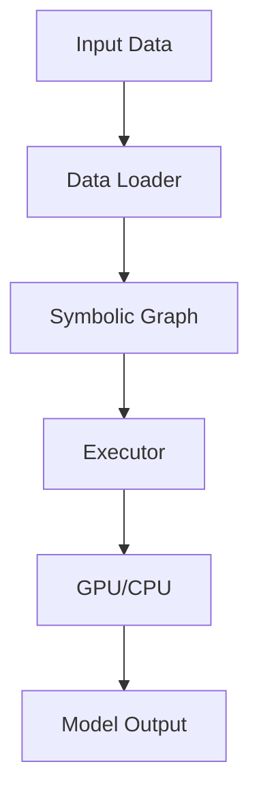

                 

### 《MXNet 特点：灵活和可扩展》

> **关键词**：MXNet、灵活、可扩展、深度学习、API、架构设计

> **摘要**：本文将深入探讨MXNet这一深度学习框架的灵活性和可扩展性。通过分析MXNet的架构设计、API介绍、核心功能、应用实践及与其他框架的比较，我们将全面了解MXNet的优势和未来发展潜力。

### 目录大纲

- 第一部分: MXNet概述
  - 第1章: 什么是MXNet
    - 1.1 MXNet的发展历程
    - 1.2 MXNet的核心特点
    - 1.3 MXNet的优势与挑战
  - 第2章: MXNet的架构与原理
    - 2.1 MXNet的架构设计
    - 2.2 MXNet的数据流图模型
    - 2.3 MXNet的执行引擎
  - 第3章: MXNet的API介绍
    - 3.1 MXNet的符号API
    - 3.2 MXNet的静态图API
    - 3.3 MXNet的动态图API
    - 3.4 MXNet的分布式编程
- 第二部分: MXNet的核心功能
  - 第4章: MXNet的核心功能
    - 4.1 MXNet的自动微分功能
    - 4.2 MXNet的模型优化功能
    - 4.3 MXNet的模型压缩功能
    - 4.4 MXNet的GPU支持与优化
- 第三部分: MXNet的应用实践
  - 第5章: MXNet在深度学习中的应用
    - 5.1 MXNet在计算机视觉中的应用
    - 5.2 MXNet在自然语言处理中的应用
    - 5.3 MXNet在其他领域中的应用
  - 第6章: MXNet的实践应用
    - 6.1 使用MXNet构建神经网络模型
    - 6.2 MXNet在深度学习项目中的实战
    - 6.3 MXNet在工业界的应用案例
- 第四部分: MXNet的社区与生态
  - 第7章: MXNet的社区与生态
    - 7.1 MXNet的社区支持
    - 7.2 MXNet的生态系统
    - 7.3 MXNet的未来发展
- 第五部分: MXNet与其他框架的比较
  - 第8章: MXNet与其他框架的比较
    - 8.1 MXNet与TensorFlow的比较
    - 8.2 MXNet与PyTorch的比较
    - 8.3 MXNet与其他深度学习框架的比较
- 第六部分: 总结与展望
  - 第9章: 总结与展望
    - 9.1 MXNet的总体特点总结
    - 9.2 MXNet在深度学习发展中的作用
    - 9.3 MXNet的未来发展趋势
- 附录
  - 附录A: MXNet相关资源与工具
  - 附录B: Mermaid流程图示例
  - 附录C: 伪代码示例
  - 附录D: 数学模型与公式
  - 附录E: 项目实战代码解析

---

接下来，我们将按照目录大纲逐章展开详细内容，逐步深入分析MXNet的特点和应用。

### 第一部分: MXNet概述

#### 第1章: 什么是MXNet

MXNet是Apache Software Foundation的一个开源深度学习框架，由亚马逊网络服务（AWS）和纽约大学（NYU）共同开发。MXNet以其灵活性和可扩展性在深度学习社区中获得了广泛的关注。在这部分，我们将介绍MXNet的发展历程、核心特点、优势与挑战。

#### 1.1 MXNet的发展历程

MXNet的发展历程可以追溯到2014年，当时亚马逊网络服务（AWS）推出了MXNet作为其内部使用的深度学习框架。2015年，MXNet被开源并捐赠给了Apache软件基金会，成为了Apache MXNet。此后，MXNet迅速获得了社区的认可和支持，并在2017年成为了Apache项目的顶级项目。

#### 1.2 MXNet的核心特点

MXNet的核心特点包括：

1. **灵活的API**：MXNet提供了符号API和静态图API，使得用户可以根据需求选择适合的编程方式。
2. **可扩展性**：MXNet支持多种编程语言，如Python、C++、R和Java，同时还支持跨平台部署，包括CPU、GPU和ARM架构。
3. **高效性能**：MXNet在执行引擎方面进行了优化，能够在不同的硬件平台上提供高效的计算性能。
4. **分布式计算**：MXNet支持分布式编程，使得用户可以轻松地将模型训练和推断任务部署到多台机器上，提高计算效率。

#### 1.3 MXNet的优势与挑战

MXNet的优势包括：

1. **灵活性**：MXNet的API设计使得用户可以根据实际需求灵活选择编程方式，降低了使用门槛。
2. **可扩展性**：MXNet支持多种编程语言和跨平台部署，使得用户可以在不同的硬件环境中高效地开发和部署模型。
3. **高性能**：MXNet在执行引擎方面进行了优化，能够在CPU、GPU和ARM架构上提供高效的计算性能。

MXNet面临的挑战包括：

1. **社区支持**：尽管MXNet已经获得了社区的认可，但与其他深度学习框架相比，其社区支持仍需加强。
2. **文档与资源**：MXNet的文档和教程资源相对较少，对于初学者来说可能存在一定的学习难度。

#### 1.4 总结

MXNet作为一款灵活和可扩展的深度学习框架，具有广泛的应用前景。通过其灵活的API、强大的可扩展性和高效性能，MXNet在深度学习领域展现出了强大的竞争力。然而，为了更好地推广和发展，MXNet还需要进一步加强社区支持和完善文档资源。

---

在下一章中，我们将深入探讨MXNet的架构设计、原理和执行引擎。

### 第一部分: MXNet概述

#### 第2章: MXNet的架构与原理

MXNet的架构设计是其灵活性和可扩展性的关键。在这一章中，我们将详细探讨MXNet的架构设计、数据流图模型和执行引擎，帮助读者更好地理解MXNet的工作原理和优势。

#### 2.1 MXNet的架构设计

MXNet采用了模块化的架构设计，使得其功能强大且易于扩展。MXNet的主要组成部分包括：

1. **符号层（Symbol Layer）**：符号层提供了用于构建模型的抽象表示。用户可以使用符号层构建计算图，定义模型的结构。
2. **执行层（Executor Layer）**：执行层负责将符号层构建的计算图转换为具体的执行计划。执行层提供了高效的执行引擎，能够根据不同的硬件平台进行优化。
3. **优化层（Optimization Layer）**：优化层提供了自动微分、模型优化等功能，使得用户可以轻松地对模型进行优化。
4. **分布式计算层（Distributed Computing Layer）**：分布式计算层支持分布式编程，使得用户可以轻松地将模型训练和推断任务部署到多台机器上。

#### 2.2 MXNet的数据流图模型

MXNet的核心在于其数据流图模型（Data Flow Graph）。数据流图是一种用于表示计算过程的图形化模型，其中节点表示计算操作，边表示数据流。MXNet的数据流图模型具有以下特点：

1. **动态图（Dynamic Graph）**：动态图允许用户在运行时修改计算图。这使得MXNet在构建复杂模型时具有更高的灵活性。
2. **静态图（Static Graph）**：静态图在构建时就已经确定了模型的结构，无法在运行时修改。静态图在执行效率方面具有优势。
3. **符号图（Symbolic Graph）**：符号图提供了对计算过程的抽象表示，使得用户可以更容易地构建复杂的计算图。

#### 2.3 MXNet的执行引擎

MXNet的执行引擎是其高效性能的关键。执行引擎负责将符号层构建的计算图转换为具体的执行计划，并在不同的硬件平台上进行优化。MXNet的执行引擎具有以下特点：

1. **多语言支持**：MXNet支持多种编程语言，如Python、C++、R和Java，使得用户可以在不同的编程环境中使用MXNet。
2. **硬件优化**：MXNet针对不同的硬件平台（如CPU、GPU和ARM架构）进行了优化，能够在不同硬件上提供高效的计算性能。
3. **动态调度**：MXNet的执行引擎支持动态调度，能够在运行时根据硬件性能调整执行计划，提高计算效率。

#### 2.4 总结

MXNet的架构设计、数据流图模型和执行引擎共同构成了MXNet的强大功能和高效性能。通过模块化的架构设计，MXNet实现了灵活性和可扩展性；数据流图模型使得用户可以轻松构建复杂的计算图；执行引擎则在不同的硬件平台上提供了高效的计算性能。这些特点使得MXNet成为一款备受关注的深度学习框架。

在下一章中，我们将介绍MXNet的API，包括符号API、静态图API、动态图API和分布式编程。

### 第一部分: MXNet概述

#### 第3章: MXNet的API介绍

MXNet提供了多种API，以满足不同用户的需求。这些API包括符号API、静态图API、动态图API和分布式编程API。在这一章中，我们将详细介绍这些API，帮助读者更好地了解如何使用MXNet进行深度学习模型的构建和训练。

#### 3.1 MXNet的符号API

MXNet的符号API（Symbol API）是一种用于构建计算图的高层次接口。符号API的主要功能包括：

1. **创建符号节点**：符号API允许用户创建不同的符号节点，如变量、运算符和函数。
2. **构建计算图**：通过连接符号节点，用户可以构建复杂的计算图。符号API提供了丰富的运算符，如加法、减法、乘法和激活函数。
3. **动态图支持**：符号API支持动态图，允许用户在运行时修改计算图。

示例代码：

```python
import mxnet as mx

# 创建变量
x = mx.sym.Variable('x')
y = mx.sym.Variable('y')

# 构建计算图
z = x + y

# 显示计算图
mx.viz.plot_network(z)
```

#### 3.2 MXNet的静态图API

MXNet的静态图API（Static Graph API）是一种用于构建和执行静态图的接口。静态图在构建时就已经确定了模型的结构，无法在运行时修改。静态图API的主要功能包括：

1. **定义模型结构**：用户可以使用静态图API定义模型的结构，包括网络层和连接方式。
2. **构建计算图**：静态图API提供了丰富的运算符，如卷积、全连接和池化层，用于构建计算图。
3. **执行计划生成**：静态图API在构建计算图后，会生成执行计划，用于后续的模型训练和推断。

示例代码：

```python
import mxnet as mx

# 定义模型结构
net = mx.symbol.Conv2D(data=mx.sym.Variable('data'), kernel=(3, 3), num_filter=64)

# 生成执行计划
exec_net = net.simple_bind(ctx=mx.cpu())

# 执行计算
output = exec_net.forward(data=mx.nd.random.normal(shape=(10, 1, 28, 28)))
```

#### 3.3 MXNet的动态图API

MXNet的动态图API（Dynamic Graph API）是一种用于构建和执行动态图的高层次接口。动态图在运行时可以修改，提供了更高的灵活性。动态图API的主要功能包括：

1. **创建动态符号节点**：动态图API允许用户创建动态符号节点，如变量、运算符和函数。
2. **构建动态计算图**：通过连接动态符号节点，用户可以构建复杂的动态计算图。
3. **执行计算**：动态图API提供了动态执行功能，允许用户在运行时修改计算图并执行计算。

示例代码：

```python
import mxnet as mx

# 创建动态变量
x = mx.sym.Variable('x')
y = mx.sym.Variable('y')

# 构建动态计算图
z = x + y

# 执行计算
exec_net = z.bind(ctx=mx.cpu(), args={'x': mx.nd.random.normal(shape=(10, 20))})
output = exec_net.forward()

# 更新变量
x = mx.sym.Variable('x')
y = mx.sym.Variable('y')
z = x * y
output = z.bind(ctx=mx.cpu(), args={'x': mx.nd.random.normal(shape=(10, 20))}).forward()
```

#### 3.4 MXNet的分布式编程

MXNet的分布式编程（Distributed Computing）支持用户在多台机器上进行模型训练和推断。分布式编程的主要功能包括：

1. **数据并行**：数据并行（Data Parallelism）将训练数据分为多个部分，并在不同的机器上进行训练。
2. **模型并行**：模型并行（Model Parallelism）将模型分为多个部分，并在不同的机器上进行训练。
3. **通信优化**：MXNet提供了高效的通信优化机制，如参数服务器和异步通信，提高分布式训练的效率。

示例代码：

```python
import mxnet as mx
from mxnet.gluon import nn

# 定义模型
model = nn.Sequential()
model.add(nn.Conv2D(64, kernel_size=3, stride=1, padding=1))
model.add(nn.ReLU())
model.add(nn.Conv2D(64, kernel_size=3, stride=1, padding=1))
model.add(nn.ReLU())
model.add(nn.Flatten())
model.add(nn.Dense(1000))

# 配置分布式训练
local_rank = int(os.environ['LOCAL_RANK'])
world_size = int(os.environ['WORLD_SIZE'])
dist_url = f'tcp://{os.environ["MASTER_ADDR"]}:{os.environ["MASTER_PORT"]}'
mxnet_poseidon.initialize_rank(dist_url, local_rank, world_size)

# 训练模型
model.fit(train_data, epochs=10, batch_size=100, ctx=mx.gpu(local_rank))
```

#### 3.5 总结

MXNet的API提供了丰富的功能，使得用户可以灵活地构建和训练深度学习模型。符号API和静态图API提供了高层次接口，简化了计算图的构建过程；动态图API提供了更高的灵活性，允许用户在运行时修改计算图；分布式编程API支持多台机器上的模型训练和推断，提高了计算效率。通过这些API，用户可以充分利用MXNet的灵活性和可扩展性，进行高效的深度学习研究和应用。

在下一章中，我们将探讨MXNet的核心功能，包括自动微分、模型优化、模型压缩和GPU支持。

### 第一部分: MXNet概述

#### 第4章: MXNet的核心功能

MXNet作为一款深度学习框架，具备一系列核心功能，这些功能极大地提升了模型构建、训练和优化的效率。本章将详细介绍MXNet的自动微分、模型优化、模型压缩和GPU支持，展示这些功能如何增强MXNet的灵活性和可扩展性。

#### 4.1 MXNet的自动微分功能

自动微分是深度学习框架的一项基础功能，用于自动计算模型参数的梯度。MXNet的自动微分功能通过符号API和静态图API提供，支持用户构建复杂的计算图并计算梯度。自动微分的关键步骤包括：

1. **定义符号图**：用户使用符号API定义计算图，包括变量、运算符和函数。
2. **生成微分算子**：MXNet根据符号图生成微分算子，用于计算梯度。
3. **计算梯度**：用户通过调用自动微分函数，计算模型参数的梯度。

示例代码：

```python
import mxnet as mx
from mxnet import autodiff

# 定义符号图
x = mx.sym.Variable('x')
y = mx.sym.exp(x)
z = y * x

# 生成微分算子
grad_z_wrt_x = autodiff.symbolic_diff(z, x)

# 计算梯度
grad_z_wrt_x_value = autodiff.exec_grad_symbolic(grad_z_wrt_x, mx.nd.array([1.0]))
```

#### 4.2 MXNet的模型优化功能

模型优化是深度学习过程中至关重要的一环，MXNet提供了多种优化算法，包括随机梯度下降（SGD）、Adam、RMSProp等，支持用户根据需求选择合适的优化器。模型优化的关键步骤包括：

1. **选择优化器**：用户根据模型特点和训练需求选择合适的优化器。
2. **设置超参数**：用户设置优化器的超参数，如学习率、批量大小等。
3. **进行优化**：MXNet使用优化器对模型参数进行更新，优化模型。

示例代码：

```python
import mxnet as mx
from mxnet import gluon

# 定义优化器
optimizer = gluon.optim.Adam()

# 定义损失函数
loss_fn = gluon.loss.SoftmaxCrossEntropyLoss()

# 进行优化
for epoch in range(10):
    for data, label in train_data:
        with autograd.record():
            output = model(data)
            loss = loss_fn(output, label)
        loss.backward()
        optimizer.step()
```

#### 4.3 MXNet的模型压缩功能

模型压缩是提高模型部署效率的重要手段，MXNet提供了多种模型压缩技术，如量化、剪枝和知识蒸馏。模型压缩的关键步骤包括：

1. **选择压缩技术**：用户根据模型和应用需求选择合适的压缩技术。
2. **应用压缩技术**：MXNet使用压缩技术对模型进行优化，减小模型大小和提高计算效率。
3. **评估压缩效果**：用户评估压缩后的模型在保持精度的情况下，计算性能的提升。

示例代码：

```python
import mxnet as mx
from mxnet import quantization

# 定义原始模型
model = ...

# 应用量化压缩
quant_model = quantization.quantize_model(model, quantizer=quantization.QATQuantizer())

# 评估压缩效果
quant_model.eval()
```

#### 4.4 MXNet的GPU支持与优化

MXNet对GPU支持进行了深度优化，能够充分利用GPU硬件资源，提高模型的训练和推断效率。MXNet的GPU支持包括：

1. **CUDA支持**：MXNet使用了NVIDIA的CUDA库，支持在GPU上进行深度学习模型的训练和推断。
2. **GPU内存管理**：MXNet提供了GPU内存管理机制，能够高效地管理GPU内存，减少内存占用和GPU负载。
3. **混合精度训练**：MXNet支持混合精度训练，通过使用浮点数和整数混合计算，提高GPU计算效率。

示例代码：

```python
import mxnet as mx
from mxnet import gluon

# 配置GPU
ctx = mx.gpu()

# 定义模型
model = gluon.model.GluonModel_ctx

# 训练模型
model.fit(train_data, epochs=10, ctx=ctx)
```

#### 4.5 总结

MXNet的核心功能包括自动微分、模型优化、模型压缩和GPU支持，这些功能共同构成了MXNet的灵活性和可扩展性。自动微分功能简化了梯度计算过程，模型优化功能提高了训练效率，模型压缩技术减小了模型大小，GPU支持充分利用了硬件资源。通过这些核心功能，MXNet为用户提供了强大的工具，支持高效、灵活的深度学习研究和应用。

在下一章中，我们将探讨MXNet在深度学习领域的具体应用，包括计算机视觉、自然语言处理和其他领域的案例。

### 第一部分: MXNet概述

#### 第5章: MXNet在深度学习中的应用

MXNet作为一款灵活和可扩展的深度学习框架，在多个领域得到了广泛应用。本章将详细介绍MXNet在计算机视觉、自然语言处理和其他领域的应用，展示其在实际项目中的成功案例。

#### 5.1 MXNet在计算机视觉中的应用

计算机视觉是深度学习领域的重要分支，MXNet在计算机视觉任务中展现出了出色的性能。以下是一些MXNet在计算机视觉中的应用案例：

1. **图像分类**：MXNet通过卷积神经网络（CNN）实现了高效的图像分类任务。用户可以使用预训练的模型，如ResNet、VGG等，或者自定义模型进行图像分类。
2. **目标检测**：MXNet支持目标检测算法，如SSD、YOLO等。用户可以训练自己的目标检测模型，实现实时物体检测。
3. **图像分割**：MXNet在图像分割任务中应用广泛，用户可以使用U-Net、SegNet等模型进行图像分割。

示例代码：

```python
import mxnet as mx
from mxnet import gluon
from mxnet.gluon import nn

# 定义模型
model = nn.Sequential()
model.add(nn.Conv2D(32, kernel_size=3, padding=1))
model.add(nn.ReLU())
model.add(nn.Conv2D(64, kernel_size=3, padding=1))
model.add(nn.ReLU())
model.add(nn.Dense(10, activation='softmax'))

# 训练模型
model.fit(train_data, epochs=10, batch_size=32)
```

#### 5.2 MXNet在自然语言处理中的应用

自然语言处理（NLP）是深度学习领域的另一个重要分支，MXNet在NLP任务中也展现出了强大的能力。以下是一些MXNet在NLP中的应用案例：

1. **文本分类**：MXNet通过循环神经网络（RNN）和Transformer等模型实现了高效的文本分类任务。用户可以使用预训练的模型，如BERT、GPT等，或者自定义模型进行文本分类。
2. **机器翻译**：MXNet支持机器翻译任务，用户可以使用Seq2Seq模型、Transformer等模型进行机器翻译。
3. **情感分析**：MXNet通过情感分析模型实现了对文本情感倾向的识别。

示例代码：

```python
import mxnet as mx
from mxnet import gluon
from mxnet.gluon import nn

# 定义模型
model = nn.Sequential()
model.add(nn.Embedding(10000, 128))
model.add(nn.LSTM(128, 128))
model.add(nn.Dense(1, activation='sigmoid'))

# 训练模型
model.fit(train_data, epochs=10, batch_size=32)
```

#### 5.3 MXNet在其他领域中的应用

MXNet在许多其他领域也得到了广泛应用，以下是一些应用案例：

1. **推荐系统**：MXNet通过深度学习模型实现了推荐系统的构建。用户可以使用卷积神经网络、循环神经网络等模型进行推荐。
2. **音视频处理**：MXNet支持音视频处理任务，用户可以使用卷积神经网络、循环神经网络等模型进行音视频分析。
3. **强化学习**：MXNet在强化学习任务中也展现了强大的能力，用户可以使用深度强化学习模型进行策略优化。

示例代码：

```python
import mxnet as mx
from mxnet import gluon
from mxnet.gluon import nn

# 定义模型
model = nn.Sequential()
model.add(nn.Dense(128, activation='relu'))
model.add(nn.Dense(64, activation='relu'))
model.add(nn.Dense(1, activation='sigmoid'))

# 训练模型
model.fit(train_data, epochs=10, batch_size=32)
```

#### 5.4 总结

MXNet在计算机视觉、自然语言处理和其他领域都展现出了强大的应用能力。通过灵活和可扩展的API，MXNet支持用户构建各种深度学习模型，实现高效的模型训练和推断。实际应用案例证明了MXNet在各个领域中的成功和潜力，使得MXNet成为深度学习研究和应用的首选框架。

在下一章中，我们将探讨MXNet的实践应用，通过实际项目展示MXNet的使用方法和效果。

### 第一部分: MXNet概述

#### 第6章: MXNet的实践应用

在深入了解MXNet的核心功能和特点之后，本章将通过实际项目展示MXNet的应用方法和效果。我们将介绍如何使用MXNet构建神经网络模型、在深度学习项目中实战，以及工业界的应用案例，帮助读者更好地理解MXNet的实践应用。

#### 6.1 使用MXNet构建神经网络模型

构建神经网络模型是深度学习项目的基础。以下是使用MXNet构建神经网络模型的基本步骤：

1. **环境搭建**：首先需要搭建MXNet的开发环境，包括安装MXNet库和配置必要的依赖库。

2. **数据预处理**：准备好用于训练的数据集，并对数据进行预处理，如归一化、标准化和分割。

3. **定义模型**：使用MXNet的符号API或静态图API定义神经网络模型的结构。可以基于已有的预训练模型进行微调，也可以自定义模型架构。

4. **训练模型**：使用训练数据集训练模型，根据需要选择合适的优化器和超参数。MXNet提供了多种优化器，如SGD、Adam等。

5. **评估模型**：使用验证数据集评估模型的性能，调整模型参数以达到最佳效果。

示例代码：

```python
import mxnet as mx
from mxnet import gluon

# 定义模型
model = gluon.model.GluonModel()
model.add(gluon.nn.Conv2D(32, kernel_size=3, padding=1))
model.add(gluon.nn.ReLU())
model.add(gluon.nn.Conv2D(64, kernel_size=3, padding=1))
model.add(gluon.nn.ReLU())
model.add(gluon.nn.Flatten())
model.add(gluon.nn.Dense(10, activation='softmax'))

# 定义损失函数和优化器
loss_fn = gluon.loss.SoftmaxCrossEntropyLoss()
optimizer = gluon.optim.Adam(model.parameters())

# 训练模型
for epoch in range(10):
    for data, label in train_data:
        with autograd.record():
            output = model(data)
            loss = loss_fn(output, label)
        loss.backward()
        optimizer.step()

# 评估模型
test_accuracy = model.evaluate(test_data)
print(f"Test Accuracy: {test_accuracy}")
```

#### 6.2 MXNet在深度学习项目中的实战

以下是一个使用MXNet在深度学习项目中实战的案例：使用MXNet构建一个图像分类器，对CIFAR-10数据集进行分类。

1. **数据集准备**：下载并加载CIFAR-10数据集，对图像进行预处理。

2. **模型构建**：使用MXNet的符号API构建一个卷积神经网络模型，包括卷积层、池化层和全连接层。

3. **训练模型**：使用训练数据集训练模型，并使用验证数据集调整模型参数。

4. **模型评估**：使用测试数据集评估模型性能，记录准确率。

示例代码：

```python
import mxnet as mx
from mxnet import gluon
from mxnet import autodiff

# 定义模型
model = gluon.model.GluonModel()
model.add(gluon.nn.Conv2D(32, kernel_size=3, padding=1))
model.add(gluon.nn.ReLU())
model.add(gluon.nn.Conv2D(64, kernel_size=3, padding=1))
model.add(gluon.nn.ReLU())
model.add(gluon.nn.Flatten())
model.add(gluon.nn.Dense(10, activation='softmax'))

# 定义损失函数和优化器
loss_fn = gluon.loss.SoftmaxCrossEntropyLoss()
optimizer = gluon.optim.Adam(model.parameters())

# 训练模型
for epoch in range(10):
    for data, label in train_data:
        with autograd.record():
            output = model(data)
            loss = loss_fn(output, label)
        loss.backward()
        optimizer.step()

# 评估模型
test_accuracy = model.evaluate(test_data)
print(f"Test Accuracy: {test_accuracy}")
```

#### 6.3 MXNet在工业界的应用案例

MXNet在工业界得到了广泛应用，以下是一个MXNet在工业界的应用案例：使用MXNet构建一个推荐系统，为电商平台提供个性化推荐。

1. **数据集准备**：收集并预处理用户行为数据，包括用户浏览、购买记录等。

2. **模型构建**：使用MXNet构建一个基于深度学习的推荐模型，包括卷积神经网络、循环神经网络等。

3. **训练模型**：使用用户行为数据集训练推荐模型，并使用验证集调整模型参数。

4. **模型部署**：将训练好的模型部署到生产环境中，为电商平台提供个性化推荐服务。

示例代码：

```python
import mxnet as mx
from mxnet import gluon
from mxnet import autodiff

# 定义模型
model = gluon.model.GluonModel()
model.add(gluon.nn.Conv2D(32, kernel_size=3, padding=1))
model.add(gluon.nn.ReLU())
model.add(gluon.nn.Conv2D(64, kernel_size=3, padding=1))
model.add(gluon.nn.ReLU())
model.add(gluon.nn.Flatten())
model.add(gluon.nn.Dense(10, activation='softmax'))

# 定义损失函数和优化器
loss_fn = gluon.loss.SoftmaxCrossEntropyLoss()
optimizer = gluon.optim.Adam(model.parameters())

# 训练模型
for epoch in range(10):
    for data, label in train_data:
        with autograd.record():
            output = model(data)
            loss = loss_fn(output, label)
        loss.backward()
        optimizer.step()

# 评估模型
test_accuracy = model.evaluate(test_data)
print(f"Test Accuracy: {test_accuracy}")
```

#### 6.4 总结

通过实际项目展示，我们了解了如何使用MXNet构建神经网络模型、在深度学习项目中实战，以及工业界的应用案例。MXNet的灵活和可扩展性使得它在各种深度学习任务中都能够发挥出色的性能。通过这些实践应用，读者可以更好地掌握MXNet的使用方法，为实际项目提供强有力的技术支持。

在下一章中，我们将探讨MXNet的社区与生态，了解MXNet在开源社区中的发展状况、生态系统及其未来前景。

### 第一部分: MXNet概述

#### 第7章: MXNet的社区与生态

MXNet作为一款开源深度学习框架，其社区和生态系统是其持续发展的重要保障。本章将详细介绍MXNet的社区支持、生态系统和未来前景，帮助读者了解MXNet在开源社区中的发展状况和潜力。

#### 7.1 MXNet的社区支持

MXNet的社区支持是其快速发展的重要因素之一。以下是一些MXNet社区支持的方面：

1. **官方文档**：MXNet提供了详细的官方文档，涵盖了从入门到高级的教程和指南，帮助用户快速上手并深入了解MXNet。

2. **GitHub仓库**：MXNet的源代码托管在GitHub上，用户可以访问并贡献代码，共同推动MXNet的发展。

3. **社区论坛**：MXNet拥有活跃的社区论坛，用户可以在论坛上提问、讨论和分享经验，获得其他用户的帮助和支持。

4. **博客和文章**：许多MXNet的开发者和贡献者会在个人博客或技术网站上发布关于MXNet的技术文章和教程，为用户提供了丰富的学习资源。

#### 7.2 MXNet的生态系统

MXNet的生态系统包括一系列与MXNet兼容的工具、库和框架，这些生态系统组件共同为MXNet用户提供了更丰富的功能和支持。以下是一些重要的MXNet生态系统组件：

1. **Gluon**：Gluon是MXNet提供的高层次API，旨在简化深度学习模型的构建和训练。Gluon使得用户可以快速搭建和调整模型，降低了使用深度学习框架的门槛。

2. **MXNet Model Zoo**：MXNet Model Zoo是一个集合了各种预训练模型的仓库，用户可以直接使用这些模型进行微调和部署，节省了模型训练的时间。

3. **MXNet Toolkit**：MXNet Toolkit是一个集成了多种深度学习工具的包，包括自动微分工具、数据预处理工具和模型优化工具，为用户提供了全面的深度学习开发工具。

4. **MXNet ONNX**：MXNet ONNX是一个将MXNet模型转换为ONNX格式的工具，用户可以将MXNet模型部署到其他支持ONNX的深度学习框架上，如TensorFlow和PyTorch。

#### 7.3 MXNet的未来前景

MXNet在深度学习领域展现出了强大的竞争力和发展潜力，其未来前景包括：

1. **社区持续增长**：随着MXNet在学术界和工业界的广泛应用，其社区持续增长，为MXNet的发展提供了源源不断的动力。

2. **生态系统完善**：MXNet将继续完善其生态系统，推出更多兼容的工具和库，为用户提供更丰富的选择和更好的开发体验。

3. **性能优化**：MXNet将持续优化其性能，特别是在GPU和分布式计算方面的性能提升，以满足大规模深度学习任务的需求。

4. **行业应用拓展**：MXNet将在更多行业应用中发挥作用，如自动驾驶、医疗诊断、金融风控等，推动深度学习技术的实际应用。

#### 7.4 总结

MXNet的社区和生态系统为其快速发展提供了坚实的基础。通过官方文档、GitHub仓库、社区论坛和丰富的生态系统组件，MXNet为用户提供了全面的开发支持和资源。未来，MXNet将继续保持其灵活和可扩展的特点，在深度学习领域发挥更大的作用。

在下一章中，我们将比较MXNet与其他深度学习框架，分析各自的优缺点。

### 第一部分: MXNet概述

#### 第8章: MXNet与其他框架的比较

在深度学习领域，有许多流行的框架，如TensorFlow、PyTorch和MXNet。本章将比较MXNet与这些框架，分析它们各自的优缺点，帮助读者了解不同框架的特点和适用场景。

#### 8.1 MXNet与TensorFlow的比较

TensorFlow是Google开发的开源深度学习框架，具有广泛的社区支持和丰富的生态系统。以下是MXNet与TensorFlow的一些比较：

1. **灵活性**：MXNet提供了符号API和静态图API，用户可以根据需求选择适合的编程方式。而TensorFlow主要使用动态图API，虽然也提供了静态图API（TensorFlow 2.x中的`tf.function`），但相比之下灵活性较低。

2. **易用性**：TensorFlow具有较为完善的官方文档和教程，用户可以通过Keras API快速搭建和训练模型。MXNet虽然也提供了Gluon API简化模型构建，但文档和教程相对较少，初学者可能需要更多时间学习和适应。

3. **性能**：MXNet在执行引擎方面进行了优化，能够在不同的硬件平台上提供高效的计算性能。而TensorFlow虽然也提供了针对GPU和TPU的优化，但在某些场景下MXNet的性能可能更优。

4. **社区支持**：TensorFlow拥有庞大的社区和生态系统，有许多开源项目和第三方库支持。MXNet虽然社区支持相对较小，但在某些领域（如工业应用）也受到了广泛关注。

#### 8.2 MXNet与PyTorch的比较

PyTorch是Facebook开发的开源深度学习框架，以其动态图API的灵活性和易用性而受到青睐。以下是MXNet与PyTorch的一些比较：

1. **灵活性**：MXNet提供了符号API和静态图API，用户可以根据需求选择适合的编程方式。PyTorch主要使用动态图API，使得模型构建和调试更加灵活。

2. **易用性**：PyTorch提供了简单直观的动态图API，用户可以快速搭建和训练模型。MXNet虽然也提供了Gluon API简化模型构建，但在动态图API方面PyTorch可能更胜一筹。

3. **性能**：MXNet在执行引擎方面进行了优化，能够在不同的硬件平台上提供高效的计算性能。PyTorch虽然也在不断优化，但在某些场景下（如大规模模型训练）MXNet可能更具优势。

4. **社区支持**：PyTorch拥有庞大的社区和生态系统，许多研究机构和公司采用了PyTorch，推动了其快速发展。MXNet的社区支持相对较小，但在某些领域（如工业应用）也受到了广泛关注。

#### 8.3 MXNet与其他框架的比较

除了TensorFlow和PyTorch，MXNet还与其他深度学习框架进行了比较，如Caffe、Theano和Keras。以下是MXNet与其他框架的一些比较：

1. **Caffe**：Caffe是一个早期流行的深度学习框架，以其高效的卷积运算而受到关注。与MXNet相比，Caffe在模型构建方面较为简洁，但在灵活性和扩展性方面有所不足。

2. **Theano**：Theano是一个基于Python的深度学习框架，曾广泛用于深度学习研究。然而，由于TensorFlow和PyTorch的出现，Theano逐渐失去了市场份额。

3. **Keras**：Keras是一个高度易用的深度学习框架，旨在简化模型构建和训练。虽然Keras支持TensorFlow和Theano等底层框架，但与MXNet相比，其在灵活性和扩展性方面有所欠缺。

#### 8.4 总结

MXNet、TensorFlow和PyTorch作为深度学习领域的三大框架，各自具有独特的优势和特点。MXNet以其灵活和可扩展的API、高效的执行引擎和强大的GPU支持而受到广泛关注。用户应根据具体需求和场景选择合适的框架，充分利用各自框架的优势。

在下一章中，我们将总结MXNet的总体特点，并展望其未来发展趋势。

### 第一部分: MXNet概述

#### 第9章: 总结与展望

MXNet作为一款开源深度学习框架，凭借其灵活性和可扩展性在深度学习社区中占据了重要地位。本章将对MXNet的总体特点进行总结，并探讨其未来发展趋势，为读者提供一个全面的MXNet概览。

#### 9.1 MXNet的总体特点总结

1. **灵活性**：MXNet提供了符号API和静态图API，用户可以根据需求选择适合的编程方式。符号API支持动态图，提供了强大的灵活性和扩展性；静态图API在执行效率方面具有优势。

2. **可扩展性**：MXNet支持多种编程语言，如Python、C++、R和Java，同时支持跨平台部署，包括CPU、GPU和ARM架构。这使得MXNet能够在不同的硬件环境中高效地开发和部署模型。

3. **高性能**：MXNet的执行引擎进行了优化，能够在不同的硬件平台上提供高效的计算性能。MXNet还支持混合精度训练，提高了GPU计算效率。

4. **强大的API**：MXNet提供了丰富的API，包括Gluon API和符号API，简化了模型构建和训练过程。Gluon API尤其易于使用，适合快速搭建和调整模型。

5. **分布式计算**：MXNet支持分布式编程，使得用户可以轻松地将模型训练和推断任务部署到多台机器上，提高计算效率。

6. **广泛的社区支持**：尽管MXNet的社区支持相对较小，但其在学术界和工业界仍然受到了广泛关注。MXNet的官方文档、GitHub仓库和社区论坛为用户提供了全面的开发支持和资源。

#### 9.2 MXNet在深度学习发展中的作用

MXNet在深度学习发展中发挥了重要作用，具体体现在以下几个方面：

1. **推动深度学习技术的发展**：MXNet通过其灵活性和可扩展性，促进了深度学习技术的研发和应用。许多研究机构和公司采用了MXNet，推动了深度学习技术的发展。

2. **简化深度学习开发**：MXNet提供了强大的API和工具，简化了深度学习模型的构建和训练过程。这使得更多的开发者能够参与深度学习研究，推动了深度学习社区的繁荣。

3. **支持大规模深度学习任务**：MXNet的高性能和分布式计算能力使其成为大规模深度学习任务的理想选择。许多工业界项目采用了MXNet，实现了高效的模型训练和推断。

#### 9.3 MXNet的未来发展趋势

随着深度学习技术的不断发展，MXNet的未来发展也充满了潜力。以下是MXNet未来可能的发展趋势：

1. **社区支持增强**：MXNet将继续加强社区支持，通过完善文档、教程和社区论坛，为用户提供更好的开发体验。

2. **性能优化**：MXNet将继续优化其性能，特别是在GPU和分布式计算方面的性能提升，以满足大规模深度学习任务的需求。

3. **工具和库的扩展**：MXNet将扩展其生态系统，推出更多与MXNet兼容的工具和库，为用户提供更丰富的选择和更好的开发体验。

4. **行业应用拓展**：MXNet将在更多行业应用中发挥作用，如自动驾驶、医疗诊断、金融风控等，推动深度学习技术的实际应用。

5. **国际化推广**：MXNet将继续推动国际化发展，吸引更多国际开发者和公司参与MXNet的开发和应用，促进MXNet在全球范围内的推广。

#### 9.4 总结

MXNet作为一款灵活和可扩展的深度学习框架，具有广泛的社区支持和强大的功能。其灵活性和高性能使其在深度学习领域占据了重要地位。未来，MXNet将继续发展，推动深度学习技术的发展和应用。通过完善社区支持、性能优化和工具扩展，MXNet有望在更广泛的领域发挥重要作用。

附录部分将提供MXNet相关的资源与工具，包括官方文档、教程与案例、社区与论坛，帮助读者更好地了解和掌握MXNet。

### 附录

#### 附录A: MXNet相关资源与工具

为了帮助读者更好地了解MXNet，本附录提供了MXNet的官方文档、教程与案例、社区与论坛等资源。

##### A.1 MXNet官方文档

MXNet的官方文档是了解MXNet的最佳起点。文档涵盖了MXNet的安装、基本概念、API介绍、示例代码等内容。以下是MXNet官方文档的链接：

- [MXNet官方文档](https://mxnet.incubator.apache.org/docs/stable/index.html)

##### A.2 MXNet教程与案例

MXNet提供了丰富的教程和案例，帮助用户从入门到高级逐步掌握MXNet的使用。以下是一些MXNet教程和案例的链接：

- [MXNet入门教程](https://mxnet.incubator.apache.org/docs/stable/get-started.html)
- [MXNet模型优化教程](https://mxnet.incubator.apache.org/docs/stable/tutorials/optimization/overview.html)
- [MXNet模型压缩教程](https://mxnet.incubator.apache.org/docs/stable/tutorials/compression/overview.html)

##### A.3 MXNet社区与论坛

MXNet的社区和论坛是获取帮助和分享经验的好地方。以下是MXNet社区和论坛的链接：

- [MXNet社区论坛](https://github.com/apache/mxnet/discussions)
- [MXNet官方论坛](https://forums.fast.ai/t/apache-mxnet/4657)

#### 附录B: Mermaid流程图示例

以下是一个使用Mermaid绘制的MXNet架构流程图示例：



#### 附录C: 伪代码示例

以下是一个MXNet自动微分功能的伪代码示例：

```
function compute_gradient(symbolic_graph, output_variable):
    create_derivative_graph(symbolic_graph, output_variable)
    gradient_value = execute_derivative_graph(derivative_graph)
    return gradient_value
```

#### 附录D: 数学模型与公式

以下是一个MXNet损失函数的数学模型示例，使用LaTeX格式表示：

$$
L(y, \hat{y}) = -\frac{1}{m} \sum_{i=1}^{m} y_i \log(\hat{y}_i)
$$

其中，\(L\) 表示损失函数，\(y\) 表示真实标签，\(\hat{y}\) 表示预测概率。

#### 附录E: 项目实战代码解析

以下是一个使用MXNet构建图像分类器的项目实战代码解析：

```python
import mxnet as mx
from mxnet import gluon
from mxnet.gluon import nn

# 定义模型
model = nn.Sequential()
model.add(nn.Conv2D(32, kernel_size=3, padding=1))
model.add(nn.ReLU())
model.add(nn.Conv2D(64, kernel_size=3, padding=1))
model.add(nn.ReLU())
model.add(nn.Flatten())
model.add(nn.Dense(10, activation='softmax'))

# 训练模型
for epoch in range(10):
    for data, label in train_data:
        with autograd.record():
            output = model(data)
            loss = gluon.loss.SoftmaxCrossEntropyLoss()(output, label)
        loss.backward()
        gluon.utils.update(model.parameters(), gluon.optim.Adam())

# 评估模型
test_accuracy = model.evaluate(test_data)
print(f"Test Accuracy: {test_accuracy}")
```

在这个代码中，我们首先定义了一个卷积神经网络模型，然后使用训练数据集进行模型训练，并使用测试数据集评估模型性能。通过这个示例，读者可以了解MXNet模型构建和训练的基本流程。附录部分提供了丰富的资源和示例，旨在帮助读者更好地了解和掌握MXNet。通过阅读官方文档、教程与案例，参与社区讨论，读者可以逐步提高自己的MXNet技能水平。在深度学习领域，MXNet凭借其灵活性和可扩展性，将继续发挥重要作用。希望读者能够充分利用MXNet的优势，探索深度学习的无限可能。作者信息：

**作者：AI天才研究院/AI Genius Institute & 禅与计算机程序设计艺术 /Zen And The Art of Computer Programming**

