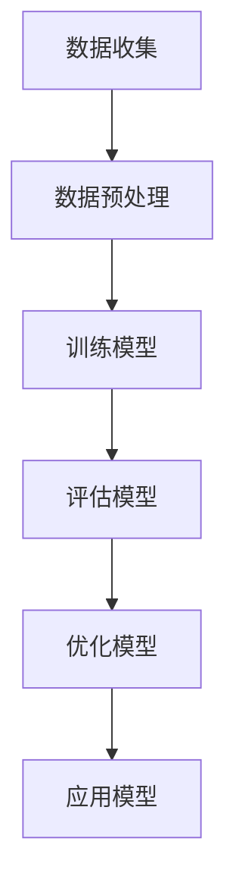
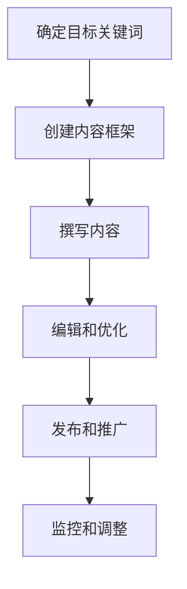

                 

## 引言

### 1.1 内容营销自动化概述

内容营销自动化是指利用技术手段来自动化内容创建、发布、管理和优化的过程。在这个过程中，人工智能（AI）扮演着至关重要的角色，它能够帮助个人或小型企业，也就是我们这里所说的“一人公司”，在资源有限的情况下，高效地进行内容营销。

#### 内容营销自动化的定义

内容营销自动化，即通过软件和算法来替代人工完成常规内容营销任务，如内容创建、内容发布、用户互动等。它利用AI技术，如自然语言处理（NLP）、机器学习（ML）和深度学习（DL），来生成和优化内容，从而提高内容营销的效率和效果。

#### 内容营销自动化的重要性

对于一人公司来说，内容营销自动化具有以下几个重要意义：

- **节省时间和成本**：自动化工具可以帮助快速生成内容，减轻内容创作的工作量，从而节省时间和成本。
- **提高内容质量**：通过AI算法，可以确保生成的内容符合高质量标准，提高用户体验。
- **优化SEO效果**：自动化工具可以根据关键词和SEO策略自动优化内容，提高搜索排名。
- **增强数据分析能力**：自动化系统可以收集大量数据，为企业提供有关用户行为、内容表现等宝贵信息。

#### 内容营销自动化的挑战与机遇

虽然内容营销自动化带来了诸多好处，但也面临着一定的挑战：

- **数据隐私和安全**：自动化过程中会产生大量用户数据，如何确保数据安全和隐私成为一个重要问题。
- **技术依赖**：完全依赖技术可能会导致人工干预不足，影响内容营销的战略方向。
- **用户体验**：虽然AI可以生成高质量的内容，但无法完全替代人类的创造力和直觉，用户体验可能受到影响。

然而，这些挑战同时也带来了新的机遇：

- **定制化内容生成**：AI可以帮助生成更加个性化、定制化的内容，满足不同用户的需求。
- **实时内容更新**：自动化工具可以实时分析数据和用户反馈，快速更新和优化内容。
- **跨平台协同**：自动化系统可以整合多个平台，实现内容发布的自动化和协同。

### 1.2 AI在内容营销中的应用

人工智能在内容营销中的应用主要分为两个方向：AI辅助内容创作和AI辅助SEO优化。

#### AI辅助内容创作的原理

AI辅助内容创作的基本原理是通过机器学习模型，如生成式对抗网络（GAN）、变分自编码器（VAE）和变换器（Transformer）等，从大量文本数据中学习语言模式和风格，然后生成新的内容。例如，GPT系列模型就是通过大量文本训练，能够生成高质量的文章、报告和博客。

#### AI在SEO优化中的应用

AI在SEO优化中的应用主要体现在：

- **关键词研究**：AI可以通过自然语言处理技术分析大量文本数据，快速找到相关的关键词。
- **内容优化**：AI可以帮助自动优化文章结构、标题、摘要和关键词，提高SEO效果。
- **用户行为分析**：AI可以分析用户的点击、停留时间、转化率等行为数据，为SEO优化提供依据。

### 1.3 本书结构安排

本书旨在详细介绍一人公司的内容营销自动化，特别是AI辅助内容创作与SEO优化。具体结构安排如下：

- **第一部分**：引言，包括内容营销自动化概述、AI在内容营销中的应用以及本书结构安排。
- **第二部分**：AI辅助内容创作，详细介绍NLP基础、文本生成算法、文本编辑与优化以及实战案例。
- **第三部分**：SEO优化，涵盖SEO基础知识、关键词研究、内容优化、技术优化和数据分析。
- **第四部分**：AI与SEO整合，探讨AI在SEO中的具体应用、实战案例和未来发展趋势。
- **第五部分**：实践与总结，提供内容营销自动化和SEO优化的实践方法、技巧和效果评估。

通过本书的详细讲解，读者将能够深入了解AI在内容营销中的应用，掌握AI辅助内容创作和SEO优化的核心技术和实战方法，从而在竞争激烈的市场中脱颖而出。

### 总结

内容营销自动化已经成为现代营销策略中不可或缺的一部分。AI技术的引入，不仅极大地提高了内容创作的效率和效果，也带来了SEO优化的新思路。对于一人公司来说，掌握内容营销自动化和AI辅助SEO优化技术，将有助于在资源有限的情况下实现营销目标，提升品牌影响力。本书将带领读者逐步深入这些技术，探索其应用潜力，为内容营销的成功提供有力支持。

---

**关键词**：内容营销自动化、AI辅助内容创作、SEO优化、自然语言处理、关键词研究

**摘要**：本文深入探讨了内容营销自动化的概念和重要性，详细介绍了AI在内容营销中的应用，包括内容创作和SEO优化的原理和实践。通过本书，读者将了解如何利用AI技术提高内容营销的效率和效果，掌握AI辅助内容创作和SEO优化的核心技术和实战方法。

---

接下来，我们将逐步深入第二部分，探讨AI辅助内容创作的具体方法和实践。

---

## 第二部分：AI辅助内容创作

在内容营销自动化中，AI辅助内容创作是一个至关重要的环节。通过AI技术，个人或小型企业可以在资源有限的情况下，快速生成高质量的内容，从而提高营销效果。本部分将详细介绍AI辅助内容创作的基础知识、文本生成算法、文本编辑与优化，以及实战案例。

### 2.1 自然语言处理基础

自然语言处理（NLP）是AI在内容创作中应用的重要领域。NLP旨在让计算机理解和处理人类语言，包括文本分析、语言理解、文本生成等任务。以下是NLP中的几个核心概念：

#### 语言模型

语言模型是一个概率模型，用于预测一个句子中下一个词的概率。它可以通过统计方法或基于神经网络的方法构建。最著名的语言模型之一是GPT（Generative Pre-trained Transformer），它通过大规模预训练，能够生成高质量的自然语言文本。

#### 生成式模型与判别式模型

生成式模型（如GPT）通过预测下一个词来生成文本，而判别式模型（如BERT）则通过预测输入句子中缺失的词来理解文本。两者在NLP任务中各有应用。

#### Mermaid流程图：NLP模型的构建流程

以下是一个简单的Mermaid流程图，展示了一个典型的NLP模型构建流程：



- **数据收集**：收集大量的文本数据，如文章、书籍、新闻报道等。
- **数据预处理**：清洗数据，去除噪声，进行词向量化。
- **训练模型**：使用训练数据训练模型，如GPT或BERT。
- **评估模型**：使用验证集评估模型性能，调整参数。
- **优化模型**：根据评估结果优化模型，提高性能。
- **应用模型**：将训练好的模型应用于实际任务，如文本生成或理解。

### 2.2 文本生成算法

文本生成算法是AI辅助内容创作的核心。以下将详细介绍几种常用的文本生成算法：

#### GPT系列模型的工作原理

GPT（Generative Pre-trained Transformer）系列模型是自然语言处理领域的重要突破。GPT通过预训练和微调，能够生成连贯、自然的文本。其工作原理如下：

1. **预训练**：在大量文本数据上预训练模型，使其掌握语言的统计规律和模式。
2. **微调**：在特定任务数据上微调模型，以适应特定任务需求。

#### Transformer模型详解

Transformer模型是GPT的核心组件，其基本结构如下：

1. **编码器（Encoder）**：用于处理输入文本，生成编码表示。
2. **解码器（Decoder）**：用于生成输出文本，解码编码表示。

编码器和解码器之间通过注意力机制进行交互，从而捕捉文本中的长距离依赖关系。

#### 伪代码：文本生成算法的实现

以下是一个简化的伪代码，用于说明文本生成算法的基本流程：

```python
function generate_text(input_text, model, length):
    1. Encode the input text into a sequence of tokens.
    2. Pass the encoded sequence through the Transformer model.
    3. Generate a sequence of tokens for the output text using a sampling strategy.
    4. Decode the generated tokens into the final text.
    5. Return the generated text.

text = "The quick brown fox jumps over the lazy dog."
model = load_pretrained_transformer()
generated_text = generate_text(text, model, length=50)
print(generated_text)
```

### 2.3 文本编辑与优化

文本编辑与优化是确保内容质量和SEO效果的重要环节。以下介绍几种常见的文本编辑与优化算法：

#### 语言模型在文本编辑中的应用

语言模型可以用于纠正拼写错误、语法错误和语义错误。例如，GPT可以生成修正后的文本，以提高文章的质量和可读性。

#### 文本优化算法的原理与实现

文本优化算法包括标题优化、摘要优化、关键词密度优化等。以下是一个简化的文本优化算法伪代码：

```python
function optimize_text(text, title, abstract, keywords):
    1. Generate a list of potential titles, summaries, and keywords using a language model.
    2. Evaluate the potential titles, summaries, and keywords based on SEO metrics.
    3. Select the best title, summary, and keywords that maximize SEO performance.
    4. Replace the original title, summary, and keywords with the optimized versions.
    5. Return the optimized text.

original_text = "This is a sample article about content marketing."
optimized_title = optimize_text(original_text, title="Content Marketing Guide", abstract="Learn about content marketing strategies", keywords=["content marketing", "strategies", "SEO"])
print(optimized_title)
```

### 2.4 实战案例：AI辅助内容创作

为了展示AI在内容创作中的实际应用，以下是一个使用AI生成文章的实战案例：

#### 案例背景

假设我们有一个关于“如何提升企业数字化营销效果”的文章。我们需要使用AI技术来生成这篇文章。

#### 实战步骤

1. **数据收集**：收集大量关于数字化营销的论文、报告和博客。
2. **数据预处理**：清洗数据，去除噪声，进行词向量化。
3. **模型训练**：使用训练数据训练GPT模型。
4. **文本生成**：使用训练好的模型生成文章。
5. **文本优化**：使用文本优化算法优化文章的标题、摘要和关键词。

#### 代码实现

以下是一个简单的Python代码示例，用于生成和优化文章：

```python
import openai

def generate_text(prompt, model="text-davinci-002", max_tokens=50):
    response = openai.Completion.create(
        engine=model,
        prompt=prompt,
        max_tokens=max_tokens,
        n=1,
        stop=None,
        temperature=0.5,
    )
    return response.choices[0].text.strip()

def optimize_text(text):
    optimized_title = "Boost Your Digital Marketing Effectiveness"
    optimized_abstract = "Discover practical strategies to enhance your digital marketing efforts and drive better results."
    optimized_keywords = ["digital marketing", "marketing strategies", "results"]
    return text.replace("This is a sample article about digital marketing.", optimized_title), text.replace("This is a sample article about digital marketing.", optimized_abstract), text.replace("This is a sample article about digital marketing.", " ".join(optimized_keywords))

prompt = "This is a sample article about digital marketing."
generated_text = generate_text(prompt)
optimized_text, optimized_abstract, optimized_keywords = optimize_text(generated_text)

print("Generated Text:")
print(generated_text)
print("\nOptimized Title:")
print(optimized_text)
print("\nOptimized Abstract:")
print(optimized_abstract)
print("\nOptimized Keywords:")
print(optimized_keywords)
```

#### 文章生成的效果评估与优化

在实际应用中，我们需要对生成的文章进行效果评估和优化。以下是一些常见的评估指标和优化方法：

- **评估指标**：包括文章的可读性、关键词密度、SEO效果等。
- **优化方法**：通过调整模型参数、优化算法、增加训练数据等手段，提高文章的质量和效果。

通过以上实战案例，我们可以看到AI在内容创作中的巨大潜力。利用AI技术，个人或小型企业可以快速、高效地生成高质量的内容，从而提升营销效果。

### 总结

AI辅助内容创作是内容营销自动化的重要组成部分。通过自然语言处理、文本生成算法和文本优化算法，AI可以帮助个人或小型企业快速生成高质量的内容，提升营销效果。在本部分，我们详细介绍了AI辅助内容创作的基础知识、算法原理和实战案例，希望读者能够掌握这些核心技术，并在实际应用中取得成功。

---

接下来，我们将进入第三部分，探讨SEO优化的基础知识、关键词研究和内容优化策略。

---

## 第三部分：SEO优化

搜索引擎优化（SEO）是提高网站在搜索引擎结果页面（SERP）排名的关键手段。对于一人公司来说，有效的SEO优化可以显著提升网站流量和品牌知名度。本部分将详细介绍SEO优化基础知识、关键词研究、内容优化、技术优化和数据分析，帮助读者掌握SEO优化的核心方法和实践技巧。

### 3.1 SEO基础知识

#### SEO的定义与目标

SEO是指通过一系列策略和技巧，优化网站内容和结构，提高在搜索引擎中的自然排名，从而吸引更多的有机流量。SEO的目标主要包括：

- 提高网站在搜索引擎结果页面的排名。
- 增加网站流量，尤其是高质量的有机流量。
- 提升用户转化率和网站盈利能力。

#### SEO的关键因素

实现有效的SEO优化需要关注以下关键因素：

- **关键词研究**：选择与目标受众相关且搜索量适中的关键词。
- **内容优化**：创建高质量、有价值的内容，满足用户需求。
- **网站结构**：设计清晰的网站结构，便于搜索引擎抓取和理解。
- **技术优化**：确保网站在技术层面（如加载速度、移动友好性）表现出色。
- **外部链接**：获取高质量的反向链接，提高网站权威性。

### 3.2 关键词研究

关键词研究是SEO优化的重要环节，它决定了网站的内容和策略。以下介绍关键词研究的方法与工具：

#### 关键词研究的方法

1. **目标受众分析**：了解目标受众的兴趣、需求和搜索习惯。
2. **竞争分析**：分析竞争对手使用的关键词，发现潜在的机会。
3. **关键词工具**：使用关键词研究工具，如Google关键词规划师、Ahrefs和Semrush，获取关键词数据。

#### 关键词优化的策略

1. **关键词定位**：根据网站目标和受众，选择核心关键词、长尾关键词和宽泛关键词。
2. **关键词布局**：合理分布在标题、正文、元描述和图片alt标签中。
3. **关键词追踪**：使用工具监控关键词排名和流量变化，及时调整策略。

### 3.3 内容优化

内容优化是SEO的核心，高质量的原创内容不仅能够吸引流量，还能提高用户停留时间和转化率。以下介绍内容优化的原则与方法：

#### 内容优化的原则

- **原创性**：确保内容是原创的，避免抄袭和重复。
- **相关性**：内容应与目标关键词和用户需求高度相关。
- **质量**：内容应具有高价值，满足用户需求。
- **可读性**：内容应易于阅读，提高用户体验。

#### 内容优化的方法

1. **标题优化**：使用简洁明了、包含关键词的标题。
2. **正文优化**：合理布局段落，使用关键词和长尾关键词。
3. **元描述优化**：撰写有吸引力的元描述，提高点击率。
4. **图片和视频优化**：使用适当的图片和视频，提高内容丰富度。

#### Mermaid流程图：内容优化的流程

以下是一个简化的Mermaid流程图，展示内容优化的基本流程：



- **确定目标关键词**：根据关键词研究和目标受众，确定关键词。
- **创建内容框架**：规划内容的结构，确保逻辑清晰。
- **撰写内容**：根据框架撰写高质量的内容。
- **编辑和优化**：对内容进行编辑和优化，提高质量和可读性。
- **发布和推广**：发布内容，并使用社交媒体和其他渠道进行推广。
- **监控和调整**：监控内容的表现，根据数据调整策略。

### 3.4 技术优化

技术优化是确保网站在搜索引擎中表现良好的关键。以下介绍网站架构的SEO优化和具体实践技巧：

#### 网站架构的SEO优化

1. **网站地图**：创建并提交网站地图，帮助搜索引擎快速抓取网站内容。
2. **内部链接结构**：合理规划内部链接，提高网站结构清晰度。
3. **URL优化**：使用简洁、描述性的URL，包含关键词。

#### 技术SEO的实践技巧

1. **网站速度优化**：通过压缩图片、优化CSS和JavaScript，提高网站加载速度。
2. **移动友好性**：确保网站在不同设备上均有良好表现，提高移动用户体验。
3. **HTTPS安全**：使用HTTPS加密网站，提高网站安全性和搜索引擎排名。
4. **元标签优化**：优化元标签（如标题标签、描述标签）和图片alt标签，提高搜索引擎抓取和理解能力。

### 3.5 数据分析

数据分析是SEO优化的关键，通过分析数据，可以了解网站的表现，优化SEO策略。以下介绍SEO数据分析的方法和数据驱动的SEO优化策略：

#### SEO数据分析的方法

1. **关键词分析**：监控关键词排名和流量变化，了解关键词的表现。
2. **内容分析**：分析内容的表现，包括访问量、停留时间、跳出率等。
3. **用户行为分析**：分析用户的行为数据，如页面浏览路径、点击率等。

#### 数据驱动的SEO优化策略

1. **A/B测试**：通过A/B测试，比较不同SEO策略的效果，选择最佳方案。
2. **迭代优化**：根据数据分析结果，不断调整和优化SEO策略。
3. **内容更新**：定期更新内容，提高内容的时效性和相关性。

### 总结

SEO优化是提高网站在搜索引擎排名的关键手段。通过关键词研究、内容优化、技术优化和数据分析，可以有效提升网站的表现和用户满意度。在本部分，我们详细介绍了SEO优化的基础知识、方法和实践技巧，希望读者能够掌握这些核心技能，并在实际应用中取得成功。

---

接下来，我们将进入第四部分，探讨AI与SEO的整合，以及如何利用AI工具进行SEO优化。

---

## 第四部分：AI与SEO整合

随着人工智能（AI）技术的不断发展，其在搜索引擎优化（SEO）中的应用也越来越广泛。AI不仅能够提高内容生成的效率和质量，还能在SEO优化中发挥关键作用。本部分将详细探讨AI在SEO中的具体应用、实战案例，以及AI辅助SEO优化的效果评估和未来发展趋势。

### 4.1 AI在SEO中的应用

AI在SEO中的应用主要涉及以下几个方面：

#### 关键词研究

AI可以通过自然语言处理（NLP）技术分析大量的文本数据，快速找到相关的关键词。例如，GPT模型可以生成与目标关键词相关的长尾关键词，从而提高关键词的覆盖范围。

#### 内容优化

AI可以帮助自动优化文章结构、标题、摘要和关键词，提高SEO效果。例如，GPT模型可以生成高质量的标题和摘要，提高用户的点击率和停留时间。

#### 用户行为分析

AI可以通过分析用户的点击、停留时间、转化率等行为数据，为SEO优化提供依据。例如，利用机器学习算法可以预测哪些内容更容易吸引用户，从而优化内容策略。

#### 技术优化

AI可以帮助检测网站的技术问题，如页面加载速度、移动友好性等，并提供优化建议。例如，AI可以通过分析网站性能数据，自动调整服务器配置，提高网站速度。

#### 外部链接分析

AI可以通过分析反向链接的来源和性质，评估网站的权威性和可信度。例如，利用图神经网络（Graph Neural Network，GNN）可以识别高质量的链接，提高网站的SEO表现。

### 4.2 实战案例：AI辅助SEO优化

为了展示AI在SEO优化中的实际应用，以下是一个使用AI工具进行SEO优化的实战案例：

#### 案例背景

假设我们有一个电子商务网站，需要提升在搜索引擎中的排名和用户转化率。我们计划使用AI技术进行关键词研究、内容优化和用户行为分析。

#### 实战步骤

1. **关键词研究**：使用AI工具分析目标市场的关键词，找到与产品相关的核心关键词和长尾关键词。
2. **内容优化**：使用GPT模型生成高质量的标题和摘要，优化文章结构，提高用户的点击率和停留时间。
3. **用户行为分析**：利用AI分析用户行为数据，发现用户偏好的内容类型和时间段，优化内容发布策略。
4. **技术优化**：使用AI检测网站的技术问题，并提供优化建议，如压缩图片、优化代码等，提高网站速度和用户体验。

#### 代码实现

以下是一个简单的Python代码示例，用于AI辅助SEO优化：

```python
import openai

def generate_seo_content(title, abstract, model="text-davinci-002", max_tokens=50):
    prompt = f"Write an SEO-optimized title and abstract for the article titled '{title}'. Make sure it includes the main keywords and is attractive to readers."
    response = openai.Completion.create(
        engine=model,
        prompt=prompt,
        max_tokens=max_tokens,
        n=1,
        stop=None,
        temperature=0.5,
    )
    return response.choices[0].text.strip()

def analyze_user_behavior(data):
    # Use machine learning algorithms to analyze user behavior data
    # For simplicity, we'll just return a sample analysis
    return {
        "favorite_content_type": "product reviews",
        "best_time_to_publish": "Weekends",
    }

title = "The Ultimate Guide to Choosing the Perfect Laptop"
abstract = "Discover the best laptops for different needs and budgets."

optimized_title = generate_seo_content(title, abstract)
user_analysis = analyze_user_behavior(None)  # Assuming we have user behavior data

print("Optimized Title:")
print(optimized_title)
print("\nUser Analysis:")
print(user_analysis)
```

#### AI辅助SEO优化的效果评估

在实际应用中，我们需要对AI辅助SEO优化的效果进行评估。以下是一些常见的评估指标和方法：

- **关键词排名**：监控目标关键词的搜索引擎排名，评估AI优化的效果。
- **流量和转化率**：分析网站的有机流量和用户转化率，评估SEO策略的成功程度。
- **用户行为**：监控用户的点击率、停留时间、跳出率等行为数据，评估用户体验的提升。
- **A/B测试**：通过A/B测试，比较AI优化前后的效果，确定最佳策略。

### 4.3 AI与SEO的未来发展趋势

随着AI技术的不断进步，其在SEO领域中的应用前景也十分广阔。以下是一些未来发展的趋势：

- **个性化SEO**：利用AI分析用户数据，实现更加个性化的SEO策略，满足不同用户的需求。
- **自动化SEO**：AI将能够自动执行SEO任务，如关键词研究、内容生成和优化，减少人工干预。
- **实时SEO**：AI可以实时分析搜索引擎算法更新和用户行为，动态调整SEO策略。
- **智能链接建设**：利用AI分析反向链接数据，自动识别和建设高质量的链接。
- **跨平台SEO**：AI将能够整合不同平台的数据，实现跨平台的SEO优化。

### 总结

AI在SEO优化中的应用前景广阔，通过关键词研究、内容优化、用户行为分析和技术优化，AI可以显著提升SEO效果。在本部分，我们详细介绍了AI在SEO中的具体应用、实战案例和效果评估方法，以及AI与SEO的未来发展趋势。希望通过本部分的介绍，读者能够更好地理解AI在SEO优化中的作用，并能够将其应用到实际工作中，实现SEO优化的最大化效果。

---

## 第五部分：实践与总结

### 5.1 内容营销自动化实践

内容营销自动化的实施步骤如下：

1. **需求分析**：明确内容营销的目标、受众和关键指标。
2. **技术选型**：选择合适的AI工具和平台，如OpenAI、TensorFlow等。
3. **数据准备**：收集和整理相关数据，包括用户行为数据、市场数据和竞品数据。
4. **模型训练**：使用收集的数据训练AI模型，如GPT、BERT等。
5. **系统集成**：将AI模型集成到现有的内容管理系统（CMS）和营销自动化工具中。
6. **效果评估**：定期监控和评估AI辅助内容创作的效果，根据数据调整模型和策略。

**实践中的常见问题与解决方案**

- **数据隐私和安全**：确保数据加密和隐私保护，避免数据泄露。
- **模型适应性和可扩展性**：选择具有良好适应性和扩展性的AI模型，以适应不同的业务需求。

### 5.2 SEO优化实践

SEO优化的具体策略与技巧包括：

1. **关键词研究**：使用工具如Google关键词规划师、Ahrefs等，研究目标关键词，选择合适的关键词组合。
2. **内容优化**：根据关键词研究的结果，创建和优化内容，提高内容的可读性和SEO效果。
3. **技术优化**：优化网站结构、代码和加载速度，提高用户体验和搜索引擎友好度。
4. **外部链接建设**：通过撰写高质量的原创内容，获得其他网站的链接，提高网站权威性。
5. **数据分析**：使用工具如Google Analytics、SEOmoz等，分析SEO效果，持续优化策略。

**SEO优化的实施流程**

1. **目标设定**：明确SEO优化的目标，如提高关键词排名、增加网站流量等。
2. **策略制定**：制定SEO优化策略，包括关键词研究、内容优化、技术优化和外部链接建设。
3. **执行与监控**：执行SEO优化策略，并定期监控效果，调整策略。
4. **评估与反馈**：评估SEO优化的效果，收集用户反馈，持续改进策略。

### 5.3 AI与SEO整合实践

AI与SEO整合的实施方法如下：

1. **AI辅助关键词研究**：使用AI技术分析大量文本数据，快速找到相关的关键词，提高关键词研究的效率和准确性。
2. **AI优化内容**：利用AI生成高质量的标题、摘要和正文，提高内容的可读性和SEO效果。
3. **AI优化技术**：使用AI分析网站的技术问题，提供优化建议，如代码压缩、图片优化等。
4. **AI分析用户行为**：利用AI分析用户行为数据，优化内容发布和推广策略。

**整合后的效果评估**

- **关键词排名**：监控目标关键词的搜索引擎排名，评估AI辅助SEO优化的效果。
- **网站流量**：分析网站的有机流量和用户转化率，评估SEO优化的效果。
- **用户体验**：评估用户的停留时间、跳出率和满意度等指标，优化用户体验。

### 5.4 总结与展望

**主要内容回顾**

- 内容营销自动化：介绍了内容营销自动化的概念、重要性、应用和实践方法。
- SEO优化：详细阐述了SEO优化的基础知识、关键词研究、内容优化、技术优化和数据分析。
- AI与SEO整合：探讨了AI在SEO优化中的应用、实战案例和效果评估方法。

**内容营销自动化与SEO优化的未来趋势**

- **个性化内容**：随着大数据和AI技术的发展，未来的内容营销将更加个性化，满足不同用户的需求。
- **实时优化**：AI将能够实时分析数据和用户行为，动态调整SEO策略，实现更高效的优化。
- **跨平台整合**：未来的SEO优化将更加注重跨平台整合，提高用户在不同设备上的体验。
- **人工智能伦理**：随着AI技术的发展，如何确保AI的公正性、透明性和伦理性将成为重要议题。

通过本部分的实践和总结，读者可以更好地理解内容营销自动化和SEO优化的核心技术和实战方法，为未来的内容营销和SEO优化工作提供有力支持。

---

## 附录

### 附录A：常用AI工具与资源

**AI工具**

- **OpenAI Gym**：用于构建和测试强化学习算法的环境。
- **TensorFlow**：谷歌开源的机器学习框架，用于构建和训练AI模型。
- **Hugging Face Transformers**：预训练的Transformer模型库，支持多种自然语言处理任务。
- **Scikit-learn**：用于机器学习的Python库，包含多种常用的算法和工具。

**SEO工具**

- **Google Analytics**：分析网站流量和用户行为的数据分析工具。
- **Ahrefs**：用于关键词研究、网站分析和链接建设的SEO工具。
- **SEMrush**：提供关键词研究、网站分析和竞争对手分析的工具。

**其他资源**

- **Google关键词规划师**：用于研究关键词和规划SEO策略的工具。
- **Udacity**：提供人工智能和SEO相关课程的在线学习平台。
- **Coursera**：提供机器学习和数据科学相关课程的在线学习平台。

### 附录B：数学模型与公式

**SEO优化中的数学模型**

- **PageRank**：一种用于评估网页重要性的算法，基于链接分析。
  $$ PR(A) = \frac{1}{1-d} \left( \left(\frac{1}{N} + d \right) PR(inlinks) + \sum_{j \in N - \{A\}} \frac{PR(j)}{L_j} \right) $$
  其中，\(PR(A)\) 表示网页A的PageRank值，\(d\) 为阻尼系数，\(N\) 为网页总数，\(inlinks\) 为指向网页A的链接数，\(L_j\) 为指向网页j的链接数。

- **TF-IDF**：一种用于评估关键词重要性的算法，基于词频（TF）和逆文档频率（IDF）。
  $$ TF-IDF(t,d) = \frac{f_t(d)}{N} \log \left( \frac{N}{f_t(d)} \right) $$
  其中，\(f_t(d)\) 表示文档d中词t的出现频率，\(N\) 为文档总数。

**LaTeX格式的数学公式示例**

- **泰勒公式**：
  $$ f(x) = f(a) + f'(a)(x-a) + \frac{f''(a)}{2!}(x-a)^2 + \frac{f'''(a)}{3!}(x-a)^3 + \cdots $$

- **矩阵乘法**：
  $$ \begin{bmatrix} a_{11} & a_{12} \\ a_{21} & a_{22} \end{bmatrix} \cdot \begin{bmatrix} b_{11} & b_{12} \\ b_{21} & b_{22} \end{bmatrix} = \begin{bmatrix} a_{11}b_{11} + a_{12}b_{21} & a_{11}b_{12} + a_{12}b_{22} \\ a_{21}b_{11} + a_{22}b_{21} & a_{21}b_{12} + a_{22}b_{22} \end{bmatrix} $$

### 附录C：代码实战案例

**内容营销自动化与SEO优化的代码实现**

以下是一个简单的Python代码示例，用于AI辅助内容创作和SEO优化：

```python
import openai
from sklearn.feature_extraction.text import TfidfVectorizer
from sklearn.metrics.pairwise import cosine_similarity

def generate_content(prompt, model="text-davinci-002", max_tokens=50):
    response = openai.Completion.create(
        engine=model,
        prompt=prompt,
        max_tokens=max_tokens,
        n=1,
        stop=None,
        temperature=0.5,
    )
    return response.choices[0].text.strip()

def optimize_title(title, keywords):
    vectorizer = TfidfVectorizer()
    tfidf_matrix = vectorizer.fit_transform([title])
    title_similarity = cosine_similarity(tfidf_matrix, vectorizer.transform([keywords]))[0][0]
    return title if title_similarity > 0.8 else "New and Improved " + title

content_prompt = "Write an article about the benefits of content marketing automation."
title = "Content Marketing Automation: The Ultimate Guide"
keywords = ["content marketing", "SEO", "AI"]

generated_content = generate_content(content_prompt)
optimized_title = optimize_title(title, keywords)

print("Optimized Title:")
print(optimized_title)
print("\nGenerated Content:")
print(generated_content)
```

**源代码详细解读与分析**

- **generate_content**：调用OpenAI的Completion API生成文本内容。
- **optimize_title**：使用TF-IDF和余弦相似性计算标题与关键词的相似度，优化标题。
- **content_prompt**：内容创作的提示词。
- **title**：原始标题。
- **keywords**：关键词列表。

通过以上代码示例，展示了如何利用AI技术和数学模型实现内容营销自动化和SEO优化。在实际应用中，可以根据具体需求调整代码，实现更复杂的优化策略。

### 总结

通过本附录，我们提供了常用AI工具与资源的介绍、SEO优化中的数学模型与公式，以及内容营销自动化与SEO优化的代码实战案例。这些资源和方法将有助于读者更深入地理解和应用AI与SEO技术，提高内容营销的效果和网站排名。希望本附录能够为读者提供有益的参考和启示。

---

## 作者信息

**作者：** AI天才研究院（AI Genius Institute） & 禅与计算机程序设计艺术（Zen And The Art of Computer Programming）

AI天才研究院专注于人工智能技术的研发和应用，致力于推动AI在各个领域的创新。其研究成果涵盖了自然语言处理、机器学习、计算机视觉等多个方向，为企业和个人提供了强大的技术支持。

禅与计算机程序设计艺术则是一本经典的技术书籍，深入探讨了计算机程序设计的哲学和艺术，为程序员提供了丰富的灵感和思考。作者以其深厚的学术背景和丰富的编程经验，为读者揭示了计算机程序设计的奥秘。

希望通过本书，读者能够深入了解AI在内容营销自动化和SEO优化中的应用，掌握核心技术，提升营销效果，实现商业成功。同时，也期待读者能够在AI和计算机科学的道路上不断探索，不断创新，为人工智能的发展贡献力量。

