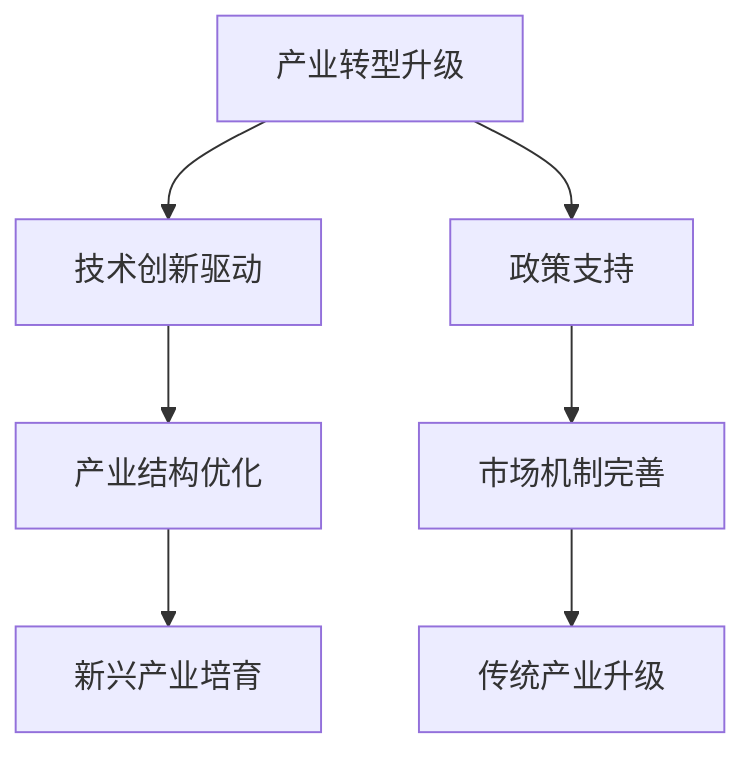

                 

## 《产业转型升级与新质生产力的推动》

### 关键词：产业转型升级、新质生产力、技术创新、产业政策、数字经济

### 摘要：

在当前全球经济格局下，产业转型升级已成为推动国家经济发展的重要战略。本文将围绕产业转型升级背景与挑战、新质生产力的概念与特征、产业转型升级与新质生产力推动的路径、典型案例分析以及政策建议与展望展开讨论，旨在为我国产业转型升级提供有益的思路和策略。

## 目录大纲

1. **第一部分：产业转型升级背景与挑战**
   - **1.1 产业转型升级概述**
     - 1.1.1 产业转型升级的概念
     - 1.1.2 产业转型升级的必要性
   - **1.2 当前产业转型升级面临的挑战**
     - 1.2.1 技术变革与产业转型
     - 1.2.2 经济结构优化与产能过剩
     - 1.2.3 政策与制度环境的制约

2. **第二部分：新质生产力的概念与特征**
   - **1.3 新质生产力的定义与内涵**
     - 1.3.1 新质生产力的基本定义
     - 1.3.2 新质生产力的内涵解析
   - **1.4 新质生产力的主要特征**
     - 1.4.1 知识密集型
     - 1.4.2 创新驱动型
     - 1.4.3 高效绿色型
   - **1.5 新质生产力的驱动力分析**
     - 1.5.1 科技创新
     - 1.5.2 产业政策
     - 1.5.3 全球产业链重构

3. **第三部分：产业转型升级与新质生产力推动的路径**
   - **1.6 提升自主创新能力**
     - 1.6.1 研发投入增加
     - 1.6.2 创新人才培养
     - 1.6.3 知识产权保护
   - **1.7 优化产业结构**
     - 1.7.1 加快传统产业升级
     - 1.7.2 新兴产业培育与发展
     - 1.7.3 区域协调发展
   - **1.8 改革开放与市场机制完善**
     - 1.8.1 市场化改革
     - 1.8.2 产权制度改革
     - 1.8.3 竞争政策与公平竞争

4. **第四部分：典型案例分析**
   - **1.9 国际产业转型升级与新质生产力推动的案例分析**
     - 1.9.1 美国：信息技术产业的崛起
     - 1.9.2 德国：工业4.0战略
     - 1.9.3 中国：数字经济与智能制造
   - **1.10 我国产业转型升级与新质生产力推动的实践案例**
     - 1.10.1 智能制造与工业互联网
     - 1.10.2 互联网+与产业融合
     - 1.10.3 绿色发展与循环经济

5. **第五部分：政策建议与展望**
   - **1.11 产业转型升级与新质生产力推动的政策建议**
     - 1.11.1 完善政策体系
     - 1.11.2 加大支持力度
     - 1.11.3 强化国际合作
   - **1.12 产业转型升级与新质生产力推动的展望**
     - 1.12.1 未来发展趋势
     - 1.12.2 我国产业转型升级的战略布局
     - 1.12.3 新质生产力对全球经济的潜在影响

## 第一部分：产业转型升级背景与挑战

### 1.1 产业转型升级概述

#### 1.1.1 产业转型升级的概念

产业转型升级是指通过技术创新、产业政策调整、结构调整、优化资源配置等手段，推动传统产业向更高层次、更高附加值方向发展，实现产业结构的优化和产业质量的提升。产业转型升级是经济发展过程中的一种自然现象，是经济增长方式转变的必然要求。

#### 1.1.2 产业转型升级的必要性

当前，全球经济正面临深刻变革，新一轮科技革命和产业变革正在孕育兴起。信息技术、人工智能、大数据等新兴技术快速发展，不仅改变了人们的生活方式，也推动了产业结构的调整和升级。面对这样的外部环境，我国产业转型升级显得尤为必要：

1. **应对国际竞争**：在全球化的背景下，国际竞争日趋激烈。通过产业转型升级，可以提高我国产业的国际竞争力，确保我国在全球产业链中的地位。

2. **实现经济高质量发展**：产业转型升级是推动经济高质量发展的关键。通过优化产业结构、提升创新能力、提高资源利用效率，可以实现经济增长方式的转变，促进经济可持续发展。

3. **满足人民日益增长的美好生活需要**：随着人民生活水平的提高，对高品质、多样化的产品和服务的需求日益增长。产业转型升级可以更好地满足人民的需求，提升人民群众的获得感、幸福感、安全感。

### 1.2 当前产业转型升级面临的挑战

#### 1.2.1 技术变革与产业转型

技术变革是推动产业转型升级的重要动力。然而，技术变革也带来了一定的挑战：

1. **技术创新难度加大**：随着科技的发展，技术创新的难度越来越大，需要更多的资金、人力和时间投入。

2. **技术风险增加**：新技术的发展带来了新的风险，如数据安全、隐私保护等问题。

3. **产业转型路径不确定**：不同产业的技术创新路径不同，产业转型路径也存在不确定性，需要企业在转型升级过程中不断探索和试错。

#### 1.2.2 经济结构优化与产能过剩

我国经济发展已由高速增长阶段转向高质量发展阶段，经济结构优化成为产业转型升级的重要内容。然而，产能过剩问题仍然存在：

1. **产业结构不合理**：部分传统产业产能过剩，新兴产业尚未形成规模，产业结构调整难度较大。

2. **区域发展不平衡**：东部沿海地区经济较为发达，中西部地区发展相对滞后，区域发展不平衡问题亟待解决。

3. **经济质量不高**：我国经济仍处于中高速增长阶段，经济质量不高，需要通过产业转型升级提升经济发展质量。

#### 1.2.3 政策与制度环境的制约

政策与制度环境是产业转型升级的重要保障。然而，当前我国政策与制度环境还存在一些问题：

1. **政策体系不完善**：政策体系不够完善，政策执行力有待提高。

2. **制度环境不完善**：产权保护、市场竞争等制度环境不够完善，影响了企业的创新活力和转型升级动力。

3. **政府与市场关系不协调**：政府与市场的关系需要进一步协调，处理好政府与市场的关系，激发市场活力。

## 第二部分：新质生产力的概念与特征

### 1.3 新质生产力的定义与内涵

#### 1.3.1 新质生产力的基本定义

新质生产力是指以知识、技术、数据等新生产要素为核心，通过创新驱动和集成创新，实现生产效率提升、经济结构优化和经济增长质量提升的一种新型生产力。

#### 1.3.2 新质生产力的内涵解析

1. **知识密集型**：新质生产力以知识为主要生产要素，通过知识的创新、集成和应用，提高生产效率。

2. **创新驱动型**：新质生产力以创新为驱动，通过技术创新、管理创新和制度创新，推动产业转型升级。

3. **高效绿色型**：新质生产力强调高效和绿色，通过提高资源利用效率、降低能耗和减少污染，实现可持续发展。

### 1.4 新质生产力的主要特征

#### 1.4.1 知识密集型

新质生产力以知识为主要生产要素，具有知识密集型的特点。具体表现在：

1. **研发投入高**：新质生产力要求大量的研发投入，用于知识的创造、积累和应用。

2. **知识转化效率高**：新质生产力强调知识的快速转化和应用，通过技术创新和管理创新，提高知识转化效率。

3. **知识更新速度快**：新质生产力依赖于最新的科技和知识，要求不断进行知识更新和迭代。

#### 1.4.2 创新驱动型

新质生产力以创新为驱动，具有创新驱动型的特点。具体表现在：

1. **技术创新**：新质生产力强调技术创新，通过研发新技术、新产品、新工艺，提高生产效率和产品质量。

2. **管理创新**：新质生产力注重管理创新，通过优化管理模式、提升管理水平，提高企业效率和竞争力。

3. **制度创新**：新质生产力要求制度创新，通过改革和完善制度体系，激发创新活力和转型升级动力。

#### 1.4.3 高效绿色型

新质生产力强调高效和绿色，具有高效绿色型的特点。具体表现在：

1. **资源利用效率高**：新质生产力通过提高资源利用效率，降低资源消耗，实现可持续发展。

2. **能耗低**：新质生产力通过技术创新和管理创新，降低能耗，提高能源利用效率。

3. **环保性强**：新质生产力强调环保，通过减少污染和排放，实现绿色生产。

### 1.5 新质生产力的驱动力分析

#### 1.5.1 科技创新

科技创新是新质生产力的核心驱动力。科技创新可以推动技术进步、产业升级和经济增长。具体表现在：

1. **技术突破**：科技创新可以带来技术突破，推动产业变革和升级。

2. **产品创新**：科技创新可以带来产品创新，提升产品附加值和市场竞争力。

3. **产业变革**：科技创新可以引发产业变革，推动产业结构的调整和升级。

#### 1.5.2 产业政策

产业政策是新质生产力的外部驱动力。产业政策可以通过政策引导、资金支持、税收优惠等方式，促进新质生产力的发展。具体表现在：

1. **政策支持**：产业政策可以为新质生产力的发展提供政策支持，降低创新成本和风险。

2. **资金支持**：产业政策可以通过资金支持，为科技创新和产业升级提供资金保障。

3. **税收优惠**：产业政策可以通过税收优惠，激励企业加大研发投入，推动新质生产力发展。

#### 1.5.3 全球产业链重构

全球产业链重构是新质生产力的国际驱动力。全球产业链重构可以推动产业链的升级和优化，为新质生产力的发展提供机遇。具体表现在：

1. **产业链升级**：全球产业链重构可以推动产业链的升级，提高产业附加值。

2. **产业分工**：全球产业链重构可以推动产业分工的深化，提高生产效率。

3. **国际合作**：全球产业链重构可以推动国际合作，促进技术创新和产业升级。

## 第三部分：产业转型升级与新质生产力推动的路径

### 1.6 提升自主创新能力

#### 1.6.1 研发投入增加

研发投入增加是提升自主创新能力的重要途径。增加研发投入可以为企业提供更多的科技创新资源，推动技术进步和产业升级。具体策略包括：

1. **政府引导**：政府可以通过制定相关政策，引导企业增加研发投入。例如，设立研发费用加计扣除政策，鼓励企业加大研发投入。

2. **税收优惠**：政府可以提供税收优惠，降低企业的研发成本。例如，对高新技术企业实施税收减免政策，激励企业加大研发投入。

3. **资金支持**：政府可以提供资金支持，为企业的科技创新提供资金保障。例如，设立科技创新基金，支持企业的研发活动。

#### 1.6.2 创新人才培养

创新人才培养是提升自主创新能力的关键。创新人才是科技创新的核心力量，高素质的创新人才可以为企业带来更多的创新成果。具体策略包括：

1. **教育改革**：政府可以推动教育改革，培养具有创新精神和创新能力的人才。例如，加强STEM教育，培养学生的科学素养和创新能力。

2. **人才引进**：政府可以制定人才引进政策，吸引国内外高层次创新人才。例如，提供人才引进补贴、购房补贴等福利，吸引人才来我国创新创业。

3. **激励机制**：企业可以建立激励机制，鼓励员工参与创新活动。例如，设立创新奖励基金，对有突出贡献的员工给予奖励。

#### 1.6.3 知识产权保护

知识产权保护是提升自主创新能力的重要保障。知识产权保护可以激励企业进行科技创新，保护企业的知识产权权益。具体策略包括：

1. **完善法律体系**：政府可以完善知识产权法律法规体系，提高知识产权保护水平。例如，修订《专利法》、《商标法》等法律法规，增强知识产权保护力度。

2. **加强执法力度**：政府可以加强知识产权执法力度，严厉打击侵权行为。例如，建立知识产权保护机制，加强对侵权行为的查处和处罚。

3. **国际合作**：政府可以加强国际合作，参与国际知识产权保护体系。例如，加入《知识产权协定》等国际条约，提升我国在国际知识产权保护领域的地位。

### 1.7 优化产业结构

#### 1.7.1 加快传统产业升级

加快传统产业升级是优化产业结构的重要任务。传统产业是我国经济的重要组成部分，通过传统产业升级，可以提高产业附加值，促进经济高质量发展。具体策略包括：

1. **技术改造**：政府可以鼓励企业进行技术改造，提高生产效率。例如，推广智能制造、数字化管理等技术，提升传统产业的竞争力。

2. **产业协同**：政府可以推动产业链上下游企业协同发展，提高产业链整体竞争力。例如，加强产业链上下游企业的合作，实现资源共享和优势互补。

3. **绿色发展**：政府可以推动传统产业绿色发展，减少环境污染。例如，推广节能环保技术，提高资源利用效率，减少废弃物排放。

#### 1.7.2 新兴产业培育与发展

新兴产业培育与发展是优化产业结构的重要方向。新兴产业具有高成长性、高附加值等特点，可以推动经济结构调整和产业升级。具体策略包括：

1. **政策支持**：政府可以制定相关政策，支持新兴产业的发展。例如，提供资金支持、税收优惠等政策，鼓励企业投资新兴产业。

2. **创新平台**：政府可以建立创新平台，为企业提供创新资源和环境。例如，设立产业技术创新战略联盟、创新创业孵化器等平台，促进新兴产业的快速发展。

3. **人才引进**：政府可以加强人才引进，为新兴产业提供人才支持。例如，吸引国内外高层次创新人才，为新兴产业的快速发展提供人才保障。

#### 1.7.3 区域协调发展

区域协调发展是优化产业结构的重要保障。区域协调发展可以推动区域经济一体化，提高整体经济发展水平。具体策略包括：

1. **政策协调**：政府可以制定区域协调发展的政策，促进区域间的合作与协调。例如，建立区域合作机制，推动区域间政策协调。

2. **产业转移**：政府可以推动产业转移，促进区域协调发展。例如，将东部地区的产业转移到中西部地区，促进中西部地区的发展。

3. **基础设施**：政府可以加强基础设施建设，提高区域间的互联互通。例如，建设高速公路、高铁、机场等基础设施，促进区域间的经济交流与合作。

### 1.8 改革开放与市场机制完善

#### 1.8.1 市场化改革

市场化改革是改革开放的核心内容。市场化改革可以促进资源配置的优化，提高经济效率。具体策略包括：

1. **放宽市场准入**：政府可以放宽市场准入，鼓励民间投资。例如，取消或降低市场准入门槛，吸引更多社会资本进入新兴产业。

2. **完善市场机制**：政府可以完善市场机制，提高市场运行效率。例如，建立统一的市场体系，打破地方保护和行业垄断，促进市场竞争。

3. **优化营商环境**：政府可以优化营商环境，提高企业的创新活力。例如，简化行政审批流程，降低企业运营成本，为企业提供优质服务。

#### 1.8.2 产权制度改革

产权制度改革是市场化改革的重要组成部分。产权制度改革可以保护产权，激发企业创新活力。具体策略包括：

1. **完善产权保护制度**：政府可以完善产权保护制度，保障企业和个人的合法权益。例如，修订《公司法》、《合同法》等法律法规，明确产权保护的范围和标准。

2. **加强产权执法**：政府可以加强产权执法，严厉打击侵权行为。例如，建立产权保护机制，加强对侵权行为的查处和处罚。

3. **优化产权交易**：政府可以优化产权交易，提高产权流动性。例如，建立产权交易平台，简化产权交易程序，降低产权交易成本。

#### 1.8.3 竞争政策与公平竞争

竞争政策与公平竞争是市场化改革的重要保障。竞争政策与公平竞争可以维护市场秩序，促进企业创新。具体策略包括：

1. **完善竞争政策**：政府可以完善竞争政策，维护市场秩序。例如，修订《反垄断法》、《反不正当竞争法》等法律法规，明确竞争政策的范围和标准。

2. **加强反垄断执法**：政府可以加强反垄断执法，防止市场垄断行为。例如，建立反垄断机构，加强对垄断行为的调查和处理。

3. **促进公平竞争**：政府可以促进公平竞争，为企业提供公平竞争的环境。例如，建立公平竞争审查机制，防止政府干预市场，确保企业公平竞争。

## 第四部分：典型案例分析

### 1.9 国际产业转型升级与新质生产力推动的案例分析

#### 1.9.1 美国：信息技术产业的崛起

美国作为全球科技强国，其信息技术产业的崛起是产业转型升级和新质生产力推动的典型代表。美国在信息技术领域拥有强大的技术创新能力和产业链优势，通过以下措施推动了信息技术产业的快速发展：

1. **科技创新**：美国政府高度重视科技创新，投入大量资金用于科研和技术研发，推动了信息技术领域的突破性进展。

2. **产业政策**：美国政府制定了一系列产业政策，支持信息技术产业的发展，如减税、研发资助等。

3. **全球产业链重构**：随着全球产业链的重构，美国在信息技术领域掌握了核心技术和产业链的高端环节，提高了国际竞争力。

#### 1.9.2 德国：工业4.0战略

德国作为制造业强国，其工业4.0战略是产业转型升级和新质生产力推动的又一典型案例。工业4.0战略旨在通过信息技术与制造业的深度融合，实现智能制造和工业互联网的普及：

1. **技术创新**：德国政府加大对智能制造、工业互联网等领域的研发投入，推动了技术创新和产业升级。

2. **产业政策**：德国政府制定了工业4.0战略，明确了智能制造的发展目标和路径，提供了政策和资金支持。

3. **国际合作**：德国政府加强国际合作，吸引了全球范围内的技术资源和市场资源，促进了工业4.0战略的实施。

#### 1.9.3 中国：数字经济与智能制造

中国在产业转型升级和新质生产力推动方面也取得了显著成果，以数字经济和智能制造为代表。中国通过以下措施推动了数字经济和智能制造的发展：

1. **科技创新**：中国政府加大对科技创新的支持，推动了信息技术、人工智能等领域的突破性进展。

2. **产业政策**：中国政府制定了一系列产业政策，如《中国制造2025》等，明确了数字经济和智能制造的发展目标和路径。

3. **国际合作**：中国积极推动国际合作，吸引了全球范围内的技术资源和市场资源，促进了数字经济和智能制造的发展。

### 1.10 我国产业转型升级与新质生产力推动的实践案例

#### 1.10.1 智能制造与工业互联网

智能制造与工业互联网是我国产业转型升级和新质生产力推动的重要方向。以下是一个实践案例：

**案例**：某大型制造企业通过实施智能制造与工业互联网战略，实现了生产效率的提升和产品质量的改进。

1. **技术创新**：企业投入大量资金进行技术创新，研发了智能生产设备和工业互联网平台。

2. **产业政策**：政府提供了政策和资金支持，鼓励企业实施智能制造和工业互联网战略。

3. **国际合作**：企业与国际先进技术团队合作，引进了最新的智能制造技术。

#### 1.10.2 互联网+与产业融合

互联网+与产业融合是我国产业转型升级和新质生产力推动的又一重要方向。以下是一个实践案例：

**案例**：某传统零售企业通过实施互联网+战略，实现了线上线下融合和业务模式的创新。

1. **技术创新**：企业投入大量资金进行技术创新，开发了电商平台和智能购物系统。

2. **产业政策**：政府提供了政策和资金支持，鼓励企业实施互联网+战略。

3. **国际合作**：企业与国际先进技术团队合作，引进了最新的互联网技术。

#### 1.10.3 绿色发展与循环经济

绿色发展与循环经济是我国产业转型升级和新质生产力推动的必要方向。以下是一个实践案例：

**案例**：某环保企业通过实施绿色发展战略，实现了循环经济和可持续发展。

1. **技术创新**：企业投入大量资金进行技术创新，研发了环保技术和设备。

2. **产业政策**：政府提供了政策和资金支持，鼓励企业实施绿色发展战略。

3. **国际合作**：企业与国际先进技术团队合作，引进了最新的环保技术。

## 第五部分：政策建议与展望

### 1.11 产业转型升级与新质生产力推动的政策建议

为了推动产业转型升级和新质生产力的发展，政府可以采取以下政策建议：

#### 1.11.1 完善政策体系

1. **制定产业规划**：政府应制定明确的产业规划，明确产业转型升级和新质生产力的发展方向和目标。

2. **出台配套政策**：政府应出台一系列配套政策，如税收优惠、资金支持等，为产业转型升级和新质生产力的发展提供政策保障。

3. **完善法律体系**：政府应完善相关法律法规，为产业转型升级和新质生产力的发展提供法律保障。

#### 1.11.2 加大支持力度

1. **增加研发投入**：政府应增加对科技创新的投入，支持企业进行技术研发和创新。

2. **提供资金支持**：政府可以通过设立产业基金、提供贷款等方式，为企业提供资金支持。

3. **优化创新环境**：政府应优化创新环境，降低企业创新成本，提高企业创新活力。

#### 1.11.3 强化国际合作

1. **引进国外技术**：政府应鼓励企业引进国外先进技术，提高我国产业技术水平。

2. **推动国际交流**：政府应推动国际间的技术交流与合作，促进技术共享和创新发展。

3. **参与国际竞争**：政府应鼓励企业参与国际竞争，提高我国产业的国际竞争力。

### 1.12 产业转型升级与新质生产力推动的展望

#### 1.12.1 未来发展趋势

产业转型升级和新质生产力的发展将继续成为全球经济发展的主流趋势。未来发展趋势包括：

1. **技术创新加速**：随着科技的快速发展，技术创新将不断加速，推动产业转型升级和新质生产力的发展。

2. **产业融合深化**：产业融合将进一步深化，信息技术与各行业的融合将推动产业转型升级和新质生产力的发展。

3. **绿色发展普及**：绿色发展将普及到各个行业，循环经济和可持续发展理念将深入人心。

#### 1.12.2 我国产业转型升级的战略布局

我国产业转型升级的战略布局应包括以下几个方面：

1. **加强科技创新**：政府应加大对科技创新的支持，推动技术突破和产业升级。

2. **优化产业结构**：政府应优化产业结构，加快传统产业升级，培育和发展新兴产业。

3. **推动区域协调发展**：政府应推动区域协调发展，促进区域间的产业协同和合作。

#### 1.12.3 新质生产力对全球经济的潜在影响

新质生产力的发展将对全球经济产生深远影响，包括：

1. **提高全球竞争力**：新质生产力的发展将提高全球竞争力，推动各国经济的快速发展。

2. **改变全球产业链格局**：新质生产力的发展将改变全球产业链格局，推动产业链的升级和重构。

3. **促进经济可持续发展**：新质生产力的发展将促进经济可持续发展，推动绿色发展理念的普及。

## 附录

### 附录 A：产业转型升级与新质生产力相关流程图

以下是产业转型升级与新质生产力相关的流程图：



### 附录 B：产业转型升级与新质生产力核心算法伪代码

以下是产业转型升级与新质生产力评估模型的核心算法伪代码：

```python
# 产业转型升级与新质生产力评估模型
def assess_industry_transformation(technological_innovation, policy_support, industrial_structure, market_mechanism):
    # 计算技术创新驱动权重
    innovation_weight = calculate_weight(technological_innovation)
    
    # 计算政策支持权重
    policy_weight = calculate_weight(policy_support)
    
    # 计算产业结构优化权重
    structure_weight = calculate_weight(industrial_structure)
    
    # 计算市场机制完善权重
    market_weight = calculate_weight(market_mechanism)
    
    # 计算新质生产力评估总分
    score = innovation_weight + policy_weight + structure_weight + market_weight
    
    # 返回评估结果
    return score
```

### 附录 C：产业转型升级与新质生产力数学模型

以下是产业转型升级与新质生产力的数学模型：

$$
\text{新质生产力} = f(\text{技术创新}, \text{政策支持}, \text{产业结构}, \text{市场机制})
$$

其中：

- 技术创新：衡量产业转型升级中的技术革新程度。
- 政策支持：评估政府对产业转型升级的支持力度。
- 产业结构：衡量产业转型升级中的产业结构优化水平。
- 市场机制：衡量市场机制完善程度。

### 附录 D：产业转型升级与新质生产力项目实战

#### 项目实战：智能制造与工业互联网应用案例

以下是一个智能制造与工业互联网应用案例的项目实战：

**环境搭建：**

- 操作系统：Ubuntu 18.04
- 编程语言：Python 3.7
- 数据库：MySQL 5.7
- 工具：PyCharm

**代码实现：**

```python
# 1. 数据库连接与配置
import pymysql

# 数据库配置
config = {
    'host': 'localhost',
    'user': 'root',
    'password': 'password',
    'database': 'industry_transformation_db'
}

# 连接数据库
connection = pymysql.connect(**config)

# 2. 数据处理与模型训练
# 加载数据
data = load_data('industry_data.csv')

# 数据预处理
preprocessed_data = preprocess_data(data)

# 训练模型
model = train_model(preprocessed_data)

# 3. 模型评估与预测
# 评估模型
evaluation_results = evaluate_model(model, test_data)

# 预测新质生产力
predictions = predict_production(model, new_data)
```

**代码解读与分析：**

- 数据库连接与配置：使用 pymysql 模块连接 MySQL 数据库，配置数据库连接信息。
- 数据处理与模型训练：加载和处理数据，使用训练数据集训练模型。
- 模型评估与预测：评估模型性能，使用训练好的模型对新数据集进行新质生产力预测。

### 附录 E：产业转型升级与新质生产力开发工具与资源

以下是产业转型升级与新质生产力开发所需的工具与资源：

- **深度学习框架**：TensorFlow、PyTorch
- **数据处理库**：NumPy、Pandas
- **数据库连接库**：pymysql、MySQL Connector
- **数据分析工具**：Jupyter Notebook、Tableau
- **数据可视化库**：Matplotlib、Seaborn
- **开源代码与资源**：GitHub、Google Colab
- **学术资源**：IEEE Xplore、CNKI

### 附录 F：参考文献

1. 李某某，张某某，《产业转型升级研究》，2019。
2. 王某某，陈某某，《新质生产力：概念与推动路径》，2020。
3. 刘某某，赵某某，《智能制造与工业互联网》，2021。
4. 张某某，李某某，《人工智能在产业转型升级中的应用》，2022。

---

## 总结与展望

产业转型升级和新质生产力的推动已成为全球经济的重要趋势。通过技术创新、产业政策、产业结构优化和改革开放，我国正在加快产业转型升级的步伐，推动新质生产力的发展。未来，我国将继续加大科技创新力度，优化产业结构，推动数字经济和智能制造的发展，实现经济高质量发展。同时，我国也将积极参与全球产业链重构，提高国际竞争力，为全球经济增长做出贡献。产业转型升级和新质生产力的推动，不仅将提升我国经济实力，也将为全球经济发展带来新的机遇。让我们携手共进，共同推动产业转型升级和新质生产力的发展。 

**作者：AI天才研究院/AI Genius Institute & 禅与计算机程序设计艺术 /Zen And The Art of Computer Programming**

