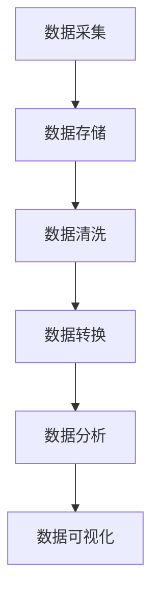
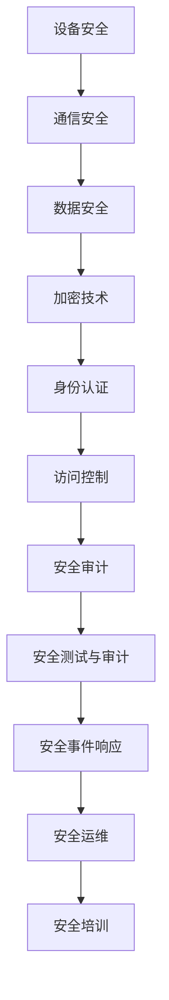

                 

# 《京东2024校招物联网开发工程师面试题详解》

## 概述

随着物联网（Internet of Things，IoT）技术的迅速发展，各行各业对物联网开发工程师的需求日益增加。京东作为中国领先的电子商务公司，对物联网技术的重视程度不言而喻。因此，京东的校招物联网开发工程师面试题成为了众多求职者关注的焦点。本文将详细解析京东2024校招物联网开发工程师面试题，帮助求职者更好地应对面试挑战。

## 关键词

- 京东校招
- 物联网开发工程师
- 面试题详解
- 技术剖析
- 开发实践
- 职业规划

## 摘要

本文旨在为准备参加京东2024校招物联网开发工程师面试的求职者提供一份详尽的面试题解析。通过梳理物联网基础、物联网架构、物联网开发实践、物联网安全防护、物联网项目案例以及物联网未来发展等关键内容，本文不仅分析了面试题的核心概念和原理，还提供了实际项目案例和代码解读。希望本文能帮助求职者提升面试技能，顺利通过京东的校招面试。

## 目录大纲

### 第一部分：物联网基础

#### 第1章：物联网概述

- **1.1 物联网的定义与核心概念**
  - **物联网的定义**
  - **物联网的关键概念**

- **1.2 物联网的关键技术**
  - **传感器技术**
  - **通信技术**
  - **数据处理与分析技术**

- **1.3 物联网应用场景**
  - **智能家居**
  - **智能交通**
  - **智能工厂**

- **1.4 物联网发展现状与趋势**
  - **物联网的发展历程**
  - **物联网的挑战与机遇**

#### 第2章：物联网架构

- **2.1 物联网体系结构**
  - **感知层**
  - **网络层**
  - **平台层**
  - **应用层**

- **2.2 物联网通信协议**
  - **ZigBee**
  - **Z-Wave**
  - **BLE**
  - **Wi-Fi**

- **2.3 物联网安全**
  - **物联网安全威胁**
  - **物联网安全措施**

- **2.4 物联网平台架构**
  - **平台功能模块**
  - **平台架构设计**

### 第二部分：物联网开发实践

#### 第3章：物联网硬件设备

- **3.1 物联网硬件设备类型**
  - **传感器**
  - **执行器**
  - **网关**

- **3.2 常用物联网硬件设备介绍**
  - **Arduino**
  - **Raspberry Pi**
  - **ESP8266/ESP32**

- **3.3 硬件设备开发实践**
  - **硬件设备选择与配置**
  - **硬件设备驱动开发**

#### 第4章：物联网软件平台

- **4.1 物联网软件平台概述**
  - **软件平台功能**
  - **软件平台类型**

- **4.2 常用物联网软件平台介绍**
  - **MQTT**
  - **CoAP**
  - **HTTP**

- **4.3 物联网软件平台开发实践**
  - **平台搭建与配置**
  - **数据收集与处理**

#### 第5章：物联网数据存储与处理

- **5.1 数据存储技术**
  - **关系型数据库**
  - **非关系型数据库**
  - **时序数据库**

- **5.2 数据处理与分析技术**
  - **数据清洗**
  - **数据分析**
  - **数据可视化**

- **5.3 物联网数据处理实践**
  - **数据处理流程设计**
  - **数据处理工具介绍**

#### 第6章：物联网安全防护

- **6.1 物联网安全挑战**
  - **设备安全**
  - **通信安全**
  - **数据安全**

- **6.2 物联网安全防护措施**
  - **加密技术**
  - **身份认证**
  - **访问控制**

- **6.3 物联网安全实战**
  - **安全测试与审计**
  - **安全事件响应**

#### 第7章：物联网项目案例

- **7.1 案例概述**
  - **项目背景**
  - **项目目标**

- **7.2 项目实施过程**
  - **硬件设备选型与搭建**
  - **软件平台搭建与配置**
  - **数据采集与处理**

- **7.3 项目成果与反思**
  - **项目效果评估**
  - **项目经验总结**

### 第三部分：物联网未来发展

#### 第8章：物联网行业趋势

- **8.1 物联网行业发展趋势**
  - **智能城市**
  - **智能农业**
  - **智能制造**

- **8.2 新兴技术对物联网的影响**
  - **5G**
  - **边缘计算**
  - **人工智能**

#### 第9章：物联网职业规划

- **9.1 物联网行业就业前景**
  - **岗位需求分析**
  - **职业发展路径**

- **9.2 物联网技能提升路径**
  - **技术技能提升**
  - **软技能提升**

- **9.3 物联网创业机会**
  - **创业方向选择**
  - **创业资源获取**

---

### 第一部分：物联网基础

#### 第1章：物联网概述

物联网作为当前信息技术领域的一个热点，其核心在于将各种设备通过网络连接起来，实现数据的交换和信息的共享。在这一章节中，我们将详细探讨物联网的定义与核心概念。

### 1.1 物联网的定义与核心概念

**物联网的定义：**

物联网是指通过互联网将各种设备连接起来，实现设备间的信息交换和通信，进而实现智能化的网络系统。简单来说，物联网就是将物理世界中的各种物体连接到互联网上，使其能够相互通信和协作。

**物联网的关键概念：**

1. **连接（Connection）：** 物联网的核心在于连接，通过各种通信技术实现设备的互联互通。
2. **感知（Sensing）：** 通过传感器收集物理世界中的各种数据。
3. **通信（Communication）：** 设备之间的数据交换和通信，是物联网实现智能化的基础。
4. **计算（Computation）：** 对收集到的数据进行处理和分析，提供智能化的服务。
5. **智能（Intelligence）：** 通过算法和模型对数据进行智能化的处理，实现自动化的决策和控制。

**物联网的关键技术：**

1. **传感器技术：** 物联网的感知层依赖于传感器，它们能够采集温度、湿度、压力、光照等各种环境数据。
2. **通信技术：** 物联网设备之间的通信依赖于各种通信协议，如Wi-Fi、蓝牙、ZigBee等。
3. **数据处理与分析技术：** 对采集到的海量数据进行处理和分析，提取有价值的信息，是物联网的核心技术之一。

**物联网应用场景：**

1. **智能家居：** 通过物联网技术，实现家居设备的智能化控制，提高生活质量。
2. **智能交通：** 利用物联网技术实现交通信息的实时监控和管理，提高交通效率。
3. **智能工厂：** 通过物联网技术实现生产设备的自动化和智能化管理，提高生产效率。

**物联网发展现状与趋势：**

物联网技术的发展经历了从简单设备互联到复杂系统集成的过程。当前，物联网技术已经广泛应用于各个领域，如智能家居、智能城市、智能医疗等。未来，随着5G、边缘计算、人工智能等新兴技术的应用，物联网将实现更广泛的应用场景和更高效的运行效率。

### 1.2 物联网的关键技术

**传感器技术：** 

传感器技术是物联网感知层的核心技术，通过将物理世界中的各种信号转换为电信号，实现数据的采集。常见的传感器包括温度传感器、湿度传感器、光照传感器、压力传感器等。传感器技术的发展目标是提高精度、降低成本、增强可靠性。

**通信技术：** 

通信技术是物联网网络层的核心技术，实现设备之间的数据传输和通信。常见的通信技术有Wi-Fi、蓝牙、ZigBee、LoRa等。随着5G技术的普及，物联网的通信速度和带宽将得到显著提升，为物联网的广泛应用提供支持。

**数据处理与分析技术：** 

数据处理与分析技术是物联网平台层的核心技术，通过对采集到的数据进行处理和分析，提取有价值的信息。常用的数据处理技术包括数据清洗、数据挖掘、机器学习等。数据处理与分析技术使得物联网能够实现智能化和自动化的决策和控制。

### 1.3 物联网应用场景

**智能家居：** 

智能家居是物联网技术应用最为广泛的场景之一，通过将各种家电设备连接到互联网上，实现远程控制和自动化操作。例如，智能门锁、智能照明、智能空调等设备，用户可以通过手机APP或语音助手实现对家居设备的控制。

**智能交通：** 

智能交通利用物联网技术实现交通信息的实时监控和管理，提高交通效率。例如，通过传感器采集道路上的车流量、速度等数据，利用大数据分析和人工智能算法，实现对交通情况的预测和优化，减少交通拥堵。

**智能工厂：** 

智能工厂通过物联网技术实现生产设备的自动化和智能化管理，提高生产效率。例如，通过传感器实时监控生产设备的运行状态，利用大数据分析和预测维护需求，实现预防性维护，减少设备故障和停机时间。

### 1.4 物联网发展现状与趋势

**物联网的发展历程：**

物联网的发展可以分为以下几个阶段：

1. **设备互联阶段：** 通过各种通信技术实现设备的互联互通。
2. **系统集成阶段：** 将物联网技术应用于各个行业，实现系统的集成和优化。
3. **智能化阶段：** 通过数据处理和分析技术，实现物联网的智能化和自动化。

**物联网的挑战与机遇：**

物联网在发展过程中面临着一些挑战，如数据安全、通信稳定性、系统集成等。同时，物联网也带来了巨大的机遇，如新兴行业的发展、产业升级等。

### 1.5 小结

本章对物联网的定义、核心概念、关键技术、应用场景以及发展现状与趋势进行了详细阐述。通过对物联网的深入了解，读者可以更好地理解物联网的基本原理和应用场景，为后续章节的学习打下基础。

## 第2章：物联网架构

### 2.1 物联网体系结构

物联网体系结构通常分为四个层次：感知层、网络层、平台层和应用层。每个层次都有其特定的功能和任务，共同构建了一个完整的物联网系统。

#### 感知层

感知层是物联网体系结构的基础，主要负责数据采集。这一层通过各种传感器和设备（如温度传感器、湿度传感器、摄像头、GPS等）收集环境数据，并将数据转化为数字信号。感知层的关键技术包括传感器技术、数据采集技术和边缘计算。

**传感器技术**：传感器技术用于检测和测量物理世界中的各种现象，如温度、湿度、光照、声音、运动等。这些传感器能够将物理信号转换为电信号，以便进行进一步的数字化处理。

**数据采集技术**：数据采集技术负责将传感器采集到的信号转化为数字数据，并将其传输到网络层。数据采集技术包括无线传输技术和有线传输技术，如Wi-Fi、蓝牙、ZigBee、以太网等。

**边缘计算**：边缘计算是一种分布式计算架构，它将数据处理和分析的任务从云端转移到网络边缘，从而减少延迟、降低带宽需求并提高数据处理效率。边缘计算在物联网中具有重要的地位，因为它能够实时处理大量数据，并为设备提供快速响应。

#### 网络层

网络层负责数据的传输和通信，是物联网体系结构的核心。网络层通过各种通信协议和数据传输技术，将感知层采集到的数据传输到平台层。网络层的关键技术包括通信技术、网络协议和网络安全。

**通信技术**：通信技术包括无线通信和有线通信。无线通信技术如Wi-Fi、蓝牙、ZigBee、LoRa等，用于短距离和远程通信。有线通信技术如以太网、光纤通信等，用于高带宽、长距离的通信。

**网络协议**：网络协议是数据传输的规则和标准，确保数据在网络中的正确传输。常见的网络协议包括TCP/IP、HTTP、MQTT、CoAP等。

**网络安全**：网络安全是物联网网络层的核心问题。由于物联网设备的数量庞大，且大多数设备具有有限的计算资源和存储能力，因此网络安全问题尤为重要。网络安全技术包括加密技术、认证技术、访问控制、入侵检测等。

#### 平台层

平台层是物联网体系结构的中枢，负责数据处理、存储和管理。平台层将来自网络层的数据进行处理、分析和存储，并提供各种服务，如数据可视化、数据分析、机器学习等。平台层的关键技术包括数据处理技术、存储技术和平台架构。

**数据处理技术**：数据处理技术包括数据清洗、数据集成、数据转换、数据挖掘等。数据处理技术用于从原始数据中提取有价值的信息，并为应用层提供支持。

**存储技术**：存储技术用于存储和处理大量的物联网数据。常见的存储技术包括关系型数据库、非关系型数据库、时序数据库等。

**平台架构**：平台架构是指物联网平台的设计和实现结构。常见的平台架构包括集中式架构、分布式架构、云计算架构等。平台架构的选择取决于物联网应用的需求和规模。

#### 应用层

应用层是物联网体系结构的最外层，负责将物联网数据和服务应用于实际场景中。应用层包括各种物联网应用，如智能家居、智能交通、智能医疗、智能制造等。应用层的关键技术包括应用开发、用户体验和系统集成。

**应用开发**：应用开发是指为特定应用场景设计、开发和实现物联网应用。应用开发技术包括前端技术、后端技术、移动应用开发等。

**用户体验**：用户体验是指用户在使用物联网应用时的感受和体验。用户体验设计旨在提高用户满意度，使物联网应用更易于使用和操作。

**系统集成**：系统集成是指将物联网硬件、软件、平台和应用集成到一个统一的系统中。系统集成技术包括硬件集成、软件集成、数据集成等。

### 2.2 物联网通信协议

物联网通信协议是网络层的重要组成部分，用于定义设备之间如何传输数据。以下是一些常用的物联网通信协议：

**ZigBee**：ZigBee是一种低功耗、短距离的无线通信协议，常用于智能家居和工业自动化领域。ZigBee具有高可靠性和安全性，支持多个设备同时通信。

**Z-Wave**：Z-Wave是一种无线通信协议，用于智能家居设备之间的通信。Z-Wave具有低成本、低功耗和高可靠性的特点，适用于各种智能家居场景。

**BLE（蓝牙低功耗）**：蓝牙低功耗（BLE）是一种短距离无线通信技术，适用于物联网设备之间的数据传输。BLE具有低功耗、低成本和高数据传输速率的特点。

**Wi-Fi**：Wi-Fi是一种广泛使用的无线通信技术，具有高带宽和长距离通信能力。Wi-Fi常用于连接智能家居设备、智能交通设备和工业自动化设备。

### 2.3 物联网安全

物联网安全是物联网体系结构中不可忽视的一部分，涉及到设备安全、通信安全和数据安全。

**设备安全**：设备安全是指保护物联网设备免受恶意攻击和未经授权的访问。设备安全措施包括加密、认证和访问控制等。

**通信安全**：通信安全是指保护物联网设备之间的通信数据免受窃听、篡改和伪造。通信安全措施包括加密、认证和完整性校验等。

**数据安全**：数据安全是指保护物联网数据在传输、存储和处理过程中的安全性。数据安全措施包括加密、访问控制和数据备份等。

### 2.4 物联网平台架构

物联网平台架构是指物联网平台的组成部分及其相互关系。一个典型的物联网平台架构包括以下几个方面：

**平台功能模块**：物联网平台功能模块包括数据采集、数据处理、数据存储、数据分析和数据可视化等。

**平台架构设计**：物联网平台架构设计涉及平台组件的选择、模块的划分和系统的集成。平台架构设计需要考虑系统的可扩展性、可靠性和安全性等因素。

### 2.5 小结

本章对物联网体系结构、通信协议、安全问题和平台架构进行了详细阐述。通过对物联网体系结构的了解，读者可以更好地理解物联网系统的构建方法和应用场景。了解物联网通信协议和安全性，有助于设计出更加安全可靠的物联网系统。了解物联网平台架构，有助于开发出高效、可扩展的物联网平台。

## 第3章：物联网硬件设备

物联网硬件设备是物联网系统的重要组成部分，它们负责数据采集、传输和处理。在这一章节中，我们将详细介绍物联网硬件设备的类型、常用设备和开发实践。

### 3.1 物联网硬件设备类型

物联网硬件设备主要可以分为以下几类：

**传感器**：传感器是物联网硬件设备的核心，用于感知物理世界中的各种现象，并将这些现象转换为电信号。常见的传感器包括温度传感器、湿度传感器、光照传感器、声音传感器、运动传感器等。

**执行器**：执行器是物联网硬件设备的输出部分，用于执行特定的动作或操作。常见的执行器包括电机、继电器、开关、阀门等。

**网关**：网关是物联网硬件设备中的关键设备，用于连接不同的通信网络，实现数据的传输和转换。常见的网关包括Wi-Fi网关、蓝牙网关、ZigBee网关、LoRa网关等。

### 3.2 常用物联网硬件设备介绍

**Arduino**：Arduino是一种开源的电子原型平台，广泛应用于物联网项目中。Arduino具有丰富的传感器接口和易于使用的编程环境，适合初学者和专业人士。

**Raspberry Pi**：树莓派（Raspberry Pi）是一种小型计算机，具有高性能和低功耗的特点。树莓派可以运行Linux操作系统，支持各种物联网开发库和工具。

**ESP8266/ESP32**：ESP8266和ESP32是两款流行的物联网模块，具有低功耗、高性能和丰富的通信接口。它们支持Wi-Fi和蓝牙通信，适用于智能家居、智能穿戴等物联网项目。

### 3.3 硬件设备开发实践

**硬件设备选择与配置**

在进行物联网硬件设备开发时，首先需要根据项目需求选择合适的硬件设备。以下是一些选择硬件设备的考虑因素：

- **设备功能**：根据项目需求，选择具有所需功能的传感器、执行器和网关。
- **通信协议**：考虑设备的通信协议，确保设备之间的兼容性和通信稳定性。
- **功耗与成本**：考虑设备的功耗和成本，选择适合项目预算的硬件设备。

**硬件设备驱动开发**

在完成硬件设备选择后，需要开发相应的硬件设备驱动，以便在软件中控制硬件设备。以下是一个简单的硬件设备驱动开发流程：

1. **硬件设备连接**：将硬件设备连接到开发板，确保设备正常工作。
2. **硬件设备调试**：通过编程语言（如C/C++）编写调试程序，测试硬件设备的功能和性能。
3. **硬件设备驱动开发**：根据硬件设备的特点，编写相应的驱动程序，实现对硬件设备的控制和数据采集。

以下是一个简单的硬件设备驱动的伪代码示例：

```c
// 硬件设备初始化
void hardware_init() {
  // 初始化传感器
  sensor_init();
  // 初始化执行器
  actuator_init();
  // 初始化网关
  gateway_init();
}

// 读取传感器数据
void read_sensor_data() {
  // 读取温度传感器数据
  float temperature = sensor_read_temperature();
  // 读取湿度传感器数据
  float humidity = sensor_read_humidity();
  // 读取光照传感器数据
  float light = sensor_read_light();
}

// 控制执行器
void control_actuator(float value) {
  // 根据输入值控制电机
  motor_control(value);
}
```

**硬件设备开发工具和平台**

在进行硬件设备开发时，常用的工具和平台包括：

- **开发板**：如Arduino、Raspberry Pi等。
- **编程语言**：如C/C++、Python等。
- **集成开发环境（IDE）**：如Arduino IDE、Eclipse、Visual Studio等。
- **硬件仿真工具**：如硬件仿真器、逻辑分析仪等。

**硬件设备开发实践案例**

以下是一个简单的物联网硬件设备开发实践案例：使用Arduino和温湿度传感器构建一个智能家居温度监测系统。

1. **硬件连接**：将温湿度传感器连接到Arduino的开发板上，确保传感器的引脚与Arduino的引脚正确连接。
2. **硬件调试**：通过编程语言编写调试程序，测试温湿度传感器的数据采集功能，确保传感器工作正常。
3. **硬件驱动开发**：编写温湿度传感器的驱动程序，实现对传感器数据的读取和控制。
4. **软件开发**：使用Python编写一个简单的监控程序，通过串口通信读取传感器数据，并在屏幕上显示温度和湿度。
5. **系统集成**：将硬件设备和软件系统集成到一个物联网平台上，如MQTT服务器，实现远程监控和控制。

通过这个案例，我们可以了解到物联网硬件设备开发的基本流程和技巧。在实际项目中，可以根据具体需求，选择合适的硬件设备和开发工具，实现各种物联网应用。

### 3.4 小结

本章详细介绍了物联网硬件设备的类型、常用设备和开发实践。通过对物联网硬件设备的了解，读者可以更好地选择合适的硬件设备，进行物联网项目的开发和实现。了解硬件设备驱动开发，有助于实现硬件设备和软件系统的无缝集成，提高物联网系统的可靠性和性能。通过实际案例的学习，读者可以掌握物联网硬件设备开发的基本技能，为未来的物联网项目做好准备。

## 第4章：物联网软件平台

物联网软件平台是物联网系统的核心组成部分，它提供了数据处理、存储、分析和可视化等功能，使得物联网系统能够高效地运行。在这一章节中，我们将介绍物联网软件平台的概述、常用软件平台及其开发实践。

### 4.1 物联网软件平台概述

物联网软件平台是一个集成了多种功能模块的软件系统，它负责处理来自物联网设备的海量数据，并对这些数据进行存储、分析和可视化。物联网软件平台的主要功能包括：

- **数据采集与传输**：从物联网设备中收集数据，并将数据传输到平台进行进一步处理。
- **数据存储与管理**：存储和处理大量的物联网数据，提供高效的数据查询和管理功能。
- **数据处理与分析**：对采集到的数据进行清洗、转换、分析，提取有价值的信息。
- **数据可视化**：将数据处理结果以图表、报表等形式呈现，便于用户理解和分析。
- **设备管理**：提供设备注册、配置、监控和诊断等功能，确保物联网设备的正常运行。

### 4.2 常用物联网软件平台介绍

在物联网领域，有多种软件平台可供选择，以下是一些常用的物联网软件平台：

**MQTT**：MQTT（Message Queuing Telemetry Transport）是一种轻量级的消息传输协议，广泛用于物联网应用。MQTT协议具有低带宽占用、高可靠性和跨平台性等优点，适合在资源受限的设备上使用。MQTT平台通常包括消息代理（Message Broker）和客户端（Client），其中消息代理负责接收、存储和转发消息，客户端负责发送和接收消息。

**CoAP**：CoAP（Constrained Application Protocol）是一种专为物联网设计的应用层协议，适用于资源受限的设备。CoAP具有简单、高效、可靠的特点，支持多种通信模式，如请求/响应模式和发布/订阅模式。CoAP平台通常包括服务器（CoAP Server）和客户端（CoAP Client），其中服务器负责处理客户端的请求，客户端负责发送请求和接收响应。

**HTTP**：HTTP（HyperText Transfer Protocol）是互联网上最常用的应用层协议，也广泛应用于物联网应用。HTTP协议具有简单、通用、易扩展的特点，适用于各种类型的数据传输。HTTP平台通常包括服务器（Web Server）和客户端（Web Client），其中服务器负责处理客户端的请求，客户端负责发送请求和接收响应。

### 4.3 物联网软件平台开发实践

**平台搭建与配置**

搭建物联网软件平台的第一步是选择合适的平台框架和开发环境。以下是一个简单的物联网软件平台搭建与配置的步骤：

1. **选择平台框架**：根据项目需求，选择合适的物联网软件平台框架，如MQTT平台、CoAP平台或HTTP平台。
2. **安装开发环境**：安装平台框架所需的开发环境，如Java SDK、Python SDK等。
3. **搭建消息代理**：搭建消息代理服务器，配置消息代理的地址和端口。
4. **配置设备客户端**：配置设备客户端，设置设备的连接地址和通信协议。
5. **测试平台**：通过设备客户端发送和接收消息，测试平台的正常运行。

**数据采集与传输**

在搭建好物联网软件平台后，需要实现数据采集与传输的功能。以下是一个简单的数据采集与传输的步骤：

1. **设备数据采集**：使用传感器或执行器采集设备数据，并将数据转换为适合传输的格式。
2. **数据传输**：使用通信协议（如MQTT、CoAP、HTTP）将数据发送到消息代理服务器。
3. **数据存储**：将接收到的数据存储到数据库或文件系统中，以便进一步处理和分析。

**数据处理与分析**

数据处理与分析是物联网软件平台的核心功能之一。以下是一个简单的数据处理与分析的步骤：

1. **数据清洗**：清洗和预处理采集到的数据，去除重复、错误或不完整的数据。
2. **数据转换**：将数据转换为统一的格式，便于后续分析和处理。
3. **数据存储**：将清洗和转换后的数据存储到数据库或文件系统中。
4. **数据分析**：使用数据分析和机器学习技术，对存储的数据进行分析和挖掘，提取有价值的信息。
5. **数据可视化**：将分析结果以图表、报表等形式呈现，便于用户理解和决策。

**数据可视化**

数据可视化是将数据处理结果以直观、易理解的方式呈现给用户的重要手段。以下是一个简单的数据可视化的步骤：

1. **选择可视化工具**：根据项目需求，选择合适的可视化工具，如D3.js、ECharts、Tableau等。
2. **设计可视化界面**：设计数据可视化界面，确定图表类型、布局和交互方式。
3. **集成可视化组件**：将可视化组件集成到物联网软件平台中，实现实时数据展示和交互。
4. **测试和优化**：测试数据可视化的效果，根据用户反馈进行优化和调整。

**案例实践**

以下是一个简单的物联网软件平台开发实践案例：使用MQTT平台和温湿度传感器构建一个智能家居环境监测系统。

1. **硬件连接**：将温湿度传感器连接到开发板，确保传感器的引脚与开发板的引脚正确连接。
2. **硬件调试**：通过编程语言编写调试程序，测试温湿度传感器的数据采集功能，确保传感器工作正常。
3. **搭建MQTT平台**：搭建MQTT平台，配置MQTT服务器的地址和端口。
4. **设备客户端配置**：配置设备客户端，设置设备的连接地址和通信协议。
5. **数据采集与传输**：通过设备客户端将温湿度传感器的数据发送到MQTT平台。
6. **数据处理与分析**：在MQTT平台上实现数据存储和数据分析功能，将温湿度数据存储到数据库中，并使用数据分析和机器学习技术提取环境变化趋势。
7. **数据可视化**：使用数据可视化工具，将环境监测数据以图表形式展示，提供实时环境信息。

通过这个案例，我们可以了解到物联网软件平台搭建与配置的基本步骤和技巧。在实际项目中，可以根据具体需求，选择合适的软件平台和开发工具，实现各种物联网应用。

### 4.4 小结

本章详细介绍了物联网软件平台的概述、常用软件平台及其开发实践。通过对物联网软件平台的了解，读者可以更好地选择合适的软件平台，进行物联网项目的开发和实现。了解物联网软件平台的基本功能和使用方法，有助于构建高效、可靠的物联网系统。通过实际案例的学习，读者可以掌握物联网软件平台开发的基本技能，为未来的物联网项目做好准备。

## 第5章：物联网数据存储与处理

物联网数据存储与处理是物联网系统的核心组成部分，它负责收集、存储、处理和分析物联网设备产生的海量数据。在这一章节中，我们将详细探讨物联网数据存储与处理的技术、数据处理流程以及数据处理工具。

### 5.1 数据存储技术

物联网设备产生的数据类型多样，包括结构化数据、半结构化数据和非结构化数据。为了高效地存储和管理这些数据，物联网系统需要使用多种数据存储技术。

**关系型数据库**：关系型数据库（如MySQL、PostgreSQL等）是一种传统的数据存储技术，它采用表格形式存储数据，具有强大的查询能力和数据一致性保证。关系型数据库适用于存储结构化数据，如传感器数据、设备信息等。

**非关系型数据库**：非关系型数据库（如MongoDB、Cassandra等）是一种新型数据存储技术，它采用分布式存储架构，能够灵活地存储和管理各种类型的数据。非关系型数据库适用于存储半结构化数据和非结构化数据，如日志数据、地理位置数据等。

**时序数据库**：时序数据库（如InfluxDB、TimescaleDB等）是一种专门用于存储时间序列数据的数据存储技术。时序数据库具有高效的时间查询能力和数据压缩功能，适用于存储物联网设备产生的实时数据，如温度、湿度、流量等。

### 5.2 数据处理与分析技术

数据处理与分析技术是物联网系统的关键组成部分，它负责从海量数据中提取有价值的信息。以下是一些常用的数据处理与分析技术：

**数据清洗**：数据清洗是数据处理的第一步，它用于去除数据中的错误、重复和不完整的数据，保证数据质量。数据清洗技术包括数据验证、数据去重、缺失值填充等。

**数据集成**：数据集成是将来自不同来源的数据进行整合和统一存储的过程。数据集成技术包括数据抽取、数据转换和数据加载等。

**数据分析**：数据分析是对数据进行统计、分析和挖掘，提取有价值的信息。数据分析技术包括统计分析、数据挖掘、机器学习等。

**数据可视化**：数据可视化是将数据处理结果以图形、图表等形式展示，便于用户理解和分析。数据可视化技术包括图表生成、交互式分析等。

### 5.3 物联网数据处理实践

在物联网数据处理实践中，我们需要根据实际项目需求，设计合理的数据处理流程并选择合适的工具。以下是一个简单的物联网数据处理实践案例：使用传感器收集环境数据，并对其进行存储、处理和可视化。

**数据采集**：使用温湿度传感器和光照传感器收集环境数据，将数据通过Wi-Fi或蓝牙传输到物联网平台。

**数据存储**：将采集到的数据存储到时序数据库中，时序数据库能够高效地处理和存储实时数据，并提供快速的时间查询功能。

**数据处理**：对存储在时序数据库中的数据进行清洗、转换和分析。数据清洗包括去除错误数据、去重和填充缺失值。数据转换包括将数据格式转换为统一的JSON格式。数据分析包括使用机器学习算法提取环境变化趋势，如温度变化率、湿度变化率等。

**数据可视化**：使用数据可视化工具（如ECharts、D3.js）将数据处理结果以图表形式展示，提供实时环境信息。

以下是一个简单的数据处理流程的Mermaid流程图：



### 5.4 数据处理工具介绍

在物联网数据处理实践中，常用的工具包括：

**时序数据库**：如InfluxDB、TimescaleDB、OpenTSDB等，用于存储和管理实时数据。

**数据处理框架**：如Apache Kafka、Apache Flink、Apache Storm等，用于大规模数据流处理。

**数据分析工具**：如Python的Pandas、NumPy、Scikit-learn等，用于数据处理和分析。

**数据可视化工具**：如ECharts、D3.js、Tableau等，用于数据可视化和交互式分析。

**数据集成工具**：如Apache NiFi、Apache Kafka Connect等，用于数据抽取、转换和加载。

### 5.5 小结

本章详细介绍了物联网数据存储与处理的技术、数据处理流程和数据处理工具。通过对物联网数据存储与处理的了解，读者可以更好地设计数据存储方案，选择合适的数据处理工具，实现物联网系统的数据管理和分析。了解数据处理流程和工具，有助于构建高效、可靠的物联网系统，为物联网应用提供有力支持。

## 第6章：物联网安全防护

物联网安全是物联网系统构建过程中不可忽视的重要环节。由于物联网设备的数量庞大且分布广泛，设备安全、通信安全、数据安全等安全问题尤为重要。在这一章节中，我们将详细探讨物联网安全挑战、防护措施和实战技巧。

### 6.1 物联网安全挑战

物联网安全挑战主要包括以下几个方面：

**设备安全**：物联网设备通常具有有限的计算资源和存储能力，容易成为恶意攻击的目标。设备安全威胁包括设备被黑客入侵、恶意软件感染、设备隐私泄露等。

**通信安全**：物联网设备之间的通信通常通过无线网络进行，容易受到窃听、篡改和伪造等攻击。通信安全威胁包括数据窃取、数据篡改、拒绝服务攻击等。

**数据安全**：物联网数据包括设备状态、用户隐私、业务数据等，数据安全威胁包括数据泄露、数据篡改、数据丢失等。

### 6.2 物联网安全防护措施

为了应对物联网安全挑战，我们需要采取一系列防护措施：

**加密技术**：加密技术是保护数据安全的重要手段，通过加密算法对数据进行加密，确保数据在传输和存储过程中的安全性。常用的加密算法包括对称加密算法（如AES）和非对称加密算法（如RSA）。

**身份认证**：身份认证是确保物联网设备合法性的重要措施，通过验证设备身份，防止未经授权的设备访问系统。常见的身份认证方法包括密码认证、数字证书、生物识别等。

**访问控制**：访问控制是限制用户对系统资源的访问权限，确保系统安全的重要手段。通过访问控制策略，可以限制用户对设备、数据、资源的访问权限，防止恶意访问和攻击。

**安全审计**：安全审计是记录和监控系统安全事件的过程，通过对系统日志进行分析，发现和应对潜在的安全威胁。安全审计包括日志收集、日志分析、事件响应等。

**安全测试与审计**：安全测试与审计是发现和修复系统安全漏洞的重要手段。通过渗透测试、漏洞扫描、安全审计等手段，可以发现和修复系统中的安全漏洞，提高系统的安全性。

### 6.3 物联网安全实战

物联网安全实战主要包括以下几个方面：

**安全测试**：通过渗透测试、漏洞扫描等手段，发现和验证系统中的安全漏洞，评估系统的安全性。

**安全事件响应**：当系统发生安全事件时，需要及时响应和处理，包括事件检测、事件分析、事件处置等。

**安全运维**：通过安全运维措施，确保系统在运行过程中的安全性，包括设备管理、访问控制、安全监控等。

**安全培训**：为物联网系统开发、运维人员提供安全培训，提高他们的安全意识和技能。

以下是一个简单的物联网安全防护框架的Mermaid流程图：



### 6.4 小结

本章详细介绍了物联网安全挑战、防护措施和实战技巧。通过对物联网安全的了解，读者可以更好地设计安全防护方案，提高物联网系统的安全性。了解物联网安全实战方法，有助于应对各种安全威胁，确保物联网系统的稳定运行。

## 第7章：物联网项目案例

### 7.1 案例概述

在本章中，我们将通过一个实际的物联网项目案例，详细探讨项目背景、目标、实施过程以及项目成果与反思。该案例是一个智能家居环境监测系统，旨在通过物联网技术实时监测家庭环境中的温度、湿度、光照等参数，为用户提供智能化的环境控制方案。

### 7.2 项目实施过程

**硬件设备选型与搭建**

在项目实施过程中，首先需要选择合适的硬件设备。以下是本项目选用的主要硬件设备：

- **传感器**：温湿度传感器、光照传感器
- **网关**：ESP8266 Wi-Fi模块
- **开发板**：Arduino Uno
- **终端设备**：智能手机、平板电脑

**硬件设备搭建**

1. **传感器连接**：将温湿度传感器和光照传感器连接到Arduino Uno开发板的GPIO接口。
2. **网关连接**：将ESP8266 Wi-Fi模块连接到Arduino Uno开发板，并配置Wi-Fi参数。
3. **硬件调试**：通过编程语言（如C/C++）编写调试程序，测试传感器和网关的功能，确保硬件设备正常工作。

**软件平台搭建与配置**

在硬件设备搭建完成后，需要搭建软件平台以实现数据采集、传输、存储和处理等功能。以下是本项目选用的软件平台：

- **消息代理**：MQTT服务器
- **数据处理平台**：Node-RED
- **数据库**：MySQL

**软件平台搭建**

1. **MQTT服务器搭建**：在服务器上安装并配置MQTT服务器，如mosquitto。
2. **Node-RED平台搭建**：在服务器上安装并配置Node-RED平台，用于数据处理和可视化。
3. **数据库搭建**：在服务器上安装并配置MySQL数据库，用于存储环境数据。

**数据采集与传输**

通过编写传感器驱动程序和网关通信程序，实现数据采集与传输。以下是一个简单的数据采集与传输流程：

1. **数据采集**：传感器采集环境数据，并将数据通过串口传输到Arduino开发板。
2. **数据转换**：将采集到的数据转换为适合传输的格式（如JSON格式）。
3. **数据传输**：通过Wi-Fi模块将数据发送到MQTT服务器。

**数据处理与存储**

在MQTT服务器上安装并配置数据存储模块，如Node-RED的MySQL插件。以下是一个简单的数据处理与存储流程：

1. **数据处理**：Node-RED平台接收到MQTT服务器发送的数据后，对数据进行处理，如去重、过滤等。
2. **数据存储**：将处理后的数据存储到MySQL数据库中，以便后续查询和分析。

**数据可视化与控制**

通过编写前端网页，实现数据可视化与控制功能。以下是一个简单的数据可视化与控制流程：

1. **数据可视化**：使用图表库（如ECharts）将环境数据可视化，如折线图、柱状图等。
2. **用户交互**：提供用户交互界面，如按钮、滑块等，实现环境参数的控制。

### 7.3 项目成果与反思

**项目成果**

通过本项目的实施，成功实现了智能家居环境监测系统，主要成果包括：

- **实时监测**：能够实时监测家庭环境中的温度、湿度、光照等参数。
- **数据存储**：将监测数据存储到数据库中，便于后续查询和分析。
- **数据可视化**：通过图表将环境数据可视化，提供直观的数据展示。
- **远程控制**：用户可以通过智能手机或平板电脑远程控制环境参数，实现智能化的环境控制。

**项目反思**

在项目实施过程中，我们得到了以下反思：

- **硬件选型**：在选择硬件设备时，需要考虑设备的性能、功耗、成本等因素，确保设备能够满足项目需求。
- **软件平台**：在选择软件平台时，需要考虑平台的稳定性、扩展性、兼容性等因素，确保平台能够支持项目的需求。
- **数据安全**：在数据传输和存储过程中，需要采取加密、认证、访问控制等安全措施，确保数据的安全性。
- **系统调试**：在项目实施过程中，需要进行充分的系统调试，确保硬件设备和软件平台正常工作。

通过本项目的实施，我们不仅掌握了物联网项目的实施流程和技巧，还深入了解了物联网技术在实际应用中的挑战和解决方案。这为我们在未来进行物联网项目提供了宝贵的经验。

## 第三部分：物联网未来发展

### 第8章：物联网行业趋势

物联网技术的发展不断推动着各行各业的变革，未来物联网行业将呈现出以下几个主要趋势：

#### 8.1 智能城市

智能城市是物联网技术应用的一个重要方向，通过物联网技术实现城市基础设施的智能化管理，提高城市运行效率和服务水平。未来，智能城市将更加注重数据驱动和智能化决策，实现交通、能源、环境、公共安全等领域的全面智能化。

**发展趋势：**

1. **数据整合与分析**：通过物联网技术，实现各类数据的整合和分析，为城市管理者提供科学的决策依据。
2. **智能交通系统**：利用物联网技术优化交通信号、停车场管理、公共交通等，提高交通效率和减少拥堵。
3. **智能环境监测**：通过物联网设备实时监测环境质量，实现精准的环境管理和应急响应。

#### 8.2 智能农业

智能农业利用物联网技术实现农业生产过程的智能化管理，提高农业生产效率和质量。未来，智能农业将更加依赖物联网传感器、大数据分析和人工智能技术，实现精准农业、智能灌溉、智能种植等。

**发展趋势：**

1. **精准农业**：通过物联网传感器实时监测土壤、水分、气候等环境参数，优化农业生产方案。
2. **智能灌溉系统**：利用物联网技术实现自动化灌溉，提高水资源利用效率。
3. **智能种植**：通过物联网技术和人工智能算法，优化作物种植周期和生长环境，提高作物产量和质量。

#### 8.3 智能制造

智能制造是物联网技术在工业领域的应用，通过物联网技术实现生产过程的自动化和智能化。未来，智能制造将更加依赖物联网传感器、工业互联网平台和人工智能技术，实现生产线的智能调度、设备智能维护、产品质量智能监控等。

**发展趋势：**

1. **设备互联互通**：通过物联网技术实现生产设备之间的互联互通，提高生产效率和质量。
2. **智能调度系统**：利用物联网技术和大数据分析，实现生产线的智能调度和优化。
3. **设备智能维护**：通过物联网传感器实时监测设备运行状态，实现设备的智能预测性维护，降低设备故障率。

### 8.4 新兴技术对物联网的影响

未来，5G、边缘计算和人工智能等新兴技术将对物联网的发展产生重要影响。

**5G技术**：5G技术具有高速度、低延迟、大连接数等特点，将大大提升物联网设备的数据传输速度和可靠性，促进物联网应用的广泛普及。

**边缘计算**：边缘计算将数据处理和分析的任务从云端转移到网络边缘，实现实时数据处理和快速响应，降低网络延迟，提高数据处理效率。

**人工智能**：人工智能技术将提升物联网系统的智能化水平，通过机器学习、深度学习等技术，实现智能决策、智能控制、智能分析等功能。

### 8.5 小结

物联网行业未来发展趋势表现为智能城市的广泛应用、智能农业的逐步成熟、智能制造的深入发展，同时新兴技术如5G、边缘计算和人工智能将推动物联网技术的不断进步。这些趋势将极大地改变我们的生活和工作方式，为各行业带来新的机遇和挑战。

### 第9章：物联网职业规划

物联网行业的快速发展为求职者提供了广阔的职业发展空间。在这个章节中，我们将探讨物联网行业的就业前景、职业发展路径以及如何提升物联网技能和软技能，为有志于从事物联网领域的求职者提供参考。

#### 9.1 物联网行业就业前景

物联网技术广泛应用于智能家居、智能交通、智能医疗、智能工业、智能农业等领域，从而创造了大量就业机会。以下是物联网行业就业前景的几个关键点：

**岗位需求分析**：

1. **物联网开发工程师**：负责物联网设备的开发、系统集成和功能实现。
2. **物联网架构师**：负责物联网系统的架构设计、技术选型和系统优化。
3. **物联网数据工程师**：负责物联网数据存储、处理和分析，构建大数据平台。
4. **物联网安全工程师**：负责物联网系统的安全防护和风险管理。
5. **物联网解决方案顾问**：为客户提供物联网系统解决方案，协助客户实现物联网应用。

**职业发展路径**：

物联网行业的职业发展路径可以分为以下几个阶段：

1. **初级工程师**：负责物联网项目的具体开发工作，如硬件设备集成、软件模块开发等。
2. **中级工程师**：具备更全面的技术能力，能够独立负责项目，参与项目规划和决策。
3. **高级工程师**：具备丰富的项目经验和深厚的专业素养，能够担任项目经理或技术主管。
4. **架构师**：负责物联网系统的整体架构设计，具备跨领域的综合能力和创新思维。

#### 9.2 物联网技能提升路径

要成为一名合格的物联网工程师，需要掌握一系列关键技术。以下是一些提升物联网技能的途径：

**技术技能提升**：

1. **编程语言**：掌握C/C++、Python、Java等编程语言，熟悉物联网开发框架和库。
2. **传感器技术**：了解各种传感器的工作原理和应用场景，具备传感器驱动开发和调试能力。
3. **通信技术**：熟悉Wi-Fi、蓝牙、ZigBee、LoRa等通信协议，具备网络编程和通信调试经验。
4. **数据处理与分析**：掌握大数据处理框架（如Hadoop、Spark），熟悉数据挖掘和机器学习算法。
5. **平台开发**：了解物联网平台的设计和实现，熟悉MQTT、CoAP、HTTP等协议。

**软技能提升**：

除了技术技能外，物联网工程师还需要具备一定的软技能：

1. **团队协作**：能够与团队成员有效沟通，共同推进项目进度。
2. **问题解决**：具备快速定位和解决技术问题的能力，能够独立承担工作。
3. **项目管理**：掌握项目管理和团队协作工具，能够合理规划项目进度和资源。
4. **业务理解**：了解物联网在不同行业中的应用，能够结合业务需求设计解决方案。

#### 9.3 物联网创业机会

随着物联网技术的不断成熟和应用领域的扩大，物联网创业也充满了机遇。以下是一些物联网创业方向的建议：

**创业方向选择**：

1. **物联网解决方案提供商**：为不同行业客户提供定制化的物联网解决方案，如智能农业、智能工厂等。
2. **物联网设备制造商**：研发和生产具有创新性和高附加值的物联网设备，如智能传感器、网关等。
3. **物联网平台服务商**：提供高性能、高可靠性的物联网平台服务，如数据存储、处理、分析等。

**创业资源获取**：

1. **政府资金支持**：关注政府发布的创新创业政策和资金支持，申请相关项目资金。
2. **创投公司**：寻找合适的创投公司进行融资，获取资金和资源支持。
3. **行业合作**：与行业内其他企业、研究机构合作，共同开发新的物联网技术和应用。

#### 9.4 小结

物联网行业为求职者提供了广阔的职业发展空间和丰富的创业机会。通过不断提升技术技能和软技能，求职者可以在这个快速发展的行业中找到适合自己的职业发展路径。同时，把握物联网创业机会，也有助于在物联网领域实现个人价值和商业成功。

## 总结与展望

本文通过对京东2024校招物联网开发工程师面试题的详细解析，系统地介绍了物联网的基础知识、架构、开发实践、安全防护以及未来发展趋势。从物联网的定义和核心概念，到体系结构、通信协议、硬件设备、软件平台、数据存储与处理，再到安全防护和实际项目案例，我们一步步分析了物联网技术的各个方面。同时，我们也探讨了物联网行业的发展趋势和求职者在物联网领域中的职业规划。

物联网技术作为当代信息技术的重要方向，正在不断改变着我们的生活和工作方式。它不仅提升了各个行业的效率和质量，还为创新创业提供了广阔的舞台。通过本文的学习，我们希望能够帮助读者更好地理解物联网技术，掌握物联网开发的核心技能，为未来的物联网项目做好准备。

未来，物联网技术将继续发展，5G、边缘计算、人工智能等新兴技术的融合将为物联网带来更多的机遇和挑战。物联网技术将在智能城市、智能农业、智能制造等领域发挥更大的作用，为人类创造更加智能、便捷和高效的生活环境。让我们紧跟物联网技术的发展步伐，积极探索和实践，共同推动物联网技术的进步和创新。

