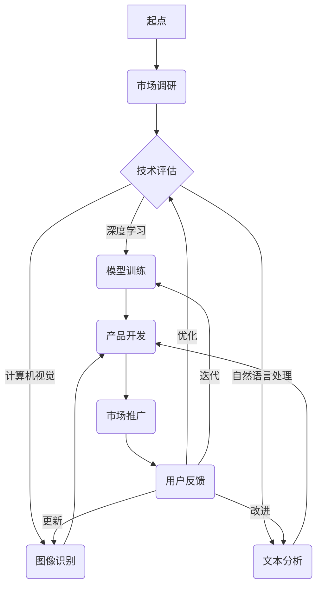

                 

# 人工智能创业：推广策略分析

> **关键词：** 人工智能、创业、推广策略、市场营销、团队建设、商业模式创新

> **摘要：** 本文将深入探讨人工智能创业的推广策略。通过详细分析市场研究、产品规划、市场营销、资金筹措和团队管理等方面，提供一套完整的人工智能创业推广策略框架，帮助创业者更好地把握市场机遇，实现人工智能创业的成功。

## 目录大纲

1. **人工智能与创业概述**
   1.1 人工智能的发展历程
   1.2 创业与人工智能的结合
   1.3 人工智能创业的机会与挑战

2. **人工智能的基础知识**
   2.1 人工智能的核心概念
   2.2 人工智能的主要类型
   2.3 人工智能的算法与模型

3. **人工智能创业策略分析**
   3.1 市场研究与定位
   3.2 产品与商业模式
   3.3 技术与研发
   3.4 市场营销策略
   3.5 资金筹措与财务管理
   3.6 团队管理与企业文化

4. **人工智能创业案例与实战**
   4.1 创业案例解析
   4.2 实战演练与创业指导

5. **人工智能创业的未来趋势**
   5.1 行业发展趋势分析
   5.2 未来创业机会与挑战

6. **附录**
   6.1 相关资源
   6.2 Mermaid 流程图示例
   6.3 人工智能算法伪代码示例
   6.4 数学公式与解释
   6.5 项目实战案例
   6.6 代码解读与分析

### 1. 人工智能与创业概述

#### 1.1 人工智能的发展历程

人工智能（AI）作为计算机科学的一个重要分支，其发展历程可以追溯到20世纪50年代。当时，科学家们首次提出了“人工智能”的概念，旨在使计算机具有人类智能。从最初的符号主义、知识表示，到后续的专家系统、机器学习，再到现在的深度学习和强化学习，人工智能经历了多次技术变革和理论创新。

**符号主义**阶段（1956-1974年）：以逻辑推理和知识表示为核心，通过符号操作实现人工智能。

**知识表示**阶段（1974-1980年）：专家系统的出现，通过编码领域专家知识，使计算机能够解决特定问题。

**机器学习**阶段（1980-2010年）：以统计学习理论为基础，机器学习逐渐成熟，成为人工智能的重要分支。

**深度学习**阶段（2010年至今）：以神经网络为核心，深度学习在图像识别、自然语言处理等领域取得了重大突破。

#### 1.2 创业与人工智能的结合

人工智能的快速发展为创业提供了前所未有的机遇。人工智能技术在医疗、金融、教育、物流等领域的广泛应用，不仅改变了传统行业的运营模式，也为创业者提供了丰富的创业方向。

- **医疗领域**：人工智能在疾病预测、诊断和个性化治疗等方面展现出巨大潜力。
- **金融领域**：智能投顾、自动化交易和风险评估等应用，使得金融行业更加高效和精准。
- **教育领域**：个性化学习、智能评测和自适应教学等应用，为教育行业带来创新。
- **物流领域**：智能仓储、无人配送和智能调度等技术，提高了物流行业的效率。

#### 1.3 人工智能创业的机会与挑战

人工智能创业虽然充满机遇，但也面临诸多挑战。

- **机遇**：
  - **技术创新**：人工智能技术的不断突破，为创业者提供了丰富的技术储备。
  - **市场潜力**：人工智能技术的广泛应用，带来了巨大的市场潜力。
  - **政策支持**：政府对人工智能的重视，为创业者提供了良好的政策环境。

- **挑战**：
  - **技术门槛**：人工智能技术的复杂性，使得创业者需要具备较高的技术能力。
  - **市场竞争**：人工智能领域的竞争激烈，创业者需要具备强大的市场竞争力。
  - **数据隐私**：人工智能技术的应用涉及大量个人数据，数据隐私保护成为重要挑战。

在接下来的章节中，我们将详细分析人工智能创业的推广策略，帮助创业者更好地应对挑战，抓住机遇，实现人工智能创业的成功。接下来，我们将探讨人工智能的基础知识，为后续的创业策略分析奠定基础。

### 2. 人工智能的基础知识

在探讨人工智能创业的推广策略之前，有必要先了解人工智能的基础知识。人工智能（AI）的核心概念、主要类型以及算法与模型，是理解人工智能创业的关键。

#### 2.1 人工智能的核心概念

人工智能是指通过计算机模拟人类智能行为的技术，旨在使计算机具备感知、学习、推理、决策和解决问题等能力。以下是人工智能的几个核心概念：

- **感知**：通过传感器获取外部信息，如视觉、听觉、触觉等。
- **学习**：从数据中提取模式和知识，以改善自身性能。
- **推理**：基于已有知识和信息进行逻辑推理，解决新问题。
- **决策**：根据目标和条件选择最佳行动方案。
- **解决问题**：在给定条件下找到解决问题的方案。

#### 2.2 人工智能的主要类型

人工智能可以分为以下几种类型：

- **弱人工智能（Narrow AI）**：专注于特定任务，无法泛化到其他任务。例如，语音识别、图像识别等。
- **强人工智能（General AI）**：具备广泛的学习能力和理解能力，能够应对各种复杂任务。目前尚未实现，仍处于理论研究阶段。
- **混合智能（Hybrid AI）**：结合多种人工智能技术，以实现更高效、更智能的应用。

#### 2.3 人工智能的算法与模型

人工智能的实现依赖于多种算法和模型。以下是几个常见的人工智能算法与模型：

- **神经网络（Neural Networks）**：模拟人脑神经元之间的连接，通过多层网络实现数据建模和预测。
- **决策树（Decision Trees）**：基于树形结构进行决策，通过多个条件判断来分类或回归。
- **支持向量机（Support Vector Machines, SVM）**：通过寻找最佳分隔超平面，实现分类和回归。
- **深度学习（Deep Learning）**：基于多层神经网络，通过反向传播算法进行训练，广泛应用于图像识别、自然语言处理等。
- **强化学习（Reinforcement Learning）**：通过试错和奖励机制，学习最优策略，以实现特定任务。

以上是人工智能的基础知识概述。在接下来的章节中，我们将深入探讨人工智能创业的推广策略，结合具体案例，提供实用的创业指导。接下来，我们将讨论人工智能创业中的市场研究与定位策略。

### 3. 市场研究与定位

在人工智能创业的过程中，市场研究与定位是至关重要的一环。通过深入的市场分析，创业者可以明确目标市场，制定有效的定位战略，从而在竞争激烈的市场中脱颖而出。

#### 3.1 市场研究方法

市场研究是了解市场需求、竞争状况和潜在客户的重要手段。以下是一些常用的市场研究方法：

- **问卷调查**：通过设计问卷，收集大量潜在客户的意见和需求。
- **深度访谈**：与行业专家、潜在客户进行深入交流，了解他们的看法和期望。
- **数据分析**：通过分析市场数据，如销售额、市场份额等，评估市场趋势和机会。
- **竞争分析**：研究竞争对手的产品、市场策略和客户群体，找出自身的竞争优势。

#### 3.2 定位战略

定位战略是确定企业在市场中的独特价值主张和目标客户的过程。以下是几种常见的定位战略：

- **差异化定位**：通过独特的产品特性或服务，与竞争对手区分开来，吸引特定客户群体。
- **集中定位**：专注于某个细分市场，提供针对性强的产品或服务，满足该市场的特定需求。
- **高端定位**：通过高品质、高价格的产品或服务，吸引追求高品质的消费者。
- **低端定位**：提供价格低廉的产品或服务，以吸引价格敏感的客户。

#### 3.3 目标客户分析

明确目标客户是制定市场策略的重要基础。以下是对目标客户进行分析的几个关键点：

- **人口统计信息**：包括年龄、性别、收入、教育背景等，帮助了解客户的基本特征。
- **行为特征**：包括购买习惯、使用习惯、消费偏好等，帮助了解客户的行为模式。
- **需求特征**：分析客户对产品或服务的具体需求，如功能、性能、价格等。
- **心理特征**：包括价值观、生活态度、兴趣等，帮助了解客户的内心需求。

通过市场研究和定位战略，创业者可以更准确地把握市场动态，明确目标客户，从而制定有效的市场营销策略。在下一章节中，我们将探讨人工智能创业的产品与商业模式。

### 4. 产品与商业模式

在人工智能创业中，产品规划和商业模式创新是确保企业成功的关键要素。通过明确产品规划和创新商业模式，创业者可以更好地满足市场需求，实现持续盈利。

#### 4.1 产品规划

产品规划是确定产品功能、性能、用户体验和目标市场的过程。以下是产品规划的几个关键步骤：

- **需求分析**：通过市场研究和用户访谈，了解目标市场的具体需求。
- **功能定义**：根据需求分析，明确产品应具备的功能和性能指标。
- **用户体验设计**：设计用户友好的界面和交互方式，提升用户满意度。
- **技术实现**：选择合适的技术方案，确保产品功能和性能的实现。
- **迭代与优化**：根据用户反馈，不断优化产品，提高市场竞争力。

#### 4.2 商业模式创新

商业模式创新是企业在市场中获得竞争优势的重要手段。以下是几种常见的商业模式创新方法：

- **平台模式**：通过构建平台，连接供需双方，实现交易和服务。
- **订阅模式**：通过提供订阅服务，实现持续收入。
- **免费增值模式**：提供免费产品或服务，通过增值服务实现盈利。
- **共享经济模式**：通过共享闲置资源，实现资源的高效利用。
- **跨界合作模式**：与其他行业的企业合作，实现跨领域的整合和创新。

#### 4.3 竞争分析

在人工智能创业中，竞争分析是了解市场竞争状况和制定有效市场策略的重要环节。以下是竞争分析的几个关键点：

- **竞争对手分析**：研究竞争对手的产品、市场策略和客户群体，找出竞争优势和不足。
- **市场份额分析**：评估竞争对手在市场中的份额和地位，了解市场竞争态势。
- **市场趋势分析**：分析市场发展趋势和变化，找出潜在的市场机会和挑战。
- **差异化策略**：通过差异化产品或服务，形成独特的竞争优势。

通过产品规划和商业模式创新，人工智能创业者可以更好地满足市场需求，实现企业的可持续发展。在下一章节中，我们将探讨人工智能创业中的技术与研发策略。

### 5. 技术与研发

在人工智能创业中，技术与研发是核心竞争力，也是成功的关键因素。创业者需要制定清晰的技术路线，搭建高效的研发团队，并有效管理技术风险。

#### 5.1 技术路线规划

技术路线规划是确保企业在人工智能领域保持竞争力的关键。以下是技术路线规划的关键步骤：

- **市场需求分析**：通过市场研究，了解客户需求和市场趋势，确定技术发展的方向。
- **技术评估**：评估现有技术和潜在技术的优势与劣势，选择适合的技术方案。
- **研发计划**：制定详细的研发计划，包括项目目标、时间表、资源分配等。
- **迭代与优化**：根据市场需求和技术进步，不断调整和优化技术路线。

#### 5.2 研发团队搭建

搭建一支高效的研发团队对于人工智能创业至关重要。以下是搭建研发团队的几个关键点：

- **团队架构**：明确团队的组织架构，包括技术团队、产品团队、市场团队等。
- **人才招聘**：吸引具备专业知识和经验的技术人才，确保团队的能力和素质。
- **培训和激励**：提供持续的培训和职业发展机会，激发团队成员的创新能力和工作热情。
- **团队协作**：建立良好的沟通和协作机制，促进团队成员之间的合作和知识共享。

#### 5.3 技术风险与管理

在人工智能创业中，技术风险是不可避免的。创业者需要识别和评估技术风险，并制定有效的管理策略。以下是技术风险管理的几个关键点：

- **风险评估**：评估技术风险的可能性和影响，确定风险等级。
- **风险控制**：制定风险控制措施，包括技术储备、风险管理计划和应急预案。
- **技术储备**：提前布局和储备关键技术，确保在面临技术风险时能够迅速应对。
- **持续监控**：建立技术风险监控机制，实时跟踪和评估技术风险状况。

通过清晰的技术路线规划、高效的研发团队搭建和有效的技术风险管理，人工智能创业者可以更好地把握技术发展的机遇，提高企业的核心竞争力。在下一章节中，我们将探讨人工智能创业的市场营销策略。

### 6. 市场营销策略

在人工智能创业中，市场营销策略是成功的关键因素之一。创业者需要通过有效的市场营销手段，提升品牌知名度，扩大市场份额。

#### 6.1 品牌建设

品牌建设是市场营销的基础，对于人工智能创业尤为重要。以下是品牌建设的几个关键步骤：

- **品牌定位**：明确品牌的核心价值和市场定位，形成独特的品牌形象。
- **品牌传播**：通过多种渠道，如社交媒体、公关活动、广告等，传播品牌信息，提升品牌知名度。
- **用户体验**：提供优质的用户体验，树立良好的口碑，增加品牌忠诚度。
- **品牌延伸**：在产品和服务的基础上，拓展品牌的应用场景和市场，实现品牌的多元化发展。

#### 6.2 推广渠道选择

选择合适的推广渠道是市场营销成功的关键。以下是几种常见的推广渠道：

- **线上渠道**：包括搜索引擎优化（SEO）、搜索引擎营销（SEM）、社交媒体营销、内容营销等。
- **线下渠道**：包括参加行业展会、举办线下活动、合作推广等。
- **合作伙伴**：与行业内的合作伙伴建立合作关系，通过联合推广提高品牌影响力。
- **KOL营销**：借助行业内的意见领袖，通过他们的推荐和影响，扩大品牌传播范围。

#### 6.3 营销活动策划

营销活动策划是提升品牌知名度和用户参与度的重要手段。以下是营销活动策划的几个关键点：

- **目标设定**：明确营销活动的目标，如提升品牌知名度、增加用户注册、促进产品销售等。
- **活动形式**：选择合适的活动形式，如线上活动、线下活动、跨界合作等。
- **内容策划**：设计富有创意和吸引力的活动内容，提高用户的参与度和互动性。
- **渠道选择**：根据目标受众的特点，选择适合的推广渠道，确保活动的有效传播。

通过有效的品牌建设、推广渠道选择和营销活动策划，人工智能创业者可以提升品牌知名度，吸引更多的潜在客户，实现企业的持续增长。在下一章节中，我们将探讨人工智能创业中的资金筹措与财务管理。

### 7. 资金筹措与财务管理

在人工智能创业过程中，资金筹措与财务管理是确保企业持续发展的关键环节。创业者需要合理规划资金来源，科学管理财务，以应对市场变化和风险挑战。

#### 7.1 资金筹措渠道

资金筹措是人工智能创业的起点，创业者需要探索多种资金来源渠道，以满足企业的资金需求。以下是几种常见的资金筹措渠道：

- **天使投资**：天使投资人是早期创业企业的资金提供者，通常在产品初期阶段进行投资。
- **风险投资**：风险投资机构专注于投资高成长潜力的创业企业，通过提供资金支持，换取企业的股权。
- **政府资助**：政府通过创新基金、创业补贴等政策，为人工智能创业企业提供资金支持。
- **银行贷款**：创业者可以通过银行贷款获得资金，但需具备一定的还款能力和担保。
- **众筹**：通过众筹平台，向广大投资者筹集资金，通常以产品预售或股权投资的方式。

#### 7.2 财务管理策略

财务管理是确保企业健康运营的重要手段。创业者需要制定科学的财务管理策略，合理规划资金使用，降低财务风险。以下是财务管理策略的几个关键点：

- **预算管理**：制定详细的财务预算，包括收入、支出、成本等，确保资金使用的合理性和可控性。
- **现金流管理**：关注现金流的流动，确保企业具备足够的流动资金，以应对突发事件和市场需求。
- **成本控制**：通过优化生产流程、降低成本，提高企业的盈利能力。
- **风险评估**：定期评估财务风险，制定相应的风险控制措施，确保企业的财务安全。

#### 7.3 财务风险控制

财务风险控制是确保企业财务稳定的关键。以下是几种常见的财务风险控制方法：

- **多元化融资**：通过多种渠道筹集资金，降低单一资金来源的风险。
- **资金预算控制**：严格执行财务预算，避免超支和资金浪费。
- **现金流管理**：加强现金流管理，确保现金流的稳定和充足。
- **财务审计**：定期进行财务审计，确保财务报表的准确性和合规性。

通过合理的资金筹措渠道、科学的财务管理策略和有效的财务风险控制，人工智能创业者可以确保企业的资金充足、运营稳定，为企业的持续发展提供坚实的财务保障。在下一章节中，我们将探讨人工智能创业中的团队管理与企业文化。

### 8. 团队管理与企业文化

在人工智能创业中，团队管理与企业文化是确保企业成功的关键因素。一个高效的团队和积极的企业文化可以激发员工的创造力，提升企业竞争力。

#### 8.1 团队建设策略

团队建设是确保团队高效运作的基础。以下是团队建设的几个关键策略：

- **目标明确**：明确团队的目标和任务，确保团队成员对目标和任务有清晰的认识。
- **人才招聘**：招聘具备专业技能和团队合作精神的优秀人才，为团队注入新鲜血液。
- **培训与发展**：提供持续的培训和发展机会，提升团队成员的专业能力和团队协作能力。
- **沟通机制**：建立有效的沟通机制，促进团队成员之间的信息共享和协作。
- **激励机制**：制定合理的激励机制，激发团队成员的积极性和创造力。

#### 8.2 人才招聘与培养

人才招聘与培养是团队建设的重要组成部分。以下是人才招聘与培养的几个关键点：

- **招聘标准**：制定明确的招聘标准，确保招聘到的人才符合团队需求。
- **面试流程**：建立规范的面试流程，全面评估应聘者的能力、经验和团队合作能力。
- **培训计划**：根据团队成员的岗位需求，制定个性化的培训计划，提高他们的专业能力和工作效率。
- **职业发展**：为团队成员提供清晰的职业发展路径，激励他们不断提升自己。

#### 8.3 企业文化建设

企业文化是企业的灵魂，是员工共同价值观和行为准则的体现。以下是企业文化建设的关键要素：

- **价值观**：明确企业的核心价值观，确保员工在价值观上达成共识。
- **团队精神**：培养员工的团队精神，鼓励他们相互支持、共同进步。
- **创新氛围**：营造积极创新的企业氛围，鼓励员工勇于尝试和失败。
- **员工关怀**：关注员工的身心健康和工作生活平衡，提高员工的幸福感和归属感。
- **企业活动**：定期举办企业活动，增强员工的凝聚力和团队精神。

通过有效的团队管理和积极的企业文化建设，人工智能创业者可以打造一个高效、积极和充满创新活力的团队，为企业的持续发展提供坚实的支持。在下一章节中，我们将通过人工智能创业案例与实战，进一步探讨人工智能创业的实际操作。

### 9. 人工智能创业案例与实战

通过分析人工智能创业的成功案例，我们可以更好地理解人工智能创业的实际操作和关键要素。以下我们将介绍三个具有代表性的创业案例，并从中提炼出成功的经验。

#### 9.1 创业案例一：公司A的崛起

**案例背景**：公司A是一家专注于智能医疗诊断的初创企业，其核心技术是基于深度学习的影像分析系统。

**成功经验**：
1. **技术领先**：公司A的创始团队在深度学习和医疗影像领域具有深厚的背景，确保了技术上的领先性。
2. **市场需求**：公司A通过市场调研发现，医疗诊断领域存在巨大的市场需求，尤其是对于快速、准确的诊断工具。
3. **商业模式创新**：公司A采用了SaaS模式，为医院和诊所提供在线诊断服务，降低了客户的采购成本，实现了快速的市场扩展。
4. **合作与联盟**：公司A与多家医院和医学研究机构建立了合作关系，共同进行数据收集和模型训练，提升了产品的可靠性和准确性。

#### 9.2 创业案例二：公司B的挑战

**案例背景**：公司B是一家专注于智能客服系统的初创企业，其目标是提供基于自然语言处理技术的智能客服解决方案。

**面临的挑战**：
1. **市场竞争**：智能客服领域竞争激烈，公司B需要与多家知名企业竞争，确保市场份额。
2. **客户接受度**：客户对于智能客服系统的接受度有限，公司B需要通过实际案例和客户反馈，提升客户信任。
3. **技术迭代**：自然语言处理技术发展迅速，公司B需要不断进行技术迭代，保持产品的竞争力。

**解决方案**：
1. **差异化策略**：公司B通过提供个性化的定制服务，满足不同客户的特定需求，提升客户满意度。
2. **案例营销**：通过成功案例和客户推荐，增加潜在客户的信任和兴趣。
3. **持续创新**：公司B持续关注技术发展动态，积极参与技术交流和合作，保持技术领先地位。

#### 9.3 创业案例三：公司C的启示

**案例背景**：公司C是一家专注于智能零售的初创企业，其核心技术是基于计算机视觉的智能货架系统。

**成功经验**：
1. **市场定位**：公司C明确了智能零售的市场定位，专注于提升零售店铺的运营效率。
2. **用户体验**：公司C注重用户体验，通过直观、易用的界面，提升了客户的使用满意度。
3. **战略合作**：公司C与多家零售巨头建立了战略合作关系，快速扩大市场影响力。
4. **持续优化**：公司C不断收集客户反馈，优化产品功能和性能，提升产品的竞争力。

**启示**：
1. **市场定位**：明确目标市场和客户群体，确保产品能够满足市场需求。
2. **用户体验**：关注用户体验，提升产品的易用性和满意度。
3. **战略合作**：与行业内的合作伙伴建立紧密关系，共同推动行业发展。
4. **持续创新**：保持对市场的敏感度，持续优化产品，提升企业的竞争力。

通过这些创业案例，我们可以看到，人工智能创业的成功不仅依赖于技术领先，还需要关注市场需求、商业模式创新、客户体验和战略合作等多方面因素。这些成功经验为创业者提供了宝贵的参考和启示。在下一章节中，我们将进行实战演练与创业指导，帮助创业者将理论知识转化为实际行动。

### 10. 实战演练与创业指导

为了帮助人工智能创业者将理论知识转化为实际行动，本章节将提供几个实战演练，涵盖人工智能应用项目策划、市场营销策略制定和团队管理与企业文化塑造等方面。

#### 10.1 实战演练一：人工智能应用项目策划

**目标**：制定一个基于人工智能的智能交通系统项目策划。

**步骤**：
1. **市场研究**：调研城市交通现状，分析交通拥堵的原因和需求。
2. **需求分析**：明确智能交通系统的功能需求，如实时路况监测、智能调度、停车管理等。
3. **技术方案**：选择合适的人工智能技术，如深度学习、计算机视觉、自然语言处理等。
4. **项目规划**：制定项目的时间表、资源需求和预算。
5. **风险评估**：评估项目的技术、市场和财务风险，制定相应的风险控制措施。

**示例**：

- **项目名称**：智能交通系统
- **市场需求**：随着城市交通拥堵问题日益严重，智能交通系统成为解决交通问题的有效手段。
- **技术方案**：采用深度学习算法进行实时路况监测，使用计算机视觉技术进行交通信号识别，利用自然语言处理技术实现智能调度。
- **项目规划**：项目分为三个阶段，第一阶段实现实时路况监测和交通信号识别，第二阶段实现智能调度和停车管理，第三阶段进行系统优化和扩展。

#### 10.2 实战演练二：市场营销策略制定

**目标**：为一家提供智能客服解决方案的企业制定市场营销策略。

**步骤**：
1. **市场分析**：分析目标市场，包括行业趋势、竞争对手和市场机会。
2. **定位战略**：确定企业的市场定位，如专注于金融、电商或服务行业。
3. **品牌建设**：制定品牌传播策略，包括品牌形象设计、传播渠道和活动策划。
4. **推广渠道**：选择合适的推广渠道，如线上广告、社交媒体营销、行业展会等。
5. **营销活动**：策划系列营销活动，如产品发布会、客户体验日、行业论坛等。

**示例**：

- **市场分析**：智能客服系统在金融、电商和服务行业具有广泛应用，预计未来三年市场增长率超过20%。
- **定位战略**：专注于金融行业，提供定制化的智能客服解决方案。
- **品牌建设**：设计具有金融行业特色的品牌形象，通过金融领域的行业展会和论坛进行品牌传播。
- **推广渠道**：在线上通过搜索引擎广告和社交媒体营销，在线下通过行业展会和金融论坛进行推广。
- **营销活动**：举办金融行业的智能客服研讨会，邀请业内专家和潜在客户参加，展示企业的智能客服解决方案。

#### 10.3 实战演练三：团队管理与企业文化塑造

**目标**：为一家初创人工智能企业建立高效的团队管理和积极的企业文化。

**步骤**：
1. **团队架构**：确定团队的组织架构，包括核心团队、技术团队、市场团队等。
2. **人才招聘**：招聘具备专业技能和团队合作精神的优秀人才，确保团队的能力和素质。
3. **培训和激励**：提供持续的培训和发展机会，制定激励机制，激发员工的积极性和创造力。
4. **沟通机制**：建立有效的沟通机制，促进团队成员之间的信息共享和协作。
5. **企业文化建设**：制定企业核心价值观，营造积极的企业文化氛围，增强员工的凝聚力和归属感。

**示例**：

- **团队架构**：核心团队负责战略规划和项目决策，技术团队负责技术研发和产品实现，市场团队负责市场推广和客户关系管理。
- **人才招聘**：通过招聘平台和猎头公司，招聘具备人工智能领域专业知识和经验的人才。
- **培训和激励**：定期举办技术培训和团队建设活动，设置绩效奖金和股权激励，激励员工提升能力和业绩。
- **沟通机制**：建立内部邮件系统、即时通讯工具和定期会议，确保团队成员之间的信息畅通。
- **企业文化建设**：制定“创新、协作、共赢”的核心价值观，通过团队聚餐、团建活动和年度庆典等活动，营造积极的企业文化氛围。

通过这些实战演练，人工智能创业者可以更好地将理论知识应用到实际操作中，制定出切实可行的创业计划，提高创业的成功率。在下一章节中，我们将探讨人工智能创业的未来趋势。

### 11. 人工智能创业的未来趋势

随着人工智能技术的不断发展，人工智能创业将面临新的机遇和挑战。以下是人工智能创业的未来趋势分析。

#### 11.1 行业发展趋势分析

- **技术进步**：人工智能技术将继续快速发展，深度学习、强化学习、生成对抗网络（GAN）等先进技术将得到广泛应用，推动人工智能在各行业的创新应用。
- **跨界融合**：人工智能与其他领域（如物联网、云计算、大数据等）的融合将带来更多创新机会，推动跨行业、跨领域的发展。
- **产业升级**：人工智能技术将推动传统产业升级，提高生产效率、降低成本，促进产业智能化转型。
- **政策支持**：全球各国政府加大对人工智能的政策支持力度，提供资金、税收等优惠政策，推动人工智能创业的发展。

#### 11.2 未来创业机会与挑战

**创业机会**：
1. **智能医疗**：人工智能在疾病预测、诊断和治疗中的应用将更加广泛，为创业者提供丰富的创业机会。
2. **智能制造**：智能制造和工业互联网的发展将推动人工智能在工业生产中的应用，创业者可以探索智能工厂、智能机器人等领域。
3. **智慧城市**：智慧城市建设将带来大量人工智能应用需求，如智能交通、智能安防、智能环保等。
4. **智能家居**：智能家居市场的快速增长为人工智能创业提供了广阔的空间，创业者可以探索智能家电、智能安防、智能健康管理等领域。

**挑战**：
1. **技术门槛**：人工智能技术的复杂性将提高，创业者需要具备较高的技术能力和专业知识。
2. **数据隐私**：随着人工智能应用的广泛推广，数据隐私保护问题将愈发突出，创业者需要关注并解决数据隐私问题。
3. **市场竞争**：人工智能领域竞争激烈，创业者需要具备强大的市场竞争力，不断创新和优化产品。
4. **人才短缺**：人工智能领域人才需求大，但人才供应不足，创业者需要通过多种方式吸引和培养人才。

#### 11.3 创业者的能力与素养

为了在人工智能创业中取得成功，创业者需要具备以下能力和素养：

- **技术能力**：具备人工智能领域的专业知识，掌握深度学习、计算机视觉、自然语言处理等核心技术。
- **创新思维**：具备创新意识和创新能力，能够发现市场需求，创造新的商业模式。
- **团队协作**：具备团队协作能力，能够吸引和培养优秀人才，构建高效的研发团队。
- **市场洞察**：具备敏锐的市场洞察力，能够把握行业发展趋势，制定有效的市场策略。
- **沟通能力**：具备良好的沟通能力，能够与团队成员、合作伙伴和客户进行有效沟通。

通过不断提升自身的能力与素养，人工智能创业者可以更好地应对未来创业中的机遇与挑战，实现人工智能创业的成功。

### 附录

#### 附录A：人工智能创业相关资源

**A.1 人工智能创业书籍推荐**

1. **《人工智能：一种现代方法》**（作者：Stuart J. Russell & Peter Norvig）
2. **《深度学习》**（作者：Ian Goodfellow、Yoshua Bengio、Aaron Courville）
3. **《机器学习实战》**（作者：Peter Harrington）
4. **《AI创业入门》**（作者：Sean Gourley）

**A.2 人工智能创业平台介绍**

1. **Kaggle**：全球领先的机器学习和数据科学竞赛平台，提供丰富的数据集和竞赛项目。
2. **GitHub**：全球最大的代码托管平台，为人工智能创业项目提供便捷的代码管理和协作工具。
3. **AI Hub**：中国人工智能产业创新平台，提供政策、资金、技术等全方位支持。

**A.3 人工智能创业相关政策和法规**

1. **《新一代人工智能发展规划》**：国家层面的人工智能发展规划，明确人工智能发展的目标和任务。
2. **《网络安全法》**：涉及人工智能网络安全方面的法律法规，保护个人隐私和数据安全。
3. **《数据安全法》**：规范数据处理活动，保护数据安全，促进数据合理利用。

#### 附录B：Mermaid流程图示例



#### 附录C：人工智能算法伪代码示例

```python
# 伪代码：决策树算法
function DecisionTree(data):
    if (data is pure):
        return majority_class_of(data)
    else:
        best_attribute = select_best_attribute(data)
        left_data = split_data(data, best_attribute, "left")
        right_data = split_data(data, best_attribute, "right")
        tree = Node(attribute=best_attribute, left=DecisionTree(left_data), right=DecisionTree(right_data))
        return tree
```

#### 附录D：数学公式与解释

$$
P(A|B) = \frac{P(B|A)P(A)}{P(B)}
$$

**解释**：这是条件概率公式，表示在事件B发生的条件下，事件A发生的概率。在人工智能领域中，条件概率广泛应用于概率图模型、贝叶斯网络等。

#### 附录E：项目实战案例

**E.1 项目一：智能客服系统开发**

1. **开发环境搭建**：选择Python、Java或C++等编程语言，搭建开发环境。
2. **系统架构设计**：设计智能客服系统的总体架构，包括前端界面、后端服务、数据库等。
3. **代码实现与分析**：编写智能客服系统的核心代码，包括自然语言处理、对话管理、语音合成等。
4. **系统测试与优化**：进行系统测试，发现并修复问题，优化系统性能。

**E.2 项目二：智能推荐系统开发**

1. **数据收集与预处理**：收集用户行为数据，进行数据清洗和预处理。
2. **特征工程**：提取用户和商品的特征，进行特征选择和特征转换。
3. **模型选择与训练**：选择合适的推荐算法，如基于协同过滤、基于内容的推荐等，进行模型训练。
4. **系统部署与评估**：将推荐系统部署到生产环境，评估系统效果并进行优化。

**E.3 项目三：智能语音助手开发**

1. **语音识别**：实现语音识别功能，将语音信号转换为文字。
2. **自然语言理解**：实现自然语言理解功能，解析用户的指令和意图。
3. **语音合成**：实现语音合成功能，将文字转换为语音。
4. **系统集成与优化**：将语音识别、自然语言理解和语音合成集成到一个系统中，进行系统优化和性能提升。

#### 附录F：代码解读与分析

```python
# 代码片段：随机梯度下降算法
def stochastic_gradient_descent(w, x, y, learning_rate, epochs):
    for epoch in range(epochs):
        for i in range(len(x)):
            loss = 0.5 * (x[i] * w - y[i])**2
            gradient = x[i] * (x[i] * w - y[i])
            w = w - learning_rate * gradient
            print(f"Epoch {epoch+1}, weight: {w}, loss: {loss}")
    return w

**解释**：该代码实现了随机梯度下降算法，用于训练线性回归模型。每次迭代过程中，通过计算损失函数的梯度，更新模型参数（权重），以最小化损失函数。学习率和迭代次数是影响模型训练效果的关键参数。
```

通过这些附录内容，读者可以更深入地了解人工智能创业的相关知识，为实际操作提供参考和指导。作者信息如下：

**作者：AI天才研究院/AI Genius Institute & 禅与计算机程序设计艺术 /Zen And The Art of Computer Programming**

