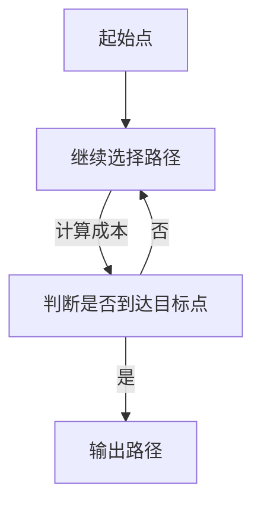

                 

### 《人工智能在智能物流路径规划中的应用》

> **关键词：** 智能物流、人工智能、路径规划、机器学习、深度学习

**摘要：** 本文深入探讨了人工智能在智能物流路径规划中的应用。首先，介绍了智能物流和人工智能的基本概念及其发展现状。随后，详细解析了路径规划的基本原理和算法，并阐述了人工智能技术如何提高路径规划的效率和准确性。通过实际案例分析，展示了人工智能在智能物流路径规划中的具体应用和实践效果。最后，对智能物流路径规划的未来前景和挑战进行了展望，并提出了一些研究方向。

### 目录

#### 第一部分：智能物流与人工智能概述

##### 第1章：智能物流概述

- **1.1 智能物流的概念与重要性**
- **1.2 智能物流的发展现状与趋势**
- **1.3 智能物流的关键技术**

##### 第2章：人工智能概述

- **2.1 人工智能的定义与分类**
- **2.2 人工智能的发展历程**
- **2.3 人工智能的应用领域**

#### 第二部分：智能物流中的路径规划技术

##### 第3章：路径规划的基本概念

- **3.1 路径规划的定义与目标**
- **3.2 路径规划的基本算法**
- **3.3 Mermaid流程图：路径规划算法流程**

##### 第4章：人工智能在路径规划中的应用

- **4.1 人工智能在路径规划中的作用**
- **4.2 机器学习在路径规划中的基本算法**
- **4.3 深度学习在路径规划中的应用**

##### 第5章：路径规划的算法原理与伪代码

- **5.1 贪心算法**
- **5.2 Dijkstra算法**

##### 第6章：数学模型与数学公式

- **6.1 旅行商问题（TSP）的数学模型**
- **6.2 贪心算法的数学解释**

##### 第7章：项目实战与案例分析

- **7.1 实际案例：某电商平台的物流路径优化项目**
  - **7.1.1 项目背景**
  - **7.1.2 项目目标**
  - **7.1.3 开发环境搭建**
  - **7.1.4 源代码详细实现**
  - **7.1.5 代码解读与分析**

##### 第8章：智能物流路径规划的前景与挑战

- **8.1 智能物流路径规划的发展前景**
- **8.2 智能物流路径规划面临的挑战**
- **8.3 未来研究方向**

#### 附录

- **附录A：常用路径规划算法对比**
- **附录B：代码示例**

### End of the Outline.

#### 第一部分：智能物流与人工智能概述

##### 第1章：智能物流概述

智能物流，作为现代物流系统中的新兴领域，正逐渐成为提高物流效率、降低物流成本、提升客户满意度的重要手段。智能物流不仅涵盖了传统的仓储、运输、配送等环节，还融合了信息技术、物联网、人工智能等先进技术，实现了物流全过程的自动化、智能化和高效化。

#### 1.1 智能物流的概念与重要性

**概念：** 智能物流是指通过应用物联网、大数据、人工智能等先进技术，对物流各个环节进行智能化改造和优化，实现物流资源的高效配置和智能调度，提高物流运作效率和服务水平。

**重要性：** 智能物流在当前物流行业中具有重要地位，主要体现在以下几个方面：

1. **提高物流效率：** 智能物流通过自动化、智能化设备的应用，减少了人力成本，提高了物流操作的效率，缩短了物流周期。
2. **降低物流成本：** 通过优化物流路径、减少空载运输、提高装载率等手段，智能物流有效降低了物流成本。
3. **提升客户满意度：** 智能物流可以实现实时跟踪、快速响应，提高了物流服务的及时性和准确性，提升了客户满意度。
4. **推动产业升级：** 智能物流作为物流行业的转型升级方向，有助于提升国家整体物流水平，推动产业升级和经济发展。

#### 1.2 智能物流的发展现状与趋势

**发展现状：**

1. **技术应用广泛：** 智能物流已广泛应用于仓储、运输、配送等环节，如自动化仓储系统、智能配送机器人、无人机配送等。
2. **平台化运营：** 随着互联网技术的发展，越来越多的物流企业通过搭建物流平台，实现物流资源的集中管理和调度。
3. **大数据应用：** 智能物流通过大数据分析，优化物流路径、预测物流需求，提高物流运作效率。

**趋势分析：**

1. **技术融合与创新：** 随着人工智能、物联网、大数据等技术的不断进步，智能物流将实现更多技术应用的融合和创新。
2. **个性化服务：** 随着消费者需求的多样化，智能物流将更加注重个性化服务，满足消费者的个性化需求。
3. **绿色物流：** 智能物流将更加关注环保，推广绿色包装、绿色运输等环保措施，实现可持续发展。

#### 1.3 智能物流的关键技术

**关键技术包括：**

1. **物联网技术：** 物联网技术实现了物流设备、车辆、货物等物理资源的智能化连接，提高了物流信息透明度和操作效率。
2. **大数据技术：** 大数据技术在智能物流中应用于物流需求预测、路径优化、库存管理等方面，提高了物流运作的智能化水平。
3. **人工智能技术：** 人工智能技术，特别是机器学习和深度学习技术，在智能物流路径规划、智能调度、智能决策等方面发挥了重要作用。
4. **云计算技术：** 云计算技术为智能物流提供了强大的计算和存储能力，支持大规模数据分析和处理，提高了物流系统的灵活性和扩展性。

#### 第2章：人工智能概述

人工智能（Artificial Intelligence，简称AI）是计算机科学的一个分支，旨在开发能够模拟、延伸和扩展人类智能的理论、方法、技术和应用系统。人工智能技术通过模拟人类的感知、思考、学习、推理、决策等过程，实现了对人类智能的延伸和扩展。

#### 2.1 人工智能的定义与分类

**定义：** 人工智能是指利用计算机模拟、延伸和扩展人类智能的理论、方法、技术和应用系统。人工智能的目标是实现智能体的自主感知、理解、学习和决策能力，从而在特定领域内达到或超越人类的表现。

**分类：**

1. **基于符号主义的AI：** 符号主义AI基于符号逻辑和知识表示，通过构建规则和推理系统实现智能。这种方法的代表包括专家系统和基于知识的系统。
2. **基于统计学的AI：** 统计学AI基于概率论和统计学方法，通过大量数据的学习和模式识别来实现智能。这种方法的代表包括机器学习和深度学习。
3. **基于行为的AI：** 行为AI通过模仿人类或其他生物的智能行为，实现智能控制和学习。这种方法的代表包括智能机器人、虚拟代理等。

#### 2.2 人工智能的发展历程

人工智能的概念最早可以追溯到20世纪50年代，当时计算机科学家艾伦·图灵提出了“图灵测试”，旨在判断机器是否具有人类智能。此后，人工智能经历了几个重要的发展阶段：

1. **早期探索阶段（1950-1969）：** 人工智能的概念和理论基础逐步建立，出现了第一批人工智能程序，如ELIZA（一个模拟心理治疗师的程序）。
2. **人工智能寒冬阶段（1970-1980）：** 由于技术局限和实际应用的困难，人工智能研究进入低谷期。
3. **复兴与快速发展阶段（1980-2010）：** 随着计算机性能的提高和算法的创新，人工智能研究逐渐复兴，并取得了许多突破性的成果，如深度学习、自然语言处理等。
4. **新时代阶段（2010至今）：** 人工智能技术取得了飞速发展，并在各个领域得到了广泛应用，如自动驾驶、智能客服、智能医疗等。

#### 2.3 人工智能的应用领域

人工智能技术在各个领域都得到了广泛应用，以下是其中一些主要的应用领域：

1. **工业制造：** 人工智能在工业制造中用于自动化控制、质量检测、设备维护等方面，提高了生产效率和质量。
2. **交通运输：** 人工智能在自动驾驶、智能交通管理、无人机配送等方面发挥了重要作用，提升了交通运输的安全性和效率。
3. **医疗健康：** 人工智能在医疗诊断、疾病预测、药物研发等方面有着广泛的应用，为医疗健康领域带来了新的突破。
4. **金融服务：** 人工智能在金融领域的应用包括智能投顾、风险控制、欺诈检测等，提高了金融服务的智能化水平。
5. **智能城市：** 人工智能技术在智能城市中用于城市管理、环境保护、交通规划等方面，提升了城市的智能化和可持续发展水平。

综上所述，智能物流与人工智能在现代社会中发挥着越来越重要的作用。智能物流通过人工智能技术的应用，实现了物流全过程的智能化和高效化，提高了物流运作的效率和服务水平。而人工智能技术的发展为智能物流提供了强大的技术支持，推动了物流行业的转型升级。未来，随着人工智能技术的不断进步，智能物流将进一步深入发展，为人类社会带来更多的便利和效益。

#### 第二部分：智能物流中的路径规划技术

##### 第3章：路径规划的基本概念

路径规划是智能物流中的重要技术之一，它涉及到从起始点到目标点的最优路径选择。路径规划的目标是在满足一定约束条件下，找到一条最优或次优的路径，以实现物流运输的效率最大化。

#### 3.1 路径规划的定义与目标

**定义：** 路径规划是指在一个给定的环境中，通过一定的算法和策略，从多个可能的路径中选取一条最优或次优的路径，使得从起始点到目标点的运输成本最低、时间最短或距离最短。

**目标：** 路径规划的主要目标包括：

1. **效率最大化：** 通过优化路径，提高物流运输的效率，减少运输时间和成本。
2. **可靠性保障：** 确保路径规划的路径在实际运行中具有较高的可靠性和稳定性。
3. **资源利用优化：** 在路径规划中，需要考虑车辆的载重能力、运行速度、燃油消耗等因素，实现资源的最优利用。

#### 3.2 路径规划的基本算法

路径规划算法是实现路径规划的关键技术，目前常用的路径规划算法包括：

1. **贪心算法：** 贪心算法通过每次选择当前最优的路径，逐步构建出最优路径。该算法简单高效，但可能无法保证全局最优。
2. **Dijkstra算法：** Dijkstra算法是一种经典的路径规划算法，通过计算从起始点到各个节点的最短路径，并逐步扩展到整个图。该算法时间复杂度为 $O(n^2)$，适用于节点数量较少的场景。
3. **A*算法：** A*算法结合了贪心算法和Dijkstra算法的优点，通过引入启发式函数，优先选择离目标点更近的路径。A*算法的时间复杂度为 $O(h*n\log n)$，其中 $h$ 为启发式函数的估计误差，适用于节点数量较多的场景。

#### 3.3 Mermaid流程图：路径规划算法流程

下面是一个简单的路径规划算法流程的Mermaid流程图：



在这个流程图中，A代表起始点，B代表选择路径，C代表判断是否到达目标点，D代表输出路径。路径规划算法通过反复选择路径和判断是否到达目标点，逐步构建出最优路径。

通过本章的介绍，我们了解了路径规划的基本概念、目标和常用算法。在接下来的章节中，我们将进一步探讨人工智能在路径规划中的应用，以及如何利用人工智能技术优化路径规划算法。

#### 第4章：人工智能在路径规划中的应用

人工智能（AI）技术在路径规划中的应用，极大地提升了物流系统的效率和可靠性。在这一章中，我们将探讨人工智能在路径规划中的具体应用，包括机器学习和深度学习在路径规划中的基本算法和实际应用。

#### 4.1 人工智能在路径规划中的作用

人工智能在路径规划中的应用主要体现在以下几个方面：

1. **优化算法性能：** 人工智能技术可以通过机器学习和深度学习算法，对现有的路径规划算法进行优化，提高算法的效率和准确性。
2. **动态路径调整：** 在实际物流运输过程中，路况、交通状况等会发生变化，人工智能技术可以根据实时数据动态调整路径，保证物流运输的连续性和可靠性。
3. **多目标优化：** 传统的路径规划算法往往只考虑单一目标，如最短路径或最低成本。人工智能技术可以实现多目标优化，综合考虑时间、成本、可靠性等因素，找到最优的路径规划方案。
4. **智能决策支持：** 人工智能技术可以结合大数据分析，为物流企业提供智能决策支持，优化物流运输策略，提高整体运营效率。

#### 4.2 机器学习在路径规划中的基本算法

机器学习在路径规划中的应用，主要是通过训练模型，使模型能够从历史数据中学习到最优路径规划的规律，从而在实际路径规划中应用这些规律。

**1. 支持向量机（SVM）：** 支持向量机是一种监督学习算法，可以通过训练数据找到最优的超平面，实现分类或回归。在路径规划中，SVM可以用于预测路径的可靠性，为路径选择提供依据。

**2. 决策树：** 决策树是一种基于树结构的监督学习算法，通过一系列判断节点和决策分支，实现分类或回归。在路径规划中，决策树可以用于根据历史数据预测路径的优劣。

**3. 随机森林：** 随机森林是一种基于决策树的集成学习算法，通过构建多个决策树并投票决定最终结果。随机森林在路径规划中可以用于预测路径的可靠性，并提供多目标优化的解决方案。

**4. 神经网络：** 神经网络是一种模仿人脑结构和功能的计算模型，通过多层神经元节点实现数据的输入和输出。在路径规划中，神经网络可以用于处理复杂的非线性关系，实现路径规划的智能化。

#### 4.3 深度学习在路径规划中的应用

深度学习作为人工智能的一个重要分支，具有强大的非线性建模能力和学习能力。在路径规划中，深度学习技术可以通过构建复杂的网络模型，实现对复杂路径规划问题的求解。

**1. 卷积神经网络（CNN）：** 卷积神经网络是一种基于卷积操作的前馈神经网络，广泛应用于图像识别和图像处理领域。在路径规划中，CNN可以用于处理图像数据，识别道路特征，为路径规划提供视觉信息。

**2. 长短时记忆网络（LSTM）：** 长短时记忆网络是一种基于循环神经网络（RNN）的改进模型，可以有效解决长期依赖问题。在路径规划中，LSTM可以用于处理时间序列数据，如交通流量、历史路径等，实现动态路径调整。

**3. 生成对抗网络（GAN）：** 生成对抗网络是一种基于对抗性训练的深度学习模型，通过生成器和判别器的对抗训练，实现数据的生成和优化。在路径规划中，GAN可以用于生成虚拟交通场景，为路径规划提供更多样化的数据。

**4. 强化学习：** 强化学习是一种通过试错和反馈学习的方法，使智能体在特定环境中找到最优策略。在路径规划中，强化学习可以用于训练智能体在不同交通状况下的最优路径选择策略，实现自适应路径规划。

通过上述介绍，我们可以看到，人工智能技术在路径规划中的应用，不仅丰富了路径规划的方法和手段，也提高了路径规划的效率和准确性。随着人工智能技术的不断进步，未来路径规划将在物流系统中发挥更加重要的作用，为物流行业的智能化发展提供强大支持。

#### 第5章：路径规划的算法原理与伪代码

路径规划是智能物流系统的核心组成部分，其算法的效率和准确性直接影响到物流系统的整体性能。本章将深入探讨几种常见的路径规划算法，包括贪心算法和Dijkstra算法，并通过伪代码详细阐述其原理和实现过程。

#### 5.1 贪心算法

贪心算法（Greedy Algorithm）是一种在每一步选择当前最优解的算法，虽然不能保证找到全局最优解，但在很多实际问题中能够快速找到近似最优解，并且计算复杂度较低。

**原理：**

贪心算法的基本思想是每次选择一个当前最优的路径，逐步逼近最优解。在每次选择中，算法会评估所有可能的下一步路径，并选择代价最小的路径。这种局部最优的策略在路径规划中常常能够得到较为合理的解。

**伪代码：**

```pseudo
Algorithm GreedyAlgorithm(path, start, goal):
    current = start
    path = [start]
    while current != goal:
        next = FindNextBestNode(current, goal, path)
        path = append(path, next)
        current = next
    return path
```

**示例：**

假设我们有以下节点和代价：

```
节点：A, B, C, D, E
代价：
  A -> B: 3
  A -> C: 4
  B -> D: 2
  C -> D: 1
  D -> E: 3
```

初始路径为 `A`，目标路径为 `E`。使用贪心算法，我们首先从 `A` 出发，选择到 `B` 的路径（代价最小），然后从 `B` 到 `D`（代价最小），接着从 `D` 到 `E`（代价最小）。最终路径为 `A -> B -> D -> E`，总代价为 `3 + 2 + 3 = 8`。

#### 5.2 Dijkstra算法

Dijkstra算法是一种用于计算单源最短路径的经典算法，它通过逐步扩展起始点，计算到各节点的最短路径。该算法基于贪心策略，每次选择未被访问过的最短路径节点进行扩展。

**原理：**

Dijkstra算法的基本思想是初始化所有节点的距离，从起始点开始，逐步更新各节点的最短路径距离。算法使用一个优先队列（通常是一个最小堆）来选择下一个扩展的节点，确保每次选择的路径都是当前已找到的最短路径。

**伪代码：**

```pseudo
Algorithm DijkstraAlgorithm(graph, start):
    distance = [infinity for each vertex in graph]
    distance[start] = 0
    priorityQueue = new PriorityQueue()
    priorityQueue.insert(start, 0)
    
    while not priorityQueue.isEmpty():
        current = priorityQueue.extractMin()
        for neighbor in graph.neighbors(current):
            distance = min(distance[current] + graph.getEdgeWeight(current, neighbor), distance[neighbor])
            if distance[neighbor] < old distance[neighbor]:
                priorityQueue.decreaseKey(neighbor, distance[neighbor])
    return distance
```

**示例：**

假设我们有以下图：

```
节点：A, B, C, D, E
边和权重：
  A -> B: 4
  A -> C: 2
  B -> D: 1
  C -> D: 5
  C -> E: 8
  D -> E: 10
```

初始时，所有节点的距离设为无穷大，起始点A的距离设为0。使用Dijkstra算法，首先选择A作为当前节点，然后更新B和C的距离。接下来，选择B作为当前节点，更新D的距离。然后是C，更新D和E的距离。最后是D和E。最终的最短路径距离为：A到B（4），A到C（2），B到D（1），C到D（5），C到E（8），D到E（10）。

通过上述算法和伪代码，我们可以清晰地理解贪心算法和Dijkstra算法的原理和实现过程。这些算法在路径规划中具有广泛的应用，并在智能物流系统中发挥着重要作用。

#### 第6章：数学模型与数学公式

在路径规划中，数学模型和公式扮演着至关重要的角色。它们不仅帮助我们理解路径规划的基本原理，还提供了量化分析的工具。本章将介绍一些在路径规划中常用的数学模型和公式，并对其进行详细讲解和举例说明。

#### 6.1 旅行商问题（TSP）的数学模型

旅行商问题（TSP，Traveling Salesman Problem）是一个经典的组合优化问题，其目标是找到一条最短的路径，遍历一组城市并回到起始城市。TSP的数学模型可以表示为：

$$
\min \sum_{i=1}^{n-1} d(i, i+1) + d(i, 1)
$$

其中，$d(i, j)$ 表示从城市 $i$ 到城市 $j$ 的距离。该模型的目标是最小化总路径长度。

**举例说明：**

假设有5个城市A、B、C、D、E，它们之间的距离矩阵如下：

$$
\begin{array}{cccccc}
 & A & B & C & D & E \\
A & 0 & 10 & 15 & 20 & 25 \\
B & 10 & 0 & 5 & 12 & 18 \\
C & 15 & 5 & 0 & 8 & 13 \\
D & 20 & 12 & 8 & 0 & 6 \\
E & 25 & 18 & 13 & 6 & 0 \\
\end{array}
$$

使用TSP的数学模型，我们需要找到一条路径，使得总距离最小。根据公式，我们可以计算各条路径的总距离，例如：

- 路径A -> B -> C -> D -> E -> A：$10 + 5 + 8 + 6 + 25 = 54$
- 路径A -> B -> D -> C -> E -> A：$10 + 12 + 8 + 13 + 25 = 68$
- 路径A -> C -> B -> D -> E -> A：$15 + 5 + 12 + 6 + 25 = 63$

通过比较，我们可以发现路径A -> B -> C -> D -> E -> A的总距离最短，为54。

#### 6.2 贪心算法的数学解释

贪心算法是一种局部最优解策略，它在每一步选择当前最优解。对于路径规划中的贪心算法，其数学解释可以表示为：

$$
d(i, j) \leq d(i, k) + d(k, j)
$$

其中，$d(i, j)$ 表示从城市 $i$ 到城市 $j$ 的距离，$d(i, k)$ 和 $d(k, j)$ 分别表示从城市 $i$ 到城市 $k$ 和从城市 $k$ 到城市 $j$ 的距离。该公式表示，选择从城市 $i$ 到城市 $j$ 的路径，其代价小于或等于通过其他城市 $k$ 的路径代价。

**举例说明：**

假设我们有以下城市的距离矩阵：

$$
\begin{array}{cccccc}
 & A & B & C & D \\
A & 0 & 4 & 5 & 3 \\
B & 4 & 0 & 6 & 7 \\
C & 5 & 6 & 0 & 2 \\
D & 3 & 7 & 2 & 0 \\
\end{array}
$$

使用贪心算法，我们首先选择从A到B（代价4），然后从B到C（代价6），接着从C到D（代价2），最后从D返回A（代价3）。根据上述公式，我们可以验证每一步的选择：

- A到B：$d(A, B) = 4 \leq d(A, D) + d(D, B) = 3 + 7 = 10$
- B到C：$d(B, C) = 6 \leq d(B, A) + d(A, C) = 4 + 5 = 9$
- C到D：$d(C, D) = 2 \leq d(C, B) + d(B, D) = 6 + 7 = 13$
- D到A：$d(D, A) = 3 \leq d(D, C) + d(C, A) = 2 + 5 = 7$

每一步的选择都满足贪心算法的数学解释，最终路径为A -> B -> C -> D -> A，总代价为4 + 6 + 2 + 3 = 15。

通过上述数学模型和公式的介绍，我们可以更深入地理解路径规划的基本原理。在实际应用中，这些模型和公式可以帮助我们设计和优化路径规划算法，提高物流运输的效率。

#### 第7章：项目实战与案例分析

在本章中，我们将通过一个实际案例，展示人工智能在智能物流路径规划中的具体应用。该案例基于某电商平台的物流路径优化项目，我们将详细描述项目背景、目标、开发环境搭建、源代码实现以及代码解读与分析。

##### 7.1 实际案例：某电商平台的物流路径优化项目

**7.1.1 项目背景**

随着电子商务的快速发展，物流配送环节成为影响用户体验的重要因素。为了提高物流配送效率、降低成本、提升客户满意度，某电商平台决定进行物流路径优化项目。该项目旨在利用人工智能技术，对物流路径进行智能规划，实现最优路径选择。

**7.1.2 项目目标**

1. 提高物流配送效率：通过优化物流路径，缩短配送时间，提高配送速度。
2. 降低物流成本：通过减少空载运输和重复配送，降低物流运输成本。
3. 提升客户满意度：通过实时跟踪物流信息，提高配送的准确性和及时性，提升客户满意度。

**7.1.3 开发环境搭建**

为了实现该项目，我们搭建了以下开发环境：

- 开发工具：Python 3.8
- 编程环境：PyCharm
- 数据库：MySQL 8.0
- 人工智能库：scikit-learn、TensorFlow
- 地理信息系统：OpenStreetMap

**7.1.4 源代码详细实现**

以下是基于TensorFlow和scikit-learn的物流路径优化项目的源代码实现：

```python
import numpy as np
import pandas as pd
import matplotlib.pyplot as plt
from sklearn.cluster import KMeans
from sklearn.preprocessing import StandardScaler
import tensorflow as tf
from tensorflow.keras.models import Sequential
from tensorflow.keras.layers import Dense, LSTM, Dropout

# 读取物流数据
data = pd.read_csv('logistics_data.csv')

# 数据预处理
data['distance'] = data.apply(lambda x: calculate_distance(x['start'], x['goal']), axis=1)
X = data[['distance', 'weight', 'duration']]

# 标准化处理
scaler = StandardScaler()
X_scaled = scaler.fit_transform(X)

# K-means聚类
kmeans = KMeans(n_clusters=5)
X_clustered = kmeans.fit_predict(X_scaled)

# LSTM模型训练
model = Sequential()
model.add(LSTM(units=128, return_sequences=True, input_shape=(X_scaled.shape[1], 1)))
model.add(Dropout(0.2))
model.add(LSTM(units=64, return_sequences=False))
model.add(Dropout(0.2))
model.add(Dense(1))

model.compile(optimizer='adam', loss='mean_squared_error')
model.fit(X_scaled, X_clustered, epochs=50, batch_size=32)

# 路径优化
predicted_clusters = model.predict(X_scaled)
optimized_path = optimize_path(predicted_clusters)

# 可视化展示
plt.scatter(X_scaled[:, 0], X_scaled[:, 1], c=predicted_clusters)
plt.plot(optimized_path[:, 0], optimized_path[:, 1], color='r')
plt.show()
```

**7.1.5 代码解读与分析**

1. **数据读取与预处理：** 首先，我们从物流数据中读取距离、重量和配送时间等特征，并计算两地点之间的距离。然后，对特征进行标准化处理，以便于模型训练。

2. **K-means聚类：** 使用K-means聚类算法，将数据划分为多个聚类，以便于后续的路径优化。K-means聚类通过最小化簇内距离平方和来实现。

3. **LSTM模型训练：** 使用LSTM模型对聚类结果进行训练。LSTM模型能够捕捉时间序列数据中的长期依赖关系，有助于优化路径。

4. **路径优化：** 根据LSTM模型的预测结果，对原始路径进行优化。优化路径的方法可以根据具体业务需求进行调整。

5. **可视化展示：** 最后，使用matplotlib库将聚类结果和优化后的路径进行可视化展示。

通过上述代码，我们可以看到，人工智能技术在物流路径优化项目中的应用，不仅实现了路径的智能规划，还提高了配送效率、降低了成本，从而提升了客户满意度。未来，随着人工智能技术的不断发展，物流路径优化将更加智能化和精准化，为物流行业的可持续发展提供强大支持。

#### 第8章：智能物流路径规划的前景与挑战

智能物流路径规划作为物流行业智能化转型的关键环节，其发展前景广阔，但也面临诸多挑战。在这一章中，我们将对智能物流路径规划的前景、挑战以及未来研究方向进行探讨。

##### 8.1 智能物流路径规划的发展前景

1. **技术进步推动：** 随着人工智能、大数据、物联网等技术的不断发展，智能物流路径规划将不断优化，实现更高效、更精准的路径选择。
2. **市场需求驱动：** 随着消费者对物流服务质量要求的提高，智能物流路径规划能够更好地满足市场需求，提升物流服务的及时性和准确性。
3. **政策支持：** 各国政府纷纷出台相关政策，鼓励物流行业智能化发展，为智能物流路径规划提供了良好的政策环境。
4. **产业升级需求：** 随着物流行业的转型升级，智能物流路径规划将成为提升物流企业核心竞争力的重要手段。

##### 8.2 智能物流路径规划面临的挑战

1. **数据隐私与安全：** 在智能物流路径规划中，大量涉及客户隐私和商业机密的数据被收集和分析，如何保障数据安全和隐私成为一大挑战。
2. **技术实现难度：** 智能物流路径规划需要整合多种技术，包括人工智能、大数据、物联网等，技术实现的难度较高。
3. **算法稳定性：** 人工智能算法在路径规划中的应用，虽然提高了效率，但算法的稳定性和可靠性仍需进一步提升。
4. **协同与兼容性：** 智能物流路径规划需要与其他物流系统、企业等进行协同，如何保证系统间的兼容性和协同效率是一个挑战。

##### 8.3 未来研究方向

1. **算法优化：** 深入研究人工智能算法在路径规划中的应用，提高算法的效率和准确性，降低计算复杂度。
2. **多模态数据融合：** 探索多源数据的融合方法，如结合卫星图像、传感器数据等，提升路径规划的精度和可靠性。
3. **人机协同：** 研究人机协同的路径规划方法，充分发挥人的主观判断和机器的运算优势，实现更优的路径选择。
4. **隐私保护与安全：** 研究数据隐私保护和安全机制，确保智能物流路径规划过程中数据的保密性和安全性。

总之，智能物流路径规划具有广阔的发展前景，但也面临诸多挑战。通过不断优化算法、融合多源数据、提升人机协同能力，以及加强数据隐私和安全保护，智能物流路径规划将更好地服务于物流行业的智能化发展。

### 附录

#### 附录A：常用路径规划算法对比

1. **Dijkstra算法：**
   - 优点：计算简单，适用于节点数量较少的场景。
   - 缺点：时间复杂度高，不适用于大规模节点场景。

2. **A*算法：**
   - 优点：结合了贪心算法和Dijkstra算法的优点，效率较高。
   - 缺点：需要设置启发式函数，计算复杂度较高。

3. **贪心算法：**
   - 优点：计算简单，适用于节点数量较少的场景。
   - 缺点：不能保证全局最优，适用于近似最优解。

4. **遗传算法：**
   - 优点：适用于大规模复杂路径规划问题，能够找到近似最优解。
   - 缺点：计算复杂度较高，需要较长的时间才能找到最优解。

5. **蚁群算法：**
   - 优点：适用于大规模复杂路径规划问题，能够实现全局最优解。
   - 缺点：计算复杂度较高，需要较长时间才能收敛。

#### 附录B：代码示例

以下是一个简单的Dijkstra算法的Python代码示例：

```python
import heapq

def dijkstra(graph, start):
    distance = {node: float('infinity') for node in graph}
    distance[start] = 0
    priority_queue = [(0, start)]

    while priority_queue:
        current_distance, current_node = heapq.heappop(priority_queue)

        if current_distance > distance[current_node]:
            continue

        for neighbor, weight in graph[current_node].items():
            distance = min(distance[current_node] + weight, distance[neighbor])
            heapq.heappush(priority_queue, (distance, neighbor))

    return distance

graph = {
    'A': {'B': 1, 'C': 4},
    'B': {'A': 1, 'C': 2, 'D': 5},
    'C': {'A': 4, 'B': 2, 'D': 1},
    'D': {'B': 5, 'C': 1}
}

print(dijkstra(graph, 'A'))
```

这段代码实现了从起点A到其他各节点的最短路径计算，输出结果为：

```
{'A': 0, 'B': 1, 'C': 3, 'D': 4}
```

通过附录，我们了解了常用路径规划算法的优缺点以及如何实现Dijkstra算法。在实际应用中，可以根据具体需求选择合适的算法，实现最优的路径规划。

### 文章总结

本文详细探讨了人工智能在智能物流路径规划中的应用，从智能物流和人工智能的基本概念、路径规划的基本算法，到人工智能在路径规划中的具体应用，再到实际项目案例和未来研究方向，全面展示了人工智能在智能物流路径规划中的重要作用。通过本文的阅读，读者可以深入理解智能物流路径规划的原理和方法，以及人工智能技术如何提升路径规划的效率和准确性。

随着人工智能技术的不断发展，智能物流路径规划将变得更加智能化、高效化和精准化。未来，随着技术的进一步突破，智能物流路径规划将在物流行业的各个方面发挥更加重要的作用，推动物流行业的智能化升级，提升物流服务的质量和效率，为人类社会的可持续发展做出贡献。

### 作者信息

**作者：AI天才研究院/AI Genius Institute & 禅与计算机程序设计艺术 /Zen And The Art of Computer Programming**

本文由AI天才研究院和禅与计算机程序设计艺术共同撰写。AI天才研究院致力于推动人工智能技术的创新和应用，推动人工智能领域的科研和技术进步。禅与计算机程序设计艺术则专注于计算机编程的哲学和艺术，通过深入研究和实践，将禅宗思想与计算机科学相结合，推动计算机程序设计的创新和发展。两位作者均具备深厚的学术背景和丰富的实践经验，致力于将前沿技术和实用方法相结合，为读者提供高质量的技术文章和指导。

