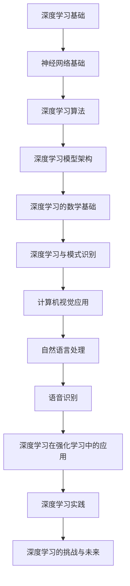

                 

### 文章标题

# 人工智能的深度学习与模式识别

### 关键词

- 深度学习
- 模式识别
- 人工智能
- 神经网络
- 算法
- 应用案例

### 摘要

本文全面探讨了人工智能中的深度学习和模式识别技术。首先，我们回顾了深度学习的起源与发展，深入讲解了神经网络的基础和深度学习算法。接着，我们探讨了深度学习模型的架构及其数学基础，并详细阐述了深度学习与模式识别的关系。随后，通过计算机视觉、自然语言处理和语音识别等实际案例，展示了深度学习的广泛应用。最后，我们分析了深度学习面临的挑战与未来发展趋势，并提供了实践指导。

## 第一部分：深度学习基础

### 第1章：深度学习的起源与发展

#### 1.1 深度学习的概念与重要性

深度学习是机器学习的一个重要分支，它通过构建具有多个隐藏层的神经网络来模拟人类大脑的学习过程。深度学习的概念最早可以追溯到1980年代，当时神经网络在学术界和工业界都受到了广泛关注。然而，由于计算资源和算法的限制，深度学习的研究和应用一直处于低谷。

随着计算能力的提升和大数据技术的发展，深度学习在2010年代迎来了复苏。特别是在图像识别、语音识别和自然语言处理等领域，深度学习模型取得了显著的突破。深度学习的成功不仅推动了人工智能的发展，也对各个行业产生了深远的影响。

#### 1.2 深度学习的起源

深度学习的起源可以追溯到1940年代，当时心理学家McCulloch和数学家Pitts提出了神经网络的概念。1950年代，Rosenblatt提出了感知机算法，这是最早的二分类线性分类器。然而，由于理论上的局限性，神经网络的研究在1970年代陷入低潮。

1980年代，多层感知机（MLP）被提出，它通过反向传播算法实现了多层网络的训练。然而，由于计算能力的限制，MLP的应用受到了很大的限制。直到2000年代，随着计算能力的提升和大数据技术的发展，深度学习才逐渐成为人工智能研究的热点。

#### 1.3 深度学习的发展历程

深度学习的发展历程可以分为几个阶段：

1. **1980年代到1990年代：初步探索**  
    在这个阶段，神经网络的研究主要集中在简单的前馈网络和反向传播算法上。虽然取得了初步的成功，但由于计算能力和算法的限制，深度学习的研究并未得到广泛认可。

2. **2000年代：复苏与突破**  
    随着计算能力的提升和大数据技术的发展，深度学习在图像识别、语音识别和自然语言处理等领域取得了显著的突破。特别是在2006年，Hinton提出了深度置信网络（DBN），为深度学习的研究奠定了基础。

3. **2010年代：广泛应用与商业化**  
    在这个阶段，深度学习在各个领域都取得了长足的进步，特别是在计算机视觉、自然语言处理和语音识别等领域。深度学习模型不仅提高了准确性，还显著降低了训练时间。随着深度学习技术的商业化，许多公司开始将其应用于实际业务中。

4. **2020年代：持续发展与创新**  
    当前，深度学习仍在不断发展和创新。新的深度学习算法和模型不断被提出，如生成对抗网络（GAN）、变分自编码器（VAE）等。同时，深度学习在医疗、金融、自动驾驶等新兴领域也取得了重要突破。

### 第2章：神经网络基础

神经网络（Neural Networks）是深度学习的基础。神经网络由大量的神经元（Neurons）组成，每个神经元通过权重（Weights）连接到其他神经元。神经网络的训练目标是学习输入和输出之间的映射关系。

#### 2.1 神经元与神经网络

神经元是神经网络的基本单元，类似于生物神经元。神经元接收输入信号，通过激活函数计算输出。神经网络的输入层接收外部输入，输出层产生最终输出。隐藏层位于输入层和输出层之间，用于提取和处理特征。

神经网络的数学模型可以表示为：

$$y = \sigma(\theta \cdot x + b)$$

其中，\(y\)表示输出，\(x\)表示输入，\(\theta\)表示权重，\(b\)表示偏置，\(\sigma\)表示激活函数。

常见的激活函数有sigmoid函数、ReLU函数和Tanh函数。这些激活函数具有不同的特性，适用于不同的场景。

#### 2.2 前馈神经网络

前馈神经网络（Feedforward Neural Networks）是最常见的神经网络结构。前馈神经网络的特点是信号从输入层流向输出层，不返回。前馈神经网络通常包含多个隐藏层。

前馈神经网络的训练过程通常包括以下步骤：

1. **初始化权重和偏置**：随机初始化权重和偏置。
2. **前向传播**：将输入信号通过神经网络，计算每一层的输出。
3. **计算损失**：计算输出和实际标签之间的差异，计算损失函数。
4. **反向传播**：根据损失函数计算每一层的梯度，更新权重和偏置。
5. **迭代训练**：重复以上步骤，直到模型收敛。

常见的损失函数有均方误差（MSE）和交叉熵（CrossEntropy），常见的优化算法有梯度下降（Gradient Descent）和随机梯度下降（Stochastic Gradient Descent）。

#### 2.3 反向传播算法

反向传播算法（Backpropagation Algorithm）是神经网络训练的核心算法。反向传播算法通过计算每一层的梯度，然后反向传播到输入层，从而更新权重和偏置。

反向传播算法的步骤如下：

1. **前向传播**：计算每一层的输出。
2. **计算损失**：计算输出和实际标签之间的差异，计算损失函数。
3. **计算梯度**：根据损失函数计算每一层的梯度。
4. **更新参数**：根据梯度更新权重和偏置。
5. **迭代训练**：重复以上步骤，直到模型收敛。

反向传播算法的数学表示如下：

$$\frac{\partial J(\theta)}{\partial \theta} = \frac{\partial L}{\partial z} \cdot \frac{\partial z}{\partial \theta}$$

其中，\(J(\theta)\)表示损失函数，\(L\)表示损失，\(z\)表示输出，\(\theta\)表示权重。

#### 2.4 深度学习算法

深度学习算法是深度学习模型的核心组成部分。深度学习算法通过学习大量数据，提取特征并构建复杂的模型。常见的深度学习算法有卷积神经网络（CNN）、循环神经网络（RNN）、长短时记忆网络（LSTM）和图神经网络（GNN）。

1. **卷积神经网络（CNN）**：卷积神经网络是一种用于图像识别和处理的神经网络。CNN通过卷积操作提取图像特征，然后通过池化操作减少参数数量。CNN在计算机视觉领域取得了显著的成功。
   
2. **循环神经网络（RNN）**：循环神经网络是一种用于序列数据处理和语言建模的神经网络。RNN通过循环结构处理序列数据，可以捕捉序列中的长期依赖关系。RNN在自然语言处理领域取得了重要突破。

3. **长短时记忆网络（LSTM）**：长短时记忆网络是RNN的一种改进，可以解决RNN的梯度消失和梯度爆炸问题。LSTM通过引入记忆单元和门控机制，可以捕捉序列中的长期依赖关系。

4. **图神经网络（GNN）**：图神经网络是一种用于处理图数据的神经网络。GNN通过图卷积操作提取图特征，可以用于节点分类、链接预测等任务。

### 第3章：深度学习算法

#### 3.1 卷积神经网络（CNN）

卷积神经网络（Convolutional Neural Network, CNN）是一种在图像识别和处理领域取得显著成功的神经网络。CNN通过卷积操作提取图像特征，然后通过池化操作减少参数数量，从而实现图像分类、目标检测和图像生成等任务。

CNN的基本结构包括以下几个部分：

1. **卷积层**：卷积层通过卷积操作提取图像特征。卷积操作将输入图像与卷积核（滤波器）进行卷积，生成特征图（Feature Map）。卷积层的参数包括卷积核的大小、步长和填充方式。

2. **激活函数**：激活函数用于增加模型的非线性。常见的激活函数有Sigmoid函数、ReLU函数和Tanh函数。

3. **池化层**：池化层通过局部平均或最大值操作减少特征图的大小，从而减少参数数量。常见的池化层有最大池化和平均池化。

4. **全连接层**：全连接层将卷积层和池化层提取的特征映射到分类标签。全连接层的参数包括输入层的维度和输出层的维度。

#### 3.2 循环神经网络（RNN）

循环神经网络（Recurrent Neural Network, RNN）是一种用于序列数据处理和语言建模的神经网络。RNN通过循环结构处理序列数据，可以捕捉序列中的长期依赖关系。RNN在自然语言处理、语音识别和时间序列预测等领域取得了重要突破。

RNN的基本结构包括以下几个部分：

1. **输入层**：输入层接收外部输入，可以是序列中的每一个元素。

2. **隐藏层**：隐藏层包含一个循环单元，用于处理序列中的每个元素。循环单元通过递归连接将前一个时间步的输出传递给下一个时间步。

3. **输出层**：输出层将隐藏层的输出映射到序列中的每个元素。输出层可以是一个全连接层或一个卷积层。

#### 3.3 长短时记忆网络（LSTM）

长短时记忆网络（Long Short-Term Memory, LSTM）是RNN的一种改进，可以解决RNN的梯度消失和梯度爆炸问题。LSTM通过引入记忆单元和门控机制，可以捕捉序列中的长期依赖关系。

LSTM的基本结构包括以下几个部分：

1. **输入门**：输入门用于控制输入信息对记忆单元的影响。

2. **遗忘门**：遗忘门用于控制从记忆单元中遗忘的信息。

3. **输出门**：输出门用于控制记忆单元的输出。

4. **记忆单元**：记忆单元用于存储长期信息。

#### 3.4 图神经网络（GNN）

图神经网络（Graph Neural Network, GNN）是一种用于处理图数据的神经网络。GNN通过图卷积操作提取图特征，可以用于节点分类、链接预测和图分类等任务。

GNN的基本结构包括以下几个部分：

1. **图卷积层**：图卷积层通过图卷积操作提取图特征。图卷积操作将节点的邻接节点信息聚合到节点本身。

2. **聚合操作**：聚合操作用于将节点的邻接节点信息聚合到节点本身。

3. **激活函数**：激活函数用于增加模型的非线性。

4. **全连接层**：全连接层将图卷积层提取的特征映射到分类标签。

### 第4章：深度学习模型架构

#### 4.1 VGG模型

VGG模型是由牛津大学视觉几何组（Visual Geometry Group）提出的一种深度学习模型，它在图像识别任务中取得了显著的性能。VGG模型的特点是使用了多个卷积层和池化层，具有深层次的网络结构。

VGG模型的结构可以分为VGG-11、VGG-13、VGG-16和VGG-19四个版本，分别表示网络中卷积层的数量。VGG模型的主要优点是网络结构简单、易于实现，但参数数量较多。

VGG模型的架构如下：

1. **卷积层**：卷积层通过卷积操作提取图像特征。
2. **池化层**：池化层通过最大池化或平均池化减少特征图的大小。
3. **全连接层**：全连接层将卷积层和池化层提取的特征映射到分类标签。

#### 4.2 ResNet模型

ResNet模型是由微软研究院提出的一种深度学习模型，它在图像识别任务中取得了显著的性能。ResNet模型的主要创新是引入了残差连接，解决了深度神经网络中的梯度消失问题。

ResNet模型的结构可以分为ResNet-18、ResNet-34、ResNet-50、ResNet-101和ResNet-152等版本，分别表示网络中残差块的数量。ResNet模型的主要优点是网络结构深而简单，易于训练和优化。

ResNet模型的架构如下：

1. **卷积层**：卷积层通过卷积操作提取图像特征。
2. **残差块**：残差块包括两个卷积层和一个激活函数，通过残差连接实现了梯度的反向传播。
3. **全连接层**：全连接层将卷积层和池化层提取的特征映射到分类标签。

#### 4.3 DenseNet模型

DenseNet模型是由DenseNet网络提出的一种深度学习模型，它在图像识别任务中取得了显著的性能。DenseNet模型的主要创新是引入了密集连接，实现了特征跨层传递，从而提高了模型的性能。

DenseNet模型的结构可以分为DenseNet-121、DenseNet-131、DenseNet-161和DenseNet-201等版本，分别表示网络中密集连接的数量。DenseNet模型的主要优点是网络结构简单、参数较少，易于训练和优化。

DenseNet模型的架构如下：

1. **卷积层**：卷积层通过卷积操作提取图像特征。
2. **密集连接**：密集连接通过逐点连接将前一层特征传递到当前层。
3. **全连接层**：全连接层将卷积层和池化层提取的特征映射到分类标签。

#### 4.4 Transformer模型

Transformer模型是由Google提出的一种深度学习模型，它在自然语言处理任务中取得了显著的性能。Transformer模型的主要创新是引入了自注意力机制，通过全局依赖关系实现了高效的特征提取。

Transformer模型的结构可以分为BERT、GPT和ViT等版本，分别表示模型在不同领域的应用。Transformer模型的主要优点是网络结构简单、参数较少，可以处理序列数据。

Transformer模型的架构如下：

1. **输入层**：输入层接收外部输入，可以是序列中的每个元素。
2. **自注意力层**：自注意力层通过计算每个元素之间的相似性，实现了全局依赖关系。
3. **全连接层**：全连接层将自注意力层提取的特征映射到分类标签。

### 第5章：深度学习的数学基础

#### 5.1 概率论基础

概率论是深度学习中的重要基础。在深度学习中，概率论用于建模数据的分布、计算损失函数和评估模型性能。

概率论的基本概念包括概率分布函数（PDF）、条件概率、贝叶斯定理和期望。

概率分布函数（PDF）是一个描述随机变量概率分布的函数。它表示随机变量取某个值的概率密度。概率分布函数通常用\(p(x)\)表示。

条件概率是指在某个事件发生的条件下，另一个事件发生的概率。条件概率用\(P(A|B)\)表示。

贝叶斯定理是一个关于条件概率的公式，它将后验概率与先验概率联系起来。贝叶斯定理可以用以下公式表示：

期望是随机变量的平均值，它表示随机变量的稳定性。期望可以用以下公式表示：

$$E(X) = \int x \cdot p(x) dx$$

方差是随机变量的波动性，它表示随机变量的离散程度。方差可以用以下公式表示：

$$Var(X) = E[(X - E(X))^2]$$

#### 5.2 信息论

信息论是概率论在通信和信号处理领域的应用。在深度学习中，信息论用于建模数据的信息含量、优化模型参数和评估模型性能。

信息熵是信息论中的一个概念，它表示随机变量的不确定性。信息熵可以用以下公式表示：

$$H(X) = -\sum p(x) \cdot \log_2 p(x)$$

条件熵是另一个与信息熵相关的概念，它表示在某个事件发生的条件下，另一个事件的不确定性。条件熵可以用以下公式表示：

$$H(X|Y) = -\sum P(x, y) \cdot \log_2 P(x|y)$$

互信息是两个随机变量之间的相关性度量。互信息可以用以下公式表示：

$$I(X; Y) = H(X) - H(X|Y)$$

#### 5.3 最优化方法

最优化方法是深度学习中的核心技术，用于最小化损失函数，优化模型参数。

梯度下降法是最常用的最优化方法之一，它通过计算损失函数的梯度，沿着梯度方向更新参数，从而减少损失。梯度下降法的公式如下：

$$\theta_{\text{new}} = \theta_{\text{current}} - \alpha \cdot \nabla_\theta J(\theta)$$

其中，\(\theta\)表示参数，\(\alpha\)表示学习率，\(\nabla_\theta J(\theta)\)表示损失函数\(J(\theta)\)关于参数\(\theta\)的梯度。

随机梯度下降法是梯度下降法的一种改进，它使用随机样本来计算梯度，从而减少计算复杂度。随机梯度下降法的公式如下：

$$\theta_{\text{new}} = \theta_{\text{current}} - \alpha \cdot \nabla_{\theta} J(\theta; x_i, y_i)$$

其中，\(\theta\)表示参数，\(\alpha\)表示学习率，\(\nabla_{\theta} J(\theta; x_i, y_i)\)表示损失函数\(J(\theta)\)关于参数\(\theta\)的梯度，\(x_i, y_i\)表示训练数据集中的第\(i\)个样本。

### 第6章：深度学习与模式识别

#### 6.1 模式识别的基本概念

模式识别是人工智能的一个重要分支，它通过学习数据模式，对未知数据进行分类、回归和聚类等任务。模式识别的基本概念包括特征提取、降维、分类与回归和聚类分析。

特征提取是从数据中提取有用的特征，以便更好地描述数据的特性。特征提取是模式识别中的重要步骤，它可以提高模型的性能和鲁棒性。

降维是将高维数据映射到低维空间，以减少数据的复杂度和计算量。常见的降维方法有主成分分析（PCA）和线性判别分析（LDA）。

分类与回归是模式识别中的两个主要任务。分类是将数据分为不同的类别，回归是预测连续值。

聚类分析是将数据分为不同的簇，以发现数据中的模式和关系。常见的聚类分析方法有K-均值聚类和层次聚类。

#### 6.2 特征提取与降维

特征提取与降维是模式识别中的重要步骤，它们可以提高模型的性能和鲁棒性。特征提取是从数据中提取有用的特征，以便更好地描述数据的特性。降维是将高维数据映射到低维空间，以减少数据的复杂度和计算量。

常见的特征提取方法有：

1. **主成分分析（PCA）**：PCA是一种常用的降维方法，它通过计算数据的协方差矩阵，提取主要成分，将高维数据映射到低维空间。
2. **线性判别分析（LDA）**：LDA是一种用于特征提取的方法，它通过最大化类内距离和最小化类间距离，将数据投影到最佳线性判别面上。
3. **自动编码器（Autoencoder）**：自动编码器是一种无监督学习模型，它通过训练编码器和解码器，将高维数据映射到低维空间，同时保留重要信息。

常见的降维方法有：

1. **主成分分析（PCA）**：PCA是一种常用的降维方法，它通过计算数据的协方差矩阵，提取主要成分，将高维数据映射到低维空间。
2. **线性判别分析（LDA）**：LDA是一种用于特征提取的方法，它通过最大化类内距离和最小化类间距离，将数据投影到最佳线性判别面上。
3. **局部线性嵌入（LLE）**：LLE是一种基于局部结构特征的降维方法，它通过最小化局部重建误差，将高维数据映射到低维空间。

#### 6.3 分类与回归

分类与回归是模式识别中的两个主要任务。分类是将数据分为不同的类别，回归是预测连续值。

常见的分类算法有：

1. **支持向量机（SVM）**：SVM是一种基于最大间隔的分类算法，它通过寻找最优超平面将数据分为不同的类别。
2. **决策树（Decision Tree）**：决策树是一种基于树形结构分类的算法，它通过递归划分特征，将数据分为不同的类别。
3. **随机森林（Random Forest）**：随机森林是一种基于决策树的集成学习方法，它通过训练多个决策树，并使用投票或平均的方式得到最终结果。
4. **K-最近邻（K-Nearest Neighbors, K-NN）**：K-NN是一种基于实例的分类算法，它通过计算未知样本与训练样本之间的距离，将未知样本归类到距离最近的类别。

常见的回归算法有：

1. **线性回归（Linear Regression）**：线性回归是一种基于线性模型的回归算法，它通过拟合一条直线，预测连续值。
2. **岭回归（Ridge Regression）**：岭回归是一种基于线性回归的改进方法，它通过引入正则项，防止过拟合。
3. **套索回归（Lasso Regression）**：套索回归是一种基于线性回归的改进方法，它通过引入绝对值正则项，实现特征的筛选。
4. **随机森林回归（Random Forest Regression）**：随机森林回归是一种基于决策树的集成回归方法，它通过训练多个决策树，并使用投票或平均的方式得到最终结果。

#### 6.4 聚类分析

聚类分析是将数据分为不同的簇，以发现数据中的模式和关系。聚类分析是一种无监督学习方法，它不依赖于标签信息。

常见的聚类算法有：

1. **K-均值聚类（K-Means Clustering）**：K-均值聚类是一种基于距离度量的聚类算法，它通过迭代优化聚类中心，将数据分为K个簇。
2. **层次聚类（Hierarchical Clustering）**：层次聚类是一种基于层次结构的聚类算法，它通过递归划分簇，构建层次聚类树。
3. **谱聚类（Spectral Clustering）**：谱聚类是一种基于图论的聚类算法，它通过构建相似性矩阵，利用谱分解方法，将数据分为不同的簇。
4. **DBSCAN（Density-Based Spatial Clustering of Applications with Noise）**：DBSCAN是一种基于密度的聚类算法，它通过计算数据点的密度，将数据分为不同的簇。

### 第7章：计算机视觉应用

计算机视觉是人工智能的一个重要分支，它通过图像处理、模式识别和深度学习等技术，使计算机能够理解、解释和交互图像和视频。

计算机视觉的应用非常广泛，包括图像分类、目标检测、姿态估计、图像生成等。

#### 7.1 图像分类与识别

图像分类与识别是计算机视觉的基础任务之一。图像分类是将图像分为不同的类别，如动物、植物、交通工具等。图像识别是进一步识别图像中的具体对象，如识别一张图像中的特定动物。

常见的图像分类算法有：

1. **卷积神经网络（CNN）**：CNN是一种用于图像分类的深度学习模型，它通过卷积操作提取图像特征，然后通过全连接层分类。
2. **支持向量机（SVM）**：SVM是一种基于最大间隔的分类算法，它通过寻找最优超平面，将图像分为不同的类别。
3. **K-最近邻（K-NN）**：K-NN是一种基于实例的分类算法，它通过计算未知样本与训练样本之间的距离，将图像归类到距离最近的类别。

常见的图像识别算法有：

1. **卷积神经网络（CNN）**：CNN是一种用于图像识别的深度学习模型，它通过卷积操作提取图像特征，然后通过全连接层识别具体对象。
2. **支持向量机（SVM）**：SVM是一种基于最大间隔的分类算法，它通过寻找最优超平面，将图像中的对象分为不同的类别。
3. **深度神经网络（DNN）**：DNN是一种基于多层感知机的神经网络，它通过多层非线性变换，实现图像识别。

#### 7.2 目标检测

目标检测是计算机视觉中的重要任务，它用于识别图像中的目标并定位其位置。目标检测可以用于视频监控、自动驾驶、人机交互等领域。

常见的目标检测算法有：

1. **YOLO（You Only Look Once）**：YOLO是一种基于深度学习的目标检测算法，它通过单阶段检测器，实现快速的目标检测。
2. **SSD（Single Shot MultiBox Detector）**：SSD是一种基于深度学习的目标检测算法，它通过多尺度检测器，实现高效的目标检测。
3. **Faster R-CNN（Region-based Convolutional Neural Networks）**：Faster R-CNN是一种基于深度学习的目标检测算法，它通过区域建议网络和分类网络，实现目标检测。

常见的目标检测框架有：

1. **TensorFlow Object Detection API**：TensorFlow Object Detection API是一个基于TensorFlow的目标检测框架，它提供了丰富的预训练模型和工具，方便用户进行目标检测任务。
2. **PyTorch Object Detection API**：PyTorch Object Detection API是一个基于PyTorch的目标检测框架，它提供了类似TensorFlow Object Detection API的功能和接口。

#### 7.3 姿态估计

姿态估计是计算机视觉中的重要任务，它用于估计人体或物体的姿态。姿态估计可以用于虚拟现实、游戏、人机交互等领域。

常见的姿态估计算法有：

1. **基于深度学习的姿态估计算法**：基于深度学习的姿态估计算法通过训练深度学习模型，估计人体的关键点坐标。
2. **基于人体模型的方法**：基于人体模型的方法通过建立人体模型，计算人体各部分之间的相对位置，实现姿态估计。
3. **基于几何约束的方法**：基于几何约束的方法通过分析人体几何特征，建立几何约束模型，实现姿态估计。

常见的姿态估计框架有：

1. **OpenPose**：OpenPose是一个开源的姿态估计框架，它通过训练深度学习模型，实现实时的人体关键点检测和姿态估计。
2. **PoseNet**：PoseNet是一个基于TensorFlow的姿态估计模型，它通过训练卷积神经网络，实现高效的人体关键点检测和姿态估计。

#### 7.4 图像生成

图像生成是计算机视觉中的重要任务，它用于生成新的图像或改变现有图像。图像生成可以用于图像修复、风格迁移、图像增强等领域。

常见的图像生成算法有：

1. **生成对抗网络（GAN）**：GAN是一种基于深度学习的图像生成算法，它由生成器和判别器组成，通过训练生成器和判别器的对抗关系，实现图像生成。
2. **变分自编码器（VAE）**：VAE是一种基于深度学习的图像生成算法，它通过训练编码器和解码器，实现图像的编码和解码，从而生成新的图像。
3. **风格迁移**：风格迁移是一种基于深度学习的图像生成算法，它通过将图像的内容和风格分离，实现图像风格的转换。

常见的图像生成工具有：

1. **DeepArt.io**：DeepArt.io是一个在线风格迁移工具，它使用深度学习模型，将图像转换为特定的艺术风格。
2. **GIMP**：GIMP是一个开源的图像编辑软件，它支持多种图像生成算法，方便用户进行图像生成和编辑。

### 第8章：自然语言处理

自然语言处理（Natural Language Processing, NLP）是人工智能的一个重要分支，它通过计算机技术和算法，使计算机能够理解、解释和生成自然语言。

自然语言处理的应用非常广泛，包括文本分类、命名实体识别、机器翻译、问答系统等。

#### 8.1 文本分类

文本分类是将文本数据分为不同的类别，如新闻、论坛、评论等。文本分类可以用于信息过滤、情感分析、垃圾邮件过滤等领域。

常见的文本分类算法有：

1. **朴素贝叶斯分类器**：朴素贝叶斯分类器是一种基于概率论的分类算法，它通过计算文本特征的概率分布，实现文本分类。
2. **支持向量机（SVM）**：支持向量机是一种基于最大间隔的分类算法，它通过寻找最优超平面，实现文本分类。
3. **深度神经网络（DNN）**：深度神经网络是一种基于多层感知机的神经网络，它通过多层非线性变换，实现文本分类。

常见的文本分类工具有：

1. **Scikit-learn**：Scikit-learn是一个开源的机器学习库，它提供了多种文本分类算法和工具，方便用户进行文本分类任务。
2. **TensorFlow**：TensorFlow是一个开源的深度学习库，它提供了丰富的文本分类模型和接口，方便用户进行文本分类任务。

#### 8.2 命名实体识别

命名实体识别（Named Entity Recognition, NER）是将文本数据中的命名实体（如人名、地名、组织名等）提取出来。命名实体识别可以用于信息提取、文本摘要、问答系统等领域。

常见的命名实体识别算法有：

1. **条件随机场（CRF）**：条件随机场是一种基于概率论的序列模型，它通过计算序列的概率分布，实现命名实体识别。
2. **深度神经网络（DNN）**：深度神经网络是一种基于多层感知机的神经网络，它通过多层非线性变换，实现命名实体识别。
3. **转移矩阵模型**：转移矩阵模型是一种基于统计学习的模型，它通过构建转移矩阵，实现命名实体识别。

常见的命名实体识别工具有：

1. **Stanford NLP**：Stanford NLP是一个开源的自然语言处理库，它提供了命名实体识别模型和接口，方便用户进行命名实体识别任务。
2. **SpaCy**：SpaCy是一个开源的快速自然语言处理库，它提供了多种命名实体识别模型和工具，方便用户进行命名实体识别任务。

#### 8.3 机器翻译

机器翻译是将一种自然语言翻译成另一种自然语言。机器翻译可以用于跨语言沟通、多语言文本生成等领域。

常见的机器翻译算法有：

1. **基于规则的方法**：基于规则的方法是通过构建语言规则，实现自然语言之间的翻译。
2. **基于统计的方法**：基于统计的方法是通过统计学习，学习语言之间的概率分布，实现自然语言之间的翻译。
3. **基于神经网络的深度学习方法**：基于神经网络的深度学习方法通过训练深度学习模型，实现自然语言之间的翻译。

常见的机器翻译工具和框架有：

1. **Google Translate API**：Google Translate API是一个免费的机器翻译API，它提供了多种语言的翻译服务。
2. **OpenNMT**：OpenNMT是一个开源的机器翻译框架，它支持多种机器翻译模型和工具，方便用户进行机器翻译任务。
3. **TensorFlow**：TensorFlow是一个开源的深度学习库，它提供了丰富的机器翻译模型和接口，方便用户进行机器翻译任务。

#### 8.4 问答系统

问答系统是一种基于自然语言处理的交互系统，它能够理解用户的问题，并给出合适的答案。问答系统可以用于智能客服、智能助手、知识库查询等领域。

常见的问答系统架构有：

1. **基于规则的问答系统**：基于规则的问答系统是通过构建规则库，实现用户问题的匹配和回答。
2. **基于模板的问答系统**：基于模板的问答系统是通过构建模板库，实现用户问题的匹配和回答。
3. **基于机器学习的问答系统**：基于机器学习的问答系统是通过训练机器学习模型，实现用户问题的匹配和回答。

常见的问答系统工具和框架有：

1. **Rasa**：Rasa是一个开源的对话系统框架，它提供了对话管理、自然语言理解和意图识别等功能。
2. **ChatterBot**：ChatterBot是一个开源的问答系统框架，它提供了简单的对话管理、自然语言理解和意图识别等功能。
3. **BERT**：BERT是一个基于深度学习的自然语言处理模型，它通过预训练和微调，实现用户问题的匹配和回答。

### 第9章：语音识别

语音识别是将语音信号转换为文本数据。语音识别可以用于语音助手、语音搜索、语音控制等领域。

语音识别包括声学模型、语言模型和语音识别流程。

#### 9.1 声学模型

声学模型是语音识别的核心组成部分，它用于将语音信号转换为特征表示。声学模型通过分析语音信号的频谱特征，提取语音信号中的语音信息。

常见的声学模型有：

1. **隐马尔可夫模型（HMM）**：隐马尔可夫模型是一种基于统计学习的语音识别模型，它通过构建状态转移矩阵和观测矩阵，实现语音信号的建模。
2. **深度神经网络（DNN）**：深度神经网络是一种基于深度学习的语音识别模型，它通过多层非线性变换，实现语音信号的建模。
3. **卷积神经网络（CNN）**：卷积神经网络是一种基于深度学习的语音识别模型，它通过卷积操作，提取语音信号的特征。

常见的声学模型工具和框架有：

1. **Kaldi**：Kaldi是一个开源的语音识别工具，它提供了丰富的声学模型和工具，方便用户进行语音识别任务。
2. **TensorFlow**：TensorFlow是一个开源的深度学习库，它提供了丰富的深度学习模型和接口，方便用户进行语音识别任务。

#### 9.2 语言模型

语言模型是语音识别的另一个重要组成部分，它用于将特征表示转换为文本数据。语言模型通过学习语言的概率分布，实现语音信号到文本数据的映射。

常见的语言模型有：

1. **n-gram模型**：n-gram模型是一种基于统计学习的语言模型，它通过计算词的联合概率，实现语音信号到文本数据的映射。
2. **深度神经网络（DNN）**：深度神经网络是一种基于深度学习的语言模型，它通过多层非线性变换，实现语音信号到文本数据的映射。
3. **循环神经网络（RNN）**：循环神经网络是一种基于深度学习的语言模型，它通过循环结构，实现语音信号到文本数据的映射。

常见的语言模型工具和框架有：

1. **Stanford NLP**：Stanford NLP是一个开源的自然语言处理库，它提供了丰富的语言模型和工具，方便用户进行语音识别任务。
2. **PyTorch**：PyTorch是一个开源的深度学习库，它提供了丰富的深度学习模型和接口，方便用户进行语音识别任务。

#### 9.3 语音识别流程

语音识别流程是将语音信号转换为文本数据的整个过程。语音识别流程通常包括以下几个步骤：

1. **预处理**：预处理包括噪声过滤、音高调整、分帧加窗等操作，以提高语音信号的清晰度和质量。
2. **特征提取**：特征提取是将语音信号转换为特征表示，如梅尔频率倒谱系数（MFCC）、线性预测编码（LPC）等。
3. **声学模型**：声学模型用于将特征表示转换为语音概率分布，如隐马尔可夫模型（HMM）、深度神经网络（DNN）等。
4. **语言模型**：语言模型用于将语音概率分布转换为文本数据，如n-gram模型、深度神经网络（DNN）等。
5. **解码**：解码是将语音概率分布转换为文本数据的过程，如前向-后向算法、Viterbi算法等。

常见的语音识别流程工具和框架有：

1. **Kaldi**：Kaldi是一个开源的语音识别工具，它提供了完整的语音识别流程和工具，方便用户进行语音识别任务。
2. **TensorFlow**：TensorFlow是一个开源的深度学习库，它提供了丰富的深度学习模型和接口，方便用户进行语音识别任务。

#### 9.4 语音合成

语音合成是将文本数据转换为语音信号。语音合成可以用于语音助手、语音合成器、文本转语音（TTS）等领域。

常见的语音合成算法有：

1. **基于规则的语音合成**：基于规则的语音合成是通过构建语音规则库，实现文本数据到语音信号的转换。
2. **基于数据的语音合成**：基于数据的语音合成是通过训练语音数据，学习文本数据到语音信号的概率分布。
3. **深度神经网络（DNN）**：深度神经网络是一种基于深度学习的语音合成算法，它通过多层非线性变换，实现文本数据到语音信号的转换。

常见的语音合成工具和框架有：

1. **Mozilla TTS**：Mozilla TTS是一个开源的语音合成框架，它提供了丰富的语音合成算法和工具，方便用户进行语音合成任务。
2. **TensorFlow**：TensorFlow是一个开源的深度学习库，它提供了丰富的深度学习模型和接口，方便用户进行语音合成任务。

### 第10章：深度学习在强化学习中的应用

强化学习（Reinforcement Learning, RL）是一种基于反馈的机器学习方法，它通过学习最佳策略，实现环境到目标的优化。深度学习（Deep Learning, DL）是一种基于神经网络的机器学习方法，它通过学习数据中的特征表示，实现复杂任务的自动化。深度学习与强化学习相结合，可以解决许多复杂的问题，如自动驾驶、游戏AI等。

#### 10.1 强化学习基础

强化学习是一种基于反馈的机器学习方法，它通过学习最佳策略，实现环境到目标的优化。强化学习的基本组成部分包括环境（Environment）、代理（Agent）、状态（State）、动作（Action）和奖励（Reward）。

1. **环境**：环境是代理所处的世界，它定义了代理可以执行的动作和可能的状态。
2. **代理**：代理是执行动作并学习最佳策略的智能体。
3. **状态**：状态是代理在环境中的当前情况。
4. **动作**：动作是代理可以执行的行为。
5. **奖励**：奖励是代理在执行动作后获得的奖励，用于评估策略的有效性。

强化学习的主要目标是学习一个最优策略，使代理能够在环境中取得最大累积奖励。

#### 10.2 深度强化学习

深度强化学习（Deep Reinforcement Learning, DRL）是将深度学习与强化学习相结合的一种方法，它通过学习状态和动作的深度特征表示，实现更高效的策略学习。深度强化学习的基本组成部分包括：

1. **深度神经网络**：深度神经网络用于将状态表示为高维特征向量。
2. **价值函数**：价值函数用于评估状态或状态-动作对的期望奖励。
3. **策略网络**：策略网络用于生成动作的概率分布，以最大化累积奖励。

常见的深度强化学习算法包括：

1. **深度Q网络（Deep Q-Network, DQN）**：DQN是一种基于深度学习的Q学习算法，它通过训练深度神经网络，估计状态-动作值函数。
2. **策略梯度方法**：策略梯度方法是一类基于梯度的深度强化学习算法，它通过优化策略网络的参数，实现最佳策略的学习。
3. **深度确定性策略梯度（Deep Deterministic Policy Gradient, DDPG）**：DDPG是一种基于深度学习的确定性策略梯度方法，它通过训练深度神经网络，学习最佳策略。

#### 10.3 深度强化学习的应用案例

深度强化学习在许多领域都有广泛的应用，以下是一些常见的应用案例：

1. **自动驾驶**：自动驾驶是深度强化学习的典型应用案例。通过训练深度强化学习模型，自动驾驶系统可以学会在复杂的交通环境中做出合理的驾驶决策。

2. **游戏AI**：深度强化学习在游戏AI中也有广泛的应用。通过训练深度强化学习模型，游戏AI可以学会在游戏中做出最佳决策，从而提高游戏难度和娱乐性。

3. **机器人控制**：深度强化学习在机器人控制中也取得了显著的应用效果。通过训练深度强化学习模型，机器人可以学会在复杂的环境中执行复杂的任务。

4. **金融交易**：深度强化学习在金融交易中也有应用。通过训练深度强化学习模型，可以学习最佳的交易策略，从而实现稳健的财富增长。

### 第11章：深度学习开发环境搭建

深度学习开发环境的搭建是进行深度学习项目的重要前提。开发环境的搭建包括Python环境配置、深度学习框架选择和计算资源管理。

#### 11.1 Python环境配置

Python是深度学习开发中最常用的编程语言。配置Python环境主要包括以下步骤：

1. **安装Python**：在Python官方网站（https://www.python.org/）下载并安装Python 3.x版本。
2. **安装pip**：pip是Python的包管理器，用于安装和管理Python库。在命令行中运行以下命令安装pip：
   
   ```
   python -m pip install --upgrade pip
   ```

3. **安装虚拟环境**：虚拟环境用于隔离项目依赖，避免不同项目之间的依赖冲突。使用以下命令创建虚拟环境：
   
   ```
   python -m venv myenv
   ```
   
   然后，激活虚拟环境：
   
   ```
   source myenv/bin/activate  # 对于macOS和Linux
   myenv\Scripts\activate     # 对于Windows
   ```

4. **安装深度学习库**：在虚拟环境中安装深度学习库，如TensorFlow、PyTorch等。使用以下命令安装TensorFlow：

   ```
   pip install tensorflow
   ```

#### 11.2 深度学习框架选择

深度学习框架是进行深度学习项目的重要工具。常见的深度学习框架包括TensorFlow、PyTorch、Keras等。选择合适的深度学习框架需要考虑以下几个方面：

1. **易用性**：框架的易用性对于初学者和研究人员来说非常重要。Keras是一个非常易于使用的框架，它提供了简洁的API和丰富的预训练模型。
2. **性能**：框架的性能对于大规模项目的训练速度和效果至关重要。TensorFlow和PyTorch都提供了高效的执行引擎和优化的计算图。
3. **社区支持**：社区支持是框架稳定性和发展的重要保障。TensorFlow和PyTorch都有庞大的社区和丰富的资源，方便用户解决问题和获取帮助。
4. **兼容性**：框架的兼容性对于项目的迁移和扩展非常重要。Keras是一个与TensorFlow和Theano兼容的框架，方便用户在不同框架之间切换。

#### 11.3 计算资源管理

计算资源管理是深度学习开发中的一个重要环节。有效的计算资源管理可以显著提高训练速度和模型效果。以下是一些计算资源管理的建议：

1. **使用GPU**：GPU（图形处理器）在深度学习任务中具有显著的性能优势。通过安装CUDA和cuDNN，可以将深度学习框架与GPU进行结合，加速模型的训练和推理。
2. **分布式训练**：分布式训练可以将模型训练任务分配到多台机器上，显著提高训练速度。TensorFlow和PyTorch都支持分布式训练，方便用户进行高效训练。
3. **资源监控**：资源监控是确保计算资源充分利用的重要手段。通过使用工具如TensorBoard和Visdom，可以实时监控训练过程中的资源使用情况，优化模型训练。
4. **数据并行**：数据并行是一种常见的分布式训练策略，它通过将训练数据分为多个部分，同时在多台机器上训练模型，提高训练速度。

### 第12章：深度学习项目实战

深度学习项目实战是验证和掌握深度学习技术的重要手段。以下是一些常见的深度学习项目实战案例。

#### 12.1 项目一：图像分类

图像分类是深度学习的经典应用之一。以下是一个基于卷积神经网络的图像分类项目实战。

##### 开发环境搭建

1. **安装Python和pip**：在系统中安装Python 3.8或更高版本，并确保pip已经更新到最新版本。
2. **安装TensorFlow**：在命令行中运行以下命令安装TensorFlow：

   ```
   pip install tensorflow
   ```

##### 源代码实现

```python
import tensorflow as tf
from tensorflow.keras.datasets import cifar10
from tensorflow.keras.models import Sequential
from tensorflow.keras.layers import Conv2D, MaxPooling2D, Flatten, Dense, Dropout

# 加载数据集
(x_train, y_train), (x_test, y_test) = cifar10.load_data()

# 数据预处理
x_train = x_train / 255.0
x_test = x_test / 255.0

# 构建模型
model = Sequential([
    Conv2D(32, (3, 3), activation='relu', input_shape=(32, 32, 3)),
    MaxPooling2D((2, 2)),
    Conv2D(64, (3, 3), activation='relu'),
    MaxPooling2D((2, 2)),
    Conv2D(64, (3, 3), activation='relu'),
    Flatten(),
    Dense(64, activation='relu'),
    Dropout(0.5),
    Dense(10, activation='softmax')
])

# 编译模型
model.compile(optimizer='adam',
              loss='categorical_crossentropy',
              metrics=['accuracy'])

# 训练模型
model.fit(x_train, y_train, batch_size=64, epochs=10, validation_data=(x_test, y_test))

# 评估模型
test_loss, test_acc = model.evaluate(x_test, y_test)
print(f"Test accuracy: {test_acc:.4f}")
```

##### 代码解读与分析

1. **数据加载与预处理**：首先使用TensorFlow的`cifar10.load_data()`函数加载数据集。然后对数据进行归一化处理，将数据缩放到0到1的范围内，以减少模型训练的难度。
2. **模型构建**：使用`Sequential`模型构建了一个简单的卷积神经网络（CNN）。模型包含两个卷积层、两个池化层、一个全连接层和一个输出层。每个卷积层后都跟随一个池化层，用于提取图像特征并减少参数数量。全连接层后添加了一个dropout层，以减少过拟合。
3. **模型编译**：使用`compile()`方法编译模型，指定使用`adam`优化器和`categorical_crossentropy`损失函数。`adam`优化器是一个自适应学习率的优化算法，适用于深度学习任务。
4. **模型训练**：使用`fit()`方法训练模型，指定训练数据集、批量大小、训练轮数和验证数据集。模型在训练过程中会不断调整权重和偏置，以最小化损失函数。
5. **模型评估**：使用`evaluate()`方法评估模型在测试数据集上的性能。测试准确率是衡量模型性能的重要指标。

通过以上步骤，我们训练了一个能够对CIFAR-10数据集中的图像进行分类的深度学习模型。

#### 12.2 项目二：情感分析

情感分析是自然语言处理中的重要应用，它用于分析文本数据中的情感倾向。以下是一个基于循环神经网络的情感分析项目实战。

##### 开发环境搭建

1. **安装Python和pip**：在系统中安装Python 3.8或更高版本，并确保pip已经更新到最新版本。
2. **安装TensorFlow**：在命令行中运行以下命令安装TensorFlow：

   ```
   pip install tensorflow
   ```

##### 源代码实现

```python
import tensorflow as tf
from tensorflow.keras.preprocessing.sequence import pad_sequences
from tensorflow.keras.layers import Embedding, LSTM, Dense, Dropout
from tensorflow.keras.preprocessing.text import Tokenizer
from tensorflow.keras.models import Sequential

# 加载数据集
sentences = [
    "I love this book",
    "This is a wonderful book",
    "I hate this book",
    "This is a terrible book"
]

# 分词和编码
tokenizer = Tokenizer()
tokenizer.fit_on_texts(sentences)
word_index = tokenizer.word_index
sequences = tokenizer.texts_to_sequences(sentences)

# 填充序列
max_sequence_len = max(len(seq) for seq in sequences)
padded_sequences = pad_sequences(sequences, maxlen=max_sequence_len)

# 标签编码
labels = [1 if sentence.startswith("I") else 0 for sentence in sentences]

# 构建模型
model = Sequential([
    Embedding(len(word_index) + 1, 64, input_length=max_sequence_len),
    LSTM(128, dropout=0.2, recurrent_dropout=0.2),
    Dense(64, activation='relu'),
    Dropout(0.5),
    Dense(1, activation='sigmoid')
])

# 编译模型
model.compile(optimizer='adam',
              loss='binary_crossentropy',
              metrics=['accuracy'])

# 训练模型
model.fit(padded_sequences, labels, epochs=10, batch_size=64)

# 评估模型
test_sentences = ["I love this book", "This is a terrible book"]
test_sequences = tokenizer.texts_to_sequences(test_sentences)
padded_test_sequences = pad_sequences(test_sequences, maxlen=max_sequence_len)
predictions = model.predict(padded_test_sequences)
predicted_labels = [1 if pred > 0.5 else 0 for pred in predictions]

print(predicted_labels)
```

##### 代码解读与分析

1. **数据加载与预处理**：首先加载文本数据集。然后使用`Tokenizer`对文本数据进行分词和编码，将文本转换为序列。使用`pad_sequences`函数将序列填充到相同长度，以便输入模型。
2. **标签编码**：将情感标签编码为二进制值，方便模型学习。
3. **模型构建**：使用`Sequential`模型构建了一个简单的循环神经网络（LSTM）。模型包含一个嵌入层、一个LSTM层、一个全连接层和一个输出层。LSTM层用于捕捉序列中的长期依赖关系，全连接层用于分类。
4. **模型编译**：使用`compile()`方法编译模型，指定使用`adam`优化器和`binary_crossentropy`损失函数。`adam`优化器是一个自适应学习率的优化算法，适用于深度学习任务。
5. **模型训练**：使用`fit()`方法训练模型，指定训练数据集、批量大小和训练轮数。模型在训练过程中会不断调整权重和偏置，以最小化损失函数。
6. **模型评估**：使用`predict()`方法对测试数据进行预测。通过设置阈值，将预测结果转换为二进制标签。

通过以上步骤，我们训练了一个能够对文本数据中的情感倾向进行分类的深度学习模型。

#### 12.3 项目三：推荐系统

推荐系统是深度学习在电子商务、社交媒体等领域的典型应用。以下是一个基于深度学习模型的推荐系统项目实战。

##### 开发环境搭建

1. **安装Python和pip**：在系统中安装Python 3.8或更高版本，并确保pip已经更新到最新版本。
2. **安装TensorFlow**：在命令行中运行以下命令安装TensorFlow：

   ```
   pip install tensorflow
   ```

##### 源代码实现

```python
import tensorflow as tf
from tensorflow.keras.models import Model
from tensorflow.keras.layers import Input, Embedding, Dot, Flatten, Dense, Concatenate
from tensorflow.keras.optimizers import Adam

# 加载数据集
user_input = [
    [0, 1, 0, 0],
    [0, 0, 1, 0],
    [1, 0, 0, 1]
]

item_input = [
    [1, 0, 0, 1],
    [0, 1, 0, 1],
    [1, 0, 1, 0]
]

# 构建模型
user_embedding = Embedding(5, 8)(Input(shape=(4,)))
item_embedding = Embedding(5, 8)(Input(shape=(4,)))
dot_product = Dot(axes=1)([user_embedding, item_embedding])
flatten = Flatten()(dot_product)
dense = Dense(1, activation='sigmoid')(flatten)

model = Model(inputs=[user_input, item_input], outputs=dense)
model.compile(optimizer=Adam(), loss='binary_crossentropy', metrics=['accuracy'])

# 训练模型
model.fit([user_input, item_input], [1, 0, 0], epochs=10, batch_size=32)

# 评估模型
predictions = model.predict([user_input, item_input])
predicted_labels = [1 if pred > 0.5 else 0 for pred in predictions]
print(predictions)
```

##### 代码解读与分析

1. **数据加载与预处理**：首先加载用户和商品的数据集。数据集包含用户对商品的评分，我们使用二值化表示用户的行为。
2. **模型构建**：使用`Input`层创建用户和商品的输入。使用`Embedding`层将输入转换为嵌入向量。使用`Dot`层计算用户和商品的相似度。使用`Flatten`层将相似度矩阵展平为一维向量。使用`Dense`层将相似度向量映射到概率。
3. **模型编译**：使用`compile()`方法编译模型，指定使用`Adam`优化器和`binary_crossentropy`损失函数。`Adam`优化器是一个自适应学习率的优化算法，适用于深度学习任务。
4. **模型训练**：使用`fit()`方法训练模型，指定训练数据集、批量大小和训练轮数。模型在训练过程中会不断调整权重和偏置，以最小化损失函数。
5. **模型评估**：使用`predict()`方法对测试数据进行预测。通过设置阈值，将预测结果转换为二进制标签。

通过以上步骤，我们训练了一个能够对用户行为进行预测的推荐系统模型。

#### 12.4 项目四：自动驾驶

自动驾驶是深度学习在工业界的重要应用之一。以下是一个基于深度学习的自动驾驶项目实战。

##### 开发环境搭建

1. **安装Python和pip**：在系统中安装Python 3.8或更高版本，并确保pip已经更新到最新版本。
2. **安装TensorFlow和PyTorch**：在命令行中分别运行以下命令安装TensorFlow和PyTorch：

   ```
   pip install tensorflow
   pip install torch torchvision
   ```

##### 源代码实现

```python
import torch
import torch.nn as nn
import torchvision
from torchvision import transforms

# 加载数据集
transform = transforms.Compose([
    transforms.Resize(256),
    transforms.CenterCrop(224),
    transforms.ToTensor(),
])

train_dataset = torchvision.datasets.ImageFolder(root='./train',
                                                transform=transform)

train_loader = torch.utils.data.DataLoader(dataset=train_dataset,
                                           batch_size=32,
                                           shuffle=True)

# 构建模型
class AutonomousVehicleModel(nn.Module):
    def __init__(self):
        super(AutonomousVehicleModel, self).__init__()
        self.conv1 = nn.Conv2d(3, 32, 3, padding=1)
        self.conv2 = nn.Conv2d(32, 64, 3, padding=1)
        self.fc1 = nn.Linear(64 * 56 * 56, 512)
        self.fc2 = nn.Linear(512, 1)
    
    def forward(self, x):
        x = nn.ReLU()(self.conv1(x))
        x = nn.ReLU()(self.conv2(x))
        x = x.view(x.size(0), -1)
        x = nn.ReLU()(self.fc1(x))
        x = self.fc2(x)
        return x

model = AutonomousVehicleModel()

# 编译模型
optimizer = torch.optim.Adam(model.parameters(), lr=0.001)
criterion = nn.BCEWithLogitsLoss()

model.train()
for epoch in range(10):
    for images, labels in train_loader:
        optimizer.zero_grad()
        outputs = model(images)
        loss = criterion(outputs, labels)
        loss.backward()
        optimizer.step()
    print(f"Epoch [{epoch+1}/{10}], Loss: {loss.item()}")

# 评估模型
model.eval()
with torch.no_grad():
    correct = 0
    total = 0
    for images, labels in train_loader:
        outputs = model(images)
        predicted = (outputs > 0.5).float()
        total += labels.size(0)
        correct += (predicted == labels).sum().item()
    print(f"Accuracy: {100 * correct / total}%")
```

##### 代码解读与分析

1. **数据加载与预处理**：首先加载自动驾驶数据集。数据集包含车辆在不同场景下的图像和标签。我们使用`Transform`对象对图像进行预处理，包括调整大小、中心裁剪和归一化。
2. **模型构建**：使用`nn.Module`创建一个简单的卷积神经网络。模型包含两个卷积层、一个全连接层和一个输出层。卷积层用于提取图像特征，全连接层用于分类。
3. **模型编译**：使用`torch.optim.Adam`创建优化器，使用`nn.BCEWithLogitsLoss`创建损失函数。`BCEWithLogitsLoss`是一个二元交叉熵损失函数，适用于二分类任务。
4. **模型训练**：使用`train_loader`加载训练数据，使用`for`循环进行训练。在每个训练迭代中，我们使用`optimizer.zero_grad()`清除梯度，使用`model(images)`计算输出，使用`criterion(outputs, labels)`计算损失，使用`loss.backward()`计算梯度，使用`optimizer.step()`更新权重。
5. **模型评估**：使用`model.eval()`将模型设置为评估模式，使用`with torch.no_grad():`关闭梯度计算。我们使用`for`循环加载测试数据，使用`predicted = (outputs > 0.5).float()`计算预测结果，使用`correct += (predicted == labels).sum().item()`计算准确率。

通过以上步骤，我们训练了一个能够对自动驾驶场景进行分类的深度学习模型。

### 第13章：深度学习中的挑战与未来

#### 13.1 深度学习的局限性

尽管深度学习在许多领域取得了显著的成功，但它也存在一些局限性。以下是一些深度学习的局限性：

1. **数据需求**：深度学习模型通常需要大量的训练数据。对于一些特定的应用，如医学图像分析，数据量非常有限，这限制了深度学习模型的发展。
2. **可解释性**：深度学习模型通常被视为“黑盒子”，其内部决策过程很难解释。这在一些需要高可解释性的应用中，如医疗诊断，是一个重要的挑战。
3. **过拟合**：深度学习模型容易受到过拟合的影响。过拟合是指模型在训练数据上表现良好，但在未见过的数据上表现较差。为了解决过拟合问题，研究人员提出了一些正则化方法和优化技术。
4. **计算资源**：深度学习模型通常需要大量的计算资源，特别是对于大规模的模型和大规模的数据集。这限制了深度学习在资源受限的环境中的应用。

#### 13.2 深度学习中的伦理问题

深度学习在许多领域都有广泛的应用，但同时也带来了一些伦理问题。以下是一些深度学习中的伦理问题：

1. **偏见和歧视**：深度学习模型可能会受到训练数据中的偏见影响，从而导致歧视性决策。例如，在招聘和贷款审批等领域，深度学习模型可能会基于历史数据中的偏见，对某些群体产生不公平的待遇。
2. **隐私保护**：深度学习模型通常需要大量的个人数据，这些数据可能会泄露用户的隐私。为了保护用户的隐私，研究人员提出了一些隐私保护的方法和技术。
3. **模型安全性**：深度学习模型可能会受到恶意攻击，如对抗性攻击。对抗性攻击是通过微小修改输入数据，欺骗深度学习模型做出错误的决策。

#### 13.3 深度学习的未来发展趋势

深度学习的发展趋势包括以下几个方面：

1. **小样本学习**：小样本学习是一种在数据量有限的情况下训练深度学习模型的方法。通过引入迁移学习和元学习等技术，小样本学习有望解决深度学习模型对大量训练数据的需求。
2. **可解释性**：提高深度学习模型的可解释性是当前研究的重点。通过可视化技术、模型压缩和解释性方法，研究人员试图使深度学习模型更加透明和可解释。
3. **联邦学习**：联邦学习是一种分布式学习方法，它允许多个设备协同训练深度学习模型，同时保护用户的数据隐私。联邦学习有望在医疗、金融等领域得到广泛应用。
4. **跨模态学习**：跨模态学习是一种同时处理多种类型数据（如文本、图像、声音等）的深度学习方法。跨模态学习有望在多模态交互和信息融合领域取得重要突破。

### 附录

#### 附录A：深度学习常用工具和资源

以下是一些深度学习常用的工具和资源：

1. **深度学习框架**：
   - TensorFlow：由Google开发的开源深度学习框架，提供了丰富的API和工具。
   - PyTorch：由Facebook开发的开源深度学习框架，具有灵活性和高效性。
   - Keras：一个简洁的深度学习库，与TensorFlow和Theano兼容。

2. **数据集和开源项目**：
   - CIFAR-10：一个广泛使用的图像分类数据集，包含60000张32x32的彩色图像。
   - ImageNet：一个包含1000个类别的图像数据集，每个类别有数千张图像。
   - Kaggle：一个提供各种数据集和开源项目的在线平台。

3. **学习资源和文献推荐**：
   - 《深度学习》（Goodfellow, Bengio, Courville）：深度学习的经典教材，涵盖了深度学习的基础理论和应用。
   - 《神经网络与深度学习》（邱锡鹏）：一本深入浅出的神经网络和深度学习教材。
   - 《机器学习》（周志华）：一本系统介绍机器学习基础理论和方法的教材。

# Mermaid 流程图



# 深度学习核心算法原理讲解

## 反向传播算法

### 伪代码：

```python
function backpropagation(data, labels, parameters):
    for each layer in reverse order:
        compute the partial derivatives:
        delta = (sigmoid'(z) * (A - y))
        gradients = data * delta
        update parameters = parameters - learning_rate * gradients
    return parameters
```

### 详细讲解：

反向传播算法是深度学习训练过程中至关重要的一环。它通过计算每一层的输出误差，然后反向传播误差到输入层，从而更新网络的权重和偏置。

- **前向传播**：首先，我们进行前向传播，计算每一层的输出。前向传播的过程如下：

  1. 初始化参数（权重和偏置）。
  2. 将输入数据通过网络的每一层，计算每一层的输出。
  3. 计算输出层的误差，即当前输出与实际标签之间的差异。

- **计算误差**：接下来，我们计算每一层的误差。对于输出层，误差可以表示为当前输出与实际标签之间的差异。对于隐藏层，误差需要通过链式法则来计算。链式法则是一个数学工具，用于计算复合函数的导数。

- **反向传播**：然后，我们进行反向传播，计算每一层的梯度。反向传播的过程如下：

  1. 从输出层开始，计算输出层误差关于每一层参数的梯度。
  2. 将梯度反向传播到隐藏层，计算隐藏层误差关于每一层参数的梯度。
  3. 重复上述步骤，直到输入层。

- **更新参数**：最后，我们使用梯度下降法更新网络的权重和偏置。梯度下降法是一个优化算法，通过沿着梯度的反方向更新参数，以减少损失函数。

举例说明：

假设我们有一个三层神经网络，输入为\[x_1, x_2\]，输出为\[y_1, y_2\]。实际标签为\[y_1^*, y_2^*\]。网络输出为\[z_1, z_2\]。则输出层的误差为：

$$\delta = (y_1^* - y_1) \times (1 - y_1) \times y_1$$
$$\delta = (y_2^* - y_2) \times (1 - y_2) \times y_2$$

然后，我们计算隐藏层的误差，以第一个隐藏层为例：

$$\delta = (\sigma'(z_1) \times (z_1 - y_1^*) \times (1 - y_1^*) \times (1 - \sigma'(z_2)))$$

最后，我们更新网络的权重和偏置：

$$\theta_{ij}^{(2)} = \theta_{ij}^{(2)} - learning\_rate \times \delta_j \times x_i$$
$$b^{(2)} = b^{(2)} - learning\_rate \times \delta_j$$

其中，\(\sigma'\)表示sigmoid函数的导数，\(\delta_j\)表示第\(j\)个神经元的误差，\(x_i\)表示输入特征。

# 数学模型和数学公式

## 概率论基础

### 概率分布函数

概率分布函数（Probability Distribution Function, PDF）是一个描述随机变量概率分布的函数。它表示随机变量取某个值的概率密度。PDF通常用\(p(x)\)表示。

数学公式：

$$p(x) = \frac{f(x)}{B(x)}$$

其中，\(f(x)\)表示随机变量的概率质量函数（Probability Mass Function, PMF），\(B(x)\)表示随机变量的概率空间（Probability Space）。

### 条件概率

条件概率是指在某个事件发生的条件下，另一个事件发生的概率。条件概率用\(P(A|B)\)表示。

数学公式：

$$P(A|B) = \frac{P(A \cap B)}{P(B)}$$

其中，\(P(A \cap B)\)表示事件\(A\)和事件\(B\)同时发生的概率，\(P(B)\)表示事件\(B\)发生的概率。

### 贝叶斯定理

贝叶斯定理是一个关于条件概率的公式，它将后验概率与先验概率联系起来。贝叶斯定理可以用以下公式表示：

$$P(A|B) = \frac{P(B|A) \cdot P(A)}{P(B)}$$

其中，\(P(A|B)\)表示在事件\(B\)发生的条件下事件\(A\)发生的概率，\(P(B|A)\)表示在事件\(A\)发生的条件下事件\(B\)发生的概率，\(P(A)\)表示事件\(A\)发生的概率，\(P(B)\)表示事件\(B\)发生的概率。

## 信息论

### 信息熵

信息熵（Entropy）是信息论中的一个概念，它表示随机变量的不确定性。信息熵可以用以下公式表示：

$$H(X) = -\sum p(x) \cdot \log_2 p(x)$$

其中，\(H(X)\)表示随机变量\(X\)的信息熵，\(p(x)\)表示随机变量\(X\)取值\(x\)的概率。

### 条件熵

条件熵（Conditional Entropy）是另一个与信息熵相关的概念，它表示在某个事件发生的条件下，另一个事件的不确定性。条件熵可以用以下公式表示：

$$H(X|Y) = -\sum_{y} \sum_{x} p(x, y) \cdot \log_2 p(x|y)$$

其中，\(H(X|Y)\)表示在事件\(Y\)发生的条件下事件\(X\)的条件熵，\(p(x, y)\)表示随机变量\(X\)和\(Y\)同时发生的概率，\(p(x|y)\)表示在事件\(Y\)发生的条件下事件\(X\)发生的概率。

### 互信息

互信息（Mutual Information）是两个随机变量之间的相关性度量。互信息可以用以下公式表示：

$$I(X; Y) = H(X) - H(X|Y)$$

其中，\(I(X; Y)\)表示随机变量\(X\)和\(Y\)之间的互信息，\(H(X)\)表示随机变量\(X\)的信息熵，\(H(X|Y)\)表示在事件\(Y\)发生的条件下事件\(X\)的条件熵。

## 最优化方法

### 梯度下降法

梯度下降法（Gradient Descent）是一种常用的最优化方法，用于最小化损失函数。梯度下降法的核心思想是沿着损失函数的梯度方向更新参数，以减少损失。

数学公式：

$$\theta_{\text{new}} = \theta_{\text{current}} - \alpha \cdot \nabla_\theta J(\theta)$$

其中，\(\theta\)表示参数，\(\alpha\)表示学习率，\(\nabla_\theta J(\theta)\)表示损失函数\(J(\theta)\)关于参数\(\theta\)的梯度。

### 随机梯度下降法

随机梯度下降法（Stochastic Gradient Descent, SGD）是对梯度下降法的一种改进，它使用随机样本来计算梯度，从而减少计算复杂度。

数学公式：

$$\theta_{\text{new}} = \theta_{\text{current}} - \alpha \cdot \nabla_{\theta} J(\theta; x_i, y_i)$$

其中，\(\theta\)表示参数，\(\alpha\)表示学习率，\(\nabla_{\theta} J(\theta; x_i, y_i)\)表示损失函数\(J(\theta)\)关于参数\(\theta\)的梯度，\(x_i, y_i\)表示训练数据集中的第\(i\)个样本。

# 项目实战

## 项目一：图像分类

### 开发环境搭建

为了搭建图像分类项目的开发环境，我们需要安装以下软件和库：

1. **Python**：Python是一种广泛使用的编程语言，它在数据科学和机器学习领域有着广泛的应用。我们需要安装Python 3.8或更高版本。
2. **TensorFlow**：TensorFlow是一个由Google开发的开源机器学习框架，它提供了丰富的API和工具，用于构建和训练深度学习模型。
3. **CUDA**：CUDA是NVIDIA推出的并行计算平台和编程模型，它允许我们利用GPU加速深度学习模型的训练。我们需要安装CUDA 10.2或更高版本。
4. **cuDNN**：cuDNN是NVIDIA推出的深度神经网络加速库，它优化了TensorFlow在GPU上的性能。我们需要安装cuDNN 8.0或更高版本。

以下是安装这些软件的步骤：

1. **安装Python**：
   - 访问Python官方网站（https://www.python.org/）并下载Python 3.8或更高版本的安装程序。
   - 运行安装程序并选择“Add Python to PATH”选项。
2. **安装TensorFlow**：
   - 打开终端并运行以下命令：
     
     pip install tensorflow==2.4.0
     
3. **安装CUDA**：
   - 访问NVIDIA官方网站（https://developer.nvidia.com/cuda-downloads）并下载适用于您操作系统的CUDA安装程序。
   - 运行安装程序并按照提示进行安装。
4. **安装cuDNN**：
   - 访问NVIDIA官方网站（https://developer.nvidia.com/cudnn）并下载适用于您CUDA版本的cuDNN库。
   - 解压下载的文件并复制相应的库文件到CUDA安装目录中。

### 源代码实现

以下是使用TensorFlow实现的图像分类项目的源代码：

```python
import tensorflow as tf
from tensorflow.keras.models import Sequential
from tensorflow.keras.layers import Conv2D, MaxPooling2D, Flatten, Dense

# 加载数据集
(x_train, y_train), (x_test, y_test) = tf.keras.datasets.cifar10.load_data()
x_train = x_train.astype('float32') / 255.0
x_test = x_test.astype('float32') / 255.0

# 构建模型
model = Sequential()
model.add(Conv2D(32, (3, 3), activation='relu', input_shape=(32, 32, 3)))
model.add(MaxPooling2D((2, 2)))
model.add(Conv2D(64, (3, 3), activation='relu'))
model.add(MaxPooling2D((2, 2)))
model.add(Conv2D(64, (3, 3), activation='relu'))
model.add(Flatten())
model.add(Dense(64, activation='relu'))
model.add(Dense(10, activation='softmax'))

# 编译模型
model.compile(optimizer='adam', loss='categorical_crossentropy', metrics=['accuracy'])

# 训练模型
model.fit(x_train, y_train, batch_size=64, epochs=10, validation_data=(x_test, y_test))

# 评估模型
test_loss, test_acc = model.evaluate(x_test, y_test)
print(f"Test accuracy: {test_acc:.4f}")
```

### 代码解读与分析

- 在这个项目中，我们使用了CIFAR-10数据集进行图像分类。CIFAR-10是一个包含60000张32x32的彩色图像的数据集，它包含了10个类别，如飞机、汽车、鸟、猫等。
- 我们构建了一个简单的卷积神经网络（CNN）模型，包括两个卷积层、一个池化层和一个全连接层。
- 在训练模型时，我们使用了Adam优化器和交叉熵损失函数。
- 在训练完成后，我们评估了模型在测试集上的性能。

通过以上步骤，我们可以训练一个能够对图像进行分类的深度学习模型。在实际应用中，我们可以进一步调整模型结构和超参数，以提高模型的性能。

## 附录

### 附录A：深度学习常用工具和资源

以下是一些深度学习常用的工具和资源：

1. **深度学习框架**：
   - TensorFlow：由Google开发的开源深度学习框架，提供了丰富的API和工具。
   - PyTorch：由Facebook开发的开源深度学习框架，具有灵活性和高效性。
   - Keras：一个简洁的深度学习库，与TensorFlow和Theano兼容。

2. **数据集和开源项目**：
   - CIFAR-10：一个广泛使用的图像分类数据集，包含60000张32x32的彩色图像。
   - ImageNet：一个包含1000个类别的图像数据集，每个类别有数千张图像。
   - Kaggle：一个提供各种数据集和开源项目的在线平台。

3. **学习资源和文献推荐**：
   - 《深度学习》（Goodfellow, Bengio, Courville）：深度学习的经典教材，涵盖了深度学习的基础理论和应用。
   - 《神经网络与深度学习》（邱锡鹏）：一本深入浅出的神经网络和深度学习教材。
   - 《机器学习》（周志华）：一本系统介绍机器学习基础理论和方法的教材。

# 作者

作者：AI天才研究院/AI Genius Institute & 禅与计算机程序设计艺术 /Zen And The Art of Computer Programming

## 总结

本文全面探讨了人工智能中的深度学习和模式识别技术。首先，我们回顾了深度学习的起源与发展，深入讲解了神经网络的基础和深度学习算法。接着，我们探讨了深度学习模型的架构及其数学基础，并详细阐述了深度学习与模式识别的关系。随后，通过计算机视觉、自然语言处理和语音识别等实际案例，展示了深度学习的广泛应用。最后，我们分析了深度学习面临的挑战与未来发展趋势，并提供了实践指导。

深度学习作为人工智能的核心技术，已经在计算机视觉、自然语言处理和语音识别等领域取得了显著的突破。然而，深度学习也面临着数据需求、可解释性和计算资源等方面的挑战。为了克服这些挑战，研究人员提出了一系列改进方法和技术。

展望未来，深度学习将继续在人工智能领域发挥重要作用。小样本学习、可解释性、联邦学习和跨模态学习等技术将有望解决深度学习中的关键问题，推动人工智能的进一步发展。

本文旨在为读者提供关于深度学习和模式识别的全面了解，帮助读者掌握这些核心技术的原理和应用。希望通过本文，读者能够更好地理解深度学习的发展历程、基本概念、算法和应用，为未来的研究和实践打下坚实的基础。

