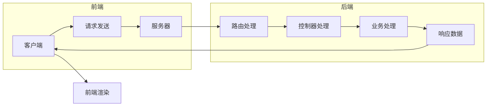
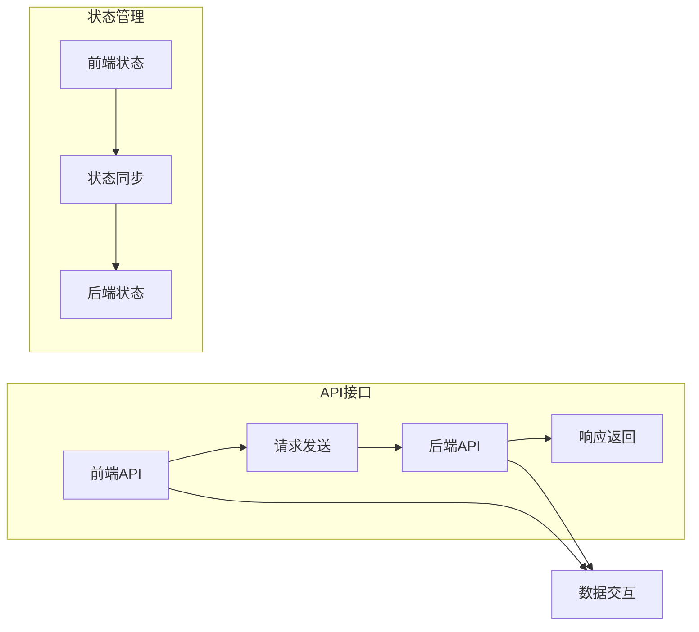
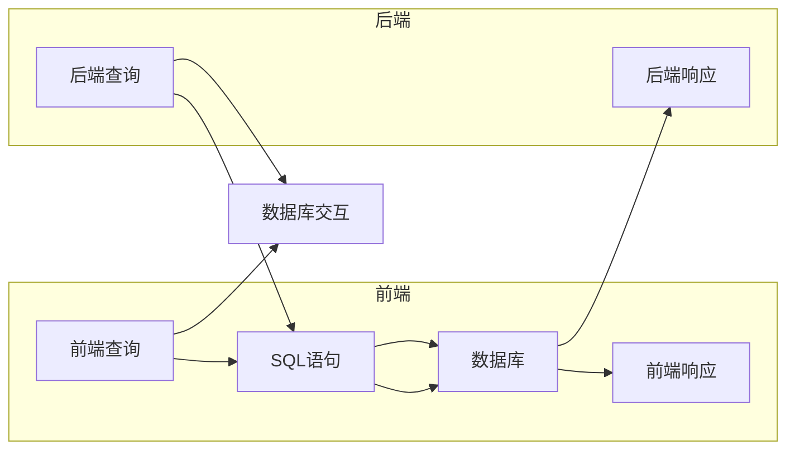

                 

### 从全栈开发到技术架构师的进阶

> **关键词：** 全栈开发、技术架构师、系统架构设计、微服务、性能优化、安全性、团队管理

> **摘要：** 本文旨在为全栈开发者提供进阶路径，从基础技能到高级架构设计，详细阐述从全栈开发者转型为技术架构师的必要步骤和关键技能。文章将涵盖前端与后端开发基础、项目实战、性能优化、安全性策略、架构设计原则、系统架构演进、技术选型与评估、团队管理与领导力等多个方面，帮助读者系统性地提升技术水平和职业素养。

在当今快速变化的技术环境中，全栈开发者的角色变得越来越重要。他们不仅需要掌握前端和后端的开发技能，还需要具备系统架构设计和团队管理的能力。随着项目复杂度的增加，技术架构师的角色应运而生，他们负责设计高性能、高可用性的系统，并确保团队能够高效协作。本文将带领读者了解从全栈开发到技术架构师的进阶之路，涵盖以下几个核心方面：

1. **全栈开发基础**：介绍前端和后端开发的基础知识，包括HTML、CSS、JavaScript、服务器端编程和数据库等。
2. **全栈项目实战**：通过实际项目案例，展示如何将前端与后端技术相结合，进行系统的开发与测试。
3. **性能优化与安全性**：讨论全栈系统在性能和安全性方面的优化策略，以及如何防范常见的安全威胁。
4. **架构设计与演进**：深入探讨软件架构设计的原则和方法，以及如何设计分布式和高可用性的系统。
5. **技术选型与评估**：介绍技术选型的策略和方法，以及如何评估不同技术的优缺点。
6. **团队管理与领导力**：讨论如何提升团队协作效率，培养技术领导力，以及持续学习的重要性。
7. **全栈到技术架构师的转型**：分析转型路径，提供提升技术储备和经验积累的建议。

通过本文的阅读，读者将能够获得从全栈开发者到技术架构师的全面理解和实践指导，为职业生涯的下一阶段做好准备。

---

接下来，我们将逐步深入探讨全栈开发的基础知识，为进阶之路打下坚实的基础。

## 全栈开发基础

### **前端开发基础**

前端开发是全栈开发的重要组成部分，它涉及到用户界面设计和用户体验。前端开发者需要熟练掌握HTML、CSS和JavaScript，并熟悉主流前端框架，如React、Vue和Angular。

**1. HTML（HyperText Markup Language）**

HTML是超文本标记语言，用于创建网页的结构。它定义了网页内容的语义和布局，是前端开发的基础。HTML的核心概念包括：

- **标签（Tags）**：用于定义网页中的元素，如`<h1>`用于标题，`<p>`用于段落。
- **属性（Attributes）**：为HTML元素提供额外的信息，如``。

**2. CSS（Cascading Style Sheets）**

CSS用于定义网页的样式，包括颜色、字体、布局等。它通过选择器来指定样式规则，与HTML标签相结合，实现页面的样式定制。CSS的核心概念包括：

- **选择器（Selectors）**：用于定位HTML元素，如类选择器`.class`和ID选择器`#id`。
- **属性（Properties）**：用于设置元素的样式，如`color`、`font-size`和`margin`。
- **值（Values）**：具体的样式设置，如`color: red`和`font-size: 16px`。

**3. JavaScript**

JavaScript是一种客户端脚本语言，用于实现网页的动态效果和交互功能。它可以在网页中执行各种操作，如数据验证、动态内容加载和用户界面更新。JavaScript的核心概念包括：

- **变量（Variables）**：用于存储数据，如`var x = 10;`。
- **函数（Functions）**：用于封装一段可重用的代码，如`function greet() { alert('Hello!'); }`。
- **对象（Objects）**：用于封装属性和方法，如`var person = { name: 'John', age: 30 };`。
- **事件处理（Event Handling）**：用于响应用户的操作，如点击、提交和键盘事件。

**4. 前端框架**

前端框架如React、Vue和Angular等，提供了丰富的组件库和工具，使前端开发更加高效和模块化。它们的核心特点包括：

- **组件化（Component-Based）**：将页面拆分为可复用的组件，提高代码的可维护性和可扩展性。
- **虚拟DOM（Virtual DOM）**：通过构建虚拟的DOM结构，优化页面渲染性能。
- **状态管理（State Management）**：提供机制来管理应用的状态，确保组件之间的状态一致性。

### **后端开发基础**

后端开发负责处理数据存储、业务逻辑处理和应用程序的交互。后端开发者需要掌握服务器端编程、数据库和服务器架构等相关知识。

**1. 服务器端编程**

服务器端编程涉及编写运行在服务器上的代码，处理客户端的请求，并生成响应。常见的后端编程语言包括Java、Python、JavaScript（Node.js）和PHP等。服务器端编程的核心概念包括：

- **HTTP协议（HTTP Protocol）**：用于客户端和服务器之间的通信，定义请求和响应的格式。
- **路由（Routing）**：将URL映射到特定的处理逻辑，如`/users/login`映射到登录处理函数。
- **控制器（Controller）**：接收HTTP请求，处理业务逻辑，并生成响应。
- **中间件（Middleware）**：用于处理请求和响应的中间层，如身份验证、日志记录和错误处理。

**2. 数据库**

数据库用于存储和管理应用程序的数据。常见的数据库类型包括关系型数据库（如MySQL、PostgreSQL）和NoSQL数据库（如MongoDB、Cassandra）。数据库的核心概念包括：

- **表（Tables）**：用于存储数据，定义列和数据类型。
- **关系（Relations）**：用于关联多个表，实现数据的一致性和完整性。
- **SQL（Structured Query Language）**：用于操作数据库，执行查询、插入、更新和删除操作。
- **索引（Indexes）**：用于优化查询性能，加快数据检索速度。

**3. 服务器架构**

服务器架构涉及部署和管理应用程序的服务器环境。常见的服务器架构包括单体架构、分布式架构和微服务架构。服务器架构的核心概念包括：

- **负载均衡（Load Balancing）**：将请求分配到多个服务器，提高系统的吞吐量和可用性。
- **容错性（Fault Tolerance）**：通过冗余和备份机制，确保系统的持续可用性。
- **监控和日志（Monitoring and Logging）**：监控系统性能和日志记录，快速识别和解决问题。

通过掌握前端和后端开发的基础知识，全栈开发者可以为后续的进阶学习打下坚实的基础。

## 核心概念与联系

在探讨前端和后端开发的基础上，我们需要深入理解它们之间的核心概念和联系，以便更好地掌握全栈开发的整体架构。

### **前端与后端的交互**

前端与后端之间的交互是全栈开发的核心环节，它们通过HTTP协议进行通信。前端发送请求，后端处理请求并返回响应。这一过程可以分为以下几个步骤：

1. **请求发送**：前端通过HTML表单、JavaScript API或其他方式发送请求到服务器。
2. **请求处理**：服务器接收到请求后，由路由器将请求分配到相应的控制器或处理函数。
3. **业务逻辑处理**：后端控制器执行业务逻辑，如数据处理、数据查询等。
4. **响应返回**：处理完毕后，后端将响应数据发送回前端。
5. **前端渲染**：前端接收到响应数据后，将其渲染到页面上，展示给用户。

这一过程可以用如下的Mermaid流程图表示：



### **前端框架与后端框架的集成**

前端框架和后端框架的集成是全栈开发中的重要环节。前端框架如React、Vue和Angular等，提供了丰富的组件和API，使得前端开发更加高效和模块化。后端框架如Django、Express和Spring Boot等，则提供了强大的业务逻辑处理能力和数据库支持。它们的集成过程通常包括以下几个步骤：

1. **API接口设计**：定义前后端交互的API接口，包括URL、请求方式和请求/响应数据格式。
2. **前后端分离**：前端和后端分别开发，通过API接口进行通信。
3. **数据交互**：前端通过HTTP请求与后端进行数据交互，获取和提交数据。
4. **状态管理**：使用前端状态管理工具（如Redux、Vuex）同步前端状态，确保前后端数据的一致性。

以下是一个简单的API接口设计示例：



### **数据库的交互**

数据库在前后端交互中扮演着重要的角色，它存储和管理应用程序的数据。前后端通过SQL或其他数据库API与数据库进行交互。以下是数据库交互的核心概念：

1. **数据查询**：通过SQL语句查询数据库，获取所需的数据。
2. **数据插入/更新/删除**：通过SQL语句插入、更新或删除数据库中的数据。
3. **事务处理**：确保数据操作的原子性和一致性，通过事务管理来处理复杂的业务逻辑。

以下是一个简单的数据库交互示例：



通过上述核心概念和联系，我们可以更深入地理解全栈开发的整体架构，为后续的学习和实践提供指导。

### **核心算法原理讲解**

在开发过程中，算法原理是实现功能的核心。下面我们将通过一个常见的算法——快速排序（Quick Sort），使用伪代码来详细阐述其原理。

**1. 快速排序基本原理**

快速排序是一种基于分治思想的排序算法，其基本思想是选择一个“基准”元素，将数组分为两部分：一部分是小于基准的元素，另一部分是大于基准的元素。然后对这两部分递归地进行快速排序，直至整个数组有序。

**2. 伪代码实现**

```pseudo
快速排序（数组 arr，起始索引 low，结束索引 high）：
    如果 low >= high：
        返回

    交换 arr[low] 和 arr[high] 两个元素（选择 high 作为基准）

    i = low
    j = high - 1
    while true：
        while arr[i] < 基准：
            i++
        while arr[j] > 基准：
            j--
        if i >= j：
            break
        交换 arr[i] 和 arr[j] 两个元素

    交换 arr[low] 和 arr[j] 两个元素

    快速排序（数组 arr，low，j-1）
    快速排序（数组 arr，j+1，high）
```

**3. 详细解释**

- **选择基准元素**：选择数组的最后一个元素作为基准，这样简化了处理边界情况。
- **分区过程**：使用两个指针 i 和 j，i 从左向右移动，寻找大于基准的元素；j 从右向左移动，寻找小于基准的元素。当 i > j 时，分区完成。
- **递归排序**：对分区后的两个子数组分别进行快速排序，直至整个数组有序。

**4. 举例说明**

假设我们有一个未排序的数组：`[32, 45, 28, 12, 9, 101, 7, 55, 19]`，我们使用快速排序对其进行排序。

- **第一次分区**：选择`101`作为基准，交换`101`和`7`，此时数组变为`[32, 45, 28, 12, 9, 7, 55, 19, 101]`。然后对左侧子数组`[32, 45, 28, 12, 9]`和右侧子数组`[55, 19]`分别进行快速排序。
- **第一次递归**：选择`19`作为基准，交换`19`和`55`，此时数组变为`[32, 45, 28, 12, 9, 7, 19, 55, 101]`。然后对左侧子数组`[32, 45, 28, 12, 9]`和右侧子数组`[7]`分别进行快速排序。
- **第二次分区**：选择`12`作为基准，交换`12`和`9`，此时数组变为`[32, 45, 28, 9, 12, 7, 19, 55, 101]`。然后对左侧子数组`[32, 45, 28]`和右侧子数组`[12, 7, 19, 55, 101]`分别进行快速排序。
- **递归排序**：重复上述过程，直至整个数组有序。

最终，数组排序结果为：`[7, 9, 12, 19, 28, 32, 45, 55, 101]`。

通过以上解释，我们可以看到快速排序的执行过程，以及如何通过递归和分治思想实现高效的排序。

### **数学模型和公式**

在软件架构设计中，我们经常需要使用数学模型和公式来评估系统性能和可扩展性。以下是一个常用的性能评估模型——响应时间模型，以及相关的公式和详细讲解。

**1. 响应时间模型**

响应时间（Response Time，RT）是衡量系统性能的重要指标，它表示系统从接收到请求到返回响应所需的时间。响应时间模型通常包括以下几个组成部分：

- **服务时间（Service Time，ST）**：系统处理请求所需的时间，包括计算、数据库访问和网络传输等。
- **等待时间（Waiting Time，WT）**：请求在系统中的等待时间，包括队列等待和服务等待。
- **传输时间（Transmission Time，TT）**：网络传输数据所需的时间，包括往返时间。

响应时间的计算公式为：

\[ RT = ST + WT + TT \]

**2. 相关公式和解释**

- **服务时间（ST）**：服务时间通常与系统的负载和处理能力相关。假设系统的处理能力为 C（单位：请求/秒），服务时间为 ST，则：

\[ ST = \frac{1}{C} \]

- **等待时间（WT）**：等待时间与系统的队列长度和调度策略相关。假设系统中有 N 个请求在队列中等待服务，平均等待时间为 WT，则：

\[ WT = \frac{N}{C} \]

- **传输时间（TT）**：传输时间与网络带宽和数据大小相关。假设网络带宽为 B（单位：字节/秒），数据大小为 D（单位：字节），则：

\[ TT = \frac{D}{B} \]

- **总体响应时间（RT）**：将上述公式代入响应时间模型，得到：

\[ RT = \frac{1}{C} + \frac{N}{C} + \frac{D}{B} \]

**3. 举例说明**

假设我们有一个系统，处理能力为 C = 100 请求/秒，队列中有 N = 10 个请求等待服务，数据大小为 D = 1 MB，网络带宽为 B = 1 Gbps（即 1000 Mbps）。根据上述公式，可以计算出：

- **服务时间（ST）**：\( ST = \frac{1}{100} = 0.01 \)秒
- **等待时间（WT）**：\( WT = \frac{10}{100} = 0.1 \)秒
- **传输时间（TT）**：\( TT = \frac{1 \times 10^6}{10^9} = 0.001 \)秒
- **总体响应时间（RT）**：\( RT = 0.01 + 0.1 + 0.001 = 0.111 \)秒

通过上述计算，我们可以评估系统的性能，并针对性能瓶颈进行优化。

### **项目实战**

在理解了全栈开发的基础知识和核心算法原理后，接下来我们通过一个实际项目——一个简单的博客系统，来展示如何将前端和后端技术相结合，进行系统的开发与测试。

#### **项目需求分析**

该项目的主要需求包括：

1. 用户注册与登录功能。
2. 发布和管理博客文章。
3. 显示博客文章列表和详细内容。
4. 用户评论功能。

#### **前端开发实践**

前端开发主要使用HTML、CSS和JavaScript，以及Vue.js框架来实现。

**1. 开发环境搭建**

- **安装Node.js**：Node.js 是一个基于Chrome V8引擎的JavaScript运行环境，用于构建前端开发环境。
- **安装Vue CLI**：Vue CLI 是一个命令行工具，用于快速搭建Vue.js项目。

```bash
npm install -g @vue/cli
vue create blog-app
cd blog-app
```

**2. 源代码详细实现**

以下是前端项目的部分代码：

**src/App.vue**

```vue
<template>
  <div id="app">
    <nav>
      <ul>
        <li><router-link to="/">首页</router-link></li>
        <li><router-link to="/about">关于</router-link></li>
      </ul>
    </nav>
    <router-view />
  </div>
</template>

<script>
import { RouterLink, RouterView } from "vue-router";

export default {
  name: "App",
};
</script>

<style>
#app {
  font-family: Avenir, Helvetica, Arial, sans-serif;
  -webkit-font-smoothing: antialiased;
  -moz-osx-font-smoothing: grayscale;
  text-align: center;
  color: #2c3e50;
  margin-top: 60px;
}
nav ul {
  list-style-type: none;
  padding: 0;
}
nav ul li {
  display: inline;
  margin-right: 20px;
}
</style>
```

**src/views/Home.vue**

```vue
<template>
  <div>
    <h1>博客首页</h1>
    <ul>
      <li v-for="post in posts" :key="post.id">
        <router-link :to="{ name: 'Post', params: { id: post.id } }">{{ post.title }}</router-link>
      </li>
    </ul>
  </div>
</template>

<script>
import axios from "axios";

export default {
  name: "Home",
  data() {
    return {
      posts: [],
    };
  },
  created() {
    this.fetchPosts();
  },
  methods: {
    fetchPosts() {
      axios.get("/api/posts").then((response) => {
        this.posts = response.data;
      });
    },
  },
};
</script>
```

**3. 代码解读与分析**

- **导航栏**：使用Vue Router实现导航功能，用户可以通过导航栏访问首页和关于页面。
- **首页**：通过Axios库与后端API进行数据交互，获取博客文章列表，并在页面上进行渲染。

#### **后端开发实践**

后端开发使用Node.js和Express框架，配合MongoDB数据库来处理业务逻辑。

**1. 开发环境搭建**

- **安装Node.js**：确保安装了Node.js和npm。
- **安装Express**：通过npm安装Express框架和相关依赖。

```bash
npm install express
npm install mongoose
npm install body-parser
```

**2. 源代码详细实现**

**server.js**

```javascript
const express = require("express");
const bodyParser = require("body-parser");
const mongoose = require("mongoose");

const app = express();

app.use(bodyParser.json());

// 连接MongoDB数据库
mongoose.connect("mongodb://localhost:27017/blog", {
  useNewUrlParser: true,
  useUnifiedTopology: true,
});

// 创建Post模型
const Post = mongoose.model("Post", new mongoose.Schema({
  title: String,
  content: String,
  author: String,
}));

// 获取博客文章列表
app.get("/api/posts", async (req, res) => {
  try {
    const posts = await Post.find({});
    res.send(posts);
  } catch (error) {
    res.status(500).send(error);
  }
});

// 添加博客文章
app.post("/api/posts", async (req, res) => {
  try {
    const post = new Post(req.body);
    await post.save();
    res.status(201).send(post);
  } catch (error) {
    res.status(400).send(error);
  }
});

const port = process.env.PORT || 3000;
app.listen(port, () => {
  console.log(`Server listening on port ${port}`);
});
```

**3. 代码解读与分析**

- **数据库连接**：使用Mongoose库连接MongoDB数据库。
- **Post模型**：定义了博客文章的属性，如标题、内容和作者。
- **API接口**：提供了获取博客文章列表和添加博客文章的接口。

#### **前后端联调与测试**

在开发过程中，前后端需要进行联调以确保数据的一致性和功能完整性。以下是前后端联调的步骤：

1. **前后端接口测试**：使用Postman等工具测试前后端API接口，确保接口返回正确的数据和状态码。
2. **集成测试**：将前后端代码部署到服务器，进行集成测试，确保整个系统正常运行。
3. **单元测试**：编写单元测试用例，对前后端的代码进行测试，确保每个功能模块正常工作。

通过上述项目实战，我们可以看到如何将前端和后端技术相结合，实现一个简单的博客系统。这个过程不仅帮助我们巩固了全栈开发的基础知识，也为实际项目的开发提供了实践经验。

### **全栈开发工具与生态**

全栈开发不仅需要掌握前端和后端技术，还需要熟悉一系列开发工具和生态。这些工具和生态为开发者提供了高效的开发体验和丰富的功能支持。以下是一些常用的全栈开发工具与生态：

#### **开发工具**

1. **集成开发环境（IDE）**
   - **Visual Studio Code**：一款轻量级但功能强大的文本编辑器，支持多种编程语言，拥有丰富的插件生态系统。
   - **WebStorm**：由JetBrains开发的IDE，专为Web开发设计，支持JavaScript、TypeScript、HTML和CSS。

2. **代码版本控制系统（CVS）**
   - **Git**：分布式版本控制系统，广泛用于开源项目，支持分支管理、协同工作和代码审查。
   - **GitHub**：基于Git的代码托管平台，提供代码仓库、项目管理、协作工具和自动化流程。

3. **包管理器**
   - **npm**：Node.js的包管理器，用于管理前端和后端的依赖包，支持模块化和组件化开发。
   - **yarn**：另一种流行的包管理器，提供快速、可靠和一致的依赖管理。

4. **前端构建工具**
   - **Webpack**：模块打包器，用于将多个模块文件打包成一个或多个bundle文件，优化资源加载和性能。
   - **Parcel**：零配置的Web应用打包工具，支持现代JavaScript、TypeScript、CSS和更多。

5. **代码编辑工具**
   - **VS Code**：提供代码格式化、语法高亮、代码补全等常用功能。
   - **Sublime Text**：一款轻量级的文本编辑器，支持多种编程语言和插件。

#### **生态系统**

1. **前端框架**
   - **React**：由Facebook推出的声明式、高效的前端库，支持虚拟DOM和组件化开发。
   - **Vue.js**：渐进式JavaScript框架，用于构建用户界面，支持数据绑定和组件化。
   - **Angular**：由Google开发的框架，用于构建复杂的前端应用程序，支持双向数据绑定和依赖注入。

2. **后端框架**
   - **Express.js**：流行的Node.js Web应用框架，提供路由、中间件、错误处理等核心功能。
   - **Django**：Python的快速开发框架，采用MVC模式，支持ORM和自动化管理。
   - **Spring Boot**：Java的快速开发框架，用于构建独立的、可扩展和生产的Spring应用。

3. **数据库**
   - **关系型数据库（RDBMS）**
     - **MySQL**：开源的关系型数据库，广泛应用于Web应用程序。
     - **PostgreSQL**：功能强大的开源关系型数据库，支持复杂查询和扩展。
   - **NoSQL数据库**
     - **MongoDB**：文档型数据库，提供灵活的数据结构和高扩展性。
     - **Cassandra**：分布式键值存储数据库，适用于大规模数据存储和读取。

4. **云服务**
   - **AWS**：亚马逊提供的云计算服务，包括EC2、S3、RDS等，支持部署、存储和管理应用程序。
   - **Azure**：微软的云计算服务，提供与AWS类似的服务，支持开发、部署和管理应用程序。
   - **Google Cloud**：谷歌的云计算平台，包括计算、存储、数据库和其他服务。

5. **容器化与微服务**
   - **Docker**：容器化平台，用于打包、交付和运行应用程序。
   - **Kubernetes**：容器编排平台，用于自动化部署、扩展和管理容器化应用程序。

通过掌握这些开发工具和生态，全栈开发者可以更高效地完成项目开发，并确保系统的可维护性和扩展性。

### **全栈性能优化**

在开发全栈应用程序时，性能优化是一个关键环节。一个高效的全栈系统不仅能提升用户体验，还能降低资源消耗和运营成本。下面，我们将详细探讨全栈系统在性能优化方面的几个重要方面。

#### **前端性能优化**

前端性能优化主要关注页面加载速度、交互流畅性和响应时间。以下是几种常见的前端性能优化策略：

1. **代码分割与懒加载**：
   - **代码分割（Code Splitting）**：将代码拆分为多个小块，按需加载，减少初始加载时间。
   - **懒加载（Lazy Loading）**：延迟加载不立即显示的资源，如图片、视频和外部脚本。

2. **资源压缩与缓存**：
   - **压缩（Compression）**：使用Gzip或其他压缩算法减小文件体积，减少数据传输时间。
   - **缓存（Caching）**：利用浏览器和服务器端的缓存策略，减少重复请求。

3. **减少重绘与回流**：
   - **避免频繁的重绘与回流**：减少DOM操作和样式改变，优化CSS和布局。

4. **使用内容分发网络（CDN）**：
   - **CDN**：通过分布式服务器加速静态资源的加载，减少延迟。

5. **优化图片和视频**：
   - **使用适当格式的图片和视频**：如WebP、AVIF等，减小文件大小。
   - **懒加载和预加载**：延迟加载图片和视频，并在用户访问时预加载。

#### **后端性能优化**

后端性能优化主要关注数据处理速度、数据库访问效率和系统稳定性。以下是几种常见的后端性能优化策略：

1. **数据库优化**：
   - **索引优化**：为常用查询创建索引，提高查询效率。
   - **查询优化**：编写高效、简洁的SQL查询，避免子查询和复杂的联结。
   - **缓存**：使用缓存技术，如Redis或Memcached，减少数据库访问次数。

2. **代码优化**：
   - **减少无谓的计算**：避免冗余的计算和逻辑，优化代码结构。
   - **批量处理**：批量操作数据库和外部服务，减少请求次数和响应时间。

3. **并发处理**：
   - **异步处理**：使用异步编程模型，避免阻塞线程。
   - **线程池**：使用线程池管理并发处理，提高系统吞吐量。

4. **负载均衡**：
   - **负载均衡器**：使用Nginx或HAProxy等负载均衡器，分发请求到多个服务器。
   - **弹性伸缩**：根据负载自动扩展或缩小服务器资源。

5. **监控与调优**：
   - **性能监控**：使用工具如New Relic、AppDynamics进行性能监控。
   - **日志分析**：分析日志数据，找出性能瓶颈和潜在问题。

#### **全栈系统性能优化**

全栈系统的性能优化需要综合考虑前端和后端的性能，以下是一些建议：

1. **服务拆分与微服务架构**：
   - **拆分服务**：将单体应用拆分为多个独立的微服务，降低系统的耦合度和复杂度。
   - **微服务架构**：使用微服务架构，实现服务的独立部署、扩展和监控。

2. **API设计**：
   - **RESTful API**：使用RESTful API设计原则，提供简洁、一致的接口。
   - **GraphQL**：使用GraphQL查询语言，实现灵活、高效的API交互。

3. **持续集成与持续部署（CI/CD）**：
   - **自动化测试**：编写自动化测试用例，确保代码质量和功能完整性。
   - **自动化部署**：实现自动化构建、测试和部署，提高发布效率。

4. **性能测试**：
   - **负载测试**：模拟高并发访问，评估系统的负载能力和性能瓶颈。
   - **压力测试**：在极端条件下测试系统的稳定性和响应能力。

通过以上策略，我们可以显著提升全栈系统的性能，为用户提供更流畅、快速的体验。

### **全栈开发中的安全性**

在开发全栈应用程序时，安全性是一个不可忽视的重要方面。安全漏洞不仅可能导致数据泄露、系统崩溃，还可能影响用户的信任和企业的声誉。本文将详细探讨全栈开发中的安全性问题，包括前端和后端的安全性策略，以及如何防范常见的安全威胁。

#### **前端安全性**

前端安全性主要涉及客户端的安全性，包括防止常见的前端攻击，如跨站脚本攻击（XSS）和跨站请求伪造（CSRF）。

1. **防范XSS攻击**

XSS攻击是一种通过注入恶意脚本，盗取用户数据的攻击方式。以下是一些防范XSS攻击的策略：

- **内容安全策略（CSP）**：使用内容安全策略限制网页可以加载和执行的资源，从而防止恶意脚本注入。
- **转义输出**：确保所有用户输入在输出到页面时都进行转义，防止恶意脚本被解析执行。
- **验证输入**：在服务器端验证用户输入，确保输入符合预期格式。

2. **防范CSRF攻击**

CSRF攻击是通过利用用户的认证会话，执行未授权的操作。以下是一些防范CSRF攻击的策略：

- **令牌机制**：在每次提交表单或执行敏感操作时，生成一个随机令牌，并与表单或URL绑定。服务器验证令牌的有效性，确保操作的真实性。
- **验证Referer**：检查HTTP请求的Referer头信息，确保请求来自同一域。

3. **HTTPS使用**

使用HTTPS协议可以加密客户端和服务器之间的通信，防止数据在传输过程中被窃听和篡改。确保网站配置SSL证书，并强制使用HTTPS。

#### **后端安全性**

后端安全性主要涉及服务器端的安全性，包括数据库保护、用户认证和授权等方面。

1. **数据库保护**

- **加密存储**：对敏感数据（如密码、信用卡信息等）进行加密存储，防止数据泄露。
- **访问控制**：设置数据库访问权限，确保只有授权用户可以访问和操作数据库。
- **SQL注入防护**：使用参数化查询和预编译语句，防止SQL注入攻击。

2. **用户认证和授权**

- **密码加密**：使用强加密算法（如bcrypt）存储用户密码，防止密码泄露。
- **多因素认证**：使用多因素认证（如短信验证码、电子邮件验证等）提高用户账号的安全性。
- **权限控制**：根据用户的角色和权限，限制对系统和数据的访问和操作。

3. **日志和审计**

- **日志记录**：记录系统的操作日志，包括登录、操作记录等，用于安全监控和事件追踪。
- **审计策略**：制定审计策略，定期检查系统日志，发现潜在的安全问题。

#### **整体安全性策略**

为了确保全栈应用程序的安全性，需要采取一系列整体性的安全策略：

1. **安全开发实践**：在整个开发周期中，融入安全性的考虑，从设计、编码到测试，都遵循安全最佳实践。

2. **安全培训和教育**：对开发人员和运维人员进行安全培训，提高安全意识和技能。

3. **安全测试和审核**：定期进行安全测试，如渗透测试、代码审计等，发现和修复安全漏洞。

4. **应急响应计划**：制定应急响应计划，确保在发生安全事件时能够快速响应和处置。

通过上述策略，我们可以构建一个安全可靠的全栈应用程序，保障用户数据和系统的安全。

### **架构设计原则**

在软件开发中，架构设计是确保系统高质量、高效率和可维护性的关键环节。一个良好的架构设计不仅能够满足当前的需求，还能够适应未来的变化和扩展。本文将深入探讨软件架构设计的原则和方法，以及如何设计分布式和高可用性的系统。

#### **软件架构设计原则**

1. **模块化（Modularity）**：将系统划分为多个功能模块，每个模块负责特定的功能，模块之间通过接口进行通信。模块化可以提高代码的可维护性和可扩展性。

2. **抽象（Abstraction）**：通过抽象将系统的复杂性隐藏在接口后面，只暴露必要的信息和功能。抽象使得系统更易于理解和扩展。

3. **解耦（Decoupling）**：减少模块之间的直接依赖，提高系统的灵活性和可替换性。解耦可以通过使用设计模式、接口和中间件来实现。

4. **复用性（Reusability）**：设计可复用的组件和模块，减少重复工作，提高开发效率。复用可以通过编写通用和灵活的代码实现。

5. **可扩展性（Scalability）**：系统应该能够根据需求进行扩展，增加或减少资源，以满足不断增长的用户数量和业务需求。扩展性可以通过模块化、分布式架构和水平扩展来实现。

6. **可维护性（Maintainability）**：设计易于理解和修改的代码，降低维护成本。可维护性可以通过良好的命名规范、注释和文档来实现。

7. **安全性（Security）**：确保系统在设计和实现过程中具备足够的安全性，防范各种攻击和漏洞。安全性可以通过加密、认证和访问控制等手段来实现。

#### **分布式系统设计**

分布式系统设计是现代软件架构的核心之一，它涉及如何在多个节点上部署和协调系统组件。以下是分布式系统设计的关键方法：

1. **去中心化（Decentralization）**：避免单点故障和集中式控制，将系统的控制和数据分散到多个节点上。

2. **冗余（Redundancy）**：通过冗余部署和备份，确保系统的高可用性。冗余可以通过副本、镜像和负载均衡来实现。

3. **一致性（Consistency）**：确保分布式系统中的数据一致性。一致性可以通过强一致性、最终一致性或读一致性来实现。

4. **可用性（Availability）**：确保系统在故障时能够继续提供服务。可用性可以通过冗余、故障转移和自恢复机制来实现。

5. **分区（Partitioning）**：将系统划分为多个分区，每个分区可以独立运行和扩展。分区可以通过分片、拓扑结构和管理策略来实现。

6. **容错性（Fault Tolerance）**：确保系统能够在部分节点失效时继续运行。容错性可以通过冗余、故障检测和自修复机制来实现。

#### **高可用性系统设计**

高可用性系统设计的目标是确保系统在任何情况下都能够持续提供服务。以下是高可用性系统设计的关键方法：

1. **负载均衡（Load Balancing）**：将请求均匀分配到多个节点上，避免单点过载。负载均衡可以通过软件负载均衡器（如Nginx、HAProxy）或硬件负载均衡器来实现。

2. **故障转移（Failover）**：在主节点故障时，自动将服务切换到备用节点。故障转移可以通过冗余部署和自动化脚本来实现。

3. **自恢复（Self-Healing）**：在检测到故障时，自动进行修复和恢复，确保系统持续运行。自恢复可以通过监控工具和自动化脚本来实现。

4. **数据备份与恢复（Data Backup and Recovery）**：定期备份系统数据，并在数据丢失或损坏时进行恢复。数据备份可以通过本地备份和云备份来实现。

5. **监控与告警（Monitoring and Alerting）**：实时监控系统性能和状态，并在发生问题时发出告警。监控可以通过Prometheus、Grafana等工具来实现。

通过遵循上述架构设计原则和方法，我们可以设计出高性能、高可用性和高可扩展性的系统，满足现代互联网应用的需求。

### **系统架构演进**

在软件开发过程中，系统架构的演进是一个持续迭代的过程。从单体架构到分布式架构，再到微服务架构，每一种架构模式都有其适用的场景和优缺点。本文将详细探讨系统架构的演进过程，并分析不同架构模式的设计原则和实施方法。

#### **单体架构**

单体架构（Monolithic Architecture）是最传统的架构模式，它将应用程序的所有组件（包括前端、后端、数据库等）集成在一个单一的应用程序中。单体架构的优点包括开发简单、部署便捷和系统整体性高。然而，随着项目的规模和复杂性增加，单体架构的缺点也逐渐显现：

1. **开发难度增加**：单体架构导致代码库巨大，模块之间的依赖复杂，增加了开发和维护的难度。
2. **扩展性差**：当某个模块需要扩展时，整个系统都需要重新部署，扩展性较差。
3. **维护成本高**：随着项目规模的扩大，单体架构的系统维护成本也随之增加。

为了解决这些问题，开发者开始探索分布式架构。

#### **分布式架构**

分布式架构（Distributed Architecture）通过将应用程序分解为多个独立的子系统，每个子系统负责不同的功能模块。分布式架构的设计原则包括模块化、去中心化和高可用性。以下是分布式架构的一些优点：

1. **扩展性好**：分布式架构支持水平扩展，通过增加节点数量来提高系统的处理能力。
2. **部署灵活**：每个子系统可以独立部署和升级，减少系统停机时间。
3. **容错性高**：分布式架构可以通过冗余部署和故障转移来提高系统的容错性。

然而，分布式架构也带来了一些新的挑战，如数据一致性和系统通信的复杂性。

#### **微服务架构**

微服务架构（Microservices Architecture）是在分布式架构的基础上进一步发展而来的。微服务架构将应用程序划分为多个独立的微服务，每个微服务负责实现特定的业务功能。以下是微服务架构的一些优点：

1. **松耦合**：微服务之间通过轻量级的通信协议（如RESTful API、消息队列）进行通信，降低模块之间的依赖。
2. **独立部署**：每个微服务可以独立开发和部署，提高了系统的灵活性和可维护性。
3. **易于扩展**：可以根据业务需求单独扩展特定的微服务，而不会影响其他微服务。

微服务架构的优点在于其灵活性和可扩展性，但同时也带来了以下挑战：

1. **复杂性增加**：随着服务数量的增加，系统的管理和维护复杂性也相应增加。
2. **数据一致性**：微服务之间的数据一致性管理变得更加复杂，需要设计合适的数据同步和一致性方案。
3. **服务发现和通信**：微服务之间的通信和服务发现需要额外的基础设施支持。

#### **架构演进路径**

从单体架构到分布式架构，再到微服务架构，系统的架构演进路径可以分为以下几个阶段：

1. **模块化重构**：将单体架构中的大型模块重构为独立的组件，提高代码的可维护性。
2. **分布式服务化**：将单体架构中的组件分解为独立的分布式服务，提高系统的扩展性和容错性。
3. **微服务化**：将分布式服务进一步细化为独立的微服务，实现系统的灵活和模块化。

在架构演进过程中，需要根据项目的具体需求和规模，选择合适的架构模式。同时，还需要关注系统的复杂性，确保架构演进不会导致系统的不可维护性。

通过理解系统架构的演进过程，开发者可以更好地选择和设计合适的架构模式，为项目的长期成功奠定基础。

### **技术选型与评估**

在软件开发过程中，技术选型是决定项目成功与否的关键环节之一。正确的技术选型可以提高开发效率、确保系统性能和降低维护成本。本文将详细探讨技术选型的策略和方法，以及如何评估不同技术的优缺点。

#### **技术选型的策略**

1. **明确需求和目标**：在开始技术选型之前，首先要明确项目的需求和目标。这包括功能需求、性能要求、可扩展性和维护成本等方面。明确的需求有助于缩小技术选择的范围。

2. **评估技术成熟度**：选择成熟的技术可以降低开发风险和运维成本。需要评估所选技术的成熟度，包括社区的活跃度、文档的完整性、错误修复速度等。

3. **技术栈的一致性**：选择与现有技术栈兼容的技术，以减少集成和迁移的难度。这包括语言、框架、数据库和中间件等方面。

4. **性能和可扩展性**：根据项目的需求，评估不同技术的性能和可扩展性。例如，在高并发场景下，需要选择具有高吞吐量的技术。

5. **安全性和可靠性**：安全性是技术选型的重要考虑因素。需要评估所选技术的安全性和可靠性，包括漏洞修复速度、数据保护机制和容错能力。

6. **成本效益**：评估不同技术的成本效益，包括开发成本、运维成本和长期维护成本。需要综合考虑技术成本和项目预算。

#### **评估方法**

1. **比较分析**：通过比较不同技术的特点、性能和优缺点，进行定性或定量的评估。可以制作评估表格或评分系统，帮助决策者进行客观评估。

2. **原型开发**：在早期阶段，可以通过快速原型开发来验证技术选型的可行性。原型开发可以帮助团队了解技术的实际使用效果，发现潜在的问题。

3. **社区反馈**：参考社区和用户的反馈，了解技术的实际应用情况和问题。社区活跃度和用户反馈可以帮助评估技术的成熟度和可靠性。

4. **性能测试**：进行性能测试，评估不同技术在负载和并发场景下的表现。性能测试可以提供客观的数据支持，帮助做出决策。

5. **成本效益分析**：通过成本效益分析，评估不同技术的长期维护成本和ROI（投资回报率）。成本效益分析可以帮助团队在预算范围内做出最佳选择。

#### **技术评估案例**

以选择数据库技术为例，以下是几种常见数据库技术的评估：

1. **关系型数据库（RDBMS）**：
   - **MySQL**：成熟、性能稳定，适合读密集型应用。
   - **PostgreSQL**：功能丰富，支持复杂查询和扩展，适合复杂业务场景。
   - **SQLite**：轻量级、易于部署，适合小型项目和嵌入式应用。

2. **NoSQL数据库**：
   - **MongoDB**：灵活的文档存储，适合高扩展性和快速迭代的项目。
   - **Cassandra**：分布式键值存储，适合大规模数据存储和读取。
   - **Redis**：高性能的内存数据库，适合缓存和实时应用。

通过对比分析、原型开发和性能测试，团队可以选择最适合项目需求的数据库技术。例如，对于需要高扩展性和快速迭代的项目，MongoDB可能是一个较好的选择。

通过以上策略和方法，开发者可以系统地进行技术选型，确保选择最适合项目需求的技术，提高开发效率和系统质量。

### **技术团队管理与领导力**

在技术领域，团队管理和领导力是技术架构师不可或缺的技能。一个高效的技术团队不仅能够快速响应市场变化，还能够持续提升项目的质量和效率。本文将探讨技术团队管理的原则、如何培养技术领导力，以及持续学习的重要性。

#### **团队协作与管理**

1. **明确目标与责任**：确保团队成员明确项目的目标和各自的责任。通过设定清晰的目标和里程碑，可以增强团队的凝聚力，提高工作效率。

2. **分工与协作**：根据团队成员的技能和专长进行合理的分工，确保每个成员都能发挥自己的优势。同时，鼓励团队成员之间的协作，通过代码审查、代码共享和团队会议，促进知识的传递和团队的协同工作。

3. **沟通与反馈**：建立有效的沟通机制，确保团队成员之间能够顺畅地交流。定期的团队会议、一对一会议和实时沟通工具（如Slack、Microsoft Teams）都是有效的沟通方式。及时给予反馈，帮助团队成员了解项目进展和改进方向。

4. **工作环境与工具**：提供良好的工作环境和必要的工具，如高效的代码编辑器、版本控制系统、自动化构建和测试工具等，以提高开发效率。

5. **激励机制**：设立合理的激励机制，如项目奖金、晋升机会和荣誉表彰等，鼓励团队成员积极投入工作，提高团队士气。

#### **技术领导力培养**

1. **技术视野**：技术领导者需要具备广泛的技术视野，了解当前技术趋势和发展方向。通过阅读技术书籍、参加技术会议和研讨会，保持对新技术的好奇心和探索精神。

2. **团队协作能力**：技术领导者需要具备出色的团队协作能力，能够带领团队共同解决问题，实现项目目标。这包括解决团队内部的矛盾、促进团队成员之间的协作，以及为团队成员提供成长和发展的机会。

3. **决策能力**：技术领导者需要具备快速做出决策的能力，尤其是在面临紧急情况或技术选择时。决策能力包括对技术方案的分析、风险评估和执行策略的制定。

4. **沟通能力**：技术领导者需要具备出色的沟通能力，能够清晰地传达技术目标和期望，解释技术方案和决策的理由，以及处理团队内外部的沟通问题。

5. **领导风格**：技术领导者需要具备适合团队风格的领导风格。这可能包括民主型领导、参与型领导或教练型领导，根据团队的需求和情况选择合适的领导风格。

#### **持续学习的重要性**

1. **技术更新**：技术领域发展迅速，技术架构师需要不断学习新的技术和工具，以适应不断变化的市场需求。通过在线课程、技术博客和开源项目，可以了解最新的技术趋势和最佳实践。

2. **软技能提升**：除了技术技能外，软技能如沟通、团队合作、时间管理和领导力等也是技术架构师成功的关键。通过参加培训、研讨会和实践，可以提升这些软技能。

3. **实践经验**：实际项目经验是提升技术水平和领导力的关键。通过参与实际项目，可以锻炼解决问题的能力，积累项目管理的经验，提升领导力。

4. **反思与总结**：定期反思和总结自己的工作，识别成功和失败的原因，从中学习和成长。反思可以帮助技术架构师不断提高自己的能力和水平。

通过有效的团队管理和领导力培养，技术架构师可以带领团队实现技术目标，推动项目的成功，并确保团队的长期发展和成长。

### **全栈到技术架构师的转型**

从全栈开发者转型为技术架构师是一个重要的职业发展路径。这个过程中，不仅需要提升技术水平，还需要积累丰富的实践经验。以下是一些关键的转型步骤和提升技术储备的方法。

#### **转型路径分析**

1. **深入理解核心技术**：首先，要深入掌握前端和后端的核心技术，包括Web开发框架、数据库管理、服务器架构等。这为后续的架构设计提供了坚实的基础。

2. **学习系统架构设计**：了解不同类型的架构模式，如单体架构、分布式架构和微服务架构。学习系统设计原则，包括模块化、解耦、可扩展性和高可用性等。

3. **参与大型项目**：参与复杂、大型项目可以帮助积累宝贵的实践经验。在项目中，可以了解系统设计、部署、性能优化和安全性等方面的实际操作。

4. **培养领导力**：技术架构师需要具备领导力，包括团队管理、决策能力和沟通能力。可以通过参与团队建设、担任项目负责人等方式，提升领导力。

5. **持续学习**：技术架构师需要持续学习，关注最新的技术趋势和最佳实践。通过阅读技术书籍、参加研讨会和培训课程，不断更新自己的知识体系。

#### **提升技术储备**

1. **掌握多种编程语言**：学习多种编程语言，如Java、Python、JavaScript等，可以提高编程能力和解决问题的多样性。

2. **熟悉云计算和容器技术**：云计算和容器技术是现代架构设计的重要工具。了解AWS、Azure、Docker和Kubernetes等，有助于设计和管理大型分布式系统。

3. **深入了解数据库技术**：学习关系型数据库（如MySQL、PostgreSQL）和NoSQL数据库（如MongoDB、Cassandra），了解不同数据库的优缺点，以便根据项目需求选择合适的数据库。

4. **掌握性能优化和监控技术**：学习性能优化方法，如缓存、负载均衡和数据库索引优化。掌握监控工具，如Prometheus、Grafana等，可以实时监控系统的性能和健康状况。

5. **实践项目经验**：通过实际项目，积累系统设计和优化的经验。可以参与开源项目，或者在自己的公司项目中承担更多的责任，逐步提升技术水平。

通过上述步骤和方法，全栈开发者可以逐步转型为技术架构师，为职业生涯的下一阶段做好准备。转型过程中，持续学习和实践经验是关键，只有不断积累，才能在技术架构领域取得更大的成就。

### **附录**

#### **参考书籍与资料**

1. **《软件架构设计：定义和实施》** - Paul Clements, Randy Connors
   - 内容详实，全面介绍了软件架构设计的原则和方法。

2. **《大话数据结构》** - 刘未鹏
   - 通过通俗易懂的语言，讲解了数据结构的基础知识和应用。

3. **《深入理解计算机系统》** - Randal E. Bryant, David R. O’Hallaron
   - 深入讲解了计算机系统的工作原理，有助于理解系统架构。

4. **《微服务设计》** - Sam Newman
   - 介绍了微服务架构的设计原则和实践，是微服务领域的经典之作。

5. **《全栈开发实战》** - 李兵
   - 提供了丰富的全栈开发案例，覆盖了前端和后端的实际开发过程。

#### **在线资源**

1. **GitHub**
   - https://github.com/
   - GitHub是开源代码托管平台，提供了丰富的开源项目和工具。

2. **Stack Overflow**
   - https://stackoverflow.com/
   - Stack Overflow是全球最大的开发者问答社区，可以帮助解决编程问题。

3. **GitHub Wiki**
   - https://github.com/github/wiki
   - GitHub Wiki提供了关于GitHub使用方法和最佳实践的详细文档。

4. **MDN Web Docs**
   - https://developer.mozilla.org/
   - MDN Web Docs是Web开发领域的权威文档，涵盖了HTML、CSS和JavaScript等方面的内容。

5. **Kubernetes Documentation**
   - https://kubernetes.io/docs/
   - Kubernetes官方文档，提供了关于容器编排的详细指南。

通过参考书籍和在线资源，开发者可以进一步深化对全栈开发和技术架构设计的理解，为职业生涯的发展提供支持。

### **全栈开发与架构设计流程图**

为了更好地理解和应用全栈开发与架构设计的流程，我们提供了以下流程图。这些图展示了从需求分析到系统部署的各个关键步骤，以及各个环节之间的相互关系。

#### **全栈开发流程**

```mermaid
flowchart LR
    subgraph 需求分析
        需求分析[需求分析]
        需求分析 --> 功能设计
    end

    subgraph 技术选型
        技术选型[技术选型]
        技术选型 --> 开发环境搭建
    end

    subgraph 开发与测试
        开发与测试[开发与测试]
        开发与测试 --> 单元测试
        开发与测试 --> 集成测试
    end

    subgraph 部署与运维
        部署与运维[部署与运维]
        部署与运维 --> 系统部署
        部署与运维 --> 性能优化
        部署与运维 --> 安全性测试
    end

    需求分析 --> 技术选型
    技术选型 --> 开发与测试
    开发与测试 --> 部署与运维
```

#### **架构设计流程**

```mermaid
flowchart LR
    subgraph 需求分析
        需求分析[需求分析]
        需求分析 --> 业务模型
    end

    subgraph 系统架构设计
        系统架构设计[系统架构设计]
        系统架构设计 --> 数据模型设计
        系统架构设计 --> 服务拆分
        系统架构设计 --> 技术选型
    end

    subgraph 部署与运维
        部署与运维[部署与运维]
        部署与运维 --> 系统部署
        部署与运维 --> 监控与日志
    end

    subgraph 持续集成与交付
        持续集成与交付[持续集成与交付]
        持续集成与交付 --> 自动化测试
        持续集成与交付 --> 持续交付
    end

    需求分析 --> 系统架构设计
    系统架构设计 --> 部署与运维
    部署与运维 --> 持续集成与交付
```

通过这些流程图，开发者可以系统地了解从需求分析到系统部署的各个环节，确保项目的顺利进行。同时，这些流程图也为架构设计提供了清晰的指导，帮助开发者构建高效、可扩展的系统架构。

