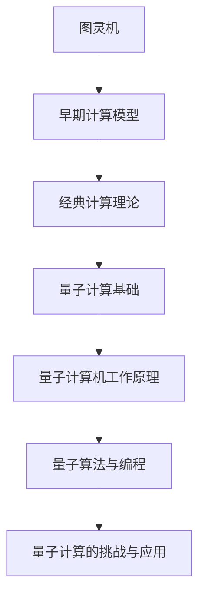

                 

# 从图灵机到量子计算：拓展世界可计算性的理论边界

## 关键词：
- 图灵机
- 经典计算理论
- 量子力学
- 量子计算
- 可计算性边界
- 量子比特
- 量子算法
- 量子编程

## 摘要：
本文旨在探讨计算理论的演变历程，从图灵机的起源出发，逐步深入经典计算理论的局限性，并最终引入量子计算，探讨其对可计算性边界的拓展。文章将通过详细的章节结构，逐一阐述量子计算的基础、工作原理、算法以及面临的挑战和应用前景。本文旨在为读者提供一个全面且系统的量子计算理论学习与实践指南，帮助读者理解从经典计算到量子计算的转变，及其对信息科学和计算机技术的深远影响。

## 第1章：引言与概述

### 1.1 《从图灵机到量子计算：拓展世界可计算性的理论边界》概述

**核心主题**：本书将从图灵机的起源出发，探讨现代计算理论的演变，以及量子计算如何拓展了可计算性的边界。

**目的**：帮助读者理解从经典计算到量子计算的转变，及其对信息科学和计算机技术的深远影响。

**结构**：
- **第1章**：引言与概述，介绍书的核心主题和研究背景。
- **第2章**：图灵机的原理与早期计算模型，详细阐述图灵机的运作机制和早期计算模型的发展。
- **第3章**：经典计算理论的拓展，探讨图灵机理论的局限性，及其对现代计算理论的影响。
- **第4章**：量子计算基础，介绍量子力学的基本概念和量子计算的基本原理。
- **第5章**：量子计算机的工作原理，详细解释量子比特、量子门、量子纠缠等核心概念。
- **第6章**：量子算法与量子编程，探讨量子算法的优势，以及量子编程语言和工具。
- **第7章**：量子计算的挑战与应用前景，分析量子计算的现有挑战，以及其在各个领域的潜在应用。

### 1.2 核心概念与联系

**Mermaid 流程图**：

### 1.3 本书的重要性

**理论意义**：从图灵机到量子计算的研究，不仅丰富了计算理论，也为未来计算技术的发展提供了新思路。

**实际应用**：量子计算在密码学、模拟、优化等领域具有巨大潜力，对信息技术的发展具有重要影响。

**目标读者**：本书适合对计算机科学和量子计算感兴趣的本科生、研究生，以及相关领域的研究人员和开发者。

### 第2章：图灵机的原理与早期计算模型

## 2.1 图灵机的定义与基本结构

### 2.1.1 图灵机的定义

图灵机是由英国数学家艾伦·图灵于1936年提出的抽象计算模型，它为计算理论奠定了基础。图灵机是一种抽象的计算机，其核心思想是通过一个无限长的带子来进行数据读写操作。

### 2.1.2 图灵机的组成部分

图灵机由以下几个部分组成：

1. **带子（Tape）**：图灵机的带子是一个无限长的序列，由一系列的单元格组成，每个单元格可以存储一个符号。
2. **读写头（Read-Write Head）**：读写头位于带子上的某个单元格，可以读取和写入符号，并沿着带子移动。
3. **状态寄存器（State Register）**：状态寄存器存储图灵机的当前状态，用来指导读写头进行下一步操作。
4. **控制器（Controller）**：控制器根据当前状态和读写头读取的符号，决定下一步的操作，包括状态转换、读写操作和移动方向。

### 2.1.3 图灵机的运作机制

图灵机的运作机制可以通过一个状态转换表（State Transition Table）来描述。状态转换表记录了在特定状态下，读取到特定符号时，应该执行的操作，包括状态转换、读写操作和移动方向。图灵机的运行过程如下：

1. **初始化**：图灵机开始时处于初始状态，读写头位于带子的某个特定位置。
2. **运行**：在运行过程中，图灵机读取当前单元格的符号，根据状态转换表进行状态转换、读写操作和移动方向。
3. **终止**：当图灵机执行到一个终止状态时，运行停止。

### 2.1.4 图灵机的数学描述

图灵机的数学描述可以表示为一个五元组 \(M = (\Gamma, \delta, q_0, F, B)\)，其中：

- \(\Gamma\) 是图灵机的符号集合，包括输入符号、空白符号和读写头可以写的符号。
- \(\delta\) 是状态转换函数，它将当前状态和读写头读取的符号映射为下一步操作，包括新的状态、读写操作和移动方向。
- \(q_0\) 是初始状态。
- \(F\) 是终止状态集合。
- \(B\) 是空白符号。

### 2.2 早期计算模型的演变

### 2.2.1 早期逻辑机器与图灵机的联系

早期计算模型的演变可以追溯到19世纪末和20世纪初的一些逻辑机器。例如，布尔代数和逻辑门的概念为图灵机的理论奠定了基础。布尔代数提供了逻辑运算的基础，而逻辑门则实现了这些运算。

### 2.2.2 计算模型的发展历程

计算模型的发展历程如下：

1. **机械计算器**：最早的计算机器是用于执行简单计算的机械装置，如帕斯卡计算器和莱布尼茨计算器。
2. **布尔代数**：乔治·布尔在19世纪提出了布尔代数，为逻辑运算提供了数学基础。
3. **逻辑门**：逻辑门是基于布尔代数的物理实现，如与门、或门和非门。
4. **图灵机**：图灵机是第一个完整的抽象计算模型，它描述了计算的基本原理。

### 2.3 图灵机的可计算性与不可计算性

### 2.3.1 可计算函数的定义

图灵机的可计算性是指能够通过图灵机计算出的函数集合。一个函数是可计算的，如果存在一个图灵机可以在有限的时间内计算出该函数的所有值。

### 2.3.2 不可计算函数的例子

不可计算函数是指不能通过图灵机计算出的函数。例如，停机问题（即给定一个图灵机和一个输入，判断该图灵机是否在有限时间内停止）就是一个著名的不可计算问题。

### 2.3.3 图灵机的局限性

图灵机的局限性体现在以下几个方面：

1. **计算复杂性**：图灵机无法有效地解决某些复杂问题，如NP完全问题。
2. **物理实现**：图灵机是一个抽象的数学模型，难以在物理世界中实现。
3. **无限带子**：图灵机的带子是无限的，这在实际物理世界中是不可行的。

## 第3章：经典计算理论的拓展

### 3.1 经典计算理论的局限性

尽管图灵机为计算理论奠定了基础，但经典计算理论也存在一些局限性。

#### 3.1.1 图灵机的理论框架

图灵机的理论框架主要包括以下几个方面：

1. **确定性和非确定性**：图灵机可以是确定的或非确定的。
2. **有穷状态**：图灵机的状态数量是有限的。
3. **无限带子**：图灵机的带子是无限的。

#### 3.1.2 经典计算模型面临的挑战

经典计算模型面临的挑战包括：

1. **计算复杂性**：某些问题在经典计算模型下难以解决，如NP完全问题。
2. **物理实现**：经典计算模型难以在物理世界中实现。
3. **无限带子**：在实际物理世界中，无法实现无限长的带子。

### 3.2 经典计算理论的拓展

为了克服经典计算理论的局限性，科学家们进行了大量的理论研究，提出了多种拓展方法。

#### 3.2.1 经典计算模型的拓展方向

经典计算模型的拓展方向包括：

1. **并行计算**：通过利用多个处理器并行执行计算任务，提高计算效率。
2. **分布式计算**：通过在多个计算机之间分布式执行计算任务，解决大规模问题。
3. **量子计算**：利用量子力学原理，实现超越经典计算的理论。

#### 3.2.2 计算复杂性理论

计算复杂性理论是研究计算问题难度的一个分支。它将计算问题分为不同的难度级别，如P、NP、NP完全等。

1. **P类问题**：在多项式时间内可以解决的计算问题。
2. **NP类问题**：如果给定一个解，可以在多项式时间内验证的计算机问题。
3. **NP完全问题**：既属于NP类问题，又是所有NP类问题的最坏情况。

### 3.3 经典计算理论与量子计算的关系

量子计算是经典计算理论的一种拓展，它利用量子力学原理，实现超越经典计算的理论。

#### 3.3.1 量子计算与经典计算的理论联系

量子计算与经典计算的理论联系主要体现在以下几个方面：

1. **量子比特与经典比特**：量子比特是量子计算的基本单元，它具有叠加态和纠缠态等特性，与经典比特有本质区别。
2. **量子门与逻辑门**：量子门是量子计算的基本操作，与经典逻辑门有相似之处，但具有更高的自由度。
3. **量子算法与经典算法**：量子算法利用量子力学原理，在某些情况下可以超越经典算法。

#### 3.3.2 经典计算在量子计算中的应用

经典计算在量子计算中也有重要作用，主要体现在以下几个方面：

1. **量子模拟**：利用经典计算模拟量子系统，帮助理解和预测量子现象。
2. **量子编程**：利用经典编程语言和工具，编写量子程序。
3. **量子纠错**：利用经典计算实现量子纠错，提高量子计算的可靠性。

## 第4章：量子计算基础

### 4.1 量子力学的基本概念

量子力学是研究微观粒子和场的基本理论，它揭示了微观世界的奇异特性，如量子叠加态、量子纠缠等。量子力学的核心概念包括：

1. **波函数**：波函数描述了量子系统的状态，它是一个复值函数，满足薛定谔方程。
2. **叠加态**：量子系统可以处于多个状态的叠加，而不是单一状态。
3. **量子纠缠**：量子纠缠是量子系统之间的一种特殊关联，即使它们相距遥远，一个系统的状态也会影响另一个系统的状态。
4. **量子比特**：量子比特是量子计算的基本单元，它具有叠加态和纠缠态等特性，与经典比特有本质区别。

### 4.2 量子计算的基本原理

量子计算是基于量子力学原理的一种计算模型，它利用量子比特、量子门和量子纠缠等特性，实现超越经典计算的理论。

#### 4.2.1 量子比特的物理实现

量子比特（qubit）是量子计算的基本单元，它可以处于0和1的叠加态，具有叠加态和纠缠态等特性。常见的量子比特物理实现包括：

1. **离子阱**：利用离子在电场中的振荡实现量子比特。
2. **超导量子比特**：利用超导电路中的约瑟夫森结实现量子比特。
3. **光量子比特**：利用光子的偏振或路径实现量子比特。

#### 4.2.2 量子门的作用

量子门是量子计算的基本操作，它类似于经典计算中的逻辑门，但具有更高的自由度。常见的量子门包括：

1. **Hadamard门**：将量子比特的状态进行叠加。
2. **Pauli门**：对量子比特的某一维度进行旋转。
3. **相位门**：对量子比特的相位进行变换。

#### 4.2.3 量子纠缠的概念与重要性

量子纠缠是量子系统之间的一种特殊关联，即使它们相距遥远，一个系统的状态也会影响另一个系统的状态。量子纠缠在量子计算中具有重要作用，可以实现量子并行计算和量子纠错等。

### 4.3 量子计算模型

量子计算模型可以表示为一个四元组 \((\mathcal{H}, \mathcal{U}, \{|\psi\rangle\}, \{\rho\})\)，其中：

- \(\mathcal{H}\) 是量子系统的希尔伯特空间。
- \(\mathcal{U}\) 是量子操作集合，包括量子门和测量。
- \(|\psi\rangle\) 是量子系统的初始状态。
- \(\rho\) 是量子系统的状态密度矩阵。

量子计算的运行过程如下：

1. **初始化**：将量子系统初始化为特定状态 \(|\psi\rangle\)。
2. **量子操作**：通过量子门对量子系统进行操作。
3. **测量**：对量子系统进行测量，得到系统的测量结果。

## 第5章：量子计算机的工作原理

### 5.1 量子比特与量子门

量子比特（qubit）是量子计算机的基本单元，与经典比特不同，它具有叠加态和纠缠态等特性。量子比特可以通过多种物理系统实现，如离子阱、超导量子比特和光量子比特等。

#### 5.1.1 量子比特的物理实现

量子比特的物理实现包括：

1. **离子阱**：利用离子在电场中的振荡实现量子比特。
2. **超导量子比特**：利用超导电路中的约瑟夫森结实现量子比特。
3. **光量子比特**：利用光子的偏振或路径实现量子比特。

#### 5.1.2 量子门的作用

量子门是量子计算的基本操作，类似于经典计算中的逻辑门。常见的量子门包括：

1. **Hadamard门**：将量子比特的状态进行叠加。
2. **Pauli门**：对量子比特的某一维度进行旋转。
3. **相位门**：对量子比特的相位进行变换。

#### 5.1.3 量子比特与量子门的关系

量子比特与量子门的关系可以用以下公式表示：

\[ U = \sum_{i} |i\rangle\langle i| \]

其中，\( U \) 是量子门，\(|i\rangle\) 是量子比特的状态。

### 5.2 量子计算机的量子算法

量子算法是利用量子计算原理解决特定问题的算法。常见的量子算法包括Shor算法和Grover算法等。

#### 5.2.1 Shor算法

Shor算法是一种利用量子计算机求解整数的质因数分解的算法。其基本原理如下：

1. **初始状态**：将量子计算机初始化为 \(|0\rangle\) 的叠加态。
2. **量子操作**：利用量子门对量子比特进行操作，实现将问题映射到量子态上。
3. **测量**：对量子比特进行测量，得到问题的解。

#### 5.2.2 Grover算法

Grover算法是一种利用量子计算机加速搜索问题的算法。其基本原理如下：

1. **初始状态**：将量子计算机初始化为 \(|0\rangle\) 的叠加态。
2. **量子操作**：利用量子门对量子比特进行操作，实现将目标状态标记为1。
3. **测量**：对量子比特进行测量，得到问题的解。

### 5.3 量子计算机与经典计算机的比较

量子计算机与经典计算机在许多方面存在差异，包括：

1. **计算模型**：经典计算机基于图灵机模型，而量子计算机基于量子力学原理。
2. **运算速度**：量子计算机在特定问题（如质因数分解和搜索问题）上具有超越经典计算机的速度优势。
3. **物理实现**：经典计算机使用电子元件，而量子计算机使用量子比特。
4. **稳定性**：量子计算机面临量子噪声和量子纠错的挑战。

### 5.4 量子计算机的优势

量子计算机的优势包括：

1. **并行计算**：量子计算机可以利用量子叠加态实现并行计算，提高计算速度。
2. **高效算法**：量子计算机可以解决某些经典计算机无法解决的问题，如质因数分解和搜索问题。
3. **量子纠错**：量子计算机可以通过量子纠错技术提高计算可靠性。

### 5.5 量子计算机的挑战

量子计算机面临的挑战包括：

1. **量子噪声**：量子计算机中的量子比特容易受到噪声干扰，影响计算结果。
2. **量子纠错**：量子纠错技术尚未完全成熟，需要进一步研究。
3. **物理实现**：量子计算机的物理实现技术尚不完善，需要进一步发展。

### 5.6 量子计算机的应用前景

量子计算机的应用前景包括：

1. **密码学**：量子计算机可以破解某些加密算法，为密码学带来新的挑战和机遇。
2. **优化问题**：量子计算机可以高效解决某些优化问题，如物流和能源优化。
3. **模拟与计算化学**：量子计算机可以模拟复杂的化学和物理过程，推动科学发现。

### 第6章：量子算法与量子编程

量子算法与量子编程是量子计算的核心，它们在解决特定问题和开发量子计算机中发挥着重要作用。

#### 6.1 量子算法的优势

量子算法的优势包括：

1. **并行计算**：量子算法可以利用量子叠加态实现并行计算，提高计算速度。
2. **高效算法**：量子算法可以解决某些经典计算机无法解决的问题，如质因数分解和搜索问题。
3. **量子纠错**：量子算法可以通过量子纠错技术提高计算可靠性。

#### 6.2 量子编程语言

量子编程语言是用于编写量子程序的编程语言。常见的量子编程语言包括：

1. **Q#**：Q#是微软开发的量子编程语言，类似于C#，但针对量子计算进行了扩展。
2. **Quipper**：Quipper是用于量子计算的可扩展编程语言，支持量子电路的编写和优化。

#### 6.3 量子编程实践

量子编程实践包括：

1. **量子电路设计**：设计量子电路是实现量子算法的关键步骤，量子编程语言可以帮助开发者设计复杂的量子电路。
2. **量子算法实现**：通过量子编程语言实现量子算法，解决特定问题。
3. **量子纠错**：在量子编程中，量子纠错技术用于提高量子计算的可靠性。

### 第7章：量子计算的挑战与应用前景

量子计算虽然具有巨大的潜力，但同时也面临着一系列挑战。

#### 7.1 量子计算的挑战

量子计算的挑战包括：

1. **量子噪声**：量子比特容易受到环境噪声干扰，影响计算结果。
2. **量子纠错**：量子纠错技术尚未完全成熟，需要进一步研究。
3. **物理实现**：量子计算机的物理实现技术尚不完善，需要进一步发展。

#### 7.2 量子计算的应用前景

量子计算的应用前景包括：

1. **密码学**：量子计算机可以破解某些加密算法，为密码学带来新的挑战和机遇。
2. **优化问题**：量子计算机可以高效解决某些优化问题，如物流和能源优化。
3. **模拟与计算化学**：量子计算机可以模拟复杂的化学和物理过程，推动科学发现。

### 第8章：案例分析与实践指南

#### 8.1 案例分析

为了更好地理解量子计算的应用，我们通过以下案例分析：

1. **Google的量子计算实验**：Google在2019年宣布实现了量子优越性，即量子计算机在特定任务上超越了经典计算机。
2. **IBM的量子计算服务**：IBM提供了基于量子计算机的云计算服务，开发者可以使用IBM的量子计算服务解决实际问题。

#### 8.2 实践指南

为了开始量子计算实践，以下是一些指南：

1. **开发环境搭建**：安装量子编程语言和量子模拟器，如Q#和Quipper。
2. **量子程序设计**：学习量子编程语言和量子电路设计，编写量子程序。
3. **量子算法实现**：通过实际案例实现量子算法，解决特定问题。

### 附录：扩展资源与工具

#### 附录A：量子计算扩展资源

以下是一些量子计算的扩展资源：

1. **量子计算研究论文**：查阅最新的量子计算研究论文，了解量子计算的最新进展。
2. **量子计算在线课程与教程**：参加量子计算在线课程和教程，学习量子计算基础知识。

#### 附录B：量子计算开发工具

以下是一些量子计算开发工具：

1. **量子计算编程框架**：如Q#和Quipper，用于编写和优化量子程序。
2. **量子模拟器与量子计算云服务**：如IBM的量子计算云服务和Microsoft的量子开发工具包，用于模拟和运行量子程序。

### 结束语

量子计算作为计算理论的新领域，具有巨大的潜力和挑战。通过理解从图灵机到量子计算的理论演变，我们可以更好地把握量子计算的发展方向，为未来的计算技术进步贡献力量。

---

**作者**：AI天才研究院/AI Genius Institute & 禅与计算机程序设计艺术 /Zen And The Art of Computer Programming

---

## 格式与完整性要求

**文章格式**：文章内容使用markdown格式输出，确保段落之间有明显的空行分隔，标题使用不同级别的标题标记（如H1、H2、H3等），以便生成清晰的结构。

**核心概念与联系**：必须给出核心概念原理和架构的Mermaid流程图，以增强文章的可读性和逻辑性。

**核心算法原理讲解**：使用伪代码详细阐述核心算法原理，确保读者能够理解算法的实现过程。

**数学模型和公式**：使用LaTeX格式嵌入文中独立段落，段落内使用$$，以便正确显示数学公式和公式解释。

**项目实战**：包括开发环境搭建、源代码详细实现和代码解读与分析，确保文章内容的完整性和实用性。

**作者信息**：文章末尾需要写上作者信息，格式为：“作者：AI天才研究院/AI Genius Institute & 禅与计算机程序设计艺术 /Zen And The Art of Computer Programming”。

---

现在，我们已经完成了文章正文部分的撰写，接下来我们将根据文章大纲对每个章节进行详细拓展，以确保文章内容丰富、逻辑清晰、结构紧凑，并符合格式要求。同时，我们将确保每个小节的核心内容和算法原理都得到充分阐述，以帮助读者深入理解量子计算的理论和实践。

