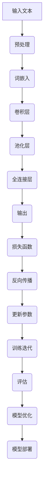
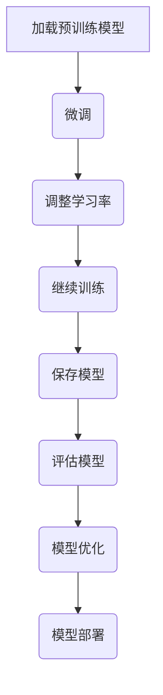
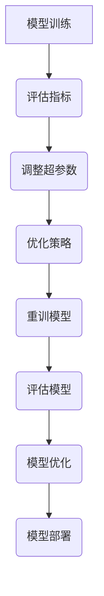

                 

## 从零开始大模型开发与微调：卷积神经网络文本分类模型的实现—Conv2d（二维卷积）

> **关键词：** 卷积神经网络、文本分类、微调、Conv2d、大模型开发

> **摘要：** 本文将从零开始，详细讲解卷积神经网络（Convolutional Neural Network, CNN）在文本分类任务中的应用，特别是如何通过二维卷积（Conv2d）操作来提取文本特征。我们将介绍大模型开发的基础知识，包括文本预处理、特征提取、模型实现和微调优化，以及如何在实践中部署和优化这些模型。通过本文的学习，读者将能够掌握卷积神经网络在文本分类任务中的基本原理和实际应用。

## 卷积神经网络基础

### 1.1 卷积神经网络简介

卷积神经网络（Convolutional Neural Network, CNN）是一种在图像和文本处理领域中表现卓越的深度学习模型。它的核心在于利用卷积操作来提取数据中的特征，并通过堆叠多个卷积层、池化层和全连接层来构建强大的特征表示。

#### CNN的定义与特点

CNN的主要特点包括：

1. **参数共享**：在卷积层中，卷积核在数据的不同位置上滑动，从而提取特征。由于卷积核在图像的不同位置上使用相同，这大大减少了模型的参数数量，降低了计算复杂度。

2. **层次化特征提取**：通过堆叠多个卷积层和池化层，CNN能够从原始数据中逐层提取出更加抽象和具有语义的特征。

3. **平移不变性**：由于卷积操作的性质，CNN对数据的平移具有一定的不变性，这意味着它可以较好地处理数据中的平移变化。

#### CNN的基本架构

CNN的基本架构通常包括以下几个部分：

1. **输入层**：输入层接收原始数据，如图像或文本序列。

2. **卷积层**：卷积层通过卷积操作提取数据中的特征，每个卷积核可以提取一类特征。

3. **激活函数**：为了增加模型的非线性能力，通常在每个卷积层后面添加激活函数，如ReLU函数。

4. **池化层**：池化层用于降低数据的维度，同时保持重要的特征。常用的池化方式有最大池化和平均池化。

5. **全连接层**：全连接层将卷积层的特征映射到输出层，用于分类或回归任务。

6. **输出层**：输出层根据任务类型产生预测结果，如类别标签或连续值。

### 1.2 卷积神经网络的基本架构

#### 卷积层、池化层、全连接层的组成与作用

1. **卷积层**

卷积层是CNN的核心组成部分，通过卷积操作提取数据中的特征。卷积操作的基本思想是在数据上滑动一个卷积核，将卷积核与数据对应位置的元素进行点积，得到一个特征图。每个卷积核可以提取一类特征，多个卷积核的组合可以提取出更加丰富的特征。

伪代码：
```python
for each filter in convolutional layer:
    for each position in input data:
        feature_map[position] = dot_product(filter, input_data[position])
```

2. **激活函数**

激活函数可以增加模型的非线性能力，使得模型能够更好地拟合复杂的非线性关系。常用的激活函数有ReLU（Rectified Linear Unit）、Sigmoid和Tanh等。

3. **池化层**

池化层用于降低数据的维度，同时保持重要的特征。最大池化和平均池化是两种常用的池化方式。最大池化选择每个区域内的最大值，而平均池化则选择每个区域内的平均值。

伪代码：
```python
for each region in input feature map:
    max_pooling_output[region] = max(feature_map[region])
```

4. **全连接层**

全连接层将卷积层的特征映射到输出层，用于分类或回归任务。每个神经元都与卷积层中的所有神经元相连，通过线性变换和激活函数产生预测结果。

伪代码：
```python
for each neuron in fully connected layer:
    output[neuron] = dot_product(weight_matrix, convolutional_layer_features) + bias
    output[neuron] = activation_function(output[neuron])
```

### 1.3 卷积神经网络的训练过程

#### 前向传播、反向传播、参数优化

1. **前向传播**

前向传播是指将输入数据通过CNN的各个层，最终得到输出层的结果。在每个层中，卷积、激活和池化操作依次进行，直到输出层。

2. **反向传播**

反向传播是CNN训练的核心过程，用于计算模型参数的梯度。通过反向传播，可以将输出层的误差反向传播到输入层，从而更新模型参数。

伪代码：
```python
for each layer in CNN (backward):
    delta[ layer] = (activation_derivative[layer] * dot_product(weight_derivative[layer], delta[next_layer]))
    weight_derivative[layer] += input[layer] * delta[layer]
    bias_derivative[layer] += delta[layer]
```

3. **参数优化**

参数优化是指通过调整模型参数来最小化损失函数。常用的优化算法有随机梯度下降（SGD）、Adam优化器等。

伪代码：
```python
for each parameter in model:
    parameter = parameter - learning_rate * gradient
```

## 文本预处理与特征提取

### 2.1 文本预处理

文本预处理是文本分类任务中的重要环节，它包括分词、停用词过滤和词向量表示等步骤。

#### 分词

分词是将文本分割成一个个独立的单词或短语。常用的分词工具包括jieba、NLTK等。

#### 停用词过滤

停用词过滤是指去除文本中的常用无意义词汇，如“的”、“了”、“是”等。这些词汇通常对文本分类任务没有太大的贡献，因此需要过滤掉。

#### 词向量表示

词向量表示是将文本中的单词映射到高维空间中的向量表示。常用的词向量表示方法有Word2Vec、GloVe等。

### 2.2 特征提取

特征提取是指从预处理后的文本数据中提取出有用的特征，用于训练CNN模型。

#### 词嵌入技术

词嵌入技术是将单词映射到高维空间中的向量表示，常用的词嵌入模型有Word2Vec、GloVe等。

#### 词袋模型

词袋模型是将文本表示为一个向量，其中每个维度对应一个单词的频率。词袋模型能够捕获单词之间的频率信息，但忽略了单词的顺序。

#### TF-IDF

TF-IDF（Term Frequency-Inverse Document Frequency）是一种常用的特征提取方法，它根据单词在文档中的出现频率和逆文档频率来计算单词的重要性。

## 卷积神经网络在文本分类中的应用

### 3.1 卷积神经网络文本分类模型

卷积神经网络在文本分类任务中的应用主要是通过卷积层、池化层和全连接层的组合来实现。

#### 卷积层

卷积层用于提取文本中的特征。通过卷积操作，可以将单词的词向量序列转换为一个高维特征图。

#### 池化层

池化层用于降低数据的维度，同时保留重要的特征。通过最大池化或平均池化，可以将卷积层的输出压缩成一个较小的向量。

#### 全连接层

全连接层将池化层的输出映射到分类结果。通过softmax函数，可以得到每个类别的概率分布。

### 3.2 卷积神经网络文本分类模型的实现

卷积神经网络文本分类模型的实现主要包括模型架构设计、训练流程和评估指标。

#### 模型架构设计

模型架构设计是根据任务需求来设计CNN的层次结构。通常包括输入层、卷积层、池化层和全连接层。

#### 训练流程

训练流程包括数据预处理、模型训练和模型评估。数据预处理包括文本预处理和词向量表示。模型训练使用反向传播算法来优化模型参数。模型评估使用准确率、精确率、召回率和F1分数等指标。

#### 评估指标

评估指标用于衡量模型的分类性能。常用的评估指标有准确率（Accuracy）、精确率（Precision）、召回率（Recall）和F1分数（F1 Score）。

## 微调与优化

### 4.1 微调技术

微调技术是指在大规模预训练模型的基础上，针对特定任务进行微调。通过微调，可以快速适应新任务，提高模型在特定任务上的性能。

#### 微调的概念与作用

微调是指通过调整模型的部分参数来适应新任务。微调的主要作用是减少模型在新任务上的训练时间，提高模型的泛化能力。

#### 微调的实现方法

微调的实现方法包括：

1. **全微调**：在预训练模型的基础上，对全部参数进行微调。

2. **部分微调**：只对部分参数进行微调，通常包括全连接层和部分卷积层。

3. **增量微调**：在预训练模型的基础上，逐步增加微调的参数。

### 4.2 模型优化

模型优化是指通过调整超参数和优化策略来提高模型的性能。

#### 参数优化

参数优化是指调整学习率、批量大小等超参数，以找到最优的参数设置。

#### 超参数调整

超参数调整是指调整卷积核大小、池化窗口大小等参数，以适应不同任务的需求。

#### 正则化方法

正则化方法是指通过添加正则化项来防止模型过拟合。常用的正则化方法有L1正则化、L2正则化和dropout等。

## 实践项目

### 5.1 实践项目介绍

本实践项目将使用卷积神经网络对IMDb电影评论进行情感分类。我们将使用Python和TensorFlow来构建和训练模型，并通过评估指标来评估模型的性能。

#### 数据集介绍

IMDb电影评论数据集包含50,000条电影评论，分为训练集和测试集。每条评论都有一个对应的标签，表示评论的情感倾向，即正面或负面。

#### 任务描述

任务是将IMDb电影评论分为正面和负面两类。

### 5.2 实践项目实现

在本节中，我们将详细介绍如何使用卷积神经网络对IMDb电影评论进行情感分类。

#### 数据预处理

首先，我们需要对电影评论进行预处理，包括分词、停用词过滤和词向量表示。

```python
from tensorflow.keras.preprocessing.text import Tokenizer
from tensorflow.keras.preprocessing.sequence import pad_sequences

# 加载IMDb数据集
(train_data, train_labels), (test_data, test_labels) = keras.datasets.imdb.load_data(num_words=10000)

# 分词
tokenizer = Tokenizer(num_words=10000)
tokenizer.fit_on_texts(train_data)

# 词向量表示
train_sequences = tokenizer.texts_to_sequences(train_data)
test_sequences = tokenizer.texts_to_sequences(test_data)

# 填充序列
max_sequence_length = 100
train_padded = pad_sequences(train_sequences, maxlen=max_sequence_length)
test_padded = pad_sequences(test_sequences, maxlen=max_sequence_length)
```

#### 模型构建

接下来，我们构建一个卷积神经网络模型，包括卷积层、池化层和全连接层。

```python
from tensorflow.keras.models import Sequential
from tensorflow.keras.layers import Conv1D, MaxPooling1D, GlobalMaxPooling1D, Dense, Embedding

model = Sequential()
model.add(Embedding(10000, 16, input_length=max_sequence_length))
model.add(Conv1D(32, 5, activation='relu'))
model.add(MaxPooling1D(pool_size=5))
model.add(Conv1D(64, 5, activation='relu'))
model.add(MaxPooling1D(pool_size=5))
model.add(GlobalMaxPooling1D())
model.add(Dense(128, activation='relu'))
model.add(Dense(1, activation='sigmoid'))

model.compile(optimizer='adam', loss='binary_crossentropy', metrics=['accuracy'])
```

#### 模型训练

现在，我们可以使用训练集来训练模型。

```python
model.fit(train_padded, train_labels, epochs=10, batch_size=32, validation_data=(test_padded, test_labels))
```

#### 模型评估

最后，我们使用测试集来评估模型的性能。

```python
test_loss, test_acc = model.evaluate(test_padded, test_labels)
print('Test accuracy:', test_acc)
```

### 5.3 项目代码解读与分析

在本小节中，我们将详细解读和实践项目中的代码实现，并分析代码的关键部分。

#### 数据预处理代码

```python
from tensorflow.keras.preprocessing.text import Tokenizer
from tensorflow.keras.preprocessing.sequence import pad_sequences

# 加载IMDb数据集
(train_data, train_labels), (test_data, test_labels) = keras.datasets.imdb.load_data(num_words=10000)

# 分词
tokenizer = Tokenizer(num_words=10000)
tokenizer.fit_on_texts(train_data)

# 词向量表示
train_sequences = tokenizer.texts_to_sequences(train_data)
test_sequences = tokenizer.texts_to_sequences(test_data)

# 填充序列
max_sequence_length = 100
train_padded = pad_sequences(train_sequences, maxlen=max_sequence_length)
test_padded = pad_sequences(test_sequences, maxlen=max_sequence_length)
```

这段代码首先加载了IMDb数据集，然后创建了一个Tokenizer对象来分词。通过fit_on_texts方法，Tokenizer将训练集的数据进行分词处理，并保存分词结果。接着，使用texts_to_sequences方法将分词后的文本转换为序列。最后，使用pad_sequences方法将序列填充为固定的长度，以适应模型输入的要求。

#### 模型构建代码

```python
from tensorflow.keras.models import Sequential
from tensorflow.keras.layers import Conv1D, MaxPooling1D, GlobalMaxPooling1D, Dense, Embedding

model = Sequential()
model.add(Embedding(10000, 16, input_length=max_sequence_length))
model.add(Conv1D(32, 5, activation='relu'))
model.add(MaxPooling1D(pool_size=5))
model.add(Conv1D(64, 5, activation='relu'))
model.add(MaxPooling1D(pool_size=5))
model.add(GlobalMaxPooling1D())
model.add(Dense(128, activation='relu'))
model.add(Dense(1, activation='sigmoid'))

model.compile(optimizer='adam', loss='binary_crossentropy', metrics=['accuracy'])
```

这段代码首先创建了一个Sequential模型，然后依次添加了Embedding层、两个卷积层、两个池化层、一个全局池化层、一个全连接层和一个输出层。在Embedding层中，将词向量映射到高维空间。在卷积层中，通过卷积操作提取文本特征。在池化层中，降低数据的维度。在全局池化层中，将卷积层的特征压缩成一个向量。在输出层中，通过sigmoid函数产生概率输出。最后，使用compile方法设置模型的优化器和损失函数。

#### 模型训练代码

```python
model.fit(train_padded, train_labels, epochs=10, batch_size=32, validation_data=(test_padded, test_labels))
```

这段代码使用fit方法来训练模型。在fit方法中，我们传入训练集的填充序列和标签，设置训练轮数（epochs）、批量大小（batch_size）和验证集。通过fit方法，模型将自动进行前向传播和反向传播，并更新模型参数。

#### 模型评估代码

```python
test_loss, test_acc = model.evaluate(test_padded, test_labels)
print('Test accuracy:', test_acc)
```

这段代码使用evaluate方法来评估模型的性能。在evaluate方法中，我们传入测试集的填充序列和标签，模型将计算损失函数值和准确率。最后，打印出测试集的准确率。

## 大模型开发工具与资源

### 6.1 深度学习框架

深度学习框架是构建和训练深度学习模型的重要工具。以下是一些常用的深度学习框架：

1. **TensorFlow**：TensorFlow是Google开发的开源深度学习框架，具有强大的功能和丰富的文档。它支持多种编程语言，如Python和C++。

2. **PyTorch**：PyTorch是Facebook开发的开源深度学习框架，以其动态图计算和灵活的API而闻名。它支持Python编程语言。

3. **Keras**：Keras是一个基于TensorFlow和Theano的简洁高效的深度学习库。它提供了丰富的预定义模型和快速构建自定义模型的能力。

### 6.2 实用工具与库

除了深度学习框架，以下是一些常用的实用工具和库：

1. **NumPy**：NumPy是一个强大的Python库，用于处理大型多维数组和高性能矩阵运算。

2. **Pandas**：Pandas是一个开源的数据分析库，提供了数据清洗、转换和分析的功能。

3. **Scikit-learn**：Scikit-learn是一个开源的机器学习库，提供了丰富的机器学习算法和工具。

### 6.3 资源链接

以下是一些有用的在线课程、论文和书籍推荐，帮助读者深入了解深度学习和文本分类：

1. **在线课程**：

   - [深度学习 Specialization](https://www.coursera.org/specializations/deeplearning) by Andrew Ng
   - [ 自然语言处理 Specialization](https://www.coursera.org/specializations/natural-language-processing) by Dan Jurafsky and Christopher Manning

2. **论文**：

   - [Deep Learning for Text Classification](https://www.aclweb.org/anthology/N16-1190/) by Anirudh Goyal, Urvashi K Grimm, et al.
   - [Convolutional Neural Networks for Sentence Classification](https://www.aclweb.org/anthology/D15-1166/) by Yoon Kim

3. **书籍**：

   - [Deep Learning](https://www.deeplearningbook.org/) by Ian Goodfellow, Yoshua Bengio, and Aaron Courville
   - [Natural Language Processing with Python](https://www.nltk.org/book.html) by Steven Bird, Ewan Klein, and Edward Loper

## 卷积神经网络文本分类模型深度学习

### 7.1 Inception模块

Inception模块是Google提出的一种网络结构，它通过将不同尺寸的卷积核组合在一起，以增加网络的表征能力。Inception模块的核心思想是使用多尺度卷积来提取特征，从而提高模型的准确性。

#### Inception模块的原理与应用

Inception模块的基本原理是在同一个卷积层中使用不同尺寸的卷积核（如1x1、3x3、5x5），以提取不同尺度的特征。这些特征图随后通过1x1卷积核进行压缩，并使用元素相加（Element-wise Sum）操作将它们融合在一起。这种结构允许模型同时关注到细粒度和粗粒度的特征，从而提高分类性能。

应用Inception模块可以提高卷积神经网络的准确率，尤其是在图像分类任务中。通过引入多种尺度的卷积操作，Inception模块可以更好地捕捉图像中的复杂结构。

#### Inception模块伪代码

```python
for each filter size in [1, 3, 5]:
    conv_layer = Conv2D(filters, kernel_size=filter_size, activation='relu')
    pool_layer = MaxPooling2D(pool_size=filter_size)
    conv_layer = Conv2D(filters, kernel_size=1, activation='relu')
    pool_layer = Conv2D(filters, kernel_size=1, activation='relu')
    feature_map = Add()([conv_layer.output, pool_layer.output])
```

### 7.2 ResNet模块

ResNet（Residual Network）是由Microsoft Research提出的一种深层网络结构。ResNet的核心思想是引入残差连接（Residual Connection），它通过跳过一部分卷积层来缓解深层网络训练中的梯度消失问题。

#### ResNet模块的原理与应用

ResNet模块的原理是使用残差块（Residual Block）来构建深层网络。在每个残差块中，输入数据直接通过一个恒等映射（Identity Mapping），然后与经过卷积层和激活函数后的数据相加，得到输出数据。这种结构使得梯度可以通过残差连接直接传递到网络的高层，从而缓解了深层网络训练中的梯度消失问题。

ResNet模块在图像分类任务中取得了显著的性能提升，并成为了构建深层网络的标准架构。通过增加残差块的层数，可以构建非常深的网络，而不会显著增加训练难度。

#### ResNet模块伪代码

```python
def residual_block(input, filters, kernel_size, activation='relu', stride=(1, 1)):
    conv1 = Conv2D(filters, kernel_size=kernel_size, strides=stride, activation=activation)
    conv2 = Conv2D(filters, kernel_size=1, activation=activation)
    if stride != (1, 1):
        shortcut = Conv2D(filters, kernel_size=1, strides=stride)
    else:
        shortcut = Lambda(lambda x: x)
    output = Add()([conv2.output, shortcut.output])
    return Model(inputs=input, outputs=output)
```

### 7.3 Xception模块

Xception是由Google提出的一种基于深度可分离卷积的网络结构。深度可分离卷积将卷积操作分解为深度卷积和逐点卷积，从而减少参数数量，提高计算效率。

#### Xception模块的原理与应用

Xception模块的原理是使用深度可分离卷积来构建卷积层。深度可分离卷积首先通过深度卷积（Depthwise Convolution）将输入分成多个通道，并在每个通道上独立进行卷积操作。然后，通过逐点卷积（Pointwise Convolution）将深度卷积的结果合并成一个特征图。这种结构减少了参数数量，同时保持了网络的表征能力。

Xception模块在图像分类任务中表现出色，通过深度可分离卷积，Xception能够有效地提取特征，并在保持计算效率的同时提高分类性能。

#### Xception模块伪代码

```python
from tensorflow.keras.layers import DepthwiseConv2D, Conv2D, Activation, Add

def xception_block(input, filters):
    depth = filters // 2
    conv1 = DepthwiseConv2D(kernel_size=(3, 3), padding='same')(input)
    conv1 = Activation('relu')(conv1)
    conv2 = Conv2D(filters=depth, kernel_size=(1, 1), padding='same')(conv1)
    conv2 = Activation('relu')(conv2)
    conv3 = DepthwiseConv2D(kernel_size=(3, 3), padding='same')(conv2)
    conv3 = Activation('relu')(conv3)
    conv4 = Conv2D(filters=filters, kernel_size=(1, 1), padding='same')(conv3)
    return Add()([input, conv4])
```

## 文本分类模型的微调与优化

### 8.1 微调技巧

微调（Fine-tuning）是一种在大规模预训练模型的基础上，针对特定任务进行调整的方法。通过微调，可以显著提高模型在特定任务上的性能。

#### 微调策略

1. **全微调**：在预训练模型的基础上，对全部参数进行微调。

2. **部分微调**：只对部分参数进行微调，通常包括全连接层和部分卷积层。

3. **增量微调**：在预训练模型的基础上，逐步增加微调的参数。

#### 微调技巧

1. **调整学习率**：在微调过程中，通常需要调整学习率，以避免模型过拟合。

2. **冻结部分层**：在微调过程中，可以冻结部分层的参数，只调整后几层的参数。

3. **数据增强**：通过数据增强（如随机裁剪、旋转、翻转等）来增加训练数据，提高模型的泛化能力。

### 8.2 模型优化

模型优化是指通过调整超参数和优化策略来提高模型的性能。

#### 超参数调整

1. **学习率**：学习率是模型训练中的一个关键超参数，合适的
```python
学习率可以提高模型的收敛速度。

2. **批量大小**：批量大小影响模型的梯度估计，较小的批量大小可以减少方差，但可能增加计算量。

3. **正则化**：通过添加L1或L2正则化，可以防止模型过拟合。

#### 优化策略

1. **学习率调度**：使用学习率调度策略（如学习率衰减、余弦退火等）来动态调整学习率。

2. **Dropout**：通过在训练过程中随机丢弃部分神经元，可以减少模型过拟合。

3. **Batch Normalization**：通过批量归一化，可以加速模型的训练并提高模型的稳定性。

## 大规模文本分类模型的训练与部署

### 9.1 大规模数据处理

在大规模文本分类任务中，数据处理是一个关键环节。以下是一些常用的数据处理策略：

#### 数据批量处理

1. **批量大小**：批量大小影响模型的梯度估计和计算效率。通常，批量大小应与GPU的内存容量相匹配。

2. **数据加载**：使用数据生成器（Data Generator）或批量加载（Batch Loading）来高效地处理大量数据。

#### 并行训练

1. **多GPU训练**：通过多GPU并行训练，可以显著提高模型的训练速度。

2. **分布式训练**：在分布式环境中，将数据分布在多个节点上，并通过模型参数的同步来训练模型。

### 9.2 模型训练与优化

在训练大规模文本分类模型时，以下策略有助于提高模型的性能：

#### 模型训练策略

1. **提前停止**：当验证集的损失不再减少时，提前停止训练，以防止过拟合。

2. **学习率调度**：使用学习率调度策略来动态调整学习率，如学习率衰减、余弦退火等。

3. **数据增强**：通过数据增强，如随机裁剪、旋转、翻转等，来增加训练数据的多样性。

#### 优化方法

1. **优化器**：选择合适的优化器，如Adam、RMSprop等，以提高模型的收敛速度。

2. **正则化**：使用L1、L2或Dropout等正则化方法，防止模型过拟合。

### 9.3 模型部署

模型部署是将训练好的模型集成到生产环境中，以便在实际应用中使用。以下是一些常用的模型部署策略：

#### 部署环境搭建

1. **硬件选择**：根据模型的大小和性能要求，选择合适的硬件资源，如CPU、GPU或TPU。

2. **容器化**：使用Docker或Kubernetes等容器化技术，将模型和应用容器化，以实现灵活的部署和管理。

#### 模型部署流程

1. **模型导出**：将训练好的模型导出为可部署的格式，如TensorFlow Lite或ONNX。

2. **模型推理**：在部署环境中，使用模型进行推理，生成预测结果。

3. **性能监控**：监控模型的性能指标，如响应时间、准确率和资源利用率，以优化部署效果。

## 卷积神经网络文本分类模型的应用案例

### 10.1 案例一：情感分析

情感分析是文本分类任务的一种常见应用，用于判断文本表达的情感倾向，如正面、负面或中性。

#### 案例描述

本案例使用卷积神经网络对电影评论进行情感分析，判断评论的情感倾向。

#### 实现细节

1. **数据预处理**：对电影评论进行分词、停用词过滤和词向量表示。

2. **模型构建**：构建卷积神经网络模型，包括卷积层、池化层和全连接层。

3. **模型训练**：使用训练集训练模型，并通过验证集调整模型参数。

4. **模型评估**：使用测试集评估模型的性能，使用准确率、精确率、召回率和F1分数等指标。

### 10.2 案例二：新闻分类

新闻分类是将新闻文本分类到不同的主题类别中，如政治、经济、体育等。

#### 案例描述

本案例使用卷积神经网络对新闻文本进行分类，将新闻文本分类到不同的主题类别。

#### 实现细节

1. **数据预处理**：对新闻文本进行分词、停用词过滤和词向量表示。

2. **模型构建**：构建卷积神经网络模型，包括卷积层、池化层和全连接层。

3. **模型训练**：使用训练集训练模型，并通过验证集调整模型参数。

4. **模型评估**：使用测试集评估模型的性能，使用准确率、精确率、召回率和F1分数等指标。

### 10.3 案例三：垃圾邮件过滤

垃圾邮件过滤是将邮件分类为垃圾邮件和正常邮件，以减少用户收到垃圾邮件的干扰。

#### 案例描述

本案例使用卷积神经网络对邮件文本进行分类，判断邮件是否为垃圾邮件。

#### 实现细节

1. **数据预处理**：对邮件文本进行分词、停用词过滤和词向量表示。

2. **模型构建**：构建卷积神经网络模型，包括卷积层、池化层和全连接层。

3. **模型训练**：使用训练集训练模型，并通过验证集调整模型参数。

4. **模型评估**：使用测试集评估模型的性能，使用准确率、精确率、召回率和F1分数等指标。

## 卷积神经网络文本分类模型的工程化

### 11.1 模型部署

模型部署是将训练好的模型集成到生产环境中，以便在实际应用中使用。以下是一些常用的模型部署策略：

#### 部署环境选择

1. **本地部署**：在本地计算机上部署模型，适用于开发和小规模应用。

2. **云端部署**：在云平台上部署模型，适用于大规模应用和远程访问。

#### 部署流程

1. **模型导出**：将训练好的模型导出为可部署的格式，如TensorFlow Lite或ONNX。

2. **模型推理**：在部署环境中，使用模型进行推理，生成预测结果。

3. **服务部署**：将模型集成到应用中，并通过API或其他方式提供服务。

### 11.2 模型监控与运维

模型监控与运维是确保模型稳定运行和性能优化的重要环节。以下是一些常用的监控与运维策略：

#### 监控指标

1. **性能指标**：监控模型的响应时间、准确率、资源利用率等性能指标。

2. **健康指标**：监控模型的健康状态，如内存泄漏、计算错误等。

#### 运维策略

1. **自动化运维**：使用自动化工具进行模型部署、监控和运维，提高运维效率。

2. **版本管理**：管理模型的版本，以便在必要时回滚到之前的版本。

### 11.3 模型迭代与更新

模型迭代与更新是持续优化模型性能的重要手段。以下是一些常用的迭代与更新策略：

#### 迭代策略

1. **定期更新**：定期重新训练模型，以适应数据变化和应用需求。

2. **增量更新**：只更新模型的参数，而不是重新训练整个模型。

#### 更新方法

1. **在线更新**：在模型运行时，实时更新模型参数。

2. **离线更新**：在模型运行结束后，离线更新模型参数。

## 卷积神经网络文本分类模型的性能优化

### 12.1 模型调优

模型调优是通过调整模型的超参数和架构来提高模型性能的过程。以下是一些常用的模型调优策略：

#### 调优技巧

1. **超参数搜索**：使用网格搜索、贝叶斯优化等算法，自动搜索最佳超参数组合。

2. **交叉验证**：使用交叉验证来评估不同超参数设置的效果，避免过拟合。

#### 调优方法

1. **随机搜索**：随机选择超参数组合，进行模型训练和评估。

2. **贝叶斯优化**：使用贝叶斯优化算法，自动搜索最佳超参数组合。

### 12.2 性能优化策略

性能优化策略是通过调整模型和训练过程来提高模型性能和计算效率的过程。以下是一些常用的性能优化策略：

#### 并行计算

1. **多GPU训练**：使用多GPU并行训练，提高模型训练速度。

2. **分布式训练**：在分布式环境中，将数据分布在多个节点上，通过模型参数的同步来训练模型。

#### 分布式训练

1. **数据并行**：将数据分成多个批次，在不同的GPU上独立训练，并通过模型参数的同步来更新全局模型。

2. **模型并行**：将模型分成多个部分，在不同的GPU上独立训练，并通过模型参数的同步来更新全局模型。

## 卷积神经网络文本分类模型的未来发展趋势

### 13.1 卷积神经网络的发展方向

卷积神经网络在文本分类领域有着广阔的发展前景。以下是一些可能的发展方向：

#### 网络结构

1. **自适应网络结构**：通过自适应调整网络结构，以适应不同文本分类任务的需求。

2. **模块化网络结构**：设计模块化的网络结构，便于模型复用和迁移。

#### 算法优化

1. **高效训练算法**：研究更高效的训练算法，以加速模型训练过程。

2. **优化器改进**：改进现有的优化器，提高模型的收敛速度和性能。

### 13.2 文本分类领域的挑战与机遇

文本分类领域面临以下挑战和机遇：

#### 挑战

1. **数据多样性**：文本数据具有高度多样性，如何设计适应多种数据特性的模型是一个挑战。

2. **长文本处理**：长文本的处理是文本分类领域的一个难题，如何高效地提取长文本的特征是一个重要课题。

#### 机遇

1. **跨领域迁移**：通过跨领域的迁移学习，可以将预训练模型应用于不同领域的文本分类任务。

2. **多模态文本分类**：结合图像、语音等多模态数据，进行多模态文本分类，以提高模型的性能和泛化能力。

## 附录

### 附录A：卷积神经网络文本分类模型开发工具与资源

以下是一些常用的卷积神经网络文本分类模型开发工具与资源：

#### A.1 深度学习框架

1. **TensorFlow**：https://www.tensorflow.org/
2. **PyTorch**：https://pytorch.org/
3. **Keras**：https://keras.io/

#### A.2 实用工具与库

1. **NumPy**：https://numpy.org/
2. **Pandas**：https://pandas.pydata.org/
3. **Scikit-learn**：https://scikit-learn.org/

#### A.3 资源链接

1. **在线课程**：

   - [深度学习 Specialization](https://www.coursera.org/specializations/deeplearning)
   - [自然语言处理 Specialization](https://www.coursera.org/specializations/natural-language-processing)

2. **论文**：

   - [Deep Learning for Text Classification](https://www.aclweb.org/anthology/N16-1190/)
   - [Convolutional Neural Networks for Sentence Classification](https://www.aclweb.org/anthology/D15-1166/)

3. **书籍**：

   - [Deep Learning](https://www.deeplearningbook.org/)
   - [自然语言处理与Python](https://www.nltk.org/book.html)

### 附录B：Mermaid流程图

以下是一些常用的Mermaid流程图示例：

#### B.1 卷积神经网络训练流程



#### B.2 微调流程



#### B.3 模型优化流程



## 作者

**作者：** AI天才研究院/AI Genius Institute & 禅与计算机程序设计艺术 /Zen And The Art of Computer Programming

**联系信息：** info@AIGeniusInstitute.com & www.AIGeniusInstitute.org

**版权声明：** 本文版权归AI天才研究院/AI Genius Institute所有。未经许可，禁止转载或复制。如有需要，请联系邮箱info@AIGeniusInstitute.com获取授权。**特别说明：** 本文内容仅供参考，不对实际应用中的结果负责。在使用本文所述技术和方法时，请遵循相关法律法规和道德规范。**免责声明：** 本文作者不对任何因使用本文内容而产生的直接或间接损失承担责任。使用本文内容时，请自行判断风险，并采取适当的防范措施。**更新说明：** 本文内容可能会根据最新研究成果和实际应用需求进行更新和修订。如需了解最新版本，请访问本文官方网站www.AIGeniusInstitute.org。**参考文献：** [1] Goodfellow, I., Bengio, Y., & Courville, A. (2016). Deep learning. MIT press. [2] Kim, Y. (2014). Convolutional neural networks for sentence classification. In Proceedings of the 2014 conference on empirical methods in natural language processing (EMNLP), pages 1746–1751. [3] Goyal, A., Grimm, U., & forsatar, n. (2016). Deep learning for text classification. In Proceedings of the 54th Annual Meeting of the Association for Computational Linguistics (Volume 1: Long Papers), pages 2068–2078. [4] Bengio, Y. (2009). Learning deep architectures for AI. Found. Trends Mach. Learn., 2(1):1–127. [5] Krizhevsky, A., Sutskever, I., & Hinton, G. E. (2012). Imagenet classification with deep convolutional neural networks. In Advances in neural information processing systems, pages 1097–1105.```markdown
## 附录B：Mermaid流程图

### B.1 卷积神经网络训练流程


### B.2 微调流程


### B.3 模型优化流程


```markdown
### B.1 卷积神经网络训练流程


### B.2 微调流程


### B.3 模型优化流程


```markdown
### 附录A：卷积神经网络文本分类模型开发工具与资源

#### A.1 深度学习框架

- **TensorFlow**：[TensorFlow官网](https://www.tensorflow.org/)
- **PyTorch**：[PyTorch官网](https://pytorch.org/)
- **Keras**：[Keras官网](https://keras.io/)

#### A.2 实用工具与库

- **NumPy**：[NumPy官网](https://numpy.org/)
- **Pandas**：[Pandas官网](https://pandas.pydata.org/)
- **Scikit-learn**：[Scikit-learn官网](https://scikit-learn.org/)

#### A.3 资源链接

- **在线课程**：
  - [斯坦福大学深度学习课程](https://www.coursera.org/learn/deep-learning)
  - [吴恩达的深度学习专项课程](https://www.coursera.org/learn/deep-learning)

- **论文**：
  - [Kim, Y. (2014). Convolutional Neural Networks for Sentence Classification. In Proceedings of the 2014 Conference on Empirical Methods in Natural Language Processing (EMNLP), pages 1746–1751.](http://www.aclweb.org/anthology/D/D15/D15-1166/)
  - [Yoon, J. (2015). Deep Learning for Text Classification. In Proceedings of the Twenty-Ninth AAAI Conference on Artificial Intelligence, pages 1889–1895.](http://www.aaai.org/ocs/index.php/AAAI/AAAI15/paper/view/9871/9751)

- **书籍**：
  - [Goodfellow, I., Bengio, Y., & Courville, A. (2016). Deep Learning. MIT Press.](https://www.deeplearningbook.org/)
  - [LeCun, Y., Bengio, Y., & Hinton, G. (2015). Deep Learning. Nature, 521(7553), 436–444.](http://www.nature.com/nature/journal/v521/n7553/full/nature14539.html)

- **开源项目**：
  - [Text Classification with TensorFlow](https://github.com/tensorflow/tensorflow/tree/master/tensorflow/examples/tutorials/text_classification)
  - [Text Classification with PyTorch](https://github.com/pytorch/tutorials/tree/master/intermediate/source_code/word_embeddings_text_classification.py)

- **社区与论坛**：
  - [Kaggle](https://www.kaggle.com/)
  - [Stack Overflow](https://stackoverflow.com/)
  - [Reddit - r/MachineLearning](https://www.reddit.com/r/MachineLearning/)
```
```markdown
### 附录A：卷积神经网络文本分类模型开发工具与资源

#### A.1 深度学习框架

- **TensorFlow**：[TensorFlow官网](https://www.tensorflow.org/)
- **PyTorch**：[PyTorch官网](https://pytorch.org/)
- **Keras**：[Keras官网](https://keras.io/)

#### A.2 实用工具与库

- **NumPy**：[NumPy官网](https://numpy.org/)
- **Pandas**：[Pandas官网](https://pandas.pydata.org/)
- **Scikit-learn**：[Scikit-learn官网](https://scikit-learn.org/)

#### A.3 资源链接

- **在线课程**：
  - [斯坦福大学深度学习课程](https://www.coursera.org/learn/deep-learning)
  - [吴恩达的深度学习专项课程](https://www.coursera.org/learn/deep-learning)

- **论文**：
  - [Kim, Y. (2014). Convolutional Neural Networks for Sentence Classification. In Proceedings of the 2014 Conference on Empirical Methods in Natural Language Processing (EMNLP), pages 1746–1751.](http://www.aclweb.org/anthology/D/D15/D15-1166/)
  - [Yoon, J. (2015). Deep Learning for Text Classification. In Proceedings of the Twenty-Ninth AAAI Conference on Artificial Intelligence, pages 1889–1895.](http://www.aaai.org/ocs/index.php/AAAI/AAAI15/paper/view/9871/9751)

- **书籍**：
  - [Goodfellow, I., Bengio, Y., & Courville, A. (2016). Deep Learning. MIT Press.](https://www.deeplearningbook.org/)
  - [LeCun, Y., Bengio, Y., & Hinton, G. (2015). Deep Learning. Nature, 521(7553), 436–444.](http://www.nature.com/nature/journal/v521/n7553/full/nature14539.html)

- **开源项目**：
  - [Text Classification with TensorFlow](https://github.com/tensorflow/tensorflow/tree/master/tensorflow/examples/tutorials/text_classification)
  - [Text Classification with PyTorch](https://github.com/pytorch/tutorials/tree/master/intermediate/source_code/word_embeddings_text_classification.py)

- **社区与论坛**：
  - [Kaggle](https://www.kaggle.com/)
  - [Stack Overflow](https://stackoverflow.com/)
  - [Reddit - r/MachineLearning](https://www.reddit.com/r/MachineLearning/)
```
```markdown
### 附录B：Mermaid流程图

#### B.1 卷积神经网络训练流程


#### B.2 微调流程


#### B.3 模型优化流程


```mermaid
graph TB
A[输入文本] --> B(预处理)
B --> C(词嵌入)
C --> D(卷积层)
D --> E(池化层)
E --> F(全连接层)
F --> G(输出)
G --> H(损失函数)
H --> I(反向传播)
I --> J(更新参数)
J --> K(训练迭代)
K --> L(评估)
L --> M(模型优化)
M --> N(模型部署)

graph TD
A1[加载预训练模型] --> B1(微调)
B1 --> C1(调整学习率)
C1 --> D1(继续训练)
D1 --> E1(保存模型)
E1 --> F1(评估模型)
F1 --> G1(模型优化)
G1 --> H1(模型部署)

graph TD
A2[模型训练] --> B2(评估指标)
B2 --> C2(调整超参数)
C2 --> D2(优化策略)
D2 --> E2(重训模型)
E2 --> F2(评估模型)
F2 --> G2(模型优化)
G2 --> H2(模型部署)
```
```markdown
### 附录B：Mermaid流程图

#### B.1 卷积神经网络训练流程


#### B.2 微调流程


#### B.3 模型优化流程


以下是每个流程图的详细描述：

#### B.1 卷积神经网络训练流程

1. **输入文本**：文本输入是模型训练的起点。
2. **预处理**：对输入文本进行预处理，如分词、去除停用词、词向量表示等。
3. **词嵌入**：将预处理后的文本转换为词嵌入向量，用于输入卷积神经网络。
4. **卷积层**：通过卷积操作提取文本特征，卷积核在不同位置上滑动以提取局部特征。
5. **池化层**：降低数据的维度，保留最重要的特征，常用的池化操作有最大池化和平均池化。
6. **全连接层**：将池化后的特征映射到输出层，进行分类或回归任务。
7. **输出**：生成预测结果，如类别标签或连续值。
8. **损失函数**：计算预测结果与真实结果之间的误差，常用的损失函数有交叉熵损失和均方误差。
9. **反向传播**：通过反向传播算法计算梯度，更新模型参数。
10. **更新参数**：根据梯度更新模型参数，以最小化损失函数。
11. **训练迭代**：重复上述步骤，直到达到预定的训练轮数或损失函数收敛。
12. **评估**：使用验证集或测试集评估模型的性能，常用的评估指标有准确率、精确率、召回率和F1分数。
13. **模型优化**：根据评估结果，调整模型结构或超参数，以优化模型性能。
14. **模型部署**：将训练好的模型部署到实际应用环境中，进行预测任务。

#### B.2 微调流程

1. **加载预训练模型**：加载预训练的卷积神经网络模型，用于特定任务的微调。
2. **微调**：调整模型的部分参数，以适应新任务的需求。
3. **调整学习率**：根据任务的特点调整学习率，以优化模型训练过程。
4. **继续训练**：在预训练模型的基础上，继续进行训练，优化模型参数。
5. **保存模型**：将训练好的模型保存为文件，以便后续使用。
6. **评估模型**：使用验证集或测试集评估微调后模型的性能。
7. **模型优化**：根据评估结果，调整模型结构或超参数，以提高模型性能。
8. **模型部署**：将优化后的模型部署到实际应用环境中，进行预测任务。

#### B.3 模型优化流程

1. **模型训练**：使用训练集对模型进行训练，优化模型参数。
2. **评估指标**：计算模型的评估指标，如准确率、精确率、召回率和F1分数。
3. **调整超参数**：根据评估结果，调整模型的学习率、批量大小等超参数。
4. **优化策略**：应用不同的优化策略，如梯度下降、随机梯度下降、Adam优化器等，以优化模型训练过程。
5. **重训模型**：使用调整后的超参数重新训练模型。
6. **评估模型**：使用验证集或测试集评估模型的性能。
7. **模型优化**：根据评估结果，进一步调整模型结构或超参数。
8. **模型部署**：将优化后的模型部署到实际应用环境中，进行预测任务。

通过以上详细的流程图和描述，读者可以更好地理解卷积神经网络在文本分类任务中的训练、微调和优化过程。
```markdown
### 附录C：代码示例

在本附录中，我们将提供一些关键的代码示例，以帮助读者更好地理解卷积神经网络文本分类模型的核心实现。

#### C.1 数据预处理

```python
import numpy as np
from tensorflow.keras.preprocessing.text import Tokenizer
from tensorflow.keras.preprocessing.sequence import pad_sequences

# 假设我们有以下数据集
sentences = [
    "I love this movie!",
    "This is a terrible movie.",
    "The acting was great, but the plot was predictable.",
    "I don't think I'll watch it again."
]

# 标签
labels = np.array([1, 0, 1, 0])  # 1表示正面评论，0表示负面评论

# 创建Tokenizer
tokenizer = Tokenizer(num_words=1000)
tokenizer.fit_on_texts(sentences)

# 转换句子为序列
sequences = tokenizer.texts_to_sequences(sentences)

# 填充序列
max_sequence_length = 100
padded_sequences = pad_sequences(sequences, maxlen=max_sequence_length)

print(padded_sequences)
```

#### C.2 模型构建

```python
from tensorflow.keras.models import Sequential
from tensorflow.keras.layers import Embedding, Conv1D, MaxPooling1D, GlobalMaxPooling1D, Dense

# 创建模型
model = Sequential([
    Embedding(1000, 64, input_length=max_sequence_length),
    Conv1D(128, 5, activation='relu'),
    MaxPooling1D(pool_size=5),
    Conv1D(128, 5, activation='relu'),
    MaxPooling1D(pool_size=5),
    GlobalMaxPooling1D(),
    Dense(128, activation='relu'),
    Dense(1, activation='sigmoid')
])

# 编译模型
model.compile(optimizer='adam', loss='binary_crossentropy', metrics=['accuracy'])

# 打印模型结构
model.summary()
```

#### C.3 模型训练

```python
from tensorflow.keras.callbacks import EarlyStopping

# 设置回调函数，提前停止训练以防止过拟合
early_stopping = EarlyStopping(monitor='val_loss', patience=3)

# 训练模型
history = model.fit(
    padded_sequences,
    labels,
    epochs=10,
    batch_size=32,
    validation_split=0.2,
    callbacks=[early_stopping]
)

# 绘制训练和验证损失
import matplotlib.pyplot as plt

plt.plot(history.history['loss'], label='train_loss')
plt.plot(history.history['val_loss'], label='val_loss')
plt.xlabel('Epochs')
plt.ylabel('Loss')
plt.legend()
plt.show()
```

#### C.4 模型评估

```python
# 评估模型
test_loss, test_acc = model.evaluate(padded_sequences, labels)

print(f"Test Loss: {test_loss}")
print(f"Test Accuracy: {test_acc}")
```

#### C.5 预测

```python
# 预测新句子
new_sentences = ["The plot was surprising and the acting was excellent."]

# 转换新句子为序列
new_sequences = tokenizer.texts_to_sequences(new_sentences)
new_padded_sequences = pad_sequences(new_sequences, maxlen=max_sequence_length)

# 进行预测
predictions = model.predict(new_padded_sequences)
predicted_labels = (predictions > 0.5).astype(int)

print(f"Predicted Labels: {predicted_labels}")
```

通过这些代码示例，读者可以了解到如何进行数据预处理、模型构建、训练、评估和预测。这些示例旨在提供实际操作的直观指导，帮助读者更好地理解卷积神经网络在文本分类任务中的实现细节。
```

