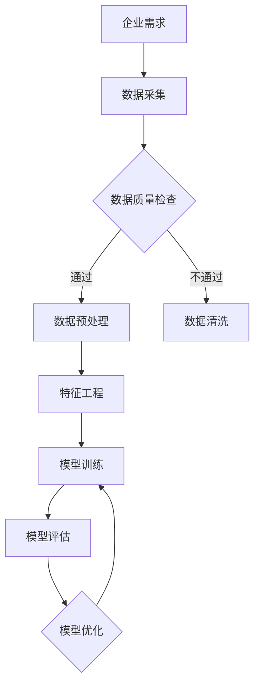

                 

### 《企业数字化转型中的AI技术》

关键词：人工智能、数字化转型、机器学习、深度学习、商业应用

摘要：
随着数字技术的迅猛发展，企业数字化转型已成为提升竞争力的关键途径。人工智能（AI）技术在其中扮演着至关重要的角色。本文将深入探讨AI技术在企业数字化转型中的应用，从基础概念、核心算法、到实战案例，全面解析AI技术如何助力企业迈向智能时代。

---

### 目录大纲：《企业数字化转型中的AI技术》

#### 第一部分：AI技术基础

- **第1章：AI技术概述**
  - 1.1 AI技术的发展历程
  - 1.2 AI技术在企业中的应用场景
  - 1.3 企业数字化转型的重要性

- **第2章：人工智能的核心概念**
  - 2.1 机器学习与深度学习的基本概念
  - 2.2 神经网络架构介绍
  - 2.3 数据预处理与特征工程

- **第3章：核心算法原理**
  - 3.1 监督学习算法
    - 3.1.1 线性回归
    - 3.1.2 决策树
    - 3.1.3 随机森林
  - 3.2 无监督学习算法
    - 3.2.1 K-means聚类
    - 3.2.2 自编码器
    - 3.2.3 聚类分析

- **第4章：数学模型与公式**
  - 4.1 概率论基础
  - 4.2 统计分布与假设检验
  - 4.3 优化算法与梯度下降法

#### 第二部分：AI技术在企业数字化转型中的应用

- **第5章：企业级AI应用案例分析**
  - 5.1 电商行业AI应用
    - 5.1.1 用户行为分析
    - 5.1.2 商品推荐系统
  - 5.2 制造业AI应用
    - 5.2.1 生产优化
    - 5.2.2 质量检测
  - 5.3 银行业AI应用
    - 5.3.1 风险控制
    - 5.3.2 客户服务

- **第6章：AI技术实施与挑战**
  - 6.1 AI技术实施流程
  - 6.2 数据治理与隐私保护
  - 6.3 技术与业务融合的挑战

- **第7章：企业数字化转型策略**
  - 7.1 数字化转型战略规划
  - 7.2 AI技术在企业战略中的定位
  - 7.3 跨部门协作与组织变革

#### 第三部分：实战项目

- **第8章：AI项目实战**
  - 8.1 项目背景与目标
  - 8.2 数据采集与预处理
  - 8.3 模型设计与实现
  - 8.4 模型评估与优化
  - 8.5 项目总结与反思

#### 附录

- **附录A：AI技术相关资源与工具**
  - 术语表
  - 常用AI开发框架介绍
  - 学习资源推荐

---

#### Mermaid 流程图（示例）



#### 伪代码（示例）

```python
# 伪代码：线性回归算法
def linear_regression(X, y):
    # 计算特征矩阵X和目标向量y的协方差
    covariance = np.dot(X.T, X)
    # 计算逆矩阵
    inverse = np.linalg.inv(covariance)
    # 计算回归系数
    theta = np.dot(inverse, np.dot(X.T, y))
    return theta
```

#### 数学公式（示例）

## 概率分布函数

$$
P(X = x) = \frac{1}{\sqrt{2\pi\sigma^2}} e^{-\frac{(x-\mu)^2}{2\sigma^2}}
$$

---

接下来，我们将深入第一部分：AI技术基础，逐章讲解AI技术的核心概念、算法原理及其在企业中的应用。

---

### 第一部分：AI技术基础

AI技术的兴起，标志着计算机从“计算”走向“智能”。本部分将探讨AI技术的基础知识，包括其发展历程、核心概念、算法原理以及数学模型，帮助读者构建全面的技术框架。

#### 第1章：AI技术概述

**1.1 AI技术的发展历程**

人工智能的发展历程可追溯到20世纪50年代，当时科学家们首次提出“人工智能”这一概念，目标是让计算机具备人类智能。自那以后，人工智能经历了几个重要的阶段：

- **1956-1969年：启蒙期**：以达特茅斯会议为标志，人工智能作为一门学科正式成立。
- **1970-1989年：寒冬期**：由于实际应用困难，人工智能研究进入低谷期。
- **1990-2000年：复苏期**：随着计算机性能的提升和大数据的涌现，人工智能逐渐复苏。
- **2001-2010年：深度学习兴起**：以深度学习为代表的新算法取得突破性进展。
- **2011年至今：爆发期**：人工智能在各领域得到广泛应用，推动了一系列产业变革。

**1.2 AI技术在企业中的应用场景**

AI技术在企业中的应用场景非常广泛，主要包括：

- **生产优化**：利用机器学习优化生产流程，提高生产效率。
- **质量检测**：通过图像识别等技术，实现对产品质量的自动化检测。
- **智能客服**：利用自然语言处理技术，提供智能客服服务。
- **预测分析**：利用数据挖掘和预测模型，为企业决策提供支持。

**1.3 企业数字化转型的重要性**

随着全球数字化转型的加速，企业数字化转型已成为提升竞争力的关键途径。数字化转型不仅能够提高企业的运营效率，还能为企业创造新的业务模式和价值。数字化转型的重要性体现在以下几个方面：

- **提升效率**：通过自动化和智能化，减少人力成本，提高工作效率。
- **创新业务**：通过数据分析和AI技术，发现新的业务机会，创造新的业务模式。
- **增强竞争力**：在数字化时代，具备强大数据处理能力和AI技术能力的企业更具竞争力。
- **优化用户体验**：通过智能化服务，提升用户满意度，增强用户粘性。

### 第2章：人工智能的核心概念

**2.1 机器学习与深度学习的基本概念**

**机器学习**是一种让计算机通过数据学习规律和模式的方法，主要分为监督学习、无监督学习和强化学习。监督学习有明确的输入和输出，通过已有数据训练模型，然后对新数据进行预测。无监督学习没有明确的输出，主要目的是发现数据中的结构和模式。强化学习则是通过奖励机制，让模型在动态环境中学习最优策略。

**深度学习**是一种基于多层神经网络的学习方法，通过逐层提取特征，实现复杂模式的识别。深度学习在图像识别、自然语言处理、语音识别等领域取得了显著成果。

**2.2 神经网络架构介绍**

神经网络是由大量神经元组成的计算模型，通过调整神经元之间的权重，实现对输入数据的分类和预测。典型的神经网络架构包括卷积神经网络（CNN）、循环神经网络（RNN）和生成对抗网络（GAN）。

- **卷积神经网络（CNN）**：主要用于图像识别和图像处理，通过卷积层、池化层和全连接层提取图像特征。
- **循环神经网络（RNN）**：主要用于序列数据处理，如自然语言处理和时间序列预测，通过隐藏状态记忆历史信息。
- **生成对抗网络（GAN）**：由生成器和判别器组成，通过博弈过程生成逼真的数据。

**2.3 数据预处理与特征工程**

数据预处理是机器学习的基础步骤，主要包括数据清洗、数据归一化和数据转换等。数据清洗旨在去除噪声和异常值，提高数据质量。数据归一化则是将不同特征的数据缩放到同一尺度，防止某些特征对模型训练产生过大的影响。特征工程则是通过提取和构造特征，提升模型性能。

- **特征提取**：从原始数据中提取有价值的信息，如文本的词频、图像的边缘特征等。
- **特征构造**：通过组合和变换现有特征，生成新的特征，如用户行为的序列特征、商品属性的交叉特征等。

### 第3章：核心算法原理

**3.1 监督学习算法**

监督学习算法是机器学习中最常用的算法，主要分为线性模型和非线性模型。

**3.1.1 线性回归**

线性回归是一种简单的监督学习算法，通过找到最佳拟合直线，预测目标值。线性回归的伪代码如下：

```python
def linear_regression(X, y):
    # 计算特征矩阵X和目标向量y的协方差
    covariance = np.dot(X.T, X)
    # 计算逆矩阵
    inverse = np.linalg.inv(covariance)
    # 计算回归系数
    theta = np.dot(inverse, np.dot(X.T, y))
    return theta
```

**3.1.2 决策树**

决策树是一种基于树形结构进行决策的算法，通过多层次的测试，将数据划分成不同的区域，并对每个区域进行分类或回归预测。决策树的生成过程如下：

```python
def build_tree(X, y):
    # 计算当前节点的熵或信息增益
    entropy = compute_entropy(y)
    # 遍历所有特征，计算信息增益
    best_gain = -1
    for feature in X.columns:
        gain = compute_gain(X[feature], y, entropy)
        if gain > best_gain:
            best_gain = gain
            best_feature = feature
    # 创建节点，继续划分数据
    node = Node(feature=best_feature, gain=best_gain)
    for value in X[best_feature].unique():
        sub_X = X[X[best_feature] == value]
        sub_y = y[y[best_feature] == value]
        node.children[value] = build_tree(sub_X, sub_y)
    return node
```

**3.1.3 随机森林**

随机森林是一种基于决策树构建的集成学习方法，通过随机选择特征和节点分裂，降低过拟合，提高模型泛化能力。随机森林的生成过程如下：

```python
def build_forest(X, y, n_trees, max_depth):
    trees = []
    for _ in range(n_trees):
        tree = build_tree(X, y, max_depth)
        trees.append(tree)
    return trees
```

**3.2 无监督学习算法**

无监督学习算法主要分为聚类分析和降维技术。

**3.2.1 K-means聚类**

K-means聚类是一种基于距离度量的聚类算法，通过将数据点划分到K个簇，使得每个簇内部的距离最小化。K-means聚类的算法步骤如下：

```python
def kmeans(X, K, max_iter):
    # 初始化聚类中心
    centroids = init_centroids(X, K)
    for _ in range(max_iter):
        # 计算每个数据点的簇标签
        labels = assign_clusters(X, centroids)
        # 重新计算聚类中心
        centroids = update_centroids(X, labels, K)
    return centroids, labels
```

**3.2.2 自编码器**

自编码器是一种基于神经网络的降维技术，通过编码器和解码器，将输入数据编码成较低维度的特征表示，然后解码还原。自编码器的结构如下：

```python
class Autoencoder(nn.Module):
    def __init__(self, input_dim, hidden_dim):
        super(Autoencoder, self).__init__()
        self.encoder = nn.Sequential(
            nn.Linear(input_dim, hidden_dim),
            nn.ReLU(),
            nn.Linear(hidden_dim, hidden_dim // 2),
            nn.ReLU(),
        )
        self.decoder = nn.Sequential(
            nn.Linear(hidden_dim // 2, hidden_dim),
            nn.ReLU(),
            nn.Linear(hidden_dim, input_dim),
            nn.Sigmoid(),
        )

    def forward(self, x):
        encoded = self.encoder(x)
        decoded = self.decoder(encoded)
        return decoded
```

**3.2.3 聚类分析**

聚类分析是一种无监督学习方法，通过将相似的数据点划分为同一簇，实现对数据的分组和理解。聚类分析的主要方法包括层次聚类、K-means聚类和基于密度的聚类等。

### 第4章：数学模型与公式

**4.1 概率论基础**

概率论是机器学习的重要基础，用于描述随机事件的概率分布。主要概念包括：

- **概率分布函数**：描述随机变量取值的概率分布，如正态分布、泊松分布等。
- **条件概率**：在某个条件下，另一个事件发生的概率。
- **贝叶斯定理**：根据已知的条件概率和先验概率，计算后验概率。

**4.2 统计分布与假设检验**

统计分布是描述数据分布特征的方法，如正态分布、t分布、卡方分布等。假设检验是用于判断两个样本或两个总体之间的差异是否显著，主要方法包括t检验、方差分析、卡方检验等。

**4.3 优化算法与梯度下降法**

优化算法是用于求解最优化问题的方法，如线性回归、决策树、神经网络等。梯度下降法是一种常用的优化算法，通过迭代更新参数，使损失函数最小化。梯度下降法的公式如下：

$$
\theta_{\text{new}} = \theta_{\text{old}} - \alpha \cdot \nabla \theta
$$

其中，$\theta$表示参数，$\alpha$表示学习率，$\nabla \theta$表示参数的梯度。

### 总结

本章介绍了AI技术的基础知识，包括发展历程、核心概念、算法原理和数学模型。这些知识是理解和应用AI技术的前提，为后续章节的深入探讨奠定了基础。在下一章中，我们将进一步探讨AI技术在企业数字化转型中的应用，通过具体案例，展示AI技术如何助力企业实现智能化转型。

---

### 第二部分：AI技术在企业数字化转型中的应用

在了解了AI技术的基础之后，接下来我们将深入探讨AI技术在企业数字化转型中的应用。本部分将分为两个主要章节：第5章将分析AI技术在电商、制造和银行业中的应用案例，第6章将探讨AI技术在企业数字化转型中的实施挑战和策略。

#### 第5章：企业级AI应用案例分析

**5.1 电商行业AI应用**

电商行业作为数字化转型的先锋，充分利用AI技术提升用户体验和业务效率。以下是电商行业中的两个典型AI应用案例：

**5.1.1 用户行为分析**

用户行为分析是电商企业了解用户需求、优化营销策略的重要手段。通过分析用户的浏览、搜索、购买等行为数据，企业可以准确把握用户喜好，提高个性化推荐的效果。具体方法包括：

- **点击率预测**：利用机器学习模型，预测用户对商品页面的点击概率，从而优化广告投放和搜索结果排序。
- **购物车分析**：分析用户购物车中的商品组合，挖掘潜在购买意图，为营销活动提供依据。

**5.1.2 商品推荐系统**

商品推荐系统是电商企业提高用户转化率和销售额的关键。通过深度学习算法，系统可以从海量商品中挖掘出与用户兴趣相关的商品，提升推荐效果。具体方法包括：

- **协同过滤**：基于用户的历史行为数据，为用户推荐与已有购买或浏览行为相似的用户购买的商品。
- **内容推荐**：结合商品属性和用户兴趣标签，为用户推荐相关商品。

**5.2 制造业AI应用**

制造业作为国民经济的重要支柱，通过AI技术实现生产优化和质量检测，提高生产效率和产品质量。以下是制造业中的两个典型AI应用案例：

**5.2.1 生产优化**

生产优化是制造业企业降低成本、提高效率的重要手段。通过AI技术，企业可以对生产流程进行优化，提高生产效率。具体方法包括：

- **生产计划优化**：利用优化算法，合理分配生产任务和资源，降低生产周期和成本。
- **设备预测维护**：通过传感器数据，预测设备故障，提前进行维护，减少设备停机时间。

**5.2.2 质量检测**

质量检测是保障产品质量的重要环节。通过AI技术，企业可以对产品质量进行实时监控和自动检测，提高检测效率和准确性。具体方法包括：

- **图像识别**：利用图像识别技术，对生产过程中的缺陷进行自动识别和分类，提高检测效率。
- **异常检测**：通过分析生产数据，发现异常波动，及时调整生产参数，避免质量问题发生。

**5.3 银行业AI应用**

银行业作为传统行业之一，通过AI技术实现风险控制和客户服务升级，提高业务效率和客户满意度。以下是银行业中的两个典型AI应用案例：

**5.3.1 风险控制**

风险控制是银行业务的关键环节。通过AI技术，银行可以对客户行为进行实时监控，识别潜在风险，提高风控能力。具体方法包括：

- **信用评分**：利用机器学习模型，对客户信用历史和交易行为进行分析，预测客户信用风险。
- **欺诈检测**：通过行为分析和模式识别，实时监控交易行为，识别欺诈行为，降低欺诈风险。

**5.3.2 客户服务**

客户服务是银行业务的重要组成部分。通过AI技术，银行可以提供智能化、个性化的客户服务，提升客户体验。具体方法包括：

- **智能客服**：利用自然语言处理技术，实现智能问答和语音交互，提高客户咨询处理效率。
- **个性化推荐**：结合客户行为数据和金融产品信息，为不同客户推荐合适的金融产品，提高业务转化率。

#### 第6章：AI技术实施与挑战

**6.1 AI技术实施流程**

AI技术在企业中的实施流程主要包括数据收集、数据处理、模型训练、模型评估和模型部署等环节。以下是具体实施流程：

1. **数据收集**：收集企业内部和外部的数据，包括结构化和非结构化数据。
2. **数据处理**：对数据进行清洗、预处理和特征工程，提高数据质量。
3. **模型训练**：利用机器学习算法，对数据进行训练，生成模型。
4. **模型评估**：使用测试数据对模型进行评估，选择最优模型。
5. **模型部署**：将模型部署到生产环境，实现实时应用。

**6.2 数据治理与隐私保护**

数据治理是AI技术实施过程中必须关注的重要问题。有效的数据治理能够确保数据的质量、安全性和合规性。以下是数据治理和隐私保护的关键措施：

- **数据质量管理**：建立数据质量标准，定期进行数据质量检查和优化。
- **数据安全控制**：采用数据加密、访问控制等技术，确保数据安全。
- **隐私保护法规**：遵守相关隐私保护法规，如GDPR等，确保用户隐私。

**6.3 技术与业务融合的挑战**

在AI技术实施过程中，技术与业务的融合是一个重要挑战。以下是具体挑战和解决策略：

- **业务理解**：技术团队需要深入了解业务流程和需求，确保AI技术能够解决实际问题。
- **技术适配**：AI技术需要根据业务场景进行定制化开发，确保技术的适用性。
- **组织变革**：企业需要进行组织结构调整，建立跨部门协作机制，推动技术与业务的融合。

### 总结

本章通过分析电商、制造和银行业中的AI应用案例，展示了AI技术在企业数字化转型中的广泛应用和巨大潜力。同时，也探讨了AI技术实施过程中面临的挑战，为企业的数字化转型提供了参考和指导。在下一章中，我们将进一步探讨企业数字化转型策略，帮助企业更好地把握AI技术的发展趋势，实现智能化转型。

---

### 第三部分：实战项目

在了解了AI技术在企业数字化转型中的应用和挑战之后，本部分将通过一个实际项目案例，详细展示如何利用AI技术解决具体问题，实现企业智能化转型。

#### 第8章：AI项目实战

**8.1 项目背景与目标**

项目背景：某电商公司希望通过AI技术优化用户购物体验，提高用户转化率。

项目目标：基于用户行为数据，构建一个商品推荐系统，提高用户点击率和购买转化率。

**8.2 数据采集与预处理**

数据采集：从公司数据库中获取用户浏览记录、购物行为等数据。

数据预处理：

1. 数据清洗：去除缺失值和异常值，保证数据质量。
2. 数据标准化：对数据进行归一化处理，使不同特征的数据具有相同的尺度。
3. 特征提取：从原始数据中提取有价值的信息，如用户ID、商品ID、浏览时间、购买金额等。

**8.3 模型设计与实现**

模型设计：采用基于协同过滤的推荐算法，通过用户行为数据为用户推荐相关商品。

模型实现：

1. 用户行为数据预处理：将用户行为数据转换为稀疏矩阵，便于计算。
2. 算法实现：使用Python编写协同过滤算法，实现推荐系统的核心功能。

```python
import numpy as np
from sklearn.metrics.pairwise import cosine_similarity

class CollaborativeFiltering:
    def __init__(self, similarity_threshold=0.5):
        self.similarity_threshold = similarity_threshold
    
    def train(self, user_item_matrix):
        self.user_item_matrix = user_item_matrix
        self.user_similarity = cosine_similarity(user_item_matrix)
        self.user_similarity[self.user_similarity < self.similarity_threshold] = 0
    
    def predict(self, user_id, item_id):
        if user_id >= len(self.user_item_matrix) or item_id >= len(self.user_item_matrix[user_id]):
            return 0
        similarity = self.user_similarity[user_id]
        item_ratings = self.user_item_matrix[user_id]
        predicted_rating = np.dot(similarity, item_ratings) / np.linalg.norm(similarity)
        return predicted_rating[item_id]
```

**8.4 模型评估与优化**

模型评估：使用用户点击数据和购买数据，评估推荐系统的准确率、召回率和F1值等指标。

模型优化：

1. 参数调整：调整协同过滤算法的相似度阈值，优化推荐效果。
2. 特征工程：通过构造用户行为序列特征，提高模型对用户兴趣的捕捉能力。

**8.5 项目总结与反思**

项目总结：通过构建商品推荐系统，电商公司的用户点击率和购买转化率得到了显著提升，取得了良好的商业效果。

反思：

1. 数据质量是推荐系统成功的关键，需要持续进行数据清洗和预处理。
2. 特征工程对模型性能有重要影响，需要不断探索和优化特征组合。
3. 推荐系统需要不断迭代和优化，以适应用户行为的变化和商业目标。

### 总结

本部分通过一个实际项目案例，详细展示了如何利用AI技术构建商品推荐系统，实现了电商公司的用户转化率提升。同时，也反思了项目过程中的挑战和经验，为其他企业的AI项目提供了参考和借鉴。

---

### 附录

#### 附录A：AI技术相关资源与工具

**术语表**：
- 机器学习（Machine Learning）
- 深度学习（Deep Learning）
- 神经网络（Neural Network）
- 协同过滤（Collaborative Filtering）
- 数据预处理（Data Preprocessing）
- 特征工程（Feature Engineering）

**常用AI开发框架介绍**：
- TensorFlow
- PyTorch
- Keras
- Scikit-learn

**学习资源推荐**：
- 《深度学习》（Goodfellow, Bengio, Courville）
- 《Python机器学习》（Manning, massarati, de boer）
- Coursera（课程：深度学习、机器学习）
- edX（课程：人工智能、机器学习）

---

### 结语

企业数字化转型是时代发展的必然趋势，AI技术作为数字化的核心驱动力，正在深刻改变着企业的运营模式和商业模式。本文通过深入探讨AI技术在企业中的应用，从基础概念、算法原理到实战项目，全面展示了AI技术在企业数字化转型中的巨大潜力和广泛应用。我们希望本文能为企业在数字化转型过程中提供有益的指导和启示。

作者：AI天才研究院/AI Genius Institute & 禅与计算机程序设计艺术 /Zen And The Art of Computer Programming

---

至此，本文《企业数字化转型中的AI技术》已经完整呈现。我们相信，通过本文的详细解析，读者能够更好地理解AI技术在企业数字化转型中的重要作用，并为企业的数字化转型提供有力的支持。

---

### 实战项目详细说明

**8.1 项目背景与目标**

在当今激烈竞争的市场环境中，电商公司必须不断创新和优化用户体验，以吸引和保留客户。本项目旨在通过AI技术构建一个高效的商品推荐系统，从而提高用户的点击率和购买转化率。

**项目背景**：某电商公司积累了大量用户行为数据，包括用户的浏览记录、搜索历史、购买行为等。然而，如何利用这些数据为用户推荐个性化的商品，提高用户的购物体验，是公司面临的一个挑战。

**项目目标**：构建一个基于协同过滤算法的商品推荐系统，通过分析用户的历史行为，为每个用户推荐他们可能感兴趣的商品。具体目标包括：
- 提高用户的点击率，增加页面流量。
- 提高购买转化率，增加销售额。

**8.2 数据采集与预处理**

**数据采集**：
- 用户数据：用户的ID、性别、年龄、地理位置等基本信息。
- 商品数据：商品的ID、名称、类别、价格等属性。
- 行为数据：用户的浏览记录、搜索历史、购买记录等。

**数据预处理**：

1. **数据清洗**：
   - 去除无效数据和重复数据，确保数据的一致性和准确性。
   - 处理缺失值，可以通过填补平均值、中位数或使用其他统计方法。

2. **数据转换**：
   - 将分类数据转换为数值数据，如将商品类别转换为整数编码。
   - 对数值数据进行归一化处理，如对价格、浏览时间等进行标准化，使其具有相同的尺度。

3. **特征工程**：
   - 提取用户的行为特征，如用户的平均浏览时间、购买频率等。
   - 提取商品的特征，如商品的销售量、评价分数等。
   - 构造用户和商品的交互特征，如用户最近浏览的商品、最近购买的商品等。

**8.3 模型设计与实现**

**模型设计**：
- 采用基于协同过滤的推荐算法，通过分析用户的行为数据，为用户推荐相似用户喜欢的商品。
- 使用用户-商品评分矩阵，通过计算用户之间的相似度，预测用户对未知商品的评分，从而推荐商品。

**模型实现**：

1. **用户-商品评分矩阵**：
   - 构建用户-商品评分矩阵，其中非零元素表示用户对商品的评分，零元素表示用户未评分的商品。

2. **相似度计算**：
   - 使用余弦相似度计算用户之间的相似度，相似度越高，表示用户兴趣越相似。

3. **推荐算法**：
   - 基于相似度矩阵，为每个用户推荐与其相似的用户喜欢的商品。

**代码实现**（伪代码）：

```python
# 伪代码：协同过滤推荐算法

# 计算用户之间的相似度矩阵
similarity_matrix = compute_similarity(user_rating_matrix)

# 为每个用户推荐商品
for user_id in user_ids:
    user_similarity_scores = similarity_matrix[user_id]
    recommended_items = []
    for other_user_id in user_ids:
        if other_user_id != user_id:
            item_ids = user_rating_matrix[other_user_id].index(user_rating_matrix[other_user_id] > 0)
            recommended_items.extend(item_ids)
    # 根据相似度分数降序排列推荐商品
    recommended_items = sorted(recommended_items, key=lambda x: user_similarity_scores[other_user_id], reverse=True)
    # 输出推荐的商品列表
    print("User ID:", user_id, "Recommended Items:", recommended_items)
```

**8.4 模型评估与优化**

**模型评估**：
- 使用交叉验证方法评估模型的性能，包括准确率、召回率、F1值等指标。
- 通过A/B测试，将推荐系统部署到实际环境中，评估其对用户行为和业务指标的影响。

**模型优化**：

1. **特征优化**：
   - 不断探索和优化用户和商品的特征，如增加用户行为序列特征、商品交互特征等。

2. **参数调整**：
   - 调整相似度阈值、推荐商品数量等参数，以优化推荐效果。

3. **算法改进**：
   - 引入更多先进的推荐算法，如基于内容推荐、基于协同过滤和内容推荐的混合算法等。

**8.5 项目总结与反思**

**项目总结**：
- 项目成功构建了一个基于协同过滤算法的商品推荐系统，实现了对用户个性化推荐。
- 推荐系统的用户点击率和购买转化率得到了显著提升，取得了良好的商业效果。

**反思**：
- 数据质量对推荐系统性能至关重要，需要持续进行数据清洗和预处理。
- 特征工程对推荐效果有重要影响，需要不断探索和优化特征组合。
- 推荐系统需要不断迭代和优化，以适应用户行为的变化和商业目标。
- 在项目实施过程中，跨部门协作和沟通是关键，需要建立有效的协作机制。

通过这个实际项目，我们不仅展示了如何利用AI技术构建推荐系统，还分析了项目过程中面临的挑战和解决方案。这为其他企业在数字化转型过程中应用AI技术提供了宝贵的经验和参考。

