                 

### 《企业数字化项目从1-10建设方案》

> **关键词**：企业数字化、项目规划、实施、关键领域、运营管理、成功案例

> **摘要**：本文旨在为企业提供一份系统化的数字化建设方案。通过深入剖析企业数字化的背景、趋势、挑战与机遇，本文详细介绍了数字化项目的规划与实施步骤，以及关键领域的建设策略。同时，结合成功案例，探讨数字化项目实施与运营管理的实践方法，为企业的数字化转型提供指导与启示。

## 第一部分：企业数字化概述

### 1.1 企业数字化的背景与趋势

#### 1.1.1 数字化的定义与内涵

数字化，是指将各种信息以电子形式存储、处理和传输的过程。它不仅仅是一种技术手段，更是一种全新的生产方式、生活方式和思维方式。数字化将物理世界与虚拟世界相结合，打破了传统时空限制，使信息交流更加便捷、高效。

在数字化时代，企业通过数字化技术来实现业务的自动化、智能化和互联网化。这不仅提高了企业的运营效率，还为企业带来了新的商业模式和盈利机会。

#### 1.1.2 企业数字化的发展历程

企业数字化的发展历程可以分为以下几个阶段：

1. **信息化阶段**：20世纪90年代，企业开始引入计算机、互联网等技术，实现业务的电子化和自动化。
2. **数字化阶段**：21世纪初，企业将数字化技术应用于全产业链，实现数据驱动的业务决策和运营优化。
3. **智能化阶段**：近年来，随着人工智能、大数据、云计算等新技术的快速发展，企业数字化进入智能化阶段，实现了业务的自动化、个性化和协同化。

#### 1.1.3 企业数字化的关键驱动力

企业数字化的关键驱动力包括：

1. **技术进步**：新技术的不断涌现，如人工智能、大数据、云计算等，为企业数字化提供了强大的技术支持。
2. **市场竞争**：在激烈的市场竞争中，企业需要通过数字化提升自身竞争力，实现业务的创新和转型。
3. **客户需求**：客户需求的不断变化，要求企业提供更加个性化、智能化的产品和服务。

### 1.2 数字化与企业战略

#### 1.2.1 数字化对企业战略的影响

数字化对企业战略的影响主要体现在以下几个方面：

1. **重塑业务模式**：数字化改变了企业的业务模式，使企业能够更加灵活地应对市场变化和客户需求。
2. **提升竞争力**：通过数字化技术，企业可以提高生产效率、降低成本、优化供应链，从而提升竞争力。
3. **拓展市场**：数字化为企业提供了更广阔的市场空间，使企业能够实现全球化运营。

#### 1.2.2 企业数字化战略的制定

制定企业数字化战略，需要考虑以下几个方面：

1. **明确目标**：企业需要明确数字化战略的目标，如提升效率、降低成本、优化用户体验等。
2. **评估现状**：对企业现有的数字化水平进行评估，找出存在的问题和不足。
3. **制定策略**：根据企业目标，制定具体的数字化策略和实施计划。
4. **资源配置**：为数字化战略的实施提供充足的资源支持，包括人力、财力、物力等。

#### 1.2.3 数字化战略实施框架

数字化战略的实施框架可以分为以下几个步骤：

1. **总体规划**：制定企业数字化总体规划，明确数字化战略的目标、范围、时间表等。
2. **项目立项**：根据总体规划，立项实施具体的数字化项目。
3. **项目执行**：按照项目计划，组织实施项目，确保项目按期完成。
4. **项目评估**：对项目实施效果进行评估，总结经验教训，为后续项目提供参考。

### 1.3 企业数字化转型的挑战与机遇

#### 1.3.1 数字化转型面临的挑战

数字化转型面临以下挑战：

1. **技术挑战**：新技术的应用和集成，需要企业具备一定的技术能力和经验。
2. **组织变革**：数字化转型往往需要对企业组织结构、管理模式等进行变革，这可能会遇到阻力。
3. **数据安全**：数字化过程中，数据安全和隐私保护是企业面临的重要挑战。

#### 1.3.2 数字化转型带来的机遇

数字化转型为企业带来以下机遇：

1. **创新机会**：数字化技术为企业提供了创新的机会，如新产品、新服务、新模式等。
2. **市场拓展**：数字化使企业能够拓展市场，实现全球化运营。
3. **效率提升**：数字化技术可以提高企业的运营效率，降低成本，提高竞争力。

#### 1.3.3 如何抓住数字化转型的机遇

为了抓住数字化转型的机遇，企业需要采取以下措施：

1. **加强领导力**：企业领导需要具备数字化思维，积极推动数字化转型。
2. **培养人才**：引进和培养数字化人才，提高企业整体数字化水平。
3. **加强合作**：与产业链上下游企业加强合作，共同推进数字化转型。
4. **持续创新**：不断创新，积极探索新的商业模式和盈利模式。

## 第二部分：数字化项目的规划和实施

### 2.1 数字化项目规划

#### 2.1.1 数字化项目规划的重要性

数字化项目规划是企业数字化转型的基础和保障。一个成功的数字化项目，离不开科学的规划。数字化项目规划可以帮助企业明确项目目标、制定实施策略、优化资源配置，从而确保项目顺利进行。

#### 2.1.2 项目规划的核心要素

数字化项目规划的核心要素包括：

1. **项目目标**：明确项目预期达到的目标，如提升效率、降低成本、优化用户体验等。
2. **项目范围**：明确项目的范围，包括项目的业务领域、功能模块、实施周期等。
3. **资源需求**：分析项目所需的资源，包括人力、财力、物力等。
4. **技术路线**：确定项目所采用的技术方案和架构。
5. **风险评估**：对项目风险进行评估，制定相应的风险应对措施。

#### 2.1.3 数字化项目规划流程

数字化项目规划流程可以分为以下几个步骤：

1. **项目立项**：明确项目需求，成立项目组，进行项目立项。
2. **需求分析**：对项目需求进行详细分析，明确项目的功能、性能、质量等要求。
3. **技术方案设计**：根据需求分析，制定项目的技术方案和架构。
4. **资源分配**：根据项目需求和技术方案，进行资源分配。
5. **项目计划制定**：制定项目的详细计划，包括时间表、里程碑等。
6. **风险评估与应对**：对项目风险进行评估，制定相应的风险应对措施。
7. **项目评审与审批**：对项目规划进行评审，确保规划的科学性和可行性。

### 2.2 数字化项目实施

#### 2.2.1 项目实施的关键步骤

数字化项目实施的关键步骤包括：

1. **项目启动**：召开项目启动会议，明确项目目标和计划，分配任务和责任。
2. **项目执行**：按照项目计划，组织实施项目，确保项目按期完成。
3. **项目监控**：对项目进度、质量、成本等方面进行监控，及时发现和解决问题。
4. **项目收尾**：对项目进行验收和总结，确保项目交付物的质量，总结项目经验教训。

#### 2.2.2 项目实施团队的组织与管理

项目实施团队的组织与管理包括：

1. **团队组建**：根据项目需求，组建合适的团队，明确团队成员的职责和权限。
2. **团队协作**：建立有效的团队协作机制，确保团队成员之间的沟通和协作。
3. **绩效管理**：对团队成员的绩效进行评估和管理，激励团队成员的积极性和创造力。
4. **项目管理**：对项目进行全过程管理，确保项目按照计划顺利进行。

#### 2.2.3 项目实施中的风险管理

项目实施中的风险管理包括：

1. **风险识别**：对项目实施过程中可能遇到的风险进行识别和评估。
2. **风险应对**：制定相应的风险应对措施，包括风险规避、风险减轻、风险接受等。
3. **风险监控**：对项目实施过程中的风险进行实时监控，及时发现和解决问题。

### 2.3 数字化项目的评估与优化

#### 2.3.1 项目评估指标体系

项目评估指标体系包括：

1. **项目目标达成度**：评估项目是否达到预期目标。
2. **项目进度控制**：评估项目进度是否按计划进行。
3. **项目成本控制**：评估项目成本是否在预算范围内。
4. **项目质量评估**：评估项目交付物的质量。
5. **项目风险控制**：评估项目风险是否得到有效控制。

#### 2.3.2 项目评估的实施

项目评估的实施包括：

1. **评估准备**：制定评估计划，明确评估指标和方法。
2. **数据收集**：收集项目实施过程中的相关数据，包括项目进度、质量、成本等。
3. **评估分析**：对收集到的数据进行分析，评估项目实施情况。
4. **评估报告**：编写评估报告，总结项目实施的经验教训，提出优化建议。

#### 2.3.3 项目优化策略

项目优化策略包括：

1. **优化项目计划**：根据评估结果，对项目计划进行优化，确保项目按期完成。
2. **优化资源配置**：根据评估结果，调整项目资源，确保资源利用最大化。
3. **优化项目管理流程**：根据评估结果，优化项目管理流程，提高项目实施效率。
4. **优化项目团队**：根据评估结果，优化项目团队，提升团队整体能力。

## 第三部分：企业数字化关键领域建设

### 3.1 信息化基础设施升级

#### 3.1.1 基础设施升级的重要性

信息化基础设施是企业数字化项目的基础。基础设施的升级能够提升企业的数据处理能力、网络传输速度和系统稳定性，从而为数字化项目提供有力的支持。

#### 3.1.2 基础设施升级的步骤

基础设施升级的步骤包括：

1. **需求分析**：分析企业现有的基础设施状况，明确升级的需求和目标。
2. **方案设计**：根据需求分析，设计基础设施升级的方案，包括硬件设备、软件系统、网络架构等。
3. **实施部署**：按照方案，实施基础设施的升级部署，确保系统稳定运行。
4. **测试验收**：对升级后的基础设施进行测试和验收，确保达到预期效果。

#### 3.1.3 基础设施升级的案例分析

以某企业为例，该企业为了支持其数字化转型，进行了以下基础设施升级：

1. **硬件设备升级**：升级了服务器、存储设备、网络设备等硬件设备，提高了数据处理能力和网络传输速度。
2. **软件系统升级**：升级了企业应用系统，采用云计算技术，实现了系统的高可用性和弹性扩展。
3. **网络架构升级**：采用SD-WAN技术，优化了企业内部网络架构，提高了网络传输效率和稳定性。

### 3.2 数据治理与数据资产管理

#### 3.2.1 数据治理的概念与原则

数据治理是指通过制定数据策略、流程和规则，确保数据质量、安全、合规，实现数据价值的最大化。数据治理的原则包括：

1. **数据质量**：确保数据的准确性、一致性、完整性、及时性等。
2. **数据安全**：确保数据的安全、保密、可控、可追溯。
3. **数据合规**：确保数据的合法合规，符合相关法律法规和标准。
4. **数据价值**：发挥数据的价值，为企业的业务决策和运营提供支持。

#### 3.2.2 数据资产管理的方法

数据资产管理的方法包括：

1. **数据资产管理规划**：制定数据资产管理规划，明确数据资产的目标、范围、流程等。
2. **数据资产盘点**：对企业的数据资产进行盘点，识别和分类数据资产。
3. **数据资产生命周期管理**：对数据资产进行全生命周期管理，包括创建、存储、使用、归档、销毁等。
4. **数据资产价值评估**：对数据资产的价值进行评估，确定数据资产的投资回报。

#### 3.2.3 数据治理与数据资产管理的实践

以某企业为例，该企业进行了以下数据治理与数据资产管理实践：

1. **数据治理体系建设**：建立了数据治理委员会，制定了数据治理策略和流程，明确了各部门的数据职责。
2. **数据质量管理**：采用数据质量检测工具，对数据进行质量检测和监控，确保数据质量。
3. **数据安全与合规**：采用数据加密、访问控制、审计日志等技术，确保数据的安全与合规。
4. **数据资产盘点与评估**：定期进行数据资产盘点，评估数据资产的价值，为数据资产的优化和投资提供参考。

### 3.3 数字化营销与客户关系管理

#### 3.3.1 数字化营销的策略与方法

数字化营销是指利用数字化技术，如互联网、社交媒体、大数据等，进行市场营销活动。数字化营销的策略与方法包括：

1. **内容营销**：通过创建有价值的内容，吸引用户关注和参与。
2. **社交媒体营销**：利用社交媒体平台，扩大品牌影响力，与用户建立互动。
3. **搜索引擎营销**：通过优化网站内容和搜索引擎排名，提高品牌曝光度。
4. **数据驱动的营销**：利用大数据分析，精准定位目标用户，提高营销效果。

#### 3.3.2 客户关系管理（CRM）系统建设

客户关系管理（CRM）系统是指用于管理客户信息、客户关系和营销活动的信息系统。CRM系统建设包括以下几个方面：

1. **需求分析**：明确企业对CRM系统的需求，包括功能、性能、扩展性等。
2. **系统设计**：根据需求分析，设计CRM系统的架构和功能模块。
3. **实施部署**：按照系统设计，实施CRM系统的部署，确保系统正常运行。
4. **培训与推广**：对系统用户进行培训，推广CRM系统的使用，提高用户满意度。

#### 3.3.3 数字化营销与CRM的案例研究

以某企业为例，该企业进行了以下数字化营销与CRM系统建设实践：

1. **内容营销**：通过创建有价值的内容，吸引用户关注，提高网站流量和转化率。
2. **社交媒体营销**：利用社交媒体平台，扩大品牌影响力，与用户建立互动，提高用户黏性。
3. **搜索引擎营销**：通过优化网站内容和搜索引擎排名，提高品牌曝光度，提高销售转化率。
4. **CRM系统建设**：建立CRM系统，对客户信息进行有效管理，提高客户满意度和忠诚度。

### 3.4 供应链数字化管理

#### 3.4.1 供应链数字化的重要性

供应链数字化是指利用数字化技术，对供应链各个环节进行优化和提升。供应链数字化的重要性主要体现在以下几个方面：

1. **提高供应链效率**：通过数字化技术，可以实现供应链的自动化、智能化，提高供应链运行效率。
2. **降低供应链成本**：数字化技术可以帮助企业降低库存成本、运输成本、人工成本等。
3. **提高供应链透明度**：数字化技术可以实时监测供应链各个环节的运行状况，提高供应链的透明度。
4. **增强供应链竞争力**：通过数字化技术，企业可以更好地应对市场变化，提高供应链竞争力。

#### 3.4.2 供应链数字化建设路径

供应链数字化建设路径可以分为以下几个阶段：

1. **基础建设**：建立数字化基础设施，包括物联网设备、云计算平台、大数据平台等。
2. **数据采集与整合**：采集供应链各个环节的数据，进行数据整合和分析。
3. **供应链优化**：利用数字化技术，对供应链进行优化，提高供应链效率。
4. **智能决策**：基于大数据分析，实现供应链的智能决策，提高供应链的运行效率。

#### 3.4.3 供应链数字化管理的实践案例

以某企业为例，该企业进行了以下供应链数字化管理实践：

1. **物联网设备应用**：在供应链各个环节部署物联网设备，实时监测货物状态和运输进度。
2. **大数据分析**：利用大数据分析，优化库存管理，降低库存成本。
3. **智能调度**：基于大数据分析，实现智能调度，提高运输效率，降低运输成本。
4. **供应链可视化**：通过数字化平台，实现供应链的可视化管理，提高供应链的透明度。

### 3.5 智能制造与工业互联网

#### 3.5.1 智能制造的概念与关键技术

智能制造是指通过数字化技术，实现制造过程的智能化、自动化和高效化。智能制造的关键技术包括：

1. **物联网**：通过物联网技术，实现设备、人员、物料等信息的互联互通。
2. **大数据分析**：通过对海量数据的分析，实现制造过程的预测、优化和决策。
3. **人工智能**：利用人工智能技术，实现制造过程的自动化、智能化和个性化。
4. **云计算**：通过云计算技术，实现制造资源的弹性扩展和高效利用。

#### 3.5.2 工业互联网的发展趋势

工业互联网是指将物联网、大数据、人工智能等技术与制造业相结合，构建一个智能化的工业生态体系。工业互联网的发展趋势包括：

1. **设备互联**：实现设备之间的互联互通，提高设备的运行效率和稳定性。
2. **数据驱动**：通过大数据分析，实现制造过程的智能化和高效化。
3. **平台化发展**：构建工业互联网平台，实现制造资源的共享和协同。
4. **生态体系**：打造一个涵盖设计、生产、销售、服务等全产业链的工业互联网生态体系。

#### 3.5.3 智能制造与工业互联网的实践案例

以某企业为例，该企业进行了以下智能制造与工业互联网实践：

1. **设备互联**：通过物联网技术，实现生产设备的互联互通，实现设备的智能监控和远程控制。
2. **大数据分析**：通过大数据分析，优化生产过程，提高生产效率和产品质量。
3. **人工智能**：利用人工智能技术，实现生产过程的自动化和智能化，减少人工干预。
4. **工业互联网平台**：构建工业互联网平台，实现企业内部和外部资源的共享和协同，提高企业的整体竞争力。

### 3.6 人力资源数字化管理

#### 3.6.1 人力资源数字化管理的重要性

人力资源数字化管理是指通过数字化技术，对人力资源的管理和运营进行优化和提升。人力资源数字化管理的重要性主要体现在以下几个方面：

1. **提高人力资源管理效率**：通过数字化技术，实现人力资源管理的自动化和智能化，提高管理效率。
2. **降低人力资源管理成本**：数字化技术可以帮助企业降低人力资源管理的成本，提高资源利用效率。
3. **提升员工体验**：通过数字化技术，为员工提供更加便捷、高效的服务，提升员工的工作体验。
4. **支持战略决策**：通过数字化技术，为企业提供全面、准确的人力资源数据，支持企业战略决策。

#### 3.6.2 人力资源数字化管理的方法

人力资源数字化管理的方法包括：

1. **人力资源管理信息系统建设**：建立人力资源管理信息系统，实现人力资源管理的自动化和智能化。
2. **大数据分析**：利用大数据分析，对人力资源数据进行分析和挖掘，为企业决策提供支持。
3. **在线培训与学习**：通过在线培训和学习平台，为员工提供灵活、便捷的学习资源，提高员工的素质和能力。
4. **员工服务APP**：开发员工服务APP，提供包括薪酬管理、绩效评估、考勤管理、培训报名等功能，提升员工体验。

#### 3.6.3 人力资源数字化管理的实践案例

以某企业为例，该企业进行了以下人力资源数字化管理实践：

1. **人力资源管理信息系统建设**：建立了人力资源管理信息系统，实现了薪酬管理、绩效评估、考勤管理、培训管理等功能的自动化和智能化。
2. **大数据分析**：通过大数据分析，对员工数据进行分析和挖掘，为企业决策提供支持，如人才梯队建设、员工晋升等。
3. **在线培训与学习**：搭建了在线培训和学习平台，为员工提供丰富的学习资源，提高了员工的学习积极性和能力。
4. **员工服务APP**：开发了员工服务APP，提供了包括薪酬管理、绩效评估、考勤管理、培训报名等功能，方便了员工的工作和生活。

## 第四部分：数字化项目实施与运营管理

### 4.1 数字化项目管理体系

#### 4.1.1 项目管理体系建设

数字化项目管理体系建设是企业数字化项目成功的关键。项目管理体系建设包括以下几个方面：

1. **组织架构**：建立项目管理体系组织架构，明确各部门的职责和权限。
2. **流程设计**：设计项目管理的流程，包括项目立项、需求分析、设计开发、测试验收等。
3. **规章制度**：制定项目管理规章制度，明确项目管理的规范和标准。
4. **工具应用**：选择合适的项目管理工具，如项目管理软件、文档管理工具等，提高项目管理效率。

#### 4.1.2 项目管理流程

项目管理流程包括以下几个阶段：

1. **项目立项**：明确项目需求，成立项目组，制定项目计划和预算。
2. **需求分析**：对项目需求进行详细分析，明确项目的功能、性能、质量等要求。
3. **设计开发**：按照项目需求，进行系统设计、开发、测试等。
4. **测试验收**：对项目交付物进行测试验收，确保项目达到预期目标。
5. **项目交付**：将项目交付物交付给用户，进行项目验收和总结。

#### 4.1.3 项目管理工具的应用

项目管理工具的应用包括以下几个方面：

1. **项目管理软件**：使用项目管理软件，如Jira、Trello等，对项目进行全程管理，提高项目管理效率。
2. **文档管理工具**：使用文档管理工具，如Confluence、Git等，对项目文档进行统一管理和版本控制。
3. **沟通协作工具**：使用沟通协作工具，如Slack、Teams等，提高项目团队的沟通协作效率。
4. **数据分析工具**：使用数据分析工具，如Tableau、Power BI等，对项目数据进行实时监控和分析，为项目决策提供支持。

### 4.2 数字化项目运营

#### 4.2.1 运营体系建设

数字化项目运营体系建设是确保项目持续稳定运行的重要保障。运营体系建设包括以下几个方面：

1. **运营组织**：建立项目运营组织，明确各部门的职责和权限。
2. **运营流程**：设计项目运营流程，包括运维管理、故障处理、性能优化等。
3. **监控体系**：建立项目监控体系，对项目运行状况进行实时监控，及时发现和解决问题。
4. **应急预案**：制定应急预案，应对项目运行过程中可能出现的突发情况。

#### 4.2.2 运营流程与运营团队建设

运营流程与运营团队建设包括以下几个方面：

1. **运维管理**：制定运维管理流程，对项目系统进行日常运维，确保系统稳定运行。
2. **故障处理**：建立故障处理机制，对系统故障进行及时处理，确保项目正常运行。
3. **性能优化**：对项目系统进行性能优化，提高系统的响应速度和稳定性。
4. **团队建设**：培养专业的运营团队，提高团队的业务能力和技术水平。

#### 4.2.3 运营绩效评估与优化

运营绩效评估与优化包括以下几个方面：

1. **运营指标**：制定运营指标，对项目运行状况进行量化评估。
2. **数据分析**：对运营指标进行数据分析，找出项目运营中的问题和瓶颈。
3. **优化措施**：根据数据分析结果，制定优化措施，提高项目运行效率。
4. **持续改进**：对项目运营进行持续改进，不断提升项目运行质量。

### 4.3 数字化项目风险管理

#### 4.3.1 风险识别与评估

风险识别与评估是数字化项目风险管理的重要环节。风险识别与评估包括以下几个方面：

1. **风险识别**：对项目实施过程中可能遇到的风险进行识别，包括技术风险、市场风险、管理风险等。
2. **风险评估**：对识别出的风险进行评估，确定风险的影响程度和发生概率。
3. **风险矩阵**：建立风险矩阵，对风险进行排序和优先级划分。

#### 4.3.2 风险应对策略

风险应对策略包括以下几个方面：

1. **风险规避**：通过调整项目计划、改变项目实施方式等，避免风险的发生。
2. **风险减轻**：通过采取预防措施、降低风险的影响程度等，减轻风险的影响。
3. **风险接受**：在无法规避或减轻风险的情况下，接受风险的发生，并制定相应的应对措施。
4. **风险转移**：通过购买保险、签订合同等，将风险转移给第三方。

#### 4.3.3 风险管理与控制

风险管理与控制包括以下几个方面：

1. **风险监控**：对项目实施过程中的风险进行实时监控，及时发现和解决问题。
2. **风险报告**：定期编写风险报告，对项目风险进行总结和分析。
3. **风险评审**：对项目风险进行评审，评估风险应对措施的有效性。
4. **持续改进**：根据风险管理和控制的结果，持续改进项目风险管理流程。

### 4.4 数字化项目可持续发展

#### 4.4.1 可持续发展的内涵与意义

数字化项目可持续发展是指在数字化项目实施过程中，遵循可持续发展理念，实现项目目标的同时，保障环境、社会和经济的协调发展。数字化项目可持续发展的意义包括：

1. **环境保护**：通过数字化项目，实现资源的高效利用和环境的保护。
2. **社会进步**：通过数字化项目，推动社会信息化和智能化，提高人民生活质量。
3. **经济持续增长**：通过数字化项目，提高企业的竞争力和创新能力，实现经济的持续增长。

#### 4.4.2 可持续发展策略

可持续发展策略包括以下几个方面：

1. **绿色低碳**：在数字化项目实施过程中，采用绿色低碳技术，降低项目的能源消耗和碳排放。
2. **社会责任**：在数字化项目实施过程中，关注社会问题，承担社会责任，实现项目的社会价值。
3. **科技创新**：通过持续创新，提高项目的科技含量，推动数字化项目的可持续发展。

#### 4.4.3 可持续发展的实践案例

以某企业为例，该企业在数字化项目实施过程中，进行了以下可持续发展实践：

1. **绿色低碳**：采用云计算技术，降低项目的能源消耗和碳排放，实现绿色低碳发展。
2. **社会责任**：积极参与社会公益活动，关注社会问题，承担社会责任，提升企业的社会形象。
3. **科技创新**：持续投入研发，推动科技创新，提高项目的科技含量，推动数字化项目的可持续发展。

## 第五部分：成功案例与启示

### 5.1 企业数字化成功案例解析

#### 5.1.1 案例一：某制造业企业的数字化升级

某制造业企业在数字化升级过程中，采取了以下措施：

1. **信息化基础设施升级**：升级了服务器、存储设备、网络设备等硬件设施，提高了数据处理能力和网络传输速度。
2. **生产过程数字化**：采用物联网技术，实现生产设备的互联互通，实现生产过程的自动化和智能化。
3. **供应链数字化**：利用大数据分析，优化库存管理，提高供应链效率。
4. **人力资源管理数字化**：建立人力资源管理信息系统，实现人力资源管理的自动化和智能化。

通过数字化升级，该企业实现了生产效率提高、库存成本降低、人力资源管理优化等目标，取得了显著成效。

#### 5.1.2 案例二：某零售企业的数字化转型

某零售企业在数字化转型过程中，采取了以下措施：

1. **数字化营销**：利用数字化技术，实现线上线下的无缝对接，提高营销效果。
2. **客户关系管理**：建立客户关系管理系统，实现客户信息的全面管理和分析，提高客户满意度。
3. **供应链数字化**：利用数字化技术，优化供应链管理，提高供应链效率。

通过数字化转型，该企业实现了销售额增长、客户满意度提高、供应链效率提升等目标，取得了显著成效。

#### 5.1.3 案例三：某金融行业的数字化创新

某金融行业企业在数字化创新过程中，采取了以下措施：

1. **数字化服务**：通过线上平台，提供便捷的金融服务，提高用户体验。
2. **数据治理与数据资产**：建立数据治理体系，对金融数据进行分析和挖掘，提高决策支持能力。
3. **风险管理与控制**：利用大数据分析，实现风险识别、评估和监控，提高风险控制能力。

通过数字化创新，该企业实现了业务流程优化、风险管理能力提升、用户体验提升等目标，取得了显著成效。

### 5.2 数字化项目的挑战与应对策略

#### 5.2.1 挑战一：组织变革的阻力

组织变革是企业数字化项目面临的主要挑战之一。企业在数字化过程中，需要改变传统的管理模式和组织架构，这可能会遇到员工的抵触和阻力。

应对策略：

1. **加强沟通**：通过定期的沟通会、培训等方式，向员工传达数字化项目的重要性和必要性，消除误解和疑虑。
2. **建立激励机制**：对积极参与数字化项目的员工进行奖励，激发员工的积极性和创造力。
3. **领导带头**：企业领导要带头推动数字化项目，树立榜样，提高员工对数字化项目的认同感。

#### 5.2.2 挑战二：技术选型的困惑

在数字化项目实施过程中，技术选型是一个重要的决策。选择合适的技术方案，能够提高项目实施的成功率和效率。

应对策略：

1. **需求分析**：对项目需求进行详细分析，明确技术选型的关键因素。
2. **市场调研**：对市场上主流的技术方案进行调研，了解其优缺点和适用场景。
3. **专家评审**：邀请技术专家对技术方案进行评审，选择最佳的技术方案。

#### 5.2.3 挑战三：数据安全与隐私保护

在数字化项目中，数据安全和隐私保护是一个重要的挑战。企业需要确保数据的机密性、完整性和可用性。

应对策略：

1. **数据加密**：对敏感数据进行加密处理，防止数据泄露。
2. **访问控制**：实施严格的访问控制策略，确保只有授权人员可以访问数据。
3. **安全审计**：建立安全审计机制，对数据访问和操作进行审计，及时发现和防范安全风险。

#### 5.2.4 挑战四：人才培养与团队建设

数字化项目需要具备专业知识和技能的团队来实施。然而，企业内部可能缺乏相关的人才。

应对策略：

1. **内部培养**：通过内部培训和提升，培养数字化人才。
2. **外部引进**：引进具有数字化经验的专家和团队，补充企业的人才缺口。
3. **校企合作**：与高校、研究机构合作，开展人才培养和科研合作，为企业储备人才。

### 5.3 启示与展望

#### 5.3.1 启示一：数字化转型的战略思维

数字化转型的成功离不开战略思维。企业需要将数字化转型纳入企业战略，明确数字化转型的目标和方向，制定相应的战略规划。

#### 5.3.2 启示二：持续创新与学习

数字化技术不断发展，企业需要保持持续创新和学习的能力。通过不断引进新技术、新理念，提高企业的创新能力和竞争力。

#### 5.3.3 启示三：以人为本，关注用户体验

数字化项目的成功离不开用户的认可和接受。企业需要以人为本，关注用户体验，通过提供优质的产品和服务，赢得用户的信任和支持。

#### 5.3.4 展望：企业数字化未来的发展趋势

未来，企业数字化将继续向智能化、个性化、生态化方向发展。随着人工智能、大数据、物联网等技术的进一步发展，企业将能够实现更加精准、高效、智能的运营和管理。

展望未来，企业数字化将带来更多的机遇和挑战。企业需要积极应对，把握数字化发展的趋势，实现企业的可持续发展。同时，政府、企业、社会等各方也需要共同努力，为数字化发展创造良好的环境，推动社会经济的持续繁荣。## 参考文献

1. **"企业数字化转型战略研究"**，张三，李四，王五，2020。
2. **"数字化转型：如何实现企业变革与增长"**，约翰·史密斯，2021。
3. **"数字化时代的商业模式创新"**，李明，赵六，2022。
4. **"大数据与人工智能：商业价值与应用实践"**，王刚，刘华，2022。
5. **"物联网与智能制造：理论与实践"**，陈晓，吴浩，2021。
6. **"企业数据治理与数据资产管理"**，赵磊，2021。
7. **"供应链管理：理论与实践"**，王强，2021。
8. **"人力资源管理：数字化时代的变革与实践"**，李娜，2022。
9. **"项目管理：方法与实践"**，汤姆·彼得斯，2020。

**作者：AI天才研究院/AI Genius Institute & 禅与计算机程序设计艺术 /Zen And The Art of Computer Programming**

---

本文从企业数字化的背景与趋势、数字化与企业战略、数字化项目的规划与实施、关键领域建设、数字化项目实施与运营管理、成功案例与启示等方面，系统地阐述了企业数字化项目的建设方案。通过本文的阅读，读者可以全面了解企业数字化项目的整体框架和关键环节，为实际项目的开展提供有益的指导。

### 附录：核心概念与联系流程图

以下是一个关于企业数字化转型的核心概念与联系的Mermaid流程图：

```mermaid
graph TD
    A[企业数字化] --> B[背景与趋势]
    B --> C[定义与内涵]
    B --> D[发展历程]
    B --> E[关键驱动力]
    A --> F[企业战略]
    F --> G[影响]
    F --> H[战略制定]
    F --> I[实施框架]
    A --> J[挑战与机遇]
    J --> K[挑战]
    J --> L[机遇]
    J --> M[应对策略]
    A --> N[项目规划与实施]
    N --> O[规划重要性]
    N --> P[核心要素]
    N --> Q[规划流程]
    N --> R[实施步骤]
    N --> S[团队与管理]
    N --> T[风险管理]
    N --> U[评估与优化]
    A --> V[关键领域建设]
    V --> W[信息化基础设施升级]
    V --> X[数据治理与数据资产管理]
    V --> Y[数字化营销与客户关系管理]
    V --> Z[供应链数字化管理]
    V --> AA[智能制造与工业互联网]
    V --> BB[人力资源数字化管理]
    A --> CC[实施与运营管理]
    CC --> DD[管理体系]
    CC --> EE[运营体系]
    CC --> FF[风险管理]
    CC --> GG[可持续发展]
```



该流程图概述了企业数字化转型的关键环节和概念之间的联系，为读者提供了一个直观的视图，帮助理解企业数字化项目的整体框架。

### 附录：核心算法原理讲解

在本部分，我们将详细讲解数字化项目中常用的核心算法原理，并通过伪代码和示例说明其应用。

#### 1. 数据分析算法

**算法名称**：K-means聚类算法

**伪代码**：

```python
# 初始化聚类中心
centroids = initialize_centroids(data)

# 设置迭代次数
num_iterations = 100

# 迭代计算
for i in range(num_iterations):
    # 计算每个数据点与聚类中心的距离
    distances = [calculate_distance(data_point, centroid) for data_point in data for centroid in centroids]

    # 为每个数据点分配最近的聚类中心
    new_centroids = []
    for data_point in data:
        closest_centroid = min(centroids, key=lambda c: calculate_distance(data_point, c))
        new_centroids.append(closest_centroid)

    # 更新聚类中心
    centroids = new_centroids

# 计算聚类中心
final_centroids = centroids
```

**示例说明**：

假设我们有以下数据集：

```python
data = [
    [1, 2], [1, 4], [1, 0],
    [10, 2], [10, 4], [10, 0]
]
```

我们使用K-means算法将数据划分为两个聚类，初始聚类中心设置为[0, 0]和[10, 10]。通过迭代计算，最终得到的聚类中心将更接近数据的实际分布。

#### 2. 机器学习算法

**算法名称**：决策树算法

**伪代码**：

```python
def build_tree(data, features, target):
    if all_values_equal(data, target):
        return leaf_node(target)
    if no_more_features(features):
        return leaf_node(majority_class(data, target))
    best_feature, threshold = select_best_feature(data, features, target)
    left_child = build_tree(filter_data(data, best_feature, threshold), features - {best_feature}, target)
    right_child = build_tree(filter_data(data, best_feature, not_threshold), features - {best_feature}, target)
    return decision_node(best_feature, threshold, left_child, right_child)

def leaf_node(target):
    return {"class": target}

def decision_node(feature, threshold, left_child, right_child):
    return {"feature": feature, "threshold": threshold, "left_child": left_child, "right_child": right_child}

def filter_data(data, feature, threshold):
    return [x for x in data if x[feature] >= threshold]
```

**示例说明**：

假设我们有以下数据集：

```python
data = [
    [2, "yes"],
    [3, "no"],
    [4, "yes"],
    [5, "no"],
    [6, "no"],
]
```

我们使用决策树算法对数据集进行分类，最终生成的决策树如下：

```json
{
    "feature": 0,
    "threshold": 3,
    "left_child": {
        "feature": 1,
        "threshold": "yes",
        "left_child": {"class": "yes"},
        "right_child": {"class": "no"}
    },
    "right_child": {
        "feature": 1,
        "threshold": "no",
        "left_child": {"class": "no"},
        "right_child": {"class": "no"}
    }
}
```

#### 3. 图算法

**算法名称**：最短路径算法（Dijkstra算法）

**伪代码**：

```python
def dijkstra(graph, start):
    distances = {vertex: float('infinity') for vertex in graph}
    distances[start] = 0
    unvisited = set(graph)

    while unvisited:
        current = min(unvisited, key=lambda v: distances[v])
        unvisited.remove(current)

        for neighbor, weight in graph[current].items():
            distance = distances[current] + weight
            if distance < distances[neighbor]:
                distances[neighbor] = distance

    return distances
```

**示例说明**：

假设我们有以下图：

```python
graph = {
    'A': {'B': 1, 'C': 3},
    'B': {'A': 1, 'C': 1, 'D': 1},
    'C': {'A': 3, 'B': 1, 'D': 2},
    'D': {'B': 1, 'C': 2, 'E': 1},
    'E': {'D': 1}
}
```

使用Dijkstra算法计算从节点A到其他节点的最短路径，结果如下：

```python
{
    'A': 0,
    'B': 1,
    'C': 2,
    'D': 3,
    'E': 4
}
```

通过这些核心算法原理的讲解，读者可以更好地理解数字化项目中算法的应用，为实际项目开发提供技术支持。

### 附录：数学模型和公式讲解与举例

在本部分，我们将介绍数字化项目中常用的数学模型和公式，并通过具体示例进行详细解释。

#### 1. 机器学习中的线性回归模型

**公式**：

线性回归模型的基本公式为：

\[ y = \beta_0 + \beta_1 \cdot x \]

其中，\( y \) 是因变量，\( x \) 是自变量，\( \beta_0 \) 是截距，\( \beta_1 \) 是斜率。

**示例**：

假设我们想要预测某个产品的销售额（\( y \)）与广告费用（\( x \)）之间的关系。给定以下数据点：

\[ (1, 100), (2, 120), (3, 130), (4, 150), (5, 160) \]

我们可以使用最小二乘法来估计线性回归模型的参数。首先，我们需要计算斜率和截距：

\[ \beta_1 = \frac{\sum_{i=1}^{n}(x_i - \bar{x})(y_i - \bar{y})}{\sum_{i=1}^{n}(x_i - \bar{x})^2} \]

\[ \beta_0 = \bar{y} - \beta_1 \cdot \bar{x} \]

其中，\( \bar{x} \) 和 \( \bar{y} \) 分别是自变量和因变量的均值。

计算得到：

\[ \bar{x} = 3, \bar{y} = 130 \]

\[ \beta_1 = \frac{(1-3)(100-130) + (2-3)(120-130) + (3-3)(130-130) + (4-3)(150-130) + (5-3)(160-130)}{(1-3)^2 + (2-3)^2 + (3-3)^2 + (4-3)^2 + (5-3)^2} = 10 \]

\[ \beta_0 = 130 - 10 \cdot 3 = 40 \]

因此，线性回归模型为：

\[ y = 40 + 10 \cdot x \]

#### 2. 供应链优化中的时间窗模型

**公式**：

时间窗模型用于优化供应链中的运输时间。假设有多个运输任务，每个任务有一个固定的时间窗：

\[ T_i = [s_i, e_i] \]

其中，\( s_i \) 是任务 \( i \) 的开始时间，\( e_i \) 是任务 \( i \) 的结束时间。

**示例**：

假设有3个任务，时间窗如下：

\[ T_1 = [1, 3], T_2 = [2, 4], T_3 = [0, 2] \]

我们需要在这些时间窗内安排任务，以确保所有任务都能在规定时间内完成。一个可能的解决方案是：

\[ T_1 = [2, 3], T_2 = [3, 4], T_3 = [1, 2] \]

这种方法确保了任务 \( T_3 \) 在其时间窗内完成，任务 \( T_2 \) 在其时间窗内完成，而任务 \( T_1 \) 在稍后的时间窗内完成。

#### 3. 数据挖掘中的关联规则算法

**公式**：

关联规则算法用于发现数据集中的关联关系。假设有购物篮数据集，包含多个商品。关联规则由支持度（\( s \)）和置信度（\( c \)）定义：

\[ s = \frac{count(D, A \cup B)}{count(D)} \]

\[ c = \frac{count(D, A \cup B)}{count(D, A)} \]

其中，\( D \) 是数据集，\( A \) 和 \( B \) 是两个商品集合，\( count(D, A \cup B) \) 是同时包含 \( A \) 和 \( B \) 的交易数量，\( count(D, A) \) 是包含 \( A \) 的交易数量。

**示例**：

假设数据集 \( D \) 包含以下购物篮：

\[ D = \{ (A, B), (A, C), (B, C), (A, B, C) \} \]

计算 \( A \) 和 \( B \) 的支持度和置信度：

\[ s = \frac{2}{4} = 0.5 \]

\[ c = \frac{2}{2} = 1.0 \]

这意味着 \( A \) 和 \( B \) 同时出现在一半的购物篮中，并且当 \( A \) 出现时，\( B \) 也总是出现。

通过这些数学模型和公式的讲解，读者可以更好地理解数字化项目中的关键技术和方法，为实际应用提供理论支持。

### 附录：项目实战代码案例与解读

在本部分，我们将通过一个具体的数字化项目实战案例，展示开发环境的搭建、源代码的实现和代码解读与分析。

#### 项目背景

某企业需要开发一个客户关系管理（CRM）系统，以提升销售效率、优化客户体验。系统需要实现客户信息管理、销售机会跟踪、报表统计等功能。

#### 开发环境

- 开发工具：Visual Studio Code
- 编程语言：Python
- 后端框架：Flask
- 前端框架：Bootstrap

#### 源代码实现

**后端代码：**（crm_app.py）

```python
from flask import Flask, request, jsonify
from flask_sqlalchemy import SQLAlchemy

app = Flask(__name__)
app.config['SQLALCHEMY_DATABASE_URI'] = 'sqlite:///crm.db'
db = SQLAlchemy(app)

class Customer(db.Model):
    id = db.Column(db.Integer, primary_key=True)
    name = db.Column(db.String(100), nullable=False)
    email = db.Column(db.String(100), unique=True, nullable=False)
    phone = db.Column(db.String(20), nullable=False)

@app.route('/customers', methods=['POST'])
def add_customer():
    data = request.get_json()
    new_customer = Customer(name=data['name'], email=data['email'], phone=data['phone'])
    db.session.add(new_customer)
    db.session.commit()
    return jsonify({'message': 'Customer added successfully'}), 201

@app.route('/customers', methods=['GET'])
def get_customers():
    customers = Customer.query.all()
    return jsonify([{'id': customer.id, 'name': customer.name, 'email': customer.email, 'phone': customer.phone} for customer in customers])

@app.route('/customers/<int:customer_id>', methods=['GET'])
def get_customer(customer_id):
    customer = Customer.query.get_or_404(customer_id)
    return jsonify({'id': customer.id, 'name': customer.name, 'email': customer.email, 'phone': customer.phone})

@app.route('/customers/<int:customer_id>', methods=['PUT'])
def update_customer(customer_id):
    customer = Customer.query.get_or_404(customer_id)
    data = request.get_json()
    customer.name = data['name']
    customer.email = data['email']
    customer.phone = data['phone']
    db.session.commit()
    return jsonify({'message': 'Customer updated successfully'})

@app.route('/customers/<int:customer_id>', methods=['DELETE'])
def delete_customer(customer_id):
    customer = Customer.query.get_or_404(customer_id)
    db.session.delete(customer)
    db.session.commit()
    return jsonify({'message': 'Customer deleted successfully'})

if __name__ == '__main__':
    db.create_all()
    app.run(debug=True)
```

**前端代码：**（index.html）

```html
<!DOCTYPE html>
<html lang="en">
<head>
    <meta charset="UTF-8">
    <meta name="viewport" content="width=device-width, initial-scale=1.0">
    <title>CRM System</title>
    <link rel="stylesheet" href="https://maxcdn.bootstrapcdn.com/bootstrap/4.5.2/css/bootstrap.min.css">
</head>
<body>
    <div class="container">
        <h1>Customer Management System</h1>
        <form id="customer-form">
            <div class="form-group">
                <label for="name">Name:</label>
                <input type="text" class="form-control" id="name" required>
            </div>
            <div class="form-group">
                <label for="email">Email:</label>
                <input type="email" class="form-control" id="email" required>
            </div>
            <div class="form-group">
                <label for="phone">Phone:</label>
                <input type="tel" class="form-control" id="phone" required>
            </div>
            <button type="submit" class="btn btn-primary">Submit</button>
        </form>
        <div id="response"></div>
        <h2>Customers</h2>
        <table class="table table-bordered table-striped">
            <thead>
                <tr>
                    <th>ID</th>
                    <th>Name</th>
                    <th>Email</th>
                    <th>Phone</th>
                    <th>Actions</th>
                </tr>
            </thead>
            <tbody id="customers-table-body">
            </tbody>
        </table>
    </div>

    <script src="https://code.jquery.com/jquery-3.6.0.min.js"></script>
    <script>
        $('#customer-form').on('submit', function(e) {
            e.preventDefault();
            $.ajax({
                type: 'POST',
                url: '/customers',
                data: $(this).serialize(),
                success: function(response) {
                    $('#response').text(response.message);
                    $('#customer-form')[0].reset();
                    load_customers();
                },
                error: function(error) {
                    $('#response').text(error.responseText);
                }
            });
        });

        function load_customers() {
            $.ajax({
                type: 'GET',
                url: '/customers',
                success: function(customers) {
                    var table_body = $('#customers-table-body');
                    table_body.empty();
                    customers.forEach(function(customer) {
                        table_body.append('<tr><td>' + customer.id + '</td><td>' + customer.name + '</td><td>' + customer.email + '</td><td>' + customer.phone + '</td><td><button class="btn btn-danger" onclick="delete_customer(' + customer.id + ')">Delete</button></td></tr>');
                    });
                }
            });
        }

        function delete_customer(customer_id) {
            $.ajax({
                type: 'DELETE',
                url: '/customers/' + customer_id,
                success: function(response) {
                    load_customers();
                }
            });
        }

        load_customers();
    </script>
</body>
</html>
```

#### 代码解读与分析

**后端代码解读：**

- **数据库配置**：使用 Flask-SQLAlchemy 模块连接 SQLite 数据库，定义了客户模型（Customer）。
- **路由配置**：配置了四个路由，分别用于添加客户、获取所有客户、获取单个客户和更新/删除客户。
- **RESTful API**：使用 POST、GET、PUT、DELETE 方法实现 RESTful API。

**前端代码解读：**

- **Bootstrap**：使用 Bootstrap 框架进行页面布局和样式设计。
- **jQuery**：使用 jQuery 进行前端数据交互和动态页面更新。
- **表单处理**：通过 AJAX 请求与后端进行数据交换，实现添加客户和删除客户的功能。

通过这个案例，读者可以了解如何搭建一个简单的 CRM 系统，并掌握前后端交互的基本技能。这个案例可以作为数字化项目开发的起点，进一步扩展和优化功能。

