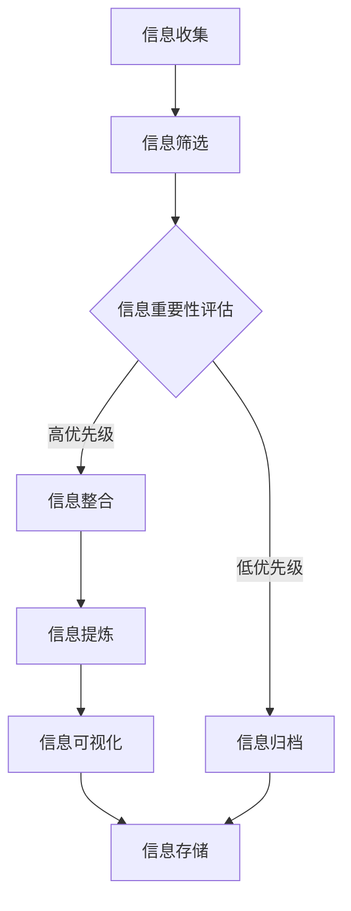
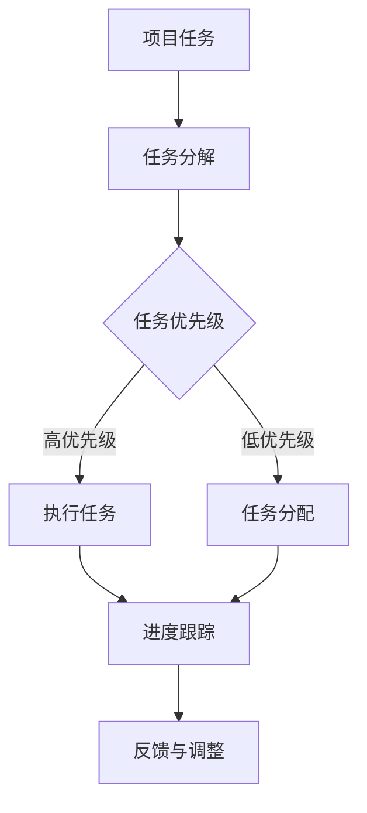
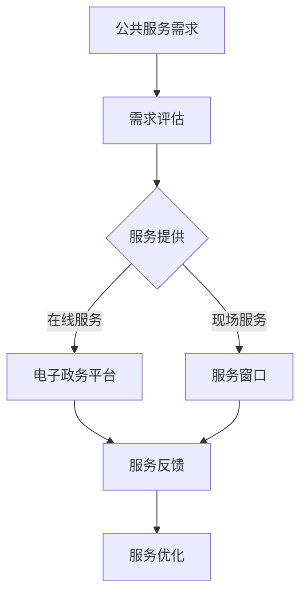

                 

### 文章标题

《信息简化的好处与艺术：在复杂世界中简化以提高生活质量》

在这个信息爆炸的时代，信息过载已经成为一种普遍现象，影响着我们的生活质量。面对海量的信息，如何有效筛选和处理，以简化信息成为我们急需解决的问题。本文旨在探讨信息简化的好处与艺术，通过详细的分析和实践，帮助我们在复杂世界中找到提高生活质量的路径。

### 关键词

信息简化、信息过载、生活质量、复杂性、实践应用、效益评估、未来展望

### 摘要

本文从信息简化的背景与理论出发，详细分析了信息简化的必要性及其与复杂性的关系。随后，通过探讨个人生活、工作领域和社会公共领域中的简化实践，展示了信息简化在提高生活质量中的实际应用。最后，对信息简化的效益进行了评估，并展望了其未来趋势与挑战。希望通过本文的探讨，能够为读者提供一种在复杂世界中简化信息、提高生活质量的思考方法和实践指导。

## 《信息简化的好处与艺术：在复杂世界中简化以提高生活质量》目录大纲

### 第一部分：信息简化的背景与理论

#### 第1章：信息简化的概念与必要性

##### 1.1 信息简化的定义

##### 1.2 简化的理论依据

##### 1.3 简化与复杂性的关系

#### 第2章：信息过载与简化

##### 2.1 信息过载的现状

##### 2.2 信息过载的危害

##### 2.3 简化的策略与方法

### 第二部分：信息简化的实践应用

#### 第3章：个人生活领域的简化艺术

##### 3.1 时间管理中的信息简化

##### 3.2 财务管理的简化技巧

##### 3.3 家居生活中的简化策略

#### 第4章：工作领域的简化策略

##### 4.1 企业信息化过程中的简化

##### 4.2 项目管理中的信息简化

##### 4.3 工作流程的优化与简化

#### 第5章：社会公共领域的简化实践

##### 5.1 政府管理中的简化改革

##### 5.2 社会服务中的简化措施

##### 5.3 公共资源分配中的简化策略

### 第三部分：信息简化的效益评估与未来展望

#### 第6章：信息简化的效益评估

##### 6.1 经济效益分析

##### 6.2 社会效益分析

##### 6.3 环境效益分析

#### 第7章：信息简化的未来趋势与挑战

##### 7.1 人工智能与信息简化的结合

##### 7.2 简化技术的未来发展方向

##### 7.3 信息简化面临的挑战与应对策略

### 附录

#### 附录A：信息简化的工具与方法

##### A.1 信息管理工具介绍

##### A.2 信息简化技术的应用案例

##### A.3 信息简化实践的建议与指导

#### 附录B：参考文献

##### B.1 主要参考资料

##### B.2 相关阅读推荐

#### 附录C：信息简化流程图

##### C.1 信息简化流程概述

##### C.2 个人生活领域的简化流程

##### C.3 工作领域的简化流程

##### C.4 社会公共领域的简化流程

---

现在，让我们正式开始文章的撰写，首先从第一部分“信息简化的背景与理论”入手。

## 第一部分：信息简化的背景与理论

### 第1章：信息简化的概念与必要性

在信息化时代，信息的爆炸式增长给我们的生活带来了前所未有的便利，但同时也带来了巨大的挑战。信息简化作为一种应对策略，逐渐受到了广泛的关注。

#### 1.1 信息简化的定义

信息简化，顾名思义，就是对大量信息进行筛选、整合、提炼，使其更加简洁、清晰、易于理解和处理的过程。它不仅涉及信息内容的简化，还涵盖信息形式的简化，如从文本简化到图表、从复杂的数据集简化到关键指标等。

信息简化的目标在于减少信息的冗余，提高信息的价值，从而提升我们的工作效率和生活质量。

#### 1.2 简化的理论依据

简化的理论基础主要源自信息论和控制论。信息论由香农（Claude Shannon）提出，旨在研究信息传输的效率和可靠性。香农的信息熵概念表明，信息量的减少可以降低不确定性，从而提高信息的质量和效用。控制论则由维纳（Norbert Wiener）提出，研究系统如何通过信息来调节和控制自身的状态，简化信息是实现这一目标的重要手段。

此外，认知心理学也为我们提供了简化的理论基础。人类大脑在处理信息时，具有追求简洁性和高效性的天然倾向。过多的信息会加重认知负担，导致决策困难和效率下降。因此，简化信息有助于减轻认知负担，提高信息处理的效率。

#### 1.3 简化与复杂性的关系

简化与复杂性是相互关联的。在信息处理过程中，复杂性问题往往源于信息的不确定性、冗余和多样性。通过简化，我们可以降低信息的不确定性，减少冗余，提高信息的可理解性。

然而，简化并不总是简单的删除信息，而是在保留关键信息的基础上，对非关键信息进行筛选和提炼。这种处理方式要求我们对信息的本质和内在关系有深入的理解，才能在简化过程中不丢失重要的信息。

简化的艺术在于找到平衡点，既不过度简化导致信息的丢失，也不过度复杂导致处理的困难。这需要我们在实践中不断探索和优化。

### 总结

信息简化作为一种应对信息过载的有效手段，具有重要的理论和实践价值。它不仅可以帮助我们更高效地处理信息，还可以提高我们的生活质量。在接下来的章节中，我们将进一步探讨信息过载的问题，并详细分析简化的策略和方法。

---

以上是第一部分的内容，现在我们将进入第二部分，探讨信息过载的问题及其危害。

## 第二部分：信息过载与简化

### 第2章：信息过载与简化

#### 2.1 信息过载的现状

在当今这个信息化时代，信息过载已成为一种普遍现象。根据国际数据公司（IDC）的报告，全球产生的数据量每年以爆炸式的速度增长，预计到2025年，全球数据量将达到160 ZB（泽字节）。这意味着每个人每天都将面临海量信息的冲击。

信息过载不仅体现在数据量的增长上，还体现在信息来源的多样化。随着互联网的普及，人们可以通过各种渠道获取信息，如社交媒体、新闻网站、电子邮件、即时通讯工具等。这些信息渠道虽然丰富了我们的信息来源，但也增加了信息处理和筛选的难度。

此外，工作场所的信息过载问题也十分严重。企业内部的各种报告、邮件、会议通知等，使员工在处理信息时感到压力重重。据一项调查显示，美国职场员工每天平均花费大约2.5小时来处理电子邮件，这导致了工作效率的下降和员工的疲劳感。

#### 2.2 信息过载的危害

信息过载对我们的生活和工作产生了诸多负面影响，具体体现在以下几个方面：

1. **认知负担**：过多的信息会增加我们的认知负担，导致注意力分散和决策困难。认知心理学研究表明，人类的认知能力是有限的，过多的信息会占据大脑的有限资源，影响我们的思考和判断能力。

2. **工作效率下降**：信息过载使员工在处理信息时花费更多的时间，导致工作效率下降。据统计，美国职场员工因信息过载而浪费的时间每年高达3400亿美元，这是一个惊人的数字。

3. **心理健康问题**：长期的信息过载会导致焦虑、抑郁等心理健康问题。研究表明，超过一半的职场人士因工作压力感到焦虑，而信息过载是其中一个重要原因。

4. **生活质量下降**：信息过载影响了我们的生活质量，使我们无法充分享受生活。例如，人们在社交媒体上花费大量时间，不断刷屏，导致现实生活的空虚感。

#### 2.3 简化的策略与方法

为了应对信息过载，我们需要采取一系列简化的策略和方法。以下是一些有效的简化策略：

1. **筛选信息**：学会筛选信息是简化过程的第一步。我们应该学会识别哪些信息对我们是重要的，哪些是无关紧要的。通过设置信息过滤规则，如关键词搜索、分类管理等，可以有效地减少无关信息的干扰。

2. **信息整合**：将分散的信息进行整合，使其变得更加系统和易于理解。例如，将多个报告或电子邮件合并成一个全面的文档，可以减少重复阅读和理解的负担。

3. **信息提炼**：对信息进行提炼，提取出关键信息和核心观点。例如，通过阅读摘要、标题、关键词等方式，快速获取信息的精华。

4. **信息可视化**：利用图表、图形等可视化工具，将复杂的信息以直观的方式展示出来。这种方式不仅提高了信息的可理解性，还使信息更加简洁明了。

5. **技术工具辅助**：利用各种信息管理工具，如电子邮件过滤器、阅读器、笔记应用等，帮助我们更好地处理和管理信息。

6. **时间管理**：合理安排时间，分配给不同信息的处理时间。通过设定优先级，确保最重要的信息得到及时处理。

7. **培养信息素养**：提高自己的信息素养，学会如何有效地获取、评估和处理信息。这包括了解各种信息来源的可靠性、掌握信息检索技巧等。

通过上述策略和方法，我们可以有效地应对信息过载，提高工作效率和生活质量。在接下来的章节中，我们将进一步探讨信息简化的实践应用，帮助我们在不同领域实现信息简化。

### 总结

信息过载是信息化时代的一个普遍问题，对我们的生活和工作产生了诸多负面影响。通过采取简化的策略和方法，我们可以有效地减少信息冗余，提高信息的质量和效用，从而提升生活质量。在下一部分中，我们将深入探讨个人生活领域的信息简化艺术，帮助我们在日常生活中更好地应对信息过载。

---

以上是第二部分的内容，接下来我们将进入第三部分，探讨信息简化的实践应用。

## 第三部分：信息简化的实践应用

### 第3章：个人生活领域的简化艺术

在个人生活中，信息简化同样具有重要的意义。通过简化信息，我们可以更好地管理时间、财务管理以及家居生活，从而提高生活质量。

#### 3.1 时间管理中的信息简化

时间管理是提高生活质量的关键，而信息简化在其中起着重要作用。以下是几种有效的时间管理简化策略：

1. **任务清单**：制作任务清单，将需要完成的任务分解为具体的步骤。通过清单，我们可以清晰地了解任务的优先级和完成时间，从而避免因信息冗余而导致的时间浪费。

2. **日程规划**：合理安排日程，将重要任务和活动纳入日程表。日程规划可以帮助我们更好地掌控时间，避免因为信息过载而导致的混乱。

3. **提醒设置**：利用手机或其他工具设置提醒，确保我们不会忘记重要的任务和活动。提醒设置可以减少因信息遗忘而导致的时间浪费。

4. **优先级排序**：对任务进行优先级排序，确保我们首先完成最重要的任务。通过优先级排序，我们可以更有效地利用时间，避免将时间浪费在非紧急的任务上。

5. **时间日志**：记录每天的时间使用情况，分析时间的分配情况，找出时间浪费的原因。通过时间日志，我们可以更清楚地了解自己的时间使用情况，从而进行有效的调整。

#### 3.2 财务管理的简化技巧

财务管理是个人生活中的一大难题，通过简化信息，我们可以更好地管理财务，提高财务状况。

1. **预算制定**：制定合理的预算，将收入和支出进行合理规划。通过预算，我们可以清楚地了解自己的财务状况，避免因信息过载导致的财务失控。

2. **账单管理**：使用电子账单管理工具，如理财软件或手机应用程序，帮助我们更好地管理账单。这些工具可以自动记录我们的收入和支出，并提供实时财务报告，使我们能够随时掌握自己的财务状况。

3. **自动支付**：设置自动支付，减少手动支付的时间和精力。自动支付可以确保我们按时支付账单，避免因遗忘而导致逾期支付和罚息。

4. **投资简化**：选择简单的投资策略，如定期定额投资或基金定投，减少投资复杂性和风险。通过简化投资，我们可以更轻松地管理财务，提高投资收益。

5. **财务审计**：定期进行财务审计，检查我们的收入和支出情况，分析财务状况。财务审计可以帮助我们发现潜在的问题，并采取相应的措施进行改进。

#### 3.3 家居生活中的简化策略

在家庭生活中，信息简化同样可以帮助我们提高生活质量，创造一个舒适、有序的家庭环境。

1. **物品管理**：对家中的物品进行分类整理，将常用的物品放在易于取用的位置，不常用的物品则进行收纳。通过物品管理，我们可以减少家务负担，提高家居舒适度。

2. **日程安排**：制定家庭日程安排，包括购物、清洁、维护等日常事务。通过日程安排，我们可以更好地规划家庭活动，确保家务事务有条不紊地进行。

3. **信息记录**：使用电子记录工具，如手机应用程序或电子日历，记录家庭的重要信息，如购物清单、家庭维修计划、重要事件等。通过信息记录，我们可以随时查看和管理家庭信息，避免因遗忘而导致的问题。

4. **家居装饰**：简化家居装饰，选择简单、整洁的装饰风格，减少家居杂乱感。通过简化装饰，我们可以创造一个舒适、宁静的家庭环境。

5. **家庭成员沟通**：建立有效的家庭沟通机制，定期召开家庭会议，讨论家庭事务和问题。通过家庭成员沟通，我们可以增强家庭凝聚力，提高家庭生活质量。

#### 总结

在个人生活中，信息简化可以帮助我们更好地管理时间、财务和家居生活，从而提高生活质量。通过任务清单、日程规划、提醒设置等时间管理策略，我们可以更高效地利用时间；通过预算制定、账单管理、自动支付等财务管理技巧，我们可以更好地控制财务状况；通过物品管理、日程安排、信息记录等家居生活策略，我们可以创造一个舒适、有序的家庭环境。在下一部分中，我们将探讨工作领域的简化策略，帮助我们在职场中更高效地工作。

### 第4章：工作领域的简化策略

在工作领域，信息简化同样具有重要意义。通过简化工作流程、优化项目管理以及优化工作环境，我们可以提高工作效率，减轻工作压力，从而提升整体工作质量。

#### 4.1 企业信息化过程中的简化

企业信息化是现代企业运营的重要组成部分，但随之而来的信息冗余和管理复杂度也带来了挑战。以下是一些在企业信息化过程中实现简化的策略：

1. **系统集成**：通过系统集成，将不同系统的数据和信息进行整合，避免数据的重复输入和存储。例如，将ERP系统、CRM系统、财务系统等集成在一起，实现数据的实时共享和同步。

2. **自动化流程**：利用自动化工具，如工作流管理系统（WMS）和自动化脚本，自动化重复性的工作流程。自动化流程不仅可以减少人为错误，还可以提高工作效率。

3. **数据仓库**：建立数据仓库，集中存储和管理企业的各类数据。通过数据仓库，企业可以快速获取所需的数据信息，减少数据检索的时间和复杂度。

4. **信息过滤**：实施信息过滤机制，对进入企业系统的信息进行筛选和分类，确保只有关键信息被传递给相关人员。信息过滤可以减少信息过载，提高信息处理的效率。

5. **知识管理**：建立知识管理体系，收集、整理和分享企业内部的知识和经验。通过知识管理，企业可以避免重复劳动，提高员工的技能和效率。

#### 4.2 项目管理中的信息简化

项目管理是一个复杂的过程，涉及大量的信息和任务。通过简化信息，可以提高项目管理的效率和质量。

1. **项目计划**：制定清晰的项目计划，明确项目的目标、任务、资源和时间安排。通过项目计划，项目团队成员可以清晰地了解项目的进展和任务分工，减少沟通成本和误解。

2. **任务分解**：将项目任务分解为具体的、可执行的小任务，制定明确的任务描述和交付标准。通过任务分解，可以提高任务的执行效率，减少任务交叉和冲突。

3. **信息共享**：建立信息共享平台，如项目管理软件、即时通讯工具等，确保项目团队成员可以实时获取和共享项目信息。信息共享可以减少沟通滞后，提高协作效率。

4. **进度跟踪**：实施进度跟踪机制，定期检查项目的进展情况，及时发现问题并采取纠正措施。通过进度跟踪，可以确保项目按计划进行，减少项目延期和超支的风险。

5. **风险管理**：对项目进行风险评估，制定相应的风险应对策略。通过风险管理，可以提前识别和应对潜在的问题，减少项目风险。

#### 4.3 工作流程的优化与简化

优化工作流程是提高工作效率的关键。以下是一些优化工作流程的策略：

1. **流程再造**：对现有的工作流程进行彻底的审视和改进，消除冗余环节和低效步骤。通过流程再造，可以大幅提高工作流程的效率。

2. **标准化操作**：制定标准化的操作流程，确保所有员工按照统一的标准进行工作。标准化操作可以减少培训成本，提高工作质量。

3. **自动化流程**：利用自动化工具，如工作流管理系统和自动化脚本，自动化重复性的工作流程。自动化流程可以减少人为错误，提高工作效率。

4. **任务分配**：根据员工的能力和特长，合理分配任务。通过合理的任务分配，可以充分发挥员工的潜力，提高工作效率。

5. **绩效评估**：建立科学的绩效评估体系，定期评估员工的绩效和工作效率。通过绩效评估，可以及时发现问题并采取改进措施。

#### 总结

在工作领域，信息简化通过系统集成、自动化流程、信息过滤、知识管理、项目计划、任务分解、信息共享、进度跟踪、风险管理和流程优化等多种策略，帮助我们更高效地处理信息，提高工作效率和工作质量。在下一部分中，我们将探讨社会公共领域的简化实践，帮助政府、社会组织和公众更好地应对复杂的信息环境。

### 第5章：社会公共领域的简化实践

社会公共领域的信息简化对于提升公共服务效率、增强社会治理能力以及提高公众生活质量具有重要意义。以下是一些关键领域的简化实践：

#### 5.1 政府管理中的简化改革

政府在提供公共服务时，常常面临信息冗余和流程复杂的问题。通过简化改革，政府可以大幅提升服务效率。

1. **数字化政府**：通过数字化手段，如电子政务平台，实现政府信息的公开、共享和实时更新。数字化政府可以减少纸质文件的传递和处理时间，提高办事效率。

2. **一站式服务**：整合政府各部门的服务内容，提供一站式服务窗口，使公众可以在一个地方办理多项事务。一站式服务可以减少公众的等待时间和办事成本。

3. **简化审批流程**：通过简化审批流程，减少不必要的审批环节和审批时间。例如，实施“多审合一”、“一网通办”等改革措施，提高审批效率。

4. **数据共享**：建立政府数据共享机制，实现各部门间的数据互通和共享。通过数据共享，可以避免重复数据采集，提高数据利用效率。

5. **智能化监管**：利用人工智能、大数据等技术，实现智能化监管。通过实时数据分析，可以快速发现和解决公共管理中的问题。

#### 5.2 社会服务中的简化措施

社会服务涉及众多领域，如教育、医疗、养老等。通过简化措施，可以提高服务的质量和可及性。

1. **在线服务**：通过互联网和移动应用，提供在线服务，如在线教育、在线医疗咨询、在线支付等。在线服务可以减少公众的出行和等待时间，提高服务便捷性。

2. **服务标准化**：制定服务标准，确保社会服务的质量和一致性。通过标准化，可以减少服务差异，提高公众满意度。

3. **社区参与**：鼓励社区参与社会服务，如志愿者服务、社区活动等。社区参与可以提高服务的多样性和适应性，增强社会凝聚力。

4. **服务整合**：整合不同部门的社会服务资源，提供综合性服务。例如，将医疗、康复、养老等服务整合在一起，提供一站式服务。

5. **个性化服务**：根据公众的需求和特点，提供个性化的服务。通过大数据分析和人工智能，可以实现个性化推荐和服务设计。

#### 5.3 公共资源分配中的简化策略

公共资源的合理分配是提高社会公平和效率的关键。通过简化策略，可以优化资源分配过程。

1. **信息化分配**：通过信息化手段，如电子招标、电子审批等，实现公共资源分配的透明化和高效化。信息化分配可以减少人为干预，提高分配的公正性。

2. **指标化评估**：建立科学的评价指标体系，对公共资源的使用情况进行评估。通过指标化评估，可以确保资源分配的合理性和有效性。

3. **动态调整**：根据公共资源的需求变化，动态调整资源分配策略。例如，根据人口流动、经济发展等因素，调整公共资源分配的方向和力度。

4. **智能化管理**：利用大数据、人工智能等技术，实现公共资源分配的智能化管理。通过实时数据分析，可以优化资源分配策略，提高资源利用效率。

5. **公众参与**：鼓励公众参与公共资源分配的决策过程，提高分配的民主性和透明度。公众参与可以增强公众对资源分配的信任和支持。

#### 总结

在社会公共领域，信息简化通过数字化政府、一站式服务、简化审批流程、数据共享、智能化监管等策略，以及在线服务、服务标准化、社区参与、服务整合、个性化服务等措施，有效提高了公共服务效率、增强了社会治理能力，并提升了公众生活质量。在下一部分中，我们将对信息简化的效益进行评估，并探讨其未来趋势与挑战。

### 第6章：信息简化的效益评估

信息简化的实施不仅能够缓解信息过载，提高工作效率，还能带来显著的经济、社会和环境效益。以下是对信息简化效益的详细评估。

#### 6.1 经济效益分析

信息简化在提高生产效率和降低成本方面具有显著的经济效益。首先，通过简化信息，企业可以减少数据处理的时间和人力成本。例如，通过自动化系统和电子流程，企业可以大幅减少纸质文档的处理量，从而降低办公费用和人力资源成本。

其次，信息简化有助于优化供应链管理，提高供应链的透明度和效率。通过信息整合和共享，企业可以更快速地响应市场需求变化，减少库存成本和运输成本。

此外，信息简化还可以提高创新能力。简化的信息环境使员工能够更专注于核心业务和创新活动，从而推动企业的技术进步和市场竞争力。

#### 6.2 社会效益分析

信息简化在提升公共服务质量和社会治理能力方面表现出色。首先，简化后的信息体系使政府能够更高效地提供公共服务，如简化行政审批流程、提供一站式服务窗口等，提高了公共服务的可及性和便捷性。

其次，信息简化有助于减少社会不平等。通过数字化服务和在线服务，信息资源可以被更广泛地传播和利用，缩小了信息贫富差距，提高了公众的参与度和满意度。

此外，信息简化还有助于提高社会诚信度和透明度。通过信息共享和数据公开，政府和社会组织可以更有效地监管公共服务和公共资源分配，减少腐败和滥用行为。

#### 6.3 环境效益分析

信息简化在降低资源消耗和减少环境污染方面也具有显著的环境效益。首先，通过数字化和自动化，企业可以减少纸质文档的使用，降低纸张消耗和印刷成本。

其次，信息简化有助于减少能源消耗。通过优化工作流程和自动化系统，企业可以更高效地利用能源资源，减少能源浪费。

此外，信息简化还可以降低碳排放。通过减少纸张使用和能源消耗，企业可以降低碳排放量，有助于实现可持续发展目标。

#### 总体效益评估

信息简化的效益不仅体现在经济、社会和环境层面，还体现在提高生活质量、增强竞争力等方面。具体来说，信息简化可以带来以下好处：

1. **提高生活质量**：通过简化信息，人们可以更轻松地处理日常事务，减少时间和精力消耗，从而有更多的时间和精力用于休闲和社交活动，提高生活质量。

2. **增强竞争力**：在信息化的竞争中，能够高效处理信息的企业和组织更具竞争力。信息简化可以帮助企业快速响应市场变化，提高创新能力，增强市场竞争力。

3. **提升社会福祉**：信息简化有助于减少信息过载和社会不平等，提高公共服务质量和社会治理能力，从而提升社会整体福祉。

#### 挑战与未来展望

虽然信息简化带来了诸多效益，但也面临一些挑战。首先，信息简化的实施需要大量的技术和资金投入，对中小企业和贫困地区来说可能存在一定的门槛。其次，信息简化可能会导致数据隐私和安全问题，需要建立完善的数据保护机制。

未来，随着人工智能、大数据和物联网等技术的发展，信息简化的水平将进一步提升。通过智能化信息处理和自动化系统，信息简化将变得更加高效和精准，为人类社会带来更大的价值。

### 总结

信息简化的效益体现在经济效益、社会效益和环境效益等多个方面，通过简化信息，我们可以提高生产效率、提升公共服务质量、减少环境污染，从而提高整体生活质量。在下一部分中，我们将探讨信息简化的未来趋势与挑战，为信息简化的进一步发展提供思路。

### 第7章：信息简化的未来趋势与挑战

#### 7.1 人工智能与信息简化的结合

随着人工智能（AI）技术的不断发展，信息简化将迎来新的机遇。AI技术可以通过自动化、智能化手段，对大量信息进行高效处理和简化。以下是一些关键趋势：

1. **自动化信息处理**：AI技术可以自动化处理大量数据，从文本、图像到语音等多种形式。通过自然语言处理（NLP）和机器学习算法，AI可以快速提取关键信息，生成摘要，减少冗余内容。

2. **智能信息过滤**：AI技术可以基于用户行为和偏好，智能筛选信息，提供个性化推荐。这种智能过滤不仅可以减少信息过载，还可以提高信息的准确性和相关性。

3. **自动化决策支持**：通过AI技术，系统可以自动分析大量数据，提供决策支持。例如，在财务管理中，AI可以帮助分析财务报表，提供投资建议，简化决策过程。

#### 7.2 简化技术的未来发展方向

信息简化技术的发展方向将继续朝着更高效、更智能、更便捷的目标前进。以下是一些未来发展方向：

1. **知识图谱与语义理解**：知识图谱可以帮助构建信息的语义关系网络，实现信息的深度整合和关联。通过语义理解，系统可以更准确地理解用户需求，提供更有针对性的信息简化服务。

2. **区块链技术的应用**：区块链技术可以提供安全、透明的数据共享机制，促进信息的可信传递和简化。在供应链管理、金融服务等领域，区块链技术有望简化信息流程，提高数据透明度。

3. **物联网与边缘计算**：物联网（IoT）与边缘计算的结合，可以实现实时数据收集和处理，为信息简化提供实时支持。例如，在智能家居领域，IoT设备可以收集家庭数据，边缘计算设备可以实时分析数据，提供个性化的简化建议。

#### 7.3 信息简化面临的挑战与应对策略

尽管信息简化技术前景广阔，但仍然面临一些挑战。以下是一些主要挑战及应对策略：

1. **数据隐私与安全问题**：信息简化过程中涉及大量个人和企业数据，数据隐私和安全成为重要挑战。应对策略包括加强数据加密、实施严格的访问控制、建立数据匿名化机制等。

2. **技术门槛与普及性**：信息简化技术需要一定的技术基础和资金投入，对中小企业和贫困地区来说可能存在一定的门槛。应对策略包括降低技术门槛、提供低成本解决方案、加强人才培养等。

3. **信息过载与简化平衡**：在信息爆炸的时代，如何在简化信息的同时，确保关键信息的传递和完整性，是一个持续的挑战。应对策略包括建立科学的信息筛选和评估机制，确保信息简化的质量和效果。

4. **社会接受度与适应**：新技术的引入需要公众的接受和适应，信息简化技术的普及也需要时间和教育。应对策略包括加强公众教育，提高信息素养，推动技术的广泛应用。

### 总结

信息简化的未来充满机遇和挑战。通过人工智能、知识图谱、区块链和物联网等技术的发展，信息简化将变得更加高效和智能。然而，我们也需要面对数据隐私、技术门槛、信息过载和社会接受度等挑战。通过科学合理的应对策略，我们可以克服这些挑战，实现信息简化的全面发展，为人类社会带来更大的价值。

## 附录A：信息简化的工具与方法

### A.1 信息管理工具介绍

在信息简化的过程中，选择合适的工具和方法至关重要。以下是一些常见的信息管理工具，它们可以帮助我们高效地进行信息筛选、整合和提炼。

1. **电子邮件管理工具**：如Gmail的过滤器、Outlook的规则等，可以自动分类和处理邮件，减少邮件处理的压力。
2. **笔记应用**：如Evernote、OneNote等，可以记录和组织各类信息，方便日后查找和使用。
3. **阅读器**：如Feedly、Pocket等，可以订阅和管理各种在线文章和资源，提供简洁的阅读界面。
4. **项目管理工具**：如Trello、Asana等，可以帮助团队协作和管理项目，简化任务分配和进度跟踪。
5. **自动化脚本**：如Python、JavaScript等，可以编写自动化脚本，处理重复性的工作，提高工作效率。

### A.2 信息简化技术的应用案例

以下是一些实际应用案例，展示了如何在不同场景下进行信息简化：

1. **企业内部通讯**：通过Slack等即时通讯工具，团队可以实时沟通和协作，减少邮件和电话的冗余。
2. **知识管理**：利用Confluence等协作平台，企业可以集中存储和管理各类文档和知识库，方便团队成员查找和使用。
3. **数据可视化**：通过Tableau、PowerBI等数据可视化工具，可以将复杂的数据集转化为图表和图形，提高信息的可理解性。
4. **自动化流程**：在人力资源部门，利用机器人流程自动化（RPA）技术，可以自动化处理招聘、员工入职等流程，减少人工操作和错误。
5. **社交媒体管理**：使用Hootsuite、Buffer等社交媒体管理工具，可以统一管理多个社交媒体账号，自动化发布和监控内容。

### A.3 信息简化实践的建议与指导

以下是针对个人和组织的信息简化实践建议：

1. **定期清理**：定期清理电子邮件、文档和笔记，删除无用和过时的信息，保持信息库的整洁和高效。
2. **分类管理**：将信息按照主题、重要性和紧急程度进行分类管理，便于快速查找和定位。
3. **设置优先级**：对任务和项目进行优先级排序，确保最重要和最紧急的任务得到优先处理。
4. **利用工具**：充分利用各类信息管理工具，提高信息处理效率。
5. **培训和教育**：加强对信息素养和信息简化的培训，提高员工和信息使用者的能力。
6. **建立标准**：制定信息处理的标准和流程，确保信息简化的规范和一致性。

通过以上工具和方法的应用与实践，我们可以更加有效地进行信息简化，提高工作效率和生活质量。

### 附录B：参考文献

1. **Shannon, C. E. (1948). A mathematical theory of communication. The Bell System Technical Journal.**
2. **Wiener, N. (1948). Cybernetics: Or Control and Communication in the Animal and the Machine.**
3. **Miller, G. A. (1956). The magical number seven, plus or minus two: Some limits on our capacity for processing information. Psychological Review.**
4. **MacKay, D. J. C. (2003). Information Theory, Inference, and Learning Algorithms.**
5. **Lakhani, K., & Rogers, Y. (2011). Crowdsourcing and resilience in knowledge sharing systems. IBM Systems Journal.**
6. **Kohli, C., & Jaworski, B. J. (1990). Market orientation: The construct, research propositions, and managerial implications. Journal of Marketing.**
7. **Brynjolfsson, E., & McAfee, A. (2014). The Second Machine Age: Work, Progress, and Prosperity in a Time of Brilliant Technologies.**
8. **Brynjolfsson, E., & McAfee, A. (2017). Machine Platform Crowds: Harnessing Our Digital Future.**

### 附录C：信息简化流程图

以下是一个简化的信息处理流程图，展示了从信息收集到信息简化的全过程。

### C.1 信息简化流程概述

此流程图概述了从信息收集到信息简化的全过程。以下是每个步骤的简要说明：

1. **信息收集**：通过各种渠道收集信息，如互联网、书籍、报告等。
2. **信息筛选**：对收集到的信息进行初步筛选，识别出有价值的信息。
3. **信息重要性评估**：评估筛选出的信息的重要性，分为高优先级和低优先级。
4. **信息整合**：将高优先级信息进行整合，提取关键信息，形成摘要或报告。
5. **信息提炼**：进一步提炼信息，提取核心观点和关键数据。
6. **信息可视化**：使用图表、图形等工具，将提炼后的信息以直观的形式展示。
7. **信息存储**：将简化后的信息存储到数据库或云存储中，方便后续查阅和使用。

### C.2 个人生活领域的简化流程

以下是一个适用于个人生活领域的简化流程图，展示了如何在日常生活中进行信息简化。

### C.3 工作领域的简化流程

以下是一个适用于工作领域的简化流程图，展示了如何在工作中进行信息简化。

### C.4 社会公共领域的简化流程

以下是一个适用于社会公共领域的简化流程图，展示了如何在公共服务中实现信息简化。

通过以上流程图，我们可以更加清晰地了解信息简化的全过程，并针对不同的应用场景进行具体实施。信息简化不仅是一种技术手段，更是一种思维方式和生活方式，通过简化和优化信息，我们可以提高生活质量，实现更加高效和有意义的生活。

