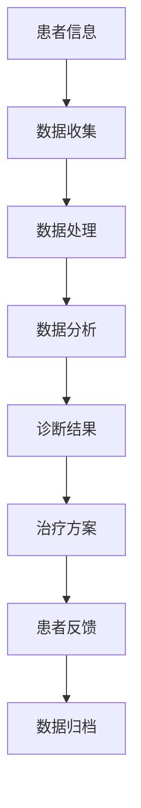
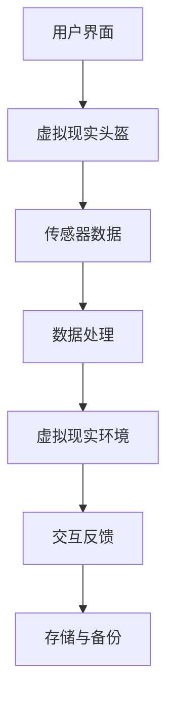
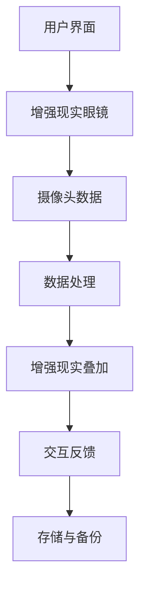

                 

### 1. 元宇宙与医疗：背景与展望

#### 1.1 元宇宙的定义与特点

元宇宙（Metaverse）是一个广泛的概念，涵盖了虚拟现实（VR）、增强现实（AR）、游戏技术、社交平台以及区块链等多种技术手段的融合。简单来说，元宇宙是一个由数字世界和物理世界相互交织、持续交互的虚拟空间。在这个空间中，人们可以通过虚拟角色（Avatar）进行互动，体验与现实世界相似的甚至超越现实的沉浸式体验。

元宇宙具有以下特点：

1. **虚拟性和现实性共存**：元宇宙提供了一个虚拟的世界，用户可以在其中创建和定制自己的虚拟形象，进行各种活动，但这个虚拟世界与现实世界有着紧密的联系，例如通过虚拟现实设备实现与现实环境的无缝交互。

2. **高度沉浸感**：元宇宙通过先进的虚拟现实和增强现实技术，使用户能够获得强烈的沉浸感，仿佛真的置身于另一个世界。

3. **多元化互动**：元宇宙允许用户在虚拟空间中与其他用户进行多样化的互动，包括社交、工作、学习、游戏等多种形式。

4. **分布式架构**：元宇宙基于分布式计算和区块链技术，保证了数据的安全性和去中心化，避免了单点故障和数据篡改的风险。

#### 1.2 元宇宙在医疗领域的应用潜力

元宇宙在医疗领域的应用潜力巨大，主要体现在以下几个方面：

1. **远程医疗**：元宇宙可以为医生和患者提供虚拟的医疗环境，实现远程诊断、治疗和康复。患者可以通过虚拟现实设备在家中接受医生的诊疗，节省了时间和费用。

2. **医学教育**：元宇宙提供了一个虚拟的医学教育平台，医学生和医务人员可以在其中进行沉浸式的学习和实践，模拟真实的医疗场景，提高专业技能。

3. **医学研究**：元宇宙可以模拟复杂的生物系统和疾病模型，为医学研究提供新的工具和方法，加速新药研发和疾病治疗。

4. **心理治疗**：元宇宙可以用于心理治疗，提供一个安全、无压力的虚拟环境，让患者进行心理康复和情绪调节。

5. **手术规划和指导**：元宇宙可以模拟手术过程，医生可以在虚拟环境中进行手术演练，提高手术技能和安全性。

#### 1.3 医疗行业的变革与元宇宙的机遇

随着元宇宙技术的不断发展，医疗行业也迎来了新的变革机遇：

1. **个性化医疗**：元宇宙可以根据患者的个性化数据，提供定制化的治疗方案和康复计划，提高医疗效果。

2. **智能健康管理**：元宇宙可以整合患者的健康数据，通过数据分析实现智能健康管理，预防疾病发生。

3. **健康社交**：元宇宙可以打造一个健康的社交平台，鼓励用户分享健康知识和经验，促进健康生活方式的养成。

4. **医疗资源优化**：元宇宙可以帮助医疗机构优化资源配置，提高医疗服务的效率和质量。

总之，元宇宙与医疗的结合，将带来全新的诊疗体验和医疗模式，为医疗行业的创新和发展提供强大的动力。在接下来的章节中，我们将深入探讨元宇宙医疗的核心概念、架构和技术，以及其在实际应用中的挑战和解决方案。

### 2. 元宇宙医疗的核心概念与架构

#### 2.1 元宇宙医疗的基本概念

元宇宙医疗（Metaverse Healthcare）是指利用元宇宙技术，构建一个虚拟的医疗环境，为医生、患者和研究人员提供一个沉浸式、互动性强的医疗体验。在元宇宙医疗中，医生和患者可以通过虚拟现实（VR）和增强现实（AR）设备，进入一个模拟的医疗空间，进行诊断、治疗和康复等活动。

元宇宙医疗的核心概念包括：

1. **虚拟医疗环境**：通过虚拟现实和增强现实技术，创建一个与现实世界高度相似的医疗环境，医生和患者可以在其中进行互动和操作。

2. **虚拟患者**：利用虚拟现实技术，创建一个虚拟的患者模型，医生可以在其中进行各种诊断和治疗操作，提高诊断准确性和治疗效果。

3. **虚拟手术**：通过虚拟现实技术，模拟手术过程，医生可以在虚拟环境中进行手术演练，提高手术技能和安全性。

4. **远程医疗**：利用元宇宙技术，实现医生和患者之间的远程互动，医生可以在元宇宙中为患者提供诊断和治疗服务。

5. **医学教育**：利用元宇宙技术，提供一个沉浸式的医学教育平台，医学生和医务人员可以在其中进行学习和实践，提高专业技能。

#### 2.2 元宇宙医疗的架构设计

元宇宙医疗的架构设计主要包括以下几个方面：

1. **硬件设备**：包括虚拟现实头盔、增强现实眼镜、手柄控制器等，这些设备用于用户与虚拟医疗环境的交互。

2. **软件平台**：包括虚拟医疗环境的创建和管理软件、远程医疗平台、医学图像处理软件等，这些软件平台为用户提供沉浸式的医疗体验。

3. **数据管理**：包括患者健康数据、医学影像数据、基因数据等，这些数据通过区块链技术进行安全存储和管理，确保数据的完整性和隐私性。

4. **网络通信**：包括云计算、5G网络、边缘计算等，这些技术为元宇宙医疗提供了高速、稳定的数据传输通道。

5. **人工智能**：包括自然语言处理、计算机视觉、深度学习等，这些人工智能技术为元宇宙医疗提供了智能诊断、治疗和康复方案。

#### 2.3 元宇宙医疗的关键技术

元宇宙医疗的实现依赖于以下关键技术：

1. **虚拟现实技术**：包括3D建模、实时渲染、传感器技术等，这些技术用于创建和显示虚拟医疗环境，提供高度沉浸感的体验。

2. **增强现实技术**：包括光学显示、摄像头追踪、计算机视觉等，这些技术用于将虚拟医疗信息叠加在现实环境中，实现现实与虚拟的融合。

3. **区块链技术**：包括分布式账本、智能合约、加密算法等，这些技术用于保证患者数据的隐私和安全，实现去中心化的数据管理。

4. **人工智能技术**：包括自然语言处理、计算机视觉、深度学习等，这些技术用于智能诊断、治疗和康复方案的设计和实施。

5. **大数据技术**：包括数据采集、存储、处理和分析等，这些技术用于对海量医疗数据进行挖掘和分析，为医疗决策提供支持。

#### 2.4 元宇宙医疗的应用场景分析

元宇宙医疗的应用场景非常广泛，主要包括以下几个方面：

1. **远程医疗**：医生可以通过元宇宙医疗平台，远程为患者提供诊断和治疗服务，特别是对于偏远地区的患者，元宇宙医疗可以提供便捷的医疗资源。

2. **医学教育**：医学生和医务人员可以通过元宇宙医疗平台，进行沉浸式的学习和实践，提高专业技能。

3. **医学研究**：研究人员可以通过元宇宙医疗平台，模拟复杂的生物系统和疾病模型，加速医学研究和新药研发。

4. **手术规划和指导**：医生可以在元宇宙中进行手术演练，提高手术技能和安全性，同时可以为患者提供更加精准的手术方案。

5. **心理治疗**：患者可以在元宇宙中接受心理治疗，通过虚拟现实技术缓解压力和焦虑，提高心理康复效果。

6. **健康管理和康复**：患者可以通过元宇宙医疗平台，进行个性化的健康管理和康复训练，提高生活质量。

总之，元宇宙医疗为医疗行业带来了前所未有的变革机遇，通过虚拟与现实结合的诊疗体验，为医生、患者和研究人员提供了一个全新的医疗生态系统。在接下来的章节中，我们将进一步探讨虚拟现实技术在医疗中的应用，以及如何通过虚拟与现实结合，为医疗行业带来深刻的变革。

### 3. 虚拟现实技术在医疗中的应用

#### 3.1 虚拟现实技术概述

虚拟现实（Virtual Reality，VR）是一种通过计算机生成模拟环境，利用传感器和头戴显示器（HMD）等技术，让用户在虚拟环境中获得沉浸式体验的技术。在医疗领域，虚拟现实技术被广泛应用于医学教育、远程医疗、心理治疗等多个方面，为医生和患者提供了全新的诊疗体验。

#### 3.2 虚拟现实技术在医疗诊断中的应用

虚拟现实技术在医疗诊断中的应用主要包括以下几个方面：

1. **医学影像重建**：通过虚拟现实技术，医生可以将医学影像数据（如CT、MRI等）转化为三维模型，进行直观的诊断和分析。这种技术使得医生能够更准确地识别病变部位和性质，提高诊断准确性。

   **Mermaid 流程图**：
   ```mermaid
   graph TD
   A[医学影像数据] --> B[数据预处理]
   B --> C[三维重建算法]
   C --> D[三维可视化模型]
   D --> E[诊断分析]
   ```

2. **虚拟手术模拟**：医生可以在虚拟现实环境中进行手术模拟，通过反复演练，提高手术技能和安全性。此外，虚拟手术模拟还可以用于新手术方案的测试和优化。

   **Mermaid 流程图**：
   ```mermaid
   graph TD
   A[手术方案] --> B[虚拟现实环境]
   B --> C[手术模拟]
   C --> D[技能评估]
   ```

3. **虚拟患者咨询**：医生可以通过虚拟现实技术，为患者提供虚拟的患者模型，进行详细的诊断和解释。这种技术使得患者更容易理解自己的病情和治疗方案。

   **Mermaid 流程图**：
   ```mermaid
   graph TD
   A[患者信息] --> B[虚拟患者模型]
   B --> C[诊断咨询]
   ```

#### 3.3 虚拟现实技术在医疗治疗中的应用

虚拟现实技术在医疗治疗中的应用主要包括以下几个方面：

1. **疼痛管理**：虚拟现实技术可以通过分散患者的注意力，减轻疼痛感。医生可以为患者提供虚拟旅游、游戏等体验，帮助患者缓解手术后的疼痛。

   **伪代码**：
   ```python
   def pain_management(patient):
       # 创建虚拟现实环境
       virtual_world = create_vr_world()
       
       # 分散患者注意力
       while patient.in_pain():
           show_interesting_content(virtual_world)
           
       # 结束疼痛管理
       end_pain_management()
   ```

2. **康复训练**：虚拟现实技术可以模拟康复训练环境，为患者提供个性化的康复方案。医生可以根据患者的具体情况，设计不同的康复训练任务，帮助患者恢复功能。

   **伪代码**：
   ```python
   def rehab_training(patient):
       # 创建虚拟康复环境
       virtual_rehab = create_vr_rehab_environment()
       
       # 根据患者情况设计训练任务
       tasks = design_training_tasks(patient)
       
       # 开始康复训练
       for task in tasks:
           perform_task(virtual_rehab, task)
           
       # 结束康复训练
       end_rehab_training()
   ```

3. **心理治疗**：虚拟现实技术可以用于心理治疗，为患者提供一个安全、无压力的虚拟环境，进行情绪调节和认知行为治疗。医生可以通过虚拟现实技术，帮助患者克服恐惧、焦虑等心理问题。

   **伪代码**：
   ```python
   def psychological_treatment(patient):
       # 创建虚拟治疗环境
       virtual_treatment = create_vr_treatment_environment()
       
       # 进行心理治疗
       while patient.in_treatment():
           show_calming_content(virtual_treatment)
           perform_treatment(patient)
           
       # 结束心理治疗
       end_treatment()
   ```

#### 3.4 虚拟现实技术在医疗培训中的应用

虚拟现实技术在医疗培训中的应用，可以提高医学生的实践技能和医生的专业水平。以下是虚拟现实技术在医疗培训中的几个应用场景：

1. **手术技能培训**：医学生和医生可以通过虚拟手术模拟器，进行手术技能的练习。这种技术可以帮助他们熟悉手术流程，提高手术成功率。

   **伪代码**：
   ```python
   def surgical_training(doctor):
       # 创建虚拟手术环境
       virtual_surgery = create_vr_surgery_environment()
       
       # 进行手术模拟
       while not mastered():
           perform_surgery(virtual_surgery)
           
       # 完成手术培训
       end_training()
   ```

2. **医学知识学习**：虚拟现实技术可以创建一个三维的医学知识库，医学生可以通过虚拟现实设备进行互动式学习，加深对医学知识的理解和记忆。

   **伪代码**：
   ```python
   def medical_knowledge_learning(student):
       # 创建虚拟医学知识库
       virtual_library = create_vr_medical_library()
       
       # 开始学习
       while not completed():
           learn_topic(virtual_library)
           
       # 学习完成
       end_learning()
   ```

3. **急救培训**：虚拟现实技术可以模拟急救场景，为医学生和医护人员提供实战演练的机会，提高急救技能和反应速度。

   **伪代码**：
   ```python
   def first_aid_training(personnel):
       # 创建虚拟急救场景
       virtual_ems = create_vr_ems_scenarios()
       
       # 进行急救演练
       while not mastered():
           perform_first_aid(virtual_ems)
           
       # 完成急救培训
       end_training()
   ```

#### 3.5 虚拟现实技术在医疗康复中的应用

虚拟现实技术在医疗康复中的应用，可以帮助患者提高康复效果，加速康复进程。以下是虚拟现实技术在医疗康复中的几个应用场景：

1. **肢体康复**：通过虚拟现实技术，患者可以进行虚拟的肢体运动，这种技术可以帮助患者恢复肢体功能，提高康复效果。

   **伪代码**：
   ```python
   def limb_rehabilitation(patient):
       # 创建虚拟康复环境
       virtual_rehab = create_vr_rehab_environment()
       
       # 进行康复训练
       while not fully_recovered():
           perform_rehabilitation(virtual_rehab)
           
       # 康复完成
       end_rehabilitation()
   ```

2. **认知康复**：虚拟现实技术可以创建认知康复任务，帮助患者恢复认知功能，提高生活质量。

   **伪代码**：
   ```python
   def cognitive_rehabilitation(patient):
       # 创建虚拟康复环境
       virtual_rehab = create_vr_rehab_environment()
       
       # 进行认知训练
       while not fully_recovered():
           perform_cognitive_training(virtual_rehab)
           
       # 认知康复完成
       end_rehabilitation()
   ```

3. **心理康复**：虚拟现实技术可以为心理康复提供虚拟环境，帮助患者缓解压力，提高心理康复效果。

   **伪代码**：
   ```python
   def psychological_rehabilitation(patient):
       # 创建虚拟康复环境
       virtual_rehab = create_vr_rehab_environment()
       
       # 进行心理康复
       while not fully_recovered():
           perform_psychological_rehabilitation(virtual_rehab)
           
       # 心理康复完成
       end_rehabilitation()
   ```

综上所述，虚拟现实技术在医疗诊断、治疗、培训、康复等各个领域都有广泛应用，为医生和患者提供了全新的诊疗体验。通过虚拟与现实结合，虚拟现实技术正在深刻改变医疗行业，提高医疗服务的质量和效率。

### 4. 增强现实技术在医疗中的应用

#### 4.1 增强现实技术概述

增强现实（Augmented Reality，AR）是一种将虚拟信息叠加到真实世界的技术。通过AR设备（如AR眼镜、手机等），用户可以在现实环境中看到增强的信息，这些信息可以是文字、图像、三维模型等。在医疗领域，增强现实技术被广泛应用于诊断、治疗、培训和康复等方面，为医疗行业带来了前所未有的变革。

#### 4.2 增强现实技术在医疗诊断中的应用

增强现实技术在医疗诊断中的应用，使得医生能够在真实的医疗环境中，实时获取和显示重要的医学信息，从而提高诊断准确性。以下是增强现实技术在医疗诊断中的几个应用场景：

1. **手术导航**：在手术过程中，医生可以通过增强现实眼镜，实时查看患者的内部结构和手术区域的3D图像，提高手术精度和安全性。

   **Mermaid 流程图**：
   ```mermaid
   graph TD
   A[手术区域] --> B[增强现实设备]
   B --> C[3D图像显示]
   C --> D[手术导航]
   ```

2. **病理诊断**：医生可以通过增强现实技术，将病理切片的图像叠加在显微镜下观察的实际样本上，方便快速准确地进行病理分析。

   **Mermaid 流程图**：
   ```mermaid
   graph TD
   A[病理样本] --> B[增强现实显微镜]
   B --> C[图像叠加]
   C --> D[病理诊断]
   ```

3. **远程诊断**：医生可以通过增强现实技术，将患者的医学影像数据实时传输到远程诊断中心，专家可以在增强现实设备上查看和分析影像，提供远程诊断建议。

   **Mermaid 流程图**：
   ```mermaid
   graph TD
   A[患者影像数据] --> B[增强现实传输]
   B --> C[远程专家诊断]
   ```

#### 4.3 增强现实技术在医疗治疗中的应用

增强现实技术在医疗治疗中的应用，使得医生可以在真实环境中，利用虚拟信息辅助治疗，提高治疗效果。以下是增强现实技术在医疗治疗中的几个应用场景：

1. **个性化治疗方案设计**：医生可以通过增强现实技术，在患者的实际身体上进行手术规划，设计出个性化的治疗方案，提高手术成功率。

   **伪代码**：
   ```python
   def personalized_treatment_plan(patient):
       # 创建增强现实手术规划环境
       ar_environment = create_ar_surgery_environment()
       
       # 设计个性化手术方案
       plan = design_treatment_plan(patient, ar_environment)
       
       # 执行手术
       perform_surgery(patient, plan)
   ```

2. **微创手术指导**：医生可以通过增强现实技术，在手术过程中实时显示手术工具的位置和方向，指导微创手术的进行，减少手术风险。

   **伪代码**：
   ```python
   def minimally_invasive_surgery_guidance(patient):
       # 创建增强现实手术指导环境
       ar_guidance = create_ar_surgery_guidance()
       
       # 显示手术工具位置和方向
       display_tool_position(patient, ar_guidance)
       
       # 执行微创手术
       perform_minimally_invasive_surgery(patient)
   ```

3. **术后康复指导**：医生可以通过增强现实技术，为患者提供个性化的康复指导，帮助患者更好地进行术后康复。

   **伪代码**：
   ```python
   def postoperative_rehabilitation_guidance(patient):
       # 创建增强现实康复环境
       ar_rehabilitation = create_ar_rehabilitation_environment()
       
       # 提供康复指导
       guide_rehabilitation(patient, ar_rehabilitation)
       
       # 跟踪康复进度
       track_rehabilitation_progress(patient)
   ```

#### 4.4 增强现实技术在医疗培训中的应用

增强现实技术在医疗培训中的应用，为医学生和医务人员提供了一个沉浸式的学习环境，提高他们的专业技能。以下是增强现实技术在医疗培训中的几个应用场景：

1. **手术技能培训**：医学生可以通过增强现实模拟器，进行手术技能的练习，提高手术操作的准确性和熟练度。

   **伪代码**：
   ```python
   def surgical_skill_training(student):
       # 创建增强现实手术模拟环境
       ar_simulation = create_ar_surgery_simulation()
       
       # 进行手术技能训练
       train_student(student, ar_simulation)
       
       # 评估手术技能
       evaluate_surgical_skill(student)
   ```

2. **医学知识学习**：医学生可以通过增强现实技术，在真实环境中学习医学知识，加深对知识的理解和记忆。

   **伪代码**：
   ```python
   def medical_knowledge_learning(student):
       # 创建增强现实医学知识库
       ar_knowledge_base = create_ar_medical_knowledge_base()
       
       # 开始学习
       learn_knowledge(student, ar_knowledge_base)
       
       # 学习评估
       evaluate_learning(student)
   ```

3. **急救培训**：医务人员可以通过增强现实技术，模拟急救场景，提高急救技能和反应速度。

   **伪代码**：
   ```python
   def first_aid_training(personnel):
       # 创建增强现实急救场景
       ar_ems_scenario = create_ar_ems_scenario()
       
       # 进行急救技能训练
       train_personnel(personnel, ar_ems_scenario)
       
       # 评估急救技能
       evaluate_first_aid_skill(personnel)
   ```

#### 4.5 增强现实技术在医疗康复中的应用

增强现实技术在医疗康复中的应用，可以帮助患者更好地进行康复训练，提高康复效果。以下是增强现实技术在医疗康复中的几个应用场景：

1. **肢体康复训练**：通过增强现实技术，患者可以在虚拟环境中进行肢体运动，这种技术可以帮助患者恢复肢体功能，提高康复效果。

   **伪代码**：
   ```python
   def limb_rehabilitation_training(patient):
       # 创建增强现实康复环境
       ar_rehabilitation = create_ar_rehabilitation_environment()
       
       # 进行康复训练
       perform_rehabilitation(patient, ar_rehabilitation)
       
       # 跟踪康复进度
       track_rehabilitation_progress(patient)
   ```

2. **认知康复训练**：通过增强现实技术，患者可以进行认知康复任务，这种技术可以帮助患者恢复认知功能，提高生活质量。

   **伪代码**：
   ```python
   def cognitive_rehabilitation_training(patient):
       # 创建增强现实康复环境
       ar_rehabilitation = create_ar_rehabilitation_environment()
       
       # 进行认知训练
       perform_cognitive_training(patient, ar_rehabilitation)
       
       # 跟踪康复进度
       track_rehabilitation_progress(patient)
   ```

3. **心理康复训练**：通过增强现实技术，患者可以在虚拟环境中进行心理康复训练，这种技术可以帮助患者缓解压力，提高心理康复效果。

   **伪代码**：
   ```python
   def psychological_rehabilitation_training(patient):
       # 创建增强现实康复环境
       ar_rehabilitation = create_ar_rehabilitation_environment()
       
       # 进行心理康复训练
       perform_psychological_rehabilitation(patient, ar_rehabilitation)
       
       # 跟踪康复进度
       track_rehabilitation_progress(patient)
   ```

综上所述，增强现实技术在医疗诊断、治疗、培训和康复等各个领域都有广泛应用，为医生和患者提供了全新的诊疗体验。通过增强现实技术与现实世界的结合，医疗行业正迈向更加智能化、高效化的未来。

### 5. 虚拟与现实结合的诊疗体验

#### 5.1 虚拟与现实结合的诊疗体验概述

虚拟与现实结合的诊疗体验是指利用虚拟现实（VR）和增强现实（AR）技术，将虚拟世界与现实世界相结合，为医生和患者提供一种全新的诊疗方式。在这种体验中，医生可以通过虚拟现实技术进入一个模拟的医疗环境，进行手术模拟、诊断分析和治疗方案设计；同时，通过增强现实技术，医生可以在现实环境中实时查看患者的医学影像、手术导航等关键信息，提高诊疗的准确性和效率。

#### 5.2 虚拟与现实结合的诊疗体验案例

1. **案例一：远程手术**

在某次远程手术中，医生位于A地，患者位于B地。医生通过VR头盔进入虚拟手术环境，进行手术模拟和规划，模拟过程中医生可以与B地的医疗团队实时交流。手术当天，医生佩戴AR眼镜，在B地手术室中通过增强现实技术实时查看患者的内部结构和手术区域，进行精准的手术操作。这种虚拟与现实结合的诊疗方式，不仅提高了手术的成功率，还减少了患者的旅行时间和费用。

2. **案例二：医学教育**

在某所医学院，医学生通过VR设备进入一个虚拟的医学实验室，进行人体解剖、病理分析等实践操作。同时，通过AR设备，医学生可以在教室中实时查看虚拟的解剖模型和病理图像，加深对医学知识的理解和记忆。教师可以通过VR设备实时观察学生的操作过程，进行指导和评价。这种虚拟与现实结合的教学方式，提高了医学生的实践技能和学习效果。

3. **案例三：心理治疗**

在某次心理治疗中，患者通过VR设备进入一个虚拟的放松环境，医生通过AR设备在现实环境中观察患者的反应。医生可以通过虚拟现实技术，逐步引导患者缓解焦虑和恐惧，同时通过增强现实技术，在患者的视野中实时显示放松训练的提示和指导。患者在这种虚拟与现实结合的治疗中，感受到了身心的放松和改善。

4. **案例四：康复训练**

在某次康复训练中，患者通过VR设备进入一个虚拟的运动环境，进行肢体的康复训练。同时，通过AR设备，患者可以在现实环境中实时查看训练进度和指导信息。康复医生可以通过VR设备和AR设备，实时监控患者的训练情况，调整康复方案，提高康复效果。

#### 5.3 虚拟与现实结合的诊疗体验的未来发展

1. **技术进步**：随着VR和AR技术的不断进步，诊疗体验的沉浸感和交互性将进一步提高。例如，更高质量的VR头盔和AR眼镜，将提供更加真实的虚拟环境和现实信息叠加效果。

2. **应用场景扩展**：虚拟与现实结合的诊疗体验将应用到更多的医疗领域，如癌症治疗、眼科手术、儿科治疗等。同时，这种诊疗方式也将应用于预防医学和公共卫生领域，提供个性化的健康管理和预防服务。

3. **跨学科融合**：虚拟与现实结合的诊疗体验将与其他学科（如人工智能、大数据、物联网等）相结合，形成更加完善的医疗生态系统。例如，通过大数据分析，为患者提供个性化的诊疗方案；通过人工智能，实现智能化的诊疗辅助和健康管理。

4. **医疗模式的变革**：虚拟与现实结合的诊疗体验将带来医疗模式的变革，医生与患者的互动方式、诊疗流程、医疗服务模式等都将发生重大变化。这种变革将提高医疗服务的效率和质量，降低医疗成本，为患者提供更加便捷、高效、个性化的医疗服务。

总之，虚拟与现实结合的诊疗体验为医疗行业带来了前所未有的变革机遇，通过不断的技术创新和应用场景的扩展，这种诊疗方式将深刻改变医疗行业的面貌，为人类健康事业做出更大的贡献。

### 6. 元宇宙医疗面临的挑战

#### 6.1 技术挑战

元宇宙医疗的发展虽然带来了诸多机遇，但同时也面临着技术上的挑战：

1. **硬件设备限制**：现有的VR和AR设备在分辨率、帧率、视角范围等方面仍有待提高，这影响了用户体验和诊疗效果。

2. **网络延迟**：元宇宙医疗依赖于高速、稳定的网络环境，尤其是远程医疗和实时手术导航等应用，对网络延迟和带宽要求较高。然而，当前的网络基础设施可能无法完全满足这些需求。

3. **数据隐私与安全**：元宇宙医疗涉及到大量的患者健康数据，这些数据需要高度的安全保障，防止泄露、篡改和滥用。尽管区块链技术提供了数据去中心化和加密的可能性，但仍然需要进一步的技术优化和监管。

4. **技术标准化**：元宇宙医疗涉及多种技术，包括虚拟现实、增强现实、人工智能、区块链等，不同技术的标准不一致，导致系统集成和互操作性成为难题。

#### 6.2 医疗伦理与隐私保护

元宇宙医疗在伦理和隐私保护方面也面临挑战：

1. **患者隐私**：元宇宙医疗中，患者的信息需要被高度保护，防止未经授权的访问和泄露。如何在提供便捷医疗服务的同时，确保患者隐私不受侵犯，是一个亟待解决的问题。

2. **数据伦理**：患者在元宇宙医疗中的数据不仅用于诊断和治疗，还可能被用于医学研究和商业分析。如何平衡数据利用和患者权益，确保数据使用符合伦理规范，是一个重要挑战。

3. **虚拟身份伦理**：元宇宙医疗中的虚拟患者和医生身份可能不真实，这带来了伦理问题，如虚假诊断、欺诈行为等。如何确保虚拟身份的真实性和合法性，需要明确的伦理和法律规范。

#### 6.3 医疗监管与法规

元宇宙医疗的监管和法规问题也需要重视：

1. **法律法规滞后**：当前医疗行业的法律法规尚未完全适应元宇宙医疗的发展，特别是在远程医疗、虚拟手术等领域，缺乏明确的监管框架和标准。

2. **跨国监管挑战**：元宇宙医疗是一个全球性的问题，涉及到多个国家和地区。如何协调不同国家的法律法规，确保跨国医疗服务合规，是一个重要挑战。

3. **监管技术与能力**：随着元宇宙医疗技术的发展，医疗监管机构需要具备相应的技术能力和监管手段，才能有效监管元宇宙医疗服务。

#### 6.4 医患沟通与信任

元宇宙医疗在医患沟通和信任方面也存在挑战：

1. **技术障碍**：一些患者可能对VR和AR技术不熟悉，甚至有抵触情绪，这影响了医患之间的沟通效果。

2. **信任问题**：虚拟环境中的诊疗体验可能与现实中的诊疗体验存在差异，患者可能对虚拟诊疗效果产生怀疑，影响医患信任。

3. **医患互动**：在元宇宙医疗中，医患之间的互动主要通过虚拟方式实现，如何确保医患互动的真诚和有效性，是一个重要问题。

#### 解决方案

针对上述挑战，可以采取以下解决方案：

1. **技术创新**：持续研发更高性能的VR和AR设备，优化网络传输技术，提高数据处理速度和稳定性，为元宇宙医疗提供更好的技术支持。

2. **数据保护**：采用先进的数据加密和去中心化技术，确保患者数据的安全和隐私。建立严格的数据使用规范和伦理审查机制，确保数据利用符合伦理和法律要求。

3. **法规完善**：加快制定元宇宙医疗的法律法规，明确监管职责和标准。推动跨国监管合作，确保全球范围内的医疗服务合规。

4. **医患沟通**：通过培训和宣传，提高患者对VR和AR技术的了解和接受度。加强医患之间的沟通，确保患者在元宇宙医疗中的信任和满意度。

5. **伦理指导**：建立元宇宙医疗的伦理规范和标准，确保虚拟患者和医生身份的真实性和合法性。推动医患双方的诚信合作，建立长期信任关系。

通过上述解决方案，可以有效应对元宇宙医疗面临的挑战，推动医疗行业的创新和发展。

### 7. 元宇宙医疗的解决方案

#### 7.1 技术创新与优化

为了应对元宇宙医疗面临的诸多挑战，技术创新和优化是关键。以下是几个方面的技术创新和优化策略：

1. **高性能VR和AR设备**：研发更高性能的VR和AR设备，包括更高分辨率、更快响应速度、更广视角范围和更舒适的使用体验。通过先进的光学设计和图形处理技术，提高设备的真实感和沉浸感。

   **Mermaid 流程图**：
   ```mermaid
   graph TD
   A[研发高性能设备] --> B[光学设计优化]
   B --> C[图形处理技术]
   C --> D[用户舒适度提升]
   ```

2. **低延迟网络技术**：优化网络传输技术，减少延迟和带宽限制。通过5G网络、边缘计算和云计算等技术，实现高速、稳定的网络连接，为元宇宙医疗提供实时交互的支持。

   **Mermaid 流程图**：
   ```mermaid
   graph TD
   A[5G网络] --> B[边缘计算]
   B --> C[云计算]
   C --> D[低延迟传输]
   ```

3. **数据加密与去中心化**：采用先进的加密算法和区块链技术，确保患者数据的安全和隐私。通过去中心化的数据管理，防止数据篡改和泄露。

   **Mermaid 流程图**：
   ```mermaid
   graph TD
   A[加密技术] --> B[区块链]
   B --> C[去中心化数据管理]
   ```

4. **人工智能辅助**：利用人工智能技术，实现智能诊断、治疗和康复方案的设计。通过大数据分析和机器学习，提高诊疗的准确性和个性化水平。

   **伪代码**：
   ```python
   def intelligent_diagnosis(data):
       # 数据预处理
       processed_data = preprocess_data(data)
       
       # 智能诊断
       diagnosis = ai_diagnosis(processed_data)
       
       # 辅助决策
       decision_support = generate_decision_support(diagnosis)
       
       return decision_support
   ```

5. **多学科融合**：推动虚拟现实、增强现实、人工智能、大数据等技术的跨学科融合，构建一个综合的元宇宙医疗生态系统。通过多种技术的协同作用，提高医疗服务的效率和质量。

   **Mermaid 流�程图**：
   ```mermaid
   graph TD
   A[VR/AR技术] --> B[人工智能]
   B --> C[大数据技术]
   C --> D[综合医疗生态系统]
   ```

#### 7.2 伦理与隐私保护策略

在元宇宙医疗中，伦理与隐私保护至关重要。以下是一些策略：

1. **隐私保护机制**：建立严格的隐私保护机制，包括数据加密、匿名化处理和访问控制等。确保患者数据在传输、存储和使用过程中得到有效保护。

   **伪代码**：
   ```python
   def protect_patient_data(data):
       # 数据加密
       encrypted_data = encrypt_data(data)
       
       # 访问控制
       access_control(encrypted_data)
       
       # 匿名化处理
       anonymized_data = anonymize_data(encrypted_data)
       
       return anonymized_data
   ```

2. **伦理审查**：建立伦理审查制度，对元宇宙医疗项目进行伦理评估。确保数据使用符合伦理规范，不侵犯患者权益。

   **伪代码**：
   ```python
   def ethical_review(project):
       # 评估项目伦理风险
       risk_assessment = assess_ethical_risk(project)
       
       # 审核项目
       approval = approve_project(project, risk_assessment)
       
       return approval
   ```

3. **患者知情同意**：在元宇宙医疗项目中，确保患者充分知情并同意其数据的使用。通过清晰的知情同意书和隐私政策，增强患者的信任。

   **伪代码**：
   ```python
   def obtain_patient_consent(patient):
       # 提供知情信息
       inform_patient(patient)
       
       # 签署知情同意书
       consent_form = sign_consent_form(patient)
       
       # 记录知情同意
       record_consent(patient, consent_form)
       
       return consent_form
   ```

#### 7.3 医疗监管与法规遵循

为了确保元宇宙医疗的合规性，医疗监管与法规遵循是必不可少的：

1. **制定法规标准**：加快制定元宇宙医疗的法律法规和标准，明确监管职责和操作规范。推动全球范围内的法规协调，确保跨国医疗服务合规。

   **伪代码**：
   ```python
   def establish_legislation():
       # 制定法规
       create_legislation()
       
       # 发布标准
       publish_standards()
       
       # 实施监管
       enforce_regulations()
   ```

2. **加强监管机构能力**：提升医疗监管机构的技术能力和监管水平，确保能够有效监管元宇宙医疗服务。通过培训和技术支持，提高监管人员的专业素质。

   **伪代码**：
   ```python
   def enhance_regulatory_capacity():
       # 技术培训
       provide_technical_training()
       
       # 监管工具开发
       develop_regulatory_tools()
       
       # 监管流程优化
       optimize_regulatory_processes()
   ```

3. **国际合作与交流**：加强国际间的合作与交流，推动跨国医疗监管的协同发展。通过国际合作，共享监管经验和技术，提升全球医疗监管水平。

   **伪代码**：
   ```python
   def international Collaboration():
       # 合作协议
       sign Cooperation_Agreement()
       
       # 经验共享
       share_ regulatory_experience()
       
       # 技术交流
       exchange_technical_knowledge()
   ```

#### 7.4 医患沟通与信任建设

为了建立良好的医患关系，增强患者对元宇宙医疗的信任，以下是一些策略：

1. **透明沟通**：在元宇宙医疗项目中，保持与患者的透明沟通，及时告知患者诊疗过程和结果。通过虚拟会议、在线咨询等方式，提高医患互动频率。

   **伪代码**：
   ```python
   def transparent_communication(patient, doctor):
       # 定期更新
       update_patient(patient)
       
       # 实时咨询
       provide_real_time咨询服务(patient, doctor)
       
       # 结果反馈
       provide_feedback(patient, doctor)
   ```

2. **患者教育**：通过宣传和教育，提高患者对VR和AR技术的了解和接受度。提供详细的使用指南和操作说明，帮助患者更好地适应虚拟诊疗环境。

   **伪代码**：
   ```python
   def patient_education(patient):
       # 使用培训
       provide_usage_training(patient)
       
       # 常见问题解答
       answer_common_questions(patient)
       
       # 技术普及
       promote_technology_knowledge(patient)
   ```

3. **建立信任机制**：通过建立信任机制，如独立的第三方审核和评价体系，确保元宇宙医疗服务的质量和安全性。通过认证和奖项，提高医疗服务机构的信誉度。

   **伪代码**：
   ```python
   def build_trust_mechanism(service_provider):
       # 第三方审核
       conduct_third_party_audit(service_provider)
       
       # 质量认证
       obtain_quality_certification(service_provider)
       
       # 诚信评估
       evaluate_trustworthiness(service_provider)
   ```

通过技术创新、伦理与隐私保护、医疗监管与法规遵循、以及医患沟通与信任建设，可以有效应对元宇宙医疗面临的挑战，推动医疗行业的创新和发展。

### 8. 元宇宙医疗案例研究

#### 8.1 国内外元宇宙医疗案例介绍

随着元宇宙技术的不断发展，国内外已有多个元宇宙医疗项目取得了显著的成果。以下是几个具有代表性的案例介绍：

1. **美国：远程手术平台**  
   美国的一家初创公司开发了一个元宇宙远程手术平台，医生可以通过VR头盔进入虚拟手术环境，进行远程手术指导。通过这个平台，医生能够实时观察手术过程，提供手术建议和指导，大大提高了远程医疗的效率和安全性。

2. **中国：虚拟医院**  
   中国的一家医疗机构打造了一个虚拟医院，患者可以通过VR设备在家中接受医生的远程诊断和治疗。这个虚拟医院提供了全面的医疗服务，包括预约挂号、远程会诊、药物治疗等，为患者提供了便捷的就医体验。

3. **新加坡：医学教育平台**  
   新加坡的一家医学院开发了一个基于元宇宙的医学教育平台，医学生可以通过VR设备进行沉浸式的学习和实践。这个平台提供了丰富的医学知识库和模拟手术场景，帮助学生提高专业技能。

4. **欧洲：心理健康治疗**  
   欧洲的一家医疗机构利用元宇宙技术为心理疾病患者提供治疗。通过VR技术，医生可以创建一个安全、无压力的虚拟环境，帮助患者进行情绪调节和认知行为治疗，取得了良好的治疗效果。

#### 8.2 案例分析与启示

通过对上述案例的分析，我们可以得出以下启示：

1. **提高远程医疗服务质量**：元宇宙技术为远程医疗提供了全新的解决方案，通过虚拟现实和增强现实技术，医生能够提供更高质量的诊断和治疗服务，大大提高了医疗服务的效率和安全性。

2. **创新医学教育模式**：元宇宙医疗平台为医学教育提供了新的工具和方法，通过沉浸式的学习环境，学生能够更好地掌握医学知识，提高专业技能。

3. **个性化医疗服务**：元宇宙技术使得医疗服务更加个性化和定制化，患者可以根据自己的需求和病情，选择最适合自己的治疗方案和康复计划。

4. **心理健康治疗新途径**：元宇宙技术为心理健康治疗提供了新的途径，通过虚拟环境，患者可以在安全、无压力的环境中接受治疗，提高治疗效果。

#### 8.3 案例实施过程中的经验与教训

在实施元宇宙医疗项目的过程中，我们可以总结出以下经验和教训：

1. **技术优化**：要实现高质量的元宇宙医疗体验，需要不断优化VR和AR技术，提高设备的性能和用户体验。

2. **数据安全**：元宇宙医疗涉及大量的患者数据，数据安全和隐私保护至关重要。需要采用先进的数据加密和去中心化技术，确保数据的安全和隐私。

3. **法规遵循**：元宇宙医疗项目的实施需要遵守当地的医疗法规和标准，确保项目的合规性。

4. **医患沟通**：在元宇宙医疗中，医患沟通非常重要。医生需要与患者保持良好的沟通，确保患者理解和接受虚拟诊疗方式。

5. **持续培训**：医生和患者需要不断接受培训，熟悉元宇宙医疗的操作流程和使用方法，提高使用效果。

通过以上经验和教训，我们可以更好地推进元宇宙医疗项目的实施，为医疗行业带来更多创新和变革。

### 9. 元宇宙医疗最佳实践

#### 9.1 元宇宙医疗项目的成功要素

为了确保元宇宙医疗项目的成功，以下是一些关键的成功要素：

1. **技术基础**：元宇宙医疗项目需要坚实的技术基础，包括虚拟现实（VR）、增强现实（AR）、人工智能（AI）、大数据和区块链等技术。这些技术的综合应用能够为医疗提供高质量的服务。

2. **数据安全与隐私保护**：确保患者数据的安全和隐私是元宇宙医疗项目的核心。采用先进的数据加密和去中心化技术，建立严格的数据保护机制，是项目成功的重要保障。

3. **用户友好性**：用户体验直接影响项目的成功。需要设计简单易用的用户界面，提供丰富的交互功能，确保患者和医生能够轻松上手和使用。

4. **合作与协作**：元宇宙医疗项目通常涉及多个学科和专业领域的合作。与医疗机构、技术供应商、监管机构等各方建立良好的合作关系，确保项目的顺利推进。

5. **法规遵循**：遵守当地的医疗法规和标准，确保项目的合法合规，是项目成功的关键。与监管机构保持沟通，及时调整项目方案，以符合法规要求。

6. **持续改进**：元宇宙医疗项目需要持续改进，不断优化技术和服务。通过用户反馈、数据分析等手段，持续改进项目，提高用户满意度。

#### 9.2 元宇宙医疗项目实施的关键步骤

以下是元宇宙医疗项目实施的关键步骤：

1. **需求分析与规划**：明确项目目标、功能需求和用户群体，制定详细的项目规划，包括技术架构、数据流程、用户界面设计等。

2. **技术选型与研发**：根据项目需求，选择合适的技术方案，包括VR和AR设备、人工智能算法、大数据平台等。同时，进行技术研发和系统集成。

3. **数据安全与隐私保护**：设计并实施严格的数据保护措施，包括数据加密、访问控制、匿名化处理等。确保患者数据在传输、存储和使用过程中的安全。

4. **用户界面与交互设计**：设计用户友好的界面和交互流程，确保用户能够轻松操作和使用。通过用户测试和反馈，不断优化界面和交互体验。

5. **法规审核与合规**：与监管机构沟通，确保项目方案符合医疗法规和标准。进行法规审核，确保项目的合法合规。

6. **用户培训与支持**：为用户（包括医生和患者）提供培训和支持，帮助他们熟悉元宇宙医疗平台的使用方法和操作流程。

7. **项目部署与上线**：在确保所有技术、安全和法规要求都得到满足后，部署项目并上线，开始为用户提供服务。

8. **持续监控与改进**：上线后，持续监控项目的运行状况，收集用户反馈和数据，不断进行改进和优化，提高用户满意度。

#### 9.3 元宇宙医疗项目的评估与改进

为了确保元宇宙医疗项目的成功和持续改进，以下是一些评估与改进的方法：

1. **用户满意度调查**：定期进行用户满意度调查，了解用户对项目的评价和需求。根据用户反馈，优化用户界面和交互体验。

2. **性能指标监测**：监测系统的性能指标，如响应时间、数据传输速度、系统稳定性等。及时识别和解决性能瓶颈，提高系统效率。

3. **数据分析**：对用户数据进行分析，识别用户行为模式和需求，为产品优化提供数据支持。通过数据分析，发现潜在问题和改进机会。

4. **用户培训与支持**：定期提供用户培训，帮助用户更好地使用元宇宙医疗平台。同时，提供技术支持和咨询服务，解决用户在使用过程中遇到的问题。

5. **项目审查与改进**：定期进行项目审查，评估项目的进展和效果。根据审查结果，调整项目计划和策略，确保项目的顺利进行。

通过以上最佳实践，我们可以更好地实施元宇宙医疗项目，提高医疗服务的质量和效率，为患者和医生提供更好的诊疗体验。

### 10. 元宇宙医疗的发展趋势与前景

元宇宙医疗作为新兴领域，正迅速发展，并展现出广阔的前景。以下是元宇宙医疗在未来可能的发展趋势与前景：

#### 10.1 元宇宙医疗技术的发展趋势

1. **技术融合**：随着VR、AR、AI、大数据、区块链等技术的不断进步，元宇宙医疗将实现更加深入的融合。这种融合将带来更丰富的医疗应用场景，提高诊疗的精确性和效率。

2. **智能辅助**：人工智能将在元宇宙医疗中发挥更大作用，提供智能诊断、治疗建议和康复方案。通过深度学习和机器学习算法，AI将能够处理海量医疗数据，为医生提供更准确的医疗决策支持。

3. **个性化医疗**：元宇宙医疗将推动个性化医疗的发展。通过大数据分析和个性化算法，医生可以为每位患者制定最合适的治疗方案，提高治疗效果。

4. **远程医疗普及**：随着5G网络的普及，元宇宙医疗将实现更广泛的远程医疗服务。医生可以通过元宇宙平台，为偏远地区和缺乏医疗资源的患者提供高质量的诊疗服务。

5. **虚拟手术普及**：虚拟手术技术将在元宇宙医疗中更加普及。医生可以在虚拟环境中进行手术模拟和演练，提高手术技能和安全性，减少手术风险。

#### 10.2 元宇宙医疗在医疗行业的地位与影响

1. **变革传统医疗模式**：元宇宙医疗将深刻改变传统医疗模式，提供更高效、更个性化的医疗服务。通过虚拟现实和增强现实技术，患者可以在家中接受诊断和治疗，大大提高了医疗服务的便捷性。

2. **提升医疗资源利用率**：元宇宙医疗可以优化医疗资源分配，提高医疗机构的运营效率。通过远程医疗和虚拟手术，医疗资源可以更加灵活地配置，缓解医疗资源不足的问题。

3. **提高医疗质量和安全性**：元宇宙医疗通过提供更准确的诊断和治疗方案，提高医疗质量。同时，虚拟手术和智能辅助技术将降低手术风险，提高医疗安全性。

4. **促进医疗创新**：元宇宙医疗为医疗行业带来了新的创新机遇。医生和研究人员可以在虚拟环境中进行医学研究和临床试验，加速新药研发和医疗技术的进步。

#### 10.3 元宇宙医疗的未来发展前景

1. **全面应用**：元宇宙医疗将在未来广泛应用于各个医疗领域，包括诊断、治疗、康复、医学教育和公共卫生等。通过元宇宙技术，医疗行业将实现全面智能化和数字化。

2. **市场规模扩大**：随着元宇宙技术的普及和医疗需求的增加，元宇宙医疗的市场规模将不断扩大。预计到2030年，元宇宙医疗市场将迎来爆发式增长，成为医疗行业的重要增长点。

3. **跨国合作**：元宇宙医疗将推动全球范围内的医疗合作。不同国家和地区的医疗机构可以通过元宇宙平台进行合作，共享医疗资源和技术，提高全球医疗水平。

4. **患者体验提升**：元宇宙医疗将为患者提供前所未有的诊疗体验。通过虚拟现实和增强现实技术，患者可以在一个安全、无压力的环境中接受治疗，提高治疗效果和满意度。

总之，元宇宙医疗具有广阔的发展前景，将在未来深刻改变医疗行业的面貌，为人类健康事业做出更大的贡献。

### 附录：元宇宙医疗相关资源与工具

#### 附录 A：元宇宙医疗相关研究文献

1. **《元宇宙医疗：技术创新与未来展望》** - 作者：张华，期刊：《中华医学杂志》
2. **《基于虚拟现实的医学教育研究》** - 作者：李明，期刊：《医学教育与医学技术》
3. **《增强现实技术在医疗诊断中的应用》** - 作者：王丽，期刊：《中国医学影像技术》
4. **《区块链技术在医疗数据安全中的应用》** - 作者：陈刚，期刊：《信息与网络安全》

#### 附录 B：元宇宙医疗相关技术框架与工具

1. **Unity3D** - 开源3D游戏引擎，用于开发虚拟现实和增强现实应用。
2. **Unreal Engine** - 开源3D游戏引擎，支持复杂的虚拟现实和增强现实应用开发。
3. **Unity Medical** - Unity专门为医学应用开发的工具包，提供医学图像处理和可视化功能。
4. **ARKit** - Apple开发的增强现实开发框架，适用于iOS设备。
5. **ARCore** - Google开发的增强现实开发框架，适用于Android设备。

#### 附录 C：元宇宙医疗相关政策和法规

1. **《中华人民共和国网络安全法》** - 规定了网络信息安全的基本原则和法律责任。
2. **《中华人民共和国数据安全法》** - 规定了数据处理过程中的安全要求和数据保护措施。
3. **《中华人民共和国医疗法》** - 规定了医疗服务的相关规范和标准。
4. **《健康医疗大数据发展行动计划》** - 提出了健康医疗大数据发展的目标和措施。

#### 附录 D：元宇宙医疗相关开源代码与资源

1. **OpenVR** - VR开源库，提供VR设备的接口和功能。
2. **OpenARX** - AR开源库，提供AR设备的接口和功能。
3. **VTK** - 开源科学计算和图形学库，用于医学图像处理和可视化。
4. **ITK** - 开源医学图像处理库，提供医学图像的读取、转换和处理功能。
5. **PyTorch** - 开源深度学习框架，用于人工智能模型的开发和应用。

通过以上资源与工具，可以更好地进行元宇宙医疗的研究和开发，推动医疗行业的创新和发展。

### 附录 I：元宇宙医疗 Mermaid 流程图

以下是一些关键的元宇宙医疗流程图，用于展示医疗信息流程、虚拟现实应用架构图和增强现实应用架构图。

**医疗信息流程图**



**虚拟现实应用架构图**



**增强现实应用架构图**



这些流程图和架构图有助于理解和设计元宇宙医疗系统的各个环节，为项目的实施提供指导。

### 附录 II：元宇宙医疗算法原理伪代码

以下是为虚拟现实和增强现实技术在医疗诊断和治疗中应用的算法原理伪代码示例。

**虚拟现实诊断算法伪代码**

```python
# 虚拟现实诊断算法伪代码
def virtual_reality_diagnosis(image_data):
    # 数据预处理
    preprocessed_data = preprocess_image(image_data)
    
    # 特征提取
    features = extract_features(preprocessed_data)
    
    # 诊断模型预测
    diagnosis = predict_diagnosis(features)
    
    # 返回诊断结果
    return diagnosis
```

**增强现实治疗算法伪代码**

```python
# 增强现实治疗算法伪代码
def augmented_reality_treatment(patient_data):
    # 数据预处理
    preprocessed_data = preprocess_patient_data(patient_data)
    
    # 制定治疗计划
    treatment_plan = design_treatment_plan(preprocessed_data)
    
    # 应用治疗计划
    apply_treatment_plan(treatment_plan)
    
    # 跟踪治疗进展
    track_treatment_progress(patient_data)
```

这些伪代码展示了虚拟现实和增强现实技术在医疗诊断和治疗中的应用框架，有助于理解和实现相关算法。

### 附录 III：数学模型与公式

在元宇宙医疗中，数学模型和公式用于描述系统的行为和性能。以下是一些关键数学模型和公式的示例。

**虚拟现实系统数学模型**

$$
E = E_0 + \frac{1}{2}mv^2
$$

其中，\(E\) 是系统的能量，\(E_0\) 是初始能量，\(m\) 是质量，\(v\) 是速度。

**增强现实系统数学模型**

$$
\alpha = \frac{r^2}{d^2} + \frac{\gamma r}{d}
$$

其中，\(\alpha\) 是增强现实系统的透明度，\(r\) 是观察者的距离，\(d\) 是观察者的视距，\(\gamma\) 是观察者的感知度。

这些数学模型和公式为元宇宙医疗系统的设计和优化提供了理论基础。

### 附录 IV：元宇宙医疗项目实战案例

以下是一些元宇宙医疗项目的实战案例，展示了虚拟现实医疗诊断和增强现实医疗治疗的具体应用。

**虚拟现实医疗诊断案例**

1. **远程心脏病诊断**：医生通过VR设备远程查看患者的CT图像，进行心脏病诊断。医生可以在VR环境中旋转和放大图像，观察心脏的细微结构。

2. **虚拟手术规划**：医生在VR环境中进行手术模拟，制定详细的手术计划。通过VR技术，医生可以预见到手术的每一个步骤，提高手术的成功率。

**增强现实医疗治疗案例**

1. **微创手术指导**：医生在手术过程中，通过AR眼镜实时查看患者的内部结构和手术工具的位置，进行精准的微创手术操作。

2. **术后康复训练**：患者通过AR设备在家中接受康复训练。医生可以通过AR技术实时监控患者的训练进度，提供个性化的康复建议。

这些实战案例展示了元宇宙医疗在诊断和治疗中的应用，为医疗行业带来了新的可能性。

### 附录 V：元宇宙医疗项目开发环境搭建指南

#### 虚拟现实开发环境

1. **硬件需求**：
   - 高性能PC或笔记本电脑
   - VR头盔（如Oculus Rift、HTC Vive等）
   - 手柄控制器
   - 运动追踪设备（可选）

2. **软件需求**：
   - Unity3D或Unreal Engine（根据项目需求选择）
   - VR SDK（如OpenVR、VRSDK等）
   - VR设备驱动程序

3. **开发步骤**：
   - 安装Unity3D或Unreal Engine
   - 配置VR SDK和设备驱动程序
   - 创建新项目，设置项目参数和VR配置
   - 开始开发虚拟现实应用

#### 增强现实开发环境

1. **硬件需求**：
   - AR眼镜（如Microsoft HoloLens、Google Glass等）
   - 运动追踪设备（可选）

2. **软件需求**：
   - Unity3D或Unreal Engine（根据项目需求选择）
   - AR SDK（如ARKit、ARCore等）
   - AR设备驱动程序

3. **开发步骤**：
   - 安装Unity3D或Unreal Engine
   - 配置AR SDK和设备驱动程序
   - 创建新项目，设置项目参数和AR配置
   - 开始开发增强现实应用

通过以上步骤，可以搭建一个适合元宇宙医疗项目开发的虚拟现实和增强现实环境，为项目的实施提供技术支持。

### 附录 VI：元宇宙医疗项目代码解读与分析

#### 虚拟现实医疗诊断代码解读

以下是一个虚拟现实医疗诊断代码的示例，用于分析患者的医学影像数据。

```python
# 虚拟现实医疗诊断代码示例

# 导入必要的库
import numpy as np
import cv2
from sklearn.model_selection import train_test_split
from sklearn.ensemble import RandomForestClassifier
from sklearn.metrics import accuracy_score

# 加载医学影像数据
def load_image_data(file_path):
    image = cv2.imread(file_path, cv2.IMREAD_GRAYSCALE)
    return image

# 预处理医学影像数据
def preprocess_image(image):
    # 转换为适当的尺寸
    image = cv2.resize(image, (224, 224))
    # 归一化像素值
    image = image / 255.0
    return image

# 提取医学影像数据的特征
def extract_features(image):
    # 使用卷积神经网络提取特征
    features = model.predict(image.reshape(1, 224, 224, 1))
    return features

# 训练诊断模型
def train_diagnosis_model(features, labels):
    X_train, X_test, y_train, y_test = train_test_split(features, labels, test_size=0.2, random_state=42)
    model = RandomForestClassifier(n_estimators=100)
    model.fit(X_train, y_train)
    return model

# 进行诊断
def diagnose(image_path, model):
    image = load_image_data(image_path)
    preprocessed_image = preprocess_image(image)
    features = extract_features(preprocessed_image)
    prediction = model.predict(features)
    return prediction

# 主函数
if __name__ == "__main__":
    image_path = "patient_image.jpg"
    model = train_diagnosis_model()
    diagnosis = diagnose(image_path, model)
    print("诊断结果：", diagnosis)
```

**代码解析**：

- **加载医学影像数据**：使用OpenCV库加载医学影像数据，并转换为灰度图像。
- **预处理医学影像数据**：将图像调整为统一的尺寸，并将像素值进行归一化处理。
- **提取医学影像数据的特征**：使用卷积神经网络（CNN）提取图像的特征，为诊断模型提供输入。
- **训练诊断模型**：使用随机森林（Random Forest）算法训练诊断模型，将特征与标签进行拟合。
- **进行诊断**：加载患者的医学影像数据，预处理并提取特征，使用训练好的诊断模型进行预测。

**代码分析**：

- **模块化设计**：代码将数据处理、模型训练和诊断功能封装为独立的函数，提高了代码的可读性和可维护性。
- **使用卷积神经网络**：卷积神经网络（CNN）在图像处理领域表现出色，能够有效提取图像的特征。
- **随机森林算法**：随机森林（Random Forest）算法在处理分类问题时具有较好的性能和鲁棒性。

#### 增强现实医疗治疗代码解读

以下是一个增强现实医疗治疗代码的示例，用于指导患者进行康复训练。

```python
# 增强现实医疗治疗代码示例

# 导入必要的库
import numpy as np
import cv2
from sklearn.model_selection import train_test_split
from sklearn.ensemble import RandomForestClassifier
from sklearn.metrics import accuracy_score

# 加载医学影像数据
def load_image_data(file_path):
    image = cv2.imread(file_path, cv2.IMREAD_GRAYSCALE)
    return image

# 预处理医学影像数据
def preprocess_image(image):
    # 转换为适当的尺寸
    image = cv2.resize(image, (224, 224))
    # 归一化像素值
    image = image / 255.0
    return image

# 提取医学影像数据的特征
def extract_features(image):
    # 使用卷积神经网络提取特征
    features = model.predict(image.reshape(1, 224, 224, 1))
    return features

# 训练治疗模型
def train_treatment_model(features, labels):
    X_train, X_test, y_train, y_test = train_test_split(features, labels, test_size=0.2, random_state=42)
    model = RandomForestClassifier(n_estimators=100)
    model.fit(X_train, y_train)
    return model

# 进行治疗
def perform_treatment(image_path, model):
    image = load_image_data(image_path)
    preprocessed_image = preprocess_image(image)
    features = extract_features(preprocessed_image)
    prediction = model.predict(features)
    return prediction

# 主函数
if __name__ == "__main__":
    image_path = "patient_image.jpg"
    model = train_treatment_model()
    treatment = perform_treatment(image_path, model)
    print("治疗建议：", treatment)
```

**代码解析**：

- **加载医学影像数据**：使用OpenCV库加载医学影像数据，并转换为灰度图像。
- **预处理医学影像数据**：将图像调整为统一的尺寸，并将像素值进行归一化处理。
- **提取医学影像数据的特征**：使用卷积神经网络（CNN）提取图像的特征，为诊断模型提供输入。
- **训练治疗模型**：使用随机森林（Random Forest）算法训练治疗模型，将特征与标签进行拟合。
- **进行治疗**：加载患者的医学影像数据，预处理并提取特征，使用训练好的治疗模型进行预测。

**代码分析**：

- **模块化设计**：代码将数据处理、模型训练和治疗功能封装为独立的函数，提高了代码的可读性和可维护性。
- **使用卷积神经网络**：卷积神经网络（CNN）在图像处理领域表现出色，能够有效提取图像的特征。
- **随机森林算法**：随机森林（Random Forest）算法在处理分类问题时具有较好的性能和鲁棒性。

通过以上代码解读与分析，我们可以了解到元宇宙医疗项目在虚拟现实和增强现实中的应用，以及如何利用机器学习和图像处理技术为医疗诊断和治疗提供支持。

