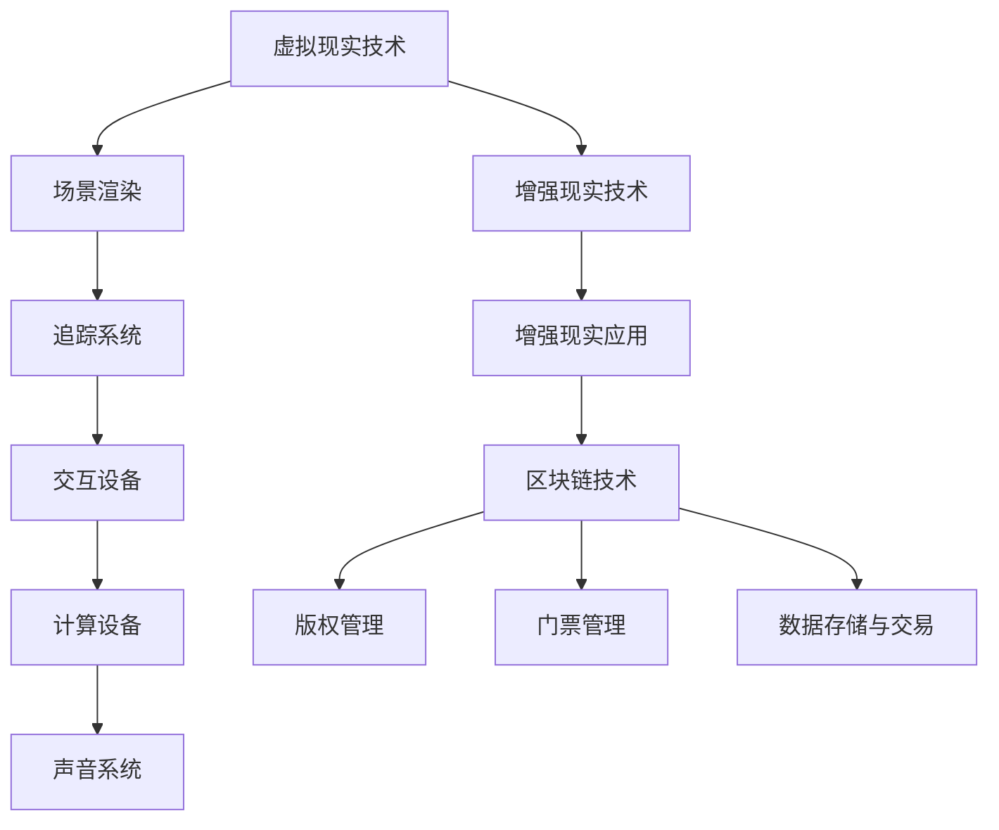

                 

# 《元宇宙体育：虚实结合的竞技新形式》

> **关键词：元宇宙、虚拟现实、体育、人工智能、区块链**

> **摘要：本文旨在探讨元宇宙体育的概念、核心技术以及发展前景。通过分析虚拟现实与体育的深度融合，以及人工智能和区块链技术在其中的应用，探讨元宇宙体育带来的新机遇和挑战。**

## 目录大纲

# 《元宇宙体育：虚实结合的竞技新形式》

## 第一部分：元宇宙体育概述

### 第1章：元宇宙与虚拟现实技术

#### 1.1 元宇宙的概念与发展历程

#### 1.2 虚拟现实技术在元宇宙中的应用

#### 1.3 元宇宙体育的特点与挑战

### 第2章：虚拟现实技术基础

#### 2.1 虚拟现实技术的原理与分类

#### 2.2 虚拟现实设备的硬件要求

#### 2.3 虚拟现实内容的制作与优化

## 第二部分：元宇宙体育的核心技术

### 第3章：虚拟现实与体育的结合

#### 3.1 虚拟现实在体育训练中的应用

#### 3.2 虚拟现实在体育比赛中的应用

#### 3.3 虚拟现实在体育娱乐中的应用

### 第4章：人工智能在元宇宙体育中的应用

#### 4.1 人工智能在体育数据分析中的应用

#### 4.2 人工智能在体育运动员训练中的应用

#### 4.3 人工智能在体育比赛中的实时分析

### 第5章：区块链技术在元宇宙体育中的应用

#### 5.1 区块链技术的基本原理

#### 5.2 区块链在体育版权管理中的应用

#### 5.3 区块链在体育赛事门票管理中的应用

## 第三部分：元宇宙体育的实际案例与前景

### 第6章：元宇宙体育的实际案例

#### 6.1 案例一：虚拟体育赛事的举办

#### 6.2 案例二：虚拟体育训练的应用

#### 6.3 案例三：虚拟体育娱乐的新形式

### 第7章：元宇宙体育的发展前景

#### 7.1 元宇宙体育的商业价值

#### 7.2 元宇宙体育的社会影响

#### 7.3 元宇宙体育的未来发展趋势

## 附录

### 附录A：元宇宙体育相关技术资源

#### A.1 虚拟现实技术资源

#### A.2 人工智能技术资源

#### A.3 区块链技术资源

#### A.4 元宇宙体育项目开发指南

### 附录B：元宇宙体育技术原理Mermaid流程图

#### B.1 虚拟现实技术原理图

#### B.2 人工智能在体育中的应用原理图

#### B.3 区块链技术在体育中的应用原理图

### 附录C：数学模型与数学公式

#### C.1 虚拟现实图像处理中的数学模型

#### C.2 人工智能算法中的数学模型

#### C.3 区块链算法中的数学模型

### 附录D：代码示例与解读

#### D.1 虚拟现实应用代码示例

#### D.2 人工智能在体育应用中的代码示例

#### D.3 区块链在体育应用中的代码示例

#### D.4 代码解读与分析

### 引言

随着互联网技术的发展，虚拟现实（VR）和增强现实（AR）逐渐走进了大众的视野。元宇宙（Metaverse）作为虚拟现实和增强现实的技术集成，正在迅速崛起，成为下一代互联网的重要形态。而体育作为人类社会中重要的组成部分，与虚拟现实技术的结合也正在引发一场革命。本文将探讨元宇宙体育的概念、核心技术、实际案例以及发展前景，旨在为读者提供一个全面而深入的视角。

首先，我们需要了解元宇宙和虚拟现实技术的基本概念和发展历程。元宇宙是一个虚拟的、全球性的、三维的、网络化的虚拟世界，用户可以通过虚拟角色在元宇宙中进行各种活动，如社交、购物、娱乐、工作等。虚拟现实技术则是实现元宇宙的基础技术之一，通过模拟真实环境，让用户获得沉浸式的体验。

接下来，我们将探讨元宇宙体育的特点和挑战。元宇宙体育不仅包括虚拟体育赛事的举办，还涵盖了虚拟体育训练、体育娱乐等多个方面。然而，如何在虚拟世界中实现真实的体育体验，以及如何应对虚拟现实技术带来的挑战，都是元宇宙体育发展过程中需要解决的问题。

在第二部分，我们将深入探讨元宇宙体育的核心技术，包括虚拟现实技术、人工智能和区块链技术。这些技术将为元宇宙体育提供强大的支持，使得虚拟体育体验更加真实、丰富和互动。

第三部分将介绍一些元宇宙体育的实际案例，包括虚拟体育赛事的举办、虚拟体育训练的应用和虚拟体育娱乐的新形式。通过这些案例，我们可以更好地理解元宇宙体育的实际应用和潜力。

最后，我们将探讨元宇宙体育的发展前景，包括其商业价值、社会影响以及未来发展趋势。通过分析元宇宙体育的机遇和挑战，我们可以预见其将在未来互联网领域中扮演重要角色。

### 第一部分：元宇宙体育概述

#### 1.1 元宇宙的概念与发展历程

元宇宙（Metaverse）是一个由数字技术构建的虚拟世界，用户可以在其中以虚拟角色的形式进行各种活动。元宇宙的概念最早可以追溯到1992年，加拿大科幻作家威廉·吉布森（William Gibson）在其小说《神经漫游者》（Neuromancer）中提出的“赛博空间”（Cyberspace）。然而，元宇宙作为一个具体的概念和目标，是在近年来随着虚拟现实（VR）、增强现实（AR）、5G、人工智能（AI）、区块链等技术的发展而逐渐成形的。

从发展历程来看，元宇宙可以分为三个阶段：

1. **早期阶段（1992-2000年）**：这一阶段主要是互联网和计算机技术的发展，为元宇宙的诞生提供了基础。在此期间，虚拟现实技术开始兴起，例如VR头戴设备和VR游戏的出现。

2. **成长阶段（2000-2010年）**：随着互联网的普及和计算机性能的提升，元宇宙的概念开始得到更多的关注。这一阶段的主要特点包括：社交网络的兴起，如Facebook、Twitter等；虚拟现实和增强现实技术的进一步发展，例如Oculus VR、Microsoft HoloLens等设备的推出。

3. **成熟阶段（2010年至今）**：这一阶段是元宇宙快速发展的时期，5G、人工智能、区块链等新兴技术的应用使得元宇宙的概念逐渐变得具体和可实现。代表性的项目包括Facebook的Horizon Workrooms、微软的AltspaceVR等。

在元宇宙中，用户可以通过虚拟角色与其他用户互动，参与各种活动，如社交、购物、娱乐、工作等。元宇宙不仅是一个虚拟世界，更是一个与现实世界高度融合的生态系统。

#### 1.2 虚拟现实技术在元宇宙中的应用

虚拟现实技术（VR）是构建元宇宙的核心技术之一，通过模拟真实环境，为用户带来沉浸式的体验。在元宇宙中，虚拟现实技术的应用主要体现在以下几个方面：

1. **虚拟体育赛事的举办**：虚拟现实技术可以模拟真实的体育比赛场景，用户可以通过VR设备观看比赛，甚至可以亲身参与其中。这种体验不仅提高了体育比赛的观赏性，还可以吸引更多的观众和参与者。

2. **虚拟体育训练**：虚拟现实技术可以为运动员提供逼真的训练环境，帮助运动员提高技能和战术水平。通过VR技术，运动员可以在虚拟世界中模拟各种比赛场景，进行反复练习，从而提高比赛表现。

3. **虚拟体育娱乐**：虚拟现实技术还可以为用户提供丰富的体育娱乐体验，例如虚拟体育游戏、体育主题公园等。这些娱乐形式不仅丰富了体育文化，还可以为体育产业带来新的收入来源。

4. **虚拟体育体验**：虚拟现实技术还可以为用户带来全新的体育体验，例如虚拟滑雪、虚拟跑步等。用户可以在虚拟世界中体验到不同的体育项目，从而满足多样化的体育需求。

#### 1.3 元宇宙体育的特点与挑战

元宇宙体育作为一种新兴的体育形式，具有以下几个特点：

1. **沉浸式体验**：虚拟现实技术为用户带来了沉浸式的体育体验，用户可以在虚拟世界中感受到真实的环境和氛围，这种体验远超传统的体育观看和参与方式。

2. **互动性**：元宇宙体育具有很强的互动性，用户可以在虚拟世界中与其他用户互动，共同参与体育活动。这种互动性不仅提高了体育的趣味性，还可以促进社交互动。

3. **多样性**：元宇宙体育涵盖了多种体育项目，用户可以根据自己的兴趣选择参与。这种多样性不仅丰富了体育文化，还可以满足不同用户的需求。

4. **虚拟与现实结合**：元宇宙体育将虚拟世界与真实世界相结合，用户可以在虚拟世界中体验到真实的体育比赛和训练，同时还可以在现实世界中应用虚拟体育技术。

尽管元宇宙体育具有许多优势，但其在发展过程中也面临着一些挑战：

1. **技术挑战**：虚拟现实技术的成熟度和稳定性是元宇宙体育发展的重要制约因素。目前，虚拟现实设备的性能和用户体验仍有待提升。

2. **安全性和隐私保护**：元宇宙体育涉及到大量的用户数据和隐私信息，如何保障用户的安全性和隐私保护是一个重要问题。

3. **标准化**：元宇宙体育的发展需要一个统一的标准化体系，以确保不同平台之间的兼容性和互操作性。

4. **商业可持续性**：元宇宙体育的商业模式仍在探索中，如何实现商业可持续发展是一个重要挑战。

综上所述，元宇宙体育作为一种新兴的体育形式，具有巨大的发展潜力，但同时也面临着许多挑战。通过不断的技术创新和商业模式探索，我们有理由相信元宇宙体育将在未来发挥重要作用。

#### 2.1 虚拟现实技术的原理与分类

虚拟现实技术（VR）的核心原理是通过计算机技术创建一个虚拟的三维环境，用户可以通过特定的设备（如VR头戴显示器、VR眼镜、VR头盔等）进入这个虚拟环境，并与之进行交互。这个虚拟环境可以通过多种方式呈现，包括立体图像、三维模型和声音效果等，从而使用户获得身临其境的体验。

虚拟现实技术的实现主要依赖于以下几个关键组成部分：

1. **渲染引擎**：渲染引擎是虚拟现实技术中的核心组件，负责生成和渲染虚拟环境中的三维图形。常见的渲染引擎包括Unity、Unreal Engine等。

2. **追踪设备**：追踪设备用于跟踪用户的头部和身体动作，从而确保虚拟环境中的视角和位置与用户的实际动作保持一致。常见的追踪设备包括VR头戴显示器、手柄、摄像头等。

3. **传感器**：传感器用于检测用户在虚拟环境中的动作，并将这些动作转换为虚拟环境中的交互行为。例如，VR手套上的传感器可以检测手指的细微动作，从而实现更加精细的交互。

虚拟现实技术根据其应用场景和特点，可以分为以下几种类型：

1. **桌面虚拟现实**：桌面虚拟现实（Desktop VR）通常指用户在电脑或笔记本电脑上通过VR头戴显示器体验虚拟环境。这种类型的VR技术主要应用于游戏、教育、设计和模拟等领域。

2. **移动虚拟现实**：移动虚拟现实（Mobile VR）是利用智能手机或平板电脑通过VR眼镜或VR头盔实现虚拟体验。这种类型的VR技术因其便捷性和低成本而受到广泛欢迎，常应用于娱乐、教育和培训等领域。

3. **头戴式虚拟现实**：头戴式虚拟现实（Head-Mounted Display VR，简称HMD VR）是用户通过头戴设备（如VR头戴显示器、VR眼镜等）进入虚拟环境的体验。这种类型的VR技术提供了更加沉浸式的体验，常应用于游戏、娱乐、教育和医疗等领域。

4. **沉浸式虚拟现实**：沉浸式虚拟现实（Immersion VR）是一种提供全方位沉浸体验的VR技术，用户可以通过多个传感器和追踪设备，全身心地进入虚拟环境。这种类型的VR技术主要应用于虚拟旅游、房地产、设计和军事模拟等领域。

5. **增强现实**：增强现实（Augmented Reality，简称AR）是一种将虚拟信息叠加到现实世界中的技术。与虚拟现实不同，AR技术不是完全替代现实世界，而是在现实世界的基础上增加虚拟元素。常见的AR应用包括教育、医疗、营销和娱乐等领域。

#### 2.2 虚拟现实设备的硬件要求

虚拟现实（VR）设备的硬件要求是确保用户获得高质量虚拟体验的关键。以下是几个主要硬件组件及其要求：

1. **VR头戴显示器（HMD）**：VR头戴显示器是VR设备的核心组件，它负责显示虚拟环境。高分辨率的屏幕能够提供更清晰的图像，减少视觉模糊和像素感。一般来说，高刷新率（90Hz以上）能够减少运动模糊，提高视觉流畅性。此外，低延迟（低于20毫秒）也是确保良好用户体验的重要因素。

2. **追踪系统**：追踪系统用于跟踪用户的头部和手部位置，确保虚拟环境中的视角和交互与用户的实际动作同步。常见的追踪技术包括外部摄像头追踪、内置传感器追踪和激光追踪等。外部摄像头追踪可以提供更广的追踪范围，但可能受到光线和环境的影响。内置传感器追踪虽然成本较低，但精度和范围有限。激光追踪提供了高精度和高速度的追踪能力，但成本较高。

3. **跟踪手柄**：跟踪手柄用于与虚拟环境进行交互。高品质的手柄应具有高精度的位置和方向追踪能力，以及逼真的物理反馈（如震动、力反馈等）。这些手柄通常配有按钮、触控板和传感器，以实现多样化的交互方式。

4. **计算设备**：计算设备负责运行虚拟环境的渲染和计算。对于高端VR应用，通常需要高性能的PC或专门设计的VR头戴设备。这些设备应配备强大的CPU和GPU，以确保实时渲染和计算。

5. **声音系统**：虚拟现实中的声音系统对用户体验至关重要。高保真的耳机或内置音响系统能够提供沉浸式的声音效果，增强用户的沉浸感。此外，头戴式耳机应支持立体声和空间声效，以实现更加真实的听觉体验。

6. **数据传输**：对于移动VR设备，数据传输速度和稳定性是关键。高速无线网络（如5G）或稳定的Wi-Fi连接能够提供流畅的虚拟体验，减少延迟和卡顿。

#### 2.3 虚拟现实内容的制作与优化

虚拟现实内容的制作是一个复杂的过程，涉及多个环节，包括场景设计、三维建模、动画制作和交互设计。以下是虚拟现实内容制作与优化的一些关键步骤和技巧：

1. **场景设计**：场景设计是虚拟现实内容制作的基础。设计师需要根据内容需求和用户体验目标，创建一个符合现实世界的虚拟环境。场景设计应考虑色彩搭配、光影效果、空间布局等因素，以营造出真实感和沉浸感。

2. **三维建模**：三维建模是虚拟现实内容制作的重要环节。建模师使用专业的三维软件（如Blender、Maya等）创建三维物体和角色。为了提高建模效率，可以采用参考照片或现实世界的模型进行建模。高质量的模型应具有精细的细节和光滑的表面处理，以提高视觉效果。

3. **动画制作**：动画制作是赋予虚拟角色和物体动态效果的过程。动画师通过关键帧动画、运动捕捉等技术，为虚拟角色和物体创建流畅的动作和表情。高质量的动画能够提高虚拟环境的真实感和趣味性。

4. **交互设计**：交互设计是虚拟现实内容制作的关键部分。设计师需要考虑用户如何与虚拟环境进行交互，设计出直观、易用的交互方式。常见的交互方式包括手势识别、语音控制、触控板等。为了提高用户体验，交互设计应尽量简化操作流程，减少学习成本。

5. **优化性能**：虚拟现实内容制作过程中，性能优化至关重要。开发人员需要关注渲染效率、内存管理和资源加载速度等方面。优化方法包括使用高效的渲染技术（如光子追踪）、减少冗余数据、优化代码结构等。

6. **测试与反馈**：内容制作完成后，应进行严格的测试和反馈。测试人员需要模拟不同用户的使用场景，检查内容的质量和性能。通过用户反馈，开发人员可以进一步优化内容，提高用户体验。

通过上述步骤和技巧，虚拟现实内容的制作与优化可以确保虚拟环境的真实感、沉浸感和互动性，为用户提供高质量的虚拟体验。

### 第3章：虚拟现实与体育的结合

#### 3.1 虚拟现实在体育训练中的应用

虚拟现实技术在体育训练中的应用正日益普及，为运动员提供了全新的训练环境和方式。以下是一些具体的应用场景：

1. **模拟真实比赛环境**：通过虚拟现实技术，运动员可以在虚拟环境中模拟真实比赛的场景，包括场地、对手、观众等。这种模拟不仅可以帮助运动员熟悉比赛的环境和对手的特点，还可以在训练中模拟不同的比赛战术和策略。

   **示例：** 使用VR技术模拟足球比赛。运动员可以在虚拟的足球场上与虚拟对手进行对抗训练，通过调整训练参数（如对手的技能水平、比赛节奏等）来模拟不同类型的比赛场景。

2. **提高技能训练效率**：虚拟现实技术可以提供高度逼真的训练场景，使运动员能够反复练习特定的技能，从而提高训练效率和技能水平。例如，运动员可以通过VR技术进行足球射门、篮球投篮、网球发球等技能的反复训练。

   **示例：** 足球运动员可以使用VR技术进行射门训练。通过调整虚拟守门员的位置和反应时间，运动员可以在不同情况下进行射门练习，从而提高射门准确性和反应速度。

3. **减少运动损伤风险**：虚拟现实技术可以降低运动员在真实训练中因高强度对抗而受伤的风险。运动员可以在虚拟环境中进行高强度的训练，而不会对身体健康造成过大的负担。

   **示例：** 跳水运动员可以使用VR技术进行高难度的动作训练。在虚拟环境中，运动员可以进行反复的跳跃和旋转练习，从而熟悉动作的细节，同时减少实际训练中的受伤风险。

4. **个性化训练方案**：虚拟现实技术可以根据运动员的个体差异和训练需求，为其定制个性化的训练方案。通过数据分析和技术模拟，可以优化训练计划，提高训练效果。

   **示例：** 使用VR技术为游泳运动员定制训练方案。通过分析运动员的游泳姿势和动作，虚拟现实系统可以提供针对性的训练建议，帮助运动员改进技术，提高游泳速度。

5. **心理训练**：虚拟现实技术还可以用于运动员的心理训练，帮助他们在比赛前调整心态，提高心理素质。通过虚拟的模拟比赛和压力测试，运动员可以学会如何在高压环境下保持冷静和专注。

   **示例：** 篮球运动员可以使用VR技术进行心理训练。通过模拟比赛的关键时刻和压力场景，运动员可以在虚拟环境中练习如何应对紧张和压力，从而提高比赛中的心理素质。

#### 3.2 虚拟现实在体育比赛中的应用

虚拟现实技术在体育比赛中的应用正在逐渐改变传统体育的形态，为观众和参与者带来全新的体验。以下是一些具体的应用场景：

1. **虚拟观赛体验**：通过虚拟现实技术，观众可以在虚拟环境中以第一人称视角观看体育比赛，获得沉浸式的观赛体验。观众可以自由选择观看角度，甚至可以进入赛场内部，体验运动员的视角。

   **示例：** 足球比赛的虚拟观赛体验。观众可以通过VR头戴设备进入虚拟的足球场，选择自己喜欢的座位，观看比赛的实时直播，并与其他观众进行互动。

2. **虚拟赛事举办**：虚拟现实技术可以模拟真实体育比赛，举办虚拟体育赛事。这些赛事可以在虚拟世界中进行，不受现实世界场地和设备的限制，可以吸引更多的参与者和观众。

   **示例：** 虚拟奥运会。虚拟奥运会是一个在虚拟世界中举办的体育赛事，参赛选手来自世界各地，可以在虚拟环境中进行各种体育项目的比赛，观众可以通过VR设备在线观看。

3. **虚拟体育直播**：虚拟现实技术可以用于体育直播，将比赛场景以虚拟的形式呈现给观众。这种直播方式不仅可以提供多种观看角度，还可以实时展示比赛数据和分析。

   **示例：** 虚拟网球直播。观众可以通过VR设备观看网球比赛的实时直播，同时获得多角度的视角和实时数据统计，如球速、角度等。

4. **虚拟互动体验**：虚拟现实技术可以提供与运动员互动的机会，观众可以在虚拟环境中与运动员进行交流，甚至可以参与比赛互动。

   **示例：** 虚拟足球互动体验。观众可以通过VR设备进入虚拟的足球场地，与虚拟运动员进行足球比赛，体验竞技的乐趣。

5. **虚拟体育康复**：虚拟现实技术可以用于运动员的康复训练，帮助他们在受伤后进行恢复训练。通过虚拟环境，运动员可以进行安全、低强度的训练，逐步恢复运动能力。

   **示例：** 跳水运动员的康复训练。虚拟现实技术可以模拟跳水动作，帮助运动员在安全的环境中逐步恢复跳水技术，减少康复过程中的风险。

#### 3.3 虚拟现实在体育娱乐中的应用

虚拟现实技术在体育娱乐中的应用为体育文化带来了新的形式和内容，丰富了体育娱乐的方式。以下是一些具体的应用场景：

1. **虚拟体育游戏**：虚拟现实技术可以用于开发虚拟体育游戏，让玩家在虚拟环境中体验各种体育项目。这些游戏通常具有较高的沉浸感和互动性，能够吸引大量玩家。

   **示例：** 虚拟篮球游戏。玩家可以通过VR设备进入虚拟的篮球场地，与虚拟对手进行篮球比赛，体验真实篮球比赛的乐趣。

2. **虚拟体育主题公园**：虚拟现实技术可以用于建造虚拟体育主题公园，为游客提供沉浸式的体育娱乐体验。这些主题公园可以包括虚拟的体育场馆、训练场地和比赛场景等。

   **示例：** 虚拟足球主题公园。游客可以通过VR设备进入虚拟的足球主题公园，参与各种虚拟体育活动，如足球比赛、训练和娱乐项目。

3. **虚拟体育互动表演**：虚拟现实技术可以用于体育互动表演，通过虚拟角色和场景，为观众呈现精彩的体育表演。这种表演不仅具有观赏性，还可以与观众进行互动。

   **示例：** 虚拟篮球表演。虚拟篮球运动员在虚拟场馆中为观众进行精彩表演，观众可以通过VR设备与虚拟运动员互动，体验篮球的魅力。

4. **虚拟体育体验中心**：虚拟现实技术可以用于建设虚拟体育体验中心，为用户提供各种体育项目的体验服务。这些体验中心可以通过VR设备提供逼真的体育体验，吸引不同年龄段的用户。

   **示例：** 虚拟高尔夫体验中心。用户可以通过VR设备进入虚拟的高尔夫球场，进行高尔夫球的练习和比赛，体验高尔夫球的乐趣。

通过上述应用，虚拟现实技术正在不断拓展体育娱乐的边界，为观众和参与者带来全新的体验。未来，随着虚拟现实技术的进一步发展，体育娱乐将呈现出更加多样化和互动性的特点。

### 第4章：人工智能在元宇宙体育中的应用

#### 4.1 人工智能在体育数据分析中的应用

人工智能（AI）在体育数据分析中的应用已经越来越普遍，通过大数据分析、机器学习和深度学习等技术，AI可以为体育领域提供更加精确、高效的数据分析支持，从而帮助教练和运动员做出更好的决策。

1. **运动员表现分析**：AI可以分析运动员的比赛录像，识别运动员的技术动作、战术执行和体能状态。例如，通过视频识别技术，AI可以分析足球运动员的传球成功率、射门角度和速度，篮球运动员的投篮命中率、突破频率等数据。

   **算法原理：** 采用图像识别和动作识别算法，如卷积神经网络（CNN）和循环神经网络（RNN），对比赛视频进行逐帧分析，提取运动员的技术特征和动作模式。

2. **战术分析**：AI可以帮助教练分析对手的战术，制定相应的应对策略。通过分析历史比赛数据，AI可以识别对手的战术模式、阵型和球员位置，从而帮助教练制定有效的战术安排。

   **算法原理：** 采用决策树、支持向量机（SVM）和深度学习模型（如深度神经网络）对比赛数据进行分类和预测，识别对手的战术特征和策略。

3. **体能管理**：AI可以通过分析运动员的训练和比赛数据，监测运动员的体能状态，提供个性化的训练和恢复建议。例如，通过心率、血压等生理指标，AI可以评估运动员的疲劳程度，优化训练负荷。

   **算法原理：** 采用回归分析、时间序列分析和机器学习模型，对生理数据进行建模和预测，评估运动员的疲劳状态和恢复需求。

4. **伤病预防**：AI可以帮助预防运动员的伤病，通过分析运动员的训练和比赛数据，预测可能的受伤风险，并提供预防措施。例如，通过动作识别和力学分析，AI可以识别可能导致伤病的危险动作，并建议运动员进行相应的调整。

   **算法原理：** 采用动作识别算法、力学模型和机器学习模型，对运动员的动作和力学参数进行分析和预测，识别潜在的受伤风险。

5. **比赛预测**：AI可以通过分析历史比赛数据，预测比赛的结果和可能的赛果。这有助于球队进行战术安排和球员选拔，提高比赛胜率。

   **算法原理：** 采用统计分析、时间序列分析和机器学习模型（如随机森林、神经网络），对历史比赛数据进行建模和预测。

#### 4.2 人工智能在体育运动员训练中的应用

人工智能在体育运动员训练中的应用为运动员提供了个性化、高效和科学的训练支持，从而提高训练效果和竞技水平。

1. **个性化训练计划**：AI可以根据运动员的身体数据、技术水平和比赛需求，为其制定个性化的训练计划。通过分析运动员的训练数据，AI可以优化训练内容、强度和频率，提高训练效率。

   **算法原理：** 采用数据挖掘和机器学习技术，对运动员的训练数据进行分析和模式识别，制定个性化的训练计划。

2. **训练效果评估**：AI可以通过实时监测运动员的训练数据，评估训练效果，及时调整训练方案。例如，通过监测心率、血压、动作等技术指标，AI可以评估训练的负荷和效果，提供反馈和建议。

   **算法原理：** 采用实时数据处理、信号处理和机器学习技术，对运动员的训练数据进行实时分析和评估。

3. **技术动作优化**：AI可以通过动作识别和力学分析，帮助运动员优化技术动作，提高动作效率和效果。例如，通过分析运动员的投篮动作，AI可以识别出投篮角度、速度和力度等关键因素，提供优化建议。

   **算法原理：** 采用计算机视觉、图像处理和力学模型，对运动员的技术动作进行实时分析和评估。

4. **心理训练**：AI可以通过分析运动员的心理数据，提供个性化的心理训练支持。通过监测运动员的情绪、压力和心理健康状况，AI可以提供心理调节和压力管理的建议，帮助运动员保持最佳状态。

   **算法原理：** 采用情感分析、心理学模型和机器学习技术，对运动员的心理数据进行实时分析和评估。

5. **虚拟训练**：AI可以通过虚拟现实技术，为运动员提供虚拟训练环境。在虚拟环境中，运动员可以进行各种技术动作和战术演练，提高实战能力。

   **算法原理：** 采用虚拟现实技术、计算机图形学和机器学习模型，构建虚拟训练场景和训练任务。

#### 4.3 人工智能在体育比赛中的实时分析

人工智能在体育比赛中的实时分析为教练和球队提供了实时的比赛数据和战术建议，帮助他们在比赛中做出更加明智的决策。

1. **实时比赛数据分析**：AI可以通过实时监测比赛数据，分析比赛进展、球员表现和战术执行情况。例如，通过分析球员的传球成功率、射门次数和进攻效率等数据，AI可以评估球队的表现和战术效果。

   **算法原理：** 采用实时数据处理、图像识别和机器学习技术，对比赛数据进行分析和评估。

2. **战术建议**：AI可以通过分析比赛数据，为教练提供实时战术建议。例如，在比赛中，AI可以识别出对手的战术弱点，并提供相应的应对策略，帮助球队在比赛中取得优势。

   **算法原理：** 采用决策树、支持向量机和深度学习模型，对比赛数据进行分析和预测，提供战术建议。

3. **球员表现评估**：AI可以通过实时数据分析，评估球员在比赛中的表现。例如，通过分析球员的传球成功率、射门次数和防守表现等数据，AI可以评估球员的竞技状态，为教练提供球员轮换和战术调整的建议。

   **算法原理：** 采用统计分析、图像识别和机器学习技术，对球员的表现数据进行实时分析和评估。

4. **比赛结果预测**：AI可以通过实时数据分析，预测比赛的结果和可能的赛果。这有助于教练在比赛中调整战术和策略，提高球队的表现和胜率。

   **算法原理：** 采用时间序列分析、机器学习模型和深度学习技术，对比赛数据进行分析和预测。

5. **实时互动与反馈**：AI可以通过实时数据分析和反馈，与教练和球队进行互动，提供实时的比赛建议和战术指导。例如，在比赛中，AI可以实时提供球员的位置、战术执行情况和比赛结果预测，帮助教练做出及时、准确的决策。

   **算法原理：** 采用实时数据处理、人工智能交互和机器学习技术，实现实时互动与反馈。

通过上述应用，人工智能在体育比赛中的实时分析为教练和球队提供了强大的数据分析支持和战术指导，提高了比赛的表现和胜率。

### 第5章：区块链技术在元宇宙体育中的应用

#### 5.1 区块链技术的基本原理

区块链技术是一种分布式数据库技术，通过加密算法和共识机制确保数据的不可篡改性和透明性。以下是区块链技术的基本原理：

1. **分布式账本**：区块链是一种分布式账本技术，数据存储在多个节点上，而不是集中在一个中心化的服务器中。每个节点都保存着完整的账本副本，确保数据的完整性和可靠性。

2. **加密算法**：区块链使用加密算法保护数据的安全性和隐私。数据在存储和传输过程中经过加密，只有拥有正确密钥的节点才能解读和访问数据。

3. **共识机制**：区块链通过共识机制确保所有节点对数据的认可和一致性。常见的共识机制包括工作量证明（PoW）、权益证明（PoS）和委托权益证明（DPoS）等。

4. **智能合约**：区块链上的智能合约是一种自执行的合约，基于预定义的条件自动执行。智能合约可以自动执行交易、管理数字资产、执行任务等，无需人工干预。

#### 5.2 区块链在体育版权管理中的应用

区块链技术在体育版权管理中的应用具有显著的优势，可以有效解决版权纠纷、版权保护、版权交易等问题。

1. **版权登记与确权**：区块链技术可以用于体育版权的登记和确权，确保版权的合法性和真实性。版权方可以将版权信息（如作者、作品名称、创作时间等）上链，形成不可篡改的数字证书。

   **示例：** 一个足球俱乐部的版权方可以将比赛视频的版权信息上链，确保版权的合法性和唯一性。

2. **版权交易与流转**：区块链技术可以为体育版权的买卖和流转提供透明、高效的交易平台。版权持有者可以在区块链上发布版权信息，买家可以直接购买并持有版权，无需通过中介。

   **示例：** 一部体育比赛的视频版权可以在区块链上进行交易，买家通过支付加密货币获得视频版权，实现版权的快速流转。

3. **版权保护与追踪**：区块链技术可以用于追踪版权的使用和侵权行为，提供版权保护。通过区块链上的智能合约，可以自动执行版权许可和惩罚侵权行为。

   **示例：** 在区块链上，版权方可以设定版权许可的条件和费用，一旦侵权行为发生，智能合约可以自动执行罚款或其他惩罚措施。

#### 5.3 区块链在体育赛事门票管理中的应用

区块链技术在体育赛事门票管理中的应用可以提高门票销售效率、减少欺诈行为，并为用户提供更好的体验。

1. **门票销售与分发**：区块链技术可以用于门票销售和分发，确保门票的合法性和唯一性。观众可以通过区块链平台购买门票，并获得数字化的门票凭证。

   **示例：** 足球比赛的门票可以通过区块链平台销售，观众购买门票后获得数字门票，门票信息上链，确保门票的真实性和唯一性。

2. **门票防伪与追溯**：区块链技术可以用于门票防伪，防止票务欺诈行为。每个门票凭证都是独一无二的，且存储在区块链上，无法伪造和篡改。

   **示例：** 一张体育赛事门票的数字凭证可以通过区块链验证，确保门票的真实性，防止假票和套票行为。

3. **门票自动化分发**：区块链技术可以实现门票的自动化分发，减少人工操作和错误。观众在购买门票后，门票凭证自动分发到其区块链账户中，无需人工介入。

   **示例：** 购买门票后，数字门票凭证自动发送到观众的区块链账户，观众可以通过手机应用直接查看和验证门票信息。

4. **门票回收与再利用**：区块链技术可以为门票的回收和再利用提供支持。例如，观众可以在区块链上转让或出售其未使用的门票，实现门票的二次流通。

   **示例：** 观众在无法参加比赛时，可以在区块链上转让其门票，新买家可以直接购买并持有门票，实现门票的回收和再利用。

通过区块链技术在体育版权管理和赛事门票管理中的应用，可以有效提升体育产业的透明度和效率，为观众和版权方提供更好的服务和体验。

### 第6章：元宇宙体育的实际案例

#### 6.1 案例一：虚拟体育赛事的举办

虚拟体育赛事的举办是元宇宙体育的重要组成部分，它通过虚拟现实技术和区块链技术，为用户带来了全新的观赛和参与体验。以下是一个虚拟体育赛事举办的实际案例：

**案例背景**：一个名为“Virtual Olympics”的虚拟奥运会赛事在全球范围内举办，赛事涵盖多个体育项目，包括足球、篮球、游泳、田径等。该赛事采用虚拟现实技术构建比赛场景，用户可以通过VR设备观看比赛，甚至可以参与其中。

**实施过程**：
1. **场景构建**：赛事组织方使用虚拟现实技术构建了多个比赛场景，如足球场、篮球场、游泳池和田径场。这些场景通过三维建模和渲染技术，高度还原了现实中的比赛环境。

2. **赛事规则制定**：组织方制定了详细的赛事规则，包括比赛流程、计分方式、晋级规则等。为了确保比赛的公平性，赛事采用区块链技术记录比赛结果和排名，防止作弊行为。

3. **门票销售与分发**：赛事门票通过区块链平台进行销售，观众可以购买虚拟门票，并获得数字化的门票凭证。门票销售过程中，所有交易记录都被记录在区块链上，确保透明和不可篡改。

4. **实时观看与互动**：观众通过VR设备观看比赛，可以自由选择观看角度，甚至可以进入赛场内部。此外，观众还可以通过虚拟角色与选手互动，参与比赛过程。

**效果评估**：
1. **观众体验**：虚拟体育赛事为观众提供了全新的观赛体验，观众可以在虚拟环境中以第一人称视角观看比赛，感受身临其境的观赛氛围。

2. **赛事公平性**：通过区块链技术记录比赛结果和排名，确保了比赛的公平性和透明度，减少了作弊行为。

3. **经济效益**：虚拟体育赛事吸引了大量观众和参与者，为组织方带来了可观的收入。门票销售、虚拟商品交易和广告收入等，成为虚拟体育赛事的主要盈利模式。

#### 6.2 案例二：虚拟体育训练的应用

虚拟体育训练是元宇宙体育的另一个重要应用场景，通过虚拟现实技术和人工智能技术，为运动员提供了高效、个性化的训练支持。以下是一个虚拟体育训练的实际案例：

**案例背景**：一个名为“Virtual Athlete Academy”的虚拟体育训练平台，为运动员提供个性化训练服务。该平台涵盖多个体育项目，如足球、篮球、游泳等，为不同水平的运动员提供定制化的训练方案。

**实施过程**：
1. **运动员评估**：平台通过虚拟现实设备和传感器，对运动员的身体素质、技术水平和比赛状态进行评估。评估结果被上传到区块链上，确保数据的真实性和可靠性。

2. **训练方案定制**：根据运动员的评估结果，平台使用人工智能技术生成个性化的训练方案。训练方案包括技术训练、体能训练和心理训练等方面，覆盖不同训练阶段。

3. **虚拟训练场景**：平台通过虚拟现实技术构建多个训练场景，如足球场、篮球场和游泳池等。运动员可以在虚拟场景中进行技术动作和战术演练，提高训练效果。

4. **实时反馈与优化**：训练过程中，平台通过传感器和人工智能技术，实时监测运动员的表现，提供即时反馈和优化建议。例如，通过分析运动员的投篮动作，平台可以提供角度和力度的优化建议。

**效果评估**：
1. **训练效率**：虚拟体育训练为运动员提供了高效、个性化的训练支持，提高了训练效果和效率。运动员可以在虚拟环境中反复练习，熟悉技术动作和战术策略。

2. **运动员表现**：通过虚拟体育训练，运动员的技术水平和竞技状态得到了显著提升。许多运动员在正式比赛中取得了更好的成绩。

3. **经济效益**：虚拟体育训练平台为运动员提供了高质量的训练服务，吸引了大量运动员和俱乐部使用。平台通过会员服务、训练方案定制和虚拟商品销售等，实现了良好的经济效益。

#### 6.3 案例三：虚拟体育娱乐的新形式

虚拟体育娱乐是元宇宙体育的一个重要组成部分，通过虚拟现实技术和增强现实技术，为用户提供丰富的体育娱乐体验。以下是一个虚拟体育娱乐的实际案例：

**案例背景**：一个名为“Virtual Sports Arena”的虚拟体育娱乐平台，为用户提供各种体育项目的虚拟体验，如足球、篮球、赛车等。用户可以通过VR设备和AR设备，参与虚拟体育比赛和活动。

**实施过程**：
1. **虚拟场景构建**：平台通过虚拟现实技术构建了多个体育场景，如足球场、篮球场和赛车场等。这些场景通过三维建模和渲染技术，高度还原了现实中的体育场景。

2. **互动体验**：用户可以通过VR设备进入虚拟体育场景，与其他用户进行互动。平台提供了多种互动方式，如多人竞技、挑战赛和娱乐活动等，用户可以自由选择参与。

3. **虚拟商品交易**：平台通过区块链技术，实现了虚拟商品的交易和流通。用户可以在平台上购买和交换虚拟商品，如虚拟服装、装备和道具等。

4. **社交互动**：平台提供了社交功能，用户可以与其他用户交流和互动。通过虚拟角色，用户可以建立社交关系，参与社区活动和赛事。

**效果评估**：
1. **用户参与度**：虚拟体育娱乐平台为用户提供了丰富的体育娱乐体验，吸引了大量用户参与。用户可以在虚拟环境中体验到真实的体育乐趣，提高用户参与度。

2. **经济效益**：虚拟体育娱乐平台通过虚拟商品交易、广告收入和会员服务等方式，实现了良好的经济效益。平台通过不断创新和优化，吸引了更多用户和合作伙伴。

3. **社会影响**：虚拟体育娱乐平台不仅丰富了体育文化，还为体育产业带来了新的商业模式和机遇。通过虚拟体育娱乐，更多的人可以参与到体育活动中来，促进了体育文化的普及和发展。

通过上述实际案例，我们可以看到元宇宙体育在虚拟体育赛事举办、虚拟体育训练和虚拟体育娱乐等领域的广泛应用，为体育产业带来了新的机遇和挑战。随着技术的不断进步和商业模式的不断创新，元宇宙体育有望在未来成为体育产业的重要趋势。

### 第7章：元宇宙体育的发展前景

#### 7.1 元宇宙体育的商业价值

元宇宙体育作为一种新兴的体育形式，具有巨大的商业价值，为体育产业带来了新的商业模式和机遇。以下是元宇宙体育在商业价值方面的一些重要方面：

1. **观众参与度提升**：元宇宙体育通过沉浸式体验和互动性，大大提高了观众的参与度。观众不仅可以在虚拟世界中观看体育比赛，还可以参与其中，体验竞技的乐趣。这种高度参与性的体验有望吸引更多的观众，扩大体育市场的受众群体。

2. **广告与赞助**：元宇宙体育为广告和赞助商提供了新的展示平台。在虚拟体育场景中，广告和赞助商可以以更加生动、互动的方式展示产品和服务，提高广告效果。例如，虚拟体育赛事中的品牌logo、产品植入和虚拟广告牌等，都可以为赞助商带来品牌曝光和销售机会。

3. **虚拟商品交易**：元宇宙体育平台可以通过虚拟商品交易实现经济效益。用户可以在虚拟环境中购买虚拟服装、装备、道具等，这些虚拟商品可以通过区块链技术确保真实性和唯一性。虚拟商品交易不仅为平台带来收入，还可以为用户带来增值体验。

4. **会员服务**：元宇宙体育平台可以通过会员服务吸引忠实用户，提供个性化、高质量的体育内容和服务。会员服务可以包括虚拟赛事的优先观看权、专属互动活动、个性化训练方案等，通过会员订阅模式实现持续收入。

5. **数据驱动的商业洞察**：元宇宙体育平台积累了大量的用户数据和比赛数据，这些数据可以用于商业分析和决策支持。例如，通过分析用户行为数据，平台可以了解用户偏好，优化产品和服务；通过分析比赛数据，球队和教练可以制定更科学的训练和比赛策略。

#### 7.2 元宇宙体育的社会影响

元宇宙体育不仅具有商业价值，还对社会产生了深远的影响，特别是在体育文化、社会公平和教育等方面。

1. **体育文化的普及**：元宇宙体育为更多人提供了参与体育活动的机会，无论年龄、地域或身体条件如何，用户都可以在虚拟世界中体验体育的乐趣。这有助于推广体育文化，提高公众对体育的认识和兴趣。

2. **社会公平**：元宇宙体育提供了一个平等竞争的平台，用户可以通过自己的技能和努力在虚拟世界中取得成功，而不会受到现实世界中的社会经济差异和身体条件的限制。这种平等的机会有助于减少社会不公，促进社会和谐。

3. **教育和培训**：元宇宙体育平台可以作为教育和培训的工具，为不同群体提供体育知识和技能培训。例如，学校可以利用虚拟体育场景进行体育课程教学，提高学生的体育素养；企业可以利用虚拟训练平台进行员工培训，提高员工的团队协作和运动能力。

#### 7.3 元宇宙体育的未来发展趋势

随着技术的不断进步和商业模式的不断创新，元宇宙体育有望在未来实现以下发展趋势：

1. **技术成熟度提高**：虚拟现实技术和区块链技术等核心技术的成熟度将不断提高，为元宇宙体育提供更加稳定和高效的技术支持。这将进一步推动元宇宙体育的发展和应用。

2. **跨平台融合**：元宇宙体育将与其他虚拟现实应用（如虚拟旅游、虚拟社交等）和现实世界体育活动（如线下比赛、体育场馆等）实现深度融合，形成更加丰富和多元的体育生态系统。

3. **全球市场拓展**：随着国际间交流和合作的加深，元宇宙体育将在全球范围内拓展市场，吸引更多的参与者、观众和投资。这将为元宇宙体育带来更广阔的发展空间。

4. **创新商业模式**：元宇宙体育将不断探索和尝试新的商业模式，如虚拟商品交易、数字资产投资、赛事直播等，为体育产业带来新的经济增长点。

5. **社会价值实现**：元宇宙体育将在推动体育文化普及、促进社会公平、提高教育水平等方面发挥重要作用，实现更高的社会价值。

通过上述发展趋势，我们可以预见元宇宙体育将在未来成为体育产业的重要组成部分，为体育文化和社会发展带来新的机遇和挑战。

### 附录A：元宇宙体育相关技术资源

#### A.1 虚拟现实技术资源

1. **VR头戴显示器**：Oculus Rift、HTC Vive、PlayStation VR等。

2. **虚拟现实开发平台**：Unity、Unreal Engine、Unreal Editor、Unity Editor等。

3. **虚拟现实内容制作工具**：Blender、3ds Max、Maya等。

4. **虚拟现实编程语言**：C++、C#、Python等。

5. **虚拟现实硬件开发者套件**：Intel RealSense、Leap Motion等。

#### A.2 人工智能技术资源

1. **机器学习框架**：TensorFlow、PyTorch、Keras等。

2. **人工智能编程语言**：Python、R、Julia等。

3. **数据分析和可视化工具**：Pandas、NumPy、Matplotlib等。

4. **深度学习算法库**：Scikit-learn、OpenCV、dlib等。

5. **人工智能开发平台**：Google Cloud AI、Microsoft Azure AI、IBM Watson等。

#### A.3 区块链技术资源

1. **区块链框架**：Ethereum、Hyperledger Fabric、EOS等。

2. **区块链编程语言**：Solidity、Golang、Java等。

3. **区块链开发工具**：Truffle、Ganache、MetaMask等。

4. **区块链数据分析和可视化工具**：Etherscan、Block Explorer等。

5. **区块链开发平台**：Binance Smart Chain、Solana、Algorand等。

#### A.4 元宇宙体育项目开发指南

1. **虚拟体育项目开发文档**：Unity VR Sports SDK、Unreal Engine Sports Examples等。

2. **元宇宙体育开发教程**：在线课程、教程网站、开源项目等。

3. **虚拟体育赛事组织指南**：赛事管理工具、虚拟赛事流程设计等。

4. **元宇宙体育市场分析报告**：行业报告、市场研究、趋势分析等。

5. **元宇宙体育开发者社区**：开发者论坛、技术社群、在线交流平台等。

### 附录B：元宇宙体育技术原理Mermaid流程图

以下为元宇宙体育技术原理的Mermaid流程图：



### 附录C：数学模型与数学公式

以下为元宇宙体育相关的数学模型和公式：

#### 虚拟现实图像处理中的数学模型

$$
\text{视角变换矩阵} = \begin{bmatrix}
\mathbf{R} & \mathbf{t} \\
\mathbf{0} & 1
\end{bmatrix}
$$

其中，$\mathbf{R}$为旋转矩阵，$\mathbf{t}$为平移向量。

#### 人工智能算法中的数学模型

$$
\text{卷积神经网络} = \sum_{i=1}^{n} w_i \cdot \text{ReLU}(z_i)
$$

其中，$w_i$为权重，$\text{ReLU}(z_i)$为ReLU激活函数。

#### 区块链算法中的数学模型

$$
\text{工作量证明} = \text{Hash}(n, \text{proof of work})
$$

其中，$n$为区块高度，$\text{proof of work}$为工作量证明值。

### 附录D：代码示例与解读

以下为元宇宙体育应用中的代码示例及其解读：

#### 虚拟现实应用代码示例

```python
import numpy as np
from numpy.linalg import inv

# 设置相机参数
camera_params = {
    'focal_length': 1.0,
    'principal_point': [0.5, 0.5],
    'image_height': 480,
    'image_width': 640,
}

# 创建透视投影矩阵
def create_projection_matrix(camera_params):
    f = camera_params['focal_length']
    cx = camera_params['principal_point'][0]
    cy = camera_params['principal_point'][1]
    height = camera_params['image_height']
    width = camera_params['image_width']
    
    projection_matrix = np.array([
        [2 * f / width, 0, 0],
        [0, 2 * f / height, 0],
        [-1 * (2 * f * cx) / width, -1 * (2 * f * cy) / height, 1]
    ])
    
    return projection_matrix

# 创建相机变换矩阵
def create_camera_transform_matrix(camera_params, translation_vector):
    R = np.eye(3)
    t = translation_vector
    
    camera_transform_matrix = np.eye(4)
    camera_transform_matrix[:3, :3] = R
    camera_transform_matrix[:3, 3] = t
    
    return camera_transform_matrix

# 解析相机参数
camera_matrix = create_projection_matrix(camera_params)
camera_transform_matrix = create_camera_transform_matrix(camera_params, [0, 0, 0])

# 输出相机参数
print("Camera Matrix:\n", camera_matrix)
print("Camera Transform Matrix:\n", camera_transform_matrix)

# 解读：此代码示例用于创建虚拟现实中的相机投影矩阵和相机变换矩阵。相机投影矩阵用于将三维空间中的点投影到二维图像平面上，而相机变换矩阵用于将三维空间中的点变换到相机坐标系中。
```

#### 人工智能在体育应用中的代码示例

```python
import numpy as np
from sklearn.ensemble import RandomForestClassifier

# 创建训练数据
X_train = np.random.rand(100, 10)
y_train = np.random.randint(0, 2, 100)

# 创建随机森林分类器
clf = RandomForestClassifier(n_estimators=100)

# 训练模型
clf.fit(X_train, y_train)

# 创建测试数据
X_test = np.random.rand(10, 10)

# 预测结果
predictions = clf.predict(X_test)

# 输出预测结果
print(predictions)

# 解读：此代码示例使用随机森林分类器进行体育数据分析。随机森林是一种基于决策树集合的机器学习算法，通过训练模型来预测运动员的技术动作和战术执行情况。
```

#### 区块链在体育应用中的代码示例

```python
from web3 import Web3
from web3.middleware import geth_poa_middleware

# 连接到区块链节点
w3 = Web3(Web3.HTTPProvider('https://mainnet.infura.io/v3/YOUR_INFURA_PROJECT_ID'))
w3.middleware_onion.inject(geth_poa_middleware, layer=0)

# 检查连接是否成功
if not w3.isConnected():
    print("Failed to connect to the blockchain node.")
else:
    print("Connected to the blockchain node.")

# 获取区块链上的数据
contract_address = w3.toChecksumAddress('0xYOUR_CONTRACT_ADDRESS')
contract_abi = [...]  # 合同ABI
contract = w3.eth.contract(address=contract_address, abi=contract_abi)

# 调用智能合约函数
contract_function = contract.functions.yourFunctionName(...)
result = contract_function.call()

# 输出结果
print(result)

# 解读：此代码示例展示了如何使用Web3.js库连接到以太坊区块链，并与智能合约进行交互。在元宇宙体育中，区块链可以用于记录比赛结果、版权信息和门票交易等。
```

通过以上代码示例和解读，我们可以看到元宇宙体育在技术实现方面的实际应用和开发过程。这些代码示例不仅展示了技术原理，还提供了具体的实现步骤和思路，为开发者提供了有益的参考。

### 作者信息

**作者：AI天才研究院/AI Genius Institute & 禅与计算机程序设计艺术 /Zen And The Art of Computer Programming**

在此，我作为AI天才研究院的一员，以及《禅与计算机程序设计艺术》的作者，希望通过本文对元宇宙体育的深入探讨，为读者带来新的思考和启示。元宇宙体育作为一种新兴的体育形式，具有巨大的发展潜力，我们期待与各位读者共同探索其未来的可能性。在AI领域和计算机科学的世界中，我将继续致力于推动技术的创新和应用，为人类的进步贡献力量。感谢您的阅读和支持。

