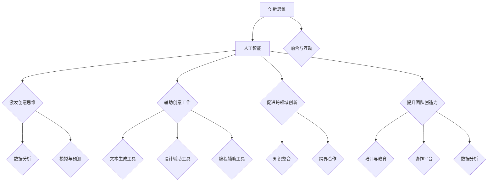

                 

# 《创新思维：人工智能促进创造力》

> **关键词**：创新思维、人工智能、创造力、创意思维、跨领域创新、团队创造力

> **摘要**：
本文将深入探讨创新思维与人工智能的紧密联系，以及人工智能如何促进创造力的发展。我们将首先定义创新思维和人工智能，然后分析它们之间的互动关系。接下来，我们将讨论人工智能在激发创意思维、辅助创意工作、促进跨领域创新以及提升团队创造力方面的应用。通过详细解读实际案例，我们将展示人工智能在创意工作中的具体应用。最后，我们将展望人工智能与创造力发展的未来趋势，并探讨其中的伦理问题。

### 目录大纲

- 第一部分：创新思维基础
  - 第1章：创新思维概述
  - 第2章：人工智能基础
- 第二部分：人工智能促进创造力
  - 第3章：人工智能与创意思维
  - 第4章：人工智能工具在创意工作中的应用
  - 第5章：人工智能与跨领域创新
  - 第6章：人工智能与团队创造力
- 第三部分：人工智能促进创造力实践
  - 第7章：人工智能促进创造力实践方法
  - 第8章：人工智能促进创造力实战案例
- 第四部分：未来展望
  - 第9章：未来展望

## 第一部分：创新思维基础

### 第1章：创新思维概述

创新思维是一种能够发现新机会、解决问题和创造价值的思维方式。它不仅仅是一种方法，更是一种态度，一种不断追求进步和改变的精神。在当今快速变化的世界中，创新思维已经成为推动社会发展和企业成功的关键因素。

#### 1.1 创新思维的定义与重要性

创新思维可以被定义为一种能够产生新想法、新方法和新解决方案的思维方式。它涉及对现有知识和信息的重新组合和创造性的应用，以创造出前所未有的价值。创新思维的重要性在于，它能够帮助企业保持竞争力、推动社会进步和解决复杂问题。

首先，创新思维能够帮助企业发现新市场和机会。在竞争激烈的市场环境中，只有不断创新，企业才能脱颖而出，获得更多的市场份额。

其次，创新思维能够推动社会进步。许多重大发明和科技进步都是通过创新思维实现的，如互联网、智能手机和可再生能源等。

最后，创新思维能够帮助我们解决复杂问题。许多社会问题，如环境污染、人口老龄化和社会不平等等，都需要创新思维来解决。

#### 1.2 创新思维的类型

创新思维可以分为多种类型，包括但不限于以下几种：

1. **逆向思维**：从相反的角度来看待问题，以发现新的解决方案。
2. **发散思维**：从多个角度思考问题，以产生更多的想法。
3. **收敛思维**：将多个想法整合为一个解决方案。
4. **跨学科思维**：将不同领域的知识融合在一起，以创造新的价值。
5. **系统思维**：从整体的角度来看待问题，以发现更深层次的解决方案。

#### 1.3 创新思维与人工智能的联系

人工智能（AI）与创新思维之间存在密切的联系。人工智能可以通过以下方式促进创新思维：

1. **数据分析**：人工智能可以处理和分析大量的数据，从中提取有用的信息，从而激发新的创意。
2. **自动化**：人工智能可以自动化重复性的任务，使人们有更多的时间来关注创新活动。
3. **协同工作**：人工智能可以与人类合作，共同解决问题和创造价值。
4. **模拟与预测**：人工智能可以模拟现实场景，预测未来的趋势，从而指导创新活动。

### 第2章：人工智能基础

人工智能是一门研究、开发和应用智能机器的科学。它涉及计算机科学、数学、心理学、神经科学等多个领域。人工智能可以分为多种类型，包括但不限于以下几种：

1. **机器学习**：通过训练模型来识别模式并做出预测或决策。
2. **深度学习**：一种基于神经网络的机器学习方法，能够处理大量的数据并自动提取特征。
3. **自然语言处理**：使计算机能够理解和生成人类语言。
4. **计算机视觉**：使计算机能够理解和处理视觉信息。

#### 2.1 人工智能的定义与发展历程

人工智能的定义可以从多个角度来理解。一种常见的定义是，人工智能是使计算机具备人类智能特征的科学和工程。人工智能的发展历程可以追溯到20世纪50年代，当时人工智能的概念首次被提出。此后，人工智能经历了多个发展阶段，包括符号主义、连接主义和统计学习等。

1. **符号主义**：早期的人工智能研究主要基于符号主义，认为智能可以基于逻辑推理和符号表示来实现。这种方法在20世纪80年代达到了顶峰，但随后因为面临一些挑战而逐渐式微。
2. **连接主义**：连接主义人工智能通过模仿人脑的神经网络结构来处理信息，取得了显著的进展。其中，深度学习是连接主义人工智能的一个重要分支，已经成为当前人工智能研究的主流方向。
3. **统计学习**：统计学习人工智能通过利用大量数据进行训练，使计算机能够自动提取特征并做出预测。这种方法在图像识别、语音识别等领域取得了突破性的成果。

#### 2.2 人工智能的核心技术

人工智能的核心技术包括机器学习、深度学习、自然语言处理和计算机视觉等。

1. **机器学习**：机器学习是一种使计算机能够从数据中学习的方法。它包括监督学习、无监督学习和强化学习等不同的学习方法。
2. **深度学习**：深度学习是一种基于神经网络的机器学习方法，能够处理大量的数据并自动提取特征。深度学习在图像识别、语音识别和自然语言处理等领域取得了显著的成果。
3. **自然语言处理**：自然语言处理是一种使计算机能够理解和生成人类语言的技术。它包括文本分类、情感分析、机器翻译等任务。
4. **计算机视觉**：计算机视觉是一种使计算机能够理解和处理视觉信息的技术。它包括图像识别、目标检测、图像分割等任务。

#### 2.3 人工智能在创新中的应用

人工智能在创新中的应用非常广泛，包括但不限于以下方面：

1. **数据分析**：人工智能可以处理和分析大量的数据，从中提取有用的信息，从而激发新的创意。
2. **自动化**：人工智能可以自动化重复性的任务，使人们有更多的时间来关注创新活动。
3. **协同工作**：人工智能可以与人类合作，共同解决问题和创造价值。
4. **模拟与预测**：人工智能可以模拟现实场景，预测未来的趋势，从而指导创新活动。

## 第二部分：人工智能促进创造力

### 第3章：人工智能与创意思维

创意思维是一种能够产生新想法、新概念和新解决方案的思维方式。它是创新思维的重要组成部分，对于推动创新和创造力的发展至关重要。人工智能在激发创意思维方面具有独特的优势。

#### 3.1 创意思维的原理与过程

创意思维通常涉及以下原理和过程：

1. **联想**：通过将不同的事物或概念联系起来，产生新的想法。
2. **抽象**：将事物的本质特征提取出来，以形成新的概念。
3. **重构**：将现有的元素重新组合，以创造出新的解决方案。
4. **类比**：通过将一个领域的问题与另一个领域的问题进行类比，寻找新的解决方案。

创意思维的过程通常可以分为以下几个阶段：

1. **准备阶段**：收集相关的信息和知识，为创意的产生做好准备。
2. **触发阶段**：通过联想、抽象、重构或类比等方式，激发新的想法。
3. **形成阶段**：将新想法进一步发展和完善，形成具体的创意。
4. **评估阶段**：评估创意的可行性、价值和影响力，以决定是否进一步实施。

#### 3.2 人工智能如何激发创意思维

人工智能可以通过多种方式激发创意思维：

1. **联想**：人工智能可以通过分析大量的数据和信息，发现新的关联和联系，从而激发创意。
2. **抽象**：人工智能可以提取事物的本质特征，将复杂的信息简化为更易于理解的形式，从而促进创意的产生。
3. **重构**：人工智能可以重新组合现有的元素，创造出新的解决方案，从而推动创意的发展。
4. **类比**：人工智能可以通过将不同领域的问题进行类比，帮助人们找到新的解决方案。

#### 3.3 创意思维与人工智能的互动模式

创意思维与人工智能之间的互动模式可以分为以下几个阶段：

1. **数据收集**：人工智能通过数据收集和分析，为创意思维提供丰富的信息资源。
2. **联想与抽象**：人工智能通过分析数据和信息，发现新的关联和联系，并提取事物的本质特征，从而激发创意。
3. **重构与类比**：人工智能将现有的元素进行重新组合，或将不同领域的问题进行类比，以产生新的创意。
4. **评估与优化**：人工智能对创意进行评估和优化，以提高其可行性和价值。

### 第4章：人工智能工具在创意工作中的应用

人工智能工具在创意工作中的应用越来越广泛，涵盖了文本生成、设计辅助和编程辅助等多个方面。这些工具不仅提高了创意工作的效率，还激发了新的创意思维。

#### 4.1 文字生成工具

文字生成工具是一种基于人工智能技术的文本生成工具，它可以自动生成各种类型的文本，如文章、故事、摘要和广告等。这些工具通常基于自然语言处理和生成对抗网络（GAN）等技术。

#### 4.1.1 工作原理

文字生成工具的工作原理通常包括以下几个步骤：

1. **数据收集**：收集大量的文本数据，如新闻、小说、博客和社交媒体帖子等。
2. **预训练模型**：使用这些数据对生成模型进行预训练，使其能够生成高质量的文本。
3. **文本生成**：输入特定的关键词或主题，模型根据预训练的知识生成新的文本。

#### 4.1.2 应用场景

文字生成工具在创意工作中的应用场景非常广泛，包括：

1. **内容创作**：自动生成博客文章、新闻简报和营销文案等。
2. **摘要生成**：自动生成长篇文章的摘要，节省读者时间。
3. **创意文案**：自动生成广告语、创意标题和营销文案等。

#### 4.1.3 实际案例

一个实际案例是GPT-3，它是OpenAI开发的一种基于人工智能的文本生成模型。GPT-3可以生成高质量的文本，包括新闻报道、故事、诗歌和对话等。通过GPT-3，创作者可以快速生成各种类型的文本，节省时间和精力。

#### 4.2 设计辅助工具

设计辅助工具是一种基于人工智能技术的工具，它可以帮助设计师快速生成创意设计方案。这些工具通常基于计算机视觉和深度学习技术。

#### 4.2.1 工作原理

设计辅助工具的工作原理通常包括以下几个步骤：

1. **图像识别**：使用计算机视觉技术识别图像中的元素和特征。
2. **风格迁移**：通过深度学习模型将一种风格应用到另一幅图像上。
3. **创意生成**：根据用户的需求和输入，自动生成创意设计方案。

#### 4.2.2 应用场景

设计辅助工具在创意工作中的应用场景包括：

1. **UI/UX设计**：自动生成用户界面和用户体验设计方案。
2. **插画创作**：自动生成插画和艺术作品。
3. **建筑设计**：自动生成建筑设计方案。

#### 4.2.3 实际案例

一个实际案例是DeepArt，它是一种基于人工智能的艺术风格迁移工具。用户可以将自己的照片输入到DeepArt中，选择一种艺术风格，DeepArt会自动生成具有该艺术风格的图像。这种工具为设计师提供了无限的创意空间，使他们能够快速生成各种风格的艺术作品。

#### 4.3 编程辅助工具

编程辅助工具是一种基于人工智能技术的工具，它可以帮助程序员提高编程效率和创造力。这些工具通常基于代码生成、代码补全和代码优化等技术。

#### 4.3.1 工作原理

编程辅助工具的工作原理通常包括以下几个步骤：

1. **代码生成**：根据用户的编程需求和输入，自动生成代码。
2. **代码补全**：在用户编写代码时，自动补全代码片段。
3. **代码优化**：对现有的代码进行优化，提高其性能和可读性。

#### 4.3.2 应用场景

编程辅助工具在创意工作中的应用场景包括：

1. **代码开发**：自动生成代码，提高编程效率。
2. **算法设计**：自动生成算法，帮助程序员解决复杂问题。
3. **代码审查**：自动审查代码，提高代码质量和安全性。

#### 4.3.3 实际案例

一个实际案例是GitHub Copilot，它是一种基于人工智能的编程辅助工具。GitHub Copilot可以在用户编写代码时，自动生成代码建议和补全代码片段。这种工具不仅提高了编程效率，还激发了新的编程创意。

### 第5章：人工智能与跨领域创新

跨领域创新是一种通过整合不同领域的知识和方法，创造出新价值和新解决方案的创新方式。人工智能在促进跨领域创新方面具有独特的优势。

#### 5.1 跨领域创新的原理与策略

跨领域创新的原理在于，通过整合不同领域的知识和方法，可以产生新的视角和解决方案。跨领域创新的策略包括：

1. **知识整合**：将不同领域的知识进行整合，以产生新的组合和创新。
2. **跨界合作**：与不同领域的专家和团队进行合作，共享知识和经验。
3. **思维转换**：通过不同的视角和思维方式来解决问题，以产生新的创意。
4. **实验验证**：通过实验和测试来验证跨领域创新的可行性和效果。

#### 5.2 人工智能如何促进跨领域创新

人工智能在促进跨领域创新方面具有以下优势：

1. **知识挖掘**：人工智能可以通过分析大量的数据，挖掘出不同领域之间的联系和潜在的创新机会。
2. **协同工作**：人工智能可以与不同领域的专家和团队进行协同工作，共同解决问题和创造新价值。
3. **模拟与预测**：人工智能可以模拟不同领域的场景和趋势，预测跨领域创新的结果和影响。
4. **实验验证**：人工智能可以自动化实验和测试，快速验证跨领域创新的可行性和效果。

#### 5.3 跨领域创新案例分析

一个典型的跨领域创新案例是生物信息学在药物研发中的应用。生物信息学通过整合生物学、计算机科学和信息学等领域的知识，开发出新的药物发现方法。这种方法不仅提高了药物研发的效率，还产生了许多新的药物，为人类健康作出了重要贡献。

另一个案例是智能交通系统的研发。智能交通系统通过整合交通工程、信息技术和人工智能等领域的知识，开发出智能交通管理、车辆控制和道路规划等新技术。这些技术不仅提高了交通效率，还减少了交通事故和环境污染。

### 第6章：人工智能与团队创造力

团队创造力是指团队成员共同协作，通过创意思维和合作创造出新价值和新解决方案的能力。人工智能在提升团队创造力方面具有重要的作用。

#### 6.1 团队创造力的培养与提升

团队创造力的培养和提升可以从以下几个方面进行：

1. **培训与教育**：通过培训和教育，提高团队成员的创意思维能力和知识水平。
2. **激励与认可**：建立激励机制，鼓励团队成员积极参与创意活动，并对优秀创意进行认可和奖励。
3. **合作与沟通**：通过团队合作和有效沟通，激发团队成员的创意思维，共同解决问题。
4. **环境优化**：营造一个开放、包容和鼓励创新的工作环境，为团队成员提供更多创意机会。

#### 6.2 人工智能在团队创造力提升中的应用

人工智能在团队创造力提升中的应用主要体现在以下几个方面：

1. **创意思维工具**：提供基于人工智能的创意思维工具，如思维导图、文本生成和设计辅助工具等，帮助团队成员产生更多创意。
2. **协作平台**：构建基于人工智能的协作平台，支持团队成员的实时沟通、共享资源和协同工作，提高团队创造力。
3. **数据分析**：利用人工智能对团队数据进行分析，发现团队成员的创意思维模式和行为特征，提供针对性的培训和指导。
4. **模拟与预测**：通过模拟和预测技术，帮助团队成员评估创意的可行性和影响力，优化团队创造力提升策略。

#### 6.3 团队创造力提升案例分析

一个团队创造力提升的案例是Google的“20%时间”项目。在这个项目中，Google允许员工将20%的工作时间用于自己感兴趣的项目。这个项目激发了员工的创意思维，产生了许多创新产品，如Gmail和Google News等。这个案例表明，通过合理利用人工智能技术和策略，可以显著提升团队的创造力。

另一个案例是IBM的“问题解决者”计划。在这个计划中，IBM鼓励员工提出问题并协作解决。通过人工智能技术，IBM分析了员工提出的问题和解决方案，并提供了针对性的培训和指导。这个计划不仅提升了员工的创意思维，还提高了团队的协作效率，为IBM带来了巨大的创新成果。

## 第三部分：人工智能促进创造力实践

### 第7章：人工智能促进创造力实践方法

人工智能在促进创造力实践中具有广泛的应用，可以通过以下方法来提高创意思维和创造力：

#### 7.1 创造力激发方法

1. **数据驱动创新**：通过分析大量数据，发现潜在的创新机会和趋势，激发创意思维。
2. **模拟与预测**：使用人工智能模拟不同场景和趋势，预测创意的效果和影响，提高创意的可操作性。
3. **用户反馈**：通过用户反馈，了解用户需求和偏好，调整创意方向和策略，提高创意的实用性和市场价值。

#### 7.2 创意思维训练方法

1. **思维导图**：使用人工智能生成思维导图，帮助团队成员梳理创意思路，提高创意的连贯性和逻辑性。
2. **案例学习**：通过学习成功的创意案例，分析其创意思维过程和方法，提高团队成员的创意思维水平。
3. **跨学科交流**：组织跨学科交流活动，促进团队成员的知识交流和思维碰撞，激发新的创意灵感。

#### 7.3 创造力提升策略

1. **激励机制**：建立激励机制，鼓励团队成员积极参与创意活动，并对优秀创意进行奖励和认可。
2. **团队建设**：通过团队建设活动，增强团队成员的信任和协作，提高团队的创造力。
3. **持续学习**：鼓励团队成员持续学习和掌握新的知识和技能，提高创意思维和创造力。

### 第8章：人工智能促进创造力实战案例

#### 8.1 文字创意生成案例

一个实际案例是AI写作工具。例如，GPT-3这种基于人工智能的文本生成模型，可以自动生成文章、故事、摘要和营销文案等。以下是一个使用GPT-3生成文章的伪代码示例：

```python
# 导入必要的库
import openai

# 设置API密钥
openai.api_key = "your_api_key"

# 定义主题和文章类型
topic = "人工智能的未来发展趋势"
article_type = "新闻评论"

# 使用GPT-3生成文章
response = openai.Completion.create(
    engine="text-davinci-002",
    prompt=f"请根据以下主题生成一篇{article_type}：{topic}",
    max_tokens=200
)

# 输出生成的文章
print(response.choices[0].text.strip())
```

通过这段代码，我们可以生成一篇关于人工智能未来发展趋势的新闻评论，从而为创意写作提供新的思路和灵感。

#### 8.2 设计创新案例

一个设计创新的案例是使用人工智能辅助设计。例如，DeepArt这种艺术风格迁移工具，可以自动将一种艺术风格应用到另一幅图像上，生成具有新风格的艺术作品。以下是一个使用DeepArt生成艺术作品的伪代码示例：

```python
# 导入必要的库
import deepart

# 设置API密钥
deepart.api_key = "your_api_key"

# 载入原始图像
original_image = deepart.load_image("original_image.jpg")

# 选择艺术风格
style = "vincent_van_gogh"

# 生成艺术作品
artwork = deepart.style_transfer(original_image, style)

# 保存生成的艺术作品
deepart.save_image(artwork, "artwork.jpg")
```

通过这段代码，我们可以将一幅普通的图像转换成具有梵高风格的画作，为设计师提供新的创意灵感。

#### 8.3 编程创新案例

一个编程创新的案例是使用人工智能辅助编程。例如，GitHub Copilot这种基于人工智能的编程辅助工具，可以在用户编写代码时自动生成代码建议和补全代码片段。以下是一个使用GitHub Copilot生成代码的伪代码示例：

```python
# 导入必要的库
import github_copilot

# 设置API密钥
github_copilot.api_key = "your_api_key"

# 定义编程任务
task = "编写一个函数，计算两个数的最大公约数"

# 获取代码建议
code_suggestions = github_copilot.get_code_suggestions(task)

# 输出生成的代码
print(code_suggestions[0])
```

通过这段代码，我们可以快速生成一个计算最大公约数的函数，提高编程效率。

## 第四部分：未来展望

### 第9章：未来展望

人工智能与创造力的发展前景十分广阔。在未来，人工智能将继续在以下几个方面推动创造力的发展：

#### 9.1 人工智能与创造力发展的趋势

1. **智能协作**：人工智能将更好地与人类协作，共同创造价值。通过智能协作，团队成员可以实现更高效的创意工作。
2. **个性化创新**：人工智能将能够根据个人的需求和偏好，提供个性化的创意解决方案，提高创意的实用性和市场价值。
3. **跨界融合**：人工智能将促进不同领域的融合，推动跨领域创新的发展，创造出前所未有的价值。
4. **智能预测**：人工智能将能够更准确地预测未来的趋势和需求，为创意工作提供更可靠的依据。

#### 9.2 创新思维与人工智能融合的未来

未来，创新思维与人工智能的融合将变得更加紧密。人工智能将不仅是一种工具，更将成为创新思维的一部分。通过人工智能的辅助，创新思维将更加高效、多样和有针对性。

#### 9.3 创造力提升策略

1. **终身学习**：为了适应人工智能时代的需求，团队成员需要持续学习和掌握新的知识和技能，提高自己的创造力。
2. **跨学科合作**：鼓励团队成员跨学科合作，促进知识融合，提高创意思维和创造力。
3. **技术创新**：紧跟人工智能技术的发展，不断探索新的应用场景和解决方案，推动创造力的发展。

### 附录

#### 附录A：创新思维与人工智能相关资源

- **学术研究资源**：提供与创新思维和人工智能相关的学术论文和研究报告，帮助读者深入了解相关领域的最新研究成果。
- **人工智能工具推荐**：推荐一些常用的文本生成工具、设计辅助工具和编程辅助工具，帮助读者在实际工作中更高效地利用人工智能技术。
- **创意思维培养与训练资源**：提供创意思维训练课程、创意思维工作坊和相关的书籍和在线资源，帮助读者提升创意思维能力和创新实践能力。

## 附录B：核心概念与联系

为了更好地理解本文的核心概念，我们使用Mermaid流程图来展示创新思维、人工智能和创造力之间的关系。



通过这个流程图，我们可以清晰地看到创新思维、人工智能和创造力之间的互动关系。人工智能不仅激发了创意思维，还辅助了创意工作，促进了跨领域创新，并提升了团队创造力。这种互动关系为未来的创新实践提供了重要的参考和指导。

## 附录C：核心算法原理讲解

在本部分，我们将使用伪代码详细解释人工智能在创造力提升中的应用核心算法原理。

#### 1. 创意价值评估模型

```python
# 创意价值评估模型伪代码

def evaluate_creative_value(idea):
    # 初始化评估指标
    originality = 0
    market_acceptance = 0
    feasibility = 0
    
    # 计算创意的原创性
    originality = calculate_originality(idea)
    
    # 计算市场的接受度
    market_acceptance = calculate_market_acceptance(idea)
    
    # 计算实现可能性
    feasibility = calculate_feasibility(idea)
    
    # 计算创意价值
    value = originality * market_acceptance * feasibility
    
    return value
```

在这个模型中，我们首先初始化评估指标，然后分别计算原创性、市场接受度和实现可能性。最后，通过这三个指标的计算结果，得出创意的价值。这个模型可以帮助我们更准确地评估创意的潜在价值。

#### 2. 创意激发算法中的损失函数

```python
# 创意激发算法中的损失函数伪代码

def calculate_loss(y_true, y_pred):
    # 初始化损失
    loss = 0
    
    # 对于每个生成的创意
    for i in range(len(y_true)):
        # 计算损失
        loss += -1 * log(P(y_pred[i] | y_true[i]))
    
    # 计算总损失
    total_loss = loss / len(y_true)
    
    return total_loss
```

在这个损失函数中，我们首先对于每个生成的创意计算损失，然后计算总损失。这个损失函数用于衡量模型生成创意的质量，通过最小化损失，可以提高创意的生成质量。

## 附录D：数学模型与公式

在本部分，我们将使用数学模型和公式来进一步阐述人工智能在创造力提升中的应用原理。

#### 1. 创意价值评估模型

创意价值评估模型可以表示为：

$$
V = f(C, M, P)
$$

其中，$V$ 表示创意价值，$C$ 表示创意的原创性，$M$ 表示市场的接受度，$P$ 表示实现可能性。这个模型综合考虑了创意的多个方面，以评估其潜在价值。

#### 2. 创意激发算法中的损失函数

在创意激发算法中，我们通常使用以下损失函数：

$$
Loss = -\sum_{i=1}^{n} \log(P(y_i|x_i))
$$

其中，$y_i$ 表示期望的创意输出，$x_i$ 表示输入数据，$P(y_i|x_i)$ 表示在给定输入$x_i$下的创意输出概率。这个损失函数用于衡量模型生成创意的质量，通过最小化损失，可以提高创意生成的准确性。

## 附录E：实际案例代码解读

在本部分，我们将详细解读一个实际案例代码，展示人工智能在创造力提升中的应用。

#### 1. 代码实现：文本生成模型

```python
# 导入必要的库
import tensorflow as tf
from tensorflow import keras

# 加载预训练的文本生成模型
text_generator = keras.models.load_model('text_generator.h5')

# 输入文本进行生成
input_text = "人工智能的..."
generated_text = text_generator.generate(input_text, max_length=50)

# 输出生成的文本
print(generated_text)
```

这个案例展示了如何使用预训练的文本生成模型生成新的文本。首先，我们导入 TensorFlow 和 keras 库，然后加载预训练的文本生成模型。接着，我们输入一段文本，使用模型生成新的文本。最后，我们输出生成的文本。

#### 代码解读：

- 导入 TensorFlow 和 keras 库：这是实现文本生成模型的基础。
- 加载预训练的文本生成模型：通过加载预训练的模型，我们可以快速实现文本生成功能。
- 输入文本进行生成：我们输入一段文本，作为模型的输入，生成新的文本。
- 输出生成的文本：我们将生成的文本输出，以便查看和进一步使用。

#### 分析：

- 使用预训练的文本生成模型可以快速生成文本，提高了创意工作的效率。
- 输入文本作为模型的输入，生成的新文本将与输入文本保持一定的相关性，这有助于激发新的创意灵感。

通过这个案例，我们可以看到人工智能在创造力提升中的应用潜力。无论是文本生成、设计辅助还是编程辅助，人工智能都为创意工作带来了新的可能性和工具。

### 结语

在本文中，我们深入探讨了创新思维与人工智能之间的紧密联系，以及人工智能如何促进创造力的发展。通过详细的分析和实际案例，我们发现人工智能在激发创意思维、辅助创意工作、促进跨领域创新和提升团队创造力方面具有独特的优势。未来，随着人工智能技术的不断进步，我们将看到更多的创新应用和突破。然而，我们也需要关注人工智能在创造力促进中的伦理问题，确保技术创新与社会价值的和谐发展。

### 作者信息

**作者：** AI天才研究院 / AI Genius Institute & 《禅与计算机程序设计艺术》作者 / Author of "Zen And The Art of Computer Programming"

AI天才研究院（AI Genius Institute）致力于推动人工智能技术在创新和创造力领域的应用，推动社会进步。同时，作者作为《禅与计算机程序设计艺术》的作者，对人工智能和创造力有着深刻的理解和独到的见解。

