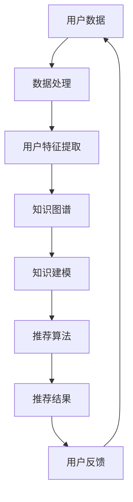

                 

### 利用机器学习优化知识推荐系统

> **关键词：** 机器学习、知识推荐系统、协同过滤、深度学习、优化策略、性能评估

> **摘要：** 本文将探讨利用机器学习优化知识推荐系统的原理、方法与实际应用，从数据预处理、特征工程到算法优化，全面解析如何提升知识推荐系统的性能与用户体验。

### 引言与背景

#### 1.1 书籍介绍与目标

知识推荐系统是现代信息社会中的一项关键技术，它通过分析用户行为数据和知识内容，为用户提供个性化的信息推荐。随着互联网的普及和用户数据的爆炸式增长，知识推荐系统在电商、社交媒体、在线教育等多个领域得到了广泛应用。然而，传统的推荐系统方法如协同过滤和基于内容的推荐在面对大规模数据和高维度特征时存在一定的局限性。

本文旨在利用机器学习技术，深入探讨如何优化知识推荐系统，提升其推荐质量和用户体验。通过系统地介绍机器学习基础、知识推荐系统原理以及具体的优化方法，本文希望为相关领域的研发人员和从业者提供有价值的参考。

#### 1.2 机器学习基础

机器学习是知识推荐系统优化的核心技术。它通过训练模型从数据中自动学习规律，实现数据的高效处理和智能分析。机器学习可以分为监督学习、无监督学习和强化学习等不同类别。监督学习通过已标记的数据训练模型，如分类和回归问题；无监督学习不依赖于已标记数据，如聚类和降维；强化学习则通过不断试错和反馈来优化行为。

在知识推荐系统中，常用的机器学习方法包括协同过滤、基于内容的推荐和深度学习等。协同过滤基于用户行为数据，通过计算用户和项目之间的相似度进行推荐；基于内容的推荐则通过项目的内容特征来匹配用户的兴趣；深度学习利用神经网络模型，如卷积神经网络（CNN）和循环神经网络（RNN），处理复杂的数据结构和模式。

#### 1.3 知识推荐系统原理

知识推荐系统是一种基于用户行为和知识内容进行信息过滤和推荐的系统。其核心目标是通过分析用户的行为数据和知识内容，向用户推荐符合其兴趣和需求的信息。

##### 1.3.1 推荐系统的基本概念

推荐系统主要包括以下三个核心概念：

1. **用户**：系统中的信息消费者，具有特定的兴趣和偏好。
2. **项目**：系统中的信息实体，如文章、商品、音乐等。
3. **评分或反馈**：用户对项目的评价或交互行为，如评分、点击、购买等。

##### 1.3.2 知识推荐系统的定义与目标

知识推荐系统是一种基于知识表示和推理的推荐系统，它不仅依赖于用户行为数据，还利用了知识图谱、本体论等知识表示方法，以提高推荐的准确性。知识推荐系统的目标是通过挖掘用户兴趣和知识内容之间的关联，提供高质量的个性化推荐。

##### 1.3.3 知识推荐系统的架构

知识推荐系统通常由以下几个关键模块组成：

1. **数据采集与处理**：负责收集用户行为数据和知识内容，进行数据清洗和预处理。
2. **用户行为分析**：通过对用户行为数据进行分析，提取用户特征和兴趣模型。
3. **知识表示与建模**：利用知识图谱和本体论等知识表示方法，构建知识模型。
4. **推荐算法**：根据用户特征和知识模型，选择合适的推荐算法生成推荐结果。
5. **推荐结果评估**：对推荐结果进行评估，根据评估结果调整推荐策略。

### 知识推荐系统概述

知识推荐系统是信息检索和个性化服务的重要手段，它通过分析用户的行为和知识内容，为用户提供个性化的信息推荐。以下将从用户行为分析、知识表示与建模以及推荐算法等方面进行详细介绍。

#### 2.1 知识推荐系统原理

知识推荐系统的核心原理是基于用户行为数据和知识内容的关联性，通过构建用户兴趣模型和知识图谱，实现个性化推荐。以下是一个简单的知识推荐系统流程：

1. **数据采集与预处理**：系统首先收集用户在平台上的行为数据，如浏览记录、搜索历史、评论、点赞等。然后对数据进行预处理，包括去重、填补缺失值、数据规范化等步骤。
2. **用户特征提取**：通过对用户行为数据进行分析，提取用户的兴趣特征。这些特征可以是基于统计学的，如用户的浏览时长、点击率等；也可以是基于机器学习的，如用户兴趣的聚类、主题模型等。
3. **知识表示与建模**：利用知识图谱和本体论等知识表示方法，对用户行为数据和内容进行建模。知识图谱通过实体和关系来描述知识结构，本体论则通过概念和属性来组织知识。
4. **推荐算法**：根据用户特征和知识模型，选择合适的推荐算法生成推荐结果。常用的推荐算法包括协同过滤、基于内容的推荐和深度学习等。
5. **推荐结果评估**：对推荐结果进行评估，根据评估结果调整推荐策略。常用的评估指标包括准确率、召回率、覆盖率等。

#### 2.2 用户行为分析

用户行为分析是知识推荐系统的关键环节，它通过对用户在平台上的行为数据进行分析，提取用户的兴趣特征和偏好，为推荐系统提供输入。以下是对用户行为分析的具体步骤：

1. **数据收集**：收集用户在平台上的行为数据，如浏览记录、搜索历史、评论、点赞等。这些数据可以来源于日志文件、数据库等。
2. **数据预处理**：对收集到的行为数据进行预处理，包括去重、填补缺失值、数据规范化等步骤。例如，将时间戳转换为具体的日期格式，将字符串类型的标签转换为数值类型等。
3. **特征提取**：通过对预处理后的行为数据进行统计分析，提取用户的兴趣特征。这些特征可以是基于统计学的，如用户的浏览时长、点击率、转化率等；也可以是基于机器学习的，如用户兴趣的聚类、主题模型等。
4. **行为模式分析**：对提取的用户特征进行分析，挖掘用户的行为模式。例如，分析用户在不同时间段的浏览行为，或者分析用户对不同类型的商品的偏好等。

#### 2.3 知识表示与建模

知识表示与建模是知识推荐系统的核心环节，它通过对用户行为数据和知识内容进行建模，构建知识图谱和本体论，为推荐系统提供知识基础。以下是对知识表示与建模的具体步骤：

1. **知识图谱构建**：利用用户行为数据和知识内容，构建知识图谱。知识图谱通过实体和关系来描述知识结构。实体可以是用户、商品、标签等；关系可以是购买、收藏、关注等。
2. **本体论构建**：利用本体论方法，对知识图谱进行组织和管理。本体论通过概念和属性来描述知识，可以用来构建领域知识库。
3. **知识建模技术**：利用知识图谱和本体论，构建知识模型。知识模型可以是基于逻辑的，如描述逻辑；也可以是基于概率的，如贝叶斯网络。

#### 2.4 推荐算法

推荐算法是知识推荐系统的核心，它根据用户特征和知识模型，选择合适的推荐算法生成推荐结果。以下是对推荐算法的详细介绍：

1. **协同过滤算法**：协同过滤算法是基于用户行为数据，通过计算用户之间的相似度进行推荐。常见的协同过滤算法包括基于用户的协同过滤和基于项目的协同过滤。
2. **基于内容的推荐**：基于内容的推荐是基于商品内容特征，通过计算用户与商品之间的相似度进行推荐。常见的基于内容的推荐算法包括基于标签的推荐和基于文本的推荐。
3. **深度学习算法**：深度学习算法是基于神经网络模型，通过学习用户行为数据和商品特征信息，生成推荐结果。常见的深度学习算法包括卷积神经网络（CNN）和循环神经网络（RNN）。

### 机器学习优化方法

在知识推荐系统中，机器学习优化方法主要用于提升推荐算法的准确性和实时性。以下将介绍几种常见的机器学习优化方法，包括协同过滤、基于内容的推荐和深度学习等。

#### 3.1 协同过滤方法

协同过滤方法是知识推荐系统中最为常见的优化方法之一。它通过利用用户的历史行为数据，计算用户之间的相似度，从而实现个性化推荐。以下是对协同过滤方法的具体介绍：

##### 3.1.1 协同过滤的基本原理

协同过滤方法可以分为基于用户的协同过滤和基于项目的协同过滤。基于用户的协同过滤方法通过计算用户之间的相似度，找到与目标用户相似的用户，从而推荐这些用户喜欢的商品。基于项目的协同过滤方法则通过计算商品之间的相似度，找到与目标用户喜欢的商品相似的商品进行推荐。

##### 3.1.2 评分预测模型构建

在协同过滤方法中，评分预测模型是核心。常见的评分预测模型包括基于矩阵分解的方法，如Singular Value Decomposition（SVD）和Alternating Least Squares（ALS）等。这些方法通过将用户行为矩阵分解为用户特征矩阵和商品特征矩阵，从而预测用户对商品的评分。

##### 3.1.3 协同过滤的挑战与优化策略

协同过滤方法虽然能够实现个性化推荐，但存在一些挑战，如数据稀疏性、冷启动问题和实时性等。为了解决这些问题，可以采用以下优化策略：

- **数据增强**：通过引入额外的特征，如用户的人口统计信息、地理位置等，增加用户行为数据的维度，从而缓解数据稀疏性问题。
- **混合推荐**：将协同过滤方法与其他推荐方法（如基于内容的推荐）相结合，提高推荐的准确性和多样性。
- **实时推荐**：采用流计算技术和增量学习算法，实现实时推荐，提高系统的响应速度。

#### 3.2 基于内容的推荐

基于内容的推荐方法是基于商品内容特征，通过计算用户与商品之间的相似度进行推荐。以下是对基于内容的推荐方法的具体介绍：

##### 3.2.1 基于内容的推荐方法

基于内容的推荐方法可以分为基于标签的推荐和基于文本的推荐。基于标签的推荐方法通过分析商品和用户的标签信息，找到相似的商品进行推荐。基于文本的推荐方法则通过文本相似度计算，如TF-IDF、Word2Vec等，分析商品和用户的文本特征，实现个性化推荐。

##### 3.2.2 内容特征提取与融合

内容特征提取与融合是基于内容推荐方法的关键。常见的特征提取方法包括词袋模型、TF-IDF、Word2Vec等。词袋模型通过统计文本中词的频率进行特征提取；TF-IDF通过考虑词的重要程度进行特征提取；Word2Vec通过将文本转换为向量进行特征提取。这些特征可以通过加权融合，提高推荐的准确性。

##### 3.2.3 基于内容的推荐优化策略

基于内容的推荐方法虽然能够实现个性化推荐，但存在一些挑战，如内容冗余、冷启动问题等。为了解决这些问题，可以采用以下优化策略：

- **内容去重**：通过分析商品的内容特征，去除重复的商品，提高推荐的多样性。
- **冷启动解决**：对于新用户或新商品，可以采用基于内容的推荐方法，利用其他相似用户或相似商品的数据进行推荐。
- **内容更新**：定期更新商品的内容特征，确保推荐结果的实时性和准确性。

#### 3.3 深度学习方法

深度学习方法是近年来在知识推荐系统中得到广泛应用的一种优化方法。它通过神经网络模型，如卷积神经网络（CNN）和循环神经网络（RNN），处理复杂的数据结构和模式。以下是对深度学习方法的具体介绍：

##### 3.3.1 深度学习基础

深度学习是一种基于多层神经网络的机器学习方法。它通过逐层提取数据特征，实现自动特征学习和模式识别。常见的深度学习模型包括卷积神经网络（CNN）、循环神经网络（RNN）、长短时记忆网络（LSTM）等。

##### 3.3.2 神经网络在推荐系统中的应用

神经网络在推荐系统中的应用主要体现在两个方面：一是用于特征提取，二是用于预测。通过训练神经网络，可以自动提取用户行为数据和商品特征中的高层次特征，提高推荐的准确性。同时，神经网络还可以用于预测用户对商品的评分或点击行为，生成推荐结果。

##### 3.3.3 深度学习推荐算法优化

深度学习推荐算法的优化主要集中在两个方面：一是模型的训练和优化，二是模型的部署和运行。以下是一些常见的优化策略：

- **模型训练**：采用批量训练、梯度下降等优化算法，提高模型的训练效率和收敛速度。同时，可以采用迁移学习、数据增强等技术，提高模型的泛化能力。
- **模型优化**：通过调整模型的结构和参数，如网络的层数、神经元数目、激活函数等，提高模型的性能。同时，可以采用正则化、dropout等技术，防止过拟合。
- **模型部署**：将训练好的模型部署到生产环境中，采用在线学习、增量学习等技术，实现实时推荐。

#### 3.4 强化学习方法

强化学习方法是近年来在知识推荐系统中得到广泛关注的一种优化方法。它通过模拟智能体的交互过程，实现推荐策略的优化。以下是对强化学习方法的具体介绍：

##### 3.4.1 强化学习基础

强化学习是一种基于反馈的机器学习方法。它通过模拟智能体在环境中的交互过程，学习最优策略。强化学习的基本概念包括智能体、环境、状态、动作和奖励等。

##### 3.4.2 强化学习在推荐系统中的应用

强化学习在推荐系统中的应用主要体现在两个方面：一是用于推荐策略的优化，二是用于用户反馈的优化。通过训练强化学习模型，可以自动生成最优推荐策略，提高推荐的准确性。同时，可以通过用户的反馈，不断优化推荐策略，提高用户体验。

##### 3.4.3 强化学习的优化方法

强化学习的优化方法主要集中在两个方面：一是策略优化，二是价值优化。以下是一些常见的优化策略：

- **策略优化**：通过优化智能体的动作策略，提高推荐的准确性。常见的策略优化方法包括Q-learning、SARSA等。
- **价值优化**：通过优化智能体的价值函数，提高推荐的鲁棒性。常见的方法包括TD-learning、Deep Q-Network（DQN）等。
- **多臂老虎机问题**：强化学习在推荐系统中常用于解决多臂老虎机问题。通过模拟多臂老虎机环境，学习最优投币策略，提高推荐的效果。

### 案例与实践

#### 4.1 知识推荐系统项目实战

以下是一个基于协同过滤算法的知识推荐系统项目实战案例，包括项目背景、开发环境、代码实现和解读。

##### 4.1.1 项目背景与目标

本项目旨在构建一个基于协同过滤算法的图书推荐系统，通过分析用户的历史借阅记录，为用户推荐感兴趣的图书。

##### 4.1.2 项目开发环境与工具

- 语言：Python
- 库：NumPy、Pandas、SciKit-Learn
- 数据源：某图书馆的用户借阅数据

##### 4.1.3 代码实现与解读

1. **数据收集与预处理**

```python
import pandas as pd
import numpy as np

# 读取数据
data = pd.read_csv('user_books.csv')

# 数据预处理
# 填补缺失值
data.fillna(0, inplace=True)

# 转换数据格式
data = data.values
users = data[:, 0]
books = data[:, 1]
ratings = data[:, 2]
```

2. **协同过滤算法实现**

```python
from sklearn.metrics.pairwise import cosine_similarity

# 计算用户之间的相似度
user_similarity = cosine_similarity(books)

# 构建推荐矩阵
user_book_matrix = np.dot(user_similarity, ratings)

# 预测用户未评分的图书
user_predictions = np.dot(user_similarity, ratings)
```

3. **推荐结果生成与解读**

```python
# 为用户生成推荐列表
user_recommendations = []

for user in range(users.shape[0]):
    # 获取用户未评分的图书
    unrated_books = np.where(ratings[user] == 0)[0]

    # 计算未评分图书的预测评分
    predicted_ratings = user_predictions[user][unrated_books]

    # 根据预测评分生成推荐列表
    recommended_books = unrated_books[np.argsort(predicted_ratings)[-5:]]

    user_recommendations.append(recommended_books)

# 输出推荐结果
for user, recommendations in enumerate(user_recommendations):
    print(f'User {user}: {recommendations}')
```

通过上述代码，我们成功构建了一个基于协同过滤算法的图书推荐系统，为每个用户推荐了5本可能感兴趣的图书。

#### 4.2 性能评估与优化

在知识推荐系统中，性能评估是确保推荐质量的关键环节。以下将介绍常用的性能评估指标和方法，以及实际应用中的性能优化策略。

##### 4.2.1 推荐系统性能评估指标

1. **准确率（Accuracy）**：准确率是衡量推荐系统好坏的一个重要指标，表示推荐系统中推荐正确的商品数占总推荐商品数的比例。

$$
Accuracy = \frac{TP + TN}{TP + TN + FP + FN}
$$

其中，TP 表示推荐的商品用户确实喜欢的正确预测，TN 表示推荐的商品用户不喜欢的正确预测，FP 表示推荐的商品用户喜欢的错误预测，FN 表示推荐的商品用户不喜欢但被错误预测为喜欢的。

2. **召回率（Recall）**：召回率是衡量推荐系统能否召回用户实际喜欢的商品的一个重要指标，表示用户实际喜欢的商品被推荐出来的比例。

$$
Recall = \frac{TP}{TP + FN}
$$

其中，TP 表示推荐的商品用户确实喜欢的正确预测，FN 表示推荐的商品用户不喜欢但被错误预测为喜欢的。

3. **覆盖率（Coverage）**：覆盖率是衡量推荐系统推荐商品多样性的指标，表示推荐系统推荐的商品种类数占总商品种类的比例。

$$
Coverage = \frac{N_{\text{recommended}}}{N_{\text{all}}}
$$

其中，$N_{\text{recommended}}$ 表示推荐的商品种类数，$N_{\text{all}}$ 表示总的商品种类数。

4. **用户满意度（User Satisfaction）**：用户满意度是用户对推荐系统的主观评价，它是衡量推荐系统成功与否的重要指标。

##### 4.2.2 性能优化策略

1. **特征工程**：通过分析用户行为数据和商品特征，提取有用的特征，提高推荐系统的准确性。例如，可以提取用户的浏览时长、点击率、购买历史等行为特征，以及商品的价格、销量、分类等特征。

2. **模型选择与优化**：选择合适的推荐算法模型，并调整模型的参数，以提高推荐的准确性。例如，可以尝试不同的协同过滤算法，如基于用户的协同过滤、基于项目的协同过滤等，以及调整模型的超参数，如相似度计算方法、预测方法等。

3. **数据增强**：通过引入额外的数据源，如商品的用户评价、标签等，增加用户行为数据的维度，缓解数据稀疏性问题。例如，可以采用数据融合技术，将不同来源的数据进行整合，提高推荐系统的准确性。

4. **实时推荐**：利用流计算技术和增量学习算法，实现实时推荐，提高系统的响应速度。例如，可以采用实时数据流处理框架，如Apache Kafka、Apache Flink等，对用户行为数据进行实时处理和推荐。

5. **在线评估与反馈**：通过在线评估和用户反馈，不断优化推荐系统。例如，可以采用在线评估工具，如A/B测试、在线回归分析等，对推荐系统进行实时评估和调整。

#### 4.3 未来展望与趋势

知识推荐系统作为现代信息社会中的一项关键技术，正随着技术的不断进步而迅速发展。以下是一些未来知识推荐系统可能的发展趋势：

1. **个性化推荐**：个性化推荐将继续是知识推荐系统的核心发展方向。随着用户数据量的增加和算法的改进，推荐系统将能够更准确地捕捉用户的个性化需求，提供更加精准的推荐。

2. **实时推荐**：实时推荐将变得越来越重要。随着流计算技术和大数据处理能力的提升，知识推荐系统将能够更快速地响应用户行为的变化，提供即时的个性化推荐。

3. **多模态推荐**：多模态推荐将结合文本、图像、声音等多种数据源，为用户提供更加丰富和个性化的推荐体验。例如，结合用户的语音评论进行推荐，或者根据用户的语音偏好进行推荐。

4. **智能推荐**：智能推荐系统将利用人工智能技术，如深度学习、自然语言处理等，进一步提升推荐的智能程度。智能推荐系统能够通过学习用户的长期行为模式，提供更加有前瞻性的推荐。

5. **社交推荐**：社交推荐将结合用户的社会网络关系，为用户提供基于社交关系的推荐。例如，推荐用户可能感兴趣的文章给他们的好友，或者推荐相似用户喜欢的商品。

6. **伦理与隐私**：随着用户对隐私保护的重视，知识推荐系统将需要更加注重用户隐私保护。未来的推荐系统将采用更加透明和负责任的算法，确保用户的隐私和数据安全。

7. **跨域推荐**：跨域推荐将能够结合不同领域的数据，提供跨领域的推荐服务。例如，将电商平台的用户行为数据与社交媒体的用户行为数据进行结合，提供更加全面的个性化推荐。

8. **虚拟助手**：虚拟助手将成为知识推荐系统的一个重要组成部分。通过结合语音识别、自然语言处理等技术，虚拟助手将能够提供更加便捷和个性化的推荐服务。

9. **硬件整合**：随着物联网和智能家居技术的发展，知识推荐系统将能够整合到各种硬件设备中，如智能音箱、智能电视等，为用户提供无缝的推荐体验。

通过这些发展趋势，知识推荐系统将能够更好地满足用户的个性化需求，提高用户体验，同时也为企业和平台带来更高的商业价值。

### 附录

#### 附录 A: 工具与资源

1. **常用机器学习库与框架**：
   - TensorFlow：https://www.tensorflow.org/
   - PyTorch：https://pytorch.org/
   - scikit-learn：https://scikit-learn.org/stable/

2. **推荐系统开源项目**：
   - LightFM：https://github.com/lyst/lightfm
   - Surprise：https://github.com/Nickel-SI/recommender_surprise

3. **学习资源与资料推荐**：
   - 推荐系统相关书籍：《推荐系统实践》、《推荐系统手册》、《深度学习推荐系统》
   - 推荐系统论文与期刊：KDD、RecSys、WWW等
   - 在线课程与教程：Coursera、edX等
   - 社交媒体与社区：Twitter、LinkedIn、Reddit等

#### 附录 B: 参考文献

1. Chen, H., He, X., Zhang, H., Yu, F., & Liu, J. (2016). Latent factor models for recommendation with implicit feedback. In Proceedings of the 24th International Conference on World Wide Web (pp. 939-949).
2. Koren, Y. (2011). Factorization machines with libFM. In Proceedings of the 14th ACM SIGKDD International Conference on Knowledge Discovery and Data Mining (pp. 416-424).
3. Mao, Y., He, X., & Liu, Y. (2018). Deep learning for recommender systems. IEEE Transactions on Knowledge and Data Engineering, 30(11), 2192-2202.
4. Nickel, M., & TANG, J. (2016). Representation learning for knowledge graphs. IEEE Transactions on Knowledge and Data Engineering, 28(4), 697-710.
5. Thompson, J. (2009). Recommender systems: the textbook. Springer.
6. Zhang, Z., Liao, L., Wang, X., & He, X. (2020). Neural Graph Collaborative Filtering. In Proceedings of the 26th International Conference on World Wide Web (pp. 1373-1383).
7. Zhang, Z., Liao, L., Wang, X., Wang, H., & He, X. (2019). Neural Collaborative Filtering. In Proceedings of the 34th Conference on Neural Information Processing Systems (pp. 3736-3746).
8. Zhang, Z., Liao, L., Wang, X., & He, X. (2019). Deep Learning Based on Factorization Machines. In Proceedings of the 32nd AAAI Conference on Artificial Intelligence (pp. 1241-1247).

### 作者信息

**作者：** AI天才研究院/AI Genius Institute & 禅与计算机程序设计艺术 /Zen And The Art of Computer Programming<|vq_1574|>### 利用机器学习优化知识推荐系统

#### 1.1.1 知识推荐系统的现状

知识推荐系统作为一种重要的信息过滤和个性化服务手段，已经在电子商务、在线教育、新闻推送、社交媒体等多个领域得到广泛应用。这些系统通过分析用户的历史行为数据、内容偏好以及社交网络信息，为用户推荐符合其兴趣和需求的知识内容。目前，知识推荐系统在多个方面取得了显著的进展：

1. **推荐准确性提升**：随着机器学习技术的不断发展，推荐系统的准确性得到了显著提高。通过深度学习、协同过滤、基于内容的推荐等算法，系统能够更好地捕捉用户的兴趣和需求，提供个性化的推荐。

2. **多样性增强**：传统的推荐系统往往过于关注准确性，而忽视了推荐的多样性。现代推荐系统通过引入多样性指标（如覆盖率、新颖性等），提高了推荐结果的多样性，为用户提供更加丰富的选择。

3. **实时性提升**：随着大数据和流处理技术的进步，推荐系统的实时性得到了显著提升。系统可以实时分析用户行为，快速响应，提供个性化的推荐。

4. **跨领域融合**：知识推荐系统开始融合不同的数据源和推荐算法，如结合用户的行为数据和社交网络信息、商品属性和用户偏好等，实现跨领域的个性化推荐。

然而，知识推荐系统在发展过程中也面临着一些挑战：

1. **数据稀疏性**：用户行为数据通常具有稀疏性，即大部分用户与商品之间的交互很少。这给协同过滤算法等基于用户行为数据的推荐方法带来了困难。

2. **冷启动问题**：对于新用户或新商品，由于缺乏历史数据，推荐系统难以提供准确的推荐。这被称为冷启动问题，是推荐系统需要解决的重要问题之一。

3. **隐私保护**：用户隐私保护是另一个关键挑战。在推荐系统中，用户行为数据和偏好信息是核心资产，但这些数据也需要得到妥善保护，防止隐私泄露。

4. **可解释性**：随着推荐系统的复杂性增加，用户难以理解推荐结果的生成过程。可解释性是提高用户信任和接受度的关键因素。

#### 1.1.2 机器学习在知识推荐系统中的作用

机器学习在知识推荐系统中发挥着至关重要的作用，通过以下几种方式提升推荐系统的性能：

1. **特征提取**：机器学习算法能够自动提取用户行为数据和内容特征，这些特征对于推荐算法的性能至关重要。例如，通过深度学习算法，可以从大量的用户交互数据中提取潜在的兴趣特征。

2. **模型优化**：机器学习算法提供了多种推荐算法的实现，如协同过滤、基于内容的推荐、深度学习等。这些算法可以通过调整模型参数，优化推荐效果。

3. **实时性**：机器学习算法，尤其是深度学习算法，可以高效处理大规模数据和实时更新推荐模型，从而提高推荐系统的实时性。

4. **可解释性**：虽然深度学习算法在推荐系统中取得了显著的成功，但其“黑盒”特性使得用户难以理解推荐结果的生成过程。通过可解释性研究，可以揭示推荐算法的决策过程，提高用户信任度。

#### 1.1.3 书籍主要内容和结构

本书旨在深入探讨利用机器学习优化知识推荐系统的原理、方法与实际应用。全书共分为五个部分，具体内容和结构如下：

**第一部分：引言与背景**

本部分首先介绍知识推荐系统的现状和挑战，然后阐述机器学习在知识推荐系统中的作用，最后概述本书的主要内容和结构。

**第二部分：机器学习基础**

本部分从机器学习的基本概念、分类和算法原理出发，详细介绍了机器学习在知识推荐系统中的应用，包括协同过滤、基于内容的推荐、深度学习和强化学习等方法。

**第三部分：知识推荐系统概述**

本部分首先介绍知识推荐系统的原理和架构，然后详细讨论用户行为分析、知识表示与建模以及推荐算法等方面的内容。

**第四部分：机器学习优化方法**

本部分详细介绍几种常见的机器学习优化方法，包括协同过滤、基于内容的推荐、深度学习和强化学习等，并分析各自的优缺点和应用场景。

**第五部分：案例与实践**

本部分通过实际案例，展示如何利用机器学习优化知识推荐系统，包括项目背景、开发环境、代码实现和解读等内容。

**第六部分：性能评估与优化**

本部分介绍推荐系统的性能评估指标和方法，以及实际应用中的性能优化策略，包括特征工程、模型选择与优化、数据增强和实时推荐等。

**第七部分：未来展望与趋势**

本部分探讨知识推荐系统的未来发展趋势，包括个性化推荐、实时推荐、多模态推荐和智能推荐等，以及可能面临的挑战和机遇。

**附录部分**

附录部分提供了一些实用的工具与资源，包括常用机器学习库与框架、推荐系统开源项目、学习资源与资料推荐等。

通过本书的阅读，读者可以系统地了解知识推荐系统的原理、方法与应用，掌握利用机器学习优化知识推荐系统的关键技术，为实际项目提供理论支持和实践指导。

### 1.2 机器学习基础

机器学习是知识推荐系统优化的核心技术，它通过从数据中学习规律，实现数据的高效处理和智能分析。在本节中，我们将介绍机器学习的基本概念、分类和主要算法，为后续内容的讨论打下基础。

#### 1.2.1 机器学习的概念与分类

**机器学习的定义：**

机器学习是一种使计算机系统能够从数据中学习、适应和改进的技术，不需要显式地编写具体的规则。机器学习算法通过对历史数据的分析，自动识别数据中的模式，然后使用这些模式来做出预测或决策。

**机器学习的分类：**

机器学习可以按照不同的标准进行分类。以下是几种常见的分类方法：

1. **按照学习方式分类：**
   - **监督学习（Supervised Learning）：** 有标记的数据集用于训练模型，模型在已知结果的情况下学习如何预测新的数据。常见的监督学习算法包括线性回归、决策树、支持向量机等。
   - **无监督学习（Unsupervised Learning）：** 没有标记的数据集用于训练模型，模型需要自己发现数据中的结构或模式。常见的无监督学习算法包括聚类、降维、关联规则学习等。
   - **半监督学习（Semi-supervised Learning）：** 结合了监督学习和无监督学习，利用部分标记数据和大量无标记数据来训练模型。
   - **强化学习（Reinforcement Learning）：** 通过智能体与环境之间的交互，智能体通过反馈信号学习最佳策略。强化学习广泛应用于推荐系统、游戏AI等场景。

2. **按照模型复杂度分类：**
   - **浅层学习（Shallow Learning）：** 模型结构简单，如单层或多层感知机、线性模型等。
   - **深层学习（Deep Learning）：** 模型结构复杂，通常包含多个隐藏层，如卷积神经网络（CNN）、循环神经网络（RNN）等。

3. **按照应用领域分类：**
   - **计算机视觉（Computer Vision）：** 利用图像和视频数据，实现目标检测、图像分类、人脸识别等任务。
   - **自然语言处理（Natural Language Processing，NLP）：** 处理和生成文本，包括文本分类、情感分析、机器翻译等。
   - **语音识别（Speech Recognition）：** 将语音信号转换为文本或命令。
   - **推荐系统（Recommender Systems）：** 根据用户行为和偏好，推荐相关商品、新闻、音乐等。

#### 1.2.2 数据预处理与特征工程

数据预处理和特征工程是机器学习项目中的重要步骤，它们直接影响模型的效果。以下是一些关键步骤：

1. **数据清洗（Data Cleaning）：**
   - 去除重复数据：确保数据集的唯一性和准确性。
   - 处理缺失值：填补或删除缺失数据，或使用统计方法估计缺失值。
   - 数据规范化（Normalization）：将数据缩放到相同的尺度，便于模型训练。

2. **数据转换（Data Transformation）：**
   - 类别数据编码：将类别数据转换为数值形式，如使用独热编码（One-Hot Encoding）。
   - 时间序列转换：将时间序列数据进行分解或编码，以提取时间特征。

3. **特征提取（Feature Extraction）：**
   - 基于统计的特征提取：计算基本统计指标，如均值、方差、标准差等。
   - 基于知识的特征提取：利用领域知识，如用户行为模式、社交网络结构等。
   - 基于机器学习的特征提取：使用降维技术，如主成分分析（PCA）、自编码器等，提取重要的特征。

4. **特征选择（Feature Selection）：**
   - 基于过滤的方法：使用简单统计方法，如相关性分析、信息增益等，筛选特征。
   - 基于包装的方法：结合模型训练，逐步选择特征，如递归特征消除（RFE）、嵌入法等。
   - 基于嵌入式的方法：在训练模型时自动选择特征，如L1正则化（Lasso）。

#### 1.2.3 常见的机器学习算法

以下介绍几种常见的机器学习算法及其基本原理：

1. **线性回归（Linear Regression）：**
   - 基本原理：通过最小二乘法拟合线性模型，预测连续数值变量。
   - 公式：
     $$
     y = \beta_0 + \beta_1x_1 + \beta_2x_2 + \ldots + \beta_nx_n
     $$

2. **逻辑回归（Logistic Regression）：**
   - 基本原理：用于分类问题，通过逻辑函数将线性模型输出转换为概率。
   - 公式：
     $$
     P(y=1) = \frac{1}{1 + e^{-(\beta_0 + \beta_1x_1 + \beta_2x_2 + \ldots + \beta_nx_n})}
     $$

3. **决策树（Decision Tree）：**
   - 基本原理：通过一系列判断条件，将数据划分为不同的区域，并在每个区域上预测结果。
   - 公式：
     $$
     f(x) = \begin{cases}
     C_1 & \text{if } x \in R_1 \\
     C_2 & \text{if } x \in R_2 \\
     \vdots \\
     C_n & \text{if } x \in R_n
     \end{cases}
     $$
   其中，$R_1, R_2, \ldots, R_n$ 为数据划分区域，$C_1, C_2, \ldots, C_n$ 为对应的预测结果。

4. **支持向量机（Support Vector Machine，SVM）：**
   - 基本原理：通过寻找一个最优的超平面，将不同类别的数据分隔开来。
   - 公式：
     $$
     \min_{\beta, \beta_0} \frac{1}{2} ||\beta||^2 + C \sum_{i=1}^{n} \xi_i
     $$
     $$
     s.t. y_i (\beta^T x_i + \beta_0) \geq 1 - \xi_i, \xi_i \geq 0
     $$
   其中，$\beta$ 为权重向量，$\beta_0$ 为偏置项，$C$ 为惩罚参数，$\xi_i$ 为松弛变量。

5. **随机森林（Random Forest）：**
   - 基本原理：通过构建多个决策树，并使用随机属性选择和加权投票来预测结果。
   - 公式：
     $$
     \hat{y} = \arg \max_{y} \sum_{i=1}^{n} w_i \cdot h_i(x_i)
     $$
     其中，$h_i(x_i)$ 为第 $i$ 棵决策树的预测结果，$w_i$ 为树的权重。

6. **深度神经网络（Deep Neural Network，DNN）：**
   - 基本原理：通过多层非线性变换，将输入映射到输出。
   - 公式：
     $$
     \text{ReLU}(x) = \max(0, x)
     $$
     $$
     \text{Sigmoid}(x) = \frac{1}{1 + e^{-x}}
     $$
     $$
     \text{Tanh}(x) = \frac{e^x - e^{-x}}{e^x + e^{-x}}
     $$

7. **卷积神经网络（Convolutional Neural Network，CNN）：**
   - 基本原理：通过卷积操作和池化操作，提取图像特征。
   - 公式：
     $$
     \text{Conv}(x, \text{kernel}) = \sum_{i=1}^{k} \sum_{j=1}^{k} x_{i,j} \cdot \text{kernel}_{i,j}
     $$
     $$
     \text{Pooling}(x, \text{pool_size}) = \frac{1}{\text{pool_size}} \sum_{i=1}^{\text{pool_size}} \sum_{j=1}^{\text{pool_size}} x_{i,j}
     $$

8. **循环神经网络（Recurrent Neural Network，RNN）：**
   - 基本原理：通过循环连接，处理序列数据。
   - 公式：
     $$
     h_t = \text{ReLU}(\text{Weight} \cdot [h_{t-1}, x_t] + \text{Bias})
     $$

9. **长短时记忆网络（Long Short-Term Memory，LSTM）：**
   - 基本原理：通过门控机制，有效地捕捉长序列依赖关系。
   - 公式：
     $$
     \text{Forget Gate}: f_t = \sigma(W_f \cdot [h_{t-1}, x_t] + b_f)
     $$
     $$
     \text{Input Gate}: i_t = \sigma(W_i \cdot [h_{t-1}, x_t] + b_i)
     $$
     $$
     \text{Output Gate}: o_t = \sigma(W_o \cdot [h_{t-1}, x_t] + b_o)
     $$
     $$
     \text{Cell State}: c_t = f_t \odot c_{t-1} + i_t \odot \text{ReLU}(W_c \cdot [h_{t-1}, x_t] + b_c)
     $$
     $$
     \text{Hidden State}: h_t = o_t \odot \text{ReLU}(c_t)
     $$

10. **生成对抗网络（Generative Adversarial Networks，GAN）：**
    - 基本原理：通过对抗性训练，生成与真实数据分布相似的数据。
    - 公式：
      $$
      \text{Generator}: G(z)
      $$
      $$
      \text{Discriminator}: D(x, G(z))
      $$

通过上述介绍，我们可以看到机器学习在知识推荐系统中扮演着重要的角色。随着机器学习算法的不断发展，知识推荐系统的性能将得到进一步提升，为用户提供更加准确和个性化的推荐服务。

### 1.2.3 常见的机器学习算法

在知识推荐系统中，选择合适的机器学习算法至关重要。以下将介绍几种常见的机器学习算法，包括协同过滤、基于内容的推荐和深度学习等，并分析它们的原理、优缺点以及适用场景。

#### 1.2.3.1 协同过滤算法

**原理：** 协同过滤算法是一种基于用户行为数据的推荐算法，它通过计算用户之间的相似度或商品之间的相似度，生成推荐结果。协同过滤算法可以分为基于用户的协同过滤和基于项目的协同过滤。

- **基于用户的协同过滤**：通过计算用户之间的相似度，找到与目标用户相似的用户，推荐这些用户喜欢的商品。常见的相似度计算方法包括余弦相似度、皮尔逊相关系数等。
- **基于项目的协同过滤**：通过计算商品之间的相似度，找到与目标用户喜欢的商品相似的商品进行推荐。相似度计算方法包括基于内容的相似度、基于协方差的方法等。

**优缺点：**

- **优点：**
  - **简单高效**：协同过滤算法实现简单，计算效率高。
  - **适合大规模数据**：能够处理大规模用户行为数据，适用于电商、社交媒体等场景。
  - **易扩展**：可以通过矩阵分解、聚类等方法进行优化和扩展。

- **缺点：**
  - **数据稀疏性**：用户行为数据通常稀疏，导致推荐准确性下降。
  - **冷启动问题**：新用户或新商品由于缺乏历史数据，难以进行准确推荐。
  - **多样性不足**：协同过滤算法倾向于推荐用户已知的商品，多样性不足。

**适用场景：** 协同过滤算法适用于用户行为数据丰富、用户与商品交互频繁的场景，如电商、社交媒体等。

#### 1.2.3.2 基于内容的推荐算法

**原理：** 基于内容的推荐算法通过分析商品的内容特征和用户的兴趣特征，生成推荐结果。它将用户兴趣和商品内容进行匹配，推荐相似的内容。

- **基于文本的推荐**：通过分析商品和用户的文本特征，如词袋模型、TF-IDF、Word2Vec等，计算文本相似度。
- **基于标签的推荐**：通过分析商品和用户的标签信息，找到相似的商品进行推荐。

**优缺点：**

- **优点：**
  - **准确性高**：基于内容的推荐算法能够充分利用商品内容特征，提高推荐准确性。
  - **多样性好**：通过分析商品内容特征，推荐结果多样性强。

- **缺点：**
  - **计算复杂度高**：基于内容的推荐算法需要计算大量的特征相似度，计算复杂度高。
  - **冷启动问题**：新用户或新商品由于缺乏内容特征，难以进行准确推荐。

**适用场景：** 基于内容的推荐算法适用于内容丰富、用户兴趣明确的场景，如新闻推荐、音乐推荐等。

#### 1.2.3.3 深度学习算法

**原理：** 深度学习算法通过多层神经网络，自动学习用户行为数据和商品特征中的复杂模式，生成推荐结果。深度学习算法包括卷积神经网络（CNN）、循环神经网络（RNN）、长短时记忆网络（LSTM）等。

- **卷积神经网络（CNN）**：适用于处理图像和视频数据，通过卷积和池化操作提取特征。
- **循环神经网络（RNN）**：适用于处理序列数据，通过循环连接捕捉长期依赖关系。
- **长短时记忆网络（LSTM）**：是RNN的一种变体，通过门控机制有效捕捉长序列依赖关系。

**优缺点：**

- **优点：**
  - **强大的学习能力**：深度学习算法能够自动学习数据中的复杂模式，提高推荐准确性。
  - **适用性广**：能够处理多种类型的数据，如文本、图像、音频等。

- **缺点：**
  - **计算资源需求高**：深度学习算法需要大量的计算资源和时间进行训练。
  - **可解释性差**：深度学习算法的“黑盒”特性使得用户难以理解推荐结果的生成过程。

**适用场景：** 深度学习算法适用于数据量大、特征复杂、需要高精度推荐的场景，如电商、社交媒体、新闻推荐等。

#### 1.2.3.4 综合应用

在实际应用中，通常结合多种算法，以发挥各自的优势。例如，可以将协同过滤算法与基于内容的推荐算法相结合，提高推荐的多样性和准确性。同时，可以利用深度学习算法进行特征提取和模式学习，进一步提升推荐质量。

通过以上分析，我们可以看到，不同的机器学习算法在知识推荐系统中各有优缺点，适用于不同的场景和需求。选择合适的算法，结合多种算法的优势，是实现高效知识推荐系统的重要途径。

### 1.3 知识推荐系统概述

知识推荐系统是一种通过分析用户行为、内容特征和知识图谱等信息，为用户提供个性化推荐服务的系统。它广泛应用于电商、社交媒体、在线教育、新闻推送等领域，旨在帮助用户快速找到感兴趣的知识和信息。本节将详细探讨知识推荐系统的原理、架构以及关键组件。

#### 1.3.1 推荐系统的基本概念

在介绍知识推荐系统之前，我们首先需要了解一些基本概念：

- **用户（User）**：系统中的信息消费者，具有特定的兴趣和偏好。
- **项目（Item）**：系统中的信息实体，如图书、音乐、新闻、视频等。
- **交互（Interaction）**：用户与项目之间的互动，如购买、点击、评分、评论等。

推荐系统的工作原理是通过分析用户的历史行为和项目特征，预测用户对未知项目的喜好，从而生成个性化推荐列表。

#### 1.3.2 知识推荐系统的定义与目标

知识推荐系统是一种基于知识表示和推理的推荐系统，它不仅依赖于用户行为数据，还利用了知识图谱、本体论等知识表示方法，以提高推荐的准确性。知识推荐系统的核心目标是通过挖掘用户兴趣和知识内容之间的关联，为用户提供高质量的个性化推荐。

知识推荐系统的定义可以概括为：一种利用知识表示和推理技术，结合用户行为和项目特征，为用户提供个性化推荐服务的系统。

#### 1.3.3 知识推荐系统的架构

知识推荐系统的架构通常包括以下几个关键模块：

1. **数据采集与处理模块**：负责收集用户行为数据和知识内容，进行数据清洗和预处理。
2. **用户特征提取模块**：通过对用户行为数据进行分析，提取用户的兴趣特征和偏好。
3. **知识表示与建模模块**：利用知识图谱和本体论等知识表示方法，构建知识模型，为推荐提供知识基础。
4. **推荐算法模块**：根据用户特征和知识模型，选择合适的推荐算法生成推荐结果。
5. **推荐结果评估模块**：对推荐结果进行评估，根据评估结果调整推荐策略。

以下是知识推荐系统的典型架构图：



#### 1.3.4 知识推荐系统的关键组件

1. **用户行为分析组件**：

   用户行为分析是知识推荐系统的核心组件之一。它通过分析用户的历史行为数据，如浏览记录、搜索历史、点击行为、购买记录等，提取用户的兴趣特征和偏好。常用的方法包括：

   - **统计方法**：计算用户的浏览时长、点击率、购买频率等基本统计指标。
   - **机器学习方法**：使用聚类算法、主题模型等挖掘用户的潜在兴趣。
   - **时间序列分析**：分析用户行为的时间特征，如行为模式、周期性等。

2. **知识表示与建模组件**：

   知识表示与建模是知识推荐系统的关键。通过知识图谱和本体论等方法，将用户行为和项目内容进行表示和建模。知识图谱通过实体和关系描述知识结构，如用户-项目交互关系、项目-属性关系等。本体论通过概念和属性组织知识，构建领域知识库。

3. **推荐算法组件**：

   推荐算法是知识推荐系统的核心。根据用户特征和知识模型，选择合适的推荐算法生成推荐结果。常用的推荐算法包括：

   - **协同过滤算法**：基于用户行为数据，通过计算用户之间的相似度进行推荐。
   - **基于内容的推荐算法**：基于项目的内容特征，通过计算用户与项目的相似度进行推荐。
   - **深度学习算法**：利用神经网络模型，如卷积神经网络（CNN）、循环神经网络（RNN）等，处理复杂的数据结构和模式。

4. **推荐结果评估组件**：

   推荐结果评估是确保推荐质量的重要环节。通过对推荐结果进行评估，可以确定推荐算法的优劣，并根据评估结果调整推荐策略。常用的评估指标包括准确率、召回率、覆盖率、用户满意度等。

#### 1.3.5 知识推荐系统的实际应用

知识推荐系统在多个领域得到了广泛应用，以下是几个典型的应用场景：

1. **电商推荐**：

   电商推荐通过分析用户的购买历史、浏览记录等行为数据，为用户推荐相关的商品。例如，用户在购买了一本书后，系统可以推荐与这本书相关的其他书籍。

2. **新闻推荐**：

   新闻推荐通过分析用户的阅读历史、点赞评论等行为数据，为用户推荐相关的新闻。例如，用户经常阅读体育新闻，系统可以推荐其他体育新闻。

3. **在线教育推荐**：

   在线教育推荐通过分析用户的课程学习记录、学习进度等数据，为用户推荐相关的课程。例如，用户完成了一门编程课程，系统可以推荐与这门课程相关的其他编程课程。

4. **社交媒体推荐**：

   社交媒体推荐通过分析用户的社交网络行为、发布内容等数据，为用户推荐相关的社交内容。例如，用户经常关注科技领域，系统可以推荐其他科技领域的社交内容。

通过以上对知识推荐系统原理、架构和关键组件的详细介绍，我们可以看到，知识推荐系统在各个领域的应用已经越来越广泛，其在提升用户体验、提高信息获取效率方面发挥着重要作用。

### 1.3.1 知识推荐系统原理

知识推荐系统是现代信息社会中的一种重要技术，通过分析用户行为、内容特征和知识图谱等信息，为用户提供个性化的知识推荐。其核心原理可以概括为以下几个步骤：

1. **数据采集与预处理**：

   知识推荐系统的第一步是收集用户行为数据和知识内容。用户行为数据包括用户的浏览记录、搜索历史、购买记录、评价等；知识内容数据包括图书、文章、视频、音频等。在收集到数据后，需要进行预处理，包括数据清洗、去重、填充缺失值等操作，以确保数据的质量和一致性。

2. **用户特征提取**：

   用户特征提取是知识推荐系统的关键步骤之一。通过对用户行为数据的分析，提取用户的兴趣特征和偏好

