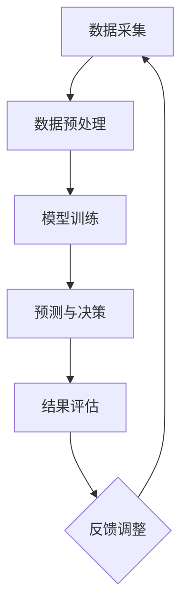

                 

# 基于大数据的电信诈骗行为分析研究

> **关键词：** 电信诈骗、大数据、行为分析、机器学习、数据挖掘、预测与防控

> **摘要：** 本文通过深入分析电信诈骗的现状、成因及危害，探讨了大数据技术在电信诈骗行为分析中的应用。文章首先介绍了电信诈骗的基本概念和特征，然后详细阐述了大数据的定义、特征及其在电信诈骗分析中的应用。接着，本文重点讲解了机器学习算法和数据挖掘技术在电信诈骗识别与防控中的核心原理和实践案例。最后，文章展望了电信诈骗行为分析领域的未来发展趋势，并提出了相应的挑战和建议。

---

## 第一部分：电信诈骗行为分析基础

### 第1章：电信诈骗概述

#### 1.1 电信诈骗的定义与分类

电信诈骗是指犯罪分子利用电信工具，通过虚构事实、隐瞒真相等手段，骗取他人财物的行为。电信诈骗的形式多样，主要包括以下几种类型：

1. **虚假信息诈骗**：犯罪分子通过电话、短信或网络，向受害人发送虚假信息，如冒充政府机关、金融机构、公安部门等，诱骗受害人转账、汇款。
2. **冒充熟人诈骗**：犯罪分子冒充受害人的亲友或同事，以紧急情况为由，诱骗受害人提供资金或信息。
3. **钓鱼网站诈骗**：犯罪分子搭建假冒的官方网站，通过诱导受害人输入个人信息或账户密码，从而盗取资金。
4. **虚假投资、赌博诈骗**：犯罪分子通过虚假的投资项目、赌博平台，诱骗受害人投资或参与赌博，从而骗取资金。

#### 1.2 电信诈骗的危害与影响

电信诈骗对社会和个人造成了严重的危害和影响：

1. **经济损失**：电信诈骗直接导致受害人的资金损失，给家庭和社会带来经济损失。
2. **社会信任危机**：电信诈骗事件频发，加剧了社会信任危机，损害了社会的和谐稳定。
3. **心理影响**：电信诈骗给受害人带来巨大的心理压力和恐慌，甚至导致心理疾病。
4. **信息安全**：电信诈骗过程中，犯罪分子可能获取受害人的个人信息，对信息安全构成威胁。

#### 1.3 电信诈骗的成因分析

电信诈骗的成因复杂，主要包括以下几点：

1. **信息泄露**：个人信息泄露是电信诈骗的主要源头，犯罪分子通过非法渠道获取个人信息，进行精准诈骗。
2. **社会信任危机**：社会信任危机导致人们容易受到虚假信息的诱惑，犯罪分子更容易实施诈骗行为。
3. **法律监管不足**：我国对电信诈骗的监管力度有待加强，法律制度的不完善为犯罪分子提供了可乘之机。
4. **技术手段先进**：犯罪分子利用先进的通信技术、网络技术等手段，使得电信诈骗更加隐蔽、高效。

### 第2章：大数据与电信诈骗行为分析

#### 2.1 大数据的定义与特征

大数据（Big Data）是指无法用常规软件工具在合理时间内捕捉、管理和处理的数据集。大数据具有以下5V特征：

1. **Volume（体积）**：数据量大，超出了传统数据处理系统的处理能力。
2. **Velocity（速度）**：数据生成和传播速度快，需要实时处理和分析。
3. **Variety（多样性）**：数据来源多样，包括结构化数据、半结构化数据和非结构化数据。
4. **Veracity（真实性）**：数据真实性和准确性难以保证，需要清洗和验证。
5. **Value（价值）**：数据中蕴含着巨大的商业价值和洞察力，但价值密度低，需要深入挖掘。

#### 2.2 大数据在电信诈骗分析中的应用

大数据技术在电信诈骗分析中发挥着重要作用，主要应用包括以下几个方面：

1. **数据采集与预处理**：通过爬虫、API接口等技术手段，收集电信诈骗相关的数据，并进行清洗、去重、格式化等预处理操作。
2. **数据挖掘与可视化**：利用数据挖掘算法，对电信诈骗相关数据进行挖掘和分析，生成可视化报告，帮助决策者了解电信诈骗的规律和趋势。
3. **实时监控与分析**：通过实时数据采集和分析，对电信诈骗事件进行实时监控和预警，及时发现和处置潜在风险。
4. **机器学习与预测**：利用机器学习算法，对电信诈骗行为进行预测和识别，提高识别准确率和效率。

#### 2.3 大数据技术在电信诈骗识别与防控中的应用

大数据技术在电信诈骗识别与防控中具有显著优势，具体应用包括：

1. **机器学习算法在电信诈骗识别中的应用**：通过训练模型，识别诈骗电话、短信和网络行为，提高识别准确率和实时性。
2. **数据挖掘技术在电信诈骗防控中的应用**：利用关联规则挖掘、聚类分析等数据挖掘技术，发现潜在的诈骗行为和诈骗团伙，为防控提供决策依据。

### 第3章：电信诈骗行为分析的核心概念与联系

#### 3.1 电信诈骗行为分析的概念解析

电信诈骗行为分析是指通过数据采集、预处理、挖掘和分析等技术手段，对电信诈骗行为进行识别、预警和防控的过程。核心概念包括：

1. **数据采集**：通过多种渠道收集电信诈骗相关的数据，如电话记录、短信内容、网络行为等。
2. **数据预处理**：对采集到的数据进行分析、清洗、去重、格式化等预处理操作，为后续分析提供高质量的数据基础。
3. **行为识别**：利用机器学习、数据挖掘等技术，识别电信诈骗行为，提高识别准确率和效率。
4. **预警与防控**：根据识别结果，及时预警和防控电信诈骗行为，减少损失和风险。

#### 3.2 电信诈骗行为分析的架构

电信诈骗行为分析的架构主要包括以下模块：

1. **数据采集模块**：负责收集电信诈骗相关的数据，如电话记录、短信内容、网络行为等。
2. **数据预处理模块**：对采集到的数据进行清洗、去重、格式化等预处理操作，为后续分析提供高质量的数据基础。
3. **模型训练模块**：利用预处理后的数据，训练机器学习模型，提高电信诈骗行为的识别准确率和效率。
4. **预测与决策模块**：根据模型预测结果，实时监控电信诈骗行为，及时预警和防控。

#### 3.3 Mermaid 流程图展示电信诈骗行为分析的流程



## 第二部分：电信诈骗行为分析核心算法原理讲解

### 第4章：机器学习算法在电信诈骗识别中的应用

#### 4.1 机器学习算法概述

机器学习（Machine Learning）是人工智能（AI）的一个重要分支，通过算法从数据中学习规律，进行预测和决策。机器学习的主要任务包括：

1. **分类**：将数据划分为不同的类别，如电信诈骗和非电信诈骗。
2. **回归**：预测一个连续的数值输出，如预测电信诈骗金额。
3. **聚类**：将数据划分为不同的簇，以发现数据中的模式。
4. **降维**：将高维数据映射到低维空间，减少数据复杂性。

#### 4.2 特征工程

特征工程（Feature Engineering）是机器学习中的一个重要环节，通过选择和构造特征，提高模型性能。特征工程主要包括以下步骤：

1. **特征提取**：从原始数据中提取有价值的信息，如文本特征、时间序列特征等。
2. **特征选择**：从大量特征中筛选出对目标变量有显著影响的特征，降低模型复杂度。

#### 4.3 常见的机器学习算法

在电信诈骗识别中，常用的机器学习算法包括以下几种：

1. **监督学习算法**：通过已标记的数据训练模型，然后对新数据进行预测。
   - **逻辑回归（Logistic Regression）**：用于分类问题，通过构建逻辑函数预测概率。
   - **支持向量机（Support Vector Machine，SVM）**：用于分类问题，通过寻找最佳分割超平面。
   - **决策树（Decision Tree）**：通过一系列规则进行分类，易于理解和解释。
   - **随机森林（Random Forest）**：通过构建多个决策树，进行集成学习，提高预测性能。
   - **K近邻（K-Nearest Neighbors，KNN）**：通过计算新数据与训练数据之间的距离，预测类别。

2. **无监督学习算法**：不依赖已标记的数据，用于探索数据中的隐藏结构。
   - **聚类算法（Clustering Algorithms）**：将数据划分为不同的簇，如K-means算法。
   - **降维算法（Dimensionality Reduction Algorithms）**：将高维数据映射到低维空间，如PCA（Principal Component Analysis）。

3. **半监督学习和迁移学习**：结合已标记和未标记数据，或在不同任务间共享知识。

#### 4.4 伪代码展示：逻辑回归算法在电信诈骗识别中的应用

```python
# 逻辑回归算法伪代码
def logistic_regression(X, y):
    # 初始化模型参数
    theta = initialize_params(X.shape[1])
    
    # 设置迭代次数和步长
    num_iterations = 1000
    learning_rate = 0.01
    
    # 梯度下降迭代
    for i in range(num_iterations):
        # 计算预测概率
        h = sigmoid(np.dot(X, theta))
        
        # 计算损失函数
        loss = -1/m * (y.T * np.log(h) + (1-y).T * np.log(1-h))
        
        # 计算梯度
        gradient = (1/m) * (X.T.dot(h - y))
        
        # 更新模型参数
        theta = theta - learning_rate * gradient
        
    return theta

# sigmoid函数
def sigmoid(z):
    return 1 / (1 + np.exp(-z))
```

### 第5章：数据挖掘技术在电信诈骗防控中的应用

#### 5.1 数据挖掘的基本概念

数据挖掘（Data Mining）是从大量数据中提取有价值信息的过程，主要任务包括：

1. **分类**：将数据划分为不同的类别，如电信诈骗和非电信诈骗。
2. **聚类**：将数据划分为不同的簇，以发现数据中的模式。
3. **关联规则挖掘**：发现数据之间的关联关系，如购买商品之间的关联。
4. **异常检测**：识别数据中的异常行为，如电信诈骗。

#### 5.2 关联规则挖掘

关联规则挖掘（Association Rule Mining）是数据挖掘中的一个重要分支，旨在发现数据之间的关联关系。基本概念包括：

1. **支持度（Support）**：表示一个关联规则在数据中出现的频率，计算公式为：支持度 = 出现次数 / 总次数。
2. **置信度（Confidence）**：表示一个关联规则成立的概率，计算公式为：置信度 = 支持度 / 前件支持度。
3. ** Lift 值**：表示一个关联规则的有效性，Lift 值越大，关联规则越显著。

#### 5.3 聚类分析

聚类分析（Clustering Analysis）是一种无监督学习方法，用于将数据划分为不同的簇。常用的聚类算法包括：

1. **K-means 算法**：基于距离最近原则，将数据划分为 K 个簇。
2. **层次聚类算法**：通过不断合并或分裂簇，构建聚类层次树。
3. **密度聚类算法**：基于数据点的密度，识别出潜在的簇。

#### 5.4 社区发现

社区发现（Community Detection）是一种用于发现网络中紧密联系的群组的算法。常用的算法包括：

1. **Louvain 算法**：基于网络结构，通过计算网络模块度，识别出潜在的社区。
2. **Girvan-Newman 算法**：通过不断计算网络中边的重要度，找到网络中的关键连接。

#### 5.5 伪代码展示：K-means 算法在电信诈骗防控中的应用

```python
# K-means 算法伪代码
def k_means(data, k):
    # 初始化簇中心
    centroids = initialize_centroids(data, k)
    
    # 设置迭代次数
    num_iterations = 100
    
    for i in range(num_iterations):
        # 计算簇分配
        clusters = assign_clusters(data, centroids)
        
        # 更新簇中心
        centroids = update_centroids(data, clusters, k)
        
    return centroids, clusters
```

## 第三部分：电信诈骗行为分析项目实战

### 第6章：电信诈骗行为分析实战案例

#### 6.1 实战案例介绍

本案例选取了一个真实的电信诈骗案例，通过数据收集、预处理、模型训练、预测和评估等环节，展示了电信诈骗行为分析的全过程。

#### 6.2 数据收集与预处理

1. **数据来源**：从公开的电信诈骗案例库中获取数据，包括电话记录、短信内容、受害人信息等。
2. **数据预处理流程**：
   - 数据清洗：去除缺失值、重复值和异常值。
   - 特征提取：提取电话号码、短信关键词、时间特征等。
   - 数据归一化：对数值特征进行归一化处理，便于模型训练。

#### 6.3 模型训练与调优

1. **模型选择**：选择随机森林算法进行模型训练。
2. **模型参数调优**：通过交叉验证方法，调整模型参数，如树的数量、深度等。

#### 6.4 预测与评估

1. **预测结果展示**：利用训练好的模型，对新的数据进行预测，判断是否为电信诈骗。
2. **模型评估指标**：使用准确率、召回率、F1 值等指标评估模型性能。

#### 6.5 代码实现与解读

1. **代码结构**：
   - 数据收集与预处理模块
   - 模型训练与调优模块
   - 预测与评估模块
2. **关键代码解读**：
   - 数据收集与预处理：使用 Pandas 和 Numpy 库进行数据操作。
   - 模型训练与调优：使用 Scikit-learn 库进行模型训练和参数调优。
   - 预测与评估：使用 Scikit-learn 库进行预测和评估。

### 第7章：电信诈骗行为分析系统开发与部署

#### 7.1 系统架构设计

电信诈骗行为分析系统采用分层架构，包括数据采集层、数据处理层、分析层和展示层。

1. **数据采集层**：负责收集电信诈骗相关数据，如电话记录、短信内容等。
2. **数据处理层**：负责数据清洗、特征提取和预处理等操作。
3. **分析层**：负责模型训练、预测和评估等分析任务。
4. **展示层**：负责将分析结果以可视化形式展示给用户。

#### 7.2 开发环境搭建

1. **开发工具与软件选择**：Python、Jupyter Notebook、Scikit-learn、Pandas、Numpy 等。
2. **开发环境配置**：安装 Python 环境、相关库和工具。

#### 7.3 系统开发与实现

1. **数据采集模块**：使用爬虫和 API 接口等技术手段，收集电信诈骗相关数据。
2. **数据预处理模块**：使用 Pandas 和 Numpy 库，对数据进行清洗、特征提取和预处理等操作。
3. **模型训练模块**：使用 Scikit-learn 库，训练机器学习模型。
4. **预测与决策模块**：使用训练好的模型，对新的数据进行预测和决策。

#### 7.4 系统部署与维护

1. **系统部署流程**：使用 Docker 容器技术，将系统部署到服务器上。
2. **系统维护策略**：定期更新数据集、调整模型参数，确保系统稳定运行。

### 第8章：电信诈骗行为分析案例研究

#### 8.1 案例研究背景

本案例研究选取了一个典型的电信诈骗案例，通过对案例进行分析，探讨电信诈骗的成因、特征和防控策略。

#### 8.2 案例研究方法

1. **数据收集方法**：从公开的电信诈骗案例库中获取数据，包括电话记录、短信内容、受害人信息等。
2. **分析方法**：使用数据挖掘和机器学习算法，对电信诈骗案例进行分析，提取特征，建立模型。

#### 8.3 案例研究结果

1. **结果展示**：通过可视化工具，展示电信诈骗案例的特征、分布和关联关系。
2. **结果解读**：分析电信诈骗案例的成因、特征和防控策略，为实际应用提供参考。

#### 8.4 案例研究启示

1. **启示与建议**：提高公众的防骗意识，加强法律法规的制定和执行，完善电信诈骗行为分析系统。
2. **展望未来研究方向**：探索新的机器学习算法和数据分析方法，提高电信诈骗行为分析的性能和效果。

### 第9章：电信诈骗行为分析面临的挑战与未来发展趋势

#### 9.1 电信诈骗行为分析面临的挑战

1. **数据隐私保护**：在电信诈骗行为分析中，如何保护用户的隐私是一个重要的挑战。
2. **模型解释性**：电信诈骗行为分析模型往往复杂，如何解释模型预测结果是一个挑战。
3. **实时性需求**：电信诈骗行为分析需要实时响应，如何提高系统的实时性和效率是一个挑战。

#### 9.2 电信诈骗行为分析的未来发展趋势

1. **技术创新**：随着人工智能技术的发展，未来电信诈骗行为分析将更加智能化、自动化。
2. **应用场景拓展**：电信诈骗行为分析将应用于更广泛的领域，如金融、医疗、教育等。
3. **法律法规完善**：完善的法律法规将为电信诈骗行为分析提供有力的支持。

### 附录

#### 附录A：常用算法介绍与代码示例

1. **逻辑回归**
2. **支持向量机**
3. **决策树**
4. **随机森林**
5. **K近邻**
6. **聚类算法**
7. **关联规则挖掘**

#### 附录B：电信诈骗行为分析常用工具与资源

1. **开发工具**：Python、Jupyter Notebook、Scikit-learn、Pandas、Numpy 等。
2. **数据集**：公开的电信诈骗案例库、电话记录、短信内容等。
3. **论文引用**：相关学术论文和研究报告。

**Mermaid 流程图：电信诈骗行为分析流程**


---

**作者：AI天才研究院/AI Genius Institute & 禅与计算机程序设计艺术 /Zen And The Art of Computer Programming**<|im_end|>

