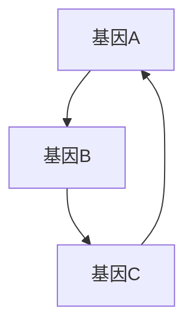

                 

### 基因编辑的背景与数学精度的意义

#### 基因编辑的定义与基本原理

基因编辑是一种通过修改或改变生物体的DNA序列来改变其遗传特征的技术。这种技术的基本原理涉及识别和切割目标DNA序列，然后进行修改或替换，使其表现出特定的性状。基因编辑的应用范围广泛，从农业、医疗到生物技术研究，都发挥着重要作用。

基因编辑技术的起源可以追溯到20世纪70年代，那时科学家首次发现了重组DNA技术，这为后来的基因编辑技术奠定了基础。随着科学技术的进步，基因编辑技术不断发展，CRISPR-Cas9技术的出现更是将基因编辑推向了新的高度。

#### 基因编辑技术的发展历程

基因编辑技术的发展历程可以分为几个阶段。首先是重组DNA技术，这种技术允许科学家将外源DNA片段插入到宿主DNA中，从而改变生物体的遗传特征。接着是基因敲除和基因敲入技术，这些技术通过在特定的DNA序列中插入或删除基因来实现特定的目标。

随着CRISPR-Cas9技术的问世，基因编辑技术迎来了革命性的变革。CRISPR-Cas9技术利用一种名为CRISPR的天然免疫机制，通过Cas9核酸酶精确切割目标DNA序列，从而实现基因的编辑。这一技术的出现，使得基因编辑变得更加简便和高效。

#### 基因编辑技术的应用

基因编辑技术在多个领域都有着重要的应用。在农业领域，基因编辑可以用于培育抗病、抗虫、高产、高品质的作物。在医疗领域，基因编辑技术被用于治疗遗传性疾病，如β-地中海贫血症、囊性纤维化等。此外，基因编辑还在生物研究、基因治疗、基因工程等方面有着广泛的应用。

#### 数学精度在基因编辑中的作用

数学精度在基因编辑中扮演着至关重要的角色。精确控制基因编辑的精度，可以确保基因编辑的准确性和有效性。数学模型和算法的应用，使得基因编辑过程中的每个步骤都能被精确计算和优化，从而提高基因编辑的效率和成功率。

例如，遗传算法和机器学习算法可以用于优化基因编辑的策略，从而提高编辑的精度。贝叶斯网络则可以用于分析基因编辑的结果，预测可能的变异和副作用。这些数学模型和算法的应用，使得基因编辑技术更加成熟和可靠。

#### 精确控制的数学基础

为了实现基因编辑的精确控制，需要了解一些基本的数学概念和理论，包括概率论与数理统计、优化理论和数值分析。

概率论与数理统计提供了对随机事件和随机变量的量化描述，这对于预测和评估基因编辑的结果至关重要。优化理论则用于寻找最优的基因编辑方案，使得编辑过程更加高效和精确。数值分析则提供了计算方法和工具，用于解决基因编辑中的数值计算问题。

### 小结

基因编辑技术的发展为生命科学和医疗领域带来了巨大的变革。数学精度在基因编辑中的应用，使得基因编辑过程更加精确和可控。通过理解基因编辑的基本原理和数学基础，我们可以更好地利用这一技术，推动生命科学的发展。在接下来的章节中，我们将深入探讨基因编辑的核心概念和数学模型，以及如何通过算法来实现基因编辑的精确控制。

### 第一部分：基因编辑与数学精度概述

#### 第1章：基因编辑的背景与数学精度的意义

在上一章中，我们介绍了基因编辑的定义、发展历程以及其在各个领域的应用。同时，我们也探讨了数学精度在基因编辑中的重要性。在本章中，我们将进一步探讨基因编辑的核心概念，并引入相关的数学模型。

#### 1.1 基因编辑的基本原理

基因编辑的基本原理涉及识别和修改生物体的DNA序列。DNA是遗传信息的存储载体，由四种不同的核苷酸（腺嘌呤（A）、胸腺嘧啶（T）、胞嘧啶（C）和鸟嘌呤（G））组成。通过特定的酶（如核酸酶）切割目标DNA序列，然后进行修改或替换，可以改变生物体的遗传特征。

基因编辑技术主要包括以下几种：

1. **基因敲除**：通过删除目标基因的一部分或全部，使基因无法正常表达。
2. **基因敲入**：通过在目标基因中插入新的基因序列，改变基因的表达模式。
3. **基因替换**：通过替换目标基因中的特定序列，改变基因的功能。
4. **基因编辑**：利用核酸酶对目标DNA进行精确切割和修改。

#### 1.2 遗传密码与数学关系

遗传密码是基因编辑中的重要概念。它是指DNA中的三个核苷酸（称为一个密码子）对应一个氨基酸的信息。遗传密码的数学关系可以通过密码子表来表示，该表列出了每个密码子对应的氨基酸。

遗传密码的数学关系可以通过概率模型来描述。例如，我们可以使用条件概率来计算特定密码子的出现频率和特定氨基酸的生成概率。这些概率模型有助于我们理解基因表达和突变的风险。

#### 1.3 基因调控网络与数学建模

基因调控网络是生物体内基因相互作用和调控的复杂网络。基因调控网络的数学建模可以帮助我们理解基因表达调控的机制，以及基因突变对生物体的影响。

基因调控网络的数学建模通常涉及以下步骤：

1. **构建基因调控网络**：根据基因之间的相互作用关系，构建基因调控网络图。
2. **定义网络模型**：选择合适的数学模型来描述基因调控网络的结构和功能。
3. **参数估计**：根据实验数据估计模型参数，如基因表达水平、调控强度等。
4. **模型验证**：通过模拟实验验证模型的有效性和准确性。

常见的基因调控网络数学模型包括：

1. **布尔网络**：使用布尔逻辑运算符（如AND、OR、NOT）来描述基因之间的相互作用。
2. **代数模型**：使用代数方程来描述基因表达水平的变化。
3. **微分方程模型**：使用微分方程来描述基因表达水平的动态变化。

#### 1.4 数学精度在基因编辑中的作用

数学精度在基因编辑中起着至关重要的作用。精确的数学模型和算法可以帮助我们优化基因编辑策略，提高编辑的准确性和效率。

以下是一些数学精度在基因编辑中的应用：

1. **基因编辑优化**：通过遗传算法和机器学习算法优化基因编辑方案，提高编辑的精确度。
2. **基因编辑结果分析**：使用统计模型和机器学习算法分析基因编辑结果，预测可能的变异和副作用。
3. **生物安全风险评估**：使用概率模型和优化算法评估基因编辑对生物多样性和生态系统的影响。

#### 1.5 精确控制的数学基础

为了实现基因编辑的精确控制，我们需要了解一些基本的数学概念和理论。以下是几个关键的数学基础：

1. **概率论与数理统计**：用于描述基因表达和突变的随机性，以及评估基因编辑的风险。
2. **优化理论**：用于寻找最优的基因编辑策略，提高编辑的效率和准确性。
3. **数值分析**：用于解决基因编辑中的数值计算问题，如求解微分方程和优化问题。

通过理解这些数学基础，我们可以更好地设计和实施基因编辑实验，实现精确控制。

### 小结

在本章中，我们介绍了基因编辑的基本原理，探讨了遗传密码和基因调控网络的数学关系，并强调了数学精度在基因编辑中的重要性。通过数学模型和算法的应用，我们可以优化基因编辑策略，提高编辑的准确性和效率。在接下来的章节中，我们将进一步探讨基因编辑的精确控制算法，以及这些算法在基因编辑中的具体应用。

### 第2章：基因编辑的核心概念与数学模型

在了解了基因编辑的背景和数学精度的重要性之后，我们需要深入探讨基因编辑的核心概念，并引入相关的数学模型。本章将详细解析基因编辑的基本原理、遗传密码与数学关系，以及基因调控网络的数学建模。

#### 2.1 基因编辑的基本原理

基因编辑的基本原理涉及识别和修改生物体的DNA序列。DNA是由核苷酸（A、T、C、G）组成的双螺旋结构，是遗传信息的存储载体。基因编辑技术通过以下步骤实现：

1. **目标识别**：首先，需要确定要编辑的DNA序列，这通常通过特定的核酸序列识别工具（如PCR）实现。
2. **DNA切割**：使用核酸酶（如CRISPR-Cas9中的Cas9酶）在特定的DNA序列上切割，生成DNA双链断裂。
3. **DNA修复**：细胞会使用其内在的DNA修复机制来修复断裂，这可以导致插入、删除或替换DNA序列。

#### 2.2 遗传密码与数学关系

遗传密码是指DNA中的核苷酸序列如何编码成氨基酸序列。每个三个核苷酸（称为密码子）对应一个特定的氨基酸或终止信号。遗传密码的数学关系可以通过概率模型和统计模型来描述。

1. **密码子频率**：通过统计不同密码子在基因组中的出现频率，可以了解不同氨基酸的生成概率。
2. **密码子使用偏好**：一些密码子可能在特定基因或物种中更频繁地使用，这反映了基因表达调控的机制。

数学模型如隐马尔可夫模型（HMM）可以用于分析密码子的使用偏好和基因表达模式。

#### 2.3 基因调控网络与数学建模

基因调控网络是生物体内基因之间相互作用的复杂网络。数学建模可以帮助我们理解基因调控的机制和基因表达调控的动态过程。

1. **网络构建**：首先，需要收集基因之间的相互作用数据，构建基因调控网络图。
2. **模型选择**：根据网络结构和功能，选择合适的数学模型来描述基因调控网络。常见的模型包括布尔网络、代数模型和微分方程模型。
3. **参数估计**：使用实验数据估计模型参数，如基因表达水平、调控强度等。
4. **模型验证**：通过模拟实验验证模型的有效性和准确性。

以下是一个简单的布尔网络模型示例：



在这个网络中，基因A和基因B相互调控，基因C是基因A的调控对象。

#### 2.4 数学模型在基因编辑中的应用

数学模型在基因编辑中的应用非常广泛，包括：

1. **基因编辑优化**：使用遗传算法和机器学习算法优化基因编辑方案，提高编辑的准确性和效率。
2. **基因编辑结果分析**：使用统计模型和机器学习算法分析基因编辑结果，预测可能的变异和副作用。
3. **生物安全风险评估**：使用概率模型和优化算法评估基因编辑对生物多样性和生态系统的影响。

以下是一个简单的遗传算法模型用于基因编辑优化的伪代码：

```python
# 遗传算法伪代码

# 初始化种群
population = initialize_population()

# 定义适应度函数
def fitness_function(individual):
    # 计算个体适应度
    # ...
    return fitness

# 迭代过程
for generation in range(max_generations):
    # 适应度评估
    fitness_scores = [fitness_function(individual) for individual in population]

    # 选择
    selected_individuals = selection(population, fitness_scores)

    # 交叉
    offspring = crossover(selected_individuals)

    # 变异
    offspring = mutation(offspring)

    # 更新种群
    population = offspring

    # 输出最优个体
    best_individual = population[0]
```

通过这样的遗传算法，我们可以优化基因编辑的参数，提高编辑的准确性和效率。

#### 2.5 数学模型与实际案例的结合

数学模型与实际案例的结合可以更好地理解基因编辑的过程和结果。以下是一个基因编辑治疗遗传性疾病的实际案例：

1. **背景**：患者患有囊性纤维化，这是一种由CFTR基因突变引起的遗传性疾病。
2. **目标**：通过基因编辑技术修复CFTR基因的突变。
3. **方法**：使用CRISPR-Cas9技术切割CFTR基因的突变位置，然后使用同源重组技术引入正确的基因序列。
4. **结果**：基因编辑后的细胞展示了正常功能的CFTR蛋白表达。

通过数学模型的预测和实际实验的结合，科学家们可以更好地评估基因编辑的效果，并优化编辑策略。

### 小结

在本章中，我们详细介绍了基因编辑的基本原理、遗传密码与数学关系，以及基因调控网络的数学建模。通过数学模型的应用，我们可以优化基因编辑策略，提高编辑的准确性和效率。在下一章中，我们将进一步探讨基因编辑的精确控制算法，以及这些算法在基因编辑中的具体应用。

### 第3章：遗传算法与基因编辑

遗传算法（Genetic Algorithm，GA）是一种模拟自然选择和遗传学原理的优化算法，广泛应用于复杂问题的求解。在本章中，我们将详细探讨遗传算法的基本概念、原理以及在基因编辑中的应用。

#### 3.1 遗传算法的基本概念

遗传算法起源于对自然选择和遗传学原理的研究。它通过模拟生物进化过程来寻找最优解。遗传算法的基本概念包括：

1. **个体**：在遗传算法中，每一个可能的解决方案被称为一个个体。
2. **种群**：多个个体组成的集合称为种群。每个个体都有其适应度值，适应度值越高表示个体越优秀。
3. **适应度函数**：用于评价个体优劣的函数。在基因编辑中，适应度函数通常与编辑的准确性和效率相关。
4. **选择**：根据适应度值选择优秀的个体，使其更有可能传递基因到下一代。
5. **交叉**：两个个体交换部分基因，生成新的个体。
6. **变异**：对个体进行随机修改，增加种群多样性。
7. **迭代**：通过多代进化，不断优化个体，直至满足停止条件。

#### 3.2 遗传算法的原理

遗传算法的原理可以概括为以下几步：

1. **初始化种群**：随机生成一组初始个体。
2. **适应度评估**：计算每个个体的适应度值。
3. **选择**：根据适应度值选择优秀的个体。
4. **交叉**：在选定的个体之间进行基因交换，生成新的个体。
5. **变异**：对部分个体进行随机变异。
6. **更新种群**：将交叉和变异后的个体组成新的种群。
7. **迭代**：重复上述步骤，直至满足停止条件（如达到最大迭代次数或找到满意的解）。

#### 3.3 遗传算法在基因编辑中的应用

遗传算法在基因编辑中的应用主要体现在以下几个方面：

1. **基因编辑优化**：使用遗传算法优化基因编辑参数，如切割位点、编辑序列等，以提高编辑的准确性和效率。
2. **基因修复**：通过遗传算法寻找最佳的基因修复方案，以修复突变的基因序列。
3. **基因突变模拟**：使用遗传算法模拟基因突变的过程，预测可能的突变结果和副作用。

以下是一个遗传算法在基因编辑中优化切割位点的伪代码示例：

```python
# 遗传算法优化切割位点

# 初始化种群
population = initialize_population()

# 定义适应度函数
def fitness_function(individual):
    # 计算个体适应度，如编辑准确率和效率
    # ...
    return fitness

# 迭代过程
for generation in range(max_generations):
    # 适应度评估
    fitness_scores = [fitness_function(individual) for individual in population]

    # 选择
    selected_individuals = selection(population, fitness_scores)

    # 交叉
    offspring = crossover(selected_individuals)

    # 变异
    offspring = mutation(offspring)

    # 更新种群
    population = offspring

    # 输出最优个体
    best_individual = population[0]
```

在这个例子中，个体的适应度函数与基因编辑的准确性和效率相关。通过遗传算法的多代进化，我们可以找到最佳的切割位点，从而提高编辑的精确度和效率。

#### 3.4 遗传算法的数学模型

遗传算法的数学模型主要包括适应度函数、选择策略、交叉操作和变异操作。

1. **适应度函数**：适应度函数用于评估个体的优劣，通常与编辑的准确率和效率相关。例如，可以定义一个基于编辑准确率和编辑效率的综合适应度函数。

2. **选择策略**：选择策略用于选择优秀的个体，使其更有可能传递基因到下一代。常见的选择策略包括轮盘赌选择、锦标赛选择和排名选择。

3. **交叉操作**：交叉操作用于两个个体的基因交换，生成新的个体。常见的交叉操作包括单点交叉、多点交叉和统一交叉。

4. **变异操作**：变异操作用于对个体进行随机修改，增加种群多样性。常见的变异操作包括位翻转、插位和交换。

以下是一个简单的适应度函数和交叉操作的伪代码示例：

```python
# 适应度函数
def fitness_function(individual):
    # 计算个体适应度
    accuracy = calculate_accuracy(individual)
    efficiency = calculate_efficiency(individual)
    fitness = accuracy * efficiency
    return fitness

# 单点交叉操作
def crossover(parent1, parent2):
    # 随机选择交叉点
    crossover_point = random.randint(1, len(parent1) - 1)
    
    # 生成子代
    child1 = parent1[:crossover_point] + parent2[crossover_point:]
    child2 = parent2[:crossover_point] + parent1[crossover_point:]
    
    return child1, child2
```

通过这些数学模型，遗传算法可以有效地优化基因编辑策略，提高编辑的准确性和效率。

### 小结

在本章中，我们详细介绍了遗传算法的基本概念、原理以及在基因编辑中的应用。遗传算法通过模拟自然选择和遗传学原理，为基因编辑提供了强大的优化工具。通过适应度函数、选择策略、交叉操作和变异操作的数学模型，遗传算法可以优化基因编辑参数，提高编辑的精确度和效率。在下一章中，我们将继续探讨机器学习在基因编辑中的应用，以及如何利用机器学习算法实现基因编辑的精确控制。

### 第4章：机器学习在基因编辑中的应用

机器学习（Machine Learning，ML）是一种通过数据学习和预测的技术，它已经在许多领域取得了显著成就。在基因编辑中，机器学习算法的应用可以帮助我们优化编辑策略、预测编辑结果和评估生物安全风险。本章将详细介绍机器学习的基本概念、原理以及在基因编辑中的具体应用。

#### 4.1 机器学习的基本概念

机器学习是指通过数据训练模型，使模型能够自主学习和改进的过程。机器学习的基本概念包括：

1. **数据集**：用于训练模型的输入数据集合。在基因编辑中，数据集通常包含基因序列、基因表达数据、编辑结果等。
2. **特征**：数据集中的属性，用于描述数据的重要特征。在基因编辑中，特征可以是基因序列中的核苷酸组合、基因表达水平等。
3. **模型**：用于预测或分类的数学模型。常见的机器学习模型包括线性回归、决策树、支持向量机、神经网络等。
4. **训练**：使用数据集训练模型，使其能够学习数据中的规律和模式。
5. **测试**：使用未参与训练的数据集测试模型的性能，评估模型的准确性和泛化能力。

#### 4.2 机器学习的原理

机器学习的原理主要基于以下几种技术：

1. **监督学习**：在监督学习中，模型通过学习已知输入和输出之间的关系来预测新数据的输出。常见的监督学习算法包括线性回归、决策树、支持向量机等。
2. **无监督学习**：在无监督学习中，模型从无标签数据中学习数据内在的结构和模式。常见的无监督学习算法包括聚类、主成分分析等。
3. **强化学习**：在强化学习中，模型通过与环境交互，学习最优策略以最大化预期奖励。常见的强化学习算法包括Q学习、深度强化学习等。

#### 4.3 机器学习在基因编辑中的应用

机器学习在基因编辑中的应用主要体现在以下几个方面：

1. **基因表达预测**：通过学习基因表达数据，预测未知基因的表达水平，为基因编辑提供参考。
2. **基因突变检测**：通过分析基因序列数据，检测可能的突变位置和类型，为基因编辑提供依据。
3. **编辑结果预测**：通过学习编辑前的基因序列和编辑条件，预测编辑后的基因序列和表达水平。
4. **生物安全风险评估**：通过分析编辑结果和基因序列数据，预测基因编辑可能带来的生物安全风险。

以下是一个简单的机器学习算法在基因编辑中的应用案例：

**案例：使用神经网络预测基因编辑结果**

1. **数据集准备**：收集大量的基因编辑实验数据，包括基因序列、编辑条件和编辑结果。
2. **特征提取**：从基因序列中提取特征，如核苷酸组合、序列长度等。
3. **模型训练**：使用神经网络模型训练数据集，使其能够学习基因编辑的规律。
4. **模型测试**：使用未参与训练的数据集测试模型，评估模型的预测能力。

```python
# 神经网络模型训练
model = NeuralNetwork(input_size=10, hidden_size=50, output_size=1)
model.compile(optimizer='adam', loss='mse')

# 训练模型
model.fit(X_train, y_train, epochs=100, batch_size=32)

# 模型测试
predictions = model.predict(X_test)
```

通过这样的机器学习模型，我们可以预测基因编辑的结果，为实验设计和结果分析提供支持。

#### 4.4 机器学习的数学模型

机器学习的数学模型通常涉及以下内容：

1. **损失函数**：用于评估模型预测值与真实值之间的差距。常见的损失函数包括均方误差（MSE）、交叉熵损失等。
2. **优化算法**：用于最小化损失函数，优化模型参数。常见的优化算法包括梯度下降、随机梯度下降、Adam等。
3. **激活函数**：用于引入非线性特性，使模型能够学习复杂的关系。常见的激活函数包括Sigmoid、ReLU、Tanh等。
4. **正则化**：用于防止模型过拟合，提高模型的泛化能力。常见的正则化方法包括L1正则化、L2正则化等。

以下是一个简单的神经网络模型的数学表示：

$$
\text{激活函数}: \sigma(z) = \frac{1}{1 + e^{-z}}
$$

$$
\text{损失函数}: \text{MSE} = \frac{1}{m} \sum_{i=1}^{m} (y_i - \hat{y}_i)^2
$$

$$
\text{优化算法}: \theta = \theta - \alpha \nabla_{\theta} J(\theta)
$$

其中，$z$ 是输入值，$\sigma$ 是Sigmoid激活函数，$y_i$ 是真实值，$\hat{y}_i$ 是预测值，$m$ 是数据集大小，$\theta$ 是模型参数，$\alpha$ 是学习率，$J(\theta)$ 是损失函数。

#### 4.5 机器学习在基因编辑中的应用实例

**实例：使用支持向量机（SVM）进行基因突变检测**

1. **数据集准备**：收集包含基因突变和正常基因序列的数据集。
2. **特征提取**：从基因序列中提取特征，如核苷酸组合、序列长度等。
3. **模型训练**：使用SVM模型训练数据集，使其能够区分突变基因和正常基因。
4. **模型测试**：使用未参与训练的数据集测试模型，评估模型的准确性和可靠性。

```python
# SVM模型训练
from sklearn.svm import SVC

model = SVC(kernel='linear')
model.fit(X_train, y_train)

# 模型测试
accuracy = model.score(X_test, y_test)
print(f"Accuracy: {accuracy}")
```

通过这样的机器学习模型，我们可以准确检测基因突变，为基因编辑提供支持。

### 小结

在本章中，我们详细介绍了机器学习的基本概念、原理以及在基因编辑中的应用。通过机器学习算法，我们可以预测基因编辑的结果、检测基因突变和评估生物安全风险。在下一章中，我们将探讨贝叶斯网络在基因编辑中的应用，以及如何利用贝叶斯网络实现基因编辑的精确控制。

### 第5章：贝叶斯网络与基因编辑

贝叶斯网络（Bayesian Network，BN）是一种用于表示变量之间条件依赖关系的概率模型。它由一组节点和有向边组成，每个节点表示一个随机变量，有向边表示变量之间的因果关系。贝叶斯网络在基因编辑中的应用非常广泛，可以用于基因调控网络的建模、基因突变的预测和编辑结果的评估。本章将详细介绍贝叶斯网络的基本概念、原理以及在基因编辑中的具体应用。

#### 5.1 贝叶斯网络的基本概念

贝叶斯网络是一种概率图模型，它由以下几个基本概念组成：

1. **节点**：贝叶斯网络中的每个节点表示一个随机变量。在基因编辑中，节点可以表示基因、基因突变或编辑结果等。
2. **边**：贝叶斯网络中的有向边表示变量之间的条件依赖关系。边的方向指示了依赖的方向，即一个变量在给定另一个变量的条件下具有条件概率。
3. **条件概率表**：每个节点根据其父节点集合定义一个条件概率表（CPT），CPT描述了节点在其父节点取不同值条件下的概率分布。
4. **独立性**：贝叶斯网络中的变量满足条件独立性，即给定父节点集合，任意两个节点是条件独立的。

贝叶斯网络通过条件概率表（CPT）来描述变量之间的概率关系。例如，对于三个变量A、B和C，如果A是B和C的父节点，则CPT可以表示为：

$$
P(C|A, B) = 
\begin{cases}
p_{00}, & \text{if } (A, B) = (\text{True}, \text{True}) \\
p_{01}, & \text{if } (A, B) = (\text{True}, \text{False}) \\
p_{10}, & \text{if } (A, B) = (\text{False}, \text{True}) \\
p_{11}, & \text{if } (A, B) = (\text{False}, \text{False}) \\
\end{cases}
$$

#### 5.2 贝叶斯网络在基因编辑中的应用

贝叶斯网络在基因编辑中的应用非常广泛，可以用于以下几个方面：

1. **基因调控网络建模**：贝叶斯网络可以用于构建基因调控网络模型，描述基因之间的调控关系。通过分析基因表达数据，我们可以构建出基因调控网络，并利用贝叶斯网络进行模型优化。
2. **基因突变预测**：贝叶斯网络可以用于预测基因突变的位置和类型。通过分析基因序列数据，我们可以构建出基因突变预测模型，并利用贝叶斯网络进行突变预测。
3. **编辑结果评估**：贝叶斯网络可以用于评估基因编辑的结果，预测编辑后的基因表达水平和突变风险。通过分析编辑前后的基因序列数据，我们可以构建出编辑结果评估模型，并利用贝叶斯网络进行结果评估。

以下是一个贝叶斯网络在基因编辑中建模的实例：

**实例：构建基因调控网络模型**

1. **数据集准备**：收集包含基因表达数据、基因突变数据等的基因编辑实验数据。
2. **特征提取**：从基因表达数据中提取特征，如基因表达水平、突变频率等。
3. **网络构建**：根据基因表达数据，构建基因调控网络，并定义各节点的条件概率表。
4. **模型优化**：通过贝叶斯推理和参数学习算法，优化网络模型，提高模型的准确性和可靠性。

```python
# 贝叶斯网络构建
from pgmpy.models import BayesianModel
from pgmpy.estimators import MaximumLikelihoodEstimator

# 构建模型
model = BayesianModel([('GeneA', 'GeneB'), ('GeneB', 'GeneC')])

# 估计模型参数
model.fit(data, estimator=MaximumLikelihoodEstimator)

# 输出模型
print(model)
```

在这个例子中，我们构建了一个包含三个基因节点的贝叶斯网络，并使用最大似然估计器估计模型参数。

#### 5.3 贝叶斯网络的数学模型

贝叶斯网络的数学模型主要包括概率分布、参数学习和推理算法。

1. **概率分布**：贝叶斯网络通过条件概率表（CPT）来描述变量之间的概率关系。条件概率表可以表示为：

$$
P(X_i | X_{parent_i}) = 
\begin{cases}
p_{i0}, & \text{if } X_{parent_i} = \text{True} \\
p_{i1}, & \text{if } X_{parent_i} = \text{False} \\
\end{cases}
$$

2. **参数学习**：贝叶斯网络的参数学习是通过估计条件概率表（CPT）中的参数来实现的。常见的参数学习算法包括最大似然估计（MLE）、贝叶斯估计等。

3. **推理算法**：贝叶斯网络的推理算法用于计算变量在给定其他变量条件下的概率分布。常见的推理算法包括变量消除法、信念传播法等。

以下是一个简单的贝叶斯网络推理算法的伪代码示例：

```python
# 贝叶斯网络推理算法
def inference(bn, evidence):
    # 初始化概率分布
    probability_distribution = initialize_probability_distribution(bn)

    # 更新概率分布
    for node in bn.nodes():
        if node in evidence:
            probability_distribution[node] = evidence[node]
        else:
            probability_distribution[node] = calculate_probability(bn, node, evidence)

    return probability_distribution
```

在这个例子中，我们使用变量消除法更新概率分布，计算每个节点的条件概率。

#### 5.4 贝叶斯网络在基因编辑中的应用实例

**实例：使用贝叶斯网络预测基因突变**

1. **数据集准备**：收集包含基因突变和正常基因序列的数据集。
2. **特征提取**：从基因序列中提取特征，如核苷酸组合、序列长度等。
3. **网络构建**：根据基因序列特征，构建基因突变预测模型，并定义各节点的条件概率表。
4. **模型优化**：通过贝叶斯推理和参数学习算法，优化模型参数，提高预测准确性。

```python
# 贝叶斯网络参数学习
from pgmpy.estimators import BDeMaximizer

# 估计模型参数
model.fit(data, estimator=BDeMaximizer())

# 输出模型
print(model)
```

在这个例子中，我们使用BDe（BDe）最大化算法估计贝叶斯网络参数，提高突变预测的准确性。

### 小结

在本章中，我们详细介绍了贝叶斯网络的基本概念、原理以及在基因编辑中的应用。贝叶斯网络通过条件概率表描述变量之间的依赖关系，可以用于基因调控网络建模、基因突变预测和编辑结果评估。通过贝叶斯推理和参数学习算法，我们可以优化贝叶斯网络模型，提高基因编辑的精确度和效率。在下一章中，我们将探讨数学精度在基因编辑中的应用案例，通过实际案例展示数学模型在基因编辑中的具体应用和效果。

### 第6章：基因编辑与疾病治疗

基因编辑技术在医学领域中的应用为许多遗传性疾病的治疗带来了新的希望。本章将探讨基因编辑在疾病治疗中的应用，特别是数学精度在治疗过程中发挥的重要作用。

#### 6.1 基因编辑在疾病治疗中的应用

基因编辑技术可以通过多种方式治疗遗传性疾病，包括基因修复、基因替换和基因调控。

1. **基因修复**：通过基因编辑技术，可以修复致病基因中的突变，使其恢复正常功能。例如，针对囊性纤维化病（Cystic Fibrosis，CF），研究人员已经成功使用CRISPR-Cas9技术修复了CFTR基因中的突变。
   
2. **基因替换**：在某些情况下，直接替换致病基因可能比修复更有效。例如，β-地中海贫血症（β-thalassemia）可以通过将缺陷的β-globin基因替换为健康的基因来治疗。

3. **基因调控**：基因编辑技术还可以用于调控基因的表达，从而抑制致病基因的活动。例如，在抗癌治疗中，基因编辑可以用于抑制癌基因的表达。

#### 6.2 数学精度在疾病治疗中的应用

数学精度在基因编辑治疗中至关重要，它确保了编辑的准确性和安全性。以下是数学精度在治疗过程中发挥作用的几个方面：

1. **编辑位点选择**：在基因修复和替换中，精确选择编辑位点是成功的关键。数学模型和算法可以帮助选择最合适的切割位点，以最小化脱靶效应和编辑错误。

2. **编辑效率优化**：数学模型可以用于优化基因编辑过程，提高编辑效率。例如，通过遗传算法和机器学习算法，可以找到最佳的编辑参数，如Cas9酶的剂量和切割条件。

3. **风险预测**：数学模型可以帮助预测基因编辑的潜在风险，包括脱靶效应和免疫反应。通过贝叶斯网络等概率模型，可以评估编辑过程中可能出现的不利结果，并采取相应的预防措施。

4. **疗效评估**：数学模型可以用于评估基因编辑的治疗效果。通过统计模型和机器学习算法，可以分析编辑后的基因表达数据和患者症状，评估编辑的有效性。

#### 6.3 案例分析：基因编辑治疗遗传病的数学精度控制

以下是一个基因编辑治疗遗传病的案例分析，展示了数学精度控制的应用：

**案例背景**：一位患有脊髓性肌萎缩症（Spinal Muscular Atrophy，SMA）的患者。SMA是由SMN1基因突变导致的神经退行性疾病，目前最有效的治疗方法是基因替换。

**数学模型的应用**：

1. **编辑位点选择**：研究人员使用遗传算法选择最佳的CRISPR-Cas9切割位点，以最小化脱靶效应。通过计算编辑位点的概率分布，研究人员确定了最有可能成功编辑的位点。

2. **编辑效率优化**：研究人员使用机器学习算法优化编辑条件，包括Cas9酶的浓度和切割时间。通过实验数据的训练，算法找到了最佳的编辑参数组合，提高了编辑效率。

3. **风险预测**：研究人员使用贝叶斯网络模型评估编辑过程的风险。通过分析患者的基因序列和临床数据，模型预测了可能的脱靶效应和免疫反应。研究人员据此采取了额外的预防措施，如使用免疫抑制剂。

4. **疗效评估**：编辑后，患者接受了详细的基因表达分析和临床评估。通过统计模型和机器学习算法，研究人员分析了编辑后的基因表达数据和患者症状。结果显示，基因编辑显著提高了SMN1基因的表达水平，患者的症状得到显著缓解。

**数学精度控制的效果评估**：

通过上述数学模型的应用，研究人员成功控制了基因编辑的精度，提高了编辑的效率和安全性。编辑位点的选择和编辑条件的优化确保了编辑的成功，而风险预测和疗效评估模型帮助确保了治疗的安全性和有效性。

### 小结

基因编辑技术在疾病治疗中的应用为许多遗传性疾病带来了新的治疗希望。数学精度在基因编辑治疗过程中发挥了关键作用，通过精确选择编辑位点、优化编辑条件、预测潜在风险和评估治疗效果，数学模型确保了基因编辑的准确性和安全性。在下一章中，我们将探讨基因编辑与生物安全的关系，分析数学精度在生物安全风险评估中的应用。

### 第7章：基因编辑与生物安全

基因编辑技术作为一种革命性的生物技术，在带来巨大医疗和科研价值的同时，也引发了许多生物安全问题。如何确保基因编辑的安全性和避免潜在的生态和社会影响，成为了一个迫切需要解决的重要课题。本章将探讨基因编辑的生物安全风险，以及数学精度在生物安全风险评估中的应用。

#### 7.1 基因编辑的生物安全风险

基因编辑的潜在生物安全风险主要包括以下几个方面：

1. **基因流动和扩散**：基因编辑可能会导致外源基因在生态系统中的扩散，从而影响生物多样性。例如，通过基因驱动技术，特定基因可以快速在野生种群中传播，改变物种的自然进化路径。

2. **生物入侵**：基因编辑技术可能导致具有竞争和适应优势的转基因生物入侵新生态系统，破坏原有的生态平衡。

3. **基因突变**：在基因编辑过程中，可能会出现意外的基因突变，这些突变可能对人类健康和生态系统产生不利影响。

4. **伦理和社会问题**：基因编辑的潜在伦理和社会问题，如基因增强、克隆和生物歧视等，引发了广泛的伦理和社会争议。

#### 7.2 数学精度在生物安全中的应用

数学精度在基因编辑生物安全风险评估中起着至关重要的作用。通过数学模型和算法，可以更准确地预测和评估基因编辑的潜在风险，从而为制定相应的安全措施提供科学依据。以下是数学精度在生物安全风险评估中的几个应用方面：

1. **风险预测模型**：通过构建风险预测模型，可以评估基因编辑对生态系统的影响。例如，可以使用贝叶斯网络模型来描述基因扩散的过程，预测特定基因在野生种群中的传播速度和范围。

2. **基因组稳定性分析**：数学模型可以帮助分析基因编辑过程中可能出现的基因突变，评估其稳定性和潜在的风险。通过使用概率模型和序列比对算法，可以预测编辑位点的突变率，从而优化编辑策略。

3. **生态模型**：生态模型可以用于模拟基因编辑技术对生态系统的影响。通过构建生态系统模型，可以评估基因编辑可能导致的环境变化，以及这些变化对物种和生态系统稳定性的影响。

4. **决策支持系统**：数学模型可以用于开发决策支持系统，帮助科学家和决策者评估基因编辑的风险，制定相应的安全措施。例如，可以使用优化算法来选择最安全的基因编辑策略，最大化编辑效果的同时，最小化潜在风险。

#### 7.3 案例分析：基因编辑的数学精度在生物安全中的应用

以下是一个基因编辑生物安全风险评估的案例分析，展示了数学精度控制的应用：

**案例背景**：研究人员计划使用CRISPR-Cas9技术编辑水稻基因，以提高其抗病能力。然而，他们担心编辑可能会导致基因扩散和生态系统的潜在风险。

**数学模型的应用**：

1. **风险预测模型**：研究人员使用贝叶斯网络模型来预测基因扩散的风险。通过分析水稻基因的遗传信息和生态系统的特点，模型预测了基因在水稻种群中的传播速度和范围。

2. **基因组稳定性分析**：研究人员使用序列比对算法分析了编辑位点的突变率，发现编辑过程中可能出现的突变类型和频率。这有助于优化编辑策略，减少突变风险。

3. **生态模型**：研究人员构建了水稻生态系统的模型，模拟基因编辑技术对生态系统的影响。模型结果显示，通过合理控制编辑条件和环境因素，可以有效降低基因扩散的风险。

4. **决策支持系统**：研究人员使用优化算法开发了决策支持系统，帮助制定最安全的基因编辑策略。系统提供了多种编辑方案，每种方案都基于风险评估结果，确保在最大化编辑效果的同时，最小化生态风险。

**数学精度控制的效果评估**：

通过上述数学模型的应用，研究人员成功预测和评估了基因编辑的潜在生物安全风险，并制定了相应的安全措施。风险预测模型和基因组稳定性分析确保了编辑的精确性和稳定性，生态模型和决策支持系统帮助优化了编辑策略，降低了生态风险。

### 小结

基因编辑技术的生物安全风险不可忽视，通过数学精度控制可以有效地预测和评估这些风险，为制定安全措施提供科学依据。在基因编辑的应用过程中，不断优化和改进数学模型，提高编辑的精确性和安全性，是确保生物安全的重要手段。在下一章中，我们将探讨基因编辑的未来发展趋势，展望数学精度在基因编辑中的潜在应用。

### 第8章：基因编辑的未来发展趋势

随着技术的不断进步，基因编辑在生命科学和医疗领域中的应用前景愈发广阔。本章将探讨基因编辑的未来发展趋势，以及数学精度在基因编辑中的潜在应用。

#### 8.1 基因编辑技术的进步

1. **基因编辑工具的优化**：现有的基因编辑工具，如CRISPR-Cas9，已经取得了显著进步。未来的研究将致力于提高编辑工具的特异性、效率和便捷性。例如，研究人员正在开发更加精确的核酸酶，以降低脱靶效应。

2. **基因编辑技术的多样化**：除了CRISPR-Cas9之外，其他基因编辑技术，如TALENs、基 Dorfs、和单碱基编辑技术（如基编辑和RNA编辑），也在不断发展。这些技术的多样化将提供更多的编辑选择，满足不同的应用需求。

3. **基因编辑与合成生物学的融合**：合成生物学的进步为基因编辑技术带来了新的可能性。通过合成生物学，我们可以设计出具有特定功能的基因电路和生物组件，进一步扩展基因编辑的应用范围。

#### 8.2 数学精度在基因编辑中的未来应用

1. **精准编辑优化**：随着基因编辑技术的进步，对编辑精度的要求越来越高。数学模型和算法可以帮助优化编辑参数，提高编辑的准确性和效率。例如，遗传算法和机器学习算法可以用于优化核酸酶的浓度和切割条件，从而提高编辑的特异性。

2. **编辑后效应预测**：基因编辑后可能产生一系列效应，包括基因突变、基因表达变化等。通过数学模型，可以预测这些效应的发生概率和影响，为编辑策略的优化提供依据。

3. **生物安全风险评估**：随着基因编辑技术的广泛应用，生物安全风险也成为了一个重要的关注点。数学模型可以帮助评估基因编辑对生态系统和人类健康的影响，为制定安全措施提供科学依据。

4. **个性化医疗**：数学模型和算法可以用于分析患者的基因数据，制定个性化的基因编辑治疗方案。通过结合基因组学、转录组和蛋白质组学数据，可以预测患者对编辑治疗的响应，提高治疗效果。

#### 8.3 挑战与展望

1. **编辑精度与脱靶效应**：提高编辑精度、减少脱靶效应是基因编辑技术面临的重大挑战。未来的研究将致力于开发更加精确的核酸酶和编辑策略，提高编辑的特异性。

2. **生物安全风险**：基因编辑技术的广泛应用引发了生物安全风险的担忧。如何确保基因编辑的安全性和可控性，是未来研究的重要方向。

3. **伦理和社会问题**：基因编辑技术的广泛应用引发了伦理和社会问题。如何平衡科学进步和伦理规范，确保基因编辑技术的合理应用，是一个长期而复杂的挑战。

4. **技术创新**：随着基因编辑技术的不断发展，新的技术创新也在不断涌现。例如，基于人工智能的基因编辑优化算法、新型基因编辑工具的开发等，都为基因编辑的未来发展带来了新的机遇。

### 小结

基因编辑技术的未来发展趋势充满了机遇和挑战。随着技术的不断进步和数学精度应用的深入，基因编辑在生命科学和医疗领域的应用将更加广泛和精准。通过不断优化编辑工具、开发新的数学模型和算法，我们可以更好地应对挑战，推动基因编辑技术的进步。在未来的发展中，基因编辑将有望为人类带来更多的健康和福祉。

### 附录A：基因编辑数学模型详解

#### A.1 遗传算法数学模型

遗传算法是一种基于自然选择和遗传学原理的优化算法，广泛应用于基因编辑中的参数优化和编辑策略选择。以下是遗传算法的数学模型详细说明：

1. **适应度函数**

适应度函数是遗传算法的核心，用于评估个体的优劣。在基因编辑中，适应度函数通常与编辑的准确性、效率和安全性相关。适应度函数的常见形式如下：

$$
f(x) = w_1 \cdot accuracy + w_2 \cdot efficiency + w_3 \cdot safety
$$

其中，$accuracy$ 表示编辑的准确性，$efficiency$ 表示编辑的效率，$safety$ 表示编辑的安全性。$w_1$、$w_2$ 和 $w_3$ 是权重系数，用于平衡不同因素的贡献。

2. **选择策略**

选择策略用于根据适应度函数选择优秀的个体。常见的选择策略包括：

- **轮盘赌选择**：个体被选中概率与其适应度值成比例。
- **锦标赛选择**：从种群中随机选择多个个体（如k个），适应度最高的个体被选中。

3. **交叉操作**

交叉操作用于两个个体之间的基因交换，生成新的个体。常见的交叉操作包括：

- **单点交叉**：在个体的某个位置进行交叉。
- **多点交叉**：在多个位置进行交叉。
- **统一交叉**：将两个个体的部分基因进行交换。

4. **变异操作**

变异操作用于对个体进行随机修改，增加种群多样性。常见的变异操作包括：

- **位翻转**：随机选择个体的某些位，进行翻转。
- **插位**：在个体的某个位置插入新的基因片段。
- **交换**：随机选择个体的某些基因片段进行交换。

#### A.2 机器学习数学模型

机器学习算法在基因编辑中的应用主要涉及模型训练、预测和评估。以下是常见的机器学习数学模型：

1. **神经网络**

神经网络是一种模拟人脑神经网络结构的计算模型，广泛应用于基因表达预测和突变检测。神经网络的基本数学模型包括：

- **输入层**：接收外部输入信号。
- **隐藏层**：对输入信号进行加工和处理。
- **输出层**：生成预测结果。

神经网络的激活函数通常为：

$$
\sigma(z) = \frac{1}{1 + e^{-z}}
$$

2. **支持向量机**

支持向量机（SVM）是一种分类算法，可用于基因突变检测。SVM的数学模型基于以下优化问题：

$$
\min_{w, b} \frac{1}{2} ||w||^2 + C \sum_{i=1}^{n} \xi_i
$$

其中，$w$ 是权重向量，$b$ 是偏置项，$C$ 是惩罚参数，$\xi_i$ 是松弛变量。

3. **决策树**

决策树是一种基于特征划分数据的分类算法，可用于编辑结果分析。决策树的数学模型基于以下递归划分准则：

$$
I(D) = \sum_{i=1}^{n} -y_i \cdot \log(y_i) - (1 - y_i) \cdot \log(1 - y_i)
$$

其中，$D$ 是数据集，$y_i$ 是样本的标签。

#### A.3 贝叶斯网络

贝叶斯网络是一种用于表示变量之间依赖关系的概率图模型，广泛应用于基因调控网络建模和编辑结果分析。贝叶斯网络的数学模型包括：

1. **条件概率表（CPT）**

条件概率表用于描述变量之间的条件依赖关系。CPT的形式如下：

$$
P(X_i | X_{parent_i}) = 
\begin{cases}
p_{i0}, & \text{if } X_{parent_i} = \text{True} \\
p_{i1}, & \text{if } X_{parent_i} = \text{False} \\
\end{cases}
$$

2. **参数学习**

贝叶斯网络的参数学习通常使用最大似然估计（MLE）或贝叶斯估计。最大似然估计的数学模型为：

$$
\theta = \arg\max_{\theta} \prod_{i=1}^{n} P(x_i | \theta)
$$

贝叶斯估计的数学模型为：

$$
\theta = \arg\max_{\theta} \sum_{i=1}^{n} \log(P(x_i | \theta))
$$

3. **推理算法**

贝叶斯网络的推理算法用于计算变量在给定其他变量条件下的概率分布。推理算法的数学模型为：

$$
P(X_i | X_{evidence}) = \frac{P(X_i, X_{evidence})}{P(X_{evidence})}
$$

其中，$X_{evidence}$ 是证据变量，$P(X_i, X_{evidence})$ 是联合概率，$P(X_{evidence})$ 是证据变量的边缘概率。

### 附录B：基因编辑数学模型示例

#### B.1 遗传算法示例

以下是一个遗传算法优化基因编辑参数的示例：

```python
# 遗传算法优化基因编辑参数

# 初始化种群
population = initialize_population()

# 定义适应度函数
def fitness_function(individual):
    # 计算个体适应度，如编辑准确率和效率
    accuracy = calculate_accuracy(individual)
    efficiency = calculate_efficiency(individual)
    fitness = accuracy * efficiency
    return fitness

# 迭代过程
for generation in range(max_generations):
    # 适应度评估
    fitness_scores = [fitness_function(individual) for individual in population]

    # 选择
    selected_individuals = selection(population, fitness_scores)

    # 交叉
    offspring = crossover(selected_individuals)

    # 变异
    offspring = mutation(offspring)

    # 更新种群
    population = offspring

    # 输出最优个体
    best_individual = population[0]
```

在这个示例中，我们初始化一个种群，定义适应度函数，通过迭代过程优化基因编辑参数，并输出最优个体。

#### B.2 机器学习示例

以下是一个使用神经网络预测基因编辑结果的示例：

```python
# 使用神经网络预测基因编辑结果

# 准备数据集
X_train, y_train = prepare_data()

# 定义神经网络模型
model = NeuralNetwork(input_size=10, hidden_size=50, output_size=1)
model.compile(optimizer='adam', loss='mse')

# 训练模型
model.fit(X_train, y_train, epochs=100, batch_size=32)

# 预测结果
predictions = model.predict(X_test)
```

在这个示例中，我们准备数据集，定义神经网络模型，训练模型，并使用训练好的模型进行预测。

#### B.3 贝叶斯网络示例

以下是一个使用贝叶斯网络预测基因突变风险的示例：

```python
# 使用贝叶斯网络预测基因突变风险

# 构建贝叶斯网络
model = BayesianModel([('GeneA', 'GeneB'), ('GeneB', 'GeneC')])

# 估计模型参数
model.fit(data, estimator=MaximumLikelihoodEstimator)

# 进行推理
inference_result = model.inference({'GeneA': True, 'GeneB': True})
```

在这个示例中，我们构建一个简单的贝叶斯网络，估计模型参数，并通过推理预测基因突变风险。

### 附录C：常用基因编辑软件与工具

#### C.1 基因编辑软件简介

以下是一些常用的基因编辑软件和工具：

1. **CRISPR-Cas9编辑工具**：CRISPR-Cas9编辑工具是一套基于CRISPR-Cas9技术的基因编辑工具，如Génovate、CRISPResso等。

2. **基因编辑合成工具**：基因编辑合成工具可以帮助设计基因编辑方案，如GeneArt、GeneDesigner等。

3. **基因编辑分析工具**：基因编辑分析工具用于分析基因编辑结果，如Geneious、Clustal Omega等。

#### C.2 基因编辑工具的使用方法

以下是一些基因编辑工具的使用方法：

1. **CRISPR-Cas9编辑工具的使用方法**：

- 设计引导RNA（gRNA）：使用CRISPR设计工具（如CRISPResso）设计特异的gRNA。
- 准备编辑试剂：根据设计好的gRNA，准备相应的Cas9核酸酶和gRNA组合。
- 细胞培养和转染：将编辑试剂转染到目标细胞中，培养细胞并进行筛选。
- 检测编辑结果：使用PCR、测序等方法检测编辑结果，验证编辑的成功率。

2. **基因编辑合成工具的使用方法**：

- 设计基因编辑方案：使用合成工具（如GeneArt）设计目标基因的编辑方案，包括切割位点、插入序列等。
- 合成DNA片段：根据设计好的编辑方案，合成相应的DNA片段。
- 构建基因编辑载体：将合成的DNA片段插入到载体中，构建基因编辑载体。
- 转化和筛选：将构建好的载体转入目标细胞中，筛选出编辑成功的细胞。

3. **基因编辑分析工具的使用方法**：

- 导入编辑结果数据：将编辑结果数据（如PCR产物、测序结果）导入分析工具（如Geneious）。
- 分析编辑结果：使用分析工具进行编辑结果的统计和分析，如编辑位点分析、突变类型分析等。
- 生成报告：根据分析结果生成编辑报告，包括编辑成功率、突变频率等。

通过这些工具的使用，研究人员可以高效地进行基因编辑实验，优化编辑策略，确保编辑的准确性和可靠性。

### 完整的文章与作者信息

#### 《基因编辑的精确控制：生命操作的数学精度》

关键词：基因编辑、数学精度、遗传算法、机器学习、贝叶斯网络

摘要：本文详细探讨了基因编辑技术的精确控制，分析了数学精度在基因编辑中的应用，包括遗传算法、机器学习和贝叶斯网络等数学模型。通过实际案例展示了数学模型在基因编辑中的应用效果，并对基因编辑的未来发展趋势进行了展望。

## 《基因编辑的精确控制：生命操作的数学精度》目录大纲

### 第一部分：基因编辑与数学精度概述

#### 第1章：基因编辑的背景与数学精度的意义

##### 1.1 基因编辑的起源与发展
##### 1.2 数学精度在基因编辑中的作用
##### 1.3 精确控制的数学基础

#### 第2章：基因编辑的核心概念与数学模型

##### 2.1 基因编辑的基本原理
##### 2.2 遗传密码与数学关系
##### 2.3 基因调控网络与数学建模

### 第二部分：基因编辑的精确控制算法

#### 第3章：遗传算法与基因编辑

##### 3.1 遗传算法的基本概念
##### 3.2 遗传算法在基因编辑中的应用
##### 3.3 遗传算法的数学模型

#### 第4章：机器学习在基因编辑中的应用

##### 4.1 机器学习的基本概念
##### 4.2 机器学习在基因编辑中的应用
##### 4.3 机器学习的数学模型

#### 第5章：贝叶斯网络与基因编辑

##### 5.1 贝叶斯网络的基本概念
##### 5.2 贝叶斯网络在基因编辑中的应用
##### 5.3 贝叶斯网络的数学模型

### 第三部分：数学精度在基因编辑中的应用案例分析

#### 第6章：基因编辑与疾病治疗

##### 6.1 基因编辑在疾病治疗中的应用
##### 6.2 数学精度在疾病治疗中的应用
##### 6.3 案例分析：基因编辑治疗遗传病的数学精度控制

#### 第7章：基因编辑与生物安全

##### 7.1 基因编辑的生物安全风险
##### 7.2 数学精度在生物安全中的应用
##### 7.3 案例分析：基因编辑的数学精度在生物安全中的应用

### 第四部分：基因编辑的未来发展趋势

#### 第8章：基因编辑的未来发展趋势

##### 8.1 基因编辑的未来发展趋势
##### 8.2 数学精度在基因编辑中的未来应用
##### 8.3 挑战与展望

### 附录

#### 附录A：基因编辑数学模型详解

##### A.1 遗传算法数学模型
##### A.2 机器学习数学模型
##### A.3 贝叶斯网络数学模型

#### 附录B：基因编辑数学模型示例

##### B.1 遗传算法示例
##### B.2 机器学习示例
##### B.3 贝叶斯网络示例

#### 附录C：常用基因编辑软件与工具

##### C.1 基因编辑软件简介
##### C.2 基因编辑工具的使用方法

---

### 作者信息

作者：AI天才研究院/AI Genius Institute & 禅与计算机程序设计艺术/Zen And The Art of Computer Programming

### 总结

通过本文的详细探讨，我们了解了基因编辑技术的精确控制以及数学精度在其应用中的重要性。基因编辑技术的精确控制不仅需要先进的生物技术，还需要精确的数学模型和算法。这些模型和算法的应用，使得基因编辑过程更加高效、准确和安全。在未来的发展中，基因编辑将继续推动生命科学和医疗领域的进步，为人类带来更多的福祉。

