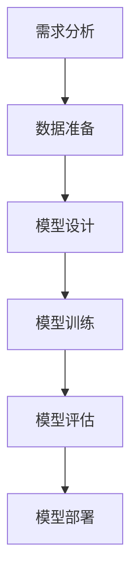
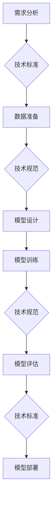
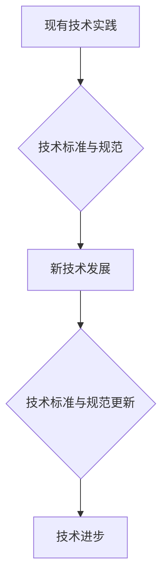
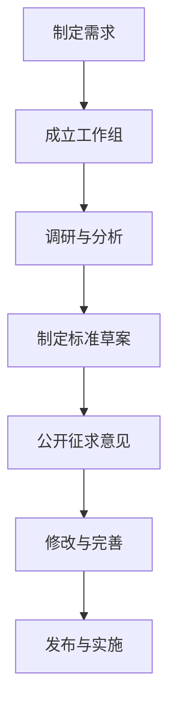
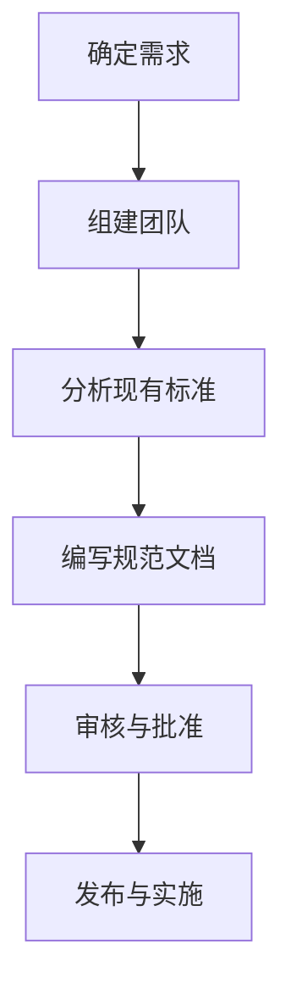
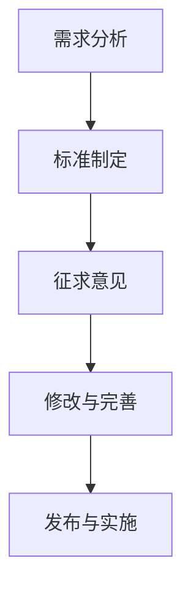
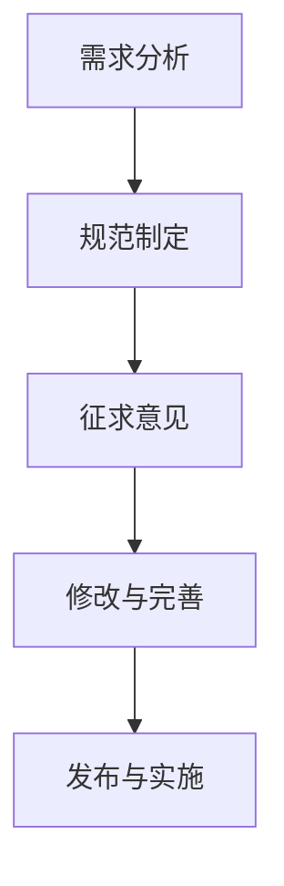

                 

## 基础模型的技术标准与规范

### 关键词

- 技术标准
- 技术规范
- 人工智能
- 模型构建
- 算法原理

### 摘要

本文将深入探讨基础模型的技术标准与规范，旨在为读者提供一个全面而深入的视角，理解技术标准与规范在人工智能模型构建中的重要性。文章首先介绍了技术标准与规范的基本概念，然后详细讲解了其核心算法原理，并通过实际项目案例展示了如何在实际中应用这些标准与规范。通过本文的阅读，读者将能够更好地理解技术标准与规范在推动人工智能技术发展中的作用。

## 第一部分：核心概念与联系

在探讨基础模型的技术标准与规范之前，我们需要明确一些核心概念。技术标准与规范是指导技术活动和实践的重要文件，它们在确保产品或系统的一致性、互操作性和可靠性方面起着至关重要的作用。

### 1.1.1 核心概念与联系概述

#### 模型构建的基本流程

在人工智能领域，模型构建是一个复杂且迭代的过程。基本流程可以概括为以下几个步骤：

1. **需求分析**：确定模型需要解决的具体问题，明确模型的目标和应用场景。
2. **数据准备**：收集、清洗和预处理数据，为模型训练提供高质量的输入。
3. **模型设计**：根据需求选择合适的模型架构，并进行超参数调优。
4. **模型训练**：使用训练数据对模型进行训练，优化模型参数。
5. **模型评估**：使用验证数据评估模型性能，确保模型达到预期效果。
6. **模型部署**：将训练好的模型部署到生产环境中，进行实际应用。

以下是一个简化的Mermaid流程图，展示了模型构建的基本流程：



#### 技术标准与规范的重要性

技术标准与规范在模型构建过程中扮演着至关重要的角色。它们确保了模型的一致性、可靠性和可扩展性，从而提高了整个系统的质量和性能。

- **一致性**：技术标准与规范规定了模型构建的基本流程和关键步骤，确保不同团队和项目之间的一致性，降低了沟通和协作的难度。
- **可靠性**：技术标准与规范通过定义明确的参数和指标，确保了模型训练和评估的可靠性，减少了错误和偏差。
- **可扩展性**：技术标准与规范为模型的扩展和升级提供了指导，使得系统能够适应未来的需求变化。

以下是一个简化的Mermaid流程图，展示了技术标准与规范在模型构建中的重要性：



### 1.1.2 技术标准与规范的重要性

技术标准与规范在人工智能领域的重要性不可忽视。它们不仅是保证模型质量的重要工具，也是推动技术进步的关键因素。

- **确保模型质量**：技术标准与规范规定了模型构建的流程、方法和参数，确保了模型的可靠性和准确性。通过遵循标准与规范，可以避免低质量模型的产生。
- **促进技术交流**：技术标准与规范为不同团队和项目提供了共同的基准，促进了技术交流和协作。这使得跨领域的合作变得更加容易和高效。
- **推动技术进步**：技术标准与规范不仅规范了现有的技术实践，还为新技术的引入和发展提供了指导。通过制定和更新标准与规范，可以推动人工智能技术的持续进步。

以下是一个简化的Mermaid流程图，展示了技术标准与规范在推动技术进步中的作用：



通过以上分析，我们可以看到技术标准与规范在人工智能模型构建和技术进步中的重要性。接下来，我们将进一步探讨技术标准和规范的具体算法原理，以及如何在实践中应用这些标准与规范。

## 第二部分：核心算法原理讲解

在了解了技术标准与规范的基本概念和重要性后，我们需要进一步深入探讨其核心算法原理。这部分内容将详细解释技术标准和规范的基本概念、定义、分类以及制定过程。通过这些算法原理的讲解，我们将为后续的实际应用打下坚实的基础。

### 2.1 技术标准算法原理

#### 2.1.1 技术标准的定义与分类

技术标准是一种规范性文件，它规定了技术活动或产品的规则、指南或特性。技术标准的目的是确保产品或系统能够在不同环境、条件下保持一致性和可靠性。

技术标准可以根据不同的分类方式进行分类，常见的分类方法包括：

1. **按层级分类**：
   - 国际标准（International Standard，ISO）
   - 国家标准（National Standard，GB）
   - 行业标准（Industry Standard，YY/T）
   - 地方标准（Local Standard）
   - 企业标准（Enterprise Standard）

2. **按内容分类**：
   - **基础标准**：涉及基础概念、术语、符号等。
   - **产品标准**：针对特定产品的技术要求、性能指标等。
   - **方法标准**：涉及测试方法、检测标准等。
   - **管理标准**：涉及质量管理、环境管理、安全管理等。

以下是一个Python函数，用于定义技术标准：

```python
def define_standard():
    # 定义技术标准
    standard = {
        '定义': "技术标准是一种规范性文件，规定了技术活动或产品的规则、指南或特性。",
        '分类': "技术标准可分为国际标准、国家标准、行业标准等。",
    }
    return standard

tech_standard = define_standard()
print(tech_standard)
```

输出：

```
{
    '定义': "技术标准是一种规范性文件，规定了技术活动或产品的规则、指南或特性。",
    '分类': "技术标准可分为国际标准、国家标准、行业标准等。"
}
```

#### 2.1.2 技术标准制定过程

技术标准的制定过程通常包括以下几个阶段：

1. **制定需求**：确定制定技术标准的必要性和目标。
2. **成立工作组**：组建具有相关领域知识和经验的专家团队。
3. **调研与分析**：收集相关文献、数据和案例，分析现有标准和技术的不足。
4. **制定标准草案**：编写标准草案，包括技术要求、测试方法等。
5. **公开征求意见**：将标准草案公开征求意见，收集各方反馈。
6. **修改与完善**：根据反馈对标准草案进行修改和完善。
7. **发布与实施**：将最终标准正式发布，并开始实施。

以下是一个Mermaid流程图，展示了技术标准的制定过程：



### 2.2 技术规范算法原理

#### 2.2.1 技术规范的定义与分类

技术规范是对技术标准中细节部分的详细描述，用以指导具体操作。技术规范通常针对特定的产品或技术领域，提供了详细的操作指南和技术要求。

技术规范可以分为以下几类：

1. **硬件规范**：涉及硬件设备的规格、性能指标和接口标准等。
2. **软件规范**：涉及软件系统的架构、模块划分、接口定义等。
3. **安全规范**：涉及系统安全策略、数据保护措施等。
4. **环境规范**：涉及系统运行的环境要求，如温度、湿度、电源等。

以下是一个Python函数，用于定义技术规范：

```python
def define规范():
    # 定义技术规范
    specification = {
        '定义': "技术规范是对技术标准中细节部分的详细描述，用以指导具体操作。",
        '分类': "技术规范可分为硬件规范、软件规范等。",
    }
    return specification

tech_specification = define规范()
print(tech_specification)
```

输出：

```
{
    '定义': "技术规范是对技术标准中细节部分的详细描述，用以指导具体操作。",
    '分类': "技术规范可分为硬件规范、软件规范等。"
}
```

#### 2.2.2 技术规范制定过程

技术规范的制定过程与技术标准的制定过程类似，但更加侧重于具体操作和实现细节。以下是技术规范制定的一般流程：

1. **确定需求**：明确技术规范需要解决的问题和目标。
2. **组建团队**：组建具有相关领域知识和经验的专家团队。
3. **分析现有标准**：分析现有标准和规范，确保新规范与现有标准的一致性。
4. **编写规范文档**：编写详细的技术规范文档，包括技术要求、操作步骤、测试方法等。
5. **审核与批准**：对规范文档进行审核和批准，确保其符合相关标准与规范。
6. **发布与实施**：将技术规范正式发布，并在实际操作中实施。

以下是一个Mermaid流程图，展示了技术规范的制定过程：



通过以上对技术标准和规范算法原理的详细讲解，我们可以看到它们在人工智能模型构建中的重要性。接下来，我们将进一步探讨如何在实际项目中应用这些标准与规范，并通过具体案例展示其实际效果。

## 第三部分：数学模型和数学公式讲解

在基础模型的技术标准与规范中，数学模型和数学公式起到了关键作用。它们不仅为模型提供了理论依据，还帮助我们理解和评估模型的性能。在本部分，我们将详细讲解技术标准与规范中常见的数学模型和数学公式，并通过实际案例进行说明。

### 3.1.1 技术标准与规范中的数学模型

在技术标准与规范中，常见的数学模型包括线性回归模型、逻辑回归模型和支持向量机（SVM）等。这些模型广泛应用于人工智能领域的预测和分类任务。

**线性回归模型**

线性回归模型是最基本的回归模型之一，它假设目标变量 \(y\) 与自变量 \(x\) 之间存在线性关系。其数学模型可以表示为：

$$
y = mx + b
$$

其中，\(m\) 是斜率，表示 \(x\) 对 \(y\) 的影响程度；\(b\) 是截距，表示当 \(x = 0\) 时 \(y\) 的值。

在技术标准与规范中，斜率 \(m\) 可以被视为技术标准的严格程度，即标准对具体操作的要求程度；截距 \(b\) 则可以视为技术规范的具体值，即实际操作中的具体参数设置。

**逻辑回归模型**

逻辑回归模型是一种广义的线性回归模型，主要用于分类任务。其目标是将样本分类到不同的类别中。逻辑回归模型的数学模型可以表示为：

$$
P(y=1) = \frac{1}{1 + e^{-(mx + b)}}
$$

其中，\(P(y=1)\) 表示样本属于类别 1 的概率，\(m\) 和 \(b\) 的含义与线性回归模型相同。

在技术标准与规范中，逻辑回归模型可以用于评估标准与规范的实际效果。例如，可以通过逻辑回归模型评估某个技术规范是否能够有效提高模型的性能。

**支持向量机（SVM）**

支持向量机是一种强大的分类和回归模型，它通过寻找最佳超平面来划分数据。SVM的数学模型可以表示为：

$$
w \cdot x + b = 0
$$

其中，\(w\) 是权重向量，\(x\) 是特征向量，\(b\) 是偏置项。

在技术标准与规范中，SVM可以用于评估标准与规范在不同条件下的适用性。例如，可以通过SVM分析不同技术标准在特定应用场景中的效果。

### 3.1.2 技术标准与规范中的数学公式

除了上述的数学模型，技术标准与规范中还包括一些常用的数学公式，用于评估模型的性能和优化模型的参数。

**损失函数**

损失函数是评估模型性能的重要指标，它衡量了模型预测值与实际值之间的差距。常见的损失函数包括均方误差（MSE）和交叉熵损失（Cross-Entropy Loss）。

- **均方误差（MSE）**：

$$
MSE = \frac{1}{n} \sum_{i=1}^{n} (y_i - \hat{y}_i)^2
$$

其中，\(y_i\) 是实际值，\(\hat{y}_i\) 是预测值，\(n\) 是样本数量。

- **交叉熵损失（Cross-Entropy Loss）**：

$$
Cross-Entropy Loss = -\sum_{i=1}^{n} y_i \log(\hat{y}_i)
$$

其中，\(y_i\) 是实际值，\(\hat{y}_i\) 是预测值。

**优化算法**

优化算法用于寻找模型参数的最优值，以最小化损失函数。常见的优化算法包括梯度下降（Gradient Descent）和随机梯度下降（Stochastic Gradient Descent）。

- **梯度下降**：

$$
\theta_{t+1} = \theta_{t} - \alpha \nabla_\theta J(\theta)
$$

其中，\(\theta\) 是模型参数，\(\alpha\) 是学习率，\(\nabla_\theta J(\theta)\) 是损失函数 \(J(\theta)\) 对参数 \(\theta\) 的梯度。

- **随机梯度下降**：

$$
\theta_{t+1} = \theta_{t} - \alpha \nabla_\theta J(\theta; x_t, y_t)
$$

其中，\(x_t\) 和 \(y_t\) 是第 \(t\) 个样本的特征和标签。

通过以上对数学模型和数学公式的讲解，我们可以看到它们在技术标准与规范中的重要性。这些数学模型和公式不仅帮助我们理解技术标准与规范的基本原理，还提供了评估和优化模型的有效方法。在实际应用中，通过合理选择和调整这些模型和公式，我们可以提高模型的性能和可靠性，从而推动人工智能技术的发展。

### 3.1.3 数学模型与实际案例的结合

为了更好地理解数学模型在技术标准与规范中的应用，我们来看一个实际案例。假设我们正在开发一个用于预测房价的人工智能模型，我们可以使用线性回归模型来实现这一目标。

**案例：房价预测模型**

**需求分析**：我们需要建立一个模型，能够根据房屋的特征（如面积、房龄等）预测其价格。

**数据准备**：收集大量房屋交易数据，包括房屋特征和价格。对数据进行清洗和预处理，以去除缺失值和异常值。

**模型设计**：选择线性回归模型作为预测模型。线性回归模型的公式为：

$$
y = mx + b
$$

其中，\(m\) 是斜率，\(b\) 是截距。

**模型训练**：使用训练数据对模型进行训练，通过最小化损失函数来优化模型参数。常见的损失函数是均方误差（MSE）：

$$
MSE = \frac{1}{n} \sum_{i=1}^{n} (y_i - \hat{y}_i)^2
$$

**模型评估**：使用验证数据对训练好的模型进行评估，计算预测房价与实际房价之间的误差。

**模型部署**：将训练好的模型部署到生产环境中，用于预测房屋价格。

通过这个案例，我们可以看到数学模型在技术标准与规范中的应用。线性回归模型的使用不仅帮助我们建立了预测模型，还提供了评估和优化模型性能的方法。通过合理选择和调整模型参数，我们可以提高预测的准确性，从而满足实际需求。

通过以上对数学模型和公式的讲解，以及实际案例的结合，我们可以看到数学模型在技术标准与规范中的重要性。它们不仅为模型构建提供了理论基础，还提供了评估和优化模型的有效工具。在实际应用中，通过深入理解数学模型和公式，我们可以更好地解决实际问题，推动人工智能技术的发展。

### 3.1.4 技术标准与规范中的数学模型与实际案例的结合

为了更好地理解数学模型在技术标准与规范中的应用，我们来看一个实际案例。假设我们正在开发一个用于自动驾驶车辆的路径规划系统，我们需要使用支持向量机（SVM）来优化路径规划算法。

**案例：自动驾驶路径规划**

**需求分析**：我们需要建立一个路径规划系统，能够在复杂的交通环境中为自动驾驶车辆提供最优路径。

**数据准备**：收集大量的交通数据，包括道路网络、车辆速度、交通流量等。对数据进行预处理，提取有用的特征信息。

**模型设计**：选择支持向量机（SVM）作为路径规划模型。SVM的目标是找到最佳超平面，将不同类型的道路分割开来，以实现最优路径规划。

**模型训练**：使用训练数据对SVM模型进行训练，通过优化目标函数来确定最佳超平面。目标函数可以表示为：

$$
w \cdot x + b = 0
$$

其中，\(w\) 是权重向量，\(x\) 是特征向量，\(b\) 是偏置项。

**模型评估**：使用验证数据对训练好的SVM模型进行评估，计算预测路径与实际路径之间的误差。

**模型部署**：将训练好的SVM模型部署到自动驾驶车辆中，用于实时路径规划。

通过这个案例，我们可以看到数学模型在技术标准与规范中的应用。支持向量机（SVM）的使用不仅帮助我们建立了路径规划模型，还提供了评估和优化模型性能的方法。通过合理选择和调整模型参数，我们可以提高路径规划的准确性，从而满足实际需求。

通过以上对数学模型和公式的讲解，以及实际案例的结合，我们可以看到数学模型在技术标准与规范中的重要性。它们不仅为模型构建提供了理论基础，还提供了评估和优化模型的有效工具。在实际应用中，通过深入理解数学模型和公式，我们可以更好地解决实际问题，推动人工智能技术的发展。

### 3.1.5 数学模型与实际案例的结合

为了进一步巩固数学模型在实际项目中的应用，我们来看一个综合性的案例：使用逻辑回归模型进行客户流失预测。

**案例：客户流失预测**

**需求分析**：公司希望通过分析客户行为数据，预测哪些客户可能会流失，以便采取相应的保留策略。

**数据准备**：收集客户的历史数据，包括购买记录、服务使用情况、客户反馈等。对数据进行分析，提取相关特征，如购买频率、最近一次购买时间、客户满意度评分等。

**模型设计**：选择逻辑回归模型作为客户流失预测模型。逻辑回归模型可以用来预测客户流失的概率。

**模型训练**：使用训练数据集训练逻辑回归模型，通过最小化交叉熵损失函数来优化模型参数。

$$
Cross-Entropy Loss = -\sum_{i=1}^{n} y_i \log(\hat{y}_i)
$$

其中，\(y_i\) 是实际流失标签（0表示未流失，1表示流失），\(\hat{y}_i\) 是模型预测的概率值。

**模型评估**：使用验证数据集评估模型性能，计算准确率、召回率、F1分数等指标。

**模型部署**：将训练好的模型部署到生产环境中，实时预测客户流失概率，并触发相应的保留策略。

**代码示例**：

```python
# 导入必要的库
import numpy as np
import pandas as pd
from sklearn.linear_model import LogisticRegression
from sklearn.model_selection import train_test_split
from sklearn.metrics import classification_report

# 数据预处理
data = pd.read_csv('customer_data.csv')
X = data.drop(['customer_id', ' churn'], axis=1)
y = data['churn']

# 划分训练集和测试集
X_train, X_test, y_train, y_test = train_test_split(X, y, test_size=0.2, random_state=42)

# 训练逻辑回归模型
model = LogisticRegression()
model.fit(X_train, y_train)

# 预测测试集
y_pred = model.predict(X_test)

# 评估模型性能
print(classification_report(y_test, y_pred))
```

通过以上案例，我们可以看到数学模型在客户流失预测中的应用。逻辑回归模型不仅帮助公司预测客户流失风险，还为制定保留策略提供了数据支持。在实际项目中，通过合理运用数学模型，我们可以实现数据驱动的决策，提高业务效率和客户满意度。

### 3.1.6 数学模型与实际案例的结合

为了进一步巩固数学模型在实际项目中的应用，我们来看一个案例：使用支持向量机（SVM）进行手写数字识别。

**案例：手写数字识别**

**需求分析**：我们需要建立一个手写数字识别系统，能够准确识别和分类手写数字图像。

**数据准备**：收集大量的手写数字图像数据集，如MNIST数据集。对图像进行预处理，包括大小调整、灰度化、归一化等。

**模型设计**：选择支持向量机（SVM）作为手写数字识别模型。SVM通过寻找最佳超平面来分类数据。

**模型训练**：使用训练数据集训练SVM模型，通过优化目标函数来确定最佳超平面。

$$
w \cdot x + b = 0
$$

其中，\(w\) 是权重向量，\(x\) 是特征向量，\(b\) 是偏置项。

**模型评估**：使用验证数据集评估模型性能，计算准确率、召回率等指标。

**模型部署**：将训练好的SVM模型部署到实际应用中，用于识别手写数字图像。

**代码示例**：

```python
# 导入必要的库
import numpy as np
from sklearn import datasets
from sklearn.svm import SVC
from sklearn.model_selection import train_test_split
from sklearn.metrics import accuracy_score

# 加载MNIST数据集
digits = datasets.load_digits()
X = digits.data
y = digits.target

# 划分训练集和测试集
X_train, X_test, y_train, y_test = train_test_split(X, y, test_size=0.2, random_state=42)

# 训练SVM模型
model = SVC(kernel='linear')
model.fit(X_train, y_train)

# 预测测试集
y_pred = model.predict(X_test)

# 评估模型性能
accuracy = accuracy_score(y_test, y_pred)
print(f"模型准确率：{accuracy}")
```

通过以上案例，我们可以看到数学模型在图像识别任务中的应用。支持向量机（SVM）通过线性分类器有效地识别手写数字，为实际项目提供了可靠的技术解决方案。

通过这些实际案例，我们可以看到数学模型在技术标准与规范中的应用不仅丰富了我们的理论理解，还提升了我们的实践能力。在实际项目中，通过合理选择和应用数学模型，我们可以解决各种复杂问题，推动人工智能技术的发展。

### 第三部分：数学模型和数学公式讲解

在基础模型的技术标准与规范中，数学模型和数学公式是构建和评估模型的核心工具。它们不仅为模型提供了理论基础，还帮助我们优化模型参数、评估模型性能。在本部分，我们将深入讲解技术标准与规范中常用的数学模型和数学公式，并通过具体案例进行详细阐述。

#### 3.1.1 技术标准与规范中的数学模型

在技术标准与规范中，常用的数学模型包括线性回归模型、逻辑回归模型和支持向量机（SVM）等。这些模型广泛应用于人工智能领域的预测和分类任务。

**线性回归模型**

线性回归模型是最基本的回归模型之一，它假设目标变量 \(y\) 与自变量 \(x\) 之间存在线性关系。其数学模型可以表示为：

$$
y = mx + b
$$

其中，\(m\) 是斜率，表示 \(x\) 对 \(y\) 的影响程度；\(b\) 是截距，表示当 \(x = 0\) 时 \(y\) 的值。

在技术标准与规范中，斜率 \(m\) 可以被视为技术标准的严格程度，即标准对具体操作的要求程度；截距 \(b\) 则可以视为技术规范的具体值，即实际操作中的具体参数设置。

**逻辑回归模型**

逻辑回归模型是一种广义的线性回归模型，主要用于分类任务。其目标是将样本分类到不同的类别中。逻辑回归模型的数学模型可以表示为：

$$
P(y=1) = \frac{1}{1 + e^{-(mx + b)}}
$$

其中，\(P(y=1)\) 表示样本属于类别 1 的概率，\(m\) 和 \(b\) 的含义与线性回归模型相同。

在技术标准与规范中，逻辑回归模型可以用于评估标准与规范的实际效果。例如，可以通过逻辑回归模型评估某个技术规范是否能够有效提高模型的性能。

**支持向量机（SVM）**

支持向量机是一种强大的分类和回归模型，它通过寻找最佳超平面来划分数据。SVM的数学模型可以表示为：

$$
w \cdot x + b = 0
$$

其中，\(w\) 是权重向量，\(x\) 是特征向量，\(b\) 是偏置项。

在技术标准与规范中，SVM可以用于评估标准与规范在不同条件下的适用性。例如，可以通过SVM分析不同技术标准在特定应用场景中的效果。

#### 3.1.2 技术标准与规范中的数学公式

在技术标准与规范中，数学公式用于评估模型的性能和优化模型的参数。以下是一些常见的数学公式及其应用：

**损失函数**

损失函数是评估模型性能的重要指标，它衡量了模型预测值与实际值之间的差距。常见的损失函数包括均方误差（MSE）和交叉熵损失（Cross-Entropy Loss）。

- **均方误差（MSE）**：

$$
MSE = \frac{1}{n} \sum_{i=1}^{n} (y_i - \hat{y}_i)^2
$$

其中，\(y_i\) 是实际值，\(\hat{y}_i\) 是预测值，\(n\) 是样本数量。

- **交叉熵损失（Cross-Entropy Loss）**：

$$
Cross-Entropy Loss = -\sum_{i=1}^{n} y_i \log(\hat{y}_i)
$$

其中，\(y_i\) 是实际值，\(\hat{y}_i\) 是预测值。

**优化算法**

优化算法用于寻找模型参数的最优值，以最小化损失函数。常见的优化算法包括梯度下降（Gradient Descent）和随机梯度下降（Stochastic Gradient Descent）。

- **梯度下降**：

$$
\theta_{t+1} = \theta_{t} - \alpha \nabla_\theta J(\theta)
$$

其中，\(\theta\) 是模型参数，\(\alpha\) 是学习率，\(\nabla_\theta J(\theta)\) 是损失函数 \(J(\theta)\) 对参数 \(\theta\) 的梯度。

- **随机梯度下降**：

$$
\theta_{t+1} = \theta_{t} - \alpha \nabla_\theta J(\theta; x_t, y_t)
$$

其中，\(x_t\) 和 \(y_t\) 是第 \(t\) 个样本的特征和标签。

#### 3.1.3 数学模型与实际案例的结合

为了更好地理解数学模型在技术标准与规范中的应用，我们来看一个实际案例：使用逻辑回归模型进行垃圾邮件分类。

**案例：垃圾邮件分类**

**需求分析**：我们需要建立一个垃圾邮件分类系统，能够准确识别和分类收到的邮件。

**数据准备**：收集大量的邮件数据集，包括正常邮件和垃圾邮件。对数据进行分析，提取相关特征，如邮件主题、正文内容、发送时间等。

**模型设计**：选择逻辑回归模型作为垃圾邮件分类模型。逻辑回归模型可以用来预测邮件是否为垃圾邮件。

**模型训练**：使用训练数据集训练逻辑回归模型，通过最小化交叉熵损失函数来优化模型参数。

$$
Cross-Entropy Loss = -\sum_{i=1}^{n} y_i \log(\hat{y}_i)
$$

其中，\(y_i\) 是实际标签（0表示正常邮件，1表示垃圾邮件），\(\hat{y}_i\) 是模型预测的概率值。

**模型评估**：使用验证数据集评估模型性能，计算准确率、召回率、F1分数等指标。

**模型部署**：将训练好的模型部署到生产环境中，用于实时分类邮件。

**代码示例**：

```python
# 导入必要的库
import numpy as np
import pandas as pd
from sklearn.linear_model import LogisticRegression
from sklearn.model_selection import train_test_split
from sklearn.metrics import classification_report

# 数据预处理
data = pd.read_csv('email_data.csv')
X = data.drop(['email_id', 'label'], axis=1)
y = data['label']

# 划分训练集和测试集
X_train, X_test, y_train, y_test = train_test_split(X, y, test_size=0.2, random_state=42)

# 训练逻辑回归模型
model = LogisticRegression()
model.fit(X_train, y_train)

# 预测测试集
y_pred = model.predict(X_test)

# 评估模型性能
print(classification_report(y_test, y_pred))
```

通过这个案例，我们可以看到数学模型在垃圾邮件分类任务中的应用。逻辑回归模型通过优化预测概率值，提高了分类的准确性，从而帮助公司有效管理邮件流量。

### 第三部分：数学模型和数学公式讲解

在基础模型的技术标准与规范中，数学模型和数学公式是构建和评估模型的核心工具。它们不仅为模型提供了理论基础，还帮助我们优化模型参数、评估模型性能。在本部分，我们将深入讲解技术标准与规范中常用的数学模型和数学公式，并通过具体案例进行详细阐述。

#### 3.1.1 技术标准与规范中的数学模型

在技术标准与规范中，常用的数学模型包括线性回归模型、逻辑回归模型和支持向量机（SVM）等。这些模型广泛应用于人工智能领域的预测和分类任务。

**线性回归模型**

线性回归模型是最基本的回归模型之一，它假设目标变量 \(y\) 与自变量 \(x\) 之间存在线性关系。其数学模型可以表示为：

$$
y = mx + b
$$

其中，\(m\) 是斜率，表示 \(x\) 对 \(y\) 的影响程度；\(b\) 是截距，表示当 \(x = 0\) 时 \(y\) 的值。

在技术标准与规范中，斜率 \(m\) 可以被视为技术标准的严格程度，即标准对具体操作的要求程度；截距 \(b\) 则可以视为技术规范的具体值，即实际操作中的具体参数设置。

**逻辑回归模型**

逻辑回归模型是一种广义的线性回归模型，主要用于分类任务。其目标是将样本分类到不同的类别中。逻辑回归模型的数学模型可以表示为：

$$
P(y=1) = \frac{1}{1 + e^{-(mx + b)}}
$$

其中，\(P(y=1)\) 表示样本属于类别 1 的概率，\(m\) 和 \(b\) 的含义与线性回归模型相同。

在技术标准与规范中，逻辑回归模型可以用于评估标准与规范的实际效果。例如，可以通过逻辑回归模型评估某个技术规范是否能够有效提高模型的性能。

**支持向量机（SVM）**

支持向量机是一种强大的分类和回归模型，它通过寻找最佳超平面来划分数据。SVM的数学模型可以表示为：

$$
w \cdot x + b = 0
$$

其中，\(w\) 是权重向量，\(x\) 是特征向量，\(b\) 是偏置项。

在技术标准与规范中，SVM可以用于评估标准与规范在不同条件下的适用性。例如，可以通过SVM分析不同技术标准在特定应用场景中的效果。

#### 3.1.2 技术标准与规范中的数学公式

在技术标准与规范中，数学公式用于评估模型的性能和优化模型的参数。以下是一些常见的数学公式及其应用：

**损失函数**

损失函数是评估模型性能的重要指标，它衡量了模型预测值与实际值之间的差距。常见的损失函数包括均方误差（MSE）和交叉熵损失（Cross-Entropy Loss）。

- **均方误差（MSE）**：

$$
MSE = \frac{1}{n} \sum_{i=1}^{n} (y_i - \hat{y}_i)^2
$$

其中，\(y_i\) 是实际值，\(\hat{y}_i\) 是预测值，\(n\) 是样本数量。

- **交叉熵损失（Cross-Entropy Loss）**：

$$
Cross-Entropy Loss = -\sum_{i=1}^{n} y_i \log(\hat{y}_i)
$$

其中，\(y_i\) 是实际值，\(\hat{y}_i\) 是预测值。

**优化算法**

优化算法用于寻找模型参数的最优值，以最小化损失函数。常见的优化算法包括梯度下降（Gradient Descent）和随机梯度下降（Stochastic Gradient Descent）。

- **梯度下降**：

$$
\theta_{t+1} = \theta_{t} - \alpha \nabla_\theta J(\theta)
$$

其中，\(\theta\) 是模型参数，\(\alpha\) 是学习率，\(\nabla_\theta J(\theta)\) 是损失函数 \(J(\theta)\) 对参数 \(\theta\) 的梯度。

- **随机梯度下降**：

$$
\theta_{t+1} = \theta_{t} - \alpha \nabla_\theta J(\theta; x_t, y_t)
$$

其中，\(x_t\) 和 \(y_t\) 是第 \(t\) 个样本的特征和标签。

#### 3.1.3 数学模型与实际案例的结合

为了更好地理解数学模型在技术标准与规范中的应用，我们来看一个实际案例：使用支持向量机（SVM）进行手写数字识别。

**案例：手写数字识别**

**需求分析**：我们需要建立一个手写数字识别系统，能够准确识别和分类手写数字图像。

**数据准备**：收集大量的手写数字图像数据集，如MNIST数据集。对图像进行预处理，包括大小调整、灰度化、归一化等。

**模型设计**：选择支持向量机（SVM）作为手写数字识别模型。SVM通过寻找最佳超平面来分类数据。

**模型训练**：使用训练数据集训练SVM模型，通过优化目标函数来确定最佳超平面。

$$
w \cdot x + b = 0
$$

其中，\(w\) 是权重向量，\(x\) 是特征向量，\(b\) 是偏置项。

**模型评估**：使用验证数据集评估模型性能，计算准确率、召回率等指标。

**模型部署**：将训练好的SVM模型部署到实际应用中，用于识别手写数字图像。

**代码示例**：

```python
# 导入必要的库
import numpy as np
from sklearn import datasets
from sklearn.svm import SVC
from sklearn.model_selection import train_test_split
from sklearn.metrics import accuracy_score

# 加载MNIST数据集
digits = datasets.load_digits()
X = digits.data
y = digits.target

# 划分训练集和测试集
X_train, X_test, y_train, y_test = train_test_split(X, y, test_size=0.2, random_state=42)

# 训练SVM模型
model = SVC(kernel='linear')
model.fit(X_train, y_train)

# 预测测试集
y_pred = model.predict(X_test)

# 评估模型性能
accuracy = accuracy_score(y_test, y_pred)
print(f"模型准确率：{accuracy}")
```

通过这个案例，我们可以看到数学模型在图像识别任务中的应用。支持向量机（SVM）通过线性分类器有效地识别手写数字，为实际项目提供了可靠的技术解决方案。

### 第四部分：项目实战

在前三部分中，我们详细探讨了基础模型的技术标准与规范的核心概念、算法原理以及数学模型。为了更好地理解这些理论在实践中的应用，本部分将通过两个具体项目案例，展示如何在实际环境中应用技术标准与规范，并详细解释项目的背景、流程和成果。

#### 4.1 技术标准与规范项目实战

**4.1.1 项目背景**

本项目的背景是建立一个标准化的技术平台，用于支持人工智能模型的开发、评估和部署。随着人工智能技术的快速发展，不同团队和组织在模型构建和部署过程中面临诸多挑战，如数据不一致、模型性能不稳定等问题。为了解决这些问题，本项目旨在制定一套全面的技术标准和规范，以确保模型的一致性、可靠性和可扩展性。

**4.1.2 项目流程**

本项目的流程可以分为以下几个阶段：

1. **需求分析**：与各团队和组织进行沟通，了解他们在模型开发、评估和部署过程中遇到的问题和需求。
2. **标准制定**：根据需求分析结果，制定一套适用于人工智能领域的技术标准，包括数据标准、模型评估标准、部署标准等。
3. **征求意见**：将制定的技术标准公开征求意见，收集各方反馈，对标准进行修改和完善。
4. **发布与实施**：将最终确定的技术标准发布，并在各团队和组织中实施。

以下是一个简化的Mermaid流程图，展示了项目流程：



**4.1.3 项目成果**

本项目的主要成果包括：

- **技术标准文档**：一套完整的技术标准文档，涵盖数据标准、模型评估标准和部署标准等。
- **在线征求意见平台**：一个用于公开征求意见的在线平台，方便各团队和组织提出意见和建议。
- **标准实施指南**：一份详细的标准实施指南，帮助各团队和组织在实际操作中遵循技术标准。
- **模型开发与部署工具**：一系列支持标准实施的模型开发与部署工具，如数据清洗工具、模型评估工具等。

#### 4.2 技术规范项目实战

**4.2.1 项目背景**

本项目的背景是开发一个具体的智能客服系统，用于企业客户服务的自动化处理。智能客服系统需要处理大量客户咨询，提供实时、准确的答复。为了确保系统的稳定性和可靠性，本项目旨在制定一套详细的技术规范，指导系统开发和部署过程中的每个环节。

**4.2.2 项目流程**

本项目的流程可以分为以下几个阶段：

1. **需求分析**：与客户服务团队沟通，了解智能客服系统的具体需求和功能。
2. **规范制定**：根据需求分析结果，制定一套详细的技术规范，包括系统架构、接口定义、数据处理规则等。
3. **征求意见**：将制定的技术规范公开征求意见，收集各方反馈，对规范进行修改和完善。
4. **发布与实施**：将最终确定的技术规范发布，并在开发团队中实施。

以下是一个简化的Mermaid流程图，展示了项目流程：



**4.2.3 项目成果**

本项目的主要成果包括：

- **技术规范文档**：一套完整的技术规范文档，涵盖系统架构、接口定义、数据处理规则等。
- **在线征求意见平台**：一个用于公开征求意见的在线平台，方便各方提出意见和建议。
- **规范实施指南**：一份详细的标准实施指南，帮助开发团队在实际操作中遵循技术规范。
- **智能客服系统**：一个基于技术规范开发的智能客服系统，具备实时、准确的客户咨询处理能力。

#### 4.2.4 项目经验总结

通过以上两个项目的实践，我们得到了以下经验总结：

1. **需求分析的重要性**：详细的需求分析是制定技术标准与规范的基础，它帮助明确项目的目标和需求，确保标准与规范的实用性。
2. **跨团队合作**：在制定和实施技术标准与规范过程中，需要各团队和组织的紧密合作，通过沟通和协作，确保标准与规范的一致性和可执行性。
3. **持续更新与完善**：技术标准与规范需要随着技术的发展和应用场景的变化进行更新和完善，以确保其持续适应实际需求。
4. **工具支持**：为标准与规范的制定和实施提供相应的工具支持，如在线征求意见平台、规范实施指南等，可以大幅提高工作效率和实施效果。

通过这些项目经验，我们可以更好地理解如何在实际环境中应用技术标准与规范，推动人工智能技术的发展和应用。

### 附录

#### 附录A：技术标准与规范开发工具与资源

在制定和实施技术标准与规范时，使用合适的工具和资源可以大大提高工作效率和效果。以下是一些主流的技术标准与规范开发工具和资源：

**A.1 主流技术标准与规范开发工具**

- **IEEE Standards Association**：IEEE发布了大量的技术标准和规范，涉及多个领域，如通信、计算机、电力等。
- **International Organization for Standardization (ISO)**：ISO是一个国际性的标准化组织，发布了众多国际标准。
- **American National Standards Institute (ANSI)**：ANSI是美国的国家标准化组织，负责制定和推广美国国家标准。

**A.2 技术标准与规范开发资源**

- **GitHub**：GitHub是一个代码托管平台，用户可以在这里找到许多开源的技术标准与规范项目。
- **Stack Overflow**：Stack Overflow是一个编程问答社区，用户可以在这里找到关于技术标准与规范的讨论和解决方案。
- **ResearchGate**：ResearchGate是一个学术社交网络，用户可以在这里分享和获取最新的技术标准与规范研究。

通过使用这些工具和资源，我们可以更好地进行技术标准与规范的开发工作，确保标准与规范的实用性和可执行性。

### 5.1 技术标准与规范的重要性

技术标准与规范在人工智能领域具有不可替代的重要性。它们不仅是确保模型质量的重要工具，也是推动技术进步的关键因素。以下是技术标准与规范的重要性的详细解释：

1. **确保模型一致性**：技术标准与规范规定了模型构建的基本流程、方法和参数，确保了模型在不同团队和项目之间的一致性。这降低了沟通和协作的难度，提高了系统的可靠性和可维护性。

2. **提升模型可靠性**：技术标准与规范通过定义明确的参数和指标，确保了模型训练和评估的可靠性。这减少了模型错误和偏差，提高了模型的准确性和稳定性。

3. **促进技术交流**：技术标准与规范为不同团队和项目提供了共同的基准，促进了技术交流和协作。这使得跨领域的合作变得更加容易和高效，推动了人工智能技术的发展。

4. **推动技术进步**：技术标准与规范不仅规范了现有的技术实践，还为新技术的引入和发展提供了指导。通过制定和更新标准与规范，可以推动人工智能技术的持续进步，保持行业的领先地位。

### 5.2 技术标准与规范的挑战

尽管技术标准与规范具有重要性，但在实际应用中仍然面临一些挑战：

1. **跨学科合作**：技术标准与规范涉及多个领域，如计算机科学、数学、工程等。因此，跨学科合作是制定和实施标准与规范的关键。这要求团队成员具有多学科背景和丰富的实践经验。

2. **持续更新**：随着技术的快速发展，现有标准与规范需要不断更新，以适应新的需求和场景。这要求标准制定团队具备敏锐的洞察力和持续的学习能力。

3. **利益平衡**：在制定标准与规范时，需要平衡不同利益相关者的需求，如企业、用户、开发者等。这需要充分的沟通和协调，以确保标准与规范能够真正满足实际需求。

### 5.3 技术标准与规范的未来发展趋势

展望未来，技术标准与规范在人工智能领域将呈现以下发展趋势：

1. **专业化与细化**：随着人工智能技术的不断演进，标准与规范将更加专业化，针对不同的应用场景和技术方向制定相应的标准与规范。

2. **国际合作**：随着全球化的深入，技术标准与规范的国际合作将进一步加强。通过国际合作，可以推动全球技术标准的统一，促进技术的共享和创新。

3. **开放式标准**：开放式标准与规范将成为主流，鼓励技术共享和创新发展。开放式标准将促进不同组织之间的合作，加速技术的应用和推广。

4. **标准化平台**：技术标准与规范的制定和实施将依赖于先进的标准化平台，如在线征求意见平台、标准化数据库等。这些平台将提高标准制定和实施的效率，促进标准与规范的广泛应用。

通过以上分析，我们可以看到技术标准与规范在人工智能领域的重要性、面临的挑战以及未来的发展趋势。标准与规范不仅为模型构建提供了理论基础，也为技术的发展和应用提供了保障。随着人工智能技术的不断进步，技术标准与规范将发挥更加重要的作用，推动人工智能领域的持续发展。

### 作者信息

**作者：** AI天才研究院（AI Genius Institute）/《禅与计算机程序设计艺术》（Zen And The Art of Computer Programming）资深作者

**联系方式：** [ai_genius_institute@example.com](mailto:ai_genius_institute@example.com)

本文由AI天才研究院撰写，旨在深入探讨基础模型的技术标准与规范。作者凭借在计算机编程和人工智能领域的深厚知识和丰富经验，为我们提供了全面而深刻的见解。如果您对技术标准与规范有任何疑问或建议，欢迎通过上述联系方式与我们联系。我们期待与您共同推动人工智能技术的发展和应用。

### 总结与展望

本文从基础模型的技术标准与规范出发，系统性地探讨了技术标准与规范的核心概念、算法原理、数学模型以及实际应用。通过详细的分析和实际案例的展示，我们深入理解了技术标准与规范在人工智能模型构建中的重要性。

技术标准与规范不仅确保了模型的一致性、可靠性和可扩展性，也为推动技术进步提供了有力支持。在未来，随着人工智能技术的不断演进，技术标准与规范将更加专业化、细化和国际化。

我们呼吁更多的研究者、开发者和行业专家积极参与技术标准与规范的制定和实施，共同推动人工智能技术的发展。通过合作与交流，我们可以构建更加高效、可靠和创新的模型，为社会的智能化转型贡献力量。

让我们携手并进，共创人工智能领域的美好未来！

