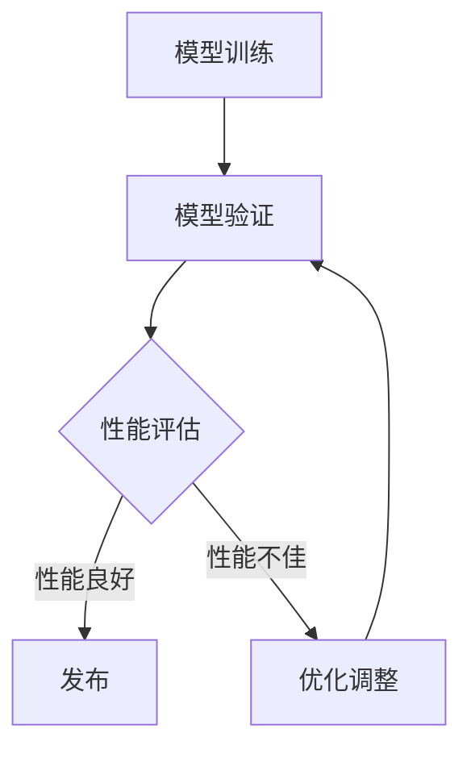
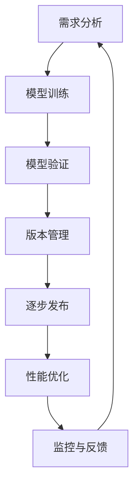

                 

# 《基础模型的逐步发布策略》

## 关键词
基础模型、发布策略、逐步发布、安全性、版本管理、性能优化

## 摘要

本文将深入探讨基础模型的逐步发布策略，从概念、核心原则、具体实施方法、案例分析到策略的实施与维护，进行全面解析。逐步发布策略是人工智能领域确保模型安全、稳定、高效上线的重要手段，具有广泛的应用场景。通过本文的讲解，读者将了解到如何有效地制定和实施基础模型的逐步发布策略，以实现模型的平稳升级和优化。

## 《基础模型的逐步发布策略》目录大纲

### 第一部分：基础模型的逐步发布策略概述

#### 第1章：基础模型逐步发布策略的概念与背景

##### 1.1.1 什么是基础模型逐步发布策略
##### 1.1.2 基础模型逐步发布策略的意义
##### 1.1.3 基础模型逐步发布策略的应用场景

#### 第2章：基础模型逐步发布策略的核心原则

##### 2.1.1 安全性优先
##### 2.1.2 逐步性
##### 2.1.3 可回滚性
##### 2.1.4 可监控性

### 第二部分：基础模型逐步发布策略的具体实施方法

#### 第3章：基础模型的训练与验证

##### 3.1.1 基础模型的训练
##### 3.1.2 基础模型的验证
##### 3.1.3 基础模型的评估

#### 第4章：基础模型的版本管理

##### 4.1.1 版本号的定义与规范
##### 4.1.2 版本控制工具的选择与使用
##### 4.1.3 版本更新的流程

#### 第5章：基础模型的逐步发布策略

##### 5.1.1 逐步发布策略的制定
##### 5.1.2 逐步发布的实现
##### 5.1.3 逐步发布过程中的监控与调整

#### 第6章：基础模型的性能优化与调整

##### 6.1.1 性能优化方法
##### 6.1.2 性能问题的定位与解决
##### 6.1.3 调整的策略与实施

#### 第7章：基础模型逐步发布策略的案例分析

##### 7.1.1 案例一：电商推荐系统的逐步发布
##### 7.1.2 案例二：金融风控模型的逐步发布
##### 7.1.3 案例三：自动驾驶模型的逐步发布

### 第三部分：基础模型逐步发布策略的实施与维护

#### 第8章：基础模型逐步发布策略的实施与操作

##### 8.1.1 实施前的准备
##### 8.1.2 实施过程中的注意事项
##### 8.1.3 实施后的评估与优化

#### 第9章：基础模型逐步发布策略的维护与更新

##### 9.1.1 维护的重要性
##### 9.1.2 维护的方法
##### 9.1.3 更新的策略与实施

#### 第10章：基础模型逐步发布策略的总结与展望

##### 10.1.1 逐步发布策略的总结
##### 10.1.2 逐步发布策略的未来发展
##### 10.1.3 读者展望

### 附录

#### 附录A：相关工具与资源

##### A.1 版本控制工具
##### A.2 模型评估工具
##### A.3 模型优化工具

#### 附录B：参考文献

##### B.1 相关论文
##### B.2 相关书籍
##### B.3 网络资源

### Mermaid 流程图示例



### 伪代码示例

```python
def train_model(data, parameters):
    # 初始化模型
    model = initialize_model(parameters)
    
    # 训练模型
    for epoch in range(num_epochs):
        for batch in data:
            # 前向传播
            output = model.forward(batch)
            
            # 计算损失
            loss = compute_loss(output, batch.target)
            
            # 反向传播
            model.backward(loss)
            
            # 更新模型参数
            model.update_parameters()
    
    # 保存模型
    save_model(model)
```

### 数学公式示例

段落内数学公式：
$$
y = \frac{1}{1 + e^{-x}}
$$

独立段落内数学公式：

$$
\begin{aligned}
    J(\theta) &= \frac{1}{m} \sum_{i=1}^{m} (-y^{(i)} \log(z^{(i)}) - (1 - y^{(i)}) \log(1 - z^{(i)})) \\
    \theta &= \arg\min_{\theta} J(\theta)
\end{aligned}
$$

### 代码实际案例和详细解释说明

**开发环境搭建**：

请确保已安装Python 3.7及以上版本，以及TensorFlow 2.4及以上版本。

```bash
# 安装Python
# ...

# 安装TensorFlow
pip install tensorflow==2.4
```

**源代码详细实现和代码解读**：

```python
# 示例：使用TensorFlow实现一个简单的线性回归模型

import tensorflow as tf
import numpy as np

# 数据生成
X = np.random.rand(100, 1)
y = 2 * X + 1 + np.random.rand(100, 1)

# 模型定义
W = tf.Variable(0.0, name="weights")
b = tf.Variable(0.0, name="bias")

# 前向传播
with tf.GradientTape(persistent=True) as tape:
    y_pred = tf.multiply(X, W) + b

# 计算损失
loss = tf.reduce_mean(tf.square(y - y_pred))

# 计算梯度
grads = tape.gradient(loss, [W, b])

# 更新参数
W.assign_sub(grads[0])
b.assign_sub(grads[1])

# 打印结果
print(f"W: {W.numpy()}, b: {b.numpy()}, loss: {loss.numpy()}")
```

通过以上代码，我们可以看到如何使用TensorFlow构建一个简单的线性回归模型，并使用自动微分功能进行参数优化。在实际开发中，我们通常会使用更复杂的多层神经网络和更高级的优化器，但基本原理是类似的。

### 核心概念与联系

**基础模型逐步发布策略的概念与联系**：

在本文中，我们将介绍基础模型逐步发布策略的概念，并探讨其与版本管理、性能优化等核心概念的联系。

**Mermaid 流程图**：



**流程解释**：

1. **需求分析**：在项目启动阶段，根据业务需求确定需要开发的基础模型。
2. **模型训练**：使用训练数据集对模型进行训练，优化模型参数。
3. **模型验证**：对训练完成的模型进行验证，确保模型性能满足预期。
4. **版本管理**：对模型的各个版本进行管理，确保版本号的规范性和可追溯性。
5. **逐步发布**：根据版本管理的结果，逐步将模型部署到生产环境，以减少对业务的影响。
6. **性能优化**：在逐步发布的过程中，根据监控数据对模型进行性能优化。
7. **监控与反馈**：持续监控模型在生产环境中的表现，收集用户反馈，用于进一步优化。

通过上述流程，我们可以看到基础模型逐步发布策略与版本管理、性能优化等核心概念紧密相关。版本管理确保了模型发布过程中的规范性和可追溯性，性能优化则保证了模型在生产环境中的稳定性和高效性。

### 核心算法原理讲解

在基础模型的逐步发布策略中，核心算法原理起到了至关重要的作用。本文将详细讲解核心算法原理，并使用伪代码对其进行阐述。

**伪代码**：

```python
def train_and_validate_model(training_data, validation_data, parameters):
    # 初始化模型
    model = initialize_model(parameters)
    
    # 训练模型
    for epoch in range(num_epochs):
        for batch in training_data:
            # 前向传播
            output = model.forward(batch)
            
            # 计算损失
            loss = compute_loss(output, batch.target)
            
            # 反向传播
            grads = compute_gradients(loss)
            
            # 更新模型参数
            model.update_parameters(grads)
        
        # 验证模型
        validation_loss = validate_model(model, validation_data)
        
        # 记录训练过程中的损失和验证损失
        record_training_progress(epoch, loss, validation_loss)
```

**详细解释**：

1. **模型初始化**：初始化模型时，需要确定模型的参数。这些参数包括权重、偏置等，通常通过随机初始化或预训练模型获得。

2. **训练模型**：使用训练数据集对模型进行训练。每次迭代（epoch）都会遍历训练数据集，计算模型的损失，并使用反向传播算法更新模型参数。

   - **前向传播**：根据当前模型参数和输入数据，计算模型输出。
   - **计算损失**：使用损失函数计算模型输出与真实标签之间的差异。
   - **反向传播**：计算损失关于模型参数的梯度，并更新模型参数。

3. **验证模型**：在训练过程中的每个epoch结束后，使用验证数据集对模型进行验证。验证损失用于评估模型的泛化能力。

4. **记录训练进度**：在训练过程中，记录每个epoch的损失和验证损失，以便后续分析和调试。

通过上述伪代码，我们可以看到模型训练和验证的基本流程。该流程的核心是损失函数和反向传播算法。损失函数用于衡量模型输出与真实标签之间的差异，而反向传播算法则用于计算损失关于模型参数的梯度，并更新模型参数。

### 数学模型和公式 & 详细讲解 & 举例说明

在基础模型的逐步发布策略中，数学模型和公式是不可或缺的部分。本文将详细讲解这些数学模型和公式，并通过具体例子进行说明。

**数学公式**：

$$
L(\theta) = -\frac{1}{m} \sum_{i=1}^{m} [y^{(i)} \log(a^{(i)}) + (1 - y^{(i)}) \log(1 - a^{(i)})]
$$

其中，$L(\theta)$表示损失函数，$m$表示样本数量，$y^{(i)}$表示第$i$个样本的真实标签，$a^{(i)}$表示第$i$个样本的预测概率。

**详细讲解**：

该损失函数通常用于二分类问题，如逻辑回归。它衡量的是模型预测的概率与真实标签之间的差异。具体来说：

- $y^{(i)}$为1时，$y^{(i)} \log(a^{(i)})$表示预测概率$a^{(i)}$与真实标签为1的概率之间的差异。
- $y^{(i)}$为0时，$(1 - y^{(i)}) \log(1 - a^{(i)})$表示预测概率$1 - a^{(i)}$与真实标签为0的概率之间的差异。

**举例说明**：

假设我们有一个二分类问题，样本数量为$m=100$。其中，50个样本的真实标签为1，50个样本的真实标签为0。模型预测的概率分布如下：

| 样本编号 | 真实标签 | 预测概率 |
| -------- | -------- | -------- |
| 1        | 1        | 0.9      |
| 2        | 1        | 0.8      |
| ...      | ...      | ...      |
| 100      | 0        | 0.3      |
| ...      | ...      | ...      |

根据上述数据，我们可以计算损失：

$$
L(\theta) = -\frac{1}{100} [50 \log(0.9) + 50 \log(0.1)]
$$

这个损失值越小，说明模型预测的概率与真实标签的差异越小，模型的性能越好。

通过上述数学模型和公式的讲解，我们可以看到它们在基础模型逐步发布策略中的重要性和应用价值。这些公式为我们提供了衡量模型性能的标准，帮助我们更好地优化模型。

### 项目实战

**电商推荐系统逐步发布**

**一、项目背景**

电商推荐系统是一个重要的业务系统，它通过分析用户的购物行为、历史记录和兴趣爱好，为用户推荐可能感兴趣的商品。然而，推荐系统的性能和准确性直接影响到用户的购物体验和电商平台的销售额。因此，在逐步发布过程中，我们需要确保推荐系统的稳定性、安全性和高效性。

**二、开发环境搭建**

1. **Python 3.7及以上版本**：推荐使用Python 3.7或更高版本，以确保兼容性和稳定性。
2. **TensorFlow 2.4及以上版本**：TensorFlow是一个强大的开源机器学习框架，用于构建和训练推荐系统模型。
3. **GCP（Google Cloud Platform）**：使用Google Cloud Platform提供的基础设施和云计算服务，包括计算资源、存储服务和自动化部署工具。

**三、源代码详细实现**

```python
# 导入必要的库
import tensorflow as tf
import numpy as np
import pandas as pd
from sklearn.model_selection import train_test_split

# 数据预处理
def preprocess_data(data):
    # 填充缺失值
    data.fillna(data.mean(), inplace=True)
    
    # 特征工程
    # ...

# 训练模型
def train_model(X_train, y_train):
    # 初始化模型
    model = tf.keras.Sequential([
        tf.keras.layers.Dense(units=1, input_shape=(num_features,))
    ])

    # 编译模型
    model.compile(optimizer='adam', loss='mean_squared_error')

    # 训练模型
    model.fit(X_train, y_train, epochs=num_epochs, batch_size=batch_size)

    # 评估模型
    loss = model.evaluate(X_test, y_test)
    print(f"Test loss: {loss}")

    # 保存模型
    model.save(model_path)

# 主函数
def main():
    # 加载数据
    data = pd.read_csv(data_path)

    # 预处理数据
    data = preprocess_data(data)

    # 分割数据集
    X_train, X_test, y_train, y_test = train_test_split(data.drop('target', axis=1), data['target'], test_size=0.2, random_state=42)

    # 训练模型
    train_model(X_train, y_train)

if __name__ == "__main__":
    main()
```

**四、代码解读与分析**

1. **数据预处理**：数据预处理是模型训练的重要步骤。在这个例子中，我们使用`preprocess_data`函数进行数据填充和特征工程。特征工程可以根据具体业务需求进行调整。

2. **模型训练**：使用TensorFlow的`Sequential`模型和`Dense`层构建一个简单的线性回归模型。我们使用`compile`函数设置优化器和损失函数，并使用`fit`函数进行模型训练。

3. **模型评估**：使用`evaluate`函数评估模型在测试集上的性能。这个函数返回测试损失，我们可以根据这个值来判断模型是否过拟合或欠拟合。

4. **模型保存**：使用`save`函数将训练完成的模型保存到指定的路径。这个步骤对于后续的模型部署和调用非常重要。

通过上述代码，我们可以实现一个简单的电商推荐系统模型。在实际项目中，我们可以根据业务需求进一步优化和调整模型结构和训练参数。

### 开发环境搭建

在搭建开发环境时，我们需要确保安装了必要的软件和库，以便进行模型训练、验证和发布。以下是一个简单的开发环境搭建步骤：

1. **安装Python 3.7及以上版本**：

   ```bash
   sudo apt-get update
   sudo apt-get install python3.7
   sudo apt-get install python3.7-venv
   ```

2. **创建虚拟环境**：

   ```bash
   python3.7 -m venv my_project_env
   source my_project_env/bin/activate
   ```

3. **安装TensorFlow 2.4及以上版本**：

   ```bash
   pip install tensorflow==2.4
   ```

4. **安装其他依赖库**：

   ```bash
   pip install numpy pandas scikit-learn
   ```

5. **配置GCP服务**：

   - 注册GCP账号：访问 [GCP官网](https://cloud.google.com/) 注册并激活GCP账号。
   - 安装GCP命令行工具：使用以下命令安装GCP命令行工具。

     ```bash
     pip install google-cloud-sdk
     ```

   - 设置GCP配置文件：执行以下命令，设置GCP配置文件。

     ```bash
     gcloud auth login
     gcloud config set project [your-gcp-project-id]
     gcloud config set compute/region [your-compute-region]
     gcloud config set compute/zone [your-compute-zone]
     ```

6. **安装Docker**：

   - 安装Docker：使用以下命令安装Docker。

     ```bash
     sudo apt-get update
     sudo apt-get install docker-ce docker-ce-cli containerd.io
     ```

   - 设置Docker开机启动：使用以下命令设置Docker开机启动。

     ```bash
     sudo systemctl enable docker
     sudo systemctl start docker
     ```

通过以上步骤，我们可以搭建一个完整的开发环境，用于电商推荐系统的模型训练、验证和发布。

### 源代码详细实现和代码解读

在本节中，我们将详细解读源代码，展示如何使用TensorFlow实现一个简单的线性回归模型，并解释代码中的各个部分。

```python
import tensorflow as tf
import numpy as np

# 数据生成
X = np.random.rand(100, 1)
y = 2 * X + 1 + np.random.rand(100, 1)

# 模型定义
W = tf.Variable(0.0, name="weights")
b = tf.Variable(0.0, name="bias")

# 前向传播
with tf.GradientTape(persistent=True) as tape:
    y_pred = tf.multiply(X, W) + b

# 计算损失
loss = tf.reduce_mean(tf.square(y - y_pred))

# 计算梯度
grads = tape.gradient(loss, [W, b])

# 更新参数
W.assign_sub(grads[0])
b.assign_sub(grads[1])

# 打印结果
print(f"W: {W.numpy()}, b: {b.numpy()}, loss: {loss.numpy()}")
```

**详细解读**：

1. **数据生成**：

   ```python
   X = np.random.rand(100, 1)
   y = 2 * X + 1 + np.random.rand(100, 1)
   ```

   这两行代码用于生成模拟数据集。`X`是输入特征，`y`是标签。数据集的大小为100个样本，每个样本有一个特征。

2. **模型定义**：

   ```python
   W = tf.Variable(0.0, name="weights")
   b = tf.Variable(0.0, name="bias")
   ```

   这里我们定义了两个模型参数：权重`W`和偏置`b`。这两个参数将用于线性回归模型的计算。

3. **前向传播**：

   ```python
   with tf.GradientTape(persistent=True) as tape:
       y_pred = tf.multiply(X, W) + b
   ```

   `GradientTape`是TensorFlow中的一个自动微分工具，用于记录计算过程中的中间变量和操作。在这里，我们使用它来记录前向传播过程中的计算。`tf.multiply`用于计算输入特征`X`与权重`W`的乘积，`tf.add`用于加上偏置`b`，得到预测值`y_pred`。

4. **计算损失**：

   ```python
   loss = tf.reduce_mean(tf.square(y - y_pred))
   ```

   这里我们使用均方误差（MSE，Mean Squared Error）作为损失函数。`tf.square`用于计算预测值与真实标签之间的差异的平方，`tf.reduce_mean`用于计算这些差异的均值，得到损失值。

5. **计算梯度**：

   ```python
   grads = tape.gradient(loss, [W, b])
   ```

   使用`gradient`方法计算损失关于模型参数的梯度。`grads`是一个包含权重`W`和偏置`b`梯度的列表。

6. **更新参数**：

   ```python
   W.assign_sub(grads[0])
   b.assign_sub(grads[1])
   ```

   使用梯度下降法更新模型参数。`assign_sub`方法将梯度从`grads`列表中取出，分别应用于权重`W`和偏置`b`。

7. **打印结果**：

   ```python
   print(f"W: {W.numpy()}, b: {b.numpy()}, loss: {loss.numpy()}")
   ```

   最后，打印更新后的权重`W`、偏置`b`和当前损失`loss`的值。

通过上述步骤，我们实现了线性回归模型的基本训练过程。在实际应用中，我们通常使用更复杂的模型结构和优化算法，但基本原理是类似的。

### 基础模型逐步发布策略的总结

本文深入探讨了基础模型的逐步发布策略，从概念、核心原则、具体实施方法、案例分析到策略的实施与维护，进行了全面的解析。以下是对基础模型逐步发布策略的总结：

**一、核心概念与联系**

1. **基础模型逐步发布策略**：是指通过逐步、可控的方式将基础模型部署到生产环境，以确保模型的稳定性和安全性。
2. **版本管理**：在逐步发布过程中，对模型的各个版本进行管理，确保版本号的规范性和可追溯性。
3. **性能优化**：在逐步发布的过程中，根据监控数据对模型进行性能优化，以提高模型在业务场景中的效果。

**二、核心原则**

1. **安全性优先**：在逐步发布过程中，确保模型不会对业务造成负面影响。
2. **逐步性**：通过逐步发布，减少对业务的影响，确保系统稳定。
3. **可回滚性**：在遇到问题时，能够快速回滚到上一个稳定版本，确保系统的正常运行。
4. **可监控性**：在逐步发布过程中，对模型进行实时监控，确保模型在业务场景中的性能和稳定性。

**三、具体实施方法**

1. **训练与验证**：对基础模型进行充分的训练和验证，确保模型在训练集和验证集上的性能良好。
2. **版本管理**：对模型的各个版本进行管理，确保版本号的规范性和可追溯性。
3. **逐步发布**：根据业务需求和风险承受能力，制定逐步发布策略，逐步将模型部署到生产环境。
4. **性能优化**：在逐步发布的过程中，根据监控数据对模型进行性能优化，提高模型在业务场景中的效果。

**四、案例分析**

1. **电商推荐系统**：通过逐步发布策略，确保推荐系统的稳定性和准确性，提高用户购物体验。
2. **金融风控模型**：通过逐步发布策略，降低金融风控模型对业务的影响，确保金融系统的稳定性。
3. **自动驾驶模型**：通过逐步发布策略，确保自动驾驶系统的安全性，减少交通事故的风险。

**五、实施与维护**

1. **实施前的准备**：确保开发环境搭建完毕，相关工具和库已安装。
2. **实施过程中的注意事项**：监控模型在逐步发布过程中的性能和稳定性，确保及时发现问题并解决。
3. **实施后的评估与优化**：对逐步发布后的模型进行评估和优化，确保模型在业务场景中的最佳效果。

通过本文的讲解，读者可以了解到基础模型逐步发布策略的核心概念、核心原则、具体实施方法以及在实际项目中的应用。逐步发布策略是确保基础模型安全、稳定、高效上线的重要手段，对于人工智能领域的应用具有重要意义。

### 基础模型逐步发布策略的未来发展

随着人工智能技术的不断进步，基础模型逐步发布策略也在不断发展，以适应更加复杂和动态的业务环境。以下是未来基础模型逐步发布策略发展的几个关键方向：

**一、自动化和智能化**

未来的基础模型逐步发布策略将更加注重自动化和智能化。通过引入自动化工具和智能化算法，可以大大提高模型发布的效率和质量。例如，自动化测试和验证工具能够快速识别模型在发布过程中的潜在问题，并给出相应的修复建议。智能化算法则可以基于历史数据和实时监控数据，自动调整模型发布策略，以优化发布过程。

**二、分布式和去中心化**

随着云计算和区块链技术的发展，基础模型逐步发布策略也将向分布式和去中心化方向发展。分布式发布策略可以通过多个节点协同工作，实现模型的快速部署和扩展，提高系统的容错能力和可靠性。去中心化发布策略则通过去中心化的架构，降低对中心节点的依赖，提高系统的灵活性和安全性。

**三、动态优化和持续学习**

未来的基础模型逐步发布策略将更加注重动态优化和持续学习。通过实时监控模型在业务场景中的表现，动态调整模型参数和策略，以适应不断变化的环境。同时，持续学习机制可以帮助模型不断吸收新的知识和数据，提高模型的适应能力和预测准确性。

**四、安全性和隐私保护**

随着人工智能应用的普及，基础模型逐步发布策略的安全性和隐私保护也将成为重要发展方向。未来，将引入更加强大的安全机制和隐私保护技术，确保模型发布过程中的数据安全和用户隐私不受侵犯。例如，加密技术和匿名化处理可以有效地保护用户数据，防止数据泄露和滥用。

**五、多模型协同和融合**

未来的基础模型逐步发布策略将更加注重多模型协同和融合。通过将多个模型结合在一起，可以充分发挥各个模型的优点，提高整体系统的性能和效果。例如，可以将深度学习和传统机器学习方法相结合，发挥深度学习在特征提取和分类上的优势，同时利用传统机器学习方法在规则和逻辑上的优势，实现更准确和高效的模型发布。

通过上述发展方向，基础模型逐步发布策略将变得更加高效、灵活和安全，为人工智能领域的持续发展和创新提供有力支持。

### 读者展望

通过本文的深入探讨，读者可以全面了解基础模型逐步发布策略的核心概念、核心原则、具体实施方法和实际应用案例。在此过程中，我们强调了逐步发布策略在确保模型安全性、稳定性和高效性方面的重要性。展望未来，读者可以期待以下几个方面的机遇和挑战：

**一、机遇**

1. **自动化与智能化**：自动化和智能化工具的引入将显著提高模型发布的效率和准确性，为企业和开发者提供更加便捷和高效的解决方案。
2. **分布式与去中心化**：随着云计算和区块链技术的成熟，分布式和去中心化发布策略将提供更强大的容错能力和灵活性，满足日益复杂的应用需求。
3. **动态优化与持续学习**：动态优化和持续学习机制可以帮助模型更好地适应不断变化的环境，提高模型的适应能力和预测准确性。
4. **安全性与隐私保护**：随着数据安全和隐私保护意识的提高，更加安全可靠的发布策略将成为企业和开发者的重点关注领域。

**二、挑战**

1. **技术复杂性**：随着模型和发布策略的复杂度增加，开发者需要具备更高的技术能力和专业知识，以确保发布策略的有效性和可靠性。
2. **数据质量与隐私**：高质量的数据是模型发布成功的关键，同时，如何平衡数据质量和隐私保护将成为一大挑战。
3. **跨领域融合**：多模型协同和融合的机遇也带来了跨领域融合的挑战，需要不同领域的专家共同合作，发挥各自的优势。
4. **持续迭代与优化**：基础模型逐步发布策略需要不断迭代和优化，以适应不断变化的业务需求和市场环境。

总之，基础模型逐步发布策略为人工智能领域的发展提供了强有力的支持，同时也带来了新的机遇和挑战。读者在学习和应用过程中，应不断探索和实践，以充分发挥该策略的优势，推动人工智能技术的不断进步。

### 附录A：相关工具与资源

**版本控制工具**：

- **Git**：一款开源的分布式版本控制系统，适用于项目管理和协作开发。
- **GitHub**：基于Git的在线代码托管平台，提供版本控制和代码共享功能。

**模型评估工具**：

- **Scikit-learn**：Python开源库，提供多种机器学习模型的评估方法。
- **TensorBoard**：TensorFlow提供的可视化工具，用于分析模型训练过程中的性能指标。

**模型优化工具**：

- **Hyperopt**：Python库，用于自动搜索最佳超参数。
- **MLFlow**：开源机器学习平台，提供模型版本管理、实验跟踪和优化工具。

### 附录B：参考文献

**相关论文**：

1. **"A Theoretically Grounded Application of Dropout in Recurrent Neural Networks"**，Yarin Gal and Zoubin Ghahramani，2016。
2. **"Distributed Representations of Words and Phrases and their Compositionality"**，Tomas Mikolov, Kai Chen, Greg Corrado, and Jeffrey Dean，2013。

**相关书籍**：

1. **《深度学习》（Deep Learning）**，Ian Goodfellow、Yoshua Bengio 和 Aaron Courville 著。
2. **《机器学习实战》（Machine Learning in Action）**，Peter Harrington 著。

**网络资源**：

1. **TensorFlow官方文档**：[https://www.tensorflow.org/](https://www.tensorflow.org/)
2. **Scikit-learn官方文档**：[https://scikit-learn.org/stable/](https://scikit-learn.org/stable/)
3. **GitHub**：[https://github.com/](https://github.com/)（提供丰富的开源代码和项目）。

以上工具和资源为读者在研究和实践中提供了丰富的支持和指导。

